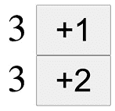
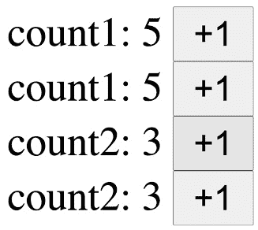

# 第四章：通过订阅共享模块状态

在上一章中，我们学习了如何使用 Context 实现全局状态。正如讨论的那样，Context 并非为单例模式而设计；它是一个避免单例模式并提供不同子树不同值的机制。对于类似全局状态的单例，使用模块状态更有意义，因为它在内存中是一个单例值。本章的目标是学习如何使用 React 中的模块状态。它比 Context 少为人知，但经常用于集成现有的模块状态。

什么是模块状态？

模块状态的严格定义是一些在 **ECMAScript** （**ES**） 模块作用域中定义的常量或变量。在这本书中，我们并不遵循严格的定义。你可以简单地假设模块状态是一个在全局范围内或在文件作用域内定义的变量。

我们将探讨如何在 React 中将模块状态用作全局状态。为了在 React 组件中使用模块状态，我们使用订阅机制。

在本章中，我们将涵盖以下主题：

+   探索模块状态

+   在 React 中使用模块状态作为全局状态

+   添加基本订阅

+   使用选择器和 `useSubscription`

# 技术要求

预期你具备一定的 React 知识，包括 React Hooks。请参考官方网站 [`reactjs.org`](https://reactjs.org) 了解更多信息。

在某些代码中，我们使用 TypeScript ([`www.typescriptlang.org`](https://www.typescriptlang.org))，你应该对此有基本的了解。

本章的代码可在 GitHub 上找到：

[`github.com/PacktPublishing/Micro-State-Management-with-React-Hooks/tree/main/chapter_04`](https://github.com/PacktPublishing/Micro-State-Management-with-React-Hooks/tree/main/chapter_04)

要运行代码片段，你需要一个 React 环境，例如，Create React App ([`create-react-app.dev`](https://create-react-app.dev)) 或 CodeSandbox ([`codesandbox.io`](https://codesandbox.io))。

# 探索模块状态

模块状态是在模块级别定义的变量。这里的 **Module** 指的是 ES 模块或只是一个文件。为了简化，我们假设在函数外部定义的变量是模块状态。

例如，让我们定义 `count` 状态：

```js
let count = 0;
```

假设这是在模块中定义的，这是一个模块状态。

通常，使用 React，我们希望有一个对象状态。以下定义了一个包含 `count` 的对象状态：

```js
let state = {
  count: 0,
};
```

可以向对象添加更多属性。嵌套对象也是可能的。

现在，让我们定义函数来访问这个模块状态。`getState` 是一个读取 `state` 的函数，而 `setState` 是一个写入 `state` 的函数：

```js
export const getState = () => state;
export const setState = (nextState) => {
  state = nextState;
};
```

注意，我们为这些函数添加了 `export`，以表达它们预期将在模块外部使用。

在 React 中，我们经常使用函数更新状态。让我们修改 `setState` 以允许使用 `function` 更新：

```js
export const setState = (nextState) => {
  state = typeof nextState === 'function'
    ? nextState(state) : nextState;
};
```

你可以使用以下方式使用函数更新：

```js
setState((prevState) => ({
  ...prevState,
  count: prevState.count + 1
}));
```

我们可以直接定义模块状态，而不是创建一个用于创建包含 `state` 和一些访问函数的容器的函数。

以下是这样函数的具体实现：

```js
export const createContainer = (initialState) => {
  let state = initialState;
  const getState = () => state;
  const setState = (nextState) => {
    state = typeof nextState === 'function'
      ? nextState(state) : nextState;
  };
  return { getState, setState };
};
```

你可以这样使用它：

```js
import { createContainer } from '...';
const { getState, setState } = createContainer({
  count: 0
});
```

到目前为止，模块状态与 React 没有任何关系。在下一节中，我们将学习如何使用模块状态与 React 一起使用。

# 在 React 中使用模块状态作为全局状态

正如我们在 *第三章* 中讨论的，*使用 Context 共享组件状态*，React Context 被设计为为不同的子树提供不同的值。使用 React Context 来实现单例全局状态是一个有效的操作，但它没有使用 Context 的全部功能。

如果你需要一个整个树的全球状态，模块状态可能更适合。然而，要在 React 组件中使用模块状态，我们需要自己处理重新渲染。

让我们从简单的例子开始。不幸的是，这是一个无效的例子：

```js
let count = 0;
const Component1 = () => {
  const inc = () => {
    count += 1;
  }
  return (
    <div>{count} <button onClick={inc}>+1</button></div>
  );
};
```

你会在开始时看到 `count` 为 `0`。点击 `button` 会增加 `count` 变量，但它不会触发组件重新渲染。

在撰写这本书的时候，React 只有 `useState` 和 `useReducer` 两个 hooks 来触发重新渲染。我们需要使用这两个中的一个来使组件具有模块状态的反应性。

以下是对前一个示例的修改：

```js
let count = 0;
const Component1 = () => {
  const [state, setState] = useState(count);
  const inc = () => {
    count += 1;
    setState(count);
  }
  return (
    <div>{state} <button onClick={inc}>+1</button></div>
  );
};
```

现在，如果你点击 `button`，它将增加 `count` 变量，并触发组件。

让我们看看如果我们有另一个如下所示的组件会发生什么：

```js
const Component2 = () => {
  const [state, setState] = useState(count);
  const inc2 = () => {
    count += 2;
    setState(count);
  }
  return (
    <div>{state} <button onClick={inc2}>+2</button></div>
  );
};
```

即使你在 `Component1` 中点击 `button`，它也不会触发 `Component2` 重新渲染。只有当你点击 `Component2` 中的 `button` 时，它才会重新渲染并显示最新的模块状态。这是 `Component1` 和 `Component2` 之间的不一致，我们的期望是两个组件都应该显示相同的值。两个 `Component1` 组件之间也会发生这种不一致。

解决这个问题的天真方法是同时在 `Component1` 和 `Component2` 中调用 `setState` 函数。这需要在模块级别拥有 `setState` 函数。我们还应该考虑组件的生命周期，并使用 `useEffect` hook 来修改一个包含 `setState` 函数的集合，这些函数位于 React 之外。

以下是一个可能的解决方案示例。这是为了说明这个想法，并不非常实用：

```js
let count = 0;
const setStateFunctions =
  new Set<(count: number) => void>();
const Component1 = () => {
  const [state, setState] = useState(count);
  useEffect(() => {
    setStateFunctions.add(setState);
    return () => { setStateFunctions.delete(setState); };
  }, []);
  const inc = () => {
    count += 1;
    setStateFunctions.forEach((fn) => {
      fn(count);
    });
  }
  return (
    <div>{state} <button onClick={inc}>+1</button></div>
  );
};
```

注意我们在 `useEffect` 中返回一个函数来清理效果。在 `inc` 函数中，我们调用 `setStateFunctions` 集合中的所有 `setState` 函数。

现在，`Component2` 也会像 `Component1` 一样被修改：

```js
const Component2 = () => {
  const [state, setState] = useState(count);
  useEffect(() => {
    setStateFunctions.add(setState);
    return () => { setStateFunctions.delete(setState); };
  }, []);
  const inc2 = () => {
    count += 2;
    setStateFunctions.forEach((fn) => {
      fn(count);
    });
  }
  return (
    <div>{state} <button onClick={inc2}>+2</button></div>
  );
};
```

正如所提到的，这不是一个非常实用的解决方案。我们在 `Component1` 和 `Component2` 中有一些重复的代码。

在下一节中，我们将介绍一个订阅机制并减少重复的代码。

# 添加基本订阅

在这里，我们将了解订阅机制以及如何将模块状态连接到 React 状态。

订阅是一种获取通知的方式，例如更新。一个典型的订阅使用情况如下：

```js
const unsubscribe = store.subscribe(() => {
  console.log('store is updated');
});
```

在这里，我们假设一个`store`变量有一个`subscribe`方法，它接受一个`callback`函数并返回一个`unsubscribe`函数。

在这种情况下，预期的行为是每当`store`更新时，回调函数就会被调用，并显示控制台日志。

现在，让我们实现一个带有订阅的模块状态。我们将它称为`store`，它除了包含`state`值和`subscribe`方法外，还包括我们在*探索模块状态*部分中描述的`getState`和`setState`方法。`createStore`是一个函数，用于使用初始状态值创建`store`：

```js
type Store<T> = {
  getState: () => T;
  setState: (action: T | ((prev: T) => T)) => void;
  subscribe: (callback: () => void) => () => void;
};

const createStore = <T extends unknown>(
  initialState: T
): Store<T> => {
  let state = initialState;
  const callbacks = new Set<() => void>();
  const getState = () => state;
  const setState = (nextState: T | ((prev: T) => T)) => {
    state =
      typeof nextState === "function"
        ? (nextState as (prev: T) => T)(state)
        : nextState;
    callbacks.forEach((callback) => callback());
  };
  const subscribe = (callback: () => void) => {
    callbacks.add(callback);
    return () => {
      callbacks.delete(callback);
    };
  };
  return { getState, setState, subscribe };
}; 
```

与我们在*探索模块状态*部分中实现的`createContainer`函数相比，`createStore`有`subscribe`方法和`setState`方法，它调用回调。

我们如下使用`createStore`：

```js
import { createStore } from '...';
const store = createStore({ count: 0 });
console.log(store.getState());
store.setState({ count: 1 });
store.subscribe(...);
```

`store`变量在其内部持有`state`，整个`store`变量可以看作是一个模块状态。

接下来是`store`变量在 React 中的使用。

我们定义一个新的钩子`useStore`，它将返回一个包含`store`状态值及其更新函数的元组：

```js
const useStore = (store) => {
  const [state, setState] = useState(store.getState());
  useEffect(() => {
    const unsubscribe = store.subscribe(() => {
      setState(store.getState());
    });
    setState(store.getState()); // [1]
    return unsubscribe;
  }, [store]);
  return [state, store.setState];
};
```

你可能会在`useEffect`中看到一次`setState()`函数。这是因为`useEffect`是延迟的，并且有可能`store`已经有了新的状态。

下面的是一个带有`useStore`的组件：

```js
const Component1 = () => {                            
  const [state, setState] = useStore(store);  
  const inc = () => {
    setState((prev) => ({                       
      ...prev,
      count: prev.count + 1,                   
    }));                    
  };              
  return (                       
    <div>
      {state.count} <button onClick={inc}>+1</button>
    </div>                                 
  );               
};
```

重要的是要不可变地更新模块状态，就像 React 状态一样，因为模块状态最终会设置在 React 状态中：

与`Component1`类似，我们定义另一个，`Component2`，如下所示：

```js
const Component2 = () => {
  const [state, setState] = useStore(store);
  const inc2 = () => {
    setState((prev) => ({
      ...prev,
      count: prev.count + 2,
    }));
  };
  return (
    <div>
      {state.count} <button onClick={inc2}>+2</button>
    </div>
  );
};
```

两个组件中的两个按钮都会更新`store`中的模块状态和两个组件中的状态是共享的。

最后，我们定义`App`组件：

```js
const App = () => (
  <>
    <Component1 />
    <Component2 />
  </>
);
```

当你运行这个应用程序时，你会看到类似*图 4.1*的内容。如果你点击**+1**或**+2**按钮，你会看到两个计数（显示为**3**）一起更新：



图 4.1 – 运行中的应用程序截图

在本节中，我们使用订阅将模块状态连接到 React 组件。

在下一节中，我们将使用选择器函数仅使用状态的一部分，以及学习如何使用`useSubscription`。

# 使用选择器和 useSubscription 一起工作

我们在上一节中创建的`useStore`钩子返回一个整个状态对象。这意味着状态对象的任何小部分变化都会通知所有`useStore`钩子，这可能导致额外的重新渲染。

为了避免额外的重新渲染，我们可以引入一个选择器来返回组件感兴趣的状态的一部分。

让我们先开发`useStoreSelector`。

我们使用与上一节中定义的相同的`createStore`函数，并创建一个`store`变量，如下所示：

```js
const store = createStore({ count1: 0, count2: 0 });
```

`store`中的状态有两个计数器 – `count1`和`count2`。

`useStoreSelector` 钩子类似于 `useStore`，但它接收一个额外的选择器函数。它使用选择器函数来限定状态：

```js
const useStoreSelector = <T, S>(
  store: Store<T>,
  selector: (state: T) => S
) => {
  const [state, setState] =
    useState(() => selector(store.getState()));
  useEffect(() => {
    const unsubscribe = store.subscribe(() => {
      setState(selector(store.getState()));
    });
    setState(selector(store.getState()));
    return unsubscribe;
  }, [store, selector]);
  return state;
};
```

与 `useStore` 相比，`useStoreSelector` 中的 `useState` 钩子持有 `selector` 的返回值而不是整个状态。

现在我们定义一个组件来使用 `useStoreSelector`。`useStoreSelector` 的返回值是一个计数器。为了更新状态，在这种情况下我们直接调用 `store.setState()`。`Component1` 是一个用于在状态中显示 `count1` 的组件：

```js
const Component1 = () => {
  const state = useStoreSelector(
    store,
    useCallback((state) => state.count1, []),
  );
  const inc = () => {
    store.setState((prev) => ({
      ...prev,
      count1: prev.count1 + 1,
    }));
  };
  return (
    <div>
      count1: {state} <button onClick={inc}>+1</button>
    </div>
  );
};
```

注意我们需要使用 `useCallback` 来获取一个稳定的选择器函数。否则，由于选择器指定在 `useEffect` 的第二个参数中，每次 `Component1` 渲染时，`Component1` 将会订阅 `store` 变量。

我们定义 `Component2`，用于显示 `count2` 而不是 `count1`。我们定义一个选择器函数在组件外部以避免这次使用 `useCallback`：

```js
const selectCount2 = (
  state: ReturnType<typeof store.getState>
) => state.count2;
const Component2 = () => {
  const state = useStoreSelector(store, selectCount2);
  const inc = () => {
    store.setState((prev) => ({
      ...prev,
      count2: prev.count2 + 1,
    }));
  };
  return (
    <div>
      count2: {state} <button onClick={inc}>+1</button>
    </div>
  );
};
```

最后，`App` 组件为每个 `Component1` 组件和 `Component2` 组件渲染两个组件以进行演示：

```js
const App = () => (
  <>
    <Component1 />
    <Component1 />
    <Component2 />
    <Component2 />
  </>
);
```

*图 4.2* 是运行中的应用程序截图：



图 4.2 – 运行中的应用程序截图

前图中的前两行是由 `Component1` 渲染的。如果你点击前两个 `count1` 中的任何一个，这将触发 `Component1` 重新渲染。然而，`Component2`（图 4.2 中的最后两行）不会重新渲染，因为 `count2` 没有改变。

虽然 `useStoreSelector` 钩子工作良好且在生产环境中可用，但当 `store` 或 `selector` 发生变化时，有一个需要注意的问题。因为 `useEffect` 会在稍后触发，它将返回一个过时的状态值，直到重新订阅完成。我们可以自己修复它，但这需要一点技术知识。

幸运的是，React 团队为这种情况提供了一个官方的钩子。它被称为 `use-subscription` ([`www.npmjs.com/package/use-subscription`](https://www.npmjs.com/package/use-subscription) )。

让我们使用 `useSubscription` 重新定义 `useStoreSelector`。代码如下简单：

```js
const useStoreSelector = (store, selector) => useSubscription(
  useMemo(() => ({
    getCurrentValue: () => selector(store.getState()),
    subscribe: store.subscribe,
  }), [store, selector])
);
```

应用程序仍然可以使用这个更改运行。

我们可以避免在 `Component1` 中使用 `useStoreSelector` 钩子，并直接使用 `useSubscription`：

```js
const Component1 = () => {
  const state = useSubscription(useMemo(() => ({
    getCurrentValue: () => store.getState().count1,
    subscribe: store.subscribe,
  }), []));
  const inc = () => {
    store.setState((prev) => ({
      ...prev,
      count1: prev.count1 + 1,
    }));
  };
  return (
    <div>
      count1: {state} <button onClick={inc}>+1</button>
    </div>
  );
};
```

在这种情况下，因为已经使用了 `useMemo`，所以不需要 `useCallback`。

useSubscription 和 useSyncExternalStore

在 React 的未来版本中，将包含一个名为 `useSyncExternalStore` 的钩子。这是 `useSubscription` 的继任者。因此，使用模块状态将变得更加容易访问 ([`github.com/reactwg/react-18/discussions/86`](https://github.com/reactwg/react-18/discussions/86) )。

在本节中，我们学习了如何使用选择器来限定状态，以及官方的 `useSubscription` 钩子以获得更具体的解决方案。

# 摘要

在本章中，我们学习了如何创建模块状态并将其集成到 React 中。利用我们所学的内容，你可以将模块状态用作 React 中的全局状态。订阅在集成中扮演着重要的角色，因为它允许在模块状态改变时触发组件的重新渲染。除了在 React 中使用模块状态的基本订阅实现外，还有一个官方包。基本订阅和官方包都适用于生产环境的使用案例。

在下一章中，我们将学习实现全局状态的第三种模式，它是由第一种模式和第二种模式相结合而成的。
