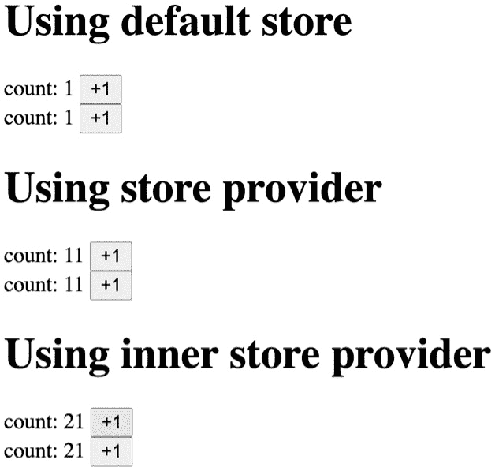

# 第五章: 使用上下文和订阅共享组件状态

在前两章中，我们学习了如何使用上下文和订阅来实现全局状态。每个都有不同的好处：上下文允许我们为不同的子树提供不同的值，而订阅可以防止额外的重新渲染。

在本章中，我们将学习一种新的方法：结合 React 上下文和订阅。这种结合将给我们带来各自的好处，这意味着：

+   上下文可以为子树提供一个全局状态，并且上下文提供者可以嵌套。上下文允许我们在 React 组件的生命周期中控制全局状态，就像`useState`钩子一样。

+   另一方面，订阅允许我们控制重新渲染，这是单个上下文无法实现的。

结合两者的好处可以是大应用的一个好解决方案——因为，如前所述，这意味着我们可以在不同的子树中拥有不同的值，我们还可以避免额外的重新渲染。

这种方法对于中等到大型应用很有用。在这些应用中，不同的子树可能具有不同的值，我们可以避免额外的重新渲染，这对我们的应用来说可能非常重要。

在本章中，我们将涵盖以下主题：

+   探索模块状态的局限性

+   理解何时使用上下文

+   实现上下文和订阅模式

# 技术要求

预期你具备一定的 React 知识，包括 React Hooks。请参考官方网站[`reactjs.org`](https://reactjs.org)以了解更多信息。

在某些代码中，我们使用 TypeScript ([`www.typescriptlang.org`](https://www.typescriptlang.org))，你应该对其有基本了解。

本章中的代码可在 GitHub 上找到：[`github.com/PacktPublishing/Micro-State-Management-with-React-Hooks/tree/main/chapter_05`](https://github.com/PacktPublishing/Micro-State-Management-with-React-Hooks/tree/main/chapter_05)。

要运行代码片段，你需要一个 React 环境，例如，Create React App ([`create-react-app.dev`](https://create-react-app.dev))或 CodeSandbox ([`codesandbox.io`](https://codesandbox.io))。

# 探索模块状态的局限性

因为模块状态位于 React 组件之外，存在一个限制：全局定义的模块状态是单例的，你不能为不同的组件树或子树有不同的状态。

让我们回顾一下*第四章*中关于*使用订阅共享模块状态*的`createStore`实现：

```js
const createStore = (initialState) => {
  let state = initialState;
  const callbacks = new Set();
  const getState = () => state;
  const setState = (nextState) => {
    state = typeof nextState === 'function'
      ? nextState(state) : nextState;
    callbacks.forEach((callback) => callback());
  };
  const subscribe =(callback) => {
    callbacks.add(callback);
    return () => { callbacks.delete(callback); };
  };
  return { getState, setState, subscribe };
};
```

使用这个`createStore`，让我们定义一个新的`store`。我们定义一个具有`count`属性的`store`：

```js
const store = createStore({ count: 0 });
```

注意，这个`store`是在 React 组件外部定义的。

要在 React 组件中使用`store`，我们使用`useStore`。以下是一个示例，其中包含两个组件，它们显示了来自同一`store`变量的共享计数。我们使用`useStore`，它是在*第四章*中定义的，*使用订阅共享模块状态*：

```js
const Counter = () => {
  const [state, setState] = useStore(store);
  const inc = () => {
    setState((prev) => ({                       
      ...prev,
      count: prev.count + 1,                   
    }));                    
  };              
  return (                       
    <div>
      {state.count} <button onClick={inc}>+1</button>
    </div>                                 
  );               
};
const Component = () => (
  <>
    <Counter />
    <Counter />
  </>
);
```

我们有一个`Counter`组件，用于在`store`对象中显示`count`数字，以及一个`button`来更新`count`值。由于这个`Counter`组件是可重用的，`Component`可以有两个`Counter`实例。这将显示一对共享相同状态的计数器。

现在，假设我们想显示另一对计数器。我们希望在`Component`中有两个新的组件，但新的一对应该显示与第一组不同的计数器。

让我们创建一个新的`count`值。我们可以在已经定义的`store`对象中添加一个新的属性，但我们假设还有其他属性，并希望隔离存储。因此，我们创建`store2`：

```js
const store2 = createStore({ count: 0 })
```

由于`createStore`是可重用的，创建一个新的`store2`对象很简单。

然后，我们需要创建组件来使用`store2`：

```js
const Counter2 = () => {
  const [state, setState] = useStore(store2);
  const inc = () => {
    setState((prev) => ({                       
      ...prev,
      count: prev.count + 1,                   
    }));                    
  };              
  return (                       
    <div>
      {state.count} <button onClick={inc}>+1</button>
    </div>                                 
  );               
};
const Component2 = () => (
  <>
    <Counter2 />
    <Counter2 />
  </>
);
```

你可能会注意到`Counter`和`Counter2`之间的相似性——它们都是 14 行代码，唯一的区别是它们引用的`store`变量——`Counter`使用`store`，而`Counter2`使用`store2`。我们需要`Counter3`或`Counter4`来支持更多的存储。理想情况下，`Counter`应该是可重用的。但是，由于模块状态是在 React 外部定义的，所以这是不可能的。这是模块状态的限制。

重要提示

你可能会注意到，如果我们把`store`放在`props`中，就可以使`Counter`组件可重用。然而，这将需要在组件深层嵌套时进行属性钻取，而引入模块状态的主要原因是避免属性钻取。

很好地重用`Counter`组件来为不同的存储提供支持。伪代码如下：

```js
const Component = () => (
  <StoreProvider>
    <Counter />
    <Counter />
  </StoreProvider>
);
const Component2 = () => (
  <Store2Provider>
    <Counter />
    <Counter />
  </Store2Provider>
);
const Component3 = () => (
  <Store3Provider>
    <Counter />
    <Counter />
  </Store3Provider>
);
```

如果你查看代码，你会注意到`Component`、`Component2`和`Component3`几乎相同。唯一的区别是`Provider`组件。这正是 React Context 发挥作用的地方。我们将在*实现上下文和订阅模式*部分详细讨论这一点。

现在你已经理解了模块状态的限制和多个存储的理想模式。接下来，我们将回顾 React Context 并探讨上下文的使用。

# 理解何时使用上下文

在深入学习如何结合上下文和订阅之前，让我们回顾一下上下文是如何工作的。

以下是一个简单的带有主题的 Context 示例。因此，我们为`createContext`指定一个默认值：

```js
const ThemeContext = createContext("light");
const Component = () => {
  const theme = useContext(ThemeContext);
  return <div>Theme: {theme}</div>
};
```

`useContext(ThemeContext)`返回的内容取决于组件树中的上下文。

要更改上下文值，我们使用 Context 中的`Provider`组件如下：

```js
<ThemeContext.Provider value="dark">
  <Component />
</ThemeContext.Provider>
```

在这种情况下，`Component`将显示主题为`dark`。

提供者可以嵌套。它将使用最内层提供者的值：

```js
<ThemeContext.Provider value="this value is not used">
  <ThemeContext.Provider value="this value is not used">
    <ThemeContext.Provider value="this is the value used">
      <Component />
    </ThemeContext.Provider>
  </ThemeContext.Provider>
</ThemeContext.Provider>
```

如果组件树中没有提供者，它将使用默认值。

例如，在这里，我们假设`Root`是一个根组件：

```js
const Root = () => (
  <>
    <Component />
  </>
);
```

在这种情况下，`Component`也将显示主题为`light`。

让我们看看一个示例，它有一个提供者在根处提供相同的默认值：

```js
const Root = () => (
  <ThemeContext.Provider value="light">
    <Component />
  </ThemeContext.Provider>
);
```

在这种情况下，`Component`也将显示主题为`light`。

因此，让我们讨论何时使用 Context。为此，考虑我们的示例：有提供者和没有提供者的这个示例之间有什么区别？我们可以这样说，没有区别。使用默认值会得到相同的结果。

为 Context 设置适当的默认值非常重要。Context 提供者可以被视为一种覆盖默认 Context 值或父提供者（如果存在）提供值的方法。

在 `ThemeContext` 的情况下，如果我们有适当的默认值，那么使用提供者的意义何在？将需要为整个组件树的一个子树提供不同的值。否则，我们只需使用 `Context` 的默认值。

对于使用 Context 的全局状态，你可能在根处只能使用一个提供者。这是一个有效的用例，但这个用例可以通过我们在*第四章* *使用 Subscription 共享模块状态*中学到的模块状态来覆盖。鉴于模块状态涵盖了根处只有一个 Context 提供者的用例，因此，如果需要为不同的子树提供不同的值，才需要全局状态的 Context。

在本节中，我们回顾了 React Context 的使用，并学习了何时使用它。接下来，我们将学习如何结合 Context 和 Subscription。

# 实现 Context 和 Subscription 模式

正如我们所学的，使用一个 Context 来传播全局状态值有一个限制：它会导致额外的重新渲染。

带有 Subscription 的模块状态没有这样的限制，但还有一个限制：它只为整个组件树提供一个值。

我们希望结合 Context 和 Subscription 来克服两者的限制。让我们实现这个功能。我们将从 `createStore` 开始。这正是我们在*第四章* *使用 Subscription 共享模块状态*中开发的实现：

```js
type Store<T> = {
  getState: () => T;
  setState: (action: T | ((prev: T) => T)) => void;
  subscribe: (callback: () => void) => () => void;
};

const createStore = <T extends unknown>(
  initialState: T
): Store<T> => {
  let state = initialState;
  const callbacks = new Set<() => void>();
  const getState = () => state;
  const setState = (nextState: T | ((prev: T) => T)) => {
    state =
      typeof nextState === "function"
        ? (nextState as (prev: T) => T)(state)
        : nextState;
    callbacks.forEach((callback) => callback());
  };
  const subscribe = (callback: () => void) => {
    callbacks.add(callback);
    return () => {
      callbacks.delete(callback);
    };
  };
  return { getState, setState, subscribe };
};
```

在*第四章* *使用 Subscription 共享模块状态*中，我们使用了 `createStore` 来处理模块状态。这次，我们将使用 `createStore` 来设置 `Context` 的值。

以下是为创建 Context 编写的代码。默认值传递给 `createContext`，我们将其称为默认存储：

```js
type State = { count: number; text?: string };

const StoreContext = createContext<Store<State>>(
  createStore<State>({ count: 0, text: "hello" })
);
```

在这种情况下，默认存储具有两个属性的状态：`count` 和 `text`。

为了为子树提供不同的存储，我们实现了 `StoreProvider`，它是对 `StoreContext.Provider` 的小型包装：

```js
const StoreProvider = ({
  initialState,
  children,
}: {
  initialState: State;
  children: ReactNode;
}) => {
  const storeRef = useRef<Store<State>>();
  if (!storeRef.current) {
    storeRef.current = createStore(initialState);
  }
  return (
    <StoreContext.Provider value={storeRef.current}>
      {children}
    </StoreContext.Provider>
  );
};
```

`useRef` 用于确保存储对象仅在第一次渲染时初始化一次。

要使用存储对象，我们实现了一个名为 `useSelector` 的钩子。与在 *第四章* 中 *使用选择器和 useSubscription* 部分定义的 `useStoreSelector` 不同，`useSelector` 不在其参数中接受 `store` 对象。它从 `StoreContext` 中获取 `store` 对象：

```js
const useSelector = <S extends unknown>(
  selector: (state: State) => S
) => {
  const store = useContext(StoreContext);
  return useSubscription(
    useMemo(
      () => ({
        getCurrentValue: () => selector(store.getState()),
        subscribe: store.subscribe,
      }),
      [store, selector]
    )
  );
};
```

将 `useContext` 与 `useSubscription` 结合使用是这种模式的关键点。这种组合使我们能够享受到 Context 和订阅的双重优势。

与模块状态不同，我们需要提供一种使用 Context 更新状态的方法。`useSetState` 是一个简单的钩子，用于在 `store` 中返回 `setState` 函数：

```js
const useSetState = () => {
  const store = useContext(StoreContext);
  return store.setState;
};
```

现在，让我们使用我们所实现的功能。以下是一个显示 `store` 中的 `count` 并带有用于增加 `count` 的 `button` 的组件。我们在 `Component` 外部定义 `selectCount`，否则我们需要用 `useCallback` 包装函数，这会引入额外的工作：

```js
const selectCount = (state: State) => state.count;
const Component = () => {
  const count = useSelector(selectCount);
  const setState = useSetState();
  const inc = () => {
    setState((prev) => ({
      ...prev,
      count: prev.count + 1,
    }));
  };
  return (
    <div>
      count: {count} <button onClick={inc}>+1</button>
    </div>
  );
};
```

这里需要注意的是，这个 `Component` 组件并不绑定到任何特定的存储对象。`Component` 组件可以用于不同的存储。

我们也可以在各个地方使用 `Component`：

+   在任何提供者外部

+   在第一个提供者内部

+   在第二个提供者内部

以下 `App` 组件在三个地方包含了 `Component` 组件：1) 在 `StoreProvider` 外面，2) 在第一个 `StoreProvider` 组件内部，以及 3) 在第二个嵌套的 `StoreProvider` 组件内部。不同 `StoreProvider` 组件中的 `Component` 组件共享不同的 `count` 值：

```js
const App = () => (
  <>
    <h1>Using default store</h1>
    <Component />
    <Component />
    <StoreProvider initialState={{ count: 10 }}>
      <h1>Using store provider</h1>
      <Component />
      <Component />
      <StoreProvider initialState={{ count: 20 }}>
        <h1>Using inner store provider</h1>
        <Component />
        <Component />
      </StoreProvider>
    </StoreProvider>
  </>
);
```

使用相同 `store` 对象的每个 `Component` 组件将共享 `store` 对象并显示相同的 `count` 值。在这种情况下，不同组件树级别的组件使用不同的 `store`，因此在不同位置显示不同的 `count` 值。当你运行这个应用程序时，你会看到以下内容：



图 5.1 – 运行中的应用程序截图

如果你点击 **使用默认存储** 中的 **+1** 按钮，你将看到 **使用默认存储** 中的两个计数器一起更新。如果你点击 **使用存储提供者** 中的 **+1** 按钮，你将看到 **使用存储提供者** 中的两个计数器一起更新。同样适用于 **使用内部存储提供者**。

在本节中，我们学习了如何利用 Context 和订阅实现全局状态，并利用相关的优势。由于 Context 的存在，我们可以将状态隔离在子树中，并且由于订阅的存在，我们可以避免额外的重新渲染。

# 摘要

在本章中，我们学习了一种新的方法：结合 React Context 和 Subscription。这种方法提供了两者的好处：在子树中提供隔离的值，并避免额外的重新渲染。这种方法对于中等到大型应用非常有用。在这些应用中，不同的子树可能具有不同的值，我们可以避免额外的重新渲染，这对我们的应用可能非常重要。

从下一章开始，我们将深入探讨各种全局状态库。我们将学习这些库是如何基于我们迄今为止所学的内容构建的。
