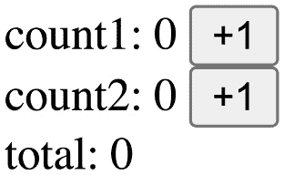
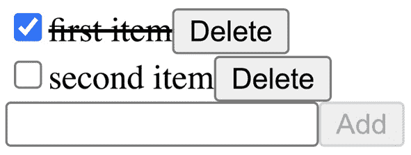
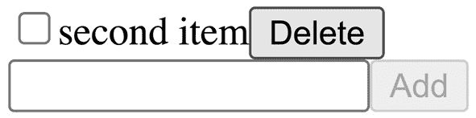

# 第七章：用例场景 1 – Zustand

到目前为止，我们已经探索了一些可以用来在 React 中实现全局状态的基本模式。在本章中，我们将学习一个公开作为包提供的真实实现，称为 Zustand。

Zustand ([`github.com/pmndrs/zustand`](https://github.com/pmndrs/zustand)) 是一个主要用于为 React 创建模块状态的微型库。它基于不可变更新模型，其中状态对象不能被修改，但必须始终创建新的对象。渲染优化是通过选择器手动完成的。它提供了一个简单而强大的 `store` 创建接口。

在本章中，我们将探讨模块状态和订阅的使用，并查看库 API 的样子。

在本章中，我们将涵盖以下主题：

+   理解模块状态和不可变状态

+   添加 React hooks 以优化重新渲染

+   处理读取状态和更新状态

+   处理结构化数据

+   此方法和库的优缺点

# 技术要求

预期您对 React 有一定的了解，包括 React hooks。请参考官方网站 [`reactjs.org`](https://reactjs.org) 了解更多信息。

在本章的一些代码中，我们将使用 TypeScript ([`www.typescriptlang.org`](https://www.typescriptlang.org))，因此您应该对其有基本了解。

本章中的代码可在 GitHub 上找到 [`github.com/PacktPublishing/Micro-State-Management-with-React-Hooks/tree/main/chapter_07`](https://github.com/PacktPublishing/Micro-State-Management-with-React-Hooks/tree/main/chapter_07)。

要运行本章中的代码片段，您需要一个 React 环境，例如 Create React App ([`create-react-app.dev`](https://create-react-app.dev)) 或 CodeSandbox ([`codesandbox.io`](https://codesandbox.io))。

在撰写本文时，Zustand 的当前版本是 v3。未来的版本可能会提供一些不同的 API。

# 理解模块状态和不可变状态

Zustand 是一个用于创建包含状态的 `store` 的库。它主要用于模块状态，这意味着您在模块中定义此 `store` 并导出它。它基于不可变状态模型，其中不允许修改状态对象属性。更新状态必须通过创建新对象来完成，而未修改的状态对象必须被重用。不可变状态模型的好处是，您只需检查状态对象的引用等价性即可知道是否有任何更新；您不需要深入检查等价性。

以下是一个最小示例，可以用来创建一个 `count` 状态。它接受一个返回初始状态的 `store` 创建函数：

```js
// store.ts
import create from "zustand";
export const store = create(() => ({ count: 0 }));
```

`store` 提供了一些函数，如 `getState`、`setState` 和 `subscribe`。您可以使用 `getState` 来获取 `store` 中的状态，并使用 `setState` 来设置 `store` 中的状态：

```js
console.log(store.getState()); // ---> { count: 0 }
store.setState({ count: 1 });
console.log(store.getState()); // ---> { count: 1 }
```

状态是不可变的，你不能像`++state.count`那样修改它。以下是一个无效的使用示例，它违反了状态的不可变性：

```js
const state1 = store.getState();
state1.count = 2; // invalid
store.setState(state1);
```

`state1.count = 2`是无效的使用，所以它不会按预期工作。使用这种无效的使用方法，新状态与旧状态具有相同的引用，库无法正确检测到更改。

必须使用新对象来更新状态，例如`store.setState({ count: 2 })`。`store.setState`函数也接受一个用于更新的函数：

```js
store.setState((prev) => ({ count: prev.count + 1 }));
```

这被称为函数更新，它使得使用前一个状态更新状态变得容易。

到目前为止，状态中只有一个`count`属性。状态可以有多个属性。以下示例中有一个额外的`text`属性：

```js
export const store = create(() => ({
  count: 0,
  text: "hello",
}));
```

再次强调，状态必须不可变地更新，如下所示：

```js
store.setState({
  count: 1,
  text: "hello",
});
```

然而，`store.setState()`将合并新状态和旧状态。因此，你只能指定要设置的属性：

```js
console.log(store.getState());
store.setState({
  count: 2,
});
console.log(store.getState());
```

第一个`console.log`语句输出`{ count: 1, text: 'hello' }`，而第二个输出`{ count: 2, text: 'hello' }`。

由于这仅更改了`count`，`text`属性没有改变。内部，这是通过`Object.assign()`实现的，如下所示：

```js
Object.assign({}, oldState, newState);
```

`Object.assign`函数将通过合并`oldState`和`newState`属性来返回一个新的对象。

`store`函数的最后一部分是`store.subscribe`。`store.subscribe`函数允许你注册一个回调函数，每次`store`中的状态更新时都会调用该函数。它的工作方式如下：

```js
store.subscribe(() => {
  console.log("store state is changed");
});
store.setState({ count: 3 });
```

使用`store.setState`语句时，`store.subscribe`是实现 React 钩子的重要函数。

在本节中，我们学习了 Zustand 的基本知识。你可能注意到，这与我们在*第四章*中学习的内容非常相似，*通过订阅共享模块状态*。本质上，Zustand 是一个围绕不可变状态模型和订阅思想的轻量级库。

在下一节中，我们将学习如何在 React 中使用`store`。

# 使用 React 钩子优化重新渲染

对于全局状态，优化重新渲染很重要，因为并非所有组件都使用全局状态中的所有属性。让我们看看 Zustand 是如何处理这个问题的。

要在 React 中使用`store`，我们需要一个自定义钩子。Zustand 的`create`函数创建了一个可以用于钩子的`store`。

为了遵循 React 钩子的命名约定，我们将创建的值命名为`useStore`而不是`store`：

```js
// store.ts
import create from "zustand";
export const useStore = create(() => ({
  count: 0,
  text: "hello",
}));
```

接下来，我们必须在 React 组件中使用创建的`useStore`钩子。如果调用`useStore`钩子，它将返回整个`state`对象，包括其所有属性。例如，让我们定义一个组件来显示`store`中的`count`值：

```js
import { useStore } from "./store.ts";
const Component = () => {
  const { count, text } = useStore();
  return <div>count: {count}</div>;
};
```

此组件显示`count`值，并且每当`store`状态改变时，它都会重新渲染。虽然这在大多数情况下都很好，但如果只有`text`值改变而`count`值没有改变，组件将输出几乎相同的`text`值，这会导致额外的重新渲染。

当我们需要避免额外的重新渲染时，我们可以指定一个选择器函数；即`useStore`。之前的组件可以用选择器函数重写，如下所示：

```js
const Component = () => {
  const count = useStore((state) => state.count);
  return <div>count: {count}</div>;
};
```

通过进行这个更改，但只有在`count`值改变时，组件才会重新渲染。

这种基于选择器的额外重新渲染控制就是我们所说的**手动渲染优化**。选择器工作以避免重新渲染的方式是对比选择器函数返回的结果。在定义选择器函数以返回稳定结果时，你需要小心，以避免重新渲染。

例如，以下示例工作得不好，因为选择器函数创建了一个包含新对象的新数组：

```js
const Component = () => {
  const [{ count }] = useStore(
    (state) => [{ count: state.count }]
  );
  return <div>count: {count}</div>;
};
```

因此，即使`count`值没有改变，组件也会重新渲染。这是我们使用选择器进行渲染优化时的一个陷阱。

总结来说，基于选择器的渲染优化的好处是行为相对可预测，因为你明确地编写了选择器函数。然而，基于选择器的渲染优化的缺点是它需要理解对象引用。

在本节中，我们学习了如何使用由 Zustand 创建的钩子，以及如何使用选择器优化重新渲染。

接下来，我们将通过一个最小示例学习如何使用 Zustand 与 React。

# 处理读取状态和更新状态

虽然`Zustand`是一个可以以多种方式使用的库，但它有一个读取状态和更新状态的模式。让我们通过一个小示例学习如何使用 Zustand。

下面是我们的小型`store`，包含`count1`和`count2`属性：

```js
type StoreState = {
  count1: number;
  count2: number;                                        
};                      
const useStore = create<StoreState>(() => ({
  count1: 0,
  count2: 0,
}));
```

这创建了一个新的`store`，包含名为`count1`和`count2`的两个属性。请注意，`StoreState`是 TypeScript 中的`type`定义。

接下来，我们必须定义`Counter1`组件，它显示`count1`值。我们必须提前定义`selectCount1`选择器函数并将其传递给`useStore`以优化重新渲染：

```js
const selectCount1 = (state: StoreState) => state.count1;
const Counter1 = () => {
  const count1 = useStore(selectCount1);
  const inc1 = () => {
    useStore.setState(
      (prev) => ({ count1: prev.count1 + 1 })
    );
  };
  return (
    <div>           
      count1: {count1} <button onClick={inc1}>+1</button>
    </div>
  );
};
```

注意到内联的`inc1`函数已被定义。我们在`store`中调用`setState`函数。这是一个典型的模式，我们可以在`store`中定义函数以提高可重用性和可读性。

传递给`create`函数的`store`创建函数接受一些参数；第一个参数是`store`中的`setState`函数。让我们使用这种能力重新定义我们的`store`。

```js
type StoreState = {
  count1: number;
  count2: number;                                        
  inc1: () => void;
  inc2: () => void;
};                      
const useStore = create<StoreState>((set) => ({
  count1: 0,
  count2: 0,
  inc1: () => set(
    (prev) => ({ count1: prev.count1 + 1 })
  ),
  inc2: () => set(
    (prev) => ({ count2: prev.count2 + 1 })
  ),
}));
```

现在，我们的`store`有两个新属性，称为`inc1`和`inc2`，它们是函数属性。请注意，将第一个参数命名为`set`是一个好习惯，它是`setState`的简称。

使用新的 `store`，我们必须定义 `Counter2` 组件。你可以将其与之前的 `Counter1` 组件进行比较，并注意到它可以以相同的方式进行重构：

```js
const selectCount2 = (state: StoreState) => state.count2;
const selectInc2 = (state: StoreState) => state.inc2;
const Counter2 = () => {
  const count2 = useStore(selectCount2);
  const inc2 = useStore(selectInc2);
  return (
    <div>
      count2: {count2} <button onClick={inc2}>+1</button>
    </div>
  );
};
```

在这个例子中，我们有一个名为 `selectInc2` 的新选择器函数，而 `inc2` 函数仅仅是 `useStore` 的结果。同样，我们还可以向 `store` 中添加更多函数，这允许一些逻辑存在于组件之外。你可以将状态更新逻辑与状态值紧密地放在一起。这就是为什么 Zustand 的 `setState` 会合并旧状态和新状态。我们也在 *理解模块状态和不可变状态* 部分讨论了这一点，那里我们学习了如何使用 `Object.assign`。

如果我们想创建一个派生状态怎么办？我们可以使用一个派生状态的选择器。首先，让我们看看一个简单示例。以下是一个新组件，它显示了 `count1` 和 `count2` 的 `total` 数量：

```js
const Total = () => {
  const count1 = useStore(selectCount1);
  const count2 = useStore(selectCount2);
  return (
    <div>
      total: {count1 + count2}
    </div>
  );
};
```

这是一个有效的模式，它可以保持原样。存在一个边缘情况，即额外的重新渲染发生，这是当 `count1` 增加，而 `count2` 以相同数量减少时。总数不会改变，但它会重新渲染。为了避免这种情况，我们可以使用一个选择器函数来处理派生状态。

以下示例展示了如何使用新的 `selectTotal` 函数来计算 `total` 数量：

```js
const selectTotal = 
  (state: StoreState) => state.count1 + state.count2;
const Total = () => {
  const total = useStore(selectTotal);
  return (
    <div>
      total: {total}
    </div>
  );
};
```

这只会在 `total` 数量改变时重新渲染。

因此，我们在选择器中计算了 `total` 数量。虽然这是一个有效的解决方案，但让我们看看另一种方法，我们可以在存储中创建总数。如果我们能在 `store` 中创建 `total` 数量，它将记住结果，并且当许多组件使用该值时，我们可以避免不必要的计算。这并不常见，但如果计算非常计算密集，这很重要。一个简单的方法如下：

```js
const useStore = create((set) => ({
  count1: 0,
  count2: 0,
  total: 0,
  inc1: () => set((prev) => ({
    ...prev,
    count1: prev.count1 + 1,
    total: prev.count1 + 1 + prev.count2,
  })),
  inc2: () => set((prev) => ({
    ...prev,
    count2: prev.count2 + 1,
    total: prev.count2 + 1 + prev.count1,
  })),
}));
```

有一种更复杂的方法来做这件事，但基本思想是同时计算多个属性并保持它们同步。另一个库，Jotai，处理得很好。请参阅 *第八章*，*用例场景 2 - Jotai*，了解更多信息。

运行示例应用程序的最后一步是定义 `App` 组件：

```js
const App = () => (
  <>
    <Counter1 />
    <Counter2 />
    <Total />
  </>
);
```

当你运行这个应用程序时，你会看到以下类似的内容：



图 7.1 – 运行应用程序的截图

如果你点击第一个按钮，你会看到屏幕上的两个数字——在 `count1` 标签和 `total` 数量之后——都会增加。如果你点击第二个按钮，你会看到屏幕上的两个数字——在 `count2` 标签和 `total` 数量之后——也会增加。

在本节中，我们学习了在 Zustand 中以常用方式读取和更新状态。接下来，我们将学习如何处理结构化数据以及如何使用数组。

# 处理结构化数据

处理一组数字的示例相当简单。在现实中，我们需要处理对象、数组以及它们的组合。让我们通过另一个示例来学习如何使用 Zustand。这是一个众所周知的 Todo 应用示例。这是一个你可以做以下事情的应用：

+   创建一个新的 Todo 项。

+   查看 Todo 项列表。

+   切换 Todo 项的完成状态。

+   删除一个 Todo 项。

首先，在创建存储之前，我们必须定义一些类型。以下是一个`Todo`对象的类型定义。它具有`id`、`title`和`done`属性：

```js
type Todo = {
  id: number;
  title: string;
  done: boolean;
};
```

现在，可以使用`Todo`定义`StoreState`类型。存储的值部分是`todos`，它是一系列 Todo 项。除此之外，还有三个函数——`addTodo`、`removeTodo`和`toggleTodo`——可以用来操作`todos`属性：

```js
type StoreState = {
  todos: Todo[];
  addTodo: (title: string) => void;
  removeTodo: (id: number) => void;
  toggleTodo: (id: number) => void;
};
```

`todos`属性是一个对象数组。在`store`状态中有一个对象数组是典型的做法，并将是本节的重点。

接下来，我们必须定义`store`。它也是一个名为`useStore`的钩子。当它被创建时，`store`有一个空的`todos`属性和三个函数，分别称为`addTodo`、`removeTodo`和`toggleTodo`。`nextId`在`create`函数外部定义为一种原始解决方案，为新的 Todo 项提供唯一的`id`：

```js
let nextId = 0;
const useStore = create<StoreState>((set) => ({
  todos: [],
  addTodo: (title) =>
    set((prev) => ({
      todos: [
        ...prev.todos,
        { id: ++nextId, title, done: false },
      ],
    })),
  removeTodo: (id) =>
    set((prev) => ({
      todos: prev.todos.filter((todo) => todo.id !== id),
    })),
  toggleTodo: (id) =>
    set((prev) => ({
      todos: prev.todos.map((todo) =>
        todo.id === id ? { ...todo, done: !todo.done } :
          todo
      ),
    })),
}));
```

注意到`addTodo`、`removeTodo`和`toggleTodo`函数是以不可变的方式实现的。它们不会修改现有的对象和数组；相反，它们创建新的。

在我们定义主`TodoList`组件之前，让我们看看一个负责渲染单个项的`TodoItem`组件：

```js
const selectRemoveTodo = 
  (state: StoreState) => state.removeTodo;
const selectToggleTodo = 
  (state: StoreState) => state.toggleTodo;
const TodoItem = ({ todo }: { todo: Todo }) => {
  const removeTodo = useStore(selectRemoveTodo);
  const toggleTodo = useStore(selectToggleTodo);
  return (
    <div>
      <input
        type="checkbox"
        checked={todo.done}
        onChange={() => toggleTodo(todo.id)}
      />
      <span
        style={{
          textDecoration: 
            todo.done ? "line-through" : "none",
        }}
      >
        {todo.title}
      </span>
      <button
        onClick={() => removeTodo(todo.id)}
      >
        Delete
      </button>
    </div>
  );
};
```

由于`TodoItem`组件在`props`中接受一个`todo`对象，所以在状态方面它是一个相当简单的组件。`TodoItem`组件有两个控件：一个由`removeTodo`处理的按钮和一个由`toggleTodo`处理的复选框。这些是来自`store`的每个控件的两个函数。`selectRemoveTodo`和`selectToggleTodo`函数被传递给`useStore`函数，分别获取`removeTodo`和`toggleTodo`函数。

让我们创建一个名为`MemoedTodoItem`的`TodoItem`组件的记忆化版本：

```js
const MemoedTodoItem = memo(TodoItem);
```

现在，我们将讨论这将如何帮助我们的应用。我们已经准备好定义主`TodoList`组件。它使用`selectTodos`函数，该函数用于从`store`中选择`todos`属性。然后，它遍历`todos`数组，并为每个 todo 项渲染`MemoedTodoItem`。

在这里使用记忆化组件非常重要，以避免额外的重新渲染。因为我们以不可变的方式更新`store`状态，所以`todos`数组中的大多数`todo`对象都没有改变。如果我们传递给`MemoedTodoItem`属性的`todo`对象没有改变，组件就不会重新渲染。每当`todos`数组发生变化时，`TodoList`组件会重新渲染。然而，其子组件只有在相应的`todo`项发生变化时才会重新渲染。

以下代码展示了`selectTodos`函数和`TodoList`组件：

```js
const selectTodos = (state: StoreState) => state.todos;
const TodoList = () => {
  const todos = useStore(selectTodos);
  return (
    <div>
      {todos.map((todo) => (
        <MemoedTodoItem key={todo.id} todo={todo} />
      ))}
    </div>
  );
};
```

`TodoList`组件遍历`todos`列表，并为每个`todo`项目渲染`MemoedTodoItem`组件。

剩下的工作就是添加一个新的`todo`项目。`NewTodo`是一个可以用来渲染文本框和按钮的组件，以及当按钮被点击时调用`addTodo`函数。`selectAddTodo`是一个可以用来在`store`中选择`addTodo`函数的函数：

```js
const selectAddTodo = (state: StoreState) => state.addTodo;
const NewTodo = () => {
  const addTodo = useStore(selectAddTodo);
  const [text, setText] = useState("");
  const onClick = () => {
    addTodo(text);
    setText(""); // [1]
  };
  return (
    <div>
      <input
        value={text}
        onChange={(e) => setText(e.target.value)}
      />
      <button onClick={onClick} disabled={!text}> // [2]
        Add
      </button>
    </div>
  );
};
```

关于在`NewTodo`中改进行为，我们应该提到两个小问题：

+   当按钮被点击时，它会清除文本框**[1]**。

+   当文本框为空时，它会禁用按钮**[2]**。

最后，为了完成 Todo 应用程序，我们必须定义`App`组件：

```js
const App = () => (
  <>
    <TodoList />
    <NewTodo />
  </>
);
```

运行此应用程序最初将只显示一个文本框和一个禁用的**添加**按钮：


图 7.2 – 运行中的应用程序的第一次截图

如果你输入一些文本并点击**添加**按钮，项目将会出现：


图 7.3 – 运行中的应用程序的第二次截图

点击复选框将切换项目的**完成**状态：



图 7.4 – 运行中的应用程序的第三次截图

点击屏幕上的**删除**按钮将删除项目：



图 7.5 – 运行中的应用程序的第四次截图

你可以添加你想要的任何数量的项目。所有这些功能都是通过本节中我们讨论的所有代码实现的。由于`store`状态和 React 提供的`memo`函数的不可变更新，重新渲染得到了优化。

在本节中，我们学习了如何通过典型的 Todo 应用程序示例来处理数组。接下来，我们将讨论这个库以及一般方法的优缺点。

# 这种方法和库的优缺点

让我们讨论使用 Zustand 或其他库来实现此方法的优缺点。

回顾一下，以下是基于 Zustand 的读取和写入状态：

+   **读取状态**：这利用选择器函数来优化重新渲染。

+   **写入状态**：这是基于不可变状态模型。

关键点是 React 基于对象不可变性进行优化。一个例子是`useState`。React 通过基于不可变性的对象引用相等性来优化重新渲染。以下示例说明了这种行为：

```js
const countObj = { value: 0 };
const Component = () => {
  const [count, setCount] = useState(countObj);
  const handleClick = () => {
    setCount(countObj);
  };
  useEffect(() => {
    console.log("component updated");
  });
  return (
    <>
      {count.value}
      <button onClick={handleClick}>Update</button>
    </>
  );
};
```

这里，即使你点击`更新`按钮，它也不会显示`"组件已更新"`消息。这是因为 React 假设如果对象引用相同，则`countObj`的值不会改变。这意味着更改`handleClick`函数不会产生任何变化：

```js
  const handleClick = () => {
    countObj.value += 1;
    setCount(countObj);
  };
```

如果你调用 `handleClick`，`countObj` 的值将会改变，但 `countObj` 对象本身不会变。因此，React 假设它没有改变。这就是我们所说的 React 优化基于不可变性的原因。同样的行为也可以在 `memo` 和 `useMemo` 等函数中观察到。

Zustand 的状态模型与这种对象不可变性假设（或约定）完全一致。Zustand 使用选择器函数的渲染优化也是基于不可变性的 – 也就是说，如果一个选择器函数返回相同的对象引用（或值），它假设对象没有改变，从而避免重新渲染。

Zustand 与 React 具有相同的模型，这给我们带来了巨大的好处，包括库的简单性和其小巧的体积。

另一方面，Zustand 的一个限制是它使用选择器进行的手动渲染优化。这要求我们理解对象引用相等性，并且选择器的代码往往需要更多的样板代码。

总结来说，Zustand – 或者任何采用这种方法的库 – 是对 React 原则的一个简单补充。如果你需要一个体积小的库，如果你熟悉引用相等性和记忆化，或者你更喜欢手动渲染优化，这是一个很好的推荐。

# 摘要

在本章中，我们学习了 Zustand 库。这是一个使用 React 模块状态的微型库。我们通过计数示例和待办事项示例来了解如何使用这个库。我们通常使用这个库来理解对象引用相等性。你可以根据自己的需求和在本章中学到的知识选择这个库或类似的方法。

在本章中，我们没有讨论 Zustand 的某些方面，包括中间件，它允许你向 `store` 创建者提供一些功能，以及非模块状态的使用，这在 React 生命周期中创建一个 `store`。在选择库时，这些都是其他需要考虑的因素。你应该始终参考库文档以获取更多 – 以及最新的 – 信息。

在下一章中，我们将学习另一个库，Jotai。
