# 第八章：精通 Angular 表单

获取用户输入是几乎所有现代应用不可或缺的一部分。无论是用户认证、请求反馈还是填写关键业务表单，了解如何实现和向最终用户展示表单总是一个有趣的挑战。在本章中，你将了解**Angular 表单**以及如何使用它们创建出色的用户体验。

在本章中，我们将要涵盖的食谱如下：

+   创建带有验证的第一个模板驱动表单

+   创建带有表单验证的第一个响应式表单

+   在 Angular 中测试表单

+   使用异步验证函数进行服务器端验证

+   使用响应式`FormArray`实现复杂表单

+   使用`ControlValueAccessor`编写自己的自定义表单控件

# 技术要求

对于本章的食谱，请确保你的设置按照'Angular-Cookbook-2E' GitHub 仓库中的'技术要求'完成。有关设置详情，请访问：[`github.com/PacktPublishing/Angular-Cookbook-2E/tree/main/docs/technical-requirements.md`](https://github.com/PacktPublishing/Angular-Cookbook-2E/tree/main/docs/technical-requirements.md)。本章的起始代码位于[`github.com/PacktPublishing/Angular-Cookbook-2E/tree/main/start/apps/chapter08`](https://github.com/PacktPublishing/Angular-Cookbook-2E/tree/main/start/apps/chapter08)。

# 创建带有验证的第一个模板驱动表单

让我们从本食谱开始熟悉 Angular 表单。在这个食谱中，你将了解模板驱动表单的基本概念，并创建一个基本的 Angular 表单，使用模板驱动表单 API。

## 准备工作

我们将要工作的应用位于克隆的仓库中的`start/apps/chapter08/ng-tdf`：

1.  在你的代码编辑器中打开代码仓库。

1.  打开终端，导航到代码仓库目录，并运行以下命令以启动项目：

    ```js
    npm run serve ng-tdf 
    ```

    这应该在新的浏览器标签页中打开应用，你应该看到以下内容：

    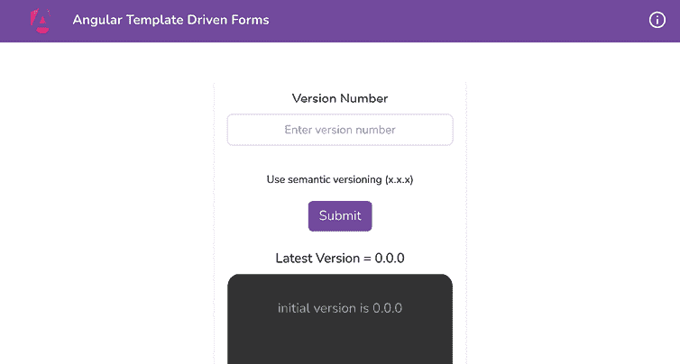

    图 8.1：运行在 http://localhost:4200 的 ng-tdf 应用

## 如何做到这一点...

我们有一个已经包含了许多组件和一些 UI 设置的 Angular 应用。我们需要实现添加新版本到日志的功能。我们将使用模板驱动表单来允许用户选择一个应用并提交一个发布版本。让我们开始吧：

1.  首先，我们将在项目的`src/app/components/version-control/version-control.component.ts`文件中添加`FormsModule`，如下所示：

    ```js
    ...
    import { FormsModule } from '@angular/forms';
    ...
    @Component({
      ...,
      imports: [CommonModule, FormsModule, VcLogsComponent]
    })
    export class VersionControlComponent  {...} 
    ```

1.  现在，我们将在组件的 HTML 文件中的表单输入上使用`NgForm`和`NgModel`模板变量来使用模板驱动表单。按照以下方式更新`version-control.component.html`文件：

    ```js
    <form #versionForm="ngForm">
    <div class="form-group mb-4">
    <label for="versionNumber">Version Number</label>
    <input [(ngModel)]="versionInput" name="version"
    type="text" class="form-control my-2 text-center"
    id="versionNumber" aria-describedby="versionHelp"
    placeholder="Enter version number">
        ...
      </div>
      ...
    </form> 
    ```

1.  让我们创建一个当表单提交时会被触发的机制。按照以下方式更新`version-control.component.ts`文件：

    ```js
    ...
    import { FormsModule, **NgForm** } from '@angular/forms';
    ...
    export class VersionControlComponent  {
      ...
      **formSubmit****(****form****:** **NgForm****) {**
    **this****.versionName = form.controls[****'version'****].value;**
    **}**
    } 
    ```

1.  现在我们已经有了表单提交处理程序，让我们给模板添加事件监听器。更新`version-control.component.html`文件，如下所示：

    ```js
    <form #versionForm="ngForm"
      (ngSubmit)="formSubmit(versionForm)">
      ...
    </form>
    <app-vc-logs [vName]="versionName"></app-vc-logs> 
    ```

    添加这个之后，你应该能够添加新的版本。然而，你可以为输入使用任何值，甚至不提供任何内容，它也会作为一个新版本添加。请参见以下截图以获取示例：

    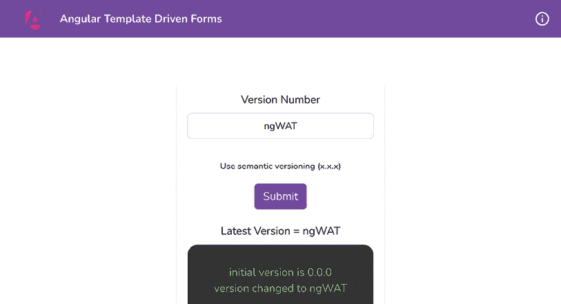

    图 8.2：没有表单验证的 ng-tdf 应用

1.  我们将向前添加一些表单验证。首先，我们要确保只有当表单有有效输入时，我们才更改`versionName`属性的值。更新`version-control.component.ts`文件中的`formSubmit`方法，如下所示：

    ```js
    export class VersionControlComponent  {
      ...
      formSubmit(form: NgForm) {
        if (!form.valid) {
          return;
        }
        this.versionName = form.controls['version'].value;
      }
    } 
    ```

1.  我们现在将在模板文件中添加一些验证。我们将强制输入，并确保提供的版本遵循语义版本控制。更新`version-control.component.html`文件，如下所示：

    ```js
    <form #versionForm="ngForm" (ngSubmit)="formSubmit(versionForm)">
    <div class="form-group mb-4">
    <label for="versionNumber">Version Number</label>
    <input [(ngModel)]="versionInput" pattern="(
    [0-9]+)\.([0-9]+)\.([0-9]+)" required name="version"
    type="text" class="form-control my-2 text-center"
    id="versionNumber" aria-describedby="versionHelp"
    placeholder="Enter version number">
        ...
      </div>
    <button type="submit" class="btn btn-primary">Submit</button>
    </form> 
    ```

    如果你现在尝试提交一个无效值的表单，你会看到提供的版本不会添加到日志中，但如果提供一个有效的版本，如`2.1.0`，它将被添加到日志中。然而，从用户体验的角度来看，这并不好，因为它没有告诉我们哪里出了问题。

1.  让我们根据我们已有的表单验证显示一些错误消息。更新`version-control.component.html`文件，如下所示：

    ```js
    <form #versionForm="ngForm" (ngSubmit)="formSubmit(versionForm)">
    <div class="form-group mb-4">
    <label for="versionNumber">Version Number</label>
    <input [(ngModel)]="versionInput" pattern="(
          [0-9]+)\.([0-9]+)\.([0-9]+)" required name="version"
      type="text" class="form-control my-2 text-center"
      id="versionNumber" aria-describedby="versionHelp"
      placeholder="Enter version number">
    <small id="versionHelp" class="form-text text-muted
          block mt-6">Use semantic versioning (x.x.x)</small>
    <small class="error block" *ngIf="versionForm.submitted
          && versionForm.controls['version'].errors?
          .['required']">
          Version number is required
        </small>
    <small class="error block"*ngIf="versionForm.submitted
          && versionForm.controls['version']
          .errors?.['pattern']">
          Version number does not match the pattern (x.x.x)
        </small>
    </div>
    <button type="submit" class="btn btn-
    primary">Submit</button>
    </form>
    <app-vc-logs [vName]="versionName"></app-vc-logs> 
    ```

    如果你现在提交一个没有任何输入的表单，你应该会看到以下错误：

    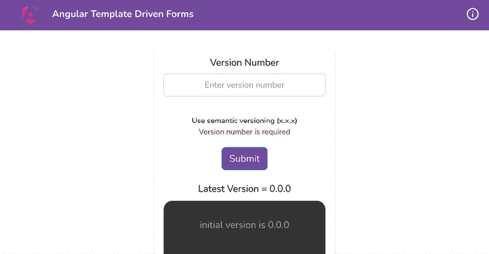

    图 8.3：具有表单验证的 ng-tdf 应用

    如果你尝试给它错误的值，你会看到不同的错误。

    太好了！在几分钟内，我们就能够使用表单验证在 Angular 中创建我们的第一个模板驱动表单。如果你现在刷新应用并添加一些版本，你应该会看到以下内容：

    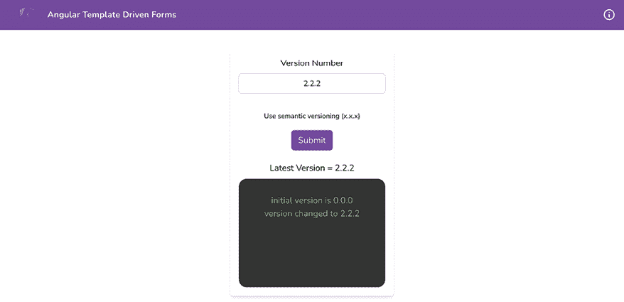

    图 8.4：ng-tdf 应用最终输出

现在你已经知道了模板驱动表单是如何创建的，让我们看看下一节来了解它是如何工作的。

## 它是如何工作的…

在 Angular 中使用模板驱动表单的关键在于`FormsModule`、`ngForm`指令和`ngModel`绑定。这几乎总是包括模板变量以及模板中输入的`name`属性。我们首先在`VersionControlComponent`类中添加了`FormsModule`，这是使用`ngForm`指令和`[(ngModel)]`双向数据绑定所必需的。然后，我们将`[(ngModel)]`添加到版本输入中。我们还添加了`ngForm`属性到`form`元素上，同样创建了一个`#versionForm`变量，这样我们就可以用它来检查整个表单是否有效。然后，我们在`form`元素上添加了`ngSubmit`处理器，以便在表单提交时触发一个方法。我们还在`VersionControlComponent`类中添加了相应的`formSubmit`方法。请注意，我们将`versionForm`变量传递给`formSubmit`方法，这使得我们更容易测试其功能。提交表单时，我们在`formSubmit`方法中使用表单来获取输入值并创建一个新的`version-log`条目。请注意，我们通过使用`form.controls['version']`来访问控件/输入。关键版本直接对应于模板中输入元素的`name`属性值。`ngForm`会自动为我们创建一个`FormControl`实例，使用输入的`name`属性值，因此我们可以这样访问它。此外，请注意，如果您为新版本日志提供了无效的版本，应用程序将根据空输入或无效的版本格式显示相应的错误。这是因为我们在`<input />`元素上设置了`required`属性以及`pattern`属性。

## 参见

+   *在 Angular 中构建模板驱动表单*: [`angular.io/guide/forms#building-a-template-driven-form`](https://angular.io/guide/forms#building-a-template-driven-form)

+   *显示和隐藏* *验证错误消息*（Angular 文档）: [`angular.io/guide/forms#show-and-hide-validation-error-messages`](https://angular.io/guide/forms#show-and-hide-validation-error-messages)

# 创建带有验证的第一个响应式表单

在前面的菜谱中，您已经了解了模板驱动表单，并且现在对使用它们构建 Angular 应用程序充满信心。现在，猜猜看？响应式表单甚至更好。Angular 社区中的许多知名工程师和企业推荐仅使用响应式表单来构建 Angular 应用程序。原因是，当涉及到复杂表单时，响应式表单使得管理变得容易，即您可以将表单的逻辑与模板解耦，并动态添加验证器等。在本菜谱中，您将构建您的第一个响应式表单，并学习其基本用法。

## 准备工作

我们将要工作的应用程序位于克隆的仓库中的`start/apps/chapter08/ng-reactive-forms`目录下：

1.  在您的代码编辑器中打开代码仓库。

1.  打开终端，导航到代码仓库目录，并运行以下命令来运行项目：

    ```js
    npm run serve ng-reactive-forms 
    ```

    这应该在新的浏览器标签页中打开应用，你应该会看到以下内容：

    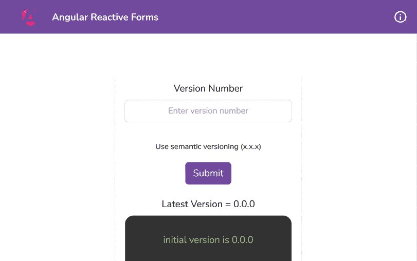

    图 8.5：运行在 http://localhost:4200 上的 ng-reactive-forms 应用

现在我们已经在本地运行了应用，让我们在下一节中查看这个食谱所涉及的步骤。

## 如何做到这一点...

到目前为止，我们有一个包含`VcLogsComponent`的应用，它显示了我们创建的一组版本日志。我们还有一个`VersionControlComponent`，它有一个表单，通过这个表单将创建发布日志。我们现在必须将我们的当前表单改为响应式表单，使用响应式表单 API。让我们开始吧：

1.  首先，我们需要将`ReactiveFormsModule`导入到我们的`AppModule`的导入中。让我们通过修改`app/components/version-control/version-control.component.ts`文件来实现，如下所示：

    ```js
    ...
    import { ReactiveFormsModule } from '@angular/forms';
    ...
    @Component({
      ...,
      imports: [CommonModule, VcLogsComponent,
      ReactiveFormsModule]
    })
    export class VersionControlComponent  {...} 
    ```

1.  我们将很快创建响应式表单。首先，在`version-control.component.ts`文件中导入所需的依赖项，如下所示：

    ```js
    import { CommonModule } from '@angular/common';
    import { Component } from '@angular/core';
    **import** **{**
    **FormControl****,**
    **FormGroup****,**
    **ReactiveFormsModule****,**
    **Validators****,**
    **}** **from****'@angular/forms'****;**
    ... 
    ```

1.  现在，我们将在`VersionControlComponent`类中创建一个名为`version`的控件`FormGroup`。`FormGroup`允许我们在表单中将多个控件组合在一起。按照以下方式修改`version-control.component.ts`文件：

    ```js
    @Component({...})
    export class VersionControlComponent {
      versionInput = '';
      versionName = '0.0.0';
      **versionPattern =** **'([0-9]+)\.([0-9]+)\.([0-9]+)'****;**
    **versionForm =** **new****FormGroup****({**
    **version****:** **new** **FormControl****(****''****, [**
    **Validators****.required,**
    **Validators****.****pattern****(****this****.****versionPattern),**
    **]),**
    **});**
    } 
    ```

1.  现在我们已经设置了响应式表单，让我们在模板中将`versionForm`绑定到`<form>`元素。按照以下方式更新`version-control.component.html`文件：

    ```js
    <form **[****formGroup****]=****"versionForm"**>
      ...
    </form> 
    ```

1.  太好了！现在我们已经绑定了表单组，我们还可以绑定`version`表单控件。进一步修改`version-control.component.html`文件，如下所示：

    ```js
    <form [formGroup]="versionForm">
    <div class="form-group mb-4">
    <label for="versionNumber">Version Number</label>
    <input **formControlName****=****"version"** name="version"
      type="text" class="form-control my-2 text-center"
      id="versionNumber" aria-describedby="versionHelp"
      placeholder="Enter version number">
        ...
      </div>
      ...
    </form>
    ... 
    ```

1.  让我们决定当提交这个表单时会发生什么。在模板中，我们将调用名为`formSubmit`的方法，并在表单提交时将`versionForm`传递给它。按照以下方式修改`version-control.component.html`文件：

    ```js
    <form
      [formGroup]="versionForm"
     **(****ngSubmit****)=****"formSubmit(versionForm)"**>
      ...
    </form> 
    ```

1.  `formSubmit`方法还不存在。现在让我们在`VersionControlComponent`类中创建它。按照以下方式修改`version-control.component.ts`文件：

    ```js
    ...
    @Component({...})
    export class VersionControlComponent {
      ...
      **formSubmit****(****form****:** **FormGroup****) {**
    **if** **(!form.****valid****) {**
    **return****;**
    **}**
    **this****.****versionName** **= form.****controls****[****'version'****].****value****;**
    **}**
    } 
    ```

    如果你现在尝试提交一个无效的值，你会看到提供的版本不会添加到日志中，但如果你提供一个有效的版本，如`2.1.0`，它将被添加到日志中。然而，从用户体验的角度来看，这并不好，因为它没有告诉我们哪里出了问题。

1.  让我们根据我们已有的表单验证显示一些错误消息。按照以下方式更新`version-control.component.html`文件：

    ```js
    <form [formGroup]="versionForm" (ngSubmit)="formSubmit(versionForm)">
    <div class="form-group mb-4">
    <label for="versionNumber">Version Number</label>
        ...
        <small class="error block" *******ngIf****=****"versionForm.dirty &&**
    **versionForm.controls.version.errors?.['required']"**>
          Version number is required
        </small>
    <small class="error block" *******ngIf****=****"versionForm.dirty &&**
    **versionForm.controls.version.errors?.['pattern']"**>
          Version number does not match the pattern (x.x.x)
        </small>
    </div>
    <button type="submit" class="btn btn-
    primary">Submit</button>
    </form>
    <app-vc-logs [vName]="versionName"></app-vc-logs> 
    ```

    如果你现在在表单中输入一些内容然后清除输入，你应该会看到一个错误，如下所示：

    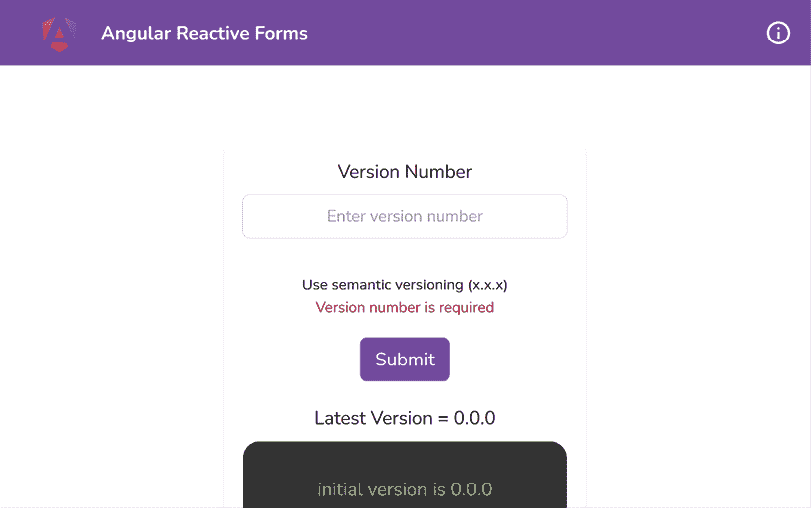

    图 8.6：具有表单验证的 ng-reactive-forms 应用

    如果你尝试给它错误的值，你会看到一个不同的错误。

太好了！在几分钟内，我们就能在 Angular 中创建带有表单验证的响应式表单。参见下一节了解它是如何工作的。

## 如何工作...

要在 Angular 中使用响应式表单，对于独立组件，我们需要在组件中导入`ReactiveFormsModule`，如果你使用模块，则在`NgModule`中导入。在配方中，我们正是这样做的，即在`VersionControlComponent`类的`imports`数组中导入`ReactiveFormsModule`。之后，我们创建一个`FormGroup`，这是一个响应式表单，它将一个对象作为构造函数的参数。传递给构造函数的对象可以具有进一步的`FormControl`，嵌套表单组，以及`FormArray`等，因为它们都继承自`AbstractControl`类，如图*8.6*所示。

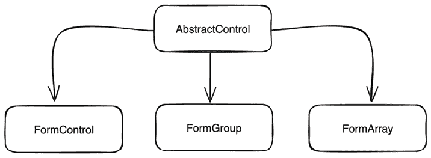

图 8.7：基类 AbstractControl 正在被继承

在我们的配方中，我们为`version`提供了一个键名`version`。在我们的配方中，`FormControl`构造函数方法接受两个参数；第一个是默认值，第二个是`Validators`数组。请注意，我们正在使用以下验证器：

```js
Validators.required
Validators.pattern 
```

此外，请注意，我们用于验证语义版本的模式是`([0-9]+)\.([0-9]+)\.([0-9]+)`。然后我们在模板中的`<form>`元素上使用`FormGroup`（即`versionForm`变量），使用`[formGroup]`绑定。然后我们使用`formControlName`属性在模板中绑定`version` `FormControl`。我们使用`<form>`元素上的`(ngSubmit)`监听器处理表单提交。在`VersionControlComponent`类中，我们有`formSubmit`方法来处理表单提交。这也是我们在模板中绑定事件监听器的地方。当此方法被调用时，我们检查表单是否有效。

每个`FormGroup`、`FormArray`或`FormControl`的验证发生在`change`、`blur`或`submit`事件上。由于它们继承自`AbstractControl`类，它们可以通过`AbstractControl`上的`updateOn`属性进行配置。在我们的情况下，验证默认发生在`change`上。如果表单无效，我们简单地不做任何事情。否则，我们设置`versionName`属性的值，这将在日志列表中添加一条新记录。

最后，我们展示了基于模板表单验证的错误，使用`version`表单控件上的`errors`属性。当对表单进行任何初始更改后，表单控件上的`errors`对象将`required`属性设置为`true`。

当用户向输入框添加值时，`required`属性被移除，并触发`pattern`验证，如果模式`([0-9]+)\.([0-9]+)\.([0-9]+)`与输入值不匹配，我们将在表单控件的`errors`对象中添加`pattern`属性。注意，在*步骤 8*中，我们使用`errors`对象中的这些属性来显示相关错误。

## 参见

+   Angular 的响应式表单指南：[`angular.io/guide/reactive-forms`](https://angular.io/guide/reactive-forms)

# 在 Angular 中测试表单

为了确保我们为最终用户构建健壮且无错误的表单，拥有与您的表单相关的测试是一个非常好的主意。这使得代码更具弹性，更不容易出错。在这个菜谱中，您将学习如何使用单元测试测试您的模板驱动表单。

## 准备工作

我们将要工作的应用程序位于克隆的仓库中的`start/apps/chapter08/ng-testing-forms`目录内：

1.  在您的代码编辑器中打开代码仓库。

1.  打开终端，导航到代码仓库目录，并运行以下命令以启动项目及其后端服务器：

    ```js
    npm run serve ng-testing-forms with-server 
    ```

    这应该在新的浏览器标签页中打开应用程序，您应该看到以下内容：

    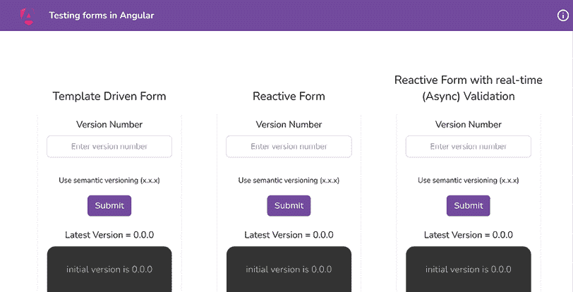

    图 8.8：ng-testing-forms 应用程序在 http://localhost:4200 上运行

现在我们已经在本地上运行了应用程序，让我们在下一节中查看这个菜谱涉及的步骤。

## 如何做到这一点...

我们有一个包含三个不同组件的应用程序。第一个有一个模板驱动表单，第二个有一个带有验证的响应式表单，第三个有一个带有同步和异步验证的响应式表单。这三个组件的实现都是相同的，除了第三个组件的验证会在表单变脏时立即启动，而不是等待提交。表单也对输入应用了验证。让我们开始探讨如何测试这个表单：

1.  首先，运行以下命令来运行单元测试：

    ```js
    npm run test ng-testing-forms 
    ```

    命令运行后，您应该在控制台上看到所有测试通过，如下所示：

    

    图 8.9：使用 ng-testing-forms 运行的单元测试

1.  让我们编写模板驱动表单的测试。这很简单。我们将更新`version-control-tdf.component.spec.ts`文件，如下所示：

    ```js
    ...
    describe('VersionControlTdfComponent', () => {
      ...
      it('should create', () => {...});
      **it****(****'should submit the form with valid version'****,** **() =>** **{**
    **component.****versionForm****.****controls****[****'version'****]**
    **.****setValue****(****'2.2.4'****);**
    **fixture.****debugElement****.****nativeElement****.****querySelector****(****'button'****).****click****();**
    **expect****(component.****versionName****).****toBe****(****'2.2.4'****);**
    **});** 
    ```

    如果您现在查看测试，您应该看到所有测试都通过，如下所示：

    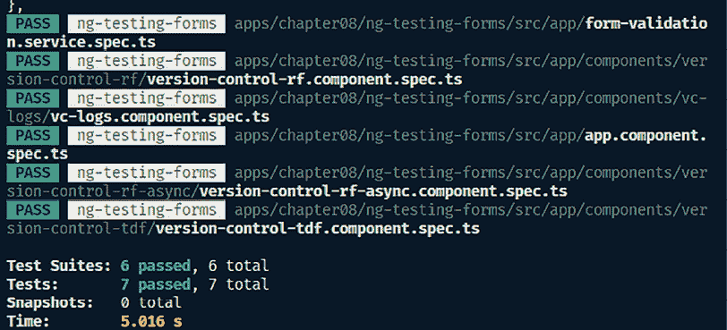

    图 8.10：模板驱动表单的第一个测试通过

1.  让我们在文件中添加另一个测试。这个测试将检查我们是否能够看到必填输入的错误消息。让我们更新`version-control-tdf.component.spec.ts`文件，如下所示：

    ```js
    it('should show required error', () => {
        component.versionForm.controls['version']
          .setValue('2.2.4');
        fixture.detectChanges();
        component.versionForm.controls['version'].setValue('');
        fixture.detectChanges();
        fixture.debugElement.nativeElement
     .querySelector('button').click();
        fixture.detectChanges();
        expect(component.versionName).toBe('0.0.0');
        expect(
          fixture.debugElement.nativeElement
            .querySelector('.error')
            .textContent.trim()
        ).toBe('Version number is required');
      }); 
    ```

1.  让我们再添加一个测试。这个测试将检查我们是否能够看到版本模式有效时的消息。将以下测试添加到同一文件中：

    ```js
    it('should show pattern error', () => {
        component.versionForm.controls['version']
          .setValue('2.2.4');
        fixture.detectChanges();
        component.versionForm.controls['version']
          .setValue('invalid input');
        fixture.detectChanges();
        fixture.debugElement.nativeElement
     .querySelector('button').click();
        fixture.detectChanges();
        expect(component.versionName).toBe('0.0.0');
        expect(
          fixture.debugElement.nativeElement
            .querySelector('.error')
            .textContent.trim()
        ).toBe('Version number does not match the pattern (x.x.x)');
      }); 
    ```

    太好了！你应该看到所有测试仍然通过。有趣的事实是，对于只包含同步验证器的响应式表单（Reactive form）示例，测试也是相同的。

1.  将我们从*步骤 2*到*步骤 4*添加的所有三个测试复制到文件`version-control-rf.component.spec.ts`中。

1.  现在是棘手的部分，即处理`async`验证器。我们不能简单地复制粘贴这个测试，并期望在表单中提供错误版本时测试通过。在这种情况下，我们需要做一些额外的工作。首先，将`version-control-tdf.component.spec.ts`文件中的相同测试复制到`version-control-rf-async.component.spec.ts`文件中。

    你会注意到现在有两个测试失败了，如下所示：

    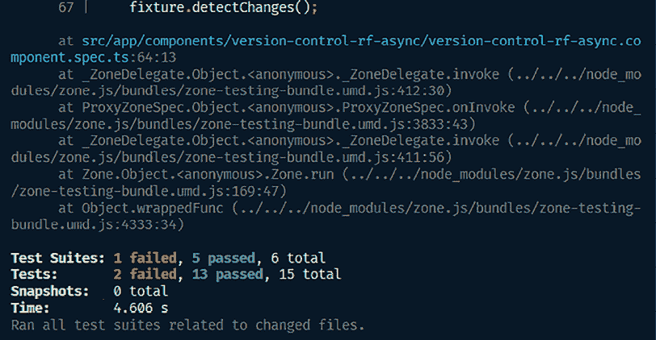

    图 8.11：具有异步验证器的表单测试失败，使用服务

1.  我们将模拟 `FormValidationService` 进行我们的测试。按照以下方式更新 `version-control-rf-async.component.spec.ts` 文件：

    ```js
    import { provideHttpClient } from '@angular/common/http';
    import { ComponentFixture, TestBed } from '@angular/core/testing';
    **import** **{** **of** **}** **from****'rxjs/internal/observable/of'****;**
    **import** **{** **FormValidationService** **}** **from****'../../form-validation.service'****;**
    import { VersionControlRfAsyncComponent } from './version-control-rf-async.component';
    **const****FormValidationServiceMock** **= {**
    **versionValidator****() {**
    **return****() =>****of****(****null****);**
    **},**
    **};** 
    ```

1.  让我们将我们的模拟服务提供给同一文件中的 `TestBed` 进行测试，如下所示：

    ```js
    ...
    describe('VersionControlRfAsyncComponent', () => {
     ...
      beforeEach(async () => {
        await TestBed.configureTestingModule({
          imports: [VersionControlRfAsyncComponent],
          providers: [
            provideHttpClient(),
            **{**
    **provide****:** **FormValidationService****,**
    **useValue****:** **FormValidationServiceMock****,**
    **},**
          ],
        }).compileComponents();
        ...
      });
    }); 
    ```

    通过上述更改，测试 `'应该提交带有有效版本的表单'` 和 `'应该显示必需错误'` 应该通过。太好了！然而，最后一个测试失败了。我们将修复它。

1.  让我们更新最终的失败测试。我们将更新我们的 `FormValidationServiceMock` 对象，使其在输入无效时返回一个 `pattern` 错误。按照以下方式更新文件：

    ```js
    ...
    **import** **{** **AbstractControl** **}** **from****'@angular/forms'****;**
    import { of } from 'rxjs/internal/observable/of';
    import { FormValidationService } from '../../form-validation.service';
    import { VersionControlRfAsyncComponent } from './version-control-rf-async.component';
    const FormValidationServiceMock = {
      versionValidator(**control****:** **AbstractControl**) {
        return () => {
          **if** **(control.****value** **===** **'invalid input'****) {**
    **return****of****({** **pattern****:** **true** **});**
    **}**
    return of(null);
        };
      }}; 
    ```

    哇！现在所有的测试都应该通过了，如下所示：

    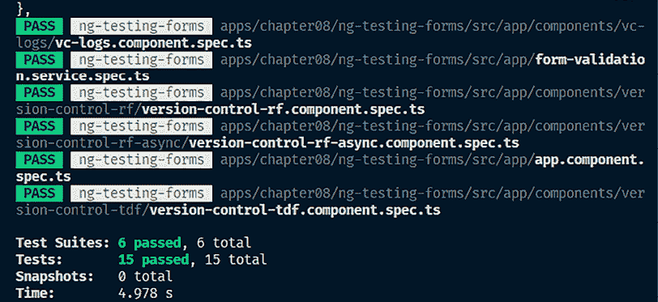

    图 8.12：配方中所有测试通过

太棒了！你现在已经了解了一堆测试你的 Angular 表单的技术。然而，其中一些技术可能还需要一些解释。参见下一节了解这一切是如何工作的。

## 它是如何工作的…

测试 Angular 表单可能有点挑战性，因为它取决于表单的复杂程度，你想要测试哪些用例，以及这些用例的复杂程度。对于需要处理多个依赖项的情况也是如此。在我们的配方中，我们从模板驱动的表单开始，对我们来说测试它们很容易，因为组件有一个 `ViewChild()` 类型为 `NgForm`。这使得我们编写第一个测试来设置 `version` 表单控件的值变得容易。然后，我们点击 **提交** 按钮，并期望组件的 `versionName` 属性值是我们表单中输入的那个。简单得很！

对于第二次测试，我们首先将表单的值设置为 `2.2.4`，然后通过将值设置为空字符串来清空表单。然后，我们提交表单并期望组件的 `versionName` 属性保持不变，仍然是 `0.0.0`。然而，我们还检查的是，在表单内部，我们可以看到显示 `'版本号是必需的'` 错误。请注意，我们使用 `fixture.debugElement.nativeElement.querySelector` 方法获取所需的错误元素，然后检查其 `textContent` 值。

为了检查模式，我们与第二次测试相同，但不是清空输入，而是将 `'``invalid input'` 作为新值提供给表单控件。由模板驱动的表单选择它并显示错误 `'版本号不匹配模式（x.x.x）'`，这是我们测试中期望的。

与我们之前在 `Reactive Forms` 示例中所使用的三个测试完全相同。这次的不同之处在于，组件中的 `versionForm` 属性不是 `NgForm`，而是 `FormGroup`。令人惊讶的是，Angular 在 `NgForm` 和 `FormGroup` 中都提供了相同的 API（即相同的方法）来设置和检索值。这是因为它在幕后创建了一个顶层的 `FormGroup`，从而使我们的测试保持一致。

对于使用 `async` 验证器的测试，我们做了些特别的事情。除了从其他示例中复制粘贴测试之外，我们还需要模拟 `FormValidationService`。这是因为这个示例有一个来自 `FormValidationService` 类的异步验证函数，并且模拟单元的所有依赖项是一个通用的最佳实践，这样我们就可以纯粹地测试它。

我们首先创建一个名为 `FormValidationServiceMock` 的存根（我们将在 *第十章* 中学习更多关于存根的知识，*使用 Jest 在 Angular 中编写单元测试*）。然后，我们将这个存根提供给 `TestBed`，针对 `FormValidationService` 类。最后，我们确保存根中的 `versionValidator` 方法在输入无效时返回正确的错误。就这样。在测试本身没有太多变化的情况下，我们能够通过微小的调整测试所有三种类型的表单。我希望你在本菜谱中学到了很多技术。

## 参见

+   *测试* *模板驱动表单*：[`angular.io/guide/forms-overview#testing-template-driven-forms`](https://angular.io/guide/forms-overview#testing-template-driven-forms)

# 使用异步验证函数进行服务器端验证

在 Angular 中，表单验证非常直接，原因在于 Angular 提供的超级棒的验证器。这些验证器是同步的，这意味着只要你改变输入，验证器就会立即启动并提供有关值有效性的信息。然而，有时你可能依赖于来自后端 API 的某些验证，或者需要执行一些异步逻辑来验证表单值。这些情况将需要称为异步验证器的东西。在这个菜谱中，你将创建你的第一个异步验证器。

## 准备工作

我们将要工作的应用位于克隆的仓库中的 `start/apps/chapter08/ng-rf-async-validator`：

1.  在你的代码编辑器中打开代码仓库。

1.  打开终端，导航到代码仓库目录，并运行以下命令以启动项目及其后端服务器：

    ```js
    npm run serve ng-rf-async-validator with-server 
    ```

    这应该会在新浏览器标签页中打开应用，你应该会看到以下内容：

    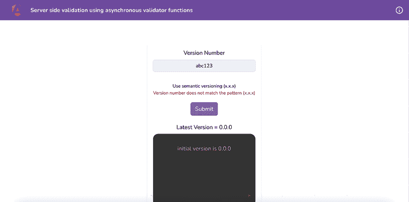

    图 8.13：异步验证器应用在 http://localhost:4200 上运行

现在我们已经运行了应用，让我们在下一节中查看本菜谱所涉及的步骤。

## 如何做到这一点...

我们已经有一个后端，它有一个可以接受版本作为查询参数的端点，返回一个`boolean`，表示提供的版本是否根据模式（`x.x.x`）是有效的版本，并且比之前提供的版本新。我们将创建一个`async`验证器来确保新版本有一个有效的版本。让我们开始：

1.  首先，我们将修改`version.service.ts`文件中的`VersionService`类，如下所示，以添加一个通过`http://localhost:3333/api/version/validate`端点验证表单输入的方法：

    ```js
    ...
    export class VersionService {
      ...
      **validateVersion****(****version****:** **string****):** **Observable****<{** **error****:**
    **string** **}> {**
    **return****this****.****http****.****get****<{** **error****:** **string** **}>(**
    **`****${****this****.apiBaseUrl}****/validate?val=****${version}****`**
    **);**
    **}**
    submitVersion(version: string): Observable<{ success:
      boolean }> {...);
      }
    } 
    ```

1.  现在，我们将在`VersionService`类中创建一个**异步验证函数**（`AsyncValidatorFn`）。这是我们稍后将在应用程序中的表单上绑定的事情。让我们更新`version.service.ts`文件，如下所示：

    ```js
    import { HttpClient } from '@angular/common/http';
    import { Injectable, inject } from '@angular/core';
    import { Observable } from 'rxjs/internal/Observable';
    **import** **{** **AbstractControl****,** **AsyncValidatorFn****,** **ValidationErrors** **}** **from****'@angular/forms'****;**
    **import** **{ timer, switchMap, map }** **from****'rxjs'****;**
    ...
    export class VersionService {
      ...

    **versionValidator****():** **AsyncValidatorFn** **{**
    **return** **(****control****:** **AbstractControl****):** **Observable****<**
    **ValidationErrors** **|** **null** **> => {**
    **return****timer****(****500****).****pipe****(**
    **switchMap****(****() =>****this****.****validateVersion****(**
    **control.****value****)),**
    **map****(****(****{ error }****) =>** **{**
    **const****errors****:** **ValidationErrors** **= {};**
    **if** **(error ===** **null****) {**
    **return****null****;**
    **}**
    **errors[error] =** **true****;**
    **return** **errors;**
    **})**
    **);**
    **};**
    **}**
      ...
    } 
    ```

1.  我们将使用我们刚刚在`VersionControlComponent`类中创建的`versionValidator`方法，与`versionForm`一起使用。为此，让我们修改`version-control.component.ts`文件，如下所示：

    ```js
    import { Component, **OnInit**, **inject** } from '@angular/core';
    ...
    export class VersionControlComponent **implements****OnInit** {
      ...
      **ngOnInit****() {**
    **this****.****versionForm****.****controls****.****version****.****setAsyncValidators****(**
    **this****.****versionService****.****versionValidator****()**
    **);**
    **}**
    formSubmit(form: FormGroup) {...}
    } 
    ```

    如果你现在尝试提交一个等于或低于上次提交版本的版本，你将收到一个错误，如下所示：

    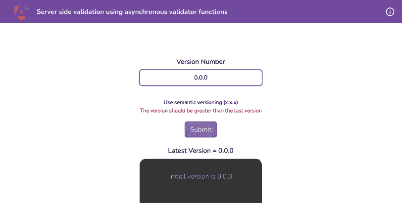

    图 8.14：提供较低或相等的版本号时显示的错误

太棒了！所以，你现在知道如何在 Angular 中创建异步验证函数来进行响应式表单验证。既然你已经完成了这个菜谱，请参考下一节，看看它是如何工作的。

## 它是如何工作的...

Angular 提供了一个轻松创建`async`验证函数的方法，而且它们也很方便。当我们需要执行可能耗时的验证且不想阻塞主线程，或者我们依赖于后端服务进行验证时，我们会使用`async`验证函数。例如，在这个菜谱中，我们首先在一个名为`VersionService`的新服务中创建了一个名为`versionValidator`的验证器方法。请注意，我们在该方法中使用了一些 RxJS 运算符，包括`timer`、`switchMap`和`map`。我们使用`timer`运算符来去抖动并等待用户停止输入**500**毫秒。然后，我们使用`switchMap`运算符与`validateVersion`方法结合，向后端发起 HTTP 调用，验证版本。`switchMap`在这里的好处是它会取消现有的 HTTP 调用（如果有的话）。然后，我们使用`map`运算符从 HTTP 调用中移除错误。如果没有错误，我们从`map`函数的回调中返回一个空对象。如果有错误，我们在`errors`对象中将`[error]`设置为`true`，如*步骤 4*所示。

创建验证函数后，我们通过在`VersionControlComponent`类中使用`FormControl.setAsyncValidators`方法将其附加到版本名称的表单控件上。然后，我们在模板中使用名为`pattern`和`oldVersion`的验证错误来显示相关的错误消息。

## 参见

+   `AsyncValidator` Angular 文档：[`angular.io/api/forms/AsyncValidator#provide-a-custom-async-validator-directive`](https://angular.io/api/forms/AsyncValidator#provide-a-custom-async-validator-directive)

# 使用响应式 FormArray 实现复杂表单

这无疑是第一版 *Angular Cookbook* 读者最常请求的食谱之一。在这个食谱中，我们将与响应式表单一起工作，特别是响应式表单中的 `FormArray` 类。我们将实现一个复杂的表单，该表单可以提交一系列项目。用户将能够添加他们想要的任意数量的项目，并且可以删除他们不需要的项目。

## 准备工作

我们将要工作的应用位于克隆的仓库中的 `start/apps/chapter08/ng-form-arrays` 目录内：

1.  在你的代码编辑器中打开代码仓库。

1.  打开终端，导航到代码仓库目录，并运行以下命令以启动项目：

    ```js
    npm run serve ng-form-arrays 
    ```

    这应该在新的浏览器标签页中打开应用，你应该会看到以下内容：

    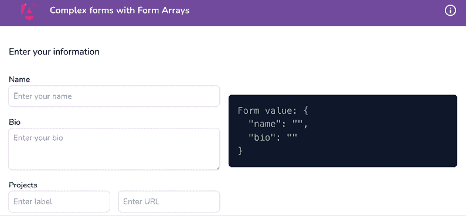

    图 8.15：运行在 http://localhost:4200 的响应式 FormArray 应用

现在我们已经在本地运行了应用，让我们在下一节中查看这个食谱所涉及的步骤。

## 如何操作...

我们有一个已经实现了响应式表单的应用。然而，到目前为止我们只能添加一个项目。我们将使用响应式 `FormArray` 允许用户提交多个项目，并且我们将使用响应式 `FormBuilder`，这是 `@angular/forms` 包中的一个很好的小 API，它使得在 Angular 中创建和维护响应式表单变得容易。让我们开始吧：

1.  首先，让我们使用响应式 `FormBuilder` 在 `portfolio-form.component.ts` 文件中向现有的响应式表单添加一个 `FormArray`，如下所示：

    ```js
    ...
    import { FormBuilder, ReactiveFormsModule, Validators, **FormGroup**, **FormControl** } from '@angular/forms';
    ...
    export class PortfolioFormComponent {
      fb = inject(FormBuilder);
      portfolioForm = this.fb.group({
        name: ['', Validators.required],
        bio: [''],
        **projects****:** **this****.****fb****.****array****<**
    **FormGroup****<{**
    **label****:** **FormControl****<****string** **|** **null****>;**
    **url****:** **FormControl****<****string** **|** **null****>;**
    **}>**
    **>([]),**
      })
      **get****projectsFormArr****() {**
    **return****this****.****portfolioForm****.****controls****.****projects****;**
    **}**
      ...
    } 
    ```

1.  现在我们有了 `projects` `FormArray`，让我们在模板中使用它，以便我们可以根据表单数组显示项目的表单输入。让我们修改 `portfolio-form.component.html` 文件，如下所示：

    ```js
    <div class="flex gap-4 items-center flex-col md:flex-row">
    <form **[****formGroup****]=****"portfolioForm"** class="flex-1 w-full
        md:w-auto">
    <section>...</section>
        ...
        <section **formArrayName****=****"projects"**>
    <label class="text-sm">Projects</label>
    <fieldset class="flex gap-4 mb-4 justify-between" 
            ***ngFor****=****"let projectControl of**
    **projectsFormArr.controls; trackBy: trackByFn"**
    **[****formGroup****]=****"projectControl"****>**
    <input **formControlName****=****"label"** **type="text"**
      class="form-control" placeholder="Enter label">
    <input **formControlName****=****"ur****l" type="url**"
      class="form-control" placeholder="Enter URL">
    </fieldset>
    </section>
    </form>
      ...
    </div> 
    ```

    你会注意到应用右侧的对象现在有一个 `projects` 数组。然而，我们目前看不到任何关于项目的输入。这是因为表单数组是空的，如下面的图所示：

    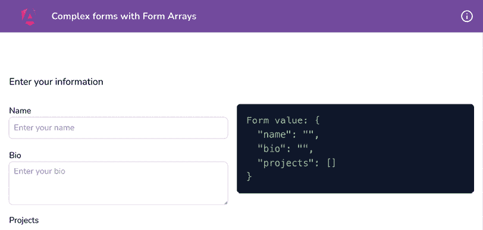

    图 8.16：运行在 http://localhost:4200 的响应式 FormArray 应用

1.  当应用启动时，我们将默认向表单数组中添加一个表单组。为此，修改 `portfolio-form.component.ts` 文件，如下所示：

    ```js
    import { Component, **OnInit**, inject } from '@angular/core';
    ...
    export class PortfolioFormComponent**implements****OnInit** {
      ...
      **ngOnInit****():** **void** **{**
    **this****.****addNewProject****();**
    **}**
    **addNewProject****() {**
    **this****.****projectsFormArr****.****push****(**
    **this****.****fb****.****group****({**
    **label****: [****''****,** **Validators****.****required****],**
    **url****: [****''****,** **Validators****.****required****]**
    **})**
    **)**
    **}**
    **...**
    } 
    ```

    如果你现在查看应用，你应该会看到一组项目的输入，如下面的图所示：

    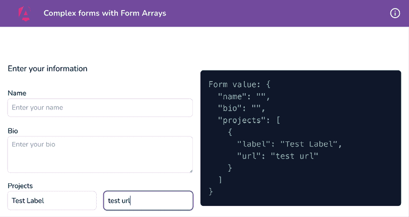

    图 8.17：默认情况下的一组项目输入

1.  让我们添加一个按钮，让用户能够添加更多项目。我们将修改 `portfolio-form.component.html` 文件，如下所示：

    ```js
    <section formArrayName="projects">
    <label class="text-sm">Projects</label>
    <fieldset [formGroup]="projectControl" class="flex
            gap-4 mb-4 justify-between" *ngFor="let
            projectControl of projectsFormArr.controls;
     **let isLast = last;** trackBy: trackByFn">
            ...
            <input formControlName="url" type="url" class="form-
              control" placeholder="Enter URL">
    **<****button****type****=****"button"** **[****style.visibility****]=****"isLast**
    **? 'visible' : 'hidden'"**
    **(****click****)=****"addNewProject()"****>****+****</****button****>**
    </fieldset>
    </section> 
    ```

    通过上面的代码，你应该会在点击 `+` 按钮时看到新的项目输入出现。

1.  让我们为这个菜谱添加最后一个特性，即显示用于移除项目输入行的按钮。我们首先在 `portfolio-form.component.ts` 文件中添加一个方法，该方法接收要移除的行的索引作为参数：

    ```js
    ...
    export class PortfolioFormComponent implements OnInit {
      ...
      addNewProject() {...}
      **removeProject****(****index****:** **number****) {**
    **this****.****projectsFormArr****.****removeAt****(index);**
    **}**
      ...
    } 
    ```

1.  现在，我们将更新模板以添加 `Remove` 按钮。更新 `portfolio-form.component.html` 文件，如下所示：

    ```js
    <section formArrayName="projects">
    <label class="text-sm">Projects</label>
    <fieldset [formGroup]="projectControl" class="flex
            gap-4 mb-4 justify-between" *ngFor="let
            projectControl of projectsFormArr.controls; let
            isLast = last; **let i = index;** trackBy: trackByFn">
    <input formControlName="label" type="text"
      class="form-control" placeholder="Enter label">
    <input formControlName="url" type="url" class="form-
              control" placeholder="Enter URL">
    **<****button****type****=****"button"** **[****hidden****]=****"****isLast"**
    **(****click****)=****"removeProject(i)"****>****-****</****button****>**
    <button type="button" [style.visibility]="isLast ?
              'visible' : 'hidden'" [hidden]="!isLast"
      (click)="addNewProject()">+</button>
    </fieldset>
    </section> 
    ```

    如果你现在查看应用程序，你应该能够根据需要添加或移除项目到表单中，如下面的图所示：

    

    图 8.18：带有表单数组的最终结果

太棒了！你现在已经知道如何使用响应式 `FormArray`。参考下一节了解它是如何工作的。

## 它是如何工作的...

Angular 的 `FormArray` 是 Angular 响应式表单中内置的一个神奇工具。它将每个子 `FormControl` 或 `FormGroup` 的所有值聚合到一个数组中。`FormArray` 的美妙之处在于，如果任何一个子 `FormControls` 无效，整个数组都会变为无效。在这个菜谱中，我们首先在 `PortfolioFormComponent` 类中使用 `ReactiveFormsModule` 中的 `FormBuilder`。我们用空 `FormArray` 初始化它，然后在组件挂载时（使用 `ngOnInit` 方法）向其中推送一个 `FormGroup`。这样我们就可以看到一组项目表单输入。请注意，我们使用 `addNewProject` 方法来做这件事。还请注意，我们使用了一个名为 `projectsFormArr` 的 `getter` 函数，这样我们就可以轻松访问 `FormArray`，以便在需要时遍历它、向其中添加表单组以及从其中移除所需的 `FormGroups`。然后我们遍历 `projectsFormArr.controls` 数组，以便通过 HTML 模板使用 `*ngFor` 指令显示输入。

然后，我们修改模板以添加 + 按钮，这样我们就可以向表单数组中添加更多项目。注意 `*ngFor` 中的语句有 `let isLast = last`。`*ngFor` 指令自动提供第一个和最后一个变量，因此我们可以在模板中使用它们。这个语句为我们创建了一个名为 `isLast` 的变量，并将 `*ngFor` 指令提供的 `last` 变量的值（一个布尔值）赋给它。这样我们就可以只在最后一行显示 + 按钮，而不是在每一行都显示。

最后，我们将 `remove` 按钮添加到除了最后一行之外的所有行，这样我们就可以从 `FormArray` 中移除相应的 `FormGroup`。请注意，在这里我们还在模板中的 `*ngFor` 指令中添加了 `let i = index`。这是因为我们的 TypeScript 文件中的 `removeProject` 方法在调用时期望传入 `FormArray` 中 `FormGroup` 的索引。因此，我们能够从 `*ngFor` 指令中获取每个 `FormGroup` 的索引，并将其传递给 `removeProject` 方法。我们在每个 `remove` 按钮上使用 `[hidden]="isLast"` 以使其仅在最后一行隐藏。这是因为我们在最后一行显示了 + 按钮，并且我们需要至少有一行空行用于项目。

## 参见

+   Angular `FormArray`：[`angular.io/api/forms/FormArray`](https://angular.io/api/forms/FormArray)

# 使用 ControlValueAccessor 编写自定义表单控件

Angular 表单很棒。虽然它们支持默认的 HTML 标签如`input`、`textarea`等，但有时你可能想定义自己的组件，这些组件可以从用户那里获取值。如果你的组件能够无缝地与 Angular 表单一起工作，即使用`formControlName`、`ngModel`等，那会怎么样？那会很酷，对吧？

在这个菜谱中，你将学习如何使用`ControlValueAccessor` API 创建一个具有自定义表单控件的组件，允许你使用你的组件与模板驱动表单和响应式表单一起使用。

## 准备中

我们将要工作的应用位于克隆的仓库`start/apps/chapter08/ng-form-cva`中：

1.  在你的代码编辑器中打开代码仓库。

1.  打开终端，导航到代码仓库目录，并运行以下命令以启动项目：

    ```js
    npm run serve ng-form-cva 
    ```

    这应该在新的浏览器标签页中打开应用，你应该看到以下内容：

    

    图 8.19：运行在 http://localhost:4200 上的自定义表单控件应用

现在我们已经在本地运行了应用，让我们在下一节中查看这个菜谱涉及的步骤。

## 如何操作...

我们有一个简单的 Angular 应用。它有两个输入和一个**提交**按钮。输入用于评论，并要求用户为这个假想项目的评分提供一个值，以及用户想要提供的任何评论。我们将使用`ControlValueAccessor` API 将评分输入转换为自定义`FormControl`。让我们开始吧：

1.  让我们为我们的自定义`FormControl`创建一个组件。在项目根目录中打开终端，并运行以下命令，当被询问时选择`@nx/angular:component schematics`和“按提供”：

    ```js
    cd start && nx g c rating --directory apps/chapter08/ng-form-cva/src/app/components/rating 
    ```

1.  我们现在将为`rating`组件创建`star` UI。按照以下方式修改`rating.component.html`文件：

    ```js
    <div class="rating">
    <div class="rating__star" [ngClass]="{
          'rating__star--active':
            (!isMouseOver && value >= star) ||
            (isMouseOver && hoveredRating >= star),
            '!cursor-default': disabled
        }" (mouseenter)="onRatingMouseEnter(star)"
      (mouseleave)="onRatingMouseLeave()"
             (click)="selectRating(star)"
        *ngFor="let star of [1, 2, 3, 4, 5]; let i = index">
    <span class="material-symbols-outlined">
          star
        </span>
    </div>
    </div> 
    ```

1.  将`rating`组件的样式添加到`rating.component.scss`文件中，如下所示：

    ```js
    .rating {
      display: flex;
      margin-bottom: 10px;
      &__star {
        cursor: pointer;
        color: grey;
        padding: 0 6px;
        &:first-child {
          padding-left: 0;
        }
        &:last-child {
          padding-right: 0;
        }
        &--active {
          color: orange;
        }
      }
    } 
    ```

1.  我们还需要修改`RatingComponent`类，以引入必要的方法和属性。按照以下方式修改`rating.component.ts`文件：

    ```js
    /* eslint-disable @typescript-eslint/no-empty-function */
    import { CommonModule } from '@angular/common';
    import { Component } from '@angular/core';
    @Component({
      ...
      standalone: true,
      imports: [CommonModule]
    })
    export class RatingComponent {
      value = 2;
      hoveredRating = 2;
      isMouseOver = false;
      onRatingMouseEnter(rating: number) {
        this.hoveredRating = rating;
        this.isMouseOver = true;
      }
      onRatingMouseLeave() {
        this.hoveredRating = 0;
        this.isMouseOver = false;
      }
      selectRating(rating: number) {
        this.value = rating;
      }
    } 
    ```

1.  由于`RatingComponent`是一个`standalone`组件，我们需要在`HomeComponent`类中导入`RatingComponent`类。更新`home.component.ts`文件，如下所示：

    ```js
    ...
    **import** **{** **RatingComponent** **}** **from****'../components/rating/rating.component'****;**
    @Component({
      selector: 'app-home',
      templateUrl: './home.component.html',
      styleUrls: ['./home.component.scss'],
      standalone: true,
      imports: [CommonModule, ReactiveFormsModule,
      **RatingComponent**]
    })
    export class HomeComponent {
      ...
    } 
    ```

1.  现在，我们需要使用这个`rating`组件来替换`home.component.html`文件中已有的输入。按照以下方式修改文件：

    ```js
    <div class="home">
    <div class="review-container">
        ...
        <form class="input-container" [formGroup]="reviewForm"
      (ngSubmit)="submitReview(reviewForm)">
    <div class="mb-3">
    <label for="ratingInput" class="form-
              label">Rating</label>
    **<****app-rating****formControlName****=****"rating"****></****app-rating****>**
    </div>
    <div class="mb-3">
            ...
          </div>
    <button id="submitBtn" [disabled]="reviewForm.
            invalid" class="btn btn-dark" type="submit">
           Submit</button>
    </form>
    </div>
    </div> 
    ```

    如果你现在刷新应用并悬停在星星上，你可以看到颜色变化。选定的评分也会按照以下方式突出显示：

    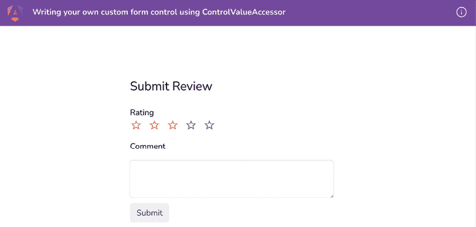

    图 8.20：带有悬停星星的评分组件

1.  现在我们来实现`ControlValueAccessor`接口，用于我们的`rating`组件。它需要实现几个方法。按照以下方式修改`rating.component.ts`文件：

    ```js
    **/* eslint-disable @typescript-eslint/no-empty-function */**
    import { CommonModule } from '@angular/common';
    import { Component } from '@angular/core';
    **import** **{** **ControlValueAccessor** **}** **from****'@angular/forms'****;**
    @Component({...})
    export class RatingComponent**implements****ControlValueAccessor** {
      ...
      isMouseOver = false;
      **onChange****:** **any** **=** **() =>** **{ };**
    **onTouched****:** **any** **=** **() =>** **{ };**
      ...
      **registerOnChange****(****fn****:** **any****){**
    **this****.****onChange** **= fn;**
    **}**
    **registerOnTouched****(****fn****:** **any****) {**
    **this****.****onTouched** **= fn;**
    **}**
    } 
    ```

1.  我们现在将添加必要的函数来在需要时禁用输入，并设置表单控件的值——换句话说，就是`setDisabledState`和`writeValue`方法。我们还将向`RatingComponent`类添加`disabled`属性，如下所示：

    ```js
    ...
    import { Component, **Input** } from '@angular/core';
    ...
    export class RatingComponent implements ControlValueAccessor {
      ...
      isMouseOver = false;
      **disabled =** **false****;**
      ...
      **setDisabledState****(****isDisabled****:** **boolean****):** **void** **{**
    **this****.****disabled** **= isDisabled;**
    **}**
    **writeValue****(****value****:** **number****) {**
    **this****.****value** **= value;**
    **}**
    } 
    ```

1.  我们需要使用`disabled`属性来防止当它为`true`时进行任何 UI 更改。`value`变量的值也不应该被更新。修改`rating.component.ts`文件以实现这一点，如下所示：

    ```js
    ...
    @Component({...})
    export class RatingComponent implements OnInit, ControlValueAccessor {
      ...
      isMouseOver = false;
      disabled = **true**;
      ...
      onRatingMouseEnter(rating: number) {
        **if** **(****this****.****disabled****)** **return****;**
    this.hoveredRating = rating;
        this.isMouseOver = true;
      }
      ...
      selectRating(rating: number) {
        **if** **(****this****.****disabled****)** **return****;**
    this.value = rating;
      }
      ...
    } 
    ```

    通过上述更改，你会注意到由于`disabled`属性被设置为`true`，现在悬停在星星上不会做任何事情。

1.  确保我们将`value`变量的值发送到`ControlValueAccessor`，因为这是我们稍后想要访问的内容。同时，让我们将`disabled`属性重置为`false`。按照以下方式更新`RatingComponent`类中的`selectRating`方法：

    ```js
    ...
    export class RatingComponent implements ControlValueAccessor {
      ...
      @Input() disabled = **false**;
      constructor() { }
      ...
      selectRating(rating: number) {
        if (this.disabled) return;
        this.value = rating;
        this.onTouched();
        **this****.****onChange****(rating);**
      }
      ...
    } 
    ```

1.  我们需要告诉 Angular 我们的`RatingComponent`类有一个`value`访问器；否则，在`<app-rating>`元素上使用`formControlName`属性将引发错误。让我们在`RatingComponent`类的装饰器中添加一个`NG_VALUE_ACCESSOR`提供者，如下所示：

    ```js
    import { Component, **forwardRef**, Input, OnInit } from '@angular/core';
    import { ControlValueAccessor**,** **NG_VALUE_ACCESSOR** } from '@angular/forms';
    @Component({
      ...
      imports: [CommonModule],
      **providers****: [{**
    **provide****:** **NG_VALUE_ACCESSOR****,**
    **useExisting****:** **forwardRef****(****() =>****RatingComponent****),**
    **multi****:** **true**
    **}]**
    })
    ... 
    ```

    如果你现在刷新应用程序，选择一个评分，并点击**提交**按钮，你应该会看到如下所示的值被记录：

    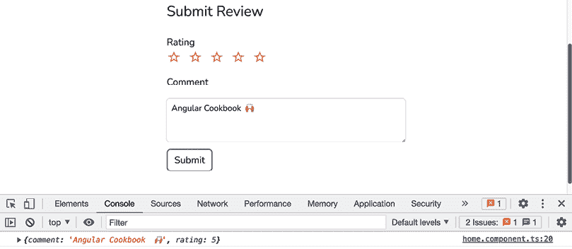

    图 8.21：使用自定义表单控件记录的表单值

哇！你刚刚学会了如何使用`ControlValueAccessor`创建自定义表单控件。参考下一节以了解它是如何工作的。

## 它是如何工作的…

我们从创建一个可以用来为我们提交的评论提供评分的组件开始。我们首先添加了`rating`组件的模板和样式。请注意，我们正在使用`[ngClass]`指令在每个`star`元素上条件性地添加`rating__star--active`类。现在让我们讨论每个条件：

+   `(isMouseOver && hoveredRating >= star)`: 这个条件依赖于`isMouseOver`和`hoveredRating`变量。`isMouseOver`变量在我们鼠标悬停在任意星星上时变为`true`，当我们从星星移开时变为`false`。这意味着它只有在悬停在星星上时才是`true`。`hoveredRating`告诉我们我们在任何时刻悬停在哪个星星上，并分配给星星的值——换句话说，一个从`1`到`5`的值。因此，这个条件只有在鼠标悬停时才为`true`，并且悬停的星星的评分大于当前星星的值。所以，如果我们悬停在第四颗星星上，所有从值`1`到`4`的星星都会被突出显示，因为它们将条件性地分配`rating__star--active`类。

+   `(!isMouseOver && value >= star)`: 这个条件依赖于我们之前讨论的`isMouseOver`变量和`value`变量。`value`变量包含所选评分的值，当我们在星星上点击时更新。因此，当我们在不进行鼠标悬停的情况下，并且`value`变量的值大于当前星星时，这个条件被应用。当你将更大的值分配给`value`变量并尝试悬停在具有较小值的星星上时，这尤其有益，在这种情况下，所有值大于悬停星星的星星都不会被突出显示。

然后，我们为每个星星使用了三个事件，`mouseenter`、`mouseleave`和`click`，然后分别使用我们的`onRatingMouseEnter`、`onRatingMouseLeave`和`selectRating`方法处理这些事件。所有这些设计都是为了确保整个 UI 流畅并提供良好的用户体验。然后我们为我们的`rating`组件实现了`ControlValueAccessor`接口。当我们这样做时，我们需要定义`onChange`和`onTouched`方法为空方法，我们按照以下方式实现：

```js
onChange: any = () => { };
onTouched: any = () => { }; 
```

然后，我们使用`ControlValueAccessor`中的`registerOnChange`和`registerOnTouched`方法来分配我们的方法，如下所示：

```js
registerOnChange(fn: any){
  **this****.****onChange** **= fn;**
}
registerOnTouched(fn: any) {
  **this****.****onTouched** **= fn;**
} 
```

我们注册了这些方法，因为每当我们在组件中做出更改并希望让`ControlValueAccessor`知道值已更改时，我们需要自己调用`onChange`方法。我们在`selectRating`方法中这样做，如下所示，确保当我们选择一个评分时，我们将表单控件的值设置为所选评分的值：

```js
selectRating(rating: number) {
  if (this.disabled) return;
  this.value = rating;
  **this****.****onChange****(rating);**
} 
```

另一种情况是我们需要知道表单控件的值是否从组件外部更改。在这种情况下，我们需要将更新后的值分配给`value`变量。我们在`ControlValueAccessor`接口的`writeValue`方法中这样做，如下所示：

```js
writeValue(value: number) {
  **this****.****value** **= value;**
} 
```

如果我们不想让用户为评分提供值呢？换句话说，我们希望评分表单控件被禁用。为此，我们使用`ControlValueAccessor`接口中的`setDisabledState`方法，这样每当表单控件的`disabled`状态发生变化时，我们就设置`disabled`属性以反映这些更改。

最后，我们希望 Angular 知道这个`RatingComponent`类有一个值访问器。这样我们就可以使用响应式表单 API——具体来说，使用`<app-rating>`选择器的`formControlName`属性——并将其用作表单控件。为此，我们将我们的`RatingComponent`类作为提供者提供给其`@Component`定义装饰器，使用`NG_VALUE_ACCESSOR`注入令牌，如下所示：

```js
@Component({
  ...
  **providers****: [{**
**provide****:** **NG_VALUE_ACCESSOR****,**
**useExisting****:** **forwardRef****(****() =>****RatingComponent****),**
**multi****:** **true**
 **}]**
}) 
```

注意，我们正在使用`useExisting`属性，并通过`forwardRef`方法提供我们的`RatingComponent`类。我们需要提供`multi: true`，因为 Angular 本身使用`NG_VALUE_ACCESSOR`注入令牌注册了一些值访问器，并且可能还有第三方表单控件。

一切设置完成后，我们在 `home.component.html` 文件中的 `rating` 组件上使用 `formControlName`，如下所示：

```js
<app-rating **formControlName****=****"rating"**></app-rating> 
```

## 参见

+   Angular 中的自定义表单控件，由 `thoughtram` 提供：[`blog.thoughtram.io/angular/2016/07/27/custom-form-controls-in-angular-2.html`](https://blog.thoughtram.io/angular/2016/07/27/custom-form-controls-in-angular-2.html)

+   `ControlValueAccessor` 文档：[`angular.io/api/forms/ControlValueAccessor`](https://angular.io/api/forms/ControlValueAccessor)

# 在 Discord 上了解更多

要加入这本书的 Discord 社区——在那里您可以分享反馈、向作者提问，并了解新书发布——请扫描下面的二维码：

`packt.link/AngularCookbook2e`


