# 第九章：Angular 和 Angular CDK

Angular 拥有一个令人惊叹的工具和库生态系统，包括 Angular Material、**Angular 命令行界面**（**Angular CLI**）以及备受喜爱的 **Angular 组件开发工具包**（**Angular CDK**）。我称之为“备受喜爱”，因为如果你想在 Angular 应用中实现自己的自定义交互和行为，而不必依赖于整个库集，Angular CDK 将成为你的最佳拍档。在本章中，你将了解 Angular 和 Angular CDK 的惊人组合。你将了解 CDK 中内置的一些巧妙组件，并使用一些 CDK **API** 创建令人惊叹且优化的内容。

在本章中，我们将涵盖以下食谱：

+   使用虚拟滚动处理大量列表

+   列表的键盘导航

+   使用 Overlay API 的尖角小弹出框

+   Angular CDK 的输入强制转换实用工具

+   使用 CDK 拖放 API 将项目从一个列表移动到另一个列表

+   使用 CDK 步进器 API 创建多步游戏

+   使用 CDK 列表框指令进行可访问的列表框交互

+   使用 Angular CDK 菜单 API 处理嵌套菜单

# 技术要求

对于本章的食谱，请确保你的设置已按照 'Angular-Cookbook-2E' GitHub 仓库中的 '技术要求' 完成。有关设置详情，请访问：[`github.com/PacktPublishing/Angular-Cookbook-2E/tree/main/docs/technical-requirements.md`](https://github.com/PacktPublishing/Angular-Cookbook-2E/tree/main/docs/technical-requirements.md)。本章的起始代码位于 [`github.com/PacktPublishing/Angular-Cookbook-2E/tree/main/start/apps/chapter09`](https://github.com/PacktPublishing/Angular-Cookbook-2E/tree/main/start/apps/chapter09)。

# 使用虚拟滚动处理大量列表

在你的应用中可能存在某些场景，你可能需要显示大量项目。这可能来自你的后端 API 或浏览器的本地存储。在任一情况下，一次性渲染大量项目会导致性能问题，因为 **文档对象模型**（**DOM**）会挣扎，也因为 JS 线程被阻塞，页面变得无响应。在本食谱中，我们将渲染一个包含 270,000 个用户的列表，并使用 Angular CDK 的 `虚拟滚动` 功能来提高渲染性能。

## 准备工作

我们将要工作的应用位于克隆的仓库中的 `start/apps/chapter09/ng-cdk-virtual-scroll`：

1.  在你的代码编辑器中打开代码仓库。

1.  打开终端，导航到代码仓库目录，并运行以下命令以启动项目：

    ```js
    npm run serve ng-cdk-virtual-scroll 
    ```

    这应该会在新浏览器标签页中打开应用。当你点击 **获取数据** 按钮时，你应该看到以下内容：

    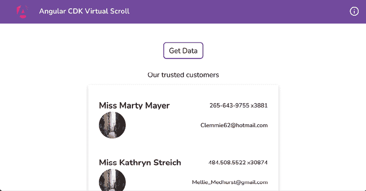

    图 9.1：运行在 http://localhost:4200 的 ng-cdk-virtual-scroll 应用

现在我们已经在本地上运行了应用，让我们在下一节中查看食谱的步骤。

## 如何做到这一点...

我们有一个相当简单的 Angular 应用，但数据量很大。目前，它显示一个加载器（按钮），大约持续几秒钟，然后应该显示数据。然而，你会注意到在 **Tap me** 按钮消失后，加载器仍然显示，按钮无响应，我们看到一个空白屏幕，如下所示：

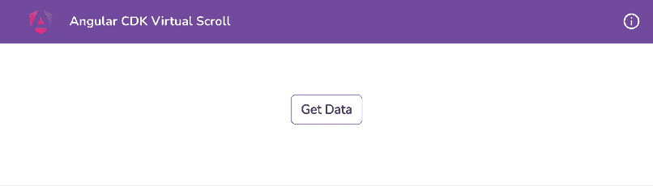

图 9.2：渲染列表项时应用卡在空白屏幕

实际上，我们的整个应用变得无响应。如果你滚动通过项目，或者甚至悬停在项目上，你会看到列表项上的悬停动画不流畅，有点卡顿。让我们看看使用 Angular CDK 虚拟滚动来提高渲染性能的步骤，如下所示：

1.  我们已经在工作区中安装了 Angular CDK。然而，如果你需要安装它，你将需要在项目的根目录中运行以下命令：

    ```js
    cd start && npm install --save @angular/cdk 
    ```

1.  如果你重新安装了包，可能需要重新启动你的 Angular 服务器，所以再次运行 `npm run serve ng-cdk-virtual-scroll` 命令。

1.  将 `ScrollingModule` 类从 `@angular/cdk` 包导入到 `users-list.component.ts` 文件中，如下所示：

    ```js
    ...
    **import** **{** **ScrollingModule** **}** **from****'@angular/cdk/scrolling'****;**
    @Component({
      ...,
      imports: [CommonModule, **ScrollingModule**]
    })
    export class UsersListComponent {
      @Input() listItems: AppUserCard[] = [];
    } 
    ```

    我们现在必须实现虚拟滚动，修改 `users-list-item.component.html` 文件以使用 `*cdkVirtualFor` 指令而不是 `*ngFor` 指令，并将 `<li>` 元素包裹在 `<cdk-virtual-scroll-viewport>` 元素内，如下所示：

    ```js
    <h4 class="heading">Our trusted customers</h4>
    <ul>
    <cdk-virtual-scroll-viewport class="list list-group p-2"
      [itemSize]="120">
    <li class="list__item list-group-item my-2 rounded-md p -4"
          *cdkVirtualFor="let item of listItems">
          ...
        </li>
    </cdk-virtual-scroll-viewport>
    </ul> 
    ```

    注意，我们将 CSS 类 `"list list-group p-2"` 从 `<ul>` 元素移动到了 `<cdk-virtual-scroll-viewport>` 元素。

咚！只需几步，通过使用 Angular CDK 虚拟滚动，我们就能够在我们的 Angular 应用中修复一个巨大的性能渲染问题。参见下一节了解它是如何工作的。

## 它是如何工作的…

Angular CDK 提供了滚动 API，包括 `*cdkVirtualFor` 指令和 `<cdk-virtual-scroll-viewport>` 元素。必须将 `<cdk-virtual-scroll-viewport>` 包裹应用于具有 `*cdkVirtualFor` 指令的元素。注意，我们在 `cdk-virtual-scroll-viewport` 元素上有一个名为 `[itemSize]` 的属性，其值设置为 `"120"`。这是因为每个列表项的高度大约为 120 像素，如下面的截图所示：

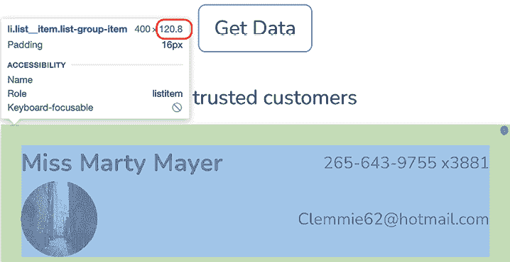

图 9.3：每个列表项的高度大约为 120 像素

但它是如何提高渲染性能的呢？很高兴你问了！在这个菜谱的原始代码中，当我们加载 270,000 个用户时，它会为每个用户创建一个具有 `class="list__item list-group-item"` 属性的单独 `<li>` 元素，从而一次性创建了 270,000 个 DOM 元素。有了虚拟滚动，CDK 只创建几个 `<li>` 元素，渲染它们，然后在我们滚动通过项目时，只替换这些几个 `<li>` 元素的 内容。

对于我们的示例，它创建了 6 个 `<li>` 元素，如下面的截图所示：

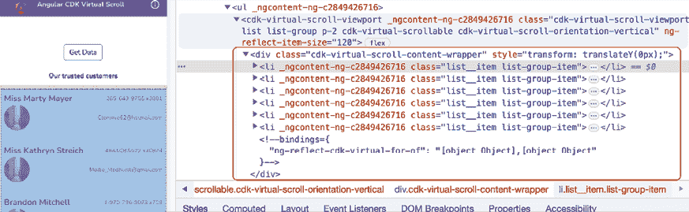

图 9.4：由于虚拟滚动，仅显示 DOM 上渲染的几个 <div> 元素

由于我们只渲染了少量元素在 DOM 上，我们不再有性能问题，并且悬停动画现在看起来也非常平滑。

在您自己的应用程序中实现虚拟滚动时，请确保为 `<cdk-virtual-scroll viewport>` 元素设置一个特定的高度，并将 `[itemSize]` 属性设置为像素中预期的列表项高度，否则列表将不会显示。

## 参见

+   Angular CDK 滚动示例：[`material.angular.io/cdk/scrolling/examples`](https://material.angular.io/cdk/scrolling/examples)

# 列表的键盘导航

可访问性是构建具有良好用户体验的应用程序最重要的方面之一。应用程序不仅应该快速且性能出色，还应该易于访问。虽然涉及到可访问性有很多事情需要考虑，但在本食谱中，我们将通过提供键盘导航来使列表和列表项更加易于访问。使用 Angular CDK，这非常简单。我们将使用 Angular CDK 中的 `ListKeyManager` 服务来实现目标应用程序中用户列表的键盘导航。

## 准备工作

我们将要工作的应用程序位于克隆的仓库中的 `start/apps/chapter09/ng-cdk-lkm` 内：

1.  在您的代码编辑器中打开代码仓库。

1.  打开终端，导航到代码仓库目录，并运行以下命令以启动项目：

    ```js
    npm run serve ng-cdk-lkm 
    ```

    这应该在新的浏览器标签页中打开应用程序，您应该看到以下内容：

    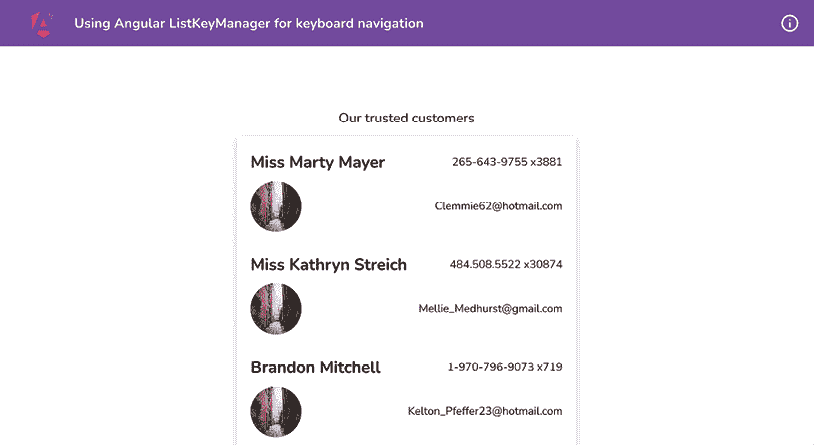

    图 9.5：在 http://localhost:4200 上运行的 ng-cdk-lkm 应用

现在我们已经在本地运行了应用程序，让我们在下一节中查看食谱的步骤。

## 如何实现

我们有一个已经拥有一些 Angular CDK 优点（即，它已经实现了从先前食谱中的虚拟滚动）的应用程序。我们现在将开始修改应用程序以实现键盘导航，如下所示：

1.  首先，我们将实现 `FocusableOption` 接口和一些可访问性因素到我们的 `UsersListItemComponent` 类中，如下所示：

    ```js
    import { Component, HostBinding, Input, ViewEncapsulation } from '@angular/core';
    ...
    **import** **{** **FocusableOption** **}** **from****'@angular/cdk/a11y'****;**
    @Component({
      ...,
      styleUrls: ['./users-list-item.component.scss'],
      encapsulation: ViewEncapsulation.None,
    })
    export class UsersListItemComponent **implements** **FocusableOption** {
      @Input() item!: Partial<AppUserCard>;
      @HostBinding('tabIndex')
      tabIndex = -1;
      @HostBinding('role')
      role = 'list-item';
      **focus****() {}**
    } 
    ```

1.  我们现在需要实现 `focus` 方法中发生的事情。我们将使用 `ElementRef` 服务来获取 `nativeElement` 并将焦点设置在 `nativeElement` 上，如下所示：

    ```js
    import { Component, **ElementRef****,** HostBinding, Input, ViewEncapsulation, inject } from '@angular/core';
    ...
    export class UsersListItemComponent implements FocusableOption {
      ...
      role = 'list-item';
      **el =** **inject****(****ElementRef****);**
    focus() {
        **this****.el.nativeElement.****focus****();**
      }
    } 
    ```

1.  我们现在将添加一些列表本身的可访问性。按照以下方式更新文件 `users-list.component.ts`：

    ```js
    import { Component, **HostBinding**, Input } from '@angular/core';
    ...
    export class UsersListComponent {
      **@HostBinding****(****'role'****)**
    **role =** **'list'****;**
    @Input() listItems: AppUserCard[] = [];
    } 
    ```

1.  我们现在需要在我们的 `UsersListComponent` 类中实现 `FocusKeyManager` 类。我们将在组件中查询我们的列表项以创建 `FocusKeyManager` 类的实例。按照以下方式更新 `users-list.component.ts` 文件：

    ```js
    import { Component, HostBinding, Input, QueryList, ViewChildren } from '@angular/core';
    ...
    **import** **{** **FocusKeyManager** **}** **from****'@angular/cdk/a11y'****;**
    ...
    export class UsersListComponent {
      @HostBinding('role')
      role = 'list';
      @Input() listItems: AppUserCard[] = [];
      @ViewChildren(UsersListItemComponent)
      listItemsElements!: QueryList<UsersListItemComponent>;
      **private** **listKeyManager!:** **FocusKeyManager****<****UsersListItemComponent****>;**
    } 
    ```

1.  我们现在将在同一文件中的 `AfterViewInit` 钩子中初始化 `FocusKeyManager` 实例。按照以下方式更新 `users-list.component.ts` 文件：

    ```js
    import { **AfterViewInit****,** Component, HostBinding, Input, QueryList, ViewChildren } from '@angular/core';
          ...
    export class UsersListComponent **implements** **AfterViewInit** {
      ...
      **ngAfterViewInit****() {**
    **this****.listKeyManager =** **new** **FocusKeyManager****(**
    **this****.listItemsElements**
    **);**
    **}**
    } 
    ```

1.  最后，我们需要监听键盘事件。为此，你可以使用`keydown`事件或`window:keydown`事件。为了简化配方，我们将使用`window:keydown`事件，因为按下任何键都会将事件冒泡到`window`对象。按照以下方式更新文件：

    ```js
    import { AfterViewInit, Component, HostBinding, **HostListener****,** Input, QueryList, ViewChildren } from '@angular/core';
    ...
    export class UsersListComponent implements AfterViewInit {
      ...
      **@HostListener****(****'window:keydown'****, [****'$event'****])**
    **onKeydown****(****event****:** **KeyboardEvent****) {**
    **this****.listKeyManager.****onKeydown****(event);**
    **}**
      ...
    } 
    ```

    如果你进入应用并按下向下箭头键，你应该看到列表中第一个项被聚焦，你可以使用箭头键导航到下一个和上一个项并将它们聚焦。

1.  为了让配方更有趣，让我们也实现一个事件监听器，用于当用户在特定项上按下*Enter*键时。我们只需显示一个带有项详细信息的警告框。让我们在`users-list-item.component.ts`文件中使用`HostListener`装饰器，如下所示：

    ```js
    import { Component, ElementRef, HostBinding, **HostListener****,** Input, ViewEncapsulation, inject } from '@angular/core';
    ...
    export class UsersListItemComponent implements FocusableOption {
      ...
      role = 'list-item';
      **@HostListener****(****'keyup'****, [****'****$event'****])**
    **onEnter****(****ev****:** **KeyboardEvent****) {**
    **if** **(ev.code ===** **'Enter'****) {**
    **alert****(****'Selected item is: '** **+**
     **JSON****.****stringify****(****this****.item));**
    **}**
    **}**
      ...
    } 
    ```

    通过上述更改，你应该能够看到所选项，如下面的图所示：

    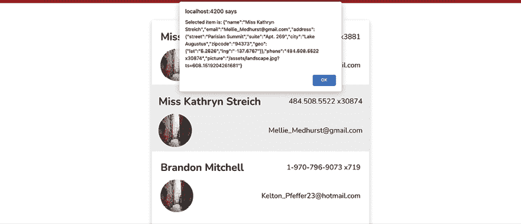

    图 9.6：所选项 JSON 在警告框中显示

太棒了！你已经学会了如何使用 Angular CDK 实现键盘导航。参见下一节了解它是如何工作的。

## 它是如何工作的…

Angular CDK 提供了`ListKeyManager`类，它允许你实现键盘导航。我们可以使用`ListKeyManager`类的一组技术，并且在这个配方中，我们选择了`FocusKeyManager`类。为了使其适用于项目列表，我们需要做以下几件事情：

1.  我们确保列表中的每一项都有一个组件。

1.  在列表组件中使用了`ViewChildren`与`QueryList`来查询所有列表项组件。`ViewChildren`是一个属性装饰器，它使用`QueryList`从 DOM 中检索所有的`UsersListItemComponent`元素。如果列表中的项被添加、删除或更新，`QueryList`会自动更新。

1.  然后，我们在列表组件中创建了一个`FocusKeyManager`类的实例，这样我们就可以初始化列表项组件元素。

1.  在列表组件中添加了一个键盘监听器，并将事件传递给`FocusKeyManager`类的实例。

当我们在`UsersListComponent`类中定义`listKeyManager`属性时，我们还通过指定它为`FocusKeyManager<UsersListItemComponent>`来定义其类型。这使得更容易理解我们的`FocusKeyManager`类应该与`UsersListItemComponent`元素数组一起工作。因此，在`ngAfterViewInit`方法中，我们指定`this.listKeyManager = new FocusKeyManager(this.listItemsElements);`，这提供了一个查询到的`UsersListItemComponent`元素列表。

最后，当我们监听`window:keydown`事件时，我们在处理程序中接收到的`keydown`事件，并将其提供给我们的`FocusKeyManager`类实例作为`this.listKeyManager.onKeydown(event);`。这告诉我们的`FocusKeyManager`实例哪个键被按下以及它必须做什么。

注意，我们的 `UsersListItemComponent` 类实现了 `FocusableOption` 接口，并且它还有一个 `focus` 方法，当按下键盘上的向下或向上箭头键时，`FocusKeyManager` 类会在幕后使用这个方法。

最后，我们还使用了两个带有 `HostBinding` 装饰器的属性。让我们逐一分析它们：

```js
@HostBinding('tabIndex') and tabIndex = -1; 
```

这里使用 `HostBinding` 装饰器将一个类属性（`tabIndex`）绑定到一个宿主元素的属性（`tabIndex`）。这实际上将组件宿主元素的 `tabIndex` 设置为 `-1`，使其可以通过编程方式聚焦，但不能通过顺序键盘导航访问。

```js
@HostBinding('role') and role = 'list-item'; 
```

同样，上面的代码将类的角色属性绑定到组件宿主元素的 `role` 属性。它将 ARIA 角色列表项分配给宿主元素，为辅助技术提供有关如何解释此元素的提示。

现在你已经了解了食谱的工作原理，请查看下一节中的相关链接。

## 参考信息

+   Angular CDK 可访问性文档：[`material.angular.io/cdk/a11y/overview`](https://material.angular.io/cdk/a11y/overview)

+   `ViewChildren` 官方文档：[`angular.io/api/core/ViewChildren`](https://angular.io/api/core/ViewChildren)

# 使用 Overlay API 的尖锐小弹出框

这本书中的高级食谱之一，特别是对于那些已经使用 Angular 工作了相当一段时间的人来说。在这个食谱中，我们不仅将使用 **CDK Overlay API** 创建一些 **弹出框**，而且还会使它们尖锐，就像工具提示一样，这就是其中的乐趣所在。

## 准备工作

我们将要工作的应用位于克隆的仓库中的 `start/apps/chapter09/ng-cdk-popover`：

1.  在你的代码编辑器中打开代码仓库。

1.  打开终端，导航到代码仓库目录，并运行以下命令以启动项目：

    ```js
    npm run serve ng-cdk-popover 
    ```

    这应该在新的浏览器标签页中打开应用，你应该看到以下内容：

    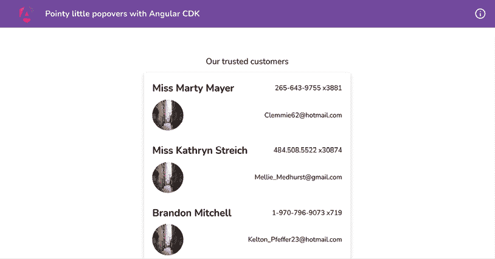

    图 9.7：运行在 http://localhost:4200 上的 ng-cdk-popover 应用

现在我们已经在本地上运行了应用，让我们在下一节中查看食谱的步骤。

## 如何操作…

我们的应用有一个用户列表，我们可以在页面上滚动浏览。我们将在每个项目上添加一个弹出菜单，以便显示一个包含一些操作的下拉菜单。我们已安装了 `@angular/cdk` 包，因此我们不需要担心这一点。让我们从以下食谱开始：

1.  我们首先添加 Overlay 的默认样式，以便当 Overlay 显示时，它能够正确定位。打开 `src/styles.scss` 文件，并按照以下片段更新它：

    [`ng-cookbook.com/s/cdk-pane-styles`](https://ng-cookbook.com/s/cdk-pane-styles)

1.  现在，我们将创建变量来保存 Overlay 的原点（用于打开的 Overlay 的位置原点）和实际相对位置设置。打开 `users-list.component.ts` 文件，并按照以下方式更新它：

    ```js
    ...
    import { CdkOverlayOrigin, **ConnectedPosition****,** OverlayModule } from '@angular/cdk/overlay';
    ...
    @Component({
      ...,
      imports: [..., OverlayModule],
    })
    export class UsersListComponent {
      @Input() listItems: AppUserCard[] = [];
      popoverMenuOrigin!: CdkOverlayOrigin | null;
      **menuPositions****:** **ConnectedPosition****[] = [**
    **{** **offsetY****:** **4****,** **originX****:** **'****end'****,** **originY****:** **'bottom'****,**
    **overlayX****:** **'end'****,** **overlayY****:** **'top'** **},**
    **{** **offsetY****:** **-4****,** **originX****:** **'****end'****,** **originY****:** **'top'****,** **overlayX****:**
    **'end'****,** **overlayY****:** **'bottom'** **},**
    **];**
         } 
    ```

1.  现在，打开`users-list.component.html`文件，并将`cdkOverlayOrigin`指令添加到`<app-users-list-item>`选择器中，以便我们可以将每个列表项作为弹出菜单的起点，如下所示：

    ```js
    <h4 class="heading">Our trusted customers</h4>
    <ul>
    <cdk-virtual-scroll-viewport class="list list-group p-2"
        [itemSize]="120">
    <app-users-list-item
     class="list__item"
     **cdkOverlayOrigin** #menuTrigger="cdkOverlayOrigin"
          *cdkVirtualFor="let item of listItems"
          [item]="item">
    </app-users-list-item>
    </cdk-virtual-scroll-viewport>
    </ul> 
    ```

1.  我们需要以某种方式将模板中的`#menuTrigger`变量传递到`UsersListComponent`类中，以将其值分配给`popoverMenuOrigin`属性。为此，在`users-list.component.ts`文件中创建一个名为`openMenu`的方法，如下所示：

    ```js
    ...
    export class UsersListComponent {
      ...
       **openMenu****(****$event****:** **Event****,** **itemTrigger****:** **CdkOverlayOrigin****) {**
    **if** **($event) {**
    **$event.****stopImmediatePropagation****();**
    **}**
    **this****.popoverMenuOrigin = itemTrigger;**
    **}**
    } 
    ```

1.  我们还需要一个属性来显示/隐藏弹出菜单。让我们创建它，并在`openMenu`方法中将它设置为`true`。按照以下方式更新`users-list.component.ts`文件：

    ```js
    ...
    export class UsersListComponent{
      ...
      menuShown = false;
      ...
      openMenu($event: Event, itemTrigger: CdkOverlayOrigin) {
        if ($event) {
          $event.stopImmediatePropagation();
        }
        this.popoverMenuOrigin = itemTrigger;
        **this****.menuShown** **=** **true****;**
      }
      closeMenu() {
        this.popoverMenuOrigin = null;
        this.menuShown = false;
      }
      ...
    } 
    ```

1.  我们现在将创建一个实际的覆盖层。为此，我们将创建一个带有`cdkConnectedOverlay`指令的`<ng-template>`元素。在`users-list.component.html`文件的底部，添加以下链接中的代码`(<ng-template>` `element)`：

    [`ng-cookbook.com/s/ng-popover-overlay`](https://ng-cookbook.com/s/ng-popover-overlay)

1.  我们需要将每个列表项上的`#menuTrigger`变量传递给点击列表项时的`openMenu`方法。按照以下方式更新文件：

    ```js
    <h4 class="heading">Our trusted customers</h4>
    <ul>
    <cdk-virtual-scroll-viewport class="list list-group p-2"
      [itemSize]="120">
    <app-users-list-item
     class="list__item"
     cdkOverlayOrigin #menuTrigger="cdkOverlayOrigin"
          *cdkVirtualFor="let item of listItems"
     **(****click****)=****"openMenu($event, menuTrigger)"**
     **[****class.list__item--active****]=****"popoverMenuOrigin ===** **menuTrigger"**
          [item]="item">
    </app-users-list-item>
    </cdk-virtual-scroll-viewport>
    </ul>
    ... 
    ```

    如果你现在刷新应用程序并点击任何列表项，你应该会看到一个下拉菜单，如下所示：

    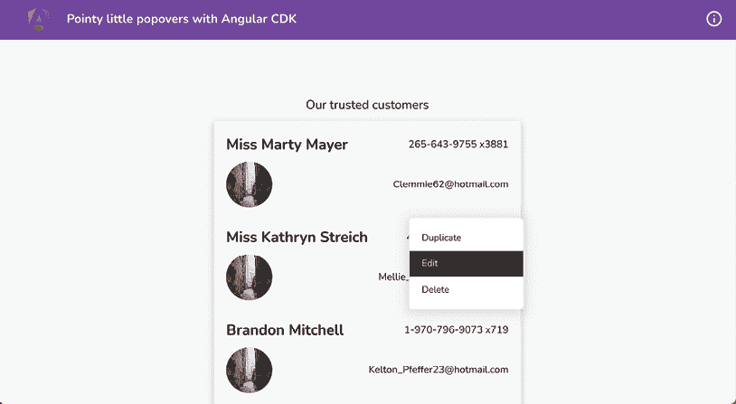

    图 9.8：每个列表项的工作下拉菜单

1.  我们现在需要实现显示带有下拉菜单的尖锐小箭头的部分，以便我们可以将下拉菜单与列表项关联起来。首先，将以下样式添加到`src/styles.scss`文件中的`menu-popover`类中：

    ```js
    ...
    .menu-popover {
      ...
      &::before {
        top: -10px;
        border-width: 0px 10px 10px 10px;
        border-color: transparent transparent white
         transparent;
        position: absolute;
        content: '';
        right: 5%;
        border-style: solid;
      }
      &--up {
        transform: translateY(-20px);
        &::before {
          top: unset !important;
          transform: rotate(180deg);
          bottom: -10px;
        }
      }
      &__list {...}
    } 
    ```

    你现在应该能够在下拉菜单的右上角看到一个尖锐的箭头，但如果你尝试点击屏幕上的最后一个项，你会看到下拉菜单向上打开，但仍然显示指针在顶部，如下所示：

    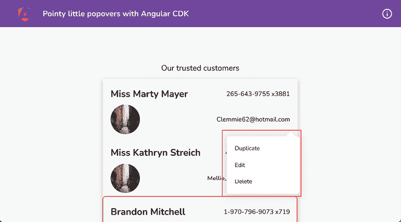

    图 9.9：指向错误列表项的下拉箭头

1.  要指向弹出/下拉菜单的实际起点，我们需要实现一个自定义指令，将自定义类应用于弹出。让我们首先创建一个指令，如下所示：

    ```js
    cd start && nx g directive positional-popover-class --directory apps/chapter09/ng-cdk-popover/src/app/directives 
    ```

1.  根据以下代码片段更新`popover-positional-class.directive.ts`生成的文件：

    [`ng-cookbook.com/s/popover-pc-directive`](https://ng-cookbook.com/s/popover-pc-directive)

1.  让我们在`users-list.component.ts`文件中导入`PopoverPositionalClassDirective`类，以便我们可以在模板中稍后使用它。按照以下方式更新代码：

    ```js
    ...
    **import** **{** **PopoverPositionalClassDirective** **}** **from****'../../directives/popover-positional-class.directive'****;**
    @Component({
      ...
      imports: [CommonModule, ScrollingModule, UsersListItemComponent, OverlayModule, **PopoverPositionalClassDirective**]
    })
    ... 
    ```

1.  现在，打开`users-list.component.html`文件，将我们的指令应用到`<ng-template>`元素上。按照以下方式更新文件：

    ```js
    ...
    <ng-template 
     cdkConnectedOverlay 
     ...
      (backdropClick)="closeMenu()"
      [cdkConnectedOverlayPositions]="menuPositions"
     **appPopoverPositionalClass****targetSelector****=****".menu-popover"**
      **inverseClass****=****"menu-popover--up"** 
      [originY]="popoverMenuPosition.originY"
      (positionChange)="popoverPositionChanged($event)"
     cdkConnectedOverlayPanelClass="menu-popover"
      >
    <div class="menu-popover__list">
        ...
      </div>
    </ng-template> 
    ```

1.  我们现在需要在`users-list.component.ts`文件中创建一个`popoverMenuPosition`属性和一个`popoverPositionChanged`方法，以跟踪哪个列表项用于打开菜单（用于定位）以及当菜单由于窗口调整大小或内容更改而位置改变时的情况。进一步更新文件如下：

    ```js
    ...
    import { ChangeDetectorRef, Component, Input, inject } from '@angular/core';
    ...
    import { CdkOverlayOrigin, ConnectedOverlayPositionChange, **ConnectedPosition****,** OverlayModule } from '@angular/cdk/overlay';
    @Component({...})
    export class UsersListComponent {
      ...
       cdRef = inject(ChangeDetectorRef); 

      **popoverMenuPosition****:** **Partial****<****ConnectedPosition****> = {**
    **originY****:** **undefined**
    **};**
    **popoverPositionChanged****(****$event****:**
      **ConnectedOverlayPositionChange****) {**
    **if** **(****this****.popoverMenuPosition.originY !==**
      $event.connectionPair.originY) {
          this.popoverMenuPosition.originY = $event.connectionPair.originY;
          }
        this.cdRef.detectChanges();
      }
      ...
    } 
    ```

    哇！如果你现在刷新页面并点击每个列表项，你会看到箭头指向正确的方向。查看以下截图以查看最后一个项目的弹出箭头向下指，因为弹出菜单在项目上方显示：

    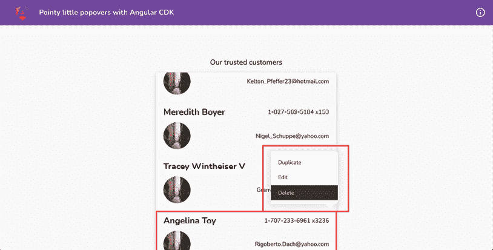

    图 9.10：指向正确列表项的下拉箭头（向下指）

太好了！你现在知道如何使用 Angular CDK 与覆盖层一起创建自定义弹出/下拉菜单。此外，你现在知道如何快速使用自定义指令在菜单上实现尖锐的箭头。查看下一节以了解这一切是如何工作的。

## 它是如何工作的…

使用 Angular CDK Overlay API 实现覆盖层包括几个需要处理的组件。我们首先必须在`UserListComponent`类的导入中导入`OverlayModule`类。我们这样做是因为`OverlayModule`包含我们在应用程序中使用的指令：例如，`CdkConnectedOverlay`指令和`CdkOverlayOrigin`指令。在导入创建覆盖层的模块之后，我们需要有一个覆盖层（在我们的例子中是菜单）和一个覆盖层源（用于打开/显示菜单）。在这个菜谱中，因为我们使用覆盖层为每个列表项创建弹出菜单，所以我们使用`cdkOverlayOrigin`指令在`<app-users-list-item>`元素上。注意，`<app-users-list-item>`元素是通过`*ngFor`指令渲染的。

因此，为了知道哪个项目被点击或确切地知道我们需要为哪个项目显示弹出菜单，我们在每个列表项元素上创建一个`#menuTrigger`模板变量，并且你会注意到我们还绑定了列表项上的`(click)`事件来调用`openMenu`方法，并将这个`menuTrigger`模板变量传递给它。

现在，如果你已经注意到了`users-list.component.ts`文件中的`openMenu`方法，它看起来是这样的：

```js
openMenu($event: Event, itemTrigger: CdkOverlayOrigin) {
    if ($event) {
      $event.stopImmediatePropagation();
    }
    this.popoverMenuTrigger = itemTrigger;
    this.menuShown = true;
} 
```

注意，我们将`itemTrigger`属性分配给我们的类的`popoverMenuOrigin`属性。这是因为这个`popoverMenuOrigin`属性正在与我们的模板中的实际覆盖层绑定。你还可以看到我们设置了`menuShown`属性为`true`，这是因为这将决定覆盖层是否应该显示或隐藏。

现在，让我们看看实际覆盖层的代码，如下所示：

```js
<ng-template cdkConnectedOverlay [cdkConnectedOverlayOrigin]="popoverMenuOrigin!"
  [cdkConnectedOverlayOpen]="menuShown" [cdkConnectedOverlayHasBackdrop]="true"
  (backdropClick)="closeMenu()"
  [cdkConnectedOverlayPositions]="menuPositions"
  appPopoverPositionalClass targetSelector=".menu-popover" inverseClass="menu-popover--up"
**[originY]=****"popoverMenuPosition.originY"**
**(positionChange)=****"popoverPositionChanged($event)"**
  cdkConnectedOverlayPanelClass="menu-popover"
  >
  ...
</ng-template> 
```

让我们逐一讨论`cdkConnectedOverlay`指令的属性：

+   `cdkConnectedOverlay`属性：这是实际的覆盖层指令，它使`<ng-template>`元素成为 Angular CDK 覆盖层。

+   `[cdkConnectedOverlayOrigin]`属性：这告诉覆盖层 API 这个覆盖层的来源。这是为了帮助 CDK 在打开时决定覆盖层的位置。

+   `[cdkConnectedOverlayOpen]`属性：这决定了覆盖层是否应该显示。

+   `[cdkConnectedOverlayHasBackdrop]`属性：这决定了覆盖层是否应有背景——也就是说，如果它有背景，当它打开时，用户不应该能够点击除覆盖层之外的其他任何东西。

+   `(backdropClick)`属性：这是当点击背景时的事件处理器。在这种情况下，我们将`menuShown`属性设置为`false`，这将隐藏/关闭覆盖层。

+   `[cdkConnectedOverlayPositions]`属性：为覆盖 API 提供定位配置。它是一个首选位置数组，定义了覆盖层是否应显示在原点下方、原点上方、左侧、右侧、距离原点有多远等，使用`originX`、`originY`、`overlayX`和`overlayY`等属性。

+   `[cdkConnectedOverlayPanelClass]`属性：应用于生成的覆盖层的 CSS 类。这用于样式化。

在所有属性都设置正确的情况下，我们能够在轻触列表项时看到覆盖层的工作。*“但是，Ahsan，关于尖锐的箭头怎么办？”* 好吧，等等！我们也会讨论它们。

因此，Angular CDK 覆盖 API 已经涵盖了众多功能，包括基于可用空间定位覆盖层的位置，而且我们想要显示尖锐的箭头，所以我们必须分析覆盖层是显示在项目上方还是下方。默认情况下，我们在`src/styles.scss`文件中设置了以下样式，以显示尖锐的箭头在弹出层下方：

```js
.menu-popover {
  ...
  **&****::before** **{**
**top****: -****10px****;**
**border-width****:** **0px****10px****10px****10px****;**
**border-color****: transparent transparent white  transparent;**
**position****: absolute;**
**content****:** **''****;**
**right****:** **5%****;**
**border-style****: solid;**
**}**
  &--up {...}
  &__list {...}
} 
```

然后，我们有一个`--up`修饰符类，如下所示，用于显示在弹出层之上的覆盖层：

```js
.menu-popover {
  ...
  &::before {...}
  &--up {
    **transform****:** **translateY****(-****20px****);**
**&****::before** **{**
**top****: unset** **!important****;**
**transform****:** **rotate****(****180deg****);**
**bottom****: -****10px****;**
**}**
  }
  &__list {...}
} 
180deg to invert its pointer.
```

现在，让我们谈谈如何以及何时应用这个`--up`修饰符类。我们创建了一个名为`appPopoverPositionalClass`的自定义指令。这个指令也应用于我们为覆盖层准备的`<ng-template>`元素——也就是说，这个指令与`cdkConnectedOverlay`指令一起应用，并期望以下输入属性：

+   `appPopoverPositionalClass`属性：实际的指令选择器。

+   `targetSelector`属性：由 Angular CDK 覆盖 API 生成的元素的查询选择器。理想情况下，这应该与我们用于`cdkConnectedOverlayPanelClass`的相同。

+   `inverseClass`属性：当覆盖层的垂直位置（`originY`）改变时应用的类——也就是说，从`"top"`到`"bottom"`，反之亦然。

+   `originY`属性：覆盖层此时的`originY`位置。值是`"top"`或`"bottom"`，基于覆盖层的位置。

我们在 CDK Overlay `<ng-template>` 元素上有一个 `(positionChange)` 监听器，当覆盖层位置改变时立即触发 `popoverPositionChanged` 方法。注意，在 `popoverPositionChanged` 方法中，获取新位置后，我们更新 `popover.originY` 属性，该属性正在更新 `menuPopoverOrigin.originY`，然后我们还将 `menuPopoverOrigin.originY` 作为 `[originY]` 属性传递给我们的 `appPopoverPositionalClass` 指令。由于我们将其传递给指令，指令知道覆盖层位置在任何特定时间是否为 `"top"` 或 `"bottom"`。如何做到的？因为我们使用指令中的 `ngOnChanges` 生命周期钩子来监听 `originY` 属性/输入，一旦我们得到 `originY` 的不同值，我们就会根据 `originY` 属性的值将 `inverseClass` 的值作为 CSS 类添加到 `Overlay` 元素上，或者根据 `originY` 属性的值将其移除。此外，根据应用的 CSS 类，覆盖层的箭头方向也会被确定。

## 参见

+   Angular CDK Overlay API：[`material.angular.io/cdk/overlay/overview`](https://material.angular.io/cdk/overlay/overview)

+   `CdkOverlayOrigin` 指令文档：[`material.angular.io/cdk/overlay/api#CdkOverlayOrigin`](https://material.angular.io/cdk/overlay/api#CdkOverlayOrigin)

# Angular CDK 输入强制转换工具

这就是那种你看到后觉得，“哦，如果我知道这个就好了。” 我确实对 Angular CDK 中的这些强制转换工具有了这样的想法。有很多次，你在 Angular 组件中有一个数值输入，被迫使用方括号表示法 `([myNumberInput]="numberValue")`，因为如果你使用 `"myNumberInput=numberValue"`，它会被解释为字面字符串 `"numberValue"`，而不是变量。Angular CDK 中的强制转换工具正是我们需要的。

## 准备工作

我们将要工作的应用程序位于克隆的仓库中的 `start/apps/chapter09/ng-cdk-coercion`：

1.  在你的代码编辑器中打开代码仓库。

1.  打开终端，导航到代码仓库目录，并运行以下命令以启动项目：

    ```js
    npm run serve ng-cdk-coercion 
    ```

    这应该会在新浏览器标签页中打开应用程序，你应该会看到以下内容：

    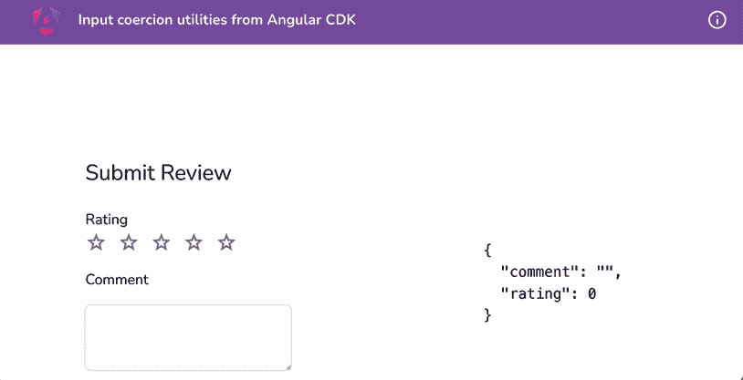

    图 9.11：使用-cdk-coercion 在 http://localhost:4200 上运行

现在我们已经在本地运行了应用程序，让我们在下一节中查看食谱的步骤。

## 如何做到这一点…

我们有一个评分组件，它接受一些输入，包括“value”和“disabled”。然而，我们实际上不能像通常的属性那样使用它们，必须使用方括号表示法为这两个属性进行 Angular 属性绑定。我们将在食谱中修复这个问题。让我们开始吧：

1.  首先，让我们假设我们想要向评分组件添加一个新功能——那就是为评分设置一个最大数字。目前，它默认为 `5`。因此，我们将在 `rating.component.ts` 文件中创建一个新的输入，如下所示：

    ```js
    ...
    export class RatingComponent {
      @Input() value = 2;
      @Input() disabled = false;
      **@Input****() max =** **5****;**
      ...
      get renderArr() {
        return new Array(**this****.****max**).fill(0).map((_, index) =>
      index + 1);
      }
      ...
    } 
    ```

1.  现在，我们将从主组件向评分组件提供最大输入。我们将其值设置为 `8`。但我们将使用常规的 HTML 表示法来提供值。更新 `home.component.html` 文件中 `<app-rating-component>` 的使用，如下所示：

    ```js
     <app-rating
              [value]="reviewForm.controls.rating.value" **max****=****"8"**
              [disabled]="ratingDisabled"
              (valueChanged)="applyRating($event)">
    </app-rating> 
    ```

    你会立即注意到 IDE 抛出错误，因为我们不能将字符串值赋给数字输入。

1.  现在，我们将使用 Angular CDK 的强制转换实用工具来解决这个问题。更新 `rating.component.ts` 文件以使用 `NumberInput` 类型以及 `coerceNumberProperty` 方法，如下所示：

    ```js
    ...
    **import** **{** **NumberInput****, coerceNumberProperty }** **from****'****@angular/cdk/coercion'****;**
    ...
    export class RatingComponent {
      @Input() value = 2;
      @Input() disabled = false;
      **@Input****() get max () {**
    **return****this****.****_max****;**
    **}**
    **set max (****val****:** **NumberInput****) {**
    **this****.****_max** **=** **coerceNumberProperty****(val);**
    **}**
    **private** **_max =** **5****;**
    @Output() valueChanged: EventEmitter<number> = new
      EventEmitter();
      ...
    } 
    ```

    如果你再次检查 `home.component.html` 文件，你会看到错误已经消失，并且应用程序可以无错误地编译。

1.  让我们将 `disabled` 属性也进行强制转换。我们将尝试使用双大括号 `{{}}` 表示法来处理这个输入。更新 `home.component.html` 文件中 `<app-rating>` 元素的使用，如下所示：

    ```js
     <app-rating
              [value]="reviewForm.controls.rating.value"
     max="8"
     **disabled****=****"{{ratingDisabled}}"**
              (valueChanged)="applyRating($event)">
    </app-rating> 
    ```

    你将在 IDE 和编译过程中看到错误：`Type 'string' is not assignable to type 'boolean'`。

1.  为了解决这个问题，让我们在 `rating.component.ts` 文件中使用 `BooleanInput` 和 `coerceBooleanProperty` 方法，如下所示：

    ```js
    ...
    import { **BooleanInput****,** NumberInput, **coerceBooleanProperty**, coerceNumberProperty } from '@angular/cdk/coercion';
    ...
    export class RatingComponent {
      @Input() value = 2;
      **@Input****() get disabled () {**
    **return****this****.****_disabled****;**
    **}**
    **set disabled (****val****:** **BooleanInput****) {**
    **this****.****_disabled** **=** **coerceBooleanProperty****(val);**
    **}**
    **private** **_disabled =** **false****;**
    @Input() get max () {...}
      ...
    } 
    ```

哇！你的代码应该可以无错误地编译，你应该能够提供值而不需要强制使用方括号属性绑定表示法。很棒的是，即使你只是将 `disabled` 属性添加到 `<app-rating>` 元素中，它也会禁用组件，这就是当我们将 `disabled` 属性应用于常规 `input` 元素或 `textarea` 元素时发生的情况。

## 它是如何工作的...

在这个食谱中，我们使用了 Angular CDK 的强制转换实用工具中的两种不同方法。`coerceNumberProperty` 方法以及 `coerceBooleanProperty` 方法。让我们首先看看 `coerceNumberProperty` 方法以及 `NumberInput` 类型。

`NumberInput` 类型解析为 `string | number | null | undefined`，这使得我们可以以任何这些类型提供值。而且当我们不使用方括号表示法进行属性绑定时，值被视为 **字符串**。这似乎被 `NumberInput` 类型所涵盖。`coerceNumberProperty` 方法接受任何值并将其转换为数字。该函数还接受一个可选的第二个参数作为回退值。

`BooleanInput` 类型和使用 `coerceBooleanProperty` 方法的用法与 `NumberInput` 类型和使用 `coerceNumberProperty` 方法非常相似。然而，不同之处在于 `coerceBooleanProperty` 方法接受任何值并将其转换为布尔值。此方法的逻辑略有不同，因为它寻找以下条件：

```js
value != null && `${value}` !== 'false' 
```

这意味着如果属性没有提供值，它将是一个空字符串。即使空字符串是一个假值，使用 `coerceBooleanProperty`，没有值（空字符串）的属性将解析为真值。

## 相关内容

+   CDK 强制转换文档：[`material.angular.io/cdk/coercion/overview`](https://material.angular.io/cdk/coercion/overview)

# 使用 CDK 拖放 API 将项目从一个列表移动到另一个列表

你是否曾经使用过 Trello 板应用，或者可能是其他也允许你将列表项从一个列表拖放到另一个列表的应用？嗯，你可以很容易地使用 Angular CDK 做到这一点，在这个食谱中，你将学习如何使用 **Angular CDK 拖放 API** 将项目从一个列表移动到另一个列表。你还将学习如何重新排序列表。

## 准备工作

我们将要工作的应用位于克隆的仓库中的 `start/apps/chapter09/ng-cdk-drag-drop` 目录内：

1.  在你的代码编辑器中打开代码仓库。

1.  打开终端，导航到代码仓库目录，并运行以下命令以运行项目：

    ```js
    npm run serve ng-cdk-drag-drop to serve the project. 
    ```

    这应该在新的浏览器标签页中打开应用，你应该能看到以下内容：

    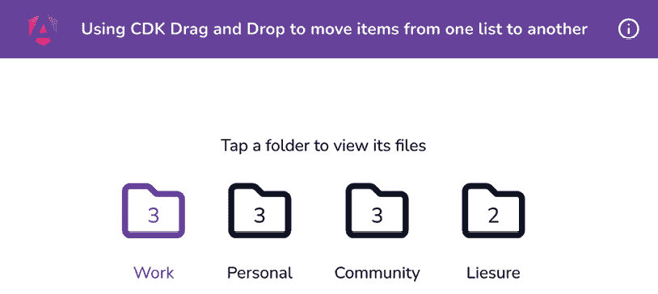

    图 9.12：运行在 http://localhost:4200 的 ng-cdk-drag-drop 应用

现在我们已经在本地上运行了应用，让我们看看下一节中食谱的步骤。

## 如何做到这一点...

对于这个食谱，我们有一个有趣的包含一些文件夹和文件的应用。我们将实现拖放功能，以便文件可以被拖放到其他文件夹中，这将立即更新文件夹的文件计数，并且我们能够在新的文件夹中看到该文件。让我们开始吧。

1.  首先，我们需要导入 `DragDropModule`，因为我们使用的是属于它的 `CdkDrag` 和 `CdkDropList` 指令。我们将把模块导入到 `FoldersListComponent` 类的 `imports` 数组中。修改 `folders-list.component.ts` 文件，如下所示：

    ```js
    ...
    **import** **{** **DragDropModule** **}** **from****'@angular/cdk/drag-drop'****;**
    @Component({
      ...
      imports: [CommonModule, FileComponent, FolderComponent, **DragDropModule**],
      standalone: true
    })
    ... 
    ```

1.  现在，我们将把 `cdkDrag` 指令应用到我们每个文件上，并将 `cdkDropList` 指令应用到每个文件夹上。更新 `folders-list.component.html` 文件，如下所示：

    ```js
    <div class="folders">
      ...
      <div class="folders__list">
    <app-folder
     **cdkDropList**
     ...
          [folder]="folder"
        >
    </app-folder>
    </div>
    <div class="folders__selected-folder-files"
        *ngIf="selectedFolder">
    <div>
    <app-file
     **cdkDrag**
            *ngFor="let file of selectedFolder.files"
            [file]="file"
          ></app-file>
    </div>
    </div>
    </div> 
    ```

1.  我们还将通过向文件的容器元素添加 `cdkDropList` 指令来启用文件夹内文件的重新排序，如下所示：

    ```js
    <div class="folders">
      ...
      <div class="folders__selected-folder-files"
        *ngIf="selectedFolder">
    <div **cdkDropList**>
    <app-file ...></app-file>
    </div>
    </div>
    </div> 
    ```

1.  我们现在将通过指定每个 `<app-file>` 元素上的 `[cdkDragData]` 属性和每个 `<app-folder>` 元素上的 `[cdkDropListData]` 属性，以及文件容器上的属性来定义拖放交互的起点。再次更新模板，如下所示：

    ```js
    <div class="folders">
      ...
      <div class="folders__list">
    <app-folder
     cdkDropList
     **[****cdkDropListData****]=****"folder.files"**
     ...
        >
    </app-folder>
    </div>
    <div class="folders__selected-folder-files"
        *ngIf="selectedFolder">
    <div
     cdkDropList
     **[****cdkDropListData****]=****"selectedFolder.files"**
        >
    <app-file
     cdkDrag
     **[****cdkDragData****]=****"file"**
     ...
          ></app-file>
    </div>
    </div>
    </div> 
    ```

1.  我们现在需要实现文件被放下时会发生什么。为此，我们将使用 `(cdkDropListDropped)` 事件处理器。更新模板，如下所示：

    ```js
    <div class="folders">
      ...
      <div class="folders__list">
    <app-folder
     cdkDropList
          [cdkDropListData]="folder.files"
     **(****cdkDropListDropped****)=****"onFileDrop($event)"**
     ...
        >
    </app-folder>
    </div>
    <div class="folders__selected-folder-files"
        *ngIf="selectedFolder">
    <div
     cdkDropList
          [cdkDropListData]="selectedFolder.files"
     **(****cdkDropListDropped****)=****"onFileDrop($event)"**
        >
          ...
        </div>
    </div>
    </div> 
    ```

1.  最后，我们需要实现 `onFileDrop` 方法。更新 `folders-list.component.ts` 文件，如下所示：

    ```js
    ...
    import { IFile, IFolder } from '../interfaces';
    ...
    import { **CdkDragDrop****,** DragDropModule, **moveItemInArray****,** **transferArrayItem** } from '@angular/cdk/drag-drop';
    ...
    export class FoldersListComponent {
      ...
      toggleFolderSelect(folder: IFolder) {...}
      **onFileDrop****(****event****:** **CdkDragDrop****<****IFile****[]>) {**
    **if** **(event.previousContainer === event.container) {**
    **moveItemInArray****(**
    **event.container.data, event.previousIndex,**
    **event.currentIndex**
    **);**
    **}** **else** **{**
    **transferArrayItem****(**
    **event.previousContainer****.data, event.container.data,**
    **event.previousIndex, event.currentIndex**
    **);**
    **}**
    **}**
    } 
    ```

    `moveItemInArray`方法和`transferArrayItem`方法是 Angular CDK 内置的。这使得我们的实现变得非常简单。

1.  为了实现拖拽预览，我们需要将 droplists 和可拖拽项包裹在一个带有`cdkDropListGroup`指令的元素中。更新`folders-list.component.html`文件，并将指令应用于具有`folders`类的元素（即顶级），如下所示：

    ```js
    <div class="folders" **cdkDropListGroup**>
    ...
    </div> 
    ```

1.  为了应用自定义拖拽预览，我们使用一个带有`*cdkDragPreview`指令的自定义元素。更新`folders-list.component.html`文件，如下所示：

    ```js
    <div class="folders" cdkDropListGroup>
      ...
      <div class="folders__selected-folder-files"   *ngIf="selectedFolder">
    <div
     cdkDropList
     ...
        >
    <app-file
     cdkDrag
     ...
          >
    **<****fa-icon**
    **class****=****"file-drag-preview"**
    *******cdkDragPreview**
    **[****icon****]=****"file.icon!"**
    **></****fa-icon****>**
    </app-file>
    </div>
    </div>
    </div> 
    ```

1.  为了使`fa-icon`组件正常工作，我们还需要在`FoldersListComponent`类中导入`FontAwesomeModule`模块。更新以下文件，如下所示：

    ```js
    ...
    **import** **{** **FontAwesomeModule** **}** **from****'@fortawesome/angular-fontawesome'****;**
    @Component({
      ...
      imports: [CommonModule, FileComponent, FolderComponent, DragDropModule, **FontAwesomeModule**],
      standalone: true
    })
    ... 
    ```

1.  我们还需要为拖拽预览添加一些样式。更新`folders-list.component.scss`文件，如下所示：

    ```js
    $folder-bg: #f5f5f5;
    **$file-preview-****transition****: transform** **250ms****cubic-bezier****(****0****,**
    **0****,** **0.2****,** **1****);**
    .folders {...}
    **.file-drag-preview** **{**
    **padding****:** **10px****20px****;**
    **background****: transparent;**
    **font-size****:** **32px****;**
    **}**
    **.file-drop-placeholder** **{**
    **min-height****:** **60px****;**
    **transition****: $file-preview-transition;**
    **display****: flex;**
    **align-items****: center;**
    **justify-content****: center;**
    **font-size****:** **32px****;**
    **}** 
    ```

1.  让我们再添加一些样式，以确保在文件夹内重新排序项目时，其他列表项能够平滑移动。由于我们需要为 Angular CDK 中的元素添加样式，并且它们有样式封装，因此我们需要在我们的全局`scss`文件中添加样式。进一步更新`folders-list.component.scss`文件，如下所示：

    ```js
    ... 
    *** {**
    **user-select: none;**
    **}**

    **.cdk-drop-list-dragging****.cdk-drag** **{**
    **transition****: transform** **250ms****cubic-bezier****(****0****,** **0****,** **0.2****,** **1****);**
    **}**

    **.cdk-drag-animating** **{**
    **transition****: transform** **300ms****cubic-bezier****(****0****,** **0****,** **0.2****,** **1****);**
    **}** 
    ```

1.  现在，我们还需要创建一个下拉预览（一个在我们释放拖拽文件之前出现的占位符）模板。为此，我们在`preview`元素上使用`*cdkDragPlaceholder`指令。更新`folders-list.component.html`文件，如下所示：

    ```js
    <div class="folders" cdkDropListGroup>
      ...
      <div class="folders__selected-folder-files" *ngIf="selectedFolder">
    <div cdkDropList ...>
    <app-file cdkDrag ...>
    <fa-icon class="file-drag-preview"
              *cdkDragPreview ... ></fa-icon>
    **<****div****class****=****"file-drop-placeholder"**
    *******cdkDragPlaceholder****>**
    **<****fa-icon** **[****icon****]=****"****upArrow"****></****fa-icon****>**
    **</****div****>**
    </app-file>
    </div>
    </div>
    </div> 
    ```

1.  最后，让我们使用`@fortawesome`包中的`faArrowAltCircleUp`图标创建一个`upArrow`属性。更新`folders-list.component.ts`文件，如下所示：

    ```js
    ...
    **import** **{ faArrowAltCircleUp }** **from****'@fortawesome/free-regular-svg-icons'****;**
    ...
    export class FoldersListComponent {
      folders = APP_DATA;
      **upArrow = faArrowAltCircleUp;**
    selectedFolder: IFolder | null = null;
      ...
    } 
    ```

咚！现在，我们为整个拖拽流程提供了一个无缝的**用户体验**（**UX**）。喜欢吗？请确保在您的 X（Twitter）上分享一个快照，并@我**@codewith_ahsan**。

现在我们已经完成了配方，让我们在下一节中看看它是如何工作的。

## 它是如何工作的...

在这个配方中，有几个有趣的指令，我们将逐一介绍。首先，作为优秀的 Angular 开发者，我们将`DragDropModule`类导入到名为`FoldersListComponent`的`standalone component`的`imports`数组中，以确保我们不会出错。然后，我们开始使文件可拖拽。我们通过在每个文件元素上添加`cdkDrag`指令并应用`*ngFor`指令来实现这一点。这告诉 Angular CDK 该元素将被拖拽，因此 Angular CDK 为每个要拖拽的元素绑定不同的处理器。

重要提示

默认情况下，Angular 组件不是块级元素。因此，当我们将`cdkDrag`指令应用于 Angular 组件，如`<app-file>`组件时，它可能会限制 CDK 在拖拽元素时应用的动画。为了解决这个问题，我们需要为我们的组件元素设置`display: block;`。请注意，我们在`folders-list.component.scss`文件（第 25 行）中为`.folders__selected-folder-files__file`类应用了所需的样式。

在配置拖拽元素后，我们为每个我们打算放下文件的容器 DOM 元素使用`cdkDropList`指令。在我们的菜谱中，这是屏幕上我们看到的每个文件夹，我们还可以重新排列文件夹内的文件。因此，我们将`cdkDropList`指令应用于当前显示文件的包装元素，以及每个通过`*ngFor`循环遍历`folders`数组的`<app-folder>`项目。

然后，我们通过为每个可拖拽文件指定`[cdkDragData]="file"`来指定我们正在拖拽的数据。这有助于我们在稍后过程中识别它，无论是将其放下在当前文件夹内还是其他文件夹内。我们还指定了当拖拽到特定列表上时，这个拖拽项目将被添加到哪个数组中，我们通过为应用了`cdkDropList`指令的元素指定`[cdkDropListData]="ARRAY"`语句来完成这项工作。当 Angular CDK 结合`cdkDragData`和`cdkDropListData`属性的信息时，它可以轻松地识别项目是否被拖拽并在同一列表或另一个列表内放下。

为了处理拖拽文件时可能发生的情况，我们在带有`cdkDropList`指令的元素上使用 Angular CDK 的`(cdkDropListDropped)`方法。我们接收 CDK 发出的`$event`并将其传递给我们的`onFileDrop`方法。令人兴奋的是，在`onFileDrop`方法中，我们使用 Angular CDK 的`moveItemInArray`和`transferArrayItem`辅助方法，通过一段非常简单的逻辑来比较容器。也就是说，Angular CDK 为我们提供了足够的信息，使我们能够非常容易地实现整个功能。

在菜谱的末尾，我们通过在元素上使用自定义模板的`*cdkDragPreview`指令来自定义拖拽文件时的预览外观。这告诉 Angular CDK 不要立即渲染它，而是在我们开始拖拽文件时用鼠标显示它。在我们的菜谱中，我们只显示文件的图标作为拖拽预览。最后，我们还使用`*cdkDragPlaceholder`指令自定义了放下预览（或拖拽占位符），它显示一个带有向上箭头图标的透明矩形，以反映当放下时项目将被添加的位置。当然，我们必须为拖拽预览和放下预览添加一些自定义样式。

## 参见

+   Angular CDK Drag and Drop 文档：[`material.angular.io/cdk/drag-drop/overview`](https://material.angular.io/cdk/drag-drop/overview)

# 使用 CDK Stepper API 创建一个多步游戏

如果你在互联网上尝试寻找 CDK Stepper API 的示例，你会找到许多围绕使用 CDK Stepper API 创建多步表单的文章，但鉴于它本质上是一个步骤器，它可以用于各种用例。在这个菜谱中，我们将使用 Angular CDK Stepper API 构建一个猜谜游戏，用户将猜测掷骰子的输出结果。

## 准备工作

我们将要工作的应用程序位于克隆的仓库中的`start/apps/chapter09/ng-cdk-stepper`目录内：

1.  在你的代码编辑器中打开代码仓库。

1.  打开终端，导航到代码仓库目录，并运行以下命令以运行项目：

    ```js
    npm run serve ng-cdk-stepper 
    ```

    这应该在新的浏览器标签页中打开应用程序，你应该会看到以下内容：

    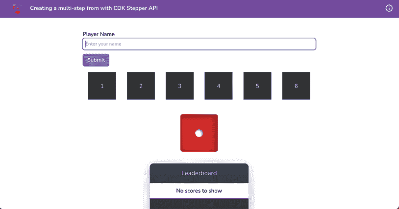

    图 9.13：运行在 http://localhost:4200 的 ng-cdk-stepper 应用程序

现在，让我们在下一节中看看如何使用 CDK Stepper API 创建一个多步游戏。

## 如何做到这一点…

我们手头有一个非常简单但有趣的应用程序，已经构建了一些组件，包括`dice component`、`value-guess component`和`leaderboard component`。我们将使用**Stepper API**将这个游戏作为一个多步游戏来创建。按照以下步骤进行：

1.  首先，在`game.component.ts`文件中从`@angular/cdk`包导入`CdkStepperModule`类，如下所示：

    ```js
    ...
    **import** **{** **CdkStepperModule** **}** **from****'@angular/cdk/stepper'****;**
    @Component({
      ...
      imports: [
        ...
        DiceComponent**,**
    **CdkStepperModule**
      ],
    })
    ... 
    ```

1.  现在让我们创建我们的步骤器组件。在项目根目录下运行以下命令：

    ```js
    cd start && nx g c game-stepper --directory apps/chapter09/ng-cdk-stepper/src/app/components/game-stepper 
    ```

    当被询问时，选择`@nx/angular:component`脚本来创建组件，并选择“按提供”选项。

1.  要使我们的组件成为`CdkStepper`，我们需要使用`CdkStepper`令牌提供它，并且还需要从`CdkStepper`扩展我们的组件类。我们可以移除`constructor`、`OnInit`实现和`ngOnInit`方法。修改`game-stepper.component.ts`文件，如下所示：

    ```js
    ...
    **import** **{** **CdkStepper****,** **CdkStepperModule** **}** **from****'****@angular/cdk/stepper'****;**
    @Component({
      ...
      imports: [CommonModule, **CdkStepperModule**],
      ...
      **providers****: [{** **provide****:** **CdkStepper****,** **useExisting****:**
    **GameStepperComponent** **}],**
    })
    export class GameStepperComponent**extends****CdkStepper** {
    } 
    ```

    `CDKStepper`为我们提供了有用的方法，如`next`、`previous`和`reset`，用于在步骤之间导航，以及`selectedIndexChange`事件发射器，用于识别何时更改了步骤。

1.  让我们添加`<game-stepper>`组件的模板。我们将首先添加将显示步骤标签的标题。更新你的`game-stepper.component.html`文件，如下所示：

    ```js
    <div class="game-stepper">
    <header>
    <h3 *ngIf="selected">
    <ng-container
            *ngIf="selected.stepLabel; else showLabelText"
            [ngTemplateOutlet]="selected.stepLabel.template"
          >
    </ng-container>
    <ng-template #showLabelText>
            {{ selected.label }}
          </ng-template>
    </h3>
    </header>
    </div> 
    ```

1.  现在，我们将添加模板以显示所选步骤的主要内容——这很简单。我们需要添加一个带有`[ngTemplateOutlet]`属性的`div`，我们将在这里显示内容。更新`game-stepper.component.html`文件，如下所示：

    ```js
    <div class="game-stepper">
    <header>...</header>
    **<****section****class****=****"game-stepper__content"****>**
    **<****div** **[****ngTemplateOutlet****]=****"selected ? selected.content :**
    **null"****></****div****>**
    **</****section****>**
      ...
    </div> 
    ```

1.  最后，我们将添加一个包含步骤器导航按钮的页脚元素——也就是说，我们应该能够使用这些导航按钮跳转到下一个和上一个步骤。进一步更新`game-stepper.component.html`文件，如下所示：

    ```js
    <div class="game-stepper">
    <header>...</header>
    <section class="game-stepper__content">...</section>
    **<****footer****class****=****"game-stepper__navigation"****>**
    **<****button** *******ngIf****=****"steps.get(selectedIndex - 1)"**
    **class****=****"game-stepper__navigation__button btn btn**
    **-primary"****cdkStepperPrevious****>**
    **&larr;**
    **</****button****>**
    **<****span****class****=****"flex-1"****></****span****>**
    **<****button** *******ngIf****=****"steps.get(selectedIndex + 1)"**
    **class****=****"game-stepper__navigation__button btn btn-**
    **primary"****cdkStepperNext****>**
    **&rarr;**
    **</****button****>**
    **</****footer****>**
    </div> 
    ```

1.  让我们为我们的`game-stepper`组件添加一些样式。修改`game-stepper.component.scss`文件，如下所示：

    ```js
    .game-stepper {
      display: flex;
      flex-direction: column;
      align-items: center;
      &__navigation {
        width: 100%;
        display: flex;
        align-items: center;
        justify-content: space-between;
        > button {
          margin: 0 8px;
        }
      }

      &__content {
        min-height: 150px;
        display: flex;
        justify-content: center;
        align-items: center;
        flex-direction: column;
      }
      header,
      footer {
        margin: 10px auto;
      }
    } 
    ```

1.  现在，我们想在`game`组件内部使用`game stepper`组件。为此，首先在`GameComponent`类的`imports`数组中导入它，如下所示：

    ```js
    ...
    **import** **{** **GameStepperComponent** **}** **from****'../components/game-stepper/game-stepper.component'****;**
    @Component({
      ...
      imports: [
        ...
        **GameStepperComponent**
      ],
    }) 
    ```

1.  现在，我们将使用`<app-game-stepper>`组件将整个模板包裹在`game.component.html`文件中。更新文件，如下所示：

    ```js
    <app-game-stepper>
    <form (ngSubmit)="submitName()"
      [formGroup]="nameForm">...</form>
    <app-value-guesser></app-value-guesser>
    <app-dice></app-dice>
    <app-leader-board></app-leader-board>
    </app-game-stepper> 
    ```

1.  现在，我们将修改`game.component.html`文件，将内部模板分解为步骤。为此，我们将使用`<cdk-step>`元素来包裹每个步骤的内容。更新文件，如下所示：

    ```js
    <app-game-stepper>
    <cdk-step>
    <form (ngSubmit)="submitName()"
          [formGroup]="nameForm">
          ...
        </form>
    </cdk-step>
    <cdk-step>
    <app-value-guesser></app-value-guesser>
    <app-dice></app-dice>
    </cdk-step>
    <cdk-step>
    <app-leader-board></app-leader-board>
    </cdk-step>
    </app-game-stepper> 
    ```

1.  现在，我们将为每个步骤添加一个标签。我们需要在每个`<cdk-step>`元素内部添加一个`<ng-template>`元素。更新`game.component.html`文件，如下所示：

    ```js
    <app-game-stepper>
    <cdk-step>
    <**ng-template****cdkStepLabel****>****Enter your name****</****ng-**
    **template****>**
    <form (ngSubmit)="submitName()"     [formGroup]="nameForm">
          ...
        </form>
    </cdk-step>
    <cdk-step>
    **<****ng-template****cdkStepLabel****>**
    **Guess what the value will be when the die is rolled**
    **</****ng-template****>**
    <app-value-guesser></app-value-guesser>
    <app-dice></app-dice>
    </cdk-step>
    <cdk-step>
    <ng-template cdkStepLabel>Results</ng-template>
    <app-leader-board></app-leader-board>
    </cdk-step>
    </app-game-stepper> 
    ```

    如果你刷新应用程序，你应该看到第一个步骤作为可见步骤，以及底部的导航按钮，如下所示：

    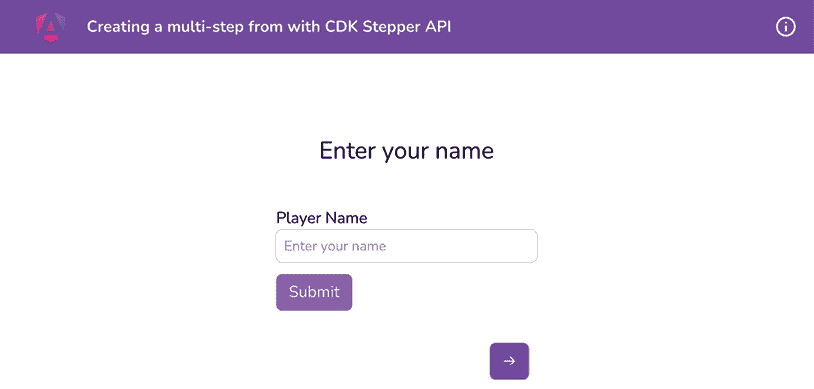

    图 9.14：使用 CDKStepper 的第一步和导航按钮

1.  现在，我们需要确保只有在第一步输入了姓名后，我们才能向前移动到第二步。对`game.component.html`文件进行以下更改：

    ```js
    <app-game-stepper **[****linear****]=****"true"**>
    <cdk-step **[****completed****]=****"!!nameForm.get('name')!.value"**>
    <ng-template cdkStepLabel> Enter your
          name</ng-template>
    <form (ngSubmit)="submitName()"
          [formGroup]="nameForm">
    <div class="mb-3" *ngIf="nameForm.get('name') as
            nameControl">
            ...
          </div>
    **<****button** **←** **REMOVE****THIS**
    **type****=****"submit"**
    **[****disabled****]=****"!nameForm.valid"**
    **class****=****"btn btn-primary"**
    **>**
    **Submit**
    **</****button****>**
    </form>
    </cdk-step>
      ...
    </app-game-stepper> 
    ```

1.  我们还需要在第一步输入玩家姓名之前禁用第一个步骤的“下一步”按钮。为此，更新`game-stepper.component.html`文件——特别是具有`cdkStepperNext`属性的元素——如下所示：

    ```js
    <section class="game-stepper">
      ...
      <footer class="game-stepper__navigation">
        ...
        <button
     class="game-stepper__navigation__button btn
            btn-primary"
     cdkStepperNext
     **[****disabled****]=****"!selected!.completed"**
          [style.visibility]="steps.get(selectedIndex + 1) ?
            'visible' : 'hidden'"
        >
    &rarr;
    </button>
    </footer>
    </section> 
    ```

1.  要处理用户提供姓名并按下*Enter*键的情况，导致表单提交，我们可以在`GameComponent`类中使用`@ViewChild()`跳到下一个步骤。修改`game.component.ts`文件如下，然后尝试输入姓名并按下*Enter*键：

    ```js
    import { CommonModule } from '@angular/common';
    import { Component, **ViewChild** } from '@angular/core';
    import { **CdkStepper**, CdkStepperModule } from '@angular/cdk/stepper';
    ...
    export class GameComponent {
      **@ViewChild****(****CdkStepper****) stepper!:** **CdkStepper****;**
      ...
      submitName() {
        **this****.****stepper****.****next****();**
      }
    } 
    ```

1.  现在，让我们编写猜测数字的流程。更新`game.component.ts`文件，如下所示：

    ```js
    ...
    **import** **{** **IDiceSide** **}** **from****'../interfaces/dice.interface'****;**
    @Component({...})
    export class GameComponent implements OnInit {
      @ViewChild(CdkStepper) stepper: CdkStepper;
      **@ViewChild****(****DiceComponent****) diceComponent!:** **DiceComponent****;**
    **@ViewChild****(****ValueGuesserComponent****)**
    **valueGuesserComponent!:** **ValueGuesserComponent****;**
    **guessedValue****:** **number** **|** **null** **=** **null****;**
    **isCorrectGuess****:** **null** **|** **boolean** **=** **null****;**
      ...
      submitName() {...}
      **rollTheDice****(****guessedValue****:** **number****) {**
    **this****.****isCorrectGuess** **=** **null****;**
    **this****.****guessedValue** **= guessedValue;**
    **this****.****diceComponent****.****rollDice****();**
    **}**
    **showResult****(****diceSide****:** **IDiceSide****) {**
    **this****.****isCorrectGuess** **=** **this****.****guessedValue** **===**
    **diceSide.****value****;**
    **}**
    } 
    ```

1.  现在我们已经设置了函数，让我们更新模板以监听`<app-value-guesser>`和`<app-dice>`组件的事件监听器并相应地执行。我们还将添加具有 class alerts 的元素以显示成功或错误猜测的消息。更新`game.component.html`文件，如下所示：

    ```js
    <app-game-stepper [linear]="true">
    <cdk-step [completed]="!!nameForm.get('name').value">
        ...
      </cdk-step>
    <cdk-step **[****completed****]=****"isCorrectGuess !== null"**>
    <ng-template cdkStepLabel
          >Guess what the value will be when the die is
            rolled</ng-template
        >
        <app-value-guesser [rolling]="rolling" **(****valueGuessed****)=**
    **"rollTheDice($event)"**></app-value-guesser>
    <app-dice (diceRolling)="rolling = $event;"
      **(****diceRolled****)=****"showResult($event)"**></app-dice>
    **<****ng-container** **[****ngSwitch****]=****"isCorrectGuess"****>**
    **<****div****class****=****"alert alert-success"**
    *******ngSwitchCase****=****"true"****>**
    **You rock {{ nameForm.get('name')!.value }}! You got**
    **50 points**
    **</****div****>**
    **<****div****class****=****"alert alert-danger"**
    *******ngSwitchCase****=****"false"****>**
    **Oops! Try again!**
    **</****div****>**
    **</****ng-container****>**
    </cdk-step>
    <cdk-step>...</cdk-step>
    </app-game-stepper> 
    ```

1.  最后，我们需要填充排行榜。更新`game.component.ts`文件以使用`LeaderboardService`类，如下所示：

    ```js
    ...
    import { Component, ViewChild, **inject** } from '@angular/core';
    ...
    **import** **{** **LeaderboardService** **}** **from****'../services/leaderboard.service'****;**
    **import** **{** **IScore** **}** **from****'../interfaces/score.interface'****;**
    ...
    export class GameComponent {
      ...
      **leaderboardService =** **inject****(****LeaderboardService****);**
    **scores****:** **IScore****[] =** **this****.****leaderboardService****.****getScores****();**
      ...
      showResult(diceSide: IDiceSide) {
        this.isCorrectGuess = this.guessedValue ===
          diceSide.value;
        **const** **userName =** **this****.****nameForm****.****controls****.****name****.****value****as**
    **string****;**
    **if** **(!****this****.****isCorrectGuess****) {**
    **return****;**
    **}**
    **this****.****scores** **=** **this****.****leaderboardService****.****setScores****({**
    **name****: userName,**
    **score****:** **50****,**
    **});**
    **}**
    } 
    ```

1.  现在，更新`game.component.html`文件，将分数作为属性传递给`<app-leader-board>`组件，如下所示：

    ```js
    <app-game-stepper [linear]="true">
    <cdk-step [completed]="!!nameForm.get('name')!
        .value"></cdk-step>
    <cdk-step [completed]="isCorrectGuess !== null">
    </cdk-step>
    <cdk-step>
    <ng-template cdkStepLabel>Results</ng-template>
    <app-leader-board **[****scores****]=****"scores"**></app-leader-
        board>
      </cdk-step>
    </app-game-stepper> 
    ```

    如果你现在刷新应用程序并玩游戏，你应该能看到排行榜，如下所示：

    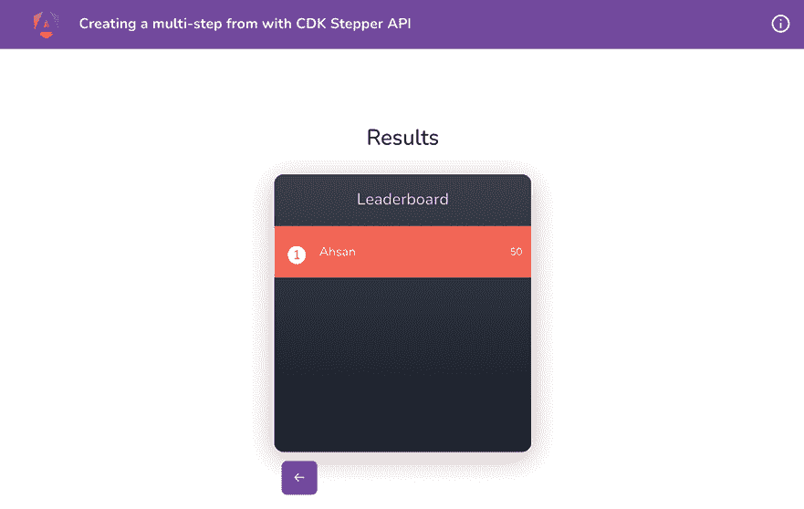

    图 9.15：在步骤 3 显示排行榜结果

呼！这是一个*长*的配方！好吧，完美需要时间和奉献。请随意使用这个游戏，甚至和你的朋友一起玩，如果你改进了它，请通过我的社交媒体告诉我。

现在你已经完成了配方，请查看下一节了解其工作原理。

## 它是如何工作的……

这个配方中有许多动态部分，但它们非常简单。首先，我们将`CdkStepperModule`类导入到`GameComponent`类的`imports`数组中。然后，我们创建一个扩展`CdkStepper`类的组件。扩展`CdkStepper`类的原因是能够创建这个`GameStepperComponent`组件，这样我们就可以创建一个具有一些样式和自定义功能的可重用模板。

要开始使用`GameStepperComponent`组件，我们在`game.component.html`文件中将整个模板包裹在`<app-game-stepper>`元素中。由于该组件扩展了`CdkStepper` API，我们在这里可以使用`CdkStepper`组件的所有功能。对于每个步骤，我们使用 CDK 中的`<cdk-step>`元素，并将步骤的模板包裹在其中。请注意，在`game-stepper.component.html`文件中，我们使用`[ngTemplateOutlet]`属性来显示步骤的标签和实际内容。这反映了 CDK Stepper API 的出色之处。由于我们的`GameStepperComponent`类扩展了`CDKStepper`类，它将自动为每个步骤生成一个`label`属性和`content`属性，这些属性基于我们在`game.component.html`文件中为每个`<cdk-step>`元素提供的值/模板。由于我们在`game.component.html`文件中的每个`<cdk-step>`元素内部提供了`<ng-template cdkStepLabel>`，CDK 会自动为每个步骤生成一个`step.stepLabel.template`，我们随后在`game-stepper.component.html`文件中使用它，分别显示每个`<cdk-step>`元素的标签。如果我们没有为某个步骤提供`<ng-template cdkStepLabel>`，而是直接使用了`<cdk-step label="someValue">`，那么它将使用我们根据代码在`game-stepper.component.html`中编写的`step.label`属性。

对于底部导航按钮，您会注意到我们使用了带有`cdkStepperPrevious`和`cdkStepperNext`指令的`<button>`元素，分别用于跳转到上一步和下一步。我们还会根据条件显示/隐藏下一步和上一步按钮，以检查是否有可跳转的步骤。为了防止在提供的条件为假时在 DOM 中渲染导航按钮，我们利用`*ngIf`绑定动态地隐藏或显示它。

关于 CDK Stepper API 的一个有趣之处在于，我们可以判断用户是否应该能够前往下一步或返回上一步，这不受当前步骤状态的影响，或者用户是否需要首先在当前步骤中完成某些操作才能前往下一步。我们实现这一点的做法是在 `<app-game-stepper>` 元素上使用 `[linear]` 属性，将其值设置为 `true`。这告诉 CDK Stepper API 不要使用 `cdkStepperNext` 按钮移动到下一步，直到当前步骤的 `completed` 属性为 `true`。虽然仅仅提供 `[linear]="true"` 就足以处理功能，但我们通过禁用 **下一步** 按钮来提升用户体验——在这种情况下，我们在 `cdkStepperNext` 按钮上使用 `[disabled]="!selected!.completed"`，因为如果点击按钮不会执行任何操作，禁用按钮更有意义。

此外，我们还需要决定何时认为一个步骤已完成。对于第一步，很明显，我们应该在输入中输入一个名称，才能认为步骤已完成——换句话说，`nameForm` 表单组中 `'name'` 属性的 `FormControl` 应该有一个值。对于第二步，它与条件 `isCorrectGuess !== null` 相关联。这确保了用户已经猜了一个数字；无论猜测是否正确，我们都标记步骤为已完成，并允许用户如果想要的话前往下一步（排行榜）。这就是全部内容。您还可以超越这个食谱，添加一个从排行榜（最后）步骤重新开始游戏的功能。

## 参见

+   Angular CDK Stepper 示例：[`material.angular.io/cdk/stepper/examples`](https://material.angular.io/cdk/stepper/examples)

# 使用 CDK Listbox 指令进行可访问的列表框交互

可访问性是您在考虑最终用户使用您的应用时需要关注的重点方面之一。用户的主要用例之一是在应用中进行选择，无论是选择产品的颜色或尺寸，还是选择多个标签。如果体验是可访问的，这将是一种非常好的体验。在这个食谱中，我们将使用 **Angular CDK Listbox API** 替换产品的颜色选择功能，以实现可访问的替代方案。

## 准备工作

我们将要工作的应用位于克隆的仓库中的 `start/apps/chapter09/ng-cdk-listbox` 目录内：

1.  在您的代码编辑器中打开代码仓库。

1.  打开终端，导航到代码仓库目录，并运行以下命令以启动项目：

    ```js
    npm run serve ng-cdk-listbox 
    ```

    这应该在新的浏览器标签页中打开应用，您应该看到以下内容：

    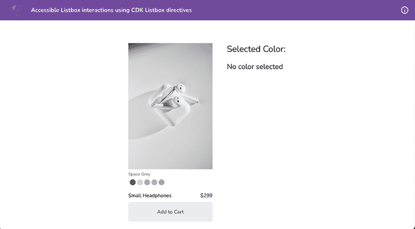

    图 9.16：运行在 http://localhost:4200 的 ng-cdk-listbox 应用

现在我们已经在本地运行了应用，让我们在下一节中查看食谱的步骤。

## 如何做到这一点...

在*图 9.16*中，你会注意到我们有选择产品颜色的选项——如果你点击其中一个，你可以在右侧看到所选的颜色。尽管它们在一定程度上是可访问的，但它们并不完全遵循任何 WAI ARIA 模式。让我们按照以下步骤使用 CDK Listbox 模块：

1.  现在，我们需要将`CdkListboxModule`类导入到`ProductCardComponent`类的`imports`数组中，这样我们就可以使用`cdkListbox`和`cdkOptions`指令。按照以下方式修改`product-card.component.ts`文件：

    ```js
    ...
    **import** **{** **CdkListboxModule** **}** **from****'@angular/cdk/listbox'****;**
    @Component({
      ...
      imports: [CommonModule, ReactiveFormsModule, **CdkListboxModule**],
      ...
    })
    ... 
    ```

1.  现在，我们将替换 HTML 模板以使用`cdkListbox`和`cdkOption`指令。我们将使用无序列表（`ul`）和列表项（`li`元素）来渲染类似的颜色列表。按照以下方式更新`product-card.component.html`文件在提到的 HTML 注释之间：

    ```js
    <!-- Color Options -->
    **<****ul****cdkListbox**
    **[****tabindex****]=****"0"**
    **aria-labelledby****=****"product-colors"**
    **cdkListboxOrientation****=****"horizontal"**
    **class****=****"flex flex-wrap justify-center gap-1**
    **[&:hover_li]:opacity-75"****>**
    **<****li****cdkOption****=****"space-gray"****class****=****"color-option**
    **color-option--space-gray"****></****li****>**
    **<****li****cdkOption****=****"silver"****class****=****"color-option**
    **color-option--silver"****></****li****>**
    **<****li****cdkOption****=****"pink"****class****=****"color-option color-**
    **option--pink"****></****li****>**
    **<****li****cdkOption****=****"green"****class****=****"color-option**
    **color-option--green"****></****li****>**
    **<****li****cdkOption****=****"blue"****class****=****"****color-option color-**
    **option--blue"****></****li****>**
    **</****ul****>**
    <!-- Color Options end --> 
    ```

    你会注意到选项看起来仍然一样（因为 CSS 类的原因）；然而，现在功能已经消失了。

1.  让我们再添加一些样式来突出显示所选颜色。更新`src/styles`文件夹内的`color-options.scss`文件，如下所示：

    ```js
    .color-option {
      ...
      &--active,
      &[aria-selected=true] {
        @apply scale-125;
      }
    } 
    ```

1.  由于 Angular CDK Listbox 与模板驱动和响应式表单都兼容，让我们将`formControlName`属性添加到绑定`productForm`表单组中的`color`表单控件。按照以下方式更新模板：

    ```js
    <!-- Color Options -->
    <ul cdkListbox
              [tabindex]="0"
     **formControlName****=****"color"**...>
              ...
            </ul>
    **<!-- Color Options end →** 
    ```

    太好了！通过这个更改，当你刷新页面并选择颜色时，你应该能够看到之前的结果。

1.  Angular CDK 实现了 WAI ARIA，因此，在列表框中也可以使用`typeahead`功能。让我们进一步修改模板以使其工作：

    ```js
    <!-- Color Options -->
    <ul cdkListbox
     ...>
    <li cdkOption="space-gray" **cdkOptionTypeaheadLabel****=****"space gray"** class="color-option color-option--space-gray"></li>
    <li cdkOption="silver" **cdkOptionTypeaheadLabel****=****"silver"** class="color-option color-option--silver"></li>
    <li cdkOption="pink" **cdkOptionTypeaheadLabel****=****"pink"** class="color-option color-option--pink"></li>
    <li cdkOption="green" **cdkOptionTypeaheadLabel****=****"green"** class="color-option color-option--green"></li>
    <li cdkOption="blue" **cdkOptionTypeaheadLabel****=****"blue"** class="color-option color-option--blue"></li>
    </ul>
    <!-- Color Options end --> 
    ```

    如果你选择任何颜色并聚焦到列表框上，你可以在这里输入颜色的名称以直接跳转到该选项。

太棒了！！你已经完成了配方。现在你可以看到下一部分来了解它是如何工作的。

## 它是如何工作的……

在配方中，我们使用了 CDK Listbox API。而且它完全实现了列表框的 WAI ARIA 模式，非常酷。向 Angular 团队表示敬意。首先，我们在独立组件（`ProductCardComponent`类）的`imports`数组中导入`CdkListboxModule`。然后在模板中使用无序列表`<ul>`，并使用`cdkListbox`指令。这将为`<ul>`元素应用 CDK Listbox 功能。你会注意到我们正在根据列表框的 WAI ARIA 模式在`<ul>`上使用`aria-labelledby`属性。最后，我们将`cdkListboxOrientation`属性设置为`"horizontal"`，这告诉 CDK Listbox API 允许此列表框进行水平导航；即，我们可以使用左右箭头键进行导航。我鼓励你阅读[`www.w3.org/WAI/ARIA/apg/patterns/listbox/`](https://www.w3.org/WAI/ARIA/apg/patterns/listbox/)上的列表框规范，看看它提出的酷炫无障碍功能。而且令人惊讶的是，Angular CDK Listbox API 遵循了所有这些规范。

除了遵循 WAI ARIA 列表框模式外，列表框本身与 Angular 表单（无论是模板驱动还是响应式）无缝协作。由于我们已经在 `product-card` 组件的模板中使用了响应式表单，我们可以轻松地使用 `<ul>` 元素上的 `formControlName` 绑定。请注意，每个列表项 `(<li>)` 元素都有 `cdkOption` 绑定，这告诉 CDK 列表框模块每个选项的值。在菜谱的最后，我们还介绍了 `cdkOptionTypeaheadLabel`，这有助于 CDK 列表框 API 遵循 WAI ARIA 模式推荐的 `typeahead` 功能。如果我们不使用此属性，CDK 列表框模块将使用列表项的文本内容作为默认的 `typeahead`。

你可能已经注意到，我们在 `color-options.scss` 文件中添加了另一个 CSS 选择器，即 `&[aria-selected=true]`，以突出显示选中的颜色。这是因为 CDK 列表框 API 会根据哪个项目被选中自动将此属性设置为 `true` 或 `false`。这也是 WAI ARIA 列表框模式的一部分。

## 相关内容

+   CDK 列表框文档：[`material.angular.io/cdk/listbox/overview`](https://material.angular.io/cdk/listbox/overview)

+   WAI ARIA 列表框模式：[`www.w3.org/WAI/ARIA/apg/patterns/listbox/`](https://www.w3.org/WAI/ARIA/apg/patterns/listbox/)

# 使用 Angular CDK 菜单 API 处理嵌套菜单

菜单对于今天我们使用的许多应用程序至关重要。拥有菜单的模式本身允许我们拥有不总是占用 DOM 空间的体验，并且可以根据需要相对于它们的触发器显示。在本菜谱中，你将学习如何使用 Angular CDK API 创建嵌套菜单。

## 准备工作

我们将要工作的应用程序位于克隆的存储库中的 `start/apps/chapter09/ng-cdk-menu`：

1.  在你的代码编辑器中打开代码存储库。

1.  打开终端，导航到代码存储库目录，并运行以下命令以提供项目：

    ```js
    npm run serve ng-cdk-menu 
    ```

    这应该在新的浏览器标签页中打开应用程序，你应该看到以下内容：

    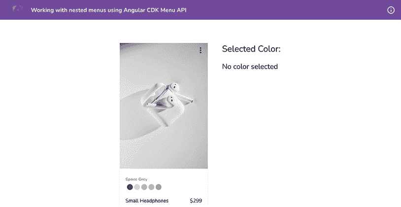

    图 9.17：运行在 http://localhost:4200 上的 ng-cdk-menu 应用程序

现在我们已经在本地运行了应用程序，让我们在下一节中查看菜谱的步骤。

## 如何操作…

我们有一个应用程序，它有一个产品卡片需要操作菜单，以便我们可以执行一些操作。我们将开始使用 Angular CDK 菜单 API 来实现嵌套菜单。让我们采取以下步骤：

1.  将 [`ng-cookbook.com/s/cdk-pane-styles`](https://ng-cookbook.com/s/cdk-pane-styles) 中的样式复制到项目的 `styles.scss` 文件中。确保保留文件中的现有样式，只需添加你复制的样式即可。

1.  在 `product-card.component.ts` 文件中按照以下方式导入 Angular CDK 菜单 API 的组件：

    ```js
    ...
    **import** **{** **CdkMenu****,** **CdkMenuItem****,** **CdkMenuTrigger** **}** **from****'@angular/cdk/menu'****;**
    @Component({
      ...
      imports: [CommonModule, ReactiveFormsModule, CdkListboxModule **,** **CdkMenu****,** **CdkMenuItem****,** **CdkMenuTrigger**],
      ...
    })
    export class ProductCardComponent {...} 
    ```

1.  让我们在模板中使用一些指令来创建一个菜单。我们将使用`<ng-template>`元素作为我们的菜单，并将其分配给一个模板变量。按照以下方式更新`product-card.component.html`文件：

    ```js
    <article class="block group shadow-md bg-white relative">
    <button **[****cdkMenuTriggerFor****]=****"productActions"** class="...">...</button>
      ...
    </article>
    **<****ng-template** **#****productActions****>**
    **<****ul****class****=****"menu-popover__list"****cdkMenu****>**
    **<****li****cdkMenuItem****class****=****"menu-popover__list__item"****>**
    **Share**
    **</****li****>**
    **<****li****cdkMenuItem****class****=****"menu-popover__list__item"****>**
    **Manage** **&#10148;**
    **</****li****>**
    **<****li****cdkMenuItem****class****=****"menu-popover__list__item"****>**
    **Preview**
    **</****li****>**
    **</****ul****>**
    **</****ng-template****>** 
    ```

    如果你现在点击产品卡片上的更多按钮（三个垂直点图标），你应该能看到以下菜单：

    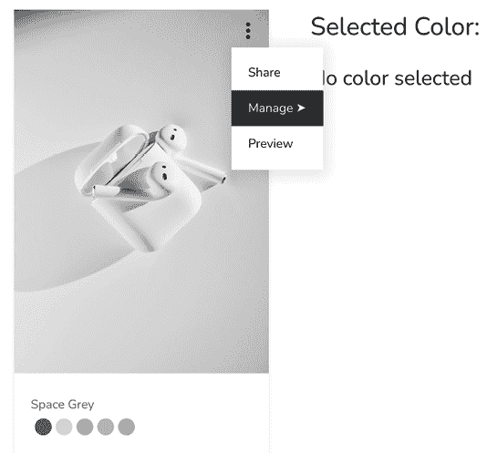

    图 9.18：使用 Angular CDK 菜单 API 实现的菜单

    你会注意到菜单从触发器的左下角位置开始。这是由 Angular CDK 菜单 API 设置的默认菜单位置。我们可以使用连接位置来覆盖它。

1.  让我们使用一些首选的连接位置，以便菜单默认显示在触发器的左侧。按照以下方式更新`product-card.component.ts`文件：

    ```js
    ...
    **import** **{** **ConnectedPosition** **}** **from****'@angular/cdk/overlay'****;**
    ...
    export class ProductCardComponent {
      ...
      **menuPositions****:** **ConnectedPosition****[] = [**
    **{**
    **offsetY****:** **4****,**
    **originX****:** **'end'****,**
    **originY****:** **'bottom'****,**
    **overlayX****:** **'end'****,**
    **overlayY****:** **'top'****,**
    **},**
    **{**
    **offsetY****: -****4****,**
    **originX****:** **'end'****,**
    **originY****:** **'top'****,**
    **overlayX****:** **'****end'****,**
    **overlayY****:** **'bottom'****,**
    **},**
    **]**
    } 
    ```

1.  让我们在模板中使用`menuPositions`变量来使用首选位置。按照以下方式更新`product-card.component.html`文件：

    ```js
    <article class="block group shadow-md bg-white relative">
    <button **[****cdkMenuPosition****]=****"menuPositions"**
     [cdkMenuTriggerFor]="productActions" class="...">
    <span class="material-symbols-outlined">
          more_vert
        </span>
    </button>
    </article> 
    ```

    如果你现在刷新应用并点击产品卡片上的更多按钮（三个垂直点图标），你应该能看到菜单如下出现在按钮的左侧：

    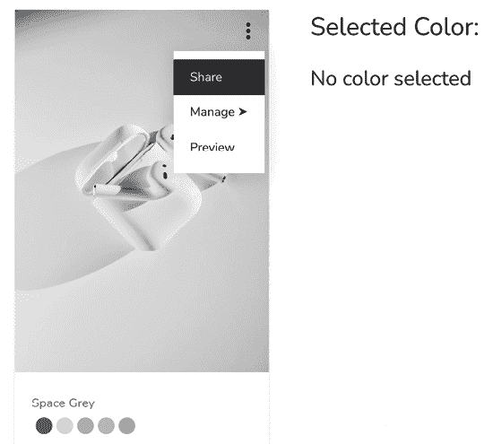

    图 9.19：具有首选位置的菜单

1.  现在我们来实现嵌套菜单。我们将为嵌套菜单创建`<ng-template>`元素，并将其与`"Manage"`菜单项连接起来。按照以下方式更新`product-card.component.html`文件：

    ```js
    <article class="block group shadow-md bg-white
      relative">...</article>
    <ng-template #productActions>
    <ul class="menu-popover__list" cdkMenu>
    <li cdkMenuItem class="menu-popover__list__item">...</li>
    <li cdkMenuItem class="menu-popover__list__item"
      **[****cdkMenuTriggerFor****]=****"productEditActions"**>
          Manage &#10148;
    </li>
    <li cdkMenuItem class="menu-
          popover__list__item">...</li>
    </ul>
    </ng-template>
    **<****ng-template** **#****productEditActions****>**
    **<****ul****class****=****"menu-popover__list"****cdkMenu****>**
    **<****li****cdkMenuItem****class****=****"menu-popover__list__item"****>**
    **Duplicate**
    **</****li****>**
    **<****li****cdkMenuItem****class****=****"menu-popover__list__item"****>**
    **Edit**
    **</****li****>**
    **<****li****cdkMenuItem****class****=****"menu-popover__list__item"****>**
    **Delete**
    **</****li****>**
    **</****ul****>**
    **</****ng-template****>** 
    ```

    通过这个更改，你应该能看到以下嵌套菜单：

    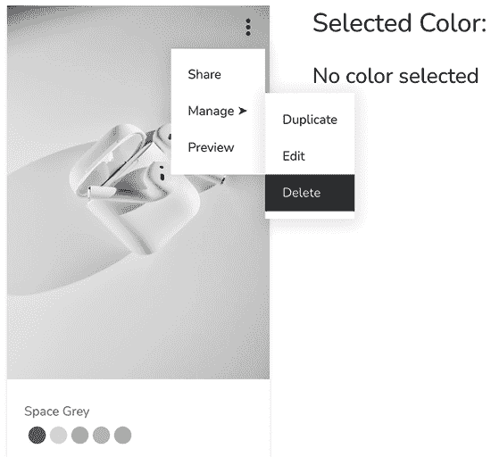

    图 9.20：嵌套菜单实现

Kaboom！我们通过使用 Angular CDK，在几个步骤内就能在这个应用程序中实现嵌套菜单。相信我，如果我们自己来做这件事，可能需要几个小时，甚至可能需要几天。

## 它是如何工作的...

Angular CDK 提供了 CDK 菜单 API，其中包括`cdkMenuTriggerFor`指令。这个指令理想地指向一个`<ng-template>`元素的模板变量。然后，在幕后，Angular CDK 将这个菜单与触发器连接起来。尽管菜单项本身被附加到覆盖层内的`<body>`元素中，但覆盖层的位置对于菜单计算得非常准确，并且在屏幕大小调整时也是正确的。然而，Angular CDK 菜单 API**不包含**覆盖层的 CSS 样式。因此，在这个菜谱中，我们提供了覆盖层和菜单本身的相应样式链接。你也会注意到我们在菜单列表（`<ul>`）项上使用了`cdkMenu`指令，在菜单（`<li>`）项上使用了`cdkMenuItem`指令。由于我们使用了这三个指令而没有使用 Angular CDK 菜单包中的其他任何东西，你会注意到我们没有从`'@angular/cdk/menu'`导入`CdkMenuModule`。这是因为所有这些指令都是`standalone`指令。所以它们可以不导入模块而导入。

在这个菜谱中，我们还修改了菜单的默认定位。默认情况下，覆盖层从触发器的*左下角*开始，向右侧扩展。我们使用了一个带有 `[cdkMenuPosition]` 绑定的 `ConnectionPosition` 数组，将其绑定到**更多**按钮（触发元素）以使用我们首选的位置。第一个（首选）位置是覆盖层的**右上角**与触发元素的**右下角**对齐。也就是说，覆盖层显示在**更多**按钮下方，并继续向左侧扩展，如下所示：

```js
{ 
      offsetY: 4, 
      originX: 'end', 
      originY: 'bottom', 
      overlayX: 'end', 
      overlayY: 'top', 
 } 
```

第二个位置是，覆盖层显示在“更多”按钮（三个垂直点图标）上方，并且根据以下选项继续向左侧扩展：

```js
{ 
      offsetY: -4, 
      originX: 'end', 
      originY: top, 
      overlayX: 'end', 
      overlayY: bottom, 
 } 
```

最后，我们实现了嵌套菜单。这相当简单。我们使用与第一个菜单相同的技术创建了另一个菜单，创建了一个带有模板变量的 `<ng-template>`，其中包含一个 `cdkMenu` 和菜单内的 `cdkMenuItems`。然后我们将这个嵌套菜单的触发器设置为一级菜单中的“管理”菜单项。Angular CDK 足够智能，能够理解触发器是否是 `cdkMenuItem`。如果是，它会在触发菜单项的鼠标悬停事件上自动打开嵌套菜单。当从嵌套菜单触发鼠标离开事件时，它会隐藏。我必须向 Angular CDK 团队表示敬意，因为他们使事情变得如此简单。

## 参见

+   Angular CDK 菜单：[`material.angular.io/cdk/menu/overview`](https://material.angular.io/cdk/menu/overview)

# 在 Discord 上了解更多

要加入这本书的 Discord 社区——在那里您可以分享反馈、向作者提问，并了解新发布的内容——请扫描下面的二维码：

`packt.link/AngularCookbook2e`


