# 第十章：使用 Jest 在 Angular 中编写单元测试

*“在我的机器上它运行正常”*这句话随着时间的推移仍不失其美感。它是许多工程师的盾牌，但对于质量保证专业人员来说却是一场噩梦。但说实话，还有什么比编写测试更好的方法来提高应用程序的健壮性呢？当谈到编写单元测试时，我个人最喜欢的工具是**Jest**。这是因为它超级快，轻量级，并且有易于使用的 API 来编写测试。更重要的是，它的速度比 Angular 自带的开箱即用的 Karma 和 Jasmine 设置要快。在本章中，您将学习如何配置 Jest 与 Angular 一起并行运行这些测试。您将学习如何使用 Jest 测试组件、服务和管道。您还将学习如何为这些测试模拟依赖项。

在本章中，我们将介绍以下食谱：

+   在 Angular 中使用 Jest 设置单元测试

+   为 Jest 提供全局模拟

+   使用存根模拟 Angular 服务

+   在单元测试中监视注入的服务

+   使用`ng-mocks`包模拟子组件和指令

+   使用 Angular CDK 组件工具包编写更简单的测试

+   使用可观察对象进行单元测试组件

+   单元测试 Angular 管道

# 技术要求

对于本章的食谱，请确保您的设置已按照“Angular-Cookbook-2E”GitHub 仓库中的“技术要求”完成。有关设置详情，请访问：[`github.com/PacktPublishing/Angular-Cookbook-2E/tree/main/docs/technical-requirements.md`](https://github.com/PacktPublishing/Angular-Cookbook-2E/tree/main/docs/technical-requirements.md)。本章的起始代码位于[`github.com/PacktPublishing/Angular-Cookbook-2E/tree/main/start/apps/chapter10`](https://github.com/PacktPublishing/Angular-Cookbook-2E/tree/main/start/apps/chapter10)。

# 使用 Jest 在 Angular 中设置单元测试

默认情况下，一个新的 Angular 项目包含了许多优点，包括配置和用于运行单元测试的工具，例如 Karma 和 Jasmine。虽然使用 Karma 相对方便，但许多开发者在大型项目中发现，如果涉及大量测试，整个测试过程会变得非常缓慢。这主要是因为您不能并行运行测试。在本食谱中，我们将为 Angular 应用程序设置 Jest 进行单元测试。此外，我们将现有测试从 Karma 语法迁移到 Jest 语法。

从 v16 版本开始，Angular 为 Jest 提供了开发者预览，这个过程变得更加简单。本食谱针对 Angular v15 及以下版本的应用程序，并在本章末尾介绍 v16 版本可以做什么。

## 准备工作

我们现在将要工作的应用程序位于克隆的仓库中的`start/apps/chapter10/ng-jest-setup`：

1.  在您的代码编辑器中打开代码仓库。

1.  打开终端，导航到代码仓库目录，并运行以下命令以启动项目：

    ```js
    npm run serve:ng-jest-setup 
    ```

    *步骤 2* 中的命令与本书中其他食谱的命令不同。这是因为本食谱的项目 *不是* 我们拥有的 NX 工作空间的一部分；它本身就是一个独立的 Angular 应用；因此，它有不同的命令。

    这应该在新的浏览器标签页中打开应用，你应该看到以下内容：

    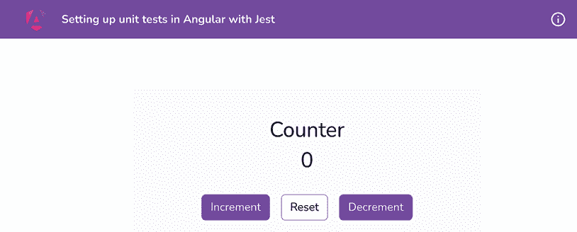

    图 10.1：在 http://localhost:4200 上运行的 ng-jest-setup 应用

    接下来，尝试运行测试并监控整个过程运行所需的时间。从工作区 `root` 运行命令 `npm run test:ng-jest-setup`；几秒钟内，应该会打开一个新的 Chrome 窗口，如下所示：

    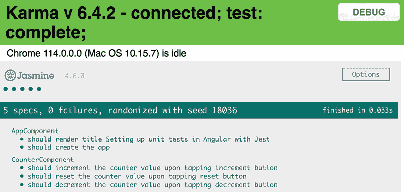

    图 10.2：使用 Karma 和 Jasmine 的测试结果

看到前面的截图，你可能会说 *“Pfffttt，Ahsan，它说‘完成于 0.033s（或接近这个时间）！’你还需要什么？” 好吧，这个时间只涵盖了 Karma 在创建 Chrome 窗口后运行测试所需的时间。它不包括启动过程、启动 Chrome 窗口以及加载测试所需的时间。这可以通过为 Karma 运行无头 Chrome 浏览器来改进，这需要一些配置。然而，与替代方案（Jest）相比，它仍然较慢。此外，在编写此食谱时，我在 Macbook Pro 上运行此操作，*它很快*。这就是我们要用 Jest 替换它的原因。现在，你已经了解了问题，在下一节中，让我们看看食谱的步骤。

## 如何做到这一点...

在这里，我们有一个简单的 `Counter` 组件的 Angular 应用。它显示计数器的值，并有三个操作按钮：其中一个按钮用于增加计数器的值，另一个用于减少，另一个用于重置值。此外，还有一些使用 Karma 和 Jasmine 编写的测试，如果你运行测试，所有测试都将通过。我们将首先设置 Jest。执行以下步骤：

1.  首先，打开一个新的终端窗口/标签页，确保你位于 `start/apps/chapter10/ng-jest-setup` 文件夹内。一旦进入，运行以下命令来安装测试 Jest 所需的包：

    ```js
    npm install --save-dev jest jest-preset-angular @types/jest 
    ```

1.  现在，我们可以卸载 Karma 和不需要的依赖项。现在，在你的终端中运行以下命令：

    ```js
    npm uninstall karma karma-chrome-launcher karma-jasmine-html-reporter @types/jasmine @types/jasminewd2 jasmine-core jasmine-spec-reporter karma-coverage-istanbul-reporter karma-jasmine 
    ```

1.  现在，更新 `angular.json` 文件中的测试配置，如下所示：

    ```js
    {
      ...
      "projects": {
    "ng-jest-setup": {
    "..."
    "prefix": "app",
    "architect": {
    "build": {...},
    "serve": {...},
    "extract-i18n": {...},
    **"test"****:****{**
    **"builder"****:****"@angular-builders/jest:run"****,**
    **"options"****:****{**
    **"tsConfig"****:**
    **"<rootDir>/src/tsconfig.test.json"****,**
    **"collectCoverage"****:****false****,**
    **"forceExit"****:****true**
    **}**
    **},**
    "lint": {...},
    "e2e": {...}
    }
    }
    },
    "defaultProject": "setting-up-jest"
    } 
    ```

1.  我们现在将创建一个文件来配置 Jest 以用于我们的项目。在项目文件夹内创建一个名为 `jestSetup.ts` 的文件，并将以下内容粘贴进去：

    ```js
    import 'jest-preset-angular/setup-jest'; 
    ```

1.  现在，让我们修改 `tsconfig.spec.json` 文件，使用 Jest 而不是 Jasmine。修改后，你的整个文件应该如下所示：

    ```js
    {
    "extends": "./tsconfig.json",
    "compilerOptions": {
    "outDir": "./out-tsc/spec",
    **"types"****:****[****"jest"****,****"node"****],**
    **"esModuleInterop"****:****true****,**
    **"emitDecoratorMetadata"****:****true**
    },
    "files": ["src/polyfills.ts"],
    "include": ["src/**/*.spec.ts", "src/**/*.d.ts"]
    } 
    ```

1.  我们现在将修改 `package.json` 文件，添加运行 Jest 测试的 `npm` 脚本：

    ```js
    {
    "name": "setting-up-jest",
    "version": "0.0.0",
    "scripts": {
        ...
        "build": "ng build",
    **"test"****:****"jest"****,**
    **"test:coverage"****:****"jest --coverage"****,**
        ...
      },
    "private": true,
    "dependencies": {...},
    "devDependencies": {...},
    } 
    ```

1.  最后，让我们通过在 `package.json` 文件中添加 Jest 配置来完成我们 Jest 测试的整个配置，如下所示：

    ```js
    {
      ...
      "dependencies": {...},
    "devDependencies": {...},
    **"jest"****:****{**
    **"preset"****:****"jest-preset-angular"****,**
    **"setupFilesAfterEnv"****:****[**
    **"<rootDir>/jestSetup.ts"**
    **]**
    **}**
    } 
    ```

1.  现在我们已经设置好了一切，只需在 `ng-jest-setup` 文件夹内运行 `test` 命令，如下所示：

    ```js
    npm run test 
    ```

    一旦测试完成，你应该能看到以下输出：

    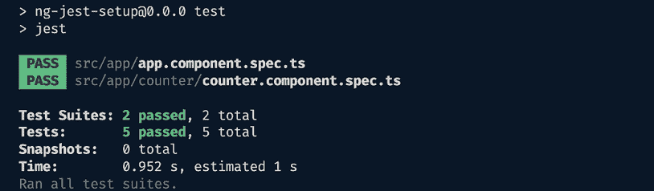

    图 10.3：使用 Jest 的测试结果

Kaboom！你会注意到使用 Jest 运行测试的整个过程大约需要 6 秒。第一次运行时可能会更长，但后续的运行应该会更快。现在你已经知道如何配置 Angular 应用程序以使用 Jest 进行单元测试，请参阅下一节以获取更多学习资源。

## 奖励：将 Angular v16 迁移到 Jest

从 Angular v16 开始，要将项目迁移到 Jest（假设你的项目目前使用 Karma），你只需要更新项目中的 `angular.json` 文件，并使用以下配置对象属性层次结构 `your-app > architect > test` 设置：

```js
{
"projects": {
"my-app": {
"architect": {
**"test"****:****{**
**"builder"****:****"@angular-devkit/build-angular:jest"****,**
**"options"****:****{**
**"tsConfig"****:****"tsconfig.spec.json"****,**
**"polyfills"****:****[****"****zone.js"****,****"zone.js/testing"****]**
**}**
**}**
}
}
}
} 
```

## 参见

+   使用 Jest 测试 Web 框架：[`jestjs.io/docs/en/testing-frameworks`](https://jestjs.io/docs/en/testing-frameworks)

+   使用 Jest 入门：[`jestjs.io/docs/en/getting-started`](https://jestjs.io/docs/en/getting-started)

+   将 Angular CLI 迁移到 Jest：[`blog.angular.io/moving-angular-cli-to-jest-and-web-test-runner-ef85ef69ceca`](https://blog.angular.io/moving-angular-cli-to-jest-and-web-test-runner-ef85ef69ceca)

# 为 Jest 提供全局模拟

在上一个菜谱中，我们学习了如何为 Angular 单元测试设置 Jest。可能会有一些场景，你想要使用浏览器 API，而这些 API 可能不是你的实际 Angular 代码的一部分——例如，使用 `LocalStorage` 或 `alert`。在这种情况下，我们需要为那些我们想要返回模拟值的函数提供一些全局模拟。这样我们就可以测试涉及它们的测试了。在这个菜谱中，你将学习如何为 Jest 提供全局模拟。

## 准备工作

我们现在将要工作的应用程序位于克隆的仓库中的 `start/apps/chapter10/ng-jest-global-mocks`：

1.  在你的代码编辑器中打开代码仓库。

1.  打开终端，导航到代码仓库目录，并运行以下命令以启动项目：

    ```js
    npm run serve ng-jest-global-mocks 
    ```

    这应该在新的浏览器标签页中打开应用程序，你应该能看到以下内容：

    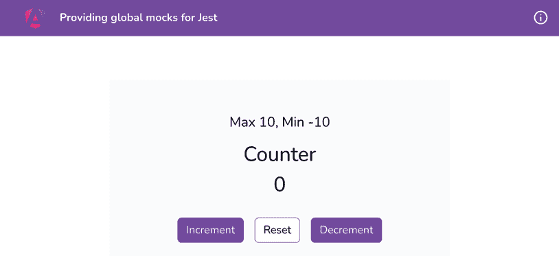

    图 10.4：在 http://localhost:4200 上运行的 ng-jest-global-mocks 应用程序

现在我们已经在本地运行了应用程序，在下一节中，让我们来回顾一下菜谱的步骤。

## 如何操作...

我们在这个菜谱中使用的应用程序使用了两个全局 API：`window.localStorage` 和 `window.alert`。请注意，当应用程序启动时，我们从 `LocalStorage` 获取计数器值，然后在增加、减少和重置时，我们将其存储在 `LocalStorage` 中。当计数器值大于 `MAX_VALUE` 或小于 `MIN_VALUE` 时，我们使用 `alert` 方法显示警告。让我们通过编写一些酷炫的单元测试来开始这个菜谱：

1.  首先，我们将编写测试用例以显示当计数器的值超过 `MAX_VALUE` 和 `MIN_VALUE` 时会弹出警告。修改 `counter.component.spec.ts` 文件，如下所示：

    ```js
    ...
    describe('CounterComponent', () => {
      ...
      **it****(****'****should show an alert when the counter value goes**
    **above the MAX_VALUE'****,** **() =>** **{**
    **jest.****spyOn****(****window****,** **'alert'****);**
    **component.****counter** **= component.****MAX_VALUE****;**
    **component.****increment****();**
    **expect****(****window****.****alert****).****toHaveBeenCalledWith****(****'Value too**
    **high'****);**
    **expect****(component.****counter****).****toBe****(component.****MAX_VALUE****);**
    **});**
    **it****(****'should show an alert when the counter value goes**
    **below the MIN_VALUE'****,** **() =>** **{**
    **jest.****spyOn****(****window****,** **'alert'****);**
    **component.****counter** **= component.****MIN_VALUE****;**
    **component.****decrement****();**
    **expect****(****window****.****alert****).****toHaveBeenCalledWith****(****'Value too**
    **low'****);**
    **expect****(component.****counter****).****toBe****(component.****MIN_VALUE****);**
    **});**
    }); 
    ```

    在这里，你可以看到测试通过了，但伴随着大量的控制台错误。那么，如果我们想检查从 `LocalStorage` 保存和检索的值是否正确呢？

1.  我们将创建一个新的测试来确保 `localStorage.getItem` 方法被调用以从 `LocalStorageAPI` 获取最后保存的值。将测试添加到 `counter.component.spec.ts` 文件中，如下所示：

    ```js
    ...
    describe('CounterComponent', () => {
      ...
      **it.****only****(****'****should call the localStorage.getItem method on**
    **component init'****,** **() =>** **{**
    **jest.****spyOn****(****localStorage****,** **'getItem'****);**
    **component.****ngOnInit****();**
    **expect****(****localStorage****.****getItem****).****toHaveBeenCalled****();**
    **});**
    }); 
    ```

    注意到我们在这个测试用例中使用了 `it.only`。这是为了确保我们现在只运行这个测试。如果你运行测试，你应该能看到以下截图中的内容：

    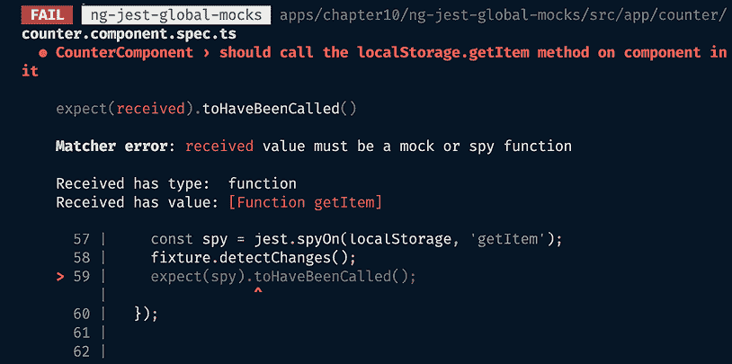

    图 10.5：覆盖 LocalStorageAPI 的测试失败了

    注意到 **匹配器错误：接收到的值必须是一个模拟或间谍函数** 的消息。这就是我们接下来要做的，也就是提供一个模拟。

1.  在项目的 `src` 文件夹内创建一个文件，并将其命名为 `jest-global-mocks.ts`。然后，添加以下代码来模拟 `LocalStorageAPI`：

    ```js
    class LocalStorageMock {
      storage: Partial<Storage> = {};
      getItem(key: string) {
        return this.storage[key] ? this.storage[key] : null;
      }

      setItem(key: string, value: string) {
        this.storage[key] = value;
      }
    }

    Object.defineProperty(window, 'localStorage', {
      value: new LocalStorageMock(),
    });

    Object.defineProperty(window, 'alert', {
      value: jest.fn(),
    }); 
    ```

1.  现在，将此文件导入到 `src/test-setup.ts` 文件中，如下所示：

    ```js
    ...
    globalThis.ngJest = {...};
    import 'jest-preset-angular/setup-jest';
    **import****'./jest-global-mocks'****;** 
    ```

    现在，如果你重新运行测试，它们应该会通过。

1.  让我们添加另一个测试以确保在组件初始化时从 `LocalStorage` 中检索最后保存的值。修改 `counter.component.spec.ts` 文件，如下所示：

    ```js
    ...
    describe('CounterComponent', () => {
      ...
      it('should call the localStorage.getItem method on
    component init', () => {...});
      **it****(****'should retrieve the last saved value from**
    **localStorage on component init'****,** **() =>** **{**
    **localStorage****.****setItem****(****'counterValue'****,** **'12'****);**
    **component.****ngOnInit****();**
    **expect****(component.****counter****).****toBe****(****12****);**
    **});**
    }); 
    ```

1.  最后，让我们确保在触发 `increment`、`decrement` 或 `reset` 方法时，将计数器的值保存到 `LocalStorage` 中。更新 `counter.component.spec.ts` 文件，如下所示：

    ```js
    ...
    describe('CounterComponent', () => {
      ...
      **it****(****'should save the new counterValue to localStorage on**
    **increment, decrement and reset'****,** **() =>** **{**
    **jest.****spyOn****(****localStorage****,** **'setItem'****);**
    **component.****counter** **=** **0****;**
    **component.****increment****();**
    **expect****(****localStorage****.****setItem****).****toHaveBeenCalledWith****(**
    **'counterValue'****,** **'1'****);**
    **component.****counter** **=** **20****;**
    **component.****decrement****();**
    **expect****(****localStorage****.****setItem****).****toHaveBeenCalledWith****(**
    **'counterValue'****,** **'19'****);**
    **component.****reset****();**
    **expect****(****localStorage****.****setItem****).****toHaveBeenCalledWith****(**
    **'****counterValue'****,** **'0'****);**
    **});**
    }); 
    ```

太棒了！你已经学会了如何为 Jest 测试提供全局模拟。请参考下一节了解这是如何工作的。

## 它是如何工作的...

Jest 提供了一种为测试定义全局模拟的方法。它自带了许多内置函数来定义测试套件和测试用例，以及断言函数。以下是一个简单的 Jest 测试套件示例，用于测试一个 `sum` 函数，该函数用于将两个数字相加：

```js
import { sum } from './sum';
describe('Sum function', () => {
  it('should add two numbers', () => {
    expect(sum(2,3)).toBe(5);
  });
}); 
```

Jest 还有一种方法可以在项目中使用特定的文件来设置 Jest。当与不同的框架一起工作时，文件（或文件名）可能不同，但目的仍然是相同的，即通过这个 Jest 设置文件定义全局配置。在我们的 NX 工作区中，我们已经在每个项目的 `src` 文件夹下创建了 Jest 文件，文件名通常是 `test-setup.ts`。定义全局模拟的一种常见方法是为模拟创建一个新的文件，然后将其导入到 `test-setup.ts` 文件中。

注意，我们使用`Object.defineProperty`方法在`window`对象中为`LocalStorage`对象提供模拟实现，并且我们对`window.alert`模拟也做了类似处理。这实际上适用于任何未在**JSDOM**（**JavaScript Document Object Model**）中实现的自定义 API。同样，你可以为你在测试中使用的每个 API 提供一个全局模拟。注意，在`value`属性中，我们使用`new`关键字创建`LocalStorageMock`类的新实例。本质上，这是定义模拟的一种方法。我们创建了`LocalStorageMock`类，在其中有一个名为`storage`的私有属性，它模拟了`localStorage`对象。我们还在其中定义了`getItem`和`setItem`方法，以便我们可以向此存储设置值并从中获取值。注意，我们没有实现`removeItem`和`clear`方法，这些方法在实际的`localStorage` API 中是有的。我们不需要它们，因为我们实际上没有使用这些方法。

在`should call the localStorage.getItem method on component init`测试中，我们简单地监视`localStorage`对象的`getItem`方法，自己调用`ngOnInit`方法，然后期望它已经被调用。*简单易行!*

在`should retrieve the last saved value from localStorage on component init`测试中，我们使用`setItem`方法在`localStorage`对象中为计数器的值保存`12`。本质上，调用`setItem`方法调用的是我们的模拟实现方法，而不是实际的`localStorage` API 的`setItem`方法。注意，在这里，我们没有对`getItem`方法进行监视；这是因为，稍后我们希望组件的`counter`属性的值为`12`。

重要提示

每当我们监视一个方法时，请记住，实际函数中的任何语句将不再执行。这就是为什么我们不会在先前的测试中监视`getItem`方法。如果我们这样做，模拟实现中的`getItem`方法将不会返回任何内容。因此，我们对计数器属性的预期值将不会是`12`。

简而言之，如果你必须依赖于函数实现的输出，或者函数内部执行的语句，不要监视该函数，并用`jest.fn().mockReturnValue(123);`替换该函数。这确保了我们不仅可以检查函数是否被调用，还可以使用实际的代码使用返回值。

PS：我总是在调试和敲打了一段时间的头之后，才艰难地学到这一点。

最终的测试非常简单。在 `should save the new counterValue to localStorage on increment, decrement and reset` 测试中，我们监视 `setItem` 方法。然后，在分别运行 `increment`、`decrement` 和 `reset` 方法之前，我们手动设置计数器属性的值。此外，我们期望 `setItem` 方法使用正确的参数被调用以保存值到存储中。注意，我们在保存后不检查存储的值。如我之前提到的，因为我们监视了 `setItem` 方法，其内部语句不会触发，因此值不会被保存；因此，我们之后无法检索保存的值。

## 参见

+   `setupFiles` 的 Jest 文档：[`jestjs.io/docs/en/configuration#setupfiles-array`](https://jestjs.io/docs/en/configuration#setupfiles-array)

+   使用 Jest 进行手动模拟：[`jestjs.io/docs/en/manual-mocks`](https://jestjs.io/docs/en/manual-mocks)

# 使用存根模拟 Angular 服务

几乎没有 Angular 应用程序在其内部没有创建一个 **服务**。在整体业务逻辑方面，服务承载了大量的内容，尤其是在与 API 交互时。在这个食谱中，你将学习如何使用存根模拟服务。

## 准备工作

我们现在将要工作的应用程序位于克隆的仓库 `start/apps/chapter10/ng-test-services-stubs` 内：

1.  在你的代码编辑器中打开代码仓库。

1.  打开终端，导航到代码仓库目录，并运行以下命令以启动项目：

    ```js
    npm run serve ng-test-services-stubs 
    ```

    这应该在新的浏览器标签页中打开应用程序，你应该会看到以下内容：

    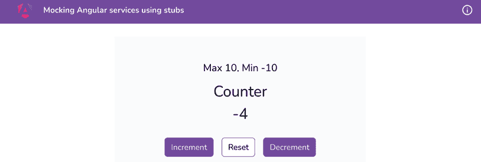

    图 10.6：ng-test-services-stubs 应用在 http://localhost:4200 上运行

现在我们已经在本地上运行了应用程序，在下一节中，让我们看看食谱的步骤。

## 如何做到这一点...

我们拥有与之前食谱相同的应用程序；然而，我们将保存和检索数据的逻辑从 `localStorage` 移动到了我们创建的 `CounterService`。现在，所有测试都通过了。但是，如果我们想隐藏/封装计数器值存储的逻辑呢？也许我们想为此发送后端 API 调用。为此，测试我们的 `CounterService` 的方法是否被调用比检查 `localStorage` 方法更有意义。让我们按照食谱为我们的服务提供一个模拟存根：

1.  首先，在 `src` 文件夹内创建一个名为 `__mocks__` 的文件夹。在其内部，创建一个名为 `services` 的文件夹。然后，再次在这个文件夹内部，创建一个名为 `counter.service.mock.ts` 的文件，并包含以下内容：

    ```js
    import { CounterService } from "../../app/services/counter.service"; 
    const counterServiceMock: CounterService = {
      storageKey: 'counterValue',
      getFromStorage: jest.fn(),
      saveToStorage: jest.fn(),
    };
    export default counterServiceMock; 
    ```

1.  现在，在 `counter.component.spec.ts` 中，用模拟服务代替实际服务，如下所示：

    ```js
    ...
    **import** **{** **CounterService** **}** **from****'../services/counter.service'****;**
    **import** **counterServiceMock** **from****'../../__mocks__/services/counter.service.mock'****;**
    describe('CounterComponent', () => {
      ...
      beforeEach(async () => {
        await TestBed.configureTestingModule({
          imports: [CounterComponent]**,**
    **providers****: [{**
    **provide****:** **CounterService****,**
    **useValue****: counterServiceMock**
    **}]**
        }).compileComponents();
      });
      ...
    }); 
    ```

    随着前面的更改，你应该会看到以下错误，表明 `localStorage.getItem` 没有被调用。这是因为我们现在正在监视我们服务模拟存根上的方法：

    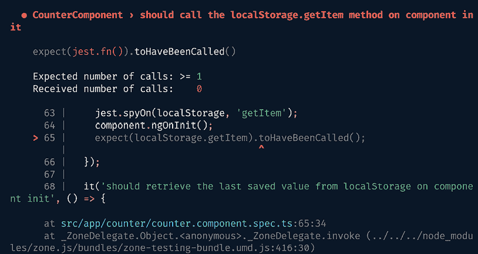

    图 10.7：由于监视的方法，`localStorage.getItem`没有被调用

1.  现在，不要期望在测试中调用`localStorage`对象的`methods`，而是期望调用我们服务的`methods`。使用以下代码片段更新`counter.component.spec.ts`文件，以替换以下注释下面的所有测试：[`ng-cookbook.com/s/services-stub-tests`](https://ng-cookbook.com/s/services-stub-tests)

    ```js
    ...
    describe('CounterComponent', () => {
      ...
    **// replace the tests below**
    }); 
    ```

太棒了！你现在知道如何模拟服务来测试具有服务依赖的组件。请参阅下一节了解这一切是如何工作的。

## 它是如何工作的...

为 Angular 服务提供存根已经变得非常简单。这要归功于 Angular 的内置方法和来自`@angular/core`包的工具，特别是`@angular/core/testing`。首先，我们为我们的`CounterService`创建存根，并在`CounterService`中的每个方法中使用`jest.fn`。

调用`jest.fn`返回一个新的、未使用的模拟函数，Jest 会自动监视它。可选地，我们还可以将模拟实现方法作为参数传递给`jest.fn`。查看以下来自官方文档的`jest.fn`示例：

```js
const mockFn = jest.fn();
mockFn();
expect(mockFn).toHaveBeenCalled(); // test passes
// With a mock implementation:
const returnsTrue = jest.fn(() => true);
console.log(returnsTrue()); // true;
expect(returnsTrue()).toBe(true); // test passes 
```

一旦我们创建了存根，我们就将其传递给`TestBed`配置中的提供者数组中的`CounterService` - 但将`useValue`属性设置为`counterServiceMock`。这告诉 Angular 使用我们的存根作为`CounterService`。

然后，在期望组件初始化时调用`CounterService.getFromStorage`方法的测试中，我们使用以下语句：

```js
expect(counterServiceMock.getFromStorage).toBeCalled(); 
```

注意，在上面的代码中，我们能够直接在`counterServiceMock.getFromStorage`上使用`expect`。虽然这在 Karma 和 Jasmine 中是不可能的，但使用 Jest 时是可能的，因为我们为每个底层方法使用了`jest.fn`。

然后，对于想要检查`getFromStorage`方法是否被调用并返回保存值的测试，我们首先使用`counterServiceMock.getFromStorage.mockReturnValue(12);`语句。这确保了当调用`getFromStorage`方法时，它返回`12`的值。然后，我们只需在测试中运行`ngOnInit`方法，并期望组件的计数器属性现在已设置为`12`。这意味着以下事情发生了：

1.  `ngOnInit`调用`getFromStorage`方法。

1.  `getFromStorage`返回之前保存的值（在我们的例子中，这是`12`，但在现实中，它将从`localStorage`中获取）。

1.  组件的计数器属性被设置为检索到的值，在我们的例子中是`12`。

现在，对于最后的测试，我们只需期望在每种必要情况下调用`CounterService`的`saveToStorage`方法。为此，我们使用以下类型的`expect`语句：

```js
expect(counterServiceMock.saveToStorage).toHaveBeenCalledWith(1); 
```

这基本上就是全部内容。单元测试很有趣，不是吗？现在你已经了解了这一切是如何工作的，请参阅下一节，了解一些有用的资源，你可以用来进一步阅读。

## 参见

+   `jest.fn`的官方文档：[`jestjs.io/docs/en/jest-object.html#jestfnimplementation`](https://jestjs.io/docs/en/jest-object.html#jestfnimplementation)

+   Angular 的*组件测试场景*：[`angular.io/guide/testing-components-scenarios`](https://angular.io/guide/testing-components-scenarios)

# 在单元测试中监视注入的服务

虽然你可以在单元测试中使用 Jest 为你的服务提供存根，但有时，为每个新的服务创建存根可能会感觉像是一种负担。让我们假设，如果服务的使用仅限于一个测试文件，那么在注入的实际服务上使用间谍可能更有意义。在这个配方中，我们正是要这么做。

## 准备工作

我们现在将要工作的应用位于克隆的仓库中的`start/apps/chapter10/ng-test-services`：

1.  在你的代码编辑器中打开代码仓库。

1.  打开终端，导航到代码仓库目录，并运行以下命令以启动项目：

    ```js
    npm run serve ng-test-services 
    ```

    这应该在新的浏览器标签页中打开应用，你应该看到以下内容：

    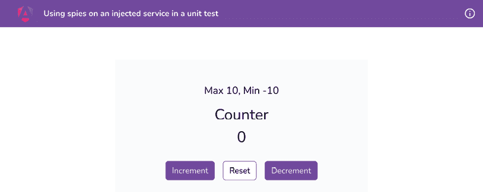

    图 10.8：ng-test-services 应用在 http://localhost:4200 上运行

现在我们有了运行中的应用，在下一节中，让我们通过配方的步骤。

## 如何做到...

我们有一个包含`Counter`组件的应用。我们可以增加、减少和重置计数器，计数器的值也会改变。这个值也存储在`localStorage`中。我们有从`localStorage`到`CounterService`保存和检索数据的逻辑。现在，所有的测试都通过了，但我们直接从`localStorage`检查测试中的值。如果我们决定改变计数器值存储的逻辑呢？也许我们想要为它发送后端 API 调用。为此，测试我们的`CounterService`的方法是否被调用比检查`localStorage`方法更有意义。然而，与之前提供的为我们的服务提供存根的配方不同，我们将直接注入服务，并为我们要确保被调用的 Angular 服务中的函数创建 jest 间谍。让我们按照配方来做：

1.  打开`counter.component.spec.ts`文件。你将看到一个注释说`// 替换下面的测试`。让我们在那个注释下面替换第一个测试`should call the localStorage.getItem method on component init`，替换为以下内容：

    ```js
    it(' should get counter from storage on component init',
      () => {
        jest.spyOn(component.counterService, 'getFromStorage');
        component.ngOnInit();
        expect(component.counterService.getFromStorage)
     .toHaveBeenCalled();
      }); 
    ```

    如果你再次运行`npm run test`，你应该仍然看到所有测试都通过了。

1.  现在，让我们将测试替换为“在组件初始化时从 localStorage 检索最后保存的值”的测试，替换为以下测试：

    ```js
    it(' should have the initial value of counter from storage
      on component init ', () => {
        jest.spyOn(component.counterService,
          'getFromStorage').mockReturnValue(12);
        component.ngOnInit();
        expect(component.counter).toBe(12);
      }); 
    ```

1.  最后，将最后一个测试“在增加、减少和重置时将新的 counterValue 保存到 localStorage”替换为以下代码：

    ```js
    it('should save the new counterValue on increment, decrement
      and reset', () => {
        jest.spyOn(component.counterService, 'saveToStorage');
        component.counter = 0;
        component.increment();
        expect(component.counterService.saveToStorage)
     .toHaveBeenCalledWith(1);
        component.counter = 20;
        component.decrement();
        expect(component.counterService.saveToStorage)
     .toHaveBeenCalledWith(19);
        component.reset();
        expect(component.counterService.saveToStorage)
     .toHaveBeenCalledWith(0);
      }); 
    ```

太棒了！通过这个更改，你应该看到所有八个测试都通过了。让我们看看下一节，了解它是如何工作的。

## 它是如何工作的...

这个食谱包含了本章之前食谱中的很多知识。然而，关键亮点是注入到组件中的`CounterService`类只能通过`jest.spyOn`方法直接模拟。这种方法消除了需要单独模拟每个服务的需求。在第一个（已替换）测试中，我们监视`component.counterService`属性的`getFromStorage`方法。这使得它成为一个 Jest 监视器，我们可以将其提供给`expect`块，并运行`expect(component.counterService.getFromStorage).toHaveBeenCalled();`语句。在第二个测试中，请注意，我们不仅监视了`getFromStorage`方法，还返回了一个模拟值`12`，这样当`component.ngOnInit`方法被调用时，从`CounterService`返回的值就是这个模拟值`12`。因此，`counter`属性被设置为 12，测试通过。

最后，在最后一个测试中，我们监视`saveToStorage`方法。然后，每次我们点击`Increment`、`Decrement`或`Reset`时，我们期望被监视的函数以正确的值被调用。*简单易行！*

## 参见

+   测试 Angular 服务：[`angular.io/guide/testing-services`](https://angular.io/guide/testing-services)

# 使用 ng-mocks 包模拟子组件和指令

单元测试主要围绕测试组件、指令、管道或服务进行。然而，如果你的组件完全依赖于另一个组件或指令才能正常工作，尤其是在一个非独立应用程序/组件中，会怎样呢？在这种情况下，你通常会提供一个模拟实现来模拟组件，但这需要大量的工作。然而，使用`ng-mocks`包，这变得非常简单。在这个食谱中，我们将学习如何使用`ng-mocks`来模拟一个依赖于子组件才能正常工作的父组件的高级示例。

## 准备工作

我们现在要工作的应用程序位于克隆的仓库中的`start/apps/chapter10/ng-test-ng-mocks`目录下：

1.  在您的代码编辑器中打开代码仓库。

1.  打开终端，导航到代码仓库目录，并运行以下命令来启动项目：

    ```js
    npm run serve ng-test-ng-mocks 
    ```

    这应该在新的浏览器标签页中打开应用程序，你应该看到以下内容：

    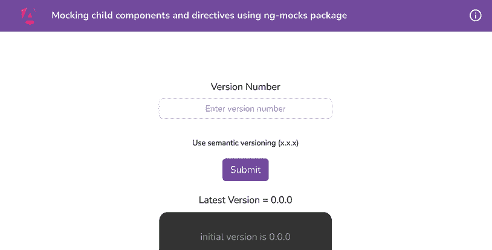

    图 10.9：ng-test-ng-mocks 应用程序在 http://localhost:4200 上运行

现在我们已经在本地上运行了应用程序，在下一节中，让我们来了解一下食谱的步骤。

## 如何做到这一点...

如果你从工作区根目录运行命令`npm run test ng-test-ng-mocks`，你会看到并非所有我们的测试都通过。此外，控制台还有一大堆错误，如下所示：

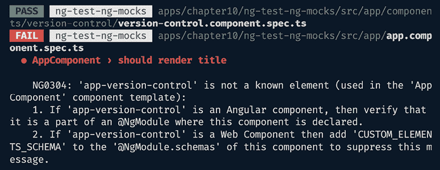

图 10.10：单元测试中提到 app-version-control 组件时的错误

注意，我们正在使用一个带有`NgModule`的应用程序，即**不是一个独立的应用程序**。这是为了演示如何在这样的情况下工作。让我们通过食谱来模拟相应的组件，使用`ng-mocks`包：

1.  首先，让我们在我们的项目中安装`ng-mocks`包。为此，从终端中运行以下命令，从项目根目录开始：

    ```js
    cd start && npm install ng-mocks --save 
    ```

1.  现在，我们将尝试修复`App`组件的测试。要基于字符串正则表达式仅运行特定测试，我们可以使用测试命令的-`t`参数。运行以下命令，运行后按-`t`键提供正则表达式`"``App"`：

    ```js
    npm run test ng-test-ng-mocks –t "App" 
    ```

    现在，你可以看到我们只运行了`AppComponent`的测试，并且它们失败了如下：

    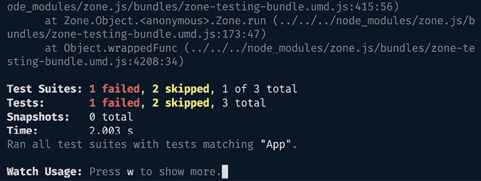

    图 10.11：仅运行特定测试

1.  要修复*图 10.10*中显示的错误，我们需要将`VersionControlComponent`导入到`app.component.spec.ts`文件中的`TestBed`定义内部。这样做是为了让我们的测试环境也知道缺失的`<app-version-control>`组件。为此，按照以下方式修改文件：

    ```js
    ...
    **import** **{** **VersionControlComponent** **}** **from****'./components/version-control/version-control.component'****;**
    ...
    describe('AppComponent', () => {
      beforeEach(waitForAsync(() => {
        TestBed.configureTestingModule({
          imports: [RouterTestingModule],
          **declarations****: [****AppComponent****,**
    **VersionControlComponent****],**
        }).compileComponents();
      }));
      ...
    }); 
    ```

    如果你重新运行`AppComponent`的测试，你会看到一些更新鲜、更新的错误。进展！但是，由于`Version Control`组件依赖于另一个组件，测试没有通过。我们将在*如何工作...*部分更详细地讨论这是为什么。然而，为了修复这个问题，让我们按照以下步骤进行。

1.  由于我们并不关心`AppComponent`测试中的`VersionControlComponent`，所以我们需要对其进行模拟。一种方法是在`TestBed`的配置中使用`CUSTOM_ELEMENT_SCHEMA`来告诉测试床我们并不关心`AppComponent`测试中的`VersionControlComponent`。然而，我们将使用`ng-mocks`中的`MockComponent`来模拟组件，以达到相同的效果。为此，按照以下方式更新`app.component.spec.ts`文件：

    ```js
    ...
    **import** **{** **MockComponent** **}** **from****'ng-mocks'****;**
    ...
    describe('AppComponent', () => {
      beforeEach(waitForAsync(() => {
        TestBed.configureTestingModule({
          **declarations****: [****AppComponent****,**
    **MockComponent****(****VersionControlComponent****)],**
    **imports****: [****RouterTestingModule****],**
        }).compileComponents();
      }));
      ...
    }); 
    ```

    嘣！问题解决。再次运行测试，仅针对`AppComponent`，你应该会看到它们都通过如下：

    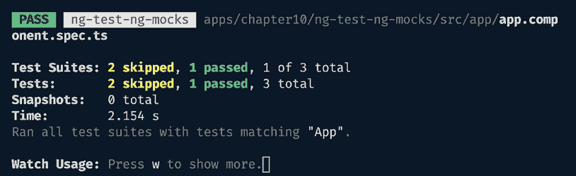

    

1.  在终端中按*a*键再次运行所有测试。

1.  现在，让我们谈谈`Version Control`组件的测试。这依赖于`VC Logs`组件。这次，让我们像专业人士一样模拟`VCLogsComponent`类，使用`MockBuilder`和`MockRender`方法，这样我们就可以在测试期间消除错误。更新后，`version-control.component.spec.ts`文件应该如下所示：

    ```js
    import { ComponentFixture, TestBed, waitForAsync } from '@angular/core/testing';
    import { VersionControlComponent } from './version-control.component';
    import { FormsModule } from '@angular/forms';
    import { MockBuilder, MockRender, MockedComponentFixture } from 'ng-mocks';
    import { AppModule } from '../../app.module';
    import { VcLogsComponent } from '../vc-logs/vc-logs.component';
    describe('VersionControlComponent', () => {
      let component: VersionControlComponent;
      let fixture: MockedComponentFixture
     <VersionControlComponent>;
      beforeEach(() => {
        return MockBuilder(
          VersionControlComponent,
          AppModule
        );
      });
      beforeEach(() => {
        fixture = MockRender(VersionControlComponent);
        component = fixture.point.componentInstance;
      });
      it('should create', () => {...});
    }); 
    ```

    如果你现在运行`npm run test`，你应该会看到所有的测试都通过了。接下来，让我们在下一步写另一个测试。

1.  `VersionControlComponent`在模板中将`VCLogsComponent`用作子组件。此外，它通过`[vName]`属性将`vName`属性作为`@Input()`提供给`VCLogsComponent`。我们可以检查输入值是否设置正确。为此，按照以下方式更新`version-control.component.spec.ts`文件：

    ```js
    import { VersionControlComponent } from './version-control.component';
    import { MockBuilder, MockRender, MockedComponentFixture, **ngMocks** } from 'ng-mocks';
    import { AppModule } from '../../app.module';
    **import** **{** **VcLogsComponent** **}** **from****'../vc-logs/vc-logs.component'****;**
    describe('VersionControlComponent', () => {
      ...
      it('should create', () => {...});
      **it****(****'should set vName input value in VCLogsComponent'****,**
    **() =>** **{**
    **const** **vcLogsComponent = ngMocks.****find****<****VcLogsComponent****>(**
    **'app-vc-logs'**
    **).****componentInstance****;**
    **component.****versionName** **=** **'2.2.2'****;**
    **fixture.****detectChanges****();**
    **expect****(vcLogsComponent.****vName****).****toBe****(****'2.2.2'****);**
    **});**
    }); 
    ```

1.  现在，让我们修改`vc-logs.component.spec.ts`文件，以确保当`VCLogsComponent`中的`vName`发生变化时，在`logs`数组中创建一个新的日志。为此，按照以下方式修改文件：

    ```js
    ...
    import { TestBed, waitForAsync } from '@angular/core/testing';
    import { VcLogsComponent } from './vc-logs.component';
    **import** **{** **MockRender****,** **MockedComponentFixture** **}** **from****'****ng-mocks'****;**
    describe('VcLogsComponent', () => {
      ...
      beforeEach(waitForAsync(() => {...}));
      beforeEach(() => {
        fixture = **MockRender****(****VcLogsComponent****, {**
    **vName****:** **'0.0.0'**
    **});**
        component = fixture**.****point**.componentInstance;
        fixture.detectChanges();
      });
      it('should create', () => {
        expect(component).toBeTruthy();
      });
      **it****(****'should add a log after vName change'****,** **() =>** **{**
    **fixture.****detectChanges****();**
    **fixture.****componentInstance****.****vName** **=** **"2.2.3"****;**
    **fixture.****detectChanges****();**
    **expect****(component.****logs****).****toHaveLength****(****2****);**
    **});**
    }); 
    ```

嘣！我们已经通过使用`ng-mocks`包实现了一些有趣的测试。每次我使用它时，我都非常喜欢（通常与`NgModule`中的组件一起使用，因为`standalone`组件没有这个问题）。现在我们已经完成了配方，在下一节中，让我们看看这一切是如何工作的。

## 它是如何工作的...

在这个配方中，我们涵盖了一些有趣的事情。首先，为了避免控制台上的任何错误，抱怨未知组件，我们使用来自`ng-mocks`包的`MockComponent`方法，将我们依赖的组件声明为模拟。请注意，当一个组件被模拟时，它会失去其功能，因为所有的方法都变成了`spy`函数。这正是我们可以用`ng-mocks`包实现的简单事情。然而，我们将继续到一个更高级的情况，我必须承认这是一种相当不寻常的方法，即测试父组件中子组件的`@Input`属性和`@Output`发射器，以便测试整个流程。这就是我们通过检查`@Input`属性`vName`的值来测试`VersionControlComponent`的方式。再次强调，这主要适用于非独立组件。

注意，我们已经完全从`version-control.component.spec.ts`文件中移除了对`@angular/core/testing`包的使用。这是因为我们不再使用`TestBed`来创建测试环境。相反，我们使用`ng-mocks`包中的`MockBuilder`方法为我们的`VersionControlComponent`构建测试环境。`MockBuilder`方法有几个重载，我们使用的是将目标组件作为第一个参数，以及该组件所属的`NgModule`作为第二个参数。模块及其内部的所有内容都被模拟。这使得单独测试组件变得容易得多。您还可以使用像`exclude`这样的方法进行链式调用，例如`MockBuilder(MyComponent, MyModule).exclude(OtherComponent)`，以不模拟特定的组件。然而，在这个配方中我们不需要这样做。我们还为`VersionControlComponent`编写了一个有趣的测试，即使用`ngMocks.find`方法获取子组件（`VCLogsComponent`），并检查当父组件中的相应属性发生变化时，子组件的`@Input()`是否设置得当。我认为这很有趣，因为我们现在正在检查另一个组件的属性，而不仅仅是我们要测试的组件。一般来说，您会想要模拟子组件或组件拥有的任何依赖项。话虽如此，您团队的方法可能不同。如果您有充分的理由不模拟子组件，并像配方中那样检查其属性，现在您知道了如何做。请参阅下一节以获取更多阅读资源。

重要提示

注意，我们不会在`VersionControlComponent.addNewReleaseLog`方法上使用间谍。这是因为如果我们这样做，该函数将变成 Jest 间谍函数。因此，它将失去其内部功能。作为交换，它将永远不会将新日志添加到`releaseLogs`数组中，并且我们的所有测试都不会通过。你可以尝试一下，看看效果如何。

## 参见

+   `ng-mocks`包的`mock`方法：[`ng-mocks.sudo.eu/api/MockBuilder#mock`](https://ng-mocks.sudo.eu/api/MockBuilder#mock)

+   `ng-mocks`官方文档：[`ng-mocks.sudo.eu`](https://ng-mocks.sudo.eu)

# 使用 Angular CDK 组件工具包编写更简单的测试

当编写组件测试时，可能会有一些场景，你想要与 DOM 元素交互。现在，这已经可以通过使用`fixture.debugElement.query`方法来查找元素，使用选择器然后触发它的事件来实现。然而，这意味着需要维护不同平台的 DOM 查询，了解所有选择器的标识符，然后在测试中公开所有这些。如果我们谈论 Angular 库，那就更糟了。当然，没有必要让每个与我库交互的开发者都知道所有元素选择器才能编写测试。只有库的作者应该知道这么多，以尊重封装。幸运的是，我们有 Angular CDK 团队提供的组件工具包，它们与 Angular 9 和 IVY 编译器一起发布。他们以身作则，为 Angular 材料组件提供了组件工具包。在这个菜谱中，你将学习如何创建自己的组件工具包。

## 准备工作

我们现在将要工作的应用位于克隆的仓库中的`start/apps/chapter10/ng-test-cdk-harness`：

1.  在你的代码编辑器中打开代码仓库。

1.  打开终端，导航到代码仓库目录，并运行以下命令以启动项目：

    ```js
    npm run serve ng-test-cdk-harness 
    ```

    这应该在新的浏览器标签页中打开应用，你应该会看到以下内容：

    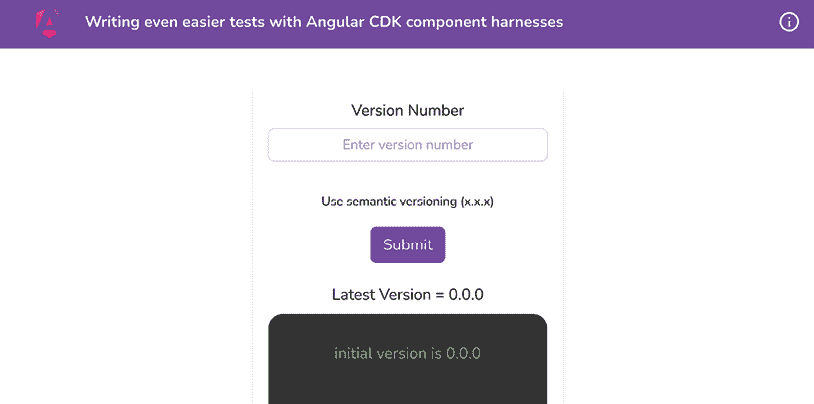

    图 10.13：运行在 http://localhost:4200 的 ng-test-cdk-harness 应用

现在你已经启动了应用，让我们继续到下一个部分，按照菜谱进行。

## 如何做到这一点...

我们有一个我们最喜欢的 Angular 版本控制应用，它允许我们创建发布日志。此外，我们已经有了一些测试，包括与 DOM 元素交互以验证一些用例的测试。让我们遵循菜谱使用组件工具包，看看在实际测试中变得多么容易：

1.  首先，运行以下命令以运行测试：

    ```js
    npm run test ng-test-cdk-harness 
    ```

1.  现在，我们将为`VersionControlComponent`创建一个`component harness`。让我们在`version-control`文件夹内创建一个新文件，并将其命名为`version-control.component.harness.ts`。然后，在它里面添加以下代码：

    ```js
    import { ComponentHarness } from '@angular/cdk/testing';
    export class VersionControlComponentHarness extends
      ComponentHarness {
      static hostSelector = 'app-release-form';
      protected getSubmitButton =
      this.locatorFor('button[type=submit]');
      protected getAppVersionInput =
      this.locatorFor(`#versionNumber`);
      protected getVersionErrorEl =
      this.locatorFor('small.error');
    } 
    ```

1.  现在，我们需要为我们的`VersionControlComponent`测试设置 Harness 环境。为此，我们将使用 Angular CDK 中的`TestbedHarnessEnvironment`。按照以下方式更新`version-control.component.spec.ts`文件：

    ```js
     import { TestbedHarnessEnvironment } from '@angular/cdk/testing/testbed';
          ... 
    ```

1.  现在，让我们在我们的`VersionControlComponentHarness`类中编写一些方法来获取相关信息。我们将在后续步骤中使用这些方法。按照以下方式更新`version-control.component.harness.ts`文件：

    ```js
    ...
    export class ReleaseFormComponentHarness extends ComponentHarness {
      ...
      **async****clickSubmit****() {**
    **const** **submitBtn =** **await****this****.****getSubmitButton****();**
    **return****await** **submitBtn.****click****();**
    **}**
    **async****setNewAppVersion****(****version****:** **string****) {**
    **const** **versionInput =** **await****this****.****getAppVersionInput****();**
    **return****await** **versionInput.****sendKeys****(version);**
    **}**
    **async****isVersionErrorShown****() {**
    **const** **expected =** **'Version number does not match the**
    **pattern (x.x.x)'****;**
    **const** **versionErrorEl =** **await****this****.****getVersionErrorEl****();**
    **const** **versionErrorText =** **await** **versionErrorEl.****text****();**
    **const** **isErrorShown = versionErrorText.****trim****() ===**
    **expected;**
    **if** **(!isErrorShown) {**
    **console****.****log****({**
    **actual****: versionErrorText.****trim****(),**
    **expected,**
    **});**
    **}**
    **return** **isErrorShown;**
    **}** 
    ```

1.  接下来，我们将使用组件 Harness 来完成我们的第一个测试，命名为`should show error on wrong version number input`。按照以下方式更新`version-control.component.spec.ts`文件：

    ```js
    ...
    **import** **{** **VersionControlComponentHarness** **}** **from****'./version-control.component.harness'****;**
    describe('VersionControlComponent', () => {
      ...
      **it****(****'should show error on wrong version number input'****,**
    **async** **() => {**
    **const** **vcHarness =** **await****TestbedHarnessEnvironment**
    **.****harnessForFixture****(**
    **fixture,**
    **VersionControlComponentHarness**
    **);**
    **await** **vcHarness.****setNewAppVersion****(****'abcd'****);**
    **await** **vcHarness.****clickSubmit****();**
    **fixture.****detectChanges****();**
    **const** **isErrorShown =** **await** **vcHarness**
    **.****isVersionErrorShown****();**
    **expect****(isErrorShown).****toBe****(****true****);**
      });
      ...
    }); 
    ```

    现在，如果你运行`npm run test`，你应该会看到所有的测试都通过了，这意味着我们使用组件 Harness 的第一个测试是有效的。哇哦！

1.  对于最终测试，我们还需要为`VCLogsComponent`创建一个组件 Harness。让我们快速创建它。在`vc-logs`文件夹内添加一个新文件，命名为`vc-logs.component.harness.ts`，并添加以下代码：

    ```js
    import { ComponentHarness } from '@angular/cdk/testing';
    export class VCLogsComponentHarness extends ComponentHarness {
      static hostSelector = 'app-vc-logs';
      protected getLogsList = this.locatorForAll('.logs__item');
      async getLogsLength() {
        const logsElements = await this.getLogsList();
        return logsElements.length;
      }
      protected async getLogTextAt(index: number) {
        const logsElements = await this.getLogsList();
        return (await logsElements[index].text()).trim();
      }
      async getFirstLogText() {
        return await this.getLogTextAt(0);
      }
      async getSecondLogText() {
        return await this.getLogTextAt(1);
      }
    } 
    ```

1.  最后，让我们修改`version-control.component.spec.ts`文件中的最终测试，如下所示：

    ```js
    ...
    import { VersionControlComponentHarness } from './version-control.component.harness';
    **import** **{** **VCLogsComponentHarness** **}** **from****'../vc-logs/vc-logs.component.harness'****;**
    describe('VersionControlComponent', () => {
      ...
      it('should show the new log in the list after adding
      submitting a new log', async () => {
        **const** **vcHarness =** **await****TestbedHarnessEnvironment**
    **.****harnessForFixture****(**
    **fixture,**
    **VersionControlComponentHarness**
    **);**
    **const** **harnessLoader =** **TestbedHarnessEnvironment**
    **.****loader****(fixture);**
    **const** **vcLogsHarness =** **await** **harnessLoader.****getHarness****(**
    **VCLogsComponentHarness**
    **);**
    **const****VERSION** **=** **'2.3.6'****;**
    **await** **vcHarness.****setNewAppVersion****(****VERSION****);**
    **await** **vcHarness.****clickSubmit****();**
    **fixture.****detectChanges****();**
    **const** **logsLength =** **await** **vcLogsHarness.****getLogsLength****();**
    **expect****(logsLength).****toBe****(****2****);**
    **const** **firstLogText =** **await** **vcLogsHarness**
    **.****getFirstLogText****();**
    **expect****(firstLogText).****toBe****(****`initial version is 0.0.0`****);**
    **const** **secondLogText =** **await** **vcLogsHarness**
    **.****getSecondLogText****();**
    **expect****(secondLogText).****toBe****(****`version changed to**
    **2.3.6`****);**
      });
    }); 
    ```

哇哦！这就是使用 Angular CDK 组件 Harness 进行的一些令人惊叹的测试。如果你现在运行测试，你应该会看到它们全部通过。现在你已经完成了这个食谱，请参考下一节了解它是如何工作的。

## 它是如何工作的...

好的！这是一个很棒的食谱，我也很享受写它。这个食谱的关键因素是`@angular/cdk/testing`包。如果你之前使用 Protractor 进行过`e2e`测试，那么这个概念与 Protractor 中的**页面**或**页面对象**（**POs**）类似。我们首先做的事情是为`VCLogsComponent`和`VersionControlComponent`创建组件 Harness。

注意，我们为两个组件 Harness 从`@angular/cdk/testing`中导入`ComponentHarness`类。然后，我们扩展我们的自定义类，称为`VersionControlComponentHarness`和`VCLogsComponentHarness`，从`ComponentHarness`类继承。本质上，这是编写组件 Harness 的正确方式。你注意到名为`hostSelector`的静态属性了吗？我们需要为每个我们创建的组件 Harness 类都设置这个属性，其值总是目标元素/组件的选择器。这确保了当我们把这个 Harness 加载到测试环境中时，环境可以在 DOM 中找到主机元素——这就是我们创建组件 Harness 的原因。在我们的组件 Harness 类中，我们使用`this.locatorFor`方法在主机组件中查找元素。`locateFor`方法接受一个参数，即要查找的元素的**CSS 选择器**，返回一个`AsyncFactoryFn`。这意味着返回的值是一个我们可以稍后用来获取所需元素的函数。

在`VersionControlComponentHarness`类中，我们分别使用受保护的`getSubmitButton`和`getAppVersionInput`方法找到提交按钮和版本号输入。所有这些方法都是前面提到的`AsyncFactoryFn`类型。我们将这些方法设置为受保护的，因为我们不希望编写单元测试的开发者访问或关心 DOM 元素的信息。这使得每个人都能更容易地编写测试，而无需担心访问 DOM 的内部实现。

这里要提到的一个重要事项是，当我们调用`locatorFor`方法或`locatorForAll`方法时，我们分别得到一个包含`TestElement`项的`Promise`和一个包含`TestElement`项列表的`Promise`。每个`TestElement`项都有一系列方便的方法，例如`click`、`sendKeys`、`focus`、`blur`、`getProperty`、`text`等。这些方法正是我们所感兴趣的，因为我们在幕后使用它们与 DOM 元素进行交互。

现在，让我们谈谈配置测试环境。在`version-control.component.spec.ts`文件中，我们设置环境以使用组件工具包对`VCLogsComponent`和`VersionControlComponent`进行测试。`TestbedHarnessEnvironment`元素是这里的关键元素。我们首先使用`TestbedHarnessEnvironment.harnessForFixture`方法。这是因为我们正在为`VersionControlComponent`编写测试，并且我们还想将同一组件的工具包作为根。因此，`harnessForFixture`方法在这里是合理的。该方法将`fixture`作为第一个参数，将`harness`类作为第二个参数。然后，我们还使用`TestbedHarnessEnvironment`类的`loader`方法来获取`HarnessLoader`的实例。这个加载器可以获取`VCLogsComponent`的工具包，即获取`VCLogsComponentHarness`类的实例。请注意，`fixture`是我们使用`TestBed.createComponent(VersionControlComponent)`语句在测试环境中获得的。

注意，在测试中，我们通过提供工具包类作为参数来使用`harnessLoader.getHarness`方法。这使测试环境能够找到与工具包类`hostSelector`属性关联的 DOM 元素。此外，我们还得到了可以进一步在测试中使用的组件工具包实例。

## 另请参阅

+   使用组件工具包在 DOM 中查找组件：[`material.angular.io/cdk/test-harnesses/overview#finding-elements-in-the-components-dom`](https://material.angular.io/cdk/test-harnesses/overview#finding-elements-in-the-components-dom)

+   组件工具包作者的 API：[`material.angular.io/cdk/test-harnesses/overview#api-for-component-harness-authors`](https://material.angular.io/cdk/test-harnesses/overview#api-for-component-harness-authors)

# 单元测试 HTTP 调用响应

如果你正在构建一个 Angular 应用程序，你很可能在某个时候会在应用程序内部处理 HTTP 调用。例如，你可能从第三方 API 获取数据，或者只是向自己的服务器发送 API 调用。在两种情况下，测试具有 HTTP 调用的应用程序都会变得稍微困难一些。在这个食谱中，我们将学习如何创建带有 HTTP 调用的单元测试。

## 准备工作

我们现在将要工作的应用程序位于克隆的仓库中的`start/apps/chapter10/ng-test-http-resp`目录内：

1.  在你的代码编辑器中打开代码仓库。

1.  打开终端，导航到代码仓库目录，并运行以下命令以启动项目：

    ```js
    npm run serve ng-test-http-resp 
    ```

    这应该在新的浏览器标签页中打开应用程序，你应该看到以下内容：

    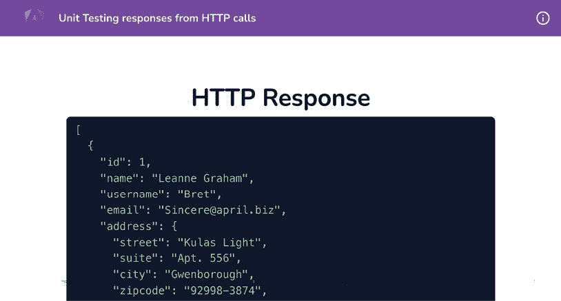

    图 10.14：ng-test-http-resp 应用程序在 http://localhost:4200 上运行

    让我们也运行一下测试。目前，对`UserService`的测试，它获取 HTTP 响应，没有通过。你应该看到类似于*图 10.15*的输出：

    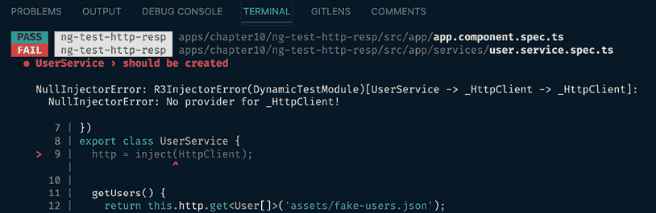

    图 10.15：UserService 测试失败

现在我们已经将应用程序和测试在本地上运行起来，在下一节中，让我们看看食谱的步骤。

## 如何操作...

我们将编写一个单独的测试来检查服务器的`getUser`方法是否返回正确的数据。如果你打开`UserService`，你会注意到该服务使用 HTTP 调用获取用户，然后修改数据以添加`fullAddress`属性。我们的测试应该期望发生相同的事情。让我们开始：

1.  首先，我们将修复失败的测试。我们将把`HttpClientModule`类添加到测试的`imports`数组中。按照以下方式更新`user.service.spec.ts`：

    ```js
    ...
    **import** **{** **HttpClientModule** **}** **from****'****@angular/common/http'****;**
    describe('UserService', () => {
      ...
      beforeEach(() => {
        TestBed.configureTestingModule(**{**
    **imports****: [****HttpClientModule****],**
    **}**);
        service = TestBed.inject(UserService);
      });
      ...
    }); 
    ```

    现在，当你运行`npm run test`命令时，你会看到测试现在通过了，如下所示：

    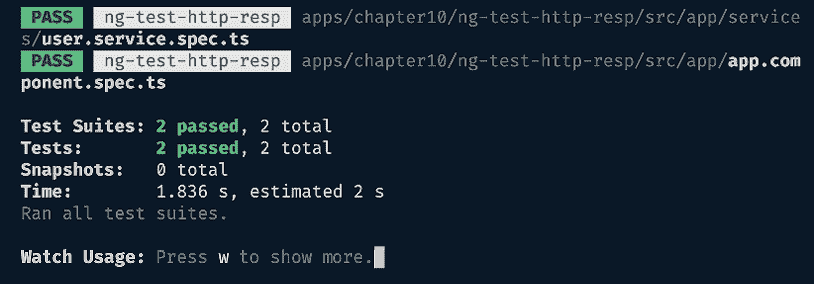

    图 10.16：UserService 的测试也通过

1.  现在，我们将在`user.service.spec.ts`文件中导入`HttpClientTestingModule`，以便能够使用它来拦截 HTTP 调用。按照以下方式修改文件：

    ```js
    ...
    **import** **{** **HttpClientTestingModule****,**
    **}** **from****'@angular/common/http/testing'****;**
    ...
    describe('UserService', () => {
      let service: UserService;
      beforeEach(() => {
        TestBed.configureTestingModule({
          imports: [HttpClientModule, **HttpClientTestingModule**],
        });
        service = TestBed.inject(UserService);
      });
    }); 
    ```

1.  让我们使用来自同一`@angular/common/http/testing`包的`HttpTestingController`类创建一个控制器。我们稍后会使用这个控制器来期望和拦截 HTTP 调用。按照以下方式更新`user.service.spec.ts`文件：

    ```js
    ...
    import {
      HttpClientTestingModule**,**
    **HttpTestingController****,**
    } from '@angular/common/http/testing';
    describe('UserService', () => {
      let service: UserService;
      **let****httpTestingController****:** **HttpTestingController****;**
    beforeEach(() => {
        TestBed.configureTestingModule({...});
        service = TestBed.inject(UserService);
        **httpTestingController =** **TestBed****.****inject****(**
    **HttpTestingController****);**
      });
    }); 
    ```

1.  现在，我们将编写一个测试（终于）。我们将使用`httpTestingController`拦截对`/assets/users.json`的 HTTP 调用，然后我们将比较结果与我们的预期数据。通过添加以下测试来更新`user.service.ts`文件：

    ```js
    ...
    **import** **{** **User** **}** **from****'../user.interface'****;**
    describe('UserService', () => {
      ...
      **it****(****'should return expected user data (HttpClient called**
    **once)'****,** **() =>** **{**
    **const****mockUsers****:** **User****[] = [];**
    **const** **req = httpTestingController**
    **.****expectOne****(****'assets/users.json'****);**
    **expect****(req.****request****.****method****).****toEqual****(****'GET'****);**
    **req.****flush****(mockUsers);** **// Respond with mocked data**
    **});**
    }); 
    ```

1.  我们将在测试中添加一个`afterEach`钩子来验证测试后没有挂起的请求。让我们将其添加到`user.service.spec.ts`文件中，如下所示：

    ```js
    ...
    describe('UserService', () => {
      ...
      **afterEach****(****() =>** **{**
    **// After every test, assert that there are no more**
    **pending requests.**
    **httpTestingController.****verify****();**
    **});**
      ...
    }); 
    ```

1.  现在，让我们用两个用户填充模拟数据（`mockUsers`数组）。由于我们使用了`req.flush(mockUsers)`，HTTP 调用将被拦截，并且这些数据（`mockUsers`数组）将作为响应从其中返回。将文件`user.service.spec.ts`中的测试`it('should return expected user data (HttpClient called once)'`替换为[`ng-cookbook.com/s/ng-test-http-mock-users`](https://ng-cookbook.com/s/ng-test-http-mock-users)中的代码片段。

1.  最后，进一步更新测试，使用`getUsers`方法进行 HTTP 调用，并查看我们是否可以期望转换后的数据。更新`user.service.spec.ts`文件，如下所示：

    ```js
    describe('UserService', () => {
      ...
      it('should return expected user data (HttpClient called
    once)', (**done**) => {
        const mockUsers: User[] = [...];
        **service.****getUsers****().****subscribe****({**
    **next****:** **(****data****) =>** **{**
    **expect****(data).****toEqual****([{**
    **...mockUsers[****0****],**
    **fullAddress****:** **'sample street 1, 123 ABC, Dream**
    **city, 4567'**
    **}, {**
    **...mockUsers[****1****],**
    **fullAddress****:** **'sample street 2, 123 ABC, Dream**
    **city, 890'**
    **}]);**
    **done****();**
    **},**
    **error****:** **(****err****) =>** **{**
    **console****.****log****(****'****Error: '****, err);**
    **},**
    **});**
        ...
      });
    }); 
    ```

    如果你运行测试，你应该看到它们都通过，如下所示：

    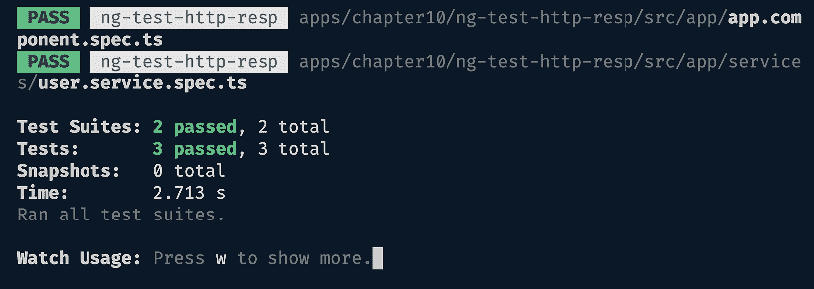

    图 10.17：所有测试通过

太好了！你现在知道如何使用`HttpTestingController`来测试具有方法的服务的 HTTP 调用。尽管关于在 Angular 中测试 HTTP 调用和 Observables 还有很多东西要学习，但这个菜谱的目的是保持一切简单而甜蜜。

现在你已经完成了这个菜谱，请参考下一节了解它是如何工作的。

## 它是如何工作的...

这个菜谱的英雄是`HttpClientTestingModule`，它允许我们使用`HttpTestingController`的一个实例。`HttpTestingController`使得拦截我们代码中的 HTTP 调用变得容易，并允许我们返回一个特定的响应。这使得我们更容易不对 Angular 服务进行真实的 HTTP 调用测试，这可能会很昂贵。这种模拟响应方法的另一个好处是始终有一个相同的响应对象可以与之工作。在我们的例子中，我们的`getUsers`方法不仅进行了 HTTP 调用，还使用`RxJs`的`map`运算符转换了数据。因此，我们使用了一个模拟用户数组，并期望`getUsers`方法的结果包含转换后的数据，即包含正确的`fullAddress`属性。你可以在测试中看到，我们使用了`HttpTestingController.expectOne`方法，告诉我们的测试在运行测试时应该只有一个请求。我们期望那个请求的方法是`GET`。然后，我们期望`getUsers`方法返回的值有一个包含`fullAddress`属性的用户的数组。

## 参见

+   Angular 测试组件场景：[`docs.angular.lat/guide/testing-components-scenarios`](https://docs.angular.lat/guide/testing-components-scenarios)

+   `HttpTestingController`文档：[`angular.io/api/common/http/testing/HttpTestingController`](https://angular.io/api/common/http/testing/HttpTestingController)

# 单元测试 Angular 管道

在我看来，管道是 Angular 应用程序中最容易测试的东西。为什么？因为它们（应该是）纯函数，根据相同的输入集返回相同的结果。在这个菜谱中，我们将为 Angular 应用程序中的一个简单管道编写一些测试。

## 准备工作

我们现在将要工作的应用位于克隆的仓库中的`start/apps/chapter10/ng-test-pipes`：

1.  在你的代码编辑器中打开代码仓库。

1.  打开终端，导航到代码仓库目录，并运行以下命令来运行项目：

    ```js
    npm run serve ng-test-pipes 
    ```

    这应该在新的浏览器标签页中打开应用，你应该看到以下内容：

    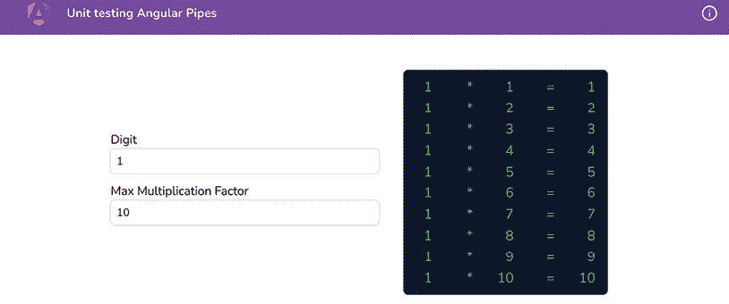

    图 10.18：运行在 http://localhost:4200 的 ng-test-pipes 应用

现在我们已经在本地上运行了应用，在下一节中，让我们通过食谱的步骤。

## 如何做到这一点...

在这里，我们有一个简单的食谱，它接受两个输入——数字和最大因子值。基于这些输入，我们显示一个乘法表。我们已经有了一个工作正常的`MultTablePipe`，根据我们的业务逻辑。现在我们将编写一些单元测试来验证我们的输入和预期输出，如下所示：

1.  让我们为`MultTablePipe`编写第一个自定义测试。我们将确保当`digit`输入无效时，它返回一个空数组。用以下代码替换整个`mult-table.pipe.spec.ts`文件：

    ```js
    import { MultTablePipe } from './mult-table.pipe';
    describe('MultTablePipe', () => {
      let pipe: MultTablePipe;
      beforeEach(() => {
        pipe = new MultTablePipe();
      })
      it('should return an empty array if the value of digit
      is not valid', () => {
        const digit = 0;
        const limit = 10;
        const outputArray = pipe.transform(null, digit, limit);
        expect(outputArray).toEqual([]);
      });
    }); 
    ```

1.  让我们编写另一个测试来验证`limit`输入，以便在它无效时也返回一个空数组：

    ```js
    ...
    describe('MultTablePipe', () => {
      ...
      **it****(****'should return an empty array if the value of limit**
    **is not valid'****,** **() =>** **{**
    **const** **digit =** **10****;**
    **const** **limit =** **0****;**
    **const** **outputArray = pipe.****transform****(****null****, digit,**
    **limit);**
    **expect****(outputArray).****toEqual****([]);**
    **});**
    }); 
    ```

1.  现在，我们将编写一个测试来验证当`digit`和`limit`输入都有效时，管道的`transform`方法的输出。在这种情况下，我们应该得到包含乘法表的数组。按照以下方式编写另一个测试：

    ```js
     describe('MultTablePipe', () => {
      ...
      **it****(****'should return the correct multiplication table**
    **when both digit and limit inputs are valid'****,** **() =>** **{**
    **const** **digit =** **10****;**
    **const** **limit =** **2****;**
    **const** **expectedArray = [{** **digit****:** **10****,** **factor****:** **1****,** **result****:**
    **10** **},**
    **{** **digit****:** **10****,** **factor****:** **2****,** **result****:** **20** **},];**
    **const** **outputArray = pipe.****transform****(****null****, digit, limit);**
    **expect****(outputArray).****toEqual****(expectedArray);**
    **});**
    }); 
    ```

1.  目前，在应用内部，我们有提供`limit`输入的十进制数字的可能性。例如，我们可以将`2.5`作为输入中的最大因子。为了处理这种情况，我们在`MultTablePipe`中使用`Math.floor`将其向下舍入到较小的数字。让我们编写一个测试来确保这一点：

    ```js
    ...
    describe('MultTablePipe', () => {
      ...
      **it****(****'should round of the limit if it is provided**
    **in decimals'****,** **() =>** **{**
    **const** **digit =** **10****;**
    **const** **limit =** **3.5****;**
    **const** **expectedArray = [**
    **{****digit****:** **10****,** **factor****:** **1****,** **result****:** **10****},**
    **{****digit****:** **10****,** **factor****:** **2****,** **result****:** **20****},**
    **{****digit****:** **10****,** **factor****:** **3****,** **result****:** **30****}**
    **];** **// rounded off to 3 factors instead of 3.5**
    **const** **outputArray = pipe.****transform****(****null****, digit, limit);**
    **expect****(outputArray).****toEqual****(expectedArray);**
    **});**
    }); 
    ```

*简单易行!* 编写 Angular 管道的测试非常直接，我非常喜欢它。我们可以称之为纯函数的力量。现在你已经完成了食谱，请参阅下一节以获取更多信息链接。

## 参见

+   测试 Angular 管道官方文档：[`angular.io/guide/testing-pipes`](https://angular.io/guide/testing-pipes)

+   使用服务测试 Angular 管道：[`levelup.gitconnected.com/test-angular-pipes-with-services-4cf77e34e576`](https://levelup.gitconnected.com/test-angular-pipes-with-services-4cf77e34e576)

# 在 Discord 上了解更多

要加入这本书的 Discord 社区——在那里你可以分享反馈，向作者提问，并了解新版本——请扫描下面的二维码：

`packt.link/AngularCookbook2e`


