# 第十一章：使用 Cypress 在 Angular 中进行端到端测试

拥有几个**端到端**（**E2E**）（**E2E**）测试的应用程序肯定比没有任何测试的应用程序更可靠，在当今世界，随着新兴企业和复杂应用程序的出现，在某些时候编写 E2E 测试以捕获应用程序的整个流程变得至关重要。Cypress 是目前用于 Web 应用程序 E2E 测试的最佳工具之一。在本章中，您将学习如何使用 Cypress 测试 Angular 应用程序中的 E2E 流程。以下是本章将要涵盖的食谱：

+   编写您的第一个 Cypress 测试

+   验证 DOM 元素是否在视图中可见

+   测试表单输入和提交

+   等待**XMLHttpRequests**（**XHRs**）完成

+   使用 Cypress 捆绑包

+   使用 Cypress fixtures 提供模拟数据

# 技术要求

对于本章中的食谱，请确保您的设置已按照“Angular-Cookbook-2E”GitHub 仓库中的“技术要求”完成。有关设置详细信息，请访问：[`github.com/PacktPublishing/Angular-Cookbook-2E/tree/main/docs/technical-requirements.md`](https://github.com/PacktPublishing/Angular-Cookbook-2E/tree/main/docs/technical-requirements.md)。本章的起始代码位于[`github.com/PacktPublishing/Angular-Cookbook-2E/tree/main/start/apps/chapter11`](https://github.com/PacktPublishing/Angular-Cookbook-2E/tree/main/start/apps/chapter11)。

# 编写您的第一个 Cypress 测试

如果您已经编写了 E2E 测试，您可能已经使用 Protractor 这样做过。使用 Cypress 是完全不同的体验。在本食谱中，您将使用现有的 Angular 应用程序设置 Cypress，并使用 Cypress 编写第一个 E2E 测试。

## 准备工作

我们将要工作的应用程序位于克隆的仓库中的`start/apps/chapter11/ng-cypress-starter`：

1.  在您的代码编辑器中打开代码仓库。

1.  打开终端，导航到代码仓库目录，并运行以下命令以启动项目：

    ```js
    npm run serve ng-cypress-starter 
    ```

    这应该在新的浏览器标签页中打开应用程序，您应该看到以下内容：

    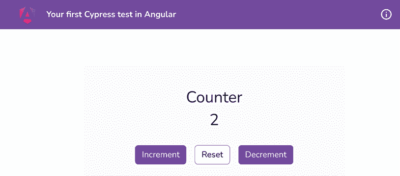

    图 11.1：ng-cypress-starter 应用程序在 localhost:4200 上运行

## 如何做到这一点…

我们正在工作的应用程序是一个简单的计数器应用程序。它有最小值和最大值，以及一些可以增加、减少和重置计数器值的按钮。我们将首先为我们的应用程序配置 Cypress，然后转向编写测试：

1.  由于我们使用的是 NX 工作区，这里的设置与常规 Angular 应用程序不同。打开一个新的终端窗口/标签，并确保您位于工作区的根目录中。一旦进入，运行以下命令将**Cypress**安装到我们的项目中：

    ```js
    cd start && npm install --save-dev @nx/cypress 
    ```

1.  现在，从工作区的根目录运行以下命令为应用程序创建一个`cypress`项目，如下所示：

    ```js
    cd start && nx g @nx/cypress:cypress-project ng-cypress-starter-e2e --project=ng-cypress-starter --directory apps/chapter11/ng-cypress-starter-e2e 
    ```

    当（或如果）被问及时，在安装过程中选择 Cypress 的 `Vite` 打包器，因为 Vite 是一个更快的打包器，同时也提供了一个更快的开发服务器。并选择“Ap provided”，这样我们就在 `start/apps/chapter11` 文件夹中创建了 `ng-cy-starter-e2e` 文件夹。你会看到在 `start/apps` 文件夹内创建了一个名为 `ng-cypress-starter-e2e` 的新文件夹。

1.  让我们运行一个脚本来重命名我们的应用程序，从 `chapter11-ng-cypress-starter-e2e` 改为 `ng-cypress-starter-e2e`。这将使我们更容易运行此食谱和下一个食谱的 `e2e` 测试。请在工作区的根目录中使用以下命令：

    ```js
    node scripts/rename-app.js chapter11 ng-cypress-starter-e2e start 
    ```

1.  现在，你可以从工作区的根目录（在 `start` 文件夹外部）运行以下命令来启动 Cypress 测试：

    ```js
    npm run e2e ng-cypress-starter 
    ```

    你应该能够使用浏览器来启动运行测试。我将使用 Chrome 作为本书 `e2e` 测试的浏览器。

1.  在 `cypress-chrome` 窗口中点击 `app.cy.ts`（由 *步骤 4* 打开的浏览器窗口）来运行默认创建的测试。我们将在食谱中修改此文件以编写自己的测试。一旦运行测试，你会看到它们失败。但不要担心，因为我们还没有编写自己的测试。

1.  让我们现在创建我们的第一个测试。我们将只是检查应用程序标题中的标题是否为 `Your first Cypress test in Angular`。让我们通过在文件中创建一个 **PO**（**页面对象**）来替换 `src/e2e/support/app.po.ts` 文件的全部内容如下：

    ```js
    export const getHeaderTitle = () =>
      cy.get('.toolbar__title'); 
    ```

1.  现在，我们将从 `src/e2e/app.cy.ts` 文件中导入 `getHeaderTitle` 并替换第一个测试如下：

    ```js
    import { getHeaderTitle } from '../support/app.po';

    describe('ng-cypress-starter', () => {
      beforeEach(() => cy.visit('/'));

      it('should display the correct header title', () => {
        getHeaderTitle().should('contain.text','Your first
    Cypress test in Angular');
      });
    }); 
    ```

1.  如果你再次查看 Cypress 窗口，你应该会看到测试通过如下：![img/B18469_11_02.png]

    图 11.2：我们的第一个 Cypress 测试通过

*简单，对吧？* 现在你已经知道了如何为 Angular 应用程序配置 Cypress（尤其是在 NX 中），请参阅下一节了解它是如何工作的。

## 它是如何工作的…

Cypress 可以与任何框架和 Web 开发项目集成。一个有趣的事实是，Cypress 在幕后使用 Mocha 作为测试运行器。Cypress 的工具会监视代码更改，这样你就不必反复重新编译测试。Cypress 还在测试的应用程序周围添加了一个外壳，以捕获日志并在测试期间访问 DOM 元素，以及一些用于调试测试的功能。

在我们的 `app.cy.ts` 文件的最顶部，我们使用 `describe` 方法，它定义了测试套件，并定义了即将编写的测试的上下文。然后，我们使用 `beforeEach` 方法来指定在执行每个测试之前应该发生什么。由于每个测试开始时没有数据，我们首先必须确保 Cypress 导航到我们的应用程序的 URL：`http://localhost:4200`。我们之所以只指定 `cy.visit('/')` 而它仍然可以工作，是因为 NX 自动使用 `@nx/cypress` 包进行配置。如果您将 Cypress 添加到标准的 Angular 应用程序（不在 NX 工作区中），您将必须在 Cypress 配置文件（`cypress.config.ts`）中指定 `baseUrl`，如下所示：

```js
import { defineConfig } from 'cypress'
export default defineConfig({
  e2e: {
    baseUrl: 'http://localhost:4200',
  },
}) 
```

然而，NX 为这本书的食谱做了这件事。因此，我们只需在我们的测试中提供相对 URL。

对于我们每个测试，我们使用 `it` 方法来指定它们的标题。您会注意到在 `app.cy.ts` 文件中，我们正在从 `support/app.po` 文件导入 `getHeaderTitle` 方法。如食谱中先前所述，**PO** 代表 **page object**。这是一种广泛的做法，使用这些对象来包含返回 **Document Object Module**（**DOM**）元素的函数。这使我们的测试免于与 DOM 交互以检索元素的代码，并且我们有可重用的测试函数。在 `app.po` 文件中，您可以看到我们使用 `cy.get` 方法检索一个应用了 `toolbar__title` 类的单个元素。本书中所有食谱的 Angular 应用程序都有一个标题和一个显示食谱内容的标题。请注意，在 `app.cy.ts` 文件中，我们使用 `getHeaderTitle` 方法从我们的 HTML 页面获取目标元素。然后我们使用 `should()` 方法将标题的文本与预期的值 `Your first Cypress test in Angular` 进行比较。请注意，我们使用 ‘`contain.text`’ 而不是 `'have.text'`，因为目标元素中可能有空白字符。以下是一些使用 `should` 方法的其他示例，其中包含不同的语句：

+   `should('be.visible')`

+   `should('be.empty')`

+   `should('be.visible')`

+   `should('have.class''my-class')`

+   `should('have.id''newUserId')`

+   `should('be.visible')`

+   `should('have.focus')`

现在您已经了解了食谱的工作原理，请参阅下一节以获取一些有用的链接。

## 参见

+   `cy.get` 文档：[`docs.cypress.io/api/commands/get`](https://docs.cypress.io/api/commands/get)

+   Cypress 文档 – 编写您的第一个测试：[`docs.cypress.io/guides/getting-started/writing-your-first-test.html`](https://docs.cypress.io/guides/getting-started/writing-your-first-test.html)

# 验证 DOM 元素在视图中是否可见

在大多数网络应用程序中，至少有一个元素/视图是基于某种条件显示的。否则，它会被隐藏。当确保最终用户在正确的情况下看到正确的内容时，进行良好的测试变得必要。在这个菜谱中，你将学习如何检查元素是否在 DOM 中可见。

## 准备工作

我们将要工作的应用程序位于克隆的仓库中的 `start/apps/chapter11/ng-cy-element-visibility`。然而，`e2e` 测试在 `start/apps/chapter11/ng-cy-element-visibility-e2e` 文件夹中。在这个菜谱中，我们将修改这两个文件夹中的文件。让我们按照以下步骤首先运行 e2e 测试：

1.  在你的代码编辑器中打开代码仓库。

1.  打开终端，导航到代码仓库目录，并运行以下命令以运行项目的 e2e 测试：

    ```js
    npm run e2e ng-cy-element-visibility 
    ```

    这应该会打开 Cypress 窗口。选择 Chrome 进行测试，然后点击 `app.cy.ts` 文件以运行测试，你应该会看到以下内容：

    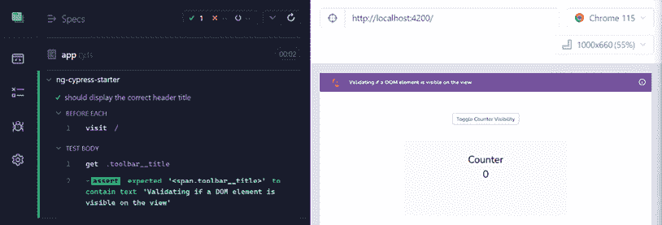

    图 11.3：ng-cy-element-visibility 应用程序的 Cypress 测试运行

现在我们已经在本地运行了应用程序和 Cypress 测试，让我们看看下一节中菜谱的步骤。

## 如何操作…

我们有来自上一个菜谱的同一个旧的计数应用程序。然而，有些事情已经改变了。我们现在在顶部有一个按钮，可以切换计数组件 `(CounterComponent)` 的可见性。此外，我们必须将鼠标悬停在计数卡片上才能看到 `Increment`、`Decrement` 和 `Reset` 操作按钮。

1.  让我们创建必要的页面对象以供测试。我们将在页面对象 `app.po.ts` 文件中创建返回切换按钮和计数卡片的功能。更新 `start/apps/chapter11/ng-cy-element-visibility-e2e` 文件夹中的 `src/support/app.po.ts` 文件，如下所示：

    ```js
    export const getHeaderTitle = () =>
     cy.get('.toolbar__title');
    **export****const****getToggleCounterButton** **= () =>**
    **cy.****get****(****'[data-test-id="toggleCounterBtn"]'****);**
    **export****const****getCounterCard** **= () => cy.****get****(**
    **'[data-test-id="counterCard"]'****);**
    **export****const****getCounterActions** **= () =>** **getCounterCard****()**
    **.****find****(****'button'****);** 
    ```

1.  让我们现在将相关的测试 ID 添加到 HTML 中。我们将为切换计数按钮和计数元素添加 `test-id` 属性。修改 `ng-cy-element-visibility/src/app/app.component.html` 文件，如下所示：

    ```js
    ...
    <main class="content" role="main">
    <div class="...">
    <button **data-test-id****=****"toggleCounterBtn"**
     (click)="toggleCounterVisibility()">Toggle Counter
            Visibility</button>
    <app-counter **data-test-id****=****"counterCard"**
    *ngIf="visibility ===
      visibilityOptions.Visible"></app-counter>
    </div>
    </main> 
    ```

1.  现在，我们将编写一个测试来确保当点击切换计数按钮时，我们的计数卡片会显示和隐藏。为此，更新 `ng-cy-element-visibility-e2e/src/e2e/app.cy.ts` 文件，如下所示：

    ```js
    import { **getCounterCard**, getHeaderTitle, **getToggleCounterButton** } from '../support/app.po';
    describe('ng-cypress-starter', () => {
      beforeEach(() => cy.visit('/'));
      it('should display the correct header title', () => ...});
      **it****(****'should toggle visibility of counter card when the**
    **toggle button is clicked'****,** **() =>** **{**
    **getCounterCard****().****should****(****'****exist'****);**
    **getToggleCounterButton****().****click****();**
    **getCounterCard****().****should****(****'not.exist'****);**
    **getToggleCounterButton****().****click****();**
    **getCounterCard****().****should****(****'exist'****);**
      }**);**
    }); 
    ```

1.  现在，我们将编写另一个测试来检查当我们将鼠标悬停在 `Counter` 组件上时，我们的操作按钮（`Increment`、`Decrement` 和 `Reset`）是否会显示。再次更新 `app.cy.ts` 文件，如下所示：

    ```js
    import { **getCounterActions**, getCounterCard, getHeaderTitle, getToggleCounterButton } from '../support/app.po';
    describe('ng-cypress-starter', () => {
      ...
      **it****(****'should show the action buttons when the counter card is hovered'****,**
    **() =>** **{** 
    **getCounterCard****().****trigger****(****'mouseover'****);** 
    **getCounterActions****().****should****(****'have.length'****,** **3****);** 
    **getCounterActions****().****contains****(****'Increment'****)**
    **.****should****(****'be.visible'****);** 
    **getCounterActions****().****contains****(****'Decrement'****)**
    **.****should****(****'be.visible'****);** 
    **getCounterActions****().****contains****(****'Reset'****)**
    **.****should****(****'be.visible'****);** 
    **});**
    }); 
    ```

    如果你现在查看 Cypress 窗口，你应该会看到测试失败，如下所示：

    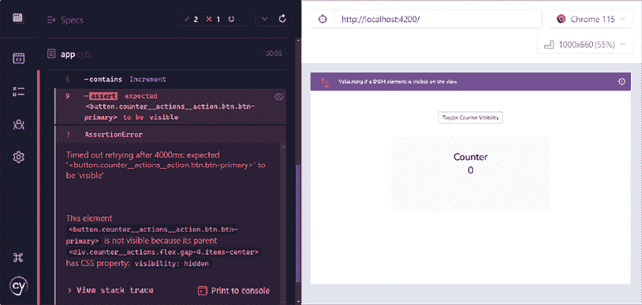

    图 11.4：无法在悬停时获取操作按钮

    测试失败的原因是 Cypress 目前不提供 **CSS** 悬停效果。为了解决这个问题，我们将在下一步安装一个包。

1.  停止运行 e2e 测试，然后从工作区的根目录安装 `cypress-real-events` 包，如下所示：

    ```js
    cd start && npm install --save-dev cypress-real-events 
    ```

1.  现在，打开`ng-cy-element-visibility-e2e`项目中的`src/support/e2e.ts`文件并更新它，如下所示：

    ```js
    ...
    // Import commands.js using ES2015 syntax:
    **/// <reference types="cypress-real-events" />**
    import './commands';
    **import****'cypress-real-events/support'****;**
    ... 
    ```

1.  现在，更新`app.cy.ts`文件以在`counter card`元素上使用包中的`realHover`方法，如下所示：

    ```js
    ...
    describe('ng-cypress-starter', () => {
      ...

      it('should show the action buttons when the counter card is hovered', () =>
        {
        getCounterCard()**.****realHover****();**
        ...
      })
    }); 
    ```

1.  现在，再次从工作区根目录运行`npm run e2e ng-cy-element-visibility`命令（如果尚未运行）。你应该会看到所有测试通过，如图 11.5 所示：

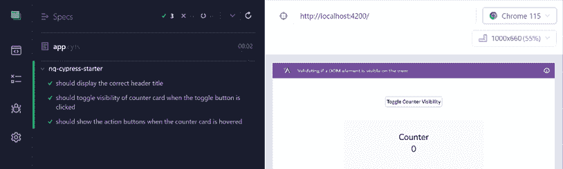

图 11.5：所有测试通过

太棒了！你刚刚学会了如何在不同的场景中检查 DOM 元素的可见性。当然，这些不是识别和与 DOM 元素交互的唯一选项。你可以参考 Cypress 文档以获取更多可能性。现在你已经完成了这个食谱，请查看下一节以了解它是如何工作的。

## 它是如何工作的…

我们首先通过构建 POs（页面对象）开始了这个食谱。这样做是个好主意，以便在编写测试时准备好函数。如果不存在获取特定页面对象的函数，我们可以在运行时创建它。请注意，我们使用`should('exist')`语句检查`getCounterCard`。如果你还不知道，我们也可以使用`should('be.visible')`，这同样有效。但是，当我们想要确保它不可见时，我们不能使用`should('not.be.visible')`语句。现在你可能正在想，“什么？！”确实如此！由于 Cypress 中的`'visible'`是构建得使得元素存在于 DOM 中并且可见，如果我们使用`'be.visible'`或`'not.be.visible'`，它无法适应元素不存在于 DOM 中的情况。而且，由于我们使用`*ngIf`指令来显示或隐藏我们的`Counter`组件，它最终要么存在于 DOM 中，要么不存在。因此，使用`should('exist')`和`should('not.exis')`在这里是合适的选择。

对于下一个测试，我们想看看当在计数器卡片上悬停（或进行鼠标悬停）时是否会显示操作按钮。为此，我们可以在计数器卡片上使用带有`mouseover`事件的`trigger`方法。然而，这不会起作用。为什么？因为 Cypress 中所有的悬停解决方案最终都会触发 JavaScript 事件，并且不会影响 CSS 伪选择器，而且由于我们的操作按钮（带有`'.counter__actions__action'`选择器）显示在具有`'.counter'`选择器的元素的`:hover`（CSS）上，我们的测试失败了，因为在测试中，我们的操作按钮实际上并没有显示。为了解决这个问题，我们使用了`cypress-real-events`包，它具有影响伪选择器的`realHover`方法，最终显示我们的操作按钮。

## 参见

+   Cypress 官方文档关于项目可见性的说明：[`docs.cypress.io/guides/core-concepts/interacting-with-elements.html#Visibility`](https://docs.cypress.io/guides/core-concepts/interacting-with-elements.html#Visibility)

+   `cypress-real-events` 项目仓库：[`github.com/dmtrKovalenko/cypress-real-events`](https://github.com/dmtrKovalenko/cypress-real-events)

# 测试表单输入和提交

如果你正在构建一个网络应用程序，那么你很可能至少会有一个表单，当涉及到表单时，我们需要确保我们有正确的**用户体验**（**UX**）和正确的业务逻辑。有什么比为他们编写端到端测试更好的方法来确保一切按预期工作呢？在这个菜谱中，我们将使用 Cypress 测试一个表单，并验证在适当的情况下是否显示了正确的错误。

## 准备工作

我们将要工作的应用程序位于克隆的仓库中的 `start/apps/chapter11/ng-cy-forms` 目录下。然而，端到端测试位于 `start/apps/chapter11/ng-cy-forms-e2e` 文件夹中。在这个菜谱中，我们将修改这两个文件夹中的文件。让我们首先按照以下步骤运行端到端测试：

1.  在你的代码编辑器中打开代码仓库。

1.  打开终端，导航到代码仓库目录，并运行以下命令以运行项目的端到端测试：

    ```js
    npm run e2e ng-cy-forms 
    ```

    这应该会打开 Cypress 窗口。选择 Chrome 进行测试，并点击 `app.cy.ts` 文件以运行测试，你应该会看到以下内容：

    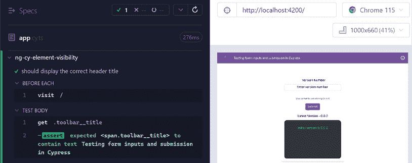

    图 11.6：运行 ng-cy-forms 应用程序的 Cypress 测试

现在我们有了 Cypress 测试在运行，让我们在下一节中查看菜谱的步骤。

## 如何做到这一点...

我们必须确保在表单成功提交并带有新版本时，我们看到一条**新日志**。我们还需要确保在版本输入为空或版本输入的值无效时，我们看到相关的错误。让我们开始吧：

1.  让我们创建测试所需的页面对象。我们已经在测试中想要使用的元素上有了 `data-test-id` 属性。因此，我们可以在页面对象文件中引用它们。更新 `start/apps/chapter11/ng-cy-forms-e2e/src/support/app.po.ts` 文件，如下所示：

    ```js
    **export****const****getHeaderTitle** **= () => cy.****get****(****'.toolbar__title'****);**
    **export****const****getVersionInput** **= () => cy.****get****(****'[data-test-id="versionInput"]'****);**
    **export****const****getRequiredError** **= () => cy.****get****(****'[data-test-id="versionReqErr"]'****);**
    **export****const****getMismatchError** **= () => cy.****get****(****'[data-test-id="versionMismatchErr"]'****);**
    **export****const****getSubmitButton** **= () => cy.****get****(****'[data-test-id="submitVersionBtn"]'****);**
    **export****const****getLogsListItems** **= () => cy.****get****(****'[data-test-id="logsList"] .logs__item'****);**
    **export****const****getLatestVersion** **= () => cy.****get****(****'[data-test-id="latestVersion"]'****);** 
    ```

1.  我们将首先验证我们的表单在没有有效版本的情况下不能提交。为此，让我们确保在输入被清除后或当输入无效时，**提交**按钮被禁用。在端到端项目的 `src/e2e/app.cy.ts` 文件中打开并添加一个测试，如下所示：

    ```js
    import { getHeaderTitle, **getSubmitButton, getVersionInput** } from '../support/app.po';
    describe('ng-cy-forms', () => {
      beforeEach(() => cy.visit('/'));
      it('should display the correct header title', () => {...});
      **it****(****'should have the submit button disabled on invalid input'****,** **() =>** **{**
    **getVersionInput****().****type****(****'invalid input'****);**
    **getSubmitButton****().****should****(****'be.disabled'****);**
    **getVersionInput****().****clear****();**
    **getSubmitButton****().****should****(****'be.disabled'****);**
    **getVersionInput****().****type****(****'0.0.1'****);**
    **getSubmitButton****().****should****(****'be.enabled'****);**
    **});**
    }); 
    ```

    如果你查看 Cypress 窗口并展开测试，你应该会看到测试通过，如下所示：

    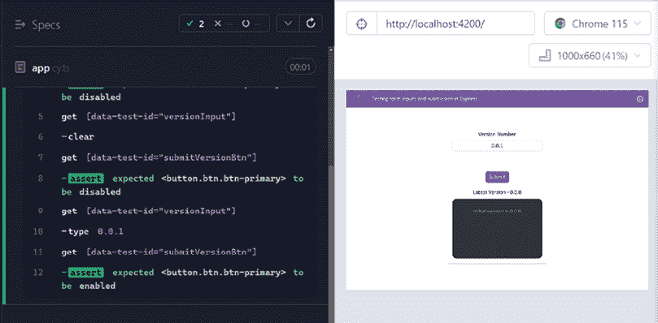

    图 11.7：检查当有无效输入时提交按钮是否被禁用

1.  让我们添加另一个测试，以验证在提交有效版本时，我们看到一个新的版本日志。在 `app.cy.ts` 文件中添加另一个测试，如下所示：

    ```js
    ...
    import { getHeaderTitle, getLatestVersion, **getLogsListItems**, getSubmitButton, getVersionInput } from '../support/app.po';

    describe('ng-cy-forms', () => {
      ...
      **it****(****'should add a new version log on valid version submission'****,** **() =>** **{**
    **getLogsListItems****().****should****(****'have.length'****,** **1****);**
    **getVersionInput****().****type****(****'0.0.1'****);**
    **getSubmitButton****().****click****();**
    **getLogsListItems****().****should****(****'have.length'****,** **2****);**
    **getLogsListItems****().****eq****(****1****).****then****(****el** **=>** **{**
    **expect****(**
    **el.****text****().****trim****()**
    **).****to****.****eq****(****'version changed to 0.0.1'****)**
    **});**
    **});**
    }); 
    ```

1.  我们现在将添加另一个测试，以确保我们可以在版本日志上方看到最新版本。让我们修改 `app.cy.ts` 文件，如下所示：

    ```js
    ...
    **describe****(****'ng-cy-forms'****,** **() =>** **{**
    **...**
    **it****(****'should display the latest version'****,** **() =>** **{**
    **getLatestVersion****().****should****(****'have.text'****,** **'Latest Version = 0.0.0'****);**
    **getVersionInput****().****type****(****'0.0.1'****);**
    **getSubmitButton****().****click****();**
    **getLatestVersion****().****should****(****'have.text'****,** **'Latest Version = 0.0.1'****);**
    **});**
    **});** 
    ```

1.  我们现在将添加一个测试来验证当版本输入在输入某些内容后清除时（即在提交值之前），用户是否看到错误`'版本号是必需的'`。在`app.cy.ts`文件中添加测试，如下所示：

    ```js
    import { getHeaderTitle, getLatestVersion, getLogsListItems, **getRequiredError**, getSubmitButton, getVersionInput } from '../support/app.po';

    describe('ng-cy-forms', () => {
      ...
      **it****(****'should show the version required error when the input ** **gets clered after typing something'****, () => {**
    **getVersionInput****().****type****(****'0.0.1'****);**
    **getVersionInput****().****clear****();**
    **getRequiredError****().****should****(**'exist'**);**
    **getRequiredError****().****should****(**'be.visible'**);**
    **getRequiredError****().****then****(el => {**
    **expect****(**
    **el.****text****().****trim****()**
    **).to.****eq****(**'Version number is required'**)**
    **});**
    **});**
    }); 
    ```

1.  最后，让我们编写一个测试来确保在无效输入上显示错误消息。在`app.cy.ts`文件中添加另一个测试，如下所示：

    ```js
    ...
    import { getHeaderTitle, getLatestVersion, getLogsListItems, **getMismatchError**, getRequiredError, getSubmitButton, getVersionInput } from '../support/app.po';
    describe('ng-cy-forms', () => {
      ...
      **it****(****'should show the invalid input error when the ** **version input is invalid'****,** **() =>** **{**
    **getVersionInput****().****type****(****'abc123'****);**
    **getMismatchError****().****should****(****'exist'****);**
    **getMismatchError****().****should****(****'be.visible'****);**
    **getMismatchError****().****then****(****el** **=>** **{**
    **expect****(**
    **el.****text****().****trim****()**
    **).****to****.****eq****(****'Version number does not match the pattern (x.x.x)'****)**
    **});**
    **});**
    }); 
    ```

    如果你现在查看**测试**窗口，你应该看到所有测试都通过，如下所示：

    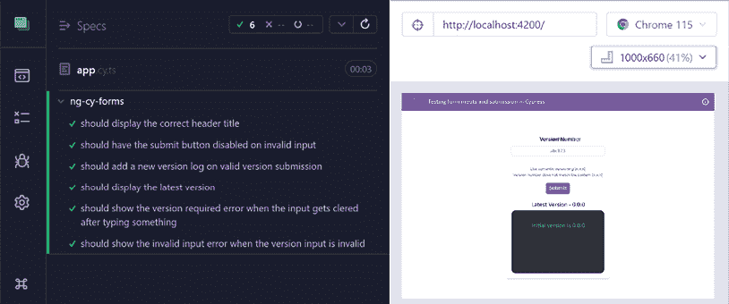

    图 11.8：应用的所有测试都通过

太棒了！你现在知道如何使用 Cypress 来测试具有一些有趣用例和断言的表单。查看下一节以了解它是如何工作的。

## 它是如何工作的…

我们首先在我们的`app.po.ts`文件中实现一些页面对象，因为我们可以在获取元素时重用这些方法。由于我们应用逻辑有一个规则，即**提交**按钮应该在版本输入中有有效版本之前被禁用，所以我们使用`'be.disabled'`断言在**提交**按钮上，如下所示：

```js
getSubmitButton().should('be.disabled'); 
```

我们随后使用`getVersionInput().type('...')`函数在版本输入中输入所需的值，并检查按钮是否在版本输入有无效值或完全未输入值时被禁用。

然后我们检查在提交有效版本时是否在日志列表中添加了新的日志。此测试的重要代码块如下：

```js
getLogsListItems().eq(1).then(el => {
  expect(
     el.text().trim()
  ).to.eq('version changed to 0.0.1')
}); 
```

注意，我们获取日志列表，即日志项。然后我们使用`eq(1)`从列表中获取第二个元素。然后我们使用`then`方法获取`jQuery<HTMLElement>`，这样我们就可以在元素的文本内容上使用`trim`方法。这是因为当为 Angular 应用程序编写 HTML 模板时，我们可能会在 HTML 标签中格式化内容，导致文本内容中包含空格。因此，在将文本与预期值进行比较之前修剪文本是一个巧妙的主意。或者，您也可以使用`.should('contain.text', 'EXPECTED_TEXT')`断言而不是`.should('have.text', 'EXPECTED_TEXT')`断言。

对于我们想要检查是否显示适当错误的情况，我们确保以下内容：

+   错误元素存在于 DOM 中

+   错误元素对用户可见

+   错误元素具有适当的错误信息

注意，我们使用`then`方法获取错误元素，在测试断言之前修剪文本内容，就像我们对日志项的文本内容验证所做的那样。

## 参见

+   Cypress 食谱 – 表单交互：[`github.com/cypress-io/cypress-example-recipes/tree/master/examples/testing-dom__form-interactions`](https://github.com/cypress-io/cypress-example-recipes/tree/master/examples/testing-dom__form-interactions)

+   Cypress 菜谱 – 登录表单：[`github.com/cypress-io/cypress-example-recipes/tree/master/examples/logging-in__html-web-forms`](https://github.com/cypress-io/cypress-example-recipes/tree/master/examples/logging-in__html-web-forms)

# 等待 XHR 完成

测试 **用户界面** （**UI**） 转换是端到端测试的核心。虽然立即测试动作的预期结果是重要的，但可能存在结果有依赖性的情况。例如，如果用户填写了 **登录** 表单，我们只有在收到后端服务器的成功响应后才能显示成功提示，因此我们无法测试成功提示是否立即显示。在这个菜谱中，你将学习如何在执行断言之前等待特定的 XHR 调用完成。

## 准备工作

我们将要工作的应用程序位于克隆的仓库中的 `start/apps/chapter11/ng-cy-http-requests` 目录下。然而，端到端测试位于 `start/apps/chapter11/ng-cy-http-requests-e2e` 文件夹中。在这个菜谱中，我们将仅修改端到端项目的文件。让我们按照以下步骤运行端到端测试：

1.  在你的代码编辑器中打开代码仓库。

1.  打开终端，导航到代码仓库目录，并运行以下命令以运行项目的端到端测试：

    ```js
    npm run e2e ng-cy-http-requests 
    ```

    这应该打开 Cypress 窗口。选择 Chrome 进行测试，并点击 `app.cy.ts` 文件以运行测试，你应该看到以下内容：

    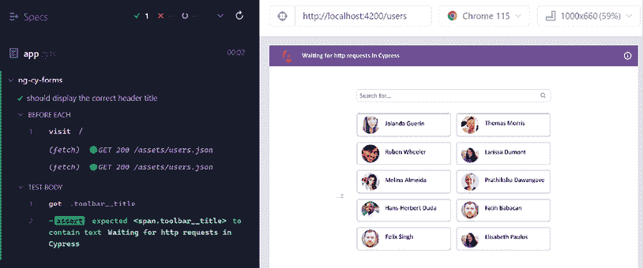

    图 11.9：ng-cy-http-requests 应用程序的 Cypress 测试运行

现在我们已经运行了 Cypress 测试，让我们在下一节中查看菜谱的步骤。

## 如何做到这一点...

我们将从一些可以正常工作的测试开始。然而，如果 HTTP 调用的响应有延迟，它们将失败。这是因为 Cypress 有一个 4,000 **毫秒** （**ms**） （4 秒）的超时时间，在这段时间内，它会不断尝试断言，直到断言通过。如果我们的 XHR 耗时超过 4,000 毫秒怎么办？让我们在菜谱中尝试一下：

1.  我们将首先编写我们的测试。我们将确保从 HTTP 调用的响应中获取 10 个用户。但在那之前，我们将在 `users.po.ts` 文件中为这个菜谱创建所需的页面对象，如下所示：

    ```js
    export const getUsersCards = () => {
      return cy.get('app-users ul li');
    }

    export const getSearchInput = () => {
      return cy.get('[data-test-id="searchUsersInput"]');
    } 
    ```

1.  更新 users.cy.ts 文件以添加以下测试：

    ```js
    import { getUsersCards } from '../support/users.po';
    describe('ng-cy-http-requests > users', () => {
      beforeEach(() => cy.visit('/users'));
      it('should get the users list from the server and display', () => {
        getUsersCards().should('have.length', 10);
      });
    }); 
    ```

1.  我们将编写另一个测试来检查我们是否根据搜索输入的值获取了搜索到的用户。在 `users.cy.ts` 文件中添加另一个测试，如下所示：

    ```js
    import { **getSearchInput**, getUsersCards } from '../support/users.po';

    describe('ng-cy-http-requests > users', () => { 
      ...
      **it****(****'****should get the users list on searching'****,** **() =>** **{**
    **getSearchInput****().****type****(****'rube'****);**
    **getUsersCards****().****should****(****'have.length'****,** **1****);**
    **getUsersCards****().****find****(****'h4'****).****should****(**
    **el** **=>** **{**
    **expect****(**
    **el.****text****().****trim****()**
    **).****to****.****eq****(**
    **'Ruben Wheeler'**
    **)**
    **}**
    **);**
    **});**
    }); 
    ```

    你应该看到两个测试都通过，如图 11.10 所示。然而，这不是编写 UI 测试的最佳方式，因为它们应该与来自实际 API 服务器的数据 **独立**。在实践中，我们通常模拟 API 调用，你将在本章后面的 *使用 Cypress 固定值提供模拟数据* 菜谱中了解到这一点。

    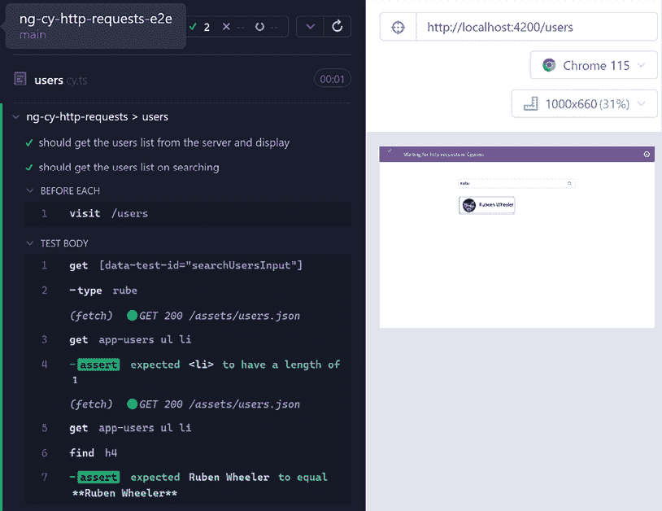

    图 11.10：用户页面测试通过

1.  首先，我们需要模拟一个场景，即在 4,000 毫秒后出现期望的结果。我们将使用`rxjs`中的`delay`操作符来实现这一点，延迟时间为 5,000 毫秒。让我们在项目的`user.service.ts`文件中应用它，如下所示：

    ```js
    …
    **import** **{** **EMPTY****,** **Observable****, delay, map, mergeMap,** **of** **}** **from****'rxjs'****;**
    @Injectable({
      providedIn: 'root'
    })
    export class UserService {
      http = inject(HttpClient);
      getAll(): Observable<User[]> {
        return **of****(****EMPTY****)**
    **.****pipe****(**
    **delay****(****5000****),**
    **mergeMap****(****() =>** **{**
    **return****this****.****http****.****get****<****User****[]>(**
    **'/assets/users.json'****)**
    **})**
    **);**
      }
      ...} 
    ```

    如果你现在检查 Cypress 测试，你应该会看到一个失败的测试，如图 11.11 所示：

    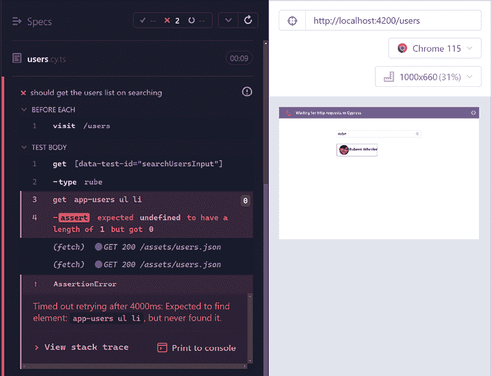

    图 11.11：特定用户搜索测试的断言失败

1.  现在，我们可以尝试修复这个问题，这样它就不会在乎 XHR 花费了多长时间——我们总是在进行断言之前等待它完成。让我们拦截 XHR 调用并为其创建一个别名，这样我们就可以稍后使用它来等待 XHR 调用。更新`users.cy.ts`文件，如下所示：

    ```js
    ...
    describe('ng-cy-http-requests > users', () => {
      **beforeEach****(****() =>** **{**
    **cy.****intercept****(****'/assets/users.json'****).****as****(****'searchUsers'****);**
    **cy.****visit****(****'/users'****);**
    **});**
      ...
    }); 
    ```

1.  现在，让我们使用别名在断言之前等待 XHR 调用完成。更新`users.cy.ts`文件，如下所示：

    ```js
    ...
    describe('ng-cy-http-requests > users', () => {
      ...
      it('should get the users list from the server and display', () => {
        **cy.****wait****(****'@searchUsers'****, {**
    **timeout****:** **10000**
    **});**
    getUsersCards().should('have.length', 10);
      });
      it('should get the users list on searching', () => {
        getSearchInput().type('rube');
        **cy.****wait****(****'@searchUsers'****, {**
    **timeout****:** **10000**
    **});**
    getUsersCards().should('have.length', 1);
        getUsersCards().find('h4').should(...);
      });
    }); 
    ```

    如果你现在检查`users.cy.ts`的 Cypress 测试，你应该会看到所有测试都通过，如下所示：

    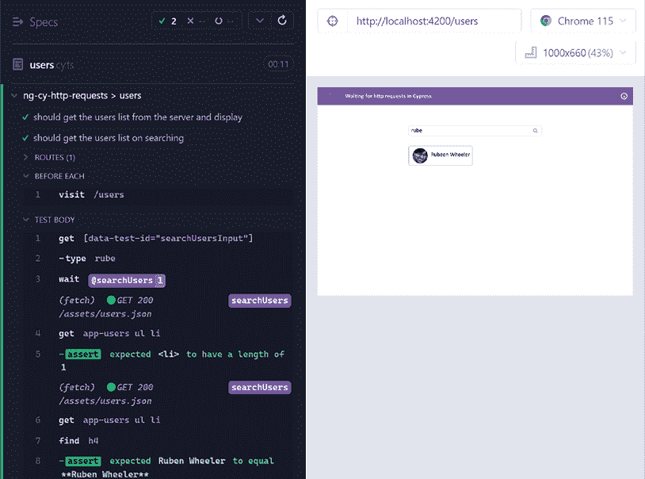

    图 11.12：在断言之前等待 XHR 调用完成的测试

太好了！你现在知道如何使用 Cypress 实现包含在断言之前等待特定 XHR 调用完成的端到端测试。要了解配方背后的所有魔法，请参阅下一节。

## 它是如何工作的...

在配方中，我们使用一种称为变量别名的东西。我们首先使用`cy.intercept`方法，以便 Cypress 可以监听网络调用。请注意，我们使用特定的 URL `/assets/users.json` 作为参数，然后使用`.as('searchUsers')`语句为此拦截提供一个别名。请注意，我们修改了`user.service.ts`，这导致在 API 调用之前有 5,000 毫秒的延迟。

Cypress 有一个默认的超时时间为 4,000 毫秒，我们不想限制我们的 API 调用在测试中在 4,000 毫秒内处理。因此，我们使用`cy.wait('@searchUsers');`语句，使用`searchUsers`别名通知 Cypress 它必须等待别名拦截发生——也就是说，直到网络调用完成，不管它需要多长时间才能达到 Cypress 的第二超时（网络调用为 30,000 毫秒）。这使得我们的当前测试通过，尽管默认的 4,000 毫秒 Cypress 超时和 Cypress 中 HTTP 调用的 5,000 毫秒（大约 5 秒）超时在实际上进行网络调用之前已经过去了。魔法，不是吗？

注意，Cypress 对断言有默认的超时时间，例如检查元素是否可见或具有特定的文本，默认为 4,000 毫秒。对于 HTTP 调用初始化，默认超时时间为 5,000 毫秒。这使得我们的测试有点棘手，因为我们试图模拟服务器响应延迟的同时延迟 HTTP 调用的初始化。因此，我们不得不为`cy.wait`的`options`参数设置超时时间为 10,000 毫秒。这允许 Cypress 在 5,000 毫秒（我们添加到用户服务中）等待调用被初始化。在实际场景中，你的 HTTP 调用将立即启动，响应可能会延迟。Cypress 等待 5,000 毫秒以等待调用被初始化，所以你应该没问题。一旦调用被启动，Cypress 默认将超时时间设置为 30,000 毫秒以等待响应。

好吧，我希望你喜欢这个食谱——查看下一节以获取进一步阅读的链接。

## 相关内容

+   在 Cypress 中等待：[`docs.cypress.io/api/commands/wait`](https://docs.cypress.io/api/commands/wait)

# 使用 Cypress 捆绑包

Cypress 提供了一系列捆绑的工具和包，我们可以在测试中使用它们来简化工作，这并不是因为使用 Cypress 编写测试本身很困难，而是因为这些库已经被许多开发者使用，因此他们已经熟悉它们。在本食谱中，我们将查看捆绑的 jQuery、Lodash 和 Minimatch 库，以测试一些我们的用例。

## 准备工作

我们将要工作的应用程序位于克隆的仓库中的`start/apps/chapter11/ng-cy-bun-pack`目录下。然而，端到端测试在`start/apps/chapter11/ng-cy-bun-pack-e2e`文件夹中。在本食谱中，我们只将修改端到端项目的文件。让我们按照以下步骤运行端到端测试：

1.  在你的代码编辑器中打开代码仓库。

1.  打开终端，导航到代码仓库目录，并运行以下命令以运行项目的端到端测试：

    ```js
    npm run e2e ng-cy-bun-pack 
    ```

    这应该会打开 Cypress 窗口。选择**Chrome**进行测试，并点击`users.cy.ts`文件以运行测试，你应该会看到以下内容：

    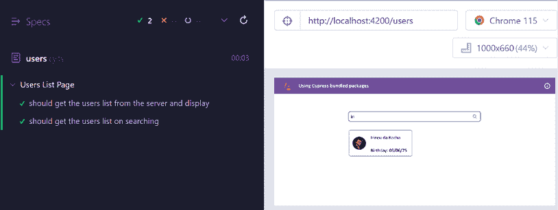

    图 11.13：使用 Cypress 运行的 ng-cy-bun-pack 应用程序测试

现在我们已经运行了 Cypress 测试，让我们在下一节中查看食谱的步骤。

## 如何做到这一点...

对于这个食谱，我们有`users`列表和一个搜索应用程序，该应用程序使用 HTTP 请求从一个 JSON 文件中获取一些用户。我们将对 DOM 进行一些断言，验证 API 的响应，并断言 URL 的变化。让我们开始：

1.  首先，我们将尝试使用捆绑的`jQuery`库和 Cypress 一起。我们可以使用`Cypress.$`来访问它。让我们添加另一个测试并记录一些 DOM 元素。更新`users.cy.ts`文件，如下所示：

    ```js
    ...
    describe('Users List Page', () => {
      ...
      **it****(****'should show the no results found message on search'****,** **() =>** **{**
    **const** **{ $ } =** **Cypress****;**
    **cy.****wait****(****'@searchUsers'****);**
    **const** **searchInput = $(****'[data-test- id="searchUsersInput"]'****);**
    **console****.****log****(searchInput);**
    **})**
    }); 
    ```

    如果你现在查看测试（Cypress 窗口），特别是控制台，你应该会看到以下日志：

    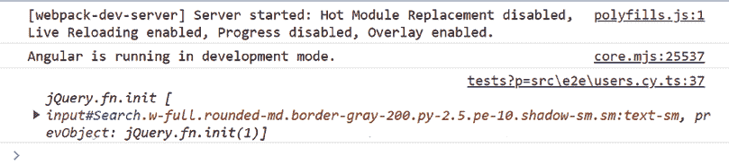

    图 11.14：使用 jQuery 通过 Cypress 记录的搜索输入

1.  现在，让我们尝试更改搜索输入的值，以便我们可以看到 `'No results'` 消息。进一步更新测试，如下所示：

    ```js
    it('should show the no results found message on search', () => {
        const { $ } = Cypress;
        cy.wait('@searchUsers');
        const searchInput = $('[data-test-id="searchUsersInput"]');
        **cy.****wrap****(searchInput).****type****(****'abc123'****);**
    }); 
    ```

1.  让我们在 `users.po.ts` 文件中添加一个新的页面对象元素，以便我们可以获取 `noResults` 消息。按照以下方式更新文件：

    ```js
    ...
    export const getNoResultsMessage = () => {
      return cy.get('[data-test-id="noResultsFoundMessage"]');
    } 
    ```

1.  让我们使用页面对象和 `then` 方法通过记录 `'no results'` 消息来使用 `jQuery` 元素。按照以下方式更新 `users.cy.ts` 文件中的测试：

    ```js
    it('should show the no results found message on search', () => {
        const { $ } = Cypress;
        cy.wait('@searchUsers');
        const searchInput = $('[data-test-id="searchUsersInput"]');
        cy.wrap(searchInput).type('abc123');
        getNoResultsMessage().then((el) => {
          console.log(el);
        });
      }); 
    ```

    你应该在 Cypress 窗口的控制台中看到 no results 消息，如下所示：

    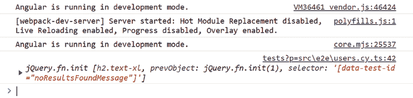图 11.15：使用 Cypress.$ 通过 jQuery 记录的 noResults 消息

    正如你所见，`jQuery` 元素已在控制台中记录。现在我们将使用 Chai 断言来验证它是否存在并且有一个消息。

1.  进一步更新测试以检查元素是否存在并且具有以下文本：

    ```js
    it('should show the no results found message on search', () => {
        const { $ } = Cypress;
        cy.wait('@searchUsers');
        const searchInput = $('[data-test-
     id="searchUsersInput"]');
        cy.wrap(searchInput).type('abc123');
        getNoResultsMessage().then((el) => {
          **expect****(el).****to****.****exist****;**
    **expect****(el.****text****().****trim****()).****to****.****eq****(****'Nothing returned for ** **the following search'****);**
        });
      }); 
    ```

    如果你现在在 Cypress 中看到这个测试，它应该会通过，如下所示：

    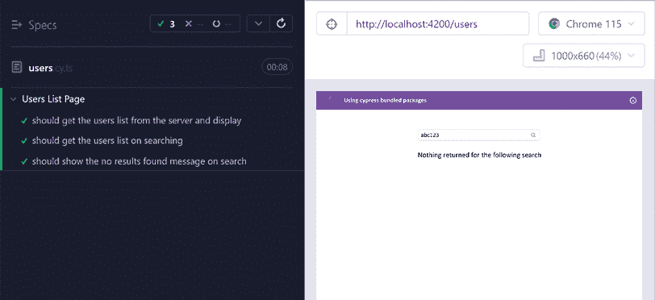

    图 11.16：使用 jQuery 通过 Cypress 通过的测试

1.  我们现在将使用与 Cypress 一起捆绑的 `lodash.js` 包来遍历每张卡片并确保出生日期格式正确。在 `users.cy.ts` 文件中编写另一个测试，如下所示：

    ```js
    ...
    describe('Users List Page', () => {
      ...
      **it****(****'should show the dob on each user in the correct format'****,** **() =>** **{**
    **const** **{ $, _ } =** **Cypress****;**
    **cy.****wait****(****'@searchUsers'****);**
    **getUsersCards****().****then****(****(****cards****) =>** **{**
    **_.****forEach****(cards,** **(****card****) =>** **{**
    **const** **cardItem = $(card);**
    **const** **dobText = cardItem.****find****(****'.dob'****).****text****();**
    **const** **dob = dobText.****split****(****'Birthday:'****)[****1****].****trim****();**
    **expect****(dobRegex.****test****(**
    **dob**
    **)).****to****.****be****.****true****;**
    **})**
    **});**
    **});**
    }); 
    ```

1.  让我们再添加一个测试来再次使用 `lodash`。我们将确保用户在视图中的所有名称都是唯一的，也就是说，没有重复的用户卡片。在 `users.cy.ts` 文件中添加另一个测试，如下所示：

    ```js
    ...
    describe('Users List Page', () => {
      ...
      **it****(****'should have unique names for all the users'****,** **() =>** **{**
    **const** **{ $, _ } =** **Cypress****;**
    **cy.****wait****(****'@searchUsers'****);**
    **getUsersCards****().****then****(****(****cards****) =>** **{**
    **const** **names = _.****map****(cards,** **(****card****) =>** **{**
    **const** **cardItem = $(card);**
    **return** **cardItem.****find****(****'h4'****).****text****();**
    **});**
    **const** **uniqueNames = _.****uniq****(names);**
    **expect****(names.****length****).****to****.****equal****(uniqueNames.****length****);**
    **});**
    **});**
    }); 
    ```

1.  我们接下来要探索的下一个包是 `minimatch` 包。当我们点击用户卡片时，它会打开用户详情。由于我们将时间戳附加到 URL 作为查询参数，我们无法使用断言将 URL 作为精确匹配进行比较。让我们使用 `minimatch` 包来使用模式进行断言。添加一个新的测试，如下所示：

    ```js
    ...
    describe('Users List Page', () => {
      ...
      **it****(****'should go to the user details page with the user uuid'****,** **() =>** **{**
    **const** **{ minimatch, $ } =** **Cypress****;**
    **getUsersCards****().****then****(****(****cards****) =>** **{**
    **const** **userCard = cards[****0****];**
    **const** **uuid = $(userCard).****attr****(****'ng-reflect-router-link'****)**
    **.****split****(****'/users/'****)[****1****];**
    **cy.****wrap****(userCard).****click****();**
    **cy.****url****().****should****(****(****url****) =>** **{**
    **const** **urlMatches =** **minimatch****(url,**
    **`****${location.origin}****/users/****${uuid}*****`****,**
    **{** **debug****:** **true** **});**
    **expect****(urlMatches).****to****.****equal****(****true****);**
    **});**
    **});**
    **});**
    }); 
    ```

现在所有测试都已通过使用 Cypress 捆绑的包完成。现在我们已经完成了配方，让我们看看下一节中它是如何工作的。

## 工作原理...

Cypress 将 `jQuery` 捆绑在一起，我们通过 `Cypress.$` 属性使用它。这允许我们执行 `jQuery` 函数允许我们执行的所有操作。例如，你可以使用以下捆绑的 `jQuery` 函数：

+   `each`:

    +   用法：`$(elements).each(function(index, element) {})`

    +   描述：遍历 jQuery 对象，为每个匹配元素执行一个函数

+   `text`:

    +   用法：`$(selector).text()`

    +   描述：获取匹配元素集中每个元素的合并文本内容，包括其子元素

+   `val`:

    +   用法：`$(selector).val()`

    +   描述：获取匹配元素集中第一个元素的当前值

+   `hasClass`:

    +   用法：`$(selector).hasClass(className)`

    +   描述：确定是否有任何匹配元素被分配给给定的类

+   `addClass`:

    +   用法：`$(selector).addClass(className)`

    +   描述：将指定的类（或类集）添加到匹配元素集中的每个元素

+   `removeClass`:

    +   用法：`$(selector).removeClass(className)`

    +   描述：从匹配元素集中的每个元素中删除单个类、多个类或所有类

重要提示

`Cypress.$`只能从 DOM 中立即可用的文档元素中获取数据。这对于在 Cypress 测试窗口中使用 Chrome DevTools 调试 DOM 来说很棒。然而，重要的是要理解它没有关于 Angular 变更检测的任何上下文。此外，你不能查询页面一开始就不可见的任何元素，正如我们在菜谱中所经历的那样——也就是说，它不会等待 XHR 调用以使元素可见。

Cypress 还捆绑了`lodash`并通过`Cypress._`对象公开它。在菜谱中，我们使用`_.each()`方法遍历卡片项以执行多个任务。我们还使用了`_.uniq`方法，它接受一个数组并返回一个包含唯一项的数组。然后我们比较原始数组和唯一数组的长度，以确保我们的原始数组包含所有唯一的名称。请注意，我们可以在 Cypress 测试中使用任何`lodash`方法，而不仅仅是提到的那些方法。

我们还使用了`minimatch`包，Cypress 通过`Cypress.minimatch`对象公开了这个包。`minimatch`包非常适合匹配和测试字符串与全局模式。我们用它来测试在通过模式导航到用户的详细页面后，测试 URL。在使用`minimatch`时，有一个重要的事情要知道，它比较的是全局模式，应该包含整个 URL，而不是像正则表达式一样的字符串。这就是为什么我们使用` `{location.origin}/users/${uuid}*` ``语句来包含`location.origin`。

简单易行。现在你了解了这个菜谱的工作原理，请查看下一节以获取一些有用的链接。

## 参见

+   Cypress 捆绑的库：[`docs.cypress.io/guides/references/bundled-tools`](https://docs.cypress.io/guides/references/bundled-tools)

+   `jQuery`: [`jquery.com/`](https://jquery.com/)

+   `lodash`: [`lodash.com`](https://lodash.com)

+   `Minimatch.js`: [`github.com/isaacs/minimatch`](https://github.com/isaacs/minimatch)

# 使用 Cypress 固定数据提供模拟数据

当涉及到编写端到端测试时，固定数据在确保测试不会出现不一致（在不同测试运行中结果不同）方面发挥着重要作用。考虑一下，你的测试依赖于从你的 API 服务器获取数据，或者你的测试包括快照测试，这包括从**内容分发网络**（**CDN**）或第三方 API 获取图像。尽管它们在技术上对于测试成功运行是必需的，但服务器数据和图像是否从原始来源获取并不重要；因此，我们可以为它们创建固定数据。在这个菜谱中，我们将为存储桶数据创建固定数据，以避免在执行端到端测试时需要运行服务器。

## 准备工作

我们将要与之合作的应用程序位于克隆的仓库中的 `start/apps/chapter11/ng-cy-mock-data`。然而，端到端测试在 `start/apps/chapter11/ng-cy-mock-data-e2e` 文件夹中。在这个菜谱中，我们将仅修改端到端项目的文件。让我们按照以下步骤运行端到端测试：

1.  在你的代码编辑器中打开代码仓库。

1.  打开终端，导航到代码仓库目录，并运行以下命令以运行具有 API 服务器的项目的端到端测试：

    ```js
    npm run e2e ng-cy-mock-data with-server 
    ```

    这应该会打开 Cypress 窗口以及服务器。选择 Chrome 进行测试，并点击 `app.cy.ts` 文件以运行测试，你应该会看到以下内容：

    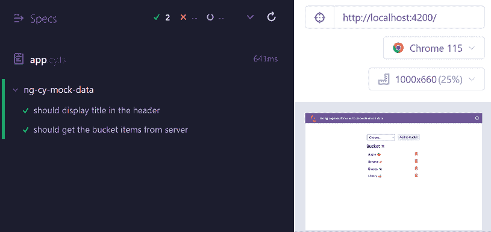

    图 11.17：使用 Cypress 运行的 ng-cy-mock-data 测试

现在我们有了 Cypress 测试在运行，让我们看看下一节中菜谱的步骤。

## 如何做到这一点...

我们有桶应用程序，我们在本书的许多菜谱中都使用了它。然而，我们将在这个菜谱中使用 Cypress 编写一些端到端测试。有趣的部分是应用程序与后端服务器通信以管理桶项目。当使用真实 API 向桶中添加或删除项目时，我们的测试将会失败。让我们开始吧：

1.  我们的后端（`fake-be`）默认返回四个桶项目。参见*如何工作...*部分了解详情。我们将在稍后向 `app.cy.ts` 文件添加一个新测试，以确保我们能够向桶中添加另一个项目。但在那之前，让我们在 `app.po.ts` 文件中添加一些页面对象，如下所示：

    ```js
    export const getHeaderTitle = () =>
     cy.get('.toolbar__title');
    export const getFruits = () => cy.get('.fruits__item');
    **export****const****getFruitSelector** **= () => cy.****get****(****'data-test-id="fruitSelector"'****);**
    **export****const****getAddItemSubmitButton** **= () =>**
    **cy.****get****(****'[data-test-id="addItemSubmitBtn"'****);**
    **export****const****getSuccessToast** **= () => cy.****get****(****'#toast-container .toast-success'****);**
    **export****const****getErrorToast** **= () => cy.****get****(****'#toast-****container .toast-error'****);** 
    ```

1.  现在，我们可以添加我们的测试以确保我们能够向桶中添加一个项目。将以下测试添加到 `app.cy.ts` 文件中：

    ```js
    import { **getAddItemSubmitButton**, **getFruitSelector**, getFruits, getHeaderTitle, **getSuccessToast** } from '../support/app.po';

    describe('ng-cy-mock-data', () => {
      beforeEach(() => {
        cy.visit('/')
      });

      …

      **it****(****'should add a bucket item to the list'****,** **() =>** **{**
    **getFruitSelector****().****select****(****'Apple** **![****'****);**    **getAddItemSubmitButton****().****click****();**    **getSuccessToast****().****should****(****'be.visible'****);**    **getSuccessToast****().****then****(****el => {**    **expect****(el.****text****().****trim****()).to.****eq****(****'Bucket item added'****);**    **});**    **getFruits****().****should****(****'have.length'****,** **5****);**    **});**     });     ```    这是我们测试开始出错的地方，如*图 11.18*所示。由于我们的测试每次运行都会向实际服务器添加一个项目，所以我们不能期望服务器返回与我们的测试相同数量的项目（四个项目），除非我们重新启动服务器。    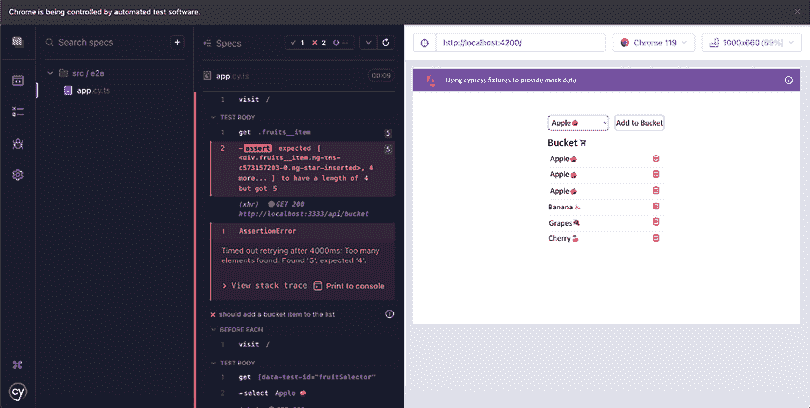

    图 11.18：由于向真实服务器添加数据而失败的测试

1.  我们首先将为我们的 HTTP 调用到 `fake-be` 后端创建一个固定装置。在 `src/fixtures` 文件夹下创建一个新文件，命名为 `get-bucket.json`。然后向其中添加以下 JSON 数据：

    ```js
    {
    "bucket": 
    { "id": 1, "name": "Apple " },
    { "id": 3, "name": "Grapes " },
    { "id": 4, "name": "Cherry " }
    ]
    } 
    ```

1.  现在，让我们在我们的 `app.cy.ts` 文件中使用固定装置。我们将在 `beforeEach` 生命周期钩子中使用它，因为我们希望为文件中的所有测试使用固定装置。更新 `app.cy.ts` 文件，如下所示：

    ```js
    ...
    describe('ng-cy-mock-data', () => {
      **beforeEach****(****() =>** **{**
    **cy.****fixture****(****"get-bucket"****)**
    **.****then****(****(****response****) =>** **{**
    **cy.****intercept****(****'GET'****,** **'http://localhost:3333/api/bucket'****,**
    **response)**
    **return** **cy.****fixture****(****"-bucket"****);**
    **})**
    **.****visit****(****'/'****)**
    **})**;
         ...
    }); 
    ```

    这并没有解决这个问题，因为向桶中添加项目的调用仍然发送到真实 API。我们还需要为它创建一个固定装置。

1.  在 `src/fixtures` 文件夹内创建一个新文件。命名为 `add-bucket-item.json` 并向其中添加以下代码：

    ```js
    {
    "fruit": { "id": 5, "name": "Apple " }
    } 
    ```

1.  我们现在将在我们的测试文件中使用 `add-bucket-item` 固定装置。更新 `app.cy.ts` 文件，如下所示以使用固定装置：

    ```js
    ...

    describe('ng-cy-mock-data', () => {
      beforeEach(() => {
        cy.fixture("get-bucket")
          .then((getBucketResp) => {
            cy.intercept('GET', 'http://localhost:3333/api/bucket',
              getBucketResp)
            **return** **cy.****fixture****(****"add-bucket-item"****);**
          })
          **.****then****(****(****addItemResp****) =>** **{**
    **cy.****intercept****(****'POST'****,**
    **'http://localhost:3333/api/bucket'****, addItemResp)**
    **})**
    .visit('/')
      });
      ...
    }); 
    ```

    现在，如果你运行端到端测试，你应该会看到所有测试都通过了。无论你刷新 Cypress 窗口多少次；它们总是会通过，因为每次的响应都是相同的：

    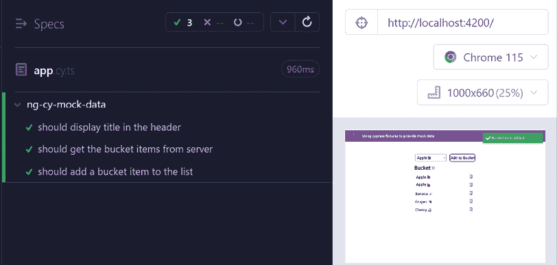

    图 11.19：使用固定值测试 add-bucket-item 通过

1.  我们现在将创建一个测试来删除一个项目并确保我们看到通知，并且视图中的一个项目被移除。让我们在 `app.cy.ts` 文件中添加另一个测试，如下所示：

    ```js
    ...
    describe('ng-cy-mock-data', () => {
      ...
      **it****(****'should delete a bucket item from the list'****,** **() =>** **{**
    **getFruits****().****should****(****'have.length'****,** **4****);**
    **getFruits****().****eq****(****0****).****find****(****'.fruits__item__delete-icon'****).****click****();**
    **getSuccessToast****().****should****(****'be.visible'****);**
    **getSuccessToast****().****then****(****el** **=>** **{**
    **expect****(el.****text****().****trim****()).****to****.****eq****(****'Bucket item deleted'****);**
    **});**
    **getFruits****().****should****(****'have.length'****,** **3****);**
    **});**
    }); 
    ```

    如果你现在运行测试，你会看到 `delete item` 测试失败，因为它找不到项目。那是因为这个 `DELETE` 调用仍然被发送到实际服务器。如果你有服务器运行，你会看到一个错误，如图 11.20 所示：

    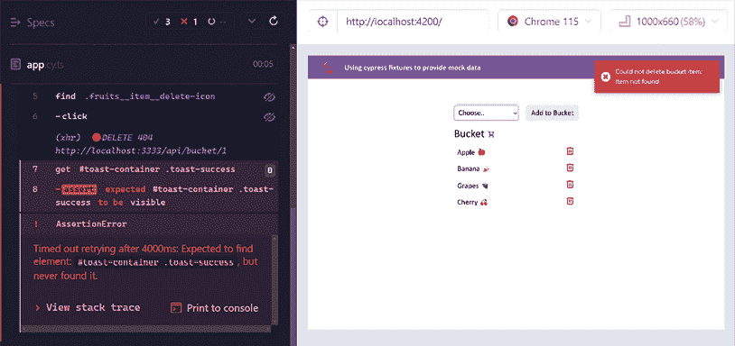

    图 11.20：找不到项目错误

1.  我们将在 `src/fixtures` 文件夹中创建一个新的固定值，命名为 `delete-bucket-item.json`。向其中添加以下代码：

    ```js
    { "success": true } 
    ```

1.  现在，让我们在 `app.cy.ts` 文件中的 `beforeEach()` 钩子中使用固定值，如下所示：

    ```js
    ...
    describe('ng-cy-mock-data', () => {
      beforeEach(() => {
        cy.fixture("get-bucket")
          .then((response) => {
            cy.intercept('GET', 'http://localhost:3333/api/bucket',
              response)
            return cy.fixture("add-bucket-item");
          })
          .then((response) => {
            cy.intercept('POST', 'http://localhost:3333/api/bucket',
              response)
            **return** **cy.****fixture****(****"delete-bucket-item"****);**
          })
          **.****then****(****(****deleteItemResp****) =>** **{** 
    **cy.****intercept****(****'DELETE'****,**
    **'****http://localhost:3333/api/bucket/*'****,**
    **deleteItemResp)** 
    **})**
          .visit('/')
      });
      ...
    }); 
    ```

    如果你现在查看测试，所有测试都应该通过，如下所示：

    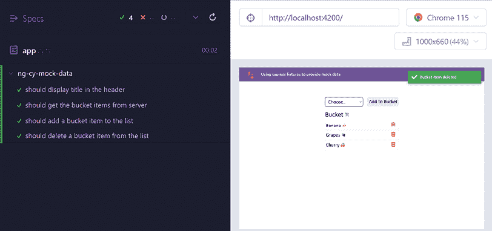

    图 11.21：使用固定值后所有测试通过

太好了！你现在知道如何在 Cypress E2E 测试中使用固定值。现在你已经完成了这个食谱，请看下一节了解它是如何工作的。

## 它是如何工作的…

我们在 `app.cy.ts` 文件中有一个初始测试，以确保当应用程序加载时，我们从服务器获取四个桶项目。你可以看到发送默认桶数据的后端文件，它位于 `<workspace-root>/codewithahsan/e2e/fake-be/src/app/bucket/bucket.service.ts`。然而，当我们开始通过测试向桶中添加项目时，我们的测试就会中断，因为我们正在处理真实数据。我们很少这样做，以确保我们可以准确地做出断言。这就是为什么大型团队有测试环境，如果他们真的想处理真实数据，就会在数据库中播种数据。由于我们的桶应用程序非常小，我们实际上不需要处理真实数据，所以我们在这个食谱中添加了固定值。在 Cypress 测试中，固定值通过 `cy.fixture` 方法注册，这允许我们使用文件中的数据。在这个食谱中，我们使用固定值来处理应用程序对 `fake-be` 服务器进行的所有 HTTP 调用，即以下内容：

+   获取所有桶数据 – `GET` `http://localhost:3333/api/bucket`

+   向桶中添加项目 – `POST` `http://localhost:3333/api/bucket`

+   从桶中删除项目 – `DELETE` `http://localhost:3333/api/bucket/ITEM_ID`

注意，对于每个 HTTP 请求，我们使用 `cy.fixture('FIXTURE_NAME')` 而不带 `.json` 扩展名，这实际上指向 `cypress/fixture/FIXTURE_NAME.json` 文件。

首先，我们使用 `cy.fixture` 方法注册固定值（或获取它）。然后我们使用 `then` 方法获取固定值（JSON）文件的正文。然后我们使用 `cy.intercept` 方法使用 `GET`/`POST`/`DELETE` 方法以及 URL 模式作为 `Minimatch` glob 模式来拦截 HTTP 调用以获取固定值响应，并将其作为 HTTP 调用的响应提供。因此，所有匹配 glob 模式的拦截调用都使用我们的固定值。

现在你已经了解了这个食谱的工作原理，请查看下一节以获取一些资源。

## 参见

+   Cypress 固定文档：[`docs.cypress.io/api/commands/fixture`](https://docs.cypress.io/api/commands/fixture)

+   `cy.intercept` 方法文档：[`docs.cypress.io/api/commands/intercept`](https://docs.cypress.io/api/commands/intercept)

# 在 Discord 上了解更多

要加入这本书的 Discord 社区——在那里你可以分享反馈、向作者提问，并了解新版本——请扫描下面的二维码：

`packt.link/AngularCookbook2e`


