# 第十二章：Angular 中的性能优化

性能在您为最终用户构建的任何产品中始终是一个关注点。它是增加某人首次使用您的应用成为客户机会的关键元素。现在，我们真的无法提高应用性能，除非我们确定潜在的改进可能性以及实现这些方法。在本章中，您将学习一些在提高 Angular 应用程序时可以部署的方法。您将学习如何使用几种技术来分析、优化和改进您的 Angular 应用性能。以下是本章将要涵盖的食谱：

+   使用 `OnPush` 变更检测修剪组件子树

+   从组件中分离变更检测器

+   使用 `runOutsideAngular` 在 Angular 外部运行 `async` 事件

+   使用 `trackBy` 为 `*ngFor` 列表

+   将繁重计算移动到纯管道

+   使用 Web Workers 进行繁重计算

+   使用性能预算进行审计

+   使用 `webpack-bundle-analyzer` 分析包

# 技术要求

对于本章的食谱，请确保您的设置已按照 'Angular-Cookbook-2E' GitHub 仓库中的 '技术要求' 完成。有关设置详细信息，请访问：[`github.com/PacktPublishing/Angular-Cookbook-2E/tree/main/docs/technical-requirements.md`](https://github.com/PacktPublishing/Angular-Cookbook-2E/tree/main/docs/technical-requirements.md)。本章的起始代码位于 [`github.com/PacktPublishing/Angular-Cookbook-2E/tree/main/start/apps/chapter12`](https://github.com/PacktPublishing/Angular-Cookbook-2E/tree/main/start/apps/chapter12)。

# 使用 OnPush 变更检测修剪组件子树

在当今现代网络应用的世界中，性能是优秀 **用户体验** （**UX**） 和最终企业转化率的关键因素之一。在本章的第一个食谱中，我们将讨论您可以在组件的任何适当位置进行的根本性或最基础的优化，即通过使用 `OnPush` 变更检测策略。我们正在工作的应用有一些性能问题，特别是 `UserCardComponent` 类。这是因为它使用一个获取器函数 `randomColor` 来为其背景生成随机颜色。在幕后，该函数使用 `factorial` 函数来增加更多处理时间。但这只是为了演示一个组件，如果发生一些复杂计算，并且触发了多个变更检测，它可能会导致 UI 挂起。

## 准备工作

我们将要工作的应用位于克隆的仓库中的 `start/apps/chapter12/ng-on-push-strategy`：

1.  在您的代码编辑器中打开代码仓库。

1.  打开终端，导航到代码仓库目录，并运行以下命令以启动项目：

    ```js
    npm run serve ng-on-push-strategy 
    ```

    这应该在新的浏览器标签页中打开应用，您应该看到以下内容：

    

    图 12.1：运行在 http://localhost:4200 的 ng-on-push-strategy 应用程序

点击标有**点击我**的按钮或尝试搜索某个用户。你会看到应用程序运行得太慢，并且经常挂起。现在我们已经将项目在浏览器上运行，让我们看看下一节中的食谱步骤。

## 如何做到这一点...

我们将添加一些代码来监控`randomColor`获取器被调用的次数。这将显示 Angular 默认情况下触发的更改检测的次数。我们还将修复这个问题，并使用`OnPush`更改检测策略使其更高效（尽可能多）。让我们开始吧：

1.  首先，让我们确保应用程序不会因为你的机器而运行得太慢，以至于让你的笔记本电脑/PC 挂起。打开`src/app/app.config.ts`文件，并将`RANDOMIZATION_COUNT`令牌的值从`9`调整为最适合你的值。

1.  然后，尝试通过在搜索框中输入他们的名字来搜索名为`Irineu`的用户。你会注意到应用程序仍然挂起，并且需要几秒钟才能显示用户。你还会注意到，当你输入时，你甚至看不到搜索框中的输入字母。也就是说，渲染有延迟。

    让我们在代码中添加一些逻辑。我们将检查页面加载时 Angular 调用`idUsingFactorial`方法的次数。

1.  让我们创建一个服务，我们将使用它来跟踪特定用户的特定卡片被调用的次数。从工作区根目录运行以下命令以创建服务：

    ```js
    cd start && nx g s services/logs --project ng-on-push-strategy 
    ```

    当被询问时，选择`@schematics/angular:service`。

1.  按照以下方式更新`src/app/services/logs.service.ts`文件的内容：

    ```js
    import { Injectable } from '@angular/core';

    @Injectable({
      providedIn: 'root'
    })
    export class LogsService {
      logs: Record<string, number> = {}

      updateLogEntry(email: string) {
        if (this.logs[email] === undefined) {
          this.logs = {
            ...this.logs,
            [email]: 1
          }
        } else {
          this.logs = {
            ...this.logs,
            [email]: this.logs[email] + 1
          }
        }
      }
    } 
    ```

1.  现在，在`src/app/component/user-card/user-card.component.ts`文件中注入`LogService`。我们还将创建一个获取器（`log`）函数来获取用户的计数，并且每当调用`randomColor`获取器时，我们将更新计数。按照以下方式更新提到的文件：

    ```js
    ...
    **import** **{** **LogsService** **}** **from****'../../services/logs.service'****;**
    @Component({...})
    export class UserCardComponent {
      ...
      randomizationCount = inject(RANDOMIZATION_COUNT);
      **logsService =** **inject****(****LogsService****);**
    **get****log****() {**
    **return****this****.****logsService****.****logs****[****this****.****user****.****email****] ??** **0****;**
    **}**
    get randomColor() {
        **this****.****logsService****.****updateLogEntry****(****this****.****user****.****email****);**
        ...
      }
    } 
    ```

1.  现在，我们将使用用户卡片组件模板中的日志来显示计数。按照以下方式更新`src/app/component/user-card/user-card.component.html`文件：

    ```js
    <div [style.backgroundColor]="randomColor"...>
    
    <div class="card-body flex-1">...</div>
    **<****div****class****=****"p-4 bg-slate-900 text-green-300 rounded-md h-fit"****>**
    **<****div****>**
    **Color Generation Count:**
    **</****div****>**
    **<****pre****>****{{log}}****</****pre****>**
    **</****div****>**
    </div> 
    ```

    如果你现在查看应用程序，你应该会看到以下**颜色生成计数**：

    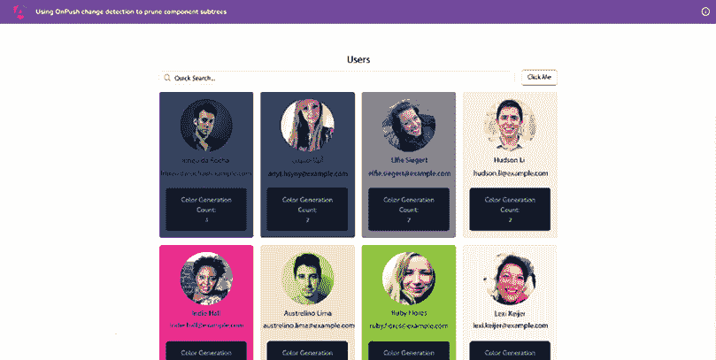

    图 12.2：页面加载时显示的颜色生成计数

1.  现在，点击**点击我**按钮。然后，聚焦（点击）**快速搜索**输入框，然后点击外部。重复几次，你应该会看到即使卡片不应该重新渲染，颜色也会被重新生成。*图 12.3*显示了它应该看起来是什么样子：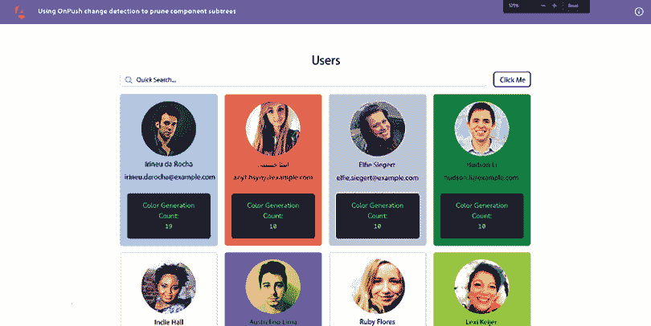

    图 12.3：未搜索任何内容与应用程序交互后的日志

    注意，如果你开始搜索某些内容，你会得到更多的重新渲染。这是因为每个 keyup 和/或 keydown 事件都会触发更多的重新渲染。

1.  为了解决这个问题，我们将使用`OnPush`策略，并观察它如何改变用户卡片组件相对于 Angular 的变更检测策略的行为。按照以下方式更新`user-card.component.ts`文件：

    ```js
    import { **ChangeDetectionStrategy**, Component, Input, inject } from '@angular/core';
    ...
    @Component({
      ...,
      styleUrls: ['./user-card.component.scss'],
      **changeDetection****:** **ChangeDetectionStrategy****.****OnPush**
    })
    ... 
    ```

    现在，如果你尝试点击**点击我**按钮，在搜索输入框中聚焦并点击外部，或者做任何其他的事情（除了搜索用户），你将不会在卡片上的**颜色生成计数**中看到任何变化，如图*图 12.4*所示：

    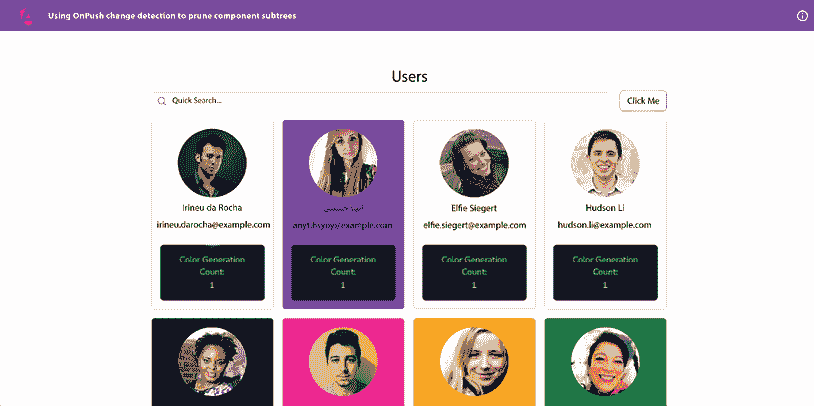

    图 12.4：OnPush 策略防止不必要的渲染

太好了！通过使用`OnPush`策略，我们能够提高`UserCardComponent`的整体性能。其余的只是为了好玩。现在你知道如何使用这个策略了，请看下一节了解它是如何工作的。

## 它是如何工作的...

默认情况下，Angular 使用`Default`变更检测策略——或者技术上讲，它是来自`@angular/core`包的`ChangeDetectionStrategy.Default`枚举。由于 Angular 不知道我们创建的每个组件，它使用默认策略以避免任何意外。这意味着当可能发生变化时，框架将检查整个组件树中的更改。这可能包括用户事件、定时器、XHRs、promises 等。在一个具有大量绑定的复杂 UI 中，这可能导致性能下降，尤其是在大多数这些组件不经常更改或仅依赖于特定输入的情况下。

但是，作为开发者，如果我们知道一个组件除非其`@Input()`变量之一发生变化，否则不会改变，我们就可以——并且应该——为该组件使用`OnPush`变更检测策略。为什么？因为这个策略告诉 Angular 只有在组件的`@Input()`变量发生变化时才运行变更检测。这种策略对于表示组件（有时称为“哑”组件）来说是一个绝对的赢家，这些组件只是应该使用`@Input()`变量/属性显示数据，并在交互时发出`@Output()`事件。这些表示组件通常不包含任何业务逻辑，如复杂的计算、使用服务进行**HTTP**调用等。因此，我们更容易在这些组件中使用`OnPush`策略，因为它们只有在父组件的`@Input()`属性之一发生变化时才会显示不同的数据，即它们的引用应该发生变化。例如，如果我们有一个用户数组，现在应该有一个全新的数组来运行变更检测。如果它是同一个数组，但我们只是添加或删除了一个项目，使用`OnPush`的变更检测将不会被触发。

由于我们现在在`UserCardComponent`上使用`OnPush`策略，它只有在搜索时替换整个`users`数组时才会触发变更检测。这发生在`500ms`的防抖之后（`users.component.ts`文件中的第 31 行），所以只有在用户停止输入时才执行。因此，在优化之前，默认的变更检测会在每个按键敲击（浏览器事件）时触发，而现在则不会。

重要提示

如你所知，`OnPush`策略仅在`@Input()`绑定中的一个或多个发生变化时触发 Angular 变更检测机制。这意味着如果我们更改组件（`UserCardComponent`）内的属性，它将不会在视图中反映出来，因为在这种情况下变更检测机制不会运行，因为这个属性不是`@Input()`绑定。你必须将组件标记为脏的，这样 Angular 才能检查组件并运行变更检测。你将使用`ChangeDetectorRef`服务来完成此操作——具体来说，使用`markForCheck`方法。

## 参见

+   Angular `ChangeDetectionStrategy`官方文档：[`angular.io/api/core/ChangeDetectionStrategy`](https://angular.io/api/core/ChangeDetectionStrategy)

+   `markForCheck`方法的官方文档：[`angular.io/api/core/ChangeDetectorRef#markforcheck`](https://angular.io/api/core/ChangeDetectorRef#markforcheck)

# 从组件中移除变更检测器

在前面的食谱中，我们学习了如何在组件中使用`OnPush`策略来避免 Angular 变更检测在没有`@Input()`绑定发生变化的情况下运行。然而，还有一种方法可以告诉 Angular 不要为特定的组件及其子树运行变更检测。这将完全从变更检测周期中移除组件及其子树，如图 12.5 所示，这可能会导致整体性能的提升。当你想要完全控制何时运行变更检测时，这也很有用。在本食谱中，你将学习如何完全从 Angular 组件中移除变更检测器以获得性能提升。

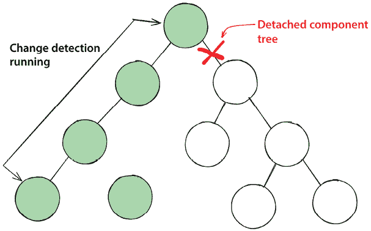

图 12.5：变更检测器从组件树中移除

## 准备工作

我们将要工作的应用位于克隆的仓库中的`start/apps/chapter12/ng-cd-ref`：

1.  在你的代码编辑器中打开代码仓库。

1.  打开终端，导航到代码仓库目录，并运行以下命令以启动项目：

    ```js
    npm run serve ng-cd-ref 
    ```

    这应该在新的浏览器标签页中打开应用，你应该看到以下内容：

    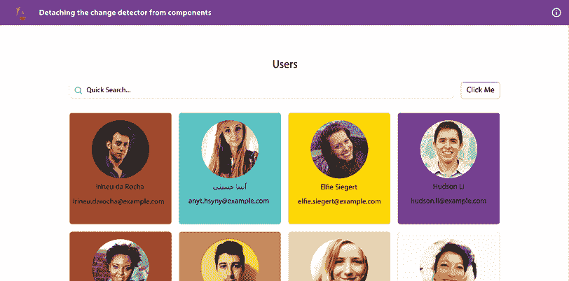

    图 12.6：ng-cd-ref 应用在 http://localhost:4200 运行

点击写着**点击我**的按钮，或者尝试搜索某个用户。你会看到应用运行得太慢，经常卡住。现在我们已经将项目在浏览器上启动，让我们看看下一节中食谱的步骤。

## 如何做到这一点...

我们正在工作的应用程序有一些性能问题，特别是与 `UserCardComponent` 类有关。这是因为它使用一个获取器函数 `randomColor` 来为其背景生成随机颜色。在幕后，该函数使用 `factorial` 函数来增加处理时间。但这只是为了演示一个组件，如果同时发生一些复杂计算和多个变更检测被触发，它可能会导致 UI 挂起。我们将添加一些代码来监控 `randomColor` 获取器被调用的次数。这将显示 Angular 默认触发的变更检测次数。我们还将修复问题，并使其更高效（尽可能做到），通过完全从特定组件中分离变更检测器。让我们开始吧：

1.  首先，让我们确保应用程序对于您的机器来说不会太慢，这样它就不会使您的笔记本电脑/PC 挂起。打开 `src/app/app.config.ts` 文件，并将 `RANDOMIZATION_COUNT` 令牌的值从 `9` 调整为您认为最合适的值。

1.  然后，尝试通过在搜索框中输入他们的名字来搜索一个名为 `Irineu` 的用户。你会注意到应用程序仍然处于挂起状态，并且显示用户需要几秒钟。你还会注意到，当你输入字母时，甚至看不到搜索框中的字母。也就是说，渲染存在延迟。

    让我们在代码中添加一些逻辑。我们将检查当页面加载时，Angular 调用 `idUsingFactorial` 方法的次数。

1.  让我们创建一个我们将用于跟踪特定用户的特定用户卡片被调用的次数的服务。从工作区根目录运行以下命令以创建服务：

    ```js
    cd start && nx g s services/logs --project ng-cd-ref 
    ```

    当被询问时，请选择 `@schematics/angular:service`。

1.  按照以下方式更新 `src/app/services/logs.service.ts` 文件的内容：

    ```js
    import { Injectable } from '@angular/core';
    @Injectable({
      providedIn: 'root'
    })
    export class LogsService {
      logs: Record<string, number> = {}
      updateLogEntry(email: string) {
        if (this.logs[email] === undefined) {
          this.logs = {
            ...this.logs,
            [email]: 1
          }
        } else {
          this.logs = {
            ...this.logs,
            [email]: this.logs[email] + 1
          }
        }
      }
    } 
    ```

1.  现在，在 `src/app/component/user-card/user-card.component.ts` 文件中注入 `LogService`。我们还将创建一个获取器（`log`）函数来获取用户的计数，并且每次调用 `randomColor` 获取器时，我们将更新计数。按照以下方式更新提到的文件：

    ```js
    ...
    **import** **{** **LogsService** **}** **from****'../../services/logs.service'****;**
    @Component({...})
    export class UserCardComponent {
      ...
      randomizationCount = inject(RANDOMIZATION_COUNT);
      **logsService =** **inject****(****LogsService****);**
    **get****log****() {**
    **return****this****.****logsService****.****logs****[****this****.****user****.****email****] ??** **0****;**
    **}**
    get randomColor() {
        **this****.****logsService****.****updateLogEntry****(****this****.****user****.****email****);**
        ...
      }
    } 
    ```

1.  现在，我们将使用用户卡片组件的模板中的日志来显示计数。按照以下方式更新 `src/app/component/user-card/user-card.component.html` 文件：

    ```js
    <div [style.backgroundColor]="randomColor"...>
    
    <div class="card-body flex-1">...</div>
    **<****div****class****=****"p-4 bg-slate-900 text-green-300 rounded-md h-fit"****>**
    **<****div****>**
    **Color Generation Count:**
    **</****div****>**
    **<****pre****>****{{log}}****</****pre****>**
    **</****div****>**
    </div> 
    ```

    如果你现在查看应用程序，你应该会看到以下 **颜色生成计数**：

    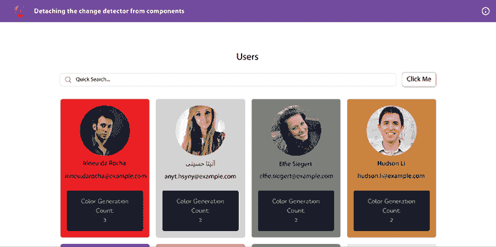

    图 12.7：页面加载时显示的颜色生成计数

1.  现在，点击 **Click Me** 按钮。然后（点击）将焦点放在 **Quick Search** 输入上，然后点击外部。重复几次，你应该会看到即使卡片不应该重新渲染，颜色也会被重新生成。*图 12.8* 显示了它应该看起来是什么样子！: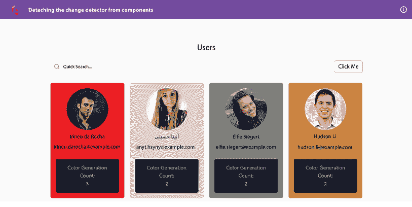

    图 12.8：与应用程序交互后（未搜索任何内容）的日志

    注意，如果你开始搜索某些内容，你会得到更多的重新渲染。那是因为每个 keyup 和/或 keydown 事件都会触发更多的重新渲染。

1.  为了解决这个问题，当组件加载时，我们将从`user-card`组件中分离出更改检测器的引用，这样就不会在之后重新渲染。这是假设卡片的内容永远不会改变。按照以下方式更新`user-card.component.ts`文件：

    ```js
    import { **AfterViewInit**, **ChangeDetectorRef**, Component, Input, inject } from '@angular/core';
          ...

    export class UserCardComponent**implements****AfterViewInit** {
      ...
      logsService = inject(LogsService);
      **cdRef =** **inject****(****ChangeDetectorRef****);**
    **ngAfterViewInit****():** **void** **{**
    **this****.****cdRef****.****detach****();**
    **}**
      ...
    } 
    ```

    现在，如果你尝试点击**点击我**按钮，关注搜索输入并点击外部，或者做任何其他（除了搜索用户）的事情，你将看不到卡片上的**颜色生成计数**发生变化，如图*图 12.9*所示：

    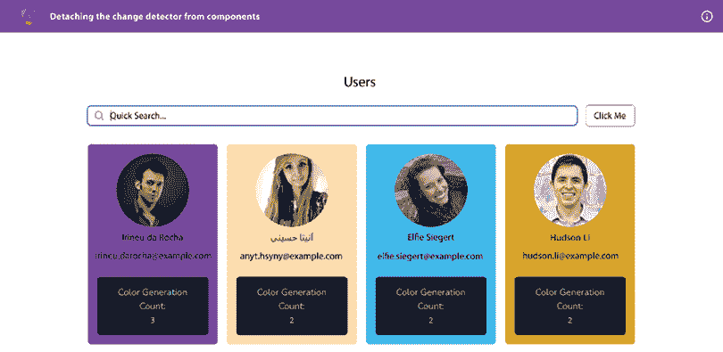

    图 12.9：分离的更改检测器防止不必要的渲染

    但如果组件后来需要更改怎么办？我们如何完全控制更改检测？

1.  假设应用程序有一个更改用户名字的功能。我们将硬编码逻辑来更改第一个用户的姓氏。在这种情况下，我们必须告诉 Angular 运行更改检测。让我们更新`users.component.html`文件，以更新`src/app/users/users.component.html`文件中的**点击我**按钮，如下所示：

    ```js
    <div class="home">
    <section class="flex flex-col gap-4 w-full">
    <h2 class="text-center text-2xl">Users</h2>
    <form class="input-container flex gap-4 w-full items
          -center mb-4" [formGroup]="searchForm">
    <div class="relative flex-1">...</div>
    **<****button** **(****click****)=****"updateName(users[0])"****>****Update**
    **Irineu's Name****</****button****>**
    </form>
    <div class="secondary-container flex justify-center">...</div>
    </section>
    </div>
    <ng-template #loader>
    <app-loader></app-loader>
    </ng-template> 
    ```

1.  让我们更新 TypeScript 文件，添加更新用户名字的功能。按照以下方式更新`src/app/users/users.component.ts`文件：

    ```js
     ...
    export class UsersComponent implements OnInit {
      ...

      usersTrackBy(_index: number, user: IUser) {
        return user.uuid;
      }

      **updateName****(****user****:** **IUser****) {**
    **this****.****users** **=** **this****.****users****.****map****(****(****userItem****) =>** **{**
    **if** **(userItem.****uuid** **=== user.****uuid****) {**
    **return** **{**
    **...userItem,**
    **name****: {**
    **...userItem.****name****,**
    **last****:** **'Test 123'**
    **}**
    **}**
    **}**
    **return** **userItem;**
    **})**
    **}**
    } 
    ```

    如果你点击**更新 Irineu 的名字**按钮，你将看不到 UI 上的任何变化。那是因为更改检测器仍然与每个用户卡片组件分离。所以名字改变了，但你无法在 UI 上看到变化。参见*图 12.10*，其中 Angular (Chrome) DevTools 显示了组件中正在更新的值，但 UI 没有反映出来。

    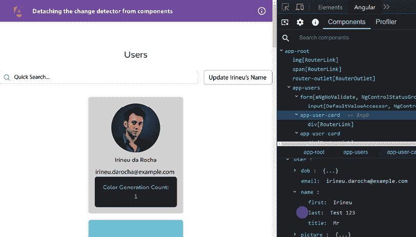

    图 12.10：由于更改检测器分离，用户卡片未重新渲染

1.  为了解决这个问题，我们将查询用户页面上的`UserCard`组件，并将手动在所需组件上运行`ChangeDetectorRef.detectChanges`方法。按照以下方式更新`src/app/users/users.component.ts`文件：

    ```js
    import { Component, inject, OnInit, **QueryList**, **ViewChildren**} from '@angular/core';
    ...
    export class UsersComponent implements OnInit {
      **@ViewChildren****(****UserCardComponent****) userCards!:**
    **QueryList****<****UserCardComponent****>;**
      users!: IUser[];
      ...

      updateName(user: IUser) {
        this.users = this.users.map((userItem) => {
          ...
        })
        **const** **matchingComponent =** **this****.****userCards****.****find****(****comp** **=>** **{**
    **return** **comp.****user****.****uuid** **=== user.****uuid****;**
    **})**
    **if** **(matchingComponent) {**
    **setTimeout****(****() =>** **{**
    **matchingComponent.****cdRef****.****detectChanges****();**
    **},** **0****);**
    **}**
      }
    } 
    ```

    现在，如果你点击**更新 Irineu 的名字**按钮四次，你应该会看到第一个用户卡的计数为`5`，而其余的卡片仍然渲染`1`次，如图*图 12.11*所示。

    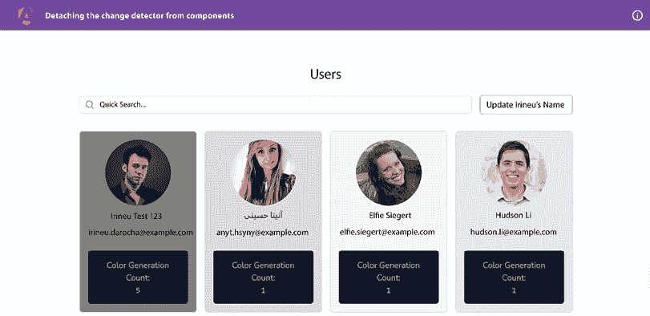

    图 12.11：完全控制的更改检测

太好了！通过几个步骤，我们使用 Angular 的`ChangeDetectorRef`服务提高了`UserCardComponent`的整体性能。我们不仅提高了性能，而且还根据我们的用例从父组件（`UsersComponent`）完全控制了它。现在你知道如何使用`ChangeDetectorRef`服务，请参见下一节了解它是如何工作的。

## 它是如何工作的…

`ChangeDetectorRef` 服务提供了一系列重要的方法来控制 Angular 中的变更检测。在配方中，我们使用组件的 `ngAfterViewInit` 方法中的 `detach` 方法来在组件首次渲染后立即将 Angular 变更检测机制从组件中断开。结果，`UserCardComponent` 类上不会触发任何变更检测。这是因为 Angular 有一个变更检测树，其中每个组件都是一个节点。当我们从变更检测树中断开一个组件时，该组件（作为一个树节点）被断开，其子组件（或节点）也是如此。通过这样做，我们最终确保 `UserCardComponent` 类上不会发生任何变更检测。如果 `UserCardComponent` 中使用了其他组件，它们也不会为它们运行变更检测。结果，当我们点击按钮或聚焦和失去焦点在用户页面的输入上时，即使我们像配方中那样更新了第一个用户的名称，也不会有任何渲染。

此外，当我们需要在视图中显示第一个用户名称的更改时，这需要触发 Angular 的变更检测机制，我们使用来自 `ChangeDetectorRef` 实例的 `detectChanges` 方法，在我们将更新后的用户数组分配给 `UsersComponent` 类中的 `users` 属性之后立即使用。结果，Angular 运行变更检测机制，我们在第一个用户卡片上看到更新的名称。这赋予我们完全决定是否完全断开变更检测、重新连接它或仅对需要变更检测的特定情况手动运行它的权力。

现在你已经了解了配方的工作原理，请参阅下一节以获取一些有用的链接。

## 参见

+   `ChangeDetectorRef` 官方文档：[`angular.io/api/core/ChangeDetectorRef`](https://angular.io/api/core/ChangeDetectorRef)

# 使用 `runOutsideAngular` 在 Angular 外部运行异步事件

Angular 在其几个方面运行变更检测机制，包括但不限于所有浏览器事件，如`keyup`、`keydown`、`click`等。它还在`setTimeout`、`setInterval`和 Ajax HTTP 调用上运行变更检测。如果我们必须避免在这些事件上运行变更检测，我们必须告诉 Angular 不要在这些事件上触发变更检测——例如，如果您在 Angular 组件中使用`setInterval`方法，每次其回调方法被调用时，它将触发一个 Angular 变更检测周期。这可能导致大量的变更检测周期，甚至可能导致您的应用挂起。理想的情况是能够继续使用`setInterval`方法等，而不触发变更检测。在这个菜谱中，您将学习如何做到这一点。您将学习如何使用`NgZone`服务在`zone.js`之外执行代码块，特别是使用`runOutsideAngular`方法。参见*图 12.12*以了解应用程序的结构：

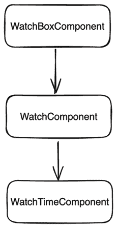

图 12.12：ng-run-outside-angular 应用的组件层次结构

## 准备中

我们将要工作的应用位于克隆的仓库中的`start/apps/chapter12/ng-run-outside-angular`：

1.  在您的代码编辑器中打开代码仓库。

1.  打开终端，导航到代码仓库目录，并运行以下命令以启动项目：

    ```js
    npm run serve ng-run-outside-angular 
    ```

    这应该在新的浏览器标签页中打开应用，您应该看到以下内容：

    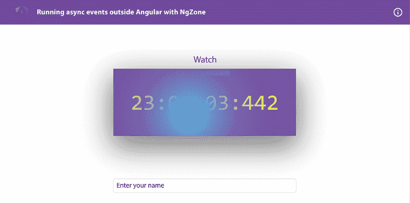

    图 12.13：在 http://localhost:4200 上运行的 ng-run-outside-angular 应用

现在我们已经运行了应用，让我们在下一节中查看菜谱的步骤。

## 如何做到这一点...

我们有一个显示手表的应用。然而，目前应用中的变更检测并不优化，我们有很大的改进空间。我们将尝试使用`ngZone`中的`runOutsideAngular`方法移除任何不必要的变更检测。让我们开始吧：

1.  时钟值正在不断更新。因此，我们为每个更新周期运行变更检测。打开 Chrome 开发者工具并切换到**控制台**标签。输入**appLogs**并按*Enter*键，以查看变更检测为`WatchComponent`以及渲染小时、分钟、秒和毫秒的组件运行了多少次。它应该看起来像这样：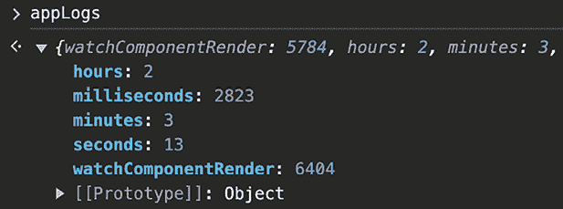

    图 12.14：反映变更检测运行次数的 appLogs 对象

1.  为了衡量性能，让我们在时间上减少我们的观察范围。让我们添加一些代码，在应用启动 4 秒后关闭时钟的间隔计时器。修改`watch-box.component.ts`文件，如下所示：

    ```js
    ...
    @Component({...})
    export class WatchBoxComponent implements OnInit {
      ...
      ngOnInit(): void {
        this.intervalTimer = setInterval(() => {
          this.timer();
      }, 1);
        **setTimeout****(****() =>** **{**
    **clearInterval****(****this****.****intervalTimer****);**
    **},** **4000****);**
      }
      ...
    } 
    ```

1.  刷新应用并等待 4 秒，直到时钟停止。然后，在**控制台**标签页中多次输入`appLogs`，按*Enter*键，查看结果。时钟停止了，但动画仍在运行。你应该会看到对**watchComponentRender**键的变更检测仍然增加，如下所示：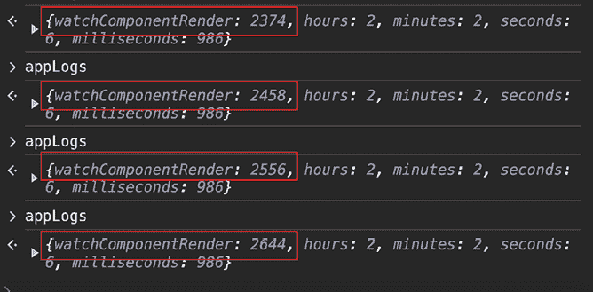

    图 12.15：监视组件的变更检测仍在运行

1.  让我们在 4 秒后也在监视内部停止动画。更新`watch.component.ts`文件，如下所示：

    ```js
    ...
    export class WatchComponent implements OnInit {
      ...
      ngOnInit(): void {
        this.intervalTimer = setInterval(...}, 30);
        **setTimeout****(****() =>** **{**
    **clearInterval****(****this****.****intervalTimer****);**
    **},** **4000****);**
      }
      ...
    } 
    ```

    刷新应用并等待动画停止。查看 Chrome DevTools 中的`appLogs`对象。你应该会看到变更检测对`watch`键停止，如下所示：

    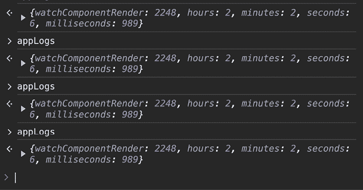

    图 12.16：停止动画间隔后，变更检测停止

1.  我们希望的结果是继续运行动画和时钟，并且没有额外的变更检测周期运行。为此，现在我们只需停止监视即可。要做到这一点，更新`watch-box.component.ts`文件，如下所示：

    ```js
    ...
    @Component({...})
    export class WatchBoxComponent implements OnInit {
      ...
      ngOnInit(): void {
        **// this.intervalTimer = setInterval(() => {**
    **//   this.timer();**
    **// }, 1);**
    **// setTimeout(() => {**
    **//   clearInterval(this.intervalTimer);**
    **// }, 4000);**
      }
    } 
    ```

    由于我们现在已经停止了时钟，`appLogs`中`watchComponentRender`键的值现在仅基于这 4 秒的动画。刷新应用并等待动画停止。在 Chrome DevTools 中输入`appLogs`（在**控制台**标签页）。你现在应该会看到`watchComponentRender`键的值在`250`到`270`之间。

1.  让我们通过在`ngZone`服务外部运行间隔来避免在动画上运行变更检测。我们将为此使用`runOutsideAngular`方法。更新`watch.component.ts`文件，如下所示：

    ```js
    import {
      ...
      ViewChild,
      **inject****,**
    **NgZone****,**
    } from '@angular/core';
    @Component({...})
    export class WatchComponent implements OnInit {zone = inject(NgZone);
      ...
      ngOnInit(): void {
      if (!window['appLogs']) {
        window['appLogs'] = {};
      }
      window['appLogs'][ watchComponentRender] = 0;
        **this****.****zone****.****runOutsideAngular****(****() =>** **{**
       ...
          setTimeout(() => {
            clearInterval(this.intervalTimer);
          }, 4000);
        **});**
      }
      ...
    } 
    ```

    刷新应用并等待大约 5 秒。如果你现在检查`appLogs`对象，你应该会看到每个属性的变更检测运行总数有所减少，如下所示：

    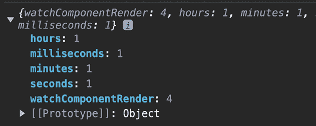

    图 12.17：使用`runOutsideAngular()`后的`WatchComponent`中的`appLogs`对象

    哈哈！注意，`appLogs`对象中`watch`键的值已经从大约`260`下降到`4`。这意味着我们的动画现在根本不会对变更检测做出贡献，并且`watch`组件在 4 秒内只渲染 4 次。

1.  从`WatchComponent`类的动画中移除`clearInterval`的使用。因此，背景圆圈（蓝色圆圈）动画应该再次开始。修改`watch.component.ts`文件，如下所示：

    ```js
    ...
    @Component({...})
    export class WatchComponent implements OnInit {
      ...
      ngOnInit(): void {
        ...
        this.ngZone.runOutsideAngular(() => {
          this.intervalTimer = setInterval(() => {
            this.animate();
          }, 30);
          setTimeout(() => { <-- remove this
            clearInterval(this.intervalTimer);
          }, 4000);
        });
      }
      ...
    } 
    ```

1.  最后，从`WatchBoxComponent`类中移除`clearInterval`的使用，并取消注释`setInterval`以运行时钟。更新`watch-box.component.ts`文件，如下所示：

    ```js
    import { Component, OnInit } from '@angular/core';
    @Component({
      selector: 'app-watch-box',
      templateUrl: './watch-box.component.html',
      styleUrls: ['./watch-box.component.scss'],
    })
    export class WatchBoxComponent implements OnInit {
      name = '';
      time = {
        hours: 0,
        minutes: 0,
        seconds: 0,
        milliseconds: 0,
      };
      intervalTimer;
      constructor() {}
      ngOnInit(): void {
        this.intervalTimer = setInterval(() => {
          this.timer();
        }, 1);
        setTimeout(() => { //<-- Remove this
          clearInterval(this.intervalTimer);
        }, 4000);
      }
      ...
    } 
    ```

    刷新应用并在几秒钟后多次检查`appLogs`对象的价值。你应该会看到类似以下的内容：

    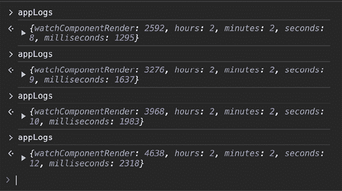

    图 12.18：使用`runOutsideAngular()`进行性能优化后的`appLogs`对象

    观察前面的截图，你可能会问，“*Ahsan！这是什么？与经过的毫秒数相比，`watchComponentRender` 键的变化检测运行次数仍然非常巨大。这到底是如何提高性能的呢？*” 很高兴你问了！我将在 *它是如何工作的…* 部分告诉你原因。

1.  作为最后一步，停止 Angular 服务器并运行以下命令以在生产模式下启动服务器：

    ```js
    npm run serve:prod ng-run-outside-angular 
    ```

1.  再次导航到 `https://localhost:4200`。等待几秒钟，然后在 **控制台** 选项卡中多次检查 `appLogs` 对象。你应该会看到如下对象：

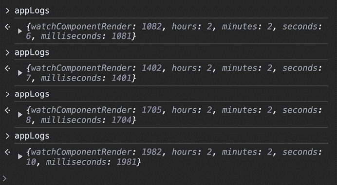

图 12.19：使用生产构建的 appLogs 对象

嘣！如果你看前面的截图，你应该会看到 `watchComponentRender` 键的变化检测运行次数总是比 `milliseconds` 键多几个周期。这意味着 `WatchComponent` 类只有在 `@Input()` 的 `milliseconds` 绑定值更新时才会（几乎）重新渲染。但为什么多几个周期呢？请看下一节了解它是如何工作的！

## 它是如何工作的…

在这个菜谱中，我们首先查看包含一些键值对的 `appLogs` 对象。每个键值对的值表示 Angular 为特定组件运行变化检测的次数。`hours`、`milliseconds`、`minutes` 和 `seconds` 键代表时钟上显示的每个值的 `WatchTimeComponent` 实例。`watchComponentRender` 键代表 `WatchComponent` 实例的变化检测周期。

在菜谱的开始部分，我们看到 `watch` 键的值是 `milliseconds` 键值的两倍多。我们为什么要在乎 `milliseconds` 键呢？因为我们的应用程序中 `@Input()` 属性绑定 `milliseconds` 的变化最为频繁——也就是说，它每 1 **毫秒**（**ms**）就会变化一次。其次是 `WatchComponent` 类中的 `xCoordinate` 和 `yCoordinate` 属性，它们每 30 毫秒变化一次。`xCoordinate` 和 `yCoordinate` 值并没有直接绑定到模板（HTML）上，因为它们会改变 `stopWatch` 视图子组件的 **CSS** 变量。这发生在 `animate` 方法内部，如下所示：

```js
el.style.setProperty('--x', `${this.xCoordinate}px`);
el.style.setProperty('--y', `${this.yCoordinate}px`); 
```

因此，更改这些值不应触发变更检测。我们首先通过将测试时间限制在运行时钟，使用`WatchBoxComponent`类中的`clearInterval`方法来停止时钟，使其在 4 秒内停止，以便我们可以评估这些数值。在*图 12.15*中，我们看到即使时钟停止后，变更检测机制仍然会为`WatchComponent`类触发。随着时间的推移，这会增加`appLogs`对象中`watch`键的计数。然后我们通过在`WatchComponent`类中使用`clearInterval`来停止动画。这也使得背景（蓝色圆形）动画在 4 秒后停止。在*图 12.16*中，我们看到动画停止后，`watch`键的计数不再增加。

然后，我们尝试仅基于动画来查看变更检测的计数。在*步骤 6*中，我们停止了时钟。因此，我们只得到了`appLogs`对象中`watch`键基于动画的计数，这个值在`250`和`270`之间。

然后，我们将神奇的`runOutsideAngular`方法引入到我们的代码中。这个方法是`NgZone`服务的一部分。`NgZone`服务包含在`@angular/core`包中。`runOutsideAngular`方法接受一个方法作为参数。这个方法在 Angular 区域外执行。这意味着在`runOutsideAngular`方法内部使用的`setTimeout`和`setInterval`方法不会触发 Angular 变更检测周期。但技术上，我们为什么在区域外运行这个`setInterval`呢？因为我们的间隔调用`animate`方法，它更新 CSS 变量`--x`和`--y`。由于它们会自动触发动画，并且`WatchComponent`类的其他属性不需要在 UI 中显示（需要重新渲染），我们可以将此代码移动到`runOutsideAngular`方法中。您可以在*图 12.17*中看到，使用`runOutsideAngular`方法后，计数降至`4`。

然后，我们从`WatchBoxComponent`和`WatchComponent`类中移除了`clearInterval`的使用——也就是说，再次运行时钟和背景（蓝色圆形）动画，就像我们一开始做的那样。在*图 12.18*中，我们看到`watch`键的计数大约是`milliseconds`键的两倍。那么，为什么它大约是两倍呢？这是因为，在开发模式下，Angular 运行变更检测机制*两次*以确保没有*副作用*。例如，一个`state`属性的更新可能在一个（子）组件中引发变更检测，等等。因此，在*步骤 9*和*步骤 10*中，我们在生产模式下运行应用程序，在*图 12.19*中，我们看到`watch`键的值仅比`milliseconds`键的值多几个周期，这意味着动画不再触发我们应用程序的任何变更检测。

但为什么`watchComponentRender`键与`milliseconds`键相比有更多的周期？这是因为`WatchComponent`是显示毫秒的组件（`WatchTimeComponent`）的父组件。可能会有一些基于浏览器交互的变更检测周期，但如果你在刷新应用且与应用没有任何交互时，`watchComponentRender`与毫秒计数之间的差异在生产模式下可能低至一个变更检测周期。

太棒了，不是吗？如果你觉得这个食谱很有用，请通过我的社交媒体告诉我。

现在你已经了解了它是如何工作的，请查看下一节以获取更多阅读材料。

## 另请参阅

+   `NgZone`官方文档：[`angular.io/api/core/NgZone`](https://angular.io/api/core/NgZone)

+   Angular `ChangeDetectorRef`官方文档：[`angular.io/api/core/ChangeDetectorRef`](https://angular.io/api/core/ChangeDetectorRef)

# 使用`trackBy`为`*ngFor`列表

列表是我们今天构建的大多数应用的一个基本部分。如果你正在构建一个 Angular 应用，有很大可能性你会在某个时候使用`*ngFor`指令来渲染列表。`*ngFor`指令允许我们遍历数组或对象，为每个项目生成 HTML。然而，如果我们正在渲染大型列表，不谨慎地使用`*ngFor`可能会导致性能问题，尤其是在`*ngFor`的源被完全更改（整个数组被替换）时。在这个示例中，我们将学习如何使用带有`trackBy`函数的`*ngFor`指令来提高列表的性能。让我们开始吧。

## 准备工作

我们将要工作的应用位于克隆的仓库中的`start/apps/chapter12/ng-for-trackby`：

1.  在你的代码编辑器中打开代码仓库。

1.  打开终端，导航到代码仓库目录，并运行以下命令以运行项目：

    ```js
    npm run serve ng-for-trackby 
    ```

    这应该在新的浏览器标签页中打开应用，你应该看到以下内容：

    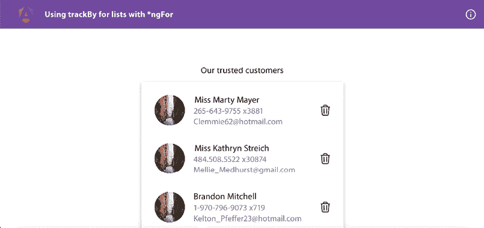

    图 12.20：ng-for-trackby 应用在 http://localhost:4200 上运行

现在我们已经运行了应用，让我们在下一节中查看食谱的步骤。

## 如何做到这一点…

我们有一个应用，在视图中显示了 10,000 个用户的列表。由于我们没有使用虚拟滚动（例如来自`@angular/material`），而是使用标准的`*ngFor`列表，所以我们现在确实面临一些性能问题。请注意，当你刷新应用时，即使在加载器隐藏后，你也会在列表出现前看到大约 2-3 秒的空白白色框。如果你的机器卡住了很长时间，你可以在`data.service.ts`文件中修改`USERS_LIMIT`变量的值。让我们开始重现性能问题的步骤，之后我们将修复这些问题：

1.  首先，打开 Chrome 开发者工具并查看 **控制台** 选项卡。你应该会看到“**用户卡片创建**”消息记录了 10,000 次。每次创建/初始化用户卡片组件（`UserCardComponent`类的实例）时，都会记录此消息。

1.  现在，通过卡片上的*删除*按钮删除第一个项目。现在你应该会看到相同的消息（**用户卡片创建**）再次记录了 9,999 次，如以下截图所示。这意味着我们为剩余的 9,999 个项目重新创建了`list-item`组件！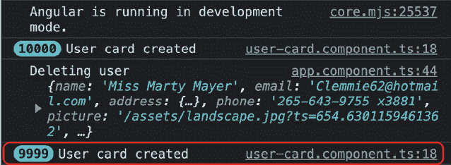

    图 12.21：删除项目后再次显示的日志

1.  现在，点击第一个项目（这会根据现有代码更新第一个项目）。你应该再次看到**用户卡片创建**日志，如*图 12.22*所示。这意味着我们在更新列表中的任何项目时都会重新创建所有 9,999 个列表项。你会注意到**用户界面**（**UI**）中第一个项目的名称更新大约在 2-3 秒内反映出来：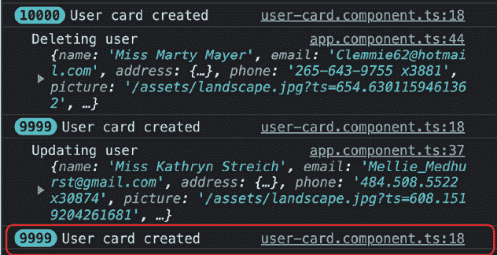

    图 12.22：更新项目后再次显示的日志

1.  现在，让我们通过使用`trackBy`函数来修复性能问题。打开`users-list.component.ts`文件并按照以下方式更新它：

    ```js
    ...
    export class UsersListComponent {
      @Input() listItems: AppUserCard[] = [];
      @Output() itemClicked = new EventEmitter<AppUserCard>();
      @Output() itemDeleted = new EventEmitter<AppUserCard>();
      **trackByFn****(****_index****:** **number****,** **item****:** **AppUserCard****) {**
    **return** **item.****id****;**
    **}**
    } 
    ```

1.  现在，更新`users-list.component.html`文件以使用我们刚刚创建的`trackByFn`方法，如下所示：

    ```js
    <h4 class="heading">Our trusted customers</h4>
    <ul class="list list-group p-2">
    <li class="list__item list-group-item" *ngFor="let item of
        listItems; **trackBy: trackByFn**">
        ...
      </li>
    </ul> 
    ```

1.  现在，刷新应用程序，删除第一个项目，然后点击（新的）第一个列表项来更新它。你会注意到项目立即更新，并且不再记录**用户卡片创建**消息，如*图 12.23*所示：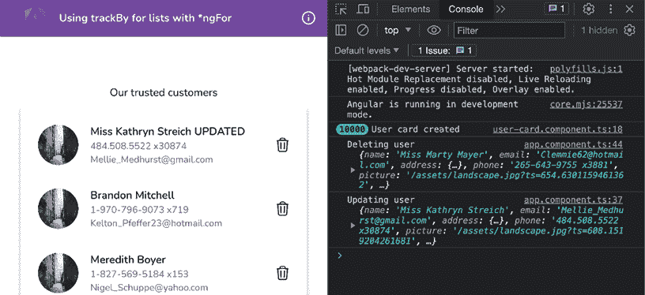

    图 12.23：使用 trackBy 函数更新项目后不再有进一步的日志记录

太好了！你现在知道如何使用`trackBy`函数与`*ngFor`指令来优化 Angular 中列表的性能。要了解食谱背后的所有魔法，请参阅下一节。

## 它是如何工作的...

`*ngFor`指令允许我们遍历**可迭代对象**并渲染多个 HTML 元素或组件。当处理原始数组（布尔值、字符串或数字值）时，Angular 通过其值跟踪每个项目以识别元素。然而，当处理对象时，Angular 通过内存位置跟踪它们，就像 JavaScript 处理对象相等性检查一样。这意味着如果你只是更改数组中对象的属性，它不会重新渲染该对象的模板。但是，如果你提供一个新对象来替换它（内存中的不同引用），则将重新渲染该项的内容。这就是我们在本食谱中重现性能问题的方法。由于我们在更新或删除项目时替换整个数组，Angular 将数组视为一个新资源来迭代。在`data.service.ts`文件中，我们在名为`DataService`的服务中为`updateUser`方法有以下代码：

```js
updateUser(updatedUser: AppUserCard) {
  this.users = this.users.map((user) => {
    if (user.id === updatedUser.id) {
      return {
        ...updatedUser,
      };
    }
    return { ...user };
  });
} 
```

注意，我们使用对象展开运算符（`{ … }`）为数组中的每个项目返回一个新的对象。这最终告诉`*ngFor`指令重新渲染`UserListComponent`类中`listItems`数组中的每个项目的 UI。假设你已经渲染了 1,000 个用户。如果你搜索一个返回 100 个用户的术语，理想情况下，Angular 不应该重新渲染这 100 个用户，因为它们已经在视图中渲染过了。然而，Angular 会重新渲染所有列表项的 UI，原因如下（但不仅限于这些）：

+   用户的排序/放置可能已更改。

+   用户的长度可能已更改。

现在，我们想要避免使用对象引用作为每个列表项的唯一标识符。对于我们的用例，我们知道每个用户的 ID 是唯一的；因此，我们使用`trackBy`函数告诉 Angular 使用用户的 ID 作为唯一标识符。现在，即使我们在`updateUser`方法（如前所述）更新用户后为每个用户返回一个新的对象，Angular 也不会重新渲染所有列表项。这是因为新的对象（用户）具有相同的 ID，Angular 使用它来跟踪它们。很酷，对吧？

现在你已经了解了食谱的工作原理，请查看下一节以查看进一步阅读的链接。

## 相关内容

+   `NgForOf`官方文档：[`angular.io/api/common/NgForOf`](https://angular.io/api/common/NgForOf)

# 将重计算移动到纯管道

在 Angular 中，我们有一种特定的编写组件的方式。由于 Angular 具有强烈的意见导向，我们已经有来自社区和 Angular 团队的大量指南，关于编写组件时需要考虑的事项——例如，直接从组件中发起 HTTP 调用被认为是一种**不太好的**做法。同样，如果组件中有重计算且每次变更检测周期都会触发，这也不被认为是一种好的做法。想象一下，视图依赖于使用不断计算的数据的转换版本。这将在每个渲染周期中引起大量的计算和处理。一个很好的技术是将重计算移动到 Angular（纯）管道中（特别是如果计算发生在每次变更检测周期时）。

## 准备中

我们将要工作的应用位于克隆的仓库中的`start/apps/chapter12/ng-pipes-perf`：

1.  在你的代码编辑器中打开代码仓库。

1.  打开终端，导航到代码仓库目录，并运行以下命令以启动项目：

    ```js
    npm run serve ng-pipes-perf 
    ```

    这应该在新的浏览器标签页中打开应用，你应该会看到以下内容：

    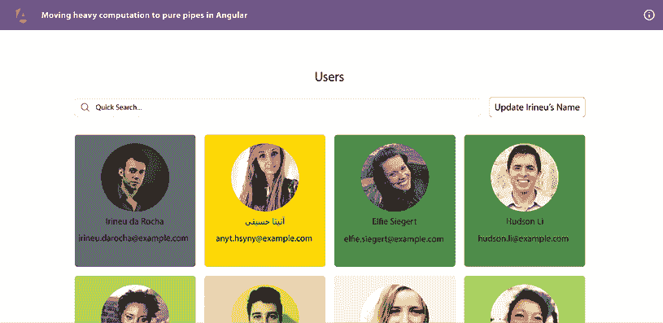

    图 12.24：ng-pipes-perf 应用在 http://localhost:4200 运行

点击标有**点击我**的按钮，或者尝试搜索一些用户。你会看到应用太慢，经常卡住。现在，我们已经将项目在浏览器上启动，让我们在下一节中查看食谱的步骤。

## 如何做到这一点...

我们正在工作的应用程序有一些性能问题，特别是与`UserCardComponent`类有关。这是因为它使用一个 getter 函数`randomColor`为其背景生成随机颜色。在幕后，该函数使用`factorial`函数来增加处理时间。但这只是为了演示一个组件，如果同时发生一些复杂计算和多个变更检测被触发，它可能会导致 UI 卡住。我们将添加一些代码来监控`randomColor` getter 被调用的次数。这将显示 Angular 默认触发的变更检测次数。我们还将通过完全从特定组件中分离变更检测来修复问题，并使其更高效（尽可能多）。让我们开始吧：

1.  首先，让我们确保应用程序对您的机器来说足够慢，以至于它使您的笔记本电脑/PC 卡住。打开`src/app/app.config.ts`文件，并将`RANDOMIZATION_COUNT`令牌的值从`9`调整为最适合您的值。

1.  然后，尝试通过在搜索框中输入他们的名字来搜索名为`Irineu`的用户。你会注意到应用程序仍然卡住，并且显示用户需要几秒钟。你还会注意到，当你输入字母时甚至看不到搜索框中的字母。也就是说，渲染存在延迟。

    让我们在代码中添加一些逻辑。我们将检查 Angular 在页面加载时调用`idUsingFactorial`方法的次数。

1.  让我们创建一个服务，我们将使用它来跟踪特定用户的特定用户卡片被调用的次数。从工作区的根目录运行以下命令来创建一个服务：

    ```js
    cd start && nx g s services/logs --project ng-pipes-perf 
    ```

    当被询问时，请选择`@schematics/angular:service`。

1.  按照以下方式更新`src/app/services/logs.service.ts`文件的内容：

    ```js
    import { Injectable } from '@angular/core';
    @Injectable({
      providedIn: 'root'
    })
    export class LogsService {
      logs: Record<string, number> = {}
      updateLogEntry(email: string) {
        if (this.logs[email] === undefined) {
          this.logs = {
            ...this.logs,
            [email]: 1
          }
        } else {
          this.logs = {
            ...this.logs,
            [email]: this.logs[email] + 1
          }
        }
      }
    } 
    ```

1.  现在，在`src/app/component/user-card/user-card.component.ts`文件中注入`LogService`。我们还将创建一个 getter（`log`）函数来获取用户的计数，并且每当`randomColor` getter 被调用时，我们将更新计数。按照以下方式更新提到的文件：

    ```js
    ...
    **import** **{** **LogsService** **}** **from****'../../services/logs.service'****;**
    @Component({...})
    export class UserCardComponent {
      ...
      randomizationCount = inject(RANDOMIZATION_COUNT);
      **logsService =** **inject****(****LogsService****);**
    **get****log****() {**
    **return****this****.****logsService****.****logs****[****this****.****user****.****email****] ??** **0****;**
    **}**
    get randomColor() {
        **this****.****logsService****.****updateLogEntry****(****this****.****user****.****email****);**
        ...
      }
    } 
    ```

1.  现在，我们将使用用户卡片组件的模板中的日志来显示计数。按照以下方式更新`src/app/component/user-card/user-card.component.html`文件：

    ```js
    <div [style.backgroundColor]="randomColor"...>
    
    <div class="card-body flex-1">...</div>
    **<****div****class****=****"p-4 bg-slate-900 text-green-300 rounded-md** **h-fit"****>**
    **<****div****>**
    **Color Generation Count:**
    **</****div****>**
    **<****pre****>****{{log}}****</****pre****>**
    **</****div****>**
    </div> 
    ```

    如果你现在查看应用程序，你应该会看到以下**颜色生成计数**：

    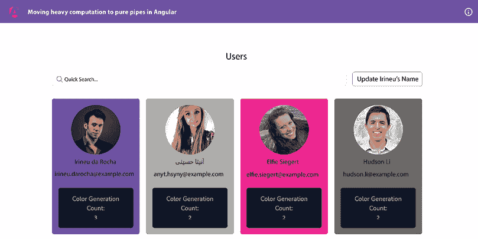

    图 12.25：页面加载时显示的颜色生成计数

1.  现在，点击**更新 Irineu 的名字**按钮。然后（点击）聚焦于**快速搜索**输入框，然后点击外部。重复几次，你应该会看到颜色被重新生成，尽管卡片不应该被重新渲染。*图 12.26*显示了它应该看起来是什么样子！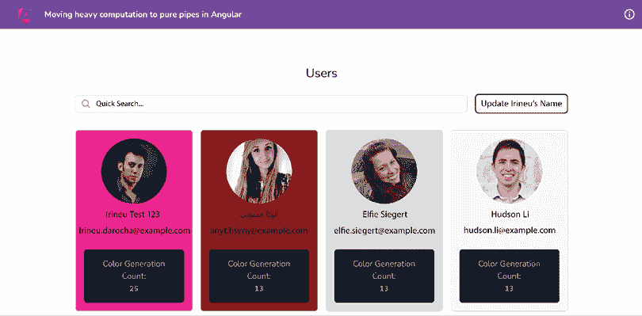

    图 12.26：与应用程序交互后未搜索任何内容的日志

    注意，如果你开始搜索某些内容，你会得到更多的重新渲染。这是因为每个 keyup 和/或 keydown 事件都会触发更多的重新渲染。

1.  为了解决这个问题，我们将创建一个 Angular 管道。我们将把生成随机颜色的计算移动到这个 Angular 管道中。在项目根目录中，在终端中运行以下命令：

    ```js
    cd start && nx g pipe random-color --directory apps/chapter12/ng-pipes-perf/src/app/pipes 
    ```

    当被要求时，使用`@schematics/angular:pipe`脚图。

1.  现在，将`randomColor`获取器函数和`factorial`函数从`user-card.component.ts`文件移动到 Angular 管道的文件`pipes/random-color.pipe.ts`中，如下所示：

    ```js
    import { Pipe, PipeTransform, inject } from '@angular/core';
    **import** **{** **LogsService** **}** **from****'../services/logs.service'****;**
    **import** **{ randColor }** **from****'@ngneat/falso'****;**
    **import** **{** **IUser** **}** **from****'../interfaces/user.interface'****;**
    ...
    export class RandomColorPipe implements PipeTransform {
      **logsService =** **inject****(****LogsService****);**
    **factorial****(****n****:** **number****):** **number** **{**
    **if** **(n ==** **0** **|| n ==** **1****) {**
    **return****1****;**
    **}** **else** **{**
    **return** **n *** **this****.****factorial****(n -** **1****);**
    **}**
    **}**
    **randomColor****(****email****:** **string****,** **randomizationCount****:** **number****) {**
    **this****.****logsService****.****updateLogEntry****(email);**
    **let** **color;**
    **for** **(****let** **i =** **0****; i <** **this****.****factorial****(randomizationCount); i++) {**
    **color =** **randColor****();**
    **}**
    **return** **color;**
    **}**
    transform(r**andomizationCount****:** **number****,** **user****:** **IUser**):
        **string** **|** **undefined** {
        return **this****.****randomColor****(user.****email****, randomizationCount)**;
      }
    } 
    ```

1.  确保从`src/app/component/user-card/user-card.component.ts`文件中删除那些函数（`randomColor`获取器和`factorial`）。同时删除任何未使用的导入。

1.  现在，将`randomColor`管道添加到`user-card.component.ts`文件中的用户卡片组件中，如下所示：

    ```js
    ...
    **import** **{** **RandomColorPipe** **}** **from****'../../pipes/random-color.pipe'****;**
    @Component({
      selector: 'app-user-card',
      standalone: true,
      imports: [CommonModule, RouterModule, **RandomColorPipe**],
      ...
    }) 
    ```

1.  现在，更新`user-card.component.html`文件以使用`randomColor`管道代替我们之前使用的获取器。代码应该看起来像这样：

    ```js
    <div [style.backgroundColor]="**randomizationCount | randomColor : user**" class="card flex flex-col max-w-sm mx-auto h-full duration-200 cursor-pointer hover:border-purple-500 hover:shadow-md p-4 border border-slate-300 rounded-md text-center" *ngIf="user" routerLink="/user/{{user.uuid}}">
      ...
    </div> 
    ```

1.  现在，刷新应用并重复*步骤 7*。你会看到颜色只为第一张卡片生成，其他卡片不会重新渲染，如图*12.27*所示：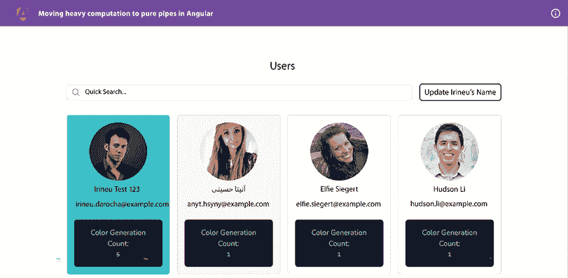

    图 12.27：只有第一张卡片重新生成颜色

嘣！现在你知道了如何通过将重计算移动到纯 Angular 管道来优化性能，请看下一节了解它是如何工作的。

## 它是如何工作的…

如我们所知，Angular 默认在应用中每个由浏览器事件触发的变化检测上运行。由于我们在组件模板（UI）中使用了一个`randomColor`获取器，这个函数每次 Angular 运行变化检测周期时都会运行。这会导致更多的计算和性能问题。如果我们使用函数调用而不是获取器，这也会成立。

我们可以退一步，从最初的实现中思考一下`randomColor`获取器的作用。它是基于`randomizationCount`属性的阶乘使用`for`循环工作的。这只是为了给这个例子增加很多处理时间，但你可以想象任何在变化检测周期中涉及的重计算都会导致性能问题。在这些情况下，我们可能会使用纯函数或者可能使用记忆化。

纯函数是一个函数，给定相同的输入，总是返回相同的输出。记忆化是一种技术，其中，如果输入没有改变（即，函数使用与上次相同的输入调用），则返回缓存的输出，并跳过重计算。幸运的是，Angular 纯管道是纯函数和记忆化的，因为它们只有在输入改变时才会被调用。如果不是这种情况，管道的转换函数将不会被调用，组件也不会重新渲染。

在这个菜谱中，我们将计算移动到一个新创建的 Angular 管道。管道的 `transform` 方法接收 `randomizationCount` 作为第一个值，以及 `user`（类型为 `IUser`）作为第二个输入。管道随后使用 `randomColor` 方法，最终使用 `factorial` 方法来计算一个随机颜色。当我们开始在搜索框中输入时，用户卡片的值不会改变。这导致管道直到我们根据搜索查询得到一组新的用户时才会被触发。一旦我们得到结果，用户卡片将被重新渲染，因此我们为它们得到新的颜色。结果，由于浏览器事件，没有不必要的计算运行，从而优化性能并解除 UI 线程的阻塞。

## 相关内容

+   Angular 纯管道和不纯管道官方文档：[`angular.io/guide/pipes#pure-and-impure-pipes`](https://angular.io/guide/pipes#pure-and-impure-pipes)

# 使用 Web workers 进行重量级计算

如果你的 Angular 应用在执行动作时进行大量计算，那么它有很大可能会阻塞 UI 线程。这会导致渲染 UI 时出现延迟，因为它阻塞了主 JavaScript 线程。Web workers 允许我们在后台线程中运行重量级计算，从而释放 UI 线程，使其不被阻塞。在这个菜谱中，我们将使用一个在 `UserService` 类中进行重量级计算的应用程序。它为每个用户卡片创建一个唯一的 ID 并将其保存到 `localStorage` 中。然而，在这样做之前，它会循环几千次，这会导致我们的应用程序挂起一段时间。在这个菜谱中，我们将把重量级计算从组件移动到 Web worker，并且还会添加一个回退方案，以防 Web workers 不可用。

## 准备工作

我们将要工作的应用程序位于克隆的仓库中的 `start/apps/chapter12/ng-ww-perf` 目录内：

1.  在你的代码编辑器中打开代码仓库。

1.  打开终端，导航到代码仓库目录，并运行以下命令以启动项目：

    ```js
    npm run serve ng-ww-perf 
    ```

    这应该在新的浏览器标签页中打开应用程序，你应该会看到以下内容：

    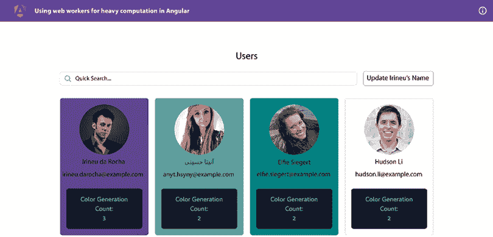

    图 12.28：ng-ww-perf 应用程序在 http://localhost:4200 运行

现在我们已经启动了应用程序，让我们在下一节中查看菜谱的步骤。

## 如何操作…

一旦你打开应用，你会注意到用户卡片渲染需要一些时间。我们还可以看到用户卡片背景随机颜色生成的次数。如果你输入某些内容，或者点击**更新 Irineu 的名字**按钮，你会看到 UI 线程在计算完成之前被阻塞。罪魁祸首是`UserCardComponent`类中的`randomColor`获取器方法。这最终在渲染颜色之前，基于`RANDOMIZATION_COUNT`令牌的值运行一个`for`循环来生成一个随机颜色。这发生在`src/app/utils.ts`文件中的`generateRandomColor`方法内部。让我们开始配方来提高应用性能。我们将从实现一个 web worker 开始：

1.  我们首先创建一个 web worker。在工作区根目录中运行以下命令：

    ```js
    cd start && nx generate web-worker workers/randomColor --project ng-ww-perf 
    ```

    当被询问时，选择`@nx/angular:web-worker`。

1.  现在，更新`workers/random-color.worker.ts`文件中的代码如下：

    ```js
    /// <reference lib="webworker" />
    import { generateRandomColor } from "../utils";
    type RandomColorIncomingEvent = {
      data: {
        randomizationCount: number
      }
    }
    export type RandomColorOutgoingEvent = { data: { color: string } };
    addEventListener('message', ({ data }:
      RandomColorIncomingEvent) => {
      const {
        randomizationCount
      } = data;
      console.log('inside the worker', data)
      if (!randomizationCount) {
        return;
      }
      const color = generateRandomColor(randomizationCount);
      postMessage({
        color
      });
    });
    export const getRandomColorWorker = () => {
      if (typeof Worker !== undefined) {
        return new Worker(new URL('./random-color.worker', import.meta.url), {
          type: 'module'
        })
      }
      return null;
    } 
    ```

1.  让我们将`UserCardComponent`类中的`randomColor`获取器替换为一个普通属性。按照以下方式更新`user-card.component.ts`文件：

    ```js
    ...
    export class UserCardComponent implements OnInit, OnChanges {
      ...
      randomizationCount = inject(RANDOMIZATION_COUNT);
      **randomColor =** **''****;**
      ...
    } 
    ```

    确保删除`randomColor`获取器函数。否则，TypeScript 会抛出错误，因为我们不能有一个属性和一个具有相同名称的获取器方法。

1.  现在，我们将使用`user-card.component.ts`文件中的 worker。按照以下方式更新它：

    ```js
    import { Component, Input, **OnInit**, inject } from '@angular/core';
    ...
    import { RANDOMIZATION_COUNT } from '../../tokens';
    **import** **{** **RandomColorOutgoingEvent** **, getRandomColorWorker }** **from****'../../workers/random-color.worker'****;**
    @Component({...})
    export class UserCardComponent **implements****OnInit** {
      @Input() user!: IUser;
      @Input() index = 0;
      logsService = inject(LogsService);
      randomizationCount = inject(RANDOMIZATION_COUNT);
      randomColor = '';
      **worker****:** **Worker** **|** **null** **=** **getRandomColorWorker****();**
    **ngOnInit****():** **void** **{**
    **if** **(!****this****.****worker****) {**
    **return****;**
    **}**
    **this****.****worker****.****onmessage** **=** **(****{ data: { color } }:**
    **RandomColorOutgoingEvent****) =>** **{**
    **console****.****log****(**
    **`received color** **${color}** **from worker for user** **${****this****.user.email}****`**
    **);**
    **this****.****logsService****.****updateLogEntry****(****this****.****user****.****email****);**
    **this****.****randomColor** **= color;**
    **};**
    **}**
     ...
    } 
    ```

1.  到目前为止，我们只是添加了一个监听器，用于接收从 worker 生成的颜色。但首先，我们必须从组件向 worker 发送一条消息，以便它生成一个随机颜色。将`user-card.component.ts`文件更新为使用`OnChanges`生命周期钩子。我们将使用它向 worker 发送消息：

    ```js
    import { Component, Input, **OnChanges**, OnInit, **SimpleChanges**, inject } from '@angular/core';
    ...
    export class UserCardComponent implements OnInit, **OnChanges**{
      ...
      ngOnInit(): void {...}

      **ngOnChanges****(****changes****:** **SimpleChanges****) {**
    **if** **(changes[****'user'****].****currentValue** **!==**
    **changes[****'user'****].****previousValue****) {**
    **if** **(!****this****.****worker****) {**
    **this****.****randomColor** **=** **generateRandomColor****(**
    **this****.****randomizationCount****);**
    **return****;**
    **}**
    **this****.****worker****.****postMessage****({** **randomizationCount****:**
    **this****.****randomizationCount** **});**
    **}**
    **}**
      ...
    } 
    ```

1.  最后，让我们确保在相应的用户卡片被销毁（终止）时，worker 也被销毁。按照以下方式更新`user-card.component.ts`文件：

    ```js
    ...
    @ import { Component, Input, OnChanges, **OnDestroy**, OnInit, SimpleChanges, inject } from '@angular/core';
    export class UserCardComponent implements OnInit, OnChanges,
      **OnDestroy**{
      ...
      **ngOnDestroy****():** **void** **{**
    **this****.****worker****?.****terminate****();**
    **}**
    get log() {...}
    } 
    ```

1.  刷新应用并注意用户卡片渲染所需的时间。它们应该比之前快得多。此外，你应该能够看到以下日志反映了从应用到 web worker 以及相反的通信：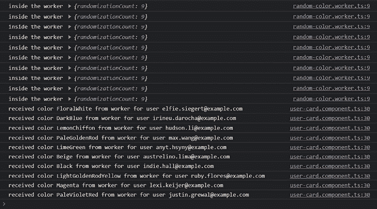

    图 12.29：显示从应用向 web worker 发送消息的日志

哇哦！web worker 的力量！现在你知道如何在 Angular 应用中使用 web worker 将繁重的计算移到它们那里。由于你已经完成了配方，请查看下一节了解它是如何工作的。

## 它是如何工作的…

正如我们在食谱描述中讨论的那样，Web 工作者允许我们在主 JavaScript（或 UI 线程）之外的一个单独的线程中运行和执行代码。在食谱的开始部分，无论何时我们刷新应用程序或搜索用户，它都会阻塞 UI 线程。我们有时会看到加载器被挂起，或者出现一个空白屏幕。直到为每个卡片生成一个随机颜色。我们通过使用 NX **命令行界面**（**CLI**）开始食谱，创建一个 Web 工作者。这会创建一个 `random-color.worker.ts` 文件，其中包含一些模板代码，用于接收来自 UI 线程的消息并将其作为响应发送回它。

CLI 命令还会通过添加 `webWorkerTsConfig` 属性来更新 `project.json` 文件。`webWorkerTsConfig` 属性的值是对 `tsconfig.worker.json` 文件的路径，CLI 命令还会创建这个 `tsconfig.worker.json` 文件。如果您打开 `tsconfig.worker.json` 文件，您应该看到以下代码：

```js
/* To learn more about this file see: https://angular.io/config/tsconfig. */
{
"extends": "../../../tsconfig.json",
"compilerOptions": {
"outDir": "../../../out-tsc/worker",
"lib": [
"es2018",
"webworker"
],
"types": []
},
"include": [
"src/**/*.worker.ts"
]
} 
```

然而，在我们的 NX 工作区中，我们有一个 `tsconfig.base.json` 文件而不是 `tsconfig.json`。因此，我们进行了修复。

在 Web 工作者文件中，我们有 `addEventListener` 方法的调用，它从 UI 线程接收消息到工作者。请注意，我们期望从 UI 线程接收 `randomizationCount` 属性，这样我们就可以在 `utils.ts` 文件中的 `generateRandomColor` 方法中使用它。

工作者文件还有一个名为 `getRandomColorWorker` 的方法。每次调用它时，都会返回一个新的工作者实例。由于我们从用户卡片组件中调用它，每个卡片都会得到一个新的工作者实例。

然后，在我们的 `UserCardComponent` 类中，我们为每个组件获取一个新的工作者实例，并使用 `ngOnInit` 生命周期钩子向工作者添加一个事件监听器。这样，每当工作者发送消息时，用户卡片组件都可以读取它——也就是说，它会获取生成的颜色并将其分配给 `randomColor` 属性。这反过来会设置用户卡片的 `backgroundColor`。请注意，`ngOnInit` 生命周期钩子只为工作者发送的消息注册监听器。但首先，我们必须告诉工作者生成随机颜色。为此，我们使用 `ngOnChanges` 生命周期钩子。在钩子中，我们观察用户输入的值。如果它发生变化，我们就向工作者发送消息，为特定的用户卡片生成一个随机颜色。如果您点击 **更新 Irineu 的姓名** 按钮，您将看到从用户卡片发送和接收的连续日志。请注意，以这种方式将颜色生成移动到工作者，也会导致在浏览器事件（点击、按键等）触发时，其他组件不再重新渲染。最后，我们使用 `ngOnDestroy` 生命周期钩子来终止工作者，以避免内存泄漏。

注意，在 `ngOnChanges` 钩子中，如果浏览器不支持工作者，我们也会回退到 `utils.ts` 文件中方法的常规使用。

## 参见

+   Angular 官方关于网页工作者的文档：[`angular.io/guide/web-worker`](https://angular.io/guide/web-worker)

+   MDN 网页工作者文档：[`developer.mozilla.org/en-US/docs/Web/API/Worker`](https://developer.mozilla.org/en-US/docs/Web/API/Worker)

# 使用性能预算进行审计

在今天的世界里，大多数人口都有良好的互联网连接来使用日常应用程序，无论是移动应用程序还是网页应用程序，我们向最终用户发送的数据量是多么令人着迷。现在发送给用户的 JavaScript 数量呈不断增长的趋势，如果您正在开发一个网页应用程序，您可能希望使用性能预算来确保包大小不超过某个限制。对于 Angular 应用程序，设置预算大小非常简单。在这个配方中，您将学习如何使用性能预算来确保我们的 Angular 应用程序的包大小保持较小。

## 准备工作

我们将要工作的应用程序位于克隆的仓库中的`start/apps/chapter12/ng-perf-budgets`内：

1.  在您的代码编辑器中打开代码仓库。

1.  打开终端，导航到代码仓库目录，并运行以下命令以构建项目：

    ```js
    npm run build ng-perf-budgets 
    ```

    这应该会构建应用程序，您应该在终端中看到以下内容：

    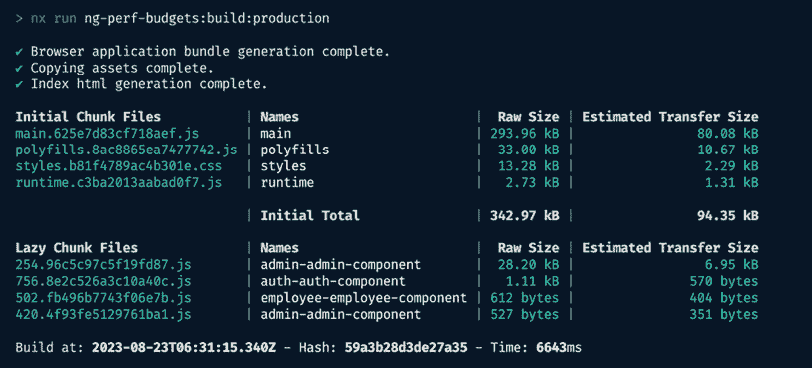

    图 12.30：生产模式下的构建输出，没有性能预算

注意现在`main.*.js`文件的包大小约为 294 **千字节**（**KB**）。既然我们已经构建了应用程序，接下来让我们看看下一节中的构建步骤。

## 如何做到这一点…

目前我们的应用程序在包大小方面很小。然而，随着未来业务需求的发展，这可能会变成一个巨大的应用程序。为了这个配方的目的，我们将故意增加包大小，然后使用性能预算来阻止 Angular 构建在包大小超过预算时生成。让我们开始配方：

1.  打开`app.component.ts`文件并按照以下方式更新它：

    ```js
    ...
    **import** ***** **as** **moment** **from****'../lib/moment'****;**
    **import** ***** **as****THREE****from****'three'****;**
    @Component({...})
    export class AppComponent {
      ...
      constructor() {
       const scene = new THREE.Scene(); 
       console.log(moment().format('MMM Do YYYY'));
       console.log(scene);
     }
      ...
    } 
    ```

1.  现在，通过从工作区根目录运行以下命令再次构建应用程序：

    ```js
    npm run build ng-perf-budgets 
    ```

    您应该看到`main.*.js`文件的包大小现在大约为 1.10 **兆字节**（**MB**）。与原始的约 294 KB 相比，这是一个巨大的尺寸增加，如以下截图所示：

    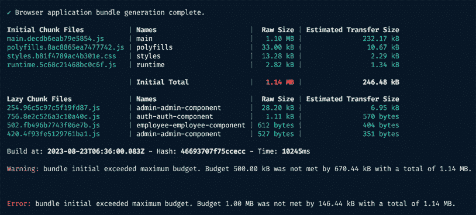

    图 12.31：main.*.js 的包大小增加到 1.10 MB

    由于我们使用 NX 作为我们的配方，我们已经有 NX 设置的预算。然而，如果您有一个常规的 Angular 应用程序（没有 NX），您需要更新`angular.json`文件以添加预算。

1.  在`start/apps/chapter12/ng-perf-budgets`文件夹内打开`project.json`文件并更新它。我们要针对的属性是`targets.build.configurations.production.budgets`。更新的代码应如下所示：

    ```js
    ...
    {
    "budgets": [
    {
    "type": "initial",
    "maximumWarning": "**800kb**",
    "maximumError": "**1mb**"
    },
    {
    "type": "anyComponentStyle",
    "maximumWarning": "2kb",
    "maximumError": "4kb"
    }
    ]
    }
    ... 
    ```

    注意，我们只为`initial`包将`maximumWarning`从`500kb`更改为`800kb`。

1.  让我们通过不在`app.component.ts`文件中导入整个库，而是使用`date-fns`包来改进我们的应用程序，代替`moment.js`。从工作区的根目录运行以下命令来安装`date-fns`包：

    ```js
    cd start && npm install --save date-fns 
    ```

1.  现在，更新`app.component.ts`文件，如下所示：

    ```js
    import { Component } from '@angular/core';
    import { Router } from '@angular/router';
    import { AuthService } from './services/auth.service';
    **import** **{ format }** **from****'date-fns'****;**
    **import** **{** **Scene** **}** **from****'three'****;**
    @Component({...})
    export class AppComponent {
      ...
      constructor() {
        **const** **scene =** **new****Scene****();**
    **console****.****log****(****format****(****new****Date****(),** **'LLL do yyyy'****));** 
    **console****.****log****(scene);**
      }
      ...
    } 
    ```

1.  再次运行`npm run build ng-perf-budgets`命令。你应该会看到包大小减少，并且构建成功生成，如下所示：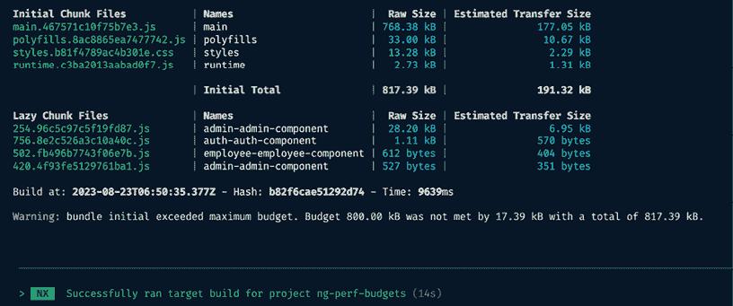

    图 12.32：使用 date-fns 和优化导入后的减少的包大小

嘣！你刚刚学会了如何在 Angular 中使用性能预算。这些预算可以根据你的配置抛出警告和错误。请注意，预算可以根据不断变化的企业需求进行修改。然而，作为工程师，我们必须谨慎地设置性能预算，以避免向最终用户发送超过一定限制的 JavaScript。

既然你已经完成了这个食谱，请查看下一节，了解它是如何工作的。

## 它是如何工作的…

Angular 性能预算是为 Angular 应用程序中各种性能指标的可接受限制设定的指南。这些预算有助于确保应用程序的性能保持在可接受的范围内，并且随着代码库的增长或变化，性能不会显著下降。你可以与之工作的最重要的性能指标是初始包大小。这是用户设备首先加载的主要 JavaScript 文件集，并且它们会被急切地加载。在这个食谱中，我们有两个问题。首先，我们使用了`moment.js`，这是一个不可*摇树*的库。这意味着如果我们导入这个库，整个库都会包含在最终的包中，而可摇树库在构建时，由构建工具移除应用中未使用的代码。我们引入的第二个问题是，我们在组件中包含了整个库`three`，它是可摇树的，但我们的导入是不准确的。我们引入这些问题是为了看到包大小增加。但正如我们所看到的，在 NX 中，我们可以使用任何 Angular 应用的`project.json`文件来管理性能预算。如果你正在使用基于 Angular CLI 的应用程序，你会在`angular.json`文件中做同样的事情。在实践中，你会使用警告阈值和错误阈值，这确保了你不会向最终用户发送巨大的 JavaScript 包。

## 参见

+   使用 Angular CLI 官方文档中的性能预算：[`web.dev/performance-budgets-with-the-angular-cli/`](https://web.dev/performance-budgets-with-the-angular-cli/)

+   *使用性能预算提升 Angular 应用性能*：[`www.codewithahsan.dev/blog/angular-performance-budgets`](https://www.codewithahsan.dev/blog/angular-performance-budgets)

# 使用 webpack-bundle-analyzer 分析包

在上一个菜谱中，我们查看为我们的 Angular 应用程序配置预算，这很有用，因为你可以知道整体包大小何时超过某个阈值，尽管你不知道代码的每一部分对最终包的贡献有多大。这就是我们所说的*分析*包，在本菜谱中，你将学习如何使用`webpack-bundle-analyzer`来审计包大小及其影响因素。

## 准备工作

我们将要工作的应用程序位于克隆仓库的`start/apps/chapter12/ng-perf-wba`目录中：

1.  在你的代码编辑器中打开代码仓库。

1.  打开终端，导航到代码仓库目录，并运行以下命令来构建项目：

    ```js
    npm run build ng-perf-wba 
    ```

    这应该会构建应用程序，你应该在终端中看到以下内容：

    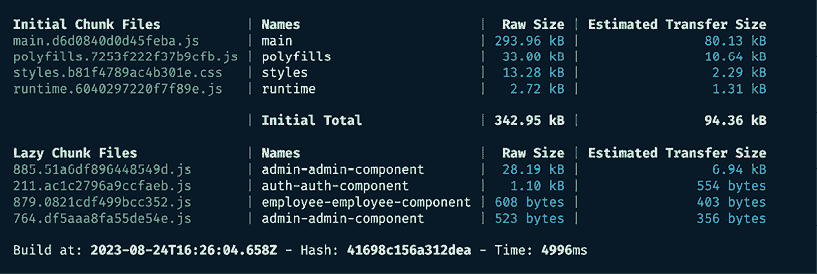

    图 12.33：ng-perf-wba 应用程序在 http://localhost:4200 上运行

现在我们已经构建了应用程序，让我们在下一节中查看菜谱的步骤。

## 如何做到这一点...

目前，我们的应用程序在包大小方面相对较小。然而，随着未来业务需求的发展，这可能会变成一个巨大的应用程序。为了本菜谱的目的，我们将故意增加包大小，然后使用`webpack-bundle-analyzer`来观察导致大包大小的包。让我们开始这个菜谱：

1.  打开`app.component.ts`文件并更新它，如下所示：

    ```js
    ...
    **import** ***** **as** **moment** **from****'../lib/moment'****;**
    **import** ***** **as****THREE****from****'three'****;**
    @Component({...})
    export class AppComponent {
      ...
      **constructor****() {**
    **const** **scene =** **new****THREE****.****Scene****();** 
    **console****.****log****(****moment****().****format****(****'MMM Do YYYY'****));**
    **console****.****log****(scene);**
    **}**
      ...
    } 
    ```

1.  现在，再次从工作区根目录运行以下命令来构建应用程序：

    ```js
    npm run build ng-perf-wba 
    ```

    你应该看到`main.*.js`文件的包大小现在大约是 1.10 MB。与原始的约 294 KB 相比，这是一个巨大的尺寸增加。因此，**初始总大小**变为 1.15 MB，构建失败，正如你在以下屏幕截图中所看到的：

    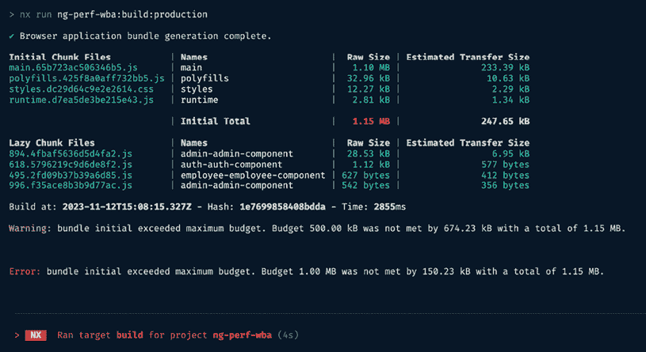

    图 12.34：由于包大小增加导致的构建失败

1.  我们首先创建一个包含 JSON 格式包信息的`stats.json`文件的构建。为此，从工作区根目录运行以下命令：

    ```js
    npm run build ng-perf-wba with-stats 
    ```

1.  现在，从工作区根目录运行以下命令，让`webpack-bundle-analyzer`读取`stats.json`文件，如下所示：

    ```js
    npx webpack-bundle-analyzer ./start/dist/apps/chapter12/ng-perf-wba/stats.json 
    ```

    这将启动一个带有包分析的服务器。你应该在你的默认浏览器中看到一个新标签页被打开，并且它看起来应该是这样的：

    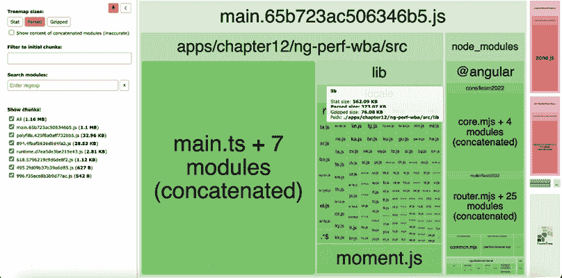

    图 12.35：使用 webpack-bundle-analyzer 进行包分析

1.  注意到`lib`文件夹占据了包大小的大部分——大约 562 KB，你可以通过在**lib**框上悬停鼠标来检查。整体包大小是 1.16 MB。让我们尝试优化包大小。让我们安装`date-fns`包，这样我们就可以用它来代替`moment.js`。从你的项目根目录运行以下命令：

    ```js
    cd start && npm install --save date-fns 
    ```

1.  现在，更新`app.component.ts`文件以使用`date-fns`包的`format`方法，而不是使用`moment().format`方法。我们还将只从`Three.js`包中导入`Scene`类，而不是导入整个库。代码应该看起来像这样：

    ```js
    ...
    import { AuthService } from './services/auth.service';
    **import** **{ format }** **from****'date-fns'****;**
    **import** **{** **Scene** **}** **from****'three'****;**
    @Component({...})
    export class AppComponent {
      ...
      constructor() {
        **const** **scene =** **new****Scene****();**
    **console****.****log****(****format****(****new****Date****(),** **'LLL do yyyy'****));** 
    **console****.****log****(scene);**
      }
      ...
    } 
    ```

1.  重复*步骤 3*和*步骤 4*以重新构建应用程序并通过`webpack-bundle-analyzer`进行分析。

    一旦`webpack-bundle-analyzer`运行，你应该会看到分析结果，如下面的屏幕截图所示。注意，我们不再有`moment.js`文件或`lib`块，整体包大小已从 1.16 MB 减少到大约 835 KB：

    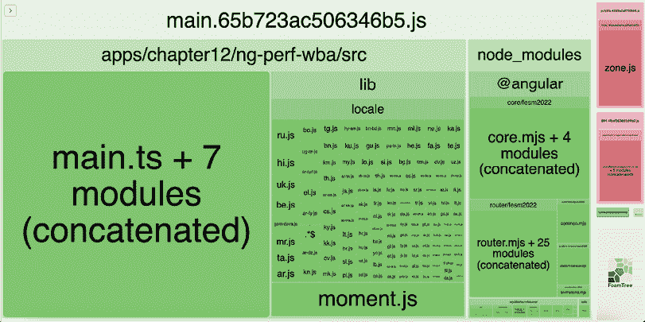

    图 12.36：优化后的包分析

哇哦！你现在已经知道如何使用`webpack-bundle-analyzer`包来审计 Angular 应用程序的包大小了。这是一个提高整体性能的好方法，因为你可以识别出导致包大小增加的块，然后优化这些包。如果你在优化前后从工作区根目录运行`npm run serve ng-perf-wba`，你会看到相同的控制台日志，这表明我们保留了现有功能并优化了包。

## 相关链接

+   开始使用 webpack：[`webpack.js.org/guides/getting-started/`](https://webpack.js.org/guides/getting-started/)

+   `webpack-bundle-analyzer`的 GitHub 仓库：[`github.com/webpack-contrib/webpack-bundle-analyzer`](https://github.com/webpack-contrib/webpack-bundle-analyzer)

# 在 Discord 上了解更多

要加入这本书的 Discord 社区——在那里你可以分享反馈、向作者提问，并了解新版本——请扫描下面的二维码：

`packt.link/AngularCookbook2e`


