# 第十三章：使用 Angular 构建 PWA

**渐进式 Web 应用**（**PWAs**）远不止是 Web 应用；它们是 Web 技术的下一进化阶段。结合了 Web 和移动应用的最佳特性，PWAs 在不理想的网络条件下也能提供无与伦比的用户体验。但真正让它们引人入胜的是它们的优雅降级——虽然它们利用了现代浏览器的全部功能，同时也确保在旧浏览器中提供无缝的核心体验。

在本章中，我们将通过 Angular 的视角深入探索 PWA 的世界。Angular 内置了 PWA 支持，使其成为构建健壮和性能卓越的 Web 应用的理想选择。你将学习如何将你的应用构建为可安装、功能强大、快速且可靠的渐进式 Web 应用。以下是本章将要涵盖的食谱：

+   使用 Angular CLI 将现有的 Angular 应用转换为 PWA

+   修改你的 PWA 的主题颜色

+   在你的 PWA 中使用暗黑模式

+   在你的 PWA 中提供定制的可安装体验

+   使用 Angular 服务工作者进行预缓存请求

+   为你的 PWA 创建一个应用外壳

# 技术要求

对于本章的食谱，请确保你的设置符合 'Angular-Cookbook-2E' GitHub 仓库中的 'Technical Requirements'。有关设置详情，请访问：[`github.com/PacktPublishing/Angular-Cookbook-2E/tree/main/docs/technical-requirements.md`](https://github.com/PacktPublishing/Angular-Cookbook-2E/tree/main/docs/technical-requirements.md)。本章的起始代码位于 [`github.com/PacktPublishing/Angular-Cookbook-2E/tree/main/start/apps/chapter13`](https://github.com/PacktPublishing/Angular-Cookbook-2E/tree/main/start/apps/chapter13)。

# 使用 Angular CLI 将现有的 Angular 应用转换为 PWA

**PWA** 包含几个引人入胜的组件，其中两个突出的特性是服务工作者和 Web 清单文件。服务工作者在缓存静态资源和处理缓存请求中扮演着至关重要的角色。

同时，Web 清单文件包含诸如应用图标和应用的主体颜色等关键信息。在本指南中，我们将把现有的 Angular 应用转换为 PWA。如果你从头开始创建一个新的 Angular 应用，这些原则同样适用。在整个演练过程中，我们将转换一个现有的 Angular 应用，突出显示所做的更改，并使用 `@angular/pwa` 包展示转换过程。这个包不仅使 PWA 功能化，还促进了静态资源的有效缓存。

## 准备工作

我们将要工作的应用位于克隆的仓库中的 `start/apps/chapter13/ng-pwa-conversion` 目录下。这不是我们 NX 工作空间的一部分，而是一个独立的 **Angular** 应用，拥有自己的 `package.json`、`node_modules` 等。按照以下步骤开始：

1.  在你的代码编辑器中打开代码仓库。

1.  打开终端并导航到克隆的代码仓库文件夹。

1.  导航到`start/apps/chapter13/ng-pwa-conversion`并运行以下命令以提供项目服务：

    ```js
    npm run build && npx http-server dist/ng-pwa-conversion 
    ```

    在浏览器中打开一个新标签页，并导航到`http://localhost:8080`。你应该能看到以下内容：

    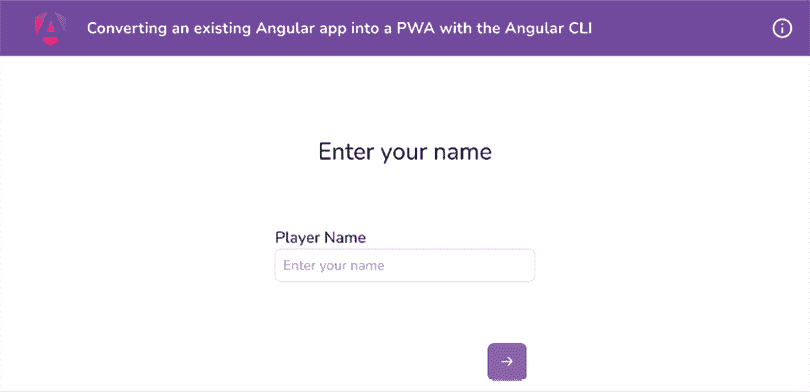

    图 13.1：ng-pwa-conversion 应用在 http://localhost:8080 上运行

现在我们已经在本地运行了应用，接下来让我们看看下一节中食谱的步骤。

## 如何操作...

我们正在处理的应用是使用*第九章*中提到的 Angular CDK 构建的游戏，即*Angular 和 Angular CDK*。你可以输入你的名字，然后猜测骰子的下一个值，并获得分数排行榜。排行榜的值是通过本地存储持久化的。但是，该应用还不是 PWA。让我们将其转换为 PWA：

1.  首先，让我们看看我们的应用是否完全支持离线工作，因为这是 PWA 的一个特性。打开应用的**Chrome 开发者工具**。转到**网络**选项卡，并将**限制**改为**离线**，如下所示：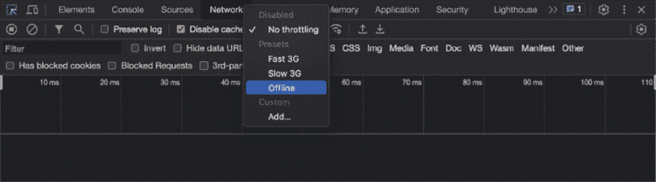

    图 13.2：将网络限制改为离线以查看离线体验

1.  确保勾选了**禁用缓存**选项。

1.  现在，通过从终端退出进程来停止`http`服务器。完成后，刷新应用的页面。你应该能看到应用不再工作，如图所示：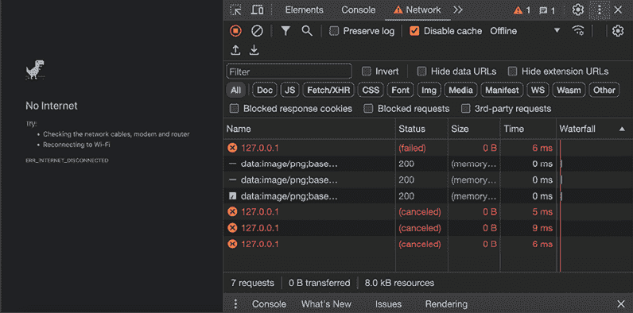

    图 13.3：离线时应用无法工作

1.  要将此应用转换为 PWA，打开一个新的终端窗口/标签页，并确保你位于`start/apps/chapter13/ng-pwa-conversion`文件夹内。一旦进入，运行以下命令：

    ```js
    ng add @angular/pwa 
    ```

    在命令行进程结束的过程中，你应该会看到创建和更新了一大批文件。

1.  现在，通过运行`npm run build && npx http-server dist/ng-pwa-conversion`再次构建并提供服务应用。完成后，导航到`http://localhost:8080`。

1.  现在，确保你已经关闭了限制，通过切换到**网络**选项卡并将选择设置为**无限制**，如图*图 13.4*所示。同时，注意**禁用缓存**选项已被关闭：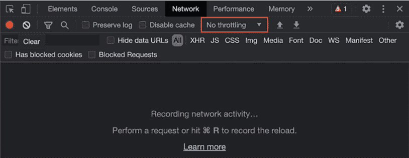

    图 13.4：关闭网络限制

1.  现在刷新一次应用。你应该能看到应用正在运行，并且网络日志显示从服务器加载了诸如 JavaScript 文件等资源，如图*图 13.5*所示：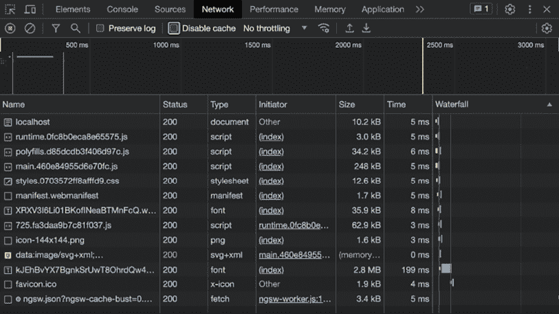

    图 13.5：从源（Angular 服务器）下载的资源

1.  现在，再次刷新应用一次，你会看到相同的资源现在是通过服务工作者从缓存中下载的，如图*图 13.6*所示：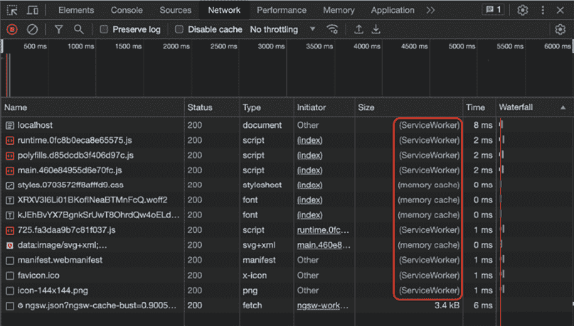

    图 13.6：使用服务工作者从缓存中下载的资源

1.  现在是我们一直等待的时刻。将网络限制改为**离线**以进入**离线**模式并刷新应用程序。你应该仍然看到应用程序在**离线**模式下工作，这是由于服务工作者，如图*图 13.7*所示：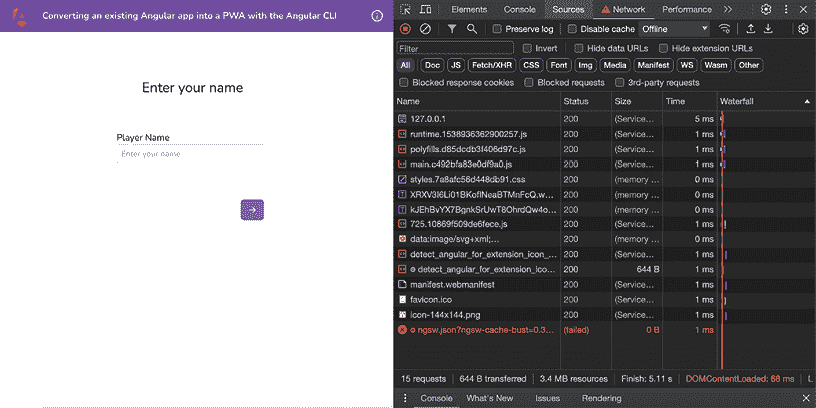

    图 13.7：使用服务工作者作为 PWA 的离线运行的 Angular 应用程序

1.  现在你可以将这个 PWA 安装到你的机器上。由于我使用的是 MacBook，它被安装为 Mac 应用程序。如果你使用 Chrome，安装选项应该在地址栏附近，如图*图 13.8*所示：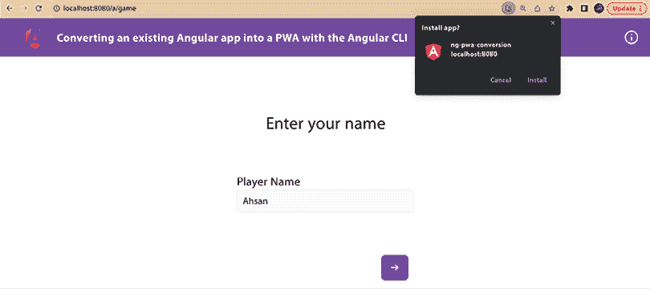

    图 13.8：从 Chrome 安装 Angular PWA

    哇！仅仅通过使用`@angular/pwa`包，我们无需自己进行任何配置，就将现有的 Angular 应用程序转换成了 PWA。现在我们能够离线运行我们的应用程序，并且可以在我们的设备上将其安装为 PWA。见图*图 13.9*来查看应用程序的外观——就像 Mac OS X 上的原生应用程序一样：

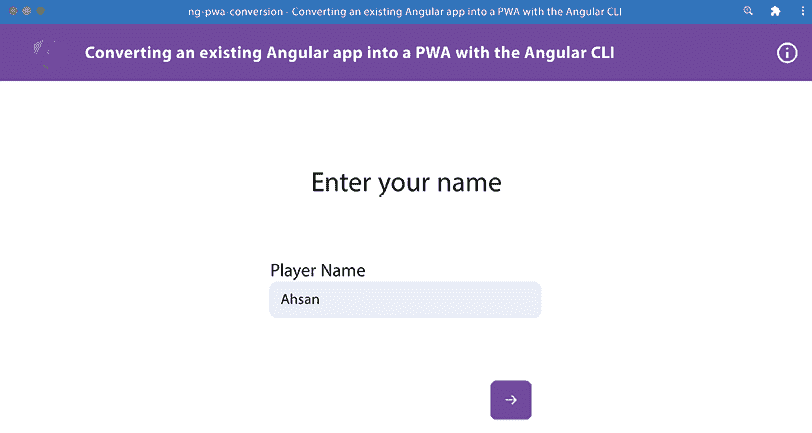

图 13.9：我们的 Angular PWA 作为 Mac OS X 上的原生应用程序的外观

好吧，*对吧？* 现在你已经知道了如何使用 Angular CLI 构建 PWA，请查看下一节以了解它是如何工作的。

## 它是如何工作的…

Angular 核心团队和社区在`@angular/pwa`包以及通常的`ng add`命令方面做了惊人的工作，该命令允许我们使用 Angular 模板添加不同的包到我们的应用程序中。在这个配方中，当我们运行`ng add @angular/pwa`时，它使用模板生成应用程序图标以及网络应用程序清单。如果你查看更改的文件，你可以看到新文件，如图*图 13.10*所示：

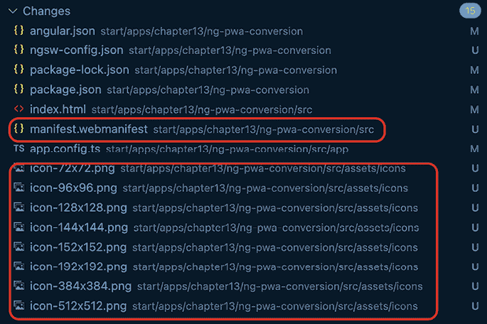

图 13.10：网络清单文件和应用程序图标文件

`manifest.webmanifest`文件是一个包含 JSON 对象的文件。该对象定义了 PWA 的清单并包含一些信息。信息包括应用程序的名称、简称、主题颜色以及不同设备的图标配置。想象一下这个 PWA 安装在你的安卓手机上。你需要在主抽屉中有一个图标来点击以打开应用程序。此文件包含有关根据不同设备尺寸使用哪个图标的信息。

我们还看到了文件`ngsw-config.json`，它包含服务工作者的配置。在幕后，当`ng add`命令运行模板时，它也在我们的项目中安装了`@angular/service-worker`包。如果你打开`app.config.ts`文件，你会看到以下代码来注册我们的服务工作者：

```js
...
**import** **{ provideServiceWorker }** **from****'@angular/service-worker'**;

export const appConfig: ApplicationConfig = {
  providers: [provideRouter(appRoutes,
  withEnabledBlockingInitialNavigation(), withHashLocation()),
    **provideServiceWorker****(****'ngsw-worker.js'****, {**
**enabled****: !****isDevMode****(),**
**registrationStrategy****:** **'registerWhenStable:30000'**
**})**],
}; 
```

让我们分解代码来理解这里发生了什么。在这里，我们正在创建独立应用程序的配置，以及一些提供者。我们已经使用了`provideRouter`方法来提供应用程序的所有路由。在配方中，我们添加了`provideServiceWorker`方法来为我们注册一个新的服务工作者。它需要两个参数：

+   第一个参数是服务工作者脚本的文件名，`'ngsw-worker.js'`。这是内置的 Angular 服务工作者，它处理缓存和其他离线行为。

+   第二个参数是服务工作者的配置对象。让我们回顾一下这个配置对象的属性：

    +   `enabled: !isDevMode()`告诉应用程序仅在应用程序不在开发模式下时启用服务工作者。

    +   `registrationStrategy:'registerWhenStable:3000'`指定了注册服务工作者的策略。在这种情况下，服务工作者将在应用稳定（没有正在进行的任务）30 秒后注册。

代码注册了一个名为`ngsw-worker.js`的新服务工作者文件。此文件使用`ngsw-config.json`文件中的配置来决定缓存哪些资源以及使用哪些策略。这是通过`angular.json`文件中的`ngswConfigPath`属性链接的。请注意，我们拥有的应用程序是一个独立的应用程序。这意味着我们没有为应用程序的引导过程创建`NgModule`。如果这是一个非独立应用程序，我们会在`app.module.ts`文件中看到这些更改。

现在你已经知道了食谱是如何工作的，请查看下一节以获取更多阅读内容。

## 参见

+   Angular 服务工作者简介：[`angular.io/guide/service-worker-intro`](https://angular.io/guide/service-worker-intro)

+   什么是 PWA？：[`web.dev/what-are-pwas/`](https://web.dev/what-are-pwas/)

# 修改你的 PWA 主题颜色

在之前的食谱中，我们学习了如何将 Angular 应用转换为 PWA。当我们这样做时，`@angular/pwa`包会创建一个带有默认主题颜色的 web 应用清单文件，如图*图 13.9*所示。然而，几乎每个 web 应用都有自己的品牌和风格。如果你想根据你的品牌定制 PWA 的标题栏，这就是你的食谱。我们将学习如何修改 web 应用清单文件来自定义 PWA 的主题颜色。

## 准备工作

我们将要工作的应用位于克隆仓库中的`start/apps/chapter13/ng-pwa-theme-color`：

1.  在你的代码编辑器中打开代码仓库。

1.  打开终端，导航到克隆的代码仓库文件夹，并从工作区的根目录运行以下命令（以生产模式运行项目）：

    ```js
    npm run serve:static chapter13 ng-pwa-theme-color 5300 
    ```

    这应该在新的浏览器标签页中打开应用，地址为`https://localhost:5300`。

1.  按照如图*图 13.8*所示安装应用程序。

    这应该会在原生操作系统窗口中打开应用，你应该会看到以下内容：

    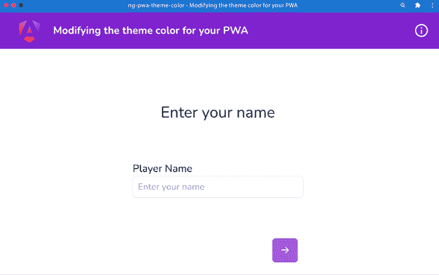

    图 13.11：ng-pwa-theme-color 应用作为 PWA 运行

现在我们已经运行了应用，让我们在下一节中查看食谱的步骤。

## 如何做到这一点...

如你在*图 13.11*中看到的，应用的头部的颜色与应用的本地头部（或工具栏）略有不同。由于这种差异，应用看起来有点奇怪。我们将修改 web 应用清单来更新主题颜色。让我们开始吧：

1.  在你的编辑器中打开 `src/manifest.webmanifest` 文件，并按照以下方式更改主题颜色：

    ```js
    {
    "name": "ng-pwa-theme-color",
    "short_name": "ng-pwa-theme-color",
    "theme_color": "#7E22CE",
      ...
    } 
    ```

1.  我们还在我们的 `index.html` 文件中设置了 `theme-color`。默认情况下，它比 web 应用程序清单文件具有优先级。因此，我们需要更新它。打开 `index.html` 文件，并按照以下方式更新：

    ```js
    <!DOCTYPE html>
    <html lang="en">
    <head>
        ...
        <link rel="manifest" href="manifest.webmanifest">
    **<****meta****name****=****"theme-color"****content****=****"#7E22CE"****>**
    </head>
    <body>
        ...
      </body>
    </html> 
    ```

1.  再次打开 PWA 并按照图 13.12 所示卸载它。当提示时，确保勾选表示 **也从 Chrome 中清除数据 (...)** 的复选框：![img/B18469_13_12.png]

    图 13.12：卸载 ng-pwa-theme-color 应用程序

1.  现在，再次使用以下命令构建应用程序：

    ```js
    npm run build ng-pwa-theme-color && npm run serve:static chapter13 ng-pwa-theme-color 5300 
    ```

1.  现在，转到 `http://localhost:5300` 并按照图 13.8 所示再次作为 PWA 安装应用程序。

1.  PWA 应该已经打开。如果没有，从你的应用程序中打开它，你应该看到更新的主题颜色，如图 13.13 所示：![img/B18469_13_13.png]

    图 13.13：更新主题颜色后的 PWA

Awesomesauce! 你刚刚学会了如何更新 Angular PWA 的主题颜色。现在你已经完成了这个食谱，请查看下一节以获取更多阅读材料。

## 参考信息

+   使用 Angular CLI 创建 PWA：[`web.dev/creating-pwa-with-angular-cli/`](https://web.dev/creating-pwa-with-angular-cli/)

# 在你的 PWA 中使用暗黑模式

在现代设备和应用程序的时代，最终用户的偏好也发生了一些变化。随着屏幕和设备使用量的增加，健康成为了一个主要关注点。现在几乎所有的屏幕设备都支持暗黑模式。考虑到这一点，如果你正在构建一个 web 应用程序，你可能希望为它提供暗黑模式支持。如果它是一个以原生应用程序形式呈现的 PWA，那么责任就更大了。在这个食谱中，你将学习如何为你的 Angular PWA 提供暗黑模式。你将学习三种不同的方法来实现暗黑模式样式，包括 `prefers-color-scheme`（这是默认/原生的 CSS 方法）以及两种使用 Tailwind CSS 实现它的方法。

## 准备工作

我们将要工作的应用程序位于克隆的仓库中的 `start/apps/chapter13/ng-pwa-dark-mode`：

1.  在你的代码编辑器中打开代码仓库。

1.  打开终端，导航到克隆的代码仓库文件夹，并从工作区的根目录运行以下命令以在生产模式下运行项目：

    ```js
    npm run serve:static chapter13 ng-pwa-dark-mode 6400 
    ```

    这应该在新的浏览器标签页中打开应用程序，在 `https://localhost:6400`。

1.  按照图 13.8 所示安装应用程序。

    这应该在原生操作系统窗口中打开应用程序，你应该看到以下内容：

    ![img/B18469_13_14.png]

    图 13.14：ng-pwa-dark-mode 应用程序在 http://localhost:6400 上运行

1.  现在，确保你的机器上启用了 **暗黑** 主题。如果你正在运行 Mac OS X，你可以打开 **设置** | **通用** 并选择 **暗黑** 外观，如图 13.15 所示：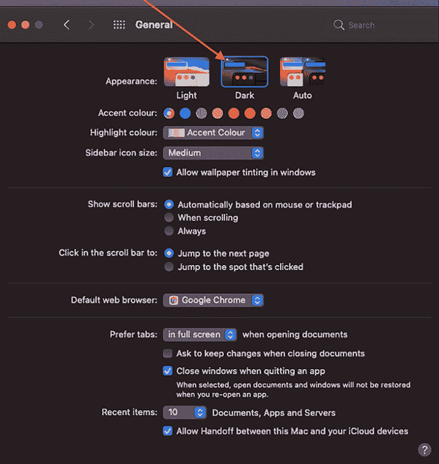

    图 13.15：在 Mac OS X 中将系统外观更改为暗黑模式

如果你现在运行应用程序，你应该能够看到应用程序看起来与*图 13.4*中显示的相同。然而，对于暗色模式，我们不应该有白色背景等。

现在我们已经将 PWA 作为原生应用程序运行，并且将**暗色**模式应用于系统，让我们在下一节中查看食谱的步骤。

## 如何做到这一点...

如你所见，我们的 Angular 应用程序目前还没有完全支持暗色模式。也就是说，UI 仍然太亮，看起来与亮色模式下的完全一样。我们将从以开发模式提供服务应用程序并添加暗色模式的不同颜色开始。让我们开始吧：

1.  通过运行以下命令以开发模式提供服务应用程序：

    ```js
    npm run serve ng-pwa-dark-mode 
    ```

    这应该在新的浏览器标签页中在`http://localhost:4200`上为应用程序提供服务。

1.  现在，打开`styles.scss`文件以使用`prefers-color-scheme`媒体查询。我们将为我们的全局 CSS 变量使用不同的值来为暗色模式创建不同的视图。更新文件如下：

    ```js
     @media (prefers-color-scheme: dark) {
      html, body {
        background-color: rgb(30 41 59);
      }
    } 
    ```

    如果你再次在浏览器标签页中刷新应用程序，你会看到背景已更改，但文本仍然是暗色且不易看清，如图*图 13.16*所示：

    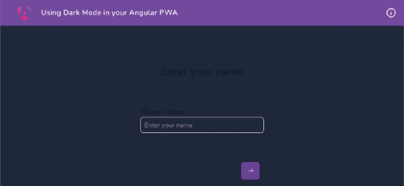

    图 13.16：暗色文本和暗色背景用于暗色模式

    为了修复样式，我们需要为必要的元素分别提供暗色模式的样式。

1.  由于我们正在使用 Tailwind CSS，我们将使用 Tailwind 将暗色模式应用于输入标签和输入元素的方式。更新`src/app/game/game.component.html`如下：

    ```js
    <app-game-stepper [linear]="true">
    <cdk-step...>
        ...
        <form ...>
    <div ...>
    <label for="nameInput" class="form-label **dark:text-white**">
      Player Name
      </label>
    <input
     type="text"
     formControlName="name"
     class="form-control dark:!text-white dark:placeholder:!text-           white"
     id="nameInput"
     placeholder="Enter your name"
            />
            ...
    </app-game-stepper> 
    ```

    注意，对于输入，我们在`dark:!text-white`语句中使用感叹号。这是为了标记`text-white Tailwind` CSS 类为重要，从而使得相关的 CSS 样式具有`!`重要声明。

1.  现在让我们将`game-stepper.component.html`文件更改为更新步骤标题的样式，如下所示：

    ```js
    <div class="game-stepper">
    <header>
    <h3 class="text-2xl **dark:text-white**" *ngIf="selected">
          ...
        </h3>
    </header>
    ... 
    ```

    如果你刷新应用程序，你应该能够看到标题为白色，因为我们正在设备上使用暗色模式，如下所示：

    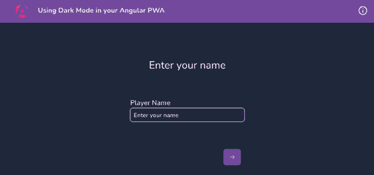

    图 13.17：暗色模式中标题和输入颜色已修复

1.  现在，让我们修复投掷屏幕上的编号卡片。你可以看到，在暗色模式下，卡片的背景不可见，如图*图 13.18*所示：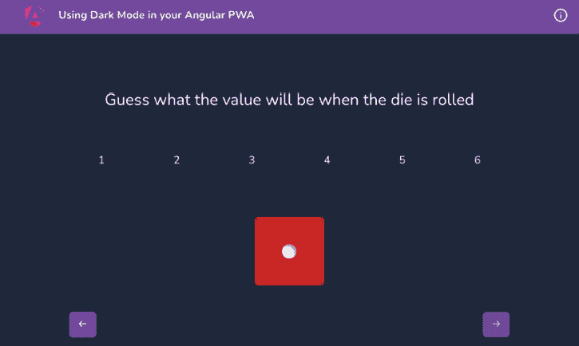

    图 13.18：卡片背景在暗色模式下不可见

1.  让我们使用 Chrome DevTools 来模拟暗色和亮色模式，因为它提供了这样做的一种非常好的方式。打开 Chrome DevTools，然后打开**命令**菜单。在 macOS X 上，按键是*Cmd + Shift + P*。在 Windows 上，它们是*Ctrl + Shift + P*。然后输入`Render`并选择**显示渲染**选项，正如我们在*图 13.19*中看到的那样：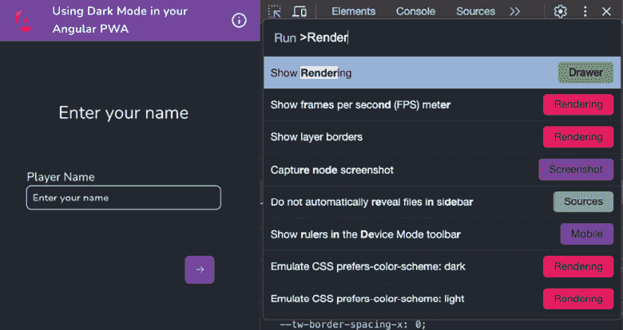

    图 13.19：使用显示渲染选项打开渲染视图

1.  现在，在**渲染**选项卡中，切换**prefers-color-scheme**模拟亮色和暗色模式，如图*图 13.20*所示：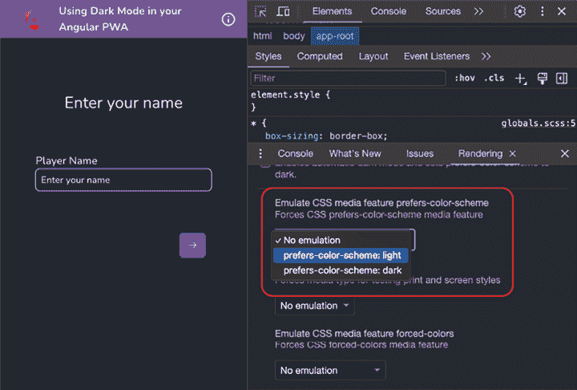

    图 13.20：模拟 prefers-color-scheme 模式

1.  现在让我们更新编号卡的背景。由于这些样式是从 `.scss` 文件中应用的，我们将使用 Tailwind CSS 的另一种技术来在 `.scss` 文件中应用样式。按照以下方式更新 `value-guesser.component.scss`:

    ```js
    ...
    .values {
      ...
      &__value-box {
        width: 5rem;
        height: 5rem;
        color: #fff;
        **@apply****dark****:bg-slate-****500****;**
        ...
      }
    } 
    ```

1.  如果你现在查看掷骰子视图，你应该会看到更改后的颜色，如图 *图 13.21* 所示：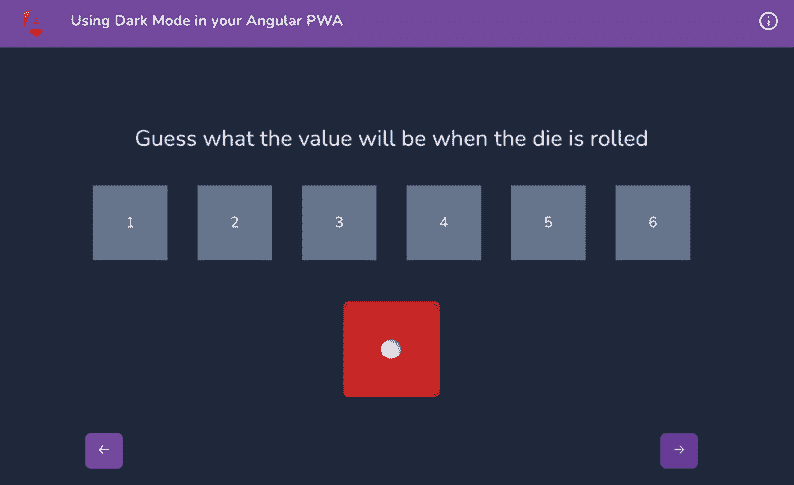

    图 13.21：暗黑模式下的卡片背景

1.  现在测试两种模式使用 Chrome 开发者工具。

1.  通过打开它并从 **更多** 菜单中选择 **卸载** 选项来卸载现有的 PWA，如图 *图 13.12* 所示。当提示时，请确保勾选表示 **也从 Chrome 中清除数据 (...)** 的复选框。

1.  运行以下命令以在浏览器中提供生产应用，然后导航到 `http://localhost:6400`:

    ```js
    npm run serve:static chapter13 ng-pwa-dark-mode 6400 
    ```

    当它在浏览器中打开时，你可能需要清除你的缓存。你可以在 Windows 上按 *Ctrl + Shift + R*，在 Mac OS X 上按 *Cmd + Shift + R* 来进行强制刷新。

1.  等待几秒钟，直到地址栏中出现 **安装** 按钮。然后像 *图 13.8* 中所示那样安装 PWA。

1.  一旦你现在运行了 PWA，你应该会看到暗黑模式视图，如图 *图 13.22* 所示，如果你的系统外观设置为暗黑模式：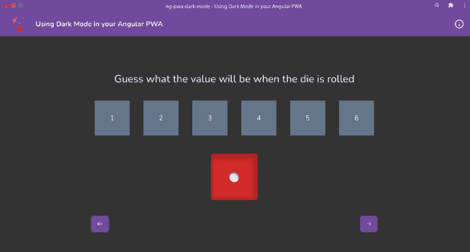

    图 13.22：我们的 PWA 支持开箱即用的暗黑模式

太棒了！如果你将系统外观从暗黑模式切换到亮模式或反之亦然，你应该会看到 PWA 反映适当的颜色。你现在知道三种实现暗黑模式样式的方法，包括原生 CSS 方法和 Tailwind CSS 方法。现在你知道如何在你的 PWA 中支持暗黑模式，请参考下一节以查看进一步阅读的链接。

## 参见

+   偏好颜色方案：[`web.dev/prefers-color-scheme/`](https://web.dev/prefers-color-scheme/)

+   使用 `prefers-color-scheme` 颜色方案：[`web.dev/color-scheme/`](https://web.dev/color-scheme/)

# 在你的 PWA 中提供自定义的可安装体验

我们知道 PWA 是可安装的。这意味着它们可以像原生应用一样安装到你的设备上。然而，当你第一次在浏览器中打开应用时，它完全取决于浏览器如何显示 **安装** 选项；这因浏览器而异。它也可能不明显或难以辨认。此外，你可能想在应用的一些特殊点显示 **安装** 提示，而不是在应用启动时，考虑在应用内的一个特定、用户友好的点显示安装提示，而不是直接在应用启动时，因为这可能会被一些用户视为烦人。幸运的是，我们有一种方法为我们的 PWA 提供自定义的对话框/提示来选择安装选项。这正是我们将在这道菜谱中学习的。

## 准备工作

我们将要工作的应用位于克隆的仓库中的 `start/apps/chapter13/ng-pwa-cust-installation` 目录下：

1.  在你的代码编辑器中打开代码仓库。

1.  打开终端，导航到克隆的代码仓库文件夹，并运行以下命令（从工作区的根目录）以在生产模式下运行项目：

    ```js
    npm run serve:static chapter13 ng-pwa-cust-installation 7000 
    ```

    这应该在新的浏览器标签页中打开应用程序，地址为`https://localhost:7000`。

1.  按照图 13.8 所示安装应用程序。

    这应该在原生 OS 窗口中打开应用程序，你应该会看到以下内容：

    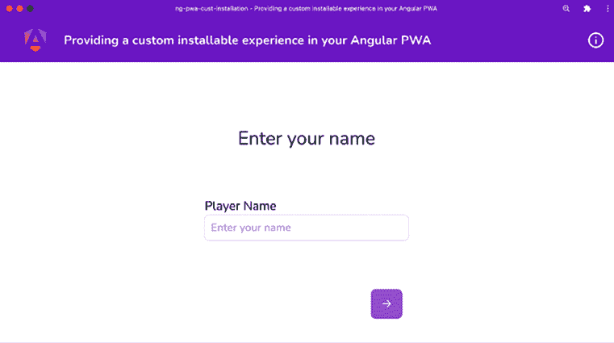

    图 13.23：ng-pwa-cust-installation 在 http://localhost:7000 上运行

现在我们已经运行了应用程序，让我们在下一节中查看食谱的步骤。

## 如何做到这一点...

我们有一个 Dice Guesser 应用程序，在这个应用程序中你可以掷骰子并猜测输出。对于这个食谱，我们将阻止默认的安装提示，并且只有在用户做出了正确的猜测时才显示它。让我们开始吧：

1.  首先，创建一个服务，将在下一步显示我们的自定义可安装提示。在项目根目录中运行以下命令：

    ```js
    cd start && nx g service services/installable-prompt --project ng-pwa-cust-installation 
    ```

    当被要求时，使用`@schematics/angular:service`脚手架。

1.  接下来，打开创建的文件`installable-prompt.service.ts`，并按以下方式更新代码：

    ```js
    import { Injectable } from '@angular/core';

    declare global {
      interface WindowEventMap {
        beforeinstallprompt: BeforeInstallPromptEvent;
      }
    }
    @Injectable({
      providedIn: 'root'
    })
    export class InstallablePromptService {
      installPromptEvent!: BeforeInstallPromptEvent;
      constructor() {
        window.addEventListener('beforeinstallprompt',
          this.handleInstallPrompt.bind(this))
      }

      handleInstallPrompt(ev: BeforeInstallPromptEvent) {
        ev.preventDefault();
        this.installPromptEvent = ev;
        console.log('before install prompt event fired', ev);
        window.removeEventListener('beforeinstallprompt',
          this.handleInstallPrompt)
      }
    } 
    ```

    你会注意到 TypeScript 对我们的代码并不满意。

1.  在这一步，我们需要定义`BeforeInstallPrompt`事件类型。让我们在`src`文件夹内创建一个名为`types`的文件夹。创建一个名为`installation-prompt.d.ts`的文件，并将以下代码添加到其中：

    ```js
    interface BeforeInstallPromptEvent extends Event {
      readonly platforms: string[];
      readonly userChoice: Promise<{
        outcome: "accepted" | "dismissed";
        platform: string;
      }>;
      prompt(): Promise<void>;
    } 
    ```

1.  我们必须在`tsconfig.json`中添加`types`文件夹，以便我们可以加载类型。更新`tsconfig.json`文件如下：

    ```js
    {
    "compilerOptions": {
        ...,
    "noFallthroughCasesInSwitch": true,
    **"typeRoots"****:****[**
    **"./src/types"**
    **]**
    },
      ...
    } 
    ```

1.  接下来，让我们构建我们将向用户显示以触发安装提示的自定义安装横幅。更新`app.component.html`并在`<main>`标签之后添加以下代码，如下所示：

    ```js
    ...
    <main class="content" role="main">
    <router-outlet></router-outlet>
    </main>
    **<****div****id****=****"installPrompt"****class****=****"fixed inset-x-0 bottom-10**
    **p-4"****>**
    **<****div****class****=****"rounded-lg bg-purple-600 px-4 py-3 text-**
    **white shadow-lg"****>**
    **<****p****class****=****"text-center text-sm font-medium"****>**
    **Love the Dice Game?**
    `**>**` ****Install it!**
    **</****a****>**
    **</****p****>**
    **</****div****>**
    **</****div****>**** 
    ```

***   现在再次使用以下命令运行应用程序以查看安装提示，如图 13.24 所示：

    ```js
    npm run serve:static chapter13 ng-pwa-cust-installation 7000 
    ```

    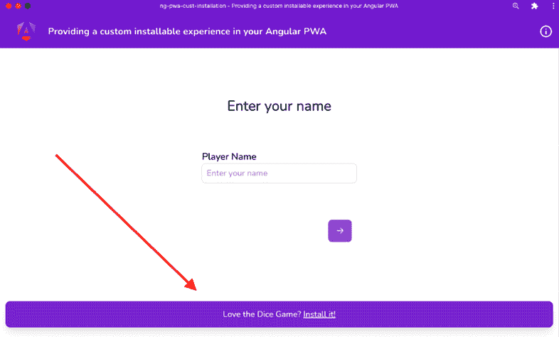

    图 13.24：在 PWA 中显示的自定义安装提示

    有时你会因为在同一端口上运行多个 PWA 而看到应用程序的缓存版本，例如。在这种情况下，打开 Chrome 开发者工具，转到**应用程序**标签，从左侧菜单中选择**服务工作者**选项，并检查**绕过网络**选项。

**1. 我们现在将在`InstallablePromptService`类内部创建一个`signal`，根据这个`signal`我们将显示或隐藏自定义安装横幅。更新`installable-prompt.service.ts`文件如下：

    ```js
    import { Injectable, **signal** } from '@angular/core';
    ...
    export class InstallablePromptService {
      installPromptEvent!: BeforeInstallPromptEvent;
      **isPromptBannerShown =** **signal****(****false****);**
    constructor() {
        ...
      }
    } 
    ```

1.  让我们在应用程序组件中导入`InstallationPromptService`类，以便我们可以在自定义安装横幅的模板中使用它。更新`app.component.ts`文件如下：

    ```js
    ...
    import { Component, **inject** } from '@angular/core';
    ...
    **import** **{** **InstallablePromptService** **}** **from****'./services/installable-prompt.service'****;**

    ...
    export class AppComponent {
      **promptService =** **inject****(****InstallablePromptService****);**
    } 
    ```

1.  现在更新模板以使用应用程序组件中注入的`InstallablePromptService`的`signal`。更新`app.component.html`文件如下：

    ```js
    ...

    <main class="content" role="main">
    <router-outlet></router-outlet>
    </main>
     @if(promptService.isPromptBannerShown()) {
      <div id="installPrompt" class="fixed inset-x-0
    bottom-10 p-4">
        ...
      </div>
    } 
    ```

    通过运行`npm run serve:static chapter13 ng-pwa-cust-installation 7000`来重新启动服务器，你会注意到自定义安装横幅不再显示。这是因为现在当用户正确猜测分数时，我们必须在`InstallationPromptService`类中翻转`signal`。

1.  通过打开它并从**更多**菜单中选择**卸载**选项来卸载现有的 PWA，如图*图 13.12*所示。当提示时，请确保勾选表示**也从 Chrome 中清除数据(...)**的复选框。

1.  更新`src/app/game/game.component.ts`文件，以翻转`signal`，如下所示：

    ```js
    import { InstallablePromptService } from '../services/installable-prompt.service';
    ...
    export class GameComponent {
      ...
      leaderboardService = inject(LeaderboardService);
      promptService = inject(InstallablePromptService);
      ...

      showResult(diceSide: IDiceSide) {
        ...
        if (!this.isCorrectGuess) {
          return;
        }
        if (this.promptService.installPromptEvent) {
          this.promptService.isPromptBannerShown.set(true);
        }
        ...
      }
    } 
    ```

    如果你现在再次运行应用程序，如*步骤 6*所示，猜测骰子的点数，并且你猜对了，你应该能看到自定义安装横幅，如图*图 13.25*所示：

    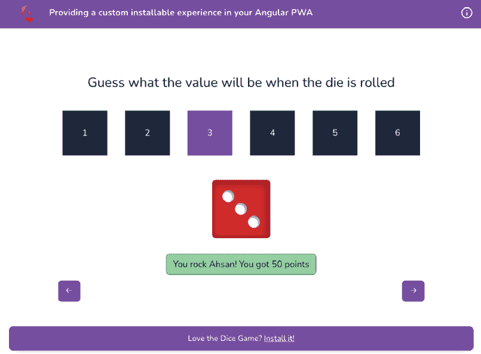

    图 13.25：猜测后显示的自定义安装横幅

1.  现在我们将实现当从自定义安装横幅中点击**安装它！**链接时会发生什么。在`installable-prompt.service.ts`文件中创建一个新方法，如下所示：

    ```js
    ...
    export class InstallablePromptService {
      ...

      handleInstallPrompt(ev: BeforeInstallPromptEvent) {...}

      **async****showInstallPrompt****() {**
    **if** **(!****this****.****installPromptEvent****) {**
    **return****;**
    **}**
    **await****this****.****installPromptEvent****.****prompt****();**
    **const** **{ outcome } =**
    **await****this****.****installPromptEvent****.****userChoice****;**
    **console****.****log****(****'The choice of user is '****, outcome);**
    **this****.****isPromptBannerShown****.****set****(****false****);**
    **}**
    } 
    ```

1.  我们现在将从自定义安装横幅调用此方法以显示浏览器的安装提示。更新`app.component.html`文件，如下所示：

    ```js
    ...
    <main class="content" role="main">
    <router-outlet></router-outlet>
    </main>
    <div id="installPrompt" *ngIf=
     "promptService.isPromptBannerShown()"
    class="fixed inset-x-0 bottom-4 p-4">
    <div class="rounded-lg bg-purple-600 
    px-4 py-3 text-white shadow-lg">
    <p class="text-center text-sm font-medium">
          Love the Dice Game?
          <a **(****click****)=****"promptService.showInstallPrompt()"**
     href="#" class="inline-block underline">
            Install it!
          </a>
    </p>
    </div>
    </div> 
    ```

    现在，如果你在浏览器中重新运行应用程序并猜测骰子的下一个值，你可以点击**安装它！**链接来查看浏览器提示，如图*图 13.26*所示：

    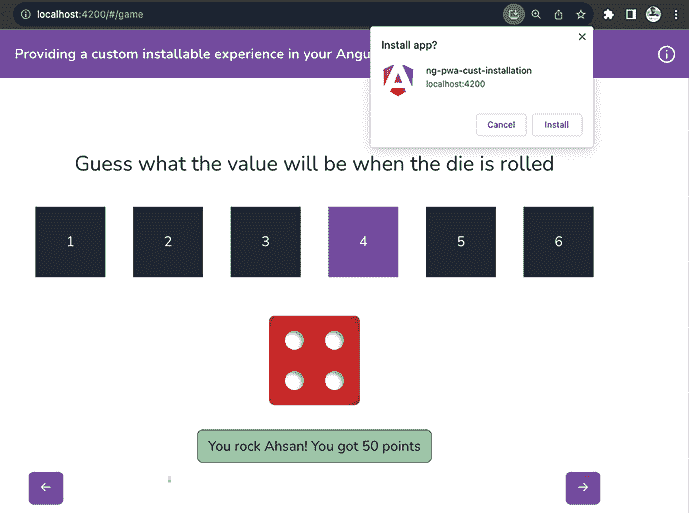

    图 13.26：浏览器安装提示正在显示

1.  最后，我们不想在应用程序作为 PWA 运行时显示自定义安装横幅。而现在它确实如此。为了解决这个问题，我们将在`app.component.scss`中添加一些样式，如下所示：

    ```js
    @media all and (display-mode: standalone) {
      #installPrompt {
        display: none !important;
      }
    } 
    ```

    如果你现在安装 PWA 并正确猜测骰子的下一个值，你将不再看到自定义安装横幅。

太棒了！你现在可以通过安装和卸载 PWA 几次来玩转应用程序，并尝试用户选择安装或不安装应用程序的所有组合。这全是乐趣和游戏。现在你了解了如何为 Angular PWA 实现自定义安装横幅，接下来继续下一节了解它是如何工作的。

## 它是如何工作的…

这个食谱的核心是`beforeinstallprompt`事件。这是一个标准浏览器事件，在 Chrome、Firefox、Safari、Opera、UC 浏览器（Android 版本）和三星 Internet 的最新版本中都有支持，也就是说，几乎所有的主流浏览器都支持这个事件。该事件有一个`prompt`方法，它会在设备上显示浏览器的默认提示。在食谱中，我们创建`InstallablePromptService`并将事件存储在一个名为`installPromptEvent`的属性中。这样我们就可以在用户猜对了骰子滚动值后按需使用它。请注意，一旦我们收到`beforeinstallprompt`事件，我们就从`window`对象中移除事件监听器，所以我们只保存一次事件。那就是应用开始的时候。如果用户选择不安装应用，我们不会在同一个会话中再次显示提示。然而，如果用户刷新应用，他们仍然会在第一次正确猜测时收到一次提示。我们可以更进一步，将这个状态保存在`localStorage`中，以避免页面刷新后再次显示提示，但这不是本食谱的一部分。

对于自定义安装横幅，我们使用基于 Tailwind CSS 的模板。请注意，在自定义安装横幅上，我们有一个链接。当我们点击这个链接时，`InstallablePromptService`类的`showInstallPrompt`方法会被调用。在这个方法中，我们使用事件，即`this.installPromptEvent`属性的`prompt`方法来显示浏览器的提示。请注意，在我们显示浏览器的提示后，我们将信号`isPromptBannerShown`的值设置为`false`，这样就会隐藏自定义安装横幅。这也是为了确保在用户刷新页面之前，不会在同一个会话中再次显示提示。

最后，如果应用以 PWA 的形式启动，我们也会使用一些 CSS 来完全不显示自定义安装横幅。这很重要，因为如果它已经是 PWA，显示安装提示就没有意义了。因此，我们使用`@media`查询和`display-mode: standalone`，来检查应用是否作为 PWA 运行。在这个 CSS 规则中，我们隐藏自定义安装横幅。

现在你已经了解了所有的工作原理，请参考下一节以查看进一步阅读的链接。

## 参考信息

+   如何提供自己的应用安装体验（`web.dev`）：[`web.dev/customize-install/`](https://web.dev/customize-install/)

# 使用 Angular service worker 预缓存请求

在我们之前的食谱中添加了 service workers 之后，我们已经看到它们已经缓存了资源，并在离线模式下通过 service worker 提供服务。但是网络请求怎么办？如果用户离线并立即刷新应用，网络请求会失败，因为它们没有被 service worker 缓存。这导致离线用户体验中断。在这个食谱中，我们将配置 service worker 来预缓存网络请求，这样应用在离线模式下也能流畅运行。

## 准备工作

我们将要工作的应用位于克隆的仓库中的 `start/apps/chapter13/ng-pwa-precaching` 目录内：

1.  在你的代码编辑器中打开代码仓库。

1.  打开终端，导航到克隆的代码仓库文件夹，并运行以下命令（从工作区的根目录）以在生产模式下提供项目：

    ```js
    npm run serve:static chapter13 ng-pwa-precaching 7600 
    ```

    这应该在新的浏览器标签页中打开 `https://localhost:7600`。

1.  刷新页面一次。

1.  现在，切换到离线模式，如图 *图 13.2* 所示。如果你转到 **网络** 选项卡并使用查询结果过滤请求，你应该看到请求失败，如图 *图 13.27* 所示：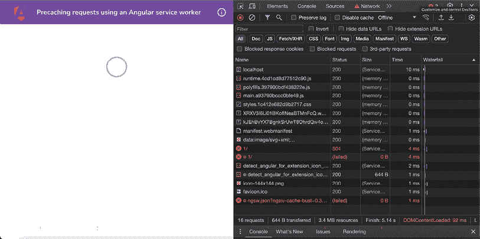

    图 13.27：由于未缓存网络请求而导致的离线体验中断

现在我们看到网络请求失败，让我们在下一节中查看修复此问题的步骤。

## 如何操作...

如你在 *图 13.27* 中所见，应用仍然可以加载。我们可以看到页眉和加载器。然而，API（fetch）调用不工作，因为我们正在使用 Chrome DevTools 模拟离线网络情况。这是因为服务工作者尚未配置为缓存数据请求。让我们开始修复此问题的配方：

1.  要缓存网络请求，打开 `start/apps/chapter13/ng-pwa-precaching` 目录内的 `ngsw-config.json` 文件，并按以下方式更新它：

    ```js
    {
    "$schema": "../../../node_modules/@angular/service-worker/config/schema.json",
    "index": "/index.html",
    "assetGroups": [
        ...
      ],
    **"dataGroups"****:****[**
    **{**
    **"name"****:****"swapi.dev"****,**
    **"urls"****:****[**
    **"https://swapi.dev/api/*"**
    **],**
    **"****cacheConfig"****:****{**
    **"strategy"****:****"freshness"****,**
    **"maxSize"****:****100****,**
    **"****maxAge"****:****"2d"**
    **}**
    **}**
    **]**
    } 
    ```

1.  让我们现在测试这个应用。使用以下命令在生产模式下构建和运行应用：

    ```js
    npm run serve:static chapter13 ng-pwa-precaching 7600 
    ```

1.  现在，导航到 `http://localhost:7600`。确保**网络限制**没有启用，也就是说，你不在**离线**模式。

1.  使用 Chrome DevTools 的 **应用** 选项卡 | **存储** 面板清除应用数据。或者按 *Cmd + Shift + R*（macOS X）或 *Ctrl + Shift + R*（Windows）进行强制刷新。

1.  再次刷新应用，让服务工作者缓存 API 请求。

1.  在 Chrome DevTools 中，转到 **网络** 选项卡并切换到离线模式，如图 *图 13.2* 所示。再次刷新应用。即使离线，你也应该看到 Swapi 的数据。网络调用由服务工作者提供，如图 *图 13.28* 所示：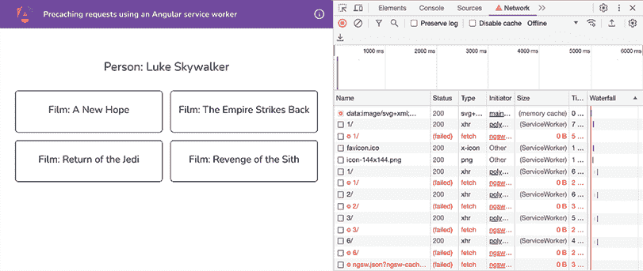

    图 13.28：服务工作者正在缓存网络调用

哇！你刚刚学会了如何在 Angular 应用中配置服务工作者以缓存网络/数据请求。即使离线，你也可以安装 PWA 并使用它。太棒了，对吧？

现在我们已经完成了配方，让我们在下一节中看看这一切是如何工作的。

## 它是如何工作的...

本食谱的核心是`ngsw-config.json`文件。当使用`ng add @angular/pwa`命令运行`@angular/pwa`脚手架时，该文件被`@angular/service-worker`包用于生成服务工作者文件。当我们使用`@angular/pwa`脚手架时，该文件默认包含一个 JSON 对象。这个 JSON 对象包含一个名为`assetGroups`的属性，它根据提供的配置来配置资源的缓存。对于这个食谱，我们希望缓存网络请求以及资源。因此，我们在 JSON 对象中添加了新的属性`dataGroups`。让我们看看配置：

```js
 "dataGroups": [
{
"name": "swapi.dev",
"urls": [
"https://swapi.dev/api/*"
],
"cacheConfig": {
"strategy": "freshness",
"maxSize": 100,
"maxAge": "2d"
}
}
] 
```

如你所见，`dataGroups`是一个数组。我们可以向其中提供不同的配置对象作为元素。每个配置都有一个`name`，一个`urls`数组，以及一个定义缓存策略的`cacheConfig`。在我们的配置中，我们使用了一个通配符与 API URL，即我们使用`urls`: ["`https://swapi.dev/api/*`"]。对于`cacheConfig`，我们使用的是`freshness`策略，这意味着应用将始终首先从其源获取数据。如果网络不可用，则它将使用服务工作者缓存的响应。另一种策略是`performance`，它首先在服务工作者中查找缓存的响应。如果对于 URL（或 URLs）没有缓存，则从实际源获取数据。`maxSize`属性定义了可以缓存多少个请求以相同的模式（或 URL 集合）。`maxAge`属性定义了缓存数据在服务工作者缓存中存活的时间。

现在你已经知道了这个食谱的工作原理，请查看下一节以获取进一步阅读的链接。

## 相关内容

+   Angular 服务工作者简介：[`angular.io/guide/service-worker-intro`](https://angular.io/guide/service-worker-intro)

+   Angular 服务工作者配置：[`angular.io/guide/service-worker-config`](https://angular.io/guide/service-worker-config)

+   创建离线回退页面（`web.dev`）：[`web.dev/offline-fallback-page/`](https://web.dev/offline-fallback-page/)

# 为你的 PWA 创建 App Shell

当涉及到为 Web 应用构建快速的用户体验时，一个主要挑战是尽量减少关键渲染路径。这包括加载目标页面的最关键资源，解析，执行 JavaScript 等。使用 App Shell，我们可以在构建时而不是运行时渲染一个页面或应用的一部分。这意味着用户最初将看到最小的预渲染内容，直到 JavaScript 和 Angular 介入。这意味着浏览器不需要工作并等待一段时间以进行第一次有意义的绘制。这不仅提供了良好的用户体验，还有助于将网站在搜索引擎中的排名提高，即实现更好的 SEO。在这个食谱中，你将为 Angular PWA 创建一个 App Shell。

## 准备工作

我们将要工作的应用程序位于克隆的仓库中的`start/apps/chapter13/ng-pwa-app-shell`目录下：

1.  在您的代码编辑器中打开代码仓库。

1.  打开终端，导航到克隆的代码仓库文件夹，然后从工作区根目录运行以下命令以在生产模式下运行项目：

    ```js
    npm run serve ng-pwa-app-shell 
    ```

    这应该在新的浏览器标签页中打开应用，并在`http://localhost:4200`显示以下内容：

    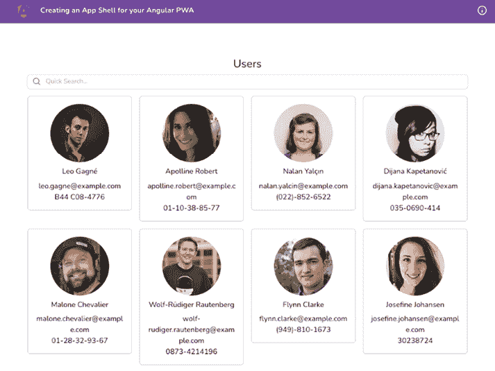

    图 13.29：ng-pwa-app-shell 在 http://localhost:4200 上运行

    现在，我们将禁用 JavaScript 来模拟解析 JavaScript 所花费的大量时间，或者模拟尚未安装 App Shell。现在打开 Chrome DevTools。然后打开命令面板。在 Mac OS X 上打开命令面板的快捷键是 *Cmd + Shift + P*，在 Windows 上是 *Ctrl + Shift + P*。输入**Disable JavaScript**，选择选项，然后按 *Enter*。在 Chrome DevTools 仍然打开的情况下刷新页面，你应该会看到以下消息：

    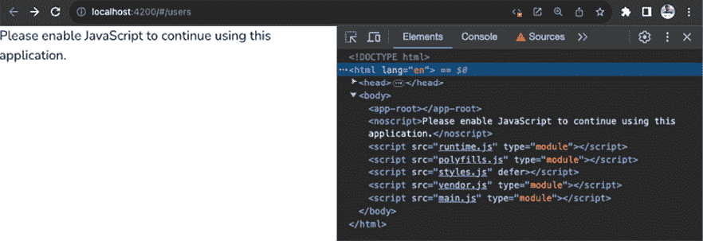

    图 13.30：应用中没有 App Shell

现在我们已经检查了 App Shell 的不存在，让我们在下一节中查看食谱的步骤。

## 如何做到这一点……

我们有一个从 API 获取一些用户的 Angular 应用程序。我们将为这个应用创建一个 App Shell，以便它作为 PWA 提供更快的首次有意义的绘制。让我们开始吧：

1.  首先，通过从项目根目录运行以下命令为应用创建 App Shell：

    ```js
    cd start && nx g app-shell --project=ng-pwa-app-shell 
    ```

    这将为我们的项目添加一些新文件，但也会更新`project.json`。由于我们为食谱使用独特的文件夹结构，您需要通过将所有`dist/ng-pwa-app-shell`实例替换为`dist/apps/chapter13/ng-pwa-app-shell`来更新`project.json`文件。

1.  更新`src/app/app-shell/app-shell.component.ts`文件以导入`UsersComponent`类，这样我们就可以在 App Shell 中渲染`users`页面。代码应如下所示：

    ```js
    ...
    **import** **{** **UsersComponent** **}** **from****'../users/users.component'****;**
    @Component({
      selector: 'app-app-shell',
      standalone: true,
      imports: [CommonModule, **UsersComponent**],
      templateUrl: './app-shell.component.html',
      styleUrls: ['./app-shell.component.css'],
    })
    ... 
    ```

1.  现在打开`app-shell.component.html`文件，并使用`<app-users>`元素来在 App Shell 中渲染整个`UsersComponent`。代码应如下所示：

    ```js
    <app-users></app-users> 
    ```

1.  最后，更新`users.component.ts`文件，在 App Shell 正在生成时显示骨架加载器。文件更新如下：

    ```js
    import { Component, inject, OnInit, **PLATFORM_ID** } from '@angular/core';
    import { CommonModule, **isPlatformBrowser** } from '@angular/common';
    ...
    export class UsersComponent implements OnInit {
     ...
      **platformId =** **inject****(****PLATFORM_ID****);**
      isSearching = true;
      ngOnInit() {
        this.componentAlive = true;
       ...
        this.searchForm.controls['username'].valueChanges
          .pipe(
            startWith(''),
            tap(() => {
              this.isSearching = true;
            }),
            takeWhile(() => !!this.componentAlive **&&** 
    **isPlatformBrowser****(****this****.****platformId**)),
            mergeMap((query) => this.userService
              .searchUsers(query))
          )
          .subscribe((users) => {
            this.users = users;
            this.isSearching = false;
          });
      }
    } 
    ```

1.  现在我们已经为 App Shell 编写了代码，让我们创建它。从`工作区根目录`运行以下命令以在`production`模式下生成 App Shell：

    ```js
    cd start && nx run ng-pwa-app-shell:app-shell:production 
    ```

1.  一旦在*步骤 5*中生成了 App Shell，从`工作区根目录`（而不是从`start`文件夹）运行以下命令，使用`http-server`包来运行它：

    ```js
    npx http-server ./start/dist/apps/chapter13/ng-pwa-app-shell/browser -o -p 4200 
    ```

1.  确保应用中的 JavaScript 仍然处于关闭状态。如果不是，请打开 Chrome DevTools 并按 Mac OS X 的 *Cmd + Shift + P* 或 Windows 的 *Ctrl + Shift + P* 打开命令面板。然后输入`Disable Javascript`并按 *Enter*，选择如图 13.31 所示的选项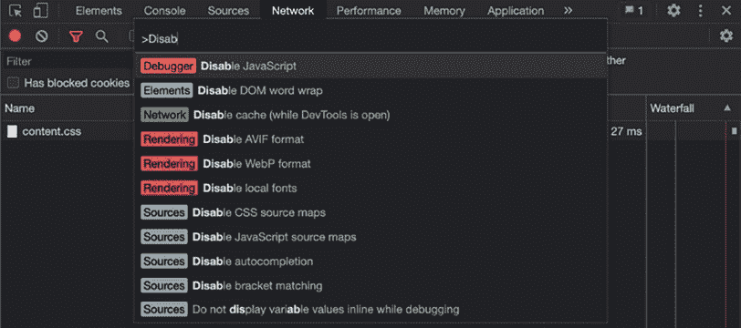

    图 13.31：使用 Chrome DevTools 禁用 JavaScript

1.  在禁用 JavaScript 的同时刷新应用。现在你应该看到应用仍然显示带有骨架加载器的预渲染用户页面，尽管 JavaScript 已被禁用，如图 *图 13.32* 所示。哇哦!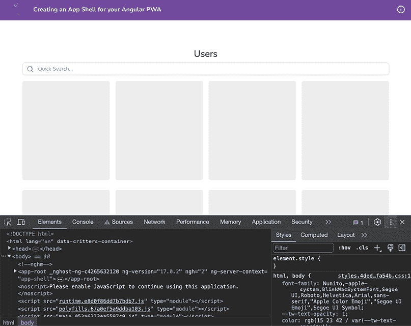

    图 13.32：显示预渲染用户页面的 App Shell

1.  为了验证我们在构建时预渲染了 **用户** 页面，请检查 `<workspace-root>/start/dist/apps/chapter13/ng-pwa-app-shell/browser/index.html` 中的生成代码。你应该在 `<body>` 标签内看到整个渲染的页面。

1.  使用 App Shell 创建生产构建，并通过运行以下命令在端口 `1020` 上提供服务：

    ```js
    cd start && nx run ng-pwa-app-shell:app-shell:production
    cd ..
    npx http-server ./start/dist/apps/chapter13/ng-pwa-app-shell/browser -o -p 1020 
    ```

1.  在你的浏览器中导航到 `http://localhost:1020` 并将应用作为 PWA 安装，如图 *图 13.8* 所示。完成后，运行 PWA，它应该看起来如下所示：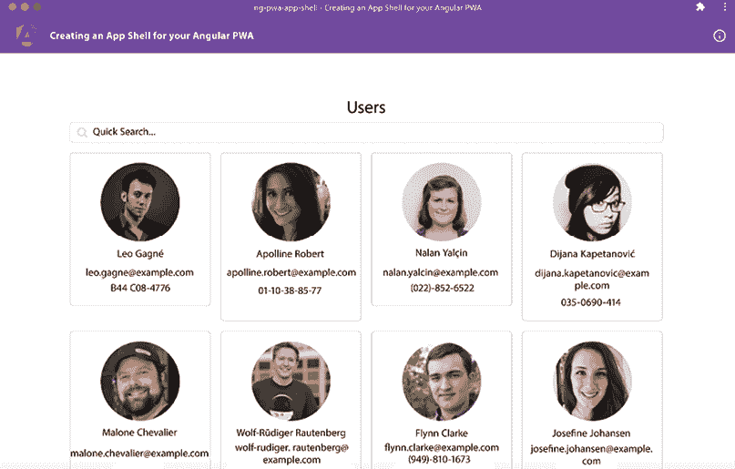

    图 13.33：ng-pwa-app-shell 作为 PWA 运行

太棒了！你现在知道如何为你的 Angular PWAs 创建 App Shell。现在你已经完成了这个配方，请查看下一节了解它是如何工作的。

## 它是如何工作的…

这个配方从禁用我们应用程序的 JavaScript 开始。这意味着当应用运行时，我们只显示静态 HTML 和 CSS，因为没有 JavaScript 执行。我们看到了关于 JavaScript 不受支持的提示，如图 *图 13.30* 所示。代码来自 `src/index.html` 文件，其中 `<body>` 元素内部有如下代码：

```js
<noscript>Please enable JavaScript to continue using this application.</noscript> 
```

然后运行命令 `nx g app-shell--project=ng-pwa-app-shell`。由于我们处于一个 NX 工作区，该命令需要正确的项目。如果这是一个常规的 Angular 项目，你只需运行 `ng generate app-shell`，它就会为你创建 App Shell。在任何情况下，该命令都会为我们执行以下操作：

+   创建一个名为 `AppShellComponent` 的新组件并生成其相关文件。

+   在项目中安装 `@angular/platform-server` 包。

+   添加一些新文件，即 `main.server.ts`，以启用服务器端渲染（确切地说，为我们的 App Shell 进行构建时渲染）。

+   最重要的是，它更新了 `project.json`（对于不在 NX 工作区的 Angular 项目是 `angular.json`）文件，添加了一组用于服务器端渲染以及生成 `app-shell` 的脚图。请注意，它覆盖了 `build` 对象（特别是 `outputPath` 属性），以删除 `apps` 文件夹和章节名称。我们不想这样，因为我们希望将包生成在 `dist/apps/chapter13/<project-name>`，这就是为什么我们在配方中手动更新了它。请注意，它还添加了一个新的 `"server"` 对象用于 SSR，以及一个配置了生成 App Shell 的 `"app-shell"` 对象。

在配方中，我们创建 App Shell，然后我们将 `UsersComponent` 类导入到 `AppShellComponent` 类的 `imports` 数组中。由于 `AppShellComponent` 是一个 `standalone` 组件（不是任何 `NgModule` 的部分），`UsersComponent` 也是如此，因此我们需要通过 `AppShellComponent` 中的 `imports` 数组将它们链接在一起。在导入 `UsersComponent` 类之后，我们更新 `app-shell.component.html`（App Shell 模板）以使用 `<app-users>` 选择器，这反映了 `UsersComponent` 类。这就是整个 **用户** 页面。最后，我们确保只有在浏览器正在创建时（以及对于 SSR 也是如此）才渲染骨架元素。因此，我们在 `users.component.ts` 文件中使用 `PLATFORM_ID` 令牌。令牌的值包含我们应用程序正在运行的平台的名称。当 App Shell 正在生成时，它是服务器端环境，`PLATFORM_ID` 的值为 `"server"`。我们不是将其与字符串 `"server"` 进行比较，即使用条件 `this.platformId !== "server"`，而是使用 `@angular/common` 包中的 `isPlatformBrowser` 函数，仅在平台是 `browser` 时获取数据（在生成 App Shell 时不是这种情况）。

我们随后在 *步骤 4* 和 *步骤 5* 中验证 App Shell。这些命令分别生成带有 App Shell 的 Angular 生产模式构建（非最小化代码），并在端口 `4200` 上提供项目。请注意，`start/dist/apps/chapter13/ng-pwa-app-shell` 文件夹中的 `ng-pwa-app-shell` 文件夹有两个文件夹，即 `browser` 文件夹和 `server` 文件夹，我们的 `index.html` 位于 `browser` 文件夹中。`index.html` 中的代码在构建时预渲染。这意味着 Angular 在构建时打开应用程序并渲染 `UsersComponent`，包括搜索输入和骨架加载器。因此，一旦应用程序打开，内容就被预渲染。完成所有这些步骤后，我们安装 PWA 以进行测试。

现在您已经知道了配方的工作原理，请查看下一节以获取进一步阅读的链接。

## 参见

+   Angular App Shell 指南：[`angular.io/guide/app-shell`](https://angular.io/guide/app-shell)

+   App Shell 模型（谷歌的 Web 基础）：[`developers.google.com/web/fundamentals/architecture/app-shell`](https://developers.google.com/web/fundamentals/architecture/app-shell)

+   **关键渲染路径**（**CRP**）：[`developer.mozilla.org/en-US/docs/Web/Performance/Critical_rendering_path`](https://developer.mozilla.org/en-US/docs/Web/Performance/Critical_rendering_path)

# 在 Discord 上了解更多信息

要加入这本书的 Discord 社区——在那里您可以分享反馈、向作者提问，并了解新版本——请扫描下面的二维码：

`packt.link/AngularCookbook2e`

**
