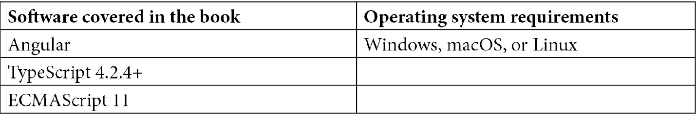

# 前言

Angular 是世界上最受欢迎的框架之一，不仅用于构建 Web 应用程序，甚至还用于移动应用程序和桌面应用程序。由 Google 支持并被 Google 使用，这个框架被数百万个应用程序使用。尽管该框架非常适合任何规模的应用程序，但企业特别喜欢 Angular，因为它具有明确的观点，并且因为其一致的生态系统包括您创建基于 Web 技术的应用程序所需的所有工具。

虽然学习核心技术如 JavaScript、HTML 和 CSS 对于成为 Web 开发人员至关重要，但是当涉及到框架时，学习框架本身的核心概念也非常重要。当我们使用 Angular 时，通过学习并使用 Angular 生态系统中的正确工具，我们可以为我们的 Web 应用程序做很多令人惊叹的事情。这就是本书的用武之地。

本书是为中级和高级 Angular 开发人员编写的，以便通过可以轻松遵循、玩耍并练习自己变化的食谱来提高他们的 Angular 开发技能。您不仅会从食谱本身中学到东西，还会从与食谱相关的实际项目中学到东西。因此，这些食谱和项目中有很多隐藏的宝石等待着您。

编码愉快！

# 本书适合谁

本书适用于中级水平的 Angular Web 开发人员，他们正在寻找在 Angular 企业开发中常见问题的可行解决方案。使用 Angular 技术的移动开发人员也会发现本书很有用。理解 JavaScript 和 TypeScript 的工作经验对更有效地理解本书中涵盖的主题是必要的。

# 本书涵盖的内容

*第一章*, *获胜的组件通信*，解释了在 Angular 中实现组件之间通信的不同技术。还涵盖了`@Input()`和`@Output()`修饰符、服务和生命周期钩子。还有一个关于如何创建动态 Angular 组件的示例。

*第二章*, *理解和使用 Angular 指令*，介绍了 Angular 指令，并提供了一些使用 Angular 指令的示例，包括属性指令和结构指令。

第三章，Angular 中依赖注入的魔力，包括覆盖了可选依赖项，配置注入令牌，使用`providedIn: 'root'`元数据为 Angular 服务提供者，值提供者和别名类提供者的示例。

第四章，理解 Angular 动画，包括实现多状态动画，交错动画，关键帧动画以及在 Angular 应用程序中切换路由时的动画的示例。

第五章，Angular 和 RxJS - 组合的精华，涵盖了 RxJS 实例和静态方法的用法。它还包括一些关于`combineLatest`，`flatMap`和`switchMap`操作符的用法的示例，并介绍了一些关于使用 RxJS 流的技巧和窍门。

第六章，使用 NgRx 进行响应式状态管理，涵盖了关于著名的 NgRX 库及其核心概念的示例。它涵盖了 NgRx 动作，减速器，选择器和效果等核心概念，并介绍了如何使用`@ngrx/store-devtools`和`@component/store`等包。

第七章，理解 Angular 导航和路由，探讨了有关延迟加载路由，路由守卫，预加载路由策略以及与 Angular 路由一起使用的一些有趣技术的示例。

第八章，精通 Angular 表单，涵盖了模板驱动表单，响应式表单，表单验证，测试表单以及创建自己的表单控件的示例。

第九章，Angular 和 Angular CDK，包括许多很酷的 Angular CDK 示例，包括虚拟滚动，键盘导航，覆盖 API，剪贴板 API，CDK 拖放，CDK 步进器 API 和 CDK 文本框 API。

第十章，使用 Jest 在 Angular 中编写单元测试，涵盖了使用 Jest 进行单元测试的示例，探索 Jest 中的全局模拟，模拟服务/子组件/管道，使用 Angular CDK 组件挽具进行单元测试等内容。

*第十一章**，使用 Cypress 进行 Angular 的 E2E 测试*，介绍了在 Angular 应用中使用 Cypress 进行 E2E 测试的示例。它涵盖了验证表单、等待 XHR 调用、模拟 HTTP 调用响应、使用 Cypress 捆绑包以及在 Cypress 中使用固定装置。

*第十二章*，*Angular 中的性能优化*，包含一些通过使用 OnPush 变更检测策略、延迟加载特性路由、从组件中分离变更检测器、使用 Angular 的 Web Workers、使用纯管道、向 Angular 应用添加性能预算以及使用`webpack-bundle`分析器来改善 Angular 应用性能的酷技巧。

*第十三章*，*使用 Angular 构建 PWA*，包含了创建一个 PWA 的示例。它涵盖了为 PWA 指定主题颜色、使用设备的深色模式、提供自定义 PWA 安装提示、使用 Angular 的服务工作器预缓存请求以及使用 App Shell。

# 要充分利用本书

本书的示例是基于 Angular v12 构建的，Angular 遵循语义化版本控制发布。由于 Angular 不断改进，为了稳定性，Angular 团队为更新提供了可预测的发布周期。发布频率如下：

+   每 6 个月发布一个重大版本。

+   每个重大版本有 1 到 3 个次要版本。

+   几乎每周发布一个补丁版本和预发布版本（下一个或 rc）构建。

来源：[`angular.io/guide/releases#release-frequency`](https://angular.io/guide/releases#release-frequency)



**如果您正在使用本书的数字版本，我们建议您自己输入代码或从书的 GitHub 存储库中访问代码（链接在下一节中提供）。这样做将有助于避免与复制和粘贴代码相关的任何潜在错误。**

阅读完本书后，请务必在[`ahsanayaz.com/twitter`](https://ahsanayaz.com/twitter)上发推文，让我知道您对本书的反馈。此外，您可以根据自己的喜好修改本书提供的代码，将其上传到您的 GitHub 存储库并分享。我会确保转发它 :)

# 下载示例代码文件

您可以从 GitHub 上下载本书的示例代码文件[`github.com/PacktPublishing/Angular-Cookbook`](https://github.com/PacktPublishing/Angular-Cookbook)。如果代码有更新，将在 GitHub 存储库中更新。

我们还有来自丰富书籍和视频目录的其他代码捆绑包，可在[`github.com/PacktPublishing/`](https://github.com/PacktPublishing/)上找到。去看看吧！

# 下载彩色图像

我们还提供了一个 PDF 文件，其中包含本书中使用的屏幕截图和图表的彩色图像。您可以在这里下载：[`static.packt-cdn.com/downloads/9781838989439_ColorImages.pdf`](https://static.packt-cdn.com/downloads/9781838989439_ColorImages.pdf)。

# 使用的约定

本书中使用了许多文本约定。

`文本中的代码`：表示文本中的代码词，数据库表名，文件夹名，文件名，文件扩展名，路径名，虚拟 URL，用户输入和 Twitter 句柄。例如：“现在，我们将把代码从`the-amazing-list-component.html`文件移动到`the-amazing-list-item.component.html`文件，用于项目的标记。”

一块代码设置如下：

```ts
openMenu($event, itemTrigger) {
    if ($event) {
      $event.stopImmediatePropagation();
    }
    this.popoverMenuTrigger = itemTrigger;
    this.menuShown = true;
  }
```

当我们希望引起您对代码块的特定部分的注意时，相关行或项目将以粗体显示：

```ts
.menu-popover {
  ...
  &::before {...}
  &--up {
    transform: translateY(-20px);
    &::before {
      top: unset !important;
      transform: rotate(180deg);
      bottom: -10px;
    }
  }
  &__list {...}
}
```

**粗体**：表示新术语，重要单词或屏幕上看到的单词。例如，菜单或对话框中的单词以**粗体**显示。例如：“您会注意到我们无法看到输入内容的全部内容-这在最好的时候有点烦人，因为在按下**操作**按钮之前，您无法真正审查它。”

提示或重要说明

出现如下。
