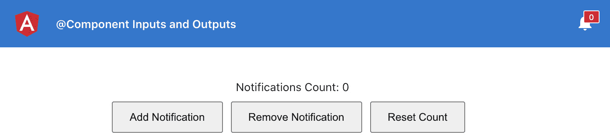
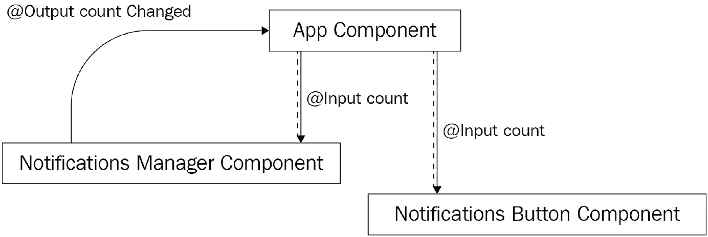
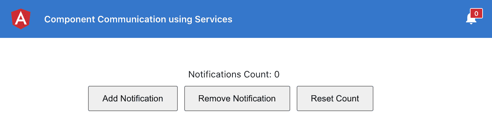
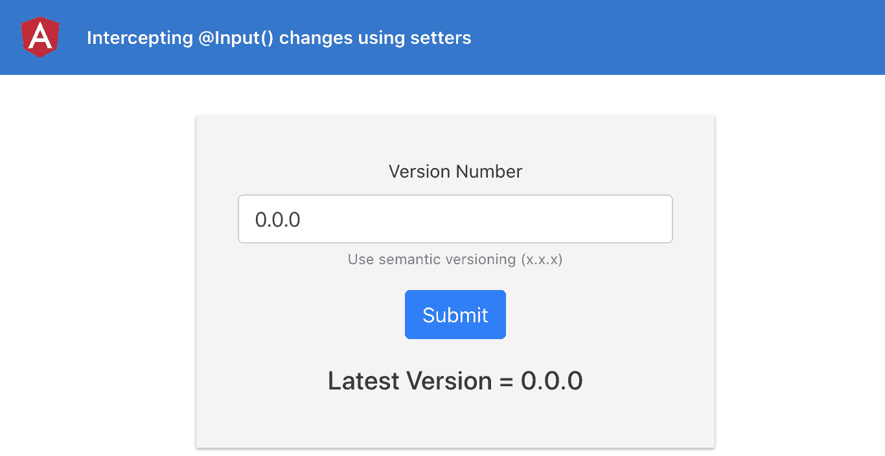
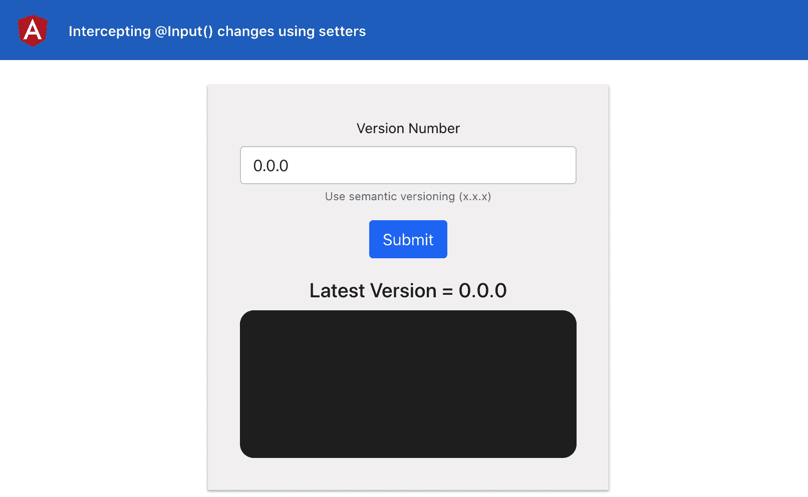
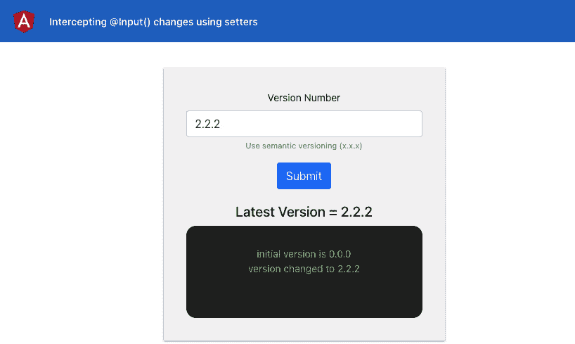
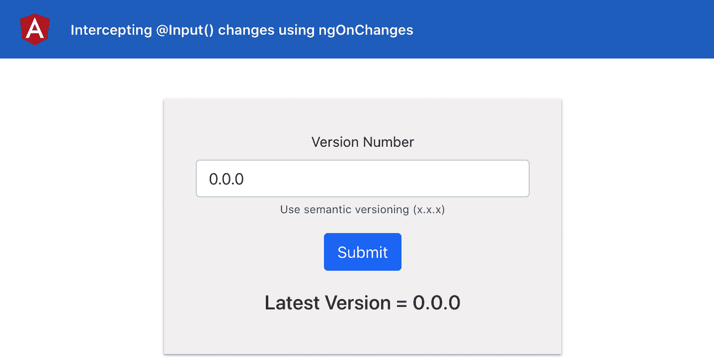
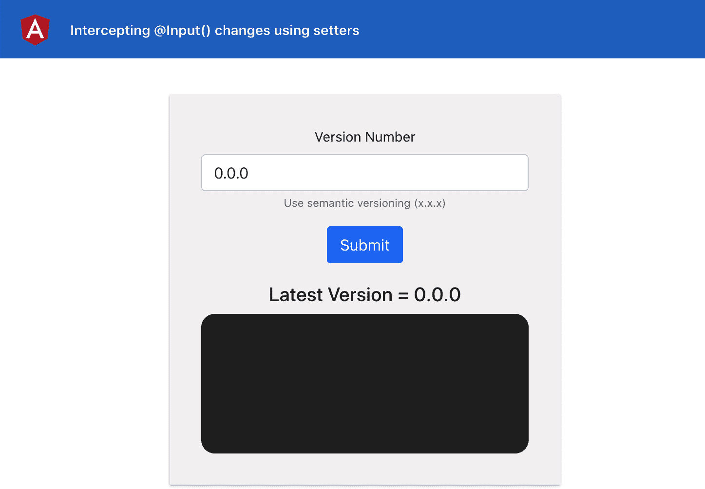
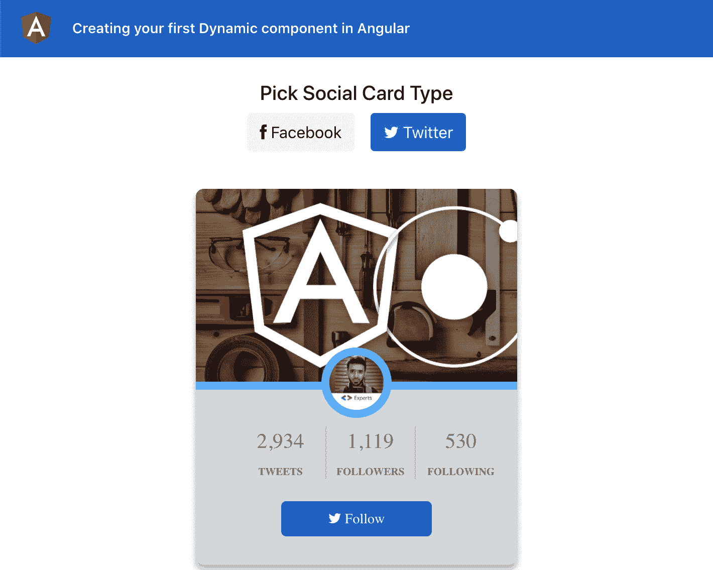
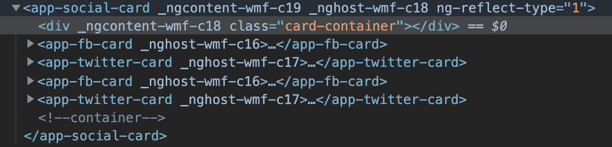

# 第一章：*第一章*：获胜的组件通信

在本章中，您将掌握 Angular 中的组件通信。您将学习建立组件之间通信的不同技术，并了解哪种技术适用于哪种情况。您还将学习如何在本章中创建一个动态的 Angular 组件。

以下是本章将要涵盖的配方：

+   使用组件`@Input(s)`和`@Output(s)`进行组件通信

+   使用服务进行组件通信

+   使用 setter 拦截输入属性的更改

+   使用`ngOnChanges`拦截输入属性的更改

+   通过模板变量在父模板中访问子组件

+   通过`ViewChild`在父组件类中访问子组件

+   在 Angular 中创建你的第一个动态组件

# 技术要求

在本章的配方中，请确保您的计算机上安装了**Git**和**Node.js**。您还需要安装`@angular/cli`包，可以在终端中使用`npm install -g @angular/cli`来安装。本章的代码可以在[`github.com/PacktPublishing/Angular-Cookbook/tree/master/chapter01`](https://github.com/PacktPublishing/Angular-Cookbook/tree/master/chapter01)找到。

# 使用组件@Input(s)和@Output(s)进行组件通信

您将从一个具有父组件和两个子组件的应用程序开始。然后，您将使用 Angular 的`@Input`和`@Ouput`装饰器，使用属性和`EventEmitter`(s)在它们之间建立通信。

## 准备工作

我们将要使用的项目位于克隆存储库中的`chapter01/start_here/cc-inputs-outputs`中：

1.  在 Visual Studio Code 中打开项目。

1.  打开终端并运行`npm install`来安装项目的依赖项。完成后，运行`ng serve -o`。

这应该在新的浏览器标签页中打开应用程序，你应该看到以下内容：



图 1.1 - 运行在 http://localhost:4200 上的 cc-inputs-outputs 应用程序

## 如何做…

到目前为止，我们有一个带有`AppComponent`、`NotificationsButtonComponent`和`NotificationsManagerComponent`的应用程序。虽然`AppComponent`是其他两个组件的父组件，但它们之间绝对没有组件通信来同步通知计数值。让我们使用以下步骤建立它们之间的适当通信：

1.  我们将从`NotificationsManagerComponent`中移除`notificationsCount`变量，并将其放在`AppComponent`中。为此，只需在`app.component.ts`中创建一个`notificationsCount`属性即可：

```ts
export class AppComponent {
  notificationsCount = 0;
}
```

1.  然后，将`notifications-manager.component.ts`中的`notificationsCount`属性转换为`@Input()`，并将其重命名为`count`，并替换其用法如下：

```ts
import { Component, OnInit, Input } from '@angular/core';
@Component({
  selector: 'app-notifications-manager',
  templateUrl: './notifications-manager.component.html',
  styleUrls: ['./notifications-manager.component.scss']
})
export class NotificationsManagerComponent implements OnInit {
  @Input() count = 0
  constructor() { }
  ngOnInit(): void {
  }
  addNotification() {
    this.count++;
  }
  removeNotification() {
    if (this.count == 0) {
      return;
    }
    this.count--;
  } 
  resetCount() {
    this.count = 0;
  }
}
```

1.  更新`notifications-manager.component.html`以使用`count`而不是`notificationsCount`：

```ts
 <div class="notif-manager">
  <div class="notif-manager__count">
    Notifications Count: {{count}}
  </div>
  ...
</div>
```

1.  接下来，将`app.component.html`中的`notificationsCount`属性作为输入传递给`<app-notifications-manager>`元素：

```ts
 <div class="content" role="main">
  <app-notifications-manager
    [count]="notificationsCount">
  </app-notifications-manager>
</div>
```

您现在可以通过将`app.component.ts`中的`notificationsCount`的值分配为`10`来测试是否正确地从`app.component.html`传递到`app-notifications-manager`。您将看到，在`NotificationsManagerComponent`中，显示的初始值将为`10`：

```ts
export class AppComponent {
  notificationsCount = 10;
}
```

1.  接下来，在`notifications-button.component.ts`中创建一个`@Input()`，命名为`count`：

```ts
import { Component, OnInit, Input } from '@angular/core';
...
export class NotificationsButtonComponent implements OnInit {
  @Input() count = 0;
  ...
}
```

1.  同时也将`notificationsCount`传递给`<app-notifications-button>`，并在`app.component.html`中进行相应设置：

```ts
<!-- Toolbar -->
<div class="toolbar" role="banner">
  ...
  <span>@Component Inputs and Outputs</span>
  <div class="spacer"></div>
  <div class="notif-bell">
    <app-notifications-button     [count]="notificationsCount">
    </app-notifications-button>
  </div>
</div>
...
```

1.  在`notifications-button.component.html`中使用`count`输入与通知图标：

```ts
<div class="bell">
  <i class="material-icons">notifications</i>
  <div class="bell__count">
    <div class="bell__count__digits">
      {{count}}
    </div>
  </div>
</div>
```

现在，您还应该看到通知图标计数为`10`的值。

*现在，如果您通过从`NotificationsManagerComponent`中添加/删除通知来更改计数，通知图标上的计数将不会改变。*

1.  为了将来自`NotificationsManagerComponent`到`NotificationsButtonComponent`的更改进行通信，我们现在将使用 Angular 的`@Output`。在`notifications-manager.component.ts`中使用`@Output`和`@EventEmitter`来自`'@angular/core'`：

```ts
import { Component, OnInit, Input, Output, EventEmitter } from '@angular/core';
...
export class NotificationsManagerComponent implements OnInit {
  @Input() count = 0
  @Output() countChanged = new EventEmitter<number>();
  ...
  addNotification() {
    this.count++;
    this.countChanged.emit(this.count);
  }
  removeNotification() {
    ...
    this.count--;
    this.countChanged.emit(this.count);
  }
  resetCount() {
    this.count = 0;
    this.countChanged.emit(this.count);
  }
}
```

1.  然后，我们将在`app.component.html`中监听来自`NotificationsManagerComponent`的先前发出的事件，并相应地更新`notificationsCount`属性：

```ts
<div class="content" role="main">
  <app-notifications-manager   (countChanged)="updateNotificationsCount($event)"   [count]="notificationsCount"></app-notifications-  manager>
</div>
```

1.  由于我们先前已经监听了`countChanged`事件并调用了`updateNotificationsCount`方法，我们需要在`app.component.ts`中创建这个方法，并相应地更新`notificationsCount`属性的值：

```ts
export class AppComponent {
  notificationsCount = 10;
  updateNotificationsCount(count: number) {
    this.notificationsCount = count;
  }
}
```

## 工作原理…

为了使用`@Input`和`@Output`在组件之间进行通信，数据流将始终从*子组件* **到** *父组件*，父组件可以将新的（更新的）值*作为输入*提供给所需的子组件。因此，`NotificationsManagerComponent`发出`countChanged`事件。`AppComponent`（作为父组件）监听该事件并更新`notificationsCount`的值，这将自动更新`NotificationsButtonComponent`中的`count`属性，因为`notificationsCount`被传递为`@Input()` count 到`NotificationsButtonComponent`。*图 1.2*显示了整个过程：



图 1.2 - 使用输入和输出进行组件通信的工作原理

## 另请参阅

+   Angular 组件如何通信？[`www.thirdrocktechkno.com/blog/how-angular-components-communicate`](https://www.thirdrocktechkno.com/blog/how-angular-components-communicate)

+   *Dhananjay Kumar 的 Angular 组件通信*：[`www.youtube.com/watch?v=I8Z8g9APaDY`](https://www.youtube.com/watch?v=I8Z8g9APaDY)

# 使用服务进行组件通信

在这个配方中，您将从一个具有父组件和子组件的应用程序开始。然后，您将使用 Angular 服务来建立它们之间的通信。我们将使用`BehaviorSubject`和 Observable 流来在组件和服务之间进行通信。

## 准备就绪

此处的配方项目位于`chapter01/start_here/cc-services`中：

1.  在 Visual Studio Code 中打开项目。

1.  打开终端并运行`npm install`来安装项目的依赖项。

1.  完成后，运行`ng serve -o`。

这将在新的浏览器标签中打开应用程序，您应该看到应用程序如下所示：



图 1.3 - cc-services 应用程序运行在 http://localhost:4200

## 如何做…

与之前的配方类似，我们有一个带有`AppComponent`、`NotificationsButtonComponent`和`NotificationsManagerComponent`的应用程序。`AppComponent`是前面提到的另外两个组件的父组件，我们需要使用以下步骤在它们之间建立适当的通信：

1.  在`chapter01/start_here/cc-services/src/app`项目中创建一个名为`services`的新文件夹。这将是我们新服务的所在地。

1.  从终端中，导航到项目中，即`chapter01/start_here/cc-services`内，并创建一个名为`NotificationService`的新服务，如下所示：

```ts
ng g service services/Notifications
```

1.  在`notifications.service.ts`中创建一个名为`count`的`BehaviorSubject`，并将其初始化为`0`，因为`BehaviorSubject`需要一个初始值：

```ts
import { Injectable } from '@angular/core';
import { BehaviorSubject } from 'rxjs';
@Injectable({
  providedIn: 'root'
})
export class NotificationsService {
  private count: BehaviorSubject<number> = new   BehaviorSubject<number>(0);
  constructor() { }
}
```

注意`BehaviorSubject`是一个`private`属性，我们稍后将仅从服务内部使用`public`方法来更新它。

1.  现在，使用`count`的`BehaviorSubject`上的`.asObservable()`方法创建一个名为`count$`的`Observable`：

```ts
import { Injectable } from '@angular/core';
import { BehaviorSubject, Observable } from 'rxjs';
...
export class NotificationsService {
  private count: BehaviorSubject<number> = new   BehaviorSubject<number>(0);
  count$: Observable<number> = this.count.asObservable();
  ...
}
```

1.  将`notifications-manager.component.ts`中的`notificationsCount`属性转换为名为`notificationsCount$`的 Observable。在组件中注入`NotificationsService`并将服务的`count$` Observable 分配给组件的`notificationsCount$`变量：

```ts
import { Component, OnInit } from '@angular/core';
import { Observable } from 'rxjs';
import { NotificationsService } from '../services/notifications.service';
...
export class NotificationsManagerComponent implements OnInit {
  notificationsCount$: Observable<number>;
  constructor(private notificationsService:   NotificationsService) { }

  ngOnInit(): void {
    this.notificationsCount$ = this.notificationsService.    count$;
  }
  ...
}
```

1.  暂时注释掉更新通知计数的代码；我们稍后会回来处理它：

```ts
...
export class NotificationsManagerComponent implements OnInit {
  ...
  addNotification() {
    // this.notificationsCount++;
  }
  removeNotification() {
    // if (this.notificationsCount == 0) {
    //   return;
    // }
    // this.notificationsCount--;
  }
  resetCount() {
    // this.notificationsCount = 0;
  }
}
```

1.  在`notifications-manager.component.html`中使用`notificationsCount$` Observable 和`async`管道来显示其值：

```ts
<div class="notif-manager">
  <div class="notif-manager__count">
    Notifications Count: {{notificationsCount$ | async}}
  </div>
  ...
</div>
```

1.  现在，类似地在`notifications-button.component.ts`中注入`NotificationsService`，在`NotificationsButtonComponent`中创建一个名为`notificationsCount$`的 Observable，并将服务的`count$` Observable 分配给它：

```ts
import { Component, OnInit } from '@angular/core';
import { NotificationsService } from '../services/notifications.service';
import { Observable } from 'rxjs';
 ...
export class NotificationsButtonComponent implements OnInit {
  notificationsCount$: Observable<number>;
  constructor(private notificationsService:   NotificationsService) { }

  ngOnInit(): void {
    this.notificationsCount$ = this.notificationsService.    count$;
  }
}
```

1.  在`notifications-button.component.html`中使用`notificationsCount$` Observable 和`async`管道：

```ts
<div class="bell">
  <i class="material-icons">notifications</i>
  <div class="bell__count">
    <div class="bell__count__digits">
      {{notificationsCount$ | async}}
    </div>
  </div>
</div>
```

如果现在刷新应用程序，您应该能够看到通知管理器组件和通知按钮组件的值都为`0`。

1.  将`count`的`BehaviorSubject`的初始值更改为`10`，并查看是否在两个组件中都反映出来：

```ts
...
export class NotificationsService {
  private count: BehaviorSubject<number> = new   BehaviorSubject<number>(10);
  ...
}
```

1.  现在，在`notifications.service.ts`中创建一个名为`setCount`的方法，这样我们就能够更新`count`的`BehaviorSubject`的值：

```ts
...
export class NotificationsService {
  …
  constructor() {}
  setCount(countVal) {
    this.count.next(countVal);
  }
}
```

1.  现在我们已经有了`setCount`方法，让我们在`notifications-manager.component.ts`中使用它来根据按钮点击更新其值。为了这样做，我们需要获取`notificationsCount$` Observable 的最新值，然后执行一些操作。我们首先在`NotificationsManagerComponent`中创建一个`getCountValue`方法，如下所示，并在`notificationsCount$` Observable 上使用`subscribe`和`first`操作符来获取其最新值：

```ts
...
import { first } from 'rxjs/operators';
...
export class NotificationsManagerComponent implements OnInit {
  ngOnInit(): void {
    this.notificationsCount$ = this.notificationsService.    count$;
  }
  ...
  getCountValue(callback) {
    this.notificationsCount$
      .pipe(
        first()
      ).subscribe(callback)
  }
  ...
}
```

1.  现在，我们将在我们的`addNotification`、`removeNotification`和`resetCount`方法中使用`getCountValue`方法。我们将不得不从这些方法中将回调函数传递给`getCountValue`方法。让我们先从`addNotification`方法开始：

```ts
import { Component, OnInit } from '@angular/core';
import { Observable } from 'rxjs';
import { NotificationsService } from '../services/notifications.service';
import { first } from 'rxjs/operators';

...
export class NotificationsManagerComponent implements OnInit {
  ...
  addNotification() {
    this.getCountValue((countVal) => {
      this.notificationsService.setCount(++countVal)
    });
  }
  ...
}
```

有了上述代码，每当我们点击**添加通知**按钮时，您应该已经看到两个组件正确地反映了更新的值。

1.  现在让我们实现`removeNotification`和`resetCount`的相同逻辑：

```ts
...
export class NotificationsManagerComponent implements OnInit {
  ...
  removeNotification() {
    this.getCountValue((countVal) => {
      if (countVal === 0) {
        return;
      }
      this.notificationsService.setCount(--countVal);
    })
  }
  resetCount() {
    this.notificationsService.setCount(0);
  }
}
```

## 工作原理…

`BehaviorSubject`是一种特殊类型的`Observable`，它需要一个初始值，并且可以被多个订阅者使用。在这个食谱中，我们创建了一个`BehaviorSubject`，然后使用`BehaviorSubject`上的`.asObservable()`方法创建了一个`Observable`。虽然我们本来可以直接使用`BehaviorSubject`，但是社区推荐使用`.asObservable()`方法。

一旦我们在`NotificationsService`中创建了名为`count$`的 Observable，我们就在我们的组件中注入`NotificationsService`，并将`count$` Observable 分配给组件的一个本地属性。然后，我们直接在`NotificationsButtonComponent`的模板（`html`）和`NotificationsManagerComponent`的模板中使用`async`管道订阅这个本地属性（它是一个 Observable）。

然后，每当我们需要更新`count$` Observable 的值时，我们使用`NotificationsService`的`setCount`方法来使用`BehaviorSubject`的`.next()`方法更新实际的值。这将通过`count$` Observable 自动发出新值，并在两个组件中更新视图的新值。

## 另请参阅

+   RxJS 官方文档中的 Subjects：[`www.learnrxjs.io/learn-rxjs/subjects`](https://www.learnrxjs.io/learn-rxjs/subjects)

+   `BehaviorSubject`与`Observable`在 Stack Overflow 上的比较：[`stackoverflow.com/a/40231605`](https://stackoverflow.com/a/40231605)

# 使用 setter 拦截输入属性更改

在这个食谱中，您将学习如何拦截从父组件传递的`@Input`的更改，并对此事件执行一些操作。我们将拦截从`VersionControlComponent`父组件传递给`VcLogsComponent`子组件的`vName`输入。我们将使用 setter 在`vName`的值更改时生成日志，并在子组件中显示这些日志。

## 准备工作

这个食谱的项目位于`chapter01.start_here/cc-setters`中：

1.  在 Visual Studio Code 中打开项目。

1.  打开终端并运行`npm install`以安装项目的依赖项。

1.  完成后，运行`ng serve -o`。这应该会在新的浏览器选项卡中打开应用程序，您应该看到应用程序如下所示：



图 1.4 – cc-setters 应用程序在 http://localhost:4200 上运行

## 如何做…

1.  首先，我们将在`VcLogsComponent`中创建一个日志数组，以存储稍后我们将使用模板显示的所有日志：

```ts
export class VcLogsComponent implements OnInit {
  @Input() vName;
  logs: string[] = [];
  constructor() { }
...
}
```

1.  让我们创建 HTML 来显示日志的位置。使用以下代码将日志容器和日志项添加到`vc-logs.component.html`中：

```ts
<h5>Latest Version = {{vName}}</h5>
<div class="logs">
  <div class="logs__item" *ngFor="let log of logs">
    {{log}}
  </div>
</div>
```

1.  然后，我们将为要显示的日志容器和日志项添加一些样式。更改后，视图应如*图 1.5*所示。更新`vc-logs.component.scss`文件如下：

```ts
h5 {
  text-align: center;
}
.logs {
  padding: 1.8rem;
  background-color: #333;
  min-height: 200px;
  border-radius: 14px;
  &__item {
    color: lightgreen;
  }
}
```

以下截图显示了具有日志容器样式的应用程序：



图 1.5 – 具有日志容器样式的 cc-setters 应用程序

1.  现在，我们将把`vc-logs.component.ts`中的`@Input()`转换为使用 getter 和 setter，以便我们可以拦截输入更改。为此，我们还将创建一个名为`_vName`的内部属性。代码应如下所示：

```ts
...
export class VcLogsComponent implements OnInit {
  _vName: string;
@Input() 
  get vName() {
    return this._vName;
  };
  set vName(name: string) {
   this._vName = name;
  }
  logs: string[] = [];
  constructor() { }
...
}
```

1.  通过*步骤 4*中的更改，应用程序的工作方式与以前完全相同，即完美。现在，让我们修改 setter 以创建这些日志。对于初始值，我们将有一个日志，说'初始版本是 x.x.x'：

```ts
export class VcLogsComponent implements OnInit {
  ...
  set vName(name: string) {
    if (!name) return;
    if (!this._vName) {
      this.logs.push('initial version is ${name.trim()}')
    }
    this._vName = name;
  }
...
}
```

1.  现在，作为最后一步，每当我们更改版本名称时，我们需要显示一个不同的消息，说'版本更改为 x.x.x'。*图 1.6*显示了最终输出。对于所需的更改，我们将在`vName` setter 中编写一些进一步的代码如下：

```ts
export class VcLogsComponent implements OnInit {
  ...
  set vName(name: string) {
    if (!name) return;
    if (!this._vName) {
      this.logs.push('initial version is ${name.trim()}')
    } else {
      this.logs.push('version changed to ${name.trim()}')
    }
    this._vName = name;
  }
```

以下截图显示了最终输出：



图 1.6 – 使用 setter 的最终输出

## 它是如何工作的…

Getter 和 setter 是 JavaScript 的内置功能的组成部分。许多开发人员在使用原始 JavaScript 或 TypeScript 时在其项目中使用它们。幸运的是，Angular 的`@Input()`也可以使用 getter 和 setter，因为它们基本上是提供的类的属性。

对于这个示例，我们使用一个 getter，更具体地说，是一个 setter 来处理我们的输入，所以每当输入发生变化时，我们使用 setter 方法来执行额外的任务。此外，我们在 HTML 中使用相同输入的 setter，所以当更新时，我们直接在视图中显示值。

始终使用私有变量/属性与 getter 和 setter 是一个好主意，以便在组件接收输入和在组件本身中存储输入方面有一个关注点的分离。

## 另请参阅

+   [`angular.io/guide/component-interaction#intercept-input-property-changes-with-a-setter`](https://angular.io/guide/component-interaction#intercept-input-property-changes-with-a-setter)

+   [`www.jackfranklin.co.uk/blog/es5-getters-setters`](https://www.jackfranklin.co.uk/blog/es5-getters-setters) by Jack Franklin

# 使用`ngOnChanges`来拦截输入属性的更改

在这个示例中，您将学习如何使用`ngOnChanges`来拦截使用`SimpleChanges` API 的更改。我们将监听从`VersionControlComponent`父组件传递给`VcLogsComponent`子组件的`vName`输入。

## 准备工作

这个示例的项目位于`chapter01/start_here/cc-ng-on-changes`中：

1.  在 Visual Studio Code 中打开项目。

1.  打开终端并运行`npm install`来安装项目的依赖项。

1.  完成后，运行`ng serve -o`。这应该会在新的浏览器标签中打开应用程序，您应该会看到应用程序如下所示：



图 1.7 - cc-ng-on-changes 应用程序在 http://localhost:4200 上运行

## 如何做…

1.  首先，在`VcLogsComponent`中创建一个 logs 数组，以便稍后在模板中显示所有的日志：

```ts
export class VcLogsComponent implements OnInit {
  @Input() vName;
  logs: string[] = [];
  constructor() { }
...
}
```

1.  让我们创建一个用于显示日志的 HTML。让我们使用以下代码在`vc-logs.component.html`中添加日志容器和日志项：

```ts
<h5>Latest Version = {{vName}}</h5>
<div class="logs">
  <div class="logs__item" *ngFor="let log of logs">
    {{log}}
  </div>
</div>
```

1.  然后，我们将在`vc-logs.component.scss`中添加一些样式，以便显示日志容器和日志项，如下所示：

```ts
h5 {
  text-align: center;
}
.logs {
  padding: 1.8rem;
  background-color: #333;
  min-height: 200px;
  border-radius: 14px;
  &__item {
    color: lightgreen;
  }
}
```

您应该会看到类似于这样的东西：



图 1.8 - cc-ng-on-changes 应用程序带有日志容器样式

1.  现在，让我们在`vc-logs.component.ts`文件中实现`VcLogsComponent`中的`ngOnChanges`，使用简单的更改如下：

```ts
import { Component, OnInit, Input, OnChanges, SimpleChanges } from '@angular/core';
...
export class VcLogsComponent implements OnInit, OnChanges {
  @Input() vName;
  logs: string[] = [];
  constructor() {}
  ngOnInit(): void {}
  ngOnChanges(changes: SimpleChanges) {
  }
}
```

1.  现在，我们可以为`vName`输入的初始值添加一个日志，内容为`'initial version is x.x.x'`。我们通过使用`.isFirstChange()`方法来检查是否为初始值来实现这一点，如下所示：

```ts
...
export class VcLogsComponent implements OnInit, OnChanges {
  ...
  ngOnChanges(changes: SimpleChanges) {
    const currValue = changes.vName.currentValue;
    if (changes.vName.isFirstChange()) {
      this.logs.push('initial version is       ${currValue.trim()}')
    }
  }
}
```

1.  让我们处理在分配初始值后更新版本的情况。为此，我们将添加另一个日志，使用`else`条件，内容为`'version changed to x.x.x'`，如下所示：

```ts
...
export class VcLogsComponent implements OnInit, OnChanges {
  ...
  ngOnChanges(changes: SimpleChanges) {
    const currValue = changes.vName.currentValue;
    if (changes.vName.isFirstChange()) {
      this.logs.push('initial version is       ${currValue.trim()}')
    } else {
      this.logs.push('version changed to       ${currValue.trim()}')
    }
  }
}
```

## 工作原理…

`ngOnChanges`是 Angular 提供的许多生命周期钩子之一。它甚至在`ngOnInit`钩子之前触发。因此，您在第一次调用时获得*初始值*，稍后获得*更新后的值*。每当任何输入发生更改时，都会使用`SimpleChanges`触发`ngOnChanges`回调，并且您可以获取先前的值、当前的值以及表示这是否是输入的第一次更改的布尔值（即初始值）。当我们在父级更新`vName`输入的值时，`ngOnChanges`会使用更新后的值进行调用。然后，根据情况，我们将适当的日志添加到我们的`logs`数组中，并在 UI 上显示它。

## 另请参阅

+   Angular 生命周期钩子：[`angular.io/guide/lifecycle-hooks`](https://angular.io/guide/lifecycle-hooks)

+   使用`ngOnChanges`的变更检测钩子：[`angular.io/guide/lifecycle-hooks#using-change-detection-hooks`](https://angular.io/guide/lifecycle-hooks#using-change-detection-hooks)

+   `SimpleChanges` API 参考：[`angular.io/api/core/SimpleChanges`](https://angular.io/api/core/SimpleChanges)

# 通过模板变量在父模板中访问子组件

在这个示例中，您将学习如何使用**Angular 模板引用变量**来访问父组件模板中的子组件。您将从一个具有`AppComponent`作为父组件和`GalleryComponent`作为子组件的应用程序开始。然后，您将在父模板中为子组件创建一个模板变量，以便访问它并在组件类中执行一些操作。

## 准备工作

我们要处理的项目位于克隆存储库内的`chapter01/start_here/cc-template-vars`中：

1.  在 Visual Studio Code 中打开项目。

1.  打开终端并运行`npm install`以安装项目的依赖项。

1.  完成后，运行`ng serve -o`。

这应该在新的浏览器选项卡中打开应用程序，并且您应该看到类似以下内容的东西：

![图 1.9 - 在 http://localhost:4200 上运行的 cc-template-vars 应用程序的运行情况]

](image/Figure_1.09_B15150.jpg)

图 1.9 - 运行在 http://localhost:4200 上的 cc-template-vars 应用程序

1.  点击顶部的按钮以查看各自的控制台日志。

## 如何做...

1.  我们将从在`app.component.html`文件中的`<app-gallery>`组件上创建一个名为`#gallery`的模板变量开始：

```ts
...
<div class="content" role="main">
  ...
  <app-gallery #gallery></app-gallery>
</div>
```

1.  接下来，我们修改`app.component.ts`中的`addNewPicture()`和`removeFirstPicture()`方法，以接受一个名为`gallery`的参数，这样当我们点击按钮时，它们可以接受来自`app.component.html`的模板变量。代码应该如下所示：

```ts
import { Component } from '@angular/core';
import { GalleryComponent } from './components/gallery/gallery.component';
...
export class AppComponent {
  ...
  addNewPicture(gallery: GalleryComponent) {
    console.log('added new picture');
  }
  removeFirstPicture(gallery: GalleryComponent) {
    console.log('removed first picture');
  }
}
```

1.  现在，让我们将`app.component.html`中的`#gallery`模板变量传递给两个按钮的点击处理程序，如下所示：

```ts
…
<div class="content" role="main">
  <div class="gallery-actions">
    <button class="btn btn-primary"     (click)="addNewPicture(gallery)">Add Picture</button>
    <button class="btn btn-danger"     (click)="removeFirstPicture(gallery)">Remove     First</button>
  </div>
  ...
</div>
```

1.  现在，我们可以实现添加新图片的代码。为此，我们将访问`GalleryComponent`的`generateImage()`方法，并将一个新项添加到`pictures`数组中作为第一个元素。代码如下：

```ts
...
export class AppComponent {
  ...
  addNewPicture(gallery: GalleryComponent) {
    gallery.pictures.unshift(gallery.generateImage());
  }
  ...
}
```

1.  要从数组中删除第一个项目，我们将在`GalleryComponent`类中的`pictures`数组上使用数组的`shift`方法来删除第一个项目，如下所示：

```ts
...
export class AppComponent {
   ...
  removeFirstPicture(gallery: GalleryComponent) {
    gallery.pictures.shift();
  }
}
```

## 它是如何工作的...

模板引用变量通常是模板中的 DOM 元素的引用。它也可以引用指令（其中包含一个组件）、元素、`TemplateRef`或 Web 组件（来源：[`angular.io/guide/template-reference-variables`](https://angular.io/guide/template-reference-variables)）。

实质上，我们可以引用我们的`<app-gallery>`组件，它在 Angular 中是一个指令。一旦我们在模板中有了这个变量，我们将引用传递给我们组件中的函数作为函数参数。然后，我们可以从那里访问`GalleryComponent`的属性和方法。您可以看到，我们能够直接从`AppComponent`中添加和删除`GalleryComponent`中的`pictures`数组中的项目，而`AppComponent`是整个流程中的父组件。

## 另请参阅

+   Angular 模板变量：[`angular.io/guide/template-reference-variables`](https://angular.io/guide/template-reference-variables)

+   Angular 模板语句：[`angular.io/guide/template-statements`](https://angular.io/guide/template-statements)

# 使用 ViewChild 在父组件类中访问子组件

在这个示例中，您将学习如何使用`ViewChild`装饰器来访问父组件类中的子组件。您将从一个具有`AppComponent`作为父组件和`GalleryComponent`作为子组件的应用程序开始。然后，您将在父组件类中为子组件创建一个`ViewChild`来访问它并执行一些操作。

## 准备工作

我们要处理的项目位于克隆存储库内的`chapter01/start_here/cc-view-child`中：

1.  在 Visual Studio Code 中打开项目。

1.  打开终端并运行`npm install`来安装项目的依赖项。完成后，运行`ng serve -o`。

1.  这将在新的浏览器标签中打开应用程序，您应该会看到类似以下内容的内容：

图 1.10 - 在 http://localhost:4200 上运行的 cc-view-child 应用程序

1.  点击顶部的按钮查看相应的控制台日志。

## 如何做…

1.  我们将从将`GalleryComponent`导入到我们的`app.component.ts`文件开始，以便我们可以为其创建一个`ViewChild`：

```ts
import { Component } from '@angular/core';
import { GalleryComponent } from './components/gallery/gallery.component';
...
export class AppComponent {
  ...
}
```

1.  然后，我们将使用`ViewChild()`装饰器为`GalleryComponent`创建`ViewChild`，如下所示：

```ts
import { Component, ViewChild } from '@angular/core';
import { GalleryComponent } from './components/gallery/gallery.component';
export class AppComponent {
  title = 'cc-view-child';
  @ViewChild(GalleryComponent) gallery;
  ...
}
```

1.  现在，我们将实现添加新图片的逻辑。为此，在`AppComponent`内的`addNewPicture`方法中，我们将使用*步骤 2*中创建的`gallery`属性。这是为了访问子组件中的`pictures`数组。完成后，我们将使用`GalleryComponent`的`generateImage`方法将新图片添加到该数组的顶部，如下所示：

```ts
...
export class AppComponent {
  title = 'cc-view-child';
  @ViewChild(GalleryComponent) gallery: GalleryComponent;
  addNewPicture() {
    this.gallery.pictures.unshift(    this.gallery.generateImage());
  }
  ...
}
```

1.  为了处理删除图片，我们将在`AppComponent`类内的`removeFirstPicture`方法中添加逻辑。我们也将使用视图子组件。我们将简单地在`pictures`数组上使用`Array.prototype.shift`方法来删除第一个元素，如下所示：

```ts
...
export class AppComponent {
...
  removeFirstPicture() {
    this.gallery.pictures.shift();
  }
}
```

## 它是如何工作的…

`ViewChild()` 基本上是 `@angular/core` 包提供的装饰器。它为 Angular 变更检测器配置了一个**视图查询**。变更检测器尝试找到与查询匹配的第一个元素，并将其分配给与 `ViewChild()` 装饰器关联的属性。在我们的示例中，我们通过将 `GalleryComponent` 作为查询参数来创建一个视图子元素，即 `ViewChild(GalleryComponent)`。这允许 Angular 变更检测器在 `app.component.html` 模板中找到 `<app-gallery>` 元素，然后将其分配给 `AppComponent` 类中的 `gallery` 属性。重要的是将 gallery 属性的类型定义为 `GalleryComponent`，这样我们稍后可以在组件中轻松使用 TypeScript 魔法。

重要提示

视图查询在 `ngOnInit` 生命周期钩子之后和 `ngAfterViewInit` 钩子之前执行。

## 另请参阅

+   Angular `ViewChild`：[`angular.io/api/core/ViewChild`](https://angular.io/api/core/ViewChild)

+   数组的 shift 方法：[`developer.mozilla.org/en-US/docs/Web/JavaScript/Reference/Global_Objects/Array/shift`](https://developer.mozilla.org/en-US/docs/Web/JavaScript/Reference/Global_Objects/Array/shift)

# 在 Angular 中创建您的第一个动态组件

在这个示例中，您将学习如何在 Angular 中创建**动态组件**，这些组件根据不同的条件动态创建。为什么？因为您可能有几个复杂的条件，并且您希望根据这些条件加载特定的组件，而不是只将每个可能的组件放在模板中。我们将使用 `ComponentFactoryResolver` 服务、`ViewChild()` 装饰器和 `ViewContainerRef` 服务来实现动态加载。我很兴奋，你也是！

## 准备就绪

我们将要处理的项目位于克隆存储库中的 `chapter01/start_here/ng-dynamic-components` 中。

1.  在 Visual Studio Code 中打开项目。

1.  打开终端并运行 `npm install` 来安装项目的依赖项。

1.  完成后，运行 `ng serve -o`。

这应该在新的浏览器选项卡中打开应用程序，您应该看到类似以下内容：



图 1.11 - ng-dynamic-components 应用程序在 http://localhost:4200 上运行

1.  点击顶部的按钮以查看相应的控制台日志。

## 如何做…

1.  首先，让我们从我们的`social-card.component.html`文件中删除带有`[ngSwitch]`和`*ngSwitchCase`指令的元素，并将它们替换为一个简单的带有模板变量命名为`#vrf`的`div`。我们将使用这个`div`作为容器。代码应该如下所示：

```ts
<div class="card-container" #vrf></div>
```

1.  接下来，我们将在`social-card.component.ts`中添加`ComponentFactoryResolver`服务，如下所示：

```ts
import { Component, OnInit, Input, ComponentFactoryResolver } from '@angular/core';
...
export class SocialCardComponent implements OnInit {
  @Input() type: SocialCardType;
  cardTypes = SocialCardType;
  constructor(private componentFactoryResolver:   ComponentFactoryResolver) { }
  ...
}
```

1.  现在，在同一个文件中为`ViewContainerRef`创建一个`ViewChild`，这样我们就可以从模板中引用`#vrf` div，如下所示：

```ts
import { Component, OnInit, Input, ComponentFactoryResolver, ViewChild, ViewContainerRef } from '@angular/core';
...
export class SocialCardComponent implements OnInit {
  @Input() type: SocialCardType;
  @ViewChild('vrf', {read: ViewContainerRef}) vrf:   ViewContainerRef;
  cardTypes = SocialCardType;
  ...
}
```

1.  为了动态创建组件，我们需要监听类型输入的变化。所以，每当它发生变化时，我们就动态加载适当的组件。为此，我们将在`SocialCardComponent`中实现`ngOnChanges`钩子，并暂时在控制台上记录更改。一旦实现，您应该在点击 Facebook 或 Twitter 按钮时在控制台上看到日志。

```ts
import { Component, OnInit, OnChanges, Input, ComponentFactoryResolver, ViewChild, ViewContainerRef, SimpleChanges } from '@angular/core';
...
export class SocialCardComponent implements OnInit, OnChanges {
  ...
  ngOnChanges(changes: SimpleChanges) {
    if (changes.type.currentValue !== undefined) {
      console.log('card type changed to:       ${changes.type.currentValue}')
    }
  }
}
```

1.  现在，我们将在`SocialCardComponent`中创建一个名为`loadDynamicComponent`的方法，该方法接受社交卡的类型，即`SocialCardType`，并决定动态加载哪个组件。我们还将在方法内部创建一个名为`component`的变量，以选择要加载的组件。代码应该如下所示：

```ts
import {...} from '@angular/core';
import { SocialCardType } from 'src/app/constants/social-card-type';
import { FbCardComponent } from '../fb-card/fb-card.component';
import { TwitterCardComponent } from '../twitter-card/twitter-card.component';
...
export class SocialCardComponent implements OnInit {
  ...
  ngOnChanges(changes: SimpleChanges) {
    if (changes.type.currentValue !== undefined) {
      this.loadDynamicComponent(      changes.type.currentValue)
    }
  }
  loadDynamicComponent(type: SocialCardType) {
    let component;
    switch (type) {
      case SocialCardType.Facebook:
        component = FbCardComponent;
        break;
      case SocialCardType.Twitter:
        component = TwitterCardComponent;
        break;
    }
  }
}
```

1.  现在我们知道要动态加载哪个组件，让我们使用`componentFactoryResolver`来解析组件，然后在`ViewContainerRef`(`vrf`)中创建组件，如下所示：

```ts
...
export class SocialCardComponent implements OnInit {
  ...
  loadDynamicComponent(type: SocialCardType) {
    let component;
    switch (type) {
      ...
    }
    const componentFactory = this.componentFactory     Resolver.resolveComponentFactory(component);
    this.vrf.createComponent(componentFactory);
  }
}
```

通过前面的更改，我们已经接近成功了。当您第一次点击 Facebook 或 Twitter 按钮时，您应该看到适当的组件被动态创建。

但是…如果你再次点击其中任何一个按钮，你会看到组件被添加到视图中作为一个额外的元素。

检查后，它可能看起来像这样：



图 1.12 - 预览多个元素被添加到 ViewContainerRef

阅读*它是如何工作的…*部分，了解为什么会发生这种情况。但要解决这个问题，我们只需在创建动态组件之前在`ViewContainerRef`上执行`clear()`，如下所示：

```ts
...
export class SocialCardComponent implements OnInit {
  ...
  loadDynamicComponent(type: SocialCardType) {
    ...
    const componentFactory = this.    componentFactoryResolver.    resolveComponentFactory(component);
    this.vrf.clear();
    this.vrf.createComponent(componentFactory);
  }
}
```

## 它是如何工作的…

`ComponentFactoryResolver`是一个 Angular 服务，允许您在运行时动态解析组件。在我们的示例中，我们使用`resolveComponentFactory`方法，该方法接受一个**组件**并返回一个`ComponentFactory`。我们可以始终使用`ComponentFactory`的`create`方法来创建组件的实例。但在这个示例中，我们使用了`ViewContainerRef`的`createComponent`方法，该方法接受`ComponentFactory`作为输入。然后它在后台使用`ComponentFactory`来生成组件，然后将其添加到附加的`ViewContainerRef`中。每次您创建一个组件并将其附加到`ViewContainerRef`时，它都会将新组件添加到现有元素列表中。对于我们的示例，我们只需要一次显示一个组件，即`FBCardComponent`或`TwitterCardComponent`。因此，在添加元素之前，我们在`ViewContainerRef`上使用了`clear()`方法，以便只存在单个元素。

## 另请参阅

+   `resolveComponentFactory`方法：[`angular.io/api/core/ComponentFactoryResolver#resolvecomponentfactory`](https://angular.io/api/core/ComponentFactoryResolver#resolvecomponentfactory)

+   Angular 关于动态组件加载器的文档：[`angular.io/guide/dynamic-component-loader`](https://angular.io/guide/dynamic-component-loader)

+   `ViewContainerRef`文档：[`angular.io/api/core/ViewContainerRef`](https://angular.io/api/core/ViewContainerRef)

+   在 Angular 9 中使用 IVY 动态加载组件：[`labs.thisdot.co/blog/loading-components-dynamically-in-angular-9-with-ivy`](https://labs.thisdot.co/blog/loading-components-dynamically-in-angular-9-with-ivy)
