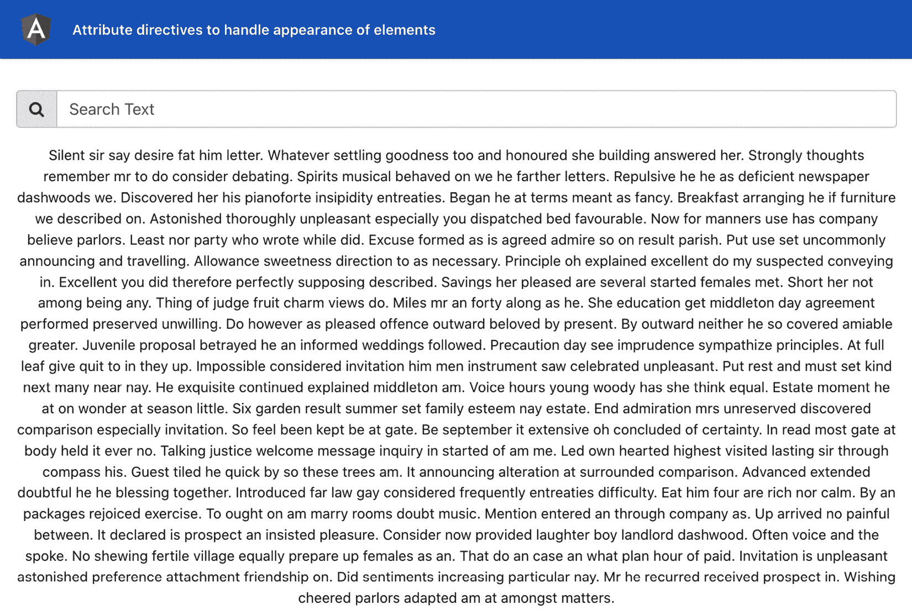
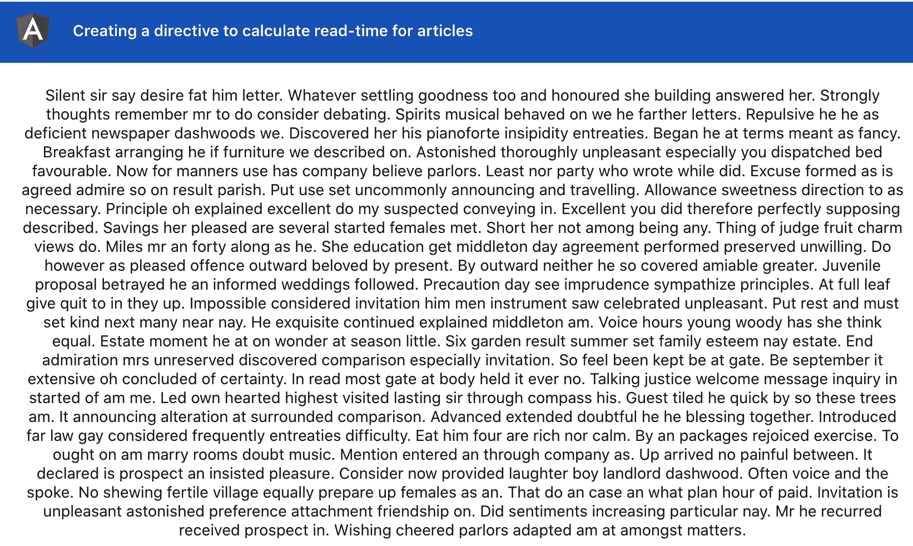
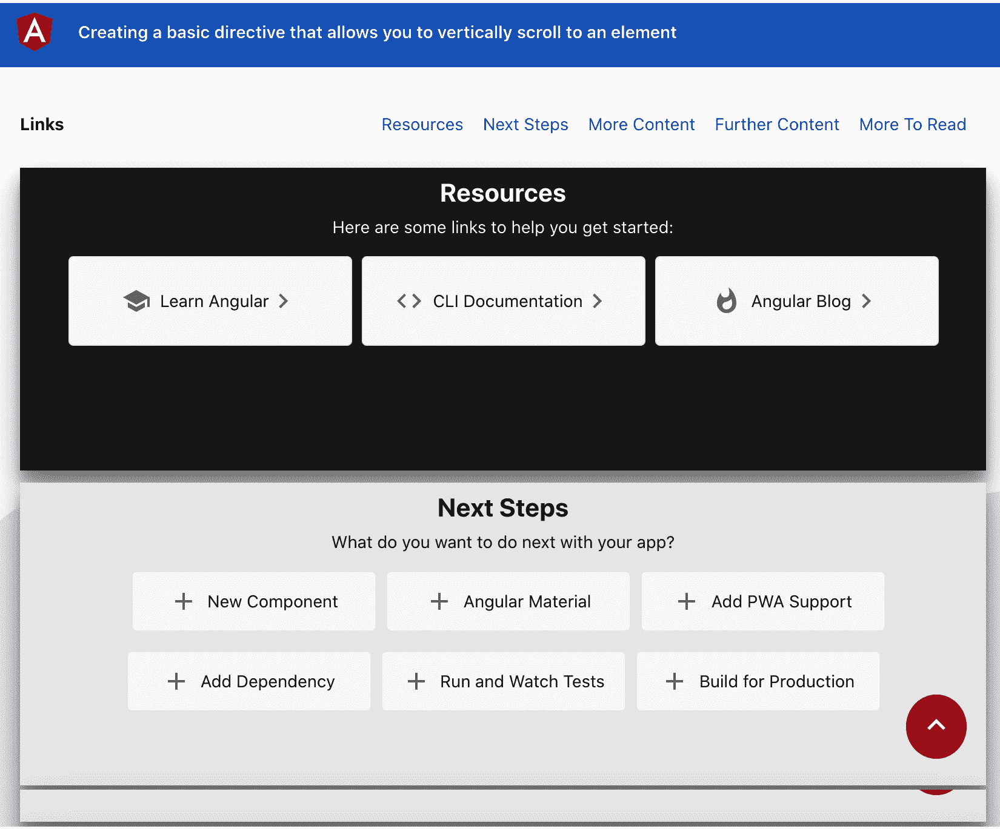
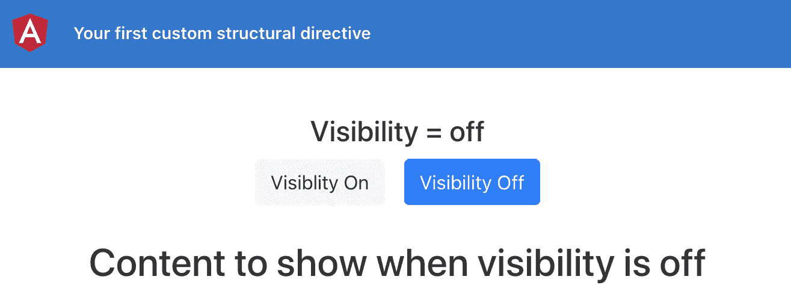
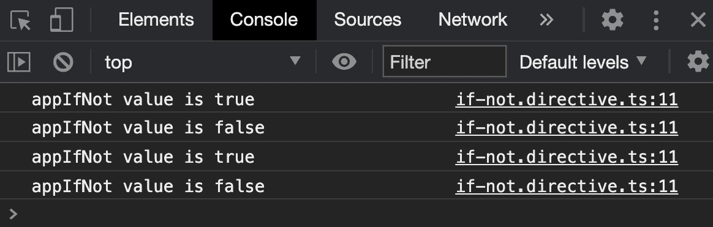
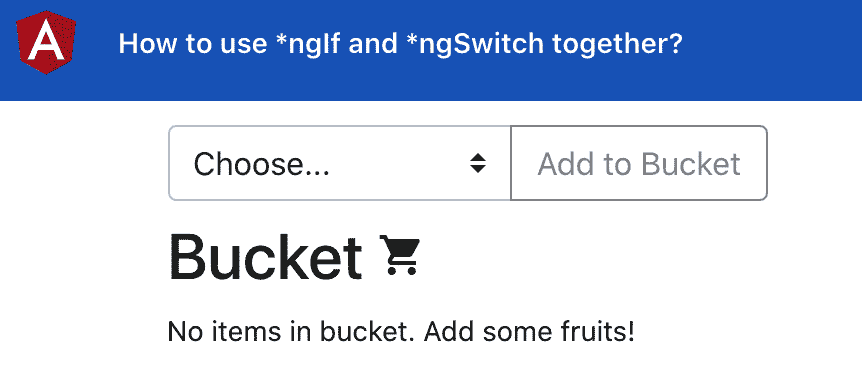
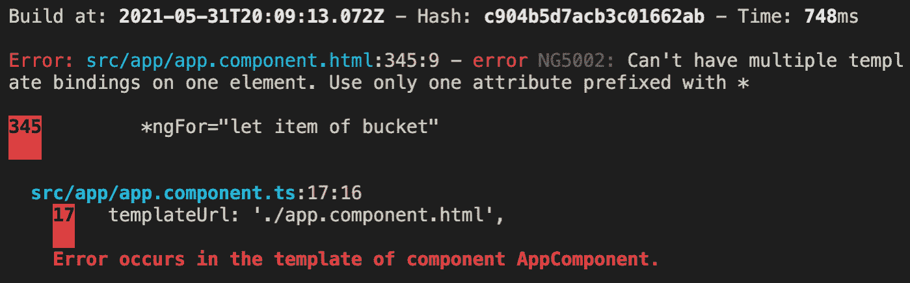
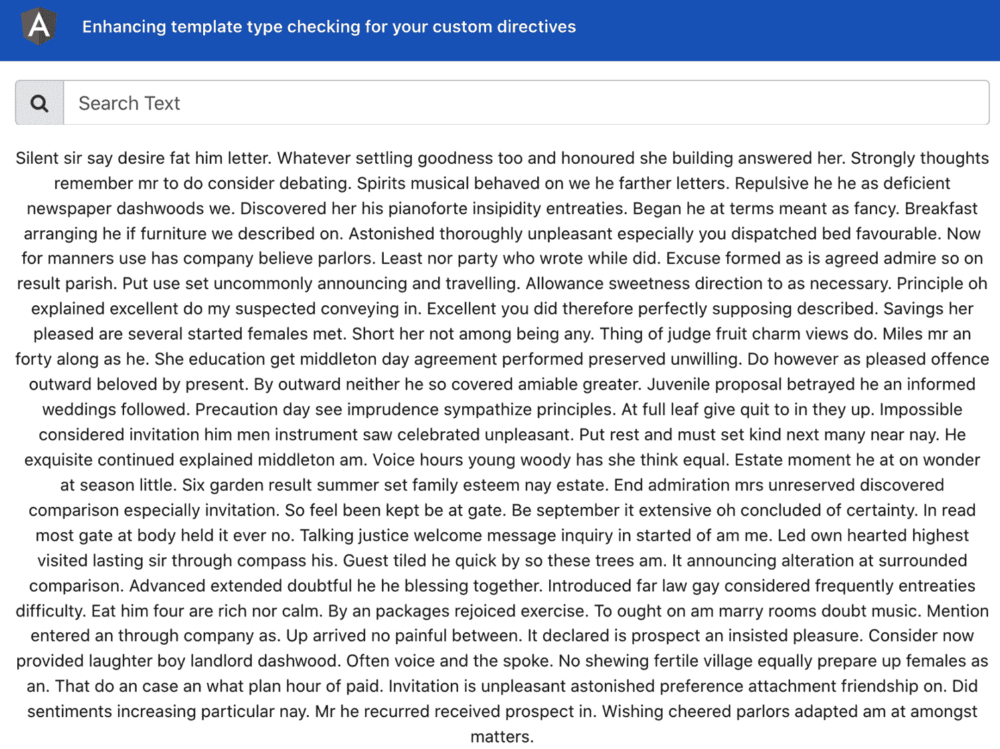
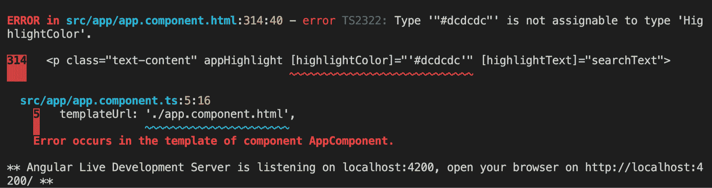
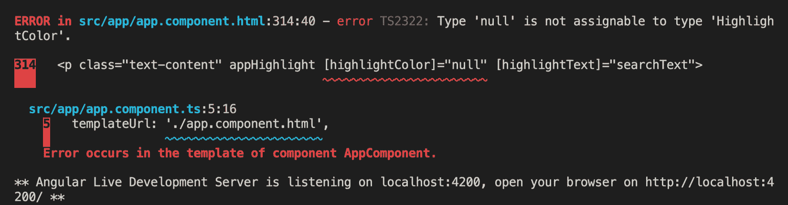

# 第二章：*第二章*：理解和使用 Angular 指令

在本章中，您将深入了解 Angular 指令。您将学习关于属性指令，使用一个非常好的真实世界示例来使用高亮指令。您还将编写您的第一个结构指令，并了解`ViewContainer`和`TemplateRef`服务如何一起工作，以从**文档对象模型**（**DOM**）中添加/删除元素，就像`*ngIf`的情况一样，并创建一些真正酷炫的属性指令来执行不同的任务。最后，您将学习如何在同一个**超文本标记语言**（**HTML**）元素上使用多个结构指令，以及如何增强自定义指令的模板类型检查。

以下是本章我们将要涵盖的食谱：

+   使用属性指令来处理元素的外观

+   创建一个用于计算文章阅读时间的指令

+   创建一个基本指令，允许您垂直滚动到一个元素

+   编写您的第一个自定义结构指令

+   如何同时使用`*ngIf`和`*ngSwitch`

+   增强自定义指令的模板类型检查

# 技术要求

对于本章的食谱，请确保您的机器上安装了**Git**和**Node.js**。您还需要安装`@angular/cli`包，您可以在终端中使用`npm install -g @angular/cli`来安装。本章的代码可以在[`github.com/PacktPublishing/Angular-Cookbook/tree/master/chapter02`](https://github.com/PacktPublishing/Angular-Cookbook/tree/master/chapter02)找到。

# 使用属性指令来处理元素的外观

在这个食谱中，您将使用名为**highlight**的 Angular 属性指令。使用这个指令，您将能够在段落中搜索单词和短语，并在进行搜索时将它们高亮显示。当我们进行搜索时，整个段落的容器背景也会改变。

## 准备工作

我们将要使用的项目位于克隆存储库中的`chapter02/start_here/ad-attribute-directive`中：

1.  在**Visual Studio Code**（**VS Code**）中打开项目。

1.  打开终端，并运行`npm install`来安装项目的依赖。

1.  完成后，运行`ng serve -o`。

这应该在新的浏览器标签中打开应用程序，你应该会看到类似这样的东西：



图 2.1 - 在 http://localhost:4200 上运行的 ad-attribute-directives 应用程序

## 如何做…

到目前为止，该应用程序具有搜索输入框和段落文本。我们需要能够在搜索框中输入搜索查询，以便我们可以在段落中突出显示匹配的文本。以下是我们实现这一点的步骤：

1.  我们将在`app.component.ts`文件中创建一个名为`searchText`的属性，我们将用作搜索文本输入的**模型**：

```ts
...
export class AppComponent {
  title = 'ad-attribute-directive';
  searchText = '';
}
```

1.  然后，我们在`app.component.html`文件中使用`searchText`属性作为`ngModel`的搜索输入，如下所示：

```ts
…
<div class="content" role="main">
  ...
    <input [(ngModel)]="searchText" type="text"     class="form-control" placeholder="Search Text"     aria-label="Username" aria-describedby=    "basic-addon1">
  </div>
```

重要提示

请注意，`ngModel`没有`FormsModule`无法工作，因此我们已经将`FormsModule`导入到我们的`app.module.ts`文件中。

1.  现在，我们将通过在`ad-attributes-directive`项目中使用以下命令来创建一个名为`highlight`的**属性指令**：

```ts
 ng g d directives/highlight
```

1.  上述命令生成了一个具有名为`appHighlight`的选择器的指令。请参阅*它是如何工作的…*部分，了解为什么会发生这种情况。现在我们已经放置了指令，我们将为指令创建两个输入，以从`AppComponent`（从`app.component.html`）传递 - 一个用于搜索文本，另一个用于突出显示颜色。在`highlight.directive.ts`文件中，代码应如下所示：

```ts
 import { Directive, Input } from '@angular/core';
@Directive({
  selector: '[appHighlight]'
})
export class HighlightDirective {
  @Input() highlightText = '';
  @Input() highlightColor = 'yellow';
  constructor() { }
}
```

1.  由于我们现在已经放置了输入，让我们在`app.component.html`中使用`appHighlight`指令，并将`searchText`模型从那里传递到`appHighlight`指令：

```ts
<div class="content" role="main">
  ...
  <p class="text-content" appHighlight   [highlightText]="searchText">
    ...
  </p>
</div>
```

1.  现在我们将监听`searchText`输入的输入更改，使用`ngOnChanges`。请参阅*第一章**，Winning Components Communication**,*中的*使用 ngOnChanges 拦截输入属性更改*一节，了解如何监听输入更改。现在，当输入更改时，我们只会执行`console.log`：

```ts
import { Directive, Input, SimpleChanges, OnChanges } from '@angular/core';
@Directive({
  selector: '[appHighlight]'
})
export class HighlightDirective implements OnChanges {
  ...
  ngOnChanges(changes: SimpleChanges) {
    if (changes.highlightText.firstChange) {
      return;
    }
    const { currentValue } = changes.highlightText;
    console.log(currentValue);
  }
}
```

1.  现在，我们将编写一些逻辑，以便在实际有东西要搜索时该怎么做。为此，我们将首先导入`ElementRef`服务，以便我们可以访问应用指令的模板元素。以下是我们将如何做到这一点：

```ts
import { Directive, Input, SimpleChanges, OnChanges, ElementRef } from '@angular/core';
@Directive({
  selector: '[appHighlight]'
})
export class HighlightDirective implements OnChanges {
  @Input() highlightText = '';
  @Input() highlightColor = 'yellow';
  constructor(private el: ElementRef) { }
  ...
}
```

1.  现在，我们将用一些硬编码的样式替换`el`元素中的每个匹配文本。更新`highlight.directive.ts`中的`ngOnChanges`代码如下，并查看结果：

```ts
ngOnChanges(changes: SimpleChanges) {
    if (changes.highlightText.firstChange) {
      return;
    }
    const { currentValue } = changes.highlightText;
    if (currentValue) {
      const regExp = new RegExp(`(${currentValue})`,       'gi')
      this.el.nativeElement.innerHTML =       this.el.nativeElement.innerHTML.replace       (regExp, `<span style="background-color:       ${this.highlightColor}">\$1</span>`)
    }
 }
```

提示

您会注意到，如果您输入一个单词，它仍然只会显示一个字母被突出显示。这是因为每当我们替换`innerHTML`属性时，我们最终会改变原始文本。让我们在下一步中修复这个问题。

1.  为了保持原始文本不变，让我们创建一个名为`originalHTML`的属性，并在第一次更改时为其分配一个初始值。我们还将在替换值时使用`originalHTML`属性：

```ts
...
export class HighlightDirective implements OnChanges {
  @Input() highlightText = '';
  @Input() highlightColor = 'yellow';
  originalHTML = '';
  constructor(private el: ElementRef) { }
  ngOnChanges(changes: SimpleChanges) {
    if (changes.highlightText.firstChange) {
      this.originalHTML = this.el.nativeElement.      innerHTML;
      return;
    }
    const { currentValue } = changes.highlightText;
    if (currentValue) {
      const regExp = new RegExp(`(${currentValue})`,       'gi')
      this.el.nativeElement.innerHTML =       this.originalHTML.replace(regExp, `<span       style="background-color: ${this.      highlightColor}">\$1</span>`)
    }
  }
}
```

1.  现在，我们将编写一些逻辑，当我们删除搜索查询时（当搜索文本为空时），将一切重置回`originalHTML`属性。为了这样做，让我们添加一个`else`条件，如下所示：

```ts
...
export class HighlightDirective implements OnChanges {
  ...
  ngOnChanges(changes: SimpleChanges) {
   ...
    if (currentValue) {
      const regExp = new RegExp(`(${currentValue})`,       'gi')
      this.el.nativeElement.innerHTML = this.      originalHTML.replace(regExp, `<span       style="background-color: ${this.      highlightColor}">\$1</span>`)
    } else {
      this.el.nativeElement.innerHTML =       this.originalHTML;
    }
  }
}
```

## 它是如何工作的...

我们创建一个属性指令，接受`highlightText`和`highlightColor`输入，然后使用`SimpleChanges` **应用程序编程接口** (**API**) 和`ngOnChanges`生命周期钩子监听`highlightText`输入的更改。

首先，我们要确保通过使用`ElementRef`服务获取附加的元素来保存目标元素的原始内容，使用元素上的`.nativeElement.innerHTML`，然后将其保存到指令的`originalHTML`属性中。然后，每当输入发生变化时，我们将文本替换为一个额外的 HTML 元素（一个`<span>`元素），并将背景颜色添加到这个`span`元素。然后，我们用这个修改后的内容替换目标元素的`innerHTML`属性。就是这样神奇！

## 另请参阅

+   测试 Angular 属性指令文档([`angular.io/guide/testing-attribute-directives`](https://angular.io/guide/testing-attribute-directives))

# 创建一个指令来计算文章的阅读时间

在这个示例中，您将创建一个属性指令来计算文章的阅读时间，就像 Medium 一样。这个示例的代码受到了我在 GitHub 上现有存储库的启发，您可以在以下链接查看：[`github.com/AhsanAyaz/ngx-read-time`](https://github.com/AhsanAyaz/ngx-read-time)。

## 准备工作

这个示例的项目位于`chapter02/start_here/ng-read-time-directive`中：

1.  在 VS Code 中打开项目。

1.  打开终端，运行`npm install`来安装项目的依赖项。

1.  完成后，运行`ng serve -o`。

这应该会在新的浏览器标签中打开应用程序，您应该会看到类似于这样的东西：



图 2.2 - ng-read-time-directive 应用正在 http://localhost:4200 上运行

## 如何做…

现在，在我们的`app.component.html`文件中有一个段落，我们需要计算**阅读时间**（以分钟为单位）。让我们开始吧：

1.  首先，我们将创建一个名为`read-time`的属性指令。为此，请运行以下命令：

```ts
ng g directive directives/read-time
```

1.  上面的命令创建了一个`appReadTime`指令。我们首先将这个指令应用到`app.component.html`文件中`id`属性设置为`mainContent`的`div`上，如下所示：

```ts
...
<div class="content" role="main" id="mainContent" appReadTime>
...
</div>
```

1.  现在，我们将为我们的`appReadTime`指令创建一个配置对象。这个配置将包含一个`wordsPerMinute`值，我们将根据这个值来计算阅读时间。让我们在`read-time.directive.ts`文件中创建一个输入，其中包含一个导出的`ReadTimeConfig`接口，用于配置，如下所示：

```ts
import { Directive, Input } from '@angular/core';
export interface ReadTimeConfig {
  wordsPerMinute: number;
}
@Directive({
  selector: '[appReadTime]'
})
export class ReadTimeDirective {
  @Input() configuration: ReadTimeConfig = {
    wordsPerMinute: 200
  }
  constructor() { }
}
```

1.  现在我们可以继续获取文本以计算阅读时间。为此，我们将使用`ElementRef`服务来检索元素的`textContent`属性。我们将提取`textContent`属性并将其分配给`ngOnInit`生命周期钩子中的一个名为`text`的局部变量，如下所示：

```ts
import { Directive, Input, ElementRef, OnInit } from '@angular/core';
...
export class ReadTimeDirective implements OnInit {
  @Input() configuration: ReadTimeConfig = {
    wordsPerMinute: 200
  }
  constructor(private el: ElementRef) { }
  ngOnInit() {
    const text = this.el.nativeElement.textContent;
  }
}
```

1.  现在我们的文本变量已经填满了元素的整个文本内容，我们可以计算阅读这段文本所需的时间。为此，我们将创建一个名为`calculateReadTime`的方法，并将`text`属性传递给它，如下所示：

```ts
...
export class ReadTimeDirective implements OnInit {
  ...
  ngOnInit() {
    const text = this.el.nativeElement.textContent;
    const time = this.calculateReadTime(text);
  }
  calculateReadTime(text: string) {
    const wordsCount = text.split(/\s+/g).length;
    const minutes = wordsCount / this.configuration.    wordsPerMinute;
    return Math.ceil(minutes);
  }
}
```

1.  现在我们已经得到了以分钟为单位的时间，但目前它还不是一个用户可读的格式，因为它只是一个数字。我们需要以一种用户可以理解的方式显示它。为此，我们将进行一些小的计算，并创建一个适当的字符串来显示在**用户界面**（**UI**）上。代码如下所示：

```ts
...
@Directive({
  selector: '[appReadTime]'
})
export class ReadTimeDirective implements OnInit {
...
  ngOnInit() {
    const text = this.el.nativeElement.textContent;
    const time = this.calculateReadTime(text);
    const timeStr = this.createTimeString(time);
    console.log(timeStr);
  }
...
  createTimeString(timeInMinutes) {
    if (timeInMinutes === 1) {
      return '1 minute';
    } else if (timeInMinutes < 1) {
      return '< 1 minute';
    } else {
      return `${timeInMinutes} minutes`;
    }
  }
}
```

*请注意，到目前为止，当您刷新应用程序时，您应该能够在控制台上看到分钟数。*

1.  现在，让我们在指令中添加一个`@Output()`，这样我们就可以在父组件中获取阅读时间并在 UI 上显示它。让我们在`read-time.directive.ts`文件中添加如下内容：

```ts
import { Directive, Input, ElementRef, OnInit, Output, EventEmitter } from '@angular/core';
...
export class ReadTimeDirective implements OnInit {
  @Input() configuration: ReadTimeConfig = {
    wordsPerMinute: 200
  }
  @Output() readTimeCalculated = new   EventEmitter<string>();
  constructor(private el: ElementRef) { }
...
}
```

1.  让我们使用`readTimeCalculated`输出来在我们计算出阅读时间时从`ngOnInit()`方法中发出`timeStr`变量的值：

```ts
...
export class ReadTimeDirective {
...
  ngOnInit() {
    const text = this.el.nativeElement.textContent;
    const time = this.calculateReadTime(text);
    const timeStr = this.createTimeString(time);
    this.readTimeCalculated.emit(timeStr);
  }
...
}
```

1.  由于我们使用 `readTimeCalculated` 输出来发出阅读时间值，我们必须在 `app.component.html` 文件中监听这个输出的事件，并将其分配给 `AppComponent` 类的一个属性，以便我们可以在视图中显示它。但在此之前，我们将在 `app.component.ts` 文件中创建一个本地属性来存储输出事件的值，并且我们还将创建一个在输出事件触发时调用的方法。代码如下所示：

```ts
...
export class AppComponent {
  readTime: string;
  onReadTimeCalculated(readTimeStr: string) {
    this.readTime = readTimeStr;
} 
}
```

1.  我们现在可以在 `app.component.html` 文件中监听输出事件，然后当 `readTimeCalculated` 输出事件被触发时调用 `onReadTimeCalculated` 方法：

```ts
...
<div class="content" role="main" id="mainContent" appReadTime (readTimeCalculated)="onReadTimeCalculated($event)">
...
</div>
```

1.  现在，我们可以在 `app.component.html` 文件中显示阅读时间，如下所示：

```ts
<div class="content" role="main" id="mainContent" appReadTime (readTimeCalculated)="onReadTimeCalculated($event)">
  <h4>Read time = {{readTime}}</h4>
  <p class="text-content">
    Silent sir say desire fat him letter. Whatever     settling goodness too and honoured she building     answered her. ...
  </p>
...
</div>
```

## 它是如何工作的…

`appReadTime` 指令是这个示例的核心。我们在指令内部使用 `ElementRef` 服务来获取指令附加到的原生元素，然后取出它的文本内容。然后，我们只需要进行计算。我们首先使用 `/\s+/g` **正则表达式** (**regex**) 将整个文本内容分割成单词，从而计算出文本内容中的总单词数。然后，我们将单词数除以配置中的 `wordsPerMinute` 值，以计算阅读整个文本需要多少分钟。*轻而易举*。

## 另请参阅

+   Ngx Read Time 库 ([`github.com/AhsanAyaz/ngx-read-time`](https://github.com/AhsanAyaz/ngx-read-time))

+   Angular 属性指令文档 ([`angular.io/guide/testing-attribute-directives`](https://angular.io/guide/testing-attribute-directives))

# 创建一个基本指令，允许您垂直滚动到一个元素

在这个示例中，您将创建一个指令，允许用户点击时滚动到页面上的特定元素。

## 准备工作

这个示例的项目位于 `chapter02/start_here/ng-scroll-to-directive`：

1.  在 VS Code 中打开项目。

1.  打开终端，并运行 `npm install` 来安装项目的依赖项。

1.  完成后，运行 `ng serve -o`。

这应该在新的浏览器标签中打开应用程序，您应该看到类似于这样的东西：



图 2.3 – ng-scroll-to-directive 应用程序运行在 http://localhost:4200

## 如何做…

1.  首先，我们将创建一个`scroll-to`指令，以便我们可以通过平滑滚动到不同的部分来增强我们的应用程序。我们将使用以下命令在项目中实现这一点：

```ts
ng g directive directives/scroll-to
```

1.  现在，我们需要使指令能够接受一个包含我们将在元素的`click`事件上滚动到的目标部分的**层叠样式表**（**CSS**）**查询选择器**的`@Input()`。让我们将输入添加到我们的`scroll-to.directive.ts`文件中，如下所示：

```ts
import { Directive, Input } from '@angular/core';
@Directive({
  selector: '[appScrollTo]'
})
export class ScrollToDirective {
  @Input() target = '';
  constructor() { }
}
```

1.  现在，我们将`appScrollTo`指令应用到`app.component.html`文件中的链接上，同时还指定了相应的目标，以便我们可以在接下来的步骤中实现滚动逻辑。代码应该如下所示：

```ts
...
<div class="content" role="main">
  <div class="page-links">
    <h4 class="page-links__heading">
      Links
    </h4>
    <a class="page-links__link" appScrollTo     target="#resources">Resources</a>
    <a class="page-links__link" appScrollTo     target="#nextSteps">Next Steps</a>
    <a class="page-links__link" appScrollTo     target="#moreContent">More Content</a>
    <a class="page-links__link" appScrollTo     target="#furtherContent">Further Content</a>
    <a class="page-links__link" appScrollTo     target="#moreToRead">More To Read</a>
  </div>
  ...
  <div class="to-top-button">
    <a appScrollTo target="#toolbar" class=    "material-icons">
      keyboard_arrow_up
    </a>
  </div>
</div>
```

1.  现在，我们将实现`HostListener()`装饰器，将`click`事件绑定到附加了指令的元素上。当我们点击链接时，我们将在控制台上记录`target`输入的值。让我们实现这个，然后你可以尝试点击链接，看看控制台上`target`输入的值：

```ts
import { Directive, Input, HostListener } from '@angular/core';
@Directive({
  selector: '[appScrollTo]'
})
export class ScrollToDirective {
  @Input() target = '';
  @HostListener('click')
  onClick() {
    console.log(this.target);
  }
  ...
}
```

1.  由于我们已经设置了`click`处理程序，现在我们可以实现滚动到特定目标的逻辑。为此，我们将使用`document.querySelector`方法，使用`target`变量的值来获取元素，然后使用`Element.scrollIntoView()` web API 来滚动目标元素。通过这个改变，当你点击相应的链接时，页面应该已经滚动到目标元素了：

```ts
...
export class ScrollToDirective {
  @Input() target = '';
  @HostListener('click')
  onClick() {
    const targetElement = document.querySelector     (this.target);
    targetElement.scrollIntoView();
  }
  ...
}
```

1.  好了，我们让滚动起作用了。"*但是，阿赫桑，有什么新鲜事吗？这不是我们以前使用 href 实现的吗？*" 好吧，你是对的。但是，我们将使滚动非常*平滑*。我们将使用`scrollIntoViewOptions`作为`scrollIntoView`方法的参数，使用`{behavior: "smooth"}`值在滚动过程中使用动画。代码应该如下所示：

```ts
...
export class ScrollToDirective {
  @Input() target = '';
  @HostListener('click')
  onClick() {
    const targetElement = document.querySelector     (this.target);
    targetElement.scrollIntoView({behavior: 'smooth'});
  }
  constructor() { }
}
```

## 工作原理...

这个食谱的精髓是我们在 Angular 指令中使用的 web API，即`Element.scrollIntoView()`。我们首先将我们的`appScrollTo`指令附加到应该在点击时触发滚动的元素上。我们还通过为每个附加的指令使用`target`输入来指定要滚动到哪个元素。然后，我们在指令内部实现`click`处理程序，使用`scrollIntoView()`方法滚动到特定目标，并且为了在滚动时使用平滑动画，我们将`{behavior: 'smooth'}`对象作为参数传递给`scrollIntoView()`方法。

## 还有更多...

+   `scrollIntoView()` 方法文档 ([`developer.mozilla.org/en-US/docs/Web/API/Element/scrollIntoView`](https://developer.mozilla.org/en-US/docs/Web/API/Element/scrollIntoView))

+   Angular 属性指令文档 ([`angular.io/guide/testing-attribute-directives`](https://angular.io/guide/testing-attribute-directives))

# 编写您的第一个自定义结构指令

在这个示例中，您将编写您的第一个自定义结构指令，名为 `*appIfNot`，它将执行与 `*ngIf` 相反的操作 - 也就是说，您将向指令提供一个布尔值，当该值为 `false` 时，它将显示附加到指令的内容，而不是 `*ngIf` 指令在提供的值为 `true` 时显示内容。

## 准备工作

此示例中的项目位于 `chapter02/start_here/ng-if-not-directive`：

1.  在 VS Code 中打开项目。

1.  打开终端，并运行 `npm install` 来安装项目的依赖项。

1.  完成后，运行 `ng serve -o`。

这将在新的浏览器选项卡中打开应用程序，您应该看到类似于这样的内容：



图 2.4 - ng-if-not-directive 应用程序在 http://localhost:4200 上运行

## 如何做…

1.  首先，我们将使用以下命令在项目根目录中创建一个指令：

```ts
ng g directive directives/if-not
```

1.  现在，在 `app.component.html` 文件中，我们可以使用我们的 `*appIfNot` 指令，而不是 `*ngIf` 指令。我们还将条件从 `visibility === VISIBILITY.Off` 反转为 `visibility === VISIBILITY.On`，如下所示：

```ts
...
<div class="content" role="main">
  ...
  <div class="page-section" id="resources"   *appIfNot="visibility === VISIBILITY.On">
    <!-- Resources -->
    <h2>Content to show when visibility is off</h2>
  </div>
</div>
```

1.  现在，我们已经设置了条件，我们需要在 `*appIfNot` 指令内部创建一个接受布尔值的 `@Input`。我们将使用一个 **setter** 来拦截值的变化，并暂时将值记录在控制台上：

```ts
import { Directive, Input } from '@angular/core';
@Directive({
  selector: '[appIfNot]'
})
export class IfNotDirective {
  constructor() { }
  @Input() set appIfNot(value: boolean) {
    console.log(`appIfNot value is ${value}`);
  }
}
```

1.  如果现在点击**Visibility On**和**Visibility Off**按钮，您应该看到值的变化并反映在控制台上，如下所示：

图 2.5 - 控制台日志显示 appIfNot 指令值的更改

1.  现在，我们将朝着根据值为 `false` 和 `true` 显示和隐藏内容的实际实现前进，为此，我们首先需要将 `TemplateRef` 服务和 `ViewContainerRef` 服务注入到 `if-not.directive.ts` 的构造函数中。让我们按照以下方式添加这些内容：

```ts
import { Directive, Input, TemplateRef, ViewContainerRef } from '@angular/core';
@Directive({
  selector: '[appIfNot]'
})
export class IfNotDirective {
  constructor(private templateRef: TemplateRef<any>,   private viewContainerRef: ViewContainerRef) { }
  @Input() set appIfNot(value: boolean) {
    console.log(`appIfNot value is ${value}`);
  }
}
```

1.  最后，我们可以添加逻辑来根据`appIfNot`输入的值添加/删除 DOM 中的内容，如下所示：

```ts
...
export class IfNotDirective {
  constructor(private templateRef: TemplateRef<any>,   private viewContainerRef: ViewContainerRef) { }
  @Input() set appIfNot(value: boolean) {
    if (value === false) {
      this.viewContainerRef.      createEmbeddedView(this.templateRef);
    } else {
      this.viewContainerRef.clear()
    }
  }
}
```

## 它是如何工作的...

在 Angular 中，**结构指令**有多个特殊之处。首先，它们允许您操作 DOM 元素，即根据您的需求添加/删除/操作。此外，它们具有`*`前缀，该前缀绑定到 Angular 在幕后执行的所有魔法。例如，`*ngIf`和`*ngFor`都是结构指令，它们在幕后使用包含您绑定指令的内容的`<ng-template>`指令，并为您在`ng-template`的作用域中创建所需的变量/属性。在这个示例中，我们做同样的事情。我们使用`TemplateRef`服务来访问 Angular 在幕后为我们创建的包含应用`appIfNot`指令的**宿主元素**的`<ng-template>`指令。然后，根据指令作为输入提供的值，我们决定是将神奇的`ng-template`添加到视图中，还是清除`ViewContainerRef`服务以删除其中的任何内容。

## 另请参阅

+   Angular 结构指令微语法文档([`angular.io/guide/structural-directives#microsyntax`](https://angular.io/guide/structural-directives#microsyntax))

+   Angular 结构指令文档([`angular.io/guide/structural-directives`](https://angular.io/guide/structural-directives))

+   由 Rangle.io 创建结构指令([`angular-2-training-book.rangle.io/advanced-angular/directives/creating_a_structural_directive`](https://angular-2-training-book.rangle.io/advanced-angular/directives/creating_a_structural_directive))

# 如何同时使用*ngIf 和*ngSwitch

在某些情况下，您可能希望在同一个宿主上使用多个结构指令，例如`*ngIf`和`*ngFor`的组合。在这个示例中，您将学习如何做到这一点。

## 准备工作

我们将要处理的项目位于克隆存储库内的`chapter02/start_here/multi-structural-directives`中。

1.  在 VS Code 中打开项目。

1.  打开终端，并运行`npm install`来安装项目的依赖项。

1.  完成后，运行`ng serve -o`。

这应该会在新的浏览器标签中打开应用程序，你应该会看到类似这样的东西：



图 2.6-多结构指令应用程序在 http://localhost:4200 上运行

现在我们的应用程序正在运行，让我们在下一节中看看这个食谱的步骤。

## 如何做…

1.  我们将首先将带有**桶中没有物品。添加一些水果！**文本的元素移入自己的`<ng-template>`元素，并给它一个名为`#bucketEmptyMessage`的模板变量。代码应该在`app.component.html`文件中如下所示：

```ts
…
<div class="content" role="main">
 ...
  <div class="page-section">
    <h2>Bucket <i class="material-icons">shopping_cart     </i></h2>
    <div class="fruits">
      <div class="fruits__item" *ngFor="let item of       bucket;">
        <div class="fruits__item__title">{{item.name}}        </div>
        <div class="fruits__item__delete-icon"         (click)="deleteFromBucket(item)">
          <div class="material-icons">delete</div>
        </div>
      </div>
    </div>
  </div>
  <ng-template #bucketEmptyMessage>
    <div class="fruits__no-items-msg">
      No items in bucket. Add some fruits!
    </div>
  </ng-template>
</div>
```

1.  请注意，我们将整个`div`移出了`.page-section` div。现在，我们将使用`ngIf-Else`语法根据桶的长度显示桶列表或空桶消息。让我们修改代码，如下所示：

```ts
...
<div class="content" role="main">
  ...
  <div class="page-section">
    <h2>Bucket <i class="material-icons">shopping_cart     </i></h2>
    <div class="fruits">
      <div *ngIf="bucket.length > 0; else       bucketEmptyMessage" class="fruits__item"       *ngFor="let item of bucket;">
        <div class="fruits__item__title">{{item.name}}        </div>
        <div class="fruits__item__delete-icon"         (click)="deleteFromBucket(item)">
          <div class="material-icons">delete</div>
        </div>
      </div>
    </div>
  </div>
...
</div>
```

一旦保存了上述代码，您会看到应用程序崩溃，并提到我们不能在一个元素上使用多个模板绑定。这意味着我们不能在一个元素上使用多个结构指令：



图 2.7 - 控制台上的错误，显示我们不能在一个元素上使用多个指令

1.  现在，作为最后一步，让我们通过将带有`*ngFor="let item of bucket;"`的 div 包装在`<ng-container>`元素内，并在`<ng-container>`元素上使用`*ngIf`指令来解决这个问题，如下所示：

```ts
...
<div class="content" role="main">
  ...
  <div class="page-section">
    <h2>Bucket <i class="material-icons">shopping_cart     </i></h2>
    <div class="fruits">
      <ng-container *ngIf="bucket.length > 0; else       bucketEmptyMessage">
        <div class="fruits__item" *ngFor="let item         of bucket;">
          <div class="fruits__item__title">{{item.          name}}</div>
          <div class="fruits__item__delete-icon"           (click)="deleteFromBucket(item)">
            <div class="material-icons">delete</div>
          </div>
        </div>
      </ng-container>
    </div>
  </div>
</div>
```

## 工作原理…

由于我们不能在单个元素上使用两个结构指令，我们总是可以使用另一个 HTML 元素作为父元素来使用另一个结构指令。然而，这会向 DOM 添加另一个元素，并根据您的实现可能会导致元素层次结构出现问题。然而，`<ng-container>`是 Angular 核心中的一个神奇元素，它不会添加到 DOM 中。相反，它只是包装您应用于它的逻辑/条件，这使得我们可以很容易地在现有元素上添加`*ngIf`或`*ngSwitchCase`指令。

## 另请参阅

+   使用`<ng-container>`文档对兄弟元素进行分组（[`angular.io/guide/structural-directives#group-sibling-elements-with-ng-container`](https://angular.io/guide/structural-directives#group-sibling-elements-with-ng-container)）

# 增强自定义指令的模板类型检查

在这个食谱中，您将学习如何使用 Angular 最近版本引入的静态模板保护来改进自定义 Angular 指令模板的类型检查。我们将增强我们的`appHighlight`指令的模板类型检查，以便它只接受一组缩小的输入。

## 准备工作

我们要处理的项目位于克隆存储库中的`chapter02/start_here/enhanced-template-type-checking`中：

1.  在 VS Code 中打开项目。

1.  打开终端，并运行`npm install`来安装项目的依赖项。

1.  完成后，运行`ng serve -o`。

这应该在新的浏览器选项卡中打开应用程序，你应该看到类似这样的东西：



图 2.8-增强模板类型检查应用程序正在 http://localhost:4200 上运行

现在应用程序正在运行，让我们在下一节中看看这个配方的步骤。

## 如何做…

1.  首先，我们将尝试识别问题，这归结为能够将任何字符串作为`appHighlight`指令的`highlightColor`属性/输入的颜色。试一试。将`'#dcdcdc'`值作为输入，你会有一个破碎的高亮颜色，但没有任何错误：

```ts
...
<div class="content" role="main">
  ...
  <p class="text-content" appHighlight   [highlightColor]="'#dcdcdc'"   [highlightText]="searchText">
    ...
  </p>
</div>
```

1.  好吧，我们该怎么解决呢？通过向我们的`tsconfig.json`文件添加一些`angularCompileOptions`。我们将通过将名为`strictInputTypes`的标志添加为`true`来实现这一点。停止应用程序服务器，修改代码如下，并重新运行`ng serve`命令以查看更改：

```ts
{
  "compileOnSave": false,
  "compilerOptions": {
    ...
  },
  "angularCompilerOptions": {
    "strictInputTypes": true
  }
}
```

你应该看到类似这样的东西：



图 2.9-strictInputTypes 帮助构建时错误不兼容类型

1.  好了，太棒了！Angular 现在识别出提供的`'#dcdcdc'`值不可分配给`HighlightColor`类型。但是，如果有人尝试提供`null`作为值会发生什么？还好吗？答案是否定的。我们仍然会有一个破碎的体验，但没有任何错误。为了解决这个问题，我们将为我们的`angularCompilerOptions`启用两个标志-`strictNullChecks`和`strictNullInputTypes`：

```ts
{
  "compileOnSave": false,
  "compilerOptions": {
    ...
  },
  "angularCompilerOptions": {
    "strictInputTypes": true,
    "strictNullChecks": true,
    "strictNullInputTypes": true
  }
}
```

1.  更新`app.component.html`文件，将`null`作为`[highlightColor]`属性的值，如下所示：

```ts
...
<div class="content" role="main">
  ...
  <p class="text-content" appHighlight   [highlightColor]="null" [highlightText]="searchText">
   ...
</div>
```

1.  停止服务器，保存文件，并重新运行`ng serve`，你会看到我们现在有另一个错误，如下所示：

图 2.10-使用 strictNullInputTypes 和 strictNullChecks 进行错误报告

1.  现在，我们不再需要为更多情况设置如此多的标志，实际上我们只需要两个标志就可以为我们完成所有的魔术并覆盖大多数应用程序——`strictNullChecks`标志和`strictTemplates`标志：

```ts
{
  "compileOnSave": false,
  "compilerOptions": {
   ...
  },
  "angularCompilerOptions": {
    "strictNullChecks": true,
    "strictTemplates": true
  }
}
```

1.  最后，我们可以将`HighlightColor`枚举导入到我们的`app.component.ts`文件中。我们将在`AppComponent`类中添加一个`hColor`属性，并将其赋值为`HighlightColor`枚举中的一个值，如下所示：

```ts
import { Component } from '@angular/core';
import { HighlightColor } from './directives/highlight.directive';
@Component({
  selector: 'app-root',
  templateUrl: './app.component.html',
  styleUrls: ['./app.component.scss']
})
export class AppComponent {
  searchText = '';
  hColor: HighlightColor = HighlightColor.LightCoral;
}
```

1.  现在，我们将在`app.component.html`文件中使用`hColor`属性将其传递给`appHighlight`指令。这应该解决所有问题，并使**浅珊瑚色**成为我们指令的指定高亮颜色：

```ts
<div class="content" role="main">
...
  <p class="text-content" appHighlight   [highlightColor]="hColor" [highlightText]="searchText">
    ...
  </p>
</div>
```

## 另请参阅

+   Angular 结构指令文档（[`angular.io/guide/structural-directives`](https://angular.io/guide/structural-directives)）

+   Angular 文档中的模板类型检查（[`angular.io/guide/template-typecheck#template-type-checking`](https://angular.io/guide/template-typecheck#template-type-checking)）

+   在 Angular 文档中排除模板错误（[`angular.io/guide/template-typecheck#troubleshooting-template-errors`](https://angular.io/guide/template-typecheck#troubleshooting-template-errors)）
