# 第三章：*第三章*：Angular 中的依赖注入的魔力

本章主要讲解 Angular 中**依赖注入**（**DI**）的魔力。在这里，您将学习有关 Angular 中 DI 概念的详细信息。DI 是 Angular 用来将不同的依赖项注入到组件、指令和服务中的过程。您将使用几个示例来使用服务和提供程序，以获得一些实践经验，这些经验可以在以后的 Angular 项目中使用。

在本章中，我们将涵盖以下内容：

+   使用 DI 令牌配置注入器

+   可选依赖项

+   使用`providedIn`创建单例服务

+   使用`forRoot()`创建单例服务

+   使用相同的别名类提供程序为应用程序提供不同的服务

+   Angular 中的值提供程序

## 技术要求

对于本章的示例，请确保您的机器上安装了**Git**和**NodeJS**。您还需要安装`@angular/cli`包，可以在终端中使用`npm install -g @angular/cli`来安装。本章的代码可以在[`github.com/PacktPublishing/Angular-Cookbook/tree/master/chapter03`](https://github.com/PacktPublishing/Angular-Cookbook/tree/master/chapter03)找到。

# 使用 DI 令牌配置注入器

在这个示例中，您将学习如何为常规的 TypeScript 类创建一个基本的 DI 令牌，以便用作 Angular 服务。我们的应用程序中有一个服务（`UserService`），它当前使用`Greeter`类来创建一个具有`greet`方法的用户。由于 Angular 完全依赖于 DI 和服务，我们将实现一种方式来使用这个常规的 TypeScript 类，名为`Greeter`，作为 Angular 服务。我们将使用`InjectionToken`来创建一个 DI 令牌，然后使用`@Inject`装饰器来使我们能够在我们的服务中使用该类。

## 准备工作

我们将要处理的项目位于`chapter03/start_here/ng-di-token`中，该项目位于克隆存储库内。执行以下步骤：

1.  在 Visual Studio Code 中打开项目。

1.  打开终端并运行`npm install`来安装项目的依赖项。

1.  完成后，运行`ng serve -o`。

这应该在新的浏览器标签中打开应用程序；您应该看到类似以下截图的内容：

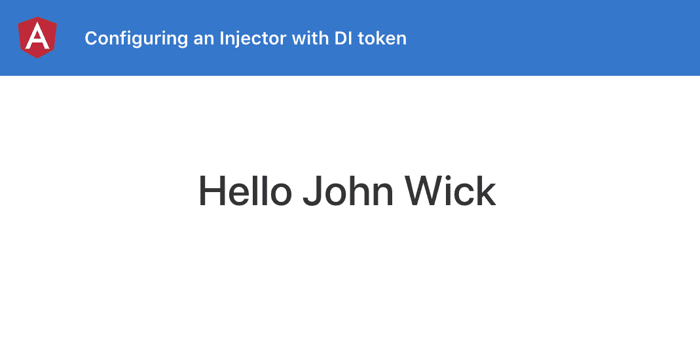

图 3.1- ng-di-token 应用程序在 http://localhost:4200 上运行

现在我们的应用程序正在运行，我们可以继续进行食谱的步骤。

## 如何做...

我们现在的应用程序向从我们的`UserService`中检索到的随机用户显示问候消息。而`UserService`使用`Greeter`类就像它是的。我们将不再将其作为类使用，而是使用 DI 将其作为 Angular 服务使用。我们将首先为我们的`Greeter`类创建一个`InjectionToken`，然后将其注入到我们的服务中。按照以下步骤进行：

1.  我们将在`greeter.class.ts`文件中创建一个`InjectionToken`，名为`'Greeter'`，使用`@angular/core`包中的`InjectionToken`类。此外，我们将从文件中导出此令牌：

```ts
import { InjectionToken } from '@angular/core';
import { User } from '../interfaces/user.interface';
export class Greeter implements User {
  ...
}
export const GREETER = new InjectionToken('Greeter', {
  providedIn: 'root',
  factory: () => Greeter
});
```

1.  现在，我们将使用`@angular/core`包中的`Inject`装饰器和`greeter.class.ts`中的`GREETER`令牌，以便我们可以在下一步中使用它们：

```ts
import { Inject, Injectable } from '@angular/core';
import { GREETER, Greeter } from '../classes/greeter.class';
@Injectable({
  providedIn: 'root'
})
export class UserService {
  ...
} 
```

1.  我们现在将使用`@Inject`装饰器在`UserService`的`constructor`中注入`Greeter`类作为 Angular 服务。

请注意，我们将使用`typeof Greeter`而不是只使用`Greeter`，因为我们需要稍后使用构造函数。

```ts
...
export class UserService {
  ...
  constructor(@Inject(GREETER) public greeter: typeof    Greeter) { }
  ...
}
```

1.  最后，我们可以通过使用注入的服务来替换`getUser`方法中`new Greeter(user)`的用法，如下所示：

```ts
...
export class UserService {
  ...
  getUser() {
    const user = this.users[Math.floor(Math.random()     * this.users.length)]
    return new this.greeter(user);
  }
}
```

现在我们知道了方法，让我们更仔细地看看它是如何工作的。

## 它是如何工作的

Angular 在服务中不认识普通的 TypeScript 类作为可注入的对象。然而，我们可以创建自己的注入令牌，并使用`@Inject`装饰器在可能的情况下注入它们。Angular 在后台识别我们的令牌并找到其对应的定义，通常是以工厂函数的形式。请注意，我们在令牌定义中使用了`providedIn: 'root'`。这意味着整个应用程序中只会有一个类的实例。

## 另请参阅

+   Angular 中的依赖注入（[`angular.io/guide/dependency-injection`](https://angular.io/guide/dependency-injection)）

+   InjectionToken 文档（[`angular.io/api/core/InjectionToken`](https://angular.io/api/core/InjectionToken)）

# 可选依赖

在 Angular 中，可选依赖项在您使用或配置可能存在或已在 Angular 应用程序中提供的依赖项时非常强大。在本示例中，我们将学习如何使用`@Optional`装饰器来配置组件/服务中的可选依赖项。我们将使用`LoggerService`，并确保我们的组件在未提供时不会中断。

## 准备工作

该示例项目位于`chapter03/start_here/ng-optional-dependencies`中。执行以下步骤：

1.  在 Visual Studio Code 中打开项目。

1.  打开终端，并运行`npm install`来安装项目的依赖项。

1.  完成后，运行`ng serve -o`。

这将在新的浏览器选项卡中打开应用程序。您应该看到类似以下截图的内容：

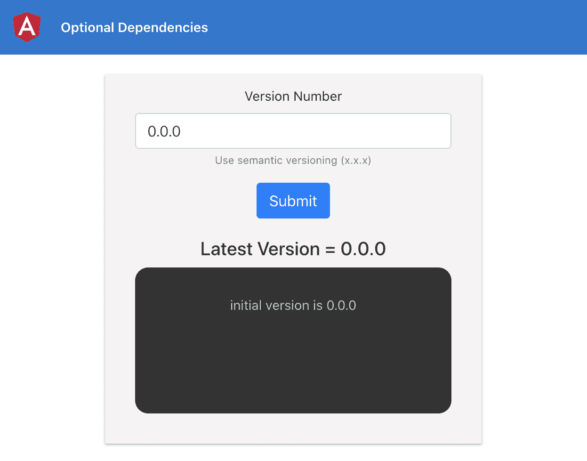

图 3.2 - ng-optional-dependencies 应用程序在 http://localhost:4200 上运行

现在我们的应用程序正在运行，我们可以继续进行该示例的步骤。

## 如何操作

我们将从一个具有`providedIn: 'root'`设置为其可注入配置的`LoggerService`的应用程序开始。我们将看到当我们没有在任何地方提供此服务时会发生什么。然后，我们将使用`@Optional`装饰器来识别和解决问题。按照以下步骤进行操作：

1.  首先，让我们运行应用程序并更改输入中的版本。

这将导致日志通过`LoggerService`保存在`localStorage`中。打开**Chrome Dev Tools**，导航到**Application**，选择**Local Storage**，然后点击`localhost:4200`。您将看到具有日志值的`key log_log`，如下所示：

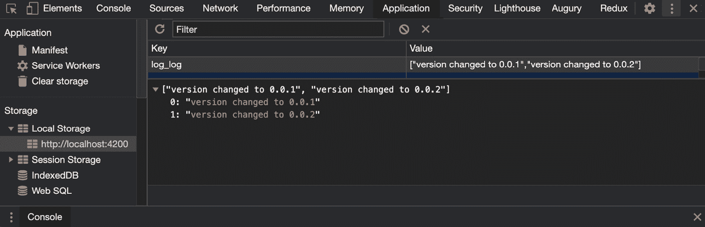

图 3.3 - 日志保存在 http://localhost:4200 的 localStorage 中

1.  现在，让我们尝试删除`@Injectable`装饰器中提供的`LoggerService`的配置，如下面的代码中所突出显示的那样：

```ts
import { Injectable } from '@angular/core';
import { Logger } from '../interfaces/logger';
@Injectable({ 
  providedIn: 'root' ← Remove
})
export class LoggerService implements Logger {
  ...
} 
```

这将导致 Angular 无法识别它，并向`VcLogsComponent`抛出错误：

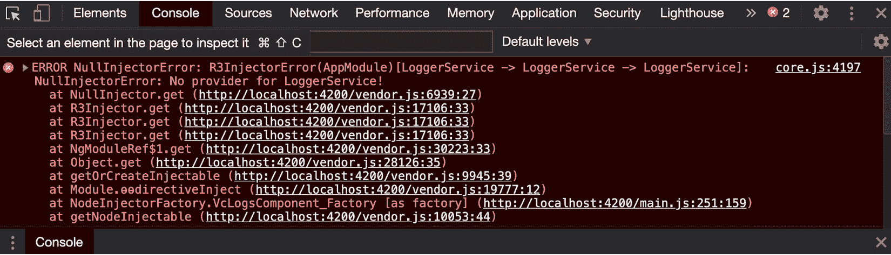

图 3.4 - 详细说明了 Angular 无法识别 LoggerService 的错误

1.  现在，我们可以使用`@Optional`装饰器将依赖项标记为可选。让我们从`@angular/core`包中导入它，并在`vc-logs.component.ts`文件中的`VcLogsComponent`构造函数中使用装饰器，如下所示：

```ts
import { Component, OnInit, Input, OnChanges, SimpleChanges, Optional } from '@angular/core';
...
export class VcLogsComponent implements OnInit {
  ...
  constructor(@Optional() private loggerService:   LoggerService) {
    this.logger = this.loggerService;
  }
  ...
} 
```

太好了！现在，如果您刷新应用程序并查看控制台，就不应该有任何错误。但是，如果您更改版本并点击**提交**按钮，您将看到它抛出以下错误，因为组件无法检索`LoggerService`作为依赖项：

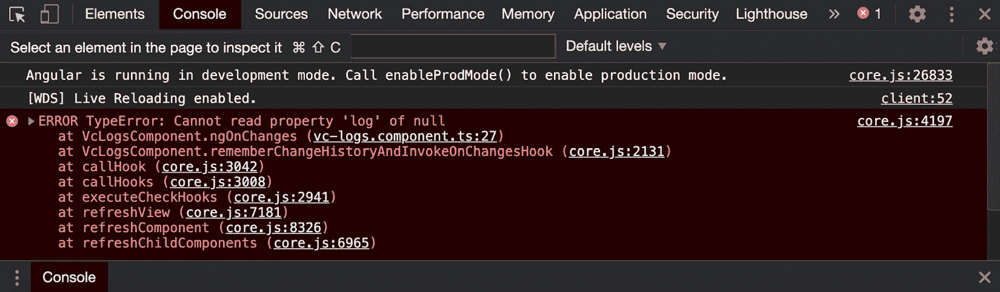

图 3.5 - 一个错误，详细说明此时 this.logger 实质上为 null

1.  为了解决这个问题，我们可以决定根本不记录任何东西，或者如果未提供`LoggerService`，我们可以回退到`console.*`方法。回退到`console.*`方法的代码应该如下所示：

```ts
...
export class VcLogsComponent implements OnInit {
  ...
  constructor(@Optional() private loggerService:   LoggerService) {
    if (!this.loggerService) {
      this.logger = console;
    } else {
      this.logger = this.loggerService;
    }
  }
  ... 
```

现在，如果您更新版本并点击**提交**，您应该在控制台上看到日志，如下所示：

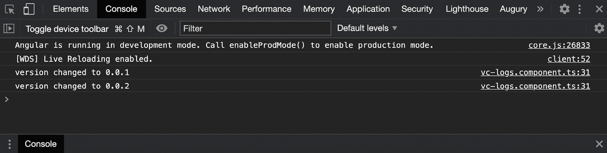

图 3.6 - 作为 LoggerService 未提供的回退而在控制台上打印的日志

太好了！我们已经完成了这个示例，一切看起来都很好。请参考下一节以了解它是如何工作的。

## 它是如何工作的

`@Optional`装饰器是来自`@angular/core`包的特殊参数，它允许您将一个依赖项的参数标记为可选的。在幕后，当依赖项不存在或未提供给应用程序时，Angular 将提供值为`null`。

## 另请参阅

+   Angular 中的可选依赖项（[`angular.io/guide/dependency-injection#optional-dependencies`](https://angular.io/guide/dependency-injection#optional-dependencies)）

+   Angular 中的分层注入器（[`angular.io/guide/hierarchical-dependency-injection`](https://angular.io/guide/hierarchical-dependency-injection)）

# 使用 providedIn 创建单例服务

在这个示例中，您将学习如何确保您的 Angular 服务被用作单例的几个技巧。这意味着整个应用程序中只会有一个服务实例。在这里，我们将使用一些技术，包括`providedIn: 'root'`语句，并确保我们只在整个应用程序中提供服务一次，使用`@Optional()`和`@SkipSelf()`装饰器。

## 准备就绪

此配方的项目位于`chapter03/start_here/ng-singleton-service`路径中。执行以下步骤：

1.  在 Visual Studio Code 中打开项目。

1.  打开终端，并运行`npm install`来安装项目的依赖项。

1.  完成后，运行`ng serve -o`。

这将在新的浏览器选项卡中打开应用程序。您应该看到类似于以下截图的内容：

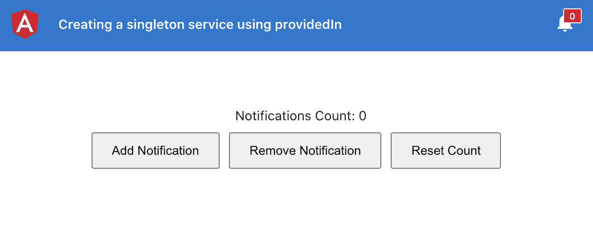

图 3.7 - ng-singleton-service 应用程序在 http://localhost:4200 上运行

现在您的应用程序正在运行，让我们继续并查看这个配方的步骤。

## 如何做到

该应用程序的问题在于，如果您添加或删除任何通知，标题中的铃铛图标上的计数不会改变。这是因为我们有多个`NotificationsService`的实例。请参考以下步骤，以确保我们在应用程序中只有一个服务实例：

1.  首先，作为 Angular 开发人员，我们已经知道我们可以使用`providedIn: 'root'`来告诉 Angular 一个服务只在根模块中提供，并且在整个应用程序中只应该有一个实例。因此，让我们去`notifications.service.ts`并在`@Injectable`装饰器参数中传递`providedIn: 'root'`，如下所示：

```ts
import { Injectable } from '@angular/core';
import { BehaviorSubject, Observable } from 'rxjs';
@Injectable({
  providedIn: 'root'
})
export class NotificationsService {
  ...
}
```

太棒了！现在即使您刷新并尝试添加或删除通知，您仍然会看到标题中的计数没有改变。"但是，为什么会这样，Ahsan？"好吧，我很高兴你问。那是因为我们仍然在`AppModule`以及`VersioningModule`中提供了该服务。

1.  首先，在`app.module.ts`中的`providers`数组中删除`NotificationsService`，如下面的代码块所示：

```ts
...
import { NotificationsButtonComponent } from './components/notifications-button/notifications-button.component';
import { NotificationsService } from './services/notifications.service'; ← Remove this
@NgModule({
  declarations: [... ],
  imports: [...],
  providers: [
    NotificationsService ← Remove this
  ],
  bootstrap: [AppComponent]
})
export class AppModule { }
```

1.  现在，我们将从`versioning.module.ts`中删除`NotificationsService`，如下面的代码块所示：

```ts
import { NgModule } from '@angular/core';
import { CommonModule } from '@angular/common';
import { VersioningRoutingModule } from './versioning-routing.module';
import { VersioningComponent } from './versioning.component';
import { NotificationsManagerComponent } from './components/notifications-manager/notifications-manager.component';
import { NotificationsService } from '../services/notifications.service'; ← Remove this
@NgModule({
  declarations: [VersioningComponent,   NotificationsManagerComponent],
  imports: [
    CommonModule,
    VersioningRoutingModule,
  ],
  providers: [
    NotificationsService  ← Remove this
  ]
})
export class VersioningModule { }
```

太棒了！现在您应该能够看到标题中的计数根据您添加/删除通知而改变。但是，如果有人仍然错误地在另一个懒加载的模块中提供它会发生什么呢？

1.  让我们把`NotificationsService`放回`versioning.module.ts`文件中：

```ts
import { NgModule } from '@angular/core';
import { CommonModule } from '@angular/common';
import { VersioningRoutingModule } from './versioning-routing.module';
import { VersioningComponent } from './versioning.component';
import { NotificationsManagerComponent } from './components/notifications-manager/notifications-manager.component';
import { NotificationsService } from '../services/notifications.service';
@NgModule({
  declarations: [VersioningComponent,   NotificationsManagerComponent],
  imports: [
    CommonModule,
    VersioningRoutingModule,
  ],
  providers: [
    NotificationsService
  ]
})
export class VersioningModule { }
```

砰！控制台或编译时没有任何错误。然而，我们的问题是标题中的计数没有更新。那么，如果开发人员犯了这样的错误，我们该如何通知他们呢？请参考下一步。

1.  为了提醒开发人员可能存在重复提供者，我们在`NotificationsService`中使用`@angular/core`包中的`@SkipSelf`装饰器，并抛出错误来通知和修改`NotificationsService`，如下所示：

```ts
import { Injectable, SkipSelf } from '@angular/core';
...
export class NotificationsService {
  ...
  constructor(@SkipSelf() existingService:   NotificationsService) {
    if (existingService) {
      throw Error ('The service has already been provided       in the app. Avoid providing it again in child       modules');
    }
  }
  ...
} 
```

现在，前面的步骤已经完成，你会注意到我们有一个问题。那就是我们未能为我们的应用程序提供`NotificationsService`。你应该在控制台中看到这个：

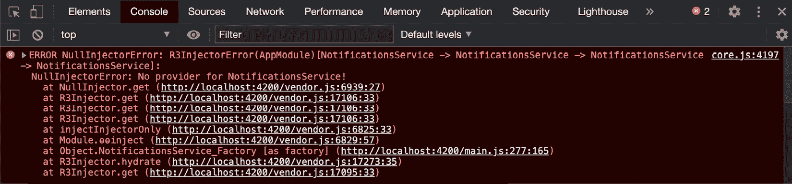

图 3.8 - 详细说明 NotificationsService 无法注入到 NotificationsService 中

原因是`NotificationsService`现在是`NotificationsService`本身的一个依赖项。这是行不通的，因为它还没有被 Angular 解析。为了解决这个问题，我们在下一步中也将使用`@Optional()`装饰器。

1.  好了，现在我们将在`notifications.service.ts`中的构造函数中，与`@SkipSelf`装饰器一起使用`@Optional()`装饰器。代码应该如下所示：

```ts
import { Injectable, Optional, SkipSelf } from '@angular/core';
...
export class NotificationsService {
  ...
  constructor(@Optional() @SkipSelf() existingService:   NotificationsService) {
    if (existingService) {
      throw Error ('The service has already been provided       in the app. Avoid providing it again in child       modules');
    }
  }
  ...
} 
```

我们现在已经解决了`NotificationsService -> NotificationsService`的依赖问题。你应该在控制台中看到`NotificationsService`被多次提供的正确错误，如下所示：

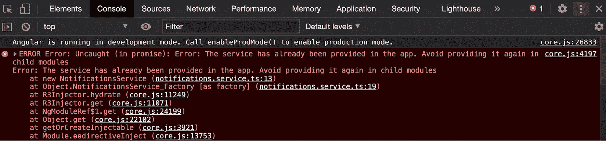

图 3.9 - 详细说明 NotificationsService 已经在应用程序中提供

1.  现在，我们将安全地从`versioning.module.ts`文件的`providers`数组中移除提供的`NotificationsService`，并检查应用程序是否正常工作：

```ts
...
import { NotificationsManagerComponent } from './components/notifications-manager/notifications-manager.component';
import { NotificationsService } from '../services/notifications.service'; ← Remove this
@NgModule({
  declarations: [...],
  imports: [...],
  providers: [
    NotificationsService ← Remove this
  ]
})
export class VersioningModule { }
```

砰！我们现在使用了`providedIn`策略来创建一个单例服务。在下一节中，让我们讨论它是如何工作的。

## 它是如何工作的

每当我们尝试在某个地方注入一个服务时，默认情况下，它会尝试在注入服务的相关模块中查找服务。当我们使用`providedIn: 'root'`来声明一个服务时，无论在应用程序的任何地方注入服务，Angular 都知道它只需在根模块中找到服务定义，而不是在功能模块或其他任何地方。

但是，您必须确保该服务在整个应用程序中只提供一次。如果您在多个模块中提供它，即使使用了`providedIn: 'root'`，您也会有多个服务实例。为了避免在应用程序中的多个模块或多个位置提供服务，我们可以在服务的构造函数中使用`@SkipSelf()`装饰器和`@Optional()`装饰器来检查服务是否已经在应用程序中提供。

## 另请参阅

+   Angular 中的分层依赖注入([`angular.io/guide/hierarchical-dependency-injection`](https://angular.io/guide/hierarchical-dependency-injection))

# 使用 forRoot()创建一个单例服务

在这个食谱中，您将学习如何使用`ModuleWithProviders`和`forRoot()`语句来确保您的 Angular 服务在整个应用程序中作为单例使用。我们将从一个具有多个`NotificationsService`实例的应用程序开始，并实现必要的代码，以确保最终得到一个应用程序的单个实例。

## 准备工作

这个食谱的项目位于`chapter03/start_here/ng-singleton-service-forroot`路径下。执行以下步骤：

1.  在 Visual Studio Code 中打开项目。

1.  打开终端，运行`npm install`来安装项目的依赖项。

1.  完成后，运行`ng serve -o`。

这应该会在新的浏览器标签中打开应用程序。应用程序应该如下所示：

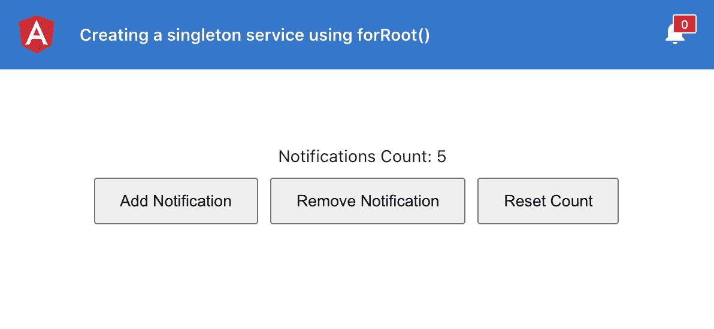

图 3.10 – ng-singleton-service-forroot 应用程序运行在 http://localhost:4200

现在我们的应用程序正在运行，在接下来的部分，我们可以继续进行食谱的步骤。

## 操作步骤

为了确保我们在应用程序中只有一个单例服务使用`forRoot()`方法，您需要了解如何创建和实现`ModuleWithProviders`和`static forRoot()`方法。执行以下步骤：

1.  首先，我们要确保服务有自己的模块。在许多 Angular 应用程序中，您可能会看到`CoreModule`，其中提供了服务（假设我们没有出于某种原因使用`providedIn: 'root'`语法）。首先，我们将使用以下命令创建一个名为`ServicesModule`的模块：

```ts
ng g m services
```

1.  现在我们已经创建了模块，让我们在`services.module.ts`文件中创建一个静态方法。我们将命名该方法为`forRoot`，并返回一个包含在`providers`数组中提供的`NotificationsService`的`ModuleWithProviders`对象，如下所示：

```ts
 import { ModuleWithProviders, NgModule } from  '@angular/core';
import { CommonModule } from '@angular/common';
import { NotificationsService } from '../services/notifications.service';
@NgModule({
    ...
})
export class ServicesModule {
  static forRoot(): ModuleWithProviders<ServicesModule> {
    return {
      ngModule: ServicesModule,
      providers: [
        NotificationsService
      ]
    };
  }
}
```

1.  现在我们将从`app.module.ts`文件的`imports`数组中删除`NotificationsService`，并在`app.module.ts`文件中包含`ServicesModule`；特别是，我们将在`imports`数组中使用`forRoot()`方法添加，如下面的代码块中所示。

这是因为它在`AppModule`中用`ServicesModule`注入了提供者，例如，`NotificationsService`的提供方式如下：

```ts
import { BrowserModule } from '@angular/platform-browser';
import { NgModule } from '@angular/core';
import { AppRoutingModule } from './app-routing.module';
import { AppComponent } from './app.component';
import { NotificationsButtonComponent } from './components/notifications-button/notifications-button.component';
import { NotificationsService } from './services/notifications.service'; ← Remove this
import { ServicesModule } from './services/services.module';
@NgModule({
  declarations: [
    AppComponent,
    NotificationsButtonComponent
  ],
  imports: [
    BrowserModule,
    AppRoutingModule,
    ServicesModule.forRoot()
  ],
  providers: [
    NotificationsService ← Remove this
  ],
  bootstrap: [AppComponent]
})
export class AppModule { }
```

您会注意到，当添加/删除通知时，标题中的计数仍然不会改变。这是因为我们仍然在`versioning.module.ts`文件中提供了`NotificationsService`。

1.  我们将从`versioning.module.ts`文件的`providers`数组中删除`NotificationsService`，如下所示：

```ts
import { NgModule } from '@angular/core';
import { CommonModule } from '@angular/common';
import { VersioningRoutingModule } from './versioning-routing.module';
import { VersioningComponent } from './versioning.component';
import { NotificationsManagerComponent } from './components/notifications-manager/notifications-manager.component';
import { NotificationsService } from '../services/notifications.service'; ← Remove
@NgModule({
  declarations: [VersioningComponent,   NotificationsManagerComponent],
  imports: [
    CommonModule,
    VersioningRoutingModule,
  ],
  providers: [
    NotificationsService ← Remove
  ]
})
export class VersioningModule { }
```

好的，到目前为止，你做得很好。现在我们已经完成了这个教程，在下一节中，让我们讨论它是如何工作的。

## 它是如何工作的

`ModuleWithProviders`是`NgModule`的包装器，与`NgModule`中使用的`providers`数组相关联。它允许您声明带有提供者的`NgModule`，因此导入它的模块也会得到这些提供者。我们在`ServicesModule`类中创建了一个`forRoot()`方法，它返回包含我们提供的`NotificationsService`的`ModuleWithProviders`。这使我们能够在整个应用程序中只提供一次`NotificationsService`，这导致应用程序中只有一个服务实例。

## 另请参阅

+   `ModuleWithProviders` Angular 文档（h[ttps://angular.io/api/core/ModuleWithProviders](https://angular.io/api/core/ModuleWithProviders)）。

+   `ModuleWithProviders`迁移文档（h[ttps://angular.io/guide/migration-module-with-providers)。](https://angular.io/guide/migration-module-with-providers)

# 使用相同的别名类提供者为应用程序提供不同的服务

在这个教程中，您将学习如何使用`Aliased`类提供者为应用程序提供两种不同的服务。这在复杂的应用程序中非常有帮助，其中您需要缩小一些组件/模块的基类实现。此外，别名在组件/服务单元测试中用于模拟依赖服务的实际实现，以便我们不依赖于它。

## 准备工作

我们将要处理的项目位于 `chapter03/start_here/ng-aliased-class-providers` 路径中，该路径位于克隆存储库内。执行以下步骤：

1.  在 Visual Studio Code 中打开项目。

1.  打开终端并运行 `npm install` 来安装项目的依赖项。

1.  完成后，运行 `ng serve -o`。

这将在新的浏览器选项卡中打开应用程序。

1.  单击**以管理员身份登录**按钮。您应该看到类似以下截图的内容：

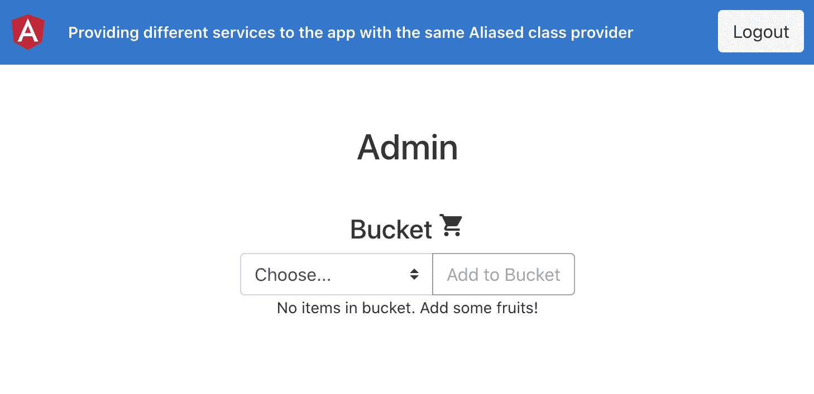

图 3.11 - ng-aliased-class-providers 应用程序在 http://localhost:4200 上运行

现在应用程序正在运行，让我们转到下一节，按照食谱的步骤进行操作。

## 如何做到这一点

我们有一个名为 `BucketComponent` 的共享组件，它在管理员和员工模块中都在使用。`BucketComponent` 在后台使用 `BucketService` 来向桶中添加/删除物品。对于员工，我们将通过提供一个 `aliased` 类提供程序和一个不同的 `EmployeeBucketService` 来限制删除物品的能力。这样我们就可以覆盖删除物品的功能。执行以下步骤：

1.  我们将首先在 `employee` 文件夹中创建 `EmployeeBucketService`，如下所示：

```ts
ng g service employee/services/employee-bucket
```

1.  接下来，我们将从 `BucketService` 扩展 `EmployeeBucketService`，以便我们获得 `BucketService` 的所有好处。让我们修改代码如下：

```ts
import { Injectable } from '@angular/core';
import { BucketService } from 'src/app/services/bucket.service';
@Injectable({
  providedIn: 'root'
})
export class EmployeeBucketService extends BucketService {
  constructor() {
    super();
  }
}
```

1.  我们现在将覆盖 `removeItem()` 方法，简单地显示一个简单的 `alert()`，说明员工无法从桶中删除物品。您的代码应如下所示：

```ts
import { Injectable } from '@angular/core';
import { BucketService } from 'src/app/services/bucket.service';
@Injectable({
  providedIn: 'root'
})
export class EmployeeBucketService extends BucketService {
  constructor() {
    super();
  }
  removeItem() {
    alert('Employees can not delete items');
  }
}
```

1.  最后一步，我们需要在 `employee.module.ts` 文件中提供 `aliased` 类提供程序，如下所示：

```ts
import { NgModule } from '@angular/core';
...
import { BucketService } from '../services/bucket.service';
import { EmployeeBucketService } from './services/employee-bucket.service';
@NgModule({
  declarations: [...],
  imports: [
   ...
  ],
  providers: [{
    provide: BucketService,
    useClass: EmployeeBucketService
  }]
})
export class EmployeeModule { }
```

如果您现在以员工身份登录应用程序并尝试删除物品，您将看到一个警报弹出，其中写着**员工无法删除物品**。

## 它是如何工作的

当我们将一个服务注入到一个组件中时，Angular 会尝试从注入的位置向上移动组件和模块的层次结构来找到该组件。我们的`BucketService`是使用`providedIn: 'root'`语法在`'root'`中提供的。因此，它位于层次结构的顶部。然而，在这个示例中，我们在`EmployeeModule`中使用了一个`别名`类提供者，当 Angular 搜索`BucketService`时，它很快就在`EmployeeModule`中找到了它，并在甚至到达`'root'`之前停在那里获取实际的`BucketService`。

## 另请参阅

+   Angular 中的依赖注入（[`angular.io/guide/dependency-injection`](https://angular.io/guide/dependency-injection)）

+   Angular 中的分层注入器（[`angular.io/guide/hierarchical-dependency-injection`](https://angular.io/guide/hierarchical-dependency-injection)）

# Angular 中的值提供者

在这个示例中，您将学习如何在 Angular 中使用值提供者为应用程序提供常量和配置值。我们将从上一个示例中的相同示例开始，即`EmployeeModule`和`AdminModule`使用名为`BucketComponent`的共享组件。我们将使用值提供者限制员工从桶中删除项目，这样员工甚至看不到**删除**按钮。

## 准备就绪

我们将要处理的项目位于`chapter03/start_here/ng-value-providers`路径中，该路径位于克隆的存储库内。执行以下步骤：

1.  在 Visual Studio Code 中打开项目。

1.  打开终端，并运行`npm install`来安装项目的依赖项。

1.  完成后，运行`ng serve -o`。

这应该在新的浏览器标签页中打开应用程序。

1.  点击**以管理员身份登录**按钮。您应该看到类似以下截图：

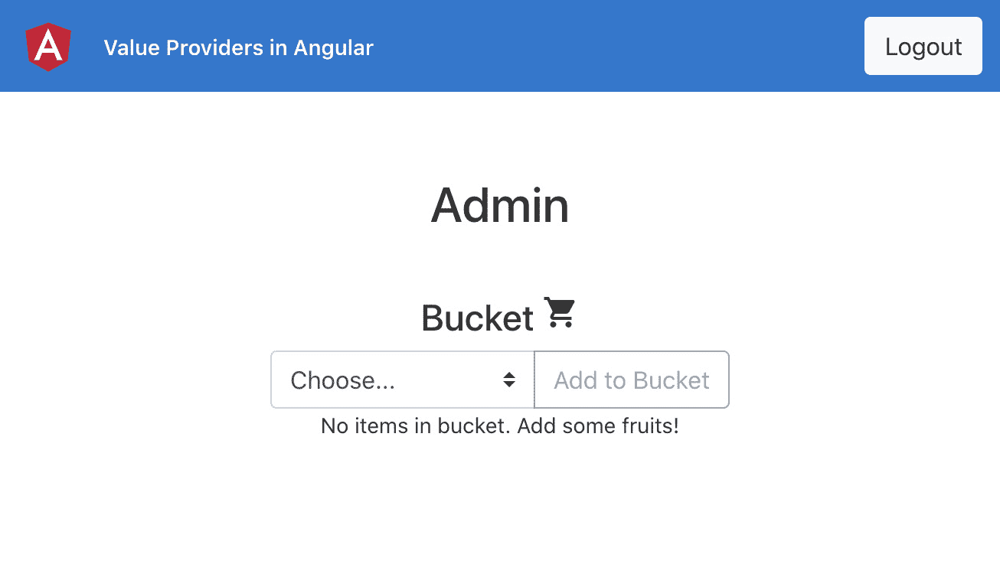

图 3.12 - ng-value-providers 应用程序在 http://localhost:4200 上运行

我们有一个名为`BucketComponent`的共享组件，它在管理员和员工模块中都在使用。对于员工，我们将通过在`EmployeeModule`中提供一个值提供者来限制删除项目的能力。这样我们就可以根据其值隐藏**删除**按钮。

## 如何做

1.  首先，我们将通过在`app/constants`文件夹中的新文件`app-config.ts`中创建`InjectionToken`的值提供者。代码应如下所示：

```ts
import { InjectionToken } from '@angular/core';
export interface IAppConfig {
  canDeleteItems: boolean;
}
export const APP_CONFIG = new InjectionToken<IAppConfig>('APP_CONFIG');
export const AppConfig: IAppConfig = {
  canDeleteItems: true
}
```

在我们实际在`BucketComponent`中使用这个`AppConfig`常量之前，我们需要将其注册到`AppModule`中，以便在我们在`BucketComponent`中注入它时，提供者的值得到解析。

1.  让我们在`app.module.ts`文件中添加提供者，如下所示：

```ts
...
import { AppConfig, APP_CONFIG } from './constants/app-config';
@NgModule({
  declarations: [
    AppComponent
  ],
  imports: [
    ...
  ],
  providers: [{
    provide: APP_CONFIG,
    useValue: AppConfig
  }],
  bootstrap: [AppComponent]
})
export class AppModule { }
```

现在应用程序知道了`AppConfig`常量。下一步是在`BucketComponent`中使用这个常量。

1.  我们将使用`@Inject()`装饰器在`BucketComponent`类中注入它，在`shared/components/bucket/bucket.component.ts`文件中，如下所示：

```ts
import { Component, Inject, OnInit } from '@angular/core';
...
import { IAppConfig, APP_CONFIG } from '../../../constants/app-config';
...
export class BucketComponent implements OnInit {
  ...
  constructor(private bucketService: BucketService,   @Inject(APP_CONFIG) private config: IAppConfig) { }
  ...
}
```

太棒了！常量已经被注入。现在，如果您刷新应用程序，就不应该出现任何错误。下一步是在`BucketComponent`中使用`config`中的`canDeleteItems`属性来显示/隐藏**删除**按钮。

1.  我们首先将属性添加到`shared/components/bucket/bucket.component.ts`文件中，并将其分配给`ngOnInit()`方法，如下所示：

```ts
...
export class BucketComponent implements OnInit {
  $bucket: Observable<IFruit[]>;
  selectedFruit: Fruit = '' as null;
  fruits: string[] = Object.values(Fruit);
  canDeleteItems: boolean;
  constructor(private bucketService: BucketService,   @Inject(APP_CONFIG) private config: IAppConfig) { }
  ngOnInit(): void {
    this.$bucket = this.bucketService.$bucket;
    this.bucketService.loadItems();
    this.canDeleteItems = this.config.canDeleteItems;
  }
  ...
}
```

1.  现在，我们将在`shared/components/bucket/bucket.component.html`文件中添加一个`*ngIf`指令，只有当`canDeleteItems`的值为`true`时才显示**删除**按钮：

```ts
<div class="buckets" *ngIf="$bucket | async as bucket">
  <h4>Bucket <i class="material-icons">shopping_cart   </i></h4>
  <div class="add-section">
    ...
  </div>
  <div class="fruits">
    <ng-container *ngIf="bucket.length > 0; else     bucketEmptyMessage">
      <div class="fruits__item" *ngFor="let item of       bucket;">
        <div class="fruits__item__title">{{item.name}}        </div>
        <div *ngIf="canDeleteItems" class="fruits__        item__delete-icon"         (click)="deleteFromBucket(item)">
          <div class="material-icons">delete</div>
        </div>
      </div>
    </ng-container>
  </div>
</div>
<ng-template #bucketEmptyMessage>
  ...
</ng-template>
```

您可以通过将`AppConfig`常量的`canDeleteItems`属性设置为`false`来测试一切是否正常。请注意，**删除**按钮现在对管理员和员工都是隐藏的。测试完成后，将`canDeleteItems`的值再次设置为`true`。

现在我们已经设置好了一切。让我们添加一个新的常量，这样我们就可以只为员工隐藏**删除**按钮。

1.  我们将在`employee`文件夹内创建一个名为`constants`的文件夹。然后，我们将在`employee/constants`路径下创建一个名为`employee-config.ts`的新文件，并向其中添加以下代码：

```ts
import { IAppConfig } from '../../constants/app-config';
export const EmployeeConfig: IAppConfig = {
  canDeleteItems: false
} 
```

1.  现在，我们将为相同的`APP_CONFIG`注入令牌，将这个`EmployeeConfig`常量提供给`EmployeeModule`。`employee.module.ts`文件中的代码应该如下所示：

```ts
...
import { EmployeeComponent } from './employee.component';
import { APP_CONFIG } from '../constants/app-config';
import { EmployeeConfig } from './constants/employee-config';
@NgModule({
  declarations: [EmployeeComponent],
  imports: [
    ...
  ],
  providers: [{
    provide: APP_CONFIG,
    useValue: EmployeeConfig
  }]
})
export class EmployeeModule { }
```

我们完成了！配方现在已经完成。您可以看到**删除**按钮对管理员可见，但对员工隐藏。这都归功于值提供者的魔力。

## 它是如何工作的

当我们向组件注入一个标记时，Angular 会尝试从组件和模块的层次结构中向上移动，找到标记的解析值。我们在`EmployeeModule`中将`EmployeeConfig`提供为`APP_CONFIG`。当 Angular 尝试解析`BucketComponent`的值时，它在`EmployeeModule`中早早地找到了`EmployeeConfig`。因此，Angular 就停在那里，没有到达`AppComponent`。请注意，`AppComponent`中`APP_CONFIG`的值是`AppConfig`常量。

## 另请参阅

+   Angular 中的依赖注入（[`angular.io/guide/dependency-injection`](https://angular.io/guide/dependency-injection)）

+   Angular 中的层次依赖注入（[`angular.io/guide/hierarchical-dependency-injection`](https://angular.io/guide/hierarchical-dependency-injection)）
