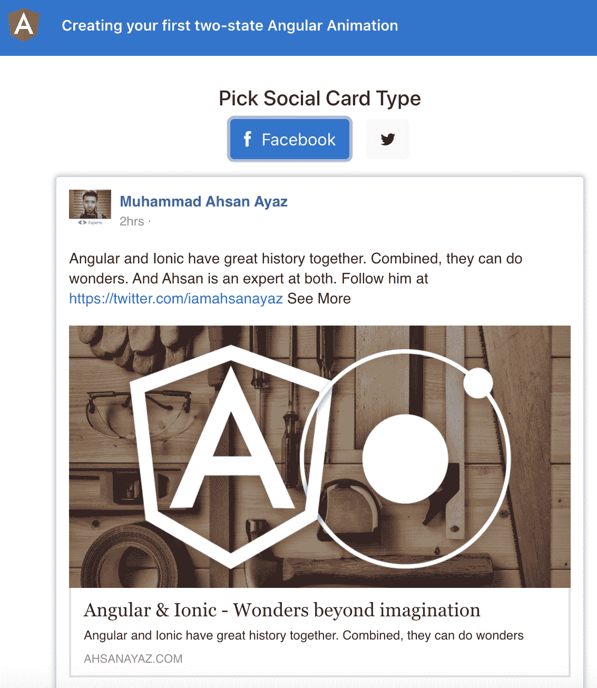
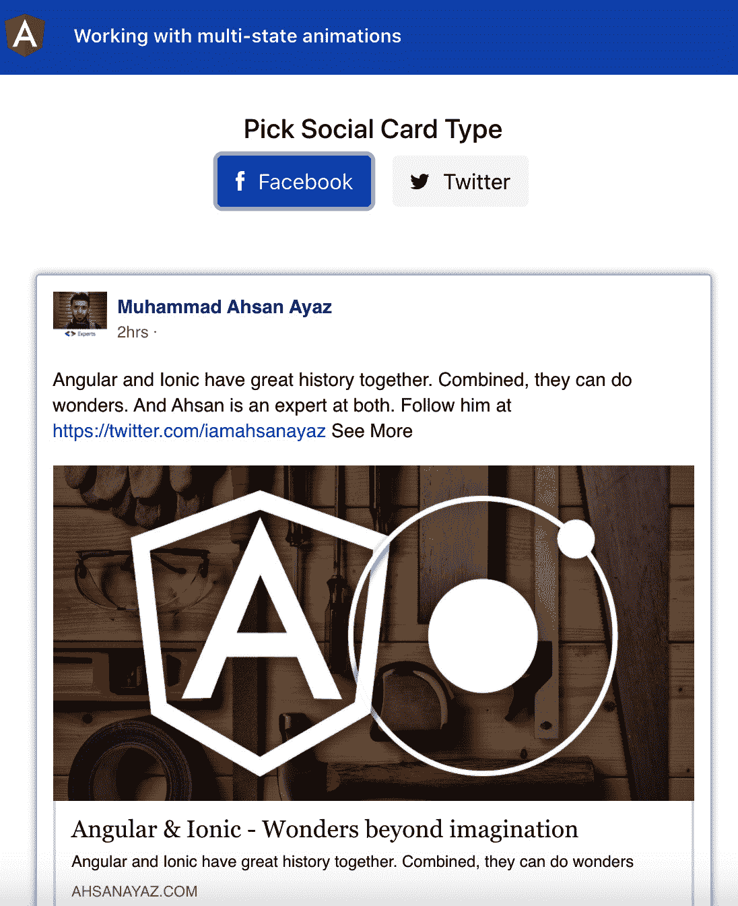
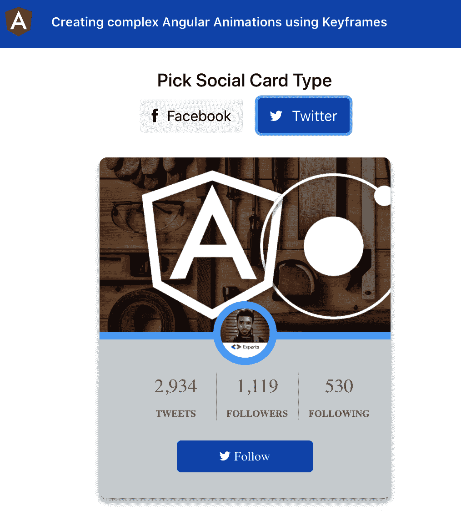
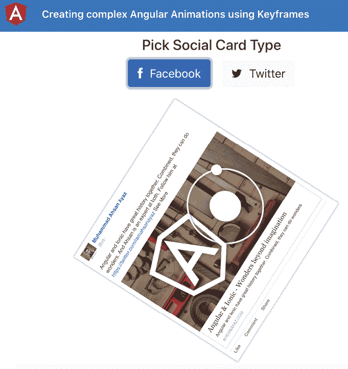
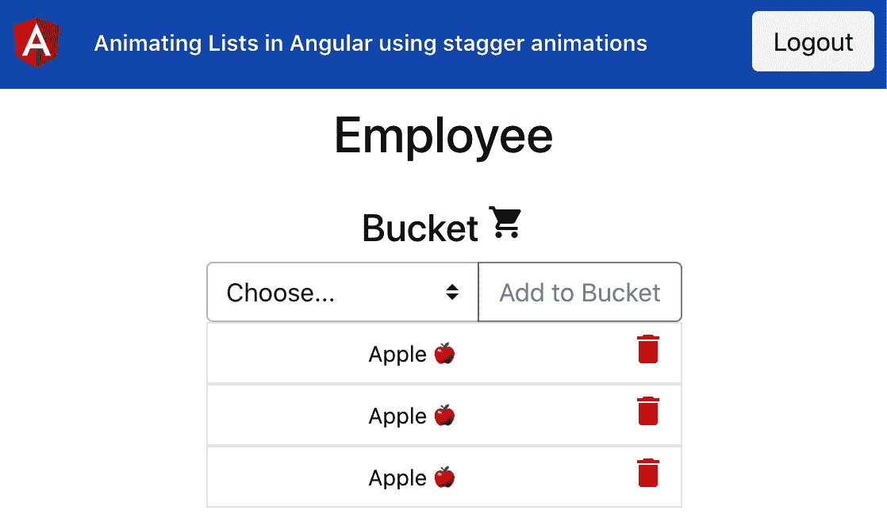
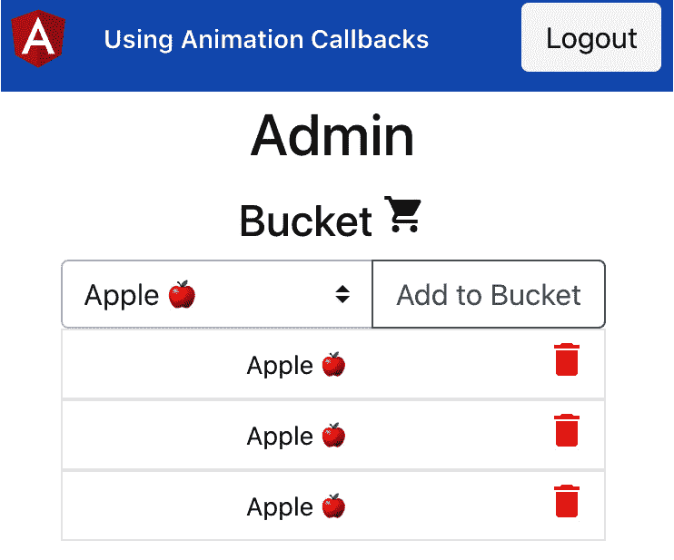
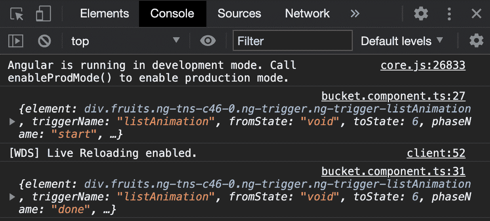
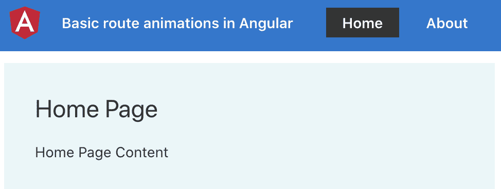
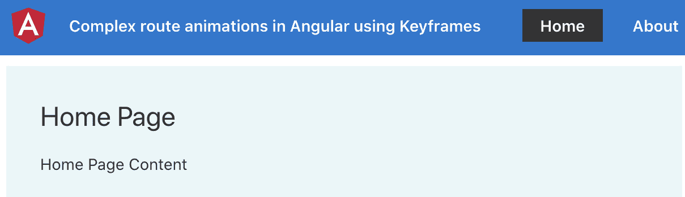

# 第四章：*第四章*：理解 Angular 动画

在本章中，您将学习如何在 Angular 中使用动画。您将学习多状态动画、阶段动画、关键帧动画，以及如何为 Angular 应用程序中的路由切换实现动画。

以下是本章将要涵盖的教程：

+   创建您的第一个双状态 Angular 动画

+   使用多状态动画

+   使用关键帧创建复杂的 Angular 动画

+   使用阶段动画在 Angular 中为列表添加动画

+   使用动画回调

+   在 Angular 中进行基本路由动画

+   使用关键帧在 Angular 中创建复杂的路由动画

# 技术要求

在本章的教程中，请确保您的计算机上安装了**Git**和**Node.js**。您还需要安装`@angular/cli`包，可以通过在终端中使用`npm install -g @angular/cli`来安装。本章的代码可以在[`github.com/PacktPublishing/Angular-Cookbook/tree/master/chapter04`](https://github.com/PacktPublishing/Angular-Cookbook/tree/master/chapter04)找到。

# 创建您的第一个双状态 Angular 动画

在这个教程中，您将使用淡入淡出效果创建一个基本的双状态 Angular 动画。我们将从一个带有一些 UI 的新的 Angular 项目开始，启用应用程序中的动画，然后开始创建我们的第一个动画。

## 准备工作

我们将要使用的项目位于克隆存储库中的`chapter04/start_here/ng-basic-animation`中：

1.  在 Visual Studio Code 中打开项目。

1.  打开终端并运行`npm install`来安装项目的依赖项。

1.  完成后，运行`ng serve -o`。

这应该会在新的浏览器标签页中打开应用程序，您应该会看到以下内容：



图 4.1 - ng-basic-animation 应用程序运行在 http://localhost:4200

现在应用程序正在运行，我们将继续进行教程的步骤。

## 如何做…

我们有一个应用程序，没有配置 Angular 动画。因此，我们将从启用 Angular 动画开始。然后，我们将用 Angular 动画替换 CSS 动画。让我们按照以下步骤继续：

1.  首先，我们将从`@angular/platform-browser/animations`包中在我们的`app.module.ts`中注入`BrowserAnimationsModule`，这样我们就可以在我们的 Angular 应用程序中使用动画。我们还将在`imports`数组中导入`BrowserAnimationsModule`，如下所示：

```ts
...
import { FbCardComponent } from './components/fb-card/fb-card.component';
import { TwitterCardComponent } from './components/twitter-card/twitter-card.component';
import { BrowserAnimationsModule } from '@angular/platform-browser/animations';
@NgModule({
  declarations: [
    AppComponent,
    SocialCardComponent,
    FbCardComponent,
    TwitterCardComponent
  ],
  imports: [
    BrowserModule,
    AppRoutingModule,
    BrowserAnimationsModule
  ],
  providers: [],
  bootstrap: [AppComponent]
})
export class AppModule { }
```

1.  现在，我们将删除 CSS 样式转换，这样我们就可以默认看到 Facebook 和 Twitter 按钮的完整按钮（图标和文本）。让我们从`app.component.scss`中删除以下代码块中突出显示的样式：

```ts
.type-picker {
   ...
  &__options {
   ...
    &__option {
      ...
      &__btn {
        ...
        min-width: 40px;
        // Remove the following lines
        transition: all 1s ease; 
        &__text {
          transition: all 1s ease;
          width: 0;
          visibility: hidden;
        }
        &--active {
          [class^="icon-"], [class*=" icon-"] {
            margin-right: 10px;
          }
          // Remove the following lines
          .type-picker__options__option__btn__text { 
            width: auto;
            visibility: visible;
          }
        }
      }
    }
  }
}
```

1.  我们还将在`app.component.scss`文件中删除`&--active`选择器下的`&__btn`，并将`[class^="icon-"], [class*=" icon-"]`的样式移动到`&__btn`选择器内。这样做是为了所有图标都有右边距。您的代码应如下所示：

```ts
  .type-picker {
    ...
    &__options {
      ...
      &__option {
        ...
        &__btn {
          display: flex;
          align-items: center;
          min-width: 40px;
          justify-content: center;
          &--active { ← Remove this
            [class^='icon-'],
            [class*=' icon-'] {
              margin-right: 10px;
          }
        } ← Remove this
        }
      }
    }
  }
```

1.  现在让我们将要创建的动画添加到模板中。我们将动画应用于两个按钮的文本元素。修改`app.component.html`如下：

```ts
 ...
<div class="content" role="main">
  <div class="type-picker">
    <h5>Pick Social Card Type</h5>
    <div class="type-picker__options">
      <div class="type-picker__options__option"       (click)="setCardType(cardTypes.Facebook)">
        <button class="btn type-picker__options__option__        btn" [ngClass]="selectedCardType === cardTypes.        Facebook ? 'btn-primary type-picker__options__        option__btn--active' : 'btn-light'">
          <div class="icon-facebook"></div>
          <div class="type-picker__options__option__btn__          text" [@socialBtnText]="selectedCardType ===           cardTypes.Facebook ? 'btn-active-text' :           'btn-inactive-text'">
            Facebook
          </div>
        </button>
      </div>
      <div class="type-picker__options__option"       (click)="setCardType(cardTypes.Twitter)">
        <button class="btn type-picker__options__option__        btn" [ngClass]="selectedCardType === cardTypes.        Twitter ? 'btn-primary type-picker__options__        option__btn--active' : 'btn-light'">
          <div class="icon-twitter"></div>
          <div class="type-picker__options__option__btn__          text" [@socialBtnText]="selectedCardType ===           cardTypes.Twitter ? 'btn-active-text' :           'btn-inactive-text'">
            Twitter
          </div>
        </button>
      </div>
    </div>
  </div>
  <app-social-card [type]="selectedCardType">  </app-social-card>
</div>
```

现在，我们将开始创建名为`socialBtnText`的动画，为此，我们将从`@angular/animations`包中导入一些函数到我们的`app.component.ts`中，这样我们就可以为按钮文本创建两个状态。

1.  将以下导入添加到您的`app.component.ts`中：

```ts
import {
  trigger,
  state,
  style,
  animate,
  transition
} from '@angular/animations';
```

1.  现在，让我们使用`trigger`方法将名为`socialBtnText`的动画添加到`AppComponent`元数据的`animations`数组中：

```ts
...
@Component({
  selector: 'app-root',
  templateUrl: './app.component.html',
  styleUrls: ['./app.component.scss'],
  animations: [
    trigger('socialBtnText', [])
  ]
})
export class AppComponent {
  ...
}
```

1.  现在，我们将创建名为`btn-active-text`和`btn-inactive-text`的两个状态。我们将为这些状态设置`width`和`visibility`，如下所示：

```ts
...
@Component({
  selector: 'app-root',
  templateUrl: './app.component.html',
  styleUrls: ['./app.component.scss'],
  animations: [
    trigger('socialBtnText', [
      state('btn-active-text', style({
        width: '80px',
        visibility: 'visible',
      })),
      state('btn-inactive-text', style({
        width: '0px',
        visibility: 'hidden',
      })),
    ])
  ]
})
export class AppComponent {
  ...
}
```

现在我们已经配置了状态，我们可以开始编写转换。

1.  我们首先实现`'btn-inactive-text => btn-active-text'`转换，该转换在单击任一按钮时触发。由于此转换将显示文本，因此我们将首先增加文本元素的`width`值，然后将文本设置为`visible`。`animations[]`数组中的内容应如下所示：

```ts
animations: [
    trigger('socialBtnText', [
      state('btn-active-text', style({...})),
      state('btn-inactive-text', style({...})),
      transition('btn-inactive-text => btn-active-text', [
        animate('0.3s ease', style({
          width: '80px'
        })),
        animate('0.3s ease', style({
          visibility: 'visible'
        }))
      ]),
    ])
  ]
```

现在，您应该看到按钮的活动状态有一个平滑的动画。让我们在下一步中实现非活动状态。

1.  现在我们将实现`'btn-active-text => btn-inactive-text'`转换。这应该将可见性变为`'hidden'`，并将宽度再次设置为`'0px'`。代码应该如下所示：

```ts
animations: [
    trigger('socialBtnText', [
      ...
      state('btn-inactive-text', style({...})),
      transition('btn-active-text =>       btn-inactive-text', [
        animate('0.3s', style({
          width: '80px'
        })),
        animate('0.3s', style({
          visibility: 'hidden'
        }))
      ]),
      transition('btn-inactive-text =>       btn-active-text', [
        ...
    ])
  ]
```

您会注意到当按钮变为不活动状态时会有轻微的抖动/延迟。这是因为宽度的动画触发先于`visibility: 'hidden'`的动画。因此，我们看到它们都是按顺序发生的。

1.  为了使两个动画一起工作，我们将使用`@angular/animations`包中的`group`方法。我们将为过渡组合我们的`animate()`方法。`app.components.ts`文件中的更新应如下所示：

```ts
...
import {
  ...
  transition,
  group
} from '@angular/animations';
...
animations: [
    trigger('socialBtnText', [
      ...
      transition('btn-active-text =>       btn-inactive-text', [
        group([
          animate('0.3s', style({
            width: '0px'
          })),
          animate('0.3s', style({
            visibility: 'hidden'
          }))
        ])
      ]),
      ...
    ])
  ]
```

1.  由于我们希望这个过程非常快速，所以我们将为`'btn-active-text => btn-inactive-text'`过渡的`animate()`方法设置为零秒（`0s`）。更改如下：

```ts
transition('btn-active-text => btn-inactive-text', [
        group([
          animate('0s', style({
            width: '0px'
          })),
          animate('0s', style({
            visibility: 'hidden'
          }))
        ])
      ]),
```

1.  最后，当按钮不活动时，我们可以去掉按钮图标的额外`margin-right`。我们将通过将`[class^="icon-"], [class*=" icon-"]`选择器的代码移动到另一个名为`&--active`的选择器内，这样它只在按钮处于活动状态时应用。

1.  修改`app.component.scss`文件中`&__btn`选择器中的以下样式，如下所示：

```ts
 &__btn {
          display: flex;
          align-items: center;
          min-width: 40px;
          justify-content: center;
          &--active {
            [class^="icon-"], [class*=" icon-"] {
              margin-right: 10px;
            }
          }
        }
```

太棒了！您现在已经在应用程序中实现了一些看起来不错的动画按钮。请查看下一节，了解这个方法是如何工作的。

## 它是如何工作的…

Angular 提供了自己的动画 API，允许您对 CSS 过渡适用的任何属性进行动画处理。好处是您可以根据要求动态配置它们。我们首先使用`trigger`方法将动画注册到状态和过渡中。然后我们分别使用`state`和`transition`方法定义这些状态和过渡。我们还看到了如何使用`group`方法并行运行动画。如果我们没有将动画分组，它们将按顺序运行。最后，我们使用组件中的一些标志应用了这些状态以反映变化。

## 还有更多…

你可能已经注意到，Twitter 按钮看起来比应该的要大一些。这是因为到目前为止，我们已经将文本的宽度设置为常量`80px`，用于我们的状态和动画。虽然这对 Facebook 按钮看起来不错，但对 Twitter 按钮来说就不太好看了。因此，我们实际上可以通过为按钮提供不同宽度的两种不同过渡来使其可配置。以下是你要做的：

1.  在应用程序文件夹中创建一个新文件，命名为`animations.ts`。

1.  将`app.component.ts`文件中动画数组中的代码移动到这个新文件中；它应如下所示：

```ts
import {
  trigger,
  state,
  style,
  animate,
  transition,
  group
} from '@angular/animations';
export const buttonTextAnimation = (animationName: string, textWidth: string) => {
  return trigger(animationName, [
    state('btn-active-text', style({
      width: textWidth,
      visibility: 'visible',
    })),
    state('btn-inactive-text', style({
      width: '0px',
      visibility: 'hidden',
    })),
  ])
}
```

1.  现在，我们还将添加过渡效果：

```ts
...
export const buttonTextAnimation = (animationName: string, textWidth: string) => {
  return trigger(animationName, [
    state('btn-active-text', style({...})),
    state('btn-inactive-text', style({...})),
    transition('btn-active-text => btn-inactive-text', [
      group([
        animate('0s', style({
          width: '0px'
        })),
        animate('0s', style({
          visibility: 'hidden'
        }))
      ])
    ]),
    transition('btn-inactive-text => btn-active-text', [
      animate('0.3s ease', style({
        width: textWidth
      })),
      animate('0.3s ease', style({
        visibility: 'visible'
      }))
    ]),
  ])
}
```

1.  现在，我们将在`app.component.ts`中为我们的 Facebook 和 Twitter 按钮使用`buttonTextAnimation`方法如下。请注意，我们将创建两个不同的动画：

```ts
import { Component } from '@angular/core';
import { SocialCardType } from './constants/social-card-type';
import { buttonTextAnimation } from './animations';
@Component({
  selector: 'app-root',
  templateUrl: './app.component.html',
  styleUrls: ['./app.component.scss'],
  animations: [
    buttonTextAnimation('fbButtonTextAnimation', '80px'),
    buttonTextAnimation('twButtonTextAnimation', '60px'),
  ]
})
export class AppComponent {
  ...
}
```

1.  最后，我们将在`app.component.html`中为 Facebook 和 Twitter 按钮使用相应的动画，如下所示：

```ts
…
<div class="type-picker__options__option" (click)="setCardType(cardTypes.Facebook)">
        <button class="btn type-picker__options__option__        btn" [ngClass]="selectedCardType === cardTypes.        Facebook ? 'btn-primary type-picker__options__        option__btn--active' : 'btn-light'">
          <div class="icon-facebook"></div>
          <div class="type-picker__options__option__          btn__text" [@ fbButtonTextAnimation]=          "isFBBtnActive ? 'btn-active-text' :           'btn-inactive-text'">
            Facebook
          </div>
        </button>
      </div>
      <div class="type-picker__options__option"       (click)="setCardType(cardTypes.Twitter)">
        <button class="btn type-picker__options__option__        btn" [ngClass]="selectedCardType === cardTypes.        Twitter ? 'btn-primary type-picker__options__        option__btn--active' : 'btn-light'">
          <div class="icon-twitter"></div>
          <div class="type-picker__options__option__          btn__text" [@twButtonTextAnimation]=          "isTwBtnActive ? 'btn-active-text' :           'btn-inactive-text'">
            Twitter
          </div>
        </button>
      </div>
```

## 另请参阅

+   Angular 中的动画 ([`angular.io/guide/animations`](https://angular.io/guide/animations))

+   *用示例解释的 Angular 动画* ([`www.freecodecamp.org/news/angular-animations-explained-with-examples/`](https://www.freecodecamp.org/news/angular-animations-explained-with-examples/))

# 使用多状态动画

在这个食谱中，我们将使用包含多个状态的 Angular 动画。这意味着我们将为特定项目使用两个以上的状态。我们将继续使用相同的 Facebook 和 Twitter 卡片示例。但是我们将配置卡片的状态，以便它们在屏幕上出现之前的状态，当它们在屏幕上时的状态，以及当它们即将再次从屏幕上消失时的状态。

## 准备工作

此食谱的项目位于`chapter04/start_here/ng-multi-state-animations`中：

1.  在 Visual Studio Code 中打开项目。

1.  打开终端并运行`npm install`以安装项目的依赖项。

1.  完成后，运行`ng serve -o`。

这将在新的浏览器标签中打开应用程序，您应该看到应用程序如下所示：



图 4.2 - ng-multi-state-animations 应用程序在 http://localhost:4200 上运行

现在我们的应用程序在本地运行，让我们在下一节中看一下食谱的步骤。

## 如何做…

我们已经有一个工作中的应用程序，为社交卡片的到达构建了一个单一动画。当您点击 Facebook 或 Twitter 按钮时，您将看到相应的卡片以从左到右的滑入动画出现。为了保持食谱简单，我们将为用户在卡片上移动鼠标和用户远离卡片时实现两个更多的状态和动画。让我们按照以下步骤添加相关代码：

1.  我们将从在`components/fb-card/fb-card.component.ts`文件中的`FbCardComponent`中添加两个`@HostListener`实例开始，一个用于卡片的`mouseenter`事件，另一个用于`mouseleave`事件。我们分别将状态命名为`hovered`和`active`。代码应如下所示：

```ts
import { Component, HostListener, OnInit } from '@angular/core';
import { cardAnimation } from '../../animations';
@Component({
  selector: 'app-fb-card',
  templateUrl: './fb-card.component.html',
  styleUrls: ['./fb-card.component.scss'],
  animations: [cardAnimation]
})
export class FbCardComponent implements OnInit {
  cardState;
  constructor() { }
  @HostListener('mouseenter')
  onMouseEnter() {
    this.cardState = 'hovered'
  }
  @HostListener('mouseleave')
  onMouseLeave() {
    this.cardState = 'active'
  }
  ngOnInit(): void {
    this.cardState = 'active'
  }
}
```

1.  现在，我们将在`twitter-card-component.ts`文件中为`TwitterCardComponent`执行相同的操作。 代码应如下所示：

```ts
import { Component, HostListener, OnInit } from '@angular/core';
import { cardAnimation } from '../../animations';
@Component({
  selector: 'app-twitter-card',
  templateUrl: './twitter-card.component.html',
  styleUrls: ['./twitter-card.component.scss'],
  animations: [cardAnimation]
})
export class TwitterCardComponent implements OnInit {
  cardState
  constructor() { }
  @HostListener('mouseenter')
  onMouseEnter() {
    this.cardState = 'hovered'
  }
  @HostListener('mouseleave')
  onMouseLeave() {
    this.cardState = 'active'
  }
  ngOnInit(): void {
    this.cardState = 'active'
  }
}
```

1.  到目前为止，由于我们只是更新`cardState`变量以具有悬停和活动状态，因此不应该有视觉变化。 我们还没有定义过渡。

1.  我们现在将定义当用户光标进入卡片时的状态，即`mouseenter`事件。 该状态称为`悬停`，应在`animation.ts`文件中如下所示：

```ts
...
export const cardAnimation = trigger('cardAnimation', [
  state('active', style({
    color: 'rgb(51, 51, 51)',
    backgroundColor: 'white'
  })),
  state('hovered', style({
    transform: 'scale3d(1.05, 1.05, 1.05)',
    backgroundColor: '#333',
    color: 'white'
  })),
  transition('void => active', [
    style({
      transform: 'translateX(-200px)',
      opacity: 0
    }),
    animate('0.2s ease', style({
      transform: 'translateX(0)',
      opacity: 1
    }))
  ]),
])
```

如果您现在刷新应用程序，点击 Facebook 或 Twitter 按钮，并将光标悬停在卡片上，您将看到卡片的 UI 发生变化。 这是因为我们将状态更改为`悬停`。 但是，目前还没有动画。 让我们在下一步中添加一个。

1.  我们现在将在`animations.ts`文件中添加`活动=>悬停`过渡，以便我们可以平稳地从`活动`过渡到`悬停`状态：

```ts
...
export const cardAnimation = trigger('cardAnimation', [
  state('active', style(...)),
  state('hovered', style(...)),
  transition('void => active', [...]),
  transition('active => hovered', [
    animate('0.3s 0s ease-out', style({
      transform: 'scale3d(1.05, 1.05, 1.05)',
      backgroundColor: '#333',
      color: 'white'
    }))
  ]),
])
```

如果您刷新应用程序，现在应该在 mouseenter 事件上看到平滑的过渡。

1.  最后，我们将添加最终的过渡，即`悬停=>活动`，因此当用户离开卡片时，我们将以平滑的动画恢复到活动状态。 代码应如下所示：

```ts
...
export const cardAnimation = trigger('cardAnimation', [
  state('active', style(...)),
  state('hovered', style(...)),
  transition('void => active', [...]),
  transition('active => hovered', [...]),
  transition('hovered => active', [
    animate('0.3s 0s ease-out', style({
      transform: 'scale3d(1, 1, 1)',
      color: 'rgb(51, 51, 51)',
      backgroundColor: 'white'
    }))
  ]),
])
```

哒哒！ 您现在知道如何使用`@angular/animations`在单个元素上实现不同状态和不同动画。

## 它是如何工作的...

Angular 使用触发器来了解动画所处的状态。 一个示例语法如下：

```ts
<div [@animationTriggerName]="expression">...</div>;
```

`expression`可以是有效的 JavaScript 表达式，并且评估为状态的名称。 在我们的情况下，我们将其绑定到`cardState`属性，该属性包含`'active'`或`'hovered'`。 因此，我们为我们的卡片定义了三个过渡：

+   `void=>活动`（当元素添加到 DOM 并呈现时）

+   活动=>悬停（当卡片上触发 mouseenter 事件时）

+   `悬停=>活动`（当卡片上触发 mouseleave 事件时）

## 另请参阅

+   *触发动画*（[`angular.io/guide/animations#triggering-the-animation`](https://angular.io/guide/animations#triggering-the-animation)）

+   *可重用* *动画*（[`angular.io/guide/reusable-animations`](https://angular.io/guide/reusable-animations)）

# 使用关键帧创建复杂的 Angular 动画

由于你已经了解了上一个教程中关于 Angular 动画的知识，你可能会想，“嗯，这很容易。” 现在是时候在这个教程中提升你的动画技能了。在这个教程中，你将使用关键帧创建一个复杂的 Angular 动画，以便开始编写一些高级动画。

## 准备工作

本教程的项目位于 `chapter04/start_here/animations-using-keyframes` 中。

1.  在 Visual Studio Code 中打开项目。

1.  打开终端并运行 `npm install` 来安装项目的依赖项。

1.  完成后，运行 `ng serve -o`。

这应该在新的浏览器标签中打开应用程序，你应该看到应用程序如下：



图 4.3 – 在 http://localhost:4200 上运行的使用关键帧的动画应用程序

现在我们的应用程序在本地运行，让我们在下一节中看一下这个教程的步骤。

## 如何做…

我们现在有一个应用程序，它只有一个过渡，即 `void => *`，当元素在 DOM 上渲染时触发。现在，动画非常简单，使用 `animate` 函数来定义动画。我们将首先将其转换为关键帧，然后将其变得稍微复杂一些：

1.  让我们从 `@angular/animations` 中添加 `keyframes` 方法到 `animations.ts` 文件中，如下所示：

```ts
import {
  trigger,
  state,
  style,
  animate,
  transition,
  keyframes
} from '@angular/animations';
export const cardAnimation = trigger('cardAnimation', [
  ...
])
```

1.  现在，我们将把单一样式动画转换为关键帧，如下所示：

```ts
import {
  trigger,
  state,
  style,
  animate,
  transition,
  keyframes
} from '@angular/animations';
export const cardAnimation = trigger('cardAnimation', [
  transition('void => *', [
    style({ ← Remove this style
      transform: 'translateX(-200px)',
      opacity: 0
    }),
    animate('0.2s ease', keyframes([
      style({
        transform: 'translateX(-200px)',
        offset: 0
      }),
      style({
        transform: 'translateX(0)',
        offset: 1
      })
    ]))
  ]),
])
```

请注意，在这个代码块中，我们已经删除了 `state('active', …)` 部分，因为我们不再需要它了。此外，我们将 `style({transform: 'translateX(-200px)', opacity: 0})` 移到了 `keyframes` 数组内，因为它现在是关键帧动画本身的一部分。如果你现在刷新应用并尝试，你仍然会看到与之前相同的动画。但现在我们使用了 `keyframes`。

1.  最后，让我们开始添加一些复杂的动画。我们将通过在 `offset: 0` 的 `style` 的 `transform` 属性中添加 `scale3d` 来以缩小的卡片开始动画。我们还将增加动画时间到 `1.5s`：

```ts
...
export const cardAnimation = trigger('cardAnimation', [
  transition('void => *', [
    animate('1.5s ease', keyframes([
      style({
        transform: 'translateX(-200px) scale3d(0.4, 0.4,         0.4)',
        offset: 0
      }),
      style({
        transform: 'translateX(0)',
        offset: 1
      })
    ]))
  ]),
])
```

现在你应该看到卡片动画从左侧滑动并向右移动，逐渐增大。

1.  现在，我们将为卡片的出现实现一种类似之字形的动画，而不是滑入动画。让我们向 `keyframes` 数组中添加以下关键帧元素，以给我们的动画添加颠簸效果：

```ts
...
export const cardAnimation = trigger('cardAnimation', [
  transition('void => *', [
    animate('1.5s 0s ease', keyframes([
      style({
        transform: 'translateX(-200px) scale3d(0.4, 0.4,         0.4)',
        offset: 0
      }),
      style({
        transform: 'translateX(0px) rotate(-90deg)         scale3d(0.5, 0.5, 0.5)',
        offset: 0.25
      }),
      style({
        transform: 'translateX(-200px) rotate(90deg)         translateY(0) scale3d(0.6, 0.6, 0.6)',
        offset: 0.5
      }),
      style({
        transform: 'translateX(0)',
        offset: 1
      })
    ]))
  ]),
])
```

如果您刷新应用程序并点击任何按钮，您应该看到卡片向右墙移动，然后向卡片的左墙移动，然后返回到正常状态：



图 4.4-卡片向右墙然后向左墙移动

1.  作为最后一步，我们将在卡片返回到原始位置之前顺时针旋转卡片。为此，我们将使用`offset: 0.75`，使用`rotate`方法以及一些额外的角度。代码应如下所示：

```ts
...
export const cardAnimation = trigger('cardAnimation', [
  transition('void => *', [
    animate('1.5s 0s ease', keyframes([
      style({
        transform: 'translateX(-200px) scale3d(0.4, 0.4,         0.4)',
        offset: 0
      }),
      style({
        transform: 'translateX(0px) rotate(-90deg)         scale3d(0.5, 0.5, 0.5)',
        offset: 0.25
      }),
      style({
        transform: 'translateX(-200px) rotate(90deg)         translateY(0) scale3d(0.6, 0.6, 0.6)',
        offset: 0.5
      }),
      style({
        transform: 'translateX(-100px) rotate(135deg)         translateY(0) scale3d(0.6, 0.6, 0.6)',
        offset: 0.75
      }),
      style({
        transform: 'translateX(0) rotate(360deg)',
        offset: 1
      })
    ]))
  ]),
])
```

太棒了！现在您知道如何使用`@angular/common`包中的`keyframes`方法在 Angular 中实现复杂的动画。在下一节中看看它是如何工作的。

## 它是如何工作的…

对于在 Angular 中进行复杂的动画，`keyframes`方法是定义动画在其整个过程中不同偏移的一个非常好的方法。我们可以使用`styles`方法来定义偏移，该方法以`AnimationStyleMetadata`作为参数。`AnimationStyleMetadata`还允许我们传递`offset`属性，该属性的值可以在`0`和`1`之间。因此，我们可以为不同的偏移定义不同的样式，以创建高级动画。

## 另请参阅

+   *Angular 中的动画* ([`angular.io/guide/animations`](https://angular.io/guide/animations))

+   *用示例解释的 Angular 动画* ([`www.freecodecamp.org/news/angular-animations-explained-with-examples/`](https://www.freecodecamp.org/news/angular-animations-explained-with-examples/))

# 使用交错动画在 Angular 中为列表添加动画

无论您今天构建什么样的 Web 应用程序，您很可能会实现某种列表。为了使这些列表变得更好，为什么不为它们实现一个优雅的动画呢？在这个食谱中，您将学习如何使用交错动画在 Angular 中为列表添加动画。

## 准备工作

此食谱的项目位于`chapter04/start_here/animating-lists`中：

1.  在 Visual Studio Code 中打开项目。

1.  打开终端并运行`npm install`来安装项目的依赖项。

1.  完成后，运行`ng serve -o`。

这应该在新的浏览器选项卡中打开应用程序。以员工身份登录应用程序，您应该看到应用程序如下：



图 4.5-在 http://localhost:4200 上运行的 animating-lists 应用程序

现在我们已经在本地运行了应用程序，让我们在下一节中看看食谱的步骤。

## 如何做…

我们现在有一个具有桶项目列表的应用程序。我们需要使用交错动画对列表进行动画处理。我们将一步一步地完成这个过程。我很兴奋 - 你呢？

好的。我们将按照以下步骤进行操作：

1.  首先，在我们的`app.module.ts`中，让我们从`@angular/platform-browser/animations`包中添加`BrowserAnimationsModule`，以便我们可以为应用程序启用动画。代码应该如下所示：

```ts
import { BrowserModule } from '@angular/platform-browser';
import { NgModule } from '@angular/core';
import { AppRoutingModule } from './app-routing.module';
import { AppComponent } from './app.component';
import { FormsModule } from '@angular/forms';
import { BrowserAnimationsModule } from '@angular/platform-browser/animations';
@NgModule({
  declarations: [
    AppComponent
  ],
  imports: [
    BrowserModule,
    AppRoutingModule,
    FormsModule,
    BrowserAnimationsModule
  ],
  providers: [],
  bootstrap: [AppComponent]
})
export class AppModule { }
```

1.  现在，在`constants`文件夹中创建一个名为`animations.ts`的文件，并添加以下代码以向 Angular 注册一个名为`listItemAnimation`的基本列表项动画：

```ts
import {
  trigger,
  style,
  animate,
  transition,
} from '@angular/animations';
export const ANIMATIONS = {
  LIST_ITEM_ANIMATION: trigger('listItemAnimation', [
    transition('void => *', [
      style({
        opacity: 0
      }),
      animate('0.5s ease', style({
        opacity: 1
      }))
    ]),
    ,
    transition('* => void', [
      style({
        opacity: 1
      }),
      animate('0.5s ease', style({
        opacity: 0
      }))
    ])
  ])
}
```

1.  请注意，`void => *`过渡是用于当列表项进入视图（或出现）时。`* => void`过渡是用于当项目离开视图（或消失）时。

1.  现在，我们将在`app/shared/bucket/bucket.component.ts`文件中为`BucketComponent`添加动画，如下所示：

```ts
import { Component, OnInit } from '@angular/core';
import { Observable } from 'rxjs/internal/Observable';
import { BucketService } from 'src/app/services/bucket.service';
import { Fruit } from '../../../constants/fruit';
import { IFruit } from '../../../interfaces/fruit.interface';
import { ANIMATIONS } from '../../../constants/animations';
@Component({
  selector: 'app-bucket',
  templateUrl: './bucket.component.html',
  styleUrls: ['./bucket.component.scss'],
  animations: [ANIMATIONS.LIST_ITEM_ANIMATION]
})
export class BucketComponent implements OnInit {
  ...
}
```

由于我们已经在组件中导入了动画，现在可以在模板中使用它。

1.  让我们在`bucket.component.html`中按照以下方式将动画添加到列表项中：

```ts
<div class="buckets" *ngIf="$bucket | async as bucket">
  <h4>Bucket <i class="material-icons">shopping_cart   </i></h4>
  <div class="add-section">
    <div class="input-group">
    ...  
  </div>
  <div class="fruits">
    <ng-container *ngIf="bucket.length > 0; else     bucketEmptyMessage">
      <div class="fruits__item" *ngFor="let item of       bucket;" @listItemAnimation>
        <div class="fruits__item__title">{{item.name}}        </div>
        <div class="fruites__item__delete-icon"         (click)="deleteFromBucket(item)">
          <div class="material-icons">delete</div>
        </div>
      </div>
    </ng-container>
  </div>
</div>
...
```

1.  如果您现在刷新应用程序并将项目添加到桶列表中，您应该会看到它以淡入效果出现。如果您删除一个项目，您也应该看到它以动画方式消失。

您会注意到的一件事是，当您刷新应用程序时，所有列表项会同时出现。然而，我们可以使用`stagger`动画使它们一个接一个地出现。我们将在下一步中完成这一点。

1.  我们现在将修改`LIST_ITEM_ANIMATION`以使用`stagger`方法。这是因为我们可以让每个列表项依次出现。首先，我们需要从`@angular/animations`中导入`stagger`方法，然后我们需要在`stagger`方法内部包装我们的`animate`方法。更新`animations.ts`文件如下：

```ts
import {
  trigger,
  style,
  animate,
  transition,
  stagger
} from '@angular/animations';
export const ANIMATIONS = {
  LIST_ITEM_ANIMATION: trigger('listItemAnimation', [
    transition('void => *', [
      style({
        opacity: 0
      }),
      stagger(100, [
        animate('0.5s ease', style({
          opacity: 1
        }))
      ])
    ]),
    ,
    transition('* => void', [
      style({
        opacity: 1
      }),
      stagger(100, [
        animate('0.5s ease', style({
          opacity: 0
        }))
      ])
    ])
  ])
}
```

然而，这样*是行不通的*。那是因为`stagger`方法只能在`query`方法内部使用。因此，我们需要稍微修改我们的代码以在下一步中使用`query`方法。

1.  让我们从`@angular/animations`中导入`query`方法，并稍微修改我们的代码，以便它可以与`stagger`方法一起使用。我们将做一些改变。

1.  我们将将动画重命名为`listAnimation`，因为动画现在将应用于列表而不是单个列表项。

1.  我们将在适当的`query`方法中包装我们的`stagger`方法。

1.  我们将仅使用一个转换，即`* => *`，用于两个查询，`:enter`和`:leave`，因此每当列表项发生变化时，动画就会触发。

1.  我们将`style({ opacity: 0 })`移动到`query(':enter')`块内，因为它需要在交错动画之前隐藏项目。

代码应该如下所示：

```ts
import {
  trigger,
  style,
  animate,
  transition,
  stagger,
  query
} from '@angular/animations';
export const ANIMATIONS = {
  LIST_ANIMATION: trigger('listAnimation', [
    transition('* <=> *', [
      query(':enter', [
        style({
          opacity: 0
        }),
        stagger(100, [
          animate('0.5s ease', style({
            opacity: 1
          }))
        ])
      ], { optional: true }),
      query(':leave', [
        stagger(100, [
          animate('0.5s ease', style({
            opacity: 0
          }))
        ])
      ], {optional: true})
    ]),
  ])
}
```

1.  现在我们需要修复`shared/components/bucket/bucket.component.ts`中动画的导入如下：

```ts
...
@Component({
  selector: 'app-bucket',
  templateUrl: './bucket.component.html',
  styleUrls: ['./bucket.component.scss'],
  animations: [ANIMATIONS.LIST_ANIMATION]
})
export class BucketComponent implements OnInit {
  ...
}
```

1.  自从我们改变了动画的名称，让我们也在桶组件的模板中进行修复。更新`shared/components/bucket/bucket.component.html`如下：

```ts
<div class="buckets" *ngIf="$bucket | async as bucket">
  <h4>Bucket <i class="material-icons">shopping_cart   </i></h4>
  <div class="add-section">...
  </div>
  <div class="fruits" [@listItemAnimation]="bucket.  length">
    <ng-container *ngIf="bucket.length > 0; else     bucketEmptyMessage">
      <div class="fruits__item" *ngFor="let item of       bucket;"  @listItemAnimation ← Remove this>
        <div class="fruits__item__title">{{item.name}}        </div>
        <div class="fruites__item__delete-icon"        (click)="deleteFromBucket(item)">
          <div class="material-icons">delete</div>
        </div>
      </div>
    </ng-container>
  </div>
</div>
...
```

请注意，我们将`[@listAnimation]`属性绑定到`bucket.length`。这将确保每当桶的长度发生变化时动画触发，也就是说，当向桶中添加或移除项目时。

太棒了！现在你知道如何在 Angular 中为列表实现交错动画。在下一节中看看它是如何工作的。

## 它是如何工作的...

交错动画只能在`query`方法内部工作。这是因为交错动画通常应用于列表本身，而不是单个项目。为了搜索或查询项目，我们首先使用`query`方法。然后我们使用`stagger`方法来定义在下一个列表项的动画开始之前我们想要多少毫秒的交错。我们还在`stagger`方法中提供`animation`来定义在查询中找到的每个元素的动画。请注意，我们对`：enter`查询和`：leave`查询都使用了`{ optional: true }`。这是因为如果列表绑定发生变化（`bucket.length`），如果没有新元素进入 DOM 或没有元素离开 DOM，我们不会收到错误。

## 另请参阅

+   *Angular 中的动画*（[`angular.io/guide/animations`](https://angular.io/guide/animations)）

+   Angular 动画交错文档（[`angular.io/api/animations/stagger`](https://angular.io/api/animations/stagger)）

# 使用动画回调

在这个示例中，您将学习如何在 Angular 中被通知并对动画状态变化做出反应。作为一个简单的例子，我们将使用相同的桶列表应用程序，并且当动画完成添加项目时，我们将重置`item-to-add`选项。

## 准备工作

我们将要使用的项目位于克隆存储库中的`chapter04/start_here/animation-callbacks`中：

1.  在 Visual Studio Code 中打开项目。

1.  打开终端并运行`npm install`来安装项目的依赖。

1.  完成后，运行`ng serve -o`。

这应该会在新的浏览器标签中打开应用程序。

1.  点击**以管理员身份登录**按钮，你应该会看到类似以下的内容：



图 4.6-动画回调应用程序在 http://localhost:4200 上运行

现在我们已经在本地运行了应用程序，让我们在下一节中看看食谱的步骤。

## 如何做...

我们在这个食谱中使用了之前食谱中使用的相同的桶应用程序。为了看看如何使用动画回调，我们将简单地在列表项进入 DOM 的动画完成后执行一个动作，并在列表项离开 DOM 时执行一个动作。让我们开始吧：

1.  首先，在`shared/components/bucket/bucket.component.ts`文件中的`BucketComponent`内部创建两个名为`onAnimationStarted`和`onAnimationDone`的方法。这些方法将在后续步骤中触发动画的相应阶段：

```ts
...
import { AnimationEvent } from '@angular/animations';
@Component({...})
export class BucketComponent implements OnInit {
  ...
  ngOnInit(): void {
    this.$bucket = this.bucketService.$bucket;
    this.bucketService.loadItems();
  }
  onAnimationStarted( event: AnimationEvent ) {
    console.log(event);
  }
  onAnimationDone( event: AnimationEvent ) {
    console.log(event);
  }
  ...
}
```

1.  现在我们将把动画的`start`和`done`事件绑定到模板中的`onAnimateEvent`方法。修改`shared/components/bucket/bucket.component.html`文件如下：

```ts
<div class="buckets" *ngIf="$bucket | async as bucket">
  <h4>Bucket <i class="material-icons">shopping_cart   </i></h4>
  <div class="add-section">
    ...
  </div>
  <div class="fruits" [@listAnimation]="bucket.length"   (@listAnimation.start)="onAnimationStarted($event)"
  (@listAnimation.done)="onAnimationDone($event)">
    <ng-container *ngIf="bucket.length > 0; else     bucketEmptyMessage">
      <div class="fruits__item" *ngFor="let item of       bucket;">
        <div class="fruits__item__title">{{item.name}}        </div>
        <div class="fruites__item__delete-icon"        (click)="deleteFromBucket(item)">
          <div class="material-icons">delete</div>
        </div>
      </div>
    </ng-container>
  </div>
</div>
<ng-template #bucketEmptyMessage>
  ...
</ng-template>
```

1.  注意，`.start`和`.done`事件都与触发器名称`listAnimation`相关联。如果现在刷新应用程序，你应该会在控制台上看到如下日志：

图 4.7-控制台上反映.start 和.done 动画事件的日志

1.  既然我们现在已经有了事件，我们将在动画期间用保存图标替换`shopping_cart`图标。这类似于模拟如果我们需要进行 HTTP 调用来保存数据会发生什么。让我们修改`shared/components/bucket/bucket.component.ts`如下：

```ts
...
export class BucketComponent implements OnInit {
  $bucket: Observable<IFruit[]>;
  selectedFruit: Fruit | null = null;
  fruits: string[] = Object.values(Fruit);
  isSaving: boolean;
  constructor(private bucketService: BucketService) { }
  ngOnInit(): void {
    ...
  }
  onAnimationStarted( event: AnimationEvent ) {
    this.isSaving = true;
  }
  onAnimationDone( event: AnimationEvent ) {
    this.isSaving = false;
    this.selectedFruit = null;
  }
  addSelectedFruitToBucket() {
    ...
  }
  deleteFromBucket(fruit: IFruit) {
    ...
  }
}
```

1.  最后，我们可以修改我们的模板，根据`isSaving`属性的值显示相应的图标。代码应该如下所示：

```ts
<div class="buckets" *ngIf="$bucket | async as bucket">
  <h4>Bucket <i class="material-icons">{{isSaving ?   'save' : 'shopping_cart'}}</i></h4>
   ...
</div>
...
```

砰！食谱现在已经完成。如果刷新页面或添加/删除项目，你会注意到在整个动画过程中，桶图标都被保存图标替换，这都归功于动画回调。

## 工作原理...

当使用`trigger`方法在 Angular 中注册动画时，Angular 本身会在作用域内创建一个名为`@triggerName`的本地属性。它还为动画创建了`.start`和`.done`子属性作为`EventEmitter`实例。因此，我们可以轻松地在模板中使用它们来捕获 Angular 传递的`AnimationEvent`实例。每个`AnimationEvent`包含`phaseName`属性，我们可以使用它来识别是`start`事件还是`done`事件。我们还可以从`AnimationEvent`中了解动画从哪个状态开始和结束在哪个状态。

## 另请参阅

+   Angular 中的动画（[`angular.io/guide/animations`](https://angular.io/guide/animations)）

+   AnimationEvent 文档（[`angular.io/api/animations/AnimationEvent`](https://angular.io/api/animations/AnimationEvent)）

# 在 Angular 中进行基本的路由动画

在这个教程中，您将学习如何在 Angular 中实现基本的路由动画。虽然这些是基本动画，但它们需要一些设置才能正确执行。您将学习如何通过将转换状态名称传递给路由作为数据属性来配置路由动画。您还将学习如何使用`RouterOutlet` API 来获取转换名称并将其应用于要执行的动画。

## 准备就绪

我们要处理的项目位于克隆存储库内的`chapter04/start_here/route-animations`中：

1.  在 Visual Studio Code 中打开项目。

1.  打开终端并运行`npm install`来安装项目的依赖项。

1.  完成后，运行`ng serve -o`。

这应该在新的浏览器选项卡中打开应用程序，您应该看到类似以下内容的内容：



图 4.8 - route-animations 应用程序正在 http://localhost:4200 上运行

现在我们的应用程序在本地运行，让我们在下一节中看看这个教程的步骤。

## 如何做…

目前，我们有一个非常简单的应用程序，其中有两个惰性加载的路由。这些路由是**主页**和**关于**页面，现在我们将开始为应用程序配置动画：

1.  首先，我们需要将`BrowserAnimationsModule`导入`app.module.ts`作为导入。代码应如下所示：

```ts
import { BrowserModule } from '@angular/platform-browser';
import { NgModule } from '@angular/core';
import { AppRoutingModule } from './app-routing.module';
import { AppComponent } from './app.component';
import { BrowserAnimationsModule } from '@angular/platform-browser/animations';
@NgModule({
  declarations: [
    AppComponent
  ],
  imports: [
    BrowserModule,
    AppRoutingModule,
    BrowserAnimationsModule
  ],
  providers: [],
  bootstrap: [AppComponent]
})
export class AppModule { }
```

1.  现在，我们将在`app`文件夹内创建一个名为`constants`的新文件夹。我们还将在`constants`文件夹内创建一个名为`animations.ts`的文件。让我们将以下代码放入`animations.ts`文件中以注册一个简单的触发器：

```ts
import {trigger,  style, animate, transition, query,
 } from '@angular/animations';
export const ROUTE_ANIMATION = trigger('routeAnimation', [
  transition('* <=> *', [
    // states and transitions to be added here
  ])
])
```

1.  现在，我们将注册我们的查询和动画的状态。让我们在`transition()`方法的数组中添加以下项目：

```ts
...
export const ROUTE_ANIMATION = trigger('routeAnimation', [
    style({
      position: 'relative'
    }),
    query(':enter, :leave', [
      style({
        position: 'absolute',
        width: '100%'
      })
    ], {optional: true}),
    query(':enter', [
      style({
        opacity: 0,
      })
    ], {optional: true}),
    query(':leave', [
      animate('300ms ease-out', style({ opacity: 0 }))
    ], {optional: true}),
    query(':enter', [
      animate('300ms ease-in', style({ opacity: 1 }))
    ], {optional: true}),
]);
```

好了！我们现在已经为从每个路由到其他每个路由的过渡注册了`routeAnimation`触发器。现在，让我们在路由中提供这些过渡状态。

1.  我们可以使用每个路由的唯一标识符为过渡提供状态。有许多方法可以做到这一点，但最简单的方法是在`app-routing.module.ts`中的路由配置中使用`data`属性进行提供，如下所示：

```ts
import { NgModule } from '@angular/core';
import { Routes, RouterModule } from '@angular/router';
const routes: Routes = [
  {
    path: '',
    pathMatch: 'full',
    redirectTo: 'home',
  },
  {
    path: 'home',
    data: {
      transitionState: 'HomePage',
    },
    loadChildren: () => import('./home/home.module').    then(m => m.HomeModule),
  },
  {
    path: 'about',
    data: {
      transitionState: 'AboutPage',
    },
    loadChildren: () => import('./about/about.module').    then(m => m.AboutModule),
  },
];
@NgModule({
  ...
})
export class AppRoutingModule {}
```

1.  现在，我们需要以某种方式从当前路由向`app.component.html`中的`@routeAnimation`触发器提供`transitionState`属性。

1.  为此，在`app.component.html`中使用的`<router-outlet>`元素创建一个`@ViewChild`实例，以便我们可以获取当前路由的`data`和提供的`transitionState`值。`app.component.ts`文件中的代码应如下所示：

```ts
import { Component, ViewChild } from "@angular/core";
import { RouterOutlet } from '@angular/router';
@Component({
  selector: "app-root",
  templateUrl: "./app.component.html",
  styleUrls: ["./app.component.scss"]
})
export class AppComponent {
  @ViewChild(RouterOutlet) routerOutlet;
}
```

1.  我们还将从`animations.ts`文件中将`ROUTE_ANIMATION`导入到`app.component.ts`中，如下所示：

```ts
import { Component, ViewChild } from "@angular/core";
import { RouterOutlet } from '@angular/router';
import { ROUTE_ANIMATION } from './constants/animations';
@Component({
  selector: "app-root",
  templateUrl: "./app.component.html",
  styleUrls: ["./app.component.scss"],
  animations: [
    ROUTE_ANIMATION
  ]
})
export class AppComponent {
  ...
}
```

1.  现在我们将创建一个名为`getRouteAnimationTransition()`的函数，它将获取当前路由的数据和`transitionState`值并将其返回。稍后将在`app.component.html`中使用此函数。按照以下方式修改`app.component.ts`中的代码：

```ts
...
@Component({
 ...
})
export class AppComponent {
  @ViewChild(RouterOutlet) routerOutlet;
  getRouteAnimationState() {
    return this.routerOutlet && this.routerOutlet.    activatedRouteData && this.routerOutlet.    activatedRouteData.transitionState;
  }
}
```

1.  最后，让我们在`app.component.html`中使用`getRouteAnimationState()`方法与`@routeAnimation`触发器，以便我们可以看到动画的播放：

```ts
...
<div class="content" role="main">
  <div class="router-container"   [@routeAnimation]="getRouteAnimationState()">
    <router-outlet></router-outlet>
  </div>
</div>
```

看哪！刷新应用程序，看到魔法发生。现在，当您从**主页**导航到**关于**页面，反之亦然，您应该看到淡出和淡入动画发生。

## 它是如何工作的...

在`animations.ts`文件中，我们首先定义了名为`routeAnimation`的动画触发器。然后，我们确保将触发器分配给的 HTML 元素默认具有`position: 'relative'`作为样式：

```ts
transition('* <=> *', [
    style({
      position: 'relative'
    }),
    ...
])
```

然后，我们按照以下方式使用`:enter`和`:leave`将样式化的`position: 'absolute'应用于子元素，如下所示：

```ts
    query(':enter, :leave', [
      style({
        position: 'absolute',
        width: '100%'
      })
    ], {optional: true}),
```

这确保了这些元素，也就是要加载的路由，具有 `position: 'absolute'` 样式和使用 `width: '100%'` 的全宽度，这样它们可以彼此叠加显示。您可以随时尝试注释其中一个样式来查看发生了什么（尽管有风险！）。

无论如何，一旦样式设置好了，我们就定义了将要进入视图的路由的动作，使用 `:enter` 查询。我们将样式设置为 `opacity: 0`，这样看起来就像路由正在淡入：

```ts
    query(':enter', [
      style({
        opacity: 0,
      })
    ], {optional: true}),
```

最后，我们将我们的路由过渡定义为两个连续动画的组合，第一个是 `query :leave`，第二个是 `query :enter`。对于离开视图的路由，我们通过动画将不透明度设置为 `0`，对于进入视图的路由，我们也通过动画将不透明度设置为 `1`：

```ts
    query(':leave', [
      animate('300ms ease-out', style({ opacity: 0 }))
    ], {optional: true}),
    query(':enter', [
      animate('300ms ease-in', style({ opacity: 1 }))
    ], {optional: true}),
```

## 另请参阅

+   Angular 中的动画 ([`angular.io/guide/animations`](https://angular.io/guide/animations))

+   Angular 路由过渡动画 ([`angular.io/guide/route-animations`](https://angular.io/guide/route-animations))

# 在 Angular 中使用关键帧进行复杂的路由动画

在上一篇教程中，您学会了如何创建基本的路由动画，在这一篇中，我们将提升我们的动画水平。在这篇教程中，您将学习如何在 Angular 中使用关键帧实现一些复杂的路由动画。

## 准备工作

我们要处理的项目位于克隆存储库中的 `chapter04/start_here/complex-route-animations` 中。它与 *在 Angular 中进行基本路由动画* 教程的最终代码处于相同状态，只是我们还没有配置任何动画：

1.  在 Visual Studio Code 中打开项目。

1.  打开终端并运行 `npm install` 来安装项目的依赖项。

1.  完成后，运行 `ng serve -o`。

这将在新的浏览器标签中打开应用程序，您应该看到类似以下的内容：



图 4.9 – complex-route-animations 应用程序运行在 http://localhost:4200

现在我们的应用程序在本地运行，让我们在下一节中看看这个教程的步骤。

## 如何做…

我们有一个基本的应用程序，有两个路由，`HomePage`路由和`AboutPage`路由。与之前的食谱*在 Angular 中的基本路由动画*类似，我们使用路由数据参数进行配置。但是，我们还没有编写任何动画。此外，我们已经在`app.module.ts`文件中导入了`BrowserAnimationsModule`：

1.  首先，我们将在`animations.ts`文件中编写一个简单的动画，用于路由进入视图和离开视图，如下所示：

```ts
import {
  ...
  query,
  animate,
} from '@angular/animations';
const optional = { optional: true };
export const ROUTE_ANIMATION = trigger('routeAnimation', [
  transition('* <=> *', [
    style({...}),
    query(':enter, :leave', [...], optional),
    query(':enter', [
      style({
        opacity: 0,
      })
    ], optional),
    query(':leave', [
      animate('1s ease-in', style({
        opacity: 0
      }))
    ], optional),
    query(':enter', [
      animate('1s ease-out', style({
        opacity: 1
      }))
    ], optional),
  ])
])
```

您会注意到我们现在为进入和离开路由都有淡入/淡出的动画。但是，您会注意到进入路由直到当前路由离开视图后才出现。这是因为我们的两个动画都是按顺序运行的。

1.  我们将使用`group`方法对`:enter`和`:leave`查询的动画进行分组，如下所示：

```ts
import {
  ...
  animate,
  group
} from '@angular/animations';
...
export const ROUTE_ANIMATION = trigger('routeAnimation', [
  transition('* <=> *', [
    style({...}),
    query(':enter, :leave', [...], optional),
    query(':enter', [...], optional),
    group([
      query(':leave', [
        animate('1s ease-in', style({
          opacity: 0
        }))
      ], optional),
      query(':enter', [
        animate('1s ease-out', style({
          opacity: 1
        }))
      ], optional),
    ])
  ])
])
```

现在，您应该看到两个动画一起触发。虽然现在看起来不是很好，但相信我，它会的！

1.  提升游戏水平，我们将为我们的路由进入视图编写一个复杂的动画。我们想创建一个**3D 动画**，因此，我们将使用一些`translateZ()`转换：

```ts
import {
  ...
  keyframes,
} from '@angular/animations';
...
export const ROUTE_ANIMATION = trigger('routeAnimation', [
  transition('* <=> *', [
    ...
    group([
      query(':leave', [...]),
      query(':enter', [
        animate('1s ease-out', keyframes([
          style({ opacity: 0, offset: 0, transform:           'rotateY(180deg) translateX(25%)           translateZ(1200px)' }),
          style({ offset: 0.25, transform:           'rotateY(225deg) translateX(-25%)          translateZ(1200px)' }),
          style({ offset: 0.5, transform:           'rotateY(270deg) translateX(-50%)           translateZ(400px)' }),
          style({ offset: 0.75, transform:           'rotateY(315deg) translateX(-50%)           translateZ(25px)' }),
          style({ opacity: 1, offset: 1, transform:           'rotateY(360deg) translateX(0) translateZ(0)'           }),
        ]))
      ], optional),
    ])
  ])
```

如果您现在刷新应用程序，您可能会说：“Pffttt，这是 3D 吗，Ahsan？怎么回事？”好吧，是的。但是，我们只看到从左到右的滑动动画。这是因为我们需要改变我们的*perspective*。

1.  要查看所有元素被转换为 3D，我们需要将`perspective`样式应用于动画的宿主元素。我们将通过在`animations.ts`文件中的第一个`style`定义中添加`perspective: '1000px'`样式来实现：

```ts
...
export const ROUTE_ANIMATION = trigger('routeAnimation', [
  transition('* <=> *', [
    style({
      position: 'relative',
      perspective: '1000px'
    }),
    query(':enter, :leave', [
      ...
    ], optional),
    query(':enter', [
      ...
    ], optional),
    group([
      ...
    ])
  ])
])
```

砰！现在我们有了 3D 的`:enter`查询动画。

1.  现在让我们更新`:leave`查询的动画如下，这样我们就可以看到它在*z*轴上向后滑动离开视图：

```ts
...
export const ROUTE_ANIMATION = trigger('routeAnimation', [
  transition('* <=> *', [
    style({
      ...
    }),
    query(':enter, :leave', [
      ...
    ], optional),
    query(':enter', [
      ...
    ], optional),
    group([
      query(':leave', [
        animate('1s ease-in', keyframes([
          style({ opacity: 1, offset: 0, transform:           'rotateY(0) translateX(0) translateZ(0)' }),
          style({ offset: 0.25, transform:           'rotateY(45deg) translateX(25%)           translateZ(100px) translateY(5%)' }),
          style({ offset: 0.5, transform: 'rotateY(90deg)           translateX(75%) translateZ(400px)           translateY(10%)' }),
          style({ offset: 0.75, transform:           'rotateY(135deg) translateX(75%)           translateZ(800px) translateY(15%)' }),
          style({ opacity: 0, offset: 1, transform:           'rotateY(180deg) translateX(0)           translateZ(1200px) translateY(25%)' }),
        ]))
      ], optional),
      query(':enter', [
        ...
      ], optional),
    ])
  ])
])
```

哇哇！我们现在为我们的路由创建了一个绝对令人惊叹的 3D 动画。当然，这还不是结束。当涉及到在 Angular 中使用关键帧和动画时，天空就是限制。

## 它是如何工作的...

由于我们想要在这个示例中实现 3D 动画，我们首先确保动画主机元素具有“透视”样式的值，这样我们就可以在 3D 中看到所有的魔法。然后我们使用`keyframes`方法定义了我们的动画，每个偏移都有一个动画状态，这样我们可以在这些状态下设置不同的角度和旋转，让一切看起来很酷。我们做的一个重要的事情是使用`group`方法对我们的`:enter`和`:leave`查询进行分组，我们在那里定义了动画。这确保了我们的路由同时进入和离开视图。

## 参见

+   Fireship.io 关于 Angular 路由动画的教程（[`fireship.io/lessons/angular-router-animations/`](https://fireship.io/lessons/angular-router-animations/)）

+   Angular 复杂动画序列（[`angular.io/guide/complex-animation-sequences`](https://angular.io/guide/complex-animation-sequences)）
