# 第五章：*第五章*：Angular 和 RxJS - 令人敬畏的组合

Angular 和 RxJS 结合起来，创造了一种令人敬畏的组合。通过结合它们，您可以以响应式的方式处理数据，处理流，并在 Angular 应用程序中执行非常复杂的操作。这正是您将在本章中学到的内容。

以下是本章将要涵盖的示例：

+   使用实例方法处理 RxJS 操作符

+   使用静态方法处理 RxJS 操作符

+   取消订阅流以避免内存泄漏

+   使用`async`管道与 Observable 同步绑定数据到您的 Angular 模板

+   使用`combineLatest`同时订阅多个流

+   使用`flatMap`操作符创建顺序的**超文本传输协议**（**HTTP**）调用

+   使用`switchMap`操作符将最后一个订阅切换为新的订阅

+   使用 RxJS 进行去抖动 HTTP 请求

# 技术要求

对于本章的示例，请确保您的计算机上已安装了**Git**和**Node.js**。您还需要安装`@angular/cli`包，可以在终端中使用`npm install -g @angular/cli`来安装。本章的代码可以在以下链接找到：[`github.com/PacktPublishing/Angular-Cookbook/tree/master/chapter05`](https://github.com/PacktPublishing/Angular-Cookbook/tree/master/chapter05)。

# 使用实例方法处理 RxJS 操作符

在这个示例中，您将学习如何使用 RxJS 操作符的实例方法来处理流。我们将从一个基本应用程序开始，在该应用程序中，您可以使用`interval`方法开始监听流。然后，我们将在订阅中引入一些实例方法来修改输出。

## 准备工作

我们将要处理的项目位于`chapter05/start_here/rxjs-operators-instance-methods`，在克隆的存储库中。

1.  在**Visual Studio Code**（**VS Code**）中打开项目。

1.  打开终端并运行`npm install`来安装项目的依赖项。

1.  完成后，运行`ng serve -o`。

这应该会在新的浏览器标签中打开应用程序。点击**开始流**按钮，您应该会看到类似这样的东西：

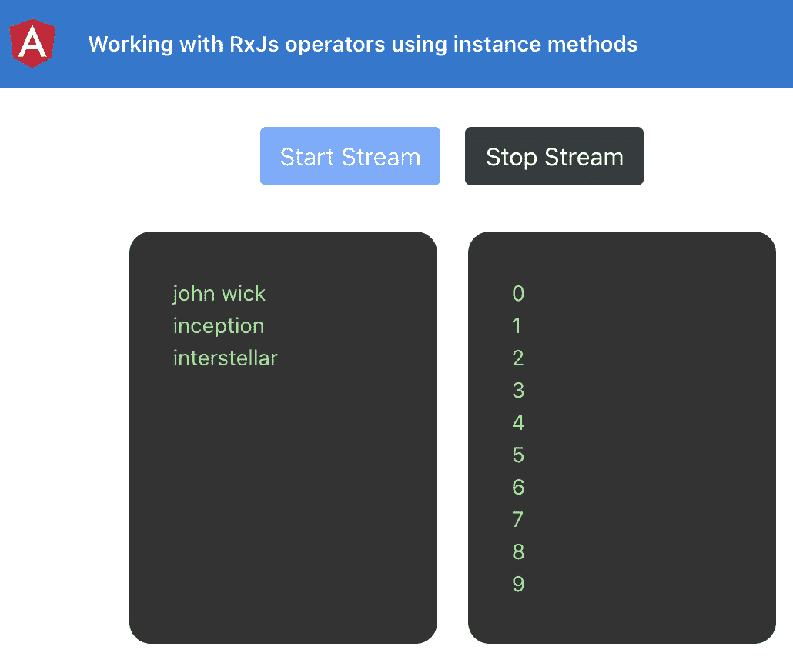

图 5.1 - rxjs-operators-instance-methods 应用程序在 http://localhost:4200 上运行

现在应用程序正在运行，我们将继续进行示例的步骤。

## 操作步骤…

我们有一个 Angular 应用程序，已经设置了一些东西。通过点击**开始流**按钮，我们可以开始查看使用 RxJS 的`interval`方法创建输出从`0`开始的数字序列的 Observable 的流输出。我们将使用一些操作符来显示来自我们的`inputStreamData`数组的元素，这是本教程的目标。让我们开始吧。

1.  首先，我们将使用`map`操作符确保我们将从`interval` Observable 生成的数字映射到我们数组的有效索引。为此，我们将更新`app.component.ts`文件。

我们必须确保映射的数字不大于或等于`inputStreamData`的长度。我们将使用`map`操作符每次对数字取模来做到这一点，如下所示：

```ts
import { Component } from '@angular/core';
import { interval, Subscription } from 'rxjs';
import { map } from 'rxjs/operators';
@Component({...})
export class AppComponent {
...
  startStream() {
    this.subscription = streamSource
    .pipe(
      map(output => output % this.inputStreamData.      length),
    )
    .subscribe(input => {
      this.outputStreamData.push(input);
    });
...
}
```

如果现在点击**开始流**按钮，您会看到我们得到的输出是`0, 1, 2, 0, 1, 2`...等等。这确保我们始终可以使用数字作为索引从`inputStreamData`数组中获取项目：

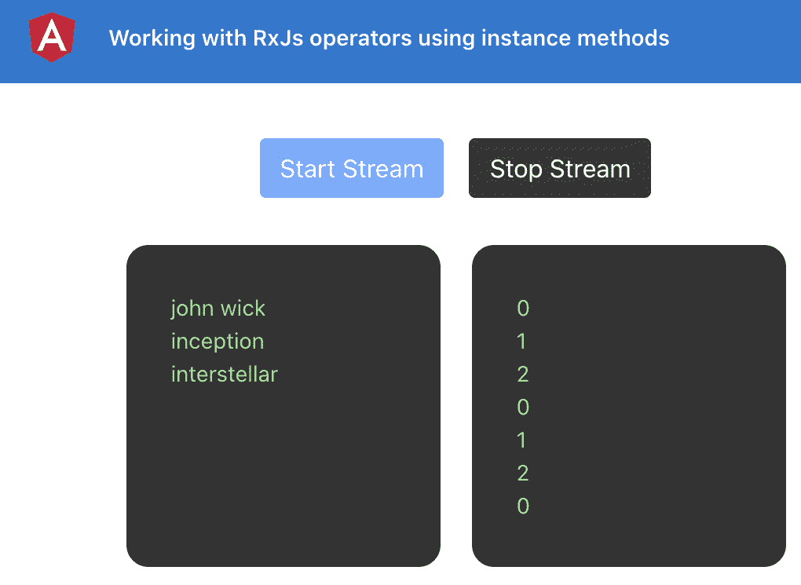

图 5.2 - 流使用 inputStreamData.length 上的模数输出 0,1,2..序列

1.  现在，我们将使用另一个`map`方法来获取数组中每个流输出的元素，如下所示：

```ts
  startStream() {
    const streamSource = interval(1500);
    this.subscription = streamSource
    .pipe(
      map(output => output % this.inputStreamData.      length),
      map(index => this.inputStreamData[index])
    )
    .subscribe(element => {
      this.outputStreamData.push(element);
    });
  }
```

请注意，我们已将`subscribe`方法的参数重命名为`element`而不是`input`。这是因为最终我们得到了一个元素。请参阅以下屏幕截图，演示了流如何使用索引输出来自`inputStreamData`的元素：

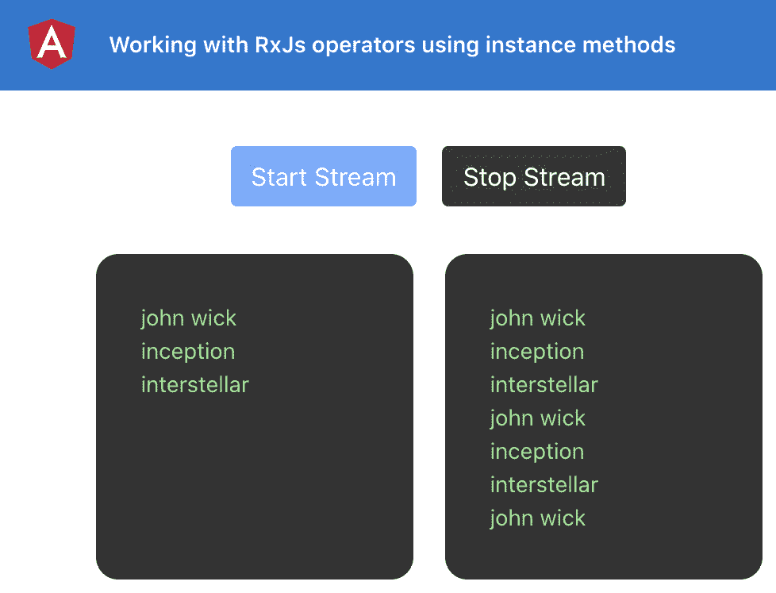

图 5.3 - 流使用索引从 inputStreamData 输出元素

1.  现在，为了使事情更有趣，我们将创建另一个流，使用相同的`interval`方法来发出卡通标题，但间隔为`1000ms`。将以下代码添加到您的`startStream`方法中：

```ts
  startStream() {
    const streamSource = interval(1500);
    const cartoonStreamSource = interval(1000)
      .pipe(
        map(output => output % this.cartoonsStreamData.        length),
        map(index => this.cartoonsStreamData[index]),
      )
    this.subscription = streamSource
    .pipe(...)
    .subscribe(...);
  }
```

1.  我们还将在`AppComponent`类中创建名为`cartoonStreamData`的流数据（在先前的代码中使用）。代码应该是这样的：

```ts
export class AppComponent {
  subscription: Subscription = null;
  inputStreamData = ['john wick', 'inception',   'interstellar'];
  cartoonsStreamData = ['thunder cats', 'Dragon Ball Z',   'Ninja Turtles'];
  outputStreamData = [];
  ...
}
```

1.  现在我们已经将`cartoonsStreamData`流数据放在了适当的位置，我们还可以将其添加到模板中，以便我们也可以在视图上显示它。在`app.component.html`中`<div class="input-stream">`元素的子元素应该是这样的：

```ts
    <div class="input-stream">
      <div class="input-stream__item" *ngFor="let item       of inputStreamData">
        {{item}}
      </div>
      <hr/>
      <div class="input-stream__item" *ngFor="let item       of cartoonsStreamData">
        {{item}}
      </div>
    </div>
```

1.  现在，我们将使用 `merge`（实例）方法来合并这两个流，并在流发出值时从各自的流数据数组中添加一个元素。有趣，对吧？

我们将使用以下代码来实现这一点：

```ts
...
import { map, merge } from 'rxjs/operators';
export class AppComponent {
  ...
  startStream() {
    ...
    this.subscription = streamSource
    .pipe(
      map(output => output % this.inputStreamData.      length),
      map(index => this.inputStreamData[index]),
      merge(cartoonStreamSource)
    )
    .subscribe(element => {
      this.outputStreamData.push(element);
    });
  }
}
```

重要提示

使用 `merge` 方法作为实例方法的用法已被弃用，推荐使用静态的 `merge` 方法。

太棒了！您现在已经实现了整个食谱，实现了两个流的有趣合并。以下截图显示了最终输出：

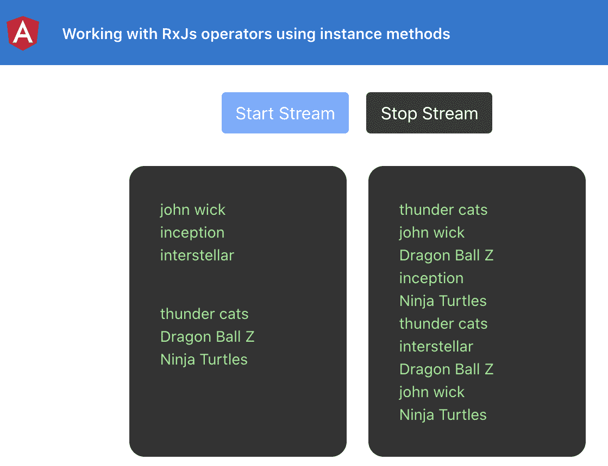

图 5.4 – 食谱的最终输出

让我们继续下一节，了解它是如何工作的。

## 工作原理…

`map` 操作符为您提供了流的输出值，您应该返回要将其映射到的值。我们确保通过取数组长度的模数将自动生成的顺序数字转换为数组的索引。然后，我们在这些索引之上使用另一个 `map` 操作符来获取数组中的实际元素。最后，我们创建了另一个流，并使用 `merge` 方法来合并这两个流的输出，并将其添加到 `outputStreamData` 数组中。

## 另请参阅

+   *抓住小点游戏*—RxJS 文档（[`www.learnrxjs.io/learn-rxjs/recipes/catch-the-dot-game`](https://www.learnrxjs.io/learn-rxjs/recipes/catch-the-dot-game)）

+   RxJS `map` 操作符文档（[`www.learnrxjs.io/learn-rxjs/operators/transformation/map`](https://www.learnrxjs.io/learn-rxjs/operators/transformation/map)）

+   RxJS `merge` 操作符文档（[`www.learnrxjs.io/learn-rxjs/operators/combination/merge`](https://www.learnrxjs.io/learn-rxjs/operators/combination/merge)）

# 使用静态方法处理 RxJS 操作符

在这个食谱中，您将学习使用 RxJS 操作符的静态方法来处理流。我们将从一个基本应用程序开始，在该应用程序中，您可以使用 `interval` 方法开始监听流。然后，我们将在订阅中引入一些静态方法来修改输出，以在**用户界面**（**UI**）上看到它。之后，我们将使用 `partition` 静态操作符来拆分流。最后，我们将使用 `merge` 静态操作符来合并分区流，以查看它们的输出。

## 准备工作

此食谱的项目位于 `chapter05/start_here/rxjs-operators-static-methods`。

1.  在 VS Code 中打开项目。

1.  打开终端并运行 `npm install` 来安装项目的依赖项。

1.  完成后，运行`ng serve -o`。

这将在新的浏览器标签中打开应用程序，你应该能够看到类似这样的东西：

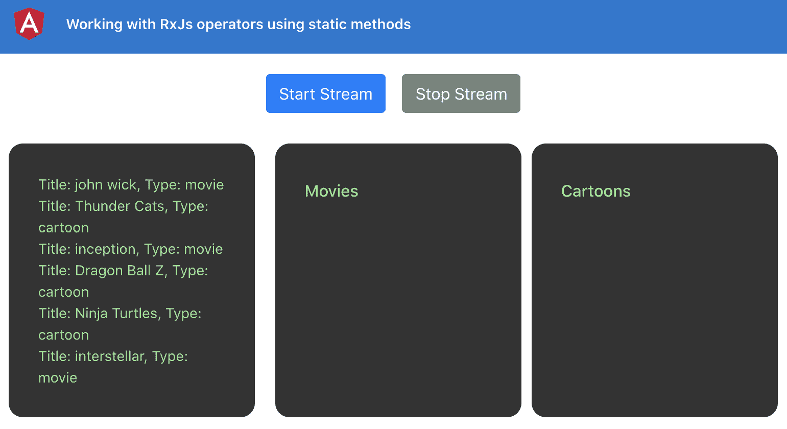

图 5.5 – rxjs-operators-static-methods 应用程序在 http://localhost:4200 上运行

我们还有以下数据，其中包括电影和卡通，这将是流的输出结果：

```ts
combinedStreamData = [{
    type: 'movie',
    title: 'john wick'
  }, {
    type: 'cartoon',
    title: 'Thunder Cats'
  }, {
    type: 'movie',
    title: 'inception'
  }, {
    type: 'cartoon',
    title: 'Dragon Ball Z'
  }, {
    type: 'cartoon',
    title: 'Ninja Turtles'
  }, {
    type: 'movie',
    title: 'interstellar'
  }];
```

现在应用程序在本地运行，让我们在下一节中看一下配方的步骤。

## 如何做…

我们手头有一个 Angular 应用程序，其中有一个名为`combinedStreamData`的数组中有一些数据。通过点击**开始流**按钮，我们可以开始查看流在**电影**输出部分和**卡通**输出部分的输出。我们将使用`partition`和`merge`操作符来获得期望的输出，并且还会显示当前输出的电影和卡通数量。让我们开始吧。

1.  首先，我们将从 RxJS 中导入`partition`和`merge`操作符（与之前的配方不同，我们不是从`rxjs/operators`中导入）。在`app.component.ts`文件中，导入应该如下所示：

```ts
import { Component } from '@angular/core';
import { interval, partition, merge, Subscription } from 'rxjs';
```

1.  现在，我们将在`AppComponent`类中创建两个属性，`movies`和`cartoons`，一个用于保存电影，一个用于保存卡通：

```ts
import { Component } from '@angular/core';
import { interval, partition, merge, Subscription } from 'rxjs';
import { map, tap } from 'rxjs/operators';
export class AppComponent {
  …
  outputStreamData = [];
  movies= []
  cartoons= [];
  startStream() {
  }
  ...
}
```

1.  现在，我们将在模板中使用适当的变量来表示电影和卡通，步骤如下：

```ts
<div class="cards-container">
    <div class="input-stream">
      ...
    <div class="output-stream">
      <h6>Movies</h6>
      <div class="input-stream__item" *ngFor="let movie       of movies">
        {{movie}}
      </div>
    </div>
    <div class="output-stream">
      <h6>Cartoons</h6>
      <div class="input-stream__item" *ngFor="let cartoon       of cartoons">
        {{cartoon}}
      </div>
    </div>
  </div>
```

1.  现在我们将使用`partition`操作符从`streamSource`属性创建两个流。你的`startStream`方法应该如下所示：

```ts
startStream() {
    const streamSource = interval(1500).pipe(
      map(input => {
        const index = input % this.combinedStreamData.        length;
        return this.combinedStreamData[index];
      })
    );
    const [moviesStream, cartoonsStream] = partition(
      streamSource, item => item.type === 'movie'
    );
    this.subscription = streamSource
      .subscribe(input => {
        this.outputStreamData.push(input);
      });
  }
```

现在我们已经将流拆分，我们可以合并它们以订阅单个流，推送到适当的输出数组，并将值记录到控制台输出。

1.  现在让我们合并这些流，然后使用`tap`操作符将它们添加到适当的输出数组中，步骤如下：

```ts
startStream() {
   ...
    this.subscription = merge(
      moviesStream.pipe(
        tap(movie => {
          this.movies.push(movie.title);
        })
      ),
      cartoonsStream.pipe(
        tap(cartoon => {
          this.cartoons.push(cartoon.title);
        })
      ),
    )
      .subscribe(input => {
        this.outputStreamData.push(input);
      });
  }
```

通过这个改变，你应该能够在适当的容器中看到正确的数值——也就是说，无论是电影还是卡通。请参考以下截图，显示了分区流如何向适当的 Observables 发出数值：

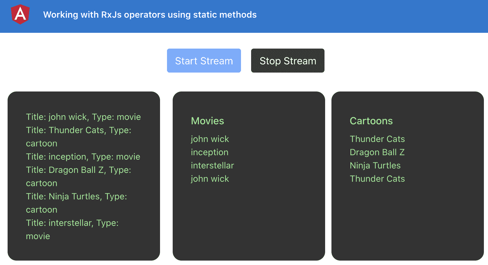

图 5.6 – 分区流将数据输出到适当的视图

1.  最后，由于我们已经合并了流，我们可以使用`console.log`来查看每个输出的值。我们将从`AppComponent`中删除`outputStreamData`属性，并在`subscribe`块中使用`console.log`语句而不是推送到`outputStreamData`，如下所示：

```ts
...
@Component({...})
export class AppComponent {
  ...
  outputStreamData = []; ← Remove
  movies = [];
  cartoons = [];
  ngOnInit() {}
  startStream() {
    const streamSource = interval(1500).pipe(
      map(...)
    );
    const [moviesStream, cartoonsStream] =     partition(...);
    this.subscription = merge(
      moviesStream.pipe(...),
      cartoonsStream.pipe(...)
    ).subscribe((output) => {
      console.log(output);
    });
  }
  ...
}
```

一旦刷新应用程序，您应该在控制台上看到如下日志：

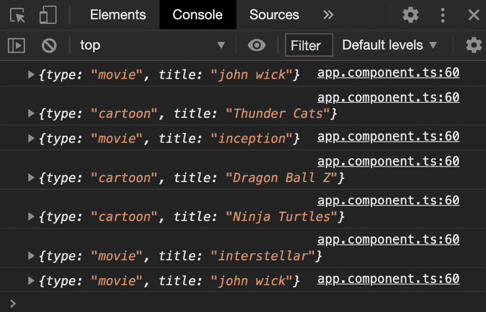

图 5.7 - 合并流中订阅块中每个输出的控制台日志

太棒了！现在你知道如何使用 RxJS 的静态操作符（特别是`partition`和`merge`）来处理实际用例中的流。请参阅下一节，了解其工作原理。

## 工作原理…

RxJS 有一堆静态操作符/方法，我们可以根据特定的用例来使用。在这个示例中，我们使用`partition`操作符根据作为第二个参数提供的`predicate`函数创建了两个不同的流，它返回一个包含两个 Observables 的数组。第一个将包含满足谓词的所有值，第二个将包含不满足谓词的所有值。*为什么要分割流？*很高兴你问。因为我们需要在不同的输出容器中显示适当的输出。而且很棒的是，我们后来合并了这些流，这样我们只需要订阅一个流，然后也可以取消订阅这个流。

## 另请参阅

+   RxJS `map`操作符文档（[`www.learnrxjs.io/learn-rxjs/operators/transformation/map`](https://www.learnrxjs.io/learn-rxjs/operators/transformation/map)）

+   RxJS `merge`操作符文档（[`www.learnrxjs.io/learn-rxjs/operators/combination/merge`](https://www.learnrxjs.io/learn-rxjs/operators/combination/merge)）

+   RxJS `partition`操作符文档（[`www.learnrxjs.io/learn-rxjs/operators/transformation/partition`](https://www.learnrxjs.io/learn-rxjs/operators/transformation/partition)）

# 取消订阅流以避免内存泄漏

流很有趣，而且很棒，当你完成这一章时，你会对 RxJS 有更多了解，尽管在不小心使用流时会出现问题。在处理流时最大的错误之一是在不再需要时不取消订阅它们，而在这个示例中，您将学习如何取消订阅流以避免在 Angular 应用程序中出现内存泄漏。

## 准备工作

此配方的项目位于`chapter05/start_here/rxjs-unsubscribing-streams`中。

1.  在 VS Code 中打开项目。

1.  打开终端并运行 `npm install` 来安装项目的依赖项。

1.  完成后，运行`ng serve -o`。

这应该会在新的浏览器标签中打开应用程序，您应该会看到类似于这样的东西：

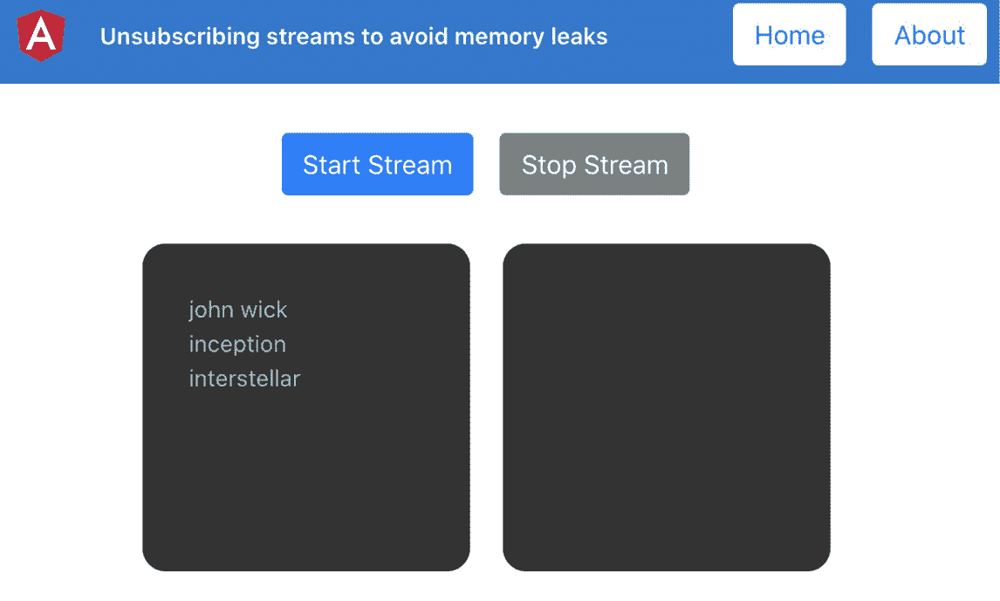

图 5.8 – rxjs-unsubscribing-streams 应用程序在 http://localhost:4200 上运行

现在我们的应用程序在本地运行，让我们在下一节中看一下配方的步骤。

## 如何做…

我们目前有一个具有两个路由的应用程序，即**主页**和**关于**。这是为了向您展示未处理的订阅可能会导致应用程序内存泄漏。默认路由是**主页**，在`HomeComponent`类中，我们处理一个使用`interval`方法输出数据的单个流。

1.  点击**开始流**按钮，您应该看到流发出值。

1.  然后，通过点击页眉（右上角）的**关于**按钮导航到**关于**页面，然后返回到**主页**。

你看到了什么？什么都没有？一切看起来都很好，对吧？嗯，并不完全是这样。

1.  为了查看我们是否有未处理的订阅（这是一个问题），让我们在`home.component.ts`文件中的`startStream`方法内放置一个`console.log`，具体来说，在`.subscribe`方法的块内，如下所示：

```ts
...
export class HomeComponent implements OnInit {
  ...
  startStream() {
    const streamSource = interval(1500);
    this.subscription = streamSource.subscribe(input => {
      this.outputStreamData.push(input);
      console.log('stream output', input)
    });
  }
  stopStream() {...}
}
```

如果您现在执行与*步骤 1*中提到的相同步骤，您将在控制台上看到以下输出：

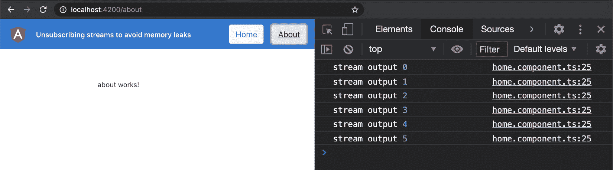

图 5.9 – rxjs-unsubscribing-streams 应用程序在 http://localhost:4200 上运行

想要再玩一些吗？尝试执行*步骤 1*几次，甚至不刷新页面一次。你将看到**混乱**！

1.  因此，为了解决这个问题，我们将使用最简单的方法，即在用户从路由中导航离开时取消订阅流。让我们实现`ngOnDestroy`生命周期方法，如下所示：

```ts
import { Component, OnInit, OnDestroy } from '@angular/core';
...
@Component({
  selector: 'app-home',
  templateUrl: './home.component.html',
  styleUrls: ['./home.component.scss']
})
export class HomeComponent implements OnInit, OnDestroy {
  ...
  ngOnInit() {
  }
  ngOnDestroy() {
    this.stopStream();
  }
  startStream() {
    const streamSource = interval(1500);
    this.subscription = streamSource.subscribe(input => {
      this.outputStreamData.push(input);
      console.log('stream output', input)
    });
  }
  stopStream() {
    this.subscription.unsubscribe();
    this.subscription = null;
  }
}
```

太好了！如果您再次按照*步骤 1*的说明操作，您会发现一旦从**主页**导航离开，控制台上就不会再有进一步的日志输出，我们的应用程序现在没有未处理的流导致内存泄漏。阅读下一节以了解其工作原理。

## 工作原理…

当我们创建一个 Observable/流并订阅它时，RxJS 会自动将我们提供的`.subscribe`方法块添加为 Observable 的处理程序。因此，每当 Observable 发出值时，我们的方法应该被调用。有趣的是，当组件卸载或从路由导航离开时，Angular 不会自动销毁该订阅/处理程序。这是因为 Observable 的核心是 RxJS，而不是 Angular，因此处理它不是 Angular 的责任。

Angular 提供了某些生命周期方法，我们使用了`OnDestroy`（`ngOnDestroy`）方法。这是因为当我们从一个路由导航离开时，Angular 会销毁该路由，这时我们希望取消订阅所有已订阅的流。

## 还有更多...

在一个复杂的 Angular 应用程序中，会有一些情况下，您可能会在一个组件中有多个订阅，并且当组件被销毁时，您希望一次清理所有这些订阅。同样，您可能希望根据某些事件/条件取消订阅，而不是`OnDestroy`生命周期。这是一个例子，您手头有多个订阅，并且希望在组件销毁时一起清理所有这些订阅：

```ts
startStream() {
    const streamSource = interval(1500);
    const secondStreamSource = interval(3000);
    const fastestStreamSource = interval(500);
    streamSource.subscribe(input => {...});
    secondStreamSource.subscribe(input => {
      this.outputStreamData.push(input);
      console.log('second stream output', input)
    });
    fastestStreamSource.subscribe(input => {
      this.outputStreamData.push(input);
      console.log('fastest stream output', input)
    });
  }
  stopStream() {
  }
```

请注意，我们不再将`streamSource`的**Subscription**保存到`this.subscription`中，我们还从`stopStream`方法中删除了代码。原因是因为我们没有为每个 Subscription 拥有单独的属性/变量。相反，我们将有一个单一的变量来处理。让我们看一下以下的步骤来开始工作。

1.  首先，我们将在`HomeComponent`类中创建一个名为`isComponentAlive`的属性：

```ts
...
export class HomeComponent implements OnInit, OnDestroy {
  isComponentAlive: boolean;
  ...
}
```

1.  现在，我们将从`rxjs/operators`中导入`takeWhile`操作符，如下所示：

```ts
import { Component, OnInit, OnDestroy } from '@angular/core';
import { interval } from 'rxjs/internal/observable/interval';
import { Subscription } from 'rxjs/internal/Subscription';
import { takeWhile } from 'rxjs/operators';
```

1.  现在，我们将使用`takeWhile`操作符与我们的每个流，使它们只在`isComponentAlive`属性设置为`true`时工作。由于`takeWhile`需要一个`predicate`方法，它应该是这样的：

```ts
startStream() {
    ...
    streamSource
      .pipe(
        takeWhile(() => !!this.isComponentAlive)
      ).subscribe(input => {...});
    secondStreamSource
      .pipe(
        takeWhile(() => !!this.isComponentAlive)
      ).subscribe(input => {...});
    fastestStreamSource
      .pipe(
        takeWhile(() => !!this.isComponentAlive)
      ).subscribe(input => {...});
  }
```

如果您现在在**主页**上按下**开始流**按钮，您仍然看不到任何输出或日志，因为`isComponentAlive`属性仍然是`undefined`。

1.  为了使流工作，我们将在`ngOnInit`方法以及`startStream`方法中将`isComponentAlive`属性设置为`true`。代码应该是这样的：

```ts
  ngOnInit() {
    this.isComponentAlive = true;
  }
  ngOnDestroy() {
    this.stopStream();
  }
  startStream() {
    this.isComponentAlive = true;
    const streamSource = interval(1500);
    const secondStreamSource = interval(3000);
    const fastestStreamSource = interval(500);
    ...
  }
```

在此步骤之后，如果您现在尝试启动流并从页面导航离开，您仍将看到与流相同的问题-即它们尚未取消订阅。

1.  要一次取消订阅所有流，我们将在`stopStream`方法中将`isComponentAlive`的值设置为`false`，如下所示：

```ts
  stopStream() {
    this.isComponentAlive = false;
  }
```

然后！ 现在，如果您在流发出值时导航离开路由，流将立即停止，就在您离开**主页**路由时。 瞧！

## 另请参阅

+   阅读 RxJS 订阅（https://www.learnrxjs.io/learn-rxjs/concepts/rxjs-primer#subscription）

+   `takeWhile`文档（https://www.learnrxjs.io/learn-rxjs/operators/filtering/takewhile）

# 使用 Observable 和 async 管道将数据同步绑定到您的 Angular 模板

正如您在上一个配方中所学到的，取消订阅您订阅的流至关重要。 如果我们有一种更简单的方法在组件被销毁时取消订阅它们-也就是说，让 Angular 以某种方式来处理它，那该多好？ 在这个配方中，您将学习如何使用 Angular 的`async`管道与 Observable 直接将流中的数据绑定到 Angular 模板，而无需在`*.component.ts`文件中订阅。

## 做好准备

此配方的项目位于`chapter05/start_here/using-async-pipe`。

1.  在 VS Code 中打开项目。

1.  打开终端并运行`npm install`以安装项目的依赖项。

1.  完成后，运行`ng serve -o`。

这应该在新的浏览器选项卡中打开应用程序。 一旦页面打开，您应该看到类似于这样的东西：

！[图 5.10-使用异步管道应用程序在 http://localhost:4200 上运行

]（image/Figure_5.10_B15150.jpg）

图 5.10-使用异步管道应用程序在 http://localhost:4200 上运行

现在我们的应用程序在本地运行，让我们在下一节中看到该配方的步骤。

## 如何做…

我们现在的应用程序有三个流/可观察对象在不同的时间间隔观察值。 我们依赖于`isComponentAlive`属性来保持订阅活动或在属性设置为`false`时停止它。 我们将删除对`takeWhile`的使用，并以某种方式使一切都与我们现在拥有的类似地工作。

1.  首先，从`home.component.ts`文件中删除`subscription`属性，并添加一个名为`streamOutput$`的`Observable`类型属性。 代码应如下所示：

```ts
...
import { Observable } from 'rxjs';
...
export class HomeComponent implements OnInit, OnDestroy {
  isComponentAlive: boolean;
  subscription: Subscription = null ← Remove this;
  inputStreamData = ['john wick', 'inception',   'interstellar']; 
  streamsOutput$: Observable<number[]> ← Add this
  outputStreamData = []
  constructor() { }
  ...
}
```

通过这种改变，应用程序会因为一些缺少的变量而崩溃。 不要害怕！ 我在这里帮助您。

1.  现在我们将组合所有的流以输出单个输出，即`outputStreamData`数组。我们将从`startStream()`方法中删除所有现有的`.pipe`和`.subscribe`方法，所以代码现在应该是这样的：

```ts
import { Component, OnInit, OnDestroy } from '@angular/core';
import { merge, Observable } from 'rxjs';
import { map, takeWhile } from 'rxjs/operators';
...
export class HomeComponent implements OnInit, OnDestroy {
  ...
  startStream() {
    const streamSource = interval(1500);
    const secondStreamSource = interval(3000);
    const fastestStreamSource = interval(500);
    this.streamsOutput$ = merge(
      streamSource,
      secondStreamSource,
      fastestStreamSource
    )
  }
  ...
}
```

有了这个改变，linters 仍然会抱怨。为什么？因为`merge`操作符会合并所有流并输出最新的值。这是一个`Observable<number>`数据类型，而不是`Observable<string[]>`，这是`streamsOutput$`的类型。

1.  由于我们想要分配包含从流中发出的每个输出的整个数组，我们将使用`map`操作符，并将每个输出添加到`outputStreamData`数组中，并返回`outputStreamData`数组的最新状态，如下所示：

```ts
startStream() {
    const streamSource = interval(1500);
    const secondStreamSource = interval(3000);
    const fastestStreamSource = interval(500);
    this.streamsOutput$ = merge(
      streamSource,
      secondStreamSource,
      fastestStreamSource
    ).pipe(
      takeWhile(() => !!this.isComponentAlive),
      map(output => {
        this.outputStreamData = [...this.        outputStreamData, output]
        return this.outputStreamData;
      })
    )
  }
```

1.  从`HomeComponent`类中删除`stopStream`方法，因为我们不再需要它。同时，从`ngOnDestroy`方法中删除它的使用。

1.  最后，修改`home.component.html`模板，使用`streamOutput$` Observable 和`async`管道来循环输出数组：

```ts
    <div class="output-stream">
      <div class="input-stream__item" *ngFor="let item       of streamsOutput$ | async">
        {{item}}
      </div>
    </div>
```

1.  为了验证订阅在组件销毁时确实被销毁，让我们在`startStream`方法中的`map`操作符中放置一个`console.log`，如下所示：

```ts
startStream() {
    const streamSource = interval(1500);
    const secondStreamSource = interval(3000);
    const fastestStreamSource = interval(500);
    this.streamsOutput$ = merge(
      streamSource,
      secondStreamSource,
      fastestStreamSource
    ).pipe(
      takeWhile(() => !!this.isComponentAlive),
      map(output => {
        console.log(output)
        this.outputStreamData = [...this.        outputStreamData, output]
        return this.outputStreamData;
      })
    )
  }
```

万岁！有了这个改变，你可以尝试刷新应用程序，离开**Home**路由，你会发现控制台日志会在你这样做时立即停止。你感受到我们通过删除所有那些额外代码所获得的成就了吗？我当然感受到了。好吧，接下来看看它是如何工作的。

## 它是如何工作的…

Angular 的`async`管道在组件销毁时会自动销毁/取消订阅。这给了我们一个很好的机会在可能的情况下使用它。在这个示例中，我们基本上使用`merge`操作符组合了所有的流。有趣的是，对于`streamsOutput$`属性，我们希望得到一个输出数组的 Observable，我们可以对其进行循环。然而，合并流只是将它们组合在一起并发出任何一个流发出的最新值。因此，我们添加了一个`.pipe()`方法和`.map()`操作符，以从组合的流中取出最新的输出，将其添加到`outputStreamData`数组中以进行持久化，并从`.map()`方法中返回它，这样我们在模板中使用`async`管道时就可以得到数组。

有趣的事实-流不会发出任何值，除非它们被订阅。"*但是，阿赫桑，我们没有订阅流，我们只是合并和映射数据。订阅在哪里？*"很高兴你问。Angular 的`async`管道订阅了流本身，这也触发了我们在*步骤 6*中添加的`console.log`。

重要提示

`async` 管道有一个限制，即在组件销毁之前无法停止订阅。在这种情况下，您可能希望使用类似`takeWhile`/`takeUntil`操作符的组件内订阅，或者在组件销毁时自己执行常规的`.unsubscribe`方法。

## 另请参阅

+   Angular `async` 管道文档（[`angular.io/api/common/AsyncPipe`](https://angular.io/api/common/AsyncPipe)）

# 使用 combineLatest 订阅多个流

在上一个示例中，我们不得不合并所有流，这导致最后由任何一个流发出的单个输出。在这个示例中，我们将使用`combineLatest`，它的输出是一个数组，结合了所有的流。这种方法适用于当您想要来自所有流的最新输出，组合在一个单独的订阅中。

## 准备工作

我们要使用的项目位于克隆存储库内的`chapter05/start_here/using-combinelatest-operator`中。

1.  在 VS Code 中打开项目。

1.  打开终端并运行`npm install`来安装项目的依赖项。

1.  完成后，运行`ng serve -o`。

这应该在新的浏览器标签中打开应用程序，你应该看到类似这样的东西：

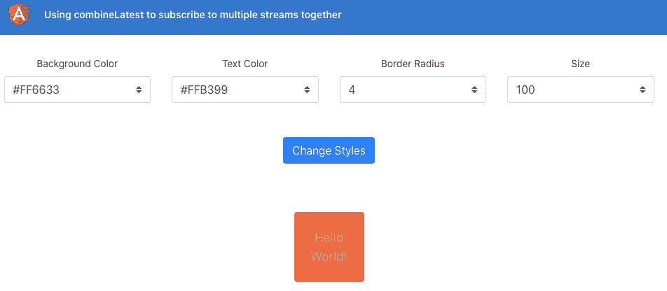

图 5.11 - 使用 combinelatest-operator 应用程序在 http://localhost:4200 上运行

现在我们的应用程序在本地运行，让我们在下一节中看看这个示例的步骤。

## 如何做…

对于这个示例，我们有一个显示框的应用程序。框有一个大小（宽度和高度），一个边框半径，一个背景颜色，以及文本的颜色。它还有四个输入来修改所有提到的因素。现在，我们必须手动点击按钮来应用更改。如果我们可以订阅输入的更改并立即更新框呢？这就是我们要做的。

1.  我们将首先创建一个名为`listenToInputChanges`的方法，在其中我们将订阅每个输入的更改，并使用`combineLatest`操作符组合这些流。更新`home/home.component.ts`文件如下：

```ts
...
import { combineLatest, Observable } from 'rxjs';
...
export class HomeComponent implements OnInit, OnDestroy {
  ...
  ngOnInit() {
    ...
    this.applyChanges();
    this.listenToInputChanges(); ← Add this
  }
  listenToInputChanges() {
    combineLatest([
      this.boxForm.get('size').valueChanges,
      this.boxForm.get('borderRadius').valueChanges,
      this.boxForm.get(      'backgroundColor').valueChanges,
      this.boxForm.get('textColor').valueChanges
    ]).subscribe(() => {
      this.applyChanges();
    });
  }
  ...
}
```

1.  记住不取消订阅流是一个坏主意吗？这就是我们在这里的情况：一个已订阅的流。我们将使用`async`管道代替`home.component.ts`文件中当前使用的订阅。为此，让我们创建一个名为`boxStyles$`的 Observable 属性，并删除`boxStyles`属性。然后，将`combineLatest`的流分配给它，如下所示：

```ts
...
import { map} from 'rxjs/operators';
...
export class HomeComponent implements OnInit, OnDestroy {
  ...
  boxStyles: {...}; ← Remove this
  boxForm = new FormGroup({...});
  boxStyles$: Observable<{
    width: string,
    height: string,
    backgroundColor: string,
    color: string
    borderRadius: string
  }>;
   ...
  listenToInputChanges() {
    this.boxStyles$ = combineLatest([...]).    pipe(map(([size, borderRadius, backgroundColor,     textColor]) => {
      return {
        width: `${size}px`,
        height: `${size}px`,
        backgroundColor,
        color: textColor,
        borderRadius: `${borderRadius}px`
      }
    }));
  }
  ...
}
```

1.  我们需要从`home.component.ts`文件中删除`setBoxStyles()`和`applyChanges()`方法以及`applyChanges()`方法的使用。更新文件如下：

```ts
export class HomeComponent implements OnInit, OnDestroy {
  ...
  ngOnInit() {
    ...
    this.applyChanges(); ← Remove this
    this.listenToInputChanges(); ← Add this
  }
  ...
  setBoxStyles(size, backgroundColor, color,   borderRadius) {...}  ← Remove this
  applyChanges() {...} ← Remove this
  ...
}
```

1.  我们还需要从模板中删除`applyChanges()`方法的使用。从`home.component.html`文件中的`<form>`元素中删除`(ngSubmit)`处理程序，使其如下所示：

```ts
<div class="home" [formGroup]="boxForm" (ngSubmit)="applyChanges()" ← Remove this>
  ...
</div>
```

1.  我们还需要从`home.component.html`模板中删除`submit-btn-container`元素，因为我们不再需要它。从文件中删除以下内容：

```ts
<div class="row submit-btn-container" ← Remove this element>
  <button class="btn btn-primary" type="submit"   (click)="applyChanges()">Change Styles</button>
</div>
```

如果刷新应用程序，你会注意到框根本不显示。我们将在下一步中修复这个问题。

1.  由于我们在应用程序启动时使用了`combineLatest`操作符，但我们没有触发它，因为没有一个输入发生了变化，我们需要使用`startWith`操作符和初始值来初始化框。为此，我们将使用`startWith`操作符和初始值，如下所示：

```ts
...
import { map, startWith } from 'rxjs/operators';
@Component({...})
export class HomeComponent implements OnInit, OnDestroy {
  ...
  ngOnInit() {
    this.listenToInputChanges();
  }
  listenToInputChanges() {
    this.boxStyles$ = combineLatest([
      this.boxForm
        .get('size')
        .valueChanges.pipe(startWith(this.        sizeOptions[0])),
      this.boxForm
        .get('borderRadius')
        .valueChanges.pipe(startWith(        this.borderRadiusOptions[0])),
      this.boxForm
        .get('backgroundColor')
        .valueChanges.pipe(startWith(        this.colorOptions[1])),
      this.boxForm
        .get('textColor')
        .valueChanges.pipe(startWith(        this.colorOptions[0])),
    ]).pipe(
      map(...);
  }
  ngOnDestroy() {}
}
```

1.  现在我们已经有了`boxStyles$` Observable，让我们在模板中使用它，而不是`boxStyles`属性：

```ts
  ...
  <div class="row" *ngIf="boxStyles$ | async as bStyles">
    <div class="box" [ngStyle]="bStyles">
      <div class="box__text">
        Hello World!
      </div>
    </div>
  </div>
  ...
```

大功告成！现在一切都运行得很完美。

恭喜完成了食谱。现在你是流和`combineLatest`操作符的大师了。查看下一节以了解它是如何工作的。

## 它是如何工作的…

**响应式表单**的美妙之处在于它们提供比常规的`ngModel`绑定或者甚至模板驱动表单更灵活的功能。对于每个表单控件，我们可以订阅它的`valueChanges` Observable，每当输入发生变化时就会接收到一个新的值。因此，我们不再依赖于**提交**按钮的点击，而是直接订阅了每个**表单控件**的`valueChanges`属性。在常规情况下，这将导致四个不同的流用于四个输入，这意味着我们需要处理四个订阅并确保取消订阅。这就是`combineLatest`操作符发挥作用的地方。我们使用`combineLatest`操作符将这四个流合并为一个，这意味着我们只需要在组件销毁时取消订阅一个流。但是！记住如果我们使用`async`管道就不需要这样做了？这正是我们所做的。我们从`home.component.ts`文件中移除了订阅，并使用了`.pipe()`方法和`.map()`操作符。`.map()`操作符将数据转换为我们需要的格式，然后将转换后的数据返回给`boxStyles$` Observable。最后，我们在模板中使用 async 管道订阅`boxStyles$` Observable，并将其值分配为我们盒子元素的`[ngStyle]`。

重要提示

`combineLatest`方法在每个 Observable 至少发出一个值之前不会发出初始值。因此，我们使用`startWith`操作符与每个单独的表单控件的`valueChanges`流来提供一个初始发出的值。

## 另请参阅

+   `combineLatest`操作符文档（[`www.learnrxjs.io/learn-rxjs/operators/combination/combinelatest`](https://www.learnrxjs.io/learn-rxjs/operators/combination/combinelatest)）

+   `combineLatest`操作符的可视化表示（[`rxjs-dev.firebaseapp.com/api/index/function/combineLatest`](https://rxjs-dev.firebaseapp.com/api/index/function/combineLatest)）

# 使用 flatMap 操作符创建顺序的 HTTP 调用

使用**Promises**的日子很棒。并不是说那些日子已经过去了，但我们作为开发者肯定更喜欢**Observables**而不是**Promises**，有很多原因。我真的很喜欢 Promises 的一件事是你可以链接 Promises 来做一些事情，比如顺序的 HTTP 调用。在这个教程中，你将学习如何使用`flatMap`操作符来使用**Observables**做同样的事情。

## 准备就绪

我们要处理的项目位于克隆存储库中的`chapter05/start_here/using-flatmap-operator`中。

1.  在 VS Code 中打开项目。

1.  打开终端并运行 `npm install` 来安装项目的依赖项。

1.  完成后，运行 `ng serve -o`。

这应该在新的浏览器标签中打开应用程序，你应该会看到类似这样的东西：


图 5.12 – 使用-flatmap-operator 应用程序正在 http://localhost:4200 上运行

现在应用程序看起来完美，实际上。没有什么可疑的，对吧？嗯，不完全是。按照以下步骤找出问题所在。

1.  打开 Chrome DevTools。

1.  转到**网络**选项卡，并模拟**慢 3G**网络，如下所示：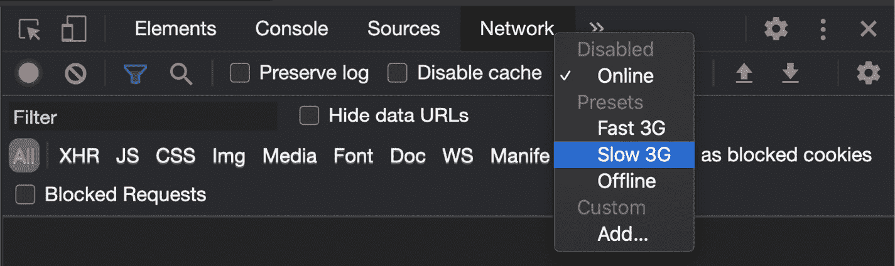

图 5.13 – 在 Chrome DevTools 中模拟慢 3G 网络

如果你点击主页上的任何卡片，你应该能够到达特定用户的详细信息页面。

1.  现在刷新应用程序，查看**网络**选项卡，你会看到 HTTP 调用并行执行，如下所示：

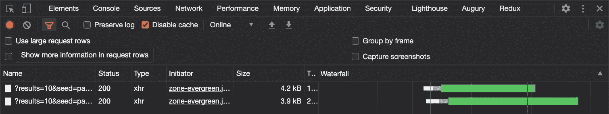

图 5.14 – 并行调用异步加载数据

问题在于我们不确定由于两个 HTTP 调用并行执行，哪个数据会先到来。因此，用户可能会在主用户加载之前看到类似的用户。让我们看看如何避免这种情况。

## 如何做…

为了解决类似用户可能在主用户之前加载的问题，我们将不得不顺序加载数据，并分别显示相应的内容，而在内容加载时，我们将显示一个加载器。让我们开始吧。

1.  首先，让我们修改我们的`user-detail/user-detail.component.html`文件，以便在加载时显示加载器，以及在加载类似的用户时也显示加载器。代码应该如下所示：

```ts
<div class="user-detail">
  <div class="main-content user-card">
    <app-user-card *ngIf="user$ | async as user; else     loader" [user]="user"></app-user-card>
  </div>
  <div class="secondary-container">
    <h4>Similar Users</h4>
    <div class="similar-users">
      <ng-container *ngIf="similarUsers$ | async as       users; else loader">
        <app-user-card class="user-card" *ngFor="let user         of users" [user]="user"></app-user-card>
      </ng-container>
    </div>
  </div>
</div>
<ng-template #loader>
  <app-loader></app-loader>
</ng-template>
```

如果刷新应用程序，你应该会看到在进行调用之前两个加载器都出现。

我们希望进行顺序调用，为此，我们不能直接将流绑定到`UserDetailComponent`类中的 Observables。也就是说，我们甚至不能使用`async`管道。

1.  让我们将`UserDetailComponent`类中的 Observable 属性转换为常规属性，如下所示：

```ts
...
export class UserDetailComponent implements OnInit, OnDestroy {
  user: IUser;
  similarUsers: IUser[];
  isComponentAlive: boolean;
  ...
}
```

只要保存上述更改，应用程序就会立即崩溃。

1.  让我们在模板中使用我们在上一步中修改的新变量。修改`user-detail.component.html`文件，如下所示：

```ts
<div class="user-detail">
  <div class="main-content user-card">
    <app-user-card *ngIf="user; else loader"     [user]="user"></app-user-card>
  </div>
  <div class="secondary-container">
    <h4>Similar Users</h4>
    <div class="similar-users">
      <ng-container *ngIf="similarUsers; else loader">
        <app-user-card class="user-card" *ngFor="let user         of similarUsers" [user]="user"></app-user-card>
      </ng-container>
    </div>
  </div>
</div>
...
```

1.  最后，让我们现在使用`flatMap`运算符按顺序执行调用，并将接收到的值分配给相应的变量，如下所示：

```ts
...
import { takeWhile, flatMap } from 'rxjs/operators';
export class UserDetailComponent implements OnInit, OnDestroy {
  ...
  ngOnInit() {
    this.isComponentAlive = true;
    this.route.paramMap.pipe(
      takeWhile(() => !!this.isComponentAlive),
      flatMap(params => {
        this.user = null;
        this.similarUsers = null;
        const userId = params.get('uuid');
        return this.userService.getUser(userId)
          .pipe(
            flatMap((user: IUser) => {
              this.user = user;
              return this.userService.              getSimilarUsers(userId);
            })
          );
      })
    ).subscribe((similarUsers: IUser[]) => {
      this.similarUsers = similarUsers;
    })
  }
  ...
}
```

是的！如果您现在刷新应用程序，您会注意到调用是顺序的，因为我们首先获取主用户，然后获取相似用户。要确认，您可以打开 Chrome DevTools 并查看**应用程序编程接口**（**API**）调用的网络日志。您应该会看到类似以下内容：

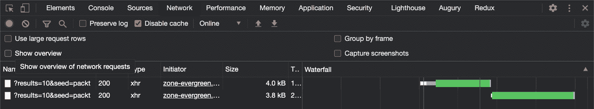

图 5.15 – API 调用同步执行

现在您已经完成了这个步骤，请查看下一节，了解其工作原理。

## 工作原理…

`flatMap`运算符获取前一个 Observable 的输出，并应返回一个新的 Observable。这有助于我们按顺序执行 HTTP 调用，以确保数据根据其优先级或我们的业务逻辑加载。

由于我们希望在选择新用户时执行调用，这可以从`UserDetailComponent`类本身发生，我们直接在`route.paramsMap`上放置了`flatMap`运算符。每当发生这种情况时，我们首先将`user`和`similarUsers`属性设置为`null`。"*但为什么？*"嗯，因为如果我们在`UserDetailsComponent`页面上并单击任何相似用户，页面不会更改，因为我们已经在上面。这意味着用户和`similarUsers`变量仍将包含其先前的值。而且由于它们已经有值（即它们不是`null`），在点击任何相似用户时，加载程序将不会显示在这种情况下。聪明，对吧？

无论如何，在将变量分配为`null`之后，我们将 Observable 从`this.userService.getUser(userId)`块返回，这将导致执行第一个 HTTP 调用以获取主用户。然后，我们在第一个调用的 Observable 上使用管道和`flatMap`来获取主用户，将其分配给`this.user`块，然后返回第二个调用的 Observable——即`this.userService.getSimilarUsers(userId)`代码。最后，我们使用`.subscribe`方法从`getSimilarUsers(userId)`接收值，一旦接收到值，我们将其分配给`this.similarUsers`。

## 另请参见

+   `flatMap`/`mergeMap`文档（[`www.learnrxjs.io/learn-rxjs/operators/transformation/mergemap`](https://www.learnrxjs.io/learn-rxjs/operators/transformation/mergemap)）

# 使用 switchMap 操作符来切换最后一个订阅与新的订阅

对于许多应用程序，我们有诸如用户输入时搜索内容的功能。这是一个非常好的**用户体验**（**UX**），因为用户不必按按钮进行搜索。然而，如果我们在每次按键时向服务器发送调用，那将导致大量的 HTTP 调用被发送，我们无法知道哪个 HTTP 调用会首先完成；因此，我们无法确定我们是否会在视图上看到正确的数据。在这个示例中，您将学习如何使用`switchMap`操作符来取消上一个订阅并创建一个新的订阅。这将导致取消以前的调用并保留一个调用 - 最后一个调用。

## 准备工作

我们要处理的项目位于克隆存储库中的`chapter05/start_here/using-switchmap-operator`中。

1.  在 VS Code 中打开项目。

1.  打开终端并运行`npm install`来安装项目的依赖项。

1.  完成后，运行`ng serve -o`。

这应该会在新的浏览器标签中打开应用程序，你应该会看到类似于这样的东西：


图 5.16 - 使用 switchmap-operator 应用程序在 http://localhost:4200 上运行

现在我们的应用程序在本地运行，打开 Chrome DevTools 并转到**Network**选项卡。在搜索输入框中输入`'huds'`，你会看到有四个调用被发送到 API 服务器，如下所示：

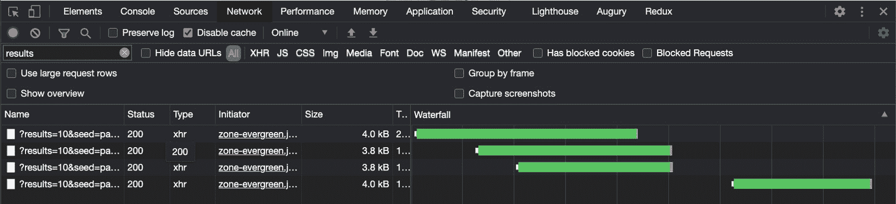

图 5.17 - 每次输入更改都发送一个单独的调用

## 如何做…

您可以在主页的搜索框中开始输入以查看筛选后的用户，如果您查看**Network**选项卡，您会注意到每次输入更改时，我们都会发送一个新的 HTTP 调用。让我们通过使用`switchMap`操作符来避免在每次按键时发送调用。

1.  首先，在`home/home.component.ts`文件中从`rxjs/operators`中导入`switchMap`操作符，如下所示：

```ts
...
import { switchMap, takeWhile } from 'rxjs/operators';
```

1.  我们现在将修改对`username`表单控件的订阅，具体来说是使用`switchMap`操作符来调用`this.userService.searchUsers(query)`方法的`valueChanges` Observable。这将返回一个包含 HTTP 调用结果的`Observable`。代码应该如下所示：

```ts
...
  ngOnInit() {
    this.componentAlive = true;
    this.searchForm = new FormGroup({
      username: new FormControl('', [])
    })
    this.searchUsers();
    this.searchForm.get('username').valueChanges
      .pipe(
        takeWhile(() => !!this.componentAlive),
        switchMap((query) => this.userService.        searchUsers(query))
      )
      .subscribe((users) => {
        this.users = users;
      })
  }
```

如果现在刷新应用程序，打开 Chrome DevTools，并在输入`'huds'`时检查网络类型，您会看到所有先前的调用都被取消，我们只有最新的 HTTP 调用成功：

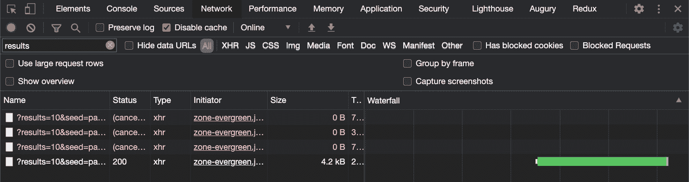

图 5.18 – switchMap 取消先前的 HTTP 调用

哇！现在我们只有一个调用会成功，处理数据，并最终显示在视图中。请参阅下一节了解其工作原理。

## 它是如何工作的…

`switchMap`操作符会取消先前（内部）的订阅，并订阅一个新的 Observable。这就是为什么它会取消我们示例中之前发送的所有 HTTP 调用，只订阅最后一个的原因。这是我们应用程序的预期行为。

## 另请参阅

+   `switchMap`操作符文档（https://www.learnrxjs.io/learn-rxjs/operators/transformation/switchmap）

# 使用 RxJS 进行 HTTP 请求去抖

在上一个示例中，我们学习了如何使用`switchMap`操作符来取消先前的 HTTP 调用，如果有新的 HTTP 调用。这很好，但是为什么在我们可以使用一种技术在发送 HTTP 调用之前等待一段时间呢？理想情况下，我们将继续监听一段时间的重复请求，然后继续进行最新的请求。在这个示例中，我们将使用`debounceTime`操作符来确保我们只在用户停止输入一段时间后才发送 HTTP 调用。

## 准备工作

我们将要处理的项目位于克隆存储库中的`chapter05/start_here/using-debouncetime-operator`中。

1.  在 VS Code 中打开项目。

1.  打开终端并运行`npm install`来安装项目的依赖项。

1.  完成后，运行`ng serve -o`。

这应该会在新的浏览器选项卡中打开应用程序，并且您应该会看到类似于这样的内容：


图 5.19 – 使用 debouncetime 操作符的应用程序运行在 http://localhost.4200 上

现在应用程序正在运行，打开 Chrome DevTools，转到**网络**选项卡，然后在用户搜索栏中输入`'Irin'`。您应该会看到类似于这样的内容：

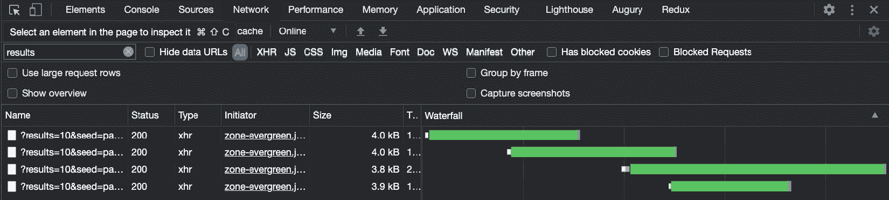

图 5.20 - 每次键盘输入都会发送到服务器的新调用

注意第三次调用的响应是在第四次调用之后吗？这就是我们试图通过使用某种防抖来解决的问题。

让我们在下一节中跳转到食谱步骤。

## 如何做…

当我们在主页的搜索框中输入时（也就是说，每当输入发生变化时），我们会发送一个新的 HTTP 调用。

为了确保在输入搜索后处于空闲状态时只发送一次调用，我们将在`this.searchForm.get('username').valueChanges` Observable 上放置一个`debounceTime`操作符。更新`home/home.component.ts`文件，如下所示：

```ts
...
import { debounceTime, takeWhile } from 'rxjs/operators';
...
export class HomeComponent implements OnInit, OnDestroy {
  ...
  ngOnInit() {
    ...
    this.searchForm.get('username').valueChanges
      .pipe(
        takeWhile(() => !!this.componentAlive),
        debounceTime(300),
      )
      .subscribe(() => {
        this.searchUsers();
      })
  }
  searchUsers() {...}
  ngOnDestroy() {}
}
```

就是这样！如果您在检查**网络**选项卡时在搜索输入框中输入`'irin'`，您应该只看到一次调用被发送到服务器，如下所示：

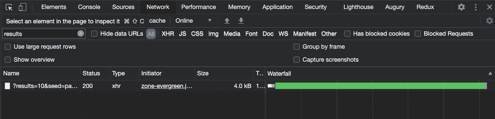

图 5.21 - debounceTime 只导致一次调用发送到服务器

请查看下一节以了解它是如何工作的。

## 它是如何工作的…

`debounceTime`操作符在从源 Observable 发出值之前等待一段时间，而且只有在没有更多的源发射时才会发出值。这使我们能够在输入的`valueChanges` Observable 上使用该操作符。当您在输入框中输入内容时，`debounceTime`操作符会等待 300 毫秒，以查看您是否仍在输入。如果您在这 300 毫秒内没有输入，它将继续发出值，导致最终进行 HTTP 调用。

## 另请参阅

+   `debounceTime`操作符文档（[`rxjs-dev.firebaseapp.com/api/operators/debounceTime`](https://rxjs-dev.firebaseapp.com/api/operators/debounceTime))

+   `debounce`操作符文档（[`rxjs-dev.firebaseapp.com/api/operators/debounce`](https://rxjs-dev.firebaseapp.com/api/operators/debounce))

+   `delay`操作符文档（[`rxjs-dev.firebaseapp.com/api/operators/delay`](https://rxjs-dev.firebaseapp.com/api/operators/delay))
