# 第六章：*第六章*：使用 NgRx 进行响应式状态管理

Angular 和响应式编程是最好的朋友，以响应式方式处理应用程序的状态是您可以为应用程序做的最好的事情之一。NgRx 是一个为 Angular 提供一组库作为响应式扩展的框架。在本章中，您将学习如何使用 NgRx 生态系统以响应式地管理应用程序的状态，并且您还将学习 NgRx 生态系统将帮助您完成的一些很酷的事情。

以下是本章我们将要涵盖的食谱：

+   使用动作和减速器创建你的第一个 NgRx 存储

+   使用`@ngrx/store-devtools`来调试状态变化

+   创建一个效果来获取第三方**应用程序编程接口**（**API**）数据

+   使用选择器从多个组件中的存储中获取数据

+   使用`@ngrx/component-store`来在组件内进行本地状态管理

+   使用`@ngrx/router-store`以响应式方式处理路由更改

# 技术要求

对于本章的食谱，请确保您的计算机上已安装**Git**和**Node.js**。您还需要安装`@angular/cli`包，可以在终端中使用`npm install -g @angular/cli`来安装。本章的代码可以在 https://github.com/PacktPublishing/Angular-Cookbook/tree/master/chapter06 找到。

# 使用动作和减速器创建你的第一个 NgRx 存储

在这个食谱中，您将通过设置您的第一个 NgRx 存储来逐步了解 NgRx 的基础知识。您还将创建一些动作以及一个减速器，并且为了查看减速器中的变化，我们将放入适当的控制台日志。

## 准备工作

我们将要使用的项目位于`chapter06/start_here/ngrx-actions-reducer`中，位于克隆存储库内：

1.  在**Visual Studio Code** (**VS Code**)中打开项目。

1.  打开终端并运行`npm install`来安装项目的依赖项。

1.  完成后，运行`ng serve -o`。

这应该会在新的浏览器标签中打开应用程序。点击**以管理员身份登录**按钮，您应该会看到以下屏幕：

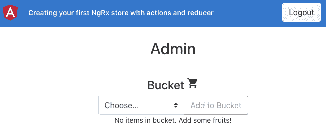

图 6.1 – ngrx-actions-reducers 应用程序在 http://localhost:4200 上运行

现在我们的应用程序正在运行，我们将继续进行食谱的步骤。

## 如何做…

我们有一个现有的 Angular 应用程序，我们在之前的示例中也使用过。如果您以管理员用户身份登录，您可以向购物篮中添加和移除物品。但是，如果您以员工身份登录，您只能添加物品而不能移除物品。现在我们将开始将 NgRx 集成到应用程序中，并创建一个 reducer 和一些动作：

1.  首先通过**Node Package Manager** (**npm**)在您的项目中安装`@ngrx/store package`。打开终端（Mac/Linux）或命令提示符（Windows），导航到项目根目录，并运行以下命令：

```ts
npm install @ngrx/store@12.0.0 --save
```

如果您已经在运行，请确保重新运行`ng-serve`命令。

1.  更新`app.module.ts`文件以包括`StoreModule`，如下所示：

```ts
...
import { StoreModule } from '@ngrx/store';
@NgModule({
  declarations: [
    AppComponent
  ],
  imports: [
    BrowserModule,
    AppRoutingModule,
    FormsModule,
    BrowserAnimationsModule,
    StoreModule.forRoot({})
  ],
  providers: [],
  bootstrap: [AppComponent]
})
export class AppModule { }
```

注意，我们已经向`forRoot`方法传递了一个空对象`{}`；我们将在以后进行更改。

1.  现在，我们将创建一些动作。在`app`文件夹内创建一个名为`store`的文件夹。然后，在`store`文件夹内创建一个名为`app.actions.ts`的文件，并最后向新创建的文件中添加以下代码：

```ts
import { createAction, props } from '@ngrx/store';
import { IFruit } from '../interfaces/fruit.interface';
export const addItemToBucket = createAction(
  '[Bucket] Add Item',
  props<IFruit>()
);
export const removeItemFromBucket = createAction(
  '[Bucket] Remove Item',
  props<IFruit>()
);
```

由于我们现在已经有了动作，我们必须创建一个 reducer。

1.  在`store`文件夹内创建一个新文件，命名为`app.reducer.ts`，并向其中添加以下代码以定义必要的导入：

```ts
import { Action, createReducer, on } from '@ngrx/store';
import { IFruit } from '../interfaces/fruit.interface';
import * as AppActions from './app.actions';
```

1.  现在，定义一个`AppState`接口以反映应用程序的状态，并定义一个`initialState`变量以反映应用程序启动时应用程序状态的外观。在`app.reducer.ts`文件中添加以下代码：

```ts
import { Action, createReducer, on } from '@ngrx/store';
import { IFruit } from '../interfaces/fruit.interface';
import * as AppActions from './app.actions';

export interface AppState {
  bucket: IFruit[];
}

const initialState: AppState = {
  bucket: []
}
```

1.  现在是时候实际创建一个 reducer 了。在`app.reducer.ts`文件中添加以下代码以创建一个 reducer：

```ts
...
const initialState: AppState = {
  bucket: []
}
const appReducer = createReducer(
  initialState,
  on(AppActions.addItemToBucket, (state, fruit) =>   ({ ...state, bucket: [fruit, ...state.bucket] })),
  on(AppActions.removeItemFromBucket, (state, fruit) => {
    return {
      ...state,
      bucket: state.bucket.filter(bucketItem => {
        return bucketItem.id !== fruit.id;
      }) }
  }),
);

export function reducer(state: AppState = initialState, action: Action) {
  return appReducer(state, action);
}
```

1.  我们还将在`reducer`方法中添加一些`console.logs`调用，以查看控制台上所有动作的触发情况。在`app.reducer.ts`文件中添加如下日志：

```ts
export function reducer(state: AppState = initialState, action: Action) {
  console.log('state', state);
  console.log('action', action);
  return appReducer(state, action);
}
```

1.  最后，在`app.module.ts`文件中使用`StoreModule.forRoot()`方法注册此 reducer，以便我们可以看到事情的运行情况：

```ts
...
import { StoreModule } from '@ngrx/store';
import * as appStore from './store/app.reducer';
@NgModule({
  declarations: [
    AppComponent
  ],
  imports: [
    ...
    StoreModule.forRoot({app: appStore.reducer})
  ],
  providers: [],
  bootstrap: [AppComponent]
})
export class AppModule { }
```

如果现在刷新应用程序，您应该在应用程序启动时立即在控制台上看到以下日志：

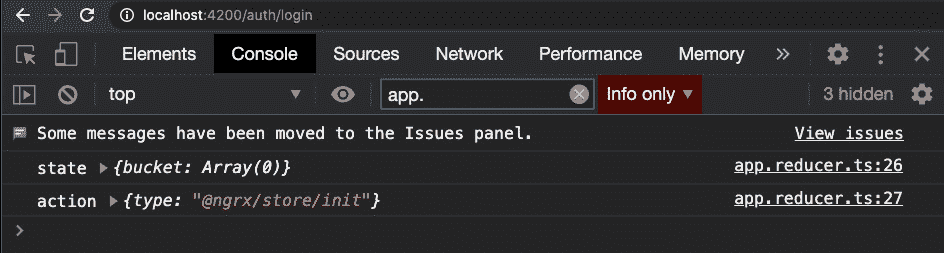

图 6.2 - 显示应用启动时的初始状态和@ngrx/store/init 动作的日志

1.  现在我们可以看到 reducer 起作用了，让我们在添加和移除购物篮中的物品时分派我们的动作。为此，在`shared/components/bucket`/`bucket.component.ts`文件中按以下方式分派动作：

```ts
...
import { Store } from '@ngrx/store';
import { AppState } from 'src/app/store/app.reducer';
import { addItemToBucket, removeItemFromBucket } from 'src/app/store/app.actions';
export class BucketComponent implements OnInit {
  ...
  constructor(
    private bucketService: BucketService,
    private store: Store<AppState>
  ) { }
  ngOnInit(): void {...}
  addSelectedFruitToBucket() {
const newItem: IFruit = {
      id: Date.now(),
      name: this.selectedFruit
    }
    this.bucketService.addItem(newItem);
    this.store.dispatch(addItemToBucket(newItem));
  }
  deleteFromBucket(fruit: IFruit) {
    this.bucketService.removeItem(fruit);
    this.store.dispatch(removeItemFromBucket(fruit));
  }
}
```

1.  以管理员身份登录应用程序，向桶中添加一些项目，然后删除一些项目。您会在控制台上看到类似这样的内容：

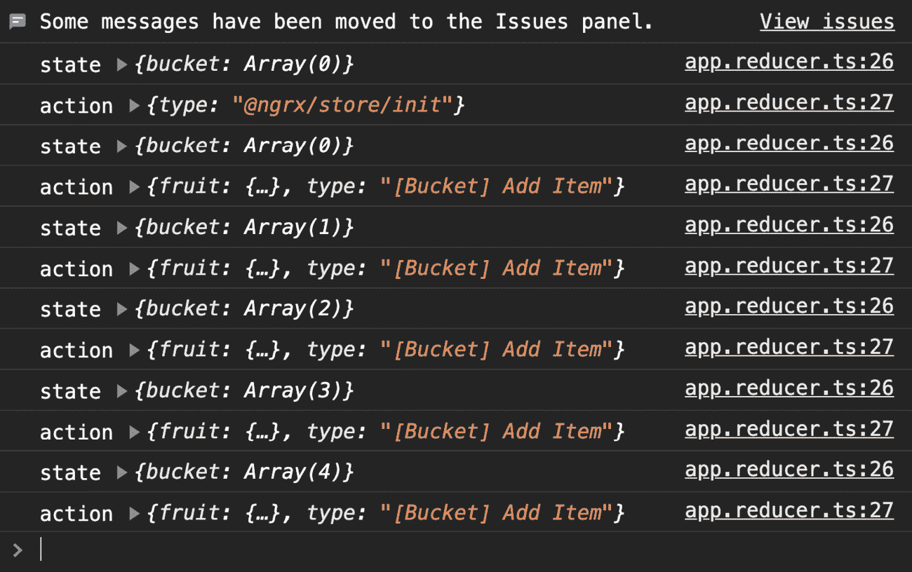

图 6.3 - 显示从桶中添加和删除项目的操作日志

至此，这个教程就结束了！您现在知道如何将 NgRx 存储集成到 Angular 应用程序中，以及如何创建 NgRx 操作并分发它们。您还知道如何创建一个 reducer，定义它的状态，并监听操作以对分发的操作进行操作。

## 另请参阅

+   NgRx reducer 文档（[`ngrx.io/guide/store/reducers`](https://ngrx.io/guide/store/reducers)）

+   NgRx 操作文档（[`ngrx.io/guide/store/actions`](https://ngrx.io/guide/store/actions)）

+   RxJS 合并操作符文档（[`www.learnrxjs.io/learn-rxjs/operators/combination/merge`](https://www.learnrxjs.io/learn-rxjs/operators/combination/merge)）

# 使用@ngrx/store-devtools 调试状态更改

在这个教程中，您将学习如何设置和使用`@ngrx/store-devtools`来调试应用程序的状态、操作分发以及操作分发时状态的差异。我们将使用一个我们熟悉的现有应用程序来了解这个过程。

## 准备工作

这个教程的项目位于`chapter06/start_here/using-ngrx-store-devtool`：

1.  在 VS Code 中打开项目。

1.  打开终端并运行`npm install`来安装项目的依赖项。

1.  完成后，运行`ng serve -o`。

这应该会在新的浏览器选项卡中打开应用程序。

1.  以管理员用户身份登录，并且您应该看到这样的屏幕：

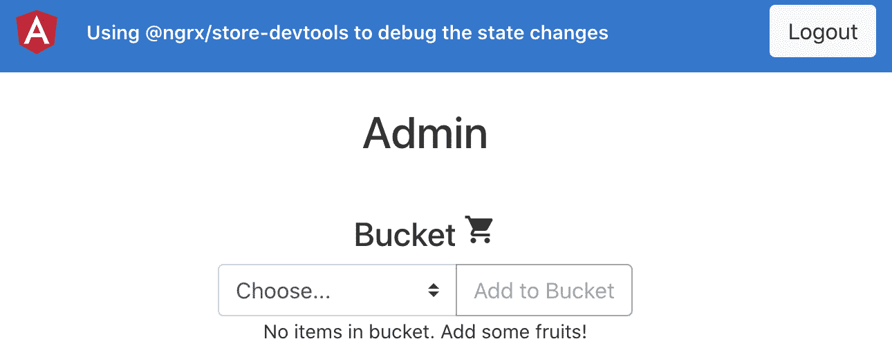

图 6.4 - 在 http://localhost:4200 上运行的使用 ngrx-store-devtools 应用程序

现在我们已经设置好了应用程序，让我们在下一节中看看这个教程的步骤。

## 如何做…

我们有一个 Angular 应用程序，已经集成了`@ngrx/store`包。我们还设置了一个 reducer，并且有一些操作，当您添加或删除项目时，这些操作会立即在控制台上记录。让我们开始配置应用程序的存储开发工具：

1.  首先在项目中安装`@ngrx/store-devtools`包，如下所示：

```ts
npm install @ngrx/store-devtools@12.0.0 --save
```

1.  现在，更新您的`app.module.ts`文件，包括`StoreDevtoolsModule.instrument`条目，如下所示：

```ts
...
import * as appStore from './store/app.reducer';
import { StoreDevtoolsModule } from '@ngrx/store-devtools';
@NgModule({
  declarations: [
    AppComponent
  ],
  imports: [
    ...
    StoreModule.forRoot({app: appStore.reducer}),
    StoreDevtoolsModule.instrument({
      maxAge: 25, // Retains last 25 states
    }),
  ],
  providers: [],
  bootstrap: [AppComponent]
})
export class AppModule { }
```

1.  现在，从[`github.com/zalmoxisus/redux-devtools-extension/`](https://github.com/zalmoxisus/redux-devtools-extension/)下载 Redux DevTools 扩展，安装到您特定的浏览器上。在本书中，我将一直使用 Chrome 浏览器。

1.  打开 Chrome DevTools。应该会有一个名为**Redux**的新标签。点击它并刷新页面。您会看到类似于这样的内容：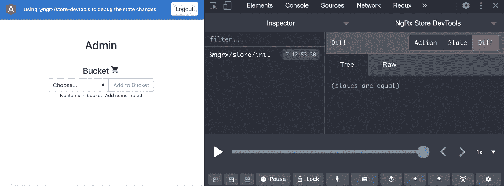

图 6.5 - Redux DevTools 显示初始的 Redux 动作已经分发

1.  要查看当前应用程序状态，请点击**State**按钮，如下截图所示，您应该会看到我们当前的状态是`app > bucket: []`：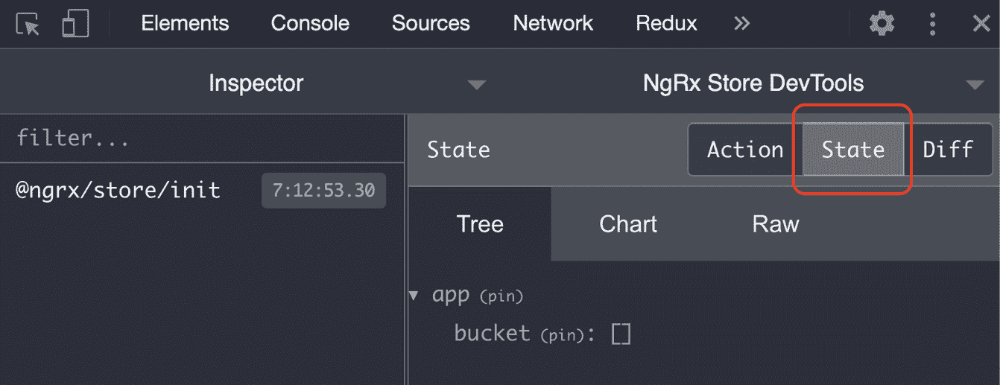

图 6.6 - 在 Redux DevTools 扩展中查看当前状态

1.  现在，向桶里加入一个樱桃🍒和一个香蕉🍌，然后从桶里移除香蕉🍌。您应该看到所有相关的动作被分发，如下所示：

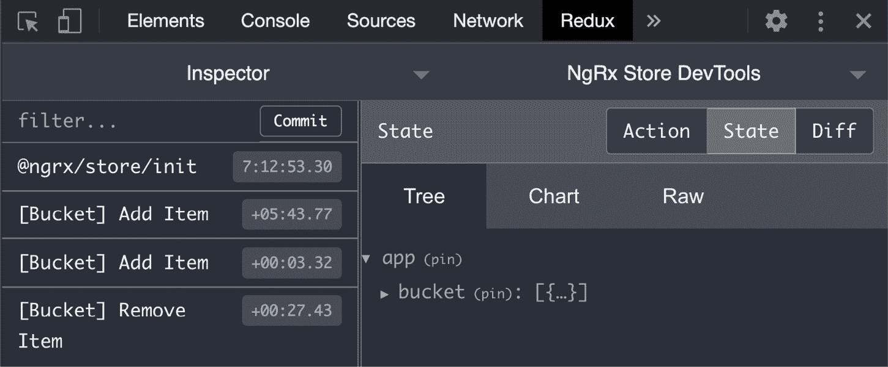

图 6.7 - Redux DevTools 显示 addItemToBucket 和 removeItemFromBucket 动作

如果您展开状态中的桶数组，您会看到它反映了桶的当前状态，就像我们在以下截图中看到的那样：

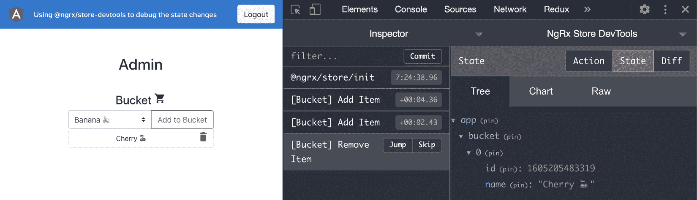

图 6.8 - Redux DevTools 显示桶的当前状态

太棒了！您刚刚学会了如何使用 Redux DevTools 扩展来查看您的 NgRx 状态和已分发的动作。

## 它是如何工作的...

重要的是要理解 NgRx 是 Angular 和 Redux（使用 RxJS）的组合。通过使用 Store Devtools 包和 Redux DevTools 扩展，我们能够轻松调试应用程序，这有助于我们发现潜在的错误，预测状态变化，并且更透明地了解`@ngrx/store`包后台发生的情况。

## 还有更多...

您还可以看到动作在应用程序状态中引起的差异。也就是说，当我们使用水果分发`addItemToBucket`动作时，桶中会增加一个项目，当我们分发`removeItemFromBucket`动作时，桶中会移除一个项目。请参见以下截图和*图 6.10*：

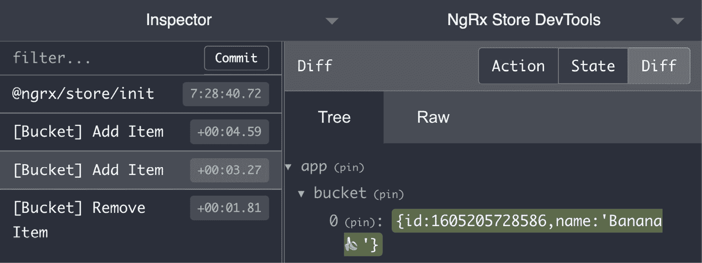

图 6.9 - addItemToBucket 操作导致向桶中添加项目

请注意*图 6.9*中数据`{id:1605205728586,name:'Banana` `🍌``'}`周围的绿色背景。这代表对状态的添加。您可以在这里看到`removeItemFromBucket`操作：

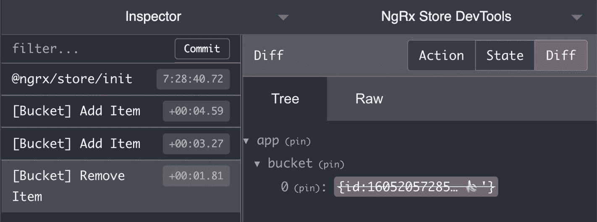

图 6.10 - removeItemFromBucket 操作导致从桶中移除项目

同样，注意*图 6.10*中数据`{id:16052057285…` `🍌``'}`周围的红色背景和删除线。这代表从状态中移除。

## 另请参阅

+   NgRx Store Devtools 文档 ([`ngrx.io/guide/store-devtools`](https://ngrx.io/guide/store-devtools))

# 创建一个用于获取第三方 API 数据的效果

在这个食谱中，您将学习如何使用`@ngrx/effects`包来使用 NgRx 效果。您将创建并注册一个效果，该效果将监听一个事件。然后，我们将对该操作做出反应，以获取第三方 API 数据，并作出成功或失败的响应。这将会很有趣。

## 准备工作

这个食谱的项目位于`chapter06/start_here/using-ngrx-effect`中：

1.  在 VS Code 中打开项目。

1.  打开终端并运行`npm install`以安装项目的依赖项。

1.  完成后，运行`ng serve -o`。

这应该会在新的浏览器标签中打开应用程序，并且您应该会看到应用程序，如下所示：

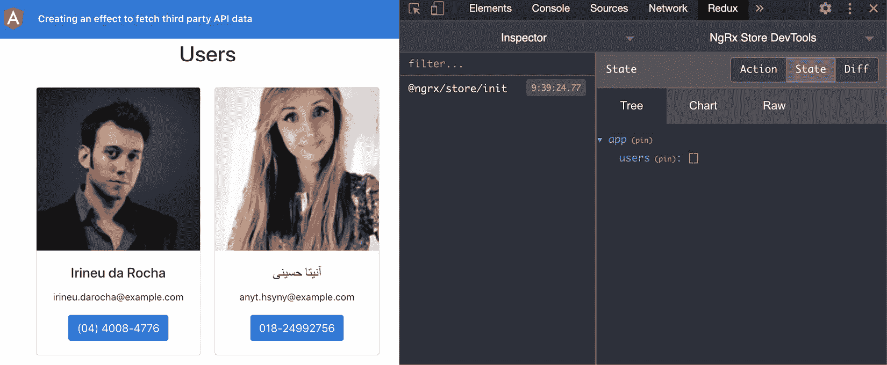

图 6.11 - 使用 ngrx-effects 应用程序在 http://localhost:4200 上运行

现在我们的应用程序在本地运行，让我们在下一节中看看食谱的步骤。

## 如何做…

我们有一个名为**Home**页面的单一路由的应用程序。在`HomeComponent`类中，我们使用`UserService`发送**超文本传输协议**（**HTTP**）调用以获取用户，然后在浏览器上显示出来。正如您在*图 6.1*中所看到的，我们已经集成了`@ngrx/store`和`@ngrx/store-devtools`包。

1.  在项目中安装`@ngrx/effects`包，如下所示：

```ts
npm install --save @ngrx/effects@12.0.0
```

1.  现在我们将创建用于从 HTTP 调用获取用户的动作。我们将有一个动作用于获取用户，一个用于成功获取用户时分派，以及一个用于在出现错误时分派的动作。将以下代码添加到`store/app.actions.ts`文件中：

```ts
import { createAction, props } from '@ngrx/store';
import { IUser } from '../core/interfaces/user.interface';
export const APP_ACTIONS = {
  GET_USERS: '[Users] Get Users',
  GET_USERS_SUCCESS: '[Users] Get Users Success',
  GET_USERS_FAILURE: '[Users] Get Users Failure',
}
export const getUsers = createAction(
  APP_ACTIONS.GET_USERS,
);
export const getUsersSuccess = createAction(
  APP_ACTIONS.GET_USERS_SUCCESS,
  props<{users: IUser[]}>()
);
export const getUsersFailure = createAction(
  APP_ACTIONS.GET_USERS_FAILURE,
  props<{error: string}>()
);
```

现在让我们创建一个效果，以便我们可以监听`GET_USERS`动作，执行 API 调用，并在成功获取数据时分派成功动作。

1.  在`store`文件夹中创建一个名为`app.effects.ts`的文件，并将以下代码添加到其中：

```ts
import { Injectable } from '@angular/core';
import { Actions, createEffect, ofType } from '@ngrx/effects';
import { of } from 'rxjs';
import { map, mergeMap, catchError } from 'rxjs/operators';
import { UserService } from '../core/services/user.service';
import { APP_ACTIONS, getUsersFailure, getUsersSuccess } from './app.actions';
@Injectable()
export class AppEffects {
  constructor(
    private actions$: Actions,
    private userService: UserService
  ) {}
}
```

1.  现在我们将在`app.effects.ts`文件中创建一个新的效果，以注册`GET_USERS`动作的监听器，如下所示：

```ts
...
@Injectable()
export class AppEffects {
  getUsers$ = createEffect(() =>
    this.actions$.pipe(
      ofType(APP_ACTIONS.GET_USERS),
      mergeMap(() => this.userService.getUsers()
        .pipe(
          map(users => {
            return getUsersSuccess({
              users
            })
          }),
          catchError((error) => of(getUsersFailure({
            error
          })))
        )
      )
    )
  );
  ...
}
```

1.  现在我们将在`app.module.ts`文件中将我们的效果注册为应用程序的根效果，如下所示：

```ts
...
import { EffectsModule } from '@ngrx/effects';
import { AppEffects } from './store/app.effects';
@NgModule({
  declarations: [...],
  imports: [
    ...
    StoreDevtoolsModule.instrument({
      maxAge: 25, // Retains last 25 states
    }),
    EffectsModule.forRoot([AppEffects])
  ],
  providers: [],
  bootstrap: [AppComponent]
})
export class AppModule { }
```

一旦我们注册了效果，您应该在 Redux DevTools 扩展中看到一个名为`@ngrx/effects/init`的额外动作触发，如下所示：

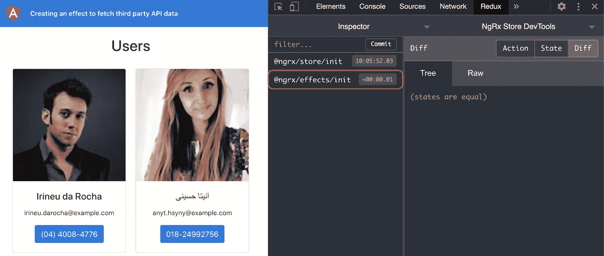

图 6.12 - @ngrx/effects/init 动作在应用启动时触发

1.  现在我们已经让效果监听动作，让我们从`HomeComponent`类中分派`GET_USERS`动作，我们应该看到成功调用后返回`GET_USERS_SUCCESS`动作。添加以下代码以从`home/home.component.ts`中分派动作：

```ts
...
import { AppState } from '../store/app.reducer';
import { Store } from '@ngrx/store';
import { getUsers } from '../store/app.actions';
@Component({...})
export class HomeComponent implements OnInit, OnDestroy {
  users$: Observable<IUser[]>;
  constructor(
    private userService: UserService,
    private store: Store<AppState>
  ) {}
  ngOnInit() {
    this.store.dispatch(getUsers())
    this.users$ = this.userService.getUsers();
  }
  ngOnDestroy() {}
}
```

如果现在刷新应用程序，您应该看到`[Users] Get Users`动作被分派，并且作为成功 HTTP 调用的返回，`[Users] Get Users Success`动作也被分派：

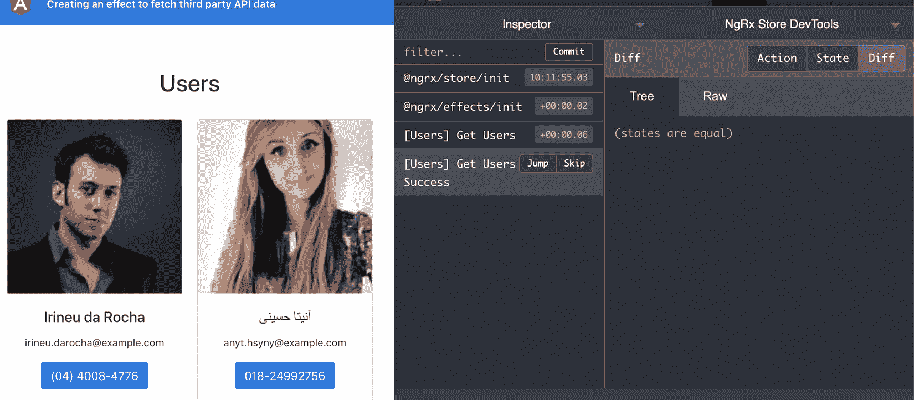

图 6.13 - 分派 GET_USERS 和 GET_USERS_SUCCESS 动作

请注意*图 6.13*中，在分派`GET_USERS_SUCCESS`动作后，`Diff`为空。这是因为到目前为止我们还没有使用 reducer 更新状态。

1.  让我们在`app.reducer.ts`文件中更新状态，以监听`GET_USERS_SUCCESS`动作并相应地将用户分配到状态中。代码应该如下所示：

```ts
import { Action, createReducer, on } from '@ngrx/store';
import { IUser } from '../core/interfaces/user.interface';
import { getUsersSuccess } from './app.actions';
export interface AppState {
  users: IUser[];
}
const initialState: AppState = {
  users: []
}
const appReducer = createReducer(
  initialState,
  on(getUsersSuccess, (state, action) => ({
    ...state,
    users: action.users
  }))
);
export function reducer(state: AppState = initialState, action: Action) {
  return appReducer(state, action);
}
```

如果现在刷新应用程序，您应该看到用户被分配到状态中，如下所示：

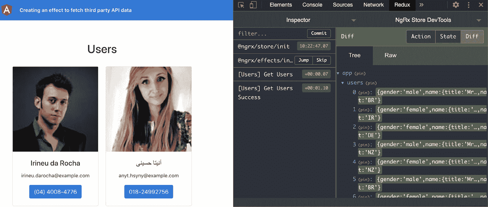

图 6.14 - GET_USERS_SUCCESS 动作将用户添加到状态

如果您现在查看应用程序的状态，您应该看到类似于这样的内容：

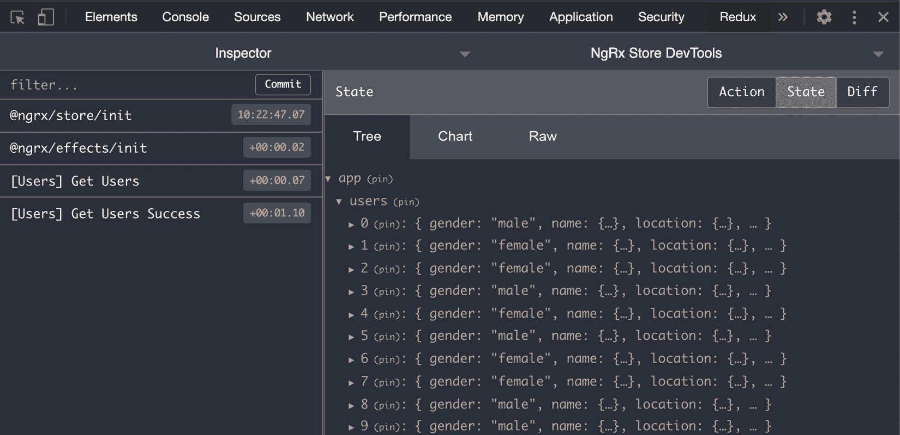

图 6.15 - 在 GET_USERS_SUCCESS 操作后包含用户的应用程序状态

现在，我们向服务器发送了两个调用 - 一个通过 effect，另一个通过`HomeComponent`类的`ngOnInit`方法，直接使用`UserService`实例。让我们从`HomeComponent`类中删除`UserService`。现在我们看不到任何数据，但这是我们将在下一个示例中要做的事情。

1.  从`HomeComponent`类中删除`UserService`，你的`home.component.ts`文件现在应该是这样的：

```ts
...
@Component({...})
export class HomeComponent implements OnInit, OnDestroy {
  users$: Observable<IUser[]>;
  constructor(
  private userService: UserService, ← Remove this
    private store: Store<AppState>
  ) {}
  ngOnInit() {
    this.store.dispatch(getUsers());
    this.users$ = this.userService.getUsers();  ← Remove     this
  }
  ngOnDestroy() {}
}
```

太棒了！现在你知道如何在你的 Angular 应用程序中使用 NgRx 效果。请查看下一节，了解 NgRx 效果的工作原理。

重要说明

现在我们有一个输出，如*图 6.15*所示 - 也就是说，即使用户数据已经设置在存储中，我们仍然保持显示加载程序。这个示例的主要目的是使用`@ngrx/effects`，这已经完成了。我们将在下一个示例中显示适当的数据，*使用选择器从多个组件中的存储中获取数据*。

## 它是如何工作的...

为了使 NgRx 效果起作用，我们需要安装`@ngrx/effects`包，创建一个效果，并在`AppModule`类中将其注册为一组效果（根效果）。当你创建一个效果时，它必须监听一个动作。当从任何组件甚至另一个效果向存储分派一个动作时，注册的效果会触发，执行你希望它执行的工作，并应该返回另一个动作。对于 API 调用，通常有三个动作 - 即主要动作，以及以下成功和失败动作。理想情况下，在成功动作（也许在失败动作上），你会想要更新一些状态变量。

## 另请参阅

+   NgRx 效果文档([`ngrx.io/guide/effects`](https://ngrx.io/guide/effects))

# 在多个组件中使用选择器从存储中获取数据

在上一个示例中，我们创建了一个 NgRx 效果来获取第三方 API 数据作为用户，并将其保存在 Redux 存储中。这是我们在这个示例中的起点。我们有一个效果，从`api.randomuser.me`获取用户并将其存储在状态中，目前在**用户界面**（**UI**）上没有显示任何内容。在这个示例中，你将创建一些 NgRx 选择器，以在**主页**和**用户详细信息**页面上显示相似的用户。

## 做好准备

此示例的项目位于`chapter06/start_here/using-ngrx-selector`中：

1.  在 VS Code 中打开项目。

1.  打开终端并运行`npm install`来安装项目的依赖项。

1.  完成后，运行`ng serve -o`。

这应该会在新的浏览器标签中打开应用程序。一旦页面打开，你应该能够看到应用程序，如下所示：

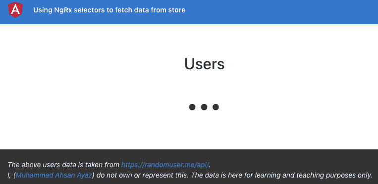

图 6.16 - 在 http://localhost:4200 上运行的 ngrx-selectors 应用程序

现在我们的应用程序在本地运行，让我们在下一节中看看食谱的步骤。

## 如何做…

在这个食谱中，我们所要做的就是使用 NgRx 选择器、我们已经有的 reducer 和 Redux 状态。非常简单。让我们开始吧！

我们将首先在**主页**上显示用户，并为此创建我们的第一个 NgRx 选择器：

1.  在`store`文件夹中创建一个新文件。命名为`app.selectors.ts`并添加以下代码：

```ts
import { createSelector, createFeatureSelector } from '@ngrx/store';
import { AppState } from './app.reducer';
export const selectApp = createFeatureSelector<AppState>('app');
export const selectUsers = createSelector(
  selectApp,
  (state: AppState) => state.users
);
```

现在我们已经有了选择器，让我们在`HomeComponent`类中使用它。

1.  修改`home.component.ts`文件中的`ngOnInit`方法。它应该是这样的：

```ts
...
import { getUsers } from '../store/app.actions';
import { selectUsers } from '../store/app.selectors';
@Component({...})
export class HomeComponent implements OnInit, OnDestroy {
  ...
  ngOnInit() {
    this.users$ = this.store.select(selectUsers);
    this.store.dispatch(getUsers())
  }
  ngOnDestroy() {}
}
```

现在刷新应用程序，你应该能够看到用户。如果你点击任何一个用户，你将导航到用户详情，但看不到任何有价值的数据。页面应该是这样的：

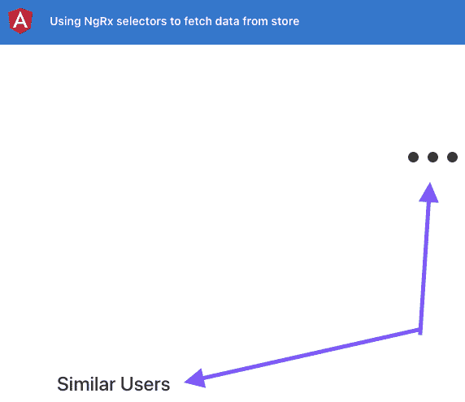

图 6.17 - 无法显示当前用户和相似用户

1.  为了查看当前用户和相似用户，我们首先在`UserDetailComponent`类中创建两个 Observables，以便稍后订阅它们各自的 store 选择器。在`user-detail.component.ts`文件中添加 Observables，如下所示：

```ts
...
import { ActivatedRoute } from '@angular/router';
import { Observable } from 'rxjs/internal/Observable';
@Component({...})
export class UserDetailComponent implements OnInit, OnDestroy {
  user: IUser = null; ← Remove this
  similarUsers: IUser[] = []; ← Remove this
  user$: Observable<IUser> = null; ← Add this
  similarUsers$: Observable<IUser[]> = null; ← Add this
  isComponentAlive: boolean;
  constructor( ) {}
  ngOnInit() {
    this.isComponentAlive = true;
  }
  ngOnDestroy() {
    this.isComponentAlive = false;
  }
}
```

1.  更新`user-detail.component.html`模板以使用新的 Observable 属性，如下所示：

```ts
<div class="user-detail">
  <div class="main-content user-card">
    <app-user-card *ngIf="user$ | async as user;     else loader" [user]="user"></app-user-card>
  </div>
  <div class="secondary-container">
    <h4>Similar Users</h4>
    <div class="similar-users">
      <ng-container *ngIf="similarUsers$ | async       as similarUsers; else loader">
        <app-user-card class="user-card" *ngFor="let user         of similarUsers" [user]="user"></app-user-card>
      </ng-container>
    </div>
  </div>
</div>
...
```

1.  更新`app.selectors.ts`文件以添加两个选择器，如下所示：

```ts
...
import { IUser } from '../core/interfaces/user.interface';
export const selectUsers = createSelector(...);
export const selectCurrentUser = (uuid) => createSelector(
  selectUsers,
  (users: IUser[]) => users ? users.find(user => {
    return user.login.uuid === uuid;
  }) : null
);
export const selectSimilarUsers = (uuid) => createSelector(
  selectUsers,
  (users: IUser[]) => users ? users.filter(user => {
    return user.login.uuid !== uuid;
  }): null
);
```

由于我们使用用户的**通用唯一标识符**（**UUID**）导航到**用户详情**页面，我们将监听活动路由的`paramsMap`并分配适当的选择器。

1.  首先，在`user-detail.component.ts`文件中添加正确的导入，如下所示：

```ts
...
import { takeWhile } from 'rxjs/operators';
import { Store } from '@ngrx/store';
import { AppState } from '../store/app.reducer';
import { selectCurrentUser, selectSimilarUsers } from '../store/app.selectors';
import { ActivatedRoute } from '@angular/router';
```

1.  现在，在相同的`user-detail.component.ts`文件中，使用`Store`服务并更新`ngOnInit`方法，如下所示：

```ts
@Component({...})
export class UserDetailComponent implements OnInit, OnDestroy {
  ...
  constructor(
    private route: ActivatedRoute,
    private store: Store<AppState>
  ) {}
  ngOnInit() {
    this.isComponentAlive = true;
    this.route.paramMap.pipe(
      takeWhile(() => !!this.isComponentAlive)
    )
    .subscribe(params => {
      const uuid = params.get('uuid');
      this.user$ = this.store.      select(selectCurrentUser(uuid))
      this.similarUsers$ = this.store.      select(selectSimilarUsers(uuid))
    });
  }
  ...
}
```

我们将在`UserDetailComponent`类中添加另一个方法，如果应用程序中还没有获取用户，它将获取用户。

1.  按照以下方式向 `user-detail.component.ts` 文件添加 `getUsersIfNecessary` 方法：

```ts
...
import { first, takeWhile } from 'rxjs/operators';
import { Store } from '@ngrx/store';
import { AppState } from '../store/app.reducer';
import { selectCurrentUser, selectSimilarUsers, selectUsers } from '../store/app.selectors';
import { getUsers } from '../store/app.actions';
@Component({...})
export class UserDetailComponent implements OnInit, OnDestroy {
  ...
  ngOnInit() {
    …
    this.getUsersIfNecessary();
  }
  getUsersIfNecessary() {
    this.store.select(selectUsers)
    .pipe(
      first ()
    )
    .subscribe((users) => {
      if (users === null) {
        this.store.dispatch(getUsers())
      }
    })
  }
}
```

刷新应用程序… 突然！您现在可以看到当前用户和相似用户。请查看下一节以了解它是如何工作的。

## 工作原理…

在这个教程中，我们已经有了一个 reducer 和一个从第三方 API 获取用户数据的 effect。我们首先创建了一个用于主屏幕用户的选择器。这很容易——我们只需要创建一个简单的选择器。请注意，reducer 的状态如下所示：

```ts
  app: {
    users: []
  }
```

这就是为什么我们首先使用 `createFeatureSelector` 来获取 `app` 状态，然后使用 `createSelector` 来获取 `users` 状态。

困难的部分是获取当前用户和相似用户。为此，我们创建了可以以 `uuid` 作为输入的选择器。然后，我们在 `UserDetailComponent` 类中监听 `paramMap` 的 `uuid`，一旦它发生变化，我们就会获取它。然后，我们通过将 `uuid` 传递给选择器来使用它们，以便选择器可以过滤当前用户和相似用户。

最后，我们遇到了一个问题，即如果有人直接着陆到**用户详情**页面并带有 `uuid`，他们将看不到任何东西，因为我们没有获取用户。这是因为我们只在主页上获取用户，所以任何直接着陆到用户详情页面的人都不会触发 effect。这就是为什么我们创建了一个名为 `getUsersIfNecessary` 的方法，以便它可以检查状态并在没有获取用户时获取用户。

## 另请参阅

+   NgRx 选择器文档 ([`ngrx.io/guide/store/selectors`](https://ngrx.io/guide/store/selectors))

# 使用 @ngrx/component-store 在组件内进行本地状态管理

在这个教程中，您将学习如何使用 NgRx Component Store，以及如何使用它来代替基于推送的 Subject/BehaviorSubject 模式与服务一起维护组件的本地状态。

请记住，`@ngrx/component-store` 是一个独立的库，与 `Redux` 或 `@ngrx/store` 等没有关联。

## 准备工作

我们要处理的项目位于克隆存储库中的 `chapter06/start_here/ngrx-component-store` 目录中：

1.  在 VS Code 中打开项目。

1.  打开终端并运行 `npm install` 来安装项目的依赖项。

1.  完成后，运行 `ng serve -o`。

这应该在新的浏览器标签页中打开应用程序。以管理员身份登录，您应该能看到它，如下所示：

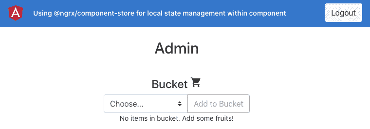

图 6.18 - ngrx-component-store 应用程序运行在 http://localhost:4200

现在我们的应用程序在本地运行，让我们在下一节中看一下这个配方的步骤。

## 如何做…

到目前为止，我们已经在许多配方中使用了我们喜爱的桶应用程序。目前桶的状态存储在`BucketService`中，它使用了`BehaviorSubject`模式。我们将用 NgRx Component Store 替换它。让我们开始吧：

1.  通过在项目根目录中运行以下命令，将`@ngrx/component-store`包添加到项目的依赖项中：

```ts
npm install @ngrx/component-store@12.0.0 --save
```

1.  我们首先要使我们的`BucketService`与`ComponentStore`兼容。为了做到这一点，我们将为桶状态创建一个接口，将`BucketService`从`ComponentStore`扩展，并通过调用`super`方法来初始化服务。更新`file services/bucket.service.ts`文件，如下所示：

```ts
...
import { IBucketService } from '../interfaces/bucket-service';
import { ComponentStore } from '@ngrx/component-store';
export interface BucketState {
  bucket: IFruit[]
}
@Injectable({
  providedIn: 'root'
})
export class BucketService extends ComponentStore<BucketState>  implements IBucketService {
  bucketSource = new BehaviorSubject([]);
  bucket$: Observable<IFruit[]> =   this.bucketSource.asObservable();
  constructor() {
    super({
      bucket: []
    })
  }
  ...
}
```

在我们实际显示`ComponentStore`中的数据之前，这一切都没有意义。现在让我们来做这件事。

1.  修改`bucket$` Observable，使用`ComponentStore`状态，而不是依赖于`BehaviorSubject`模式，如下所示：

```ts
...
export class BucketService extends ComponentStore<BucketState>  implements IBucketService {
  bucketSource = new BehaviorSubject([]);
  readonly bucket$: Observable<IFruit[]> =   this.select(state => state.bucket);
  constructor() {
    super({
      bucket: []
    })
  }
  ...
}
```

你应该能够看到没有桶项目显示了，或者即使你添加了一个项目，它也不会显示。这是因为它仍然需要一些工作。

1.  首先，让我们确保不是用空数组从组件存储中初始化`bucket`，而是用`localStorage`中的值来初始化它。即使它们还没有显示出来，也试着添加一些项目。然后，修改`loadItems()`方法，使用`BucketService`上的`setState`方法。代码应该如下所示：

```ts
  loadItems() {
    const bucket = JSON.parse(window.localStorage.    getItem('bucket') || '[]');
    this.bucketSource.next(bucket); ← Remove this
    this.setState({ ← Add this
      bucket
    })
  }
```

请注意，我们已经从代码中删除了`this.bucketSource.next(bucket);`行。这是因为我们不再使用`bucketSource`属性，它是一种`BehaviorSubject`模式。我们将对下一组函数执行相同的操作。

此外，你现在应该能够看到之前添加的项目，但没有显示出来。

1.  现在让我们替换`BucketService`中的`addItem`方法，以便它可以正确更新状态并显示新的项目在视图中，如我们所期望的那样。为此，我们将使用`ComponentStore`的`updater`方法，并修改我们的`addItem`方法为一个更新器，如下所示：

```ts
  readonly addItem = this.updater((state, fruit: IFruit)   => {
    const bucket = [fruit, ...state.bucket]
    window.localStorage.setItem('bucket',     JSON.stringify(bucket));
    return ({
      bucket
    })
  });
```

如果你现在添加一个项目，你应该能够在视图中看到它。

1.  我们现在也可以将`BucketService`中的`removeItem`方法替换为`updater`方法。代码应该如下所示：

```ts
  readonly removeItem = this.updater((state, fruit:   IFruit) => {
    const bucket = state.bucket.filter(item =>     item.id !== fruit.id);
    window.localStorage.setItem('bucket',     JSON.stringify(bucket));
    return ({
      bucket
    })
  });
```

通过这个改变，您应该看到应用程序正在工作。但是我们确实有一个需要解决的问题，那就是`EmployeeService`也需要更新，使`removeItem`方法成为`updater`方法。

1.  让我们将`EmployeeBucketService`中的`removeItem`方法替换为`updater`方法。修改`employee/services/employee-bucket.service.ts`文件如下：

```ts
import { Injectable } from '@angular/core';
import { IFruit } from 'src/app/interfaces/fruit.interface';
import { BucketService } from 'src/app/services/bucket.service';
...
export class EmployeeBucketService extends BucketService {
  constructor() {
    super();
  }
  readonly removeItem = this.updater((state, _: IFruit)   => {
    alert('Employees can not delete items');
    return state;
  });
}
```

而且！现在一切应该都很好，您不应该看到任何错误。

1.  由于我们已经摆脱了`BucketService`属性`bucketSource`中`BehaviorSubject`模式的所有用法，我们可以从`BucketService`中删除该属性本身。最终代码应该如下所示：

```ts
import { Injectable } from '@angular/core';
import { BehaviorSubject ← Remove this, Observable } from 'rxjs';
...
export class BucketService extends ComponentStore<BucketState>  implements IBucketService {
  bucketSource = new BehaviorSubject([]); ← Remove
  readonly bucket$: Observable<IFruit[]> =   this.select((state) => state.bucket);
  constructor() {
    super({
      bucket: []
    })
  }
...
}
```

恭喜！您已完成该教程。请查看下一节以了解其工作原理。

## 它是如何工作的...

如前所述，`@ngrx/component-store`是一个独立的包，可以轻松安装在您的 Angular 应用程序中，而无需使用`@ngrx/store`、`@ngrx/effects`等。它应该替换 Angular 服务中`BehaviorSubject`的使用方式，这就是我们在本教程中所做的。我们介绍了如何初始化`ComponentStore`以及如何使用`setState`方法设置初始状态，当我们已经有值而无需访问状态时，我们学会了如何创建`updater`方法，它们可以用于更新状态，因为它们可以访问状态并允许我们甚至为我们自己的用例传递参数。

## 另请参阅

+   `@ngrx/component-store`文档（[`ngrx.io/guide/component-store`](https://ngrx.io/guide/component-store)）

+   `@ngrx/component-store`文档中的 Effects（[`ngrx.io/guide/component-store/effect`](https://ngrx.io/guide/component-store/effect)）

# 使用@ngrx/router-store 来以响应式方式处理路由更改

NgRx 很棒，因为它允许您将数据存储在一个集中的位置。然而，监听路由更改仍然是我们目前所涵盖的 NgRx 范围之外的事情。我们确实依赖于`ActivatedRoute`服务来监听路由更改，当我们想要测试这样的组件时，`ActivatedRoute`服务就成了一个依赖项。在本教程中，您将安装`@ngrx/router-store`包，并学习如何使用该包中内置的一些操作来监听路由更改。

## 准备工作

我们将要处理的项目位于`chapter06/start_here/ngrx-router-store`中，位于克隆存储库内：

1.  在 VS Code 中打开项目。

1.  打开终端并运行`npm install`来安装项目的依赖项。

1.  完成后，运行`ng serve -o`。

这应该会在新的浏览器标签页中打开应用程序，你应该会看到类似这样的东西：

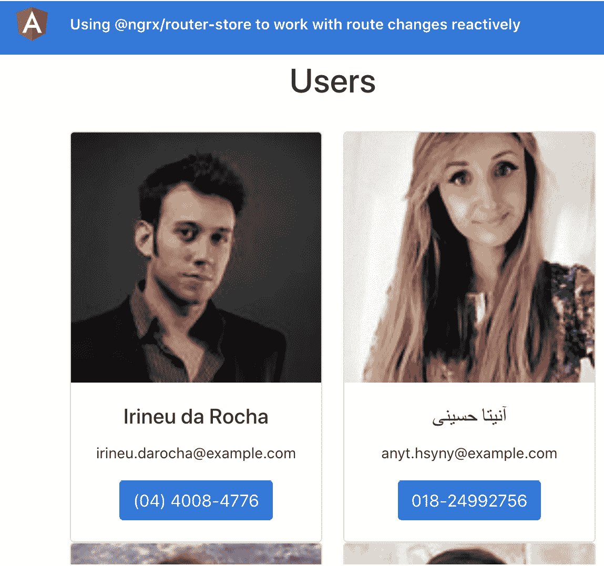

图 6.19 - ngrx-router-store 应用程序运行在 http://localhost:4200

现在应用程序正在运行，请查看下一节的步骤。

## 如何做…

为了利用 NgRx 甚至对路由更改的强大功能，我们将利用`@ngrx/router-store`包来监听路由更改。让我们开始吧！

1.  首先，在项目根目录中运行以下命令安装`@ngrx/router-store`包：

```ts
npm install @ngrx/router-store@12.0.0 --save
```

1.  现在，在你的`app.module.ts`文件中导入`StoreRouterConnectingModule`和`routerReducer`，并设置`imports`，如下所示：

```ts
...
import { StoreRouterConnectingModule, routerReducer } from '@ngrx/router-store';
@NgModule({
  declarations: [...],
  imports: [
    BrowserModule,
    AppRoutingModule,
    HttpClientModule,
    StoreModule.forRoot({
      app: appStore.reducer,
  router: routerReducer
    }),
 StoreRouterConnectingModule.forRoot(),
    StoreDevtoolsModule.instrument({
      maxAge: 25, // Retains last 25 states
    }),
    EffectsModule.forRoot([AppEffects])
  ],
  providers: [],
  bootstrap: [AppComponent]
})
export class AppModule { }
```

现在刷新应用程序并通过 Redux DevTools 扩展进行检查，你应该还会看到一些额外的名为`@ngrx/router-store/*`的操作被分发。你还应该看到状态中的`router`属性具有当前路由的信息，如下截图所示：

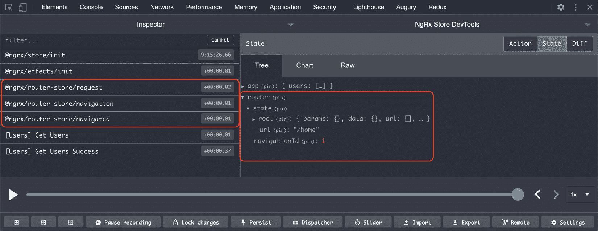

图 6.20 - @ngrx/router-store 操作和路由器状态在 NgRx 存储中的反映

1.  我们现在必须修改我们的 reducer，或者更准确地说，修改`AppState`接口，以反映我们还有来自`@ngrx/router-store`包的`router`属性。为此，请修改`store/app.reducer.ts`文件，如下所示：

```ts
...
import { getUsersSuccess } from './app.actions';
import { RouterReducerState } from '@ngrx/router-store'
export interface AppState {
  users: IUser[];
  router: RouterReducerState<any>;
}
const initialState: AppState = {
  users: null,
  router: null
}
...
```

1.  基本上，我们必须摆脱`UserDetailComponent`类中对`ActivatedRoute`服务的使用。为了做到这一点，我们首先修改我们的选择器，直接从路由器状态中获取参数。修改`app.selectors.ts`文件，如下所示：

```ts
...
import { getSelectors, RouterReducerState } from '@ngrx/router-store';
export const selectApp = createFeatureSelector<AppState>('app');
export const selectUsers = createSelector(
  selectApp,
  (state: AppState) => state.users
);
...
export const selectRouter = createFeatureSelector<
  AppState,
  RouterReducerState<any>
>('router');
const { selectRouteParam } = getSelectors(selectRouter);
export const selectUserUUID = selectRouteParam('uuid');
export const selectCurrentUser = createSelector(
  selectUserUUID,
  selectUsers,
  (uuid, users: IUser[]) => users ? users.find(user => {
    return user.login.uuid === uuid;
  }) : null
);
export const selectSimilarUsers = createSelector(
  selectUserUUID,
  selectUsers,
  (uuid, users: IUser[]) => users ? users.filter(user =>   {
    return user.login.uuid !== uuid;
  }): null
);
```

你现在应该在控制台上看到一些错误。那是因为我们改变了`selectSimilarUsers`和`selectCurrentUser`选择器的签名，但它将在下一步中被修复。

1.  修改`user-detail/user-detail.component.ts`文件以正确使用更新后的选择器，如下所示：

```ts
...
export class UserDetailComponent implements OnInit, OnDestroy {
  ...
  ngOnInit() {
    ...
    this.route.paramMap.pipe(
      takeWhile(() => !!this.isComponentAlive)
    )
    .subscribe(params => {
      const uuid = params.get('uuid');
      this.user$ = this.store.select(selectCurrentUser)
      this.similarUsers$ = this.store.      select(selectSimilarUsers)
    })
  }
  ...
}
```

这个更改应该已经解决了控制台上的错误，你应该能够看到应用程序完美地运行，即使我们不再从`UserDetailComponent`类中传递任何`uuid`。

1.  通过上一步的更改，我们现在可以安全地从`UserDetailComponent`类中删除`ActivatedRoute`服务的使用，代码现在应该是这样的：

```ts
...
import { Observable } from 'rxjs/internal/Observable';
import { first } from 'rxjs/operators';
import { Store } from '@ngrx/store';
...
export class UserDetailComponent implements OnInit, OnDestroy {
  ...
  constructor(
    private store: Store<AppState>
) {}
  ngOnInit() {
    this.isComponentAlive = true;
    this.getUsersIfNecessary();
    this.user$ = this.store.select(selectCurrentUser)
    this.similarUsers$ = this.store.    select(selectSimilarUsers)
  }
  ...
}
```

哇哦！你现在已经完成了这个食谱。查看下一节，了解这是如何运作的。

## 它是如何工作的...

`@ngrx/router-store`是一个了不起的包，它通过许多魔法使我们在 NgRx 中的开发变得更加容易。你看到了我们如何通过使用该包中的选择器，完全删除了`UserDetailComponent`类中的`ActivatedRoute`服务。基本上，这帮助我们在选择器中正确获取**路由参数**，并且我们可以在选择器中使用它来获取和过滤出适当的数据。在幕后，该包监听整个 Angular 应用程序中的路由更改，并从路由本身获取数据。然后将相应的信息存储在 NgRx Store 中，以便它保留在 Redux 状态中，并且可以通过该包提供的选择器轻松选择。在我看来，这太棒了！我这么说是因为该包正在做我们否则必须做的所有繁重工作。因此，我们的`UserDetailComponent`类现在只依赖于`Store`服务，这使得测试变得更加容易，因为依赖更少。

## 另请参阅

+   `@ngrx/router-store`文档（[`ngrx.io/guide/router-store/`](https://ngrx.io/guide/router-store/)）
