# 第七章：*第七章*：理解 Angular 导航和路由

关于 Angular 最令人惊奇的事情之一是，它是一个完整的生态系统（一个框架），而不是一个库。在这个生态系统中，Angular 路由器是最关键的学习和理解之一。在本章中，您将学习有关 Angular 中路由和导航的一些非常酷的技术。您将学习如何保护您的路由，监听路由更改，并配置路由更改的全局操作。

以下是本章将涵盖的配方：

+   使用 CLI 创建带有路由的 Angular 应用程序和模块

+   特性模块和延迟加载路由

+   使用路由守卫对路由进行授权访问

+   处理路由参数

+   在路由更改之间显示全局加载器

+   预加载路由策略

## 技术要求

对于本章的配方，请确保您的机器上已安装**Git**和**Node.js**。您还需要安装`@angular/cli`包，您可以在终端中使用`npm install -g @angular/cli`来完成。本章的代码可以在[`github.com/PacktPublishing/Angular-Cookbook/tree/master/chapter07`](https://github.com/PacktPublishing/Angular-Cookbook/tree/master/chapter07)找到。

# 使用 CLI 创建带有路由的 Angular 应用程序

如果你问我 7-8 年前我们是如何创建 Web 应用程序项目的，你会惊讶地发现当时有多么困难。幸运的是，软件开发行业的工具和标准已经发展，当涉及到 Angular 时，启动项目变得非常容易。你甚至可以直接配置不同的东西。在这个配方中，您将使用 Angular CLI 创建一个全新的 Angular 项目，并在创建项目时启用路由配置。

## 准备就绪

我们要处理的项目没有起始文件。所以，你可以直接从克隆的存储库中将`chapter07/start_here`文件夹打开到 Visual Studio Code 应用程序中。

## 如何做…

我们将首先使用 Angular CLI 创建应用程序。它将默认启用路由。同样，接下来，我们将创建一些带有组件的特性模块，但它们将具有急切加载的路由。所以，让我们开始吧：

1.  首先，打开终端，确保你在`chapter07/start_here`文件夹内。进入后，运行以下命令：

```ts
ng new basic-routing-app --routing --style scss
```

该命令应该为您创建一个新的 Angular 应用程序，并启用路由，并选择 SCSS 作为您的样式选择。

1.  运行以下命令在浏览器中打开应用程序：

```ts
cd basic-routing app
ng serve -o
```

1.  现在，通过运行以下命令创建一个顶级组件命名为`landing`：

```ts
ng g c landing
```

1.  从`app.component.html`中删除所有内容，只保留`router-outlet`，如下所示：

```ts
<router-outlet></router-outlet>
```

1.  现在，通过将其添加到`app-routing.module.ts`文件中，将`LandingComponent`设置为默认路由，如下所示：

```ts
import { NgModule } from '@angular/core';
import { Routes, RouterModule } from '@angular/router';
import { LandingComponent } from './landing/landing.component';
const routes: Routes = [{
  path: '',
  redirectTo: 'landing',
  pathMatch: 'full'
}, {
  path: 'landing',
  component: LandingComponent
}];
...
```

1.  刷新页面，你应该会看到 URL 自动更改为`http://localhost:4200/landing`，因为应用程序重定向到默认路由。

1.  用以下代码替换`landing.component.html`的内容：

```ts
<div class="landing">
  <div class="landing__header">
    <div class="landing__header__main">
      Creating an Angular app with routes using CLI
    </div>
    <div class="landing__header__links">
      <div class="landing__header__links__link">
        Home
      </div>
      <div class="landing__header__links__link">
        About
      </div>
    </div>
  </div>
  <div class="landing__body">
    Landing Works
  </div>
</div>
```

1.  现在，在`landing.component.scss`文件中为头部添加一些样式，如下所示：

```ts
.landing {
  display: flex;
  flex-direction: column;
  height: 100%;
  &__header {
    height: 60px;
    padding: 0 20px;
    background-color: #333;
    color: white;
    display: flex;
    align-items: center;
    justify-content: flex-end;
    &__main {
      flex: 1;
    }
  }
}
```

1.  如下所示，为头部链接添加样式：

```ts
.landing {
  ...
  &__header {
    ...
    &__links {
      padding: 0 20px;
      display: flex;
      &__link {
        margin-left: 16px;
        &:hover {
          color: #ececec;
          cursor: pointer;
        }
      }
    }
  }
}
```

1.  此外，在`&__header`选择器之后添加着陆页面主体的样式，如下所示：

```ts
.landing {
  ...
  &__header {
   ...
  }
  &__body {
    padding: 30px;
    flex: 1;
    display: flex;
    justify-content: center;
    background-color: #ececec;
  }
}
```

1.  最后，为了使一切看起来好看，将以下样式添加到`styles.scss`文件中：

```ts
html, body {
  width: 100%;
  height: 100%;
  margin: 0;
  padding: 0;
}
```

1.  现在，通过在项目根目录中运行以下命令，为`home`和`about`路由添加特性模块：

```ts
ng g m home
ng g c home
ng g m about
ng g c about
```

1.  接下来，在你的`app.module.ts`文件中导入`HomeModule`和`AboutModule`如下所示：

```ts
...
import { LandingComponent } from './landing/landing.component';
import { HomeModule } from './home/home.module';
import { AboutModule } from './about/about.module';
@NgModule({
  declarations: [...],
  imports: [
    BrowserModule,
    AppRoutingModule,
    HomeModule,
    AboutModule
  ],
  providers: [],
  bootstrap: [AppComponent]
})
export class AppModule { }
```

1.  现在，我们可以配置路由。修改`app-routing.module.ts`文件以添加适当的路由，如下所示：

```ts
import { NgModule } from '@angular/core';
import { Routes, RouterModule } from '@angular/router';
import { AboutComponent } from './about/about.component';
import { HomeComponent } from './home/home.component';
import { LandingComponent } from './landing/landing.component';
const routes: Routes = [{
  path: '',
  redirectTo: 'landing',
  pathMatch: 'full'
}, {
  path: 'landing',
  component: LandingComponent
}, {
  path: 'home',
  component: HomeComponent
}, {
  path: 'about',
  component: AboutComponent
}];
...
```

1.  我们可以很快为我们的`Home`和`About`组件添加样式。将以下 CSS 添加到`home.component.scss`文件和`about.component.scss`文件中：

```ts
:host {
  display: flex;
  width: 100%;
  height: 100%;
  justify-content: center;
  align-items: center;
  background-color: #ececec;
  font-size: 24px;
}
```

1.  现在，我们可以将我们的链接绑定到着陆页面的适当路由上。修改`landing.component.html`如下所示：

```ts
<div class="landing">
  <div class="landing__header">
    <div class="landing__header__links">
      <div class="landing__header__links__link"       routerLink="/home">
        Home
      </div>
      <div class="landing__header__links__link"       routerLink="/about">
        About
      </div>
    </div>
  </div>
  <div class="landing__body">
    Landing Works
  </div>
</div>
```

太棒了！在短短几分钟内，借助令人惊叹的 Angular CLI 和 Angular 路由器的帮助，我们能够创建一个着陆页面、两个特性模块和特性路由（尽管是急加载的），并且我们也对一些东西进行了样式化。现代网络的奇迹！

现在您已经知道了基本路由是如何实现的，接下来请查看下一节以了解它是如何工作的。

## 它是如何工作的...

当我们在创建应用程序时使用`--routing`参数，或者在创建模块时，Angular CLI 会自动创建一个名为`<your module>-routing.module.ts`的模块文件。该文件基本上包含一个路由模块。在这个示例中，我们只是创建了特性模块而没有路由，以使实现更简单和更快。在下一个示例中，您还将了解有关模块内路由的信息。无论如何，由于我们已经创建了急切加载的特性模块，这意味着所有特性模块的 JavaScript 都会在应用程序加载时加载。您可以检查 Chrome DevTools 中的**Network**选项卡，并查看`main.js`文件的内容，因为它包含了所有我们的组件和模块。请参阅以下屏幕截图，其中显示了`main.js`文件中`AboutComponent`和`HomeComponent`的代码：

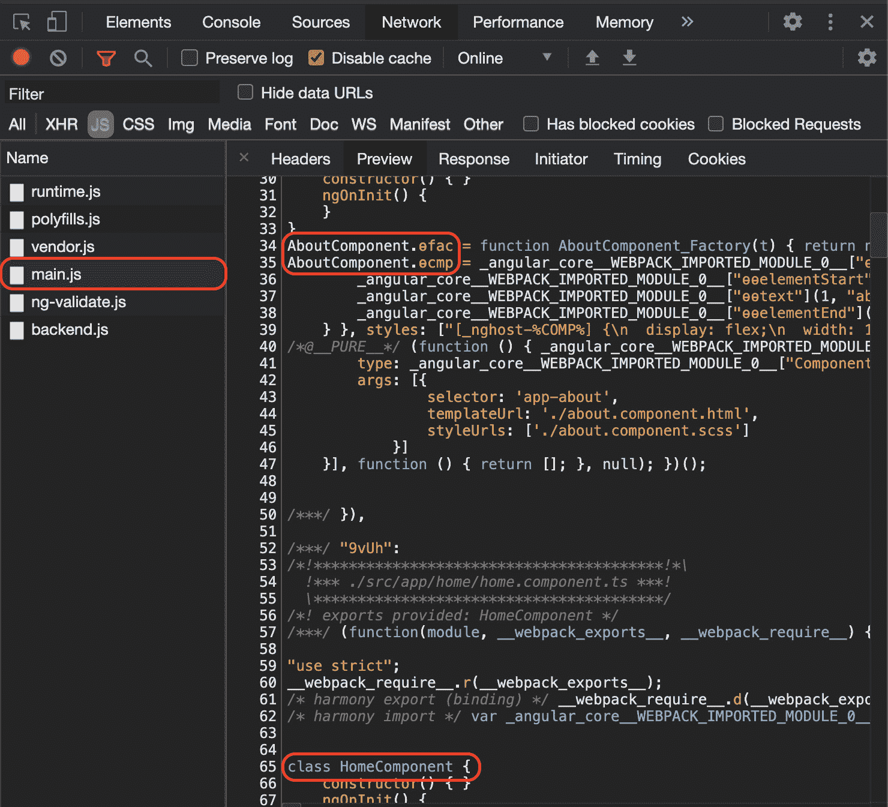

图 7.1 - 包含 AboutComponent 和 HomeComponent 代码的 main.js

由于我们已经确定了在应用程序启动时所有示例中的组件都是急切加载的，因此有必要了解这是因为我们在`AppModule`的`imports`数组中导入了`HomeModule`和`AboutModule`。

## 另请参阅

+   Angular 路由器文档（[`angular.io/guide/router`](https://angular.io/guide/router)）

# 特性模块和延迟加载路由

在上一个示例中，我们学习了如何创建一个具有急切加载路由的基本路由应用程序。在这个示例中，您将学习如何使用特性模块来延迟加载它们，而不是在应用程序加载时加载它们。对于这个示例，我们将假设我们已经有了路由，并且只需要延迟加载它们。

## 准备工作

此示例中的项目位于`chapter07/start_here/lazy-loading-modules`中：

1.  在 Visual Studio Code 中打开项目。

1.  打开终端并运行`npm install`来安装项目的依赖项。

1.  完成后，运行`ng serve -o`。

这将在新的浏览器选项卡中打开应用程序，您应该看到应用程序如下所示：

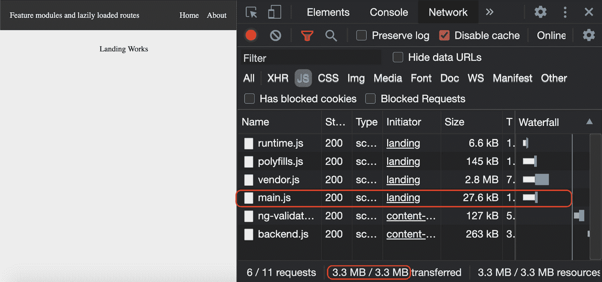

图 7.2 - lazy-loading-modules 应用程序运行在 http://localhost:4200

现在我们的应用程序在本地运行，让我们在下一节中看看这个示例的步骤。

## 如何做…

如*图 7.2*所示，我们在`main.js`文件中有所有的组件和模块。因此，`main.js`文件的大小约为 23.4 KB。我们将修改代码和路由结构以实现懒加载。结果，当我们实际导航到它们时，路由的特定文件将被加载：

1.  首先，我们必须使我们的目标模块能够被懒加载。为此，我们将不得不为`AboutModule`和`HomeModule`分别创建一个`<module>-routing.module.ts`文件。因此，让我们在`about`和`home`文件夹中都创建一个新文件：

a) 将第一个文件命名为`about-routing.module.ts`，并向其中添加以下代码：

```ts
// about-routing.module.ts
import { NgModule } from '@angular/core';
import { Routes, RouterModule } from '@angular/router';
import { AboutComponent } from './about.component';
const routes: Routes = [{
  path: '',
  component: AboutComponent
}];
@NgModule({
  imports: [RouterModule.forChild(routes)],
  exports: [RouterModule]
})
export class AboutRoutingModule { }
```

b) 将第二个文件命名为`home-routing.module.ts`，并向其中添加以下代码：

```ts
// home-routing.module.ts
import { NgModule } from '@angular/core';
import { Routes, RouterModule } from '@angular/router';
import { HomeComponent } from './home.component';
const routes: Routes = [{
  path: '',
  component: HomeComponent
}];
@NgModule({
  imports: [RouterModule.forChild(routes)],
  exports: [RouterModule]
})
export class HomeRoutingModule { }
```

1.  现在，我们将这些路由模块添加到相应的模块中，也就是说，我们将在`HomeModule`中导入`HomeRoutingModule`，如下所示：

```ts
// home.module.ts
import { NgModule } from '@angular/core';
import { CommonModule } from '@angular/common';
import { HomeComponent } from './home.component';
import { HomeRoutingModule } from './home-routing.module';
@NgModule({
  declarations: [HomeComponent],
  imports: [
    CommonModule,
    HomeRoutingModule
  ]
})
export class HomeModule { }
```

在`AboutModule`中添加`AboutRoutingModule`，如下所示：

```ts
// about.module.ts
import { NgModule } from '@angular/core';
import { CommonModule } from '@angular/common';
import { AboutComponent } from './about.component';
import { AboutRoutingModule } from './about-routing.module';
@NgModule({
  declarations: [AboutComponent],
  imports: [
    CommonModule,
    AboutRoutingModule
  ]
})
export class AboutModule { }
```

1.  我们的模块现在能够被懒加载。我们现在只需要懒加载它们。为了这样做，我们需要修改`app-routing.module.ts`并更改我们的配置，以便在`about`和`home`路由中使用 ES6 导入，如下所示：

```ts
import { NgModule } from '@angular/core';
import { Routes, RouterModule } from '@angular/router';
import { LandingComponent } from './landing/landing.component';
const routes: Routes = [{
  path: '',
  redirectTo: 'landing',
  pathMatch: 'full'
}, {
  path: 'landing',
  component: LandingComponent
}, {
  path: 'home',
  loadChildren: () => import('./home/home.module').then   (m => m.HomeModule)
}, {
  path: 'about',
  loadChildren: () => import('./about/about.module').  then(m => m.AboutModule)
}];
@NgModule({
  imports: [RouterModule.forRoot(routes)],
  exports: [RouterModule]
})
export class AppRoutingModule { }
```

1.  最后，我们将从`AppModule`的`imports`数组中移除`AboutModule`和`HomeModule`的导入，以便我们可以直接获得所需的代码拆分。`app.module.ts`的内容应如下所示：

```ts
import { BrowserModule } from '@angular/platform-browser';
import { NgModule } from '@angular/core';
import { AppRoutingModule } from './app-routing.module';
import { AppComponent } from './app.component';
import { LandingComponent } from './landing/landing.component';
import { HomeModule } from './home/home.module'; ← Remove
import { AboutModule } from './about/about.module'; ← Remove
@NgModule({
  declarations: [
    AppComponent,
    LandingComponent
  ],
  imports: [
    BrowserModule,
    AppRoutingModule,
    HomeModule, ← Remove
    AboutModule ← Remove
  ],
  providers: [],
  bootstrap: [AppComponent]
})
export class AppModule { }
```

刷新应用程序，您会看到`main.js`文件的捆绑大小已经降至 18.1 KB，之前大约为 23.4 KB。请参阅以下截图：

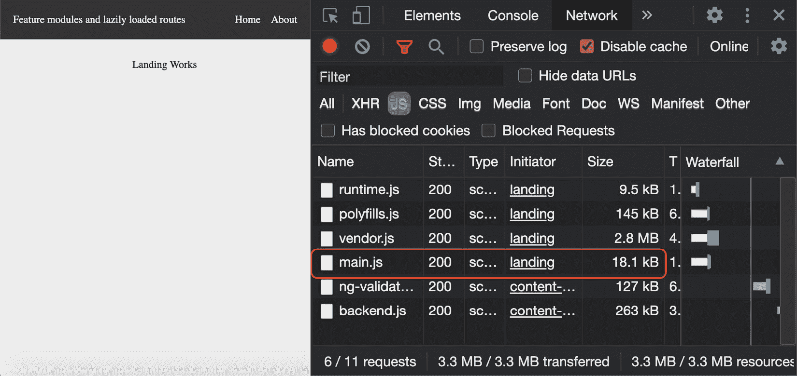

图 7.3 - 应用程序加载时 main.js 的大小减小

但是主页和关于路由呢？懒加载呢？嗯，从标题中点击**主页**路由，您会看到专门为该路由在**网络**选项卡中下载的新 JavaScript 文件。这就是懒加载的作用！请参阅以下截图：

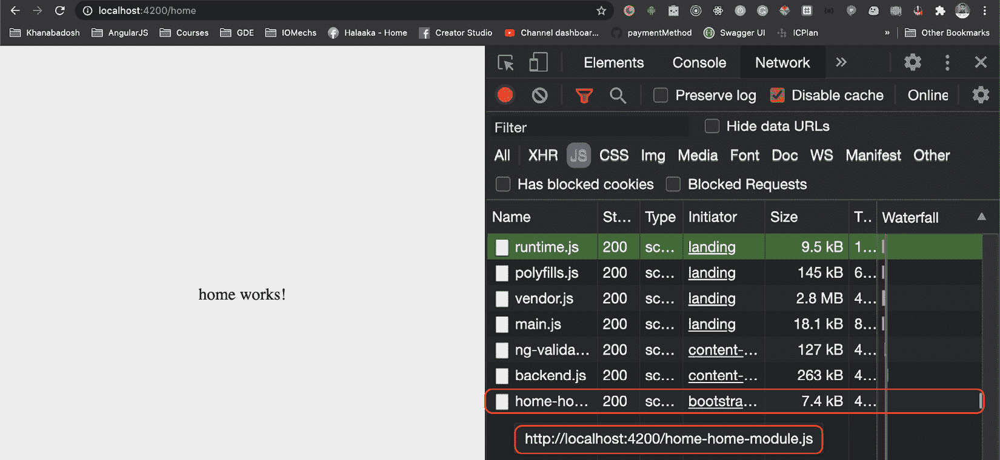

图 7.4 - 主页路由被懒加载

太棒了！你刚刚变得懒惰了！开玩笑的。你刚刚学会了在你的 Angular 应用程序中懒加载路由和特性模块的艺术。现在你也可以向你的朋友展示这个。

## 它是如何工作的…

Angular 使用模块，通常将功能分解为模块。正如我们所知，`AppModule` 作为 Angular 应用的入口点，Angular 将在构建过程中导入和捆绑在 `AppModule` 中导入的任何内容，从而生成 `main.js` 文件。然而，如果我们想要延迟加载我们的路由/功能模块，我们需要避免直接在 `AppModule` 中导入功能模块，并使用 `loadChildren` 方法来加载功能模块的路由，以实现按需加载。这就是我们在这个示例中所做的。需要注意的是，路由在 `AppRoutingModule` 中保持不变。但是，我们必须在我们的功能路由模块中放置 `path: ''`，因为这将合并 `AppRoutingModule` 中的路由和功能路由模块中的路由，从而成为 `AppRoutingModule` 中定义的内容。这就是为什么我们的路由仍然是 `'about'` 和 `'home'`。

## 另请参阅

+   在 Angular 中延迟加载模块（[`angular.io/guide/lazy-loading-ngmodules`](https://angular.io/guide/lazy-loading-ngmodules)）

# 使用路由守卫授权访问路由

您的 Angular 应用程序中并非所有路由都应该被世界上的每个人访问。在这个示例中，我们将学习如何在 Angular 中创建路由守卫，以防止未经授权的访问路由。

## 准备工作

这个示例的项目位于 `chapter07/start_here/using-route-guards` 中：

1.  在 Visual Studio Code 中打开项目。

1.  打开终端并运行 `npm install` 来安装项目的依赖项。

1.  完成后，运行 `ng serve -o`。

这应该在新的浏览器标签中打开应用程序，您应该看到应用程序如下：

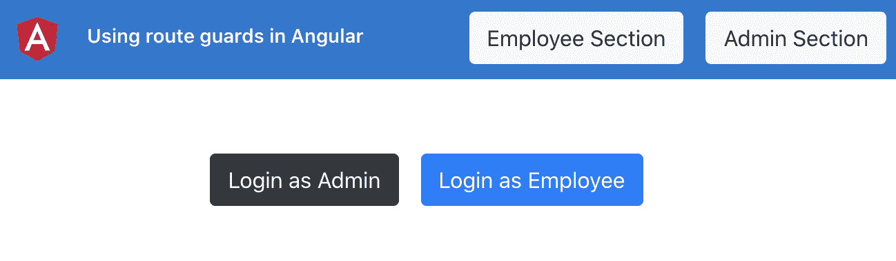

图 7.5 – using-route-guards 应用程序运行在 http://localhost:4200

现在应用程序在本地运行，让我们在下一节中看到示例的步骤。

## 如何做…

我们已经设置了一个带有一些路由的应用程序。您可以以员工或管理员身份登录以查看应用程序的待办事项清单。但是，如果您点击标题中的任何两个按钮，您会发现即使没有登录，您也可以导航到管理员和员工部分。这就是我们要防止发生的事情。请注意，在 `auth.service.ts` 文件中，我们已经有了用户登录的方式，并且我们可以使用 `isLoggedIn()` 方法来检查用户是否已登录。

1.  首先，让我们创建一个路由守卫，只有在用户登录时才允许用户转到特定的路由。我们将其命名为`AuthGuard`。通过在项目根目录中运行以下命令来创建它：

```ts
ng g guard guards/Auth
```

运行命令后，您应该能够看到一些选项，选择我们想要实现的接口。

1.  选择`CanActivate`接口并按“Enter”。

1.  现在，在`auth.guard.ts`文件中添加以下逻辑来检查用户是否已登录，如果用户未登录，我们将重定向用户到登录页面，即`'/auth'`路由：

```ts
import { Injectable } from '@angular/core';
import { CanActivate, ActivatedRouteSnapshot, RouterStateSnapshot, UrlTree, Router } from '@angular/router';
import { Observable } from 'rxjs';
import { AuthService } from '../services/auth.service';
@Injectable({
  providedIn: 'root'
})
export class AuthGuard implements CanActivate {
  constructor(private auth: AuthService, private router:   Router) {  }
  canActivate(
    route: ActivatedRouteSnapshot,
    state: RouterStateSnapshot): Observable<boolean |     UrlTree> | Promise<boolean | UrlTree> | boolean |     UrlTree {
      const loggedIn = !!this.auth.isLoggedIn();
      if (!loggedIn) {
        this.router.navigate(['/auth']);
        return false;
      }
    return true;
  }
}
```

1.  现在，让我们在`app-routing.module.ts`文件中为 Admin 和 Employee 路由应用`AuthGuard`，如下所示：

```ts
...
import { AuthGuard } from './guards/auth.guard';
const routes: Routes = [{...}, {
  path: 'auth',
  loadChildren: () => import('./auth/auth.module').then   (m => m.AuthModule)
}, {
  path: 'admin',
  loadChildren: () => import('./admin/admin.module').  then(m => m.AdminModule),
  canActivate: [AuthGuard]
}, {
  path: 'employee',
  loadChildren: () => import('./employee/employee.  module').then(m => m.EmployeeModule),
  canActivate: [AuthGuard]
}];
...
export class AppRoutingModule { }
```

如果您现在注销并尝试点击标题中的“员工部门”或“管理员部门”按钮，您会注意到在登录之前无法转到路由。如果您尝试直接在地址栏中输入路由的 URL 并按“Enter”，情况也是如此。

1.  现在，我们将尝试创建一个守卫，一个用于员工路由，一个用于管理员路由。依次运行以下命令，并为两个守卫选择`CanActivate`接口：

```ts
ng g guard guards/Employee
ng g guard guards/Admin
```

1.  既然我们已经创建了守卫，让我们首先为`AdminGuard`放置逻辑。我们将尝试查看已登录的用户类型。如果是管理员，则允许导航，否则我们会阻止它。在`admin.guard.ts`中添加以下代码：

```ts
...
import { UserType } from '../constants/user-type';
import { AuthService } from '../services/auth.service';
...
export class AdminGuard implements CanActivate {
  constructor(private auth: AuthService) {}
  canActivate(
    route: ActivatedRouteSnapshot,
    state: RouterStateSnapshot): Observable<boolean |     UrlTree> | Promise<boolean | UrlTree> | boolean |     UrlTree {
    return this.auth.loggedInUserType === UserType.Admin;
  }
}
```

1.  在`app-routing.module.ts`中的 Admin 路由中添加`AdminGuard`如下：

```ts
...
import { AdminGuard } from './guards/admin.guard';
import { AuthGuard } from './guards/auth.guard';
const routes: Routes = [{
  path: '',
 ...
}, {
  path: 'auth',
 ...
}, {
  path: 'admin',
  loadChildren: () => import('./admin/admin.module').  then(m => m.AdminModule),
  canActivate: [AuthGuard, AdminGuard]
}, {
  path: 'employee',
  ...
}];
...
```

现在尝试注销并以员工身份登录。然后尝试点击标题中的“管理员部门”按钮。您会注意到您现在无法转到清单的管理员部分。这是因为我们已经放置了`AdminGuard`，而您现在并未以管理员身份登录。以管理员身份登录应该可以正常工作。

1.  类似地，我们将在`employee.guard.ts`中添加以下代码：

```ts
...
import { UserType } from '../constants/user-type';
import { AuthService } from '../services/auth.service';
@Injectable({
  providedIn: 'root'
})
export class EmployeeGuard implements CanActivate {
  constructor(private auth: AuthService) {}
  canActivate(
    route: ActivatedRouteSnapshot,
    state: RouterStateSnapshot): Observable<boolean |     UrlTree> | Promise<boolean | UrlTree> | boolean |     UrlTree {
    return this.auth.loggedInUserType === UserType.    Employee;
  } 
}
```

1.  现在，在`app-routing.module.ts`中的 Employee 路由中添加`EmployeeGuard`如下：

```ts
...
import { EmployeeGuard } from './guards/employee.guard';
const routes: Routes = [
  ...
, {
  path: 'employee',
  loadChildren: () => import('./employee/employee.  module').then(m => m.EmployeeModule),
  canActivate: [AuthGuard, EmployeeGuard]
}];
...
```

现在，只有适当的路由应该可以通过检查已登录的用户类型来访问。

太棒了！现在在保护路由方面，您是一个授权专家。伴随着强大的力量，也伴随着巨大的责任。明智地使用它。

## 工作原理…

路由守卫的`CanActivate`接口是我们的配方的核心，因为它对应于 Angular 中每个路由都可以具有`CanActivate`属性的守卫数组的事实。当应用守卫时，它应该返回一个布尔值或`UrlTree`。我们在配方中专注于布尔值的使用。我们可以直接使用 promise 或者使用 Observable 来返回布尔值。这使得守卫即使在远程数据中也非常灵活。无论如何，对于我们的配方，我们通过检查用户是否已登录（对于`AuthGuard`）以及检查特定路由是否已登录预期类型的用户（`AdminGuard`和`EmployeeGuard`）来使其易于理解。

## 另请参阅

+   在 Angular 路由中防止未经授权的访问（[`angular.io/guide/router#preventing-unauthorized-access`](https://angular.io/guide/router#preventing-unauthorized-access)）

# 使用路由参数

无论是构建使用 Node.js 的 REST API 还是配置 Angular 中的路由，设置路由都是一门绝对的艺术，特别是在处理参数时。在这个配方中，您将创建一些带参数的路由，并学习如何在路由激活后在组件中获取这些参数。

## 准备工作

这个配方的项目位于`chapter07/start_here/working-with-route-params`中：

1.  在 Visual Studio Code 中打开项目。

1.  打开终端并运行`npm install`来安装项目的依赖项。

1.  完成后，运行`ng serve -o`。

这应该在新的浏览器标签中打开应用程序。一旦页面打开，你应该看到一个用户列表。

1.  点击第一个用户，你应该看到以下视图：


图 7.6 - 用户详细信息未带来正确的用户

现在我们的应用程序在本地运行，让我们在下一节中看看配方的步骤。

## 如何做…

目前的问题是，我们有一个用于打开用户详细信息的路由，但在`UserDetailComponent`中我们不知道点击了哪个用户，也就是说，从服务中获取哪个用户。因此，我们将实现路由参数，将用户的 ID（`uuid`）从主页传递到用户详细信息页面：

1.  首先，我们必须使我们的用户路由能够接受名为`uuid`的路由参数。这将是一个**必需**参数，这意味着没有传递这个参数，路由将无法工作。让我们修改`app-routing.module.ts`来添加这个必需参数到路由定义中，如下所示：

```ts
...
import { UserDetailComponent } from './user-detail/user-detail.component';
const routes: Routes = [
  ...
, {
  path: 'user/:uuid',
  component: UserDetailComponent
}];
...
```

通过这个改变，在主页上点击用户将不再起作用。如果你尝试，你会看到以下错误，因为`uuid`是一个必需的参数：

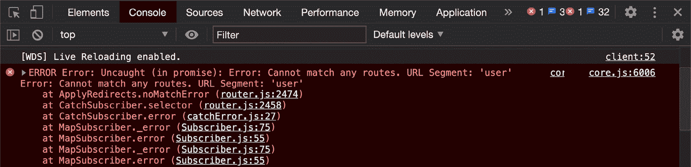

图 7.7 - Angular 抱怨无法匹配请求的路由

1.  错误的修复很容易；我们需要在导航到用户路由时传递`uuid`。让我们通过修改`user-card.component.ts`文件来实现这一点：

```ts
import { Component, Input, OnInit } from '@angular/core';
import { Router } from '@angular/router';
import { IUser } from '../../interfaces/user.interface';
@Component({
  selector: 'app-user-card',
  templateUrl: './user-card.component.html',
  styleUrls: ['./user-card.component.scss']
})
export class UserCardComponent implements OnInit {
  @Input('user') user: IUser;
  constructor(private router: Router) { }
  ngOnInit(): void {
  }
  cardClicked() {
    this.router.navigate(['    /user/${this.user.login.uuid}'])
  }
}
```

现在我们能够导航到特定用户的路由，并且你也应该能够在地址栏中看到 UUID，如下所示：

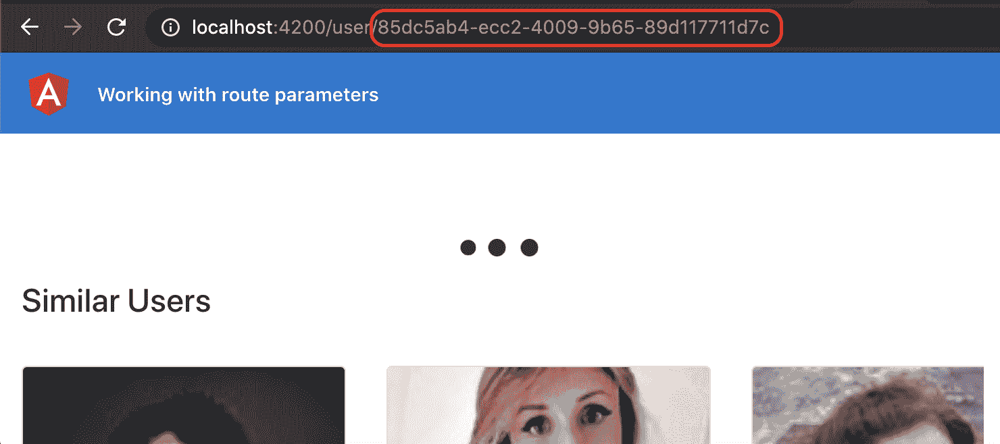

图 7.8 - UUID 显示在地址栏中

1.  为了从`UserService`中获取当前用户，我们需要在`UserDetailComponent`中获取`uuid`值。现在，当从`UserDetailComponent`调用`UserService`的`getUser`方法时，我们发送的是`null`。为了使用用户的 ID，我们可以通过导入`ActivatedRoute`服务从路由参数中获取`uuid`值。更新`user-detail.component.ts`如下：

```ts
...
import { ActivatedRoute } from '@angular/router';
...
export class UserDetailComponent implements OnInit, OnDestroy {
  user: IUser;
  similarUsers: IUser[];
  constructor(
    private userService: UserService,
    private route: ActivatedRoute
  ) {}
  ngOnInit() {
    ...
  }
  ngOnDestroy() {
  }
}
```

1.  我们将在`UserDetailComponent`中创建一个名为`getUserAndSimilarUsers`的新方法，并将代码从`ngOnInit`方法移动到新方法中，如下所示：

```ts
...
export class UserDetailComponent implements OnInit, OnDestroy {
  ...
  ngOnInit() {
    const userId = null;
    this.getUserAndSimilarUsers(userId);
  }
  getUserAndSimilarUsers(userId) {
    this.userService.getUser(userId)
      .pipe(
        mergeMap((user: IUser) => {
          this.user = user;
          return this.userService.          getSimilarUsers(userId);
        })
      ).subscribe((similarUsers: IUser[]) => {
        this.similarUsers = similarUsers;
      })
  }
  ...
}
```

1.  现在我们已经对代码进行了一些重构，让我们尝试使用`ActivatedRoute`服务从路由参数中访问`uuid`，并将其传递到我们的`getUserAndSimilarUsers`方法中，如下所示：

```ts
...
import { mergeMap, takeWhile } from 'rxjs/operators';
import { ActivatedRoute } from '@angular/router';
...
export class UserDetailComponent implements OnInit, OnDestroy {
  componentIsAlive = false;
  constructor(private userService: UserService, private   route: ActivatedRoute ) {}
  ngOnInit() {
    this.componentIsAlive = true;
    this.route.paramMap
      .pipe(
        takeWhile (() => this.componentIsAlive)
      )
      .subscribe((params) => {
        const userId = params.get('uuid');
        this.getUserAndSimilarUsers(userId);
      })
  }
  getUserAndSimilarUsers(userId) {...}
  ngOnDestroy() {
   this.componentIsAlive = false;
  }
}
```

太棒了！通过这个改变，你可以尝试在主页上刷新应用，然后点击任何用户。你应该能够看到当前用户以及加载的相似用户。要了解食谱背后的所有魔法，请参见下一节。

## 它是如何工作的…

一切都始于我们将路由路径更改为 `user/:userId`。这使得 `userId` 成为我们路由的必需参数。拼图的另一部分是在 `UserDetailComponent` 中检索此参数，然后使用它来获取目标用户，以及类似的用户。为此，我们使用 `ActivatedRoute` 服务。`ActivatedRoute` 服务包含了关于当前路由的许多必要信息，因此我们能够通过订阅 `paramMap` 可观察对象来获取当前路由的 `uuid` 参数，因此即使在用户页面停留时参数发生变化，我们仍然执行必要的操作。请注意，我们还创建了一个名为 `componentIsAlive` 的属性。正如您在我们之前的示例中所看到的，我们将它与 `takeWhile` 操作符一起使用，以便在用户从页面导航离开或组件被销毁时自动取消订阅可观察流。

## 另请参阅

+   英雄之旅教程 - `ActivatedRoute` 服务的示例用法（[`angular.io/guide/router-tutorial-toh#route-parameters-in-the-activatedroute-service`](https://angular.io/guide/router-tutorial-toh#route-parameters-in-the-activatedroute-service)）

+   链接参数数组 - Angular 文档（[`angular.io/guide/router#link-parameters-array`](https://angular.io/guide/router#link-parameters-array)）

# 在路由更改之间显示全局加载程序

构建快速响应的用户界面对于赢得用户至关重要。对于最终用户来说，应用程序变得更加愉快，对于应用程序的所有者/创建者来说，这可能带来很多价值。现代网络的核心体验之一是在后台发生某些事情时显示加载程序。在这个示例中，您将学习如何在您的 Angular 应用程序中创建一个全局用户界面加载程序，每当应用程序中发生路由转换时都会显示。

## 准备工作

我们将要使用的项目位于克隆存储库中的 `chapter07/start_here/routing-global-loader` 中：

1.  在 Visual Studio Code 中打开项目。

1.  打开终端并运行 `npm install` 以安装项目的依赖项。

1.  完成后，运行 `ng serve -o`。

这应该会在新的浏览器标签页中打开应用程序，您应该会看到如下所示：

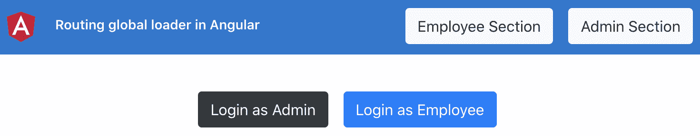

图 7.9 - routing-global-loader 应用程序正在 http://localhost:4200 上运行

现在我们的应用程序在本地运行，让我们在下一节中看一下这个示例的步骤。

## 如何做…

对于这个示例，我们有一个包含几个路由的应用程序。我们已经创建了`LoaderComponent`，在路由更改期间我们必须使用它：

1.  我们将从整个应用程序默认显示`LoaderComponent`开始。为此，请在`app.component.html`文件中在具有`content`类的`div`之前添加`<app-loader>`选择器，如下所示：

```ts
<div class="toolbar" role="banner" id="toolbar">
  ...
</div>
<app-loader></app-loader>
<div class="content" role="main">
  <div class="page-section">
    <router-outlet></router-outlet>
  </div>
</div>
```

1.  现在，我们将在`AppComponent`类中创建一个属性来有条件地显示加载程序。我们将在路由期间将此属性标记为`true`，并在路由完成时将其标记为`false`。在`app.component.ts`文件中创建属性如下：

```ts
...
export class AppComponent {
  isLoadingRoute = false;
  // DO NOT USE THE CODE BELOW IN PRODUCTION
  // IT WILL CAUSE PERFORMANCE ISSUES
  constructor(private auth: AuthService, private router:   Router) {
  }
  get isLoggedIn() {
    return this.auth.isLoggedIn();
  }
  logout() {
    this.auth.logout();
    this.router.navigate(['/auth']);
  }
}
```

1.  现在，我们将确保只有在`isLoadingRoute`属性为`true`时才显示`<app-loader>`。为此，请更新`app.component.html`模板文件，包括以下`*ngIf`语句：

```ts
...
<app-loader *ngIf="isLoadingRoute"></app-loader>
<div class="content" role="main">
  <div class="page-section">
    <router-outlet></router-outlet>
  </div>
</div>
```

1.  现在`*ngIf`语句已经就位，我们需要以某种方式将`isLoadingRoute`属性设置为`true`。为了做到这一点，我们将监听路由服务的`events`属性，并在`NavigationStart`事件发生时采取行动。修改`app.component.ts`文件中的代码如下：

```ts
import { Component } from '@angular/core';
import { NavigationStart, Router } from '@angular/router';
import { AuthService } from './services/auth.service';
...
export class AppComponent {
  isLoadingRoute = false;
  // DO NOT USE THE CODE BELOW IN PRODUCTION
  // IT WILL CAUSE PERFORMANCE ISSUES
  constructor(private auth: AuthService, private router:   Router) {
    this.router.events.subscribe((event) => {
      if (event instanceof NavigationStart) {
        this.isLoadingRoute = true;
      }
    })
  }
  get isLoggedIn() {...}
  logout() {...}
}
```

如果您刷新应用程序，您会注意到`<app-loader>`永远不会消失。它现在一直显示着。这是因为我们没有在任何地方将`isLoadingRoute`属性标记为`false`。

1.  要将`isLoadingRoute`标记为`false`，我们需要检查三种不同的事件：`NavigationEnd`，`NavigationError`和`NavigationCancel`。让我们添加一些逻辑来处理这三个事件，并将属性标记为`false`：

```ts
import { Component } from '@angular/core';
import { NavigationCancel, NavigationEnd, NavigationError, NavigationStart, Router } from '@angular/router';
...
export class AppComponent {
  ...
  constructor(private auth: AuthService, private router:   Router) {
    this.router.events.subscribe((event) => {
      if (event instanceof NavigationStart) {
        this.isLoadingRoute = true;
      }
      if (
        event instanceof NavigationEnd ||
        event instanceof NavigationError ||
        event instanceof NavigationCancel
      ) {
        this.isLoadingRoute = false;
      }
    })
  }
  get isLoggedIn() {...}
  logout() {...}
}
```

然后！我们现在有一个全局加载程序，在不同页面之间的路由导航期间显示。

重要提示

在本地运行应用程序时，您将体验到可能是最佳的互联网条件（特别是如果您没有获取远程数据）。因此，您可能根本看不到加载程序，或者只能看到它一小部分时间。为了能够更长时间地看到它，请打开 Chrome DevTools，转到**网络**选项卡，模拟缓慢的 3G，刷新应用程序，然后在路由之间导航。

如果路由具有静态数据，那么您只会在首次导航到该路由时看到加载程序。下次导航到相同的路由时，它可能已经被缓存，因此全局加载程序可能不会显示。

恭喜完成了这个示例。现在你可以在 Angular 应用程序中实现一个全局加载器，它将从导航开始到导航结束都会显示。

## 工作原理…

路由器服务是 Angular 中非常强大的服务。它有很多方法以及我们可以在应用程序中用于不同任务的 Observables。对于这个示例，我们使用了`events` Observable。通过订阅`events` Observable，我们可以监听`Router`服务通过 Observable 发出的所有事件。对于这个示例，我们只对`NavigationStart`、`NavigationEnd`、`NavigationError`和`NavigationCancel`事件感兴趣。`NavigationStart`事件在路由器开始导航时发出。`NavigationEnd`事件在导航成功结束时发出。`NavigationCancel`事件在导航由于**路由守卫**返回`false`或由于某种原因使用`UrlTree`而被取消时发出。`NavigationError`事件在导航期间由于任何原因出现错误时发出。所有这些事件都是`Event`类型的，我们可以通过检查它是否是目标事件的实例来确定事件的类型，使用`instanceof`关键字。请注意，由于我们在`AppComponent`中订阅了`Router.events`属性，我们不必担心取消订阅，因为应用程序中只有一个订阅，而且`AppComponent`在应用程序的整个生命周期中都不会被销毁。

## 另请参阅

+   路由器事件文档（[`angular.io/guide/router#router-events`](https://angular.io/guide/router#router-events)）

+   路由器服务文档（[`angular.io/api/router/Router`](https://angular.io/api/router/Router)）

# 预加载路由策略

我们已经熟悉了如何在导航时延迟加载不同的特性模块。尽管有时，您可能希望预加载后续路由，以使下一个路由导航即时进行，甚至可能希望根据应用程序的业务逻辑使用自定义预加载策略。在这个示例中，您将了解`PreloadAllModules`策略，并将实现一个自定义策略来精选应该预加载哪些模块。

## 准备工作

我们要处理的项目位于克隆存储库中的`chapter07/start_here/route-preloading-strategies`中：

1.  在 Visual Studio Code 中打开项目。

1.  打开终端并运行`npm install`来安装项目的依赖项。

1.  完成后，运行`ng serve -o`。

这应该在新的浏览器标签中打开应用程序，你应该看到类似以下的内容：

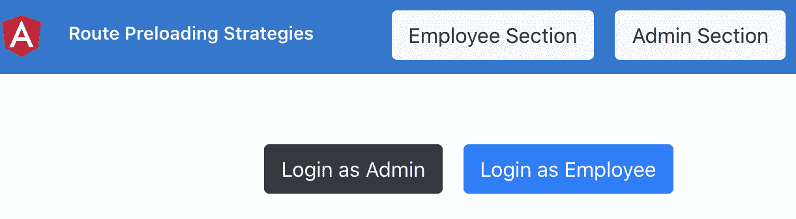

图 7.10 - 在 http://localhost:4200 上运行的 route-preloading-strategies 应用程序

1.  使用*Ctrl* + *Shift* + *C*在 Windows 上或*Cmd* + *Shift* + *C*在 Mac 上打开 Chrome DevTools。

1.  转到**网络**选项卡，并仅筛选 JavaScript 文件。你应该看到类似这样的内容：

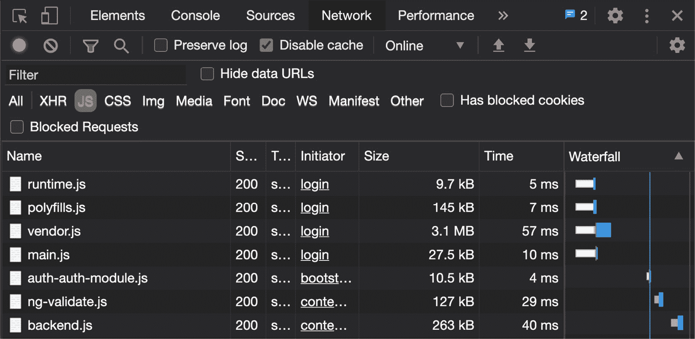

图 7.11 - 应用加载时加载的 JavaScript 文件

现在我们的应用程序在本地运行，让我们看看下一节

## 如何做…

请注意*图 7.11*中我们如何在注销状态下自动加载`auth-auth-module.js`文件。尽管`AuthModule`中的路由都配置为惰性加载，但我们仍然可以看看如果我们使用`PreloadAllModules`策略，然后自定义预加载策略会发生什么：

1.  我们将首先尝试`PreloadAllModules`策略。要使用它，让我们修改`app-routing.module.ts`文件如下：

```ts
import { NgModule } from '@angular/core';
import { Routes, RouterModule, PreloadAllModules } from '@angular/router';
const routes: Routes = [...];
@NgModule({
  imports: [RouterModule.forRoot(routes, {
    preloadingStrategy: PreloadAllModules
  })],
  exports: [RouterModule]
})
export class AppRoutingModule { }
```

如果刷新应用程序，你应该看到不仅`auth-auth-module.js`文件，还有 Admin 和 Employee 的模块文件，如下所示：

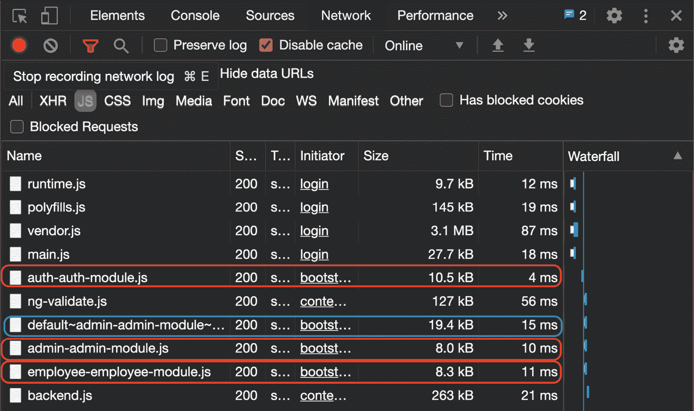

图 7.12 - 使用 PreloadAllModules 策略加载的 JavaScript 文件

到目前为止一切顺利。但是如果我们只想预加载 Admin 模块，假设我们的应用主要面向管理员？我们将为此创建一个自定义预加载策略。

1.  让我们通过在项目中运行以下命令来创建一个名为`CustomPreloadStrategy`的服务：

```ts
ng g s services/custom-preload-strategy
```

1.  为了在 Angular 中使用我们的预加载策略服务，我们的服务需要实现`@angular/router`包中的`PreloadingStrategy`接口。修改新创建的服务如下：

```ts
import { Injectable } from '@angular/core';
import { PreloadingStrategy } from '@angular/router';
@Injectable({
  providedIn: 'root'
})
export class CustomPreloadStrategyService implements PreloadingStrategy {
  constructor() { }
}
```

1.  接下来，我们需要实现我们的服务的`PreloadingStrategy`接口中的`preload`方法，以使其正常工作。让我们修改`CustomPreloadStrategyService`以实现`preload`方法，如下所示：

```ts
import { Injectable } from '@angular/core';
import { PreloadingStrategy, Route } from '@angular/router';
import { Observable, of } from 'rxjs';
@Injectable({
  providedIn: 'root'
})
export class CustomPreloadStrategyService implements PreloadingStrategy {
  constructor() { }
  preload(route: Route, load: () => Observable<any>):   Observable<any> {
    return of(null)
  }
}
```

1.  现在，我们的`preload`方法返回`of(null)`。相反，为了决定要预加载哪些路由，我们将在我们的路由定义中添加一个对象作为`data`对象，其中包含一个名为`shouldPreload`的布尔值。让我们通过修改`app-routing.module.ts`来快速完成这一点：

```ts
...
const routes: Routes = [{...}, {
  path: 'auth',
  loadChildren: () => import('./auth/auth.module').then(m => m.AuthModule),
  data: { shouldPreload: true }
}, {
  path: 'admin',
  loadChildren: () => import('./admin/admin.module').  then(m => m.AdminModule),
  data: { shouldPreload: true }
}, {
  path: 'employee',
  loadChildren: () => import('./employee/employee.  module').then(m => m.EmployeeModule),
  data: { shouldPreload: false }
}];
...
```

1.  所有`shouldPreload`设置为`true`的路由应该被预加载，如果它们设置为`false`，那么它们就不应该被预加载。我们将创建两种方法。一种是我们想要预加载路由的情况，另一种是我们不想要预加载路由的情况。让我们修改`custom-preload-strategy.service.ts`，添加以下方法：

```ts
export class CustomPreloadStrategyService implements PreloadingStrategy {
  ...
  loadRoute(route: Route, loadFn: () => Observable<any>):   Observable<any> {
    console.log('Preloading done for route: ${route.    path}')
    return loadFn();
  }
  noPreload(route: Route): Observable<any> {
    console.log('No preloading set for: ${route.path}');
    return of(null);
  }
  ...
}
```

1.  太棒了！现在我们必须在`preload`方法中使用*步骤 6*中创建的方法。让我们修改方法，使用路由定义中`data`对象的`shouldPreload`属性。代码应该如下所示：

```ts
...
export class CustomPreloadStrategyService implements PreloadingStrategy {
...
  preload(route: Route, load: () => Observable<any>):   Observable<any> {
    try {
      const { shouldPreload } = route.data;
      return shouldPreload ? this.loadRoute(route, load)       : this.noPreload(route);
    }
    catch (e) {
      console.error(e);
      return this.noPreload(route);
    }
  }
}
```

1.  最后一步是使用我们自定义的预加载策略。为了这样做，修改`app-routing-module.ts`文件如下：

```ts
import { NgModule } from '@angular/core';
import { Routes, RouterModule, PreloadAllModules ← Remove } from '@angular/router';
import { CustomPreloadStrategyService } from './services/custom-preload-strategy.service';
const routes: Routes = [...];
@NgModule({
  imports: [RouterModule.forRoot(routes, {
    preloadingStrategy: CustomPreloadStrategyService
  })],
  exports: [RouterModule]
})
export class AppRoutingModule { }
```

看！如果您现在刷新应用并监视**网络**选项卡，您会注意到只有 Auth 和 Admin 的 JavaScript 文件被预加载，而 Employee 模块没有预加载，如下所示：

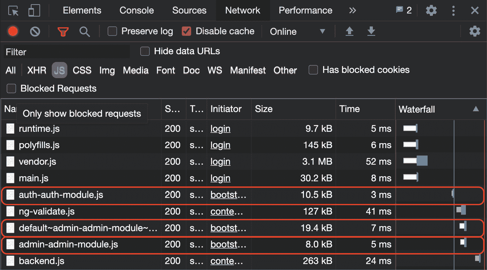

图 7.13-仅使用自定义预加载策略预加载 Auth 和 Admin 模块

您还可以查看控制台日志，查看哪些路由已经预加载。您应该看到以下日志：

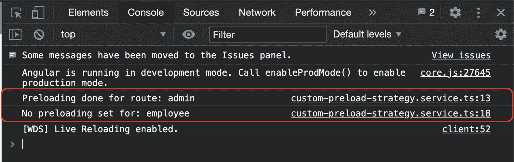

图 7.14-仅预加载 Auth 和 Admin 模块的日志

现在您已经完成了这个教程，看看下一节关于这是如何工作的。

## 它是如何工作的...

Angular 提供了一种很好的方法来为我们的特性模块实现自定义预加载策略。我们可以很容易地决定哪些模块应该预加载，哪些不应该。在这个教程中，我们学习了一种非常简单的方法，通过在路由配置的`data`对象中添加一个名为`shouldPreload`的属性来配置预加载。我们创建了自己的自定义预加载策略服务，命名为`CustomPreloadStrategyService`，它实现了`@angular/router`包中的`PreloadingStrategy`接口。这个想法是使用`PreloadingStrategy`接口中的`preload`方法，它允许我们决定一个路由是否应该预加载。这是因为 Angular 会使用我们的自定义预加载策略遍历每个路由，并决定哪些路由应该预加载。就是这样。现在我们可以将`data`对象中的`shouldPreload`属性分配给我们想要在应用启动时预加载的任何路由。

## 另请参阅

+   `web.dev`上的路由预加载策略文章（[`web.dev/route-preloading-in-angular/`](https://web.dev/route-preloading-in-angular/)）
