# 第八章：*第八章*：精通 Angular 表单

获取用户输入是几乎任何现代应用程序的一个重要部分。无论是对用户进行身份验证、征求反馈意见，还是填写业务关键表单，知道如何实现和呈现表单给最终用户始终是一个有趣的挑战。在本章中，您将了解 Angular 表单以及如何使用它们创建出色的用户体验。

以下是本章将要涵盖的示例：

+   创建您的第一个模板驱动 Angular 表单

+   使用模板驱动表单进行表单验证

+   测试模板驱动表单

+   创建您的第一个响应式表单

+   使用响应式表单进行表单验证

+   创建一个异步验证器函数

+   测试响应式表单

+   使用响应式表单控件进行去抖动

+   使用`ControlValueAccessor`编写自定义表单控件

# 技术要求

对于本章的示例，请确保您的计算机上已安装了**Git**和**NodeJS**。您还需要安装`@angular/cli`包，可以在终端中使用`npm install -g @angular/cli`来安装。本章的代码可以在[`github.com/PacktPublishing/Angular-Cookbook/tree/master/chapter08`](https://github.com/PacktPublishing/Angular-Cookbook/tree/master/chapter08)找到。

# 创建您的第一个模板驱动 Angular 表单

让我们在这个示例中开始熟悉 Angular 表单。在这个示例中，您将了解模板驱动表单的基本概念，并将使用模板驱动表单 API 创建一个基本的 Angular 表单。

## 准备工作

此示例中的项目位于`chapter08/start_here/template-driven-forms`中：

1.  在 Visual Studio Code 中打开项目。

1.  打开终端并运行`npm install`来安装项目的依赖项。

1.  完成后，运行`ng serve -o`。

这将在新的浏览器选项卡中打开应用程序，并且您应该看到以下视图：

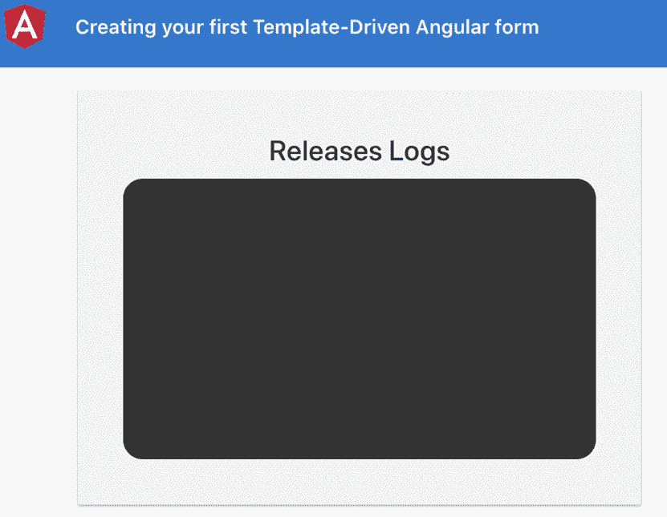

图 8.1-在 http://localhost:4200 上运行的模板驱动表单应用程序

## 如何做…

我们已经有一个 Angular 应用程序，其中已经有一个发布日志组件和一堆设置，例如`src/app/classes`文件夹下的`ReleaseLog`类。因此，在这个示例中，我们将创建一个模板驱动表单，允许用户选择一个应用程序并提交一个发布版本。让我们开始吧：

1.  首先，在项目的根目录中打开终端，并创建一个发布表单组件，如下所示：

```ts
ng g c components/release-form
```

该命令应在`src/app/components`文件夹中创建一个名为`ReleaseFormComponent`的新组件。

1.  将新创建的组件添加到`VersionControlComponent`的模板中，并修改`version-control.component.html`文件如下：

```ts
<div class="version-control">
  <app-release-form></app-release-form>
  <app-release-logs [logs]="releaseLogs"></app-release-  logs>
</div>
```

接下来，让我们调整一些样式，以便在`VersionControlComponent`中使用发布表单。

1.  修改`version-control.component.scss`文件如下：

```ts
:host {
  ...
  min-width: 400px;
  .version-control {
    display: flex;
    justify-content: center;
  }
  app-release-logs,
  app-release-form {
    flex: 1;
  }
  app-release-form {
    margin-right: 20px;
  }
}
```

在`ReleaseFormComponent`模板中，我们将有两个输入。一个用于选择我们要发布的应用程序，另一个用于我们要发布的版本。

1.  让我们修改`release-form.component.ts`文件，将`Apps`枚举添加为一个本地属性，以便我们稍后可以在模板中使用：

```ts
import { Component, OnInit } from '@angular/core';
import { IReleaseLog } from 'src/app/classes/release-log';
import { Apps } from 'src/app/constants/apps';
...
export class ReleaseFormComponent implements OnInit {
  apps = Object.values(Apps);
  newLog: IReleaseLog = {
    app: Apps.CALENDAR,
    version: '0.0.0'
  };
  constructor() { }
  ngOnInit(): void {
  }
}
```

1.  现在让我们添加我们表单的模板。修改`release-form.component.html`文件，并添加以下代码：

```ts
<form>
  <div class="form-group">
    <label for="appName">Select App</label>
    <select class="form-control" id="appName" required>
      <option value="">--Choose--</option>
      <option *ngFor="let app of apps"       [value]="app">{{app}}</option>
    </select>
  </div>
  <div class="form-group">
    <label for="versionNumber">Version Number</label>
    <input type="text" class="form-control"     id="versionNumber" aria-describedby="versionHelp"     placeholder="Enter version number">
    <small id="versionHelp" class="form-text     text-muted">Use semantic versioning (x.x.x)</small>
  </div>
  <button type="submit" class="btn btn-primary">  Submit</button>
</form>
```

1.  现在我们需要集成模板驱动表单。让我们在`app.module.ts`文件中添加`FormsModule`，如下所示：

```ts
...
import { ReleaseFormComponent } from './components/release-form/release-form.component';
import { FormsModule } from '@angular/forms';
@NgModule({
  declarations: [...],
  imports: [
    BrowserModule,
    AppRoutingModule,
    FormsModule
  ],
  ...
})
export class AppModule { }
```

1.  现在我们可以让我们的表单在模板中工作。让我们修改`release-form.component.html`文件，为表单创建一个模板变量，命名为`#releaseForm`。我们还将使用`[(ngModel)]`绑定来针对`newLog`属性的适当值：

```ts
<form #releaseForm="ngForm">
  <div class="form-group">
    <label for="appName">Select App</label>
    <select name="app" [(ngModel)]="newLog.app"     class="form-control" id="appName" required>
      <option value="">--Choose--</option>
      <option *ngFor="let app of apps"       [value]="app">{{app}}</option>
    </select>
  </div>
  <div class="form-group">
    <label for="versionNumber">Version Number</label>
    <input name="version" [(ngModel)]="newLog.version"     type="text" class="form-control" id="versionNumber"     aria-describedby="versionHelp" placeholder="Enter     version number">
    <small id="versionHelp" class="form-text text-    muted">Use semantic versioning (x.x.x)</small>
  </div>
  <button type="submit" class="btn btn-primary">  Submit</button>
</form>
```

1.  创建一个当表单提交时将被调用的方法。修改`release-form.component.ts`文件，添加一个名为`formSubmit`的新方法。当调用此方法时，我们将使用 Angular 的`@Output`发射器发出`ReleaseLog`的新实例，如下所示：

```ts
import { Component, EventEmitter, OnInit, Output } from '@angular/core';
import { NgForm } from '@angular/forms';
import { IReleaseLog, ReleaseLog } from 'src/app/classes/release-log';
...
export class ReleaseFormComponent implements OnInit {
  @Output() newReleaseLog = new   EventEmitter<ReleaseLog>();
  apps = Object.values(Apps);
  ...
  ngOnInit(): void {
  }
  formSubmit(form: NgForm): void {
    const { app, version } = form.value;
    const newLog: ReleaseLog = new ReleaseLog(app,     version)
    this.newReleaseLog.emit(newLog);
  }
}
```

1.  现在更新模板，使用表单提交上的`formSubmit`方法，并修改`release-form.component.html`文件如下：

```ts
<form  #releaseForm="ngForm" (ngSubmit)="formSubmit(releaseForm)">
  ...
</form>
```

1.  现在我们需要修改`VersionControlComponent`以便对新发布日志进行操作。为了这样做，修改`version-control.component.html`文件，以便监听来自`ReleaseFormComponent`的`newReleaseLog`输出事件，如下所示：

```ts
<div class="version-control">
  <app-release-form (newReleaseLog)="addNewReleaseLog   ($event)"></app-release-form>
  <app-release-logs [logs]="releaseLogs"></app-release-  logs>
</div>
```

1.  太棒了！让我们在`version-control.component.ts`文件中创建`addNewReleaseLog`方法，并将接收到的`ReleaseLog`添加到`releaseLogs`数组中。您的代码应如下所示：

```ts
...
export class VersionControlComponent implements OnInit {
  releaseLogs: ReleaseLog[] = [];
  ...
  addNewReleaseLog(log: ReleaseLog) {
    this.releaseLogs.unshift(log);
  }
}
```

太棒了！在几分钟内，我们就能够在 Angular 中创建我们的第一个模板驱动表单。如果现在刷新应用程序并尝试创建一些发布，您应该会看到类似以下内容的东西：

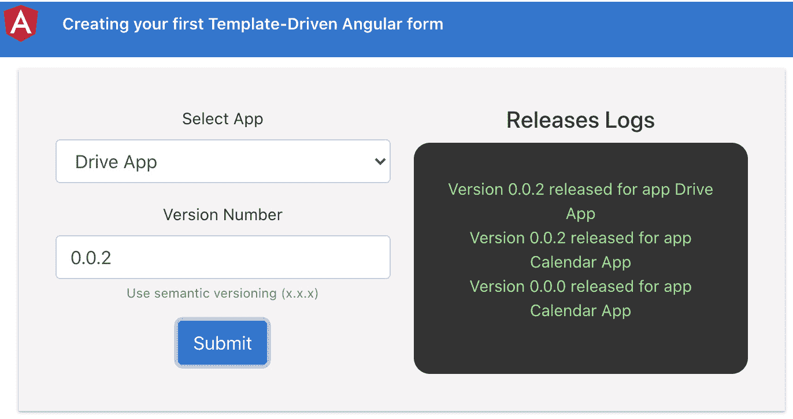

图 8.2 - 模板驱动表单应用程序最终输出

现在您已经了解了如何创建模板驱动表单，让我们看看下一节，了解它是如何工作的。

## 它是如何工作的…

在 Angular 中使用模板驱动表单的关键在于`FormsModule`，`ngForm`指令，通过使用`ngForm`指令创建**模板变量**，并在模板中为输入使用`[(ngModel)]`双向数据绑定以及`name`属性。我们首先创建了一个带有一些输入的简单表单。然后，我们添加了`FormsModule`，这是必须的，用于使用`ngForm`指令和`[(ngModel)]`双向数据绑定。一旦我们添加了该模块，我们就可以在`ReleaseFormComponent`中使用该指令和数据绑定，使用新创建的本地属性命名为`newLog`。请注意，它可以是`ReleaseLog`类的实例，但我们将其保留为`IReleaseLog`类型的对象，因为我们不使用`ReleaseLog`类的`message`属性。通过使用`[(ngModel)]`和`#releaseForm`模板变量，我们可以使用 Angular 的`<form>`指令的`ngSubmit`发射器提交表单。请注意，我们将`releaseForm`变量传递给`formSubmit`方法，这样可以更容易地测试功能。提交表单时，我们使用表单的值创建一个新的`ReleaseLog`项目，并使用`newReleaseLog`输出发射器发射它。请注意，如果为新发布日志提供无效的`version`，应用程序将抛出错误并且不会创建发布日志。这是因为我们在`ReleaseLog`类的`constructor`中验证了版本。最后，当`VersionControlComponent`捕获到`newReleaseLog`事件时，它调用`addNewReleaseLog`方法，将我们新创建的发布日志添加到`releaseLogs`数组中。由于`releaseLogs`数组作为`@Input()`传递给`ReleaseLogsComponent`，因此它会立即显示出来。

## 另请参阅

+   在 Angular 中构建模板驱动表单：[`angular.io/guide/forms#building-a-template-driven-form`](https://angular.io/guide/forms#building-a-template-driven-form)

# 使用模板驱动表单进行表单验证

良好的用户体验是获得更多喜欢使用您的应用程序的用户的关键。而使用表单是用户并不真正喜欢的事情之一。为了确保用户在填写表单上花费最少的时间，并且尽快完成，我们可以实现表单验证，以确保用户尽快输入适当的数据。在这个配方中，我们将看看如何在模板驱动表单中实现表单验证。

## 准备工作

这个配方的项目位于`chapter08/start_here/tdf-form-validation`中：

1.  在 Visual Studio Code 中打开项目。

1.  打开终端并运行 `npm install` 来安装项目的依赖项。

1.  完成后，运行`ng serve -o`。

这应该在新的浏览器选项卡中打开应用程序，并且您应该看到应用程序如下所示：

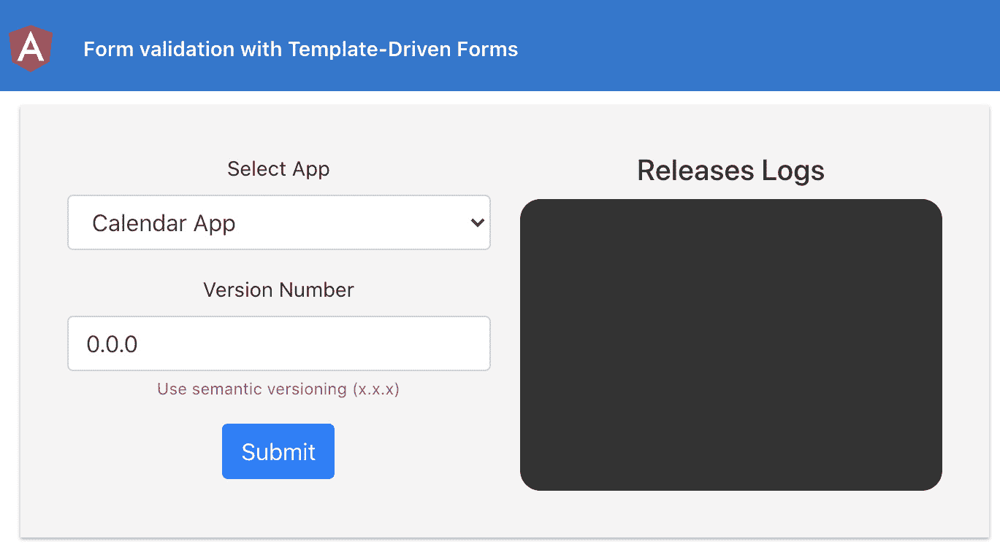

图 8.3 - 运行在 http://localhost:4200 上的 TDF 表单验证应用程序

现在我们已经在本地运行了应用程序，让我们在下一节中看看这个配方涉及的步骤。

## 如何做…

我们现在有了上一个配方中的应用程序，一个简单的 Angular 应用程序，使用`ngForm`和`ngModel`指令创建一个模板驱动表单。该表单用于创建发布日志。在这个配方中，我们将在用户输入时使这个表单更好地验证输入。让我们开始吧：

1.  首先，我们将从`@angular/forms`包中添加一些验证器，这些验证器是响应式表单 API 的一部分。我们将对两个输入应用**required**验证，并对版本输入应用**regex**验证。我们需要为我们的两个输入创建模板变量。我们将分别命名它们为`nameInput`和`versionInput`。修改`release-form.component.html`文件中的代码，使其如下所示：

```ts
<form  #releaseForm="ngForm" (ngSubmit)="formSubmit(releaseForm)">
  <div class="form-group">
    <label for="appName">Select App</label>
    <select #nameInput="ngModel" name="app"     [(ngModel)]="newLog.app" class="form-control"     id="appName" required>
      <option value="">--Choose--</option>
      <option *ngFor="let app of apps"       [value]="app">{{app}}</option>
    </select>
  </div>
  <div class="form-group">
    <label for="versionNumber">Version Number</label>
    <input #versionInput="ngModel" name="version"     [(ngModel)]="newLog.version" type="text"     class="form-control" id="versionNumber" aria-    describedby="versionHelp" placeholder="Enter     version number" required>
    <small id="versionHelp" class="form-text     text-muted">Use semantic versioning (x.x.x)</small>
  </div>
  <button type="submit" class="btn btn-primary">  Submit</button>
</form>
```

1.  现在我们可以使用模板变量来应用验证。让我们从名称输入开始。在验证方面，名称输入不应为空，并且应从选择框中选择一个应用程序。当输入无效时，让我们显示一个默认的 Bootstrap 警报。修改`release-form.component.html`文件中的代码。它应该如下所示：

```ts
<form  #releaseForm="ngForm" (ngSubmit)="formSubmit(releaseForm)">
  <div class="form-group">
    <label for="appName">Select App</label>
    <select #nameInput="ngModel" name="app"     [(ngModel)]="newLog.app" class="form-control"     id="appName" required>
      <option value="">--Choose--</option>
      <option *ngFor="let app of apps"       [value]="app">{{app}}</option>
    </select>
    <div [hidden]="nameInput.valid || nameInput.pristine"     class="alert alert-danger">
      Please choose an app
    </div>
  </div>
  <div class="form-group">
    ...
  </div>
  <button type="submit" class="btn btn-primary">Submit   </button>
</form>
```

1.  要验证版本名称输入，我们需要应用来自`src/app/constants/regexes.ts`文件的`SEMANTIC_VERSION`正则表达式。将常量添加为`ReleaseFormComponent`类中的本地属性，添加到`release-form.component.ts`文件中，如下所示：

```ts
...
import { Apps } from 'src/app/constants/apps';
import { REGEXES } from 'src/app/constants/regexes';
...
export class ReleaseFormComponent implements OnInit {
  @Output() newReleaseLog = new   EventEmitter<ReleaseLog>();
  apps = Object.values(Apps);
  versionInputRegex = REGEXES.SEMANTIC_VERSION;
  ...
}
```

1.  现在，在模板中使用`versionInputRegex`来应用验证并显示相关错误。修改`release-form.component.html`文件，使代码如下所示：

```ts
<form  #releaseForm="ngForm" (ngSubmit)="formSubmit(releaseForm)">
  <div class="form-group">
    ...
  </div>
  <div class="form-group">
    <label for="versionNumber">Version Number</label>
    <input #versionInput="ngModel"     [pattern]="versionInputRegex" name="version"     [(ngModel)]="newLog.version" type="text"     class="form-control" id="versionNumber" aria-    describedby="versionHelp" placeholder="Enter     version number" required>
    <small id="versionHelp" class="form-text     text-muted">Use semantic versioning (x.x.x)</small>
    <div
      [hidden]="versionInput.value &&       (versionInput.valid || versionInput.pristine)"
      class="alert alert-danger"
    >
      Please write an appropriate version number
    </div>
  </div>
  <button type="submit" class="btn btn-primary">  Submit</button>
</form>
```

1.  刷新应用程序，并尝试通过从“选择应用程序”下拉菜单中选择名为**--选择--**的第一个选项，并清空版本输入字段来使两个输入无效。您应该会看到以下错误：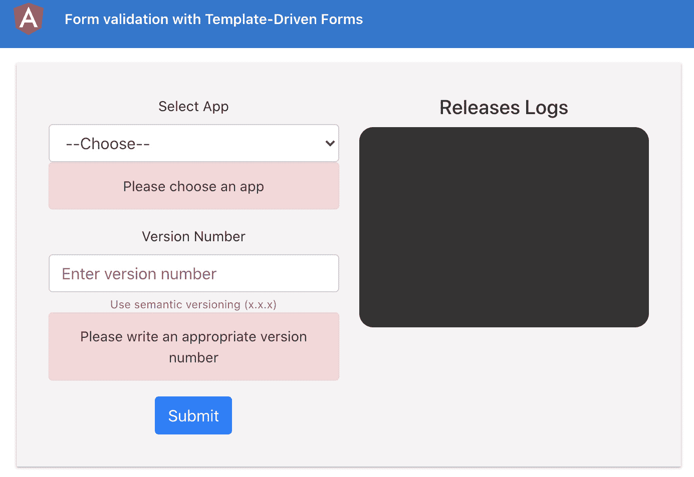

图 8.4 - 使用 ngModel 和验证显示输入错误

1.  接下来，我们将添加一些样式，使我们的输入在验证时更加直观。让我们在`release-form.component.scss`文件中添加一些样式，如下所示：

```ts
:host {
  /* Error messages */
  .alert {
    margin-top: 16px;
  }
  /* Valid form input */
  .ng-valid[required], .ng-valid.required  {
    border-bottom: 3px solid #259f2b;
  }
  /* Invalid form input */
  .ng-invalid:not(form)  {
    border-bottom: 3px solid #c92421;
  }
}
```

1.  最后，让我们围绕表单提交进行验证。如果输入值无效，我们将禁用**提交**按钮。让我们修改`release-form.component.html`模板如下：

```ts
<form #releaseForm="ngForm" (ngSubmit)="formSubmit(releaseForm)">
  <div class="form-group">
    ...
  </div>
  <div class="form-group">
    ...
  </div>
  <button type="submit" [disabled]="releaseForm.invalid"   class="btn btn-primary">Submit</button>
</form>
```

如果现在刷新应用程序，您会发现只要一个或多个输入无效，提交按钮就会被禁用。

太棒了！您刚学会了如何验证模板驱动表单，并使模板驱动表单的整体用户体验稍微好一些。

## 它是如何工作的...

本教程的核心组件是`ngForm`和`ngModel`指令。我们可以很容易地确定提交按钮是否应该可点击（未禁用），这取决于表单是否有效，也就是说，如果表单中的所有输入都具有有效值。请注意，我们在`<form>`元素上使用了使用`#releaseForm="ngForm"`语法创建的模板变量。这是由于`ngForm`指令能够导出为模板变量。因此，我们能够在提交按钮的`[disabled]`绑定中使用`releaseForm.invalid`属性来有条件地禁用它。我们还根据输入可能无效的条件显示单个输入的错误。在这种情况下，我们显示 Bootstrap 的`alert`元素（带有 CSS 类`alert`的`<div>`）。我们还在表单输入上使用 Angular 提供的类`ng-valid`和`ng-invalid`，以根据输入值的有效性以某种方式突出显示输入。这个教程有趣的地方在于，我们通过确保应用程序名称的输入包含一个非假值来验证它，其中`<select>`框的第一个`<option>`的值为`""`。更有趣的是，我们还通过在输入上绑定`[pattern]`到一个正则表达式来验证用户输入版本名称。否则，我们将不得不等待用户提交表单，然后才能进行验证。因此，我们通过在用户输入版本时提供错误信息来提供出色的用户体验。

## 另请参阅

+   显示和隐藏验证错误消息（Angular 文档）：[`angular.io/guide/forms#show-and-hide-validation-error-messages`](https://angular.io/guide/forms#show-and-hide-validation-error-messages)

+   NgForm 文档：`https://angular.io/api/forms/NgForm`

# 测试模板驱动表单

为了确保我们为最终用户构建健壮且无错误的表单，最好是对表单进行测试。这样可以使代码更具弹性，更不容易出错。在本教程中，您将学习如何使用单元测试来测试模板驱动表单。

## 准备工作

本教程的项目位于`chapter08/start_here/testing-td-forms`中。

1.  在 Visual Studio Code 中打开项目。

1.  打开终端并运行`npm install`以安装项目的依赖项。

1.  完成后，运行`ng serve -o`。

这应该会在新的浏览器选项卡中打开应用程序，您应该会看到应用程序如下所示：

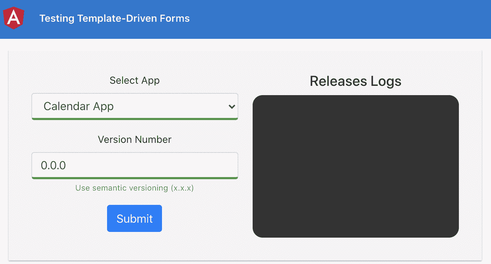

图 8.5 - 正在运行的 Testing Template-Driven Forms 应用程序，网址为 http://localhost:4200

现在我们已经在本地运行了应用程序，让我们在下一节中看看这个配方涉及的步骤。

## 如何做…

我们有来自上一个配方的应用程序，其中包含用于创建发布日志的模板驱动表单。该表单还对输入应用了验证。让我们开始研究如何测试这个表单：

1.  首先，运行以下命令来运行单元测试：

```ts
npm run test
```

运行命令后，您应该看到打开一个新的 Chrome 窗口来运行单元测试。我们六个测试中的一个测试失败了。您可能会在自动化的 Chrome 窗口中看到类似以下内容：

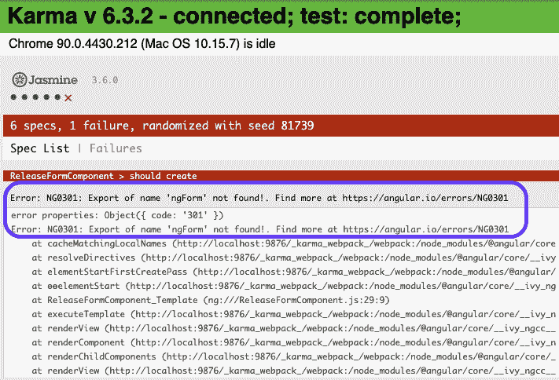

图 8.6 - 使用 Karma 和 Jasmine 在自动化 Chrome 窗口中运行单元测试

1.  `ReleaseFormComponent > should create`测试失败了，因为我们没有将`FormsModule`添加到测试中。注意`Export of name 'ngForm' not found`错误。让我们在`release-form.component.spec.ts`中的测试模块配置中导入`FormsModule`，如下所示：

```ts
import { ComponentFixture, TestBed } from '@angular/core/testing';
import { FormsModule } from '@angular/forms';
import { ReleaseFormComponent } from './release-form.component';
describe('ReleaseFormComponent', () => {
  ...
  beforeEach(async () => {
    await TestBed.configureTestingModule({
      declarations: [ ReleaseFormComponent ],
      imports: [ FormsModule ]
    })
    .compileComponents();
  });
  ...
  it('should create', () => {
    expect(component).toBeTruthy();
  });
});
```

如果您现在查看测试，您应该看到所有测试都通过了，如下所示：

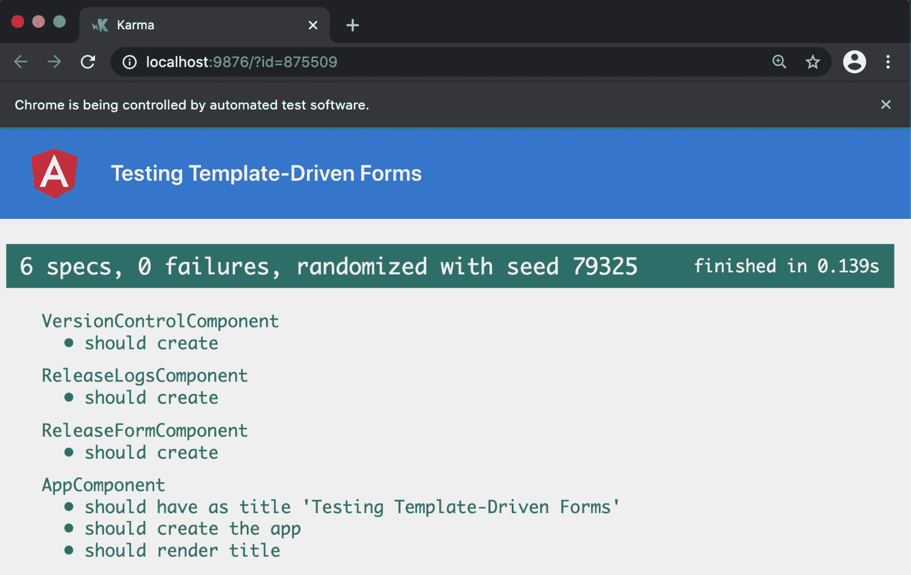

图 8.7 - 在适当的测试中导入 FormsModule 后，所有测试都通过了

为了正确测试表单，我们将添加一些测试，一个用于成功的输入，一个用于每个无效的输入。为此，我们需要访问我们组件中的表单，因为我们正在编写单元测试。

1.  让我们在`release-form.component.ts`文件中使用`@ViewChild()`装饰器来访问我们组件类中的`#releaseForm`，如下所示：

```ts
import { Component, EventEmitter, OnInit, Output, ViewChild } from '@angular/core';
...
@Component({
  selector: 'app-release-form',
  templateUrl: './release-form.component.html',
  styleUrls: ['./release-form.component.scss']
})
export class ReleaseFormComponent implements OnInit {
  @Output() newReleaseLog = new   EventEmitter<ReleaseLog>();
  @ViewChild('releaseForm') releaseForm: NgForm;
  apps = Object.values(Apps);
  versionInputRegex = REGEXES.SEMANTIC_VERSION;
  ...
}
```

1.  现在让我们添加一个新的测试。我们将编写一个测试，用于验证当两个输入都具有有效值时的情况。将测试添加到`release-form.component.spec.ts`文件中，如下所示：

```ts
import { ComponentFixture, TestBed, fakeAsync } from '@angular/core/testing';
import { ReleaseFormComponent } from './release-form.component';
describe('ReleaseFormComponent', () => {
  ...
  it('should create', () => {
    expect(component).toBeTruthy();
  });
  it('should submit a new release log with the correct   input values', fakeAsync( () => {
    expect(true).toBeFalsy();
  }));
});
```

1.  到目前为止，新的测试失败了。让我们尝试填写表单中的值，提交按钮，并确保我们的`@Output`发射器命名为`newReleaseLog`从`releaseForm`中发射出正确的值。测试的内容应该如下所示：

```ts
...
import { ReleaseLog } from 'src/app/classes/release-log';
...
it('should submit a new release log with the correct input values', fakeAsync(async () => {
    const submitButton = fixture.nativeElement.    querySelector('button[type="submit"]');
    const CALENDAR_APP = component.apps[2];
    spyOn(component.newReleaseLog, 'emit');
    await fixture.whenStable(); // wait for Angular     to configure the form
    component.releaseForm.controls[    'version'].setValue('2.2.2');
    component.releaseForm.controls[    'app'].setValue(CALENDAR_APP);
    submitButton.click();
    const expectedReleaseLog = new ReleaseLog(CALENDAR_    APP, '2.2.2');
    expect(component.newReleaseLog.emit)    .toHaveBeenCalledWith(expectedReleaseLog);
  }));
```

当你保存文件时，你应该看到新的测试通过了预期的值。它应该出现在 Chrome 标签页中如下所示：

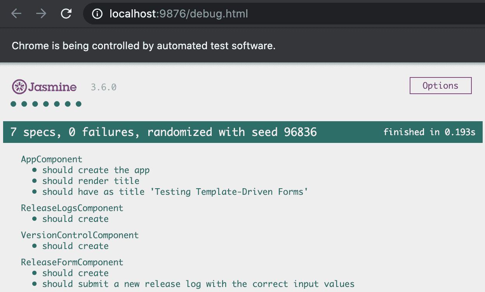

图 8.8 - 成功提交表单的新测试通过

1.  让我们为表单中提供了不正确版本的情况添加一个测试。提交按钮应该被禁用，并且`formSubmit`方法应该抛出错误。在`release-form.component.spec.ts`文件中添加一个新的测试，如下所示：

```ts
...
describe('ReleaseFormComponent', () => {
  ...
  it('should submit a new release log with the correct   input values', fakeAsync(async () => {
    const submitButton = fixture.nativeElement.    querySelector('button[type="submit"]');
    const CALENDAR_APP = component.apps[2];
    spyOn(component.newReleaseLog, 'emit');
    await fixture.whenStable(); // wait for Angular     to configure the form
    const expectedError = 'Invalid version provided.     Please provide a valid version as     (major.minor.patch)';
    component.releaseForm.controls[    'version'].setValue('x.x.x');
    component.releaseForm.controls[    'app'].setValue(CALENDAR_APP);
    expect(() => component.formSubmit(component.    releaseForm))
      .toThrowError(expectedError);
    fixture.detectChanges();
    expect(submitButton.hasAttribute(    'disabled')).toBe(true);
    expect(component.newReleaseLog.emit)    .not.toHaveBeenCalled();
  }));
});
```

1.  让我们添加最后一个测试，确保当我们没有为发布日志选择应用程序时，提交按钮被禁用。在`release-form.component.spec.ts`文件中添加一个新的测试，如下所示：

```ts
...
describe('ReleaseFormComponent', () => {
  ...
  it('should disable the submit button when we   don\'t have an app selected', fakeAsync(async () => {
    const submitButton = fixture.nativeElement.    querySelector('button[type="submit"]');
    spyOn(component.newReleaseLog, 'emit');
    await fixture.whenStable(); // wait for Angular     to configure the form
    component.releaseForm.controls[    'version'].setValue('2.2.2');
    component.releaseForm.controls[    'app'].setValue(null);
    fixture.detectChanges();
    expect(submitButton.hasAttribute(    'disabled')).toBe(true);
    expect(component.newReleaseLog.emit     ).not.toHaveBeenCalled();
  }));
});
```

如果你查看 Karma 测试窗口，你应该看到所有新的测试都通过了，如下所示：

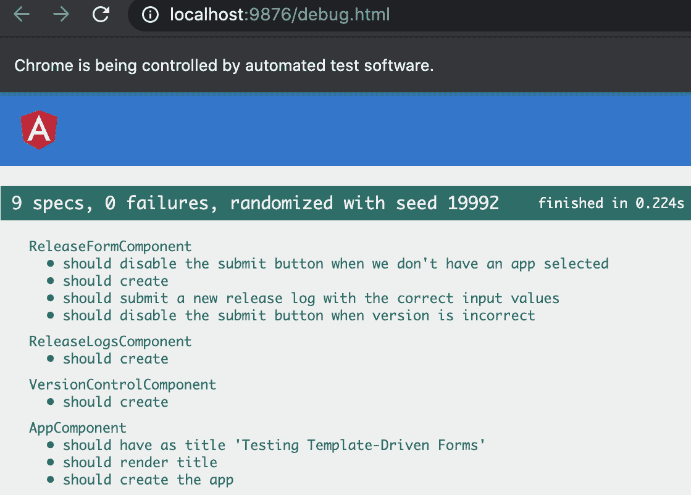

图 8.9 - 针对该配方的所有测试都通过

太棒了！现在你已经掌握了一堆测试模板驱动表单的技巧。其中一些技巧可能仍需要一些解释。请查看下一节，了解它是如何工作的。

## 它是如何工作的…

测试模板驱动表单可能有点挑战，因为它取决于表单的复杂程度，您想要测试的用例以及这些用例的复杂程度。在我们的配方中，我们首先在`ReleaseFormComponent`的测试文件的导入中包含了`FormsModule`。这确保了测试知道`ngForm`指令，并且不会抛出相关错误。对于所有成功输入的测试，我们对`ReleaseFormComponent`类中定义的`newReleaseLog`发射器的`emit`事件进行了监听。这是因为我们知道当输入正确时，用户应该能够点击提交按钮，因此在`formSubmit`方法内，`newReleaseLog`发射器的`emit`方法将被调用。请注意，我们在每个测试中都使用了`fixture.whenStable()`。这是为了确保 Angular 已经完成了编译，我们的`ngForm`，命名为`#releaseForm`，已经准备就绪。对于`当版本不正确时应禁用提交按钮`的测试，我们依赖于`formSubmit`抛出错误。这是因为我们知道无效的版本将在创建新的发布日志时导致`ReleaseLog`类的`constructor`中出错。这个测试中有一个有趣的地方是我们使用了以下代码：

```ts
expect(() => component.formSubmit(component.releaseForm))
      .toThrowError(expectedError);
```

这里有趣的是，我们需要自己调用 `formSubmit` 方法，并使用 `releaseForm`。我们不能只写 `expect(component.formSubmit(component.releaseForm)).toThrowError(expectedError);`，因为那样会直接调用函数并导致错误。所以，我们需要在这里传递一个匿名函数，Jasmine 将调用这个匿名函数，并期望这个匿名函数抛出一个错误。最后，我们通过在 `fixture.nativeElement` 上使用 `querySelector` 来获取按钮，然后使用 `submitButton.hasAttribute('disabled')` 检查提交按钮上的 `disabled` 属性，以确保我们的提交按钮是启用还是禁用的。

## 参见

+   测试模板驱动表单：[`angular.io/guide/forms-overview#testing-template-driven-forms`](https://angular.io/guide/forms-overview#testing-template-driven-forms)

# 创建您的第一个响应式表单

在之前的配方中，您已经了解了模板驱动表单，并且现在有信心使用它们构建 Angular 应用程序。现在猜猜？响应式表单甚至更好。许多知名的工程师和企业在 Angular 社区推荐使用响应式表单。原因是在构建复杂表单时，它们的易用性。在这个配方中，您将构建您的第一个响应式表单，并学习其基本用法。

## 准备工作

这个配方的项目位于 `chapter08/start_here/reactive-forms` 中：

1.  在 Visual Studio Code 中打开项目。

1.  打开终端并运行 `npm install` 来安装项目的依赖项。

1.  完成后，运行 `ng serve -o`。

1.  点击第一个用户的名称，您应该看到以下视图：

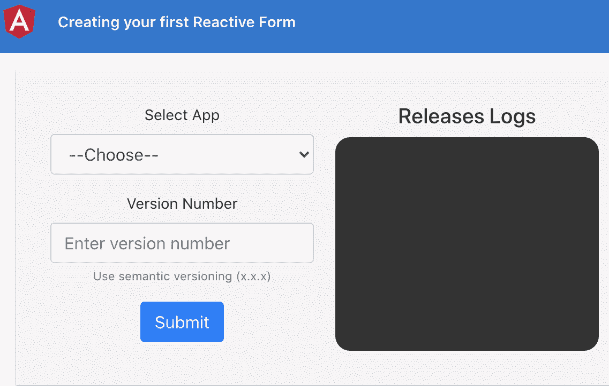

图 8.10 – 响应式表单应用程序在 http://localhost:4200 上运行

现在我们已经在本地运行了应用程序，让我们在下一节中看看这个配方涉及的步骤。

## 如何做…

到目前为止，我们有一个具有 `ReleaseLogsComponent` 的应用程序，它显示了我们创建的一堆发布日志。我们还有 `ReleaseFormComponent`，它通过表单创建发布日志。现在我们需要使用 Reactive forms API 将当前表单变成一个响应式表单。让我们开始吧：

1.  首先，我们需要将 `ReactiveFormsModule` 导入到我们的 `AppModule` 的导入中。让我们通过修改 `app.module.ts` 文件来做到这一点：

```ts
...
import { ReleaseFormComponent } from './components/release-form/release-form.component';
import { ReactiveFormsModule } from '@angular/forms';
@NgModule({
  declarations: [...],
  imports: [
    BrowserModule,
    AppRoutingModule,
    ReactiveFormsModule
  ],
  providers: [],
  bootstrap: [AppComponent]
})
export class AppModule { }
```

1.  让我们现在创建响应式表单。我们将在`ReleaseFormComponent`类中创建一个带有所需控件的`FormGroup`。修改`release-form.component.ts`文件如下：

```ts
...
import { FormControl, FormGroup, Validators } from '@angular/forms';
import { REGEXES } from 'src/app/constants/regexes';
@Component(...)
export class ReleaseFormComponent implements OnInit {
  apps = Object.values(Apps);
  versionInputRegex = REGEXES.SEMANTIC_VERSION;
  releaseForm = new FormGroup({
    app: new FormControl('', [Validators.required]),
    version: new FormControl('', [
      Validators.required,
      Validators.pattern(REGEXES.SEMANTIC_VERSION)
    ]),
  })
  ...
}
```

1.  现在我们已经有了名为`releaseForm`的表单，让我们在模板中使用它来绑定表单。修改`release-form.component.html`文件如下：

```ts
<form [formGroup]="releaseForm">
  ...
</form>
```

1.  太棒了！现在我们已经绑定了表单组，我们还可以绑定单个表单控件，这样当我们最终提交表单时，我们可以获取每个单独表单控件的值。进一步修改`release-form.component.html`文件如下：

```ts
<form [formGroup]="releaseForm">
  <div class="form-group">
    ...
    <select formControlName="app" class="form-control"     id="appName" required>
      ...
    </select>
  </div>
  <div class="form-group">
    ...
    <input formControlName="version" type="text"     class="form-control" id="versionNumber" aria-    describedby="versionHelp" placeholder="Enter     version number">
    <small id="versionHelp" class="form-text     text-muted">Use semantic versioning (x.x.x)</small>
  </div>
  ...
</form>
```

1.  让我们决定当我们提交这个表单时会发生什么。我们将在模板中调用一个名为`formSubmit`的方法，并在表单提交时传递`releaseForm`。修改`release-form.component.html`文件如下：

```ts
<form [formGroup]="releaseForm" (ngSubmit)="formSubmit(releaseForm)">
  ...
</form>
```

1.  `formSubmit`方法目前还不存在。让我们现在在`ReleaseFormComponent`类中创建它。我们还将在控制台上记录该值，并使用`@Output`发射器发射该值。修改`release-form.component.ts`文件如下：

```ts
import { Component, OnInit, Output, EventEmitter } from '@angular/core';
...
import { ReleaseLog } from 'src/app/classes/release-log';
...
@Component(...)
export class ReleaseFormComponent implements OnInit {
  @Output() newReleaseLog = new   EventEmitter<ReleaseLog>();
  apps = Object.values(Apps);
  ...
  formSubmit(form: FormGroup): void {
    const { app, version } = form.value;
    console.log({app, version});
    const newLog: ReleaseLog = new ReleaseLog(app,     version)
    this.newReleaseLog.emit(newLog);
  }
}
```

如果您现在刷新应用程序，填写完表单，然后点击**提交**，您应该在控制台上看到如下日志：

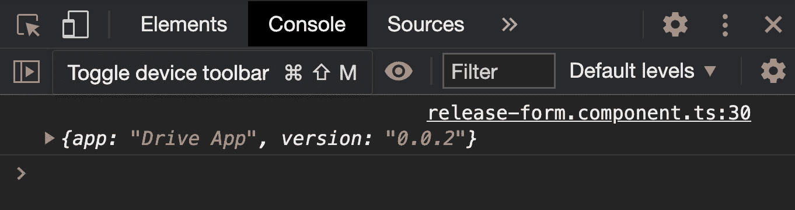

图 8.11 - 显示使用响应式表单提交的值的日志

1.  由于我们通过`newReleaseLog`输出发射器发射了新创建的发布日志的值，我们可以在`version-control.component.html`文件中监听此事件，并相应地添加新日志。让我们修改文件如下：

```ts
<div class="version-control">
  <app-release-form (newReleaseLog)="addNewReleaseLog   ($event)"></app-release-form>
  <app-release-logs [logs]="releaseLogs">  </app-release-logs>
</div>
```

1.  刷新应用程序，您应该看到新的发布日志被添加到发布日志视图中。您还应该在控制台上看到日志，如下面的截图所示：

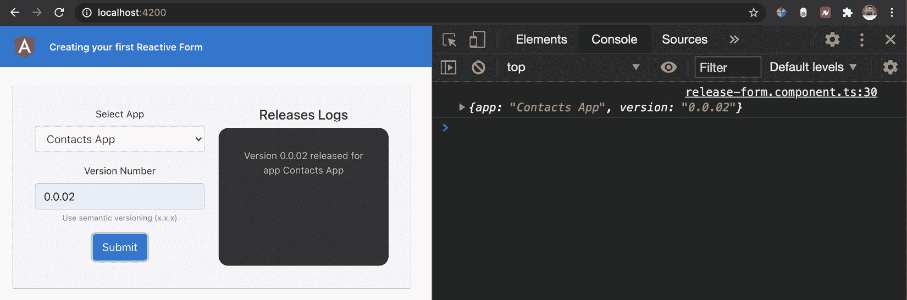

图 8.12 - 在表单提交时添加到日志视图的新日志

太棒了！现在你知道如何使用响应式表单 API 创建基本的响应式表单了。请参考下一节，了解它是如何工作的。

## 它是如何工作的…

该食谱始于我们的 Angular 应用程序中有一个基本的 HTML 表单，没有与之绑定的 Angular 魔法。我们首先在 `AppModule` 中导入了 `ReactiveFormsModule`。如果您正在使用所选编辑器的 Angular 语言服务，当您导入 `ReactiveFormsModule` 到应用程序中并且没有将其与响应式表单绑定时，您可能会看到一个错误，换句话说，没有与 `FormGroup` 绑定。好吧，这就是我们做的。我们使用 `FormGroup` 构造函数创建了一个响应式表单，并使用 `FormControl` 构造函数创建了相关的表单控件。然后，我们监听了 `<form>` 元素上的 `ngSubmit` 事件，以提取 `releaseForm` 的值。完成后，我们使用 `@Ouput()` 命名为 `newReleaseLog` 发射了这个值。请注意，我们还定义了此发射器将发射的值的类型为 `IReleaseLog`；定义这些是一个好习惯。这个发射器是必需的，因为 `ReleaseLogsComponent` 是组件层次结构中 `ReleaseFormComponent` 的兄弟组件。因此，我们通过父组件 `VersionControlComponent` 进行通信。最后，我们在 `VersionControlComponent` 模板中监听 `newReleaseLog` 事件的发射，并通过 `addNewReleaseLog` 方法向 `releaseLogs` 数组添加新日志。并且这个 `releaseLogs` 数组被传递给 `ReleaseLogsComponent`，它会显示所有添加的日志。

## 另请参阅

+   Angular 的响应式表单指南：[`angular.io/guide/reactive-forms`](https://angular.io/guide/reactive-forms)

# 使用响应式表单进行表单验证

在上一篇食谱中，您学会了如何创建一个响应式表单。现在，我们将学习如何测试它们。在这个食谱中，您将学习一些测试响应式表单的基本原则。我们将使用上一篇食谱中的相同示例（发布日志应用程序），并实现多个测试用例。

## 准备工作

我们将要使用的项目位于克隆存储库中的 `chapter08/start_here/validating-reactive-forms` 中：

1.  在 Visual Studio Code 中打开项目。

1.  打开终端并运行 `npm install` 来安装项目的依赖项。

1.  完成后，运行 `ng serve -o`。

这应该会在新的浏览器标签中打开应用程序，您应该会看到它如下所示：

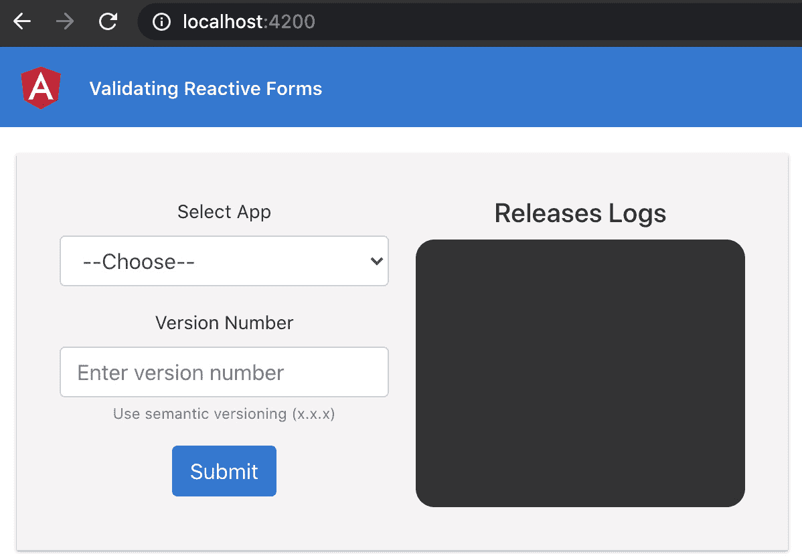

图 8.13 – 在 http://localhost:4200 上运行的验证响应式表单应用程序

现在我们已经在本地运行了应用程序，让我们在下一节中看看这个配方涉及的步骤。

## 如何做...

对于这个配方，我们使用的是已经实现了响应式表单的发布日志应用程序，尽管到目前为止我们还没有任何输入验证。如果你只是选择一个应用程序并提交表单，你会在控制台上看到以下错误：

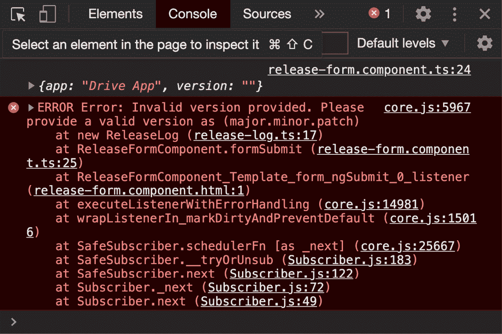

图 8.14 - 在没有表单验证的情况下提交响应式表单应用程序时出错

我们将加入一些表单验证来增强用户体验，并确保表单不能使用无效输入提交。让我们开始：

1.  首先，我们将从`@angular/forms`包中添加一些验证，这些验证是响应式表单 API 的一部分。我们将在两个输入上应用`required`验证器，并在`version`表单控件上应用`pattern`验证器。更新`release-form.component.ts`文件如下：

```ts
import { Component, OnInit, Output, EventEmitter } from '@angular/core';
import { FormControl, FormGroup, Validators } from '@angular/forms';
...
import { REGEXES } from 'src/app/constants/regexes';
@Component({...})
export class ReleaseFormComponent implements OnInit {
  ...
  versionInputRegex = REGEXES.SEMANTIC_VERSION;
  releaseForm = new FormGroup({
    app: new FormControl('', Validators.required),
    version: new FormControl('', [
      Validators.required,
      Validators.pattern(this.versionInputRegex)
    ]),
  })
  ...
}
```

1.  现在我们将在视图中添加提示，以在选择无效输入时向用户显示错误。修改`release-form.component.html`文件如下：

```ts
<form [formGroup]="releaseForm" (ngSubmit)="formSubmit(releaseForm)">
  <div class="form-group">
    <label for="appName">Select App</label>
    <select formControlName="app" class="form-control"     id="appName">
      ...
    </select>
    <div
      [hidden]="releaseForm.get('app').valid ||       releaseForm.get('app').pristine"
      class="alert alert-danger">
      Please choose an app
    </div>
  </div>
  <div class="form-group">
    ...
    <small id="versionHelp" class="form-text     text-muted">Use semantic versioning (x.x.x)</small>
    <div [hidden]="releaseForm.get('version').valid ||     releaseForm.get('version').pristine"
      class="alert alert-danger">
      Please write an appropriate version number
    </div>
  </div>
  <button type="submit" class="btn btn-primary">Submit   </button>
</form>
```

1.  我们还将添加一些样式来以更好的 UI 显示错误。将以下样式添加到`release-form.component.scss`文件中：

```ts
:host {
  /* Error messages */
  .alert {
    margin-top: 16px;
  }
  /* Valid form input */
  .ng-valid:not(form),
  .ng-valid.required {
    border-bottom: 3px solid #259f2b;
  }
  /* Invalid form input */
  .ng-invalid:not(form) {
    border-bottom: 3px solid #c92421;
  }
}
```

刷新应用程序，当输入值错误时，你应该看到带有红色边框的输入。一旦输入或选择无效输入，错误将如下所示：

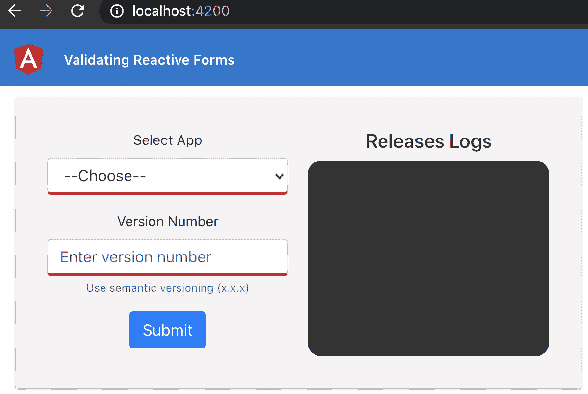

图 8.15 - 显示无效输入值的红色边框

1.  最后，让我们围绕表单提交进行验证。如果输入无效，我们将禁用**提交**按钮。让我们修改`release-form.component.html`模板如下：

```ts
<form [formGroup]="releaseForm" (ngSubmit)="formSubmit(releaseForm)">
  <div class="form-group">
    ...
  </div>
  <div class="form-group">
    ...
  </div>
  <button type="submit" [disabled]="releaseForm.invalid"   class="btn btn-primary">Submit</button>
</form>
```

如果现在刷新应用程序，你会看到只要一个或多个输入无效，提交按钮就会被禁用。

这就结束了这个配方。让我们看看下一节，看看它是如何工作的。

## 它是如何工作的...

我们通过添加验证器开始了这个教程，Angular 已经提供了一堆验证器，包括`Validators.email`、`Validators.pattern`和`Validators.required`。我们在教程中分别为应用程序名称和版本的输入使用了`required`验证器和`pattern`验证器。之后，为了显示无效输入的提示/错误，我们添加了一些条件样式，以在输入上显示底部边框。我们还添加了一些`<div>`元素，带有`class="alert alert-danger"`，这些基本上是 Bootstrap 警报，用于显示表单控件的无效值的错误。请注意，我们使用以下模式来隐藏错误元素：

```ts
[hidden]="releaseForm.get(CONTROL_NAME).valid || releaseForm.get(CONTROL_NAME).pristine"
```

我们使用`.pristine`条件来确保一旦用户选择了正确的输入并修改了输入，我们再次隐藏错误，以便在用户输入或进行其他选择时不显示错误。最后，我们确保即使表单控件的值无效，表单也无法提交。我们使用`[disabled]="releaseForm.invalid"`来禁用提交按钮。

## 另见

+   Angular 验证响应式表单的文档：[`angular.io/guide/reactive-forms#validating-form-input`](https://angular.io/guide/reactive-forms#validating-form-input)

# 创建一个异步验证器函数

在 Angular 中，表单验证非常简单，原因在于 Angular 提供了超级棒的验证器。这些验证器是同步的，意味着一旦您更改输入，验证器就会启动并立即提供有关值有效性的信息。但有时，您可能会依赖于后端 API 的一些验证。这些情况需要一种称为异步验证器的东西。在本教程中，您将创建您的第一个异步验证器。

## 准备工作

我们将要使用的项目位于克隆存储库中的`chapter08/start_here/asynchronous-validator`中：

1.  在 Visual Studio Code 中打开项目。

1.  打开终端并运行`npm install`以安装项目的依赖项。

1.  完成后，运行`ng serve -o`。

这将在新的浏览器选项卡中打开应用程序，您应该看到类似以下内容的内容：

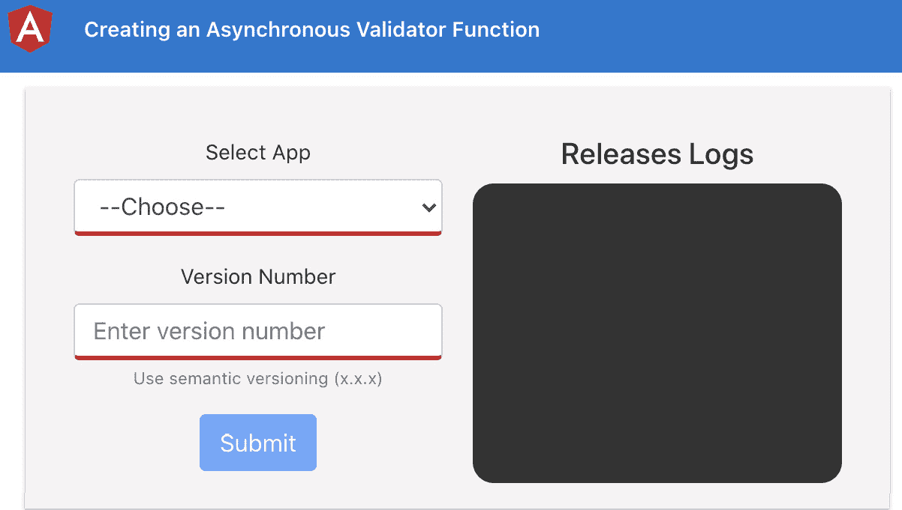

图 8.16 - 异步验证器应用程序在 http://localhost:4200 上运行

现在我们的应用程序正在运行，让我们在下一节中看看这个配方涉及的步骤。

如何做到...

我们已经在发布日志应用程序中设置了一些内容。我们在`src/assets`文件夹中有一个`data.json`文件，其中包含发布日志的每个目标应用程序的版本。我们将创建一个异步验证器，以确保每个应用程序的新版本都比`data.json`文件中指定的版本大。让我们开始：

1.  首先，我们将为该配方创建异步验证器函数。让我们在`version.service.ts`文件的`VersionService`类中创建一个名为`versionValidator`的方法，如下所示：

```ts
...
import { compareVersion } from 'src/app/utils';
import { AbstractControl, AsyncValidatorFn, ValidationErrors } from '@angular/forms';
import { Observable, of } from 'rxjs';
@Injectable({...})
export class VersionService {
  ...
  versionValidator(appNameControl: AbstractControl):   AsyncValidatorFn {
    // code here
  }
  ...
}
```

1.  现在我们将定义验证器函数的内容。让我们修改`versionValidator`方法如下：

```ts
versionValidator(appNameControl: AbstractControl): AsyncValidatorFn {
  return (control: AbstractControl):   Observable<ValidationErrors> => {
  // if we don't have an app selected, do not validate
  if (!appNameControl.value) {
    return of(null);
  }
  return this.getVersionLog().pipe(
    map(vLog => {
      const newVersion = control.value;
      const previousVersion = vLog[appNameControl.value];
      // check if the new version is greater than          previous version
      return compareVersion(newVersion, previousVersion)       === 1 ? null : {
        newVersionRequired: previousVersion
      };
    }))
  }
}
```

1.  现在我们已经有了验证器函数，让我们将其添加到版本号的表单控件中。修改`release-form.component.ts`文件如下：

```ts
import { Component, OnInit, Output, EventEmitter } from '@angular/core';
import { FormControl, FormGroup, Validators } from '@angular/forms';
import { IReleaseLog, ReleaseLog } from 'src/app/classes/release-log';
import { Apps } from 'src/app/constants/apps';
import { REGEXES } from 'src/app/constants/regexes';
import { VersionService } from 'src/app/core/services/version.service';
@Component({...})
export class ReleaseFormComponent implements OnInit {
  ...
  constructor(private versionService: VersionService) { }
  ngOnInit(): void {
    this.releaseForm.get('version')    .setAsyncValidators(
      this.versionService.versionValidator(
        this.releaseForm.get('app')
      )
    )
  }
  ...
}
```

1.  现在我们将使用验证器来增强表单的用户体验，修改`release-form.component.html`文件。为了方便使用，让我们使用`*ngIf`指令将内容包装在`<ng-container>`元素中，并在模板中创建一个变量用于版本表单控件，如下所示：

```ts
<form [formGroup]="releaseForm" (ngSubmit)="formSubmit(releaseForm)">
  <ng-container *ngIf="releaseForm.get('version')   as versionControl">
    <div class="form-group">
      ...
    </div>
    <div class="form-group">
      ...
    </div>
    <button type="submit" [disabled]="releaseForm.    invalid" class="btn btn-primary">Submit</button>
  </ng-container>
</form>
```

1.  现在让我们添加错误消息。我们将使用我们的自定义错误`newVersionRequired`，从验证器函数中显示错误，当指定的版本不比先前的版本更新时。修改`release-form.component.html`文件如下：

```ts
<form [formGroup]="releaseForm" (ngSubmit)="formSubmit(releaseForm)">
  <ng-container *ngIf="releaseForm.get('version')   as versionControl">
    <div class="form-group">
      ...
    </div>
    <div class="form-group">
      <label for="versionNumber">Version Number</label>
      <input formControlName="version" type="text"       class="form-control" id="versionNumber"       aria-describedby="versionHelp" placeholder="Enter       version number">
      ...
      <div *ngIf="(versionControl.      getError('newVersionRequired') &&       !versionControl.pristine)"
        class="alert alert-danger">
        The version number should be greater         than the last version '{{versionControl.        errors['newVersionRequired']}}'
      </div>
    </div>
    <button [disabled]="releaseForm.invalid"     class="btn btn-primary">Submit</button>
  </ng-container>
</form>
```

尝试选择一个应用程序并添加一个较低的版本号，现在您应该看到以下错误：

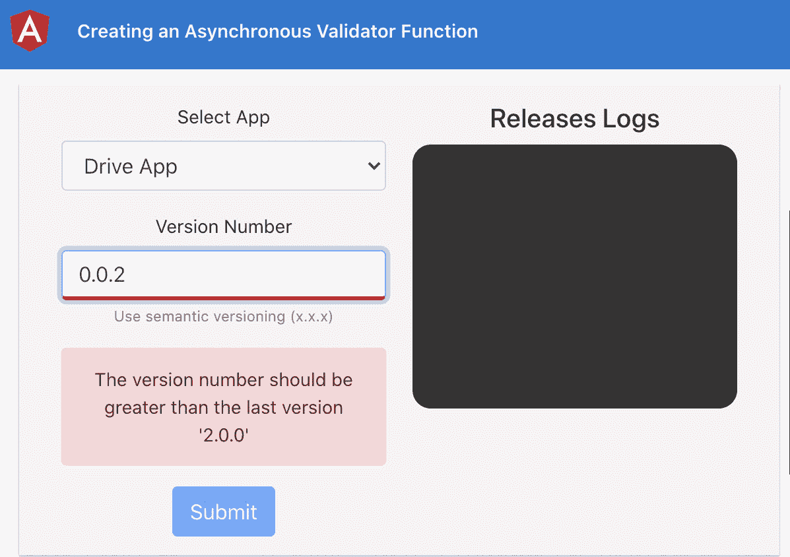

图 8.17 - 提供较低版本号时显示的错误

1.  目前的一个问题是，我们能够在异步验证进行时提交表单。这是因为 Angular 默认情况下会将错误标记为`null`，直到验证完成。为了解决这个问题，我们可以在模板中显示一个加载消息，而不是**提交**按钮。修改`release-form.component.html`文件如下：

```ts
<form [formGroup]="releaseForm" (ngSubmit)="formSubmit(releaseForm)">
  <ng-container *ngIf="releaseForm.get('version')   as versionControl">
    <div class="form-group">
      ...
    </div>
    <div class="form-group">
      ...
    </div>
    <button *ngIf="versionControl.status     !== 'PENDING'; else loader" type="submit"     [disabled]="releaseForm.invalid" class="btn      btn-primary">Submit</button>
  </ng-container>
  <ng-template #loader>
    Please wait...
  </ng-template>
</form>
```

如果您刷新应用程序，选择一个应用程序，并输入一个有效的版本号，您应该看到以下**请稍候...**消息：

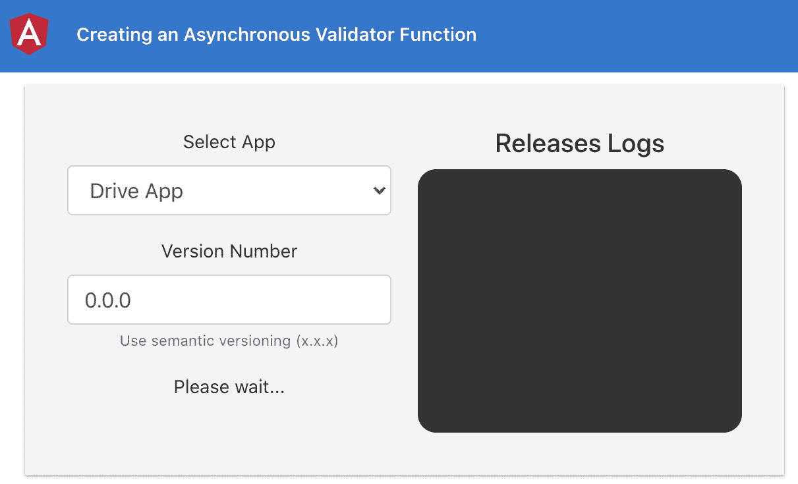

图 8.18 - 异步验证进行时的加载消息

1.  我们仍然有一个问题，即用户可以快速输入并按*Enter*提交表单。为了防止这种情况发生，让我们在`release-form.component.ts`文件的`formSubmit`方法中添加一个检查，如下所示：

```ts
  formSubmit(form: FormGroup): void {
    if (form.get('version').status === 'PENDING') {
      return;
    }
    const { app, version } = form.value;
    ...
  }
```

1.  最后，我们还有另一个问题要处理。如果我们选择了一个有效的版本号并更改了应用程序，尽管逻辑上是错误的，我们仍然可以提交带有输入版本号的表单。为了处理这个问题，我们应该在`'app'`表单控件的值发生变化时更新`'version'`表单控件的验证。为此，请按照以下方式修改`release-form.component.ts`文件：

```ts
import { Component, OnInit, Output, EventEmitter, OnDestroy } from '@angular/core';
...
import { takeWhile } from 'rxjs/operators';
...
@Component({...})
export class ReleaseFormComponent implements OnInit, OnDestroy {
  @Output() newReleaseLog = new   EventEmitter<IReleaseLog>();
  isComponentAlive = false;
  apps = Object.values(Apps);
  ...
  ngOnInit(): void {
    this.isComponentAlive = true;
    this.releaseForm.get     ('version').setAsyncValidators(...)
    this.releaseForm.get('app').valueChanges
      .pipe(takeWhile(() => this.isComponentAlive))
      .subscribe(() => {
        this.releaseForm.get         ('version').updateValueAndValidity();
      })
  }
  ngOnDestroy() {
    this.isComponentAlive = false;
  }
  ...
}
```

很棒！现在你知道如何在 Angular 中为响应式表单创建异步验证器函数了。既然你已经完成了这个示例，请参考下一节，看看它是如何工作的。

## 它是如何工作的...

Angular 提供了一种非常简单的方法来创建异步验证器函数，它们也非常方便。在这个示例中，我们首先创建了名为`versionValidator`的验证器函数。请注意，我们为验证器函数命名了一个名为`appNameControl`的参数。这是因为我们想要获取正在验证版本号的应用程序名称。还要注意，我们将返回类型设置为`AsyncValidatorFn`，这是 Angular 所要求的。验证器函数应该返回一个`AsyncValidatorFn`，这意味着它将返回一个函数（让我们称之为**内部函数**），该函数接收一个`AbstractControl`并返回一个`ValidatorErrors`的`Observable`。在内部函数中，我们使用`VersionService`的`getVersionLog()`方法，使用`HttpClient`服务获取`data.json`文件。一旦我们从`data.json`中获取了特定应用程序的版本，我们就将表单中输入的版本与`data.json`中的值进行比较，以验证输入。请注意，我们并不只是返回一个`ValidationErrors`对象，其中`newVersionRequired`属性设置为`true`，而是实际上将其设置为`previousVersion`，以便稍后向用户显示。

创建验证器函数后，我们通过在`ReleaseFormComponent`类中使用`FormControl.setAsyncValidators()`方法将其附加到版本名称的表单控件上。然后我们在模板中使用名为`newVersionRequired`的验证错误来显示错误消息，以及来自`data.json`文件的版本。

我们还需要处理这样一种情况，即在验证进行中，表单控件在验证完成之前是有效的。这使我们能够在版本名称的验证正在进行时提交表单。我们通过检查`FormControl.status`的值是否为`'PENDING'`来处理这个问题，在这种情况下，我们隐藏提交按钮，并在此期间显示**请等待…**消息。请注意，我们还在`ReleaseFormComponent`类的`formSubmit`方法中添加了一些逻辑，以检查版本号的`FormControl.status`是否为`'PENDING'`，在这种情况下，我们只需执行`return;`。

食谱中的另一个有趣之处是，如果我们添加了一个有效的版本号并更改了应用程序，我们仍然可以提交表单。我们通过向`'app'`表单控件的`.valueChanges`添加订阅来处理这个问题，因此每当这种情况发生时，我们使用`.updateValueAndValidity()`方法在`'version'`表单控件上触发另一个验证。

## 参见

+   AsyncValidator Angular 文档：[`angular.io/api/forms/AsyncValidator#provide-a-custom-async-validator-directive`](https://angular.io/api/forms/AsyncValidator#provide-a-custom-async-validator-directive)

# 测试响应式表单

为了确保我们为最终用户构建健壮且无错误的表单，围绕您的表单编写测试是一个非常好的主意。这使得代码更具弹性，更不容易出错。在这个食谱中，您将学习如何使用单元测试测试您的模板驱动表单。

## 做好准备

此处的项目位于`chapter08/start_here/testing-reactive-forms`：

1.  在 Visual Studio Code 中打开项目。

1.  打开终端并运行`npm install`来安装项目的依赖项。

1.  完成后，运行`ng serve -o`。

这应该在新的浏览器标签中打开应用程序，您应该看到应用程序如下：

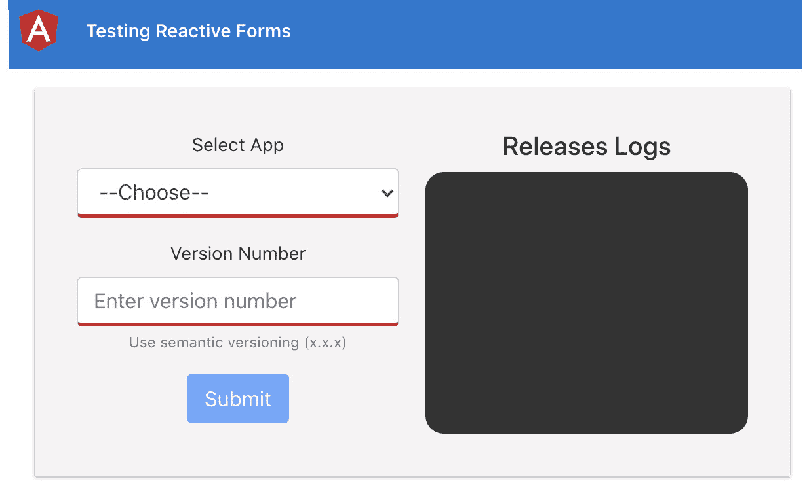

图 8.19 - 在 http://localhost:4200 上运行的测试响应式表单应用程序

现在我们的应用程序在本地运行，让我们在下一节中看看这个食谱涉及的步骤。

## 如何做…

我们有一个使用一些验证实现的响应式表单的 Release Logs 应用程序。在这个食谱中，我们将为表单实现一些测试。让我们开始吧：

1.  首先，在单独的终端窗口中运行以下命令来运行单元测试：

```ts
yarn test
```

运行命令后，你应该看到一个新的 Chrome 窗口实例被打开，运行测试如下：

![图 8.20 - 单元测试与 Karma 和 Jasmine 在自动化 Chrome 窗口中运行

图 8.20 - 单元测试与 Karma 和 Jasmine 在自动化 Chrome 窗口中运行

图 8.20 - 单元测试与 Karma 和 Jasmine 在自动化 Chrome 窗口中运行

1.  让我们为所有输入都有有效值的情况添加第一个测试。在这种情况下，我们应该提交表单，并通过`newReleaseLog`输出的发射器发出表单的值。修改`release-form.component.spec.ts`文件如下：

```ts
import { ComponentFixture, TestBed } from '@angular/core/testing';
import { ReleaseLog } from 'src/app/classes/release-log';
...
describe('ReleaseFormComponent', () => {
  ...
  it('should submit a new release log with the correct   input values', (() => {
    const app = component.apps[2];
    const version = '2.2.2';
    const expectedReleaseLog = new ReleaseLog(app,     version);
    spyOn(component.newReleaseLog, 'emit');
    component.releaseForm.setValue({ app, version });
    component.formSubmit(component.releaseForm);
    expect(component.newReleaseLog.emit)    .toHaveBeenCalledWith(expectedReleaseLog);
  }));
});
```

如果你现在查看测试，你应该看到新的测试通过如下：

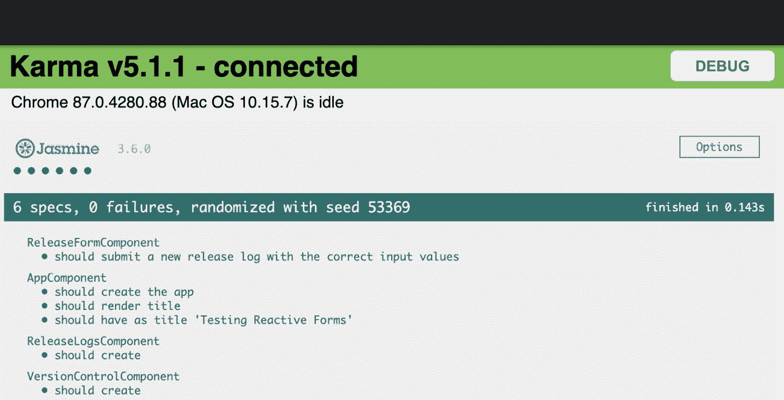

![图 8.21 - 成功输入的测试用例通过

1.  让我们为表单中提供了不正确版本的情况添加一个测试。**提交**按钮应该被禁用，并且`formSubmit`方法应该抛出错误。在你的`release-form.component.spec.ts`文件中添加一个新的测试，如下所示： 

```ts
...
describe('ReleaseFormComponent', () => {
  ...
  it('should throw an error for a new release log with   the incorrect version values', (() => {
    const submitButton = fixture.nativeElement.    querySelector('button[type="submit"]');
    const app = component.apps[2];
    const version = 'x.x.x';
    spyOn(component.newReleaseLog, 'emit');
    const expectedError = 'Invalid version provided.     Please provide a valid version as (major.minor.    patch)';
    component.releaseForm.setValue({ app, version });
    expect(() => component.formSubmit(component.    releaseForm))
      .toThrowError(expectedError);
    expect(submitButton.hasAttribute(    'disabled')).toBe(true);
    expect(component.newReleaseLog.emit     ).not.toHaveBeenCalled();
  }));
});
```

1.  让我们添加我们的最终测试，确保当我们没有为发布日志选择应用程序时，**提交**按钮被禁用。在`release-form.component.spec.ts`文件中添加一个新的测试，如下所示：

```ts
...
describe('ReleaseFormComponent', () => {
  ...
  it('should disable the submit button when we   don\'t have an app selected', (() => {
    const submitButton = fixture.nativeElement.    querySelector('button[type="submit"]');
    spyOn(component.newReleaseLog, 'emit');
    const app = '';
    const version = '2.2.2';
    component.releaseForm.setValue({ app, version });
    submitButton.click();
    fixture.detectChanges();
    expect(submitButton.hasAttribute(    'disabled')).toBe(true);
    expect(component.newReleaseLog.emit     ).not.toHaveBeenCalled();
  }));
});
```

如果你查看 Karma 测试窗口，你应该看到所有新的测试都通过了如下：

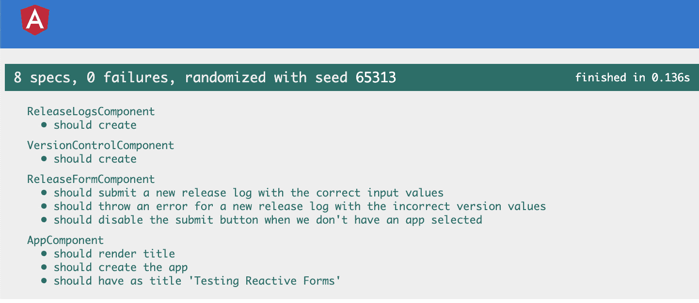

![图 8.22 - 所有测试用例通过了食谱

太棒了！现在你知道如何为响应式表单编写一些基本的测试了。请参考下一节，了解它是如何工作的。

## 它是如何工作的...

测试响应式表单甚至不需要在 Angular 10 中将`ReactiveFormsModule`导入测试模块。对于我们食谱中的所有测试，我们都对`ReleaseFormComponent`类中定义的`newReleaseLog`发射器的`emit`事件进行了监听。这是因为我们知道当输入正确时，用户应该能够单击**提交**按钮，因此在`formSubmit`方法内，将调用`newReleaseLog`发射器的`emit`方法。对于涵盖`'version'`表单控件有效性的测试，我们依赖于`formSubmit`抛出错误。这是因为我们知道无效的版本将在创建新的发布日志时导致`ReleaseLog`类的`constructor`中出错。在这个测试中有一个有趣的地方是我们使用了以下代码：

```ts
expect(() => component.formSubmit(component.releaseForm))
      .toThrowError(expectedError);
```

有趣的是，我们需要自己调用`formSubmit`方法来调用`releaseForm`。我们不能只写`expect(component.formSubmit(component.releaseForm)).toThrowError(expectedError);`，因为那样会直接调用函数并导致错误。所以我们需要在这里传递一个匿名函数，Jasmine 会调用这个匿名函数，并期望这个匿名函数抛出一个错误。最后，我们通过在`fixture.nativeElement`上使用`querySelector`来获取按钮，然后使用`submitButton.hasAttribute('disabled')`来检查**提交**按钮上的`disabled`属性，确保我们的**提交**按钮是启用还是禁用。

## 另请参阅

+   测试响应式表单：[`angular.io/guide/forms-overview#testing-reactive-forms`](https://angular.io/guide/forms-overview#testing-reactive-forms)

# 使用反弹与响应式表单控件

如果您正在构建一个中到大型规模的 Angular 应用程序，并使用响应式表单，那么您肯定会遇到一种情况，您可能希望在响应式表单上使用反弹。这可能是出于性能原因，或者为了节省 HTTP 调用。因此，在这个示例中，您将学习如何在响应式表单控件上使用反弹。

## 准备工作

我们要处理的项目位于克隆存储库中的`chapter08/start_here/using-debounce-with-rfc`中：

1.  在 Visual Studio Code 中打开项目。

1.  打开终端并运行`npm install`以安装项目的依赖项。

1.  完成后，运行`ng serve -o`。

这将在新的浏览器选项卡中打开应用程序，并且您应该看到如下所示：

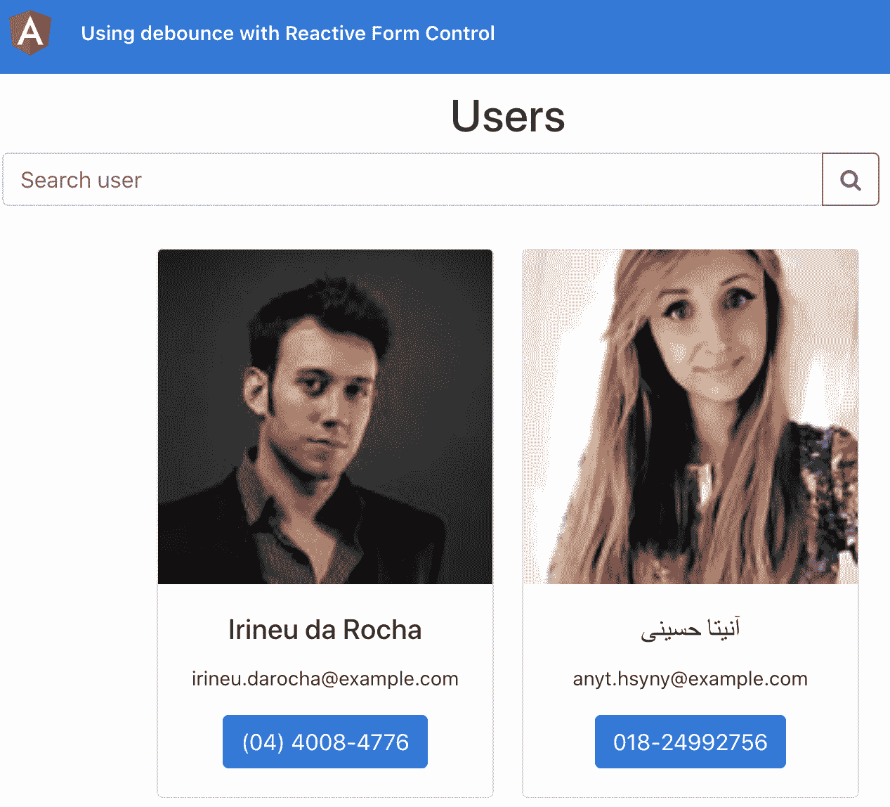

图 8.23 - 使用反弹与响应式表单控件应用程序正在 http://localhost:4200 上运行

现在，您会注意到每输入一个字符，我们就会向 API 发送一个新的 HTTP 请求，如下所示：

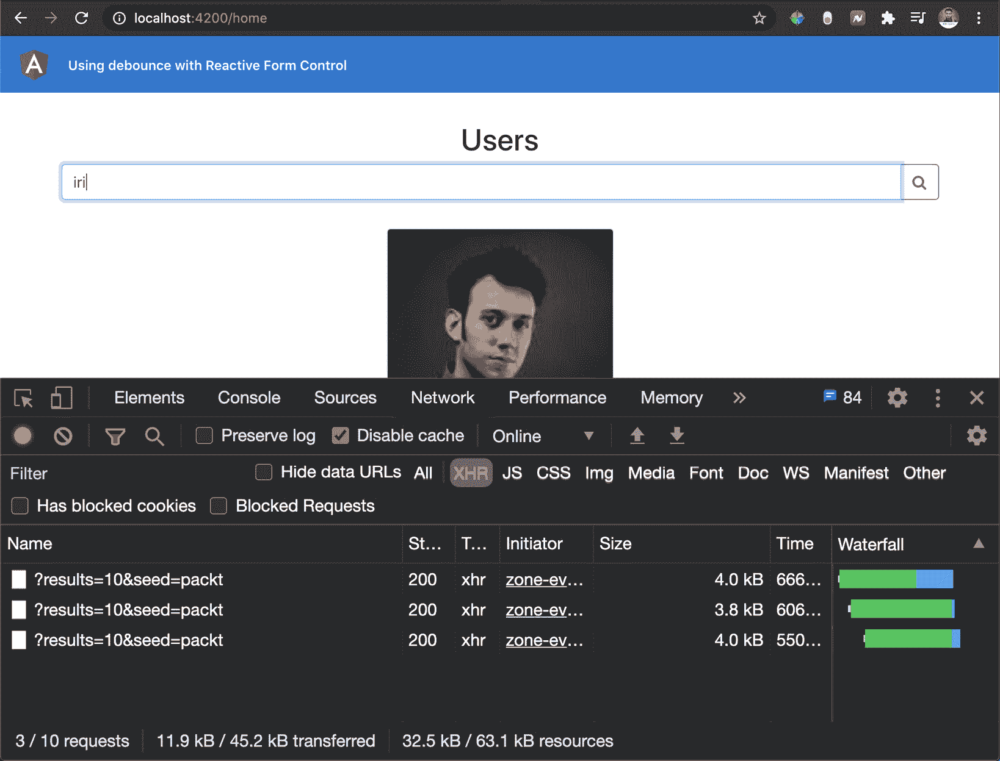

图 8.24 - 在输入时发送的多个 HTTP 调用

现在我们的应用程序在本地运行，让我们在下一节中看看这个示例涉及的步骤。

## 如何做…

对于这个示例，我们使用一个使用 RandomUser.me API 获取用户的应用程序。如*图 8.24*所示，我们在输入变化时发送新的 HTTP 调用。让我们开始避免这样做的示例：

1.  将防抖功能添加到表单中非常容易。让我们在`home.component.ts`文件中使用`debounceTime`操作符，如下所示：

```ts
...
import { debounceTime, takeWhile } from 'rxjs/operators';
@Component({...})
export class HomeComponent implements OnInit, OnDestroy {
  searchDebounceTime = 300;
  ...
  ngOnInit() {
    ...
    this.searchUsers();
    this.searchForm.get('username').valueChanges
      .pipe(
        debounceTime(this.searchDebounceTime),
        takeWhile(() => !!this.componentAlive)
      )
      .subscribe(() => {
        this.searchUsers();
      })
  }
}
```

嗯，有趣的是，就任务而言，这就是本节的全部内容。但我确实希望能给您带来更多。因此，我们将编写一些有趣的测试。

1.  现在我们将添加一个测试，以确保在`searchDebounceTime`过去之前不会调用我们的`searchUsers`方法。在`home.component.spec.ts`文件中添加以下测试：

```ts
import { HttpClientModule } from '@angular/common/http';
import { waitForAsync, ComponentFixture, discardPeriodicTasks, fakeAsync, TestBed, tick } from '@angular/core/testing';
import { HomeComponent } from './home.component';
describe('HomeComponent', () => {
  ...
  it('should not send an http request before the   debounceTime of 300ms', fakeAsync(async () => {
    spyOn(component, 'searchUsers');
    component.searchForm.get(    'username').setValue('iri');
    tick(component.searchDebounceTime - 10);     // less than desired debounce time
    expect(component.searchUsers     ).not.toHaveBeenCalled();
    discardPeriodicTasks();
  }));
});
```

1.  现在我们将为`searchDebounceTime`过去并且应该已调用`searchUsers()`方法的情况添加一个测试。在`home.component.spec.ts`文件中添加以下新测试：

```ts
...
describe('HomeComponent', () => {
  ...
  it('should send an http request after the debounceTime   of 300ms', fakeAsync(async () => {
    spyOn(component, 'searchUsers');
    component.searchForm.get(    'username').setValue('iri');
    tick(component.searchDebounceTime + 10); // more     than desired debounce time
    expect(component.searchUsers     ).toHaveBeenCalled();
    discardPeriodicTasks();
  }));
});
```

如果刷新 Karma 测试 Chrome 窗口，您将看到所有测试都通过了，如下所示：

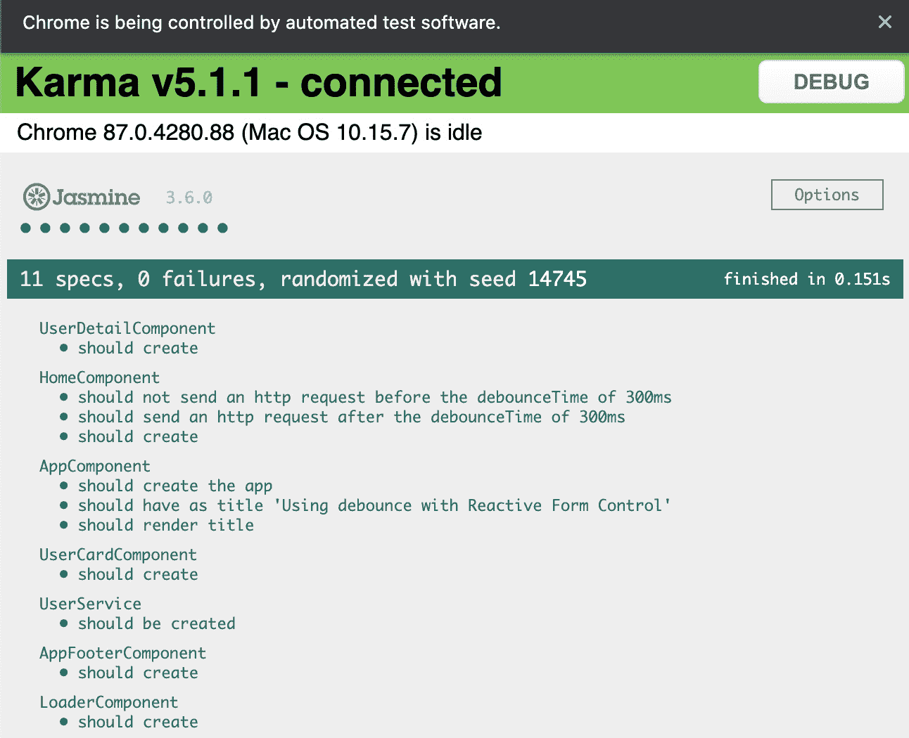

图 8.25 - 本节所有测试都通过

1.  现在，运行`npm start`命令再次启动应用程序。然后，在输入到搜索框时监视网络调用。您会看到`debounceTime`操作符在您停止输入 300 毫秒后只调用 1 次，如下截图所示：

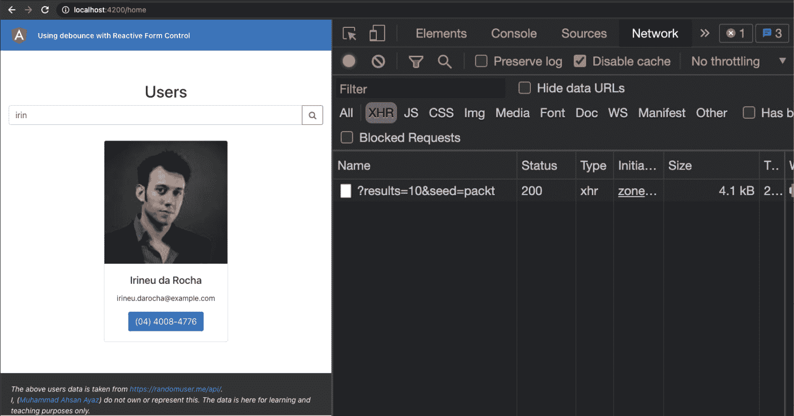

图 8.26 - 在 300 毫秒防抖后仅发送一个网络调用

太棒了！现在，您知道如何在响应式表单控件中使用防抖，以及如何编写测试来检查防抖是否正常工作。这就结束了本节。让我们参考下一节，看看它是如何工作的。

## 工作原理…

本节的主要任务非常简单。我们只是从`rxjs`包中使用了`debounceTime`操作符，并将其与我们的响应式表单控件的`.valueChanges` Observable 一起使用。由于我们在`.subscribe()`方法之前在`.pipe()`操作符中使用它，所以每当我们改变输入的值，无论是输入值还是按下退格键，它都会根据`searchDebounceTime`属性等待`300ms`，然后调用`searchUsers()`方法。

我们还在这个食谱中编写了一些测试。请注意，我们对`searchUsers()`方法进行了间谍，因为每当我们更改`'username'`表单控件的值时，它就应该被调用。我们将测试函数包装在`fakeAsync`方法中，这样我们就可以控制测试中用例的异步行为。然后我们使用`FormControl.setValue()`方法设置表单控件的值，这应该在经过`searchDebounceTime`的时间后触发作为`.subscribe()`方法参数提供的方法。然后我们使用`tick()`方法和`searchDebounceTime`的值，这样就模拟了时间的异步流逝。然后我们编写我们的`expect()`块来检查`searchUsers()`方法是否应该被调用。最后，在测试结束时，我们使用`discardPeriodicTasks()`方法。我们使用这个方法是为了避免出现`Error: 1 periodic timer(s) still in the queue.`错误，以及我们的测试工作。

## 另请参阅

+   RxJS DebounceTime 操作符：[`rxjs-dev.firebaseapp.com/api/operators/debounceTime`](https://rxjs-dev.firebaseapp.com/api/operators/debounceTime)

# 使用 ControlValueAccessor 编写自定义表单控件

Angular 表单很棒。虽然它们支持默认的 HTML 标签，如 input、textarea 等，但有时，您可能希望定义自己的组件，以从用户那里获取值。如果这些输入的变量是您已经在使用的 Angular 表单的一部分，那就太好了。

在这个食谱中，您将学习如何使用 ControlValueAccessor API 创建自己的自定义表单控件，这样您就可以在模板驱动表单和响应式表单中使用表单控件。

## 准备工作

这个食谱的项目位于`chapter08/start_here/custom-form-control`中：

1.  在 Visual Studio Code 中打开项目。

1.  打开终端并运行`npm install`以安装项目的依赖项。

1.  完成后，运行`ng serve -o`。

这应该会在新的浏览器标签中打开应用程序，您应该会看到以下视图：

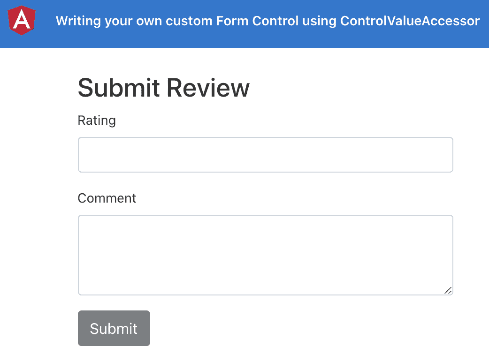

图 8.27 - 自定义表单控件应用程序在 http://localhost:4200 上运行

现在我们的应用程序在本地运行，让我们在下一节中看看这个食谱涉及的步骤。

## 如何做…

我们有一个简单的 Angular 应用。它有两个输入和一个**提交**按钮。输入用于评论，要求用户为这个虚构物品的评分和任何评论提供价值。我们将使用 ControlValueAccessor API 将评分输入转换为自定义表单控件。让我们开始吧：

1.  让我们为我们的自定义表单控件创建一个组件。在项目根目录中打开终端并运行以下命令：

```ts
ng g c components/rating
```

1.  现在我们将为评分组件创建星星 UI。修改`rating.component.html`文件如下：

```ts
<div class="rating">
  <div
    class="rating__star"
    [ngClass]="{'rating__star--active': (
      (!isMouseOver && value  >= star) ||
      (isMouseOver && hoveredRating  >= star)
    )}"
    (mouseenter)="onRatingMouseEnter(star)"
    (mouseleave)="onRatingMouseLeave()"
    (click)="selectRating(star)"
    *ngFor="let star of [1, 2, 3, 4, 5]; let i = index;">
    <i class="fa fa-star"></i>
  </div>
</div>
```

1.  在`rating.component.scss`文件中为评分组件添加样式如下：

```ts
.rating {
  display: flex;
  margin-bottom: 10px;
  &__star {
    cursor: pointer;
    color: grey;
    padding: 0 6px;
    &:first-child {
      padding-left: 0;
    }
    &:last-child {
      padding-right: 0;
    }
    &--active {
      color: orange;
    }
  }
}
```

1.  我们还需要修改`RatingComponent`类来引入必要的方法和属性。让我们修改`rating.component.ts`文件如下：

```ts
...
export class RatingComponent implements OnInit {
  value = 2;
  hoveredRating = 2;
  isMouseOver = false;

  ...
  onRatingMouseEnter(rating: number) {
    this.hoveredRating = rating;
    this.isMouseOver = true;
  }
  onRatingMouseLeave() {
    this.hoveredRating = null;
    this.isMouseOver = false;
  }
  selectRating(rating: number) {
    this.value = rating;
  }
}
```

1.  现在我们需要在`home.component.html`文件中使用这个评分组件而不是已有的输入。修改文件如下：

```ts
<div class="home">
  <div class="review-container">
    ...
    <form class="input-container" [formGroup]=    "reviewForm" (ngSubmit)="submitReview(reviewForm)">
      <div class="mb-3">
        <label for="ratingInput" class="form-        label">Rating</label>
        <app-rating formControlName="rating">        </app-rating>
      </div>
      <div class="mb-3">
        ...
      </div>
      <button id="submitBtn" [disabled]="reviewForm.      invalid" class="btn btn-dark" type="submit">      Submit</button>
    </form>
  </div>
</div>
```

如果现在刷新应用并悬停在星星上，你会看到颜色随着悬停而改变。选定的评分也会被突出显示如下：

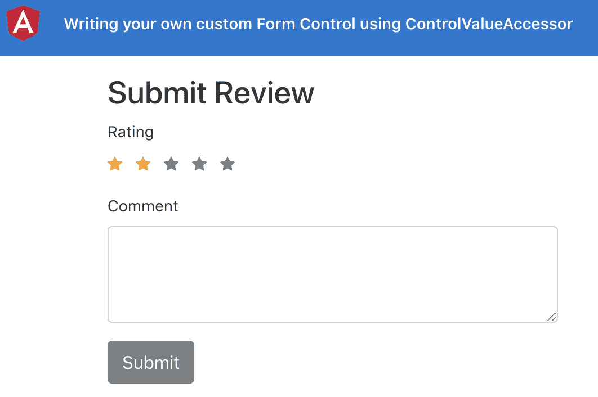

图 8.28 - 悬停在星星上的评分组件

1.  现在让我们为我们的评分组件实现`ControlValueAccessor`接口。它需要实现一些方法，我们将从`onChange()`和`onTouched()`方法开始。修改`rating.component.ts`文件如下：

```ts
import { Component, OnInit } from '@angular/core';
import { ControlValueAccessor } from '@angular/forms';
@Component({...})
export class RatingComponent implements OnInit, ControlValueAccessor {
  ...
  constructor() { }
  onChange: any = () => { };
  onTouched: any = () => { };
  ngOnInit(): void {
  }
  ...
  registerOnChange(fn: any){
    this.onChange = fn;
  }
  registerOnTouched(fn: any) {
    this.onTouched = fn;
  }
}
```

1.  我们现在将添加必要的方法来在需要时禁用输入并设置表单控件的值，换句话说，`setDisabledState()`和`writeValue()`方法。我们还将在`RatingComponent`类中添加`disabled`和`value`属性如下：

```ts
import { Component, Input, OnInit } from '@angular/core';
import { ControlValueAccessor } from '@angular/forms';
@Component({...})
export class RatingComponent implements OnInit, ControlValueAccessor {
  ...
  isMouseOver = false;
  @Input() disabled = false;
  constructor() { }
  ...
  setDisabledState(isDisabled: boolean): void {
    this.disabled = isDisabled;
  }
  writeValue(value: number) {
    this.value = value;
  }
}
```

1.  需要使用`disabled`属性来防止在其值为`true`时进行任何 UI 更改。`value`变量的值也不应该被更新。修改`rating.component.ts`文件如下：

```ts
...
@Component({...})
export class RatingComponent implements OnInit, ControlValueAccessor {
  ...
  isMouseOver = false;
  @Input() disabled = true;
  ...

  onRatingMouseEnter(rating: number) {
    if (this.disabled) return;
    this.hoveredRating = rating;
    this.isMouseOver = true;
  }
  ...
  selectRating(rating: number) {
    if (this.disabled) return;
    this.value = rating;
  }
  ...
}
```

1.  让我们确保将`value`变量的值发送到`ControlValueAccessor`，因为这是我们以后要访问的内容。同时，让我们将`disabled`属性设置回`false`。修改`RatingComponent`类中的`selectRating`方法如下：

```ts
...
@Component({...})
export class RatingComponent implements OnInit, ControlValueAccessor {
  ...
  @Input() disabled = false;
  constructor() { }
  ...
  selectRating(rating: number) {
    if (this.disabled) return;
    this.value = rating;
    this.onChange(rating);
  }
  ...
}
```

1.  我们需要告诉 Angular，我们的`RatingComponent`类有一个值访问器，否则在`<app-rating>`元素上使用`formControlName`属性会抛出错误。让我们向`RatingComponent`类的装饰器添加一个`NG_VALUE_ACCESSOR`提供者，如下所示：

```ts
import { Component, forwardRef, Input, OnInit } from '@angular/core';
import { ControlValueAccessor, NG_VALUE_ACCESSOR } from '@angular/forms';
@Component({
  selector: 'app-rating',
  templateUrl: './rating.component.html',
  styleUrls: ['./rating.component.scss'],
  providers: [{
    provide: NG_VALUE_ACCESSOR,
    useExisting: forwardRef(() => RatingComponent),
    multi: true
  }]
})
export class RatingComponent implements OnInit, ControlValueAccessor {
  ...
}
```

如果现在刷新应用程序，选择一个评分，然后点击**提交**按钮，你应该看到以下值被记录：

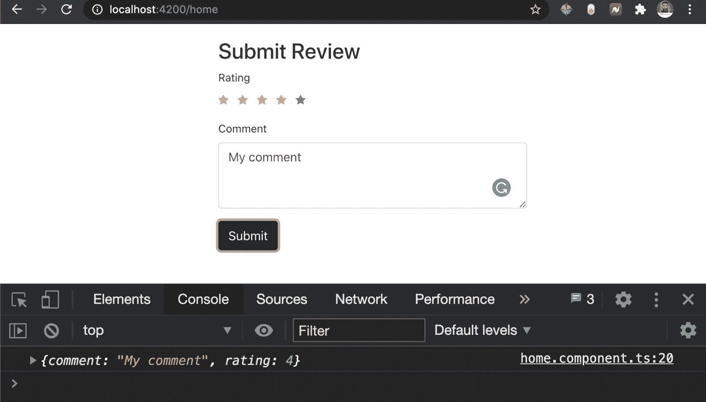

图 8.29-使用自定义表单控件记录的表单值

看吧！你刚刚学会了如何使用`ControlValueAccessor`创建自定义表单控件。请参考下一节以了解它是如何工作的。

## 它是如何工作的...

我们通过创建一个组件来开始这个配方，我们可以用它来为我们必须提交的评论提供评分。我们首先添加了评分组件的模板和样式。请注意，我们在每个星元素上都使用了`[ngClass]`指令，以有条件地添加`rating__star--active`类。现在让我们讨论每个条件：

+   `(isMouseOver && hoveredRating >= star)`: 这个条件依赖于`isMouseOver`和`hoveredRating`变量。`isMouseOver`变量在我们悬停在任何星星上时立即变为`true`，当我们离开星星时又变回`false`。这意味着只有在我们悬停在星星上时它才为`true`。`hoveredRating`告诉我们我们当前悬停在哪颗星星上，并且被赋予星星的值，换句话说，一个从`1`到`5`的值。因此，只有当我们悬停时，且悬停星星的评分大于当前星星的值时，这个条件才为真。因此，如果我们悬停在第四颗星星上，所有值从`1`到`4`的星星都会被高亮显示，因为它们会有`rating__star--active`类有条件地分配给它们。

+   `(!isMouseOver && value >= star)`: 这个条件依赖于我们之前讨论过的`isMouseOver`变量和`value`变量。`value`变量保存了所选评分的值，在我们点击星星时更新。因此，当我们没有鼠标悬停并且`value`变量的值大于当前星星时，应用这个条件。当`value`变量被赋予一个较大的值，并且尝试悬停在一个值较小的星星上时，所有值大于悬停星星的星星都不会被高亮显示，这是特别有益的。

然后我们在每个星星上使用了三个事件：`mouseenter`，`mouseleave`和`click`，然后分别使用我们的`onRatingMouseEnter`，`onRatingMouseLeave`和`selectRating`方法。所有这些都是为了确保整个 UI 流畅，并具有良好的用户体验。然后我们为我们的评分组件实现了`ControlValueAccessor`接口。当我们这样做时，我们需要定义`onChange`和`onTouched`方法为空方法，我们如下所示：

```ts
onChange: any = () => { };
onTouched: any = () => { };
```

然后我们使用`ControlValueAccessor`中的`registerOnChange`和`registerOnTouched`方法将我们的方法分配如下：

```ts
registerOnChange(fn: any){
  this.onChange = fn;
}
registerOnTouched(fn: any) {
  this.onTouched = fn;
}
```

我们注册了这些函数，因为每当我们在组件中进行更改并希望让`ControlValueAccessor`知道值已更改时，我们需要自己调用`onChange`方法。我们在`selectRating`方法中这样做，以确保当我们选择评分时，我们将表单控件的值设置为所选评分的值：

```ts
selectRating(rating: number) {
  if (this.disabled) return;
  this.value = rating;
  this.onChange(rating);
}
```

另一种情况是当我们需要知道表单控件的值是从组件外部更改的。在这种情况下，我们需要将更新后的值分配给`value`变量。我们在`ControlValueAccessor`接口的`writeValue`方法中这样做：

```ts
writeValue(value: number) {
  this.value = value;
}
```

如果我们不希望用户为评分提供值怎么办？换句话说，我们希望评分表单控件被禁用。为此，我们做了两件事。首先，我们将`disabled`属性用作`@Input()`，这样我们可以在需要时从父组件传递和控制它。其次，我们使用了`ControlValueAccessor`接口的`setDisabledState`方法，因此每当表单控件的`disabled`状态发生变化时，除了`@Input()`之外，我们自己设置`disabled`属性。

最后，我们希望 Angular 知道这个`RatingComponent`类具有值访问器。这样我们就可以使用响应式表单 API，特别是使用`<app-rating>`选择器的`formControlName`属性，并将其用作表单控件。为此，我们使用`NG_VALUE_ACCESSOR`注入令牌将我们的`RatingComponent`类作为提供者提供给其`@Component`定义装饰器，如下所示：

```ts
@Component({
  selector: 'app-rating',
  templateUrl: './rating.component.html',
  styleUrls: ['./rating.component.scss'],
  providers: [{
    provide: NG_VALUE_ACCESSOR,
    useExisting: forwardRef(() => RatingComponent),
    multi: true
  }]
})
export class RatingComponent implements OnInit, ControlValueAccessor {}
```

请注意，我们在其中使用`forwardRef()`方法的`useExisting`属性提供了我们的`RatingComponent`类。我们需要提供`multi: true`，因为 Angular 本身使用`NG_VALUE_ACCESSOR`注入令牌注册一些值访问器，还可能有第三方表单控件。

一旦我们设置好了一切，我们可以在`home.component.html`文件中如下使用`formControlName`来使用我们的评分组件：

```ts
<app-rating formControlName="rating"></app-rating>
```

## 参见

+   通过 Thoughtram 在 Angular 中自定义表单控件：[`blog.thoughtram.io/angular/2016/07/27/custom-form-controls-in-angular-2.html`](https://blog.thoughtram.io/angular/2016/07/27/custom-form-controls-in-angular-2.html)

+   ControlValueAccessor 文档：[`angular.io/api/forms/ControlValueAccessor`](https://angular.io/api/forms/ControlValueAccessor)
