# 第十章：*第十章*：使用 Jest 在 Angular 中编写单元测试

*"它在我的机器上运行……"*这句话不会随着时间的推移而失去它的美丽。对许多工程师来说，这是一个护身符，对 QA 人员来说则是一个噩梦。但老实说，有什么比为应用程序的健壮性编写测试更好的方式呢？当涉及编写单元测试时，我个人最喜欢的是 Jest。因为它非常快速、轻量级，并且具有易于编写测试的简单 API。更重要的是，它比 Angular 默认提供的 Karma 和 Jasmine 设置更快。在本章中，您将学习如何配置 Angular 与 Jest，以便并行运行这些测试。您将学习如何使用 Jest 测试组件、服务和管道。您还将学习如何为这些测试模拟依赖项。

在本章中，我们将涵盖以下内容：

+   在 Angular 中使用 Jest 设置单元测试

+   为 Jest 提供全局模拟

+   使用存根来模拟服务

+   在单元测试中对注入的服务使用间谍

+   使用`ng-mocks`包模拟子组件和指令

+   使用 Angular CDK 组件测试更简单

+   使用 Observables 对组件进行单元测试

+   单元测试 Angular 管道

# 技术要求

在本章的食谱中，请确保您的计算机上安装了**Git**和**NodeJS**。您还需要安装`@angular/cli`包，可以使用终端命令`npm install -g @angular/cli`来安装。本章的代码可以在[`github.com/PacktPublishing/Angular-Cookbook/tree/master/chapter10`](https://github.com/PacktPublishing/Angular-Cookbook/tree/master/chapter10)找到。

# 在 Angular 中使用 Jest 设置单元测试

默认情况下，新的 Angular 项目包含了很多好东西，包括配置和工具，可以使用 Karma 和 Jasmine 来运行单元测试。虽然使用 Karma 相对方便，但许多开发人员发现，在大型项目中，如果涉及大量测试，整个测试过程会变得非常缓慢。这主要是因为无法并行运行测试。在本章中，我们将为 Angular 应用程序设置 Jest 进行单元测试。此外，我们还将把现有的测试从 Karma 语法迁移到 Jest 语法。

## 准备工作

我们将要处理的项目位于`chapter10/start_here/setting-up-jest`中，该文件夹位于克隆的存储库内。首先，执行以下步骤：

1.  在 Visual Studio Code 中打开项目。

1.  打开终端并运行`npm install`以安装项目的依赖项。

1.  完成后，运行`ng serve -o`。 

这应该会在新的浏览器标签中打开应用程序。您应该会看到类似以下截图的内容：

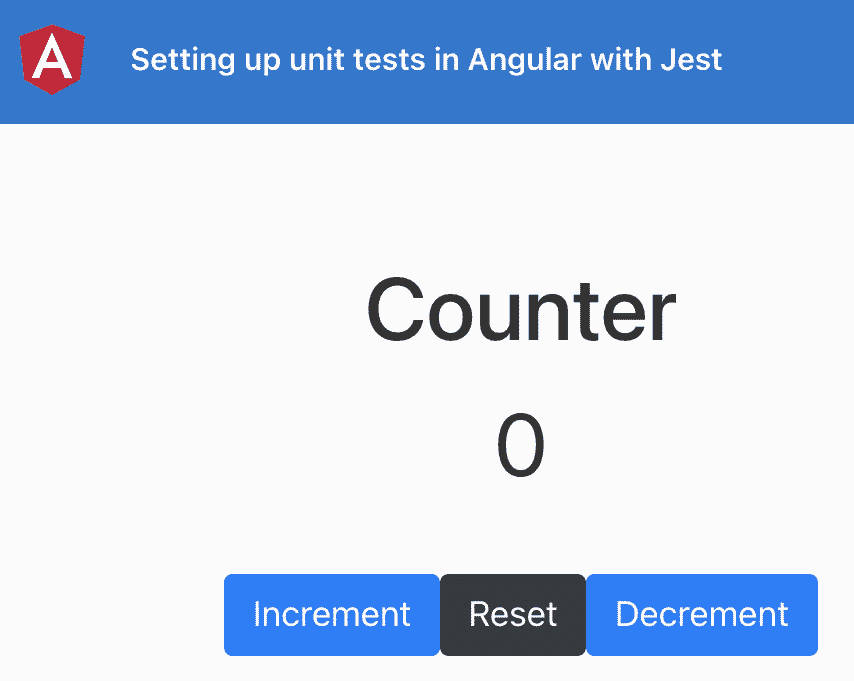

图 10.1 - 在 http://localhost:4200 上运行的 setting-up-jest 应用程序

接下来，尝试运行测试并监视整个过程运行的时间。从终端运行`ng test`命令；几秒钟后，一个新的 Chrome 窗口应该会打开，如下所示：

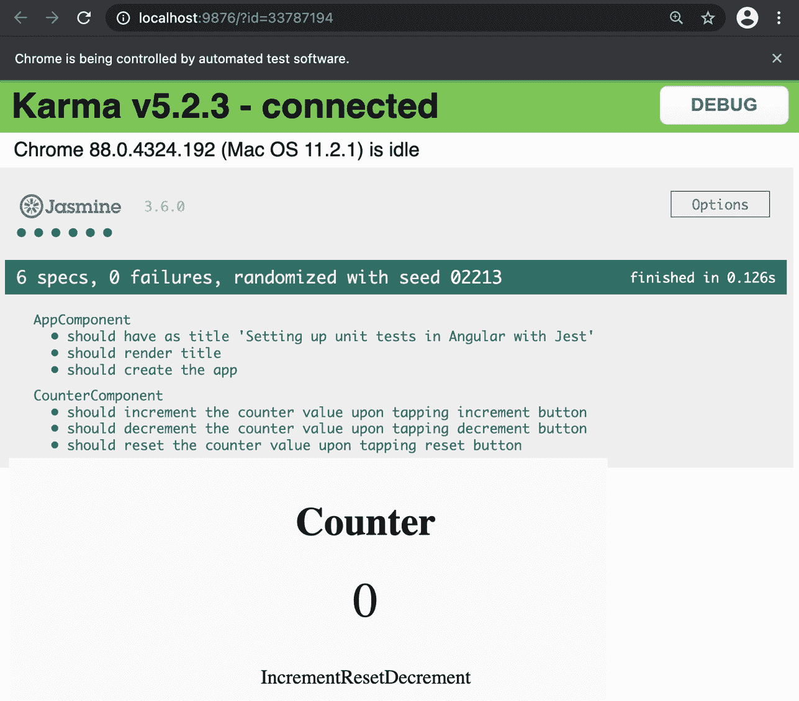

图 10.2 - 使用 Karma 和 Jasmine 的测试结果

看着前面的截图，你可能会说“Pfffttt Ahsan，它说'在 0.126 秒内完成！'你还想要什么？”嗯，那个时间只涵盖了 Karma 在 Chrome 窗口创建后在浏览器中运行测试所花费的时间。它没有计算实际启动过程、启动 Chrome 窗口，然后加载测试所花费的时间。在我的机器上，整个过程大约需要*15 秒*。这就是为什么我们要用 Jest 替换它。现在您了解了问题，在下一节中，让我们看一下食谱的步骤。

## 如何做...

在这里，我们有一个 Angular 应用程序，其中有一个非常简单的**Counter**组件。它显示计数器的值，并有三个操作按钮：一个用于增加计数器的值，一个用于减少值，一个用于重置值。此外，还有一些使用 Karma 和 Jasmine 编写的测试，如果运行`ng test`命令，所有测试都会通过。我们将首先设置 Jest。执行以下步骤：

1.  首先，打开一个新的终端窗口/标签，并确保您在`chapter10/start_here/setting-up-jest`文件夹内。进入后，运行以下命令以安装使用 Jest 所需的软件包：

```ts
npm install --save-dev jest jest-preset-angular @types/jest
```

1.  现在我们可以卸载 Karma 和不需要的依赖项。现在在您的终端中运行以下命令：

```ts
npm uninstall karma karma-chrome-launcher karma-jasmine-html-reporter @types/jasmine @types/jasminewd2 jasmine-core jasmine-spec-reporter karma-coverage-istanbul-reporter karma-jasmine
```

1.  我们还需要摆脱一些我们不需要的额外文件。从项目中删除`karma.conf.js`文件和`src/test.ts`文件。

1.  现在按照以下方式更新`angular.json`文件中的测试配置：

```ts
{
  ...
  "projects": {
    "setting-up-jest": {
      "...
      "prefix": "app",
      "architect": {
        "build": {...},
        "serve": {...},
        "extract-i18n": {...},
        "test": {
          "builder": "@angular-builders/jest:run",
          "options": {
            "tsConfig": "<rootDir>/src/tsconfig.test.            json",
            "collectCoverage": false,
            "forceExit": true
          }
        },
        "lint": {...},
        "e2e": {...}
      }
    }
  },
  "defaultProject": "setting-up-jest"
}
```

1.  我们现在将创建一个文件来为我们的项目配置 Jest。在项目的根文件夹中创建一个名为`jestSetup.ts`的文件，并粘贴以下内容：

```ts
import 'jest-preset-angular /setup-jest';
```

1.  现在，让我们修改`tsconfig.spec.json`以使用 Jest 而不是 Jasmine。修改后，整个文件应如下所示：

```ts
{
  "extends": "./tsconfig.json",
  "compilerOptions": {
    "outDir": "./out-tsc/spec",
    "types": ["jest", "node"],
    "esModuleInterop": true,
    "emitDecoratorMetadata": true
  },
  "files": ["src/polyfills.ts"],
  "include": ["src/**/*.spec.ts", "src/**/*.d.ts"]
}
```

1.  我们现在将修改`package.json`以添加将运行 Jest 测试的`npm`脚本：

```ts
{
  "name": "setting-up-jest",
  "version": "0.0.0",
  "scripts": {
    ...
    "build": "ng build",
    "test": "jest",
    "test:coverage": "jest --coverage",
    ...
  },
  "private": true,
  "dependencies": {...},
  "devDependencies": {...},
}
```

1.  最后，让我们通过在`package.json`文件中添加 Jest 配置来完成我们 Jest 测试的整个配置，如下所示：

```ts
{
  ...
  "dependencies": {...},
  "devDependencies": {...},
  "jest": {
    "preset": "jest-preset-angular",
    "setupFilesAfterEnv": [
      "<rootDir>/jestSetup.ts"
    ],
    "testPathIgnorePatterns": [
      "<rootDir>/node_modules/",
      "<rootDir>/dist/"
    ],
    "globals": {
      "ts-jest": {
        "tsconfig": "<rootDir>/tsconfig.spec.json",
        "stringifyContentPathRegex": "\\.html$"
      }
    }
  }
}
```

1.  现在我们已经设置好了一切，只需运行`test`命令，如下所示：

```ts
npm run test
```

测试完成后，您应该能够看到以下输出：

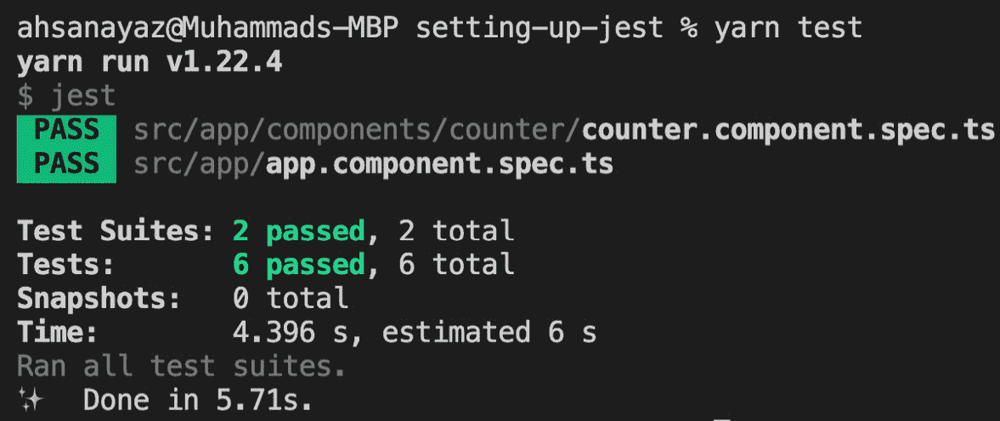

图 10.3 - 使用 Jest 进行测试的结果

砰！您会注意到使用 Jest 运行测试的整个过程大约需要 6 秒。第一次运行时可能需要更多时间，但随后的运行应该更快。现在您知道如何配置 Angular 应用程序以使用 Jest 进行单元测试，请参考下一节以了解更多资源。

## 另请参阅

+   *使用 Jest 进行 Web 框架测试* ([`jestjs.io/docs/en/testing-frameworks`](https://jestjs.io/docs/en/testing-frameworks))

+   *使用 Jest 入门* ([`jestjs.io/docs/en/getting-started`](https://jestjs.io/docs/en/getting-started))

# 为 Jest 提供全局模拟

在上一个食谱中，我们学习了如何为 Angular 单元测试设置 Jest。可能会有一些情况，您希望使用浏览器 API，这些 API 可能不是实际 Angular 代码的一部分；例如，使用`localStorage`或`alert()`。在这种情况下，我们需要为我们希望从中返回模拟值的函数提供一些全局模拟。这样我们就可以进行涉及它们的测试。在这个食谱中，您将学习如何为 Jest 提供全局模拟。

## 准备工作

此食谱的项目位于`chapter10/start_here/providing-global-mocks-for-jest`。执行以下步骤：

1.  在 Visual Studio Code 中打开项目。

1.  打开终端并运行`npm install`以安装项目的依赖项。

1.  完成后，运行`ng serve -o`。

这应该在新的浏览器标签中打开应用程序。应用程序应如下所示：

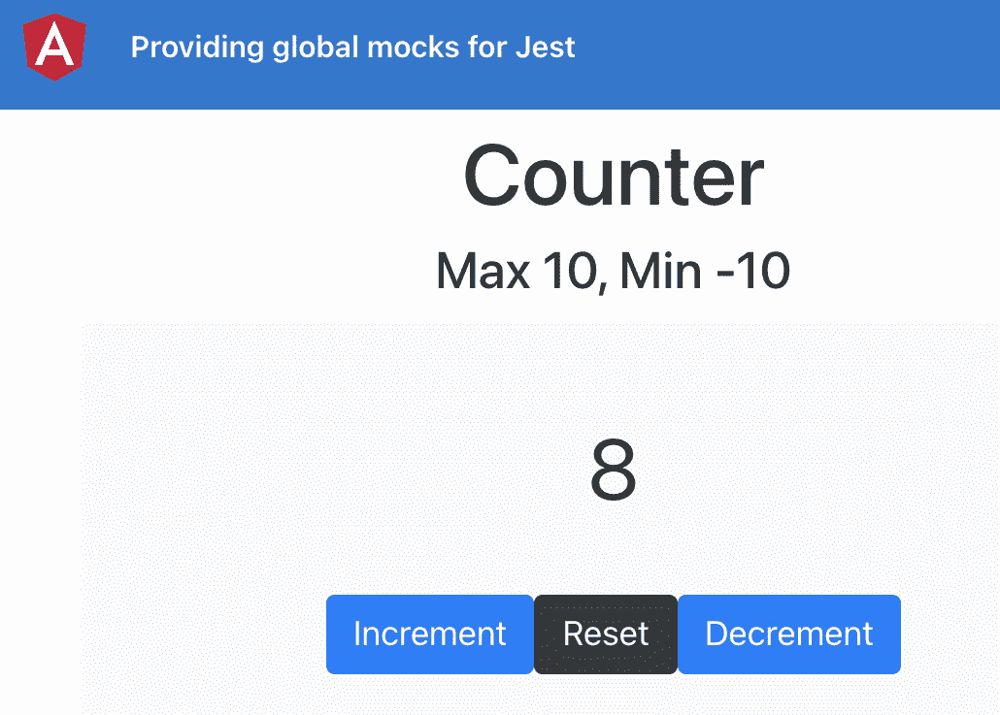

图 10.4 - 在 http://localhost:4200 上运行提供全局模拟的 jest 应用程序

现在我们已经在本地运行了应用程序，在接下来的部分中，让我们按照食谱的步骤进行。

## 如何做...

我们在这个示例中使用的应用程序使用了两个全局 API：`window.localStorage` 和 `window.alert()`。请注意，当应用程序启动时，我们从 `localStorage` 中获取计数器的值，然后在增加、减少和重置时，我们将其存储在 `localStorage` 中。当计数器的值大于 `MAX_VALUE` 或小于 `MIN_VALUE` 时，我们使用 `alert()` 方法显示警报。让我们通过编写一些很酷的单元测试来开始这个示例：

1.  首先，我们将编写我们的测试用例，以便在计数器值超过 `MAX_VALUE` 和 `MIN_VALUE` 时显示警报。修改 `counter.component.spec.ts` 文件如下：

```ts
...
describe('CounterComponent', () => {
  ...
  it('should show an alert when the counter value goes   above the MAX_VALUE', () => {
    spyOn(window, 'alert');
    component.counter = component.MAX_VALUE;
    component.increment();
    expect(window.alert).toHaveBeenCalledWith('Value too     high');
    expect(component.counter).toBe(component.MAX_VALUE);
  });
  it('should show an alert when the counter value goes   above the MAX_VALUE', () => {
    spyOn(window, 'alert');
    component.counter = component.MIN_VALUE;
    component.decrement();
    expect(window.alert).toHaveBeenCalledWith('Value too     low');
    expect(component.counter).toBe(component.MIN_VALUE);
  });
});
```

在这里，您可以看到测试通过了。但是，如果我们想要检查 `localStorage` 中的值是否被正确保存和检索呢？

1.  我们将创建一个新的测试，以确保调用 `localStorage.getItem()` 方法来从 `localStorage` API 中检索最后保存的值。将以下测试添加到 `counter.component.spec.ts` 文件中：

```ts
...
describe('CounterComponent', () => {
  ...
  it.only('should call the localStorage.getItem method on   component init', () => {
    spyOn(localStorage, 'getItem');
    component.ngOnInit();
    expect(localStorage.getItem).toBeCalled();
  });
});
```

请注意，我们在这个测试用例中使用了 `it.only`。这是为了确保我们只运行这个测试（目前）。如果您运行测试，您应该能够看到类似以下截图的内容：

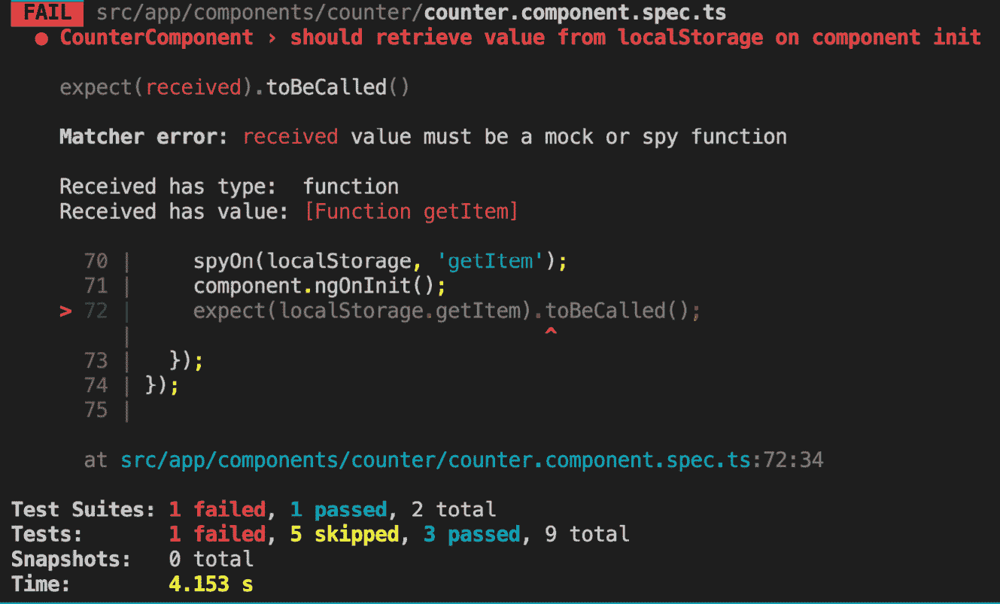

图 10.5 – 正在覆盖 localStorage API 的测试失败了

请注意 `Matcher error: received value must be a mock or a spy function` 消息。这就是我们接下来要做的事情，也就是提供一个模拟。

1.  在项目的根目录中创建一个名为 `jest-global-mocks.ts` 的文件。然后，添加以下代码以模拟 `localStorage` API：

```ts
const createLocalStorageMock = () => {
  let storage = {};
  return {
    getItem: (key) => {
      return storage[key] ? storage[key] : null;
    },
    setItem: (key, value) => {
      storage[key] = value;
    },
  };
};
Object.defineProperty(window, 'localStorage', {
  value: createLocalStorageMock(),
});
```

1.  现在将此文件导入到 `jestSetup.ts` 文件中，如下所示：

```ts
import 'jest-preset-angular';
import './jest-global-mocks';
```

现在，如果您重新运行测试，它们应该通过。

1.  让我们添加另一个测试，以确保我们在组件初始化时从 `localStorage` 中检索到最后保存的值。修改 `counter.component.spec.ts` 文件如下：

```ts
...
describe('CounterComponent', () => {
  ...
  it('should call the localStorage.getItem method on   component init', () => {
    spyOn(localStorage, 'getItem');
    component.ngOnInit();
    expect(localStorage.getItem).toBeCalled();
  });
  it('should retrieve the last saved value from   localStorage on component init', () => {
    localStorage.setItem('counterValue', '12');
    component.ngOnInit();
    expect(component.counter).toBe(12);
  });
});
```

1.  最后，让我们确保每当触发 `increment()`、`decrement()` 或 `reset()` 方法时，我们都将计数器的值保存到 `localStorage` 中。更新 `counter.component.spec.ts` 如下：

```ts
...
describe('CounterComponent', () => {
  ...
  it('should save the new counterValue to localStorage   on increment, decrement and reset', () => {
    spyOn(localStorage, 'setItem');
    component.counter = 0;
    component.increment();
    expect(localStorage.setItem).    toHaveBeenCalledWith('counterValue', '1');
    component.counter = 20;
    component.decrement();
    expect(localStorage.setItem).    toHaveBeenCalledWith('counterValue', '19');
    component.reset();
    expect(localStorage.setItem).    toHaveBeenCalledWith('counterValue', '0');
  });
});
```

太棒了！您刚刚学会了如何为 Jest 提供全局模拟以进行测试。请参考下一节以了解其工作原理。

## 工作原理...

Jest 提供了一种定义要为每个测试加载的文件路径列表的方法。如果打开`package.json`文件并查看`jest`属性，您可以查看`setupFilesAfterEnv`属性，它接受一个文件路径数组。我们已经在那里为`jestSetup.ts`文件定义了路径。定义全局模拟的一种方法是创建一个新文件，然后将其导入`jestSetup.ts`。这是因为它无论如何都会在测试环境中被调用。这就是我们在这个示例中所做的。

请注意，我们在`window`对象中使用`Object.defineProperty`方法为`localStorage`对象提供了一个模拟实现。对于 JSDOM 中未实现的任何 API，情况都是一样的。同样，您可以为测试中使用的每个 API 提供全局模拟。请注意，在`value`属性中，我们使用了`createLocalStorageMock()`方法。实质上，这是定义模拟的一种方式。我们创建了`createLocalStorageMock()`方法，在其中我们有一个名为`storage`的私有/封装对象，模拟了`localStorage`对象。我们还在其中定义了`getItem()`和`setItem()`方法，以便我们可以向此存储设置值并从中获取值。请注意，我们没有在原始`localStorage`API 中拥有的`removeItem()`和`clear()`方法的实现。我们不必这样做，因为我们在测试中没有使用这些方法。

在“应该在组件初始化时调用 localStorage.getItem 方法”测试中，我们只是对`localStorage`对象的`getItem()`方法进行了间谍监视，自己调用了`ngOnInit()`方法，然后期望它已被调用。非常简单。

在“应该在组件初始化时从 localStorage 中检索最后保存的值”测试中，我们使用`setItem()`方法将计数器值保存在`localStorage`对象中，值为`'12'`。实质上，调用`setItem()`方法会调用我们的模拟实现方法，而不是实际的`localStorage`API 的`setItem()`方法。请注意，这里我们*不*对`getItem()`方法进行间谍监视；这是因为后来，我们希望组件的`counter`属性的值为`12`。

重要说明

每当我们对一个方法进行间谍操作时，请记住实际函数中的任何语句都不会再被执行。这就是为什么我们在前面的测试中不对`getItem()`方法进行间谍操作。如果我们这样做，模拟实现中的`getItem()`方法将不会返回任何内容。因此，我们对计数器属性的预期值将不会是`12`。

简而言之，如果您必须依赖于函数实现的结果，或者函数内部执行的语句，就不要对该函数进行间谍操作，并相应地编写您的测试。

PS：我总是在调试和苦苦思索一段时间后才艰难地学会这一点。开个玩笑！

最后的测试很简单。在`'should save the new counterValue to localStorage on increment, decrement and reset'`测试中，我们只是对`setItem()`方法进行了间谍操作，因为我们不关心它的实现。然后，我们手动多次设置计数器属性的值，然后分别运行`increment()`、`decrement()`和`reset()`方法。此外，我们期望`setItem()`方法已被调用，并使用正确的参数将值保存到存储中。请注意，我们在保存后不检查存储的值。正如我之前提到的，由于我们已经对`setItem()`方法进行了间谍操作，它的内部语句不会触发，值也不会被保存；因此，我们无法在保存后检索保存的值。

## 另请参阅

+   `setupFiles`的 Jest 文档([`jestjs.io/docs/en/configuration#setupfiles-array`](https://jestjs.io/docs/en/configuration#setupfiles-array))

+   *使用 Jest 进行手动模拟* ([`jestjs.io/docs/en/manual-mocks`](https://jestjs.io/docs/en/manual-mocks))

# 使用存根(mock)来模拟服务

几乎没有一个 Angular 应用程序不会在其中创建一个`Service`。就整体业务逻辑而言，服务在与 API 交互时承载了大量的业务逻辑，特别是在涉及到与 API 交互时。在这个食谱中，您将学习如何使用存根(mock)来模拟服务。

## 准备工作

该食谱的项目位于`chapter10/start_here/mocking-services-using-stubs`。执行以下步骤：

1.  在 Visual Studio Code 中打开项目。

1.  打开终端并运行`npm install`来安装项目的依赖项。

1.  完成后，运行`ng serve -o`。

这应该会在新的浏览器标签页中打开应用程序。您应该会看到类似以下截图的内容：

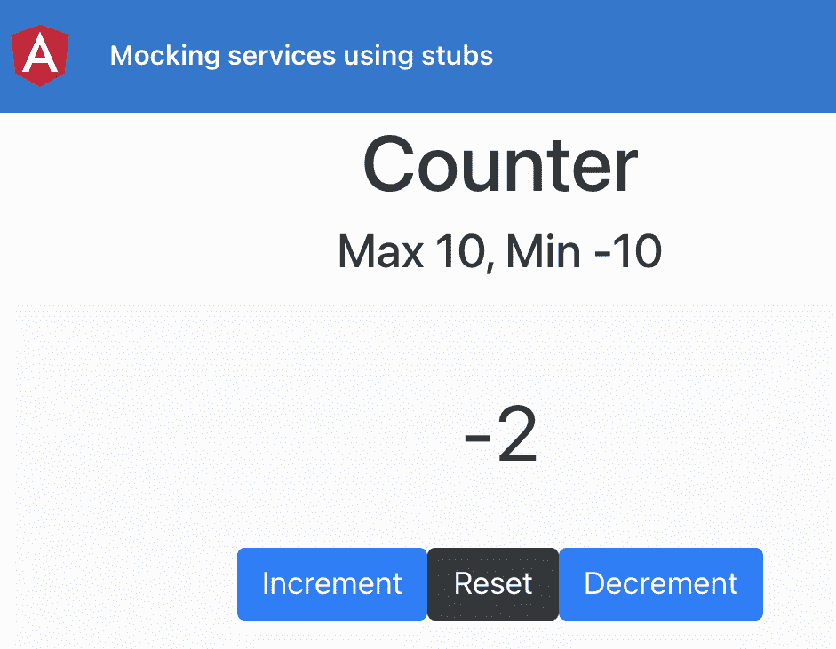

图 10.6 - 使用存根模拟服务的应用程序在 http://localhost:4200 上运行

现在我们已经在本地运行了应用程序，在下一节，让我们来看看食谱的步骤。

## 如何做...

我们有与上一个食谱相同的应用程序；但是，我们已经将保存和检索数据的逻辑从`localStorage`移动到了我们创建的`CounterService`中。现在所有的测试都通过了。但是，如果我们想要隐藏/封装计数器值存储的逻辑怎么办？也许我们想要为此发送后端 API 调用。为了做到这一点，更有意义的是对服务的方法进行监视。让我们按照食谱为我们的服务提供一个模拟存根：

1.  首先，在`src`文件夹内创建一个名为`__mocks__`的文件夹。在其中，创建另一个名为`services`的文件夹。然后，在这个文件夹内再次创建`counter.service.mock.ts`文件，并包含以下内容：

```ts
const CounterServiceMock = {
  storageKey: 'counterValue',
  getFromStorage: jest.fn(),
  saveToStorage: jest.fn(),
};
export default CounterServiceMock;
```

1.  现在在`counter.component.spec.ts`中提供模拟服务而不是实际服务，如下所示：

```ts
import { ComponentFixture, TestBed } from '@angular/core/testing';
import { CounterService } from 'src/app/core/services/counter.service';
import CounterServiceMock from 'src/__mocks__/services/counter.service.mock';
...
describe('CounterComponent', () => {
  ...
  beforeEach(async () => {
    await TestBed.configureTestingModule({
      declarations: [CounterComponent],
      providers: [
        {
          provide: CounterService,
          useValue: CounterServiceMock,
        },
      ],
    }).compileComponents();
  });
  ...
});
```

通过上述更改，您应该看到以下错误，指出`localStorage.setItem`没有被调用。这是因为我们现在正在对我们服务的模拟存根上的方法进行监视：

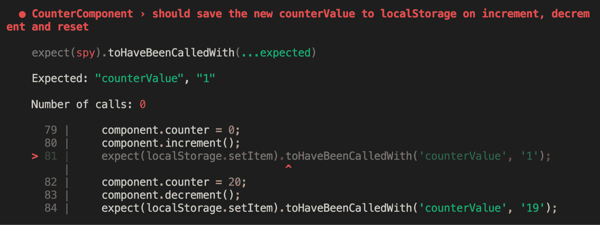

图 10.7 - localStorage.setItem 没有被调用，因为方法被监视了

1.  现在，我们不再期望调用`localStorage`对象的方法，而是期望在我们的测试中调用我们服务的方法。更新`counter.component.spec.ts`文件如下：

```ts
...
describe('CounterComponent', () => {
  ...
  it('should call the CounterService.getFromStorage   method on component init', () => {
    component.ngOnInit();
    expect(CounterServiceMock.getFromStorage).    toBeCalled();
  });
  it('should retrieve the last saved value from   CounterService on component init', () => {
    CounterServiceMock.getFromStorage.    mockReturnValue(12);
    component.ngOnInit();
    expect(component.counter).toBe(12);
  });
  it('should save the new counterValue via CounterService   on increment, decrement and reset', () => {
    component.counter = 0;
    component.increment();
    expect(CounterServiceMock.saveToStorage).    toHaveBeenCalledWith(1);
    component.counter = 20;
    component.decrement();
    expect(CounterServiceMock.saveToStorage).    toHaveBeenCalledWith(19);
    component.reset();
    expect(CounterServiceMock.saveToStorage).    toHaveBeenCalledWith(0);
  });
});
```

太棒了！现在你知道如何模拟服务来测试具有服务依赖关系的组件。请参考下一节，了解它是如何工作的。

## 它是如何工作的...

为 Angular 服务提供存根已经非常简单。这要归功于 Angular 的开箱即用的方法和来自`@angular/core`包的工具，特别是`@angular/core/testing`。首先，我们为我们的`CounterService`创建存根，并对`CounterService`中的每个方法使用`jest.fn()`。

使用`jest.fn()`返回一个新的未使用的模拟函数，Jest 会自动对其进行监视。可选地，我们还可以将模拟实现方法作为参数传递给`jest.fn`。查看官方文档中关于`jest.fn()`的以下示例：

```ts
const mockFn = jest.fn();
mockFn();
expect(mockFn).toHaveBeenCalled(); // test passes
// With a mock implementation:
const returnsTrue = jest.fn(() => true);
console.log(returnsTrue()); // true;
expect(returnsTrue()).toBe(true); // test passes
```

一旦我们创建了存根，我们将其传递给`TestBed`配置中的提供者数组，针对`CounterService` - 但`useValue`属性设置为`CounterServiceMock`。这告诉 Angular 使用我们的存根作为`CounterService`。

然后，在我们期望组件初始化时调用`CounterService.getFromStorage()`的测试中，我们使用以下语句：

```ts
expect(CounterServiceMock.getFromStorage).toBeCalled();
```

请注意，在前面的代码中，我们能够直接在`CounterServiceMock.getFromStorage`上使用`expect()`。虽然这在 Karma 和 Jasmine 中是不可能的，但在 Jest 中是可能的，因为我们对每个基础方法使用了`jest.fn()`。

然后，对于我们想要检查`getFromStorage()`方法是否被调用并返回保存的值的测试，我们首先使用`CounterServiceMock.getFromStorage.mockReturnValue(12);`语句。这确保了当调用`getFromStorage()`方法时，它会返回值`12`。然后，我们只需在测试中运行`ngOnInit()`方法，并期望我们组件的 counter 属性现在已经设置为`12`。这实际上意味着发生了以下事情：

1.  `ngOnInit()`调用`getFromStorage()`方法。

1.  `getFromStorage()`返回先前保存的值（在我们的情况下是`12`，但实际上，这将从`localStorage`中获取）。

1.  组件的`counter`属性设置为检索到的值，这里是`12`。

现在，对于最终的测试，我们只期望`CounterService`的`saveToStorage`方法在每种必要情况下都被调用。为此，我们使用以下类型的`expect()`语句：

```ts
expect(CounterServiceMock.saveToStorage).toHaveBeenCalledWith(1);
```

大致就是这样。单元测试很有趣，不是吗？现在您已经了解了所有的工作原理，请参考下一节，了解一些有用的资源，以便进行进一步阅读。

## 另请参阅

+   `jest.fn()`的官方文档（[`jestjs.io/docs/en/jest-object.html#jestfnimplementation`](https://jestjs.io/docs/en/jest-object.html#jestfnimplementation)）

+   Angular 的*组件测试场景*（[`angular.io/guide/testing-components-scenarios`](https://angular.io/guide/testing-components-scenarios)）

# 在单元测试中使用对注入服务的间谍

虽然你可以在单元测试中使用 Jest 为你的服务提供存根，但有时为每个新服务创建一个模拟可能会感觉有些多余。假设如果服务的使用仅限于一个测试文件，那么仅仅在实际注入的服务上使用间谍可能更有意义。在这个示例中，这正是我们要做的。

## 做好准备

这个配方的项目位于`chapter10/start_here/using-spies-on-injected-service`。

1.  在 Visual Studio Code 中打开项目。

1.  打开终端并运行`npm install`来安装项目的依赖项。

1.  完成后，运行`npm run test`。

这将在控制台上使用 Jest 运行单元测试。你应该会看到类似以下输出：

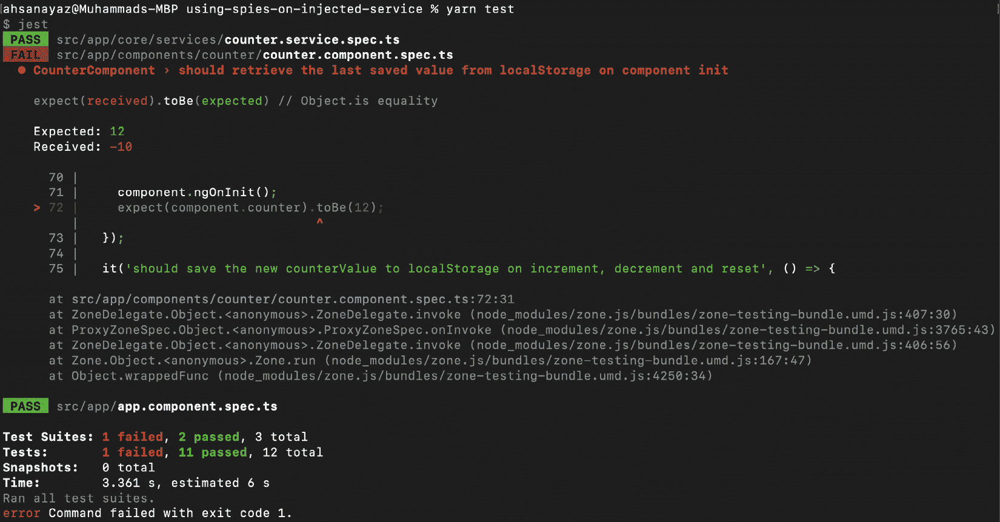

图 10.8 – 'using-spies-on-injected-service'项目的单元测试失败

现在我们已经在本地运行了测试，在下一节中，让我们通过配方的步骤。

## 如何做到...

我们在`CounterComponent`代码中的测试是不完整的。这是因为我们缺少`expect()`块和对`CounterService`方法进行监听的代码。让我们开始使用实际的`CounterService`来完成编写测试的配方，如下所示：

1.  首先，我们需要在测试中获取实际注入的服务的实例。因此，我们将创建一个变量，并在`beforeEach()`方法中获取注入的服务。更新`counter.component.spec.ts`文件如下：

```ts
...
describe('CounterComponent', () => {
  let component: CounterComponent;
  let fixture: ComponentFixture<CounterComponent>;
  let counterService: CounterService;
  beforeEach(async () => {...});
  beforeEach(() => {
    fixture = TestBed.createComponent(CounterComponent);
    component = fixture.componentInstance;
    fixture.detectChanges();
    counterService = TestBed.inject(CounterService);
  });
  ...
});
```

1.  现在，我们将为服务编写我们的第一个`expect()`块。对于测试中说的'应该在组件初始化时调用 localStorage.getItem 方法'，添加以下`spyOn()`和`expect()`块：

```ts
...
describe('CounterComponent', () => {
  ...
  it('should call the localStorage.getItem method on   component init', () => {
    spyOn(counterService, 'getFromStorage');
    component.ngOnInit();
    expect(counterService.getFromStorage).    toHaveBeenCalled();
  });
  ...
});
```

如果再次运行`npm run test`，你应该仍然会看到一个测试失败，但其余测试通过。

1.  现在，让我们修复失败的测试。即'应该在组件初始化时从 localStorage 中检索到上次保存的值'。在这种情况下，我们需要监听`CounterService`的`getFromStorage()`方法，以返回预期值`12`。为此，请更新测试文件，如下所示：

```ts
...
describe('CounterComponent', () => {
  ...
  it('should retrieve the last saved value from   localStorage on component init', () => {
    spyOn(counterService, 'getFromStorage').and.    returnValue(12);
    component.ngOnInit();
    expect(component.counter).toBe(12);
  });
  ...
});
```

1.  最后，让我们修复我们的最后一个测试，我们期望`increment()`、`decrement()`和`reset()`方法调用`CounterService`的`saveToStorage()`方法。更新测试如下：

```ts
...
describe('CounterComponent', () => {
  ...
  it('should save the new counterValue to localStorage   on increment, decrement and reset', () => {
    spyOn(counterService, 'saveToStorage');
    component.counter = 0;
    component.increment();
    expect(counterService.saveToStorage).    toHaveBeenCalledWith(1);
    component.counter = 20;
    component.decrement();
    expect(counterService.saveToStorage).    toHaveBeenCalledWith(19);
    component.reset();
    expect(counterService.saveToStorage).    toHaveBeenCalledWith(0);
  });
});
```

太棒了！通过这个改变，你应该看到所有 12 个测试都通过了。让我们看看下一节，以了解它是如何工作的。

## 它是如何工作的...

这个配方包含了本章先前配方中的许多知识。然而，关键亮点是`TestBed.inject()`方法。基本上，这个神奇的方法会将提供的服务实例`CounterService`传递给我们。这是与`CounterComponent`实例绑定的服务实例。由于我们可以访问与组件实例使用的相同服务实例，我们可以直接对其进行监视，并期望它被调用，甚至可以模拟返回的值。

## 另请参阅

+   Angular TestBed 简介(https://angular.io/guide/testing-services#angular-testbed)

# 使用 ng-mocks 包模拟子组件和指令

单元测试主要围绕着对组件进行孤立测试。但是，如果您的组件完全依赖于另一个组件或指令才能正常工作呢？在这种情况下，通常会为组件提供一个模拟实现，但这是很多工作。然而，使用`ng-mocks`包就非常简单。在这个配方中，我们将学习如何使用`ng-mocks`来进行一个高级示例，即父组件依赖于子组件才能正常工作。 

## 准备就绪

我们将要处理的项目位于`chapter10/start_here/mocking-components-with-ng-mocks`中，这是在克隆存储库内部的。执行以下步骤：

1.  在 Visual Studio Code 中打开项目。

1.  打开终端并运行`npm install`来安装项目的依赖项。

1.  完成后，运行`ng serve -o`。

这应该会在新的浏览器标签中打开应用程序。您应该会看到类似以下截图的内容：

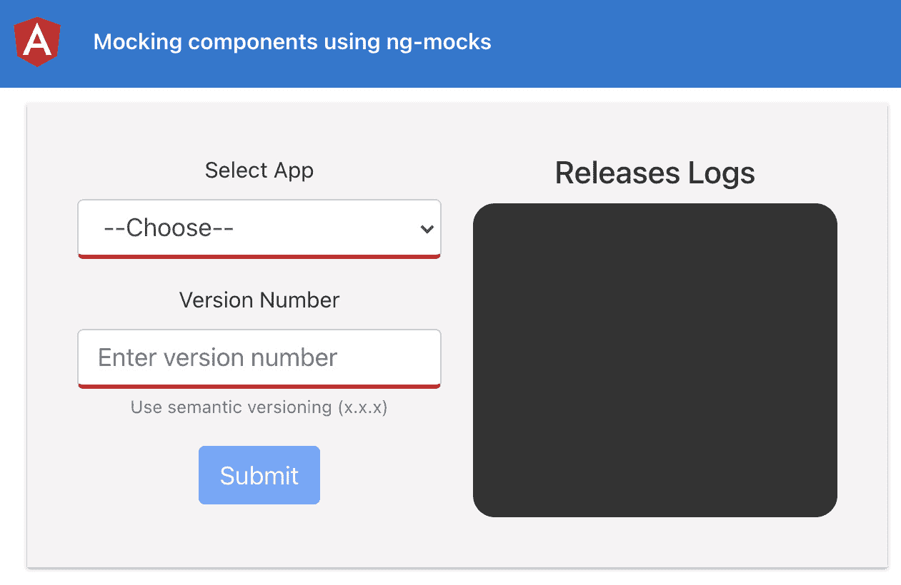

图 10.9 - 运行在 http://localhost:4200 上的 mocking-components-with-ng-mocks 应用程序

现在我们的应用程序在本地运行，接下来让我们在下一节中按照配方的步骤进行操作。

## 如何做...

如果运行`yarn test`命令或`npm run test`命令，您会发现并非所有测试都通过了。此外，控制台上会出现一堆错误，如下所示：

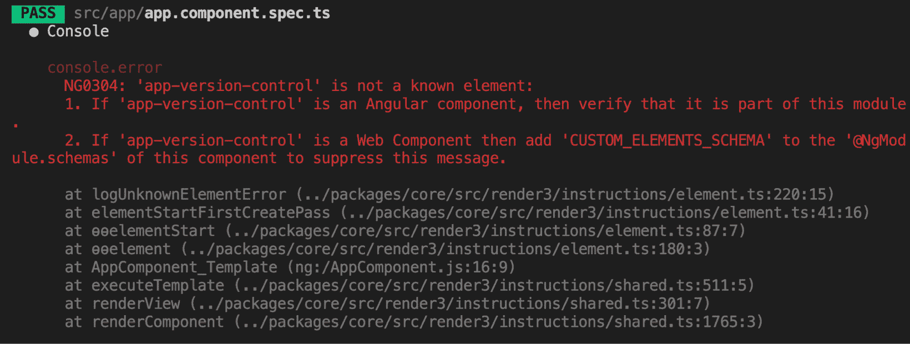

图 10.10 - 单元测试期间出现未知元素错误

让我们按照配方确保我们的测试通过`ng-mocks`包正确无误地运行：

1.  首先，让我们在项目中安装`ng-mocks`包。为此，请在终端中从项目根目录运行以下命令：

```ts
npm install ng-mocks --save
# or
yarn add ng-mocks
```

1.  现在，我们将尝试修复`AppComponent`的测试。为了只基于字符串正则表达式运行特定的测试，我们可以使用`jest`命令的`-t`参数。运行以下命令，只运行`AppComponent`的测试：

```ts
npm run test -- -t 'AppComponent'
#or
yarn test -- -t 'AppComponent'
```

现在你可以看到我们只运行`AppComponent`的测试，它们失败如下：

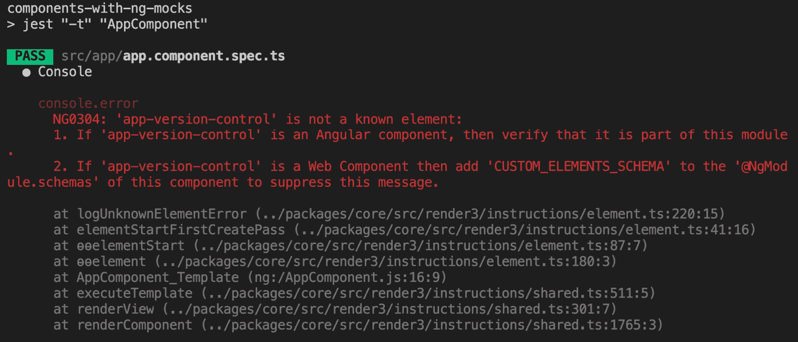

图 10.11 – 错误 – 'app-version-control'不是已知元素

1.  为了解决*图 10.11*中显示的错误，我们将`VersionControlComponent`导入`app.component.spec.ts`文件中的`TestBed`定义。这样我们的测试环境也会知道缺少的`VersionControlComponent`。为此，请按照以下方式修改提到的文件：

```ts
...
import { VersionControlComponent } from './components/version-control/version-control.component';
...
describe('AppComponent', () => {
  beforeEach(waitForAsync(() => {
    TestBed.configureTestingModule({
      imports: [RouterTestingModule],
      declarations: [AppComponent,       VersionControlComponent],
    }).compileComponents();
  }));
  ...
});
```

重新运行`AppComponent`的测试，你会看到一些更新的错误。惊喜！这就是依赖关系的影响。我们将在*它是如何工作的...*部分详细讨论细节。然而，为了解决这个问题，让我们按照下面的步骤进行。

1.  我们不需要直接提供`VersionControlComponent`，而是需要模拟它，因为我们对`AppComponent`的测试并不真正关心它。为此，请按照以下方式更新`app.component.spec.ts`文件：

```ts
...
import { MockComponent } from 'ng-mocks';
...
describe('AppComponent', () => {
  beforeEach(waitForAsync(() => {
    TestBed.configureTestingModule({
      imports: [RouterTestingModule],
      declarations: [AppComponent,       MockComponent(VersionControlComponent)],
    }).compileComponents();
  }));
  ...
});
```

问题解决了！再次运行测试，只针对`AppComponent`，你应该看到它们都通过了，如下所示：

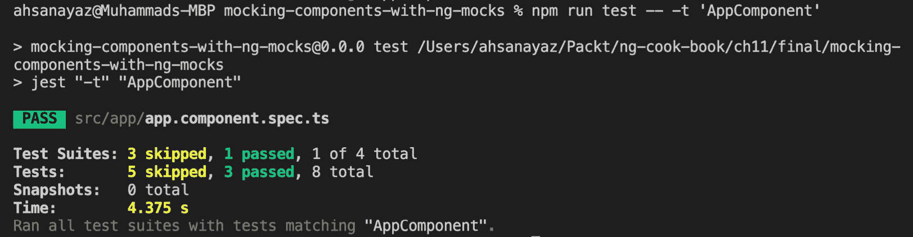

图 10.12 – 通过所有的 AppComponent 测试

1.  现在，让我们来谈谈`VersionControlComponent`的测试。这取决于`ReleaseFormComponent`以及`ReleaseLogsComponent`。这次让我们像专业人士一样模拟它们，使用`MockBuilder`和`MockRender`方法，这样我们就可以在测试过程中摆脱错误。更新后，`version-control.component.spec.ts`文件应如下所示：

```ts
import { MockBuilder, MockedComponentFixture, MockRender } from 'ng-mocks';
import { ReleaseFormComponent } from '../release-form/release-form.component';
import { ReleaseLogsComponent } from '../release-logs/release-logs.component';
import { VersionControlComponent } from './version-control.component';
describe('VersionControlComponent', () => {
  let component: VersionControlComponent;
  let fixture: MockedComponentFixture   <VersionControlComponent>;
  beforeEach(() => {
    return MockBuilder(VersionControlComponent)
      .mock(ReleaseFormComponent)
      .mock(ReleaseLogsComponent);
  });
  beforeEach(() => {
    fixture = MockRender(VersionControlComponent);
    component = fixture.point.componentInstance;
  });
  it('should create', () => {...});
});
```

现在运行`npm run test`，你应该看到所有的测试都通过了。在接下来的步骤中，让我们实际编写一些有趣的测试。 

1.  `VersionControlComponent`将`ReleaseLogsComponent`作为子组件使用。此外，它通过`[logs]`属性将`releaseLogs`属性作为`@Input()`提供给`ReleaseLogsComponent`。我们实际上可以检查输入的值是否设置正确。为此，请按照以下方式更新`version-control.component.spec.ts`文件：

```ts
import {
  MockBuilder,
  MockedComponentFixture,
  MockRender,
  ngMocks,
} from 'ng-mocks';
import { Apps } from 'src/app/constants/apps';
...
describe('VersionControlComponent', () => {
  ...
  it('should set the [logs] @Input for the   ReleaseLogsComponent', () => {
    const releaseLogsComponent = ngMocks.    find<ReleaseLogsComponent>(
      'app-release-logs'
    ).componentInstance;
    const logsStub = [{ app: Apps.DRIVE, version:     '2.2.2', message: '' }];
    component.releaseLogs = [...logsStub];
    fixture.detectChanges();
    expect(releaseLogsComponent.logs.length).toBe(1);
    expect(releaseLogsComponent.logs).toEqual([...logsStub]);
  });
});
```

1.  现在我们将确保当我们通过`ReleaseFormComponent`创建了一个新的日志时，我们通过将其添加到`VersionControlComponent`中的`releaseLogs`数组中来显示这个新的日志。然后，我们还将其作为`@Input logs`传递给`ReleaseLogsComponent`。将以下测试添加到`version-control.component.spec.ts`文件中：

```ts
...
describe('VersionControlComponent', () => {
  ...
  it('should add the new log when it is created via   ReleaseFormComponent', () => {
    const releaseFormsComponent = ngMocks.    find<ReleaseFormComponent>('app-release-form').    componentInstance;
    const releaseLogsComponent = ngMocks.    find<ReleaseLogsComponent>('app-release-logs').    componentInstance;
    const newLogStub = { app: Apps.DRIVE, version:    '2.2.2', message: '' };
    component.releaseLogs = []; // no logs initially
    releaseFormsComponent.newReleaseLog.emit(newLogStub);     // add a new log
    fixture.detectChanges(); // detect changes
    expect(component.releaseLogs).toEqual([newLogStub]);     // VersionControlComponent logs
    expect(releaseLogsComponent.logs).    toEqual([newLogStub]); // ReleaseLogsComponent logs
  });
});
```

哇！我们通过使用`ng-mocks`包实现了一些有趣的测试。每次我使用它时，我都非常喜欢它。现在我们已经完成了这个配方，在下一节，让我们来看看它是如何工作的。

## 它是如何工作的...

在这个配方中，我们涵盖了一些有趣的事情。首先，为了避免控制台报告未知组件的错误，我们使用了`ng-mocks`包中的`MockComponent`方法，将我们依赖的组件声明为模拟组件。这绝对是我们通过`ng-mocks`包实现的最简单的事情。然而，我们确实进入了一个高级的情况，我承认这是一种非常规的方法；那就是在父组件中测试子组件的`@Input`和`@Output`发射器，以测试整个流程。这就是我们为`VersionControlComponent`的测试所做的。

请注意，我们完全从`version-control.component.spec.ts`文件中移除了对`@angular/core/testing`包的使用。这是因为我们不再使用`TestBed`来创建测试环境。相反，我们使用`ng-mocks`包中的`MockBuilder`方法来构建`VersionControlComponent`的测试环境。然后，我们使用`.mock()`方法来模拟我们稍后在测试中要使用的每个子组件。`.mock()`方法不仅用于模拟组件，还可以用于模拟服务、指令、管道等。请参考下一节以获取更多阅读资源。

然后，在`'should add the new log when it is created via ReleaseFormComponent'`测试中，注意我们使用的`ngMocks.find()`方法，用于找到相关组件并获取其实例。它的使用方式与我们在`TestBed`中所做的相对类似，如下所示：

```ts
fixture.debugElement.query(
  By.css('app-release-form')
).componentInstance
```

然而，使用`ngMocks.find()`更合适，因为它对类型有更好的支持。一旦我们掌握了`ReleaseFormComponent`的实例，我们就使用名为`newReleaseLog`的`@Output`来使用`.emit()`方法创建新日志。然后，我们快速进行`fixture.detectChanges()`以触发 Angular 变更检测。我们还检查`VersionControl.releaseLogs`数组，以确定我们的新发布日志是否已添加到数组中。之后，我们还检查`ReleaseLogsComponent.logs`属性，以确保子组件已通过`@Input`更新了`logs`数组。

重要说明

请注意，我们不在`VersionControlComponent.addNewReleaseLog`方法上使用间谍。这是因为如果我们这样做，该函数将成为 Jest 间谍函数。因此，它将失去其内部功能。反过来，它将永远不会将新日志添加到`releaseLogs`数组中，我们的测试也不会通过。你可以试试看。

## 另请参阅

+   ng-mocks 的`.mock`方法（[`ng-mocks.sudo.eu/api/MockBuilder#mock`](https://ng-mocks.sudo.eu/api/MockBuilder#mock)）

+   ng-mocks 官方文档（[`ng-mocks.sudo.eu`](https://ng-mocks.sudo.eu)）

# 使用 Angular CDK 组件挽具更轻松的组件测试

在为组件编写测试时，可能会出现您实际上希望与 DOM 元素进行交互的情况。现在，这可以通过使用`fixture.debugElement.query`方法找到使用选择器的元素，然后在其上触发事件来实现。但是，这意味着为不同平台维护它，了解所有选择器的标识符，然后在测试中公开所有这些。如果我们谈论的是一个 Angular 库，情况会更糟。每个与我的库交互的开发人员都不需要知道所有元素选择器才能编写测试。只有库的作者应该知道这么多以尊重封装。幸运的是，我们有来自 Angular CDK 团队的组件挽具，它们是与 IVY 编译器一起在 Angular 9 发布的。他们以身作则，为 Angular 材料组件提供了组件挽具。在这个教程中，您将学习如何创建自己的组件挽具。

## 准备就绪

我们将要使用的项目位于克隆存储库内的`chapter10/start_here/tests-using-cdk-harness`中。执行以下步骤：

1.  在 Visual Studio Code 中打开项目。

1.  打开终端并运行`npm install`来安装项目的依赖项。

1.  完成后，运行`ng serve -o`。

这将在新的浏览器标签页中打开应用程序。你应该看到类似于以下截图的内容：

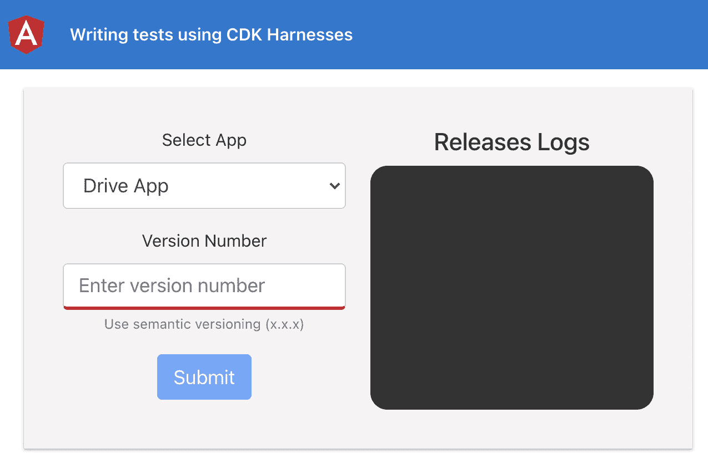

图 10.13 - 在 http://localhost:4200 上运行的 tests-using-cdk-harness 应用程序

现在应用程序正在运行，让我们继续下一节按照配方进行操作。

## 如何做...

我们有一个我们喜爱的 Angular 版本控制应用程序，允许我们创建发布日志。我们已经编写了测试，包括与 DOM 元素交互以验证一些用例的测试。让我们按照配方改用组件 harness，并发现在实际测试中使用它变得多么容易：

1.  首先，打开一个新的终端窗口/标签，并确保你在`chapter10/start_here/tests-using-cdk-harness`文件夹内。进入后，运行以下命令安装 Angular CDK：

```ts
npm install --save @angular/cdk@12.0.0
```

1.  你需要重新启动你的 Angular 服务器。因此，重新运行`ng serve`命令。

1.  首先，我们将为`ReleaseFormComponent`创建一个**组件 harness**。让我们在`release-form`文件夹内创建一个新文件，并将其命名为`release-form.component.harness.ts`。然后，在其中添加以下代码：

```ts
import { ComponentHarness } from '@angular/cdk/testing';
export class ReleaseFormComponentHarness extends ComponentHarness {
  static hostSelector = 'app-release-form';
  protected getSubmitButton = this.  locatorFor('button[type=submit]');
  protected getAppNameInput = this.  locatorFor(`#appName`);
  protected getAppVersionInput = this.  locatorFor(`#versionNumber`);
  protected getVersionErrorEl = async () => {
    const alerts = await this.locatorForAll('.alert.    alert-danger')();
    return alerts[1];
  };
}
```

1.  现在我们需要为我们的`VersionControlComponent`测试设置 harness 环境。为此，我们将使用 Angular CDK 中的`HarnessLoader`和`TestbedHarnessEnvironment`。按照以下方式更新`version-control.component.spec.ts`文件：

```ts
...
import { HarnessLoader } from '@angular/cdk/testing';
import { TestbedHarnessEnvironment } from '@angular/cdk/testing/testbed';
describe('VersionControlComponent', () => {
  let component: VersionControlComponent;
  let fixture: ComponentFixture<VersionControlComponent>;
  let harnessLoader: HarnessLoader;
  ...
  beforeEach(() => {
    fixture = TestBed.    createComponent(VersionControlComponent);
    component = fixture.componentInstance;
    fixture.detectChanges();
    harnessLoader = TestbedHarnessEnvironment.    loader(fixture);
  });
  ...
});
```

1.  现在，让我们在我们的`ReleaseFormComponentHarness`类中编写一些方法来获取相关信息。我们将在后续步骤中使用这些方法。按照以下方式更新`release-form.component.harness.ts`文件：

```ts
...
export class ReleaseFormComponentHarness extends ComponentHarness {
  ...
  async getSelectedAppName() {
    const appSelectInput = await this.getAppNameInput();
    return appSelectInput.getProperty('value');
  }
  async clickSubmit() {
    const submitBtn = await this.getSubmitButton();
    return await submitBtn.click();
  }
  async setNewAppVersion(version: string) {
    const versionInput = await this.getAppVersionInput();
    return await versionInput.sendKeys(version);
  }
  async isVersionErrorShown() {
    const versionErrorEl = await this.    getVersionErrorEl();
    const versionErrorText = await versionErrorEl.text();
    return (
      versionErrorText.trim() === 'Please write an       appropriate version number'
    );
  }
}
```

1.  接下来，我们将使用组件 harness 来进行我们的第一个测试，命名为“'应该选择第一个应用程序以进行新的发布日志'”。按照以下方式更新`version-control.component.spec.ts`文件：

```ts
...
import { ReleaseFormComponentHarness } from '../release-form/release-form.component.harness';
describe('VersionControlComponent', () => {
  ...
  it('should have the first app selected for the new   release log', async () => {
    const rfHarness = await harnessLoader.getHarness(
      ReleaseFormComponentHarness
    );
    const appSelect = await rfHarness.    getSelectedAppName();
    expect(appSelect).toBe(Apps.DRIVE);
  });
  ...
});
```

现在如果你运行`npm run test`，你应该看到所有的测试都通过了，这意味着我们使用组件 harness 进行的第一个测试成功了。哇呼！

1.  现在，我们将开始进行第二个测试，即“'应该在输入错误的版本号时显示错误'”。按照以下方式更新`version-control.component.spec.ts`文件中的测试：

```ts
...
describe('VersionControlComponent', () => {
  ...
  it('should show error on wrong version number input',   async () => {
    const rfHarness = await harnessLoader.getHarness(
      ReleaseFormComponentHarness
    );
    await rfHarness.setNewAppVersion('abcd');
    const isErrorshown = await rfHarness.    isVersionErrorShown();
    expect(isErrorshown).toBeTruthy();
  });
  ...
});
```

砰！请注意，我们刚刚将此测试的代码行数从九个语句减少到了只有四个语句。这不是很神奇吗？老实说，我认为这很棒，而且更加清晰。

1.  对于最终的测试，我们还需要为`ReleaseLogsComponent`创建一个组件测试工具。让我们快速创建它。在`release-logs`文件夹中添加一个名为`release-logs.component.harness.ts`的新文件，并添加以下代码：

```ts
import { ComponentHarness } from '@angular/cdk/testing';
export class ReleaseLogsComponentHarness extends ComponentHarness {
  static hostSelector = 'app-release-logs';
  protected getLogsElements = this.locatorForAll   ('.logs__item');
  async getLogsLength() {
    const logsElements = await this.getLogsElements();
    return logsElements.length;
  }
  async getLatestLog() {
    const logsElements = await this.getLogsElements();
    return await logsElements[0].text();
  }
  async validateLatestLog(version, app) {
    const latestLogText = await this.getLatestLog();
    return (
      latestLogText.trim() === `Version ${version}       released for app ${app}`
    );
  }
}
```

1.  最后，让我们修改`version-control.component.spec.ts`文件中的最终测试如下：

```ts
...
import { ReleaseFormComponentHarness } from '../release-form/release-form.component.harness';
import { ReleaseLogsComponentHarness } from '../release-logs/release-logs.component.harness';
describe('VersionControlComponent', () => {
  ...
  it('should show the new log in the list after adding   submitting a new log', async () => {
    const rfHarness = await harnessLoader.getHarness(
      ReleaseFormComponentHarness
    );
    const rLogsHarness = await harnessLoader.getHarness(
      ReleaseLogsComponentHarness
    );
    let logsLength = await rLogsHarness.getLogsLength();
    expect(logsLength).toBe(0); // no logs initially
    const APP = Apps.DRIVE;
    const VERSION = '2.3.6';
    await rfHarness.setNewAppVersion(VERSION);
    await rfHarness.clickSubmit();
    logsLength = await rLogsHarness.getLogsLength();
    expect(logsLength).toBe(1);
    const isNewLogAdded = await rLogsHarness.    validateLatestLog(VERSION, APP);
    expect(isNewLogAdded).toBe(true);
  });
});
```

哇！使用 Angular CDK 组件测试工具进行了一些令人惊叹的测试。如果现在运行测试，你应该能看到所有的测试都通过了。现在你已经完成了这个教程，请参考下一节来了解它是如何工作的。

## 它是如何工作的...

好了！这是一个很酷的教程，我自己很喜欢。这个教程的关键因素是`@angular/cdk/testing`包。如果你之前使用 Protractor 进行过`e2e`测试，这与 Protractor 中的`Pages`概念类似。首先，我们为`ReleaseLogsComponent`和`ReleaseFormComponent`分别创建了一个组件测试工具。

请注意，我们从`@angular/cdk/testing`导入了`ComponentHarness`类来为两个组件测试工具。然后，我们从`ComponentHarness`类扩展了我们的自定义类`ReleaseFormComponentHarness`和`ReleaseLogsComponentHarness`。基本上，这是编写组件测试工具的正确方式。你注意到了叫做`hostSelector`的静态属性吗？我们需要为我们创建的每个组件测试工具类添加这个属性。而且这个值总是目标元素/组件的选择器。这确保了当我们将这个测试工具加载到测试环境中时，环境能够在 DOM 中找到宿主元素，也就是我们正在创建组件测试工具的元素。在我们的组件测试工具类中，我们使用`this.locatorFor()`方法来查找宿主组件中的元素。`locateFor()`方法接受一个参数，即要查找的元素的`css 选择器`，并返回一个`AsyncFactoryFn`。这意味着返回的值是一个我们可以在以后使用的函数，用来获取所需的元素。

在`ReleaseFormComponentHarness`类中，我们使用`protected`方法`getSubmitButton`、`getAppNameInput`和`getAppVersionInput`分别找到提交按钮、应用程序名称输入和版本号输入，这些方法都是`AsyncFactoryFn`类型，如前所述。我们将这些方法设置为`protected`，因为我们不希望编写单元测试的人访问或关心 DOM 元素的信息。这样做可以让每个人更轻松地编写测试，而不用担心访问 DOM 的内部实现。

请注意，`getVersionErrorEl()`方法略有不同。它实际上不是`AsyncFactoryFn`类型。相反，它是一个常规的`async`函数，首先调用`locatorForAll`方法获取所有具有`alert`类和`alert-danger`类的元素，这些元素是错误消息。然后，它选择第二个警报元素，用于应用程序版本号输入。

这里需要提到的一件重要的事情是，当我们调用`locatorFor()`方法或`locatorForAll()`方法时，我们会得到一个带有`TestElement`项的`Promise`，或者一个`TestElement`项列表的`Promise`。每个`TestElement`项都有一堆方便的方法，比如`.click()`、`.sendKeys()`、`.focus()`、`.blur()`、`.getProperty()`、`.text()`等等。这些方法是我们感兴趣的，因为我们在幕后使用它们与 DOM 元素进行交互。

现在，让我们谈谈如何配置测试环境。在`version-control.component.spec.ts`文件中，我们设置环境使用`ReleaseLogsComponent`和`ReleaseFormComponent`的组件挽具。这里的关键元素是`TestbedHarnessEnvironment`元素。我们使用`TestbedHarnessEnvironment`类的`.loader()`方法，通过提供我们的`fixture`作为参数。请注意，fixture 是我们在测试环境中使用`TestBed.createComponent(VersionControlComponent)`语句获得的。因为我们将这个 fixture 提供给`TestbedHarnessEnvironment.loader()`方法，我们得到了一个`HarnessLoader`语句的元素，现在可以为其他组件加载组件挽具，即`ReleaseLogsComponent`和`ReleaseFormComponent`。

请注意，在测试中，我们使用 `harnessLoader.getHarness()` 方法，通过提供 harness 类作为参数。这使得测试环境能够找到与 harness 类的 `hostSelector` 属性相关联的 DOM 元素。此外，我们还可以获得组件 harness 的实例，以便在测试中进一步使用。

## 另请参阅

+   使用组件 harness 在 DOM 中查找组件 (`https://material.angular.io/cdk/test-harnesses/overview#finding-elements-in-the-components-dom`)

+   *组件 harness 作者的 API* (`https://material.angular.io/cdk/test-harnesses/overview#api-for-component-harness-authors`)

# 使用 Observables 进行组件的单元测试

如果您正在构建 Angular 应用程序，很可能会在应用程序中的某个时候使用 Observables。例如，您可能会从第三方 API 获取数据，或者仅仅是管理状态。在任何情况下，测试具有 Observables 的应用程序会变得稍微困难。在本食谱中，我们将学习如何使用 Observables 进行单元测试。

## 准备就绪

此食谱的项目位于 `chapter10/start_here/unit-testing-observables`。执行以下步骤：

1.  在 Visual Studio Code 中打开项目。

1.  打开终端并运行 `npm install` 来安装项目的依赖项。

1.  完成后，运行 `ng serve -o`。

这将在新的浏览器选项卡中打开应用程序。您应该看到类似以下截图的内容：

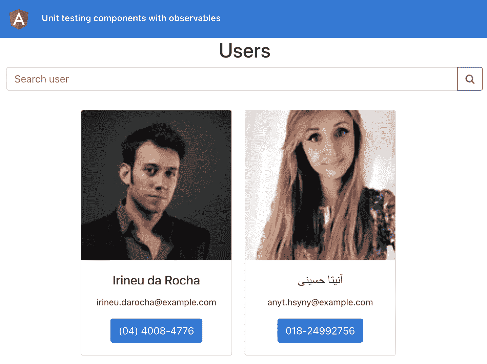

图 10.14 – 在 http://localhost:4200 上运行的 unit-testing-observables 应用程序

现在我们已经在本地运行了应用程序，在下一节中，让我们来看一下食谱的步骤。

## 如何做…

我们将首先编写测试用例，这在技术上涉及使用 Observables。基本上，我们必须使用 Observables 模拟方法，并且必须使用 Angular 提供的 `fakeAsync` 和 `tick()` 方法来达到编写具有 Observables 的良好单元测试的目标。让我们开始吧：

1.  首先，我们将编写一个测试，看看当我们在包含 Observable 的函数中使用 `expect()` 语句时会发生什么。通过在 `users.component.spec.ts` 文件中添加一个测试，检查在组件初始化时是否从服务器获取用户：

```ts
import { HttpClientModule } from '@angular/common/http';
import {
  ComponentFixture,
  fakeAsync,
  TestBed,
  tick,
} from '@angular/core/testing';
...
describe('UsersComponent', () => {
  ...
  it('should get users back from the API component init',   fakeAsync(() => {
    component.ngOnInit();
    tick(500);
    expect(component.users.length).toBeGreaterThan(0);
  }));
});
```

现在，一旦你运行`npm run test`命令，你会看到测试失败并显示以下消息：

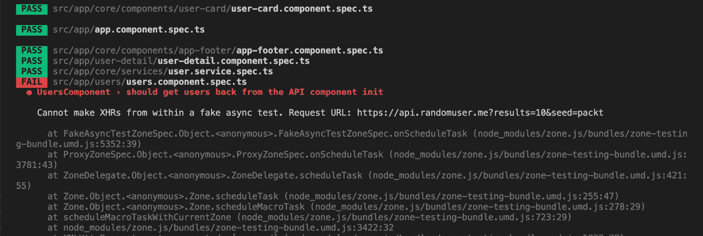

图 10.15 - 错误 - 无法在伪异步测试中进行 XHR 请求

这意味着我们不能在`fakeAsync`测试中进行真实的 HTTP 调用，这就是在调用`ngOnInit()`方法后发生的情况。

1.  正确的测试方法是模拟`UserService`。幸运的是，我们已经在项目中做过这个，因为我们有`UserServiceMock`类。我们需要将它提供为`TestBed`中`UserService`的`useClass`属性，并稍微更新我们的测试。让我们修改`users.component.spec.ts`文件，如下所示：

```ts
...
import {
  DUMMY_USERS,
  UserServiceMock,
} from 'src/__mocks__/services/user.service.mock';
...
describe('UsersComponent', () => {
  ...
  beforeEach(async () => {
    await TestBed.configureTestingModule({
      declarations: [UsersComponent, UserCardComponent],
      providers: [
        {
          provide: UserService,
          useClass: UserServiceMock,
        },
      ],
      imports: [HttpClientModule, ReactiveFormsModule,       RouterTestingModule],
    }).compileComponents();
  });
  ...
  it('should get users back from the API component init',   fakeAsync(() => {
    component.ngOnInit();
    tick(500);
    expect(component.users.length).toBe(2);
    expect(component.users).toEqual(DUMMY_USERS);
  }));
});
```

现在，如果你再次运行测试，它们应该通过。我们稍后会在*它是如何工作...*部分详细介绍这一点。

1.  让我们为一个想要搜索用户的场景添加另一个测试。我们将设置`username`表单控件的值，并使用`UserService`或更准确地说是`UserServiceMock`来搜索用户。然后，我们期望结果是合适的。在`users.component.spec.ts`文件中添加一个测试，如下所示：

```ts
...
describe('UsersComponent', () => {
  ...
  it('should get the searched users from the API upon   searching', fakeAsync(() => {
    component.searchForm.get('username').    setValue('hall');
    // the second record in our DUMMY_USERS array has     the name Mrs Indie Hall
    const expectedUsersList = [DUMMY_USERS[1]];
    component.searchUsers();
    tick(500);
    expect(component.users.length).toBe(1);
    expect(component.users).toEqual(expectedUsersList);
  }));
});
```

1.  现在我们将为`UserDetailComponent`编写一个测试。我们需要测试当组件初始化时，`UserDetailComponent`能否从服务器获取到适当的用户，并且我们也能获取到相似的用户。在`user-detail.component.spec.ts`文件中添加一个测试，如下所示：

```ts
...
import {..., fakeAsync, tick, } from '@angular/core/testing';
...
import { UserServiceMock } from 'src/__mocks__/services/user.service.mock';
describe('UserDetailComponent', () => {
  ...
  beforeEach(
    waitForAsync(() => {
      TestBed.configureTestingModule({
        declarations: [...],
        imports: [HttpClientModule, RouterTestingModule],
        providers: [
          {
            provide: UserService,
            useClass: UserServiceMock,
          },
        ],
      }).compileComponents();
    })
  );
  ...
  it('should get the user based on routeParams on page   load', fakeAsync(() => {
    component.ngOnInit();
    tick(500);
    expect(component.user).toBeTruthy();
  }));
});
```

新的测试目前应该是失败的。我们将在接下来的步骤中修复它。

1.  为了调试，我们可以在`ngOnInit()`方法中订阅`route.paramMap` Observable 并快速添加一个`console.log()`来打印我们从`params`中获取的内容。修改`user-detail.component.ts`文件，然后再次运行测试：

```ts
...
@Component({...})
export class UserDetailComponent implements OnInit, OnDestroy {
  ...
  ngOnInit() {
    this.isComponentAlive = true;
    this.route.paramMap
      .pipe(
        takeWhile(() => !!this.isComponentAlive),
        flatMap((params) => {
          this.user = null;
          console.log('params', params);
          ...
          return this.userService.getUser(userId).          pipe(...);
        })
      )
      .subscribe((similarUsers: IUser[]) => {...});
  }
  ...
}
```

现在当你运行测试时，你会看到错误，如下所示：

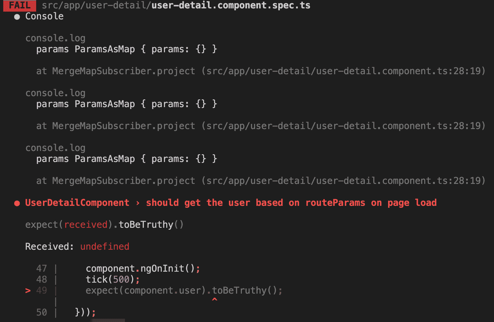

图 10.16 - 错误 - 空参数和缺少 uuid

1.  正如你在*图 10.16*中所看到的，我们在`Params`对象中没有`uuid`。这是因为这不是一个真实用户的真实路由过程。因此，我们需要模拟`UserDetailComponent`中使用的`ActivatedRoute`服务以获得期望的结果。让我们在`__mocks__`文件夹内创建一个名为`activated-route.mock.ts`的新文件，并将以下代码添加到其中：

```ts
import { convertToParamMap, ParamMap, Params } from '@angular/router';
import { ReplaySubject } from 'rxjs';
/**
 * An ActivateRoute test double with a `paramMap`  observable.
 * Use the `setParamMap()` method to add the next  `paramMap` value.
 */
export class ActivatedRouteMock {
  // Use a ReplaySubject to share previous values with   subscribers
  // and pump new values into the `paramMap` observable
  private subject = new ReplaySubject<ParamMap>();
  constructor(initialParams?: Params) {
    this.setParamMap(initialParams);
  }
  /** The mock paramMap observable */
  readonly paramMap = this.subject.asObservable();
  /** Set the paramMap observables's next value */
  setParamMap(params?: Params) {
    this.subject.next(convertToParamMap(params));
  }
}
```

1.  现在我们将在`UserDetailComponent`的测试中使用这个模拟。更新`user-detail.component.spec.ts`文件，如下所示：

```ts
...
import { ActivatedRouteMock } from 'src/__mocks__/activated-route.mock';
import {
  DUMMY_USERS,
  UserServiceMock,
} from 'src/__mocks__/services/user.service.mock';
...
describe('UserDetailComponent', () => {
  ...
  let activatedRoute;
  beforeEach(
    waitForAsync(() => {
      TestBed.configureTestingModule({
        ...
        providers: [
          {...},
          {
            provide: ActivatedRoute,
            useValue: new ActivatedRouteMock(),
          },
        ],
      }).compileComponents();
    })
  );
  beforeEach(() => {
    ...
    fixture.detectChanges();
    activatedRoute = TestBed.inject(ActivatedRoute);
  });
  ...
});
```

1.  现在我们已经将模拟注入到测试环境中，让我们修改我们的测试以从`DUMMY_USERS`数组中获取第二个用户。更新测试文件如下：

```ts
...
describe('UserDetailComponent', () => {
  ...
  it('should get the user based on routeParams on page   load', fakeAsync(() => {
    component.ngOnInit();
    activatedRoute.setParamMap({ uuid: DUMMY_USERS[1].    login.uuid });
    tick(500);
    expect(component.user).toEqual(DUMMY_USERS[1]);
  }));
});
```

1.  现在我们将编写一个测试，当加载`UserDetailComponent`时，允许我们获取相似的用户。请记住，根据我们当前的业务逻辑，相似的用户是除了页面上保存在`user`属性中的当前用户之外的所有用户。让我们在`user-detail.component.spec.ts`文件中添加测试，如下所示：

```ts
...
describe('UserDetailComponent', () => {
  ...
  it('should get similar user based on routeParams uuid   on page load', fakeAsync(() => {
    component.ngOnInit();
    activatedRoute.setParamMap({ uuid: DUMMY_USERS[1].    login.uuid }); // the second user's uuid
    const expectedSimilarUsers = [DUMMY_USERS[0]]; //     the first user
    tick(500);
    expect(component.similarUsers).    toEqual(expectedSimilarUsers);
  }));
});
```

如果你运行测试，你应该看到它们都通过，如下所示：

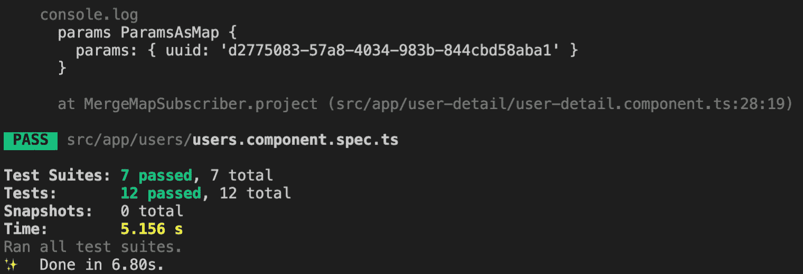

图 10.17 - 所有的测试都通过了模拟的 Observables

太棒了！现在你知道如何在编写组件的单元测试时使用 Observables 了。虽然在 Angular 中测试 Observables 还有很多要学习的，但这个教程的目的是保持一切简单和甜美。

现在你已经完成了这个教程，请参考下一节以了解它是如何工作的。

## 它是如何工作的...

我们通过使用`'@angular/core/testing'`包中的`fakeAsync()`和`tick()`方法来开始我们的教程。请注意，我们使用`fakeAsync()`方法包装我们测试的回调方法。在`fakeAsync()`方法中包装的方法是在一个叫做`fakeAsync`区域中执行的。这与实际的 Angular 应用程序运行在`ngZone`内的方式相反。

重要提示

为了使用`fakeAsync`区域，我们需要在测试环境中导入`zone.js/dist/zone-testing`库。当你创建一个 Angular 项目时，通常会在`src/test.ts`文件中进行这个操作。然而，由于我们迁移到了 Jest，我们删除了那个文件。

“好的。那么，它是如何工作的，阿赫桑？”好吧，我很高兴你问。在为 Jest 设置时，我们使用`jest-preset-angular`包。这个包最终需要为`fakeAsync`测试导入所有必要的文件，如下所示：

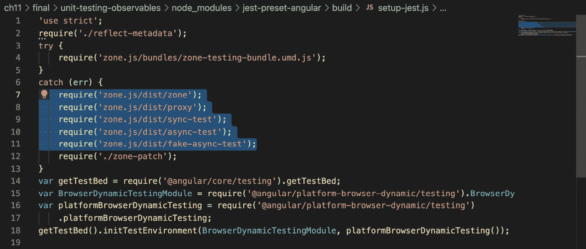

图 10.18 - jest-preset-angular 包导入所需的 zone.js 文件

基本上，`tick()`方法在这个虚拟的`fakeAsync`区域中模拟时间的流逝，直到所有的异步任务都完成。它接受一个毫秒参数，反映了经过了多少毫秒或虚拟时钟前进了多少。在我们的情况下，我们使用`500`毫秒作为`tick()`方法的值。

请注意，我们为`UsersComponent`的测试模拟了`UserService`。特别是对于`'should get users back from the API component init'`，我们在测试中调用了`component.ngOnInit()`方法，然后调用了`tick()`方法。同时，`ngOnInit()`方法调用了`searchUsers()`方法，该方法调用了`UserServiceMock.searchUsers()`方法，因为我们在测试环境中为`UserService`提供了`useClass`属性。最后，它返回了我们在`user.service.mock.ts`文件中定义的`DUMMY_USERS`数组的值。对于`UsersComponent`的另一个测试，`'should get the searched users from the API upon searching'`，也是非常相似的。

关于`UserDetailComponent`的测试，我们做了一些不同的事情，也就是，我们还必须模拟`activatedRoute`服务。为什么？那是因为`UserDetailComponent`是一个可以使用`uuid`导航的页面，并且因为它的路径在`app-routing.module.ts`文件中被定义为`'/users/:uuid'`。因此，我们需要在我们的测试中填充这个`uuid`参数，以便与`DUMMY_USERS`数组一起使用。为此，我们在`__mocks__`文件夹中使用`ActivatedRouteMock`类。请注意，它有一个`setParamMap()`方法。这允许我们在测试中指定`uuid`参数。然后，当实际代码订阅`this.route.paramMap`可观察对象时，我们设置的`uuid`参数就可以在那里找到。

对于`'should get the user based on routeParams on page load'`测试，我们将`DUMMY_USERS`数组中的第二个用户的`uuid`设置为`uuid`路由参数的值。然后，我们使用`tick()`方法，之后我们期望`user`属性的值是`DUMMY_USERS`数组中的第二个用户。文件中的另一个测试也是非常相似和不言自明的。有关单元测试场景的更多有用链接，请参考下一节。

## 另外

+   Angular 测试组件场景（[`docs.angular.lat/guide/testing-components-scenarios`](https://docs.angular.lat/guide/testing-components-scenarios)）

+   使用`RouterTestingModule`测试路由的 Angular 组件（[`dev.to/this-is-angular/testing-angular-routing-components-with-the-routertestingmodule-4cj0`](https://dev.to/this-is-angular/testing-angular-routing-components-with-the-routertestingmodule-4cj0)）

## 单元测试 Angular 管道

在我个人看来，管道是 Angular 应用程序中最容易测试的组件。为什么？嗯，这是因为它们（应该）是根据相同的输入集返回相同结果的纯函数。在这个食谱中，我们将为 Angular 应用程序中的一个非常简单的管道编写一些测试。

## 准备工作

我们要处理的项目位于`chapter10/start_here/unit-testing-pipes`中，这是在克隆的存储库中。执行以下步骤：

1.  在 Visual Studio Code 中打开项目。

1.  打开终端并运行`npm install`来安装项目的依赖项。

1.  完成后，运行`ng serve -o`。

这将在新的浏览器选项卡中打开应用程序。您应该看到类似以下截图的内容：

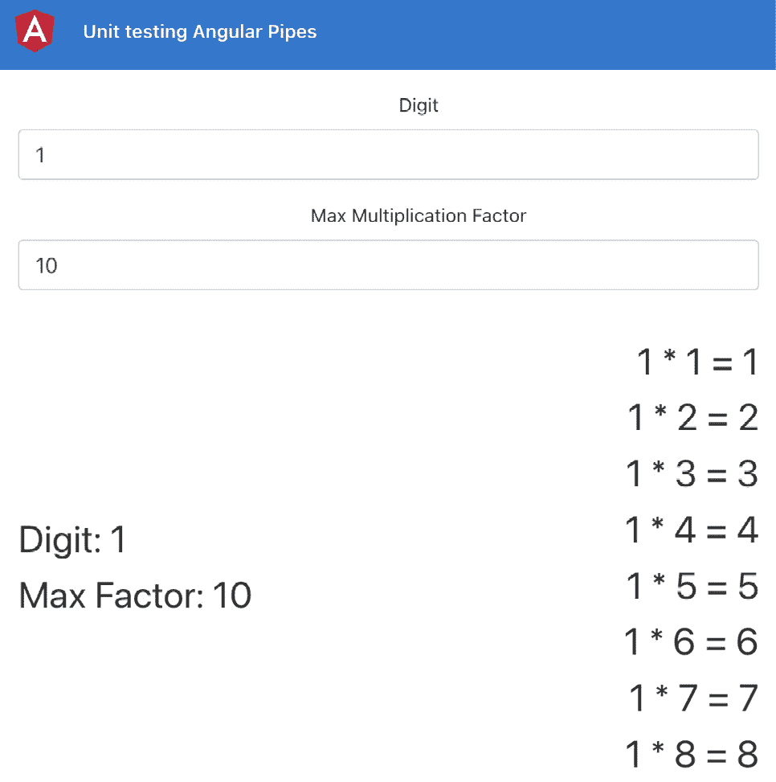

图 10.19 - 运行在 http://localhost:4200 上的 unit-testing-pipes 应用程序

既然我们已经在本地运行了应用程序，在下一节中，让我们按照食谱的步骤进行。

## 如何做...

在这里，我们有一个简单的食谱，需要两个输入 - 数字和最大因子值。根据这些输入，我们显示一个乘法表。根据我们的业务逻辑，我们已经有了工作正常的`MultTablePipe`。现在我们将编写一些单元测试来验证我们的输入和预期输出，如下所示：

1.  让我们为`MultTablePipe`编写我们的第一个测试。我们将确保当`digit`输入的值无效时，它返回一个空数组。更新`mult-table.pipe.spec.ts`文件，如下所示：

```ts
...
describe('MultTablePipe', () => {
  ...
  it('should return an empty array if the value of digit   is not valid', () => {
    const digit = 0;
    const limit = 10;
    const outputArray = pipe.transform(null, digit,     limit);
    expect(outputArray).toEqual([]);
  });
});
```

1.  让我们编写另一个测试，验证`limit`输入，以便在无效时也返回一个空数组：

```ts
...
describe('MultTablePipe', () => {
  ...
  it('should return an empty array if the value of limit   is not valid', () => {
    const digit = 10;
    const limit = 0;
    const outputArray = pipe.transform(null, digit,     limit);
    expect(outputArray).toEqual([]);
  });
});
```

1.  现在我们将编写一个测试，验证管道的转换方法的输出，在`digit`和`limit`输入都有效时。在这种情况下，我们应该得到包含乘法表的数组。编写另一个测试如下：

```ts
...
describe('MultTablePipe', () => {
  ...
  it('should return the correct multiplication table when   both digit and limit inputs are valid', () => {
    const digit = 10;
    const limit = 2;
    const expectedArray = ['10 * 1 = 10', '10 * 2 = 20'];
    const outputArray = pipe.transform(null, digit,     limit);
    expect(outputArray).toEqual(expectedArray);
  });
});
```

1.  现在，在应用程序中，我们有可能为“限制”输入提供小数位数。例如，我们可以在输入中将`2.5`写为最大因子。为了处理这个问题，我们在`MultTablePipe`中使用“Math.floor（）”将其向下舍入到较低的数字。让我们编写一个测试来确保这个功能有效：

```ts
...
describe('MultTablePipe', () => {
  ...
  it('should round of the limit if it is provided in   decimals', () => {
    const digit = 10;
    const limit = 3.5;
    const expectedArray = ['10 * 1 = 10', '10 * 2 = 20',     '10 * 3 = 30']; // rounded off to 3 factors instead     of 3.5
    const outputArray = pipe.transform(null, digit,     limit);
    expect(outputArray).toEqual(expectedArray);
  });
});
```

易如反掌！为 Angular 管道编写测试是如此直接，以至于我喜欢它。我们可以称之为纯函数的力量。现在您已经完成了这个步骤，请参考下一节以获取更多信息链接。

## 另请参阅

+   测试 Angular 管道官方文档（https://angular.io/guide/testing-pipes）

+   使用服务测试 Angular 管道（https://levelup.gitconnected.com/test-angular-pipes-with-services-4cf77e34e576）
