# 第十一章：*第十一章*：使用 Cypress 在 Angular 中进行 E2E 测试

一个应用程序有几个端到端（E2E）测试，肯定比一个没有测试的应用程序更可靠，在当今世界，随着新兴企业和复杂应用程序的出现，编写端到端测试以捕获整个应用程序流程变得至关重要。Cypress 是当今用于 Web 应用程序的 E2E 测试的最佳工具之一。在本章中，您将学习如何使用 Cypress 在 Angular 应用程序中测试您的 E2E 流程。以下是本章中要涵盖的内容：

+   编写您的第一个 Cypress 测试

+   验证文档对象模型（DOM）元素是否在视图上可见

+   测试表单输入和提交

+   等待 XMLHttpRequest（XHR）完成

+   使用 Cypress 捆绑包

+   使用 Cypress fixtures 提供模拟数据。

# 技术要求

在本章的配方中，请确保您的计算机上已安装了 Git 和 Node.js。您还需要安装 `@angular/cli` 包，您可以在终端中使用 `npm install -g @angular/cli` 来完成。本章的代码可以在 [`github.com/PacktPublishing/Angular-Cookbook/tree/master/chapter11`](https://github.com/PacktPublishing/Angular-Cookbook/tree/master/chapter11) 找到。

# 编写您的第一个 Cypress 测试

如果您已经在编写 E2E 测试，您可能已经使用 Protractor 进行了这项工作。不过，使用 Cypress 是完全不同的体验。在这个配方中，您将使用现有的 Angular 应用程序设置 Cypress，并将使用 Cypress 编写您的第一个 E2E 测试。

## 准备工作

我们要处理的项目位于克隆存储库中的 `chapter11/start_here/angular-cypress-starter` 中：

1.  在 Visual Studio Code 中打开项目（VS Code）。

1.  打开终端并运行 `npm install` 来安装项目的依赖项。

现在我们已经在本地打开了项目，让我们在下一节中看看这个配方的步骤。

## 如何做…

我们要处理的应用程序是一个简单的计数器应用程序。它有最小和最大值，以及一些按钮，可以增加、减少和重置计数器的值。我们将首先为我们的应用程序配置 Cypress，然后开始编写测试：

1.  首先，打开一个新的终端窗口/标签，并确保你在`chapter11/start_here/angular-cypress-starter`文件夹内。进入后，运行以下命令在我们的项目中安装`Cypress`和`concurrently`：

```ts
npm install -d cypress concurrently
```

1.  现在，打开你的`package.json`文件，并在`scripts`对象内添加以下脚本，如下所示：

```ts
{
  "name": "angular-cypress-starter",
  "version": "0.0.0",
  "scripts": {
    ... 
    "e2e": "ng e2e",
    "start:cypress": "cypress open",
  "cypress:test": "concurrently 'npm run start' 'npm run   start:cypress'"
  },
  ...
}
```

1.  让我们运行`cypress:test`命令，同时启动`http://localhost:4200`的 Angular 服务器，并开始 Cypress 测试，如下所示：

```ts
npm run cypress:test
```

你还应该看到 Cypress 默认创建了一个名为`cypress`的文件夹，并在其中创建了一些示例测试。Cypress 还创建了一个`cypress.json`文件来提供一些配置。我们不会删除这些默认测试，而是在下一步中忽略它们。

1.  通过修改`cypress.json`文件来忽略默认/示例测试，如下所示：

```ts
{
  "baseUrl": "http://localhost:4200",
  "ignoreTestFiles": "**/examples/*",
  "viewportHeight": 760,
  "viewportWidth": 1080
}
```

1.  如果你现在再看 Cypress 窗口，你会发现我们没有任何集成测试，如下所示：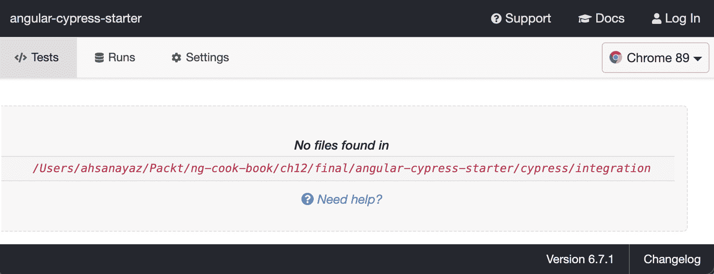

图 11.1 - 没有集成测试可执行

1.  让我们现在创建我们的第一个测试。我们只需检查我们应用程序的浏览器标题是否为**编写您的第一个 Cypress 测试**。在`cypress/integration`文件夹内创建一个名为`app.spec.js`的新文件，并粘贴以下代码：

```ts
/// <reference types="cypress" />
context('App', () => {
  beforeEach(() => {
    cy.visit('/');
  });
  it('should have the title "Writing your first Cypress   test "', () => {
    // https://on.cypress.io/title
    cy.title().should('eq', 'Writing your first Cypress     test');
  });
});
```

1.  如果你再次看 Cypress 窗口，你会看到一个名为`app.spec.js`的新文件列出，如下所示：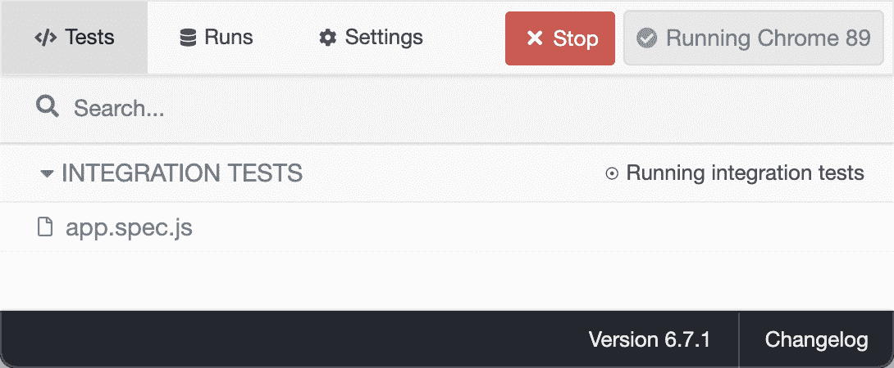

图 11.2 - 显示的新 app.spec.js 测试文件

1.  点击*图 11.2*中显示的窗口中的`app.spec.js`文件，你应该看到文件中编写的 Cypress 测试通过了。

砰！在几个步骤内，我们已经为我们的 Angular 应用程序设置了 Cypress，并编写了我们的第一个测试。你应该看到 Cypress 窗口，如下所示：

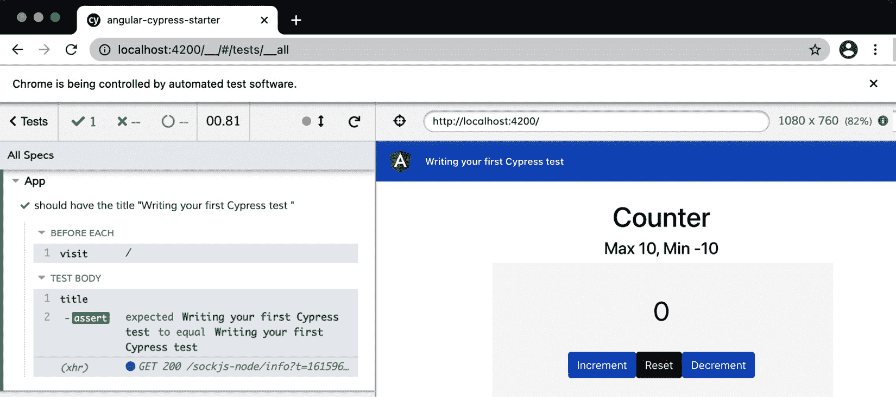

图 11.3 - 我们的第一个 Cypress 测试通过

简单吧！对吧？现在你知道如何为 Angular 应用程序配置 Cypress 了，看看下一节来了解它是如何工作的。

## 它是如何工作的…

Cypress 可以与任何框架和 Web 开发项目集成。有趣的是，Cypress 在幕后使用 Mocha 作为测试运行器。Cypress 的工具会监视代码更改，这样你就不必一次又一次地重新编译测试。Cypress 还会在被测试的应用程序周围添加一个外壳，以捕获日志并在测试期间访问 DOM 元素，并提供一些用于调试测试的功能。

在我们的 `app.spec.js` 文件的顶部，我们使用 `context()` 方法来定义测试套件，基本上是定义即将在内部编写的测试的上下文。然后，我们使用 `beforeEach()` 方法来指定每个测试执行前应该发生什么。由于每个测试都从零数据开始，我们首先必须确保 Cypress 导航到我们应用程序的 `http://localhost:4200` **统一资源定位符** (**URL**)。我们之所以只指定 `cy.visit('/')` 并且它仍然有效，是因为我们已经在 `cypress.json` 文件中指定了 `baseUrl` 属性。因此，在我们的测试中只需提供相对 URL。

最后，我们使用 `it()` 方法来指定我们第一个测试的标题，然后我们使用 `cy.title()` 方法，这是一个方便的辅助工具，来获取当前正在呈现的**超文本标记语言** (**HTML**)页面的**标题**的文本值。我们使用 `'eq'` 运算符来将其值与 `'编写你的第一个 Cypress 测试'` 字符串进行比较，一切正常！

## 另请参阅

+   `cy.title()` 文档 ([`docs.cypress.io/api/commands/title.html#Syntax`](https://docs.cypress.io/api/commands/title.html#Syntax))

+   Cypress 文档—*编写你的第一个测试* ([`docs.cypress.io/guides/getting-started/writing-your-first-test.html`](https://docs.cypress.io/guides/getting-started/writing-your-first-test.html))

# 验证 DOM 元素在视图上是否可见

在上一个示例中，我们学习了如何在 Angular 应用程序中安装和配置 Cypress。在您的应用程序中可能有不同的情况，您想要查看 DOM 上的元素是否可见。在这个示例中，我们将编写一些测试来确定 DOM 上是否有任何元素可见。

## 准备工作

此示例的项目位于 `chapter11/start_here/cypress-dom-element-visibility`：

1.  在 VS Code 中打开项目。

1.  打开终端并运行 `npm install` 来安装项目的依赖项。

1.  完成后，运行 `npm run cypress:test`。

这应该在`https://localhost:4200`上运行应用程序，并应该打开 Cypress 窗口，如下所示：

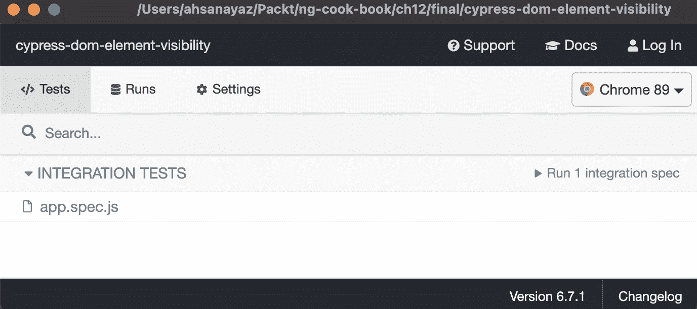

图 11.4–Cypress 测试运行 cypress-dom-element-visibility 应用程序

现在我们已经在本地运行了应用程序和 Cypress 测试，让我们在下一节中看到食谱的步骤。

## 如何做…

我们有与上一个食谱相同的旧计数器应用程序。但是，有些事情已经改变。现在我们在顶部有一个按钮，可以切换计数器组件`(CounterComponent)`的可见性。此外，我们必须悬停在计数器卡上才能看到**增加**、**减少**和**重置**操作按钮。让我们开始编写一些测试来检查计数器组件`(CounterComponent)`的可见性和操作：

1.  让我们编写一个测试，检查当我们点击**切换计数器可见性**按钮以显示它时，计数器组件`(CounterComponent)`的可见性。我们将通过断言具有`.counter__heading`和`.counter`类的元素的可见性来检查它。更新`cypress/integration/app.spec.js`文件，如下所示：

```ts
...
context('App', () => {
  ...
  it('should show the counter component when the "Toggle   Counter Visibility" button is clicked', () => {
    cy.get('.counter__heading').should('have.length', 0);
    cy.get('.counter').should('have.length', 0);
    cy.contains('Toggle Counter Visibility').click();
    cy.get('.counter__heading').should('be.visible');
    cy.get('.counter').should('be.visible');
  });
});
```

1.  现在，我们将编写一个测试，检查当我们悬停在`counter`组件上时，我们的操作按钮（**增加**、**减少**和**重置**）是否显示出来。更新`app.spec.js`文件，如下所示：

```ts
...
context('App', () => {
  ...
  it('should show the action buttons on hovering the   counter card', () => {
    cy.contains('Toggle Counter Visibility').click();
    cy.get('.counter').trigger('mouseover');
    cy.get('.counter__actions__action').    should('have.length', 3);
    cy.contains('Increment').should('be.visible');
    cy.contains('Decrement').should('be.visible');
    cy.contains('Reset').should('be.visible');
  });
});
```

如果您现在查看 Cypress 窗口，您应该看到测试失败，如下所示：

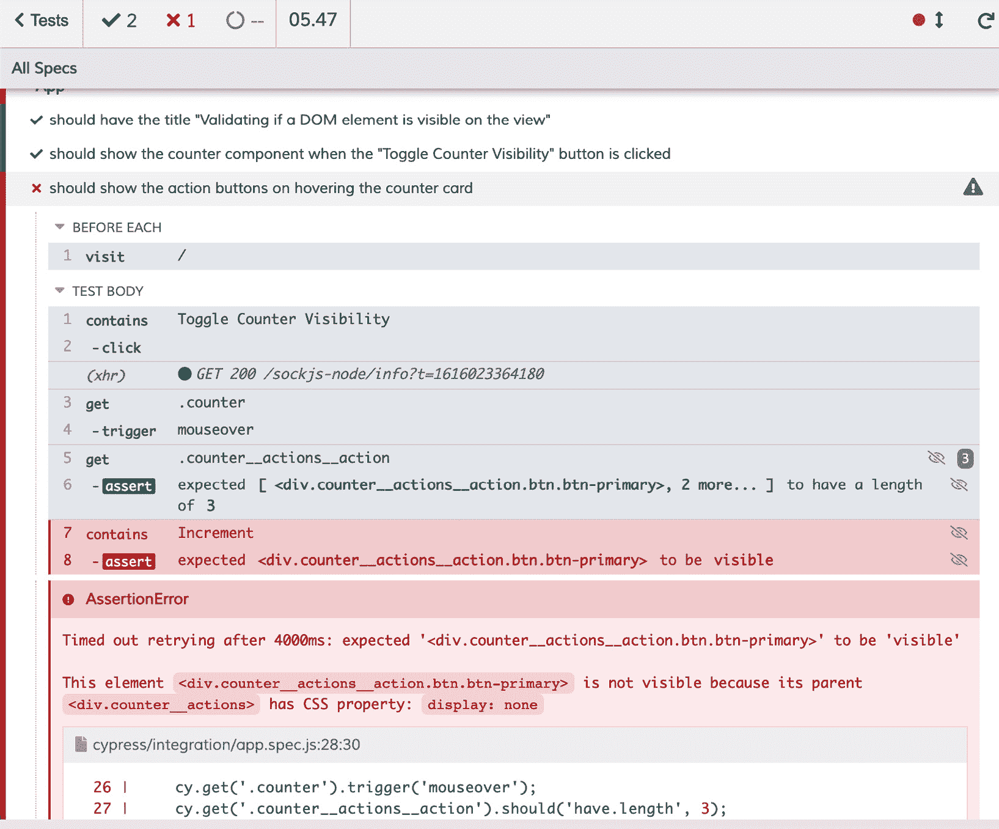

图 11.5–悬停时无法获取操作按钮

测试失败的原因是 Cypress 目前不提供**层叠样式表**（**CSS**）悬停效果。为了解决这个问题，我们将在下一步中安装一个包。

1.  停止运行 Cypress 和 Angular 应用程序，然后安装`cypress-real-events`包，如下所示：

```ts
npm install --save-dev cypress-real-events
```

1.  现在，打开`cypress/support/index.js`文件并更新如下：

```ts
...
// Import commands.js using ES2015 syntax:
import './commands';
import 'cypress-real-events/support';
...
```

1.  现在，更新`app.spec.js`文件，使用包中的`.realHover()`方法在`.counter`元素上，如下所示：

```ts
/// <reference types="cypress" />
/// <reference types="cypress-real-events" />
context('App', () => {
  ...
  it('should show the action buttons on hovering the   counter card', () => {
    cy.contains('Toggle Counter Visibility').click();
    cy.get('.counter').realHover();
    cy.get('.counter__actions__action').    should('have.length', 3);
    ...
  });
});
```

1.  现在，再次运行`cypress:test`命令，使用`npm run cypress:test`。一旦应用程序运行并且 Cypress 窗口打开，您应该看到所有测试都通过了，如下所示：

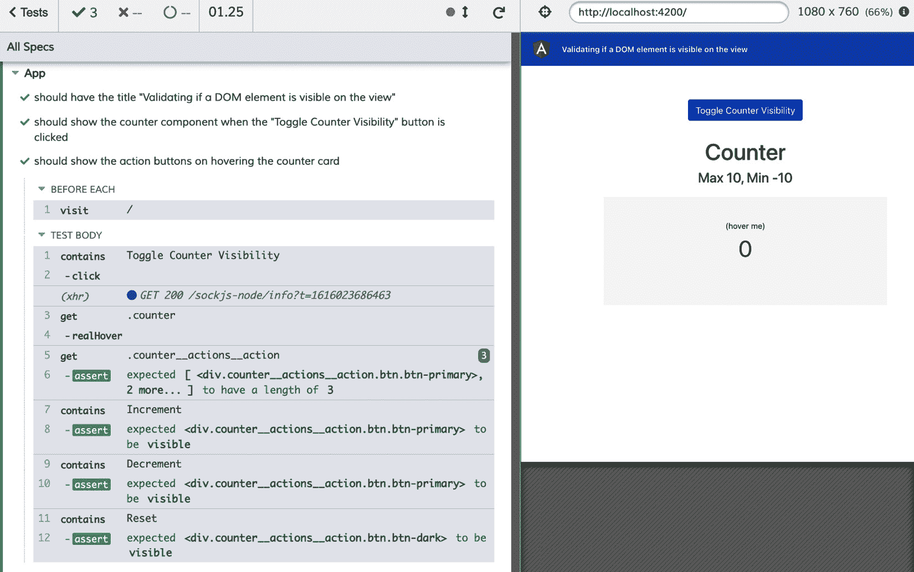

图 11.6 - 使用 cypress-real-events 包后所有测试都通过

太棒了！您刚刚学会了如何在不同场景下检查 DOM 元素的可见性。当然，这些不是唯一可用的标识和与 DOM 元素交互的选项。现在您已经完成了这个配方，请查看下一节以了解它是如何工作的。

## 它是如何工作的…

在配方的开头，在我们的第一个测试中，我们使用`.should('have.length', 0)`断言。当我们使用`'have.length'`断言时，Cypress 会检查使用`cy.get()`方法找到的 DOM 元素的`length`属性。我们使用的另一个断言是`.should('be.visible')`，它检查元素在 DOM 上是否可见。只要元素在屏幕上可见，这个断言就会通过，也就是说，父元素中没有隐藏的元素。

在后面的测试中，我们尝试悬停在具有`'.counter'`选择器的元素上，使用`cy.get('.counter').trigger('mouseover');`。这导致我们的测试失败。为什么？因为 Cypress 中的所有悬停解决方法最终都会触发 JavaScript 事件，而不会影响 CSS 伪选择器，而且由于我们的操作按钮（使用`'.counter__actions__action'`选择器）显示在具有`'.counter'`选择器的元素的`:hover`（CSS）上，我们的测试失败，因为在测试中我们的操作按钮实际上没有显示。为了解决这个问题，我们使用`cypress-real-events`包，它具有`.realHover()`方法，可以影响伪选择器，并最终显示我们的操作按钮。

## 另请参阅

+   Cypress 官方关于项目可见性的文档（[`docs.cypress.io/guides/core-concepts/interacting-with-elements.html#Visibility`](https://docs.cypress.io/guides/core-concepts/interacting-with-elements.html#Visibility)）

+   `cypress-real-events` 项目存储库（[`github.com/dmtrKovalenko/cypress-real-events`](https://github.com/dmtrKovalenko/cypress-real-events)）

# 测试表单输入和提交

如果您正在构建 Web 应用程序，很有可能您的应用程序中至少会有一个表单，当涉及到表单时，我们需要确保我们有正确的**用户体验**（**UX**）和正确的业务逻辑。有什么比编写 E2E 测试来确保一切都按预期工作更好的方法呢？在这个配方中，我们将使用 Cypress 测试登录表单。

## 做好准备

此配方的项目位于`chapter11/start_here/cy-testing-forms`中：

1.  在 VS Code 中打开项目。

1.  打开终端并运行`npm install`来安装项目的依赖项。

1.  完成后，运行`npm run cypress:test`。

这将打开一个新的 Cypress 窗口。点击`app.spec.ts`文件，你应该看到测试，如下所示：

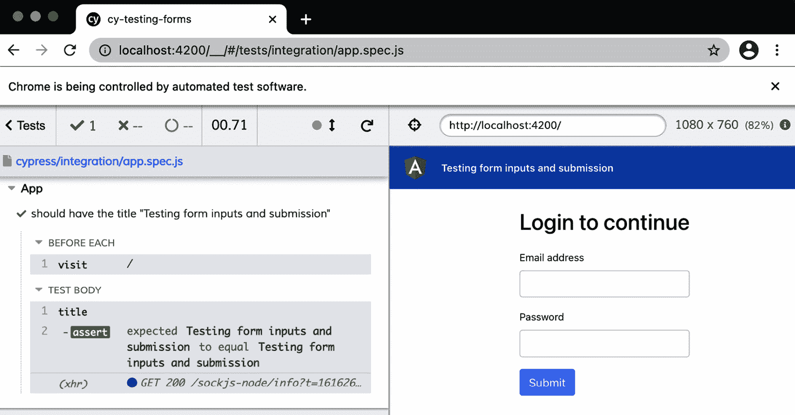

图 11.7 - Cypress 测试正在运行 cy-testing-forms 应用程序

现在我们已经运行了 Cypress 测试，让我们在下一节看看这个步骤的详细过程。

## 如何做…

我们必须确保当表单成功提交时，我们会看到一个**成功**提示。如果任何输入值无效，我们还需要确保我们看到相关的错误。让我们开始吧：

1.  让我们在`cypress/integration`文件夹中创建一个名为`login.spec.js`的新文件。

1.  首先，我们要确保除非我们有有效的表单输入，否则我们的表单不能被提交。为了做到这一点，让我们确保当没有输入值或无效值时，**提交**按钮被禁用。打开`login.spec.js`文件并添加一个测试，如下所示：

```ts
/// <reference types="cypress" />
context('Login', () => {
  beforeEach(() => {
    cy.visit('/');
  });
  it('should have the button disabled if the form inputs   are not valid', () => {
    // https://on.cypress.io/title
    // No input values
    cy.contains('Submit').should('be.disabled');
    cy.get('#passwordInput').type('password123');
    cy.contains('Submit').should('be.disabled');
    cy.get('#emailInput').type('ahsanayaz@gmail.com');
    cy.get('#passwordInput').clear();
    cy.contains('Submit').should('be.disabled');
  });
});
```

现在，在 Cypress 窗口中打开`login.spec.js`文件，你应该看到测试都通过了，如下所示：

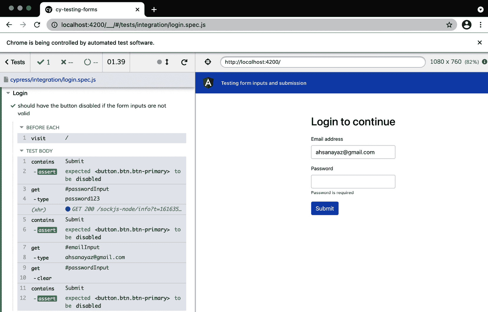

图 11.8 - 检查当输入无效时提交按钮是否被禁用

1.  让我们添加另一个测试，验证当输入正确的值时，我们会看到一个成功提示。在`login.spec.js`文件中添加另一个测试，如下所示：

```ts
...
context('Login', () => {
  ...
  it('should submit the form with the correct values and   show the success alert', () => {
    cy.get('#emailInput')
      .type('ahsan.ayaz@domain.com')
      .get('#passwordInput')
      .type('password123');
    cy.contains('Submit').click();
    cy.get('.alert.alert-success').should('be.visible');
  });
});
```

1.  现在我们将添加另一个测试，以确保成功提示在点击**关闭**按钮时隐藏。由于我们在成功登录时使用相同的逻辑/代码，我们将创建一个函数来重用它。让我们修改`login.spec.js`文件，如下所示：

```ts
...
context('Login', () => {
  ...
  it('should submit the form with the correct values and   show the success alert', () => {
    successfulLogin();
    cy.get('.alert.alert-success').should('be.visible');
  });
  it('should hide the success alert on clicking close   button', () => {
    successfulLogin();
    cy.get('.alert.alert-success').find('.btn-close').    click();
    cy.get('.alert.alert-success').should((domList) => {
      expect(domList.length).to.equal(0);
    });
  });
});
function successfulLogin() {
  cy.get('#emailInput')
    .type('ahsan.ayaz@domain.com')
    .get('#passwordInput')
    .type('password123');
  cy.contains('Submit').click();
}
```

1.  成功提示在输入更改时也应该隐藏。为了检查这一点，让我们添加另一个测试，如下所示：

```ts
...
context('Login', () => {
  ...
  it('should hide the success alert on changing the   input', () => {
    successfulLogin();
    cy.get('#emailInput').clear().    type('mohsin.ayaz@domain.com');
    cy.get('.alert.alert-success').should((domList) => {
      expect(domList.length).to.equal(0);
    });
  });
});
```

1.  最后，让我们编写一个测试，确保我们在输入无效时显示错误消息。在`logic.spec.js`文件中添加另一个测试，如下所示：

```ts
...
context('Login', () => {
 ...
  it('should show the (required) input errors on invalid   inputs', () => {
    ['#emailHelp', '#passwordHelp'].map((selector) => {
      cy.get(selector).should((domList) =>       expect(domList.length).to.equal(0));
    });
    cy.get('#emailInput').type(    'mohsin.ayaz@domain.com').clear().blur();
    cy.get('#emailHelp').should('be.visible');
    cy.get('#passwordInput').type(    'password123').clear().blur();
    cy.get('#passwordHelp').should('be.visible');
  });
});
```

如果你现在查看**测试**窗口，你应该看到所有的测试都通过了，如下所示：

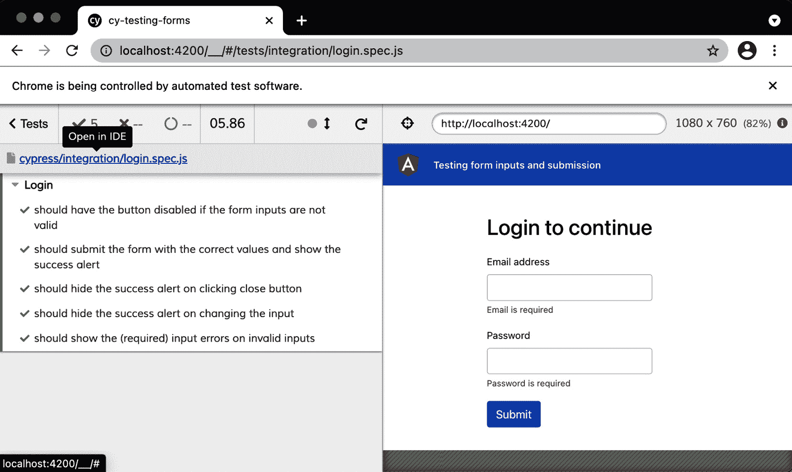

图 11.9 - 登录页面的所有测试都通过了

太棒了！现在你知道如何使用 Cypress 来测试一些有趣的用例和断言。查看下一节以了解它是如何工作的。

## 工作原理…

由于我们应用程序的逻辑规定**提交**按钮在电子邮件和密码输入都有有效值之前应该被禁用，我们在测试中检查按钮是否被禁用。我们通过在**提交**按钮上使用`'be.disabled'`断言来实现这一点，如下所示：

```ts
cy.contains('Submit').should('be.disabled');
```

然后我们在`cy.get()`选择器上使用`.type()`方法链来依次输入两个输入，并在任何输入无效值或根本没有输入时检查按钮是否被禁用。

执行成功的登录，我们执行以下代码：

```ts
cy.get('#emailInput')
    .type('ahsan.ayaz@domain.com')
    .get('#passwordInput')
    .type('password123');
  cy.contains('Submit').click();
```

注意，我们获取每个输入并在其中输入有效值，然后在**提交**按钮上调用`.click()`方法。然后，我们使用`'.alert.alert-success'`选择器和`should('be.visible')`断言来检查成功提示是否存在。

在我们想要检查成功提示在单击警报上的**关闭**按钮或任何输入更改时是否已被解除时，我们不能只使用`should('not.be.visible')`断言。这是因为在这种情况下，Cypress 会期望警报在 DOM 中，但只是不可见，而在我们的情况下（在我们的 Angular 应用程序中），元素甚至不存在在 DOM 中，因此 Cypress 无法获取它。因此，我们使用以下代码来检查成功提示甚至不存在：

```ts
cy.get('.alert.alert-success').should((domList) => {
    expect(domList.length).to.equal(0);
});
```

最后一个有趣的事情是当我们想要检查每个输入的错误消息是否在我们在任一输入中输入内容并清除输入时显示。在这种情况下，我们使用以下代码：

```ts
cy.get('#emailInput').type('mohsin.ayaz@domain.com').clear().blur();
cy.get('#emailHelp').should('be.visible');
cy.get('#passwordInput').type('password123').clear().blur();
cy.get('#passwordHelp').should('be.visible');
```

我们使用`.blur()`方法的原因是因为当 Cypress 只清除输入时，Angular 的变化检测不会立即发生，这导致错误消息不会立即显示在视图上。由于 Angular 的变化检测对浏览器事件进行了 monkey-patching，我们在两个输入上触发`.blur()`事件来触发变化检测机制。结果，我们的错误消息会正确显示。

## 另请参阅

+   Cypress recipes: Form interactions ([`github.com/cypress-io/cypress-example-recipes/tree/master/examples/testing-dom__form-interactions`](https://github.com/cypress-io/cypress-example-recipes/tree/master/examples/testing-dom__form-interactions))

+   Cypress recipes: Login form ([`github.com/cypress-io/cypress-example-recipes/tree/master/examples/logging-in__html-web-forms`](https://github.com/cypress-io/cypress-example-recipes/tree/master/examples/logging-in__html-web-forms))

# 等待 XHR 完成

测试用户界面（UI）转换是 E2E 测试的本质。虽然测试立即预测结果的重要性很高，但实际上可能存在结果有依赖性的情况。例如，如果用户填写了登录表单，我们只有在从后端服务器成功收到响应后才能显示成功的提示，因此我们无法立即测试成功提示是否显示。在这个配方中，您将学习如何等待特定的 XHR 调用完成后再执行断言。

## 准备工作

此处的配方项目位于`chapter11/start_here/waiting-for-xhr`。

1.  在 VS Code 中打开项目。

1.  打开终端并运行`npm install`来安装项目的依赖项。

1.  完成后，运行`npm run cypress:test`。

这将打开一个新的 Cypress 窗口。点击`user.spec.ts`文件，您应该会看到测试，如下所示：

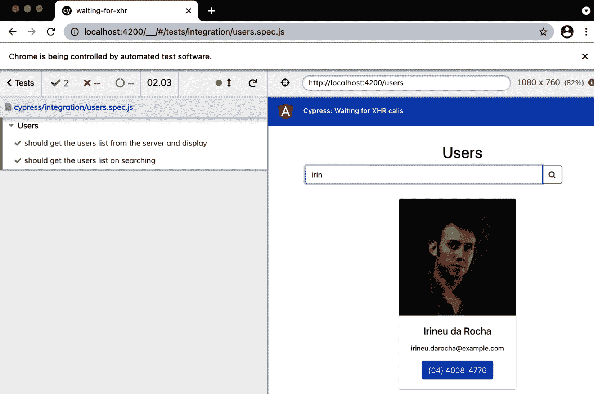

图 11.10 - Cypress 测试正在运行等待 XHR 应用程序

现在我们已经让 Cypress 测试运行起来了，让我们在下一节中看看这个配方的步骤。

## 如何做…

现在所有的测试都很好，即使我们涉及 XHR 调用来获取数据。那么，这个配方到底是关于什么的呢？嗯，Cypress 在 4,000 毫秒（4 秒）的时间内尝试断言，直到断言通过。如果我们的 XHR 花费超过 4,000 毫秒呢？让我们在这个配方中试一试：

1.  首先，我们需要模拟期望结果在 4,000 毫秒后发生的情况。我们将使用`rxjs`中的`debounceTime`操作符，延迟为 5,000 毫秒。让我们将其应用于`users.component.ts`文件中`searchForm`属性的`valueChanges` Observable，如下所示：

```ts
...
import { debounceTime, takeWhile } from 'rxjs/operators';
@Component({...})
export class UsersComponent implements OnInit {
  ...
  ngOnInit() {
    ...
    this.searchForm
      .get('username')
      .valueChanges.pipe(
        takeWhile(() => !!this.componentAlive),
        debounceTime(5000)
      )
      .subscribe(() => {
        this.searchUsers();
      });
  }
  ...
}
```

如果现在检查 Cypress 测试，您应该会看到一个测试失败，如下所示：

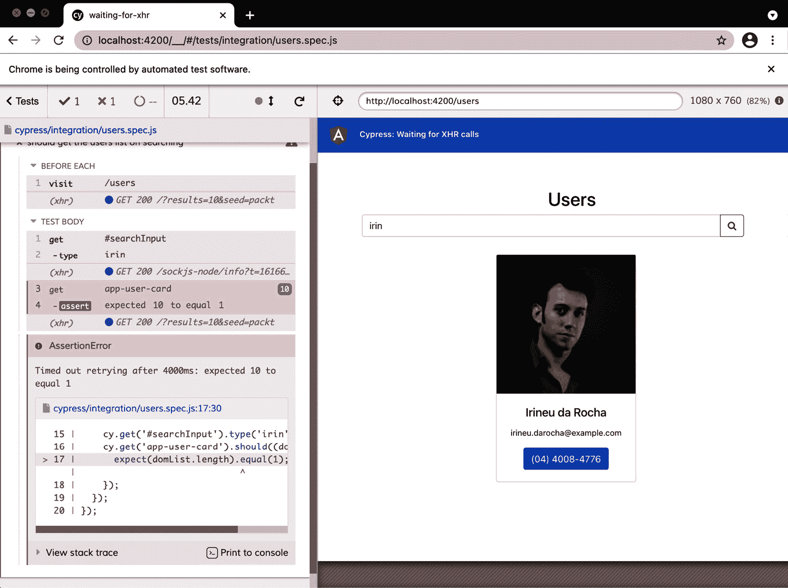

图 11.11 - 测试搜索特定用户失败

1.  现在我们可以尝试修复这个问题，这样无论 XHR 花费多长时间，我们都会等待它完成后再进行断言。让我们拦截 XHR 调用并为其创建一个别名，以便稍后使用它来等待 XHR 调用。更新`users.spec.js`文件，如下所示：

```ts
...
context('Users', () => {
  ...
  it('should get the users list on searching', () => {
    cy.intercept('https://api.randomuser.me/*')    .as('searchUsers');
    cy.get('#searchInput').type('irin');
    cy.get('app-user-card').should((domList) => {
      expect(domList.length).equal(1);
    });
  });
});
```

1.  现在，让我们使用别名在断言之前等待 XHR 调用完成。更新`users.spec.js`文件，如下所示：

```ts
...
context('Users', () => {
  ...
  it('should get the users list on searching', () => {
    cy.intercept('https://api.randomuser.me/*')    .as('searchUsers');
    cy.get('#searchInput').type('irin');
    cy.wait('@searchUsers');
    cy.get('app-user-card').should((domList) => {
      expect(domList.length).equal(1);
    });
  });
});
```

如果现在检查`user.spec.js`的 Cypress 测试，你应该看到它们都通过了，如下所示：

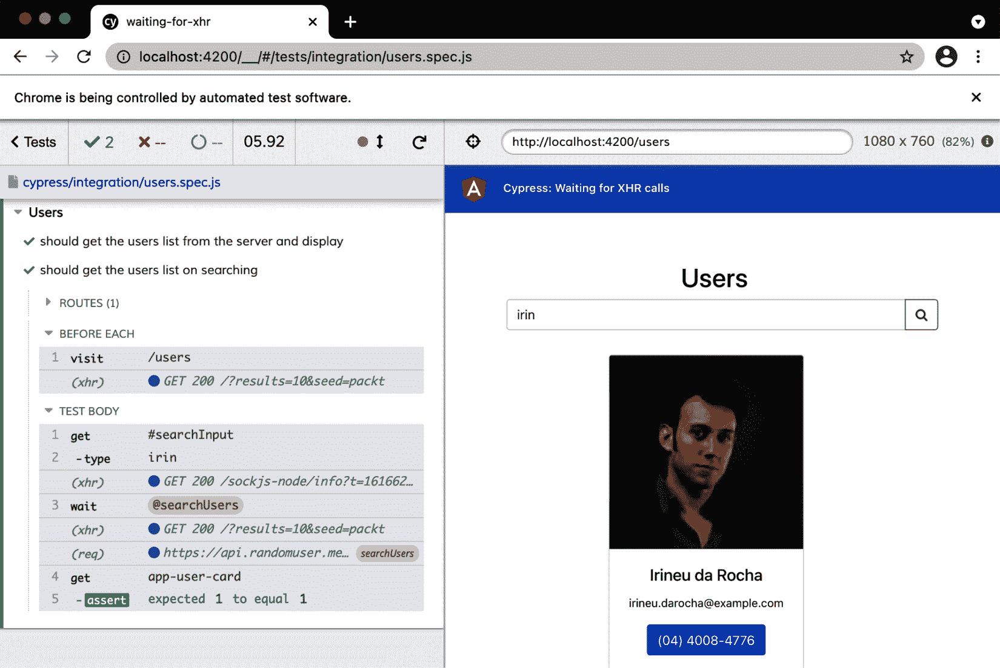

图 11.12 – 测试等待 XHR 调用完成后进行断言

太棒了！现在你知道如何使用 Cypress 实现包括等待特定 XHR 调用完成在断言之前的 E2E 测试。要了解配方背后的所有魔力，请参阅下一节。

## 工作原理…

在这个配方中，我们使用了一种叫做变量别名的东西。我们首先使用`cy.intercept()`方法，这样 Cypress 就可以监听网络调用。请注意，我们在参数中使用通配符作为 URL，使用`https://api.randomuser.me/*`，然后我们使用`.as('searchUsers')`语句为这个拦截设置一个别名。

然后，我们使用`cy.wait('@searchUsers');`语句，使用`searchUsers`别名告诉 Cypress 它必须等待直到别名的拦截发生——也就是说，直到网络调用被发出，无论需要多长时间。这使我们的测试通过，即使在实际获取网络调用之前，常规的 4,000 毫秒 Cypress 超时已经过去。神奇，不是吗？

嗯，希望你喜欢这个配方——查看下一节以查看进一步阅读的链接。

## 另请参阅

+   在 Cypress 中等待([`docs.cypress.io/guides/guides/network-requests#Waiting`](https://docs.cypress.io/guides/guides/network-requests#Waiting))

# 使用 Cypress 捆绑包

Cypress 提供了一堆捆绑工具和包，我们可以在测试中使用它们来简化事情，不是因为使用 Cypress 编写测试本来就很难，而是因为这些库已经被许多开发人员使用，所以他们对它们很熟悉。在这个配方中，我们将看看捆绑的`jQuery、Lodash 和 Minimatch`库，以测试一些我们的用例。

## 准备工作

我们要处理的项目位于`chapter11/start_here/using-cypress-bundled-packages`，在克隆的存储库中：

1.  在 VS Code 中打开项目。

1.  打开终端并运行`npm install`来安装项目的依赖项。

1.  完成后，运行`npm run cypress:test`。

这应该打开一个新的 Cypress 窗口。点击`users.spec.ts`文件，你应该看到测试，如下所示：

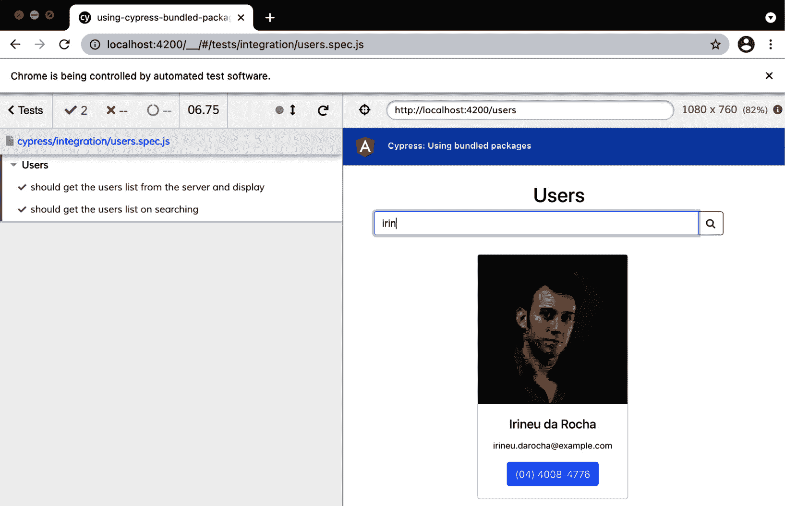

图 11.13 - 使用 Cypress 捆绑包运行的测试

现在我们有了 Cypress 测试运行，让我们在下一节中看看这个示例的步骤。

## 如何做...

对于这个示例，我们有`users`列表和一个从**应用程序编程接口**（**API**）端点获取一些用户的搜索应用。我们将对 DOM 进行一些条件断言，验证 API 的响应，并且还会断言 URL 的变化。让我们开始吧：

1.  首先，我们将尝试使用捆绑的`jQuery`库以及 Cypress。我们可以使用`Cypress.$`来访问它。让我们添加另一个测试并记录一些 DOM 元素。更新`users.spec.js`文件，如下所示：

```ts
...
context('Users', () => {
  ...
  it('should have the search button disabled when there   is no input', () => {
    const submitButton = Cypress.$('#userSearchSubmit');
    console.log(submitButton);
  });
});
```

如果你现在看测试，特别是控制台，你应该会看到以下日志：

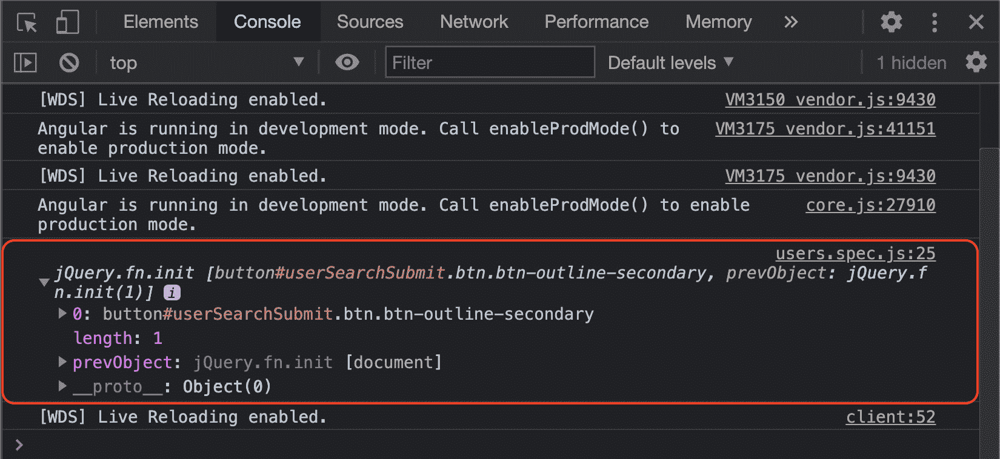

图 11.14 - 使用 jQuery 通过 Cypress.$记录的搜索按钮

1.  现在，让我们尝试记录在 HTTP 调用之后看到的用户卡。添加另一个查询和登录到相同的测试中，如下所示：

```ts
...
context('Users', () => {
  ...
  it('should have the search button disabled when there   is no input', () => {
    const submitButton = Cypress.$('#userSearchSubmit');
    console.log(submitButton);
  const appUserCards = Cypress.$('app-user-card');
  console.log(appUserCards);
  });
});
```

如果你再次在 Cypress 窗口的测试和日志中看到，你会发现`Cypress.$('app-user-card')`查询不会返回任何 DOM 元素。这是因为当运行查询时，HTTP 调用尚未完成。那么，我们应该等待 HTTP 调用完成吗？让我们试试看。

1.  让我们添加一个`cy.wait(5000)`来等待 5 秒，期间 HTTP 调用应该已经完成，并且让我们使用`cy.wrap()`方法进行断言，检查当搜索输入没有提供值时**搜索**按钮是否被禁用。更新测试，如下所示：

```ts
...
context('Users', () => {
  ...
  it('should have the search button disabled when there   is no input', () => {
    const submitButton = Cypress.$('#userSearchSubmit');
    cy.wrap(submitButton).should('have.attr',     'disabled');
    cy.get('#searchInput').type('irin');
    cy.wait(5000);
    const appUserCards = Cypress.$('app-user-card');
    console.log(appUserCards);
    cy.wrap(submitButton).should('not.have.attr',     'disabled');
  });
});
```

如果你看到 Cypress 测试和控制台，你会发现我们仍然没有得到`<app-user-card>`元素的 DOM 元素：

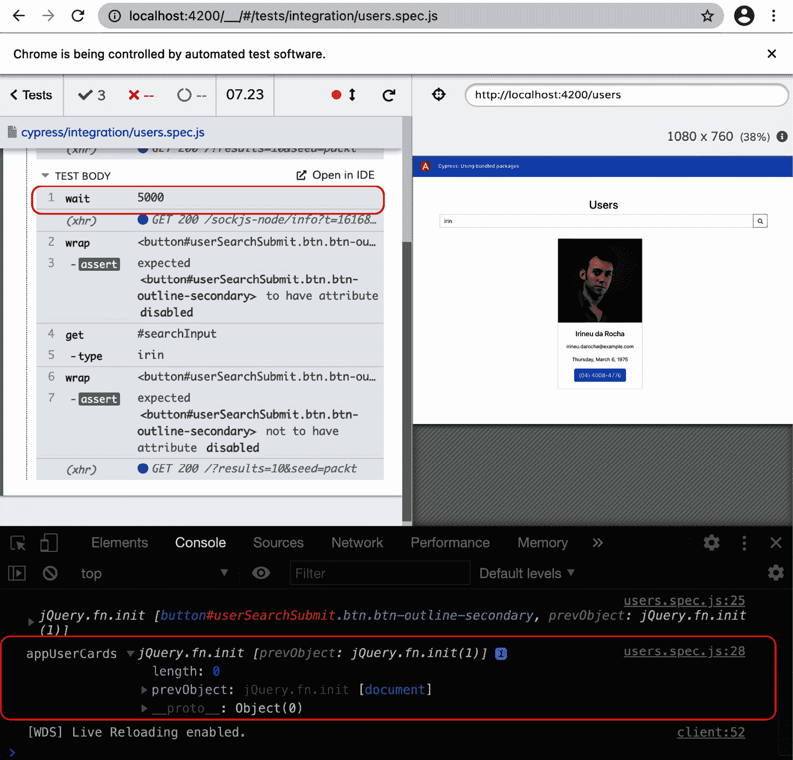

图 11.15 - 即使使用 cy.wait（5000）也找不到使用 Cypress.$的用户卡

我们将在*它是如何工作的...*部分讨论为什么会发生这种情况。现在，了解你应该只对从页面加载时就存在于 DOM 中的元素使用`Cypress.$`。

1.  让我们通过删除`cy.wait()`方法和控制台日志来清理我们的测试。然后它应该看起来像这样：

```ts
...
context('Users', () => {
  ...
  it('should have the search button disabled when there   is no input', () => {
    const submitButton = Cypress.$('#userSearchSubmit');
    cy.wrap(submitButton).should('have.attr', 'disabled');
    cy.get('#searchInput').type('irin');
    cy.wrap(submitButton).should('not.have.attr',     'disabled');
  });
});
```

1.  现在我们将添加一个测试来验证，对于相同的种子字符串，我们从随机用户 API 中获取相同的用户。我们已经有了包含预期结果的`API_USERS.js`文件。让我们在下一个测试中使用捆绑的`lodash`库来断言返回用户的名字、姓氏和电子邮件的匹配值，如下所示：

```ts
...
import API_USERS from '../constants/API_USERS';
context('Users', () => {
  ...
  it('should return the same users as the seed data   every time', async () => {
    const { _ } = Cypress;
    const response = await cy.request(
      'https://api.randomuser.me/?      results=10&seed=packt'
    );
    const propsToCompare = ['name.first', 'name.last',     'email'];
    const results = _.get(response, 'body.results');
    _.each(results, (user, index) => {
      const apiUser = API_USERS[index];
      _.each(propsToCompare, (prop) => {
        const userPropVal = _.get(user, prop);
        const apiUserPropVal = _.get(apiUser, prop);
        return expect(userPropVal).        to.equal(apiUserPropVal);
      });
    });
  });
});
```

如果你现在在 Cypress 中看到测试，它应该通过，如下所示：

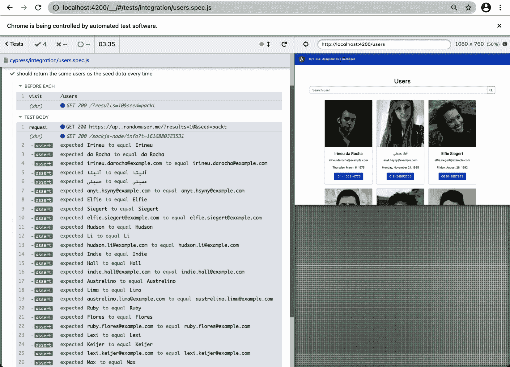

图 11.16 – 使用 lodash 通过 Cypress 进行测试通过

1.  现在我们将使用 Cypress 捆绑的`moment.js`包。让我们断言用户卡片正确显示格式化的日期，使用`moment.js`。在`users.spec.js`文件中编写另一个测试，如下所示：

```ts
...
context('Users', () => {
  ...
  it('should show the formatted date of birth on the   user card', () => {
    const { _, moment } = Cypress;
    const apiUserDate = _.get(API_USERS[0], 'dob.date');
    const apiUserDateFormatted = moment(apiUserDate).    format(
      'dddd, MMMM D, YYYY'
    );
    cy.get('app-user-card')
      .eq(0)
      .find('#userCardDOB')
      .should((el) => {
       expect(el.text().trim()).       to.equal(apiUserDateFormatted);
      });
  });
});
```

1.  接下来我们将探索的包是`minimatch`包。当我们点击用户卡片时，它会打开用户详细信息。由于我们将时间戳作为查询参数附加到 URL 上，我们无法将 URL 作为精确匹配与我们的断言进行比较。让我们使用`minimatch`包来使用模式进行断言。添加一个新的测试，如下所示：

```ts
...
context('Users', () => {
  ...
  it('should go to the user details page with the user   uuid', () => {
    const { minimatch } = Cypress;
    cy.get('app-user-card').eq(0).click();
    const expectedURL = `http://localhost:4200/    users/${API_USERS[0].login.uuid}`;
    cy.url().should((url) => {
      const urlMatches = minimatch(url,       `${expectedURL}*`);
      expect(urlMatches).to.equal(true);
    });
  });
});
```

哇！现在我们使用 Cypress 捆绑的包都通过了所有的测试。既然我们已经完成了这个方法，让我们在下一节看看它是如何工作的。

## 它是如何工作的…

Cypress 将`jQuery`与其捆绑在一起，我们通过`Cypress.$`属性使用它。这使我们能够执行`jQuery`函数允许我们执行的一切。它使用`cy.visit()`方法自动检查视图中的哪个页面，然后使用提供的选择器查询文档。

重要提示

`Cypress.$`只能从 DOM 上立即可用的文档元素中获取。这对于在 Cypress 测试窗口中使用 Chrome DevTools 调试 DOM 非常有用。然而，重要的是要理解它对 Angular 变化检测没有任何上下文。此外，你不能查询任何在页面上一开始就不可见的元素，就像我们在遵循该方法时所经历的那样——它不会等待 XHR 调用使元素可见。

Cypress 还捆绑了`lodash`并通过`Cypress._`对象公开它。在本教程中，我们使用`_.get()`方法从`user`对象中获取嵌套属性。`_.get()`方法接受两个参数：对象和反映属性路径的字符串，例如，我们使用`_.get(response, 'body.results');`，它实质上返回`response.body.results`的值。我们还使用`_.each()`方法在本教程中迭代数组。请注意，我们可以在 Cypress 测试中使用任何`lodash`方法，而不仅仅是上述方法。

我们还使用了 Cypress 通过`Cypress.minimatch`对象公开的`minimatch`包。`minimatch`包非常适合与字符串匹配和测试 glob 模式。我们用它来测试导航到用户详细信息页面后的 URL。

最后，我们还使用了 Cypress 通过`Cypress.moment`对象公开的`moment.js`包。我们用它来确保每个用户的出生日期在视图上显示为预期格式。非常简单。

## 另请参阅

+   Cypress 捆绑工具([`docs.cypress.io/guides/references/bundled-tools`](https://docs.cypress.io/guides/references/bundled-tools))

+   Moment.js ([`momentjs.com/`](https://momentjs.com/))

+   jQuery ([`jquery.com/`](https://jquery.com/))

+   lodash ([`lodash.com`](https://lodash.com))

+   Minimatch.js ([`github.com/isaacs/minimatch`](https://github.com/isaacs/minimatch))

# 使用 Cypress fixtures 提供模拟数据

在编写端到端测试时，fixtures 在确保测试不会出现问题方面发挥了重要作用。考虑到您的测试依赖于从 API 服务器获取数据，或者您的测试包括快照测试，其中包括从内容交付网络（CDN）或第三方 API 获取图像。尽管它们在技术上是测试成功运行所必需的，但重要的是服务器数据和图像不是从原始来源获取的，因此我们可以为它们创建 fixtures。在本教程中，我们将为用户数据以及要在 UI 上显示的图像创建 fixtures。

## 准备工作

我们将要使用的项目位于克隆存储库中的`chapter11/start_here/using-cypress-fixtures`中：

1.  在 VS Code 中打开项目。

1.  打开终端并运行`npm install`以安装项目的依赖项。

1.  完成后，运行`npm run cypress:test`。

这将打开一个新的 Cypress 窗口。点击`users.spec.ts`文件，你应该会看到测试，如下所示：

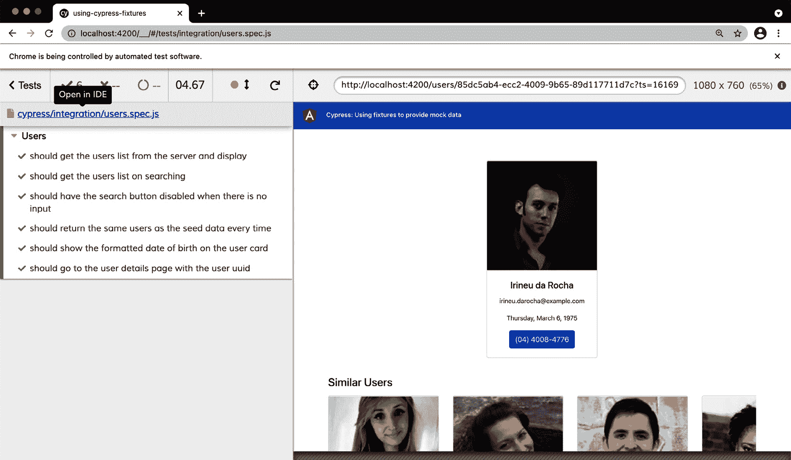

图 11.17 - 使用 Cypress fixtures 测试在 Cypress 中运行

现在我们已经让 Cypress 测试运行了，让我们在下一节中看看这个示例的步骤。

## 如何做…

我们有与上一个示例中相同的 Angular 应用程序。但是，我们现在将使用 Cypress fixtures 来提供我们的数据和图像 fixture。让我们开始吧：

1.  我们首先为我们对`randomuser.me` API 的 HTTP 调用创建一个 fixture。在`cypress/fixtures`文件夹下创建一个名为`users.json`的新文件。然后，将代码从`chapter11/final/using-cypress-fixtures/cypress/fixtures/users.json`文件复制并粘贴到新创建的文件中。它应该看起来像这样：

```ts
{
  "fixture_version": "1",
  "results": [
    {
      "gender": "male",
      "name": { "title": "Mr", "first": "Irineu",       "last": "da Rocha" },
      ...
    },
    ...
    {
      "gender": "male",
      "name": { "title": "Mr", "first": "Justin",       "last": "Grewal" },
      ...
    }
  ]
}
```

1.  现在，让我们在`users.spec.js`文件中使用 fixture。我们将在`beforeEach()`生命周期钩子中使用它，因为我们希望在文件中的所有测试中使用 fixture。这意味着我们还将删除文件中现有的`cy.intercept()`方法的使用。更新`users.spec.js`文件，如下所示：

```ts
...
context('Users', () => {
  beforeEach(() => {
    cy.fixture('users.json')
      .then((response) => {
        cy.intercept('GET', 'https://api.randomuser.        me/*', response).as(
          'searchUsers'
        );
      })
      .visit('/users');
  });
  ...
  it('should get the users list on searching', () => {
    cy.intercept('
https://api.randomuser.me/*').as('searchUsers'); ← // REMOVE THIS
    cy.get('#searchInput').type('irin');
    cy.wait('@searchUsers');
    ...
  });
   ...
});
```

现在我们需要从项目中删除`constants/API_USERS.js`文件，因为我们现在有了 fixture。

1.  我们将创建一个新变量，其中我们将存储`users`数组的值，并将其用于替代`API_USERS`数组。让我们进一步修改`users.spec.js`文件，如下所示：

```ts
...
import API_USERS from '../constants/API_USERS'; ← // REMOVE THIS
context('Users', () => {
  let API_USERS;
  beforeEach(() => {
    cy.fixture('users.json')
      .then((response) => {
        API_USERS = response.results;
        cy.intercept('GET', 'https://api.randomuser.        me/*', response).as(
          'searchUsers'
        );
      })
      .visit('/users');
    });
  });
  ...
});
```

您会注意到，所有的测试都仍然通过了。您现在可以安全地从项目中删除`constants/API_USERS.js`文件。此外，您可以在 Cypress **Tests**窗口中查看网络调用，以验证我们使用的是 fixture 而不是实际的 API 响应，如下所示：

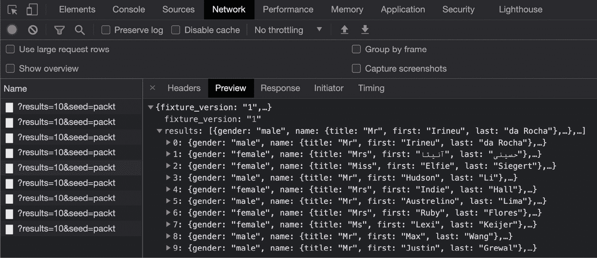

图 11.18 - Cypress 测试使用 users.json fixture 作为 XHR 响应

1.  现在，让我们尝试模拟我们的图像，从磁盘加载它们，而不是从`randomuser.me` API。为此，我们已经将图像存储在`fixtures/images`文件夹中。我们只需要根据特定用户的 URL 来使用它们。为此，请修改`users.spec.js`文件，如下所示：

```ts
...
context('Users', () => {
  let API_USERS;
  beforeEach(() => {
    cy.fixture('users.json')
      .then((response) => {
        API_USERS = response.results;
        ...
        API_USERS.forEach((user) => {
          const url = user.picture.large;
          const imageName = url.substr(url.          lastIndexOf('/') + 1);
          cy.intercept(url, { fixture:           `images/${imageName}` });
        });
      .visit('/users');
  });
  ...
});
```

如果您现在查看测试，所有测试都应该仍然通过，如下所示：

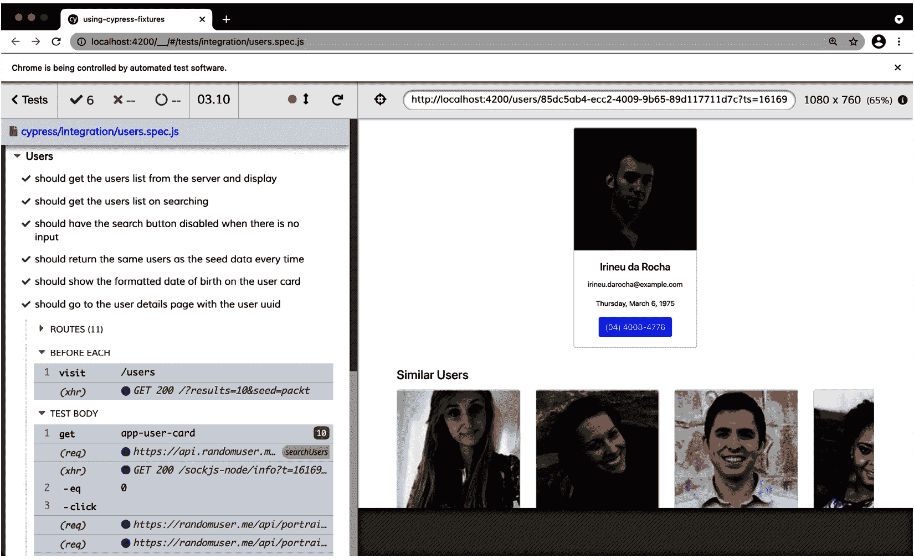

图 11.19 - 使用图像 fixture 后所有测试都通过了

看着测试，你可能会想：“*这一切看起来和以前一样，阿赫桑。我怎么知道我们在模拟图像？*”好问题。我们已经有一种方法来测试这个。

1.  在`cypress/fixtures/images`文件夹中，我们有一个名为`9.jpg`的文件，另一个测试文件名为`9_test.jpg`。让我们将`9.jpg`文件的名称修改为`9_original.jpg`，将`9_test.jpg`文件的名称修改为`9.jpg`。如果你现在看到测试，你应该会看到使用替换文件的最后一个测试的结果不同，如下所示：

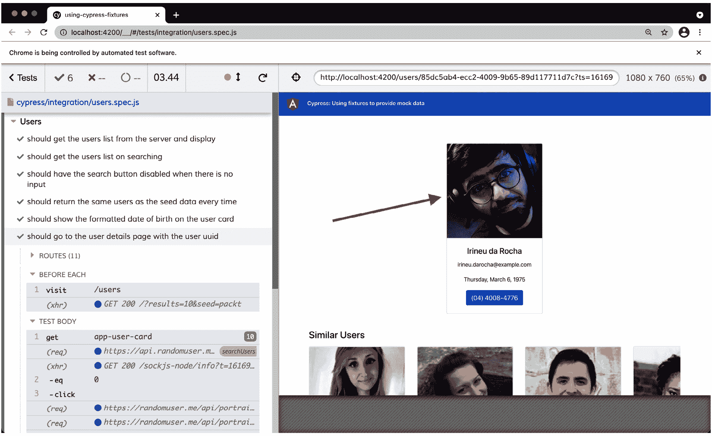

图 11.20 - 使用 fixture 中的图像进行 Cypress 测试

太棒了！现在你知道如何在 Cypress E2E 测试中使用 fixtures 了。现在你已经完成了这个教程，看看下一节关于它是如何工作的。

## 它是如何工作的...

我们使用`cy.fixture()`方法在 Cypress 测试中使用 fixtures，这允许我们使用文件中的数据。在这个教程中，我们使用 fixtures 来获取用户数据和图像的 HTTP 调用。但是它是如何工作的呢？实质上，`fixture`方法有四个重载，如下所示：

```ts
cy.fixture(filePath)
cy.fixture(filePath, encoding)
cy.fixture(filePath, options)
cy.fixture(filePath, encoding, options)
```

`filePath`参数接受一个字符串作为相对于`Fixture`文件夹的文件路径，默认为`cypress/fixture`路径，尽管我们可以通过在`cypress.json`配置文件中定义`fixturesFolder`属性来提供不同的`Fixture`文件夹。请注意，对于 HTTP 调用，我们使用`cy.fixture('users.json')`语句，它实质上指向`cypress/fixture/users.json`文件。

首先，我们在`cy.visit()`方法之前使用`cy.fixture('users.json')`方法，以确保我们在启动应用程序时触发的即时 XHR 调用使用 fixture。如果你改变代码，你会发现它不会按预期工作。然后我们使用`.then()`方法来获取`users.json`文件中的数据。一旦我们得到数据（`response`对象），我们使用`cy.intercept()`方法使用 Minimatch glob 模式拦截 HTTP 调用以获取用户数据，并且我们将 fixture 中的`response`对象作为 HTTP 调用的响应。因此，所有对与`'`[`api.randomuser.me/`](https://api.randomuser.me/)*`'` glob 匹配的端点的调用都使用我们的 fixture，即`users.json`文件。

在这个示例中，我们还做了一件有趣的事情，那就是模拟图片，以避免从原始来源获取它们。当你使用第三方 API 并且每次调用 API 都要付费时，这非常方便。我们已经将夹具图片存储在 `cypress/fixture/images` 文件夹中。因此，我们循环遍历 `API_USERS` 数组中的每个用户，并提取文件名（`imageName` 变量）。然后，我们拦截每个用于获取图片的 HTTP 调用，并在我们的测试中使用夹具图片代替原始资源。

## 另请参阅

+   Cypress 夹具文档（[`docs.cypress.io/api/commands/fixture`](https://docs.cypress.io/api/commands/fixture))

+   `cy.intercept()` 方法文档（[`docs.cypress.io/api/commands/intercept`](https://docs.cypress.io/api/commands/intercept)）
