# 第十二章：*第十二章*：Angular 性能优化

性能始终是您为最终用户构建的任何产品中关注的问题。这是增加某人第一次使用您的应用程序成为客户的机会的关键因素。现在，除非我们确定了改进的潜在可能性和实现这一点的方法，否则我们无法真正提高应用程序的性能。在本章中，您将学习一些在改进 Angular 应用程序时要部署的方法。您将学习如何使用多种技术来分析、优化和改进您的 Angular 应用程序的性能。以下是本章中要涵盖的内容：

+   使用`OnPush`变更检测来修剪组件子树

+   从组件中分离变更检测器

+   使用`runOutsideAngular`在 Angular 外部运行`async`事件

+   在`*ngFor`中使用`trackBy`来处理列表

+   将重型计算移至纯管道

+   使用 Web Workers 进行重型计算

+   使用性能预算进行审计

+   使用`webpack-bundle-analyzer`分析捆绑包

# 技术要求

对于本章中的食谱，请确保您的计算机上已安装了**Git**和**Node.js**。您还需要安装`@angular/cli`包，可以在终端中使用`npm install -g @angular/cli`来安装。本章的代码可以在以下链接找到：[`github.com/PacktPublishing/Angular-Cookbook/tree/master/chapter12`](https://github.com/PacktPublishing/Angular-Cookbook/tree/master/chapter12)。

# 使用 OnPush 变更检测来修剪组件子树

在当今现代 Web 应用程序的世界中，性能是出色的**用户体验**（**UX**）和最终业务转化的关键因素之一。在本章的第一个食谱中，我们将讨论您可以在组件中进行的基本优化，即使用`OnPush`变更检测策略。

## 准备工作

我们将要处理的项目位于`Chapter12/start_here/using-onpush-change-detection`中，位于克隆存储库内：

1.  在**Visual Studio Code** (**VS Code**)中打开项目。

1.  打开终端并运行`npm install`来安装项目的依赖项。

1.  运行`ng serve -o`命令启动 Angular 应用程序并在浏览器上提供服务。您应该看到以下应用程序：

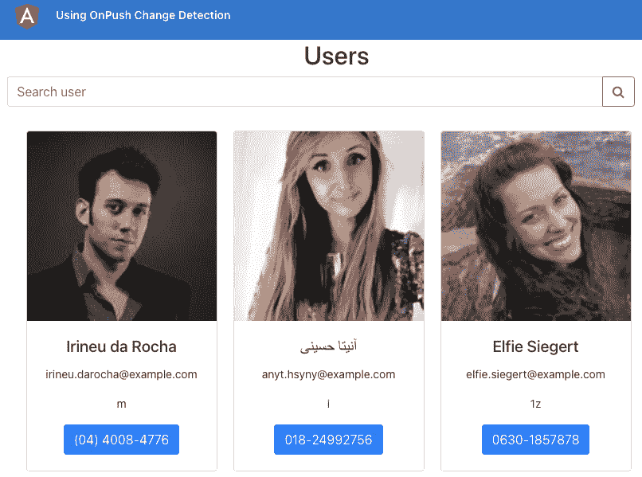

图 12.1 – 应用程序使用 OnPush 变更检测在 http://localhost:4200 上运行

现在我们已经在浏览器上提供了项目，让我们在下一节中看到食谱的步骤。

## 如何做…

我们正在处理的应用程序存在一些性能问题，特别是`UserCardComponent`类。这是因为它使用`idUsingFactorial()`方法来生成要显示在卡片上的唯一 ID。我们将尝试体验和理解这会导致的性能问题。我们将尝试使用`OnPush`变更检测策略来解决这个问题。让我们开始吧：

1.  首先，尝试在搜索框中输入名为`Elfie Siegert`的用户。您会注意到应用程序立即挂起，并且需要几秒钟才能显示用户。您还会注意到在输入时，甚至看不到在搜索框中输入的字母。

让我们向代码添加一些逻辑。我们将检查页面加载时 Angular 调用`idUsingFactorial()`方法的次数。

1.  修改`app/core/components/user-card/user-card.component.ts`文件，更新如下：

```ts
...
@Component({...})
export class UserCardComponent implements OnInit {
  ...
  constructor(private router: Router) {}
  ngOnInit(): void {
    if (!window['appLogs']) {
      window['appLogs'] = {};
    }
    if (!window['appLogs'][this.user.email]) {
      window['appLogs'][this.user.email] = 0;
    }
  }
  ...
  idUsingFactorial(num, length = 1) {
    window['appLogs'][this.user.email]++;
    if (num === 1) {...} else {...}
  }
}
```

1.  现在，刷新应用程序并打开 Chrome DevTools，在**控制台**选项卡中，输入`appLogs`并按*Enter*。您应该会看到一个对象，如下所示：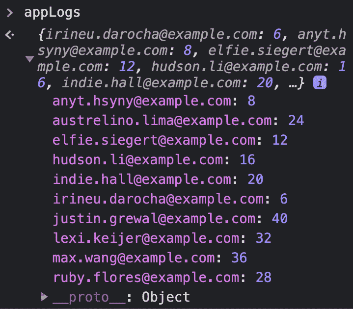

图 12.2 – 反映对 idUsingFactorial()方法调用次数的日志

1.  现在，在搜索框中再次输入名称`Elfie Siegert`。然后，在**控制台**选项卡中再次输入`appLogs`并按*Enter*以再次查看对象。您会看到它有一些增加的数字。如果在输入名称时没有打错字，您应该会看到类似于这样的内容：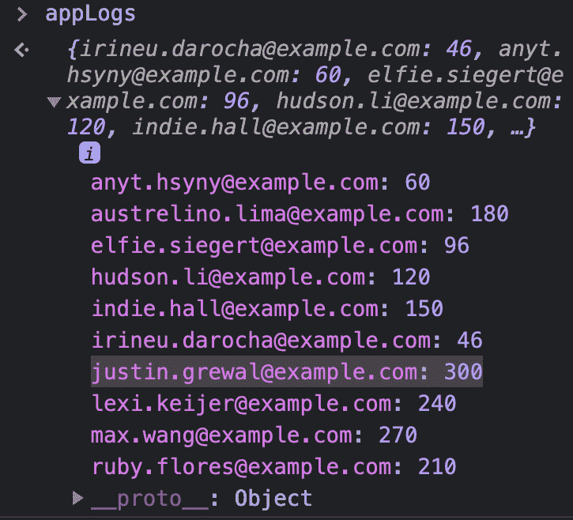

图 12.3 – 输入名称 Elfie Siegert 后的日志

注意调用`idUsingFactorial()`方法时的计数，例如`justin.grewal@example.com`。现在，它从`40`增加到`300`，仅需按几下按键。

现在让我们使用`OnPush`变更检测策略。这将避免 Angular 变更检测机制在每个浏览器事件上运行，这目前会导致性能问题。

1.  打开`user-card.component.ts`文件并进行更新，如下所示：

```ts
import {
  ChangeDetectionStrategy,
  Component,
  ...
} from '@angular/core';
...
@Component({
  selector: 'app-user-card',
  templateUrl: './user-card.component.html',
  styleUrls: ['./user-card.component.scss'],
  changeDetection: ChangeDetectionStrategy.OnPush,
})
export class UserCardComponent implements OnInit {
  ...
}
```

1.  现在，再试着在搜索框中输入`Elfie Siegert`这个名字。你会注意到，现在你可以在搜索框中看到输入的字母，而且应用程序不会卡住那么多。另外，如果你在**控制台**选项卡中查看`appLogs`对象，你应该会看到类似下面的内容：

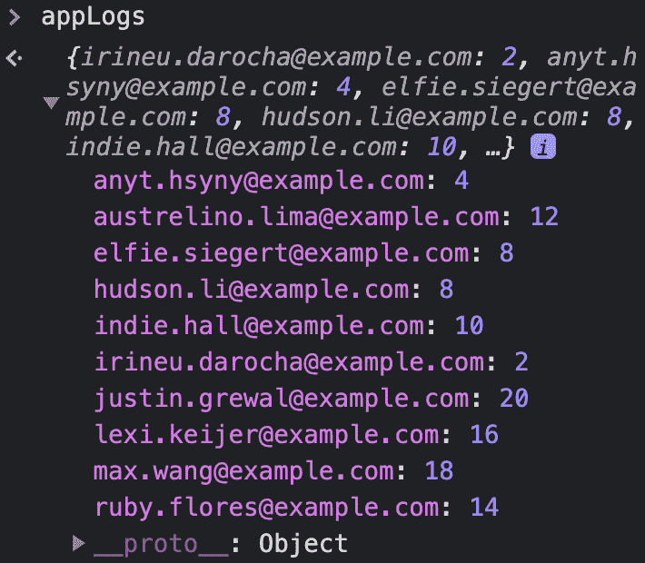

图 12.4 - 使用 OnPush 策略输入 Elfie Siegert 名称后的日志

请注意，即使刷新应用程序并输入`Elfie Siegert`这个名字后，对`idUsingFactorial()`方法的调用次数也大大减少了。例如，对于`justin.grewal@example.com`电子邮件地址，我们只有**20**次调用，而不是*图 12.2*中显示的初始**40**次调用，以及*图 12.3*中显示的**300**次调用。

太棒了！通过使用`OnPush`策略，我们能够在一个步骤中改善`UserCardComponent`的整体性能。现在你知道如何使用这个策略了，接下来看下一节来了解它是如何工作的。

## 它是如何工作的...

Angular 默认使用**默认**的变更检测策略 - 或者从`@angular/core`包中的`ChangeDetectionStrategy.Default`枚举来说，技术上来说是这样。由于 Angular 不知道我们创建的每个组件，它使用默认策略来避免遇到任何意外。但是作为开发人员，如果我们知道一个组件除非它的`@Input()`变量之一发生变化，否则不会改变，我们可以 - 而且应该 - 为该组件使用`OnPush`变更检测策略。为什么？因为它告诉 Angular 在组件的`@Input()`变量发生变化之前不要运行变更检测。这个策略对于**呈现**组件（有时被称为**哑**组件）来说是绝对胜利的，它们只是使用`@Input()`变量/属性来显示数据，并在交互中触发`@Output()`事件。这些呈现组件通常不包含任何业务逻辑，比如重型计算，使用服务进行**超文本传输协议**（**HTTP**）调用等。因此，对于这些组件来说，我们更容易使用`OnPush`策略，因为它们只会在父组件的`@Input()`属性发生变化时显示不同的数据。

由于我们现在在 `UserCardComponent` 上使用了 `OnPush` 策略，它只在我们替换整个数组时触发变更检测。这发生在**300ms** 的去抖之后（*`users.component.ts` 文件中的第 28 行*），因此只有在用户停止输入时才会执行。因此，在优化之前，默认的变更检测是在每次按键时触发的浏览器事件，现在不会触发。

重要提示

现在您已经知道 `OnPush` 策略仅在一个或多个 `@Input()` 绑定发生变化时触发 Angular 变更检测机制，这意味着如果我们在组件 (`UserCardComponent`) 中更改属性，它不会在视图中反映出来，因为在这种情况下变更检测机制不会运行，因为该属性不是一个 `@Input()` 绑定。您必须标记组件为脏，以便 Angular 可以检查组件并运行变更检测。您将使用 `ChangeDetectorRef` 服务来实现这一点，具体来说，使用 `.markForCheck()` 方法。

## 另请参阅

+   Angular `ChangeDetectionStrategy` 官方文档（[`angular.io/api/core/ChangeDetectionStrategy`](https://angular.io/api/core/ChangeDetectionStrategy)）

+   `markForCheck()` 方法官方文档（[`angular.io/api/core/ChangeDetectorRef#markforcheck`](https://angular.io/api/core/ChangeDetectorRef#markforcheck)）

# 从组件中分离变更检测器

在上一个示例中，我们学习了如何在组件中使用 `OnPush` 策略，以避免 Angular 变更检测运行，除非其中一个 `@Input()` 绑定发生了变化。然而，还有另一种方法可以告诉 Angular 完全不运行变更检测。当您希望完全控制何时运行变更检测时，这将非常方便。在本示例中，您将学习如何完全分离 Angular 组件的变更检测器，以获得性能改进。

## 准备工作

此示例的项目位于 `Chapter12/start_here/detaching-change-detecto`：

1.  在 VS Code 中打开项目。

1.  打开终端并运行 `npm install` 来安装项目的依赖项。

1.  运行 `ng serve -o` 命令来启动 Angular 应用程序并在浏览器上提供服务。您应该看到应用程序如下：

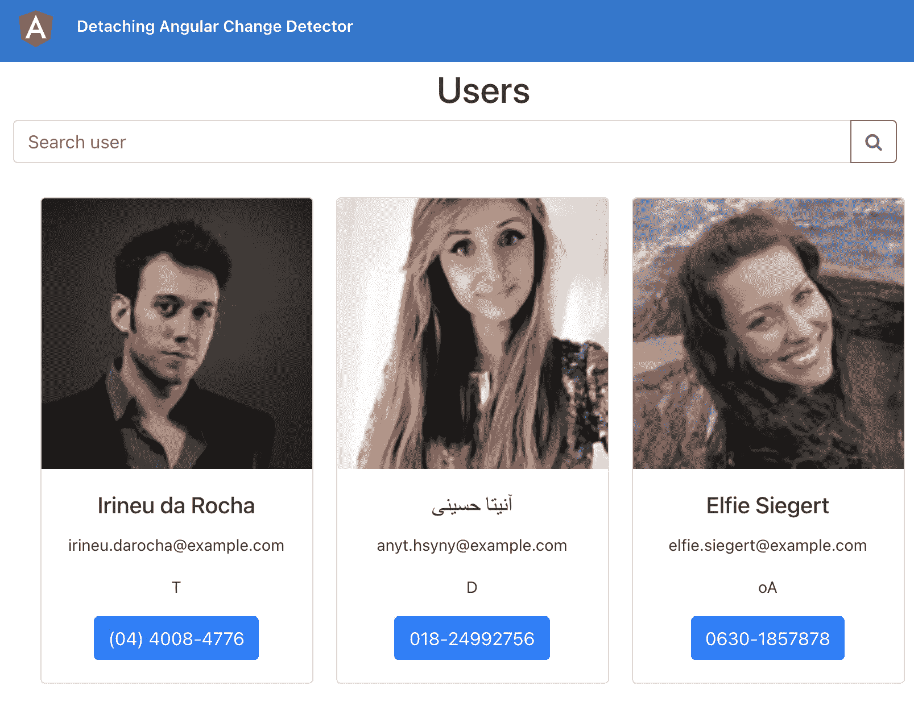

图 12.5 – 应用程序 detaching-change-detector 在 http://localhost:4200 运行

现在我们在浏览器上提供了项目，让我们在下一节中看一下本教程的步骤。

## 如何做…

我们有相同的用户列表应用程序，但有所不同。现在，我们有`UserSearchInputComponent`组件，其中包含搜索输入框。这是我们输入用户名以在用户列表中搜索的地方。另一方面，我们有`UserCardListComponent`组件，其中包含用户列表。我们将首先体验性能问题，然后巧妙地分离变更检测器以获得性能改进。让我们开始吧：

1.  在浏览器中刷新应用程序，然后只需点击搜索输入框内部，然后再点击搜索输入框外部，首先触发输入框上的`focus`事件，然后触发`blur`事件。重复这两次，然后在 Chrome Dev Tools 中的控制台中，检查`appLogs`对象的值。您应该会看到类似于这样的内容：![图 12.6 - 在搜索输入框上执行三次焦点和模糊后的日志

（图 12.6_B15150.jpg）

图 12.6 - 在搜索输入框上执行三次焦点和模糊后的日志

在`UserCardComponent`类中的`idUsingFactorial()`方法已经被调用了大约 100 次，仅在我们迄今为止执行的步骤中。

1.  现在，尝试快速在搜索框中输入`elfie`用户的名称进行搜索。

您会注意到应用程序立即挂起，需要几秒钟才能显示用户。您还会注意到，当您输入字母时，甚至看不到它们在搜索框中被输入。如果您已正确执行*步骤 1*和*步骤 2*，您应该会看到一个`appLogs`对象，如下所示：

![图 12.7 - 在输入搜索框中输入 elfie 后的日志

（图 12.7_B15150.jpg）

图 12.7 - 在输入搜索框中输入 elfie 后的日志

您可以在上述截图中看到，`justin.grewal@example.com`用户的`idUsingFactorial()`方法现在已经被调用了大约 220 次。

1.  为了提高性能，我们将在本教程中使用`ChangeDetectorRef`服务，从`UsersComponent`组件中完全分离变更检测器，这是我们**用户**页面的顶级组件。更新`users.component.ts`文件，如下所示：

```ts
import { ChangeDetectorRef, Component, OnInit} from '@angular/core';
...
@Component({...})
export class UsersComponent implements OnInit {
  users: IUser[];
  constructor(
    private userService: UserService,
  private cdRef: ChangeDetectorRef
  ) {}
  ngOnInit() {
    this.cdRef.detach();
    this.searchUsers();
  }
}
```

如果现在刷新应用程序，您会看到...实际上，您什么都看不到，这没关系 - 我们还有更多的步骤要遵循。

1.  现在，由于我们只想在搜索用户时运行变更检测 - 也就是当`UsersComponent`类中的`users`数组发生变化时，我们可以使用`ChangeDetectorRef`实例的`detectChanges()`方法。再次更新`users.component.ts`文件，如下所示：

```ts
...
@Component({...})
export class UsersComponent implements OnInit {
  ...
  searchUsers(searchQuery = '') {
    this.userService.searchUsers(
searchQuery).subscribe((users) => {
      this.users = users;
  this.cdRef.detectChanges();
    });
  }
  ...
}
```

1.  现在，再试着执行一遍动作 - 也就是刷新页面，聚焦输入框，失去焦点，再次聚焦，再次失去焦点，再次聚焦，再次失去焦点，然后在搜索输入框中输入`elfie`。一旦你按照这些步骤操作，你应该会看到`appLogs`对象，如下所示：

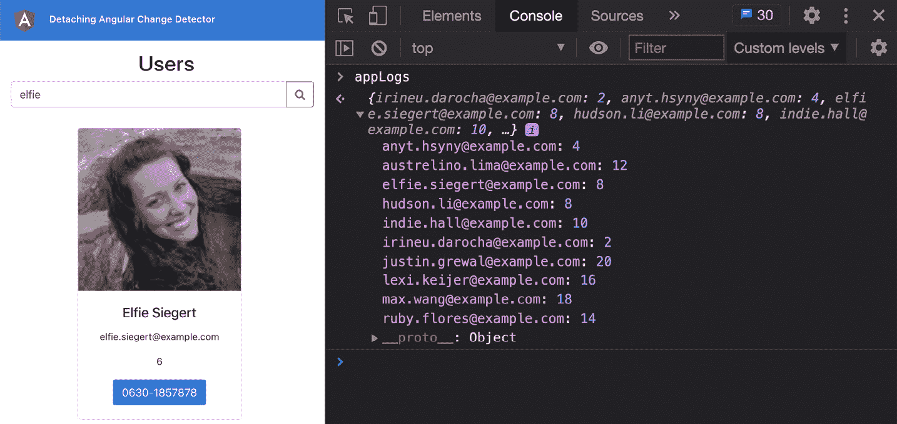

图 12.8 - 在执行测试步骤并使用 ChangeDetectorRef.detach()后的日志

从上面的截图中可以看到，即使在执行*步骤 1*和*步骤 2*中提到的所有操作之后，我们的变更检测运行周期非常低。

太棒了！你刚学会了如何使用`ChangeDetectorRef`服务分离 Angular 变更检测器。现在你已经完成了这个教程，看看下一节来了解它是如何工作的。

## 它是如何工作的...

`ChangeDetectorRef`服务提供了一系列重要的方法来完全控制变化检测。在这个示例中，我们在`UsersComponent`类的`ngOnInit()`方法中使用`.detach()`方法来从这个组件中分离出 Angular 变化检测机制。结果，`UsersComponent`类以及其子类都不会触发任何变化检测。这是因为每个 Angular 组件都有一个变化检测树，其中每个组件都是一个节点。当我们从变化检测树中分离一个组件时，该组件（作为树节点）以及其子组件（或节点）也会被分离。通过这样做，我们最终使`UsersComponent`类不会发生任何变化检测。因此，当我们刷新页面时，即使我们从**应用程序编程接口**（**API**）获取了用户并将它们分配给`UsersComponent`类中的`users`属性，也不会渲染任何内容。由于我们需要在视图上显示用户，这需要触发 Angular 变化检测机制，我们在将用户数据分配给`users`属性后，立即使用`ChangeDetectorRef`实例的`.detectChanges()`方法。结果，Angular 运行了变化检测机制，我们在视图上看到了用户卡片。

这意味着在整个**Users**页面（即`/users`路由）上，只有在`UsersComponent`类初始化后，当我们调用`searchUsers()`方法，从 API 获取数据并将结果分配给`users`属性时，Angular 变化检测机制才会触发，从而创建一个高度受控的变化检测周期，从而在整体上获得更好的性能。

## 参见

+   `ChangeDetectorRef`官方文档([`angular.io/api/core/ChangeDetectorRef`](https://angular.io/api/core/ChangeDetectorRef))

# 在 Angular 之外运行异步事件的 runOutsideAngular

Angular 在一些事物上运行其变更检测机制，包括但不限于所有浏览器事件，如`keyup`、`keydown`等。它还在`setTimeout`、`setInterval`和 Ajax HTTP 调用上运行变更检测。如果我们需要避免在这些事件中运行变更检测，我们需要告诉 Angular 不要在这些事件上触发变更检测 - 例如，如果您在 Angular 组件中使用`setTimeout()`方法，每次调用其回调方法时都会触发 Angular 变更检测。在这个食谱中，您将学习如何使用`runOutsideAngular()`方法在`ngZone`服务之外执行代码块。

## 准备就绪

这个食谱的项目位于`Chapter12/start_here/run-outside-angula`中：

1.  在 VS Code 中打开项目。

1.  打开终端并运行`npm install`来安装项目的依赖项。

1.  运行`ng serve -o`命令启动 Angular 应用程序并在浏览器上提供服务。您应该看到应用程序，如下所示：

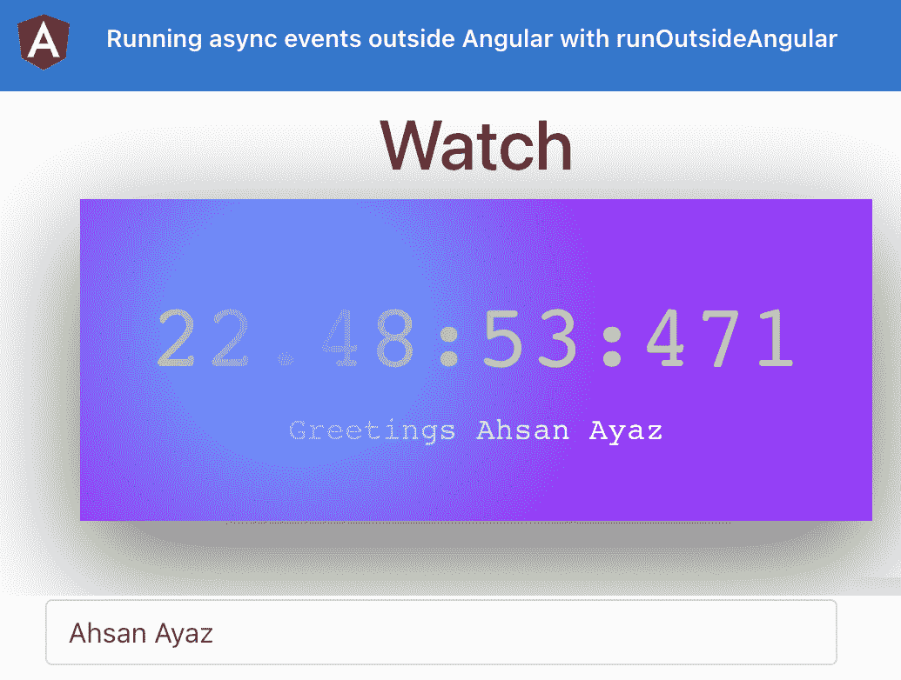

图 12.9 - 在 http://localhost:4200 上运行的 App run-outside-angular

现在我们的应用程序正在运行，让我们在下一节中看一下食谱的步骤。

## 如何做…

我们有一个显示手表的应用程序。但是，目前应用程序中的变更检测并不理想，我们有很大的改进空间。我们将尝试使用`ngZone`中的`runOutsideAngular`方法来消除任何不必要的变更检测。让我们开始吧：

1.  时钟值不断更新。因此，我们对每个更新周期运行变更检测。打开 Chrome DevTools 并切换到**控制台**选项卡。键入`appLogs`并按*Enter*，以查看`hours`、`minutes`、`seconds`和`milliseconds`组件的变更检测运行次数。应该看起来像这样：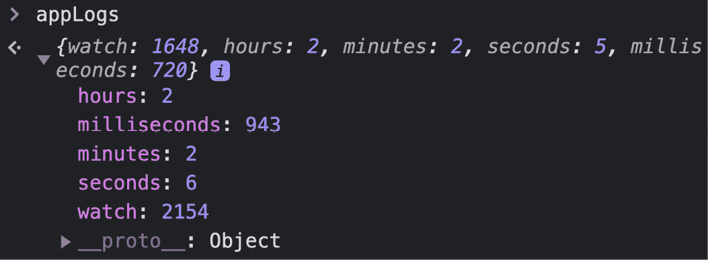

图 12.10 - 反映变更检测运行次数的 appLogs 对象

1.  为了衡量性能，我们需要在固定时间段内查看数字。让我们添加一些代码，在应用程序启动后的 4 秒内关闭时钟的间隔计时器。修改`watch-box.component.ts`文件，如下所示：

```ts
...
@Component({...})
export class WatchBoxComponent implements OnInit {
  ...
  ngOnInit(): void {
    this.intervalTimer = setInterval(() => {
      this.timer();
    }, 1);
    setTimeout(() => {
      clearInterval(this.intervalTimer);
    }, 4000);
  }
  ...
}
```

1.  刷新应用程序并等待 4 秒钟以停止时钟。然后，在**控制台**选项卡中多次输入`appLogs`，按*Enter*，并查看结果。时钟停止，但动画仍在运行。您应该看到`watch`键的变更检测仍在增加，如下所示：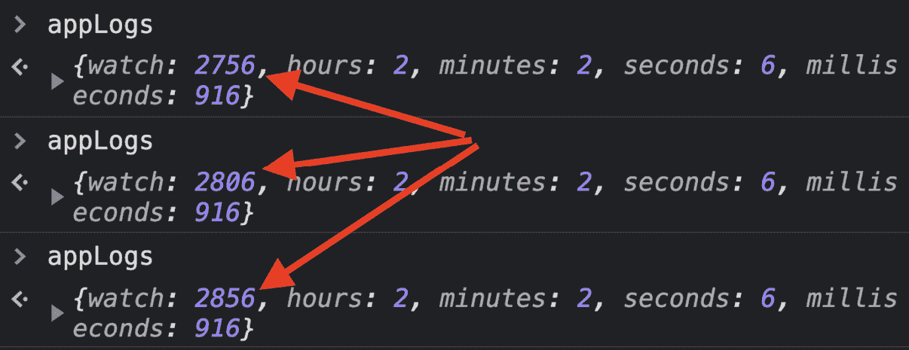

图 12.11 - 对手表组件的变更检测仍在运行

1.  让我们在手表内部的动画运行 4 秒后停止。更新`watch.component.ts`文件如下：

```ts
...
@Component({...})
export class WatchComponent implements OnInit {
  ...
  ngOnInit(): void {
    this.intervalTimer = setInterval(() => {
      this.animate();
    }, 30);
    setTimeout(() => {
      clearInterval(this.intervalTimer);
    }, 4000);
  }
  ...
}
```

刷新应用程序并等待动画停止。查看 Chrome DevTools 中的`appLogs`对象，您应该看到`watch`键的变更检测停止，如下所示：

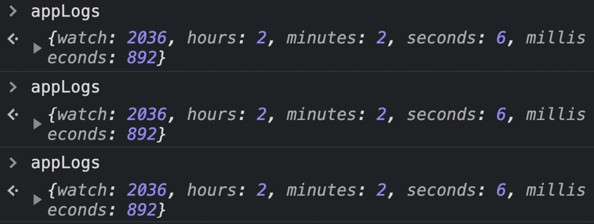

图 12.12 - 停止动画间隔后变更检测停止

1.  我们希望动画运行，但不会导致额外的变更检测运行。这是因为我们希望使我们的应用程序更加高效。所以，让我们暂停时钟。为此，请更新`watch-box.component.ts`文件如下：

```ts
...
@Component({...})
export class WatchBoxComponent implements OnInit {
  ...
  ngOnInit(): void {
    // this.intervalTimer = setInterval(() => {
    //   this.timer();
    // }, 1);
    // setTimeout(() => {
    //   clearInterval(this.intervalTimer);
    // }, 4000);
  }
}
```

由于我们现在已经停止了时钟，因此`appLogs`中`watch`键的值现在仅基于这 4 秒的动画。您现在应该看到`watch`键的值在**250**和**260**之间。

1.  让我们通过在`ngZone`服务外部运行间隔来避免对动画进行变更检测。我们将使用`runOutsideAngular()`方法来实现这一点。更新`watch.component.ts`文件如下：

```ts
import {
  ...
  ViewChild,
  NgZone,
} from '@angular/core';
@Component({...})
export class WatchComponent implements OnInit {
  ...
  constructor(private zone: NgZone) {
   ...
  }
  ngOnInit(): void {
    this.zone.runOutsideAngular(() => {
      this.intervalTimer = setInterval(() => {
        this.animate();
      }, 30);
      setTimeout(() => {
        clearInterval(this.intervalTimer);
      }, 2500);
    });
  }
  ...
}
```

刷新应用程序并等待大约 5 秒钟。如果现在检查`appLogs`对象，您应该看到每个属性的变更检测运行总数减少，如下所示：

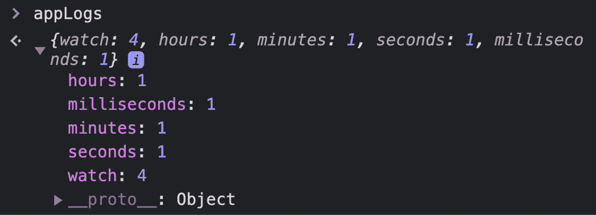

图 12.13 - 在 WatchComponent 中使用 runOutsideAngular()后的 appLogs 对象

耶耶！注意`appLogs`对象中`watch`键的值已经从大约**250**减少到**4**。这意味着我们的动画现在根本不会影响变更检测。

1.  从`WatchComponent`类的动画中删除对`clearInterval()`的使用。结果，动画应该继续运行。修改`watch.component.ts`文件如下：

```ts
...
@Component({...})
export class WatchComponent implements OnInit {
  ...
  ngOnInit(): void {
    ...
    this.ngZone.runOutsideAngular(() => {
      this.intervalTimer = setInterval(() => {
        this.animate();
      }, 30);
      setTimeout(() => { // ← Remove this block
        clearInterval(this.intervalTimer);
      }, 4000);
    });
  }
  ...
}
```

1.  最后，从`WatchBoxComponent`类中删除对`clearInterval()`的使用以运行时钟。更新`watch-box.component.ts`文件如下：

```ts
import { Component, OnInit } from '@angular/core';
@Component({
  selector: 'app-watch-box',
  templateUrl: './watch-box.component.html',
  styleUrls: ['./watch-box.component.scss'],
})
export class WatchBoxComponent implements OnInit {
  name = '';
  time = {
    hours: 0,
    minutes: 0,
    seconds: 0,
    milliseconds: 0,
  };
  intervalTimer;
  constructor() {}
  ngOnInit(): void {
    this.intervalTimer = setInterval(() => {
      this.timer();
    }, 1);
    setTimeout(() => { // ← Remove this
      clearInterval(this.intervalTimer);
    }, 4000);
  }
  ...
}
```

刷新应用程序并在几秒钟后多次检查`appLogs`对象的值。你应该看到类似于这样的内容：

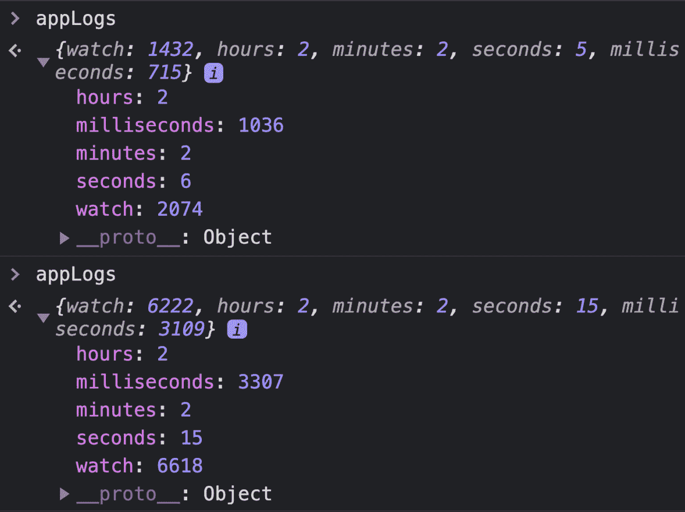

图 12.14 - 使用 runOutsideAngular()进行性能优化后的 appLogs 对象

看着前面的截图，你可能会说：“阿赫桑！这是什么？我们对于观察键的变化检测运行次数仍然很大。这到底有多高效？”很高兴你问了。我会在“它是如何工作的…”部分告诉你*为什么*。

1.  最后一步，停止 Angular 服务器，并运行以下命令以在生产模式下启动服务器：

```ts
ng serve --prod
```

1.  再次转到[`localhost:4200`](https://localhost:4200)。等待几秒钟，然后多次检查**控制台**选项卡中的`appLogs`对象。你应该看到如下对象：

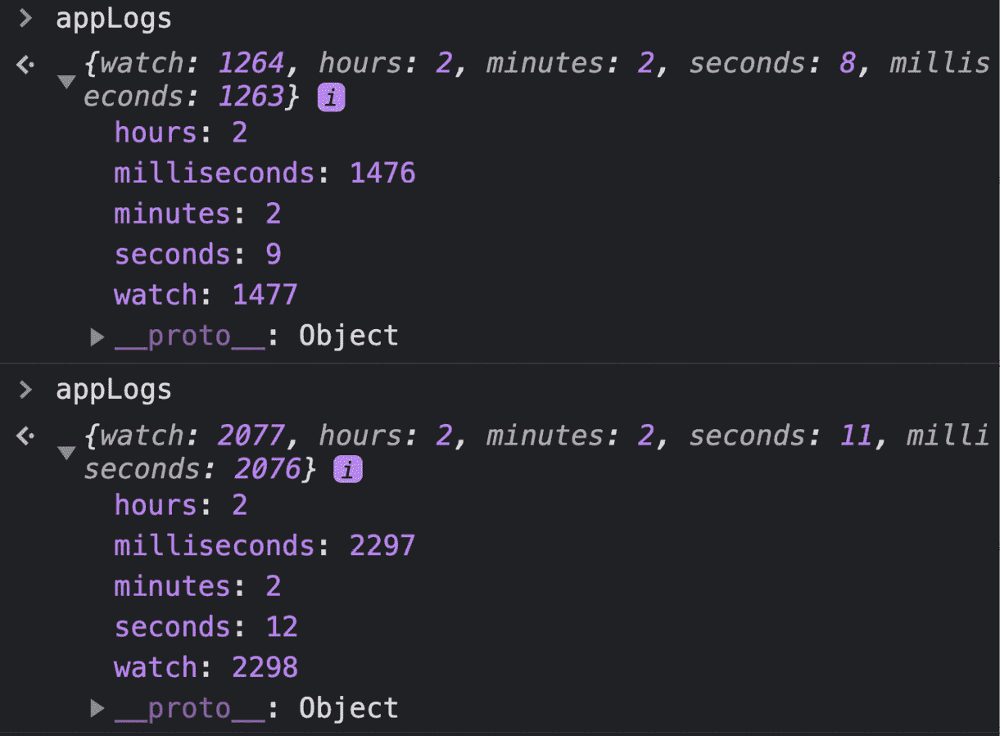

图 12.15 - 使用生产构建的 appLogs 对象

砰！如果你看前面的截图，你会发现`watch`键的变化检测运行次数总是比`milliseconds`键多一个周期。这意味着`WatchComponent`类几乎只在我们更新`@Input() milliseconds`绑定的值时重新渲染。

现在你已经完成了这个示例，看看下一节来了解它是如何工作的。

## 它是如何工作…

在这个示例中，我们首先查看了`appLogs`对象，其中包含一些键值对。每个键值对的值表示 Angular 为特定组件运行变化检测的次数。`hours`、`milliseconds`、`minutes`和`seconds`键分别表示时钟上显示的每个值的`WatchTimeComponent`实例。`watch`键表示`WatchComponent`实例。

在配方的开头，我们看到`watch`键的值比`milliseconds`键的值大两倍以上。我们为什么要关心`milliseconds`键呢？因为在我们的应用程序中，`@Input()`属性绑定`milliseconds`是最频繁变化的——也就是说，它每 1 毫秒（ms）就会变化一次。第二频繁变化的值是`WatchComponent`类中的`xCoordinate`和`yCoordinates`属性，它们每 30 毫秒变化一次。`xCoordinate`和`yCoordinate`的值并没有直接绑定到模板（超文本标记语言（HTML））上，因为它们会改变`stopWatch`视图子组件的层叠样式表（CSS）变量。这是在`animate()`方法内部发生的：

```ts
el.style.setProperty('--x', `${this.xCoordinate}px`);
el.style.setProperty('--y', `${this.yCoordinate}px`);
```

因此，改变这些值实际上不应该触发变化检测。我们首先通过在`WatchBoxComponent`类中使用`clearInterval()`方法来限制时钟窗口，以便时钟在 4 秒内停止，我们可以评估数字。在*图 12.11*中，我们看到即使时钟停止后，变化检测机制仍然会为`WatchComponent`类触发。随着时间的推移，这会增加`appLogs`对象中`watch`键的计数。然后我们在`WatchComponent`类中使用`clearInterval()`来停止动画。这也在 4 秒后停止动画。在*图 12.12*中，我们看到`watch`键的计数在动画停止后停止增加。

然后我们尝试只基于动画来查看变化检测的计数。在*步骤 6*中，我们停止了时钟。因此，我们只会得到`appLogs`对象中`watch`键的基于动画的计数，这个值在 250 和 260 之间。

然后我们在代码中引入了神奇的`runOutsideAngular()`方法。这个方法是`NgZone`服务的一部分。`NgZone`服务打包在`@angular/core`包中。`runOutsideAngular()`方法接受一个方法作为参数。这个方法在 Angular 区域之外执行。这意味着在`runOutsideAngular()`方法内部使用的`setTimeout()`和`setInterval()`方法不会触发 Angular 变化检测周期。在*图 12.13*中，您可以看到使用`runOutsideAngular()`方法后，计数下降到 4。

然后，我们从`WatchBoxComponent`和`WatchComponent`类中删除了`clearInterval()`的使用-也就是说，像我们在开始时那样再次运行时钟和动画。在*图 12.14*中，我们看到`watch`键的计数几乎是`milliseconds`键的两倍。现在，为什么会是两倍呢？这是因为在开发模式下，Angular 运行变更检测机制两次。因此，在*步骤 9*和*步骤 10*中，我们以生产模式运行应用程序，在*图 12.15*中，我们看到`watch`键的值仅比`milliseconds`键的值大 1，这意味着动画不再触发我们应用程序的任何变更检测。很棒，不是吗？如果您发现这个示例有用，请在我的社交媒体上告诉我。

现在您已经了解了它的工作原理，请参阅下一节以获取更多信息。

## 另请参阅

+   `NgZone`官方文档([`angular.io/api/core/NgZone`](https://angular.io/api/core/NgZone))

+   Angular `ChangeDetectorRef`官方文档([`angular.io/api/core/ChangeDetectorRef`](https://angular.io/api/core/ChangeDetectorRef))

# 使用*ngFor 为列表添加 trackBy

列表是我们今天构建的大多数应用程序的重要部分。如果您正在构建一个 Angular 应用程序，您很有可能会在某个时候使用`*ngFor`指令。我们知道`*ngFor`允许我们循环遍历数组或对象，为每个项目生成 HTML。然而，对于大型列表，使用它可能会导致性能问题，特别是当`*ngFor`的源完全改变时。在这个示例中，我们将学习如何使用`*ngFor`指令和`trackBy`函数来提高列表的性能。让我们开始吧。

## 准备工作

此示例的项目位于`Chapter12/start_here/using-ngfor-trackb:`中

1.  在 VS Code 中打开项目。

1.  打开终端并运行`npm install`以安装项目的依赖项。

1.  运行`ng serve -o`命令启动 Angular 应用程序并在浏览器上提供服务。您应该看到应用程序如下：

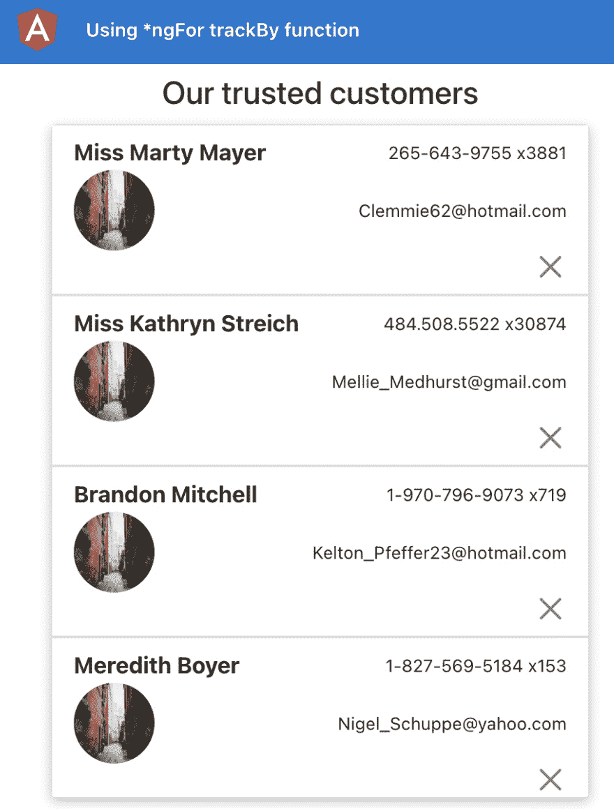

图 12.16-应用程序使用-ngfor-trackby 在 http://localhost:4200 上运行

现在我们的应用程序正在运行，让我们在下一节中看看这个示例的步骤。

## 如何做…

我们有一个应用程序，在视图上显示了 1,000 个用户的列表。由于我们没有使用虚拟滚动和标准的`*ngFor`列表，目前我们面临一些性能问题。请注意，当您刷新应用程序时，即使加载程序隐藏了，您会在列表出现之前看到一个空白的白色框大约 2-3 秒钟。让我们开始重现性能问题并修复它们的步骤。

1.  首先，打开 Chrome DevTools 并查看**控制台**选项卡。您应该看到`ListItemComponent initiated`消息被记录了 1,000 次。每当创建/初始化列表项组件时，都会记录此消息。

1.  现在，通过使用交叉按钮删除第一项。您现在应该再次看到大约 999 次相同的消息被记录，如下截图所示。这意味着我们为剩下的 999 个项目重新创建了列表项组件：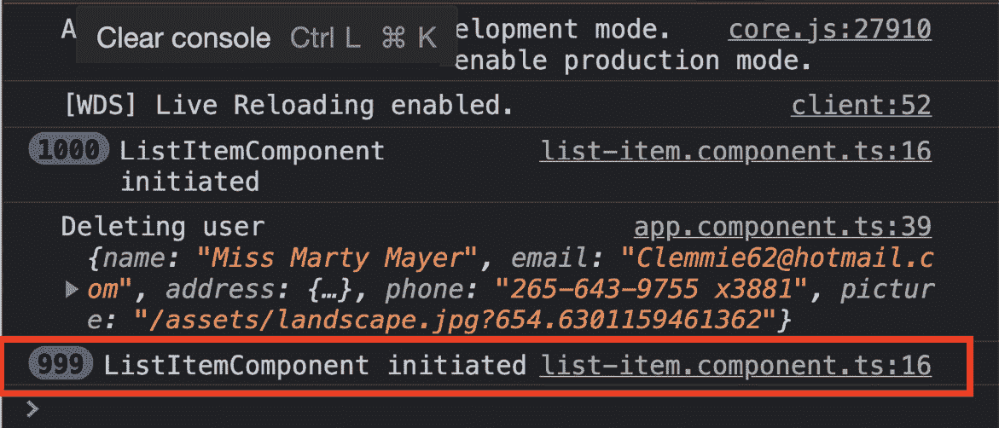

图 12.17–删除项目后再次显示日志

1.  现在，刷新应用程序并点击第一个列表项。您应该再次看到`ListItemComponent initiated`日志，如下截图所示。这意味着我们在项目更新时重新创建所有列表项。您会注意到在**用户界面**（**UI**）中对第一项名称的更新在大约 2-3 秒内反映出来：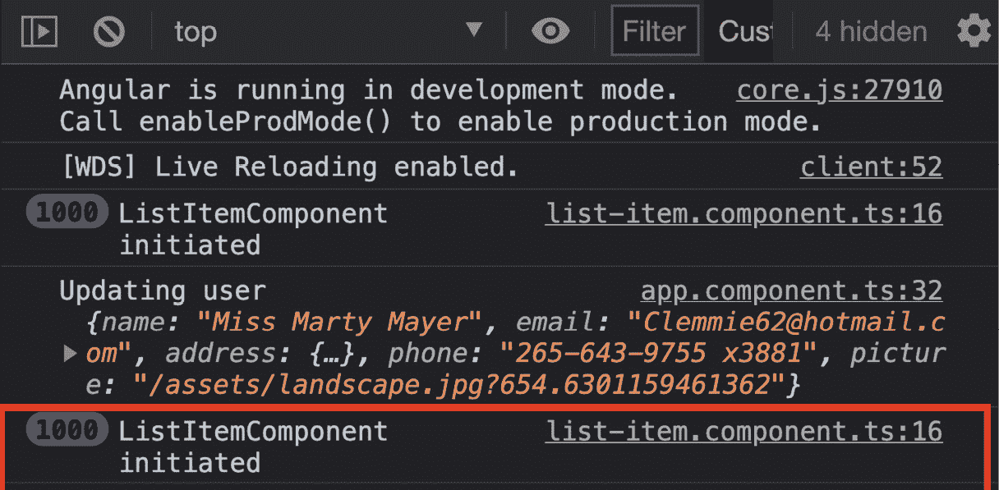

图 12.18–更新项目后再次显示日志

1.  现在，让我们通过使用`trackBy`函数来解决性能问题。打开`the-amazing-list.component.ts`文件并进行更新，如下所示：

```ts
...
@Component({...})
export class TheAmazingListComponent implements OnInit {
  ...
  ngOnInit(): void {}
  trackByFn(_, user: AppUserCard) {
    return user.email;
  }
}
```

1.  现在，更新`the-amazing-list.component.html`文件，使用我们刚刚创建的`trackByFn()`方法，如下所示：

```ts
<h4 class="heading">Our trusted customers</h4>
<div class="list list-group">
  <app-list-item
    *ngFor="let item of listItems; trackBy: trackByFn"
    [item]="item"
    (itemClicked)="itemClicked.emit(item)"
    (itemDeleted)="itemDeleted.emit(item)"
  >
  </app-list-item>
</div>
```

1.  现在，刷新应用程序，并点击第一个列表项进行更新。您会注意到项目立即更新，我们不再记录`ListItemComponent initiated`消息，如下截图所示：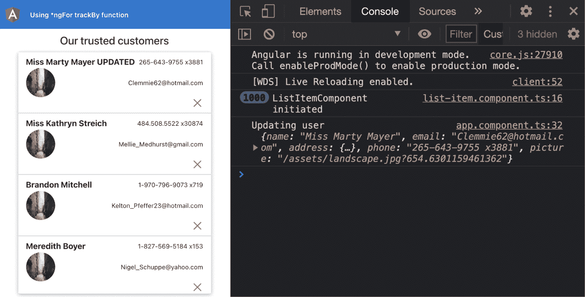

图 12.19–使用 trackBy 函数更新项目后没有更多日志

1.  现在也删除一个项目，您会看到在这种情况下我们不再记录`ListItemComponent initiated`消息。

太棒了！您现在知道如何使用`*ngFor`指令的`trackBy`函数来优化 Angular 中列表的性能。要了解该配方背后的所有魔力，请参阅下一节。

## 它是如何工作的…

`*ngFor`指令默认假定对象本身是其唯一标识，这意味着如果您只更改了`*ngFor`指令中使用的对象的属性，则不会重新呈现该对象的模板。但是，如果您提供一个新对象（内存中的不同引用），特定项目的内容将重新呈现。这实际上是我们在这个配方中为了重现性能问题内容所做的。在`data.service.ts`文件中，我们有`updateUser()`方法的以下代码：

```ts
updateUser(updatedUser: AppUserCard) {
    this.users = this.users.map((user) => {
      if (user.email === updatedUser.email) {
        return {
      ...updatedUser,
   };
      }
      // this tells angular that every object has now       a different reference
      return { ...user };
    });
  }
```

请注意，我们使用对象扩展运算符（`{ … }`）为数组中的每个项目返回一个新对象。这告诉`*ngFor`指令在`TheAmazingListComponent`类的`listItems`数组中的每个项目上重新呈现 UI。假设您向服务器发送查询以查找或过滤用户。服务器可能返回一个包含 100 个用户的响应。在这 100 个用户中，大约有 90 个已经在视图上呈现，只有 10 个不同。然而，由于以下潜在原因（但不限于此），Angular 将重新呈现所有列表项的 UI：

+   用户的排序/放置可能已经改变。

+   用户的长度可能已经改变。

现在，我们希望避免使用对象引用作为每个列表项的唯一标识符。对于我们的用例，我们知道每个用户的电子邮件是唯一的，因此我们使用`trackBy`函数告诉 Angular 使用用户的电子邮件作为唯一标识符。现在，即使我们在`updateUser()`方法中为每个用户返回一个新对象（如前所示），Angular 也不会重新呈现所有列表项。这是因为新对象（用户）具有相同的电子邮件，Angular 使用它来跟踪它们。很酷，对吧？

现在您已经了解了该配方的工作原理，请查看下一节以查看进一步阅读的链接。

## 另请参阅

+   `NgForOf`官方文档（[`angular.io/api/common/NgForOf`](https://angular.io/api/common/NgForOf)）

# 将重计算移动到纯管道

在 Angular 中，我们有一种特殊的编写组件的方式。由于 Angular 的观点很强烈，我们已经从社区和 Angular 团队那里得到了很多关于编写组件时要考虑的指南，例如，直接从组件中进行 HTTP 调用被认为是一个不太好的做法。同样，如果组件中有大量计算，这也被认为是一个不好的做法。当视图依赖于使用计算不断转换数据的转换版本时，使用 Angular 管道是有意义的。在这个示例中，您将学习如何使用 Angular 纯管道来避免组件内的大量计算。

## 准备工作

我们要处理的项目位于`Chapter12/start_here/using-pure-pipes`，在克隆的存储库中：

1.  在 VS Code 中打开项目。

1.  打开终端并运行`npm install`来安装项目的依赖项。

1.  运行`ng serve -o`命令启动 Angular 应用程序并在浏览器上提供服务。您应该看到应用程序如下：


图 12.20 – 在 http://localhost:4200 上运行 using-pure-pipes 应用程序

现在我们在浏览器上提供了项目，让我们在下一节中看看这个示例的步骤。

## 如何做…

我们正在处理的应用程序存在一些性能问题，特别是`UserCardComponent`类，因为它使用`idUsingFactorial()`方法来生成要显示在卡片上的唯一 ID。如果您尝试在搜索框中输入`'irin'`，您会注意到应用程序会暂停一段时间。我们无法立即看到在搜索框中输入的字母，并且在结果显示之前需要一段时间。我们将通过将`idUsingFactorial()`方法中的计算移动到 Angular（纯）管道中来解决这些问题。让我们开始：

1.  让我们创建一个 Angular 管道。我们将把为这个管道生成唯一 ID 的计算移到后面的代码中。在项目根目录中，在终端中运行以下命令：

```ts
ng g pipe core/pipes/unique-id
```

1.  现在，从`user-card.component.ts`文件中复制`createUniqueId()`方法的代码，并粘贴到`unique-id.pipe.ts`文件中。我们还将稍微修改代码，所以现在应该是这样的：

```ts
...
@Pipe({...})
export class UniqueIdPipe implements PipeTransform {
  characters = 'ABCDEFGHIJKLMNOPQRSTUVWXYZabcdef   ghijklmnopqrstuvwxyz0123456789';
  createUniqueId(length) {
    var result = '';
    const charactersLength = this.characters.length;
    for (let i = 0; i < length; i++) {
      result += this.characters.charAt(
        Math.floor(Math.random() * charactersLength)
      );
    }
    return result;
  }
  ...
  transform(index: unknown, ...args: unknown[]): unknown {
    return null;
  }
}
```

1.  现在，还要从`user-card.component.ts`文件中复制`idUsingFactorial()`方法到`unique-id.pipe.ts`文件，并更新文件，如下所示：

```ts
import { Pipe, PipeTransform } from '@angular/core';
@Pipe({
  name: 'uniqueId',
})
export class UniqueIdPipe implements PipeTransform {
  ...
  idUsingFactorial(num, length = 1) {
    if (num === 1) {
      return this.createUniqueId(length);
    } else {
      const fact = length * (num - 1);
      return this.idUsingFactorial(num - 1, fact);
    }
  }
  transform(index: number): string {
    return this.idUsingFactorial(index);
  }
}
```

1.  现在，更新`user-card.component.html`文件，使用`uniqueId`管道而不是组件的方法。代码应该如下所示：

```ts
<div class="user-card">
  <div class="card" *ngIf="user" (click)="cardClicked()">
    
    <div class="card-body">
      <h5 class="card-title">{{ user.name.first }}      {{ user.name.last }}</h5>
      <p class="card-text">{{ user.email }}</p>
      <p class="card-text unique-id" title="{{ index |       uniqueId }}">
        {{ index | uniqueId }}
      </p>
      <a href="tel: {{ user.phone }}" class="btn       btn-primary">{{
        user.phone
      }}</a>
    </div>
  </div>
</div>
```

1.  现在，刷新应用程序并在搜索框中输入名称`Elfie Siegert`。注意到 UI 没有被阻塞。我们能够立即看到我们输入的字母，搜索结果也更快。

砰！现在你知道了如何通过将繁重的计算移动到纯 Angular 管道来优化性能，接下来看看下一节，了解这是如何工作的。

## 它是如何工作的…

正如我们所知，Angular 默认在应用程序中触发的每个浏览器事件上运行变更检测，而且由于我们在组件模板（UI）中使用了`idUsingFactorial()`方法，这个函数会在每次 Angular 运行变更检测机制时运行，导致更多的计算和性能问题。如果我们使用 getter 而不是方法，情况也是如此。在这里，我们使用方法是因为每个唯一的 ID 都依赖于索引，当调用它时，我们需要在方法中传递索引。

我们可以从最初的实现中退一步，思考这个方法实际上是做什么。它接受一个输入，进行一些计算，并根据输入返回一个值——这是数据转换的经典例子，也是你会使用纯函数的例子。幸运的是，Angular 纯管道是纯函数，除非输入发生变化，它们不会触发变更检测。

在这个示例中，我们将计算移动到一个新创建的 Angular 管道中。管道的`transform()`方法接收我们应用管道的值，即`users`数组中每个用户卡的索引。然后管道使用`idUsingFactorial()`方法，最终使用`createUniqueId()`方法来计算一个随机的唯一 ID。当我们开始在搜索框中输入时，索引的值不会改变。这导致在我们输入到搜索框中时不会触发变更检测，从而优化性能并解除 UI 线程的阻塞。

## 另请参阅

+   Angular 纯管道和不纯管道官方文档（[`angular.io/guide/pipes#pure-and-impure-pipes`](https://angular.io/guide/pipes#pure-and-impure-pipes)）

# 使用 Web Workers 进行繁重的计算

如果您的 Angular 应用程序在执行操作期间进行了大量计算，那么它很有可能会阻塞 UI 线程。这将导致 UI 渲染出现延迟，因为它阻塞了主 JavaScript 线程。Web workers 允许我们在后台线程中运行大量计算，从而释放 UI 线程，因为它不会被阻塞。在本教程中，我们将使用一个应用程序，在`UserService`类中进行大量计算。它为每个用户卡创建一个唯一 ID，并将其保存到`localStorage`中。但是，在这样做之前，它会循环几千次，这会导致我们的应用程序暂时挂起。在本教程中，我们将把大量计算从组件移动到 web worker，并在 web worker 不可用的情况下添加一个回退。

## 准备工作

我们将要处理的项目位于克隆存储库中的`Chapter12/start_here/using-web-workers`中：

1.  在 VS Code 中打开项目。

1.  打开终端并运行`npm install`来安装项目的依赖项。

1.  运行`ng serve -o`命令启动 Angular 应用程序并在浏览器上提供服务。您应该看到应用程序如下：

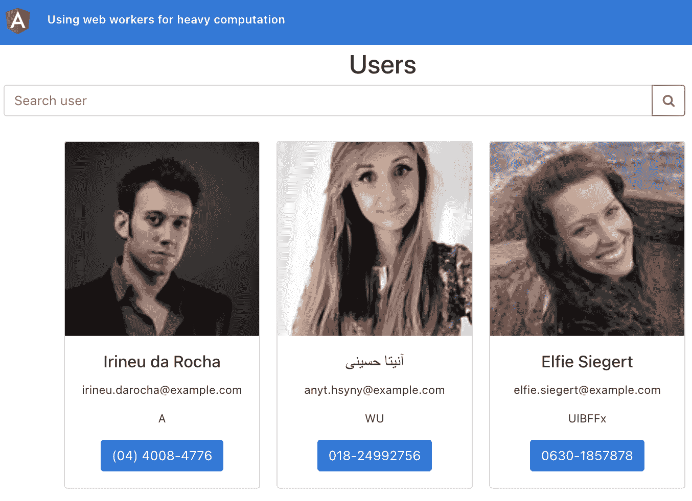

图 12.21 - 应用程序 using-web-workers 在 http://localhost:4200 上运行

现在我们的应用程序正在运行，让我们在下一节中看看本教程的步骤。

## 操作步骤如下…

一旦您打开应用程序，您会注意到在用户卡片被渲染之前需要一些时间。这表明 UI 线程被阻塞，直到计算完成。罪魁祸首是`UserService`类中的`saveUserUniqueIdsToStorage()`方法。这在保存到`localStorage`之前会生成几千个唯一 ID。让我们开始本教程，以改善应用程序的性能。我们将首先实现 web worker：

1.  我们将首先创建一个 web worker。在项目根目录中运行以下命令：

```ts
ng generate web-worker core/workers/idGenerator
```

1.  现在，将`UserService`类中的`saveUserUniqueIdsToStorage()`方法中的`for`循环复制到新创建的`id-generator.worker.ts`文件中。代码应该如下所示：

```ts
/// <reference lib="webworker" />
import createUniqueId from '../constants/create-unique-id';
addEventListener('message', ({ data }) => {
  console.log('message received IN worker', data);
  const { index, email } = data;
  let uniqueId;
  for (let i = 0, len = (index + 1) * 100000; i < len;   ++i) {
    uniqueId = createUniqueId(50);
  }
  postMessage({ uniqueId, email });
});
```

1.  现在我们已经创建了 worker 文件，让我们创建一个 worker 的单个实例，以便在接下来的步骤中使用它。在`constants`文件夹中创建一个新文件。命名为`get-unique-id-worker.ts`，并在文件中添加以下代码：

```ts
let UNIQUE_ID_WORKER: Worker = null;
const getUniqueIdWorker = (): Worker => {
  if (typeof Worker !== 'undefined' && UNIQUE_ID_WORKER   === null) {
    UNIQUE_ID_WORKER = new Worker('../workers/    id-generator.worker', {
      type: 'module',
    });
  }
  return UNIQUE_ID_WORKER;
};
export default getUniqueIdWorker;
```

1.  现在，我们将在`user.service.ts`文件中使用 worker。更新它如下：

```ts
...
import getUniqueIdWorker from '../constants/get-unique-id-worker';
@Injectable({...})
export class UserService {
  ...
  worker: Worker = getUniqueIdWorker();
  constructor(private http: HttpClient) {
  this.worker.onmessage = ({ data: { uniqueId, email }   }) => {
      console.log('received message from worker',       uniqueId, email);
      const user = this.usersCache.find((user) => user.      email === email);
      localStorage.setItem(
        `ng_user__${user.email}`,
        JSON.stringify({
          ...user,
          uniqueId,
        })
      );
    };
  }
  ...
}
```

1.  我们将再次更新文件以修改`saveUserUniqueIdsToStorage()`方法。如果环境中有 Web 工作者可用，我们将使用工作者而不是使用现有的代码。按照以下方式更新`user.service.ts`文件：

```ts
...
@Injectable({...})
export class UserService {
  ...
  saveUserUniqueIdsToStorage(user: IUser, index) {
    let uniqueId;
    const worker: Worker = getUniqueIdWorker();
    if (worker !== null) {
      worker.postMessage({ index, email: user.email });
    } else {
      // fallback
      for(let i = 0, len = (index + 1) * 100000; i<len;       ++i) {
        uniqueId = createUniqueId(50);
      }
      localStorage.setItem(...);
    }
  }
  ...
}
```

1.  刷新应用程序，注意用户卡片渲染需要多长时间。它们应该比以前出现得快得多。此外，你应该能够看到以下日志，反映了应用程序与 Web 工作者之间的通信：

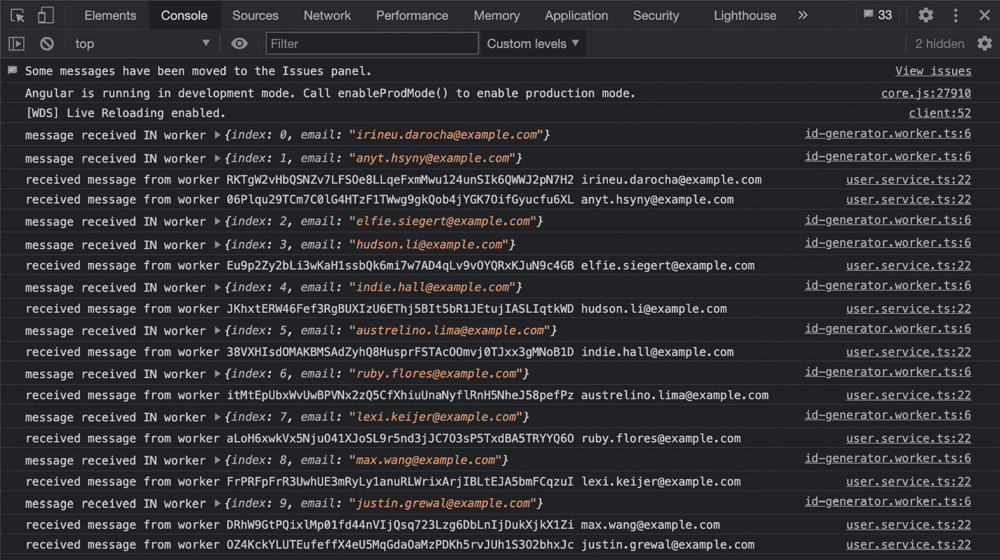

图 12.22 - 显示应用程序与 Web 工作者之间消息的日志

哇呜！Web 工作者的力量！现在你知道如何在 Angular 应用程序中使用 Web 工作者将繁重的计算移动到它们那里了。既然你已经完成了这个教程，那就看看下一节它是如何工作的吧。

## 它是如何工作的...

正如我们在教程描述中讨论的那样，Web 工作者允许我们在与主 JavaScript（或 UI 线程）分开的线程中运行和执行代码。在教程开始时，每当我们刷新应用程序或搜索用户时，它都会阻塞 UI 线程。直到为每张卡生成一个唯一的 ID 为止。我们通过使用 Angular 的**命令行界面**（**CLI**）创建一个 Web 工作者来开始这个教程。这将创建一个`id-generator.worker.ts`文件，其中包含一些样板代码，用于接收来自 UI 线程的消息并作为响应发送消息回去。CLI 命令还通过添加`webWorkerTsConfig`属性来更新`angular.json`文件。`webWorkerTsConfig`属性的值是`tsconfig.worker.json`文件的路径，CLI 命令还创建了这个`tsconfig.worker.json`文件。如果你打开`tsconfig.worker.json`文件，你应该会看到以下代码：

```ts
/* To learn more about this file see: https://angular.io/config/tsconfig. */
{
  "extends": "./tsconfig.json",
  "compilerOptions": {
    "outDir": "./out-tsc/worker",
    "lib": [
      "es2018",
      "webworker"
    ],
    "types": []
  },
  "include": [
    "src/**/*.worker.ts"
  ]
}
```

创建完 Web Worker 文件后，我们创建另一个名为`uniqueIdWorker.ts`的文件。该文件将`getUniqueIdWorker()`方法作为默认导出。当我们调用此方法时，如果尚未生成 Worker 实例，它将生成一个新的`Worker`实例。该方法使用`id-generator.worker.ts`文件来生成 Worker。我们还在 Worker 文件中使用`addEventListener()`方法来监听从 UI 线程（即`UserService`类）发送的消息。我们接收到的消息中包含用户卡的`index`和用户的`email`。然后我们使用`for`循环来生成一个唯一 ID（`uniqueId`变量），循环结束后，我们使用`postMessage()`方法将`uniqueId`变量和`email`发送回 UI 线程。

现在，在`UserService`类中，我们监听来自 Worker 的消息。在`constructor()`方法中，我们通过检查`getUniqueIdWorker()`方法的值（应该是非空值）来检查环境中是否可用 Web Workers。然后，我们使用`worker.onmessage`属性来分配一个方法。这是为了监听来自 Worker 的消息。由于我们已经知道我们从 Worker 那里得到了`uniqueId`变量和`email`，我们使用`email`来从`usersCache`变量中获取相应的用户。然后，我们将用户数据与`uniqueId`变量存储到`localStorage`中，针对用户的`email`。

最后，我们更新`saveUserUniqueIdsToStorage()`方法以使用 Worker 实例（如果可用）。请注意，我们使用`worker.postMessage()`方法来传递用户的`index`和`email`。还要注意，我们在没有启用 Web Workers 的情况下，使用先前的代码作为备用。

## 另请参阅

+   Angular 官方文档关于 Web Workers 的内容（[`angular.io/guide/web-worker`](https://angular.io/guide/web-worker)）

+   MDN 关于 Web Worker 的文档（[`developer.mozilla.org/en-US/docs/Web/API/Worker`](https://developer.mozilla.org/en-US/docs/Web/API/Worker)）

# 使用性能预算进行审核

在当今世界，大多数人口都有相当好的互联网连接，可以使用日常应用程序，无论是移动应用程序还是 Web 应用程序，令人着迷的是我们作为企业向最终用户发送了多少数据。现在向用户发送的 JavaScript 数量呈不断增长的趋势，如果你正在开发 Web 应用程序，你可能希望使用性能预算来确保捆绑包大小不超过一定限制。对于 Angular 应用程序，设置预算大小非常简单。在本教程中，您将学习如何使用 Angular CLI 为您的 Angular 应用程序设置预算。

## 准备工作

本教程的项目位于`Chapter12/start_here/angular-performance-budget`中：

1.  在 VS Code 中打开项目。

1.  打开终端并运行`npm install`以安装项目的依赖项。

1.  运行`ng build --configuration production`命令以在生产模式下构建 Angular 应用程序。注意控制台上的输出。它应该是这样的：

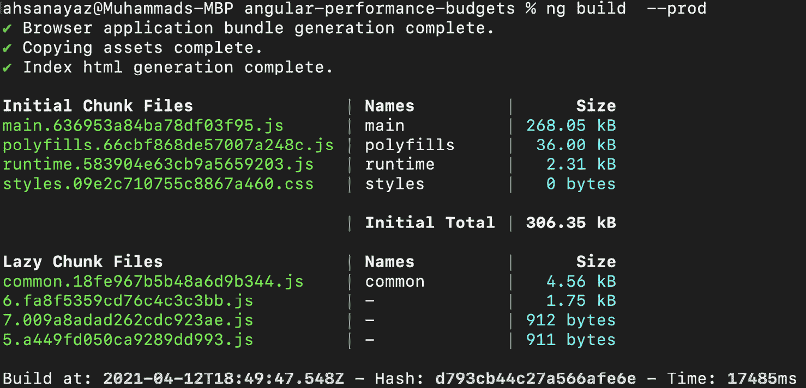

图 12.23 - 以生产模式构建输出，没有性能预算

请注意，`main.*.js`文件的捆绑包大小目前约为 260 千字节（KB）。现在我们已经构建了应用程序，让我们在下一节中看看教程的步骤。

## 如何操作…

目前，我们的应用程序在捆绑包大小方面非常小。然而，随着即将到来的业务需求，这可能会变成一个庞大的应用程序。为了本教程的目的，我们将故意增加捆绑包大小，然后使用性能预算来阻止 Angular CLI 在捆绑包大小超过预算时构建应用程序。让我们开始教程：

1.  打开`app.component.ts`文件并进行更新，如下所示：

```ts
...
import * as moment from '../lib/moment';
import * as THREE from 'three';
@Component({...})
export class AppComponent {
  ...
  constructor(private auth: AuthService, private router:   Router) {
    const scene = new THREE.Scene();
    console.log(moment().format('MMM Do YYYY'));
  }
  ...
}
```

1.  现在，使用`ng build --configuration production`命令再次为生产构建应用程序。您会看到`main.*.js`文件的捆绑包大小现在为 1.12 兆字节（MB）。与原始的 268.05 KB 相比，这是一个巨大的增加，如下截图所示：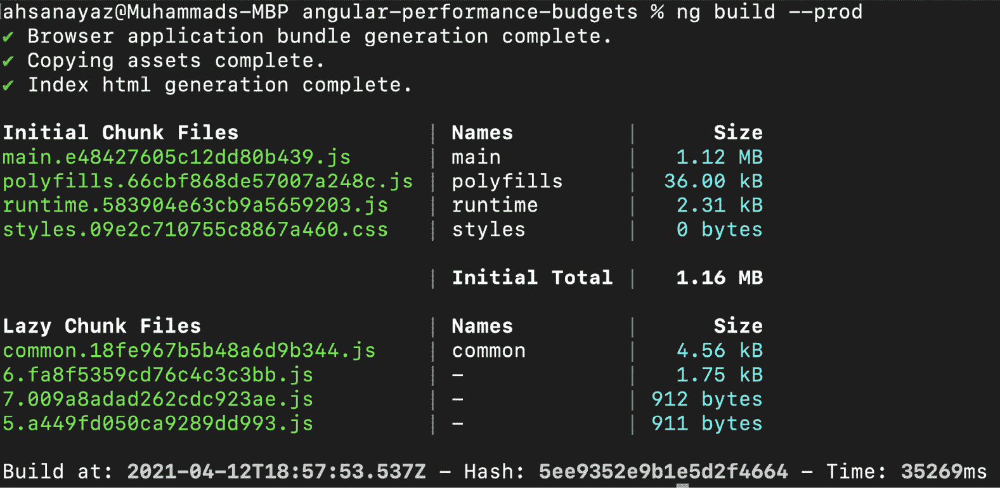

图 12.24 - main.*.js 的捆绑包大小增加到 1.11 MB

假设我们的业务要求我们不要将主捆绑包大小超过 1.0 MB。为此，我们可以配置我们的 Angular 应用程序，如果达到阈值，就抛出错误。

1.  刷新应用程序，打开`angular.json`文件并进行更新。我们要定位的属性是`projects.angular-performance-budgets.architect.build.configurations.production.budgets`。文件应该如下所示：

```ts
...
{
  "budgets": [
    {
      "type": "initial",
      "maximumWarning": "800kb",
      "maximumError": "1mb"
    },
    {
      "type": "anyComponentStyle",
      "maximumWarning": "6kb",
      "maximumError": "10kb"
    }
  ]
}
...
```

1.  现在我们已经制定了预算，让我们再次使用`ng build --configuration production`命令构建应用程序。构建应该会失败，并且您应该在控制台上看到警告和错误，如下所示：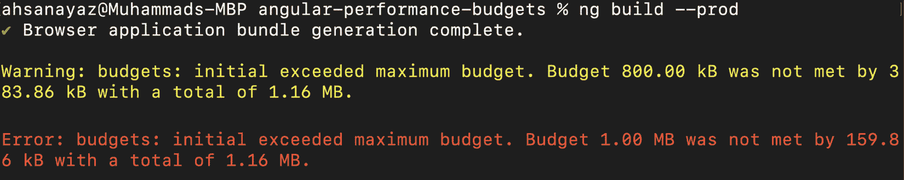

图 12.25 – Angular CLI 根据性能预算抛出错误和警告

1.  通过在`app.component.ts`文件中不导入整个库，并使用`date-fns`包代替`moment.js`来改进我们的应用程序。运行以下命令安装`date-fns`包：

```ts
npm install --save date-fns
```

1.  现在，按照以下步骤更新`app.component.ts`文件：

```ts
import { Component } from '@angular/core';
import { Router } from '@angular/router';
import { AuthService } from './services/auth.service';
import { format } from 'date-fns';
import { Scene } from 'three';
@Component({...})
export class AppComponent {
  ...
  constructor(private auth: AuthService, private router:   Router) {
    console.log(format(new Date(), 'LLL do yyyy'));
    const scene = new Scene();
  }
  ...
}
```

1.  再次运行`ng build --configuration production`命令。您应该会看到捆绑包大小减小，如下所示：

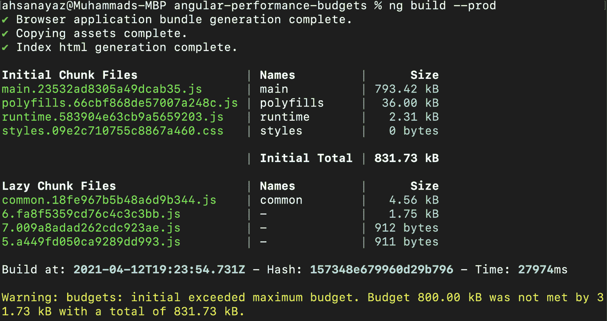

图 12.26 – 使用 date-fns 和优化导入后减小的捆绑包大小

砰！！你刚学会了如何使用 Angular CLI 来定义性能预算。这些预算可以根据您的配置来发出警告和错误。请注意，预算可以根据不断变化的业务需求进行修改。然而，作为工程师，我们必须谨慎地设置性能预算，以免将 JavaScript 超出一定限制发送给最终用户。

## 另请参阅

+   Angular CLI 官方文档中的性能预算（[`web.dev/performance-budgets-with-the-angular-cli/`](https://web.dev/performance-budgets-with-the-angular-cli/)）

# 使用 webpack-bundle-analyzer 分析捆绑包

在上一个示例中，我们看到了为我们的 Angular 应用程序配置预算，这很有用，因为您可以知道整体捆绑包大小是否超过了某个阈值，尽管您不知道代码的每个部分实际上对最终捆绑包的贡献有多大。这就是我们所谓的*分析*捆绑包，在本示例中，您将学习如何使用`webpack-bundle-analyzer`来审计捆绑包大小和导致它们的因素。

## 准备就绪

我们要处理的项目位于克隆存储库中的`Chapter12/start_here/using-webpack-bundle-analyzer`中：

1.  在 VS Code 中打开项目。

1.  打开终端并运行`npm install`来安装项目的依赖项。

1.  运行`ng serve -o`命令来启动 Angular 应用程序并在浏览器上提供服务。您应该看到应用程序如下所示：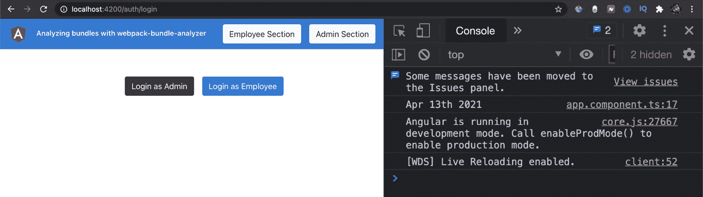

图 12.27 – 使用 webpack-bundle-analyzer 运行的应用程序位于 http://localhost:4200

1.  现在，使用`ng build --configuration production`命令构建 Angular 应用程序的生产模式。您应该看到以下输出：

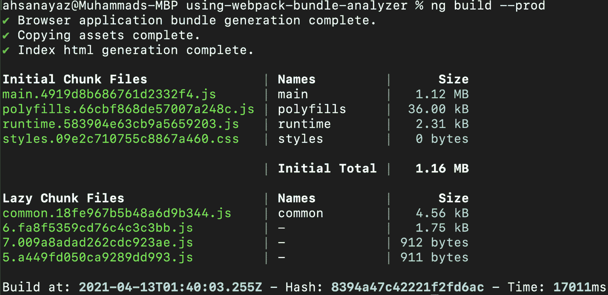

图 12.28 – 主捆绑包，大小为 1.11 MB

现在我们已经构建了应用程序，让我们看看下一节中的步骤。

## 如何做…

正如您可能已经注意到的，我们有一个大小为 1.12 MB 的主捆绑包。这是因为我们在`app.component.ts`文件中使用了`Three.js`库和`moment.js`库，它们被导入到主捆绑包中。让我们开始分析捆绑包大小的因素：

1.  我们首先安装`webpack-bundle-analyzer`包。在项目根目录中运行以下命令：

```ts
npm install --save-dev webpack-bundle-analyzer
```

1.  现在，在`package.json`文件中创建一个脚本。我们将在接下来的步骤中使用这个脚本来分析我们的最终捆绑包。更新`package.json`文件如下：

```ts
{
  ...
  "scripts": {
    "ng": "ng",
    "start": "ng serve",
    "build": "ng build",
    "test": "ng test",
    "lint": "ng lint",
    "e2e": "ng e2e",
    "analyze-bundle": "webpack-bundle-analyzer     dist/using-webpack-bundle-analyzer/stats.json"
  },
  "private": true,
  "dependencies": {... },
  "devDependencies": {...}
}
```

1.  现在，再次构建生产捆绑包，但使用参数生成一个`stats.json`文件。从项目根目录运行以下命令：

```ts
ng build --configuration production --stats-json
```

1.  现在，运行`analyze-bundle`脚本来使用`webpack-bundle-analyzer`包。从项目根目录运行以下命令：

```ts
npm run analyze-bundle
```

这将启动一个带有捆绑包分析的服务器。您应该看到默认浏览器中打开了一个新标签页，它应该是这样的：

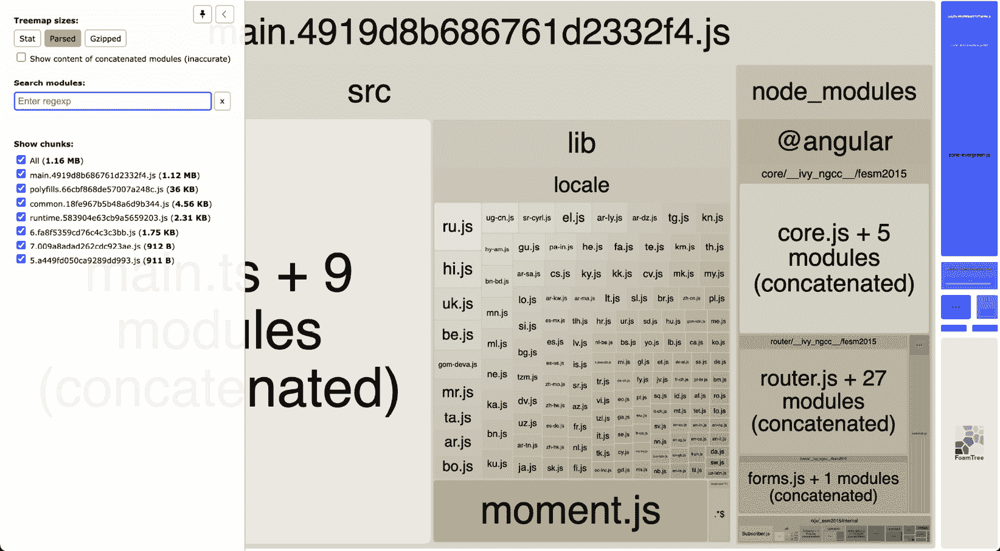

图 12.29 – 使用 webpack-bundle-analyzer 进行捆绑包分析

1.  注意，`lib`文件夹占据了捆绑包大小的很大一部分——确切地说是 648.29 KB，你可以通过在`lib`框上悬停鼠标来检查。让我们尝试优化捆绑包大小。让我们安装`date-fns`包，这样我们就可以使用它而不是`moment.js`。从项目根目录运行以下命令：

```ts
npm install --save date-fns
```

1.  现在，更新`app.component.ts`文件，使用`date-fns`包的`format()`方法，而不是使用`moment().format()`方法。我们还将只从`Three.js`包中导入`Scene`类，而不是导入整个库。代码应该如下所示：

```ts
import { Component } from '@angular/core';
import { Router } from '@angular/router';
import { AuthService } from './services/auth.service';
import { format } from 'date-fns';
import { Scene } from 'three';
@Component({...})
export class AppComponent {
  ...
  constructor(private auth: AuthService, private router:   Router) {
    const scene = new Scene();
    console.log(format(new Date(), 'LLL do yyyy'));
  }
  ...
}
```

1.  运行`ng build --configuration production --stats-json`命令，然后运行`npm run analyze-bundle`。

一旦`webpack-bundle-analyzer`运行，您应该会看到分析结果，如下面的屏幕截图所示。请注意，我们不再有`moment.js`文件或`lib`块，整体捆绑大小已从 1.15 MB 减少到 831.44 KB：

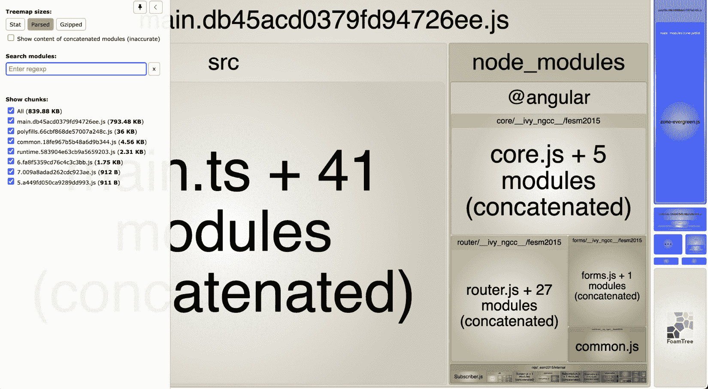

图 12.30-在使用 date-fns 而不是 moment.js 之后进行捆绑分析

哇呜！！！您现在知道如何使用`webpack-bundle-analyzer`包来审计 Angular 应用程序中的捆绑大小。这是改善整体性能的好方法，因为您可以识别导致捆绑大小增加的块，然后优化捆绑。

## 另请参阅

+   开始使用 webpack（[`webpack.js.org/guides/getting-started/`](https://webpack.js.org/guides/getting-started/)）

+   `webpack-bundle-analyzer`—GitHub 存储库（[`github.com/webpack-contrib/webpack-bundle-analyzer`](https://github.com/webpack-contrib/webpack-bundle-analyzer))
