# 第十三章：*第十三章*：使用 Angular 构建 PWAs

PWAs 或渐进式 Web 应用程序本质上是 Web 应用程序。尽管它们使用现代浏览器支持的增强功能和体验构建，但如果在不支持现代功能/增强功能的浏览器中运行 PWA，则用户仍然可以获得 Web 应用程序的核心体验。在本章中，您将学习如何将 Angular 应用程序构建为 PWA。您将学习一些技术，使您的应用程序具有可安装、功能强大、快速和可靠的特性。以下是本章中要涵盖的内容：

+   使用 Angular CLI 将现有的 Angular 应用程序转换为 PWA

+   修改您的 PWA 的主题颜色

+   在您的 PWA 中使用深色模式

+   为您的 PWA 提供自定义可安装体验

+   使用 Angular 服务工作者预缓存请求

+   为您的 PWA 创建应用程序外壳

# 技术要求

在本章的示例中，请确保您的计算机上已安装 Git 和 Node.js。您还需要安装`@angular/cli`包，可以在终端中使用`npm install -g @angular/cli`来安装。您还需要全局安装`http-server`包。您可以在终端中运行`npm install -g http-server`来安装它。本章的代码可以在[`github.com/PacktPublishing/Angular-Cookbook/tree/master/chapter13`](https://github.com/PacktPublishing/Angular-Cookbook/tree/master/chapter13)找到。

# 使用 Angular CLI 将现有的 Angular 应用程序转换为 PWA

PWA 涉及一些有趣的组件，其中两个是服务工作者和 Web 清单文件。服务工作者有助于缓存静态资源和缓存请求，而 Web 清单文件包含有关应用程序图标、应用程序的主题颜色等信息。在本示例中，我们将把现有的 Angular 应用程序转换为 PWA。这些原则也适用于从头开始创建的新 Angular 应用程序。为了示例，我们将转换一个现有的 Angular 应用程序。我们将看到我们的 Angular Web 应用程序中发生了什么变化，以及`@angular/pwa`包如何将其转换为 PWA。还有它如何帮助缓存静态资源。

## 准备工作

我们将要处理的项目位于克隆存储库中的`chapter13/start_here/angular-pwa-app`中：

1.  在 Visual Studio Code 中打开项目。

1.  打开终端并运行`npm install`来安装项目的依赖项。

1.  完成后，运行`ng build --configuration production`。

1.  现在运行`http-server dist/angular-pwa-app -p 4200`。

这应该以生产模式在`http://localhost:4200`上运行应用程序，并且应该如下所示：

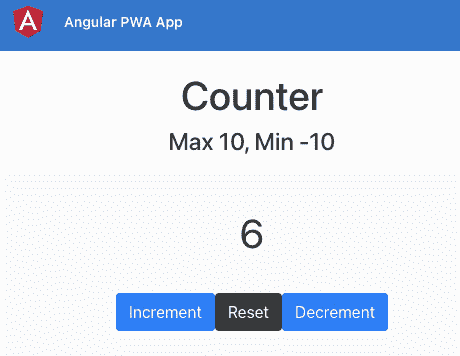

图 13.1 - angular-pwa-app 在 http://localhost:4200 上运行

现在我们已经在本地运行了应用程序，让我们在下一节中看到食谱的步骤。

## 如何做到

我们正在使用的应用程序是一个简单的计数器应用程序。它有一个最小值和最大值，以及一些按钮，可以增加、减少和重置计数器的值。该应用程序将计数器的值保存在`localStorage`中，但它还不是 PWA。让我们将其转换为 PWA：

1.  首先，让我们看看我们的应用程序是否根本可以离线工作，因为这是 PWA 的特征之一。为应用程序打开 Chrome DevTools。转到**网络**选项卡，并将**限速**更改为**离线**，如下所示：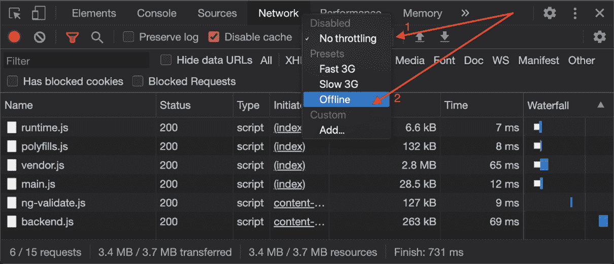

图 13.2 - 将网络限速更改为离线以查看离线体验

1.  现在通过退出终端中的进程停止`http`服务器。完成后，刷新应用程序的页面。您应该看到应用程序不再工作，如下图所示：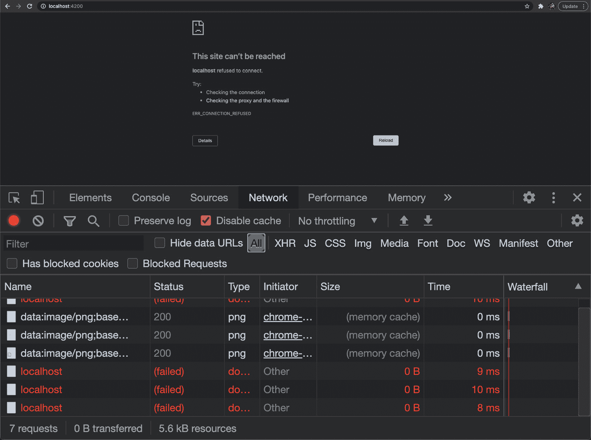

图 13.3 - 应用程序在离线状态下无法工作

1.  要将此应用程序转换为 PWA，请打开一个新的终端窗口/选项卡，并确保您在`chapter13/start_here/angular-pwa-app`文件夹内。进入后，运行以下命令：

```ts
ng add @angular/pwa
```

当命令完成时，您应该看到一堆文件被创建和更新。

1.  现在再次构建应用程序，运行`ng build --configuration production`。完成后，使用`http-server dist/angular-pwa-app -p 4200`命令进行服务。

1.  现在确保您已经通过切换到**网络**选项卡并将**无限制**设置为选择选项来关闭限速，如*图 13.4*所示。还要注意**禁用缓存**选项已关闭：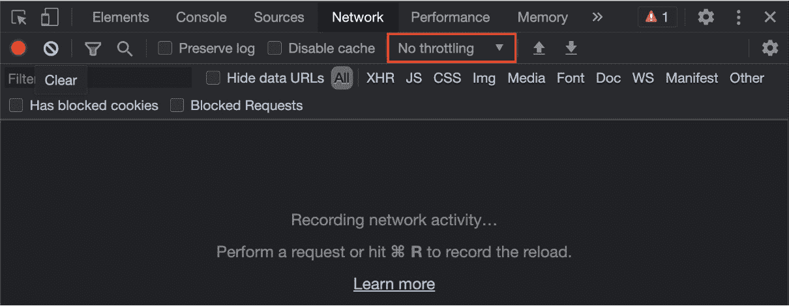

图 13.4 - 关闭网络限速

1.  现在刷新应用程序一次。您应该看到应用程序正在工作，并且网络日志显示从服务器加载了 JavaScript 文件等资产，如*图 13.5*所示：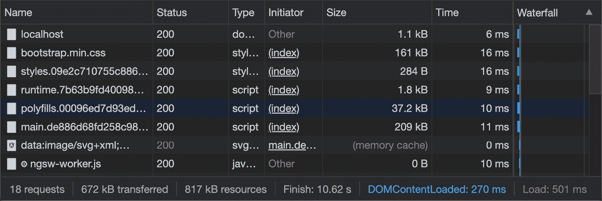

图 13.5 - 从源（Angular 服务器）下载的资产

1.  现在再次刷新应用程序，你会看到相同的资产现在是使用服务工作线程从缓存中下载的，如*图 13.6*所示：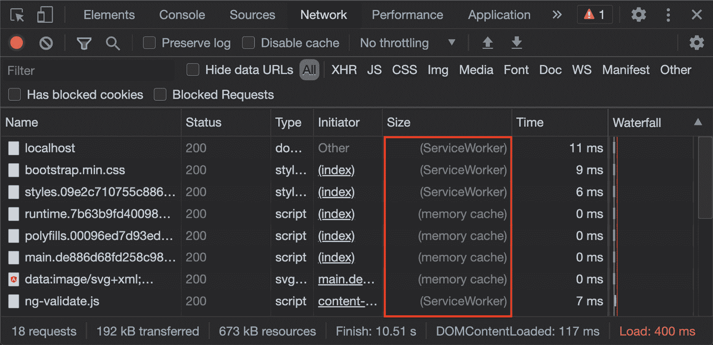

图 13.6 - 使用服务工作线程从缓存中下载的资产

1.  现在是我们一直在等待的时刻。将网络限制改回**离线**以进入**离线**模式，然后刷新应用程序。你应该仍然看到应用程序在**离线**模式下工作，因为服务工作线程，如*图 13.7*所示：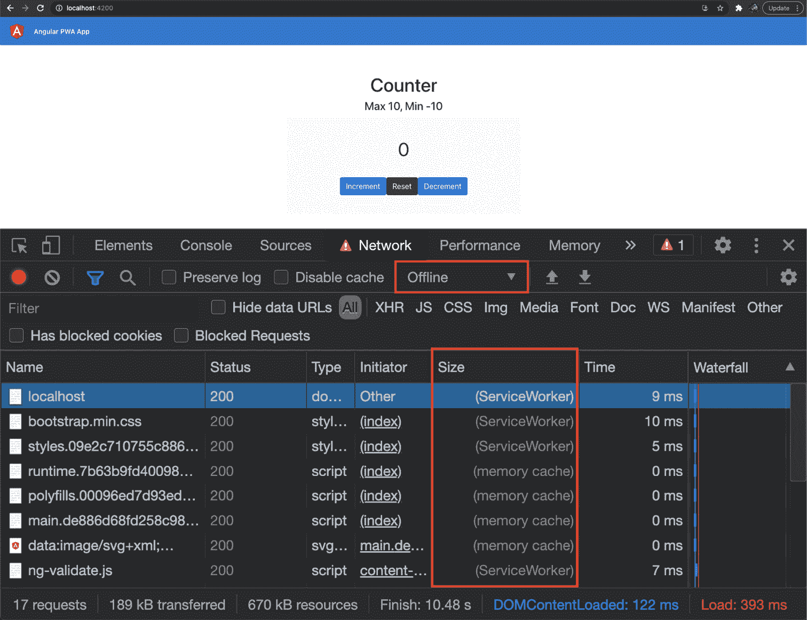

图 13.7 - 使用服务工作线程作为 PWA 离线工作的 Angular 应用程序

1.  而且，你现在实际上可以在你的机器上安装这个 PWA。由于我使用的是 MacBook，它被安装为 Mac 应用程序。如果你使用的是 Chrome，安装选项应该在地址栏附近，如*图 13.8*所示：

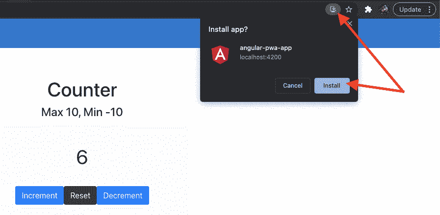

图 13.8 - 从 Chrome 安装 Angular PWA

砰！只需使用`@angular/pwa`包，我们就将现有的 Angular 应用程序转换为 PWA，而且没有进行任何配置。我们现在能够离线运行我们的应用程序，并且可以在我们的设备上安装它作为 PWA。看看*图 13.9*，看看应用程序的外观 - 就像在 macOS X 上的本机应用程序一样：

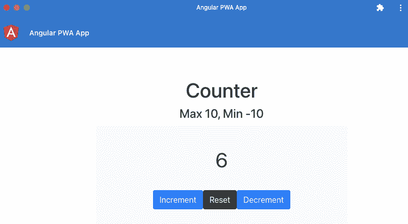

图 13.9 - 我们的 Angular PWA 在 macOS X 上作为本机应用程序的外观

很酷，对吧？现在你知道如何使用 Angular CLI 构建 PWA 了，看看下一节，了解它是如何工作的。

## 它是如何工作的

Angular 核心团队和社区在`@angular/pwa`包以及通常的`ng add`命令方面做得非常出色，这使我们能够使用 Angular 原理图向我们的应用程序添加不同的包。在这个示例中，当我们运行`ng add @angular/pwa`时，它使用原理图生成应用程序图标以及 Web 应用程序清单。如果你查看更改的文件，你可以看到新文件，如*图 13.10*所示：

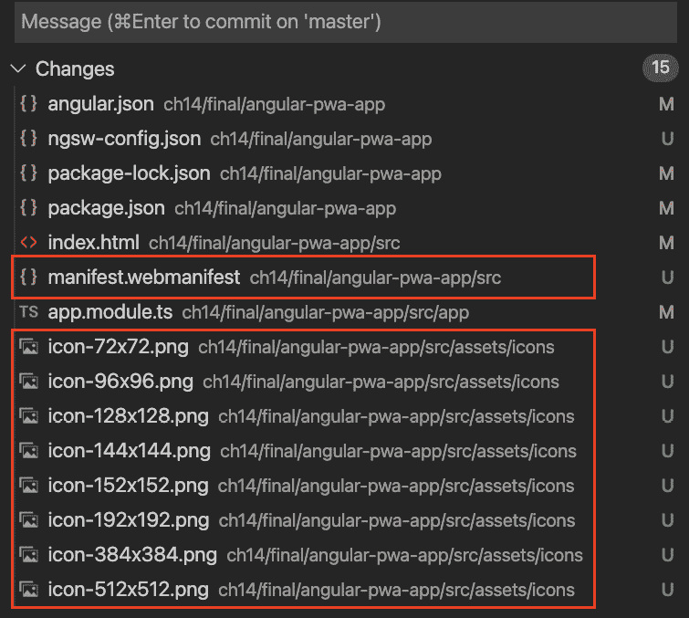

图 13.10 - Web 清单文件和应用图标文件

`manifest.webmanifest`文件是一个包含 JSON 对象的文件。这个对象定义了 PWA 的清单并包含一些信息。这些信息包括应用的名称、简称、主题颜色以及不同设备的不同图标的配置。想象一下这个 PWA 安装在你的安卓手机上。你肯定需要一个图标在你的主屏幕上，点击图标打开应用。这个文件包含了关于根据不同设备尺寸使用哪个图标的信息。

我们还会看到`ngsw-config.json`文件，其中包含了服务工作者的配置。在幕后，当`ng add`命令运行原理时，它也会在我们的项目中安装`@angular/service-worker`包。如果你打开`app.module.ts`文件，你会看到注册我们服务工作者的代码如下：

```ts
...
import { ServiceWorkerModule } from '@angular/service-worker';
...
@NgModule({
  declarations: [AppComponent, CounterComponent],
  imports: [
    ...
    ServiceWorkerModule.register('ngsw-worker.js', {
      enabled: environment.production,
      // Register the ServiceWorker as soon as the app is       stable
      // or after 30 seconds (whichever comes first).
      registrationStrategy: 'registerWhenStable:30000',
    }),
  ],
  ...
})
export class AppModule {}
```

该代码注册了一个名为`ngsw-worker.js`的新服务工作者文件。这个文件使用`ngsw-config.json`文件中的配置来决定缓存哪些资源以及使用哪些策略。

现在你知道这个配方是如何工作的了，看下一节以获取更多信息。

## 另请参阅

+   Angular 服务工作者介绍（[`angular.io/guide/service-worker-intro`](https://angular.io/guide/service-worker-intro))

+   什么是 PWA？（[`web.dev/what-are-pwas/`](https://web.dev/what-are-pwas/))

# 修改 PWA 的主题颜色

在上一个配方中，我们学习了如何将一个 Angular 应用转换为 PWA。当我们这样做时，`@angular/pwa`包会创建带有默认主题颜色的 Web 应用清单文件，如*图 13.9*所示。然而，几乎每个 Web 应用都有自己的品牌和风格。如果你想根据自己的品牌主题化 PWA 的标题栏，这就是你需要的配方。我们将学习如何修改 Web 应用清单文件来自定义 PWA 的主题颜色。

## 准备工作

这个配方的项目位于`chapter13/start_here/pwa-custom-theme-color`：

1.  在 Visual Studio Code 中打开项目。

1.  打开终端并运行`npm install`来安装项目的依赖项。

1.  完成后，运行`ng build --configuration production`。

1.  现在运行`http-server dist/pwa-custom-theme-color -p 5300`来提供服务。

1.  打开`localhost:5300`来查看应用程序。

1.  最后，按照*图 13.8*中所示安装 PWA。

如果你打开 PWA，它应该如下所示：

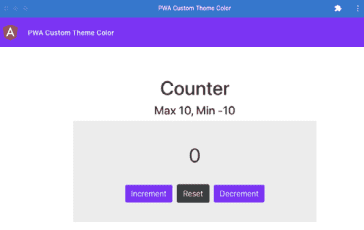

图 13.11 - PWA 自定义主题颜色应用

现在我们的应用程序正在运行，让我们在下一节中看看食谱的步骤。

## 如何做

正如*图 13.11*中所示，应用程序的标题栏与应用程序的原生标题栏（或工具栏）颜色有些不同。由于这种差异，应用程序看起来有点奇怪。我们将修改 Web 应用程序清单以更新主题颜色。让我们开始吧：

1.  在你的编辑器中打开`src/manifest.webmanifest`文件，并按照以下方式更改主题颜色：

```ts
{
  "name": "pwa-custom-theme-color",
  "short_name": "pwa-custom-theme-color",
  "theme_color": "#8711fc",
  "background_color": "#fafafa",
  "display": "standalone",
  "scope": "./",
  "start_url": "./",
  "icons": [...]
}
```

1.  我们的`index.html`文件中也设置了`theme-color`。默认情况下，它优先于 Web 应用程序清单文件。因此，我们需要更新它。打开`index.html`文件，并按照以下方式更新它：

```ts
<!DOCTYPE html>
<html lang="en">
  <head>
    ...
    <link rel="manifest" href="manifest.webmanifest" />
  <meta name="theme-color" content="#8711fc" />
  </head>
  <body>
    ...
  </body>
</html>
```

1.  现在，使用`ng build --configuration production`命令再次构建应用程序。然后使用`http-server`进行服务，如下所示：

```ts
http-server dist/pwa-custom-theme-color -p 5300
```

1.  再次打开 PWA 应用程序，并按照*图 13.12*中所示卸载它。确保在提示时勾选“也清除 Chrome 中的数据(...)”的复选框：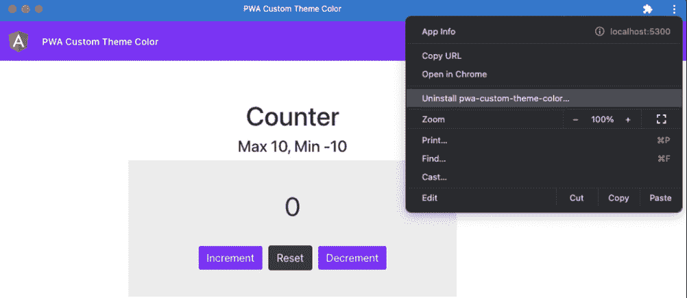

图 13.12 – 卸载 pwa-custom-theme-color 应用程序

1.  现在在新的 Chrome 标签页中打开 Angular 应用程序，网址为`http://localhost:5300`，并按照*图 13.8*中所示再次安装该应用程序作为 PWA。

1.  PWA 应该已经打开了。如果没有，请从你的应用程序中打开它，你应该会看到更新后的主题颜色，就像*图 13.13*中所示：

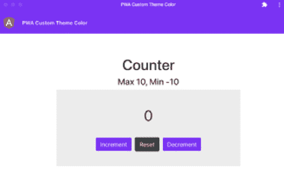

图 13.13 – 带有更新主题颜色的 PWA 应用程序

太棒了！你刚刚学会了如何为 Angular PWA 更新主题颜色。完成了这个食谱后，查看下一节以获取更多阅读材料。

## 另请参阅

+   使用 Angular CLI 创建 PWA ([`web.dev/creating-pwa-with-angular-cli/`](https://web.dev/creating-pwa-with-angular-cli/))

# 在你的 PWA 中使用深色模式

在现代设备和应用程序时代，最终用户的偏好也有所发展。随着屏幕和设备的使用增加，健康成为了一个主要关注点。我们知道现在几乎所有屏幕设备都支持深色模式。考虑到这一事实，如果你正在构建一个 Web 应用程序，你可能希望为其提供深色模式支持。如果它是一个以原生应用程序形式呈现的 PWA，那责任就更大了。在这个食谱中，你将学习如何为你的 Angular PWA 提供深色模式。

## 准备工作

这个食谱的项目位于`chapter13/start_here/pwa-dark-mode`中：

1.  在 Visual Studio Code 中打开项目。

1.  打开终端并运行 `npm install` 来安装项目的依赖项。

1.  完成后，运行 `ng build --configuration production`。

1.  现在运行 `http-server dist/pwa-dark-mode -p 6100` 进行服务。

1.  最后，按照 *图 13.8* 所示安装 PWA

1.  现在确保您的计算机上启用了暗色主题。如果您正在运行 macOS X，您可以打开 **设置** | **通用** 并选择 **暗色** 外观，如 *图 13.14* 所示：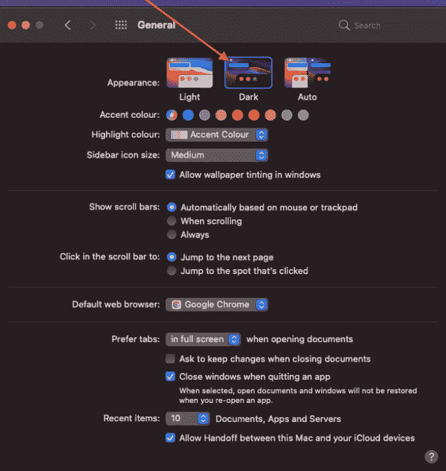

图 13.14 – 在 macOS X 中更改系统外观为暗模式

1.  完成后，以原生应用程序的形式打开 PWA，您应该会看到它如 *图 13.15* 所示：

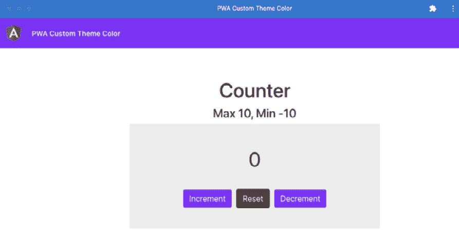

图 13.15 – PWA 自定义主题颜色应用程序在系统暗模式下的外观

现在我们已经将 PWA 作为原生应用程序运行，并将暗模式应用于系统，让我们在下一节中看到食谱的步骤。

## 如何操作

正如您所见，目前 Angular 应用程序不支持暗模式。我们将从以开发模式运行应用程序开始，并为暗模式添加不同的颜色。让我们开始吧：

1.  以开发模式运行应用程序，运行命令 `ng serve -o --port 9291`。

这应该会在新的浏览器选项卡中为应用程序提供服务，网址为 `http://localhost:4200`。

1.  现在，打开 `styles.scss` 文件以使用 `prefers-color-scheme` 媒体查询。我们将为全局 CSS 变量使用不同的值，以创建暗模式的不同视图。按照以下方式更新文件：

```ts
/* You can add global styles to this file, and also import other style files */
:root {...}
html,
body {...}
@media (prefers-color-scheme: dark) {
  :root {
    --main-bg: #333;
    --text-color: #fff;
    --card-bg: #000;
    --primary-btn-color: #fff;
    --primary-btn-text-color: #333;
  }
}
```

如果您在浏览器选项卡中再次刷新应用程序，您将看到基于 `prefers-color-scheme` 媒体查询的不同暗模式视图，如 *图 13.16* 所示：

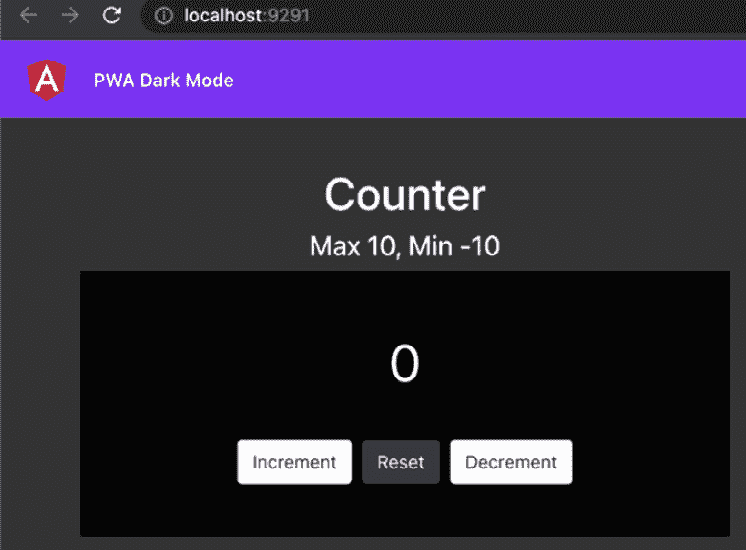

图 13.16 – 使用 prefers-color-scheme 媒体查询的暗模式视图

重要提示

有可能您已经在 `localhost:4200` 上运行了 PWA；这就是为什么在 *步骤 1* 中我们将目标端口设为 `9291`。如果甚至那个端口也被使用过，请确保清除应用程序缓存，然后刷新。

1.  让我们使用 Chrome DevTools 模拟深色和浅色模式，因为它提供了一个非常好的方法来做到这一点。打开 Chrome DevTools，然后打开“命令”菜单。在 macOS 上，键是*Cmd* + *Shift* + *P*。在 Windows 上，它是*Ctrl* + *Shift* + *P*。然后输入`Render`，并选择“显示渲染”选项，如图 13.17 所示：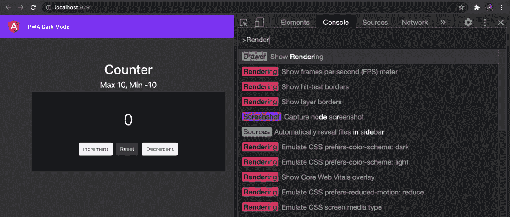

图 13.17 - 使用“显示渲染”选项打开渲染视图

1.  现在，在“渲染”选项卡中，切换`prefers-color-scheme`仿真为浅色和深色模式，如图 13.18 所示：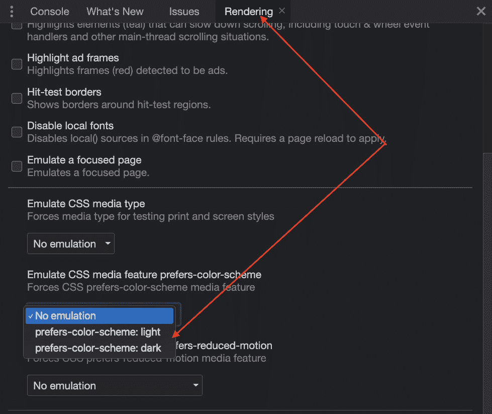

图 13.18 - 模拟 prefers-color-scheme 模式

1.  现在我们已经测试了两种模式。我们可以创建生产版本并重新安装 PWA。运行`ng build --configuration production`命令以在生产模式下构建应用程序。

1.  现在通过打开现有的 PWA 并从“更多”菜单中选择“卸载”选项来卸载它，如图 13.12 所示。在提示时确保勾选“同时清除 Chrome 中的数据（...）”的复选框。

1.  运行以下命令在浏览器上提供构建的应用程序，然后导航到`http://localhost:6100`：

```ts
http-server dist/pwa-dark-mode -p 6100
```

1.  等待几秒钟，直到地址栏中出现“安装”按钮。然后安装 PWA，类似于图 13.8。

1.  现在，当你运行 PWA 时，如果你的系统外观设置为深色模式，你应该看到深色模式视图，如图 13.19 所示：

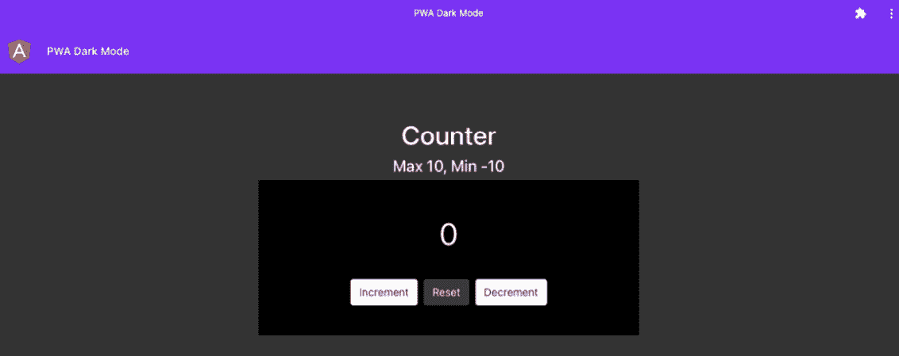

图 13.19 - 我们的 PWA 支持开箱即用的深色模式

太棒了！如果你将系统外观从深色模式切换到浅色模式，或者反之亦然，你应该看到 PWA 反映出适当的颜色。现在你知道如何在你的 PWA 中支持深色模式了，看看下一节，看看更多阅读的链接。

## 另请参阅

+   喜欢颜色方案（[`web.dev/prefers-color-scheme/`](https://web.dev/prefers-color-scheme/)）

+   使用 prefers-color-scheme 的颜色方案（[`web.dev/color-scheme/`](https://web.dev/color-scheme/)）

# 在你的 PWA 中提供自定义可安装体验

我们知道 PWA 是可安装的。这意味着它们可以像本机应用程序一样安装在您的设备上。然而，当您首次在浏览器中打开应用时，它完全取决于浏览器如何显示**安装**选项。这因浏览器而异。而且它也可能不太及时或清晰可见。而且，您可能希望在应用程序启动之后的某个时刻显示**安装**提示，这对一些用户来说是很烦人的。幸运的是，我们有一种方法为我们的 PWA 提供自定义的安装选项对话框/提示。这就是我们将在本节中学习的内容。

## 准备工作

本配方的项目位于`chapter13/start_here/pwa-custom-install-prompt`中：

1.  在 Visual Studio Code 中打开项目。

1.  打开终端并运行`npm install`来安装项目的依赖项。

1.  完成后，运行`ng build --configuration production`。

1.  现在运行`http-server dist/pwa-custom-install-prompt -p 7200`来提供服务。

1.  导航到`http://localhost:7200`。等待一会儿，您应该会看到安装提示，如*图 13.20*所示：

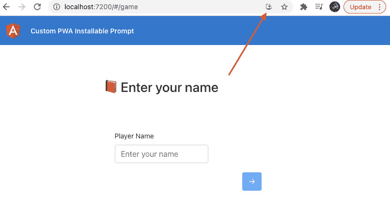

图 13.20 - pwa-custom-install-prompt 在 http://localhost:7200 上运行

现在我们的应用程序正在运行，让我们在下一节中看看这个配方的步骤。

## 如何做

我们有一个名为 Dice Guesser 的应用程序，您可以在其中掷骰子并猜测结果。对于本节，我们将阻止默认的安装提示，并仅在用户猜对时显示它。让我们开始吧：

1.  首先，创建一个服务，将在接下来的步骤中显示我们的自定义可安装提示。在项目根目录中，运行以下命令：

```ts
ng g service core/services/installable-prompt
```

1.  现在打开创建的文件`installable-prompt.service.ts`，并按以下方式更新代码：

```ts
import { Injectable } from '@angular/core';
@Injectable({
  providedIn: 'root',
})
export class InstallablePromptService {
  installablePrompt;
  constructor() {
    this.init();
  }
  init() {
    window.addEventListener(
      'beforeinstallprompt',
      this.handleInstallPrompt.bind(this)
    );
  }
  handleInstallPrompt(e) {
    e.preventDefault();
    // Stash the event so it can be triggered later.
    this.installablePrompt = e;
    console.log('installable prompt event fired');
    window.removeEventListener('beforeinstallprompt',     this.handleInstallPrompt);
  }
}
```

1.  现在，让我们构建我们将向用户显示的自定义对话框/提示。我们将使用`@angular/material`包中已经安装在项目中的**Material**对话框。打开`app.module.ts`文件，并按以下方式更新它：

```ts
...
import { MatDialogModule } from '@angular/material/dialog';
import { MatButtonModule } from '@angular/material/button';
@NgModule({
  declarations: [... ],
  imports: [
    ...
    BrowserAnimationsModule,
    MatDialogModule,
    MatButtonModule,
  ],
  providers: [],
  bootstrap: [AppComponent],
})
export class AppModule {}
```

1.  让我们为**Material**对话框创建一个组件。在项目根目录中，运行以下命令：

```ts
ng g component core/components/installable-prompt
```

1.  现在我们将在`InstallablePromptService`中使用这个组件。打开`installable-prompt.service.ts`文件，并按以下方式更新代码：

```ts
...
import { MatDialog } from '@angular/material/dialog';
import { InstallablePromptComponent } from '../components/installable-prompt/installable-prompt.component';
@Injectable({...})
export class InstallablePromptService {
  installablePrompt;
  constructor(private dialog: MatDialog) {...}
...
  async showPrompt() {
    if (!this.installablePrompt) {
      return;
    }
    const dialogRef = this.dialog.    open(InstallablePromptComponent, {
      width: '300px',
    });
  }
}
```

1.  我们还需要根据我们自定义可安装提示的选择来显示浏览器的提示。例如，如果用户点击**是**按钮，这意味着他们想将应用程序安装为 PWA。在这种情况下，我们将显示浏览器的提示。按照以下方式进一步更新`installable-prompt.service.ts`文件：

```ts
...
export class InstallablePromptService {
  ...
  async showPrompt() {

    …
    const dialogRef = this.dialog.    open(InstallablePromptComponent, {
      width: '300px',
    });
    dialogRef.afterClosed().subscribe(async (result) => {
      if (!result) {
        this.installablePrompt = null;
        return;
      }
      this.installablePrompt.prompt();
      const { outcome } = await this.installablePrompt.      userChoice;
      console.log(`User response to the install prompt:       ${outcome}`);
      this.installablePrompt = null;
    });
  }
}
```

1.  现在我们已经为浏览器的提示设置了主要代码。让我们来处理我们自定义可安装提示的模板。打开`installable-prompt.component.html`文件，并用以下代码替换模板：

```ts
<h1 mat-dialog-title>Add to Home</h1>
<div mat-dialog-content>
  <p>Enjoying the game? Would you like to install the app   on your device?</p>
</div>
<div mat-dialog-actions>
  <button mat-button [mat-dialog-close]="false">No   Thanks</button>
  <button mat-button [mat-dialog-close]="true" cdkFocusInitial>Sure</button>
</div>
```

1.  最后，每当用户猜对时，让我们显示这个提示。打开`game.component.ts`文件，并按照以下方式更新它：

```ts
...
import { InstallablePromptService } from '../core/services/installable-prompt.service';
...
@Component({...})
export class GameComponent implements OnInit {
  ...
  constructor(
    private leaderboardService: LeaderboardService,
    private instPrompt: InstallablePromptService
  ) {}
  ...
  showResult(diceSide: IDiceSide) {
    ...
    this.scores = this.leaderboardService.setScores({
      name: this.nameForm.get('name').value,
      score: 50,
    });
    this.instPrompt.showPrompt();
  }
}
```

1.  现在让我们测试应用程序。使用以下命令在生产模式下构建应用程序，并使用`http-server`包在端口`7200`上提供服务：

```ts
ng build --configuration production
http-server dist/pwa-custom-install-prompt -p 7200
```

1.  在我们测试之前，您可能想要清除应用程序的缓存并注销服务工作者。您可以通过打开 Chrome DevTools 并导航到**应用程序**选项卡来执行此操作。然后点击*图 13.21*所示的**清除站点数据**按钮。确保选中**注销服务工作者**选项：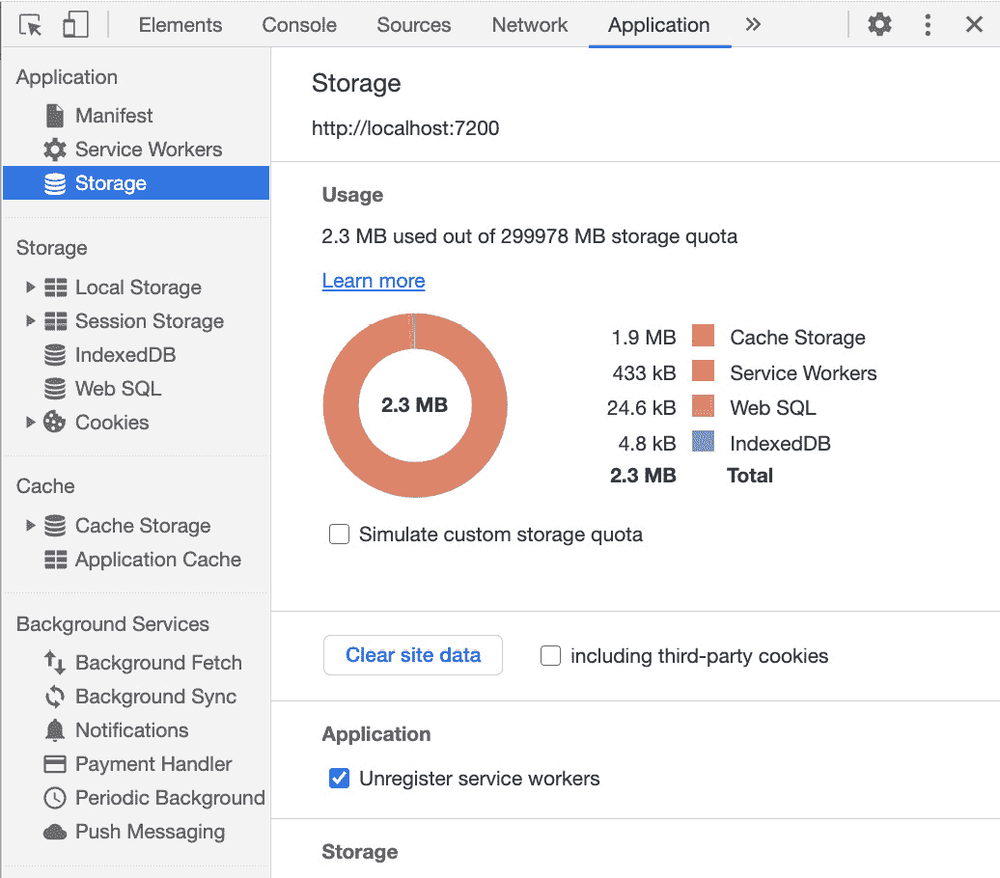

图 13.21 - 清除站点数据，包括服务工作者

1.  现在玩游戏，直到您猜对一个答案。一旦您猜对，您将看到自定义可安装提示，如*图 13.22*所示。点击**确定**按钮，您应该会看到浏览器的提示：

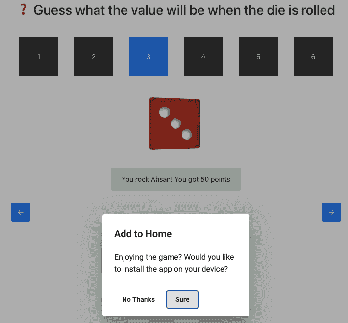

图 13.22 - 我们 PWA 的自定义可安装提示

太棒了！现在您可以通过安装和卸载几次 PWA 应用程序并尝试用户选择安装或不安装应用程序的所有组合来玩转应用程序。这都是有趣的游戏。现在您知道如何为 Angular PWA 实现自定义安装提示，接下来请查看下一节以了解其工作原理。

## 它是如何工作的

这个示例的核心是`beforeinstallprompt`事件。这是一个标准的浏览器事件，在最新版本的 Chrome、Firefox、Safari、Opera、UC 浏览器（Android 版本）和 Samsung Internet 中都得到支持，也就是几乎所有主要浏览器。该事件有一个`prompt()`方法，在设备上显示浏览器的默认提示。在这个示例中，我们创建了`InstallablePromptService`并将事件存储在其`local`属性中。这样我们可以在用户猜对正确的值时随需使用它。请注意，一旦我们收到`beforeinstallprompt`事件，就会从`window`对象中移除事件侦听器，这样我们只保存一次事件。这是在应用程序启动时。如果用户选择不安装应用程序，我们在同一会话中不会再次显示提示。但是，如果用户刷新应用程序，他们仍然会在第一次猜对时获得一次提示。我们可以进一步将这个状态保存在`localStorage`中，以避免在页面刷新后再次显示提示，但这不是这个示例的一部分。

对于自定义安装提示，我们使用`@angular/material`包中的`MatDialog`服务。该服务有一个`open()`方法，接受两个参数：要显示为 Material 对话框的组件和`MatDialogConfig`。在这个示例中，我们创建了`InstallablePromptComponent`，它使用了来自`@angular/material/dialog`包的一些带指令的 HTML 元素。请注意，在按钮上，我们在`installable-prompt.component.html`文件中使用了属性`[mat-dialog-close]`。值分别设置为`true`和`false`，用于**确定**和**不，谢谢**按钮。这些属性帮助我们将相应的值从此模态发送到`InstallablePromptService`。请注意在`installable-prompt.service.ts`文件中使用了`dialogRef.afterClosed().subscribe()`。这是值被传递回去的地方。如果值为`true`，那么我们使用事件，也就是`this.installablePrompt`属性的`.prompt()`方法来显示浏览器的提示。请注意，在使用后我们将`installablePrompt`属性的值设置为`null`。这样我们在同一会话中不会再次显示提示，直到用户刷新页面。

现在您了解了所有的工作原理，可以查看下一节以获取进一步阅读的链接。

## 另请参阅

+   Angular Material 对话框示例（https://material.angular.io/components/dialog/examples）

+   MatDialogConfig (https://material.angular.io/components/dialog/api#MatDialogConfig)

+   如何提供自己的应用安装体验（web.dev）(https://web.dev/customize-install/)

# 使用 Angular 服务工作者预缓存请求

在我们之前的示例中添加了服务工作者，我们已经看到它们已经缓存了资产，并在**离线**模式下使用服务工作者提供它们。但是网络请求呢？如果用户离线并立即刷新应用程序，网络请求将失败，因为它们没有与服务工作者一起缓存。这导致了破碎的离线用户体验。在这个示例中，我们将配置服务工作者来预缓存网络请求，以便应用程序在**离线**模式下也能流畅运行。

## 准备工作

我们要处理的项目位于克隆存储库中的`chapter13/start_here/precaching-requests`中：

1.  在 Visual Studio Code 中打开项目。

1.  完成后，运行`ng build --configuration production`。

1.  现在运行`http-server dist/precaching-requests -p 8300`来提供服务。

1.  导航到`http://localhost:8300`。刷新应用程序一次。然后按照*图 13.2*所示切换到**离线**模式。如果您转到**网络**选项卡并使用查询`results`过滤请求，您应该看到请求失败，如*图 13.23*所示：

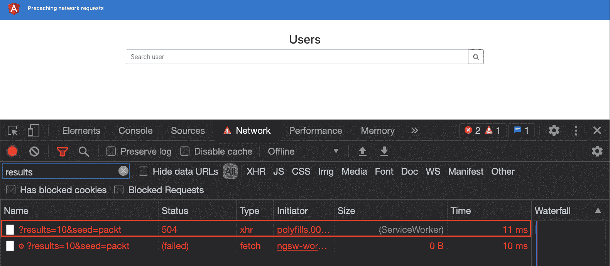

图 13.23 - 由于未缓存网络请求而导致的离线体验破碎

现在我们看到网络请求失败了，让我们在下一节中看看修复这个问题的步骤。

## 如何做

对于这个示例，我们有用户列表和搜索应用程序，从 API 端点获取一些用户。正如您在*图 13.23*中所看到的，如果我们进入**离线**模式，`fetch`调用以及对服务工作者的请求也会失败。这是因为服务工作者尚未配置为缓存数据请求。让我们开始修复这个问题的示例：

1.  为了缓存网络请求，打开`ngsw-config.json`文件并进行如下更新：

```ts
{
  "$schema": "./node_modules/@angular/service-worker/  config/schema.json",
  "index": "/index.html",
  "assetGroups": [...],
  "dataGroups": [
    {
      "name": "api_randomuser.me",
      "urls": ["https://api.randomuser.me/?results*"],
      "cacheConfig": {
        "strategy": "freshness",
        "maxSize": 100,
        "maxAge": "2d"
      }
    }
  ]
};
```

1.  现在让我们测试一下应用程序。使用以下命令以生产模式构建应用程序，并使用`http-server`包在端口`8300`上提供服务：

```ts
ng build --configuration production
http-server dist/precaching-requests -p 8300
```

1.  现在导航到 http://localhost:8300\. 确保此时没有使用**网络限速**。也就是说，你没有处于**离线**模式。

1.  使用 Chrome DevTools 清除应用程序数据，如*图 13.21*所示。完成后，刷新应用程序页面。

1.  在 Chrome DevTools 中，转到**网络**选项卡，并切换到**离线**模式，如*图 13.2*所示。现在使用查询`results`过滤网络请求。即使处于离线状态，您也应该看到结果。网络调用是由 service worker 提供的，如*图 13.24*所示：

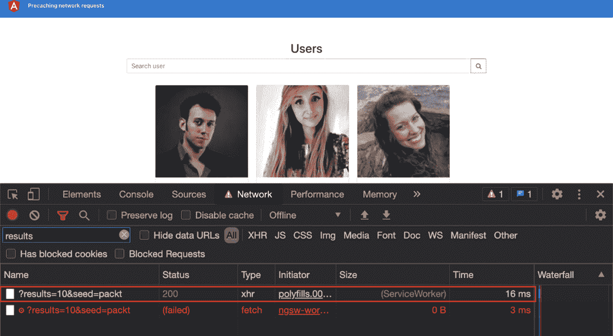

图 13.24 – 使用 service worker 离线工作的网络调用

哇！即使现在点击一个卡片，您仍然应该看到应用程序无缝运行，因为所有页面都使用相同的 API 调用，因此由 service worker 提供。通过这样，您刚刚学会了如何在 Angular 应用程序中配置 service worker 以缓存网络/数据请求。即使离线，您也可以安装 PWA 并使用它。很棒，对吧？

现在我们已经完成了这个教程，让我们在下一节中看看它是如何工作的。

## 工作原理

这个教程的核心是`ngsw-config.json`文件。当使用`@angular/service-worker`包生成 service worker 文件时，该文件将被`@angular/pwa`原理图使用时，该文件已经包含一个 JSON 对象。该 JSON 包含一个名为`assetGroups`的属性，基本上根据提供的配置来配置资产的缓存。对于这个教程，我们希望缓存网络请求以及资产。因此，我们在 JSON 对象中添加了新属性`dataGroups`。让我们看看配置：

```ts
"dataGroups": [
    {
      "name": "api_randomuser.me",
      "urls": ["https://api.randomuser.me/?results*"],
      "cacheConfig": {
        "strategy": "freshness",
        "maxSize": 100,
        "maxAge": "2d"
      }
    }
  ]
```

如您所见，`dataGroups` 是一个数组。我们可以将不同的配置对象作为其元素提供。每个配置都有一个`name`，一个`urls`数组，以及定义缓存策略的`cacheConfig`。对于我们的配置，我们使用了 API URL 的通配符，也就是说，我们使用了`urls: ["https://api.randomuser.me/?results*"]`。对于`cacheConfig`，我们使用了`"freshness"`策略，这意味着应用程序将始终首先从其原始位置获取数据。如果网络不可用，那么它将使用来自服务工作器缓存的响应。另一种策略是`"performance"`，它首先查找服务工作器以获取缓存的响应。如果缓存中没有特定 URL（或 URL）的内容，那么它将从实际原始位置获取数据。`maxSize`属性定义了可以为相同模式（或一组 URL）缓存多少个请求。`maxAge`属性定义了缓存数据在服务工作器缓存中存活多长时间。

现在您知道这个示例是如何工作的，请参阅下一节以获取进一步阅读的链接。

## 另请参阅

+   Angular Service Worker Intro (https://angular.io/guide/service-worker-intro)

+   Angular Service Worker Config (https://angular.io/guide/service-worker-config)

+   创建离线回退页面 (web.dev) (https://web.dev/offline-fallback-page/)

# 为您的 PWA 创建一个应用外壳

在构建 Web 应用程序的快速用户体验时，最大的挑战之一是最小化关键渲染路径。这包括加载目标页面的最关键资源，解析和执行 JavaScript 等。通过应用外壳，我们有能力在构建时而不是运行时渲染页面或应用的一部分。这意味着用户最初将看到预渲染的内容，直到 JavaScript 和 Angular 开始运行。这意味着浏览器不必为了第一个有意义的绘制而工作和等待一段时间。在这个示例中，您将为 Angular PWA 创建一个应用外壳。

## 准备就绪

我们要处理的项目位于克隆存储库内的`chapter13/start_here/pwa-app-shell`中：

1.  在 Visual Studio Code 中打开项目。

1.  打开终端并运行`npm install`来安装项目的依赖项。

1.  完成后，运行`ng serve -o`。

这应该打开一个选项卡，并在`http://localhost:4200`上运行应用程序，如*图 13.25*所示：

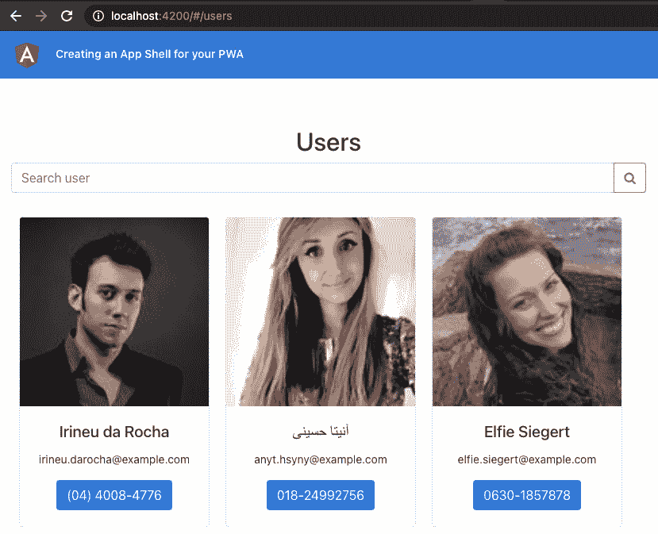

图 13.25 - pwa-app-shell 运行在 http://localhost:4200

现在我们将禁用 JavaScript 以模拟解析 JavaScript 需要很长时间。或者，模拟尚未放置 App Shell。打开 Chrome DevTools 并打开命令面板。在 macOS X 上的快捷键是*Cmd* + *Shift* + *P*，在 Windows 上是*Ctrl* + *Shift* + *P*。输入`Disable JavaScript`，选择该选项，然后按*Enter*。您应该看到以下消息：

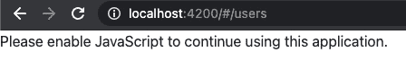

图 13.26 - 应用程序中没有 App Shell

现在我们已经检查了 App Shell 的缺失，让我们在下一节中看到该配方的步骤。

## 如何操作

我们有一个从 API 获取一些用户的 Angular 应用程序。我们将为此应用程序创建一个 App Shell，以便作为 PWA 更快地提供第一个有意义的绘制。让我们开始吧：

1.  首先，通过从项目根目录运行以下命令为应用程序创建 App Shell：

```ts
ng generate app-shell
```

1.  更新`app.module.ts`以导出组件，以便我们可以使用它们在 App Shell 中呈现**Users**页面。代码应如下所示：

```ts
...
@NgModule({
  declarations: [...],
  imports: [... ],
  providers: [],
  exports: [
    UsersComponent,
    UserCardComponent,
    UserDetailComponent,
    AppFooterComponent,
    LoaderComponent,
  ],
  bootstrap: [AppComponent],
})
export class AppModule {}
```

1.  现在打开`app-shell.component.html`文件，并使用`<app-users>`元素，以便在 App Shell 中呈现整个`UsersComponent`。代码应如下所示：

```ts
<app-users></app-users>
```

1.  现在我们已经为 App Shell 编写了代码。让我们创建它。运行以下命令以在开发模式下生成 App Shell：

```ts
ng run pwa-app-shell:app-shell
```

1.  一旦在*步骤 4*中生成了 App Shell，请运行以下命令使用`http-server`包来提供它：

```ts
http-server dist/pwa-app-shell/browser -p 4200
```

1.  确保应用程序的 JavaScript 仍然关闭。如果没有，请打开 Chrome DevTools，按下 macOS X 上的*Cmd* + *Shift* + *P*以打开命令面板（Windows 上的*Ctrl* + *Shift* + *P*）。然后输入`Disable Javascript`，按*Enter*选择如*图 13.27*所示的选项：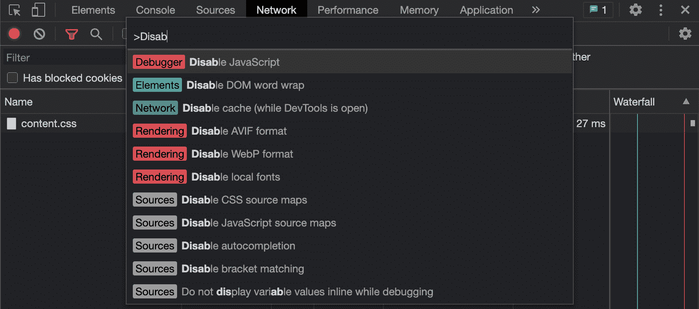

图 13.27 - 使用 Chrome DevTools 禁用 JavaScript

1.  在禁用 JavaScript 的情况下刷新应用程序。现在，尽管 JavaScript 被禁用，您应该看到应用程序仍然显示了预渲染的用户页面，如*图 13.28*所示。哇哦！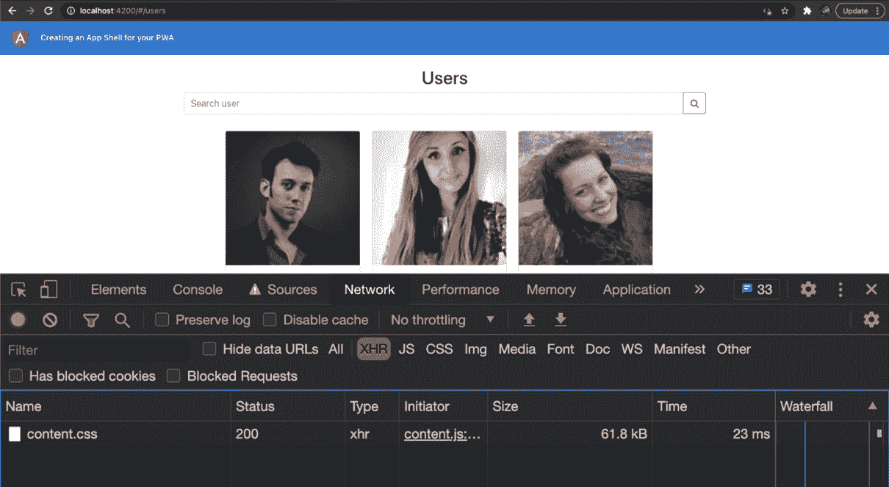

图 13.28 - App Shell 显示了预渲染的用户页面

1.  要验证我们是否在构建时预渲染了用户页面，请检查`<project-root>/dist/pwa-app-shell/browser.index.html`中生成的代码。您应该在`<body>`标签内看到整个渲染的页面，如*图 13.29*所示：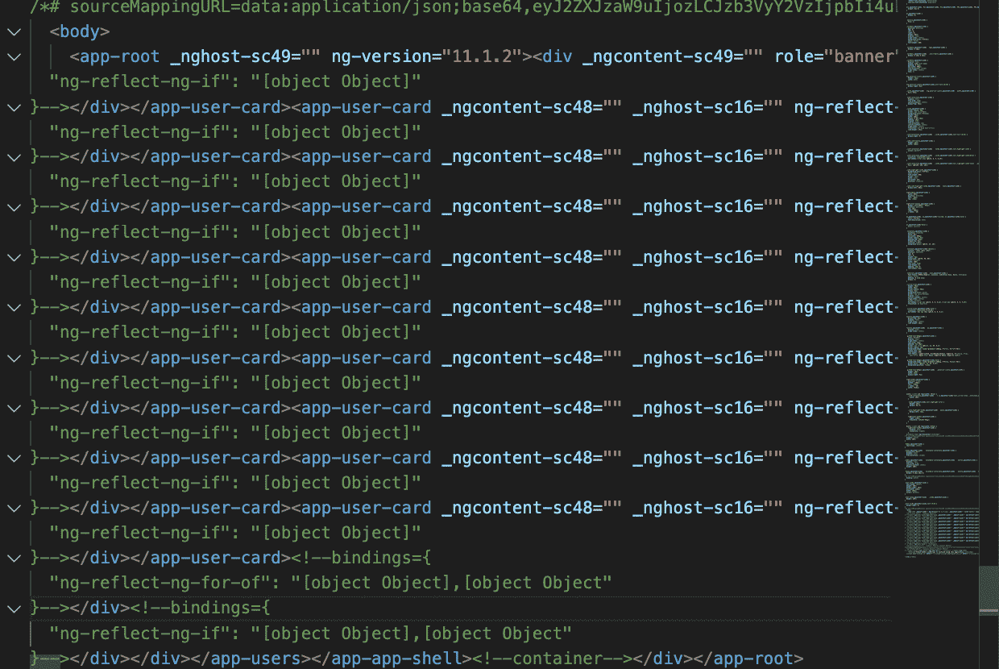

图 13.29 - 包含预渲染用户页面的 index.html 文件

1.  通过运行以下命令创建带有 App Shell 的生产构建，并在端口`1020`上提供服务：

```ts
ng run pwa-app-shell:app-shell:production
http-server dist/pwa-app-shell/browser -p 1020
```

1.  在浏览器中导航到`http://localhost:1020`，并按照*图 13.8*所示安装应用程序作为 PWA。完成后，运行 PWA，它应该如下所示：

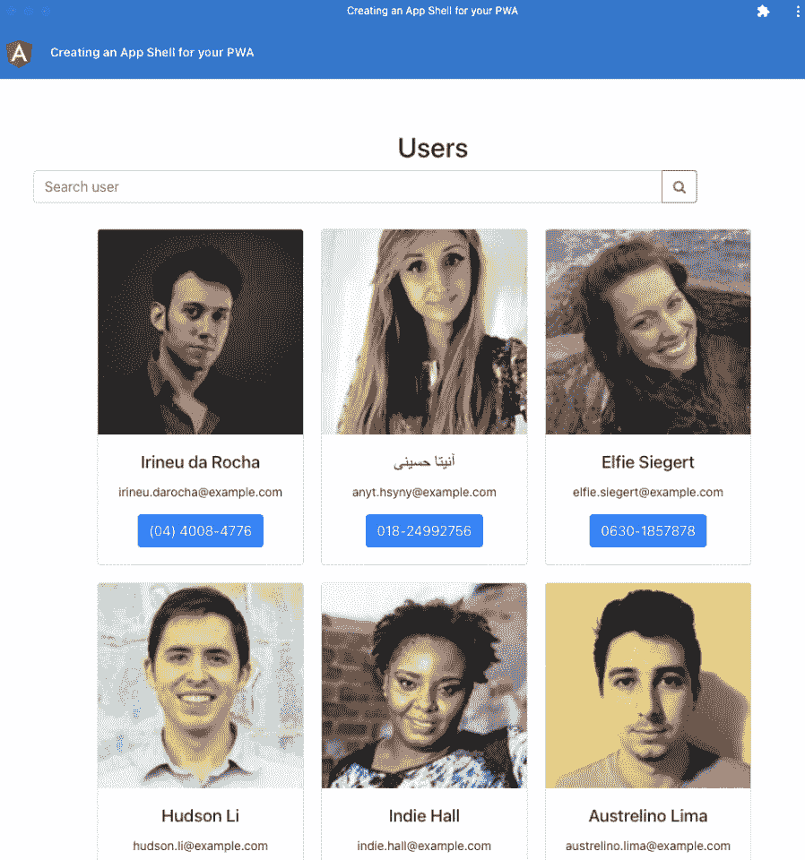

图 13.30 - 安装后作为本机应用程序运行的 pwa-app-shell

太棒了！现在你知道如何为你的 Angular PWA 创建一个 App Shell。现在您已经完成了这个食谱，请查看下一节关于它是如何工作的。

## 它是如何工作的

该食谱始于为我们的应用程序禁用 JavaScript。这意味着当应用程序运行时，我们只显示静态的 HTML 和 CSS，因为没有 JavaScript 执行。我们看到一个关于不支持 JavaScript 的消息，如*图 13.26*所示。

然后我们运行`ng generate app-shell`命令。这个 Angular CLI 命令为我们做了以下几件事情：

+   创建一个名为`AppShellComponent`的新组件，并生成其相关文件。

+   在项目中安装了`@angular/platform-server`包。

+   更新`app.module.ts`文件以使用`BrowserModule.withServerTransition()`方法，这样我们就可以为服务器端渲染提供`appId`属性。

+   添加了一些新文件，即`main.server.ts`和`app.server.module.ts`，以启用服务器端渲染（确切地说是我们的 App Shell 的构建时渲染）。

+   最重要的是，它更新了`angular.json`文件，添加了一堆用于服务器端渲染的原理图，以及用于生成`app-shell`的原理图。

在这个食谱中，我们从`AppModule`中导出组件，这样我们就可以在应用外壳中使用它们。这是因为应用外壳不是`AppModule`的一部分。相反，它是在`app.server.module.ts`文件中新创建的`AppServerModule`的一部分。正如您所看到的，在这个文件中，我们已经导入了`AppModule`。尽管如此，除非我们从`AppModule`中导出它们，否则我们无法使用这些组件。在导出组件之后，我们更新了`app-shell.component.html`（应用外壳模板），以使用`<app-users>`选择器，这反映了`UsersComponent`类。这就是整个用户页面。

我们通过运行`ng run pwa-app-shell:app-shell`命令来验证应用外壳。这个命令会生成一个带有应用外壳（非最小化代码）的开发模式下的 Angular 构建。请注意，在通常的构建中，我们会在`dist`文件夹内生成`pwa-app-shell`文件夹。在这个文件夹内，我们会有`index.html`。然而，在这种情况下，我们在`pwa-app-shell`文件夹内创建了两个文件夹，即`browser`文件夹和`server`文件夹。我们的`index.html`位于`browser`文件夹内。如*图 13.29*所示，我们在`index.html`文件的`<body>`标签内有整个用户页面的代码。这段代码是在构建时预渲染的。这意味着 Angular 打开应用程序，进行网络调用，然后在构建时将 UI 预渲染为应用外壳。因此，一旦应用程序打开，内容就会被预渲染。

要生成带有应用外壳的生产构建，我们运行`ng run pwa-app-shell:app-shell:production`命令。这将生成带有应用外壳的生产 Angular 构建，并进行了最小化处理。最后，我们安装 PWA 进行测试。

现在您知道了这个食谱是如何工作的，请查看下一节以获取进一步阅读的链接。

## 参见

+   Angular 应用外壳指南（https://angular.io/guide/app-shell）

+   应用外壳模型（Google 的 Web 基础知识）（https://developers.google.com/web/fundamentals/architecture/app-shell）
