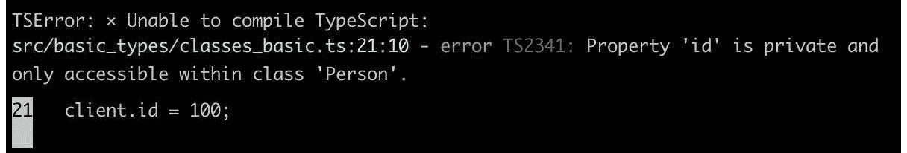
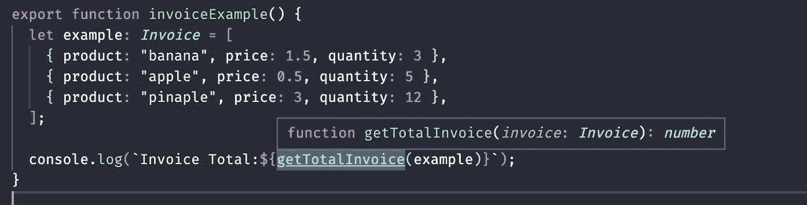
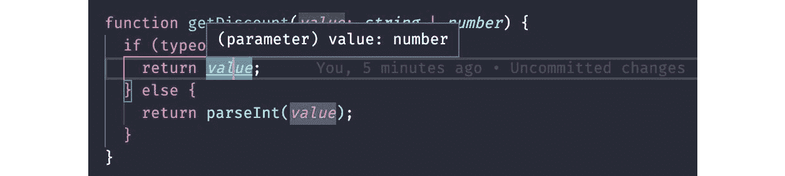
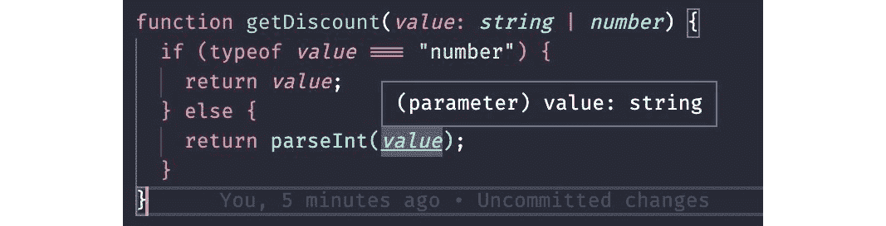

# 第三章：TypeScript Patterns for Angular

自框架的第 2 版以来，Angular 无论是内部开发还是用于构建应用程序的用户，都基于 TypeScript 进行开发。

当时这是一个有争议的决定，因为这个由微软创建的 JavaScript 超集是新的。如今，大多数 Web 框架，如 React、Vue.js 和 Svelte，都支持 TypeScript，一些 Web 框架甚至积极推荐使用 TypeScript 作为编程语言。

本章中，我们将研究使用 TypeScript 与 Angular 以及其他技术的最佳实践和模式；这些技术可以应用于 Node.js 后端开发，甚至其他 Web 框架，如 React 和 Vue.js。

我们将学习如何更好地声明我们的应用程序的方法和函数，以及如何利用 TypeScript 的类型推断机制来使我们的类更加简洁。

本章将涵盖以下主题：

+   创建类和类型

+   创建方法和函数

+   减少冗余：类型推断

+   验证类型：类型守卫

+   使用 `any` 类型的更好替代方案

到本章结束时，你将能够更好地在你的项目中应用 TypeScript 资源，提高代码质量和团队的生产力。

# 技术要求

要遵循本章的说明，你需要以下内容：

+   **Visual Studio Code** (**VS** **Code**) ([`code.visualstudio.com/Download`](https://code.visualstudio.com/Download))

+   Node.js 18 或更高版本 ([`nodejs.org/en/download/`](https://nodejs.org/en/download/))

本章的代码文件可在 [`github.com/PacktPublishing/Angular-Design-Patterns-and-Best-Practices/tree/main/ch3`](https://github.com/PacktPublishing/Angular-Design-Patterns-and-Best-Practices/tree/main/ch3) 找到。

# 创建类和类型

使用 Angular 进行应用程序开发的基础是面向对象编程，因此深入了解如何创建类和实例化对象对我们来说非常重要。使用 TypeScript 而不是纯 JavaScript，我们在类型工具箱中又多了一个强大的元素。

通过类型化变量和对象，TypeScript 编译器能够执行检查和警告，防止在开发过程中由于这个过程不存在而可能发生的运行时错误。

请记住，在将 TypeScript 代码转换为 JavaScript（这是一个转换过程）之后，发送到客户端浏览器的代码是纯 JavaScript，包括一些优化；也就是说，用 TypeScript 编写的代码在性能上并不逊色于直接用 JavaScript 编写的代码。

为了从基础知识开始，让我们来探索原始和基本类型。

## 原始和基本类型

尽管 JavaScript 不是强类型语言，但它有三个称为原始类型：

+   `boolean`：表示两个二进制值 `false` 和 `true`

+   `string`：表示一组字符，如单词

+   `number`：表示数值

对于这些原始类型中的每一个，TypeScript 已经有一个表示它们的内置数据类型，分别是`Boolean`、`String`和`Number`。

重要

TypeScript 中原始类型的第一个字母是大写的，以区分它们与原始 JavaScript 类型的区别。如果您想使用`typeof`函数在运行时检查类型，请使用原始类型的小写名称。

要声明这些类型的变量，只需在变量声明前使用`:`符号，如下面的示例所示：

```js
export function primitive_example() {
  let name: string;
  let age: number;
  let isAlive: boolean;
  name = "Mario";
  age = 9;
  isAlive = true;
  console.log(`Name:${name} Age:${age} is alive:${isAlive ? "yes" : "no"}`);
}
```

在前面的示例中，我们将`name`、`age`和`isAlive`变量分别声明为`string`、`number`和`boolean`。请注意，我们可以在 TypeScript 中使用 JavaScript 类型名称，因为 TypeScript 允许这些原始类型使用两种形式。

在 JavaScript 中，使用数组数据结构非常常见。这种结构允许我们存储和操作应用程序中的值列表。TypeScript 有一个名为`Array`的类型，其中不仅可以创建具有该类型的变量，还可以指明数组将包含哪种类型的值：

```js
export function array_example() {
  let names: Array<string>;
  let surnames: string[];
  names = ["Mario", "Gabriel", "Lucy"];
  surnames = ["Camillo", "Smith"];
  names.forEach((name) => console.log(`Name:${name}`));
  surnames.forEach((surname) => console.log(`Surname:${surname}`));
}
```

在这个函数中，我们使用`Array`类型声明`names`数组，并声明它是一个字符串列表，因为我们是在方括号内通知它的。在`surnames`数组声明中，我们进行相同的声明，但使用 TypeScript 的语法糖，在`string`类型后面使用`[]`。这种声明方式具有相同的效果；它只是更简洁。

在示例的末尾，我们使用`Array`的`forEach`方法来打印数组的元素。最后，另一个广泛使用的类型是`any`类型。此类型告诉 TypeScript 编译器不要对此类型执行任何类型检查，并且其内容可以在代码的任何地方更改类型，如下面的示例所示：

```js
export function any_example(){
  let information:any;
  information = 'Mario';
  console.log(`Name: ${information}`);
  information = 7;
  console.log(`Age: ${information}`);
}
```

`information`变量被声明为`any`，然后我们将`Mario`字符串放入其中。随后，我们用值`5`重新定义了变量。

默认情况下，在 TypeScript 中，每个没有声明类型的变量，或者在其声明中定义了值的变量，都是`any`类型。

这种语言规则允许，例如，一个包含 JavaScript 代码的项目可以通过最初将所有变量声明为`any`类型来逐步转换为 TypeScript。`any`类型的另一个用途是当您的代码需要 JavaScript 的灵活性以处理一些更通用的算法类型时。

然而，建议 Angular 开发者避免使用`any`，因为它部分地禁用了 TypeScript 在您的代码中执行的检查，而没有充分利用其功能。

如果您需要`any`类型的灵活性，而又不想牺牲类型检查和 TypeScript 推断，本章将展示一些替代方案。

## 类

在我们了解基本类型的基础上，现在让我们创建更复杂的数据类型。我们将要探索的第一个是 **类**。面向对象编程的一个基本元素，类代表一个模型，可以是真实的，如人或车辆，也可以是抽象的，如网页上的文本框。

在课程中，我们创建了对象，这些对象是我们系统将用来执行业务规则的基本元素，如下面的示例所示：

```js
class Person {
  name: string;
  age: number;
  constructor(name: string, age: number) {
    this.name = name;
    this.age = age;
  }
}
export function basic_class() {
  let client: Person = new Person("Mario", 7);
  console.log(`Name:${client.name} Age:${client.age}`);
}
```

首先，我们通过键入属性声明 `Person` 类，具有 `name` 和 `age` 属性，然后我们为该类创建一个名为 `constructor` 的方法。这个方法很特殊，因为它定义了从该类实例化对象时的规则。

在 `basic_class` 函数中，我们使用 `new` 关键字实例化了一个名为 `client` 的对象，它是 `Person` 类型的。为了检索这个实例化对象的属性，我们使用 `client.name` 和 `client.age` 的表示法。

TypeScript 中类的声明和使用几乎与 JavaScript 相同，只是对类的属性进行类型化。

纯 JavaScript 中的相同示例如下：

```js
class Person {
  constructor(name, age) {
    this.name = name;
    this.age = age;
  }
}
function basic_class() {
  let client = new Person("Mario", 7);
  console.log(`Name:${client.name} Age:${client.age}`);
}
```

注意，声明类和从它实例化对象的过程在 TypeScript 中变化很小。然而，正如我们将在下面的代码块中看到的，TypeScript 为我们在项目中使用类提供了更多的资源。

除了属性之外，类还定义了方法，这些是对象可以执行的功能。在我们正在工作的示例中，我们现在将添加一个方法：

```js
class Person {
  name: string;
  age: number;
  constructor(name: string, age: number) {
    this.name = name;
    this.age = age;
  }
  toString(){
    return `Name:${this.name} Age:${this.age}`;
  }
}
```

`toString` 方法返回一个表示对象的 `string`，因此它使用保留的 JavaScript 关键字 `this` 访问对象实例的属性。

面向对象编程中有一个称为 **属性封装** 的概念。这包括定义哪些属性可供实例化给定对象的函数访问。

这个概念对于正确使用某些设计模式非常重要，但在 JavaScript 中并不完整存在。每个类属性都是公开的，但在 TypeScript 中，它通过编译器实现和验证，如下面的示例所示：

```js
class Person {
  name: string;
  age: number;
  private id:number;
  constructor(name: string, age: number) {
    this.name = name;
    this.age = age;
    this.id =Math.floor(Math.random() * 1000);
  }
  toString(){
    return `Name:${this.name} Age:${this.age} ID: ${this.id}`;
  }
}
```

在这里，我们创建了一个名为 `id` 的属性，该属性在对象实例化时生成，我们使用保留字 `private` 来表示它不应从类外部访问。请注意，在类方法中，此属性可以正常访问。

让我们尝试从外部强制访问，如下面的示例所示，看看会发生什么：

```js
export function basic_class() {
  let client: Person = new Person("Mario", 7);
  console.log(client.toString());
  client.id = 100;
}
```

在这个函数中，我们实例化了一个 `Person` 类的 `client` 对象，然后我们尝试修改 `id` 属性。当尝试运行代码时，TypeScript 将显示以下错误：



图 3.1 – 访问私有属性时的错误信息

另一个面向对象编程的概念是继承。它定义了类之间的 *is a* 关系，例如，*一个客户是* *一个人*。

在实践中，它使一个类具有扩展类的所有属性和方法，如下面的示例所示：

```js
class Client extends Person {
  address: string;
  constructor(name: string, age: number, address: string) {
    super(name, age);
    this.address = address;
  }
  toString(): string {
    return `${super.toString()} Address: ${this.address}`;
  }
}
```

在这里，我们正在创建一个 `Client` 类，它从 `Person` 类扩展而来。我们添加一个名为 `address` 的属性并创建构造函数。由于它是一个从 `Person` 继承而来的类，因此必须调用 `super` 方法，这是我们访问原始类的方法和属性的方式。

当使用继承时，我们可以选择性地重写原始类的方法，就像我们重写 `toString` 方法一样。这个概念在 JavaScript 中也存在，但 TypeScript 会检查构造函数和方法重写的规则，在编译时进行检查，这增加了我们对开发的信心。

## 接口

在 TypeScript 中，我们还有一种方式来指定对象的结构，称为 **接口**。以下示例演示了其用法：

```js
export interface Animal {
  species: string;
  kingdom: string;
  class: string;
 }
```

要声明一个接口，我们使用保留字 `interface` 并像之前看到的那样将其属性声明为一个类。

要使用 `interface`，我们可以这样做：

```js
import { Animal } from "./animals";
export function basic_interface() {
  let chicken: Animal = {
    kingdom: "Animalia",
    species: "Gallus",
    class: "birds",
  };
  console.log(
    `kingdom:${chicken.kingdom} species:${chicken.species} class:${chicken.class}`
  );
}
```

注意，为了使用一个类，我们只需输入变量并声明其值，而不使用保留字 `new`。这是因为接口不是 JavaScript 元素，它仅由 TypeScript 编译器用于检查对象是否包含定义的属性。

为了证明接口不存在，如果我们编译 `interface` 文件，TypeScript 将生成一个空文件！

我们还可以使用接口为类创建合约，如果类需要某些方法和属性的话。让我们看看以下示例：

```js
export interface Animal {
  species: string;
  kingdom: string;
  class: string;
}
export interface DoSound {
  doASound: () => string;
}
export class Duck implements DoSound {
  public doASound(){
    return 'quack';
  }
}
export class Dog implements DoSound {
  public doASound(){
    return 'bark';
  }
}
```

要定义一个类遵循 `DoSound` 合约，我们使用保留字 `implements`。TypeScript 然后要求定义一个名为 `doASound` 的方法，并且该方法返回一个字符串。

接口这一特性促进了面向对象语言非常重要的能力——多态性的使用。让我们看看以下示例：

```js
export function animalDoSound() {
  let duck = new Duck();
  let dog = new Dog();
  makeSound(duck);
  makeSound(dog);
}
function makeSound(animal: DoSound) {
  console.log(`The animal make this sound:${animal.doASound()}`);
}
```

我们创建一个 `makeSound` 函数，它接收一个实现了 `DoSound` 合约的动物。该函数不关心动物的类型或其属性；它只需要遵循 `DoSound` 接口合约，因为它将调用其方法之一。

Angular 大量使用 TypeScript 接口的这一特性，正如我们可以在组件声明中看到的那样：

```js
export class SimulationComponent implements OnInit {
```

当我们通知 Angular 组件实现了 `OnInit` 接口时，它将在组件生命周期的开始执行所需的 `ngOnInit` 方法（我们将在 *第四章*，*组件* 和 *页面*）中更详细地研究这一点）。

## 类型别名

本章我们将看到的最后一种类型化变量的方式是最简单的一种，即创建**类型别名**。与接口一样，类型别名仅存在于 TypeScript 中，我们可以在以下示例中使用它们：

```js
type Machine = {
  id: number;
  description: string;
  energyOutput: number;
};
export function basic_type() {
  let car: Machine = {
    id: 123,
    description: "Car",
    energyOutput: 1000,
  };
  console.log(
    `ID:${car.id} Description:${car.description} Energy Output:${car.energyOutput} `
 );
}
```

在此代码中，我们创建了一个`Machine`类型，描述了我们想要表示的对象，并在`basic_type`函数中，我们使用该类型实例化了一个变量。

注意，我们使用这个变量的属性就像之前的例子一样。这展示了 TypeScript 在保持 JavaScript 的灵活性同时，为开发者提供了更多可能性。

类型别名的常用特性之一是从其他类型创建一个类型。其中最常见的是类型的联合，正如我们可以在以下代码中看到：

```js
type ID = string | number;
type Machine = {
  id: ID;
  description: string;
   energyOutput: number;
};
```

这里，我们正在创建一个名为`id`的类型，它可以是一个`string`或`number`。为此，我们使用`|`符号，这与 JavaScript 中用来表示条件*OR*的符号相同。

这个特性对于使用更高级的技术非常重要，例如`guard`类型，我们将在本章中看到。

## 何时使用类、接口或类型

在所有这些创建类型化对象的方式中，你可能会想知道在哪些情况下我们应该使用哪一种。基于每种形式的特性，我们可以对每种使用进行分类：

+   **类型别名**：创建的最简单形式，推荐用于类型化输入参数和函数返回值。

+   `implements`关键字。

+   **类**：面向对象的基础，也存在于 JavaScript 中。当我们需要具有方法和属性的对象时，我们应该使用它。在 Angular 中，所有组件和服务最终都是通过类创建的对象。

记住，在 TypeScript 中，你可以创建一个表现得像接口的`alias`类型，以及将接口作为函数的参数和返回值，但这里的建议是针对每种情况使用最佳实践，并解释它们通常如何在 Angular 应用程序中使用。

现在我们已经很好地理解了创建更复杂变量作为对象的不同方式，让我们来了解如何使用 TypeScript 创建函数和方法。

# 创建方法和函数

TypeScript 用来改善 Angular 应用程序开发中开发者体验的最好方法之一是通过能够类型化参数和函数及方法。

对于创建库和框架的开发者以及使用这些软件组件的开发者来说，了解函数期望什么以及预期的返回值可以让我们减少阅读和查找文档的时间，特别是我们系统可能遇到的运行时错误。

要对函数的参数和返回值进行类型化，让我们考虑以下示例：

```js
interface invoiceItem {
  product: string;
  quantity: number;
  price: number;
}
type Invoice = Array<invoiceItem>;
function getTotalInvoice(invoice: Invoice): number {
  let invoiceTotal = invoice.reduce(
    (total, item) => total + item.quantity * item.price,
    0
  );
  return invoiceTotal;
}
export function invoiceExample() {
  let example: Invoice = [
    { product: "banana", price: 1.5, quantity: 3 },
    { product: "apple", price: 0.5, quantity: 5 },
    { product: "pinaple", price: 3, quantity: 12 },
  ];
  console.log(`Invoice Total:${getTotalInvoice(example)}`);
}
```

在这个例子中，我们首先定义一个表示发票项目的接口，然后创建一个表示发票的类型，在这个简化中，它是一个项目的数组。

这展示了我们如何使用接口和类型更好地表达我们的 TypeScript 代码。不久之后，我们创建了一个返回发票总价值的函数；作为输入参数，我们接收一个具有发票类型的值，函数的返回值将是 `number`。

最后，我们创建了一个示例函数来使用 `getTotalInvoice` 函数。在这里，除了类型检查之外，如果我们使用具有 TypeScript 支持的编辑器，如 VS Code，我们将获得基本的文档和自动完成功能，如下面的截图所示：



图 3.2 – 由 TypeScript 生成并由 VS Code 可视化的文档

除了原始类型和对象之外，函数还必须准备好处理 null 数据或未定义变量。在下一节中，我们将探讨如何实现这一点。

## 处理 null 值

在 TypeScript 中，默认情况下，所有函数和方法参数都是必需的，并且由编译器进行检查。

如果任何参数是可选的，我们可以在它所代表的类型中定义它，如下面的示例所示：

```js
function applyDiscount(
  invoice: Invoice,
  discountValue: number,
  productOfDiscount?: string
) {
  discountValue = discountValue / 100;
  let newInvoice = invoice.map((item) => {
    if (productOfDiscount === undefined || item.product === productOfDiscount) {
      item.price = item.price - item.price * discountValue;
    }
    return item;
  });
  return newInvoice;
  }
```

在应用折扣到发票的函数中，我们创建了一个可选参数，允许函数用户确定要应用折扣的产品。如果该参数未定义，折扣将应用于整个发票。

要定义一个可选参数，我们使用 `?` 字符。在 TypeScript 中，可选参数必须是函数中最后定义的。如果我们更改函数参数的位置，编译器将抛出以下错误：

```js
error TS1016: A required parameter cannot follow an optional parameter.
```

此外，TypeScript 允许您为参数定义一个默认值：

```js
function applyDiscount(
  invoice: Invoice,
  discountValue = 10,
  productOfDiscount?: string
)
```

在参数声明中赋值时，如果函数用户没有使用该参数，将对发票项目应用 10%的折扣。

我们已经看到了如何使用 TypeScript 来类型化函数参数和返回值。现在让我们讨论类型推断以及我们如何使用它来减少代码的冗余。

# 减少冗余 – 类型推断

在本章中，我们看到了 TypeScript 的最佳功能，这些功能有助于我们开发 Angular 项目。我们输入所有变量，并依赖 TypeScript 编译器来避免在用户运行时可能发生的错误。

现在我们来探索 TypeScript 强大的推断机制。通过它，TypeScript 通过内容识别变量的类型，而不需要您显式地定义类型。让我们观察以下示例：

```js
export function primitive_example() {
  let name = "Mario";
  let age = 9;
  let isAlive = true;
  console.log(`Name:${name} Age:${age} is alive:${isAlive ? "yes" : "no"}`);
}
```

这个例子与 *原始和基本类型* 中的例子相同，但我们直接在变量中告知值。这种声明变量的方式与显式方法具有相同的效果。如果您更改变量的值为另一种类型，TypeScript 将执行如下示例中的验证：

```js
TSError: ⨯ Unable to compile TypeScript:
src/basic_types/primitive.ts:6:3 - error TS2322: Type 'number' is not assignable to type 'string'.
```

TypeScript 也可以推断复杂类型，如数组和函数返回值。在这里的一个好做法是使用推断能力来编写更少的代码，并且只从接口中类型化对象，例如。

## 验证类型 – 类型守卫

现在我们已经了解了 TypeScript 的推断机制，我们可以理解其中另一个特性，**类型守卫**。让我们在以下示例中考虑这些内容：

```js
function getDiscount(value: string | number) {
  if (typeof value === "number") {
    return value;
  } else {
    return parseInt(value);
  }
}
```

在这个函数中，我们可以接收一个可以是原始类型 `string` 或 `number` 的值。

由于它们是原始类型，我们可以使用 `typeof` 函数来定义变量是否为数值型；否则，它是一个 `string`，我们必须将其转换为数值型。

TypeScript 转译器可以解释这个条件语句的上下文，并在其中将值视为 `number` 或 `string`，包括在 VS Code 的自动完成中。



图 3.3 – TypeScript 中的条件部分，识别变量为数字

图中的 VS Code 插件在后台运行转译器，并识别出 `if` 语句内部的变量只能是一个 `number`。



图 3.4 – TypeScript 中的条件 else 部分，识别变量为字符串

由于它们是原始类型，我们可以使用 `typeof` 函数来定义变量是否为数值型；否则，它是一个 `string`，我们必须将其转换为数值型。

对于更复杂的数据类型，如对象，使用 `typeof` 函数的这种守卫是不可能的，因为它总是会识别变量为 `object` 类型。然而，我们可以创建自己的自定义类型守卫函数：

```js
interface Person {
  socialSecurityNumber: number;
  name: string;
}
interface Company {
  corporateNumber: number;
  name: string;
}
type Client = Person | Company;
function isPerson(client: Client): client is Person {
  return (client as Person).socialSecurityNumber !== undefined;
}
function getID(client: Client) {
  if (isPerson(client)) {
    return client.socialSecurityNumber;
  } else {
    return client.corporateNumber;
  }
}
```

在这里，我们有两个接口，`Person` 和 `Company`，我们创建了一个名为 `Client` 的类型。对于遵循接口的每种对象类型，我们都有一个 `id` 类型，对于个人是 `socialSecurityNumber`，对于公司是 `corporateNumber`。

为了执行 `guard` 类型，我们创建了 `isPerson` 函数。关于这个函数的不同之处在于，我们将 `client is Person` 表达式放在了函数返回值的定义中。

在其中，我们定义了将对象视为人的规则，并在 `getID` 函数中使用它。我们不仅有一个在运行时检查对象的函数，而且以这种方式，TypeScript 转译器在编译时检查操作是否报告了错误。

## 使用 better alternative 到 any 类型

在 TypeScript 应用程序的开发过程中，我们可能会遇到不知道将要接收哪种类型参数的情况，例如 API 的返回值。

通过创建表示数据的接口可以定义传输的内容，（更多详情，见 *第五章**，Angular 服务和单例模式*）。由于纯文本在互联网上传输，因此无法保证这一点。

在这些情况下，我们可以使用 `any` 类型，这可以防止 TypeScript 进行类型检查。

在这个例子中，我们可以看到 `any` 的使用：

```js
interface Products {
  id: number;
   description: string;
}
type ListOfProducts = Array<Products>;
const exampleList: ListOfProducts = [
  { id: 1, description: "banana" },
  { id: 2, description: "apple" },
  { id: 3, description: "pear" },
];
function getProductById(id: any) {
  return exampleList.find((product) => product.id === id);
}
```

在前面的代码示例中，我们创建了一个表示产品的接口和一个表示产品列表的类型。然后我们创建了一个接收 `any` 类型 `id` 的函数，并在 `Array` 中搜索，从产品列表中返回一个项。

在这些简单的例子中，我们可以假设没有错误，但让我们创建一个将使用此片段的函数，看看会发生什么：

```js
export function getProductTest() {
  const id = '2';
  const item = getProductById(id);
  if (item !== undefined) {
    console.log(`ID:${item.id} Description:${item.description}`);
  } else {
    console.log("No product found");
  }
}
```

在这个例子中，项目未找到是因为我们传递的变量是一个 `string`。这可能发生在我们传递给函数的数据来自 API 或外部调用，并且数据格式不正确。

运行代码，我们得到以下结果：


图 3.5 – 由于 id 变量类型错误，函数返回“未找到产品”

当我们使用 `any` 类型时，我们放弃了类型检查的优势，这种类型的错误可能会出现在我们的应用程序中。但如何在不失去 TypeScript 类型检查的情况下拥有 `any` 类型的灵活性？

在这些情况下，我们使用 `unknown` 类型。这种类型与 `any` 类型具有相同的灵活性，但有一个细节：TypeScript 强制你在使用变量之前执行类型守卫。

让我们重构我们的示例函数：

```js
function getProductById(id: unknown) {
  if (typeof id === 'string'){
    id = parseInt(id);
  } else if (typeof id !== 'number'){
    return
  }
  return exampleList.find((product) => product.id === id);
}
```

在这里，我们声明 `id` 将是 `unknown` 类型，紧接着我们在该变量中创建一个 `guard` 类型，处理变量可能是数字的可能情况。

`any` 类型仍将在你的应用程序中使用，但考虑使用 `unknown` 类型以确保当你不确定谁会调用你的函数时，可以正确处理类型。

# 摘要

在这一章中，我们看到了如何使用 TypeScript 以更少的努力创建更高质量的代码，从而提高我们的生产力。我们学习了基本 TypeScript 类型，如 `number`、`string` 和 `Array`。

我们还研究了创建类、接口和类型别名，以及我们如何选择和混合这些结构类型，使我们的代码更简洁、更易于维护。

最后，我们学习了 TypeScript 的类型推断机制以及我们如何使用类型守卫的概念来进一步改进类型检查机制。通过这些概念，我们还熟悉了 `unknown` 类型，它为 `any` 类型提供了一个更好的替代方案。

在下一章中，我们将学习 Angular 项目接口的基础知识，即组件。
