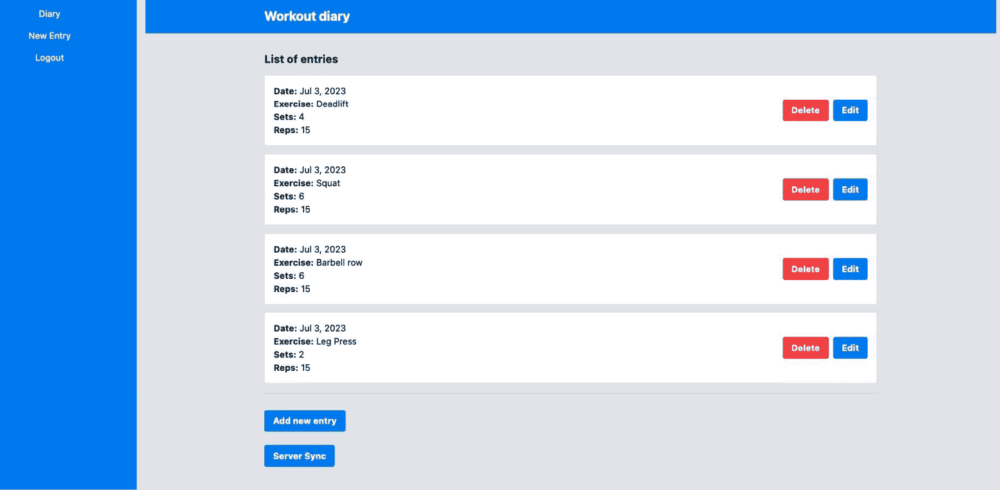
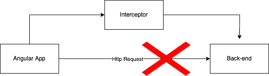
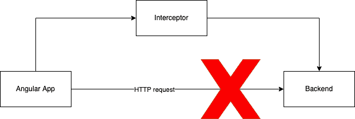
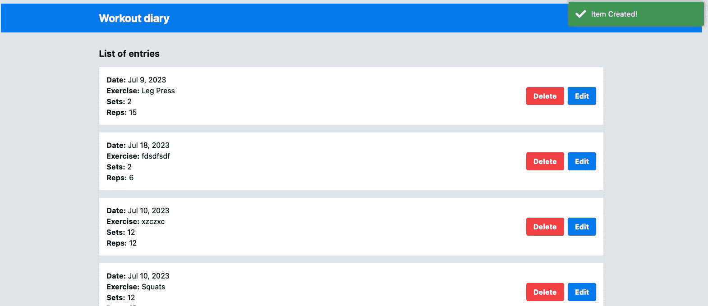

# 第八章：改进后端集成：拦截器模式

在一个 `Service` 中。然而，许多辅助任务对所有与后端的通信都是通用的，例如头部处理、身份验证和加载。

我们可以按服务逐个执行这个辅助任务，但除了这是一个低效的活动外，团队可能由于新成员的疏忽或无知而无法对请求实施一些控制。

为了简化与后端通信的辅助任务开发，Angular 框架实现了拦截器设计模式，我们将在本章中探讨这一模式。在此，我们将涵盖以下主题：

+   使用拦截器将令牌附加到请求

+   更改请求路由

+   创建一个加载器

+   通知成功

+   测量请求的性能

到本章结束时，你将能够创建能够隐式执行后端通信所需任务的拦截器。

# 技术要求

要遵循本章的说明，你需要以下内容：

+   Visual Studio Code ([`code.visualstudio.com/Download`](https://code.visualstudio.com/Download))

+   Node.js 18 或更高版本 ([`nodejs.org/en/download/`](https://nodejs.org/en/download/))

本章的代码文件可在 [`github.com/PacktPublishing/Angular-Design-Patterns-and-Best-Practices/tree/main/ch8`](https://github.com/PacktPublishing/Angular-Design-Patterns-and-Best-Practices/tree/main/ch8) 找到。

在阅读本章时，请记住使用 `npm start` 命令运行位于 `gym-diary-backend` 文件夹中的应用程序的后端。

# 使用拦截器将令牌附加到请求

到目前为止，我们的后端没有任何形式的身份验证控制，这在现实世界中不会发生（或者至少不应该发生）。后端被修改以执行身份验证，但这也反映在前端，因为如果我们尝试登录，就会发生以下错误：

```js
ERROR Error: Uncaught (in promise): HttpErrorResponse:
{"headers":{"normalizedNames":{},"lazyUpdate":null},"status":401,"statusText":"Unauthorized","url":"http://localhost:3000/diary","ok":false,"name":"HttpErrorResponse","message":"Http failure response for http://localhost:3000/diary: 401 Unauthorized","error":{"message":"Unauthorized","statusCode":401}}
```

这个错误意味着我们的请求被服务器拒绝，因为它没有得到授权。这是因为我们的服务器实现了一种非常常见的安全形式，即在每次请求中都要求提供授权令牌。

这个令牌是在用户登录应用程序时创建的，并且它必须在 HTTP 请求的头部传递。

我们首先通过更改 `AuthService` 服务来解决这个问题：

```js
export class AuthService {
  private httpClient = inject(HttpClient);
  private url = 'http://localhost:3000/auth/login';
  #token?: Token;
  login(loginForm: Partial<LoginForm>): Observable<Token> {
    return this.httpClient
      .post<Token>(this.url, loginForm)
      .pipe(tap((token) => (this.#token = token)));
  }
  get isLogged() {
    return this.#token ? true : false;
  }
  logout() {
    this.#token = undefined;
  }
  get token() {
    return this.#token?.access_token;
  }
}
```

首先，我们更改 `token` 属性的访问模式。我们使用 `#` 符号，这是在标准 JavaScript 中声明 `private` 属性的方式。我们希望令牌只能被其他 `component` 读取，但永远不会被覆盖，使用令牌可以确保即使消费者类强制修改也能实现这一点。

我们将类名更改为新的属性名，并在最后创建一个 `token()` 访问器方法来返回服务存储的令牌。

我们将重构`ExerciseSetsService`服务，以便在返回日记条目的请求中发送令牌：

```js
. . .
private authService = inject(AuthService);
private url = 'http://localhost:3000/diary';
getInitialList(): Observable<ExerciseSetListAPI> {
  const headers = new HttpHeaders({
    Authorization: `Bearer ${this.authService.token}`,
  });
  return this.httpClient.get<ExerciseSetListAPI>(this.url, { headers });
}
. . .
```

在这里，我们使用 Angular 的辅助类`HttpHeaders`创建一个头，通过`Authorization`属性传递令牌。然后，我们将此头传递给 Angular 的`HttpClient`服务的`get`方法。

当我们再次运行应用程序时，它再次工作（`mario`，和`1234`）：



图 8.1 – 健身日记主页

这种方法存在一个问题，因为我们需要为所有服务的方法复制此操作，并且随着应用程序的增长，我们需要记住执行此令牌处理。

一个好的软件架构应该考虑随着项目的增长，新团队成员的不同背景甚至新团队的创建。因此，我们系统的此类横向要求必须以更智能的方式处理。

进入**Angular 拦截器**，这是一个特定类型的服务，用于处理 HTTP 请求流程。该组件基于同名的设计模式，旨在改变处理周期。

让我们通过以下图表来说明此模式：



图 8.2 – 拦截器设计模式

在此图表中，我们有发出 HTTP 请求到后端的 Angular 应用程序；在拦截器模式中，我们有一个位于请求中间的 Angular 服务，可以更改请求和后端的返回。

我们将重构我们的前一个解决方案，以看到此模式在实际中的应用。我们将通过从`Authorization`头中删除处理来清理`ExerciseSetsService`服务：

```js
export class ExerciseSetsService {
  private httpClient = inject(HttpClient);
  private url = 'http://localhost:3000/diary';
  getInitialList(): Observable<ExerciseSetListAPI> {
    return this.httpClient.get<ExerciseSetListAPI>(this.url);
  }
 . . .
}
```

为了创建拦截器，我们将使用 Angular CLI 为 Angular 创建整个服务的模板：

```js
ng g interceptor login/auth
```

创建了`AuthInterceptor`服务后，让我们创建我们的逻辑来附加`Authorization`头：

```js
@Injectable()
export class AuthInterceptor implements HttpInterceptor {
  private authService = inject(AuthService);
  intercept(
    request: HttpRequest<unknown>,
    next: HttpHandler
  ): Observable<HttpEvent<unknown>> {
    const token = this.authService.token;
    if (request.url.includes('auth')) {
      return next.handle(request);
    }
    if (token) {
      const reqAuth = request.clone({
        headers: request.headers.set(`Authorization`, `Bearer ${token}`),
      });
      return next.handle(reqAuth);
    }
    return next.handle(request);
  }
}
```

我们首先可以注意到，拦截器是一个常见的 Angular 服务，因此它具有`@Injectable`注解；有关 Angular 服务的更多详细信息，请参阅*第五章**，* *Angular 服务和单例模式*。

此服务实现了`HttpInterceptor`接口，要求类必须具有`inject`方法。此方法接收我们想要处理的请求，并期望返回一个可观察对象。此签名表明了拦截器的特征，因为此类始终位于发出请求的组件和后端之间的流程中间。

因此，服务从流程中接收信息，并必须返回由可观察对象表示的流程。在我们的案例中，我们使用`AuthService`服务来获取令牌。服务不能将令牌附加到登录端点，因为那里我们将获取令牌，所以我们通过分析请求使用的 URL 来创建一个`if`语句。

如果我们有令牌，我们克隆请求，但这次，我们使用令牌来设置头信息。我们需要使用`clone`方法来获取新对象的原因是请求对象是不可变的——也就是说，它不能被更改；我们需要创建一个新的，与旧的完全相同，但这次，我们添加了头信息。

最后，流程被返回，但这次，带有新的请求对象。为了配置拦截器，我们需要更改`AppModule`模块：

```js
@NgModule({
  declarations: [AppComponent, ErrorPageComponent],
  imports: [BrowserModule, AppRoutingModule, HttpClientModule],
  providers: [
    { provide: HTTP_INTERCEPTORS, useClass: AuthInterceptor, multi: true },
  ],
  bootstrap: [AppComponent],
})
export class AppModule {}
```

我们将`AuthInterceptor`服务包含在`HTTP_INTERCEPTORS`令牌中。这告诉框架每当组件使用 Angular 的`HttpClient`服务时调用该服务。`multi`属性通知框架我们可以有多个拦截器，因为默认情况下，Angular 只添加一个。

再次运行应用程序，我们可以看到它现在正在工作，新增的是所有资源都在附加头信息，但隐式地，不需要更改每个`HttpClient`调用。

让我们进一步探讨这个功能，通过我们项目中的一个非常常见的任务，即在 API 调用中的 URL 路由。

# 更改请求路由

在我们到目前为止的项目中，我们有两个服务会向后端发送请求。如果我们分析它们，我们会看到它们都直接指向后端 URL。这不是一个好的做法，因为随着项目的规模和复杂性的增长，指向错误的 URL 可能会导致错误。除了需要更改主机之外，我们还需要更改许多文件。

处理这个问题的方法有很多，但在这个问题中一个非常有用的工具是 Angular 拦截器。让我们从 Angular CLI 开始，我们将创建新的拦截器：

```js
ng g interceptor shared/host
```

使用生成的文件，让我们创建`intercept`函数：

```js
@Injectable()
export class HostInterceptor implements HttpInterceptor {
  intercept(
    request: HttpRequest<unknown>,
    next: HttpHandler
  ): Observable<HttpEvent<unknown>> {
    const url = 'http://localhost:3000';
    const resource = request.url;
    if (request.url.includes('http')) {
      return next.handle(request);
    }
    const urlsReq = request.clone({
      url: `${url}/${resource}`,
    });
    return next.handle(urlsReq);
  }
}
```

在这个函数中，我们有后端的 URL，在`resource`变量中，我们接收我们想要拦截和修改的原始请求 URL。我们使用`if`语句是因为我们想要避免错误，以防某些服务需要直接调用另一个 API。

最后，我们创建一个新的请求对象（这次，URL 已更改）并将这个新对象传递给请求流程。为了让这个拦截器被 Angular 触发，我们需要将其添加到`AppModule`模块的`providers`数组中：

```js
@NgModule({
  declarations: [AppComponent, ErrorPageComponent],
  imports: [BrowserModule, AppRoutingModule, HttpClientModule],
  providers: [
    { provide: HTTP_INTERCEPTORS, useClass: AuthInterceptor, multi: true },
    { provide: HTTP_INTERCEPTORS, useClass: HostInterceptor, multi: true },
  ],
  bootstrap: [AppComponent],
})
export class AppModule {}
```

我们将重构我们的服务，使其只关注它们需要的特性，从`ExerciseSetsService`服务开始：

```js
export class ExerciseSetsService {
  private httpClient = inject(HttpClient);
  private url = 'diary';
 . . .
}
```

接下来，我们使用`Authentication`服务：

```js
export class AuthService {
  private httpClient = inject(HttpClient);
  private url = 'auth/login';
. . .
}
```

我们可以看到，如果我们需要新的服务或更改 URL，HTTP 请求就不需要重构，因为我们创建了一个拦截器来处理这个问题。

接下来，我们将学习如何让用户在请求耗时过长时获得更好的体验。

# 创建一个加载器

在前端项目中，性能不仅关乎拥有更快的请求，还关乎提高用户对应用程序的感知。没有任何反馈信号的空白屏幕会向用户传达页面没有加载，他们的互联网有问题，或其他任何负面感知。

正因如此，我们始终需要向用户发出信号，表明他们期望的操作正在执行。展示这一点的其中一种方式是加载指示器，这正是我们在这个会话中将要做的。在我们的操作系统命令行中，我们将使用 Angular CLI：

```js
 ng generate component loading-overlay
 ng generate service loading-overlay/load
 ng generate interceptor loading-overlay/load
```

通过这样，我们创建了`overlay`组件，控制加载状态的服务，以及根据 HTTP 请求控制加载开始和结束的拦截器。

让我们在`LoadingOverlayComponent`组件的 HTML 模板中创建加载覆盖屏幕：

```js
<div class="fixed inset-0 flex items-center justify-center bg-gray-800 bg-opacity-75 z-50">
  <div class="text-white text-xl">
    Loading...
  </div>
</div>
```

我们将实现`LoadService`服务，它将维护和控制加载状态：

```js
@Injectable({
  providedIn: 'root',
})
export class LoadService {
  #showLoader = false;
  showLoader() {
    this.#showLoader = true;
  }
  hideLoader() {
    this.#showLoader = false;
  }
  get isLoading() {
    return this.#showLoader;
  }
}
```

我们创建了两个方法来开启和关闭加载状态，以及一个属性来公开此状态。

在加载拦截器中，我们将实现以下功能：

```js
@Injectable()
export class LoadInterceptor implements HttpInterceptor {
  private loadService = inject(LoadService);
  intercept(
    request: HttpRequest<unknown>,
    next: HttpHandler
  ): Observable<HttpEvent<unknown>> {
    if (request.headers.get('X-LOADING') === 'false') {
      return next.handle(request);
    }
    this.loadService.showLoader();
    return next
      .handle(request)
      .pipe(finalize(() => this.loadService.hideLoader()));
  }
}
```

`intercept`方法首先开启加载状态，并返回未修改的请求。

然而，在请求流程中，我们放置了 RxJs 的`finalize`操作符，它具有在可观察者到达完成状态时执行函数的特征 – 在这里，关闭加载状态。有关 RxJS 的更多详细信息，请参阅*第九章*，*使用 RxJS 探索反应性*。

要激活拦截器，我们将将其添加到`AppModule`：

```js
@NgModule({
  declarations: [AppComponent, ErrorPageComponent, LoadingOverlayComponent],
  imports: [BrowserModule, AppRoutingModule, HttpClientModule],
  providers: [
    { provide: HTTP_INTERCEPTORS, useClass: AuthInterceptor, multi: true },
    { provide: HTTP_INTERCEPTORS, useClass: HostInterceptor, multi: true },
    { provide: HTTP_INTERCEPTORS, useClass: LoadInterceptor, multi: true },
  ],
  bootstrap: [AppComponent],
})
export class AppModule {}
```

我们希望覆盖层在整个应用程序中执行，因此我们将`overlay`组件包含在`AppComponent`组件中：

```js
export class AppComponent {
  loadService = inject(LoadService);
  title = 'gym-diary';
}
```

我们只需要注入`LoadService`服务，因为那里我们将拥有加载状态。

最后，让我们将`overlay`组件放置在 HTML 模板中：

```js
<app-loading-overlay *ngIf="loadService.isLoading"></app-loading-overlay>
<router-outlet></router-outlet>
```

运行我们的应用程序，因为我们是在机器上运行带有后端的程序，我们可能不会注意到加载屏幕。然而，对于这些情况，我们可以使用 Chrome 的一个功能来模拟慢速 3G 网络。

打开**Chrome 开发者工具**，在**网络**标签页中，使用如下所示的节流选项：


图 8.3 – 模拟慢速 3G 网络以注意加载屏幕

在下一节中，我们将学习如何通知用户后端请求的成功。

# 通知成功

除了通知用户系统正在寻找他们所需的信息的加载屏幕外，在处理完一个项目后通知用户也同样重要。我们可以直接从服务或组件中处理此通知，但也可以通过拦截器以通用和隐式的方式实现它。

我们将重构我们的应用程序以添加这种处理。但首先，让我们安装一个库，在屏幕上使用动画显示`toaster`组件。在我们的操作系统命令行中，我们将在前端项目的`main`文件夹中使用以下命令：

```js
 npm install ngx-toastr
```

为了使包正常工作，我们需要通过编辑`angular.json`文件将我们的 CSS 添加到项目中：

```js
. . .
  "build": {
    . . .
      "assets": [
      "src/favicon.ico",
      "src/assets"
      ],
      "styles": ["src/styles.css", "node_modules/ngx-toastr/toastr.css"],
    . . .
  },
```

为了使 toaster 动画工作，我们需要更改`AppModule`模块：

```js
imports: [
  BrowserAnimationsModule,
  AppRoutingModule,
  HttpClientModule,
  ToastrModule.forRoot(),
],
```

在我们应用程序的`main`模块中，我们正在添加来自库的`ToastrModule`模块，并将`BrowserModule`更改为`BrowserAnimationsModule`，这为库添加了 Angular 动画服务。

配置了新包后，我们可以使用 Angular CLI 创建新的拦截器：

```js
ng interceptor notification/notification
```

创建拦截器后，我们将更改通知的处理文件：

```js
. . .
import { ToastrService } from 'ngx-toastr';
@Injectable()
export class NotificationInterceptor implements HttpInterceptor {
  private toaster = inject(ToastrService);
  intercept(
    request: HttpRequest<unknown>,
    next: HttpHandler
  ): Observable<HttpEvent<unknown>> {
    return next.handle(request).pipe(
      tap((event: HttpEvent<any>) => {
        if (event instanceof HttpResponse && event.status === 201) {
          this.toaster.success('Item Created!');
        }
      })
    );
  }
}
```

正如在*创建加载器*部分中，我们正在利用请求被视为流的事实，使用 RxJS 及其可观察对象来验证请求的特征。我们使用`tap`操作符，该操作符旨在对请求执行副作用而不改变它。

此操作符将执行一个匿名函数，该函数将检查 HTTP 事件，这带我们到一个有趣的观点。由于我们对请求的返回感兴趣，我们只选择类型为`HttpResponse`的事件，事件代码为`201-Created`。

在开发拦截器时，我们必须记住它在请求和响应时被调用，因此使用条件执行我们需要的操作是很重要的。

我们需要配置的最后一点是主要的`AppModule`模块：

```js
 providers: [
. . .
   {
     provide: HTTP_INTERCEPTORS,
     useClass: NotificationInterceptor,
     multi: true,
   },
. . .
 ]
```

运行我们的项目并创建一个条目，我们注意到配置的消息在屏幕上显示为 toast。



图 8.4 – 成功通知

拦截器的一个用途是测量我们的应用程序的性能和稳定性，我们将在下一节中了解。

# 测量请求的性能

作为一支开发团队，我们必须始终寻求为用户提供最佳体验，除了开发高质量的产品外，我们还必须允许应用程序在生产过程中被监控以维持质量。

市面上有几种工具可供选择，其中许多需要一定程度的仪器来准确测量用户体验。我们将开发一个更简单的遥测示例，但它可以应用于你们团队使用的监控工具。

使用 Angular CLI，我们将创建一个新的拦截器：

```js
ng g interceptor telemetry/telemetry
```

在由 Angular CLI 生成的文件中，我们将开发我们的拦截器：

```js
@Injectable()
export class TelemetryInterceptor implements HttpInterceptor {
  intercept(
    request: HttpRequest<unknown>,
    next: HttpHandler
  ): Observable<HttpEvent<unknown>> {
    if (request.headers.get('X-TELEMETRY') !== 'true') {
      return next.handle(request);
    }
    const started = Date.now();
    return next.handle(request).pipe(
      finalize(() => {
        const elapsed = Date.now() - started;
        const message = `${request.method} "${request.urlWithParams}" in ${elapsed} ms.`;
        console.log(message);
      })
    );
  }
}
```

为了说明自定义拦截器的能力，我们同意只有当请求带有名为`X-TELEMETRY`的自定义头时，才会使用遥测，并在函数的开始处进行此验证。

就像在加载器示例中做的那样，我们使用了`finalize`运算符以简化的方式测量请求的性能，并在`console.log`中展示。你可以在这里放置你的遥测提供者调用，甚至你的自定义后端。

为了举例说明，我们使用`console.log`来展示信息。就像在其他部分一样，我们需要在主`AppModule`模块中配置拦截器：

```js
. . .
providers: [
. . .
   {
     provide: HTTP_INTERCEPTORS,
     useClass: TelemetryInterceptor,
     multi: true,
   },
 ],
. . .
```

最后，在`ExerciseSetsService`服务中，我们将发送定制的头以执行此请求的遥测：

```js
. . .
getInitialList(): Observable<ExerciseSetListAPI> {
  const headers = new HttpHeaders().set('X-TELEMETRY', 'true');
  return this.httpClient.get<ExerciseSetListAPI>(this.url, { headers });
}
. . .
```

头部传递是配置拦截器以根据不同情况表现不同的方式。

运行我们的项目，我们可以在浏览器日志中看到消息：

```js
GET "http://localhost:3000/diary" in 5 ms. telemetry.interceptor.ts:25:16
```

通过这次开发，配置了头的 HTTP 请求将在`console.log`中记录。你可以用集成到遥测服务的拦截器替换这个拦截器，从而提高你应用程序的监控能力。

# 摘要

在本章中，我们探讨了 Angular 中的拦截器功能以及这个功能可以为我们的团队带来的可能性。我们学习了如何在不改变我们项目中所有服务的情况下将身份验证令牌附加到请求中。我们还致力于更改请求的 URL，使我们的项目对执行环境更加灵活。

我们还通过创建一个加载器来改善用户的体验，以防他们的网络速度慢，并在他们的健身房日记中注册新条目时在屏幕上通知他们。最后，我们使用自定义头创建了一个简单的遥测示例，以便团队能够选择哪些请求具有遥测能力。

在下一章中，我们将探索 RxJS，这是 Angular 工具包中最强大的库。
