# 第十二章：打包一切 – 部署最佳实践

在架构、开发和测试完您的应用程序后，是时候将其部署给用户了。

在本章中，我们将学习生成生产包的最佳实践以及如何使用自动化工具在项目此阶段最大化团队的生产力和效率。

本章将涵盖以下主题：

+   部署后端

+   区分环境

+   准备生产包

+   挂载带有 Nginx 的 Docker 镜像

+   将页面部署到 Azure 静态 Web 应用

到本章结束时，您将能够使用 Angular CLI 生成针对生产优化的包，并使用 CI/CD 工具自动化团队的过程。

# 技术要求

要遵循本章中的说明，您需要以下内容：

+   **Visual Studio Code** (**VSCode**) ([`code.visualstudio.com/Download`](https://code.visualstudio.com/Download))

+   Node.js 18 或更高版本 ([`nodejs.org/en/download/`](https://nodejs.org/en/download/))

+   Docker ([`www.docker.com/`](https://www.docker.com/))

+   Docker for VSCode ([`marketplace.visualstudio.com/items?itemName=ms-azuretools.vscode-docker`](https://marketplace.visualstudio.com/items?itemName=ms-azuretools.vscode-docker))

+   Azure 账户 ([`azure.microsoft.com`](https://azure.microsoft.com))

+   Azure CLI ([`learn.microsoft.com/en-us/cli/azure/`](https://learn.microsoft.com/en-us/cli/azure/))

+   Azure Functions Core Tools ([`learn.microsoft.com/en-us/azure/azure-functions/functions-run-local`](https://learn.microsoft.com/en-us/azure/azure-functions/functions-run-local))

+   Azure Tools for VSCode ([`marketplace.visualstudio.com/items?itemName=ms-vscode.vscode-node-azure-pack`](https://marketplace.visualstudio.com/items?itemName=ms-vscode.vscode-node-azure-pack))

+   NestJS CLI ([`docs.nestjs.com/cli/overview`](https://docs.nestjs.com/cli/overview))

本章的代码文件可在 [`github.com/PacktPublishing/Angular-Design-Patterns-and-Best-Practices/tree/main/ch12`](https://github.com/PacktPublishing/Angular-Design-Patterns-and-Best-Practices/tree/main/ch12) 找到。

# 部署后端

在为我们的健身房日记项目准备生产之前，我们首先将后端上传到云服务，以便我们的页面能够访问数据。

我们为这本书选择了 Azure 服务，但本章中的概念也可以应用于其他云服务，例如 AWS ([`aws.amazon.com`](https://aws.amazon.com)) 和 GCP ([`cloud.google.com`](https://cloud.google.com))。

此示例的后端不使用数据库，并使用 NestJS 框架（[`nestjs.com/`](https://nestjs.com/))构建，该框架实际上有一个完全受 Angular 启发的架构，但用于后端！此框架允许您通过 Azure 添加云部署功能。为了准备您的后端进行部署，在您的操作系统命令行中，在`project`文件夹（`/gym-diary-backend`）中，运行以下命令：

```js
npm install @schematics/angular
nest add @nestjs/azure-func-http
```

第一个命令安装 Angular Schematic 包，该包将被用于构建应用程序。

`nest add`命令与 Angular 的`ng add`命令具有相同的功能，在这里，除了安装部署到 Azure 的依赖项外，它还配置并创建了执行此任务所需的必要文件。

在安装了*技术要求*部分提供的工具后，我们首先需要创建一个 Azure Functions 项目。为此，让我们转到 Azure 门户中的**函数应用**菜单选项：

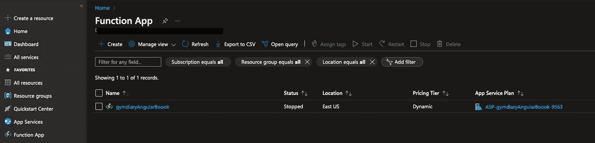

图 12.1 – 函数应用菜单选项

Azure 有几种运行后端服务的方式，其中最简单的一种是通过 Azure Functions。使用它，我们可以在不需要配置服务器的情况下上传我们的服务，因为提供商将负责这些细节。

然后，我们需要进行一些基本配置。为此，我们将点击**+ 创建**。完成后，我们将看到以下屏幕：


图 12.2 – Azure Functions 服务配置

在**订阅**字段中，您需要选择您的 Azure 订阅。在**资源组**字段中，您可以选择您已经拥有的组；如果您没有，您可以创建一个新的组并输入其名称。**函数应用名称**字段很重要，因为它将最初是您端点的地址。您可以选择购买一个特定的 URL 或将此 API 放在 Azure API 网关（https://azure.microsoft.com/en-us/products/api-management）后面，尽管在我们的示例中这不是必需的。我们将直接从代码部署，所以将**您想部署代码还是容器镜像？**设置为**代码**。项目的运行时堆栈应设置为**NodeJS**，版本**18 LTS**。对于项目区域，选择离您较近的区域，或**东 US**，这是默认选项。最后，**操作系统**应设置为**Linux**。**托管选项和计划**选项应设置为**消费（无服务器）**，因为我们在此情况下不需要任何更具体的功能。

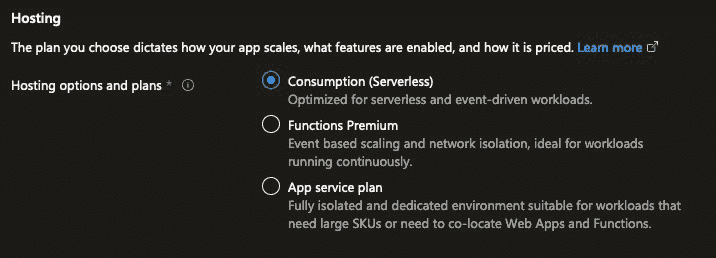

图 12.3 – 托管选项和计划

一旦我们填写了所有必要的信息，点击**审查 + 创建**。在下一个屏幕上，确认您的信息并执行创建：

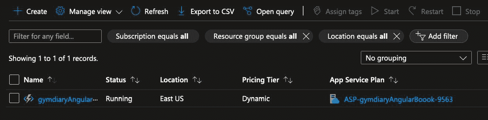

图 12.4 – Azure Functions 服务创建

要将我们的后端发布到创建的服务中，我们将使用 VS 插件。打开后端项目，左键单击，并选择**部署到函数应用…**，如图所示：

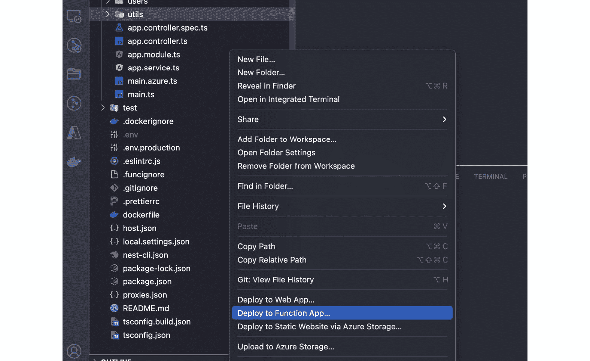

图 12.5 – VSCode 发布 Azure 函数扩展

扩展程序将获取您账户中创建的服务列表，因此请从**AZURE**面板中选择我们创建的那个。

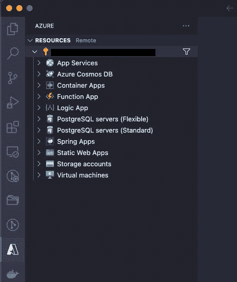

图 12.6 – VSCode AZURE 面板

发布后，Azure 服务将指向一个包含您服务的公共 URL。使用 `/exercise` 端点在浏览器中访问它，以检查服务是否处于活动状态。

发布的 URL 返回应类似于以下列表：

```js
{"items":id":"30","description":"Plank"},{"id":"29","description":"Dumbbell Bench Press"},{"id":"28","description":"Seated Leg Curl"},{"id":"27","description":"Cable Curl"},{"id":"26","description":"Glute Bridge"},{"id":"25","description":"Skull Crusher"},{"id":"24","description":"Arnold Press"},{"id":"23","description":"Inverted Row"},{"id":"22","description":"Chest Fly"},{"id":"21","description":"Hanging Leg Raise"},{"id":"20","description":"Side Lateral Raise"},{"id":"19","description":"Front Squat"},{"id":"18","description":"Seated Row"},{"id":"17","description":"Romanian Deadlift"},{"id":"16","description":"Bicep Curl"},{"id":"15","description":"Calf Raise"},{"id":"14","description":"Tricep Dip"},{"id":"13","description":"Push-up"},{"id":"12","description":"Leg Curl"},{"id":"11","description":"Incline Bench Press"},{"id":"10","description":"Hammer Curl"}, {"id":"9","description":"Lunges"},{"id":"8","description":"Dumbbell Curl"},{"id":"7","description":"Pull-up"},{"id":"6","description":"Shoulder Press"},{"id":"5","description":"Bench Press"},{"id":"4","description":"Leg Press"},{"id":"3","description":"Barbell 
Row"},{"id":"2","description":"Squat"},{"id":"1","description":"Deadlift"}],"hasNext":false}
```

我们必须做的最后一个配置是配置服务的 CORS，以使我们的本地应用程序能够连接到云服务。在 Azure 控制台中，单击创建的服务，然后点击`*`：

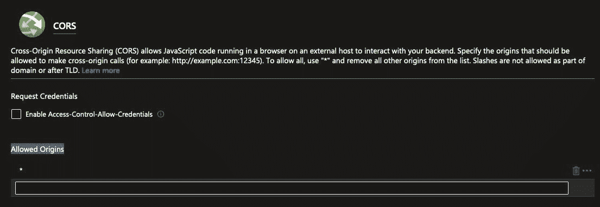

图 12.7 – CORS 配置

在我们的后端服务上线后，我们将专注于如何在下一节中从我们的应用程序中访问它。一个重要点是始终记得在 Azure 中关闭服务，以避免在通过这本书的示例在您的 Azure 账户中产生不必要的费用。

# 区分环境

完成后端部署的任务后，我们需要更改我们的前端项目以向我们的云基础设施发送请求。但在这里，出现了一个问题。我们希望在生产环境中访问我们发布的后端，但团队需要继续本地访问 API 以更实际的方式开发新功能。我们如何才能两者兼得？

这个问题的答案，再次，是由 Angular 团队想出来的，即为每个开发环境创建配置文件。

在 Angular 的第 14 版之前，这些文件在创建项目（`ng new` 命令）时已经是标准配置。然而，为了简化新项目并降低学习曲线，这些文件在新项目中已被移除。

但我们不必担心，因为要添加它们，我们可以使用 Angular CLI。在命令行中，使用以下命令：

```js
ng generate environments
```

执行上述命令后，Angular CLI 创建了`environments`文件夹，并在其中我们有`environment.development.ts`和`environment.ts`文件。

这些 TypeScript 文件只有一个对象，而这个对象就是我们放置所有需要区分生产环境和开发环境的设置的地点。我们首先将`environment.development.ts`文件修改如下：

```js
export const environment = {
  production: false,
  apiUrl: 'http://localhost:3000'
};
```

在这些对象中，我们声明一个标志来指示这是一个开发环境的配置以及我们本地后端服务的 URL。现在我们将`environment.ts`文件修改如下：

```js
export const environment = {
  production: true,
  apiUrl: 'https://gymdiaryangularboook.azurewebsites.net/api',
};
```

这里，我们做的是同样的事情，但指示我们的应用程序的生产环境。后端地址将是上一节中创建的那个。

要使用这些文件，我们必须导入它们，并重构`HostInterceptor`服务以使用它：

```js
. . .
import { environment } from 'src/environments/environment';
@Injectable()
export class HostInterceptor implements HttpInterceptor {
  intercept(
    request: HttpRequest<unknown>,
    next: HttpHandler
  ): Observable<HttpEvent<unknown>> {
    const url = environment.apiUrl;
. . .
}
```

在我们的拦截器服务中，该服务负责将 URL 添加到我们的请求中（更多详情，见*第八章*，*改进后端集成：拦截器模式*），我们使用`environment`对象属性来确定 URL。

这里需要注意的一个点是，我们必须导入`environment.ts`文件，因为 Angular 在生成构建时会进行更改。

为了清楚地表明我们处于哪个环境，我们将按照以下方式更改`AppComponent`组件：

```js
. . .
import { environment } from 'src/environments/environment';
import { ToastrService } from 'ngx-toastr';
@Component({
  selector: 'app-root',
  templateUrl: './app.component.html',
  styleUrls: ['./app.component.css'],
})
export class AppComponent implements OnInit {
  loadService = inject(LoadService);
  toaster = inject(ToastrService);
  title = 'gym-diary';
  ngOnInit(): void {
    if (environment.production) {
      this.toaster.info('Production Build!');
    } else {
      this.toaster.info('Development Build!');
    }
  }
}
```

在这个更改中，我们使用 toaster 服务（更多详情，请参阅*第八章*，*改进后端集成：拦截器模式*）来指示，当用户进入页面时，他们处于哪个环境。

让我们使用`ng serve`命令运行我们的应用程序，我们将得到以下结果：


图 12.8 – 开发模式下的应用

如果我们登录到我们的应用程序，我们可以通过查看**网络**标签中的开发者工具，看到应用程序正在向我们的本地后端发送请求。要作为生产构建运行我们的 Angular 项目，我们可以使用以下命令：

```js
ng serve --configuration production
```

当访问我们的应用程序时，我们可以在屏幕上的消息中看到请求是针对我们云服务中发布的服务发出的：

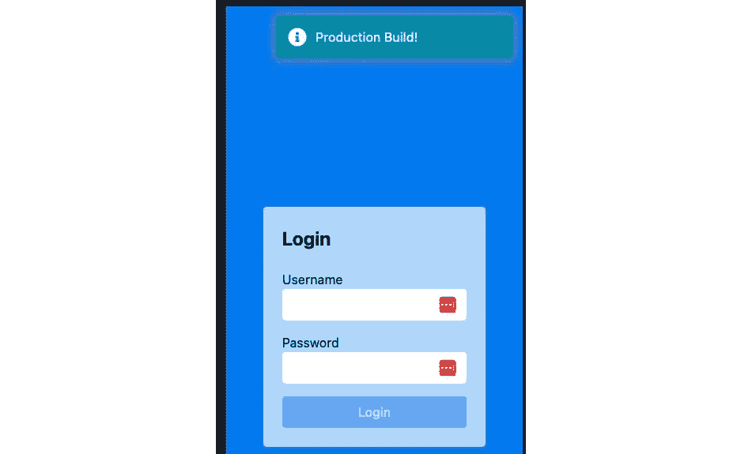

图 12.9 – 生产模式下的应用

由于我们的服务已为多个环境做好准备，我们现在可以看看如何在下一节中更好地为部署做准备。

# 准备生产包

在生产环境中运行的前端应用程序的环境需求与我们在书中看到的开发环境不同。

在我们开发时，我们寻求编译速度、强大的调试和性能分析工具来分析我们的代码，以及生成样板代码等功能。

即使在我们的本地机器上处理成本更高，需要更多空间来生成用于调试的仪器化包，以及需要更大的网络消耗来下载开发工具，但所有这些对于团队的生产力来说都是重要的，Angular 框架通过一个强大的生态系统提供了这些功能。

当我们谈论在生产环境中运行的客户端网络代码时，目标几乎相反。我们希望我们的代码尽可能小和优化，以便以最高效的方式下载和执行。

带着这个目标，Angular 框架有一个强大且简单的构建工具，用于生成生产包。

要运行它，我们需要在我们的 `project` 文件夹中使用以下命令：

```js
ng build
```

此命令将在我们项目的 `dist` 文件夹中创建我们将要运行的生产包。

但为了深化我们对 Angular 框架的了解，让我们了解这个构建过程的基础是什么。答案是 `angular.json` 文件。让我们分析一些构建的重要属性：

```js
"configurations": {
  "production": {
    "budgets": [
      {
        "type": "initial",
        "maximumWarning": "500kb",
        "maximumError": "1mb"
      },
      {
        "type": "anyComponentStyle",
        "maximumWarning": "2kb",
        "maximumError": "4kb"
      }
    ],
    "outputHashing": "all"
  },
  . . .
  "defaultConfiguration": "production"
}
```

在 `configurations` 属性中，我们有我们项目中可以拥有的环境类型的定义。最初，Angular CLI 创建了两个配置：生产模式和开发模式。

在生产配置中，我们有 `budgets` 属性，它确定我们的包必须具有的最大大小，除了定义单元组件必须具有的最大大小。

如果您的项目超过这个大小，Angular 可能会在生产控制台中显示警告，甚至可能不构建您的项目。

这很重要，因为我们需要生成尽可能小的文件，因为这会导致用户对我们性能的感知更高，尤其是如果他们正在使用 3G 网络上的设备。

减少文件大小的一种方法是通过使用 Angular 的懒加载功能（有关此功能的更多详细信息，请参阅*第二章*，*组织* *您的应用程序*)。

`outputHashing` 属性确保应用程序生成的文件名称被添加到哈希中。

这很重要，因为大多数公共云和 **内容分发网络**（**CDNs**）根据文件名缓存应用程序。当我们生成我们应用程序的新版本时，我们希望这个缓存被无效化，以便将新版本提供给我们的用户。

最后，`defaultConfiguration` 属性确定如果没有传递参数，`ng build` 命令将执行其中指示的配置，在这种情况下，是生产模式。

这些配置可以根据项目需求进行扩展和创建新配置。在我们的案例中，我们将保留默认配置。

在生产配置中运行构建时，Angular 执行以下过程：

+   **提前编译（AOT）**：Angular 除了 TypeScript 文件外，还编译模板和 CSS 文件。

+   **生产模式**：应用程序有一些针对在生产环境中运行的验证进行了优化。

+   **打包**：它将所有组件文件、模板、服务和库打包到按模块分隔的文件中。

+   **压缩**：从 TypeScript 生成的文件中，它连接并消除空白和注释，以生成尽可能小的文件。

+   **丑化**：它重新编写生成的代码，包括变量、函数名称和小的、神秘的模块，使其难以逆向工程用户浏览器接收到的前端代码。

+   **死代码消除**：也称为 **摇树**，这是不包括在代码中未引用且不需要在生产包中存在的组件的过程。

所有这些过程都是通过 `ng build` 命令以及创建项目时设置的配置来完成的。重要的是要注意，这个过程会随着 Angular 每个新版本的发布而改进，这也是始终使用最新版本保持项目更新的另一个原因。

在下一节中，我们将创建一个由 Nginx 网络服务器构建和运行的 Docker 镜像。

# 挂载带有 Nginx 的 Docker 镜像

到目前为止，我们一直在使用 Angular 包中包含的网络服务器来在本地运行我们的应用程序。虽然非常胜任，但它纯粹关注开发者的体验，并且没有生产环境所需的表现力和可扩展性能力。

为了这个目的，我们使用生产级别的网络服务器。其中最受欢迎的是 Nginx（发音为 *Engine X*）。

要配置它，我们需要在项目的根目录下创建一个名为 `nginx.default.conf` 的文件，并将其添加以下内容：

```js
server {
  listen 80;
  sendfile on;
  default_type application/octet-stream;
  gzip on;
  gzip_http_version 1.1;
  gzip_disable      "MSIE [1-6]\.";
  gzip_min_length   1100;
  gzip_vary         on;
  gzip_proxied      expired no-cache no-store private auth;
  gzip_types        text/plain text/css application/json application/javascript application/x-javascript text/xml application/xml application/xml+rss text/javascript;
  gzip_comp_level   9;
  root /usr/share/nginx/html;
  location / {
    try_files $uri $uri/ /index.html =404;
  }
}
```

在这个配置文件中，前三个属性（`listen`、`sendfile` 和 `default_type`）旨在配置暴露的端口并准备服务器发送我们的项目包文件。

以 `gzip` 开头的属性配置了使用本地压缩数据 `gzip` 交付文件，从而进一步减少发送到用户浏览器的文件。

文件的最后部分决定了要服务的第一个页面。因为我们处于 `index.html`。

使用这个配置，我们可以运行 Nginx，但不是在本地机器上原生安装它，而是使用 Docker 来运行它。

Docker 是当今现代系统中广泛使用的工具，旨在将应用程序的环境隔离开来。换句话说，通过配置一个文件，我们可以为我们的应用程序创建一个环境，它可以在我们的本地机器上运行，也可以在具有相同依赖项和版本的云服务提供商上运行。

让我们通过首先在项目的根目录下创建一个名为 `.dockerignore` 的文件并添加以下内容来举例说明其使用：

```js
node_modules
```

以 `.gitignore` 文件为例，我们确保 `node_modules` 文件夹不会被复制到镜像中。请记住，这个镜像以及从中运行的（在 Docker 生态系统中称为容器）就像是一台新机器，我们只会复制应用程序运行所需的内容。

下一步是创建 `dockerfile` 文件，并将其以下代码添加到其中：

```js
FROM node:18-alpine as build
COPY package.json package-lock.json ./
RUN npm ci && mkdir /gym-app && mv ./node_modules ./gym-app/
WORKDIR /gym-app
COPY . .
RUN npm run build
FROM nginx:1.25-alpine
COPY nginx.default.conf /etc/nginx/conf.d/default.conf
RUN rm -rf /usr/share/nginx/html/*
COPY --from=build /gym-app/dist/gym-diary /usr/share/nginx/html
CMD ["nginx", "-g", "daemon off;"]
```

在这个文件中，我们使用多阶段构建技术来创建我们的镜像。首先，我们构建应用程序，然后使用这个构建的结果来创建最终的镜像。这样，我们的镜像变得更小，更优化。

我们在这里称之为 `build` 的第一个阶段基于 `node:18-alpine` 镜像，这是一个包含 `Alpine` Linux 发行版和 Node.js 18 版本的精简镜像。

然后，复制 `package.json` 和 `package-lock.json` 文件，并运行 `npm ci` 命令来安装包。

然后，使用 `COPY . .` 命令，复制所有项目代码（除了 `node_module` 文件夹）。

在这个阶段的最后，我们的应用程序包是通过 `npm run build` 命令生成的。

下一个阶段，即生产阶段，基于 `nginx:1.25-alpine` 镜像，因为运行 Web 服务器，我们只需要安装一个像 Nginx 这样的 Linux 发行版。

下一个任务是复制 Nginx 安装的配置文件，删除工具附带示例文件，并将上一阶段生成的文件复制到这一阶段。

这行 `["nginx", "-g", "daemon off;"]` 运行 Nginx 并使其准备好交付我们的应用程序。

要挂载镜像，在 VSCode 中右键单击 `dockerfile` 文件，并选择 **构建** **镜像** 选项。

要在本地运行 Docker 容器，请使用以下命令：

```js
docker run -p 8080:80 gymdiary
```

通过访问 `http://localhost:8080` URL，我们可以在生产模式下运行我们的应用程序。将我们的项目放在网络上的另一种方式是使用 Azure Static Web Apps。我们将在下一节中处理这个问题。

# 部署页面到 Azure Static Web Apps

使用我们创建的 Docker 镜像，我们可以在提供容器服务的任何云服务提供商上运行我们的项目。然而，还有其他方法来部署我们的 Angular 项目。

这些替代方案之一是 Azure Static Web Apps，这是一项专注于网页设计的专业服务，并允许与 GitHub 自动集成。让我们在我们的项目中实际看看。

第一个要求是您的项目位于 GitHub 上，如下截图所示：

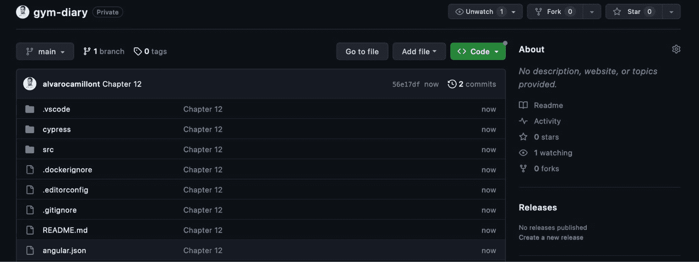

图 12.10 – 前端项目的 GitHub 存储库

如果您已复制项目存储库，请将 `gym-diary` 文件夹放置在您的 GitHub 项目中。

要配置 Azure 服务，请转到账户门户并搜索 `Static` `Web Apps`。

点击 **创建静态 Web App** 按钮，服务表单将呈现给您。

在第一部分，我们有以下字段：

+   **订阅**：选择您的 Azure 订阅。

+   **资源组**：为该服务创建或定义一个组。在 Azure 中，每个资源都必须链接到一个资源组。

+   **名称**：为您的前端项目提供一个名称。

+   **计划类型**：选择您环境的层级。资源越多，成本越高，但在这个例子中，我们只会使用免费计划。

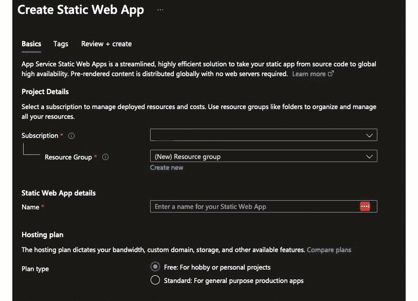

图 12.11 – Azure Static Web App 创建

+   **源**：在这个字段中，我们确定我们的项目是在 GitHub 上还是在 Azure 存储库中。

+   **组织**：您想要从中选择存储库的 GitHub 用户或组织的名称。重要的是您的用户具有高访问权限，例如维护者或管理员。

+   **存储库**：Azure 将列出您在所选组织中有访问权限的所有存储库。

+   **分支**：您想要部署的存储库分支。

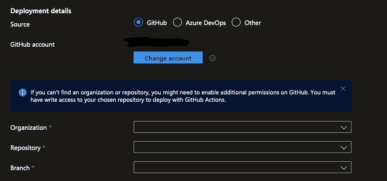

图 12.12 – 部署详情配置

在第二部分，我们使用 Angular 为我们的项目配置了特定的设置：

+   **构建预设**：Azure 服务支持多种前端技术。在这种情况下，我们将选择 **Angular**。

+   `/`.

+   **API 位置**：如果您想指向在 Azure 中部署的后端服务，这是一个可选字段。在这里，在这个例子中，我们将将其留空。

+   `dist/gym-diary/`.


图 12.13 – 预设设置

完成后，点击 **审查和创建**，然后在下一屏幕上确认操作。Azure 将开始处理，一旦准备好，它将显示创建的服务仪表板：

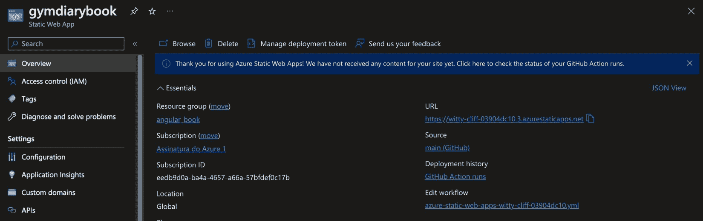

图 12.14 – 创建的服务仪表板

在 **URL** 字段中，您将看到 Azure 为我们的项目创建的 URL。选择它，一旦部署状态为 **Ready**，我们的系统就会立即呈现。因此，我们的项目已经在云端运行。您可以配置其他设置，例如添加您自己的 URL，但请记住，某些设置在免费计划中不可用。

这个功能最有趣的地方是它在我们仓库中实现了一个 GitHub Action：

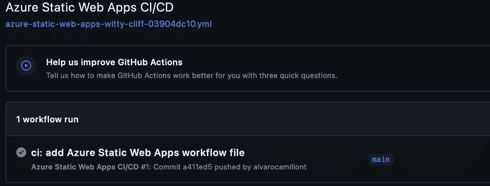

图 12.15 – GitHub Action

什么是 GitHub Action？这是一个 GitHub 功能，允许创建和执行脚本来自动化任务，例如，在我们的例子中，部署到 Azure 服务。

使用我们的配置，Azure 向导在我们的 GitHub 仓库中创建并运行了脚本。

奖励是，我们生成的脚本配置为在每次向仓库推送时执行和部署，更新我们在云端部署的应用程序。

# 摘要

在本章中，我们探讨了将我们的应用程序部署到生产环境时 Angular 的技术和功能。

我们首先将后端上传到云端，在那里它将为我们的前端应用程序可用。

然后，我们通过使用 Angular 的 `environment.ts` 文件功能来区分开发环境和生产环境来调整我们的应用程序。

我们探讨了 `ng build` 命令和 Angular 为我们执行的所有任务，以使我们的应用程序尽可能精简，以便为我们的用户提供更快的速度。

我们学习了 Docker 以及我们如何将我们的 Angular 应用程序打包以在 Nginx 等网络服务器上运行，而不管我们的应用程序运行在哪种类型的机器上。

最后，我们了解了一种使用 Azure 静态 Web 应用服务将应用程序部署到云端的另一种方法，并看到它是如何通过创建 GitHub Action 脚本来自动化此过程的。

在下一章中，我们将探索最新的 Angular 创新，包括 Angular Signals。
