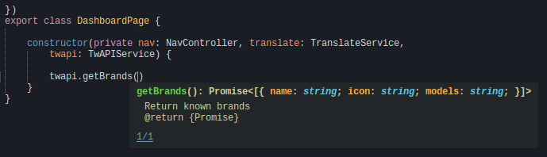

# 第一章：TypeScript 最佳实践

我一直讨厌 JavaScript。当然我会用它，但只是在必要的时候。我清楚地记得我的第一次实习面试，那时我还是法国计算机工程学校 eXia.Cesi 的大一新生。我只知道 C 和一些 Java，被要求帮助一个主要使用自制 Ajax 库的内部网络。那纯粹是疯狂，有点让我暂时远离了计算机工程的 Web 方面。我对以下内容一无所知。

```ts
var r = new XMLHttpRequest();  
r.open("POST", "webservice", true); 
r.onreadystatechange = function () { 
   if (r.readyState != 4 || r.status != 200) return;  
   console.log(r.responseText); 
}; 
r.send("a=1&b=2&c=3"); 
```

一个本地的 Ajax 调用。多丑陋啊？

当然，使用 jQuery 模块和一些关注点分离，它是可以使用的，但仍然不像我想要的那样舒适。你可以在下面的截图中看到关注点是分离的，但并不那么容易：

使用 PHP5 和 Codeigniter 的已弃用的 toolwatch.io 版本

然后，我学习了一些 RoR（基于 Ruby 的面向对象的 Web 应用程序框架：[`rubyonrails.org/`](http://rubyonrails.org/)）和 Hack（Facebook 的一种带类型的 PHP：[`hacklang.org/`](http://hacklang.org/)）。这太棒了；我拥有了我一直想要的一切：类型安全、工具和性能。第一个，类型安全，相当容易理解：

```ts
<?hh 
class MyClass { 
  public function alpha(): int { 
    return 1; 
  } 

  public function beta(): string { 
    return 'hi test'; 
  } 
} 

function f(MyClass $my_inst): string { 
  // Fix me! return $my_inst->alpha(); 
} 
```

另外，有了类型，你可以拥有很棒的工具，比如强大的自动完成和建议：

Sublime Text 在 toolwatch.io 移动应用程序（Ionic2 *[5]* + Angular 2）上的自动完成

Angular 可以与 CoffeeScript、TypeScript 和 JavaScript 一起使用。在本书中，我们将专注于 TypeScript，这是 Google 推荐的语言。TypeScript 是 JavaScript 的一种带类型的超集；这意味着，使用 TypeScript，你可以做任何你以前在 JavaScript 中做的事情，还有更多！举几个优点：用户定义的类型、继承、接口和可见性。最好的部分是，TypeScript 被转译成 JavaScript，所以任何现代浏览器都可以运行它。

事实上，通过使用 polyfill，甚至我们那个老旧的 IE6 几乎可以执行最终的输出。我们将在下一章回到这个问题。转译与编译不同（例如，从 C 到可执行文件或从`.java`到`.class`），因为它只是将 TypeScript 转换成 JavaScript。

在本章中，我们将学习 TypeScript 的最佳实践。对于了解 JavaScript 和面向对象语言的任何人来说，TypeScript 语言的语法都非常容易掌握。如果您对面向对象编程一无所知，我建议您将这本书放在一边，花几分钟时间查看这个快速的 Udacity 课程：[`www.udacity.com/wiki/classes`](https://www.udacity.com/wiki/classes)。

总结一下涉及的主题：

+   TypeScript 语法

+   TypeScript 最佳实践

+   TypeScript 的缺点

# 环境设置

对于环境设置，我将涵盖所有三个主要平台：Debian 风格的 Linux，macOS 和 Windows。我们将要使用的所有工具都是跨平台的。因此，随意选择您最喜欢的那个；以后您将能够做任何事情。

接下来，我们将安装`Node.js`，`npm`和 TypeScript。

# Linux 的 Node.js 和 npm

```ts
$ curl -sL https://deb.nodesource.com/setup_6.x | sudo -E bash -
$ sudo apt-get install -y Node.js
```

这个命令会将一个脚本直接下载到您的`bash`中，它将获取您需要的每一个资源并安装它。在大多数情况下，它会正常工作并安装`Node.js` + `npm`。

现在，这个脚本有一个缺陷；如果您有不再可用的 Debian 存储库，它将失败。您可以利用这个机会清理您的 Debian 存储库，或者稍微编辑一下脚本。

```ts
$ curl https://deb.nodesource.com/setup_6.x > node.sh 
$ sudo chmod +x node.sh 
$ vim node.sh //Comment out all apt-get update 
//Save the file $ sudo apt-get update 
$ ./node.sh 
$ sudo apt-get update 
$ sudo apt-get install -y Node.js 
```

然后，前往[`Node.js.org/en/download/`](https://Node.js.org/en/download/)，下载并安装最新的`.pkg`或`.msi`（分别用于 Linux 或 Windows）。

# TypeScript

现在，您应该可以在终端中访问`node`和`npm`。您可以使用以下命令测试它们：

```ts
$ node -v 
V8.9.0 

$ npm -v 
5.5.1  
```

请注意，这些命令的输出（例如 v6.2.1 和 3.9.3）可能会有所不同，当您阅读这些内容时，您的环境中的 node 和 npm 的最新版本可能会有所不同。但是，如果您至少有这些版本，您将在本书的其余部分中表现良好：

```ts
    $ npm install -g TypeScript
```

`-g`参数代表全局。在 Linux 系统中，根据您的发行版，您可能需要`sudo`权限来安装全局包。

与 node 和 npm 非常相似，我们可以使用以下命令测试安装是否顺利进行：

```ts
    $ tsc -v
    Version 2.6.1

```

目前我们拥有的是 TypeScript 转译器。您可以这样使用：

```ts
    tsc --out myTranspiledFile.js myTypeScriptFile.ts

```

这个命令将转译`myTypeScriptFile.ts`的内容并创建`myTranspiledFile.js`。然后，您可以在控制台中使用 node 执行生成的`js`文件。

```ts
    node myTranspiledFile.js

```

为了加快我们的开发过程，我们将安装`ts-node`。这个 node 包将 TypeScript 文件转译成 JavaScript，并解决这些文件之间的依赖关系：

```ts
    $ npm install -g ts-node
    $ ts-node -v
    3.3.0
```

创建一个名为`hello.ts`的文件，并添加以下内容：

```ts
console.log('Hello World'); 
```

现在，我们可以使用我们的新包：

```ts
    $ ts-node hello.ts 
    Hello World

```

# 快速概述

在这一部分，我将简要介绍 TypeScript。这个介绍并不是详尽无遗的，因为我会在遇到特定概念时进行解释。但是，这里有一些基础知识。

TypeScript 是我提到的 JavaScript 的一个有类型的超集。虽然 TypeScript 是有类型的，但它只提供了四种基本类型供您直接使用。这四种类型分别是`String`、`number`、`Boolean`和`any`。这些类型可以使用`:`运算符，对变量或函数参数进行类型标记，比如`var name: string`，或者返回`add(a:number, b:number):number`类型的函数。此外，`void`可以用于函数，指定它们不返回任何内容。在面向对象的一面，string、number 和 boolean 是 any 的特例。`Any`可以用于任何类型。它是 Java 对象的 TypeScript 等价物。

如果您需要更多的类型，那么您将不得不自己创建！幸运的是，这非常简单。这是一个包含一个属性的用户类的声明：

```ts
class Person{
name:String;
}
```

您可以使用这里显示的简单命令创建一个新的`Person`实例：

```ts
var p:Person = new Person();
p.name = "Mathieu"
```

在这里，我创建了一个`p`变量，它在静态（例如左侧）和动态（例如右侧）方面都代表一个人。然后，我将`Mathieu`添加到`name`属性中。属性默认是公共的，但您可以使用`public`、`private`和`protected`关键字来定义它们的可见性。它们会像您在任何面向对象的编程语言中所期望的那样工作。

TypeScript 以非常简单的方式支持接口、继承和多态。这里有一个由两个类和一个接口组成的简单层次结构。接口`People`定义了将被任何`People`实现继承的字符串。然后，`Employee`实现了`People`并添加了两个属性：`manager`和`title`。最后，`Manager`类定义了一个`Employee`数组，如下面的代码块所示：

```ts
interface People{ 
   name:string; 
} 

class Employee implements People{ 
   manager:Manager; 
   title:string; 
} 

class Manager extends Employee{ 
   team:Employee[]; 
} 
```

函数可以被具有相同签名的函数覆盖，并且`super`关键字可以用来引用父类的实现，如下面的代码片段所示：

```ts
Interface People { 

   name: string; 
   presentSelf():void; 
} 

class Employee implements People { 

   name: string; 
   manager: Manager; 
   title: string; 

   presentSelf():void{ 

         console.log( 

               "I am", this.name,  
               ". My job is title and my boss is",  
               this.manager.name 

         ); 
   } 
} 

class Manager extends Employee { 

   team: Employee[]; 

   presentSelf(): void { 
         super.presentSelf(); 

         console.log("I also manage", this.team.toString()); 
   } 
} 
```

在我们继续讨论最佳实践之前，您需要了解有关 TypeScript 的最后一件事是`let`和`var`之间的区别。在 TypeScript 中，您可以使用这两个关键字来声明变量。

现在，TypeScript 中变量的特殊之处在于它允许您使用 var 和 let 关键字为变量选择函数作用域和块作用域。Var 将为您的变量提供函数作用域，而 let 将产生一个块作用域的变量。函数作用域意味着变量对整个函数可见和可访问。大多数编程语言都有变量的块作用域（如 C＃，Java 和 C ++）。一些语言也提供了与 TypeScript 相同的可能性，例如 Swift 2。更具体地说，以下代码段的输出将是`456`：

```ts
var foo = 123; 
if (true) { 
    var foo = 456; 
} 
console.log(foo); // 456
```

相反，如果您使用 let，输出将是`123`，因为第二个`foo`变量只存在于`if`块中：

```ts
let foo = 123; 
if (true) { 
    let foo = 456; 
} 
console.log(foo); // 123 
```

# 最佳实践

在本节中，我们将介绍 TypeScript 的最佳实践，包括编码约定、使用技巧、以及要避免的功能和陷阱。

# 命名

Angular 和 definitely typed 团队提倡的命名约定非常简单：

+   类：`CamelCase`。

+   接口：`CamelCase`。此外，您应该尽量避免在接口名称前加大写 I。

+   变量：`lowerCamelCase`。私有变量可以在前面加上`_`。

+   函数：`lowerCamelCase`。此外，如果一个方法不返回任何内容，您应该指定该方法返回`void`以提高可读性。

# 接口重新定义

TypeScript 允许程序员多次使用相同的名称重新定义接口。然后，所述接口的任何实现都继承了所有接口的定义。官方原因是允许用户增强 JavaScript 接口，而无需在整个代码中更改对象的类型。虽然我理解这种功能的意图，但我预见到在使用过程中会遇到太多麻烦。让我们来看一个微软网站上的示例功能：

```ts
interface ICustomerMerge 
{ 
   MiddleName: string; 
} 
interface ICustomerMerge 
{ 
   Id: number; 
} 
class CustomerMerge implements ICustomerMerge 
{ 
   id: number; 
   MiddleName: string; 
} 
```

撇开命名约定不被遵守的事实，我们得到了`ICustomerMerge`接口的两个不同的定义。第一个定义了一个字符串，第二个定义了一个数字。自动地，`CustomerMerge`有这些成员。现在，想象一下你有十二个文件依赖，你实现了一个接口，你不明白为什么你必须实现这样那样的函数。嗯，某个地方的某个人决定重新定义一个接口并一下子破坏了你所有的代码。

# 获取器和设置器

在 TypeScript 中，您可以使用`?`运算符指定可选参数。虽然这个特性很好，我将在接下来的章节中不加节制地使用它，但它也会带来以下的丑陋：

```ts
class User{ 
   private name:string; 
   public  getSetName(name?:string):any{ 
         if(name !== undefined){ 
               this.name = name; 
         }else{ 
               return this.name 
         } 
   } 
} 
```

在这里，我们测试可选的名称参数是否通过`!== undefined`传递。如果`getSetName`函数接收到了某些东西，它将作为 setter，否则作为 getter。函数在作为 setter 时不返回任何内容是被允许的。

为了清晰和可读性，坚持受 ActionScript 启发的 getter 和 setter：

```ts
class User{
private name:_string = "Mathieu";
get name():String{
return this._name;
}
set name(name:String){
this._name = name;
}
}
```

然后，您可以这样使用它们：

```ts
var user:User = new User():
if(user.name === "Mathieu") { //getter
 user.name = "Paul" //setter
}
```

# 构造函数

TypeScript 构造函数提供了一个非常不寻常但节省时间的特性。事实上，它们允许我们直接声明一个类成员。因此，不需要这么冗长的代码：

```ts
class User{ 

   id:number; 
   email:string; 
   name:string; 
   lastname:string; 
   country:string; 
   registerDate:string; 
   key:string; 

   constructor(id: number,email: string,name: string, 
         lastname: string,country: string,registerDate:  
         string,key: string){ 

         this.id = id; 
         this.email = email; 
         this.name = name; 
         this.lastname = lastname; 
         this.country = country; 
         this.registerDate = registerDate; 
         this.key = key; 
   } 
} 
```

你可以有：

```ts
class User{ 
   constructor(private id: number,private email: string,private name: string, 

         private lastname: string,private country: string, private            registerDate: string,private key: string){} 
} 
```

前面的代码实现了相同的功能，并且将被转译为相同的 JavaScript。唯一的区别是它以一种不会降低代码清晰度或可读性的方式节省了您的时间。

# 类型保护

在 TypeScript 中，类型保护为给定值定义了一系列类型。如果您的变量可以被赋予一个特定的值或一组特定的值，那么考虑使用类型保护而不是枚举器。它将实现相同的功能，同时更加简洁。这里有一个关于`People`人的虚构例子，他有一个性别属性，只能是`MALE`或`FEMALE`：

```ts
class People{
gender: "male" | "female";
}
```

现在，考虑以下内容：

```ts
class People{
gender:Gender;
}
enum Gender{
MALE, FEMALE
}
```

# 枚举器

与类型保护相反，如果您的类有一个变量可以从有限的值列表中同时取多个值，那么考虑使用基于位的枚举器。这里有一个来自[`basarat.gitbooks.io/`](https://basarat.gitbooks.io/)的绝佳例子：

```ts
class Animal{ 
   flags:AnimalFlags = AnimalFlags.None 
} 

enum AnimalFlags { 
    None           = 0, 
    HasClaws       = 1 << 0, 
    CanFly         = 1 << 1, 
} 

function printAnimalAbilities(animal) { 
    var animalFlags = animal.flags; 
    if (animalFlags & AnimalFlags.HasClaws) { 
        console.log('animal has claws'); 
    } 
    if (animalFlags & AnimalFlags.CanFly) { 
        console.log('animal can fly'); 
    } 
    if (animalFlags == AnimalFlags.None) { 
        console.log('nothing'); 
    } 
} 

var animal = { flags: AnimalFlags.None }; 
printAnimalAbilities(animal); // nothing 
animal.flags |= AnimalFlags.HasClaws; 
printAnimalAbilities(animal); // animal has claws 
animal.flags &= ~AnimalFlags.HasClaws; 
printAnimalAbilities(animal); // nothing 
animal.flags |= AnimalFlags.HasClaws | AnimalFlags.CanFly; 
printAnimalAbilities(animal); // animal has claws, animal can fly 
```

我们使用`<<`移位运算符在`AnimalFlags`中定义了不同的值，然后使用`|=`来组合标志，使用`&=`和`~`来移除标志，使用`|`来组合标志。

# 陷阱

在本节中，我们将讨论我在编写 Angular 2 应用程序时遇到的两个 TypeScript 陷阱。

# 类型转换和 JSON

如果您计划构建不仅仅是一个 Angular 2 的游乐场，显然您会对性能、稳定性和操作的模式感兴趣，那么您很可能会使用 API 来为您的应用程序提供数据。很可能，这个 API 将使用 JSON 与您通信。

假设我们有一个`User`类，有两个私有变量：`lastName:string`和`firstName:string`。此外，这个简单的类提供了`hello`方法，打印出`Hi I am`，`this.firstName`，`this.lastName`：

```ts
class User{
 constructor(private lastName:string,         private firstName:string){
 }

 hello(){
 console.log("Hi I am", this.firstName,         this.lastName);
 }
}
```

现在，考虑到我们通过 JSON API 接收用户。很可能，它看起来像*`[{"lastName":"Nayrolles","firstName":"Mathieu"}...]`*。通过以下代码片段，我们可以创建一个`User`：

```ts
let userFromJSONAPI: User = JSON.parse('[*{"lastName":"Nayrolles","firstName":"Mathieu"}]'*)[0];
```

到目前为止，TypeScript 编译器没有抱怨，并且执行顺利。这是因为`parse`方法返回`any`（即 Java 对象的 TypeScript 等价物）。毫无疑问，我们可以将`any`转换为`User`。然而，接下来的`userFromJSONAPI.hello();`将产生：

```ts
    json.ts:19
    userFromJSONAPI.hello();
     ^
    TypeError: userFromUJSONAPI.hello is not a function
     at Object.<anonymous> (json.ts:19:18)
     at Module._compile (module.js:541:32)
     at Object.loader (/usr/lib/node_modules/ts-node/src/ts-node.ts:225:14)
     at Module.load (module.js:458:32)
     at tryModuleLoad (module.js:417:12)
     at Function.Module._load (module.js:409:3)
     at Function.Module.runMain (module.js:575:10)
     at Object.<anonymous> (/usr/lib/node_modules/ts-node/src/bin/ts-node.ts:110:12)
     at Module._compile (module.js:541:32)
     at Object.Module._extensions..js (module.js:550:10)

```

为什么？嗯，赋值的左侧被定义为`User`，当我们将其转译为 JavaScript 时，它将被*擦除*。进行类型安全的 TypeScript 方式是：

```ts
let validUser = JSON.parse('[{"lastName":"Nayrolles","firstName":"Mathieu"}]') 
.map((json: any):User => { 
return new User(json.lastName, json.firstName); 
})[0]; 
```

有趣的是，`typeof`函数也无法帮助您。在这两种情况下，它都会显示`Object`而不是`User`，因为`User`的概念在 JavaScript 中根本不存在。

当参数列表变得越来越多时，这种类型的 fetch/map/new 可能会变得非常乏味。您可以使用工厂模式，我们将在第三章中看到，*经典模式*，或者创建一个实例加载器，比如：

```ts
class InstanceLoader { 
    static getInstance<T>(context: Object, name: string, rawJson:any): T { 
        var instance:T = Object.create(context[name].prototype); 
        for(var attr in instance){ 
         instance[attr] = rawJson[attr]; 
         console.log(attr); 
        } 
        return <T>instance; 
    } 
} 
InstanceLoader.getInstance<User>(this, 'User', JSON.parse('[{"lastName":"Nayrolles","firstName":"Mathieu"}]')[0]) 
```

`InstanceLoader`只能在 HTML 页面内使用，因为它依赖于`window`变量。如果您尝试使用`ts-node`执行它，您将收到以下错误：

```ts
    ReferenceError: window is not defined
```

# 继承和多态

假设我们有一个简单的继承层次结构如下。我们有一个定义了`eat():void`和`sleep(): void`方法的接口`Animal`：

```ts
interface Animal{ eat():void; sleep():void; }
```

然后，我们有一个实现了`Animal`接口的`Mammal`类。这个类还添加了一个构造函数，并利用了我们之前看到的私有`name: type`符号。对于`eat():void`和`sleep(): void`方法，这个类打印出`"Like a mammal"`：

```ts
class Mammal implements Animal{ 

   constructor(private name:string){ 
         console.log(this.name, "is alive"); 
   } 

   eat(){ 
         console.log("Like a mammal"); 
   } 

   sleep(){ 
         console.log("Like a mammal"); 
   } 
} 
```

我们还有一个`Dog`类，它扩展了`Mammal`并重写了`eat(): void`，所以它打印出`"Like a Dog"`：

```ts
class Dog extends Mammal{ 
   eat(){ 
         console.log("Like a dog") 
   } 
} 
```

最后，我们有一个期望`Animal`作为参数并调用`eat()`方法的函数。

```ts
let mammal: Mammal = new Mammal("Mammal"); 
let dolly: Dog = new Dog("Dolly"); 
let prisca: Mammal = new Dog("Prisca");  
let abobination: Dog = new Mammal("abomination"); //-> Wait. WHAT ?! function makeThemEat (animal:Animal):void{ 
   animal.eat(); 
}
```

输出如下：

```ts
    ts-node class-inheritance-polymorhism.ts

    Mammal is alive 
    Dolly is alive
 Prisca is alive
 abomination is alive
 Like a mammal
 Like a dog
 Like a dog
 Like a mammal
```

现在，我们的最后一个创建，`let abomination: Dog = new Mammal("abomination");` 应该不可能，根据面向对象的原则。事实上，赋值语句的左侧比右侧更具体，这是 TypeScript 编译器不应该允许的。如果我们查看生成的 JavaScript，我们可以看到发生了什么。类型消失了，被函数替换。然后，变量的类型在创建时被推断：

```ts
var __extends = (this && this.__extends) || function (d, b) { 
    for (var p in b) if (b.hasOwnProperty(p)) d[p] = b[p]; 
    function __() { this.constructor = d; } 
    d.prototype = b === null ? Object.create(b) : (__.prototype = b.prototype, new __()); 
}; 
var Mammal = (function () { 
    function Mammal() { 
    } 
    Mammal.prototype.eat = function () { 
        console.log("Like a mammal"); 
    }; 
    Mammal.prototype.sleep = function () { 
        console.log("Like a mammal"); 
    }; 
    return Mammal; 
}()); 
var Dog = (function (_super) { 
    __extends(Dog, _super); 
    function Dog() { 
        _super.apply(this, arguments); 
    } 
    Dog.prototype.eat = function () { 
        console.log("Like a dog"); 
    }; 
    return Dog; 
}(Mammal)); 
function makeThemEat(animal) { 
    animal.eat(); 
} 
var mammal = new Mammal(); 
var dog = new Dog(); 
var labrador = new Mammal(); 
makeThemEat(mammal); 
makeThemEat(dog); 
makeThemEat(labrador); 
```

当有疑问时，查看转译后的 JavaScript 总是一个好主意。您将看到执行时发生了什么，也许会发现其他陷阱！另外，TypeScript 转译器在这里被愚弄了，因为从 JavaScript 的角度来看，`Mammal`和`Dog`并没有不同；它们具有相同的属性和函数。如果我们在`Dog`类中添加一个属性（比如`private race:string`），它将不再转译。这意味着覆盖方法并不足以被识别为类型；它们必须在语义上有所不同。

这个例子有点牵强，我同意这种 TypeScript 的特殊性不会每天都困扰你。然而，如果我们在使用一些有严格层次结构的有界泛型，那么你就必须了解这一点。事实上，以下例子不幸地有效：

```ts
function makeThemEat<T extends Dog>(dog:T):void{ 
   dog.eat(); 
} 

makeThemEat<Mammal>(abomination); 
```

# 总结

在这一章中，我们完成了 TypeScript 的设置，并审查了大部分的最佳实践，包括代码规范、我们应该和不应该使用的功能，以及需要避免的常见陷阱。

在下一章中，我们将专注于 Angular 以及如何使用全新的 Angular CLI 入门。
