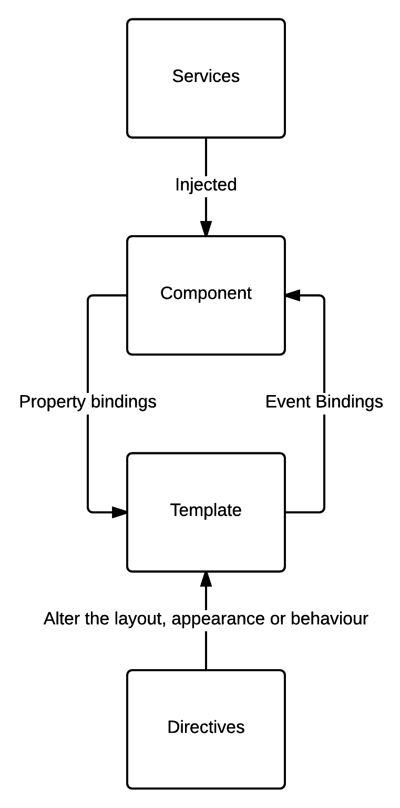
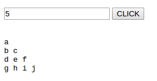
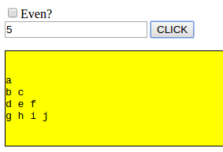
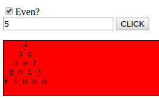
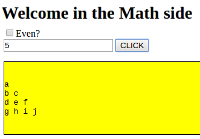

# 第二章：Angular 引导

在第一章之后，*Typescript 最佳实践*，我们可以深入了解 Angular 本身。Angular 的一个重点是大幅提高 Angular 应用程序的性能和加载时间，与 AngularJS 相比。性能改进是非常显著的。根据 Angular 团队和各种基准测试，Angular 2 比 Angular 1 快 5 到 8 倍。

为了实现这种改进，谷歌工程师并没有在 AngularJS 的基础上进行开发；相反，他们从头开始创建了 Angular。因此，如果你已经使用 Angular 1 一段时间，这并不会在开发 Angular 应用程序时给你带来很大的优势。

在这一章中，我们将做以下事情：

+   我将首先介绍 Angular 背后的主要架构概念。

+   然后，我们将使用新引入的 Angular CLI 工具引导一个 Angular 应用程序，这将消除大部分入门的痛苦。网上有数百种 Angular 样板，选择一个可能会耗费大量时间。你可以在 GitHub 上找到各种风格的样板，带有测试、带有库、用于移动设备、带有构建和部署脚本等等。

尽管社区的多样性和热情是一件好事，但这意味着没有两个 Angular 项目看起来一样。事实上，这两个项目很可能是用不同的样板创建的，或者根本没有使用样板。为了解决这个问题，Angular 团队现在提出了 angular CLI。Angular CLI 是一个命令行 node 包，允许开发人员基于官方样板创建新的应用程序。这个工具还提供了一些有用的功能，比如创建 Angular 应用程序的不同构建模块，构建、测试和压缩你的应用程序。它甚至支持用一个简短的命令将你的应用程序部署到 GitHub 页面上。

这仍然是一个新工具，它有许多缺点和未完善的行为。

# 架构概述

在这一部分，我将介绍 Angular 应用程序的主要构建模块：服务、组件、模板和指令。我们还将学习依赖注入、装饰器和区域解决了哪些问题。

现在，如果你从（虚拟）书架上拿起这本书，你很可能有一些关于 Angular 的经验，并希望通过良好的实践和设计模式来改进你的应用程序。因此，你应该对 Angular 构建块的一般架构有一些了解。

然而，一个快速而务实的提醒不会有太大的伤害，我们可以确信我们有一个坚实的架构基础来构建我们的模式。

以下是主要的 Angular 2 构建块如何相互交互的概述：

Angular 2 应用程序的高级架构

接下来，我将通过创建一个操作 Floyd 数组的应用程序来介绍每个 Angular 2 构建块的示例。以下是一个基于字母的 Floyd 数组的示例：

```ts
 a 
 b c 
 d e f 
 g h i j 

```

我同意你不太可能在不久的将来构建处理 Floyd 数组的应用程序。然而，当学习新语言或框架时，Floyd 数组是一个很好的编程练习，因为它涉及用户输入、显示结果、循环和字符串操作。

# 组件

组件是我们 Angular 应用程序的视图，它们控制屏幕上的内容、时间和方式。它们采用一个简单的类的形式，定义了视图所需的逻辑。以下是一个简单组件的示例：

```ts
export class FloydComponent implements OnInit { 

 private floydString:string = ""; 
 private static startOfAlphabet = 97; 

 constructor() { } 

 ngOnInit() { 
 } 

 onClick(rows:number){ 

 let currentLetter = FloydComponent.startOfAlphabet; 
 for (let i = 0; i < rows; i++) { 
 for (let j = 0; j < i; j++) { 
 this.floydString += String.fromCharCode(currentLetter) + " "; 
 currentLetter++; 
 } 
 this.floydString += "\n\r"; 
 } 
 } 
}
```

请注意，组件类有一个后缀：`Component`。我将在下一章讨论原因。

这个名为`FloydComponent`的组件有两个私有成员：`floydString`和`startOfAlphabet`。`floydString`将包含表示第 n 个 Floyd 三角形的字符串，而`startOfAlphabet`则不断标记 ASCII 表中字母的位置。

`FloydComponent`还定义了一个构造函数，当用户请求我们组件管理的屏幕补丁时将被调用。目前，构造函数是空的。

最后，接受一个名为`rows`的数字参数的`onClick`方法将生成一个由`rows`行组成的 Floyd 三角形。总之，我们有一个管理展示 Floyd 三角形行为的视图的类。是的？嗯，视图部分有点缺失！我的用于客户端渲染的 HTML 在哪里？

在 Angular 中，我们的组件将控制的 HTML 部分被称为模板，我们可以使用元数据将模板链接到组件上：

```ts
import { Component } from '@angular/core'; 
@Component({ 
 selector: 'floyd', 
 template: 
 `<p> 
 <input #checkbox type="checkbox" value="even">Even?<br> 
 <input #rows type="text" name="rows"> 
 <button (click)="onClick(rows.value, checkbox.checked)">CLICK</button> 
 </p> 
 <pre> 

 {{floydString}} 
 </pre> 
 ` 
}) 
export class FloydComponent { 
```

那么，这一切到底是怎么回事？如果我们回顾一下`FloydComponent`的原始定义，没有任何地方指定`FloydComponent`是一个组件。我们没有像`FloydComponent`扩展/实现组件的任何东西，所以它只是一个普通的 typescript 类，什么都不是。更令人惊讶的是，根本没有 Angular 的引用；这个`FloydComponent`完全可以是 Angular 框架之外的一个 typescript 类。

元数据使用装饰器模式装饰`FloydComponent`类，因此 Angular 知道如何解释和处理`FloydComponent`类。

在任何面向对象的语言中，通过继承静态地扩展对象的责任是很容易的，但是在运行时动态地这样做是完全不同的。装饰器模式的目的是在对象上动态地添加额外的责任。

我们将在《第三章》《经典模式》中实现我们自己的装饰器。

注解本身是`@Component`，并使用一些参数使我们的类成为 Angular 组件。

注意`import { Component } from '@angular/core';`导入了`@angular/core`库中的`Component`模块。

第一个参数是一个`selector`，描述了我们的`FloydComponent`应该绑定到视图的哪个部分。在下面的 HTML 片段中，我们有`<floyd></floyd>`选择器标记，`FloydComponent`将绑定到它。第二个参数是模板字符串。模板字符串定义了在运行时将添加到 DOM 中的内容，位于`<floyd>`标记内部：

```ts
 <p> 
 <input #rows type="text" name="rows"> 
 <button (click)="onClick(rows.value)">CLICK</button> 
 </p> 
 <pre> 
 {{floydString}} 
 </pre>
```

反引号`允许我们在 JavaScript 中定义多行字符串。

首先，我们有`<input>`标记，看起来几乎像纯 HTML。唯一的特殊之处在于标记中的`#rows`属性。这个属性用于将标记引用为名为`rows`的变量。因此，我们可以在下面的标记中访问它的值：`<button (click)="onClick(rows.value)">CLICK</button>`。在这里，我们在模板和组件之间进行了事件绑定。当按钮被点击时，组件的`onClick`方法将被调用，并且输入的值将被传递给该方法。

在代码的下方，我们有`{{floydString}}`，这是从组件到模板的属性绑定。在这种情况下，我们将`floydString`组件属性绑定到模板上。换句话说，我们在 DOM 中显示`floydString`组件属性的内容。

我必须使用预先标记，以便`\n\r`在输出中得到保留。

总之，组件将其属性绑定到模板，而模板将其事件绑定到组件。运行此应用程序时可以期待以下截图：

Angular 2 中的 Floyd 数组在你这边不起作用吗？想要在 GitHub 上 fork 这段代码吗？你现在可以在[`bit.ly/angular2-patterns-chap2`](http://bit.ly/angular2-patterns-chap2)看到整个应用程序。

# 服务

到目前为止，我们已经审查了 Angular 2 的四个构建块中的两个。剩下的两个是服务和指令。接下来我们将审查服务。服务是具有独特目的的类，它们应尽可能地具有内聚性，以便为应用程序的其他部分提供狭窄而明确定义的服务。从设计的角度来看，对于我们的 Floyd 三角形应用程序来说，将`FloydComponent.onClick`方法的内容放在一个服务中可能会更好。实际上，`floydString`字符串的计算不应该出现在管理视图的组件中。

组件应该只负责用户体验——将属性绑定到模板——其他所有事情都应该委托给服务。我们可以创建一个三角形服务，负责*鼓掌*创建像 Floyd 三角形这样的奇怪三角形。我们还可以让这个服务负责生成 Floyd 三角形，输出看起来像一棵树：

```ts
 a 
 b c 
 d e f 
 g h i j 

```

而不是：

```ts
 a 
 b c 
 d e f 
 g h i j 
```

这样的服务看起来会像下面这样：

```ts
import { Injectable } from '@angular/core'; 

@Injectable() 
export class TriangleService { 

 private static startOfAlphabet = 97; 

 constructor() {} 

 /** 
 * Computes a Floyd Triangle of letter.
 * Here's an example for rows = 5 
 * 
 * a 
 * b c 
 * d e f 
 * g h i j 
 * 
 * Adapted from http://www.programmingsimplified.com/c-program-print-floyd-triangle 
 * 
 * @param  {number} rows 
 * @return {string}
 */ 
 public floydTriangle(rows:number):string{ 

 let currentLetter = TriangleService.startOfAlphabet; 
 let resultString = ""; 

 for (let i = 0; i < rows; i++) { 
 for (let j = 0; j < i; j++) { 
 resultString += String.fromCharCode(currentLetter) + " "; 
 currentLetter++; 
 } 
 resultString += "\n\r"; 
 } 

 return resultString; 
 } 

 /** 
 * Computes a Even Floyd Triangle of letter. 
 * Here's an example for rows = 7 
 *       a 
 *      b c 
 *     d e f 
 *    g h i j 
 *   k l m n o 
 *  p q r s t u 
 * v w x y z { | 
 * 
 * @param  {number} rows 
 * @return {string} 
 */ 
 public evenFloydTriangle(rows:number):string{ 

 let currentLetter = TriangleService.startOfAlphabet; 
 let resultString = ""; 

 for (let i = 0; i < rows; i++) { 

 for (let j = 0; j <= (rows-i-2); j++) { 
 resultString += " "; 
 } 

 for (let j = 0; j <= i; j++) { 
 resultString += String.fromCharCode(currentLetter) + " "; 
 currentLetter++; 
 } 

 resultString+="\n\r"; 
 } 

 return resultString; 
 } 
 } 

```

`TriangleService`是一个简单的类，提供两种方法：`floydTriangle`和`evenFloydTriangle`。`evenFloydTriangle`有一个额外的 for 循环，用于在三角形的不同行添加前导空格。业务应用现在位于一个专用的服务上，我们可以在`FloydComponent`上使用它。在`FloydComponent`中使用我们的服务的正确方法是通过依赖注入。依赖注入是一个过程，通过该过程，请求类会动态地获得所请求类的一个完整形式的实例。将这个相当技术性的定义应用到我们的上下文中，`FloydComponent`在实例化时将获得`TriangleService`的一个实例。

要在 Angular 中使用依赖注入，我们需要为`TriangleService`定义一个提供者。我们可以在应用程序级别这样做：

```ts
import { TriangleService } from './app/triangle.service' 

bootstrap(FloydComponent, [TriangleService]); 
```

或者，我们可以在组件注解中定义提供者，以在组件级别进行此操作：

```ts
import { Component, OnInit, ViewEncapsulation } from '@angular/core'; 
import { TriangleService } from '../triangle.service' 

@Component({ 
 selector: 'floyd', 
 template:   `<p> 
 <input #checkbox type="checkbox" value="even">Even?<br> 
 <input #rows type="text" name="rows"> 
 <button (click)="onClick(rows.value, checkbox.checked)">CLICK</button> 
 </p> 
 <pre> 

 {{floydString}} 
 </pre> 
 `, 
 styleUrls: ['./floyd.component.css'], 
 providers: [TriangleService], 
 encapsulation: ViewEncapsulation.None 
}) 
export class FloydComponent implements OnInit { 
```

如果在应用程序级别创建提供者，那么`TriangleService`的相同实例将提供给任何请求它的人。然而，在组件级别，每次实例化该组件时都会创建一个新的`TriangleService`实例并提供给该组件。这两种情况都是有道理的。这取决于你的组件和你的服务在做什么。例如，我们将在第七章中实现的日志服务没有自己的状态，并且被应用程序的每个模块使用。因此，我们可以使用基于应用程序的提供者。反例是来自第五章的*Circuit breaker*模式，*稳定性模式*，它具有内部状态，因此是组件级别的。

最后一步是修改我们的`FloydComponent`构造函数，使其看起来像这样：

```ts
 constructor(private triangleService:TriangleService) { 
 }
```

在这里，我们为我们的`FloydComponent`定义了一个名为`triangleService`的私有成员，它将被用作注入的依赖项的占位符。

此外，我们在模板中添加一个复选框，用于确定我们是要一个偶数还是一个普通的 Floyd 数组：

```ts
<input #rows type="text" name="rows"> 
 <button (click)="onClick(rows.value, checkbox.checked)">CLICK</button> 
```

我们还可以修改`onClick`方法以使用我们的`TriangleService`。最终组件看起来像这样：

```ts

import { Component, OnInit, ViewEncapsulation } from '@angular/core'; 
import { TriangleService } from '../triangle.service' 

@Component({ 
 selector: 'floyd', 
 template:   `<p> 
 <input #checkbox type="checkbox" value="even">Even?<br> 
 <input #rows type="text" name="rows"> 
 <button (click)="onClick(rows.value, checkbox.checked)">CLICK</button> 
 </p> 
 <pre> 
 {{floydString}} 
 </pre> 
 `, 
 styleUrls: ['./floyd.component.css'], 
 providers: [TriangleService], 
 encapsulation: ViewEncapsulation.None 
}) 
export class FloydComponent implements OnInit { 

 private floydString:string = ""; 
 private static startOfAlphabet = 97; 

 constructor(private triangleService:TriangleService) { } 

 ngOnInit() { 
 } 

 onClick(rows:number, checked:boolean){ 

 if(checked){ 
 this.floydString = this.triangleService.evenFloydTriangle(rows); 
 }else{ 
 this.floydString = this.triangleService.floydTriangle(rows); 
 } 
 } 
} 

```

应用程序的当前状态可以在这里看到：[`bit.ly/angular2-patterns-chap2-part2`](http://bit.ly/angular2-patterns-chap2-part2)。

# 指令

结束我们快速的架构概述，我们将创建一个指令来增强我们相当单调的预标记。指令与模板以及它们的父组件进行属性和事件绑定交互。我们将创建一个指令，为我们的预标记添加样式。样式包括 1 像素边框，并将背景颜色更改为红色或黄色，分别用于偶数或奇数的 Floyd 数组。

首先，我们需要一种方法来询问用户希望使用哪种类型的数组。让我们在`FloydComponent`的模板中添加另一个输入，并修改`onClick`方法，使其接受第二个参数：

```ts
import { Component } from '@angular/core'; 
import { TriangleService } from '../triangle.service'; 
@Component({ 
 selector: 'floyd', 
 template: 
 `<p> 
 <input #checkbox type="checkbox" value="even">Even?<br> 
 <input #rows type="text" name="rows"> 
 <button (click)="onClick(rows.value, checkbox.checked)">CLICK</button> 
 </p> 
 <pre> 

 {{floydString}} 
 </pre> 
 `, 
 providers:   [TriangleService] 
}) 
export class FloydComponent { 

 private floydString:string = ""; 
 private color:"yellow" | "red"; 

 constructor(private triangleService:TriangleService) { 

 } 

 onClick(rows:number, even:boolean){ 

 if(even){ 
 this.floydString = this.triangleService.evenFloydTriangle(rows); 
 }else{ 
 this.floydString = this.triangleService.floydTriangle(rows); 
 } 

 } 

} 
```

然后，我们可以创建指令。它将如下所示：

```ts
import { Directive, Input, ElementRef, HostListener } from '@angular/core'; 

@Directive({ 
 selector: '[AngularPre]' 
}) 
export class AngularPre { 

 @Input() 
 highlightColor:string; 

 constructor(private el: ElementRef) { 
 el.nativeElement.style.border = "1px solid black"; 
 el.nativeElement.style.backgroundColor = this.highlightColor; 
 } 

 @HostListener('mouseenter') onMouseEnter() { 
 this.highlight(this.highlightColor); 
 } 

 @HostListener('mouseleave') onMouseLeave() { 
 this.highlight(null); 
 } 

 private highlight(color: string) { 
 this.el.nativeElement.style.backgroundColor = color; 
 } 

}
```

这里发生了很多事情。首先，我们有带有选择器的指令注释。选择器将用于表示给定的 HTML 标记取决于指令。在我们的例子中，我选择将指令命名为`AngularPre`，并为选择器使用相同的名称。它们可以不同；这取决于你。但是，选择器和类具有相同的名称是有意义的，这样你就知道当你的指令出现问题时应该打开哪个文件。

然后，我们有非常有趣的`@Input()`注释`highlightColor:string;`成员。在这里，我们指定`highlightColor`字符串的值实际上绑定到父组件的变量。换句话说，父组件将不得不指定它希望预标记突出显示的颜色。在构造函数中，指令通过注入接收了一个`ElementRef`对象。这个`ElementRef`代表了您的指令作用的 DOM。最后，我们在`mouseenter`和`mouseleave`上定义了两个`HostListener`，它们将分别开始和停止预标记的突出显示。

要使用这个指令，我们必须在`FloydComponent`模板的预标记中插入其选择器，如下所示：

```ts
<pre AngularPre [highlightColor]="color"> 
 {{floydString}} 
</pre> 
```

在这里，我们指定我们希望我们的预标记受到`AngularPre`选择器的影响，并将调用指令的`highlightColor`变量与`FloydComponent`的颜色变量绑定。这是带有颜色变量和`onClick`方法的`FloydComponent`，所以它改变颜色变量的值：

```ts
export class FloydComponent { 

 private floydString:string = ""; 
 private color:"yellow" | "red"; 

 constructor(private triangleService:TriangleService) { 

 } 

 onClick(rows:number, even:boolean){ 

 if(even){ 
 this.floydString = this.triangleService.evenFloydTriangle(rows); 
 this.color = "red"; 
 }else{ 
 this.floydString = this.triangleService.floydTriangle(rows); 
 this.color = "yellow"; 
 } 

 } 

} 
onClick modifies the color variable 
```

这是应用程序使用奇数数组的样子：

奇数 Floyd 数组结果

这是偶数数组的样子：

甚至弗洛伊德数组结果该应用程序可在此处下载：[`bit.ly/angular2-patterns-chap2-part3`](http://bit.ly/angular2-patterns-chap2-part3)。

# 管道

我想在这里解释的最后两个构建块是管道和路由。管道很棒。它们允许我们创建一个专门的类，将任何输入转换为所需的输出。在 Angular 中，管道遵循 Unix 管道编程范式，其中信息可以从一个进程传递到另一个进程。我们可以在基于弗洛伊德三角形的应用程序中创建一个管道，该管道将在每次遇到换行序列（如`\n\r`）时将任何给定的弗洛伊德字符串转换为包含段落`¶`（`244，&para;`）的 ASCII 字符：

```ts
import { Pipe, PipeTransform } from '@angular/core'; 

@Pipe({ 
 name: 'paragraph' 
}) 
export class ParagraphPipe implements PipeTransform { 

 transform(value: string): string { 

 return value.replace( 
 new RegExp("\n\r", 'g'), 
 "¶ \n\r" 
 ); 
 } 

} 
```

管道使用`@Pipe`注解进行装饰，非常类似于组件和指令。现在，与管道相比，与组件和指令相比的区别在于，除了装饰注解之外，我们还必须实现 Angular 框架提供的一个接口。这个接口被命名为`PipeTransform`，并定义了每个实现它的类必须具有的单个方法：

```ts
transform(value: any, args?:any): any 
```

该方法的实际签名由任何类型组成，因为管道可以用于一切，不仅仅是字符串。在我们的情况下，我们想要操作一个字符串输入并获得一个字符串输出。我们可以在不违反接口合同的情况下，细化`transform`方法的签名，如下所示：

```ts
transform(value: string): string 
```

在这里，我们只期望一个字符串参数并产生一个字符串输出。该方法的主体包含一个全局正则表达式，匹配所有的`\n\r`序列并添加`¶`。

要在`FloydComponent`中使用`ParagraphPipe`，我们必须修改模板如下：

```ts
 `<p> 

 <input #checkbox type="checkbox" value="even">Even?<br> 

 <input #rows type="text" name="rows"> 

 <button (click)="onClick(rows.value, checkbox.checked)">CLICK</button> 

 </p> 

 <pre AngularPre [highlightColor]="color"> 

 {{floydString | paragraph}} 

 </pre> 
```

`floydString`通过`|`运算符传递给`ParagraphPipe`。这是它的样子：

将 floydString 管道化以获得段落标记

段落管道硬编码段落符号让我有点烦。如果我想要根据每次使用来更改它怎么办？嗯，Angular 正在处理许多额外的管道参数。我们可以修改`transform`方法如下：

```ts
 transform(value: string, paragrapheSymbol:string): string { 

 return value.replace( 

 new RegExp("\n\r", 'g'), 

 paragrapheSymbol + "\n\r" 

 ); 

 } 

```

此外，我们可以这样调用管道：

```ts
{{floydString | paragraph: "¶"}} 

```

在这里，`transform`方法的第一个参数将是`floydString`，而第二个参数将是段落符号。

如果我们考虑一下，我们目前正在为 Typescript 实现`replaceAll`函数，除了目标（`\n\r`是硬编码的）。让我们创建一个名为`replaceAll`的管道，它将目标替换和替换作为参数。唯一的问题是`PipeTransform`接口定义了一个带有两个参数的 transform 方法，第二个参数是可选的。在这里，我们需要三个参数：要转换的字符串，要在字符串中替换的目标，以及目标的替换。如果你尝试使用三个参数来定义一个 transform 方法，那么你将违反`PipeTransform`的约定，你的 Typescript 将不再编译。为了克服这个小问题，我们可以定义一个名为`replace`的内联类型，它将包含两个成员，`from`和`to`，它们都是字符串：

```ts
transform(value: string, replace: {from:string, to:string}): string 
To call it inside the FloydComponent we can do the following: 

{{floydString | replaceAll: {from:'\\n\\r', to:'¶ \\n\\r'} }}
```

在这里，我们使用`\\n\\r`作为字符串模式，因为我们还没有构建`RegExp`。因此，`\`需要转义`\n`和`\r`。

这是`replaceAll`管道的代码：

```ts
import { Pipe, PipeTransform } from '@angular/core'; 

@Pipe({ 
 name: 'replaceAll' 
}) 
export class ReplaceAllPipe implements PipeTransform { 

 transform(value: string, replace: {from:string, to:string}): string { 

 return value.replace( 
 new RegExp(replace.from, 'g'), 
 replace.to 
 ); 

 } 

} 
```

不错，对吧？我们已经填补了 JavaScript 的一个缺点，即`replaceAll`功能，以一种模块化和高效的方式。这个`replaceAll`管道将在你的应用程序中随处可用：

```ts
@Component({ 
 selector: 'floyd', 
 template:   `<p> 
 <input #checkbox type="checkbox" value="even">Even?<br> 
 <input #rows type="text" name="rows"> 
 <button (click)="onClick(rows.value, checkbox.checked)">CLICK</button> 
 </p> 
 <pre AngularPre [highlightColor]="color"> 
 {{floydString | replaceAll: {from:'\\n\\r', to:'¶ \\n\\r'} }} 
 </pre> 
 `, 
 styleUrls: ['./floyd.component.css'], 
 providers: [TriangleService], 
 encapsulation: ViewEncapsulation.None 
}) 
export class FloydComponent implements OnInit {
```

关于管道的最后一件事是，你可以像在 Unix 控制台中一样组合它们。例如，我们完全可以做以下事情，其中段落管道首先添加`¶`到所有行的末尾。然后，`replaceAll`管道介入并替换所有的`¶`为`¶`管道：

```ts
{{floydString | paragraph:'¶' | replaceAll: {from:'¶', to:'¶ piped'} }} 
```

应用程序的当前状态可以在这里下载：[`bit.ly/angular2-patterns-chap2-part5`](http://bit.ly/angular2-patterns-chap2-part5)。

# 路由

路由使得在 Angular 视图之间进行导航成为可能。在这个教程中，我们将了解它们，并在一个小应用程序的框架内看到它们的运作。

# Angular CLI

**Angular CLI**是一个非常简单但非常有用的 node 包，它采用命令行工具的形式。这个工具的目的是消除大部分与 Angular 2 开始的痛苦。基于框架的任何应用程序的问题是如何为你的代码引导事物，以便与框架的特性和库进行顺畅的通信。

这个工具是由 Angular 团队直接提供的，它为即将启动的应用程序提供了可用的蓝图。实际上，通过使用一个简单的命令，我们可以生成一个完整的 Angular 样板，可以进行转译、本地运行、测试，甚至部署到 GitHub 页面。

# 安装

安装 Angular CLI 非常简单，因为它是一个 `node` 包。无论您使用什么操作系统，以下命令都可以工作：

```ts
npm install -g angular-cli 
```

如果您使用的是基于 Unix 的系统，全局安装可能需要 `sudo`。

# 创建一个新的应用程序

一旦安装了 Angular CLI，我们就可以通过使用 `ng new` 命令来生成一个新的 Angular 应用程序。

```ts
ng new MyApp 
```

这个命令将为您的应用程序创建一个空的样板，并获取每个所需的节点模块。

请注意，根据您的互联网连接，这个命令可能需要一段时间才能完成。实际上，需要获取的节点包很多，这进一步证明了这样一个工具的必要性。

在新创建的文件夹的根目录，您可以找到以下文件和文件夹：

+   `Angular-cli-build.js`：用于构建应用程序的配置文件。

+   `config`：测试环境的配置文件夹。

+   `Node_modules`：所需的不同的节点模块。当我写下这些文字时，Angular CLI 的当前版本已经在 node-modules 目录中有 60,886 个文件和文件夹。

+   `Public`：包含应用程序公共部分。

+   `tslint.json`：您的 linter 的配置。我们将在下一章中对其进行配置。

+   `typings.json`：Typings 依赖。

+   `angular-cli.json`：应用程序的一些配置。

+   `e2e`：e2e 配置。

+   `package.json`：应用程序的依赖项。

+   `src`**:** 您的源代码。

+   `typings`：所需的 typings。

毫无疑问，我们将花费最多时间的文件夹是 `src` 文件夹，因为它包含了 TypeScript 源代码。创建后，它里面包含以下内容：

```ts
src 

├── app 

│   ├── environment.ts 

│   ├── index.ts 

│   ├── my-app.component.css 

│   ├── my-app.component.html 

│   ├── my-app.component.spec.ts 

│   ├── my-app.component.ts 

│   └── shared 

│       └── index.ts 

├── favicon.ico 

├── index.html 

├── main.ts 

├── system-config.ts 

```

```ts
├── tsconfig.json 

└── typings.d.ts 
```

正如您所看到的，这里有一个 `app` 文件夹，里面已经包含了一个名为 `my-app` 的组件，还有一个共享文件夹，可以用来在不同的应用程序之间共享资源。然后，我们有包含以下内容的 `index.html`：

```ts
<!doctype html> 
<html lang="en"> 
<head> 
 <meta charset="utf-8"> 
 <title>Chap2</title> 
 <base href="/"> 

 <meta name="viewport" content="width=device-width, initial-scale=1"> 
 <link rel="icon" type="image/x-icon" href="favicon.ico"> 
</head> 
<body> 
 <app-root></app-root> 
</body> 
</html> 

```

在这个 `index.html` 中，插入了 `<app-root></app-root>` 标记，并将所需的文件加载到脚本中。

另一个重要的地方是 `main.ts` 文件，它包含了应用程序的引导行：

```ts
import { enableProdMode } from '@angular/core'; 
import { platformBrowserDynamic } from '@angular/platform-browser-dynamic'; 

import { AppModule } from './app/app.module'; 
import { environment } from './environments/environment'; 

if (environment.production) { 
 enableProdMode(); 
} 

platformBrowserDynamic().bootstrapModule(AppModule) 
 .catch(err => console.log(err)); 

```

在这里，`MyAppAppComponent` 组件被导入并用作我们应用程序的顶层或根组件。这是将首先实例化的组件。

# 生成

目前，我们的应用程序并不是特别令人兴奋；它只会在`h1`标记中显示`my-app works!`。

如果我们想要向这个样板添加组件、指令、服务和管道，我们必须使用`generate`命令。以下是一个生成名为`Floyd`的新组件的示例：

```ts
ng generate component Floyd 
```

作为回应，Angular CLI 创建了一个名为`Floyd`的新文件夹和我们组件所需的文件：

```ts
src/app 

├── environment.ts 

├── Floyd 

│   ├── floyd.component.css 

│   ├── floyd.component.html 

│   ├── floyd.component.spec.ts 

│   ├── floyd.component.ts 

│   └── index.ts 

├── index.ts 

├── my-app.component.css 

├── my-app.component.html 

├── my-app.component.spec.ts 

├── my-app.component.ts 

└── shared 

 └── index.ts 
```

我们可以使用指令、服务或管道来执行相同的操作，而不是组件。

Angular CLI 中的每个关键字都可以通过仅使用单词的第一个字母来缩写。因此，生成另一个名为`Pascal`的组件将会是`ng g c Pascal`。

# 服务

我们的应用程序中有许多组件、服务、指令和管道，我们已经准备好看到结果了。幸运的是，Angular CLI 可以构建您的应用程序，并使用命令`ng serve`启动 Web 服务器。

然后，您可以在`localhost:4200`上查看您的应用程序。

您的文件正在被 Angular CLI 监视。每当您对文件进行更改时，Angular CLI 将重新编译它并刷新您的浏览器。

# 部署

准备让您的应用程序上线了吗？`ng build`就是您要找的。这个命令将创建一个`dist`目录，您可以将其推送到任何能够提供 HTML 页面的服务器上。甚至可以放在 GitHub 页面上，这不会花费您一分钱。

# 总结

在本章中，我们已经完成了对 Angular 构建模块的概述，并看到它们是如何相互交互的。我们还创建了一个相对简单的应用程序来操作 Floyd 数组。最后，我们学会了如何使用 Angular CLI 来使用命令行创建新应用程序、组件、服务、指令和管道。

在下一章中，我们将专注于 Angular 的最佳实践。我们将以实际的方式了解谷歌工程师推荐的“做”和“不做”。
