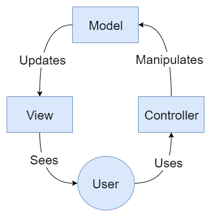
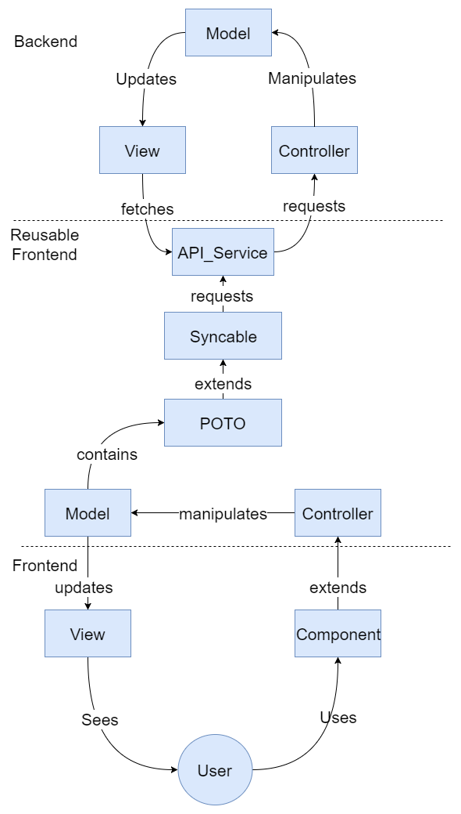
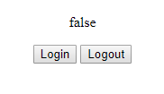

# 第四章：导航模式

在本章中，我们将探讨一些最有用的导航面向对象模式，并学习如何在 Angular 方式中应用它们。导航模式用于组织与用户在我们应用程序上的导航相关的事件。

Angular 本身是一个面向对象的框架，它强制你以某种方式进行大部分开发。例如，你需要有组件、服务、管道等。强制这些构建块对你有利，有助于构建良好的架构，就像 Zend 框架对 PHP 或 Ruby on Rails 对 Ruby 所做的那样。当然，此外，框架还能让你的生活更轻松，加快开发时间。

虽然 Angular 的设计方式远远超出平均水平，但我们总是可以做得更好。我并不认为我在本章中提出的是最终设计，你将能够用它们解决从面包店单页到火星一号任务的仪表板的任何问题——不幸的是，这样的设计并不存在，但它肯定会提高你的工具箱。

在这一章中，我们将学习以下模式：

+   模型-视图-控制器

+   Redux

# MVC

哦，MVC，老朋友 MVC。多年来你为我们效力。现在，人们希望你退休，最好不要闹腾。即使我也能看到，年轻的、单向的用户界面架构可以比你更聪明，让你看起来像过去的遗物。

在本节中，我们将首先描述模型-视图-控制器是什么，不管用什么编程语言来实现它，然后我们将看到将 MVC 应用于前端编程的缺点。最后，我将介绍一种在 Angular 中实现 MVC 的方法，这种方法在实现、维护和性能方面是有意义的。

# 大型的模型-视图-控制器

模型-视图-控制器设计模式背后的整个原则相对简单。事实上，如下图所示，它由三个块组成：模型、视图和控制器：

模型-视图-控制器概述

组件如下：

+   模型根据控制器发送的命令存储应用程序所需的数据。

+   控制器接收用户的操作（例如按钮的点击）并相应地指导模型更新。它还可以在任何给定时刻切换使用的视图。

+   视图在模型更改时生成并更新。

就是这样。

让我们看看纯 TypeScript 中简单的 MVC 实现会是什么样子。

首先，让我们像在第三章中那样定义一个`Movie`类，*经典模式*。在这个版本的`Movie`类中，我们只有两个属性：`title`和`release_year`，它们是使用 TypeScript 构造函数定义的：

```ts
class Movie{ 

    constructor(private title:string, private release_year:number){} 

    public getTitle():string{ 
        return this.title; 
    } 
    public getReleaseYear():number{ 
        return this.release_year; 
    } 
} 
```

然后，我们定义一个`Model`类，它使用`reference`关键字导入包含`Movie`类的`movie.ts`文件。这个模型类将负责更新视图，它有一个电影数组和两个方法。第一个方法`addMovie(title:string, year:number)`是`public`的，它在`movies`属性的末尾添加一个新电影。它还调用类的第二个方法`appendView(movie:Movie)`，这个方法是`private`的。这个第二个方法按照模型-视图-控制器的定义来操作视图。视图操作相当简单：我们在视图的`#movie`元素中添加一个新的`li`标签。新创建的`li`标签的内容是电影标题和发行年份的连接。

```ts
/// <reference path="./movie.ts"/> 

class Model{ 

    private movies:Movie[] = []; 

    constructor(){ 
    } 

    public addMovie(title:string, year:number){ 
        let movie:Movie = new Movie(title, year); 
        this.movies.push(movie); 
        this.appendView(movie); 
    } 

    private appendView(movie:Movie){ 
        var node = document.createElement("LI");  
        var textnode = document.createTextNode(movie.getTitle() + "-" + movie.getReleaseYear());  
        node.appendChild(textnode); 
        document.getElementById("movies").appendChild(node); 
    } 

} 
```

现在我们可以为我们的纯 TypeScript 模型-视图-控制器定义一个控制器。控制器有一个`private model:Model`属性，在构造函数中初始化。此外，定义了一个`click`方法。此方法以参数形式接受`string`和`number`，分别用于标题和发行年份。正如你所看到的，`click`方法将标题和发行年份转发给模型的`addMovie`方法。然后，控制器的工作就完成了。它不操作视图。你还会注意到`controller.ts`文件的最后一行：`let controller = new Controller();`。这行允许我们创建一个控制器的实例，以便视图可以绑定到它：

```ts

/// <reference path="./model.ts"/> 

class Controller{ 

    private model:Model; 

    constructor(){ 

        this.model = new Model(); 
    } 

    click(title:string, year:number){ 

        console.log(title, year); 
        this.model.addMovie(title, year); 

    } 

} 
let controller = new Controller(); 
```

我们模型-视图-控制器实现的最后一部分将是视图。我们有一个简单的 HTML 表单，提交时会调用以下操作：`controller.click(this.title.value, this.year.value); return false;`。`controller`已在`controller.ts`文件中定义为`let controller = new Controller();`。然后，对于参数，我们发送`this.title.value`和`this.year.value`，其中`this`指的是`<form>`。`title`和`year`分别指电影的标题和发行年份的字段。我们还必须添加`return false;`以防止页面重新加载。确实，HTML 表单在提交时的默认行为是导航到操作 URL：

```ts
<html> 
    <head> 
        <script src="mvc.js"></script> 
    </head> 
    <body> 
        <h1>Movies</h1> 

        <div id="movies"> 

        </div> 

        <form action="#" onsubmit="controller.click(this.title.value, this.year.value); return false;"> 

            Title: <input name="title" type="text" id="title"> 
            Year: <input name="year" type="text" id="year"> 
           <input type="submit"> 
        </form> 

    </body> 
</html> 
```

在页眉中，我们添加了通过以下命令生成的`mvc.js`脚本：`tsc --out mvc.js controller.ts model.ts movie.ts`。生成的 JavaScript 如下所示：

```ts
var Movie = /** @class */ (function () { 
    function Movie(title, release_year) { 
        this.title = title; 
        this.release_year = release_year; 
    } 
    Movie.prototype.getTitle = function () { 
        return this.title; 
    }; 
    Movie.prototype.getReleaseYear = function () { 
        return this.release_year; 
    }; 
    return Movie; 
}()); 
/// <reference path="./movie.ts"/> 
var Model = /** @class */ (function () { 
    function Model() { 
        this.movies = []; 
    } 
    Model.prototype.addMovie = function (title, year) { 
        var movie = new Movie(title, year); 
        this.movies.push(movie); 
        this.appendView(movie); 
    }; 
    Model.prototype.appendView = function (movie) { 
        var node = document.createElement("LI"); 
        var textnode = document.createTextNode(movie.getTitle() + "-" + movie.getReleaseYear()); 
        node.appendChild(textnode); 
        document.getElementById("movies").appendChild(node); 
    }; 
    return Model; 
}()); 
/// <reference path="./model.ts"/> 
var Controller = /** @class */ (function () { 
    function Controller() { 
        this.model = new Model(); 
    } 
    Controller.prototype.click = function (title, year) { 
        console.log(title, year); 
        this.model.addMovie(title, year); 
    }; 
    return Controller; 
}()); 
var controller = new Controller(); 
```

在执行方面，在加载时，HTML 页面将如下截图所示：

加载点处的模型-视图-控制器

然后，如果您使用表单并添加电影，它将自动影响视图并显示新的电影：

使用表单后的模型-视图-控制器

# 前端的模型-视图-控制器的限制

那么，为什么模型-视图-控制器模式在前端编程中并不被广泛使用，尤其是在像 Angular 这样的框架支持的情况下？首先，如果您正在使用 Angular 开发提供服务的应用程序，您很可能会有一个后端，您需要与其交换某种信息。然后，如果您的后端也使用模型-视图-控制器设计模式，您将得到以下层次结构：

前端和后端的模型-视图-控制器

在这个层次结构中，我们在另一个 MVC 实现的顶部有一个 MVC 实现。这些实现通过一个 API 服务进行通信，该服务向后端控制器发送请求并解析生成的视图。具体示例是，如果用户需要在您的应用程序中登录，他们将在前端看到“登录”视图，该视图由“用户”模型和“登录”控制器提供支持。一旦所有信息（电子邮件地址，密码）都已输入，用户点击登录按钮。这个点击触发了模型更新，然后模型使用 API 服务触发 API 调用。API 服务向您的 API 的“用户/登录”端点发出请求。在后端，请求被“用户”控制器接收并转发到“用户”模型。后端“用户”模型将查询您的数据库，以查看是否有提供的电子邮件地址和密码匹配的用户。最后，如果登录成功，将输出一个视图，其中包含用户信息。回到前端，API 服务将解析生成的视图并将相关信息返回给前端“用户”模型。然后，前端“用户”模型将更新前端“视图”。

对于一些开发者来说，这么多层次以及架构在前端和后端之间的重复似乎有些不对，尽管它通过明确定义的关注点分离带来了可维护性。

双重模型-视图-控制器不是唯一的问题。另一个问题是，前端模型不会是*纯*模型，因为它们必须考虑到与 UI 本身相关的变量，比如可见标签、表单有效性等。因此，你的前端模型往往会变成代码的丑陋堆积，其中 UI 变量与用户的实际表示相互交织。

现在，像往常一样，你可以避免这些陷阱，并利用 MVC 模式的优势。让我们在下一节中看看如何做到这一点。

# Angular 的模型-视图-控制器

在这一部分，我提出了一个在 Angular 中证明有效的 MVC 架构。在过去的 18 个月里，我在`toolwatch.io`（Web、Android 和 iOS）上使用了这个架构。显然，我们在 Web 版本或移动应用上提出的功能是相同的，并且以相同的方式工作。改变的是视图和导航模式。

以下图表代表了整体架构：

Angular 的 MVC

从上到下，我们有后端、前端的可重用部分以及专门的前端（移动或 Web）。正如你所看到的，在后端，没有任何变化。我们保持了我们经典的 MVC。请注意，前端部分也可以与非 MVC 后端一起工作。

我们的模型将使用该服务通过一个假设的 JSON API 从远程数据库获取、放置和删除一个普通的 TypeScript 对象。

我们的`user` TypeScript 对象如下所示：

```ts
class User { 

    public constructor(private _email:string, private _password:string){} 

    get email():string{ 
        return this._password; 
    } 

    get password():string{ 
        return this._email; 
    } 

    set email(email:string){ 
        this._password = email; 
    } 

    set password(password:string){ 
        this._email = password; 
    } 
} 
```

这里没有太多花哨的东西；只是一个包含两个属性的普通 TypeScript 对象：`email:_string`和`password:_string`。这两个属性在构造函数中使用 TypeScript 内联声明样式进行初始化。我们还利用了 TypeScript 的 getter/setter 来访问`_password:string`和`_email:string`属性。你可能已经注意到，TypeScript 的 getter/setter 看起来像 C#属性。嗯，微软是 TypeScript 的主要工业研究者之一，所以这是有道理的。

我喜欢写作的简洁性，特别是与构造函数中的内联属性声明相结合时。然而，我不喜欢的是需要使用下划线变量名。问题在于，再一次强调，这个 TypeScript 将被转译为 JavaScript，在 JavaScript 中，变量和函数比如 Java 或 C#更加抽象。

实际上，在我们当前的示例中，我们可以调用`User`类的 getter 如下：

```ts
user:User = new User('mathieu.nayrolles@gmail.com', 'password');

 console.log(user.email); // will print mathieu.nayrolles@gmail.com
```

正如你所看到的，TypeScript 并不关心它调用的目标的类型。它可以是一个名为`email`的变量，也可以是一个名为`email()`的函数。无论哪种方式，它都可以工作。这些奇怪行为背后的基本原理是，对于面向对象的程序员来说，在 JavaScript 中，可以做以下操作是可以接受的：

```ts

 var email = function(){
 return "mathieu.nayrolles@gmail.com";
 }
 console.log(email);
```

因此，我们需要区分函数的实际变量与不同的名称，因此有了`_`。

现在我们有了一个经过验证的用户对象来操作，让我们回到我们的 MVC 实现。现在，我们可以有一个`user`模型来操作`user` POTO（普通的旧 TypeScript 对象）和图形界面所需的变量：

```ts
import { User } from '../poto/user'; 
import { APIService } from '../services/api.service'; 

export class UserModel{ 

    private user:User; 
    private _loading:boolean = false; 

 public constructor(private api:APIService){} 

    public signin(email:string, password:string){ 

        this._loading = true; 

        this.api.getUser(email, password).then( 

            user => { 
                this.user = user; 
                this._loading = false; 
            } 
        ); 
    } 

    public signup(email:string, password:string){ 

        this._loading = true; 
        this.api.postUser(email, password).then( 
            user => { 
                this.user = user; 
                this._loading = false; 
            }    
        ); 
    } 

    get loading():boolean{ 
        return this._loading; 
    } 

} 
```

我们的模型，名为`UserModel`，接收一个`APIService`的注入。`APIService`的实现留给读者作为练习。除了`APIService`之外，`UserModel`拥有`user:User`和`loading:bool`属性。`user:User`代表具体的用户，包括密码和电子邮件地址。然而，`loading:bool`将用于确定视图中是否应该显示加载旋转器。正如你所看到的，`UserModel`定义了`signin`和`signup`方法。在这些方法中，我们调用`APIService`的`getUser`和`postUser`方法，两者都接受一个用户作为参数，并返回一个包含已通过 JSON API 同步的用户的 promise。收到这些 promise 后，我们关闭`loading:bool`旋转器。

以下是`APIService`：

```ts
import { Injectable } from '@angular/core'; 
import { Http }  from '@angular/http'; 
import { User } from '../poto/user'; 
import { Observable } from 'rxjs/Rx'; 
import 'rxjs/Rx'; 
import { resolve } from 'dns'; 
import { reject } from 'q'; 

@Injectable() 
export class APIService { 

  private userURL:string = "assets/users.json"; 

  constructor(private http: Http) { } 

  /** 
   * Return a Promise to a USer matching id 
   * @param  {string}            email 
   * @param  {string}            password 
   * @return {Promise<User>}    
   */ 
  public getUser(email:string, password:string):Promise<User>{ 
      console.log('getUser', email, password); 

        return this.http.get(this.userURL) 
        /** 
         * Transforms the result of the http get, which is observable 
         * into one observable by item. */ 
        .flatMap(res => res.json().users) 
        /** 
         * Filters users by their email & password 
         */ 
        .filter((user:any)=>{ 
            console.log("filter", user); 
            return (user.email === email && user.password == password) 
        }) 
        .toPromise() 
        /** 
         * Map the json user item to the User model 
        */ 
        .then((user:any) => { 
            console.log("map", user);  
            return new User( 
                email, 
                password 
            ) 
        }); 
  }  

   /** 
   * Post an user Promise to a User 
   * @param  {string}            email 
   * @param  {string}            password 
   * @return {Promise<User>}    
   */ 
  public postUser(email:string, password:string):Promise<User>{ 

    return new Promise<User>((resolve, reject) => { 
        resolve(new User( 
            email, 
            password 
        )); 
    }); 
  } 

} 
```

`APIService`发出 HTTP 调用以解析包含用户信息的本地 JSON 文件：

```ts
{ 
    "users":[{ 
        "email":"mathieu.nayrolles@gmail.com", 
        "password":"password" 
    }] 
} 
```

`getUser(email:string, password:string):Promise<User>`和`postUser(email:string, password:string):Promise<User>`都使用了 promise，就像我们在上一章中展示的那样。

然后，还有控制器，它也将是 Angular 环境中的一个组件，因为 Angular 组件控制显示的视图等等：

```ts
@Component({
 templateUrl: 'user.html'
 })
 export class UserComponent{

 private model:UserModel;

 public UserComponent(api:APIService){

 this.model = new UserModel(api);
 }

 public signinClick(email:string, password:string){
 this.model.signin(email, password);
 }

 public signupClick(email:string, password:string){
 this.model.signup(email, password);
 }

 }
```

正如你所看到的，控制器（组件）非常简单。我们只有一个对模型的引用，并且我们接收一个注入的`APIService`来传递给模型。然后，我们有`signinClick`和`signupClick`方法，它们从视图接收用户输入并将其传递给模型。最后一部分，视图，看起来像这样：

```ts

 <h1>Signin</h1>

 <form action="#" onsubmit="signinClick(this.email.value, this.password.value); return false;">

 email: <input name="email" type="text" id="email">
 password: <input name="password" type="password" id="password">
 <input [hidden]="model.loading" type="submit">
 <i [hidden]="!model.loading" class="fa fa-spinner" aria-hidden="true"></i>
 </form>

 <h1>Signup</h1>

 <form action="#" onsubmit="signupClick(this.email.value, this.password.value); return false;">

 email: <input name="email" type="text" id="email">
 password: <input name="password" type="password" id="password">
 <input [hidden]="model.loading" type="submit">
 <i [hidden]="!model.loading" class="fa fa-spinner" aria-hidden="true"></i>
 </form>
```

在这里，我们有两种形式：一种用于登录，一种用于注册。这两种表单除了它们使用的`onsubmit`方法不同之外，它们是相似的。登录表单使用我们控制器的`signinClick`方法，注册表单使用`signupClick`方法。除了这两种表单，我们还在每个表单上有一个*font awesome*旋转器，只有当用户模型正在*加载*时才可见。我们通过使用`[hidden]`Angular 指令来实现这一点：`[hidden]="!model.loading"`。同样，当模型正在加载时，提交按钮也是隐藏的。

所以，这就是一个应用于 Angular 的功能性 MVC。

正如我在本节开头所说的，对我来说，Angular 中 MVC 模式的真正用处来自于它的可扩展性。事实上，利用 TypeScript 的面向对象方面（以及随之而来的内容）允许我们为不同的 Angular 应用程序专门化控制器和模型。例如，如果你像我一样有一个 Angular 网站和一个 Angular 移动应用程序，那么你可以在两边使用业务逻辑。当我们可以只有一个时，如果随着时间的推移，我们需要编写和维护两个登录、两个注册和两个所有内容，那将是一件遗憾的事情！

例如，在`toolwatch.io`，Web 应用程序使用标准的 Angular，我们使用 Ionic 和 Angular 构建了移动应用程序。显然，我们在移动应用程序（Android 和 iOS）和网站之间共享了大量前端逻辑。最终，它们倾向于实现相同的目的和功能。唯一的区别是使用的媒介来利用这些功能。

在下图中，我粗略地表示了一种更完整地利用 MVC 模式的方式，重点放在可重用性和可扩展性上：

Angular 的 MVC

再次强调，后端保持不变。我们在那里仍然有相同的 MVC 模式。作为提醒，后端的 MVC 模式完全取决于你，你可以利用前端的 MVC 模式与功能性的 Go 后端进行结合，例如。与此处公开的 MVC 的先前版本不同的是*可重用前端*部分的引入。在这部分中，我们仍然有一个负责消费我们的 JSON API 的 API 服务。然后，我们有一个实现了`IModel`接口的模型。

```ts

 export interface IModel{

 protected get(POTO):POTO;
 protected put(POTO):POTO;
 protected post(POTO):POTO;
 protected delete(POTO):boolean;
 protected patch(POTO):POTO;

 }
```

这个接口定义了必须在后续模型中实现的`put`、`post`、`delete`和`patch`方法。这些方法所接受的参数和返回的`POTO`类型是你程序中任何领域模型的母类。领域模型代表了你的业务逻辑中的可同步实体，比如我们之前使用的`User`。领域模型和模型-视图-控制器中的模型部分不应混淆。它们根本不是同一回事。在这种架构中，`User`会扩展`POTO`。

这次的模型（模型-视图-控制器）除了实现`IModel`接口之外，还包含了一个`POTO`。它还包含了你需要更新视图的变量和方法。模型本身的实现相当简单，就像我在本节前面展示的那样。然而，我们可以通过利用 TypeScript 的泛型特性来提升一些东西，设想以下情况：

```ts

 export class AbstractModel<T extends POTO> implements IModel{
 protected T domainModel;

 public AbstractModel(protected api:APIService){}

 protected get(POTO):T{
 //this.api.get ...
 };
 protected put(T):T{
 //this.api.put...
 };
 protected post(T):T{
 //this.api.post...
 };
 protected delete(T):boolean{
 //this.api.delete...
 };
 protected patch(T):T{
 //this.api.patch...
 };
 }

 export class UserModel extends AbstractModel<User>{

 public AbstractModel(api:APIService){
 super(api);
 }

 public signin(email:string, password:string){

 this._loading = true;

 this.get(new User(email, password)).then(

 user => {
 this.user = user;
 this._loading = false;
 }
 );
 }

 public signup(email:string, password:string){

 this._loading = true;
 this.post(new User(email, password)).then(
 user => {
 this.user = user;
 this._loading = false;
 } 
 );
 }
 //Only the code specialized for the UI ! 
 }
```

在这里，我们有一个通用的`AbstractModel`，它受到`POTO`的约束。这意味着`AbstractModel`泛型类的实际实例（在诸如 C++的语言中称为模板）受到了对专门化`POTO`的类的约束。换句话说，只有像`User`这样的领域模型才能被使用。到目前为止，关注点的分离以及其可重用性都非常出色。可重用部分的最后一部分是控制器。在我们的注册/登录示例中，它看起来会非常像这样：

```ts
export class UserController{

 public UserComponent(protected model:UserModel){
 }

 public signin(email:string, password:string){
 this.model.signin(email, password);
 }

 public signup(email:string, password:string){
 this.model.signup(email, password);
 }

 }
```

那么，为什么我们在这里需要一个额外的构建模块，为什么我们不能像我们在 Angular 模型-视图-控制器的简化版本中那样使用一个简单的 Angular 组件呢？嗯，问题在于，取决于你在 Angular 核心之上使用的是什么（Ionic、Meteor 等），组件并不一定是主要的构建模块。例如，在 Ionic2 世界中，你使用`Pages`，这是他们对经典组件的自定义版本。

因此，例如，移动部分会是这样的：

```ts
export class LoginPage extends UserController{

 public LoginPage(api:APIService){
 super(new UserModel(api));
 }

 //Only what's different on mobile !

 }
```

如果需要，您还可以扩展`UserModel`并添加一些专业化，就像前面的图表所示的那样。在浏览器端：

```ts
@Component({
 templateUrl: 'login.html'
 })
 export class LoginComponent extends UserController{

 public UserComponent(api:APIService){

 super(new UserModel(api));
 }

 //Only what's different on browser !

 }
```

您也可以再次扩展`UserModel`并添加一些专业化。唯一剩下的要涵盖的部分是视图。令我绝望的是，没有办法使用 extends 或样式文件。因此，除非移动应用程序和浏览器应用程序之间的 HTML 文件完全相同，否则我们注定会在客户端之间存在 HTML 文件的重复。根据经验，这种情况并不经常发生。

整个可重用的前端可以作为 Git 子模块、独立库或`NgModule`进行发布。我个人使用 git 子模块方法，因为它允许我在执行对共享前端进行修改时，在我正在工作的客户端上享受自动刷新，同时拥有两个单独的存储库。

请注意，这种模型-视图-控制器也适用于多个前端命中相同的后端，而不是多种类型的前端。例如，在电子商务设置中，您可能希望拥有不同品牌的网站来销售在同一个后端中管理的不同产品，就像 Magento 的视图所能实现的那样。

# Redux

Redux 是一种模式，可以让您以安全的方式管理事件和应用程序状态。它可以确保您的应用程序范围的状态，无论是由导航事件还是其他事件引起的，都在一个单一的不可访问的地方进行管理。

通常，应用程序的状态存储在 TypeScript 接口中。根据我们在上一节中使用的示例，我们将使用自定义的`APIService`来为用户实现登录/注销功能，该服务消耗 JSON。在我们的情况下，应用程序只有一个状态：`logged`。因此，接口看起来像这样：

```ts
export interface IAppState { 
    logged: boolean; 
} 
```

这个接口只包含一个单一的 logged 布尔值。对于这样一个常见的变量来说，拥有一个接口可能看起来有点多余，但是当您的应用程序开始增长时，您会发现它很方便。我们的应用程序的状态只能通过`Action`来操作。`Action`是 redux 框架中的一种事件类型，由`Reducer`触发和拦截。`Reducer`拦截这些动作并操作我们应用程序的状态。`Reducer`是唯一可以发生状态变化的地方。

现在我们已经快速概述了 redux 模式，现在是时候深入其实现了。首先，我们需要创建一个新的 Angular 项目并安装所需的包：

+   `**ng new ng-redux**`

+   `**cd ng-redux**`

+   `**npm install  – save redux @angular-redux/store**`

接下来，我们将创建我们的操作。作为提醒，操作是由应用程序触发的，并被`reducer`拦截，以便操作应用程序状态。在我们的应用程序中，我们只有两个操作，登录和注销：

```ts
import { Injectable } from '@angular/core'; 
import { Action } from 'redux'; 

@Injectable() 
export class LoginAction { 
  static LOGIN = 'LOGIN'; 
  static LOGOUT = 'LOGOUT'; 

  loggin(): Action { 
    return { type: LoginAction.LOGIN }; 
  } 

  logout(): Action { 
    return { type: LoginAction.LOGOUT }; 
  } 
} 
```

正如我们在前面的代码中所看到的，`LoginAction`类是一个 Angular 服务，因为它是可注入的。因此，我们架构的任何一个部分都可以通过 Angular 的自动依赖注入机制接收操作列表，这些机制在前一章中已经介绍过。还要注意的一点是，我们的两个操作都返回`Actions`。`action`类由一个`type`字段组成，我们使用静态字符串变量来填充它们。

列表上的下一个项目是`reducer`，它拦截触发的操作，并相应地操作我们应用程序的状态。`reducer`可以这样实现：

```ts
import { Action } from 'redux'; 
import { LoginAction } from './app.actions'; 

export interface IAppState { 
    logged: boolean; 
} 

export const INITIAL_STATE: IAppState = { 
  logged: false, 
}; 

export function rootReducer(lastState: IAppState, action: Action): IAppState { 
  switch(action.type) { 
    case LoginAction.LOGIN: return { logged: !lastState.logged }; 
    case LoginAction.LOGOUT: return { logged: !lastState.logged }; 
  } 

  // We don't care about any other actions right now. return lastState; 
}
```

目前，我们的`reducer`只管理两个操作：登录和注销。在接收到操作时，我们使用 switch 语句检查操作类型，然后简单地反转已登录状态的值。由于我们的接口，这是我们唯一可以修改应用程序状态的地方。乍一看，这可能被视为一个瓶颈和关注点分离不足。现在，瓶颈部分，也就是所有事情都发生在那里，是有意设计的。Redux 背后的主要思想是，复杂的有状态 JavaScript 应用程序很难管理，因为应用程序的状态可以以多种方式改变。例如，异步调用和导航事件都可以以微妙且难以调试的方式改变应用程序的整体状态。在这里，使用 Redux 功能，一切都在同一个地方管理。至于关注点分离的论点，这是非常有效的，没有什么能阻止我们在良好命名的、松散耦合的函数中操作状态（例如，在我们的情况下`return { logged: !lastState.logged };`）。

现在我们的商店、Redux 和操作已经实现，我们可以开始在我们的组件内操作它们：

```ts
import { Component, OnDestroy } from '@angular/core'; 

import { NgRedux } from '@angular-redux/store'; 
import { LoginAction } from './app.actions'; 
import { IAppState } from "./store"; 
import { APIService } from './api.service'; 

@Component({ 
  selector: 'app-root', 
  templateUrl: './app.component.html', 
  styleUrls: ['./app.component.css'] 
}) 
export class AppComponent implements OnDestroy {  
  title = 'app'; 
  subscription; 
  logged: boolean; 

  constructor(                           
    private ngRedux: NgRedux<IAppState>, 
    private api:APIService) { 

      this.subscription = ngRedux.select<boolean>('logged') 
      .subscribe(logged => this.logged = logged);    
    }  

  login(email:string, password:string) { 
    this.api.login(email, password); 
  } 

  logout() { 
    this.api.logout(); 
  } 

  ngOnDestroy() {                     
    this.subscription.unsubscribe();  
  }     
} 
```

这里发生了很多事情。让我们一点一点地分解。首先是构造函数：

```ts
constructor(                           
    private ngRedux: NgRedux<IAppState>, 
    private api:APIService) { 

      this.subscription = ngRedux.select<boolean>('logged') 
      .subscribe(logged => this.logged = logged);    
    } 
```

在这个构造函数中，我们期望接收一个 `NgRedux<IAppState>` 的注入，它可以操作我们的状态，以及稍微修改过的 `APIService`，以适应我们的新模式。在构造函数内部，我们有 `ngRedux.select<boolean>('logged')` 指令，它允许我们访问来自 `IAppState` 接口的 logged 变量的可观察对象。正如你所看到的，按设计，在这里无法更改 `logged` 的值，因为你只能获取它的可观察对象。作为一个可观察对象，我们可以订阅它，并在其值发生变化时定义一个组件。在我们的情况下，我们将 logged 类成员的值影响到 logged 状态的新值。

接下来是登录和注销方法，它们作为对 `ApiService` 调用的代理：

```ts
 login(email:string, password:string) { 
    this.api.login(email, password); 
  } 

  logout() { 
    this.api.logout(); 
  } 
```

最后，我们可以看到 `ngOnDestroy` 函数的实现，这是通过实现 `OnDestroy` 接口而成为强制性的。虽然不是强制性的，`ngOnDestroy` 函数会取消订阅 logged 观察者，这样如果 logged 状态发生变化并且组件不再存在，就会节省我们几毫秒：

```ts
 ngOnDestroy() {                     
    this.subscription.unsubscribe();  
  } 
```

让我们来看一下与我们的组件相关联的 HTML。它非常简单，只显示了 logged 状态的值和两个按钮，你猜对了，它们允许我们登录和退出我们的应用程序：

```ts
<div style="text-align:center"> 
  <p>{{logged}}</p> 
  <button (click)="login('foo', 'bar')">Login</button> 
  <button (click)="logout()">Logout</button> 
</div> 
```

看起来是这样的：



列表中的下一个项目是修改 `APIService`，使其使用我们的新模式，而不是 MVC：

```ts
import { Injectable } from '@angular/core'; 
import { Http }  from '@angular/http'; 
import { User } from './user'; 
import 'rxjs/Rx'; 
import { NgRedux } from '@angular-redux/store'; 
import { LoginAction } from './app.actions'; 
import {IAppState } from './store'; 

@Injectable() 
export class APIService { 

  private userURL:string = "assets/users.json"; 

  constructor( 
      private http: Http,  
      private ngRedux: NgRedux<IAppState>,  
      private actions: LoginAction) { } 

  /** 
   * Return a Promise to a USer matching id 
   * @param  {string}            email 
   * @param  {string}            password 
   * @return {Promise<User>}    
   */ 
  public login(email:string, password:string){ 
        console.log('login', email, password); 

        this.http.get(this.userURL) 
        /** 
         * Transforms the result of the http get, which is observable 
         * into one observable by item. */ 
        .flatMap(res => res.json().users) 
        /** 
         * Filters users by their email & password 
         */ 
        .filter((user:any)=>{ 
            console.log("filter", user); 
            return (user.email === email && user.password == password) 
        }) 
        .toPromise() 
        /** 
         * Map the json user item to the User model 
        */ 
        .then((user:any) => { 
            console.log("map", user);  
            this.ngRedux.dispatch(this.actions.loggin()); 
        }); 
  }  

   /** 
   * Logout a User 
   */ 
  public logout(){ 
        this.ngRedux.dispatch(this.actions.logout()); 
  } 

} 
```

在这个版本中，我们使用相同的技术，只是不再返回 promises。实际上，在这个版本中，我们只是向我们的 reducer 分派动作，如下所示：

```ts
this.ngRedux.dispatch(this.actions.loggin()); 
```

还有：

```ts
this.ngRedux.dispatch(this.actions.logout()); 
```

再次强调，状态的修改是间接的；我们只是分派一个动作，这个动作将被 reducer 捕获，而不是直接操作状态。换句话说，这是安全的，并且集中在一个单一的点上。

最后，我们需要调整主应用模块以反映所有我们的更改：

```ts
import { BrowserModule } from '@angular/platform-browser'; 
import { NgModule } from '@angular/core'; 
import { HttpModule } from '@angular/http'; 

import { NgReduxModule, NgRedux } from '@angular-redux/store'; 
import { AppComponent } from './app.component'; 

import { rootReducer, IAppState, INITIAL_STATE } from './store'; 
import { LoginAction } from './app.actions'; 
import { APIService } from './api.service'; 

@NgModule({ 
  declarations: [ 
    AppComponent 
  ], 
  imports: [ 
    NgReduxModule, 
    HttpModule, 
  ], 
  providers: [APIService, LoginAction], 
  bootstrap: [AppComponent] 
}) 
export class AppModule {  

  constructor(ngRedux: NgRedux<IAppState>) { 
    // Tell @angular-redux/store about our rootReducer and our initial state. // It will use this to create a redux store for us and wire up all the 
    // events. ngRedux.configureStore( 
      rootReducer, 
      INITIAL_STATE); 
  } 
} 
```

我们首先导入了 `NgRedux` 模块和 `HttpModule`，它们将在应用程序中使用。然后，`AppModule` 的构造函数将接收一个注入的 `NgRedux` 实例，并配置我们的 Redux 存储。存储还接收了我们之前初始化的默认状态。

# 总结

在这一章中，我们看到了两种模式：Redux 和 MVC。Redux 和 MVC 可以用来实现相同的目的（在异步事件或用户操作的反应中管理应用程序的状态）。这两种模式都有优点和缺点。在我的观点中，Angular 应用程序中 MVC 的优点是一切都被很好地定义和分离。事实上，我们有一个领域对象（`User`），一个模型（`UserModel`），以及一个与组件相关联的视图。我们看到了相同的模型和领域对象在许多组件和视图中被重复使用。问题在于，在我们的应用程序中创建新功能可能会变得很昂贵，因为你将不得不创建或者至少修改大量的架构。

此外，无论是出于错误还是设计，如果您在多个组件和服务之间共享模型，要识别和消除错误的来源可能会非常痛苦。Redux 模式更加新颖，而且更适应 JavaScript 生态系统，因为它是为其创建的。在我们的应用程序中相对容易地添加状态功能，并以安全的方式操纵它们。根据经验，我可以向您保证，当使用 Redux 模式时，整个团队数天都被困惑的错误要少得多。然而，在应用程序内部的关注点分离不太明确，你可能最终会在最复杂的应用程序中得到一千行的 Redux。当然，我们可以创建几个额外的 reducer，将我们的存储与大功能分开，并创建辅助函数来操纵我们的状态。由于这些不是模式所强加的，我经常发现自己在审查昂贵的 reducer 时需要进行大量的重构。

在下一章中，我们将研究 Angular 应用程序的稳定性模式，这将确保我们的应用程序在面临一切困难时仍然可用。
