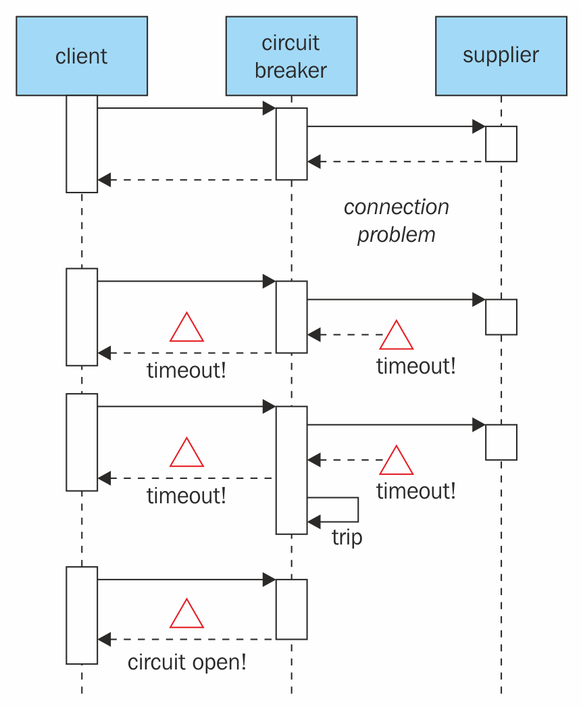
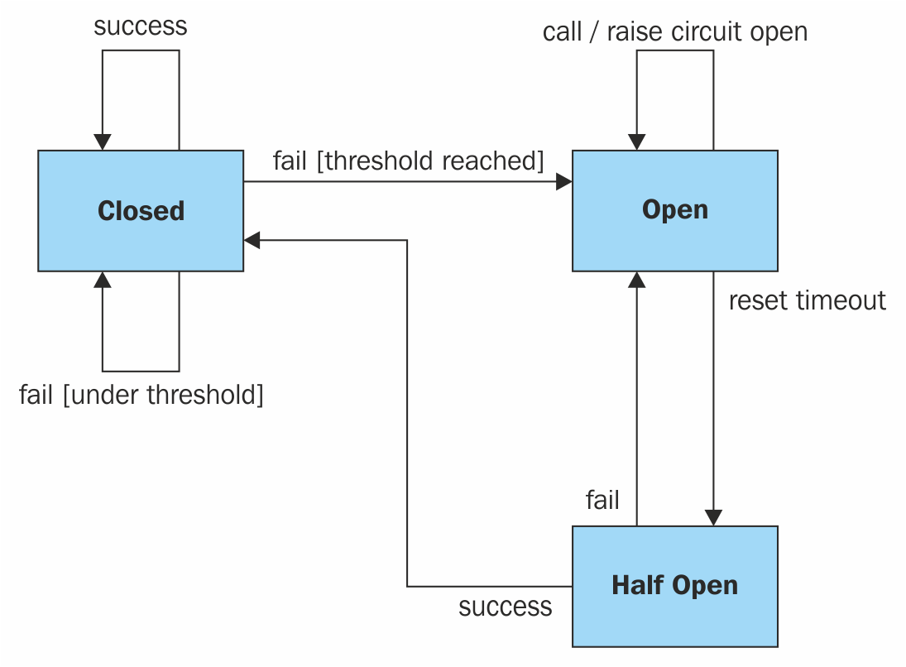

# 第五章：稳定性模式

稳定性是软件工程的基石之一。无论如何，你都必须对你的环境和用户做最坏的打算，并做好准备。当你的后端处于燃烧状态时，你的 Angular 应用程序应该能够在降级模式下运行，并在其恢复在线时平稳恢复。

在本章中，我们将学习稳定性模式和反模式，例如以下内容：

+   超时

+   断路器

+   工厂

+   纪念品

+   原型和可重用池

# 超时

在之前的章节中，我们尝试了使用 API 服务，目的是消费由我们假设的后端创建的任何类型的内容的 API。如果我不得不分享我在网上冒险中学到的一句话，那就是*不要相信任何人...尤其不要相信自己*。我的意思是，你永远不能相信 API 会按预期工作，即使是你自己的 API。你应该始终期望一切可能出错的事情都会出错。在尝试与后端通信时可能发生的一件较不严重的事情是它不会响应。虽然这种单向通信对你的 Angular 应用程序是无害的，但对你的用户来说是最令人沮丧的。在这个配方中，我们将学习如何在我们的外部调用中实现超时，以及如何对不响应的 API 做出反应。

幸运的是，有一种非常简单的方法可以防止我们的用户对不响应的 API 感到沮丧：超时。超时是一种简单的防御机制，允许你的应用程序等待固定的时间，而不是一毫秒更多。让我们创建一个新的项目来测试一下：

```ts
    ng new timeout
    cd timeout
    ng g service API
```

这将创建一个新的项目和一个名为`API`的服务。乍一看，没有什么可看的：

```ts
import { Injectable } from '@angular/core'; 

@Injectable() 
export class ApiService { 

  constructor() { } 

} 
```

我们需要在`app.module.ts`中添加`HttpClient`组件如下：

```ts
import { BrowserModule } from '@angular/platform-browser'; 
import { NgModule } from '@angular/core'; 
import { HttpClientModule } from '@angular/common/http'; 

import { AppComponent } from './app.component'; 
import { ApiService } from './api.service'; 

@NgModule({ 
  declarations: [ 
    AppComponent 
  ], 
  imports: [ 
    BrowserModule, 
    HttpClientModule 
  ], 
  providers: [ApiService], 
  bootstrap: [AppComponent] 
}) 
export class AppModule { } 
```

然后，我们希望将`HttpClient`组件注入到我们的 API 服务客户端中，以便可以访问其方法：

```ts
import { Injectable } from '@angular/core'; 
import { HttpClient } from '@angular/common/http'; 

@Injectable() 
export class ApiService { 

  constructor(private http:HttpClient) { } 

} 
```

我们将在我们的`APIService`中添加一个新的方法，简单地对包含本书代码的 GitHub 存储库进行`http.get`（[`github.com/MathieuNls/Angular-Design-Patterns-and-Best-Practices`](https://github.com/MathieuNls/Angular-Design-Patterns-and-Best-Practices)）：

```ts
import { Injectable } from '@angular/core'; 
import { HttpClient } from '@angular/common/http'; 

@Injectable() 
export class ApiService { 

  constructor(private http: HttpClient) { } 

  public getURL(url: string): void { 
    this.http.get(url) 
    .subscribe(data => { 
      console.log(data); 
    }); 
  }  

} 
```

接下来是对`ApiService`的注入，并在`AppComponent`中调用新的`getURL`方法：

```ts
import { Component } from '@angular/core'; 
import { ApiService } from './api.service'; 

@Component({ 
  selector: 'app-root', 
  templateUrl: './app.component.html', 
  styleUrls: ['./app.component.css'] 
}) 
export class AppComponent { 
  title = 'app'; 

  constructor(private api: ApiService){ 
    api.getURL("https://github.com/MathieuNls/Angular-Design-Patterns-and-Best-Practices") 
  } 
}
```

现在，如果我们执行这个操作，我们将得到一个优雅的 HTTP 响应，并且网页的 HTML 将被打印到控制台中。然而，问题在于，如果[github.com](http://www.github.com)宕机并且没有响应，我们没有采取任何对策：

```ts
import { Injectable } from '@angular/core'; 
import { HttpClient } from '@angular/common/http'; 

@Injectable() 
export class ApiService { 

  constructor(private http: HttpClient) { } 

  public getURL(url: string): void { 

    let timeout; 

    let sub = this.http.get(url) 
      .subscribe((res) => { 
        console.log(res); 
        clearTimeout(timeout) 
      }); 

    timeout = setTimeout( 
      () => { sub.unsubscribe() }, 1000 
    ); 
  } 

} 
```

在这个版本的`getURL`函数中，我们必须首先声明一个超时变量，该变量将包含一个 NodeJS 超时。然后，我们将订阅响应，而不是执行常规的`HTTP.get`。最后，在订阅结果后，我们使用`setTimeout`函数为超时变量赋值。我们使用这个函数在 1,000 毫秒后取消订阅响应。因此，我们只等待 1 秒钟的`http`回复。如果回复在这段时间内没有到达，我们将自动取消订阅并允许我们的应用程序继续。当然，我们的用户必须以某种方式被警告操作失败。

# 断路器

我们在上一节中实现的超时模式有效地保护了用户的耐心，最终也保护了我们的 Angular 应用程序。然而，如果 API 没有响应是因为服务器端出了问题，比如你的服务器 80%宕机，剩下的 20%在尝试管理负载，你的客户很可能会反复重试超时的操作。因此，这会给我们濒临崩溃的后端基础设施带来更大的压力。

电路是一种自动装置，用于作为安全措施停止电路中的电流流动。断路器用于检测故障并封装防止故障不断发生的逻辑（在维护期间、临时外部系统故障或意外系统困难期间）。

具体来说，在 Angular 应用程序的框架内，断路器将在出现太多故障时阻止客户端执行 API 请求。在一定时间后，电路将允许一些查询通过并使用 API。如果这些查询没有任何问题返回，那么电路将关闭自身并允许所有请求通过：



在上图中，我们可以看到断路器是如何运作的。所有请求都经过断路器，如果供应商及时回应请求，断路器保持关闭状态。当问题开始出现时，断路器会注意到，如果足够多的请求超时，那么断路器就会打开，阻止请求通过。

最后，在给定的时间后，断路器尝试重新发送请求给供应商：



从实现的角度来看，我们需要`ApiStatus`和`Call`类，它们负责跟踪我们对不同 API 的调用。

```ts
//ApiStatus class 
class ApiStatus { 

  public lastFail: number 
  public calls: Call[] 

  constructor(public url: string) { } 

  //Compute the fail percentage 
  public failPercentage(timeWindow: number): number { 

    var i = this.calls.length - 1; 
    var success = 0 
    var fail = 0; 

    while (this.calls[i].time > Date.now() - timeWindow && i >= 0) { 
      if (this.calls[i].status) { 
        success++; 
      } else { 
        fail++; 
      } 
   i--; 
    } 

    return fail / (fail + success) 
  } 

} 
```

`APIStatus`包含了根 API 的统计信息。我们要考虑到我们的应用程序可能会使用多个 API。每个 API 都必须与自己的断路器相连。首先，我们有`lastFail`变量，其中包含了上次调用此 API 失败的日期。然后，我们有一个`calls`数组，其中包含了对给定 API 的所有调用。除了定义 URL 属性的构造函数之外，我们还有`failPercentage`函数。这个函数负责计算在`timeWindows`时间内失败的调用百分比。为了做到这一点，我们以相反的时间顺序迭代所有的调用，直到达到`Date.now()` - `timeWindow`或`calls`数组的末尾。在`while`循环内，我们根据当前调用的状态递增两个名为`success`和`fail`的数字变量。最后，我们返回失败调用的百分比。这个百分比将用于确定断路器的状态。

`Call`类非常简单：

```ts
//An Api Call 
class Call { 
  constructor(public time: number, public status: boolean) { } 
} 
```

它只包含两个属性：时间和状态。现在，我们准备为我们的*Angular*应用程序实现一个实现断路器的 API 客户端。首先，我们必须创建这个类：

```ts
import { Injectable } from '@angular/core'; 
import { HttpClient } from '@angular/common/http'; 

@Injectable() 
export class ApiwithBreakerService { 

  constructor(private http: HttpClient) { } 
```

然后，我们必须为`ApiwithBreakerService`添加属性：

```ts
 private apis: Map<string, ApiStatus>; 
  private failPercentage: number = 0.2; 
  private timeWindow : number = 60*60*24; 
  private timeToRetry : number = 60;
```

这些属性将允许我们实现断路器模式。首先，我们有一个`string`和`ApiStatus`的映射，用于存储许多 API 的 API 状态。然后，我们有`failPercentage`，它定义了在打开电路之前有多少调用可以失败，作为百分比。`timeWindow`变量定义了用于计算`failPercentage`的时间量。在这里，我们在 24 小时窗口内最多可以有 20%的调用失败，然后我们打开这个电路并阻止其他调用。最后，我们有`timeToRetry`，它规定了在尝试重新关闭电路之前我们需要等待多长时间。

以下是来自超时部分的修改后的`getURL`函数：

```ts
 //Http get an url 
  public getURL(url: string): void { 

    var rootUrl = this.extractRootDomain(url); 

    if(this.isClosed(rootUrl) || this.readyToRetry(rootUrl)){ 
      let timeout; 

      let sub = this.http.get(url) 
        .subscribe((res) => { 
          console.log(res); 
          clearTimeout(timeout); 
          this.addCall(rootUrl, true); 
        }); 

      timeout = setTimeout( 
        () => {  
          sub.unsubscribe(); 
          this.addCall(rootUrl, false); 
        }, 1000 
      ); 
    } 
  } 
```

我们保留了前一部分中的超时的核心功能，但将其嵌入到了一个`if`语句中：

```ts
if(this.isClosed(rootUrl) || this.readyToRetry(rootUrl)) 
```

`if`语句检查电路是否关闭，或者我们是否准备在打开的电路上重试。

我们还添加了对`addCall`函数的调用：

```ts
 //Add a call 
  private addCall(url: string, status: boolean) { 

    let res = this.apis.get(url); 

    if (res == null) { 
      res = new ApiStatus(url); 
      this.apis.set(url, res); 
    } 

    res.calls.push(new Call(Date.now(), status)); 

    if(!status){ 
      res.lastFail = Date.now(); 
    } 
  } 
```

`addCall`函数将一个新的调用添加到存储在`apis`映射内的`ApiStatus`中。如果调用不成功，它还会更新`ApiStatus`实例的`lastFail`属性。

剩下的是`readyToRetry`和`isClosed`函数：

```ts
 //Are we ready to retry 
  private readyToRetry(url:string): boolean { 

    return this.apis.get(url).lastFail < (Date.now() - this.timeToRetry) 
  } 

  //Is it closed ? private isClosed(url :string) : boolean { 

    return this.apis.get(url) == null ||  
      !(this.apis.get(url).failPercentage(this.timeWindow) > this.failPercentage); 
  } 
```

在`readyToRetry`函数中，我们只需检查最新的失败是否比现在减去`timeToRetry`的时间早。在`isClosed`函数中，我们检查在时间窗口内失败调用的百分比是否大于允许的最大值。以下是完整的实现：

```ts
import { Injectable } from '@angular/core'; 
import { HttpClient } from '@angular/common/http'; 

//ApiStatus class 
class ApiStatus { 

  public lastFail: number 
  public calls: Call[] 

  constructor(public url: string) { } 

  //Compute the fail percentage 
  public failPercentage(timeWindow: number): number { 

    var i = this.calls.length - 1; 
    var success = 0 
    var fail = 0; 

    while (this.calls[i].time > Date.now() - timeWindow && i >= 0) { 
      if (this.calls[i].status) { 
        success++; 
      } else { 
        fail++; 
      } 
      i--; 
    } 
```

```ts
 return fail / (fail + success) 
  } 

} 

//An Api Call 
class Call { 
  constructor(public time: number, public status: boolean) { } 
} 

@Injectable() 
export class ApiwithBreakerService { 

  constructor(private http: HttpClient) { } 

  private apis: Map<string, ApiStatus>; 
  private failPercentage: number = 0.2; 
  private timeWindow : number = 60*60*24; 
  private timeToRetry : number = 60; 

  //Http get an url 
  public getURL(url: string): void { 

    var rootUrl = this.extractRootDomain(url); 

    if(this.isClosed(rootUrl) || this.readyToRetry(rootUrl)){ 
      let timeout; 

      let sub = this.http.get(url) 
        .subscribe((res) => { 
          console.log(res); 
          clearTimeout(timeout); 
          this.addCall(rootUrl, true); 
        }); 

      timeout = setTimeout( 
        () => {  
          sub.unsubscribe(); 
          this.addCall(rootUrl, false); 
        }, 1000 
      ); 
    } 
  } 

  //Add a call 
  private addCall(url: string, status: boolean) { 

    let res = this.apis.get(url); 

    if (res == null) { 
      res = new ApiStatus(url); 
      this.apis.set(url, res); 
    } 

    res.calls.push(new Call(Date.now(), status)); 

    if(!status){ 
      res.lastFail = Date.now(); 
    } 
  } 

  //Are we ready to retry 
  private readyToRetry(url:string): boolean { 

    return this.apis.get(url).lastFail < (Date.now() - this.timeToRetry) 
  } 

  //Is it closed ? private isClosed(url :string) : boolean { 

    return this.apis.get(url) == null ||  
      !(this.apis.get(url).failPercentage(this.timeWindow) > this.failPercentage); 
  } 

  private extractHostname(url: string) : string { 
    var hostname; 
    //find & remove protocol (http, ftp, etc.) and get hostname 

    if (url.indexOf("://") > -1) { 
      hostname = url.split('/')[2]; 
    } 
    else { 
      hostname = url.split('/')[0]; 
    } 

    //find & remove port number 
    hostname = hostname.split(':')[0]; 
    //find & remove "?" hostname = hostname.split('?')[0]; 

    return hostname; 
  } 

  private extractRootDomain(url: string) : string{ 
    var domain = this.extractHostname(url), 
      splitArr = domain.split('.'), 
      arrLen = splitArr.length; 

    //extracting the root domain here 
    //if there is a subdomain  
    if (arrLen > 2) { 
      domain = splitArr[arrLen - 2] + '.' + splitArr[arrLen - 1]; 
      //check to see if it's using a Country Code Top Level Domain (ccTLD) (i.e. ".me.uk") 
      if (splitArr[arrLen - 1].length == 2 && splitArr[arrLen - 1].length == 2) { 
        //this is using a ccTLD 
        domain = splitArr[arrLen - 3] + '.' + domain; 
      } 
    } 
    return domain; 
  } 
} 
```

请注意，我们有两个辅助函数，它们并不直接参与电路模式的实现，只是提取调用的根 URL，以便通过根 API 计算共享状态。由于这些辅助函数，我们可以使[`someapi.com/users`](http://someapi.com/users)和[`someapi.com/sales`](http://someapi.com/sales)共享相同的状态，而[`anotherapi.com/someCall`](http://anotherapi.com/someCall)则有其自己分离的`ApiStatus`。

超时和断路器模式并行工作，以减少自我否认。自我否认是自己毁灭后端服务器的艺术。当您的应用程序表现不当并且每秒向后端架构发出数千次调用时，这种情况往往会发生。

# 工厂

假设我们有一个`User`类，有两个私有变量：`lastName:string`和`firstName:string`。此外，这个简单的类提供了`hello`方法，打印`"Hi I am", this.firstName, this.lastName`：

```ts
class User{
 constructor(private lastName:string, private firstName:string){
 }
 hello(){
 console.log("Hi I am", this.firstName, this.lastName);
 }
 }
```

现在，考虑我们通过 JSON API 接收用户。它很可能看起来像这样：

```ts
[{"lastName":"Nayrolles","firstName":"Mathieu"}...]. 
```

通过以下代码片段，我们可以创建一个`User`：

```ts
let userFromJSONAPI: User = JSON.parse('[{"lastName":"Nayrolles","firstName":"Mathieu"}]')[0]; 
```

到目前为止，TypeScript 编译器还没有抱怨，并且它执行得很顺利。这是因为`parse`方法返回`any`（例如，Java 对象的 TypeScript 等价物）。当然，我们可以将`any`转换为`User`。然而，`userFromJSONAPI.hello();`将产生以下结果：

```ts
json.ts:19
 userFromJSONAPI.hello();
 ^
 TypeError: userFromUJSONAPI.hello is not a function
 at Object.<anonymous> (json.ts:19:18)
 at Module._compile (module.js:541:32)
 at Object.loader (/usr/lib/node_modules/ts-node/src/ts-node.ts:225:14)
 at Module.load (module.js:458:32)
 at tryModuleLoad (module.js:417:12)
 at Function.Module._load (module.js:409:3)
 at Function.Module.runMain (module.js:575:10)
 at Object.<anonymous> (/usr/lib/node_modules/ts-node/src/bin/ts-node.ts:110:12)
 at Module._compile (module.js:541:32)
 at Object.Module._extensions..js (module.js:550:10)
```

为什么？嗯，赋值的左侧被定义为`User`，但当我们将其转译为 JavaScript 时，它将被抹去。

在 TypeScript 中进行类型安全的方式如下：

```ts
let validUser = JSON.parse('[{"lastName":"Nayrolles","firstName":"Mathieu"}]')
 .map((json: any):User => {
 return new User(json.lastName, json.firstName);
 })[0];
```

有趣的是，`typeof`函数也无法帮助你。在这两种情况下，它都会显示`Object`而不是`User`，因为`User`的概念在 JavaScript 中根本不存在。

虽然直接的类型安全方法有效，但它并不是非常可扩展或可重用的。事实上，每当你接收一个 JSON `user`时，`map`回调方法都必须在各处重复。最方便的方法是通过`Factory`模式来做到这一点。`Factory`用于创建对象，而不将实例化逻辑暴露给客户端。

如果我们要创建一个用户的`factory`，它会像这样：

```ts

 export class POTOFactory{

 /**
 * Builds an User from json response
 * @param  {any}  jsonUser
 * @return {User} 
 */
 static buildUser(jsonUser: any): User {

 return new User(
 jsonUser.firstName,
 jsonUser.lastName
 );
 }

 }
```

在这里，我们有一个名为`buildUser`的静态方法，它接收一个 JSON 对象，并从 JSON 对象中获取所有必需的值，以调用一个假想的`User`构造函数。该方法是静态的，就像工厂的所有方法一样。事实上，在工厂中我们不需要保存任何状态或实例绑定的变量；我们只需要封装用户的创建过程。请注意，你的工厂可能会在你的 POTOs 的其余部分中共享。

# 备忘录

备忘录模式在 Angular 的上下文中是一个非常有用的模式。在由 Angular 驱动的应用程序中，我们经常过度使用两种方式绑定领域模型，比如`User`或`Movie`。

让我们考虑两个组件，一个名为`Dashboard`，另一个名为`EditMovie`。在`Dashboard`组件上，你有一个电影列表，显示在我们的类似 IMDb 的应用程序的上下文中。这样的仪表板视图可能如下所示：

```ts

 <div *ngFor="let movie of model.movies">
 <p>{{movie.title}}</p>
 <p>{{movie.year}}</p>
 </div>
```

这个简单的视图拥有一个`ngFor`指令，它遍历模型中包含的电影列表。然后，对于每部电影，它分别显示包含标题和发行年份的两个`p`元素。

现在，`EditMovie`组件访问`model.movies`数组中的一部电影，并允许用户对其进行编辑：

```ts
<form>
 <input id="title" name="title" type="text" [(ngModel)]="movie.title" />
 <input id="year" name="year" type="text" [(ngModel)]="movie.year" />
 </form>

 <a href="/back">Cancel</a>
```

感谢在这里使用的双向绑定，对电影标题和年份的修改将直接影响仪表板。正如你所看到的，我们这里有一个“取消”按钮。虽然用户可能期望修改是“实时”同步的，但他也期望取消按钮/链接可以取消对电影所做的修改。

这就是备忘录模式发挥作用的地方。这种模式允许在对象上执行撤消操作。它可以以许多种方式实现，但最简单的方式是使用克隆。使用克隆，我们可以在给定时刻存储对象的一个版本，并且在需要时返回到它。让我们按照以下方式增强我们的`Movie`对象从“原型”模式：

```ts
export class Movie implements Prototype {

 private title:string;
 private year:number;
 //...

 public constructor()
 public constructor(title:string = undefined, year:number = undefined)
 {
 if(title == undefined || year == undefined){
 //do the expensive creation
 }else{
 this.title = title;
 this.year = year;
 }
 }

 clone() : Movie {
 return new Movie(this.title, this.year);
 }

 restore(movie:Movie){
 this.title = movie.title;
 this.year = movie.year;
 }
 }
```

在这个新版本中，我们添加了`restore(movie:Movie)`方法，它以`Movie`作为参数，并将本地属性影响到接收到的电影的值。

然后，在实践中，我们的`EditMovie`组件的构造函数可能如下所示：

```ts

 private memento:Movie;

 constructor(private movie:Movie){

 this.memento = movie.clone();
 }

 public cancel(){
 this.movie.restore(this.memento);
 }
```

有趣的是，你不限于随时间只有一个备忘录，你可以有任意多个。

# 总结

在本章中，我们看到的模式旨在提高我们的 Angular 应用程序的稳定性。值得注意的是，事实上，大部分目的是为了保护我们的后端基础设施免受过热。事实上，当超时和断路器结合在一起时，它们可以让我们的后端得到休息，同时它们重新上线。此外，备忘录和可重用池旨在保留我们可能已经从后端重新请求的客户端信息，如果我们不存储它们的话。

在下一章中，我们将介绍性能模式和改进应用程序运行速度的最佳实践。
