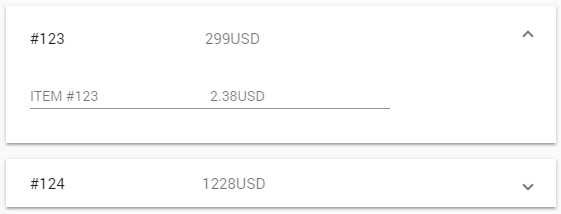
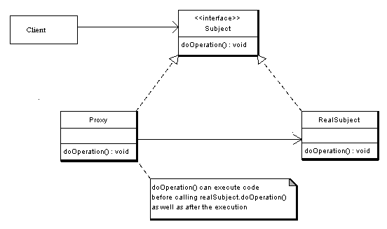
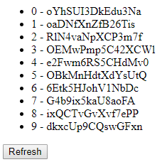
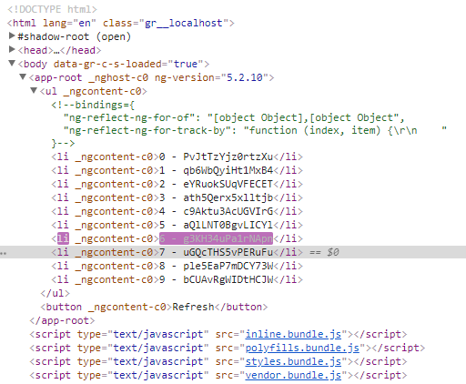
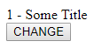
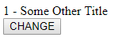

# 第六章：性能模式

在上一章中，我们调查了稳定性模式。稳定性模式是为了使您的应用程序能够在出现错误时生存下来。期望应用程序在没有任何错误的情况下发货是荒谬的，而试图实现这一点将使您的团队筋疲力尽。相反，我们学会了如何与之共存，并确保我们的应用程序足够弹性，可以经受住错误。在本章中，我们将专注于性能模式和反模式。这些模式定义了架构和实践，对您的应用程序的性能产生积极或消极的影响。

具体来说，我们将学习以下内容：

+   AJAX 过度使用

+   无限结果集

+   代理

+   过滤器和管道

+   循环

+   变更检测

+   不可变性

+   原型和可重用池

# AJAX 过度使用

如果您的应用程序不仅仅是一个一次性的原型或一个华丽的单页应用程序，那么您可能正在处理远程 API。这些远程 API 又在与后端层（例如 PHP、Ruby 或 Golang）和数据库（例如 MySQL、MS SQL 或 Oracle）进行通信。

虽然本书侧重于*Angular*应用程序，但我们不能忽视它们通常不会单独存在的事实。事实上，任何有意义的应用程序都需要从某个地方拉取和推送数据。

考虑到这一点，让我们想象一下，您的应用程序是某种在线电子商务网站（如亚马逊）的前端。这个虚构的应用程序肯定会有一个个人资料页面，用户可以在其中查看他们的过去和正在进行的命令。

让我们进一步指定我们的应用程序，假设您的 API，端点如下所示：

```ts
GET /orders
```

这将返回已登录用户的订单。

以下是一个 JSON 返回调用的示例：

```ts
{
 "orders":[
 {
 "id":"123",
 "date": "10/10/10",
 "amount": 299,
 "currency": "USD"
 },
 {
 "id":"321",
 "date": "11/11/11",
 "amount": 1228,
 "currency": "USD"
 },
 {
 "id":"322",
 "date": "11/12/11",
 "amount": 513,
 "currency": "USD"
 },

 ...

 ]
}
```

为了清晰和简洁起见，我们将假设我们的用户被神奇地认证，并且他们访问特定 API 端点的授权也是神奇的。

对于每个命令，您可以访问一个`GET` /`command_details` API，在其中，您可以检索给定 ID 的命令的详细信息：

```ts
{
 "items":[
 {
 "id":123,
 "qty":1,
 "price": 2,
 "tax_rate": 0.19,
 "currency": "USD",
 "shipped_at": "10/10/10",
 "received_at": "11/10/10"
 },
 {
 "id":124,
 "qty":2,
 "price": 3,
 "tax_rate": 0.19,
 "currency": "USD",
 "shipped_at": "10/10/10",
 "received_at": "11/10/10"
 }
 ...
 ]
}
```

在 Angular 方面，可以是一个简单的扩展面板，使用 Google Material Design 组件套件的扩展面板实现，如下面的屏幕截图所示：



我们还可以添加一个`GET` /`items_details`，返回项目的详细信息，但现在让我们暂停在这里。

现在，让我们假设每个 API 调用需要 100 毫秒才能完成，另外需要 10 毫秒来将 JSON 转换为 TypeScript 对象。有经验的开发人员肯定会首先获取给定用户的所有命令，并预先获取每个命令的细节，这样用户在展开给定面板时就不必等待。如果我们的 API 能够处理每秒 100 个请求，这是令人尊敬的，那么我们每秒只能为九个客户提供服务，假设他们每个人都有十个命令。每秒只能为九个客户提供服务听起来并不令人印象深刻...

事实上，同时点击*订单简历*页面的 10 个客户将耗费我们 1/10 的容量，并引发额外的 100 次调用（10 个客户×10 个命令）。因此，第十个客户在第一秒内将得不到服务。这可能听起来并不那么令人担忧，但是，我们只谈论了 10 个用户。

这种效果被称为 AJAX 过度性能反模式。作为前端开发人员，我可以访问满足我所有需求的 API，并且我使用它们来让我的客户满意。然而，预加载每个命令的每个细节，甚至可能是每个项目的每个细节，都是一个糟糕的主意。你会在后端架构上施加不必要的压力，只是因为你的客户可能想立即访问最后命令的细节。

出于后端基础设施的考虑，当用户真正想要查看命令的详细信息时，只请求命令的细节可能是值得的。

这与无限制的 API 密切相关。再次强调，后端架构不在本书的范围内，但是，如果我们要谈论 Angular 应用程序的性能，我们就必须提到它。如果你能控制你使用的 API，那么确保它们暴露出某种分页，并且你要正确地使用它。

# 代理模式

在我们对无限制的 API 和 AJAX 过度的调查中，我们在前一篇文章中确定了两者都应该避免，但是解决这个问题的方法是使 API 在 API 没有分页的情况下发生变化。这假设你能访问这些 API 或者能够找到有这种访问权限的人。虽然这是一个合理的假设，但并非在所有情况下都成立。

除了不发出请求（显然），我们还能做什么来保护那些设计不良且失控的 API？嗯，解决这个问题的一个优雅方式是使用代理模式。代理模式用于控制对对象的访问。您肯定知道 Web 代理可以根据用户的凭据控制对网页的访问。在这个示例中，我们不会讨论 Web 代理，而是面向对象的代理。在面向对象的代理中，我们不太关心对象的安全访问，而是关心功能访问。

例如，图像处理软件要列出并显示文件夹中的高分辨率照片对象，但用户并不总是会查看给定文件夹中的所有图像。因此，一些图像将会被无谓地加载。

然而，这与我们的 API 问题有什么关系呢？使用代理模式，我们可以控制我们实际想要执行 API 请求的时间，同时保持我们的命令集合整洁有序。首先，让我们看一下代理 UML：



首先，我们有一个定义`doOperation()`方法的`Subject`接口。这个接口由`Proxy`和`RealSubject`类实现。`Proxy`类包含对`realSubject`类的引用，该引用将在适当的时候填充。对于我们的目的，它可能是什么样子呢？

首先，我们有一个名为`OnlineCommand`的简单接口：

```ts
import { Item } from "./item";
export interface OnlineCommand {
fetchItems() : Item[]
}
```

在这个接口中，只定义了一个方法：`fetchItems()`。这个方法返回命令中包含的项目。

然后，我们的组件有一个代表我们客户命令的命令数组：

```ts
import { Component } from '@angular/core';
import { OnlineCommand } from './online-command';

@Component({
 selector: 'app-root',
 templateUrl: './app.component.html',
 styleUrls: ['./app.component.css']
})
export class AppComponent {
title = 'app';
private commands:OnlineCommand[]
}
```

在这个简短的组件中，我们只有我们客户的命令，以及使 Angular 组件成为组件的内容。

对于 HTML 部分，我们只需遍历命令集合，并在点击时调用`fetchItems`函数：

```ts
<ul>
 <li *ngFor="let item of commands; let i = index" (click)="item.fetchItems()">
 {{i}} {{item}}
 </li>
</ul>
```

然后，我们有一个实现`OnlineCommand`接口的`RealCommand`类：

```ts
import { OnlineCommand } from "./online-command";
import { Item } from "./item";

//RealCommand is a real command that has the right to do
//API calls
export class RealCommand implements OnlineCommand{

 public fetchItems() : Item[] {
 //This would come from an API call
 return [new Item(), new Item()];
 }
}
```

谜题的最后一部分，尽管是最重要的一部分，是在线命令的代理版本：

```ts
import { OnlineCommand } from "./online-command";
import { RealCommand } from "./real-command";
import { Item } from "./item";

//A Proxified Command
export class ProxyfiedCommand implements OnlineCommand{

 //Reference to the real deal
 private real:RealCommand;

 //Constructor
 constructor() {
 this.real = new RealCommand();
 }

 //The Proxified fetchItems.
 //It only exists as a placeholder and if we need it
 //we' ll the real command.
 public fetchItems() : Item[] {
 console.log("About the call the API");
 let items = this.real.fetchItems();
 console.log("Called it");
 return items;
 }
}
```

如前所述，在线命令的代理版本包含对实际命令的引用，实际上就是我们的实际命令。关键在于，昂贵的操作是我们只在真正需要时才想要访问的功能。在 HTML 方面，一切都优雅地隐藏在封装后。在 TypeScript 方面，我们只在用户请求详细信息时才执行调用，而不是之前。

# 循环计数

任何类型的网络应用程序通常都充满了循环。它可能是 *Amazon.com* 上的产品循环，银行网站上的交易循环，电话运营商网站上的电话循环等等。最糟糕的是，页面上可能有很多循环。当这些循环遍历静态集合时，在生成页面时肯定需要花费时间，除非你无能为力。你仍然可以应用我们在本章前面看到的模式，来减少集合深度，并节省每个项目的大量调用。然而，真正的性能问题出现在这些循环与异步发展的集合绑定时。确实，Angular 和所有允许这种绑定的框架，每次集合发生变化时都会重新绘制集合。它现在可以显示集合中哪些项目已被修改，以及如何在 DOM 中选择它们。因此，如果集合中有 1,000 个元素，如果其中一个元素被修改，那么整个集合都必须重新绘制。实际上，这对用户和开发人员来说是相当透明的。然而，根据 JavaScript 集合的值选择和更新 1,000 个 DOM 元素在计算上是昂贵的。

让我们模拟一组书籍：

```ts
export class Book {
 public constructor(public id:number, public title:string){

 this.id = id;
 this.title = title;
 }
}
```

`Book` 类很简单。它只包含两个属性：`id` 和 `title`。在默认的应用组件中，我们添加了一系列书籍和一些方法。在构造函数中，我们填充了书籍。我们还有一个刷新方法，它会随机选择一本书并更新其标题。最后，`makeid` 方法生成一个随机字符串 ID，我们可以用它来填充书名：

```ts
import { Component } from '@angular/core';
import { Book } from './books'
@Component({
 selector: 'app-root',
 templateUrl: './app.component.html',
 styleUrls: ['./app.component.css']
})
export class AppComponent {
 title = 'app';
 books: Book[] = [];
 constructor(){
 for (let i = 0; i < 10; i++) {

 this.books.push(new Book(i, this.makeid()))
 }
 }
 refresh(){
 let id =Math.floor(Math.random() * this.books.length)
 this.books[id].title = this.makeid();
 console.log(id, "refreshed")
 }
 private makeid(): string {
 var text = "";
 var possible = "ABCDEFGHIJKLMNOPQRSTUVWXYZabcdefghijklmnopqrstuvwxyz0123456789";
 for (var i = 0; i < 15; i++)
 text += possible.charAt(Math.floor(Math.random() * possible.length));
 return text;
 }
}
```

我们实验的最后一部分是下面的 HTML 模板：

```ts
<ul>
 <li *ngFor="let book of books; let i = index">{{book.id}} - {{book.title}}</li>
</ul>
<button (click)="refresh()">Refresh</button>
```

我们的书籍类、应用组件和 `html` 模板放在一起，创建了以下页面：



我们有我们的 10 本书和我们的刷新按钮，它链接到`refresh`函数。按下时，将随机选择并更新一本书。现在，默认情况下，整个列表都必须重新计算。当然，这里的*刷新*机制是手动的，但在更现实的情况下，刷新将是异步的，例如来自远程 API 的更新。为了帮助 Angular 找出哪个元素已更改并需要刷新，我们可以使用`ngFor`的`trackBy`选项，如下所示：

```ts
<ul>
 <li *ngFor="let book of books; trackBy: trackByFn; let i = index">{{book.id}} - {{book.title}}</li>
</ul>
<button (click)="refresh()">Refresh</button>
The trackBy: trackByFn;we added references a function of our component named trackByFn
  trackByFn(index, item) {
returnindex; // or item.id
 }
```

这个函数帮助 Angular 知道如何跟踪我们书集合中的元素。现在，当按下刷新按钮时，只有修改过的元素将被重新计算和重绘。换句话说，只有一个 DOM 元素将被操作。再次强调，对于 10 个元素，差异是不明显的。然而，对于几十个元素，根据硬件的不同，页面可能会变得有点迟缓。我们可以通过使用 Chrome 开发工具来确认`trackByFn`函数的操作方式。在检查 DOM 时，如果单击刷新按钮，那么只有一个`<li>`标记会亮起。DOM 元素在修改时会亮起。在下面的截图中，您可以看到只有索引 6 的元素被重新计算，而不是列表中的所有元素：



# 变更检测和不可变状态

我们在上一篇文章中提到的问题是任何映射某种视图和模型的框架固有的。这不是 Angular 的特殊性。也就是说，这个问题虽然在循环中被加剧，但也存在于其他地方。准确地说，它存在于我们的模型和视图之间的每一个绑定的地方。换句话说，每当我们的 HTML 模型中有`{{ myValue }}`时，这对我们的应用程序来说都是性能上的打击。

那么，解决方案是什么呢？完全停止使用绑定吗？嗯，这并不是非常实际的，因为这样我们就放弃了 JavaScript 最初的吸引力。不，真正的解决方案是使我们的对象不可变。然而，要理解为什么需要这样做，我们需要看一下 Angular 是如何实现变更检测的。变更检测就像它的名字所暗示的那样，是 Angular 执行的用于检测是否有任何变化的过程。如果有变化，对象将被重新处理并重新绘制到 DOM 中。Angular 默认的做法是将一个*watcher*附加到我们的模型上。观察者会观察模型，并为视图中绑定的每个值保留一些信息。它会保留绑定对象的引用，对象的每个属性的旧值和新值。当对象的状态发生变化时，旧值和新值就会被使用。在上一节的书籍示例中，我们的模型的观察者会为每本书保留其引用、旧 ID 和新 ID，以及旧标题和新标题。在每个检测周期，Angular 都会检查对象的旧属性和新属性是否匹配，如下所示：

```ts
book == book ? No; repaintBook.title == Book.title? No; repaintBook.id == Book.it ? No; repaint
```

通常情况下，单独进行这些操作并不会有太大的影响。但是，当页面中有数百个对象，每个对象都有几十个映射属性时，性能就会受到影响。正如我之前所说，解决这个问题的方法就是不可变性。对象的不可变性意味着我们的对象不能改变它们的属性。如果我们想要改变视图中显示的值，那么我们必须整体改变对象。如果你遵循不可变性的原则，那么之前的控制流将如下所示：

```ts
book == book ? No; repaint
```

这样可以节省我们在应用程序中到处使用的大量条件语句，但这也意味着我们在模型中绑定变量的修改，比如 `book.title = "qwerty"`，不会在视图中反映出来。为了使这种修改可见，我们需要用一个新的书籍对象来更新视图。让我们用这个新概念做一些实验。这是我们的 HTML 模板：

```ts
{{ book.id }} - {{ book.title }}<br/><button (click)="changeMe()">CHANGE</button>
```

这是我们的组件：

```ts
import { Component } from '@angular/core';
import { Book } from './book'
@Component({
 selector: 'app-root',
 templateUrl: './app.component.html',
 styleUrls: ['./app.component.css']
})
export class AppComponent {
 title = 'app';
 book: Book;
 constructor(){
 this.book = new Book(1, "Some Title");
 }
 changeMe(){
 this.book.title = "Some Other Title";
 }
}
```

书籍类保持在上一节中所呈现的状态。现在，在提供此应用程序时，您将会看到以下内容：



按下“CHANGE”按钮将会改变显示的标题，如下所示：



如果我们告诉 Angular，我们更希望只检查引用是否发生了变化，而不是通过使用`ChangeDetection.OnPush`方法检查每个属性的值，那么按钮将不再对视图产生任何影响。实际上，模型的值已经发生了变化，但是变化不会被变化检测算法捕捉到，因为书的引用仍然是相同的，正如我们之前解释的那样。因此，如果你确实想要将你的变化传播到视图中，你必须改变引用。考虑到所有这些，我们的组件看起来是这样的：

```ts
import { Component, Input } from '@angular/core';
import { Book } from './book'
import { ChangeDetectionStrategy } from '@angular/core';
@Component({
 selector: 'app-root',
 templateUrl: './app.component.html',
 styleUrls: ['./app.component.css'],
 changeDetection: ChangeDetectionStrategy.OnPush
})
export class AppComponent {
 title = 'app';
 @Input() book: Book;
 constructor(){
 this.book = new Book(1, "Some Title");
 }
 changeMe(){
 this.book = new Book(this.book.id, "Some Other Title");
 }
}
```

我们向我们的组件添加了`changeDetection: ChangeDetectionStrategy.OnPush`，并修改了`changeMe`方法，使其创建一个新的书，而不是更新旧的书。当然，创建一个新对象比更新现有对象更昂贵。然而，这种技术为 Angular 应用程序带来了更好的性能，因为有无数个周期，什么都没有发生，但是每个对象的属性仍然与它们的旧值进行比较，比实际发生变化的周期要多得多。

通过这种技术，我们显著提高了应用程序的性能，但代价是必须考虑何时希望将对象的更新传播到视图中。请注意，这也适用于过滤器和管道。如果你的应用程序只有一个从模型到视图的绑定值，你可能会认为这并不重要，你可以一路使用可变的方式。如果你的应用程序确实只有一个绑定值，并且这个值从未使用`{{ myValue | myPipe }}`符号进行管道或过滤，那么你是对的。

事实上，每个管道都是由我们的应用程序异步处理的。实际上，如果你调用了 100 次`myPipe`，你实际上创建了相当于 100 个观察者来观察`myValue`的值，并将你的管道应用到它。这是有道理的，因为你的管道无法知道它将要处理什么，并且无法预料到其计算结果对于这 100 次调用来说是相同的。因此，它会根据需要观察和执行多次。如果你发现自己的模板中充满了返回相同值的管道调用，最好是创建一个带有该值作为输入的虚拟组件，或者完全将转换后的值存储在你的模型中。

# 原型和可重用池

面向对象的开发人员寻找减少创建对象成本的方法-特别是当这些对象因为需要数据库拉取或复杂的数学运算而昂贵时。减少特定对象创建成本的另一个原因是当你创建大量对象时。如今，后端开发人员倾向于忽视优化的这一方面，因为按需的 CPU/内存已经变得便宜且易于调整。每月多花几美元就可以在后端拥有额外的核心或 256 MB 的 RAM。

这对于桌面应用程序开发人员来说曾经也是一个大问题。在客户端桌面上，没有办法按需添加 CPU/RAM，但是相当节奏的四核处理器和消费级 PC 上可怕的大量 RAM 使这个问题变得不那么棘手。如今，似乎只有游戏和密集的分析解决方案开发人员才关心这个问题。那么，毕竟为什么你应该关心对象的创建时间呢？嗯，你正在构建的东西很可能会被旧设备访问（我仍然在厨房或沙发上使用 iPad 1 进行休闲浏览）。虽然桌面应用程序开发人员可以发布最低和推荐配置，并通过拒绝安装它们来强制执行它们，但是作为 Web 开发人员，我们没有这种奢侈。现在，如果你的网站表现不佳，用户不会质疑他们的设备，而是质疑你的技能...最终，即使在一台性能强大的机器上，他们也不会使用你的产品。让我们看看如何使用“原型”设计模式。首先，我们需要一个“原型”接口，如下所示：

```ts
export interface Prototype{
 clone():Prototype;
}
```

“原型”接口只定义了返回符合“原型”标准的对象的“克隆”方法。你已经猜到了，创建对象的优化方式是在需要时克隆它们！所以，假设你有一个名为“电影”的对象，由于某些原因，需要花费时间来构建：

```ts
export class Movie implements Prototype {

 private title:string;
 private year:number;
 //...

 public constructor()
 public constructor(title:string = undefined, year:number = undefined)
 {
 if(title == undefined || year == undefined){
 //do the expensive creation
 }else{
 this.title = title;
 this.year = year;
 }
 }

 clone() : Movie {
```

```ts
 return new Movie(this.title, this.year);
 }
 }

 expansiveMovie:Movie = new Movie();
 cheapMovie = expansiveMovie.clone();
```

正如你所看到的，TypeScript 中覆盖函数的方式与大多数语言不同。在这里，构造函数的两个签名位于彼此之上，并共享相同的实现。这就是`Prototype`模式的全部内容。另一个经常与`Prototype`模式一起使用的模式是对象池模式。在处理昂贵的创建对象时，克隆它们确实会产生巨大的差异。更大的差异是根本不做任何事情：不创建，不克隆。为了实现这一点，我们可以使用池模式。在这种模式中，我们有一组对象池，可以被任何客户端或组件共享，特别是在 Angular 2 应用程序的情况下。池的实现很简单：

```ts
export class MoviePool{

 private static movies:[{movie:Movie, used:boolean}] = [];
 private static nbMaxMovie = 10;
 private static instance:MoviePool;

 private static constructor(){}

 public static getMovie(){

 //first hard create
 if(MoviePool.movies.length == 0){

 MoviePool.movies.push({movie:new User(), used:true});
 return MoviePool.movies[0].movie;

 }else{

 for(var reusableMovie:{movie:Movie, used:boolean} of MoviePool.movies){
 if(!reusableMovie.used){
 reusableMovie.used = true;
 return reusableMovie.movie;
 }
 }
 }

 //subsequent clone create
 if(MoviePool.movie.length < MoviePool.nbMaxMovie){

 MoviePool.movies.push({movie:MoviePool.movies[MoviePool.movies.length - 1].clone(), used:true});
 return MoviePool.movies[MoviePool.movies.length - 1].movie;
 }

 throw new Error('Out of movies');
 }

 public static releaseMovie(movie:Movie){
 for(var reusableMovie:{movie:Movie, used:boolean} of MoviePool.movies){
 if(reusableMovie.movie === movie){
 reusableMovie.used = false;
 }
 return;
 }
 }
 }
```

首先，这个池也是一个单例。实际上，如果任何人都可以随意创建池，那么这种昂贵的可重用设计就没有多大意义。因此，我们有静态属性`instance:MoviePool`和私有构造函数，以确保只能创建一个池。然后，我们有以下属性：`private static movies:[{movie:Movie, used:boolean}] = [];`。

`movies`属性存储了一系列电影和一个布尔值，用于确定当前是否有人在使用任何给定的电影。由于假设电影对象在内存中创建或维护是很耗费资源的，因此有必要对我们的对象池中可以拥有多少这样的对象进行硬性限制。这个限制由私有静态属性`nbMaxMovie = 10;`来管理。要获取电影，组件必须调用`getMovie():Movie`方法。这个方法在第一部电影上进行硬性创建，然后利用`Prototype`模式来创建任何后续的电影。每当从池中取出一部电影时，`getMovie`方法会将`used`布尔值更改为 true。需要注意的是，在池满了并且没有空闲电影可供分配的情况下，会抛出错误。

最后，组件需要一种方法来将他们的电影归还给池，以便其他人可以使用它们。这是通过`releaseMovie`方法实现的。这个方法接收一个假设已经取出的电影，并遍历池中的电影，根据布尔值将它们设置为 false。因此，电影对其他组件变得可用。

# 摘要

在本章中，我们学习了如何通过限制我们的 AJAX 调用和代理设计模式来避免在*Angular*应用程序中遇到主要性能问题。我们还学习了如何在性能方面控制循环的不良影响。然后，我们深入研究了 Angular 的变更检测过程，以使其与不可变对象很好地配合，以应对对象数量过高的情况。最后，我们还学习了关于原型和可重用池模式，这可以帮助减少应用程序所需资源的占用空间。

在下一章中，我们将学习关于我们 Angular 应用程序的操作模式。操作模式是帮助监视和诊断实时应用程序的模式。
