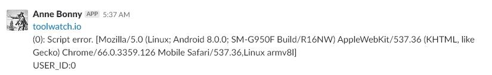

# 第七章：操作模式

在这最后一章中，我们将专注于改进企业规模的 Angular 应用程序的操作模式。虽然前几章侧重于稳定性、性能和导航，但如果我们无法顺利操作我们的应用程序，这一切可能都会崩溃。在操作应用程序时，有几个值得考虑的理想情况，例如：

+   透明度

+   日志记录

+   诊断

现在，后端应用的操作策略和模式可以更容易实现。虽然后端应用可以在不同类型的容器、虚拟机甚至裸机中运行，但与前端应用相比，操作它们更容易。事实上，您可以注册正在进行的程序、CPU 使用率、内存使用率、磁盘使用率等，这是因为您直接或间接（通过您的服务提供商）可以访问这些服务器。对于前端应用程序，这些统计数据仍然是可取的。假设我们有一个用 Angular 编写的前端应用程序，在测试期间在各个方面表现良好，但在实际运行时失败。为什么会发生这种情况呢？例如，如果您开发的 Angular 应用程序正在使用本地部署的 API，您必须考虑到您的用户遭受网络延迟。这些延迟可能导致您的应用程序表现异常。

# 通用健康指标

我们可以采取的第一步行动是监视一些通用健康指标，以实现我们的 Angular 应用程序的可观察性。我们将要处理的通用健康指标分为几类。首先，我们有两个来自 Angular 分析器的指标：

+   `msPerTick`：每个滴答所需的平均`ms`。滴答可以被视为刷新操作或重绘。换句话说，重新绘制所有变量所需的毫秒数。

+   `numTicks`：经过的滴答数。

我们收集的其他类型的指标与客户端工作站相关：

+   `core`：逻辑核心数

+   `appVersion`：所使用的浏览器

我们还可以提取有关连接的信息：

+   `cnxDownlink`：下行连接速度

+   `cnxEffectiveType`：连接类型

最后，最后一组指标涉及 JavaScript 堆本身的大小：

+   `jsHeapSizeLimit`：堆的最大大小。

+   `totalJSHeapSize`：这是 JavaScript 堆的当前大小，包括未被任何 JavaScript 对象占用的空闲空间。这意味着`usedJsHeapSize`不能大于`totalJsHeapSize`。

+   `usedJSHeapSize`：JavaScript 对象使用的内存总量，包括 V8 内部对象。

为了收集这些指标，我们将创建一个专门的 Angular 服务。该服务将负责访问正确的变量，将它们组装成一个完美的对象，并通过 API post 将它们发送回我们的基础设施。

第一组指标可以通过 Angular 分析器访问。分析器注入了一个名为`ng`的变量，可以通过浏览器命令行访问。大多数用于监视 Angular 应用程序性能的工具都是在开发过程中使用的。为了访问这些工具，我们可以使用`window`变量并像这样抓取它：

```ts
window["ng"].profiler
```

然后，我们可以访问`timeChangeDetection`方法，该方法为我们提供了`msPerTick`和`numTicks`指标。

在一个方法中，这可以转化为以下内容：

```ts
var timeChangeDetection = window["ng"].profiler.timeChangeDetection()
```

在任何 JavaScript 应用程序中都可以找到的另一个有用的变量是 navigator。navigator 变量暴露了有关用户使用的浏览器的信息。`window.navigator.hardwareConcurrency`和`window.navigator.appVersion`分别给出了逻辑核心数和应用程序版本。

虽然前面提到的变量可以在任何能够运行*Angular*应用程序的浏览器上访问，但在撰写本文时，其余的指标只在 Chrome 上可用。如果我们的用户使用的不是 Chrome，那么我们将无法访问这些指标。然而，Chrome 仍然是最常用的浏览器，目前没有迹象表明这种情况会很快改变。因此，对于我们的大部分用户群，我们将能够检索到这些指标。

下一批指标与我们应用程序的内存性能有关：`jsHeapSizeLimit`、`totalJSHeapSize`和`usedJSHeapSize`。在 Chrome 上，它们是`window.performance["memory"]`对象的属性。然而，在其他浏览器上，我们需要提供一个 polyfill：

```ts
var memory:any = window.performance["memory"] ? window.performance["memory"] : {
"jsHeapSizeLimit":0,
"totalJSHeapSize":0,
"usedJSHeapSize":0,
}
```

在前面的代码中，我们检查了`memory`对象是否存在。如果对象存在，我们将其赋值给本地的`memory`变量。如果对象不存在，我们提供一个简单的 polyfill，其中指标的值为 0。

最后一组指标与用户连接有关。与内存对象一样，它只能在 Chrome 上访问。我们将使用与之前相同的技术：

```ts
var connection:any = window.navigator["connection"] ? window.navigator["connection"] : {
"effectiveType": "n/a",
"cnxDownlink": 0,
}
```

这是`Monitor`服务的实现，其中在`metric`方法中收集指标。在方法结束时，我们将指标发送到 API 端点：

```ts
import { Injectable } from '@angular/core';
import { HttpClient } from '@angular/common/http';
@Injectable()
export class MonitorService {
constructor(private http:HttpClient) { }
public metrics(){
var timeChangeDetection = window["ng"].profiler.timeChangeDetection()
var memory:any = window.performance["memory"] ? window.performance["memory"] : {
"jsHeapSizeLimit":0,
"totalJSHeapSize":0,
"usedJSHeapSize":0,
}
var connection:any = window.navigator["connection"] ? window.navigator["connection"] : {
"effectiveType": "n/a",
"cnxDownlink": 0,
}
var perf = {
"msPerTick": timeChangeDetection.msPerTick,
"numTicks": timeChangeDetection.numTicks,
"core": window.navigator.hardwareConcurrency,
"appVersion": window.navigator.appVersion,
"jsHeapSizeLimit": memory.jsHeapSizeLimit,
"totalJSHeapSize": memory.totalJSHeapSize,
"usedJSHeapSize": memory.usedJSHeapSize,
"cnxEffectiveType": connection.effectiveType,
"cnxDownlink": connection.downlink,
}
this.http.post("https://api.yourwebsite/metrics/", perf)
return perf;
}
}
```

这是`perf`对象中的变量的示例：

+   `msPerTick`: 0.0022148688576149405

+   `numTicks`: 225747

+   `core`: 12

+   `appVersion`: `5.0 (Windows NT 10.0; Win64; x64) AppleWebKit/537....L, like Gecko) Chrome/66.0.3359.139 Safari/537.36" jsHeapSizeLimit: 2190000000, ...}appVersion: "5.0 (Windows NT 10.0; Win64; x64) AppleWebKit/537.36 (KHTML, like Gecko) Chrome/66.0.3359.139 Safari/537.36`

+   `cnxDownlink`: 10

+   `cnxEffectiveType`: `4g`

+   `core`: 12

+   `jsHeapSizeLimit`: 2190000000

+   `msPerTick`: 0.0022148688576149405

+   `numTicks`: 225747

+   `totalJSHeapSize`: 64000000

+   `usedJSHeapSize`: 56800000

在服务器端，这些指标可以被馈送到 ELK 堆栈或您选择的类似堆栈中，并增强您的应用程序的可观察性。

# 特定指标

除了我们之前查看的指标，我们可以在我们的服务中添加一个方法，以便我们能够发送特定的指标，如下所示：

```ts
public metric(label:string, value:any){
this.http.post("https://api.yourwebsite/metric/", {
label:label,
value:value,
})
}
```

# 错误报告

增强应用程序的透明度和可观察性的另一种方法是报告在客户端发生的每一个 JavaScript 错误。在 JavaScript 中，这样做相对简单；你只需要将一个回调函数附加到`window.onerror`事件上，如下所示：

```ts
window.onerror = function myErrorHandler(errorMsg, url, lineNumber) {
alert("Error occured: " + errorMsg);
}
```

这将简单地在每次发生错误时创建一个警报。然而，使用 Angular 时，你不能使用相同的简单技术——不是因为它很复杂，而是因为它需要创建`ne`类。这个新类将实现 Angular 错误处理程序接口，如下所示：

```ts
class MyErrorHandler implements ErrorHandler {
handleError(error) {
// do something with the exception
}
}
```

我们将继续改进`monitor`服务，以便它也可以成为我们的`ErrorHandler`：

```ts
import { Injectable, ErrorHandler } from '@angular/core';
import { HttpClient } from '@angular/common/http';
@Injectable()
export class MonitorService implements ErrorHandler{
constructor(private http:HttpClient) { }
handleError(error) {
this.http.post("https://api.yourwebsite/errors/", error)
}
...
}
```

然后，这些错误可以被馈送到您的`ELK`堆栈，甚至直接插入到您的 Slack 频道中，就像我们在[Toolwatch.io](http://www.toolwatch.io)中所做的那样：



为了使用这个错误处理程序来替代 Angular 的默认错误处理程序，你需要在声明模块时提供它：

```ts
providers : [{ provide : ErrorHandler, useClass : MonitorService }]
```

# 使用 AOP 的方法指标

到目前为止，我们只能在特定时刻监控我们的系统：调用度量、度量和发生的错误。在我们的应用程序中监控所有内容的一种可靠方法是在*Angular*应用程序中使用**AOP**（**面向方面的编程**）。AOP 并不是一种新技术，但在 JavaScript 生态系统中并不广泛使用。AOP 包括定义方面。方面是与我们应用程序的指定部分相关联的子程序。方面在编译时编织到方法中，并在编织到的方法之前和/或之后执行。在基于 Angular 的应用程序中，该方法将在从 TypeScript 到 JavaScript 的转译时编织。在纯 JavaScript 中将方面编织到方法是很简单的。考虑以下示例：

```ts
function myFunc(){
Console.log("hello");
}
function myBeforeAspect(){
Console.log("before...")
}
function myAfterAspect(){
Console.log("after");
}
var oldFunc = myFunc;
myFunc = function(){
myBeforeAspect();
oldFunc();
myAfterAspect();
}
```

在这个片段中，我们声明了三个函数：`myBeforeAspect`，`myFunc`和`myAfterAspect`。在它们各自的声明之后，我们创建了`oldFunc`变量，并将其赋值为`myFunc`。然后，我们用新的实现替换了`myFunc`的实现。在这个新的实现中，除了`oldFunc`之外，我们还调用了`myBeforeAspect`和`myAfterAspect`。这是在 JavaScript 中实现方面的一种简单方法。我们已经添加了行为到`myFunc`的调用中，而不会破坏我们的内部 API。实际上，如果在程序的另一个部分中调用了`myFunc`函数，那么我们的程序仍然是有效的，并且会执行得就像没有改变一样。此外，我们还可以继续向增强函数添加其他方面。

在 Angular-flavored TypeScript 中也可以实现这一点：

```ts
constructor(){
this.click = function(){
this.before();
this.click();
this.after();
}
}
after(){
console.log("after")
}
before(){
console.log("before");
}
click(){
console.log("hello")
}
```

在这里，我们的构造函数将两个方面编织到`click`方法中。`click`方法将执行其行为，以及方面的行为。在 HTML 中，AOP 的任何内容都不会显现出来：

```ts
<button (click)="click()">click</button>
```

现在，我们可以手动将这种技术应用到所有的方法上，并调用我们监控服务的`metric`方法。幸运的是，存在各种库可以为我们处理这个问题。到目前为止，最好的一个叫做`aspect.js`（[`github.com/mgechev/aspect.js`](https://github.com/mgechev/aspect.js)）。

`aspect.js`利用了 ECMAScript 2016 的装饰器模式。

我们可以使用`npm install aspect.js -save`来安装它，然后我们可以定义一个类似这样的方面：

```ts
class LoggerAspect {
@afterMethod({
classNamePattern: /^someClass/,
methodNamePattern: /^(some|other)/
})
invokeAfterMethod(meta: Metadata) {
console.log(`Inside of the logger. Called ${meta.className}.${meta.method.name} with args: ${meta.method.args.join(', ')}.`);
@beforeMethod({
classNamePattern: /^someClass/,
methodNamePattern: /^(get|set)/
})
invokeBeforeMethod(meta: Metadata) {
console.log(`Inside of the logger. Called ${meta.className}.${meta.method.name} with args: ${meta.method.args.join(', ')}.`);
}
}
```

在这方面，我们有几个部分。首先，我们有一个`@afterMethod`方法，它接受一个`classNamePattern`和一个`methodNamePattern`。这些模式是正则表达式，用于定义编织到特定方面的哪些类和方法。然后，在`invokeAfterMethod`中，我们定义要应用的行为。在这个方法中，我们只是记录调用的方法以及调用该方法的参数值。

我们使用`@beforeMethod`重复这个操作。

如果我们保持这样的情况，日志将在客户端打印出来。如果我们想获得这些日志，我们将不得不再次修改我们的`Monitor`服务。

我们将添加一个名为`log`的静态方法和一个静态的`HTTP`客户端。这些是静态的，因为我们可能会编织不接收`Monitor`服务注入的组件。这样，所有服务，无论是否注入，都将能够发送它们的日志：

```ts
static httpStatic:HttpClient
constructor(private http:HttpClient) {
MonitorService.httpStatic = http;
}
static sendLog(log:string){
MonitorService.httpStatic.post("https://api.yourwebsite/logs/", log)
}
```

在`Monitor`服务的构造函数中，我们填充了静态客户端。这将在我们的应用程序启动并且服务是单例时完成。因此，我们只做一次。

这是`Monitor`服务的完整实现：

```ts
import { Injectable, ErrorHandler } from '@angular/core';
import { HttpClient } from '@angular/common/http';
@Injectable()
export class MonitorService implements ErrorHandler{
static httpStatic:HttpClient
constructor(private http:HttpClient) {
MonitorService.httpStatic = http;
}
public static log(log:string){
MonitorService.httpStatic.post("https://api.yourwebsite/logs/", log)
}
handleError(error) {
this.http.post("https://api.yourwebsite/metrics/", error)
}
public metric(label:string, value:any){
this.http.post("https://api.yourwebsite/metric/", {
label:label,
value:value,
})
}
public metrics(){
var timeChangeDetection = window["ng"].profiler.timeChangeDetection()
var memory:any = window.performance["memory"] ? window.performance["memory"] : {
"jsHeapSizeLimit":0,
"totalJSHeapSize":0,
"usedJSHeapSize":0,
}
var connection:any = window.navigator["connection"] ? window.navigator["connection"] : {
"effectiveType": "n/a",
"cnxDownlink": 0,
}
this.metric("msPerTick", timeChangeDetection.msPerTick);
this.metric("numTicks", timeChangeDetection.numTicks);
this.metric("core", window.navigator.hardwareConcurrency);
this.metric("appVersion", window.navigator.appVersion);
this.metric("jsHeapSizeLimit", memory.jsHeapSizeLimit);
this.metric("totalJSHeapSize", memory.totalJSHeapSize);
this.metric("usedJSHeapSize", memory.usedJSHeapSize);
this.metric("cnxEffectiveType", connection.effectiveType);
this.metric("cnxDownlink", connection.downlink);
}
}
```

该方面可以修改为调用新的静态方法：

```ts
class LoggerAspect {
@afterMethod({
classNamePattern: /^SomeClass/,
methodNamePattern: /^(some|other)/
})
invokeBeforeMethod(meta: Metadata) {
MonitorService.log(`Called ${meta.className}.${meta.method.name} with args: ${meta.method.args.join(', ')}.`);
}
@beforeMethod({
classNamePattern: /^SomeClass/,
methodNamePattern: /^(get|set)/
})
invokeBeforeMethod(meta: Metadata) {
MonitorService.log(`Inside of the logger. Called ${meta.className}.${meta.method.name} with args: ${meta.method.args.join(', ')}.`);
}
}
```

除了`className`，`methodName`和`args`之外，我们可以使用`@Wove`语法填充每个组件的元变量，如下面的代码所示：

```ts
@Wove({ bar: 42, foo : "bar" })
class SomeClass { }
```

自定义元变量的一个有趣用例是使用它们来存储每个方法的执行时间，因为元变量值从 before 方法传递到 after 方法。

因此，我们可以在我们的`@Wove`注释中有一个名为`startTime`的变量，并像这样使用它：

```ts
@Wove({ startTime: 0 })
class SomeClass { }
class ExecutionTimeAspect {
@afterMethod({
classNamePattern: /^SomeClass/,
methodNamePattern: /^(some|other)/
})
invokeBeforeMethod(meta: Metadata) {
meta.startTime = Date.now();
}
@beforeMethod({
classNamePattern: /^SomeClass/,
methodNamePattern: /^(get|set)/
})
invokeBeforeMethod(meta: Metadata) {
MonitorService.metric(`${meta.className}.${meta.method.name`,
Date.now() - meta.startTime;
}
}
```

现在，我们有另一个方面将被编织到我们的类中，它将测量其执行时间并使用`MonitorService`的`metric`方法报告它。

# 总结

操作 Angular 应用程序可能很复杂，因为在运行时观察我们的应用程序相对困难。虽然观察后端应用程序很简单，因为我们可以访问运行环境，但我们习惯使用的技术不能直接应用。在本章中，我们看到了如何通过使用收集性能指标、自定义指标和日志，并通过面向方面的编程自动应用所有这些来使 Angular 应用程序监视自身。

虽然本章介绍的技术可以提供对应用程序的 100%可观察性，但它们也有一些缺点。实际上，如果您的应用程序很受欢迎，您将不仅需要为您的页面提供服务并回答您的 API 调用，还需要接受日志和指标，这将过度消耗您的后端基础设施。另一个缺点是，恶意的人可能会通过您的 API 向您提供错误的指标，并为您提供关于当前正在发生的实时应用程序情况的偏见图片。

这些缺点可以通过仅监视客户端的子集来解决。例如，您可以根据随机生成的数字仅为 5%的客户端激活日志记录和跟踪。此外，您可以通过为每个请求提供 CSRF 令牌来验证希望向您发送指标的用户的真实性。
