# 第三章：架构企业应用

在 *第二章*，*表单、Observables、Signals 和 Subjects* 中，我们使用 LocalCast Weather 应用来展示 Angular 的各种特性，以便学习和实验，并告知我们这些特性是否适合更复杂的企业应用。构建企业应用与构建它们的团队一样重要，也与构建它们的技术一样重要。对未经证实的技术的过度热情和快速推广肯定会让你项目中的技术“黑洞”效应。如果你不熟悉“黑洞”，它们是由于地下材料溶解而发生的自然现象。在某个时候，通常突然，地面会塌陷，产生毁灭性的影响，露出地下的巨大空洞。

在这本书中，我尽力只包括经过验证、成熟且得到良好支持的技伎和实践。LocalCast Weather 包含了 Angular 的所有前沿特性，如根级别的独立项目、独立组件、信号和控制流语法。通过独立组件，我们摒弃了共享模块的概念，有助于解决循环依赖问题和由于共享模块过于臃肿而产生的冗余。然而，也存在一些挫折。独立项目需要库来支持提供者而不是模块；当缺少提供者时，将库应用于具有功能模块的项目变得繁琐且充满猜测。

控制流语法在预览中产生易于阅读的模板，并消除了导入结构指令的需要，从而减少了样板代码。同时，Angular 信号在部分预览中，直到基于信号的组件推出之前，不会带来重大价值。无论如何，Angular 信号借鉴了后面将要介绍的新的 JavaScript 基本类型，在 *Minimalist JavaScript solutions* 部分中，你应该了解并学会在 Angular 之外使用它们。在深入具体细节之前，让我们先考虑更大的图景。

在企业中构建的最常见类型的应用是**业务线**（**LOB**）应用。LOB 应用是软件开发世界的基石。正如维基百科所定义的，LOB 是一个通用术语，指的是服务于特定客户交易或业务需求的产品或一系列相关产品。LOB 应用提供了展示各种功能和特性的绝佳机会，而无需涉及大型企业应用通常需要解决的扭曲或专业场景。

帕累托原则，也称为 80-20 规则，表明我们可以用 20% 的总体努力完成 80% 的目标。我们将把 80-20 规则应用于我们的 LOB 应用设计和架构。鉴于 LOB 应用覆盖的常见用例，它们非常适合 80-20 学习体验。只需 20% 的努力，你就可以了解 80% 你需要知道的内容，以便为用户提供高质量体验。

LOB 应用有一个奇特的特点。如果你构建了一个半有用的应用，其需求会无控制地增长，你很快就会成为你成功的受害者。平衡项目的架构需求具有挑战性；你想要避免潜在的毁灭性低工程，同时，在另一方面，避免为那些永远不会需要它的应用进行昂贵的过度工程。

在本章中，我将向你介绍一些要素，这些要素将帮助你在你企业中取得成功，作为架构师你应该考虑的事项，在构建高性能应用时应考虑的各种工具，如何使用路由优先架构设计大型应用，以及 80-20 设计解决方案来解决交付现代 Web 应用时增量迭代所面临的挑战。

如你在*第一章*，*Angular 的架构和概念*中阅读的那样，软件架构不会保持静态。通过使用编码 kata、概念验证应用和参考项目来实践，使用新想法进行实验是至关重要的，这有助于你更好地创建更灵活的架构。

在本书的本章和剩余章节中，我们将设置一个具有丰富功能的新应用，它可以满足具有可扩展架构和工程最佳实践的 LOB 应用的需求。我们将遵循**路由优先架构**，这是一种依赖于可重用组件来创建名为**LemonMart**的杂货店 LOB 应用的设计模式。我们将讨论围绕主要数据实体进行设计，以及在实现各种条件导航元素之前完成应用的高级原型的重要性，这些元素在设计阶段可能会发生重大变化。

在本章中，你将学习以下内容：

+   成为一个技术领导或架构师

+   在你的企业中取得成功的要素

+   使用 GitHub 项目进行看板规划

+   构建高性能应用的工具

+   将 80-20 法则应用于软件开发

+   学习如何构建路由优先应用

让我们从你必须掌握的项目非技术方面开始，这样你就可以为团队的成功奠定基础。

# 成为一个技术领导或架构师

我将交替使用**技术领导**和**架构师**这两个术语。根据你所在组织的规模，这可能是两个不同的角色，也可能是一个。但无论你担任哪个具体角色，在这些角色中，确保你项目成功以及最重要的是确保团队成员的幸福，都取决于你。

## 理解业务影响

你的第一个任务应该是理解你项目的业务影响。以下是一些需要提出的问题：

+   这个项目的成功对业务有多重要？

+   失败的后果是什么？

+   失败意味着什么？

+   哪些功能将带来最大的价值？

+   你必须操作哪些参数？

+   什么可以协商，什么不可以？

你对这些问题的回答将显著影响你的项目应该如何运作。如果企业的生存或声誉受到威胁，你必须放大确保企业生存或声誉不受损害的项目方面。如果某些功能集将带来最大价值，那么集中所有注意力在该部分获得高性能和高品质的用户体验，并将其他部分简化为初始发布。如果某些人员或技术被指定，权衡这些因素与其他因素。确保你选择的**首席技术官**（**CTO**）选择的技术适合公司生死存亡的项目。不要进行不必要的斗争。

## 设定成功的参数

作为一项基本原则，利用团队成员的优势和激情是明智的。如果资源或时间紧张，这一点尤为重要。如果人们也在他们热爱的技术中投入时间，他们将会更努力地投资于你的项目。但不要以失败为代价——回到我在本章开头关于过度热衷于使用新技术的那一点。

为你的团队设定明确的成功参数非常重要。这只有在你自己清楚业务影响的情况下才可能实现。你和你的团队成员都在一条旅程上。你们都在一条道路上行走。偏离道路意味着危险，无论是对于个人团队成员还是项目的成功。这取决于你如何调整这条道路的宽窄。如果你让它太窄，你的团队成员会因为缺乏自由或过于严格的审查而窒息和沮丧。相反，如果你让它太宽，你将会有比实际工作更多的实验。你必须根据团队和项目的需求，在道路上设置适量的护栏。

## 弹性领导

你的领导风格不能是静态的。它必须是**弹性的**。所有团队和项目都有生命周期。它们可能经历生存、学习或自我组织的阶段。根据截止日期或外部因素，团队可能被迫从一个状态转变为另一个状态。

查看 Roy Osherove 在[`www.elasticleadership.com`](https://www.elasticleadership.com)上关于弹性领导的优秀内容。

了解你的团队处于何种状态，并相应地调整你的领导风格。生存模式需要独裁者或保护者风格的领导者，你将深度参与所有团队活动，并指导个别任务和行动。你的目标应该是将处于这种状态的团队转移到学习模式。这就是你成为教练的时候，你不再那么参与日常活动，而是专注于团队成员应该学习什么以及他们应该如何成长。下一步将是处于*自我组织*模式的团队。这些团队具有弹性，他们可以自我成长，并且可以接受一般方向和战略并执行它们。在这个阶段，你需要成为一个促进者或仆人式领导者。如果你对一个成熟的团队发号施令，你很快就会失去这个团队。

谷歌的**DevOps 研究和评估**（**DORA**）计划包含 30 个涵盖技术、流程和文化主题的能力，你的团队和组织可以掌握这些能力，成为一个高绩效团队。该研究项目自 2014 年起运行，考虑了来自各行各业和政府的 33,000 名专业人士的意见。了解更多关于该计划的信息，请访问[`dora.dev`](https://dora.dev)。

如果你不懂这些概念，你可能会让你的团队成员处于他们将会筋疲力尽的情况，加班工作且士气低落，这可能会影响家庭生活，造成压力和高流失率。在这种情况下，你可能需要照照镜子，因为有这么多人站在那里。所有因素都会导致一个不利于健康组织运行的恶性循环。正如俗话所说，这不是短跑，而是马拉松。它不仅关乎达到终点，也关乎旅程。不要让你的团队失败。

# 成功项目的要素

你理解你项目的商业影响，并且你有一个渴望开始的团队；现在怎么办？当然，你必须有一个计划。正如德国陆军元帅莫尔特克所说（或者至少是现代对它的诠释），*“没有计划能在与敌人的第一次接触中存活。”*

五十年后，温斯顿·丘吉尔和德怀特·D·艾森豪威尔补充说，*“计划的重要性很小[或者毫无价值]，但规划是必不可少的[或者不可或缺的]。”*

## 敏捷软件开发

在过去十年中，敏捷软件开发管理已经接管了世界，用 Scrum 取代了瀑布式项目执行，用看板板取代了甘特图，每两周进行一次迭代和增量交付，而不是多年开发周期、长周期和昂贵的**质量保证**（**QA**）和支持周期。统计数据显示，敏捷项目比瀑布项目有更高的成功率。这从直觉上是有道理的，因为迭代和增量交付确保成功尽可能快地发生。

2001 年发布的位于[`agilemanifesto.org`](http://agilemanifesto.org)的敏捷宣言，强调了成为敏捷的关键要素：

> 个人和交互而非流程和工具
> 
> 工作软件而非全面文档
> 
> 客户协作而非合同谈判
> 
> 针对变化而非遵循计划

大多数人在加入 Scrum 团队时接触到敏捷，因此大多数人混淆了敏捷和 Scrum。Scrum 是一个管理框架。像冲刺、规划会议、回顾和其他可选元素，如用户故事和故事点，与敏捷无关。执行 Scrum 并滥用所有可能的敏捷价值观是可能的。

在德克萨斯州奥斯汀的*交付：敏捷 2018*会议上，我听了 Ron Jeffries（2001 年敏捷宣言的签署者）和 Chet Hendrickson（一个幽默感极强的人，正确地批评我在 MacBook 的盖子上贴满了各种 JavaScript 贴纸）关于敏捷开发的演讲。他们聚焦于敏捷宣言的“工作软件”部分，以强调一个重要观点。无论多少流程、管理监督或会议都不会导致软件交付。正如我在 2018 年的演讲《交付或从未发生》中恰如其分地所说：

> “这不是他们的责任[经理们]
> 
> 这是我们[开发者]的责任。”

这不是关于创建漂亮的图表，对虚构的架构进行无休止的迭代。这也不是关于交付故事点、勾选框和将卡片从一个列移动到另一个列。简而言之，不要成为流程猴子。专注于交付可工作的代码。

## 敏捷工程最佳实践

实现这一目标的最佳方式是通过交付和遵守敏捷工程最佳实践：

1.  **测试驱动开发**（**TDD**）：在编写实际代码之前编写测试，以确保代码满足要求。

1.  **持续集成**（**CI**）：频繁地对代码提交运行自动构建和测试，以尽早发现问题。

1.  **持续交付**（**CD**）：确保每个产品迭代都处于可发布状态。

1.  **结对编程**：团队成员在共同完成任务时相互学习。

1.  **重构**：作为日常工作的一部分，持续改进代码库。

1.  **简单且演进式设计**：设计应尽可能简单，以满足当前需求，避免过度设计，并且足够灵活或开放，以便随着时间的推移而演进。

1.  **行为驱动开发**（**BDD**）：使用基于软件预期行为的测试，辅以具体示例，采用类似于 Gherkin（`Given`、`When`、`Then`格式）的语法，以便技术和非技术人员可以协作。

1.  **频繁发布**：频繁以小批量交付软件。

1.  **高内聚低耦合**：模块或组件专注于单一任务，同时这些模块或组件之间相互依赖最小。

1.  遵循 SOLID 原则：

    1.  **单一职责原则**：函数或类只应负责一项任务。

    1.  **开放/封闭原则**：代码应该对扩展开放（即，可扩展）但对修改封闭（即，无需重写算法即可扩展）。

    1.  **Liskov 替换原则**：从超类/基类继承不应该导致意外行为。

    1.  **接口隔离原则**：暴露所需的最小接口。

    1.  **依赖倒置原则**：模块/组件应该依赖于抽象而不是具体实现。

1.  **DRY 原则**：不要重复自己。应用 DRY 原则有助于使代码更容易维护。如果你需要更改某些内容，你只需在一个地方更改，而不是多个地方。然而，过度应用 DRY 有时可能会使代码过于复杂，因此需要判断以找到正确的平衡。该原则是关于合理减少重复，而不是完全消除重复。

## 工程卓越和工艺

遵循这些原则需要工程卓越和工艺心态。你的团队成员需要关心他们的工作，为他们的代码感到自豪，并对他们产生的结果感到满意。

将需求和设计转换为工作代码并不容易。以迭代和增量方式完成它需要深入了解技术、工具和业务需求。然而，同时编写代码而不过度设计，同时保持其灵活性不仅是可能的，而且应该是每个工程师的目标。

哦，选择一个组件库并坚持下去，但也避免供应商锁定。祝你好运！

# 企业中的 Angular

Angular 并不适合用于每个项目。然而，由于框架支持的高级概念，如**依赖注入**（**DI**）、原生 TypeScript 支持、模块化架构、强大的打包、测试、可访问性工具，以及对定期发布新版本的承诺，Angular 在企业中被优先考虑。这些工具的结合有助于应用从小型应用扩展到真正的大规模应用，拥有 1,000+视图。

对于**内容管理系统**（**CMS**）风格的使用案例和简单应用，你应该考虑使用 Analog。Analog 是一个用于使用 Angular 构建应用和网站的元框架：[`analogjs.org`](https://analogjs.org)。Analog 预配置了**服务器端渲染**（**SSR**）、**静态站点生成**（**SSG**）、Vite（[`vitejs.dev`](https://vitejs.dev)）工具、基于约定的路由和 API 路由，以提供无烦恼、充满激情的开发体验。

事实上，[`AngularForEnterprise.com`](https://AngularForEnterprise.com)就是使用 Analog 创建的。

## 多种编程范式支持

Angular 允许不同的编程风格。您可以选择命令式和响应式编程，利用面向对象的概念，或者完全忽略它们，拥有内联和紧凑的单文件组件，或者使用多达四个文件来包含相同的代码。这种多样性在支持多样化的开发者群体时是一种优势，但也可能因为允许同一项目内存在多种实现风格而成为一种弱点。通过建立关于使用哪种编程风格和范式的团队规范来控制这一点是很重要的。像 ESLint 这样的代码风格工具可以帮助保持代码外观的一致性，但在检测或防止代码中的范式转变方面并不有效。

## 社区支持

Angular 拥有一个伟大且积极参与的社区，其中充满了聪明、尊重和积极的人，他们共同构建围绕 Angular 的工具并在技术社区中传播 Angular。谷歌也通过 Google Developer Expert 计划支持 Angular，我有幸成为其中的一员，Angular 团队会与活跃的社区成员会面，给他们提供早期访问，听取他们的反馈，并鼓励合作。这意味着当您的企业需要支持时，有一个值得信赖的社区个人群体，您可以从中获取建议。

如第一章中“引言”和“Angular 的架构和概念”部分所讨论的，随着 Web 应用程序规模的扩大，性能问题开始出现在应用程序的渲染中，工具难以支持项目中的贡献者数量，架构在处理复杂性和多样化的需求时变得不足。关于架构的更多内容，我们将在本章后面讨论 80-20 解决方案和路由优先架构。

您可以在 [`angularforenterprise.com/enterprise-tools`](https://angularforenterprise.com/enterprise-tools) 找到并贡献一个社区整理的、用于构建企业应用程序的 Angular 工具列表。

接下来，让我们深入了解可以支持构建具有良好 UX 和 DevEx 的高性能应用程序的工具。

# 高性能应用程序的工具和技术

在本节中，我们将涵盖与构建高性能应用程序相关的话题。虽然其中一些工具是针对 Angular 的，但总体观点和建议适用于所有 Web 应用程序。这意味着一个复杂的大型应用程序仍然能够：

+   达到平滑的 60 FPS 渲染目标

+   在 340 毫秒内响应用户点击

+   为开发者提供快速的反馈循环

+   尽可能快地运行构建和自动化测试

首先，让我们谈谈运行时的性能。

## 运行时性能

糟糕的性能对业务有真实的影响。2008 年，有报道称延迟增加 100 毫秒使亚马逊的销售额减少了 1%。2006 年，谷歌观察到生成搜索页面额外增加 0.5 秒导致流量下降了 20%。在亚马逊和谷歌这样的规模下，这些数字令人震惊，因为毫秒可以转化为数百万美元。这可能意味着在您的组织规模下，数千或数十万美元。考虑到随时间推移的性能趋势，这些较小的数字仍然可以累积到数百万。

浏览器是一个复杂的运行环境，我们用来开发 Web 应用的框架通过牺牲丰富的特性和易于维护的代码来模糊运行时。这种模糊化在满足原生浏览器相关优化要求的基础上，引入了特定于框架代码的性能问题。到了 2024 年，我们使用的框架已经变得极其复杂。

让我们了解我们可以使用哪些指标来理解 Web 应用的运行时性能：

+   **首次内容绘制**（**FCP**）：衡量从页面开始到首次显示可视内容的时间

+   **交互时间**（**TTI**）：衡量页面加载的响应性，并有助于识别页面看起来是交互式的但实际上不是的情况

+   **延迟**：用户操作与其响应之间的延迟

+   **帧率下降**：当帧无法快速生成以平滑渲染 UI 时发生的情况

我们可以使用浏览器 DevTools 中的分析工具来发现这些问题。下面是一个由 Michael Hladky 创建的**火焰图**（通常称为火焰图）的注释示例，它突出了 Angular 应用引导过程的各个阶段：

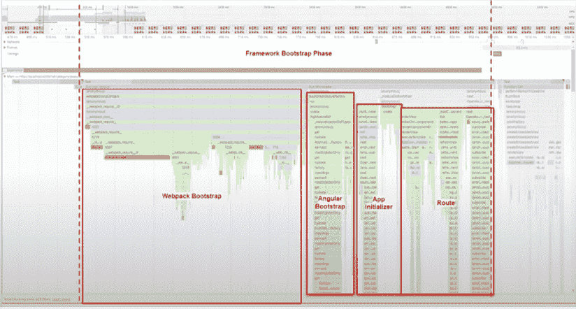

图 3.1：Angular 引导阶段的火焰图。版权所有 Michael Hladky

图表的 x 轴显示时间，y 轴显示函数调用堆栈。一个宽条表示一个执行时间较长或被频繁调用的函数。一个高的堆栈包括一个深层次的函数调用链。您可以使用这些视觉线索放大图表并调查性能问题。

如果您不熟悉使用 Chrome 的分析功能，请参阅[`developer.chrome.com/docs/devtools/performance/reference`](https://developer.chrome.com/docs/devtools/performance/reference)。

## 性能瓶颈的根本原因

什么在拖慢我们的进度？在应用的引导过程中或加载新页面时，会发生几件事情：

1.  **下载 JavaScript**：这包括应用、框架和第三方库代码。大小越大，速度越慢。

1.  **执行 JavaScript**：代码需要解压缩并加载到内存中，然后由 JavaScript 引擎进行即时执行；DOM 元素和框架钩子需要构建。

1.  **应用代码的初始化**：框架必须计算应用程序的状态（视觉和数据），将事件监听器连接到 DOM，并渲染。

1.  **变更检测**：框架必须遍历组件树以确定 UI 是否应该因为状态变化而更新。

按顺序执行这些步骤，假设您的应用程序或 API 代码没有重大问题，是大型网络应用程序性能问题的根本原因。在当前的单页应用（SPA）框架状态下，这些问题是无法避免的，或者解决起来非常昂贵。

一个无法避免的问题的例子就是在屏幕上渲染过多的交互式组件。解决这个问题的一个非常昂贵的方案可能是用自定义代码修补每一个组件，以绕过框架的正常生命周期，并强制它以只能对您正在构建的应用程序有益的方式行事。

## 最简主义的 JavaScript 解决方案

ECMAScript 2022，被所有主流浏览器广泛支持，具有内置的基本功能，使我们能够从头开始构建性能良好且响应式的网络应用程序。仅用 1-2 kb 的“框架”代码，我们就可以极大地提高开发体验，并创建现代且快速的网站。

### ArrowJS

在 2023 年弗罗里达州华盛顿特区的 Frontrunners 2023 会议上，我参加了一场由 Justin Schroeder 关于他的前端库 ArrowJS（无框架的响应性）的演讲。更多信息可以在[`www.arrow-js.com`](https://www.arrow-js.com)找到。在他的演讲中，Justin 介绍了使他的库成为可能的基本原理：

+   **弱映射**：弱映射是一个键值对的集合，其中键是具有任意值的对象。键是弱引用的，这意味着如果没有其他引用存在，它们可以被垃圾回收。通常，映射本身会作为引用而保留在内存中。

+   **代理**：代理是一个包装另一个对象或函数的对象，允许您拦截并定义基本操作的自定义行为。它们是您对象的中介。信号在幕后使用代理。它们在表单验证中也很有用。

+   **集合**：集合是一组值，其中每个值必须是唯一的，这意味着相同的值不能出现多次。它们对于跟踪依赖项很有用。

+   **标签模板字面量**：这些允许使用函数解析模板字面量，实现自定义字符串插值和处理。它们是字符串的中介。它们用于将模板 HTML 代码作为函数解析很有用。

当所有这些概念放在一起时，观察您如何在 ArrowJS 中复制一个待办事项列表应用程序：

```js
import { html, reactive } from '@arrow-js/core'
const data = reactive({
  items: [
    { id: 17, task: 'Check email' },
    { id: 21, task: 'Get groceries' },
    { id: 44, task: 'Make dinner' },
  ]
})
function addItem(e) {
  e.preventDefault()
  const input = document.getElementById('new-item')
  data.items.push({
    id: Math.random(),
    task: input.value,
  })
  input.value = ''
}
html`
<ul>
  ${() => data.items.map(
      item => html`<li>${item.task}</li>`.key(item.id)
    )}
</ul>
<form @submit="${addItem}">
  <input type="text" id="new-item">
  <button>Add</button>
</form>` 
```

这段代码不需要任何编译或进一步处理。下一个解决方案，然而，在幕后利用类似的技术，但同时也解决了所有大问题。

### Qwik.js

Angular 的创始人 Miško Hevery，以及行业老将 Adam Bradley（jQuery Mobile、Ionic、Stencil.js）和天才程序员 Manu Almeida，共同创建了 Qwik.js，作为对 Angular、React 和 Vue 等流行 SPA 框架中固有的基本问题的回应。你可以在这个框架的网站上查看 [`qwik.builder.io`](https://qwik.builder.io)。

想要冒险吗？执行：

```js
$ npm create qwik@latest 
```

Qwik.js 是从头开始构建的，以强制执行响应式编程范式，利用信号原语和可恢复性作为内置功能，确保任何大小或规模的 app 总能在 1 秒内完成全页加载，并且整体性能快 5-10 倍。所有这些都在一个大小约为 1 kb 的库中实现。

Qwik 随带丰富的用户控件、Vite 开发服务器、Vitest 和 Playwright 进行测试、可扩展的样式和服务器端渲染，并且不需要激活。要了解激活和可恢复性之间的区别，请参阅以下图形：

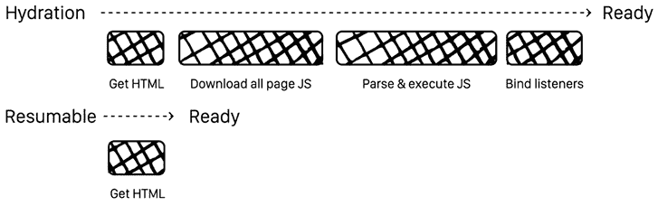

图 3.2：激活与可恢复性。改编自 Miško Hevery

在顶部，你可以看到加载传统 SPA 的激活步骤。随着应用程序的增长，每个单独的框所需的时间会更长。然而，一个可恢复的应用程序作为准备好渲染的 HTML 有效载荷下载，其状态嵌入其中，将复杂度从 O() 降低到 O(1)。

如果你觉得  令人畏惧，别担心。这只是一个玩笑。

在初始加载后，Qwik 仅预取所需的 JavaScript 量以启用交互性。这可能意味着一次下载一个函数。Qwik 在懒加载代码方面也非常积极。因此，只有用户与之交互的元素才会活跃，从而保持性能问题的控制。自然地，有一些智能的预取算法在后台工作，以确保这是一个无缝的体验。

如果你想要了解更多关于 Qwik 的信息，请查看我在 YouTube 上的演讲 [`www.youtube.com/watch?v=QDqp_qTa4Ww&t=40s`](https://www.youtube.com/watch?v=QDqp_qTa4Ww&t=40s) 以及幻灯片 [`slides.com/doguhanuluca/intro-to-qwik`](https://slides.com/doguhanuluca/intro-to-qwik)。

接下来，让我们看看我们可以使用哪些工具来解决 Angular 中的这些问题。

## Angular 性能解决方案

有两类问题在发挥作用，一类是关于应用程序的初始加载，另一类是通过保持变更检测来确保平滑渲染。

让我们从 **服务器端渲染** （**SSR**） 开始。

### 服务器端渲染和激活

**Angular 服务器端渲染**使得渲染 SPA 成为可能，否则这是一个在浏览器中执行的客户端技术。服务器可以预先烘焙视图的初始状态，作为浏览器不需要花费太多时间解释的简单 HTML 和 JavaScript。因此，下载的内容渲染非常快，解决了由于下载和执行大量 JavaScript 而造成的延迟。这在移动设备或处理能力和带宽有限的旧设备中尤为重要。服务器可以不受用户硬件限制地持续执行此任务。

SSR 的另一个好处是便于网络爬虫，从而在你的网站上实现**搜索引擎优化**（**SEO**）。

当用户正在凝视你的着陆页——由于此时它主要是静态的，他们只能看，不能触摸——Angular 使用**web workers**来加载应用程序的其余部分。

将 SSR 集成到项目中的最合理方式是在一开始就进行，这样你可以逐步解决和测试配置问题。

要创建一个新的具有 SSR 的项目，请执行：

```js
$ npm create @angular -- --ssr 
```

或

```js
$ npx @angular/cli new app_name --ssr 
```

早上醒来心情不错吗？尝试将 SSR 添加到你的现有项目中：

```js
$ npx ng add @angular/ssr 
```

在所有资产加载完毕，你的 SPA 准备好完全交互时，应用必须从静态状态过渡到动态状态。这种过渡可能会很突然。正如我们在介绍 Qwik 时学到的，水合对于无缝地从静态状态过渡到动态状态是至关重要的。

如果你正在使用`FlexLayout`，请使用`FlexLayoutServerModule`在 SSR 配置中启用框架。更多详细信息可以在[`github.com/angular/flex-layout/wiki/Using-SSR-with-Flex-Layout`](https://github.com/angular/flex-layout/wiki/Using-SSR-with-Flex-Layout)找到。

现在轮到**客户端水合**登场。你可以在`AppComponent`中使用其提供者来启用客户端水合：

```js
import {provideClientHydration} from '@angular/platform-browser';
// ...
@NgModule({
  // ...
**providers****: [** **provideClientHydration****() ],** **// add this line**
  bootstrap: [ AppComponent ]
})
export class AppModule {
  // ...
} 
```

使用客户端水合，你的 SPA 可以重用已经渲染的服务器端 DOM 结构、应用程序状态、下载的数据和其他过程，以实现平滑的过渡。

你可以在[`angular.dev/guide/ssr`](https://angular.dev/guide/ssr)了解更多关于使用 Angular SSR 的信息，以及在[`angular.dev/guide/hydration`](https://angular.dev/guide/hydration)了解更多关于 Angular 水合的信息。

### 应用外壳

从概念上讲，应用外壳类似于 SSR，但不是服务器渲染你的页面，你可以在构建时预先渲染一个路由或页面。这样，你可以在着陆页或懒加载大型功能模块时创建一个静态的着陆体验，然后当准备好时，Angular 将过渡到交互状态。

预渲染在概念上和机械上更容易处理。然而，你可能需要简化着陆页的某些方面，以便它们能够与预渲染一起工作。

你是否即将错过项目的交付截止日期，但仍需要解决加载问题的解决方案？尝试添加一个应用外壳：

```js
$ npx ng generate app-shell 
```

正如俗话所说，试试看，但效果可能因人而异。了解更多关于应用壳的信息，请访问[`angular.dev/ecosystem/service-workers/app-shell`](https://angular.dev/guide/hydration)。

应用壳在离线应用中也很有用。接下来，让我们看看服务工作者如何帮助提高性能。

### 服务工作者

你还可以利用服务工作者让你的 Web 应用感觉像原生应用。服务工作者使**渐进式 Web 应用**（**PWA**）功能成为可能，如离线支持、推送通知和 Web 应用的背景数据同步。

在后台线程中运行这些任务可以释放主线程来执行与渲染和用户交互相关的任务。这是提高你应用性能的显而易见的方法。更多关于服务工作者信息，请参阅[`angular.dev/ecosystem/service-workers`](https://angular.dev/ecosystem/service-workers)。

你知道你想要这么做。今天添加 PWA 支持：

```js
$ npx ng add @angular/pwa –project <project-name> 
```

本书的技术审稿人 Jurgen Van de Moere 还推荐了 Google 的 Workbox，这是一套用于复杂场景的生产就绪服务工作者库和工具，在企业中经常使用。

了解更多关于 Workbox 的信息，请访问[`developer.chrome.com/docs/workbox`](https://developer.chrome.com/docs/workbox)。

啊，终于到了剥洋葱核心的时候了，变更检测。

### RxAngular

Michael Hladky 及其团队创建了 RxAngular 以克服大型 Angular 应用中的性能问题。RxAngular“提供了一套全面的工具集，用于处理完全响应式的 Angular 应用，主要关注运行时性能和模板渲染。”

以下图表详细说明了 Angular 变更检测事件的周期：

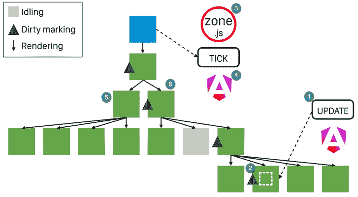

图 3.3：Angular 中的默认变更检测。改编自 Michael Hladky

让我一步步地解释：

1.  首先，用户交互触发一个事件。

1.  然后，Angular 将元素标记为需要进行脏检查。

1.  Zone.js 用于在 Angular 应用状态和 DOM 之间进行转换。

1.  Angular 引擎“滴答”作响，触发挂起任务的执行。

1.  变更检测算法避免了不脏的分支。

1.  算法识别必须重新渲染以响应在*步骤 1*中触发的事件的最高级别组件。

Angular 的默认变更检测过程是一个计算成本高昂的过程，可能会强制重新渲染应用中比必要更大的部分。Angular 还提供了一个`OnPush`变更检测策略。

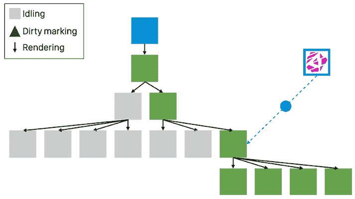

图 3.4：Angular 中的 OnPush 变更检测。改编自 Michael Hladky

`OnPush` 禁用自动变更检测，直到手动重新激活。我们只能使用此策略来激活用户交互的组件子树，限制 Angular 必须执行变更检测的数量和范围。你可以在 [`angular.dev/best-practices/skipping-subtrees`](https://angular.dev/best-practices/skipping-subtrees) 上了解更多信息。

最后，使用 RxAngular 的指令和管道，如 `RxLet`、`RxFor` 和 `RxIf`，我们可以欺骗 Angular 引擎，只有在与这些指令关联的可观察对象发生变化时才检测变更。

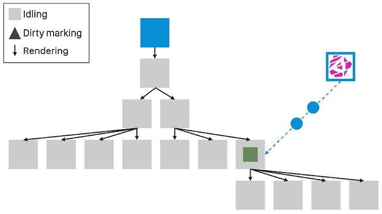

图 3.5：使用 RxAngular 指令进行变更检测。改编自 Michael Hladky

如上图所示，我们可以确保只更新需要更改的元素，而无需经过昂贵的变更检测过程。如果你已经有一个大型 Angular 应用程序，重写不是一个选择，RxAngular 可能是你解决性能问题的唯一选择。

在 Angular DC 上，Michael 的演讲深入探讨了 Angular 的性能：[`www.youtube.com/watch?v=HTU4WYWGTIk`](https://www.youtube.com/watch?v=HTU4WYWGTIk)。

在 [`www.rx-angular.io`](https://www.rx-angular.io) 上了解更多关于 RxAngular 的信息。

### Angular 信号

Angular 信号可以提供与 *图 3.5* 中在 *RxAngular* 部分所示相同的细粒度变更检测。正如你可以想象的那样，这有可能解决 Angular 最严重的性能和扩展问题。然而，截至 Angular 17，信号仍然处于部分预览状态，基于信号的组件预计将在 Angular 19 左右交付并变得稳定。当这种情况发生时，我们仍然需要重写我们应用程序的很大一部分以利用性能优势。

基于纯信号的应用程序不需要使用重 RxJS 来启用响应性。我预测其使用将很少，因为大多数服务和 API 调用都可以转换为启用 async/await 的基于 promise 的调用。这将使 Angular 非常容易学习。

在 *第九章* 的 *使用 NgRx/SignalStore 重写 Angular 应用程序* 部分，*配方 – 主/详细，数据表和 NgRx*，我展示了使用 Angular 17 可以用信号走多远。

接下来，让我们谈谈大型应用程序可能产生的构建问题。

## 构建性能

与运行时性能问题一样，代码库的大小可以在 DevEx 的质量中发挥重要作用。当项目中有更多代码时，构建代码和运行测试会变慢。这延长了开发者的反馈周期。缓慢的反馈周期会导致开发过程缓慢，错误更多，交付的质量特性更少。

虽然像 ArrowJS 或 Qwik.js 这样的极简解决方案通过要求使用最先进的工具来处理这个问题，但考虑到现有的 SPA 框架有一个庞大的安装基础和复杂的需求，它们并不能轻易做到这一点。但这并不意味着没有优秀的解决方案。

下文所述的工具可以加快你的开发过程并提高 DevEx。

### Nx

**Nx**是一个下一代构建系统，具有一流的 monorepo 支持和强大的集成。Nx 允许你将应用程序代码分解成库，并仅对需要重新构建的应用程序部分使用构建缓存。因此，小的更改不需要触发完整的构建，而是进行一个短暂的 30 秒构建，并且只重新运行受影响的测试。这一点的好处是缓存可以在远程服务器和开发机器之间共享。

Nx 还提供了一种有见地的架构，这对于非常大的团队和企业来说是非常受欢迎的。Nx 还自动更新依赖项，这对于所有现代 Web 项目来说是一个关键且耗时的工作。

你可以通过运行以下命令创建一个新的 Nx 应用程序：

```js
$ npx create-nx-workspace@latest 
```

或者，你可以通过运行以下命令将现有的应用程序迁移到 Nx：

```js
$ npx nx@latest init 
```

你可以在[`nx.dev/`](https://nx.dev/)上了解更多关于 Nx 的信息。

### esbuild

**esbuild**是一个针对 Web 的极快打包器。它的运行速度比 webpack 5 快 40 倍，而 Angular 目前依赖于它来打包 SPA，这极大地影响了构建时间。

截至 Angular 17，基于 esbuild 的**ES 模块（ESM）**构建系统是默认的构建器。你可以在[`angular.dev/tools/cli/esbuild`](https://angular.dev/tools/cli/esbuild)上了解更多。

基于 webpack 的遗留构建系统仍然被认为是稳定且完全受支持的。

要迁移到新的构建系统，请遵循[`angular.dev/tools/cli/esbuild#using-the-browser-esbuild-builder`](https://angular.dev/tools/cli/esbuild#using-the-browser-esbuild-builder)中的说明。

新的基于 esbuild 的构建系统还使下一代前端工具 Vite 成为可能。更多关于 Vite 的信息可以在[`vitejs.dev/`](https://vitejs.dev/)上找到。

你可以在[`esbuild.github.io/`](https://esbuild.github.io/)上了解更多关于 esbuild 的信息。

### 测试自动化

Karma 和 Jasmine 工具正显示出它们的年代感。Karma 从未考虑过无头单元测试。Angular 的原始**端到端（e2e）**测试工具 Protractor 已经被弃用并替换为 Cypress。这在*第四章*，*创建以路由为首要业务应用*中有详细说明。Cypress 易于使用，是 Protractor 的绝佳替代品。

让我们来看看几个 Karma 和 Jasmine 的替代方案，以实现更快的单元测试：

+   Jest（[`jestjs.io`](https://jestjs.io)）是一个几乎可以无缝替换 Jasmine 的内置测试运行器。我在利用 Jest 与我的 CLI 工具方面有很好的体验；然而，Jest 从未被构建为支持 ES 模块。这导致在使用 CommonJS 模块和 ES 模块时出现重大兼容性问题，这在任何现有应用程序中通常是情况。问题如此模糊且严重，以至于我不得不放弃升级书中示例代码到 Jest 的努力。

    截至出版时，Angular 支持预览中的 Jest。然而，我不建议你使用它。

+   由 Vite 驱动的 Vitest（[`vitest.dev/`](https://vitest.dev/)）是一个闪电般的单元测试框架，代表了可接受的未来状态。然而，为了无缝利用 Vitest，你还应该使用 Vite 附带基于 esbuild 的构建配置。

+   Cypress（[`www.cypress.io/`](https://www.cypress.io/)）通常以其端到端测试能力而闻名。然而，你也可以使用 Cypress 编写组件测试。一旦你为 Angular 项目配置了 Cypress，每次你生成一个新组件时，也会添加一个新的 Cypress 组件测试文件。Cypress 对组件测试的黑盒方法使得编写新测试变得更容易，但它们不能被称为单元测试。

一旦（如果）所有这些预览中的六分之一或更多的技术毕业到 Angular 生产状态，这个强大的 SPA 框架将准备好迎接未来。与此同时，不要低估像 Qwik.js 这样的替代方案，对于极端性能敏感的应用程序来说。

现在你已经知道怪物藏在哪里了，你准备好着手执行你的项目了。但是等等，不要急于开始编码。有一个计划在位是必不可少的。

# 使用看板和 GitHub 项目进行规划

在上路之前有一个路线图对于到达目的地至关重要。同样，在开始编码之前制定一个粗略的行动计划对于确保项目成功至关重要。尽早制定计划可以让你的同事或客户了解你打算完成什么。然而，任何初始计划都注定会随着时间的推移而改变。

敏捷软件开发旨在随着时间的推移适应不断变化的需求和功能。看板（Kanban）和 Scrum 是两种最受欢迎的项目管理方法，你可以使用它们来管理你的项目。每种方法都有一个待办事项的概念，以及列出计划、进行中和已完成的工作。包含优先级任务列表的待办事项，确立了关于接下来需要做什么的共享理解。列出每个任务状态的列表充当信息发射器，利益相关者可以在不打扰你工作流程的情况下获取更新。无论你是为自己还是为他人开发应用程序，保持一个活跃的待办事项并跟踪任务进度都能带来回报，并保持对你要实现的目标的关注。

你可以利用 GitHub 项目作为看板。在企业中，你可以使用票务系统或工具来维护待办事项列表，实施 Scrum 方法，并显示看板。在 GitHub 中，问题代表你的待办事项。你可以利用内置的**项目**标签来定义代表发布或迭代的任务范围，以建立看板。GitHub 项目直接集成到你的 GitHub 仓库的问题中，并通过标签跟踪问题的状态。这样，你就可以继续使用你选择的工具与你的仓库交互，同时轻松地发射信息。

**信息发射器**是一种在敏捷项目管理与软件开发中使用的动态工具，用于在高度可见的区域展示关键项目信息。它旨在促进透明度和便利的被动沟通，确保团队成员能够持续且轻松地了解项目的关键方面，如进度、目标、截止日期和潜在问题。通常放置在公共工作区，信息发射器可能以大型白板或数字显示屏的形式出现，展示易于理解的图表、图形或看板。其主要功能是保持信息的时效性和相关性，提供项目状态的实时快照。通过这样做，它增强了协作，有助于快速识别瓶颈，并允许及时做出决策。因此，信息发射器既是团队互动的焦点，也是促进更投入、更了解团队动态的催化剂。

在下一节中，你将设置一个项目以实现这一目标。

## 设置 GitHub 项目

让我们设置一个 GitHub 项目：

1.  在浏览器中导航到你的 GitHub 仓库。

1.  切换到**项目**标签。

1.  选择**新建项目**。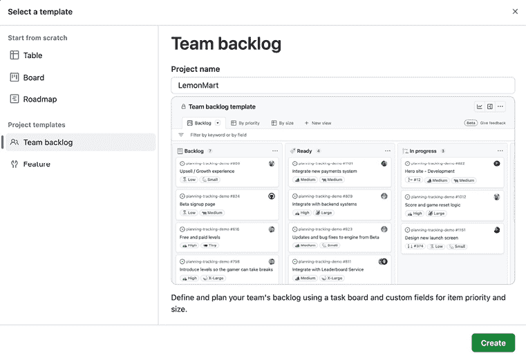

    图 3.6：在 GitHub 中创建新项目

1.  在**项目名称**框中提供名称。

1.  选择名为**团队待办事项**的项目模板。

1.  点击**创建**。

我们刚刚创建了一个看板，这是一种轻量级的工作组织方法，你可能选择它而不是其他如 Scrum 的方法。观察你的看板，它应该如下所示：

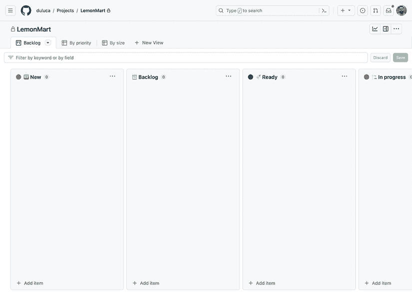

图 3.7：你的项目看板

画板默认配置包括以下列：

+   **新建**：用于添加新问题

+   **待办事项**：要工作的优先级任务列表

+   **就绪**：符合就绪定义且可以立即工作的任务

+   **进行中**：正在进行的任务；使用三点菜单，你可以设置项目数量限制，强制执行**工作在进度中**（**WIP**）限制

+   **待审阅**：处于代码审查、质量测试和**产品负责人**（**PO**）批准中的工作

+   **完成**：符合完成定义的工作

**就绪定义**定义了“知道何时将待办事项项细化到足以开始工作的标准”和**完成定义**定义了“知道何时将待办事项项完成的标准”。定义这些标准作为团队规范的一部分是至关重要的。要了解更多关于成功运行看板项目的信息，请查看我的同事 Nicole Spence-Goon 的文章：[`www.excella.com/insights/successful-agile-project-with-transient-teams`](https://www.excella.com/insights/successful-agile-project-with-transient-teams)。

如果您在您的存储库中已有 GitHub 问题或拉取请求，您可以使用**+ 添加项目**按钮单独或批量将它们添加到您的项目中。您还可以将来自不同存储库的问题组合在一起。

## 自定义看板板

您的板默认配置为看板板，带有所有必要的列。默认情况下，在您的项目中创建的问题和打开的**拉取请求**（**PR**）将自动添加到板上。

您可以通过打开以下截图中的三明治菜单标记为**1**的**工作流程**屏幕来完成此操作：

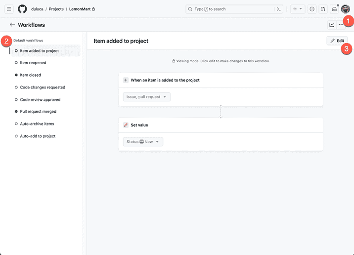

图 3.8：看板板工作流程

**2**号显示了默认工作流程列表。您可以选择一个，并使用标记为**3**的**编辑**按钮来更改自动行为。

GitHub 项目还有一个里程碑的概念。您可以为问题或 PR 创建里程碑，并设置冲刺或发布，通过三明治菜单旁边的**洞察**屏幕跟踪完成百分比或其他统计数据，该屏幕标记为数字**1**。

您还可以通过点击**+ 新视图**按钮添加路线图以获得不同的视图。GitHub 项目的最强大功能是与其开发者工作流程的集成。请参阅以下 PR：

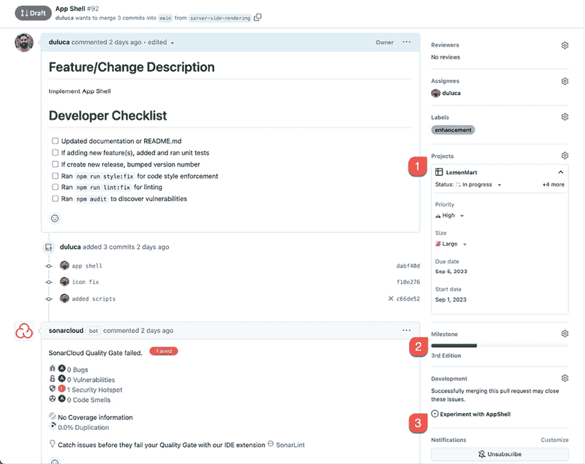

图 3.9：与项目集成的拉取请求

**1**号显示 PR 位于**LemonMart**项目的**进行中**列。开发者可以获取可快速查看的信息，并在 PR 内操作项目文件。在**2**号中，我们可以看到 PR 被分配给**第 3 版**里程碑，其中我们可以看到一个显示完成百分比的进度条。最后，**3**号显示了 PR 可以解决的一个或多个问题。

## 为您的应用创建优先级待办事项

与您的团队一起，创建一个待办事项列表来跟踪您实现应用程序设计时的进度。在创建问题时，您应该专注于交付具有用户价值的功能性迭代。

避免创建纯粹的技术任务。您必须克服以实现这些结果的技术障碍对您的用户或客户没有兴趣。错误报告是可以的，因为它们会影响您的用户。然而，技术任务成为您试图解决的函数问题的一部分，因此请在此背景下解决它们。这样，当您的组织中的业务领导向您提出要求时，您总能准备好将正在进行的工作转化为交付的价值。

当您将项目添加到待办事项列表时，请确保对其进行优先排序。首先要工作的项目将排在最上面，并按重要性顺序下降。新项目进入**新**列，并且仅在梳理会议中添加到待办事项列表，以便对其必要性和优先级进行适当的评估。有了优先排序的待办事项列表，您就掌握了路线图，您的团队也准备好开始工作了。

最终，GitHub 项目提供了一个易于使用的图形用户界面，以便非技术人员可以轻松地与 GitHub 问题进行交互。通过允许非技术人员参与 GitHub 上的开发过程，您可以解锁 GitHub 成为您整个项目单一信息源的好处。关于功能和问题的疑问、答案和讨论都被跟踪为 GitHub 问题的一部分，而不是在电子邮件中丢失。您还可以在 GitHub 上存储类似维基的文档。因此，通过在 GitHub 上集中所有项目相关的信息、数据、对话和工件，您可以极大地简化需要持续维护且成本高昂的多个系统之间的复杂交互。GitHub 为私有仓库和本地企业安装提供了非常合理的费用。如果您坚持开源，就像我们在本章中所做的那样，所有这些工具都是免费的。

在制定路线图后，让我们探讨如何优先处理工作和执行我们应用的设计和架构的哲学。

# 80-20 解决方案

无论我们是在家中开发应用、出于激情的项目，还是在办公室为工作开发应用，我们都必须牢记我们的目的：提供价值。如果我们不能通过我们的激情项目提供价值，我们不会感到满足或快乐。如果我们无法在工作场所提供价值，我们可能得不到报酬。

提供现代网络应用是困难的。我们需要克服许多挑战才能取得成功：

+   迭代和增量交付

+   具有可扩展性

+   服务数十个屏幕和输入类型

+   可用性

+   可访问性

+   管理团队

+   梳理优先排序的待办事项列表

+   确保验收标准清晰、简洁、具体

如果您曾经领导过一个项目或尝试过独立实施和交付一个项目，您会意识到在任何特定项目中，时间和资源永远都不够用来覆盖广泛的利益相关者、团队和技术需求。记住帕累托原则，也称为 80-20 法则，意味着我们可以用总体努力的 20%完成 80%的目标。

如果我们将 80-20 法则应用于我们的工作，我们可以最大化我们的产出、质量和幸福感。业务线应用是我们行业的基石。应用 80-20 法则，我们可以推断出我们中的大多数人将通过提供此类应用来赚取大部分收入。因此，我们应该将我们的工程开销保持在最低，并减少我们项目的交付风险。通过限制生产代码中的实验，我们为团队成员创造了一个可预测的环境，并且只引入我们在概念验证或小型应用中已有机会审查过的变化。

我们的 80-20 策略，结合纪律，可以帮助我们在同一时间以更多功能和更好的质量交付相同的项目。将你的职业生涯视为一场马拉松而不是一系列冲刺，你可以发现自己处于能够项目接项目地交付高质量解决方案的位置，而不会感到疲惫不堪。

## 理解业务线应用

根据维基百科，业务线应用是一套*“被认为对企业运营至关重要的关键计算机应用。”* 业务线应用是大多数开发者最终会开发的应用，即使我们可能认为我们开发的是小型应用或大型企业应用。考虑以下插图，它展示了我们可能开发的应用类型，并放置在一个相对于其大小和范围的轴上：

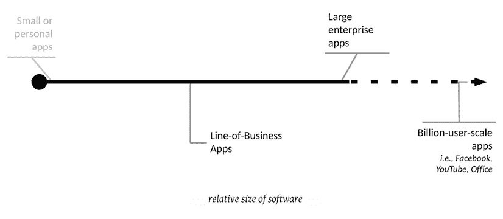

图 3.10：四种类型应用的大小和范围

从我的角度来看，当我们开始开发软件时，我们会考虑四种类型的应用：

+   小型应用

+   业务线应用

+   大型企业应用

+   亿级用户规模的应用

亿级用户规模的应用是完全的利基实现，很少需要与大多数现有应用相匹配的需求。因此，我们必须将这些应用归类为异常值。

小型应用从小开始。在架构上，它们很可能是最初设计不足的。随着你向小型应用添加功能和团队成员，在某个时候，你将遇到麻烦。随着你的团队规模和功能集的增长，或者应用的整体复杂性增加，应用的架构需求呈指数增长。

一旦你超过了你的架构可以承受的复杂性拐点，你将面临代价高昂的重构努力以回到正轨。请看以下图表说明这一概念：

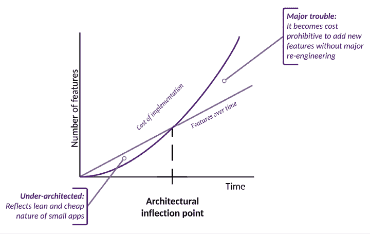

图 3.11：小型应用的架构之旅

特性线以下的区域代表设计不足，这会给你的项目带来风险。特性线以上的区域显示了支持所需功能所需的工程开销。相比之下，大型企业应用从大规模的过度设计努力开始，如下面的图所示：

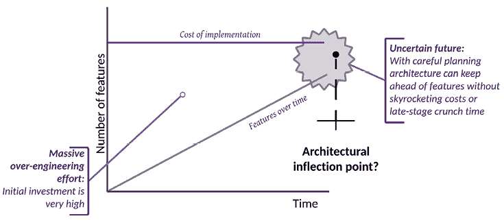

图 3.12：大型企业应用的架构之旅

随着时间的推移和系统整体复杂性的增加，大型企业应用也可能面临类似的拐点，原始架构可能变得不足。通过谨慎规划和管理工作，你可以避免麻烦并保护所做的重要初始投资。这样的大型企业应用需要数百名开发者，多个级别的经理和架构师才能成功执行。像亿级用户规模的应用一样，这些应用也可能有特定的架构需求。在我们开发的小型应用和大型企业应用之间，存在着 LOB 应用。

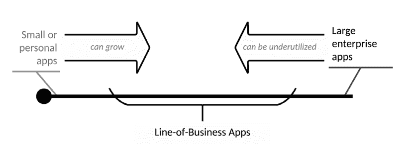

图 3.13：软件演化的动态性质

如前图所示，小型应用可以成长并转变为 LOB 应用，而大型企业应用由于用户忽略了他们从未需要的功能，却保留应用以单一目的作为 LOB 应用，可能会变得利用率低下。在任何情况下，尽管我们尽了最大努力，但我们最终为解决我们正在解决的问题提供了一个低效的解决方案。我们都没有水晶球来预见未来，在不可预测的商业环境中，规划和工程只能为我们做这么多；我们需要依靠 80-20 法则来制定一个灵活变通、但足以满足大多数商业需求的架构。

在后续章节中介绍的“路由优先架构”旨在保持最佳架构开销，以避免在交付所有必需功能时的昂贵重工程或后期冲刺。让我们看看如何做到这一点。

我在 2018 年这本书的第一版中提出了“路由优先架构”这个术语。从那时起，我在十几个会议上讨论过它，并在数百万美元的项目中成功实施了它。以下是我在 2018 年 6 月 Angular DC 聚会上的第一次演讲：[`www.youtube.com/watch?v=XKuFNiV-TWg`](https://www.youtube.com/watch?v=XKuFNiV-TWg)。

## 严谨和平衡的方法

我们已经涵盖了软件开发中的“什么”，但在我们能够到达“如何”之前，我们必须考虑“为什么”、“何时”、“何地”和“谁”。当我们为学习或激情项目开发应用时，我们通常会低估我们的项目。如果你的激情项目意外地一夜成名，维护或继续添加功能到你的应用将变得昂贵。在这种情况下，你将不得不承担持续维护成本或面临应用程序的重写。

当我们为工作开发应用时，我们往往更加保守，可能会过度设计我们的解决方案。然而，如果你只为工作编码，你可能会在面向生产的代码上进行实验。在与其他团队成员的代码库中实验是危险的。你可能会引入一个新模式，而你的团队不了解你选择的结果。你也可能不太了解你引入的技术的中长期风险或收益。

草率实验也可能对你的团队成员产生严重的负面影响。在一个由资深和经验丰富的软件工程师组成的团队中，你可能在移动车辆中进行实验。然而，我们团队中可能会有不同背景和学习风格的成员。我们中的一些人有计算机科学学位，一些人是独行侠，还有一些人过度依赖 Stack Overflow。我们中的一些人在支持职业发展的公司工作，但也有一些人在不会给我们一天时间学习新东西的地方工作。因此，在实验时，我们必须考虑我们的环境；否则，我们可能会让我们的同事加班或感到无助和沮丧。

采用有纪律和平衡的方法，我们可以减少交付的 bug 数量，避免昂贵的返工，并与一个朝着同一方向前进的团队一起工作。我们还需要正确的架构、工具和模式/实践来成功交付。总之，我们的方法必须考虑以下方面：

+   我们应用的大小

+   我们开发应用的原因

+   开发者的技能水平

+   迭代和增量交付

+   特性不断向前流动

+   云架构、运营成本和网络安全

理想情况下，我们需要保持最佳工程开销。我们的架构应该支持我们的短期需求，同时具有可扩展性，这样我们就可以在短期或长期需求改变时转向不同的方向，而无需重写大量代码。考虑以下图表，与上一节中关于小型和大型企业应用的图表形成对比：

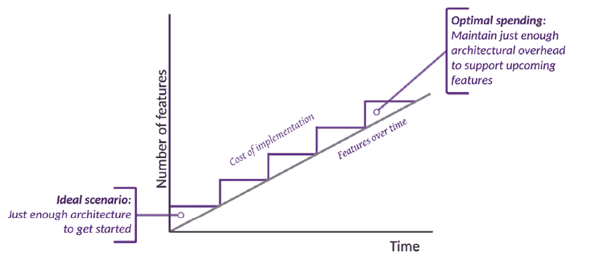

图 3.14：LOB 应用的理想架构之旅

路由优先架构旨在帮助你找到代码库的工程开销、特性交付和灵活性之间的平衡。然而，你负责管理事物的纪律方面。

Shu Ha Ri 是一个可以帮助你将纪律带入工作的概念。它是一种思维方式，指导你首先掌握基础知识，而不必担心底层理论，然后掌握理论，最后能够将你掌握的内容适应到你的需求中。然而，如果你跳过了步骤 1 或 2，你可能会发现自己错误地适应了错误的事物。

在涵盖了*什么*、*为什么*、*何时*、*何地*和*谁*之后，让我们在下一节中跳入*如何*。

# 路由优先架构

路由优先架构是一种方法：

+   **强制**高级思维

+   **在开始编码之前**确保对特性达成共识

+   **规划**你的代码库/团队的增长

+   **引入**小的工程开销

实施路由优先架构有七个步骤：

1.  制定路线图和范围（*第四章*）。

1.  考虑懒加载进行设计（*第四章*）。

1.  实施步行骨架导航体验（*第四章*）。

1.  实现无状态、数据驱动的架构（*第 4-5 章*）。

1.  强制实施解耦组件架构（*第 6-9 章*）。

1.  区分用户控件和组件（*第八章*）。

1.  利用 TypeScript 和 ES 特性最大化代码重用（*第 5-9 章*）。

如前所述，每个步骤将在本章节和接下来的章节中更详细地介绍。在我们从高层次概述这些步骤之前，让我们首先介绍 Angular 中的功能模块，这是重要的基本技术概念。

## 功能模块

在*第一章*，*Angular 的架构和概念*中，我们以高层次概述了 Angular 的架构，并介绍了懒加载和路由的概念。功能模块是实现懒加载的关键组件。有两种类型的模块：根模块和功能模块。模块是通过`NgModule`类实现的。`NgModule`包含渲染组件和注入服务所需的所有必要元数据。在独立组件引入之前，没有模块的组件无法做很多事情。但现在，一个独立组件可以导入其依赖的模块、组件和提供者，而无需模块。

一个 Angular 应用由位于应用程序根部的`NgModule`定义。这被称为根模块。从 Angular 17 开始，独立项目默认启用。因此，而不是根模块，会创建一个`AppConfig`对象，它在引导过程中扮演与根模块相似的角色。根模块渲染在`index.html`文件中的`<app-root>`元素中显示的内容。在以下图中定位根模块，它与`AppConfig`可互换：

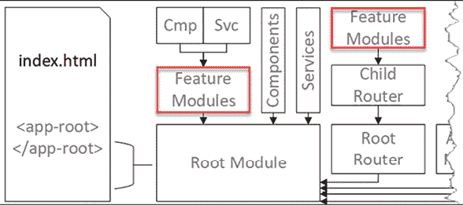

图 3.15：Angular 的主要架构组件

`NgModule`可以包含许多其他的`NgModules`。一个 Angular 应用只能有一个根模块或者没有。这意味着你实现的`NgModule`是一个功能模块。在先前的图中，你可以看到你可以将一组组件（**Cmp**）和服务（**Svc**）组织到功能模块中。将功能分组到模块中允许我们将代码组织成块，这些块可以与应用程序的初始包分离。

根模块和功能模块的这个概念代表了一种父子关系，这个概念扩展到其他功能和框架。例如，注意先前的图中将根路由注入到根模块中。根路由可以有子路由。子路由可以配置为加载功能模块。同样，NgRx 有根模块和功能模块级别的存储来组织应用程序的状态数据。

在本书中提到的任何关于子模块、子模块或功能模块的提及，都指的是同一件事：一个不是根模块的模块。

功能模块和子路由允许将应用程序的主要组件之间的关注点分离。两个团队可以在不相互干扰的情况下分别工作在不同的模块上。这种分离意味着任何功能模块所需的依赖都必须明确添加到该模块的导入、声明或提供者中。对于独立组件，这些导入和提供者必须添加到每个组件中。这可能会显得重复且令人烦恼，但这是必要的恶行。

如同在*第二章*，*形式、可观察量、信号和主题*中所述，服务默认是单例的——每个模块一个实例。然而，你可以从`@Injectable`注解中移除`providedIn: 'root'`属性，并在不同的注入上下文中使用该服务。你可以在功能模块或组件级别提供服务的副本。当你这样做时，请注意，如果在同一继承链中的多个上下文中提供相同的服务，例如在根模块和一个功能模块或组件中，你最终会有多个可能被注入的服务实例，这会破坏依赖注入系统的预期。

如你所见，在大多数情况下，模块引入了一个复杂且通常不必要的抽象层。这是 Angular 现在默认生成独立项目的主要原因。

现在，让我们从高层次上回顾一下路由优先架构的七个步骤。

## 制定路线图和范围

在项目早期就制定路线图和确定范围对于确保高级架构的正确性至关重要。创建待办事项列表、线框图、原型和交互式原型将帮助你确定路线图，在踏上道路之前捕捉到具体的愿景。重要的是要记住，只有在必要时才使用工具。如果一张纸和一支铅笔就能解决问题，就不要从 Photoshop 开始。如果利益相关者和团队成员理解正在开发的内容，就能够在迭代和增量交付解决方案。然而，不要陷入完美的陷阱。在基本要素到位并获得一致同意之后，再进行微调和家具调整。

记录你创建的每个工件。在*第四章*，*创建路由优先的业务线应用程序*中，我们介绍了如何利用 GitHub 维基来存储你的工件。

在本章的后面部分，我们将介绍如何制定路线图和定义范围的技术，这些技术是在*使用看板和 GitHub 项目进行规划*部分中介绍的路线图构建技术的基础上。

## 考虑懒加载进行设计

您的第一幅画非常重要！根据 2018 年 Google Analytics 团队的数据，当加载时间超过 3 秒时，53%的移动用户放弃了网站。在同一时期，大多数网站都是在移动设备上被消费的——在美国约占 70%，在中国约占 90%。UI 库和静态资产可以显著增加您应用程序的大小。由于大多数内容都是在移动设备上被消费的，因此推迟非关键资产的加载非常重要。

我们通过将 Angular 应用程序的部分划分为功能模块来推迟资产的加载。这样，Angular 可以只加载渲染当前屏幕所需的资产，并在需要时动态下载进一步的资源。您可以通过定义应用程序可能使用的各种用户角色来开始考虑如何将应用程序划分为功能模块。用户角色通常表示用户的职能，如经理或数据录入专员。从技术角度来说，它们可以被视为特定用户角色可以执行的一组操作。毕竟，数据录入专员永远不会看到经理可以看到的大多数屏幕，那么为什么要把这些资产提供给这些用户并减慢他们的体验呢？

将您的应用程序按业务功能划分的更明确策略是。您可以将每个工作职能视为应用程序的一个子模块。遵循低耦合和高内聚的原则，您会希望将相关的功能分组到可以懒加载的模块中。这样，当用户在业务功能内执行任务时，他们不会因为延迟而受到干扰。然而，当用户从一个业务功能切换到另一个业务功能时，我们可以加载新的模块，轻微的延迟是可以接受的。

您可以设置预加载策略，在用户与您的应用程序交互时在后台急切地加载所有模块。这将消除任何过渡延迟。

更多信息，请参阅[`angular.dev/guide/ngmodules/lazy-loading#preloading`](https://angular.dev/guide/ngmodules/lazy-loading#preloadingv=HTU4WYWGTIk)。

懒加载对于创建可扩展的应用程序架构至关重要，它允许您提供高质量和高效的产品。懒加载是我们将作为一个基本设计目标解决的问题。在事后实现懒加载可能会很昂贵。

也可能对单个独立组件进行懒加载。独立组件不需要 Angular 应用程序所需的全部引导。

您可以在[`angular.io/guide/standalone-components#lazy-loading-a-standalone-component`](https://angular.io/guide/standalone-components#lazy-loading-a-standalone-component)详细了解这些组件。

在本章的后面部分，您将学习如何使用功能模块实现懒加载。

## 实现一个行走骨架

配置懒加载可能很棘手，因此早期确定走廊骨架导航体验至关重要。实现应用的点击版本将帮助您在早期收集用户反馈。这样，您将能够快速解决基本的工作流程和集成问题。此外，您将能够确立当前开发工作的具体范围。开发人员和利益相关者都将能够更好地可视化产品的外观。

走廊骨架也为多个团队协作奠定了基础。多个人可以同时开始开发不同的功能模块或组件，而不必担心这些拼图碎片如何最终拼合在一起。到本章结束时，您将完成实现示例应用 LemonMart 的走廊骨架。

## 实现无状态、数据驱动的设计

如同在*第五章*，*设计身份验证和授权*中强调的，在全栈架构中实现无状态设计对于构建可维护的应用至关重要。正如*第一章*，*Angular 的架构和概念*以及随后的*第九章*，*食谱 – 主/详细信息，数据表和 NgRx*中所述，Flux 模式与 NgRx 使得为您的应用实现不可变状态成为可能。然而，Flux 模式对于大多数应用来说可能过于复杂。NgRx 本身利用了 RxJS 中的许多核心技术。

我们将使用 RxJS 和响应式编程范式来实现应用的最小化、无状态和数据驱动模式。识别用户将与之交互的主要数据实体，例如发票或人员，将帮助您避免过度设计您的应用。围绕主要数据实体进行设计将有助于早期确定 API 设计，并帮助定义您将用于实现无状态、数据驱动设计的`BehaviorSubject`数据锚点。该设计反过来将确保解耦的组件架构，正如*第二章*，*表单、可观察对象、信号和主题*中详细描述的。

通过定义可观察的数据锚点，您可以确保各个组件之间的数据保持同步。我们可以通过编写函数式响应式代码，利用 RxJS 特性，并在组件中不存储状态来实现不可变数据流。

我们将在*第五章*，*设计身份验证和授权*中介绍如何为您的应用设计数据模型，并在接下来的章节中继续使用这些模型。

## 强制执行解耦的组件架构

如同在*第一章*，*Angular 的架构和概念*中讨论的，解耦架构中的组件对于确保代码库的可维护性至关重要。您可以通过利用`@Input`和`@Output`绑定以及路由编排来在 Angular 中解耦组件。

绑定可以帮助你维护一个简单的组件层次结构，并避免在静态设计更有效的情况下使用动态模板，例如创建多页表单。

路由出口和辅助路径允许你使用路由组合视图。解析器可以通过消耗路由参数来帮助加载数据。身份验证守卫可以帮助控制对各种模块和组件的访问。使用路由链接，你可以以不可变和可预测的方式动态定制用户将看到的元素，就像我们在上一步中设计和开发数据锚点的方式一样。

如果你确保每个组件都负责加载其数据，那么你可以通过 URL 组合组件。然而，过度使用路由可能会成为一种反模式。如果一个父组件在逻辑上拥有一个子组件，那么将它们解耦的努力将是徒劳的。

在*第二章*，*表单、Observables、Signals 和 Subjects*中，你学习了如何使用`BehaviorSubject`和`Signals`启用组件交互。在*第八章*，*食谱 - 可重用性、表单和缓存*中，你将学习如何实现`@Input`和`@Output`绑定，在接下来的章节中，你将学习如何实现路由功能。

## 区分用户控件和组件

另一个重要的观点是区分用户控件和组件。用户控件就像是一个定制的日期输入或星级评分器。它通常是高度交互性和动态的代码，高度耦合、复杂且复杂。这些控件可能使用很少使用的 Angular API，如`NgZone`、`Renderer2`、`ViewContainerRef`或`DynamicComponentLoaders`。这些高度专业化和具体的 API 超出了本书的范围。

组件更像是带有字段的表单，可能包含简单的日期输入或星级评分器。由于表单封装了业务功能，其代码必须易于阅读和理解。你的代码应坚持 Angular 的基本原则，以便它稳定且易于维护，就像本书中的大多数代码一样。

通过区分用户控件和组件，你可以在决定想要创建哪种可重用代码时做出更好的决策。创建可重用代码是昂贵的。如果你创建了正确的可重用代码，你可以节省时间和资源。如果你创建了错误的可重用代码，那么你可能会浪费大量的时间和资源。

原型设计允许你早期识别可重用元素。用户控件将帮助将用户交互代码与业务逻辑分开。精心设计的组件重用将使你能够封装特定领域的功能并在以后共享它。

识别封装你希望为你的应用程序创建的独特行为的自包含用户控件是很重要的。用户控件可能会作为指令或具有数据绑定属性和紧密耦合的控制器逻辑和模板的组件来创建。

相反，组件利用路由生命周期事件来解析参数并在数据上执行 CRUD 操作。尽早识别这些组件的复用将创建出更多灵活的组件，这些组件可以在多个上下文中复用（由路由器编排），从而最大化代码复用。

我们将在第八章 *配方 – 可复用性、表单和缓存* 中介绍创建可复用组件和用户控件。

## 使用 TypeScript 和 ES 最大化代码复用

在考虑 Angular、RxJS 以及你使用的所有库提供的功能之前，记住你所使用的语言的底层特性是至关重要的。有数十年的软件工程基础，你可以利用这些基础来编写可读性和可维护的代码。

首先最重要的是 DRY 原则，即不要重复自己。所以，不要复制粘贴代码。不要只是更改一个或两个变量。积极重构你的代码，使你的函数无状态和可复用。简而言之：不要重复自己，不要重复自己，不要重复自己。

利用面向对象设计。将行为移动到类中；如果 `person` 类有一个 `fullName` 属性，不要在十几个不同的地方重新实现组装全名的逻辑。在 `person` 类中只实现一次。

这意味着你需要熟悉数据填充，即在新的实例化类中注入 JSON 对象和使用 `toJSON` 进行序列化。重要的是不要过度使用面向对象编程。你应该通过避免在类参数中存储状态来保持无状态和函数式。

通过利用泛型、继承和抽象类，你可以释放面向对象设计的力量。我们将在本书的后面部分介绍这些技术的具体示例。

TypeScript 为 JavaScript 引入了接口的概念。接口主要是一个静态类型语言的保留概念。接口代表了一个对象可以做什么的抽象概念，而不指定实现细节。此外，接口可以用来记录数据的形状。例如，你可以编写第三方 API 的部分接口来记录你感兴趣消费的字段。当其他开发者阅读你的代码时，他们可以理解他们消费的数据结构，而无需阅读另一个网站上的文档。

接口还允许你以定义良好的方式改变数据形状。因此，你可以编写一个转换函数来将外部数据的形状转换为内部数据。TypeScript 将捕获你可能犯的任何错误。进一步来说，你也可以使用接口来简化数据。如果你接收到的数据具有多实体关系结构，你可以简化关系，将数据设计从你的 UI 代码中解耦。

不要过度扁平化你的数据。对于常见对象，数组和简单形状是合适的，例如一个具有`first`、`middle`、`last`、`prefix`和`suffix`属性的`name`对象，或者常用的特定领域对象。

您还应该避免在代码中使用字符串字面量。在比较 `'apples' !== 'Oranges'` 的业务逻辑中编写代码会导致难以维护的代码。您应该在 TypeScript 中利用 `enums`，这样您的代码就不会受到程序员拼写错误或变化业务需求的影响。因此，`'oranges' === Fruit.Oranges`。

除了 TypeScript 和 ECMAScript，Angular 还提供了有助于重用逻辑的功能。Angular 验证器、管道、路由解析器和路由守卫允许你在组件和模板之间共享代码。

# 摘要

本章向您介绍了成为一名技术领导或架构师所需具备的条件。您学习了成功运行项目的要素。我们探讨了为什么 Angular 对于企业来说是一个很好的选择。然后我们深入探讨了构建高性能解决方案时需要考虑的各种工具和功能。您学习了如何创建看板，并熟悉了 80-20 规则和路由优先的架构方法来处理复杂项目。

在下一章中，您将创建一个更为复杂的**LOB**应用程序，使用路由优先的方法设计和构建具有一流身份验证和授权、用户体验以及覆盖大量可能出现在 LOB 应用程序中的需求的可扩展 Angular 应用程序。

# 进一步阅读

+   全栈 Angular 元框架：[`analogjs.org/`](https://analogjs.org/)

+   敏捷软件开发宣言：[`agilemanifesto.org`](https://agilemanifesto.org)

+   DevOps 研究与评估（DORA）研究计划：[`dora.dev/`](https://dora.dev/)

+   DORA 能力目录：[`dora.dev/devops-capabilities`](https://dora.dev/devops-capabilities)

+   什么是 Scrum 以及如何开始，Atlassian，2023 年：[`www.atlassian.com/agile/scrum`](https://www.atlassian.com/agile/scrum)

+   如何使用临时团队成功进行敏捷项目，Nicole Spence-Goon，2021 年 12 月 14 日：[`www.excella.com/insights/successful-agile-project-with-transient-teams`](https://www.excella.com/insights/successful-agile-project-with-transient-teams)

+   *哈，尚未准备好：敏捷开发的 Shu Ha Ri 方法*，Brian Sjoberg 和 Ken Furlong，2015 年 7 月 29 日：[`www.excella.com/insights/ha-not-ready-to-ri-the-shu-ha-ri-approach-to-agile-development`](https://www.excella.com/insights/ha-not-ready-to-ri-the-shu-ha-ri-approach-to-agile-development)

+   *Nx：智能、快速、可扩展的构建系统:* [`nx.dev`](https://nx.dev)

+   *RxAngular：性能与开发体验:* [`www.rx-angular.io`](https://www.rx-angular.io)

+   Webpack 模块打包器：[`webpack.js.org/`](https://webpack.js.org/)

# 问题

尽可能地回答以下问题，以确保你已理解本章的关键概念，而无需使用谷歌搜索。你知道你是否回答了所有问题吗？访问 [`angularforenterprise.com/self-assessment`](https://angularforenterprise.com/self-assessment) 获取更多信息：

1.  作为技术负责人或架构师，为了成功，你应该做哪三件事？

1.  成功项目的要素有哪些？

1.  为什么你应该在企业中使用 Angular？

1.  为企业构建 Angular 应用时最重要的考虑因素是什么？

1.  网络应用程序性能问题是由什么引起的？

1.  我们如何解决大型网络应用程序中的性能问题？

1.  什么是 LOB 应用程序？

1.  帕累托原理是什么？

1.  路由优先架构的主要目标是什么？

# 加入我们的 Discord 社区

加入我们的 Discord 空间，与作者和其他读者进行讨论：

`packt.link/AngularEnterpise3e`


