# 第四章：创建以路由优先的业务线应用

如你在第三章“架构企业应用”中阅读到的，**业务线**（**LOB**）应用是软件开发世界的基石。

在本书的此部分和后续章节中，我们将设置一个具有丰富功能的新应用，以满足具有可扩展架构和工程最佳实践的业务线应用的需求。我们将遵循路由优先的设计模式，依靠可重用组件来创建名为 LemonMart 的杂货店业务线应用。我们将讨论围绕主要数据实体进行设计的重要性，以及在实现各种条件导航元素之前完成应用程序的高级原型设计的重要性，这些元素在设计阶段可能会发生重大变化。

本项目的源代码可在 GitHub 上找到，地址为[`github.com/duluca/lemon-mart`](https://github.com/duluca/lemon-mart)，包括在`Projects`文件夹中的各个开发阶段。该项目由 Jasmine 单元测试和 Cypress 端到端测试支持，使用环境变量、Angular Material，以及利用 CircleCI 的**持续集成和持续交付**（**CI/CD**）管道。你可以在第十章“使用 CI/CD 发布到生产环境”中找到更多关于 CI/CD 的信息。

LemonMart 是一个独立的 Angular 仓库。对于企业或全栈开发，你可能会问，为什么它没有配置为单仓库？在第五章“设计身份验证和授权”中，我们将介绍如何使用 Git 的子模块功能创建单仓库。为了在大型 Angular 应用上工作提供更具有意见和更人性化的方法，我强烈建议你考虑 Nx。它智能的构建系统本身就可以节省数小时的构建时间。请在[`nx.dev`](https://nx.dev)上查看。然而，对这个工具的深入探讨超出了本书的范围。

想要冒险吗？运行以下命令以创建你的 Nx 工作空间：

```js
$ npx create-nx-workspace 
```

在本章中，我们将涵盖以下主题：

+   创建 LemonMart

+   生成具有路由功能的模块

+   品牌化、定制和 Material 图标

+   带有懒加载的功能模块

+   创建行走骨架

+   常见测试模块

+   围绕主要数据实体进行设计

+   高级用户体验设计

在第五章到第九章中，我们将逐步完善 LemonMart 以展示上述概念。

# 技术要求

书籍的示例代码的最新版本可在以下链接的 GitHub 仓库中找到。该仓库包含代码的最终和完成状态。你可以在本章末尾通过查找`projects`文件夹下的章节末尾代码快照来验证你的进度。

对于第四章：

1.  克隆仓库：[`github.com/duluca/lemon-mart`](https://github.com/duluca/lemon-mart)。

1.  在根目录下执行`npm install`以安装依赖项。

1.  项目的最终状态反映在：

    ```js
    projects/stage7 
    ```

1.  将阶段名称添加到任何`ng`命令中，使其仅对该阶段生效：

    ```js
    npx ng build stage7 
    ```

注意，存储库根目录下的`dist/stage7`文件夹将包含编译结果。

请注意，书中提供的源代码和 GitHub 上的版本可能不同。这些项目周围的生态系统是不断演变的。在 Angular CLI 生成新代码的方式、错误修复、库的新版本或多种技术的并行实现之间，存在许多难以计数的差异。如果您发现错误或有疑问，请创建问题，或在 GitHub 上提交拉取请求。

在补充指南*保持 Angular 和工具常青*中了解更多关于更新 Angular 的信息，该指南位于[`angularforenterprise.com/evergreen`](https://angularforenterprise.com/evergreen)。

接下来，让我们首先创建 LemonMart^™，这是一个功能齐全的 LOB 应用程序，您可以用作启动下一个专业项目的模板。LemonMart 是一个强大且现实的项目，可以支持功能增长和不同的后端实现，并且它自带完整且可配置的认证和授权解决方案。

自 2018 年推出以来，LemonMart 已为超过 32,500 名开发者提供了超过 257,000 个柠檬。真香！

您可以随时从 GitHub 克隆完成的项目，[`www.github.com/duluca/lemon-mart`](https://www.github.com/duluca/lemon-mart)， whenever needed。让我们直接开始吧。

# 创建 LemonMart

LemonMart 将是一个中等规模的业务线应用程序，拥有超过 90 个代码文件。我们将从创建一个新的 Angular 应用程序开始，其中已配置路由和 Angular Material。

假设您已安装了附录 A 中提到的所有必需软件，即*设置您的开发环境*。如果没有，请根据您的操作系统执行以下命令来配置您的环境。

在 Windows PowerShell 中执行：

```js
PS> Install-Script -Name setup-windows-dev-env
PS> setup-windows-dev-env.ps1 
```

在 macOS 终端中执行：

```js
$> bash <(wget -O - https://git.io/JvHi1) 
```

如需更多信息，请参阅[`github.com/duluca/web-dev-environment-setup`](https://github.com/duluca/web-dev-environment-setup)。

## 创建一个路由优先的应用程序

我们将创建 LemonMart 作为一个独立项目，这意味着不需要根模块来启动应用程序，并且应用程序内创建的所有组件都将配置为独立组件。我们将使用懒加载功能模块实现模块化架构，并选择性地使用懒加载的独立组件来共享功能模块中的组件。采用路由优先的方法，我们希望在应用程序早期启用路由：

1.  您可以通过执行此命令创建一个新的应用程序，其中已配置路由：

    ```js
    $ npm create @angular
    (Enter project name)
    (select SCSS)
    (respond no to SSR) 
    ```

1.  为我们创建了一个新的`app.routes.ts`文件：

    ```js
    **src/app/app.****routes****.****ts**
    import { Routes } from '@angular/router'
    export const routes: Routes = [] 
    ```

    我们将在路由数组内部定义`routes`。

1.  注意，`routes`在`app.config.ts`中提供，如下所示：

    ```js
    **src/app/app.****config****.****ts**
    import { ApplicationConfig } from '@angular/core';
    import { provideRouter } from '@angular/router';
    import { routes } from './app.routes';
    export const appConfig: ApplicationConfig = {
      providers: [provideRouter(**routes**) ]
    }; 
    ```

1.  最终，`ApplicationConfig`在`main.ts`中被`bootstrapApplication`消费，从而启动应用程序的引导过程：

    ```js
    **src/main.****ts**
    import { bootstrapApplication } from '@angular/platform-browser';
    import { appConfig } from './app/app.config';
    import { AppComponent } from './app/app.component';
    bootstrapApplication(AppComponent, **appConfig**)
      .catch((err) => console.error(err)); 
    ```

1.  通过运行`npm start`来执行您的项目。

## 配置 Angular 和 VS Code

使用`mrm`，一个帮助保持项目配置文件同步的命令行工具，应用以下配置步骤到您的项目中：

以下脚本不需要您使用 VS Code。如果您希望使用 WebStorm 等其他 IDE，配置的`npm`脚本同样可以正常运行。

您可以在[`mrm.js.org/docs/getting-started`](https://mrm.js.org/docs/getting-started)了解更多关于`mrm`的信息。

1.  应用 Angular VS Code 配置：

    ```js
    npx mrm angular-vscode 
    ```

1.  应用 Docker 配置的`npm`脚本：

    ```js
    npx mrm npm-docker 
    ```

1.  实现一个名为`build:prod`的`npm`脚本来在生产模式下构建您的应用程序：

    ```js
    **"scripts"****: {**
     **...,**
    **"build:prod"****:** **"ng build --configuration production"****,**
    **}** 
    ```

    默认情况下，Angular 将在生产模式下构建您的代码。但是，这种行为可以在`angular.json`中更改。因此，我更喜欢明确请求生产构建，以便将代码发布，以避免错误。

    这些设置不断调整以适应扩展、插件、Angular 和 VS Code 不断变化的格局。或者，您可以使用 VS Code 的 Angular Evergreen 扩展一键运行配置命令。

    注意，如果前面的配置脚本执行失败，以下`npm`脚本也将失败。在这种情况下，您有两个选择：撤销您的更改并忽略这些脚本，或者手动实现这些脚本，如前几章所述（或如 GitHub 上所示）。

1.  执行`npm run style:fix`。

1.  执行`npm run lint:fix`。

1.  执行`npm start`。

请参考*附录 A*，*设置您的开发环境*，以获取更多配置细节。

关于`mrm`任务的更多信息，请参阅：

+   [`github.com/expertly-simple/mrm-task-angular-vscode`](https://github.com/expertly-simple/mrm-task-angular-vscode)

+   [`github.com/expertly-simple/mrm-task-npm-docker`](https://github.com/expertly-simple/mrm-task-npm-docker)

+   [`github.com/expertly-simple/mrm-task-npm-aws`](https://github.com/expertly-simple/mrm-task-npm-aws)

## 配置 Angular Material 和样式

几年前，将重置或规范化 CSS 样式表应用到主题项目中以解决浏览器处理布局或间距的差异是一个必要的实践。然而，当前浏览器对 CSS 规范的遵循更加严格，因此传统的重置样式表可能过于冗余。以下，我使用具有重置参数如`body { margin: 0 }`和`html, body { height: 100% }`的`styles.scss`实现。

如果您想查看规范化样式表的现代版本，我推荐[`github.com/sindresorhus/modern-normalize`](https://github.com/sindresorhus/modern-normalize)。它易于设置，并在导入到`styles.scss`时无缝工作。

我们还需要设置 Angular Material 并配置一个要使用的主题：

1.  安装 Angular Material：

    ```js
    $ npx ng add @angular/material
    (select Custom, No to global typography, Yes to browser animations)
    $ npm i @ngbracket/ngx-layout 
    ```

    注意，由于这是一个独立项目，我们将在每个需要它的单个组件中导入所需的 Material 模块和`FlexModule`。当`@ngbracket/ngx-layout`包实现根级提供者时，将不再需要手动添加`FlexModule`。

1.  如以下代码所示，将常见的 CSS 追加到`styles.scss`中：

    ```js
    **src****/styles****.scss**
    …
    html, body { height: 100%; }
    body { margin: 0; font-family: Roboto, 'Helvetica Neue',
      sans-serif; }
    .top-pad { margin-top: 16px; }
    .h-pad { margin: 0 16px; }
    .v-pad { margin: 16px 0; }
    .left-pad { margin-left: 8px; }
    .flex-spacer { flex: 1 1 auto; } 
    ```

1.  在`index.html`中更新您应用程序的标题。

我们将在本章的后面部分为应用程序应用自定义品牌。接下来，让我们开始设计我们的业务应用程序。

## 设计 LemonMart

在数据库到前端的过程中，同时避免过度设计，构建一个基本的路线图来遵循是很重要的。这个初始设计阶段对于项目的长期健康和成功至关重要，其中必须打破团队之间存在的任何隔阂，并且所有团队成员都必须对整体技术愿景有清晰的理解。这比说起来容易做起来难，关于这个主题已经写了很多本书。

在工程领域，对于问题没有绝对正确的答案，因此记住没有人能够拥有所有答案或清晰的愿景是很重要的。在文化中创造一个安全的空间，允许开放讨论和实验，对于技术和非技术领导者来说至关重要。作为一个团队能够共同面对这种不确定性所带来的谦逊和同理心，与任何单个团队成员的技术能力一样重要。每个团队成员都必须感到自在，将他们的自我放下，因为我们的共同目标是在开发周期中不断增长和演变应用程序以适应不断变化的需求。如果你知道你成功了，那么你创建的软件的各个部分将很容易被任何人替换。

因此，让我们先制定一个路线图，并确定我们应用程序的范围。为此，我们将定义用户角色，然后构建一个网站图，以形成一个关于我们的应用程序可能如何工作的愿景。

### 识别用户角色

我们设计的第一步将是思考谁在使用这个应用程序以及为什么。

我们设想了 LemonMart 的四种用户状态或角色：

+   **认证用户**：任何认证用户都可以访问他们的个人资料

+   **收银员**，其唯一职责是结账客户

+   **店员**，其唯一职责是执行与库存相关的功能

+   **经理**，可以执行收银员和店员可以执行的所有操作，还可以访问管理功能

考虑到这一点，我们可以开始为我们的应用程序创建一个高级设计。

### 使用网站图来识别高级模块

按照以下图像所示，开发您应用程序的高级网站图：

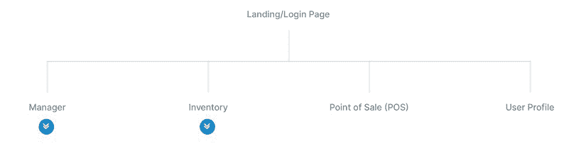

图 4.1：用户登录页面

我使用了 MockFlow.com 的 SiteMap 工具来创建显示的网站图：[`sitemap.mockflow.com`](https://sitemap.mockflow.com)。

初步检查后，有三个高级模块被确定为懒加载候选者：

+   **销售点**（**POS**）

+   **库存**

+   **经理**

收银员只能访问**POS**模块和组件。店员只能访问**库存**模块，该模块将包括**库存录入**、**产品**和**类别**管理组件的附加屏幕：

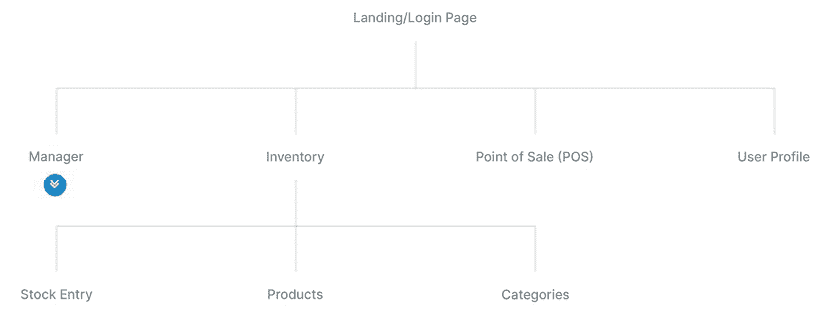

图 4.2：库存页面

最后，**经理**将能够通过**经理**模块访问所有三个模块，包括用户管理和收据查找组件：

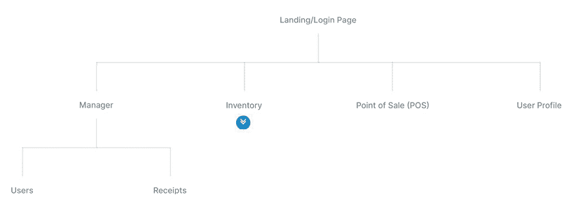

图 4.3：经理页面

为所有三个模块启用懒加载将带来巨大好处；由于收银员和店员永远不会使用属于其他用户角色的组件，因此没有必要将这些字节发送到他们的设备。随着**经理**模块获得更多高级报告功能或新角色被添加到应用程序中，**POS**模块将不会受到其他情况下不断增长的应用程序带宽和内存影响的干扰。

这意味着在相同硬件上支持调用更少，并且性能保持一致的时间更长。

# 生成具有路由功能的模块

现在我们已经将高级组件定义为**经理**、**库存**和**POS**，我们可以将它们定义为模块。这些模块将不同于您为路由和 Angular Material 创建的模块。我们可以在应用程序模块上创建用户配置文件作为组件；然而，请注意，用户配置文件将仅用于已认证的用户，因此定义一个仅针对一般已认证用户的第四个模块是有意义的。这样，您将确保应用程序的第一个负载尽可能小。此外，我们还将创建一个`home`组件来包含我们应用程序的着陆体验，这样我们就可以将实现细节排除在`app.component`之外：

1.  通过指定名称和路由能力生成`manager`、`inventory`、`pos`和`user`功能模块：

    ```js
    $ npx ng g m manager --routing
    $ npx ng g m inventory --routing
    $ npx ng g m pos --routing
    $ npx ng g m user --routing 
    ```

    注意简化的命令结构，其中`ng generate module manager`变为`ng g m manager`，同样，`--module`变为`-m`。

1.  确认您没有 CLI 错误。

    注意，在 Windows 上使用`npx`可能会抛出错误，例如`Path must be a string. Received undefined`。这个错误似乎不会影响命令的成功执行，因此始终检查 CLI 工具生成的输出是至关重要的。

1.  确认已创建文件夹和文件：

    ```js
    /src/app
    │   app.component.scss
    │   app.component.html
    │   app.component.spec.ts
    │   app.component.ts
    │   app.config.ts
    │   app.routes.ts
    ├───inventory
    │      inventory-routing.module.ts
    │      inventory.module.ts
    ├───manager
    │      manager-routing.module.ts
    │      manager.module.ts
    ├───pos
    │      pos-routing.module.ts
    │      pos.module.ts
    └───user
    │      user-routing.module.ts
    │      user.module.ts 
    ```

让我们检查 `ManagerModule` 的配置。记住，功能模块由 `@NgModule` 注解装饰。在配置有根 `NgModule` 的 Angular 应用中，你会注意到它实现了 `bootstrap` 属性，而功能模块没有实现此属性。下面是生成的代码：

```js
**src/app/manager/manager.****module****.****ts**
import { NgModule } from '@angular/core'
import { CommonModule } from '@angular/common'
import { ManagerRoutingModule } from './manager-routing.module'
@NgModule({
  imports: [CommonModule, ManagerRoutingModule],
  declarations: [],
})
export class ManagerModule {} 
```

由于我们指定了 `--routing` 选项，已创建并导入到 `ManagerModule` 中的 `routing` 模块：

```js
**src/app/manager/manager-routing.****module****.****ts**
import { NgModule } from '@angular/core'
import { Routes, RouterModule } from '@angular/router'
const routes: Routes = []
@NgModule({
  imports: [RouterModule.forChild(routes)], 
  exports: [RouterModule],
})
export class ManagerRoutingModule {} 
```

注意，`RouterModule` 正在使用 `forChild` 进行配置，而不是可选的 `forRoot` 方法，该方法配置在 `AppRouting` 模块或 `ApplicationConfig` 中的路由提供者。通过指定上下文，我们允许路由器理解不同模块上下文中定义的路由之间的正确关系。例如，在 `ManagerRoutingModule` 中定义的所有子路由都将由路由段 `/manager` 预先添加。

在继续之前，务必执行 `style` 和 `lint fix` 命令：

```js
$ npm run style:fix && npm run lint:fix 
```

现在，让我们设计 LemonMart 的着陆页将如何看起来和工作。

## 设计主页路由

将以下模拟作为 LemonMart 的着陆体验考虑：

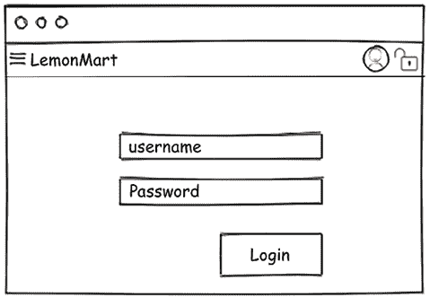

图 4.4：LemonMart 着陆体验

与 LocalCast 天气应用不同，我们不希望在 `AppComponent` 中有太多的布局标记。`AppComponent` 是你整个应用的根元素；因此，它应该只包含将在你的应用中持续出现的元素。在以下注释模拟中，标记为 **1** 的工具栏将在整个应用中保持不变。

标记为 **2** 的区域将包含 `home` 组件，该组件本身将包含一个标记为 **3** 的登录用户控件：

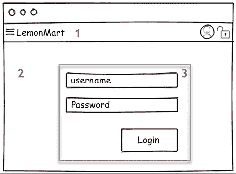

图 4.5：LemonMart 布局结构

在 Angular 中，将默认或着陆组件作为单独的元素创建是最佳实践。这有助于减少必须加载和在每个页面上逻辑执行的代码量，但它也使得在利用路由器时具有更灵活的架构。

使用内联模板和样式生成 `home` 组件：

```js
$ npx ng g c home --inline-template --inline-style 
```

注意，具有内联模板和样式的组件也称为 **单文件组件** 或 **SFC**。

现在，你已准备好配置路由器。

### 设置默认路由

让我们开始设置 LemonMart 的简单路由。我们需要设置 `/` 路由（也称为空路由）和 `/home` 路由以显示 `HomeComponent`。我们还需要一个通配符路由来捕获所有未定义的路由并显示一个 `PageNotFoundComponent`，这也必须被创建：

```js
**src/app/app.****routes****.****ts**
...
**import** **{** **HomeComponent** **}** **from****'./home/home.component'**
**import** **{** 
**PageNotFoundComponent**
**}** **from****'./page-not-found/page-not-found.component'**
const routes: Routes = [
  **{** **path****:** **''****,** **redirectTo****:** **'home'****,** **pathMatch****:** **'full'** **},**
  **{** **path****:** **'home'****,** **component****:** **HomeComponent** **},**
  **{** **path****:** **'**'****,** **component****:** **PageNotFoundComponent** **},**
]
... 
```

让我们逐步整理上述路由配置：

1.  定义 `'home'` 的路径，并通过设置 `component` 属性将路由器指向渲染 `HomeComponent`。

1.  将应用程序的默认路径`''`设置为重定向到`'/home'`。通过设置`pathMatch`属性，我们始终确保这个特定的`home`路由实例将被渲染为着陆体验；否则，在其默认前缀设置中，`pathMatch`将考虑空路径为所有路由的前缀，导致无限重定向循环。

1.  创建一个具有内联模板的`pageNotFound`组件。

1.  将`PageNotFoundComponent`配置为最后一个条目的通配符路由。

通过将通配符路由配置为最后一个条目，我们处理任何未通过优雅匹配的路由，将其重定向到`PageNotFoundComponent`。通配符路径必须是数组中的最后一个属性；否则，定义在后面的路由将不会被考虑。

### RouterLink

当用户到达`PageNotFoundComponent`时，我们希望他们能够使用`routerLink`指令返回到`HomeComponent`：

在`PageNotFoundComponent`中，替换内联模板，使用`routerLink`链接回`home`：

```js
**src/app/page-not-found/page-not-found.****component****.****ts**
...
  template: `
    **<p>**
      **This page doesn't exist. Go back to**
      **<a routerLink="/home">home</a>.**
    **</p>**
  `,
... 
```

这种导航也可以通过`<a href>`标签实现；然而，在更动态和复杂的导航场景中，你将失去诸如自动活动链接跟踪或动态链接生成等特性。

Angular 引导过程将确保`AppComponent`位于`index.html`中的`<app-root>`元素内。然而，我们必须手动定义我们希望`HomeComponent`渲染的位置，以最终完成路由配置。

### 路由出口

`AppComponent`被认为是`app-routes.ts`中定义的根路由的根元素，这允许我们在根元素内部定义出口，以动态加载我们希望使用`<router-outlet>`元素加载的任何内容：

1.  将`AppComponent`配置为使用内联模板和样式，删除`html`和`scss`文件中任何现有的内容。

1.  为你的应用程序添加工具栏。

1.  将应用程序的名称作为按钮链接添加，以便在点击时将用户带到主页。

1.  在组件中导入`RouterLink`、`RouterOutlet`和`MatToolbarModule`。

1.  为内容添加`<router-outlet>`以进行渲染：

    ```js
    **src/app/app.****component****.****ts**
    ...
    template: `
      <mat-toolbar color="primary">
        <a mat-button routerLink="/home"><h1>LemonMart</h1></a>
      </mat-toolbar>
      <router-outlet></router-outlet>
    `, 
    ```

现在，`home`的内容将渲染在`<router-outlet>`内。

# 品牌、定制和 Material 图标

为了构建一个吸引人且直观的工具栏，我们必须向应用程序引入一些图标和品牌，以便用户可以在熟悉图标的帮助下轻松地导航应用程序。

## 品牌

在品牌方面，你应该确保你的 Web 应用有一个自定义的色彩调色板，并且与桌面和移动浏览器功能集成，以突出你的应用名称和图标。

## 色彩调色板

使用位于[`m2.material.io/design/color/the-color-system.html#tools-for-picking-colors`](https://m2.material.io/design/color/the-color-system.html#tools-for-picking-colors)的**Material Color**工具选择一个色彩调色板。对于 LemonMart，我选择了以下值：

1.  **主颜色**- `#2E7D32`：

    ```js
    $lemon-mart-primary: mat.define-palette(mat.$green-palette, 800); 
    ```

1.  **次要颜色**- `#C6FF00`：

    ```js
    $lemon-mart-accent: mat.define-palette(mat.$lime-palette, A400); 
    ```

    您可以在`styles.scss`中实现您的主题，或者创建一个单独的主题文件。如果打算进一步自定义单个组件，则单独的文件很有用。

1.  添加一个名为`lemonmart-theme.scss`的文件

1.  将与主题相关的 CSS 从`styles.scss`移动到新文件。主题相关内容将在以下行之上：

    ```js
    **styles****.scss**
    ...
    /* You can add global styles to this file and also import other style files */
    ... 
    ```

1.  将`styles.scss`更新为在文件的第一行包含新主题：

    ```js
    **styles****.scss**
    @use 'lemonmart-theme';
    ... 
    ```

1.  使用所选的色彩调色板配置您的自定义主题。

您还可以从 GitHub 获取与 LemonMart 相关的资源，网址为[`github.com/duluca/lemon-mart`](https://github.com/duluca/lemon-mart)。

对于 LocalCast 天气应用，我们替换了`favicon.ico`文件，以在浏览器中为我们的应用打上品牌。虽然这在 10 年前就足够了，但今天的设备种类繁多，每个平台都可以更好地利用优化后的资源来代表您的 Web 应用在其操作系统中的表现。接下来，让我们实现一个更健壮的 favicon。

## 实现浏览器清单和图标

您必须确保浏览器在**浏览器**标签中显示正确的标题文本和图标。此外，应创建一个实现各种移动操作系统特定图标的清单文件，以便如果用户将您的网站固定，将显示一个类似其他手机应用图标的图标。这将确保如果用户在移动设备的首页上收藏或固定您的 Web 应用，他们将获得一个看起来像原生应用图标的图标：

1.  从设计师或类似[`www.flaticon.com`](https://www.flaticon.com)的网站创建或获取您网站标志的 SVG 版本。

1.  在这个例子中，我将使用尤里卡柠檬的相似图像：

    图 4.6：LemonMart 的标志性标志

    当使用在线找到的图片时，请注意适用的版权。在这种情况下，我已购买许可证以能够发布这个柠檬标志，但您可以在以下 URL 获取自己的副本，前提是您向图片的作者提供所需的归属：[`www.flaticon.com/free-icon/lemon_605070`](https://www.flaticon.com/free-icon/lemon_605070)。

1.  使用工具如[`realfavicongenerator.net`](https://realfavicongenerator.net)生成`favicon.ico`和清单文件。

1.  调整 iOS、Android、Windows 和 macOS Safari 的设置以符合您的喜好。

1.  在生成器中，务必设置一个版本号，因为 favicon 可能会因缓存而出名；一个随机的版本号将确保用户总是获得最新版本。

1.  下载并解压缩生成的`favicons.zip`文件到您的`src`文件夹。

1.  编辑`angular.json`文件以将新资源包含到您的应用中：

    ```js
    **angular.json**
    "apps": [
      {
      ...
        "assets": [
          "src/assets",
          "src/favicon.ico",
          "src/android-chrome-192x192.png",
          "src/favicon-16x16.png",
          "src/mstile-310x150.png",
          "src/android-chrome-512x512.png",
          "src/favicon-32x32.png",
          "src/mstile-310x310.png",
          "src/apple-touch-icon.png",
          "src/manifest.json",
          "src/mstile-70x70.png",
          "src/browserconfig.xml",
          "src/mstile-144x144.png",
          "src/safari-pinned-tab.svg",
          "src/mstile-150x150.png"
        ] 
    ```

1.  在`index.html`的`<head>`部分插入生成的代码：

    ```js
    **src/index.html**
    <link rel="apple-touch-icon" sizes="180x180"
      href="/apple-touch- icon.png?v=rMlKOnvxlK">
    <link rel="icon" type="image/png" sizes="32x32"
      href="/favicon-32x32.png?v=rMlKOnvxlK">
    <link rel="icon" type="image/png" sizes="16x16"
      href="/favicon-16x16.png?v=rMlKOnvxlK">
    <link rel="manifest" href="/manifest.json?v=rMlKOnvxlK">
    <link rel="mask-icon"
      href="/safari-pinned-tab.svg?v=rMlKOnvxlK" color="#b3ad2d">
    <link rel="shortcut icon" href="/favicon.ico?v=rMlKOnvxlK">
    <meta name="theme-color" content="#ffffff"> 
    ```

    在 favicon 声明和 CSS 样式导入之间放置生成的代码。顺序很重要。浏览器自上而下加载数据。您希望应用程序的图标在用户等待下载 CSS 文件之前被解析。

1.  确保您的新 favicon 正确显示。

一旦您的基本品牌工作完成，请考虑是否希望通过主题化建立更独特的视觉和感觉。

## 自定义主题

您可以通过利用以下工具列表中的工具以及我发现的某些其他工具来进一步自定义 Material 的外观和感觉，以实现您应用独特的体验：[`m2.material.io/resources`](https://m2.material.io/resources)：

+   Material Design 主题调色板生成器将在 [`mcg.mbitson.com`](http://mcg.mbitson.com) 生成定义您自定义调色板的必要代码，以创建真正独特的主题。

+   颜色混合器有助于找到两种颜色之间的中间点，这在定义颜色样本之间的颜色时很有用，位于 [`meyerweb.com/eric/tools/color-blend`](https://meyerweb.com/eric/tools/color-blend)。

    在 2021 年，Google 宣布了 **Material 3**，也称为 Material You，这是一个动态主题系统，它适应用户在操作系统级别颜色使用方面的偏好。到 2023 年，Angular Material 仍然基于 Material 2。Angular 团队在 Angular 15 中过渡到新的 **Web 端 Material 设计组件**（**MDC**）风格组件，并在 Angular 17 中弃用旧样式。MDC 风格组件支持可调整的密度，因此更加动态。在此里程碑之后，Angular 团队计划解决 Material You 的实现问题。

    您可以关注此线程以获取更新：[`github.com/angular/components/issues/22738`](https://github.com/angular/components/issues/22738)。

在 [`material.io`](https://material.io) 上有大量关于 Material 设计深入哲学的信息，包括关于色彩系统等内容，如 [`material.io/design/color/the-color-system.html`](https://material.io/design/color/the-color-system.html)，它深入探讨了为您的品牌选择正确的调色板以及其他主题，例如为您的应用创建深色主题。

区分您的品牌与其他应用或竞争对手非常重要。创建高质量的定制主题将是一个耗时的过程；然而，通过给用户留下深刻的第一印象所带来的好处是相当可观的。

接下来，我们将向您展示如何将自定义图标添加到您的 Angular 应用中。

## 自定义图标

现在，让我们将您自定义的品牌添加到您的 Angular 应用中。您需要用于创建 favicon 的 `svg` 图标：

1.  将图片放置在 `src/assets/img/icons` 目录下，命名为 `lemon.svg`。

1.  在 `app.config.ts` 中，添加 `provideHttpClient()` 作为提供者，以便可以通过 HTTP 请求 `.svg` 文件。

1.  更新 `AppComponent` 以注册新的 `.svg` 文件作为图标：

    ```js
    **src/app/app.****component****.****ts**
    **import** **{** **MatIconRegistry** **}** **from****'@angular/material/icon'**
    **import** **{** **DomSanitizer** **}** **from****'@angular/platform-browser'**
    ...
    export class AppComponent {
      **constructor****(**
        **iconRegistry****:** **MatIconRegistry****,** 
        **sanitizer****:** **DomSanitizer**
      **) {** 
        **iconRegistry.****addSvgIcon****(**
          **'lemon'****,**
          **sanitizer.****bypassSecurityTrustResourceUrl****(**
            **'assets/img/icons/lemon.svg'**
          **)** 
        **)**
      } 
    } 
    ```

    注意，从 URL 资源添加 `svg` 图标在 **服务器端渲染**（**SSR**）配置中不起作用。相反，您可以将 `svg` 图标作为 TypeScript 文件导入中的 `const` 字符串添加，并按以下方式注册：

    ```js
    import { LEMON_ICON } from './svg.icons'iconRegistry.
    addSvgIconLiteral('lemon', sanitizer. bypassSecurityTrustHtml(LEMON_ICON)) 
    ```

1.  导入 `MatIconModule`。

1.  按照在[`material.angular.io/components/toolbar`](https://material.angular.io/components/toolbar)文档中找到的`MatToolbar`模式，将图标添加到工具栏：

    ```js
    **src/app/app.****component****.****ts**
    template: ` 
      <mat-toolbar color="primary"> 
        **<mat-icon svgIcon="lemon"></mat-icon>** 
        <a mat-button routerLink="/home"><h1>LemonMart</h1></a> 
      </mat-toolbar> 
      <router-outlet></router-outlet>
    `, 
    ```

现在，让我们添加菜单、用户个人资料和注销的剩余图标。

## 材料图标

Angular Material 与 Material Design 图标字体无缝配合，自动作为网页字体导入到您的应用中，位于`index.html`。您可以自行托管字体；然而，如果您选择这条路，如果用户的浏览器已经从访问另一个网站时缓存了字体，那么您将无法获得好处，这可能会在下载 42-56 KB 文件的过程中节省速度和延迟。完整的图标列表可以在[`fonts.google.com/icons`](https://fonts.google.com/icons)找到。

现在让我们更新工具栏并添加一些图标，设置主页并使用最小模板添加一个假登录按钮：

1.  确保材料图标的`<link>`标签已添加到`index.html`：

    ```js
    **src/index.html**
    <head>
      ...
      <link href="https://fonts.googleapis.com icon?family=Material+Icons"
        rel="stylesheet">
    </head> 
    ```

    在[`google.github.io/material-design-icons/#getting-icons`](http://google.github.io/material-design-icons/#getting-icons)的**自托管**部分可以找到自托管说明。

    一旦配置完成，使用材料图标就变得简单。

1.  在`AppComponent`上，更新工具栏，将**菜单**按钮放置在标题的左侧。

1.  添加`fxFlex`指令，以便剩余的图标右对齐。

1.  导入`FlexModule`和`MatButtonModule`。

1.  添加用户个人资料和注销图标：

    ```js
    **src/app/app.****component****.****ts**
    template: `
      <mat-toolbar color="primary">
        **<button mat-icon-button>**
          **<mat-icon>menu</mat-icon>**
        **</button>**
        <mat-icon svgIcon="lemon"></mat-icon>
        <a mat-button routerLink="/home"><h1>LemonMart</h1></a>
        **<span class="flex-spacer"></span>**
        **<button mat-icon-button>**
          **<mat-icon>account_circle</mat-icon>**
        **</button>**
        **<button mat-icon-button>**
          **<mat-icon>lock_open</mat-icon>**
        **</button>**
      </mat-toolbar>
      <router-outlet></router-outlet>
    `, 
    ```

1.  在`HomeComponent`上，添加一个用于登录体验的最小模板，替换任何现有内容。别忘了导入`FlexModule`和`MatButtonModule`：

    ```js
    **src/app/home/home.****component****.****ts**
      styles: [`
        div[fxLayout] {margin-top: 32px;}
      `],
      template: `
        <div fxLayout="column" fxLayoutAlign="center center">
          <span class="mat-display-2">Hello, Limoncu!</span>
          <button mat-raised-button color="primary">Login</button>
        </div>
      ` 
    ```

您的应用应该看起来与这张截图相似：

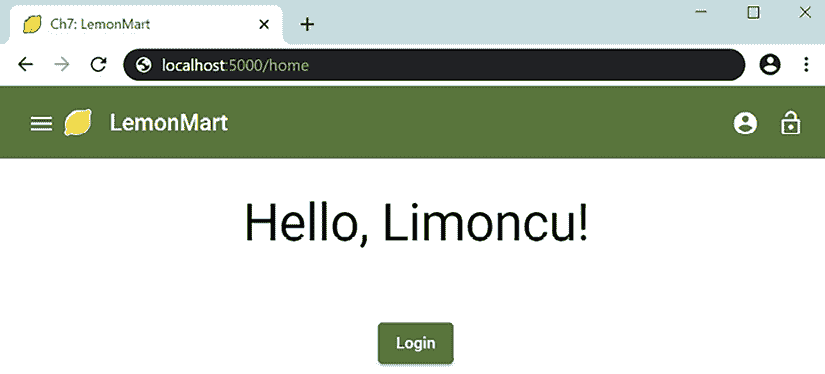

图 4.7：LemonMart 的最小登录界面

由于用户的认证状态，在实现和显示/隐藏菜单、个人资料和注销图标方面还有一些工作要做。我们将在*第七章*，*使用 REST 和 GraphQL API*中介绍这个功能。

要调试路由，获取您的路由的可视化，并将 Angular 紧密集成到 Chrome 的调试功能中，请使用从 Chrome Web Store（也兼容 Microsoft Edge）或 Firefox 插件[`angular.dev/tools/devtools`](https://angular.dev/tools/devtools)提供的 Angular DevTools。

现在您已经为您的应用设置了基本的路由，我们可以继续设置带有子组件的懒加载模块。如果您不熟悉 Angular 的故障排除和调试，请在继续之前查阅[`angular.dev/tools/devtools`](https://angular.dev/tools/devtools)。

# 带有懒加载的功能模块

资源加载有两种方式：急切加载或懒加载。当浏览器加载你的应用的`index.html`时，它从上到下开始处理。首先处理`<head>`元素，然后是`<body>`。例如，我们在应用的`<head>`中定义的 CSS 资源将在我们的 Angular 应用在 HTML 文件的`<body>`中定义为`<script>`之前下载，因为我们的 Angular 应用被定义为 HTML 文件的`<body>`中的`<script>`。

当你使用`ng build`命令时，Angular 利用 webpack 模块打包器将所有 JavaScript、HTML 和 CSS 组合成最小化和优化的 JavaScript 包。

如果你不在 Angular 中使用懒加载，你的应用的所有内容都将被急切加载。用户将看不到你的应用的第一屏，直到所有屏幕都下载并加载完成。

懒加载允许 Angular 构建过程与 webpack 协同工作，将你的 Web 应用分割成不同的 JavaScript 文件，称为 chunks。我们可以通过将应用程序的部分分离到功能模块中来实现这种 chunking。功能模块及其依赖项可以捆绑到单独的 chunks 中。请记住，根模块及其依赖项将始终在第一个下载的 chunk 中。因此，通过 chunking 我们的应用程序的 JavaScript 包大小，我们保持初始 chunk 的大小最小。有了最小化的第一个 chunk，无论你的应用如何增长，首次有意义的绘制时间保持不变。否则，随着你向应用添加更多功能和功能，你的应用将需要更长的时间来下载和渲染。懒加载对于实现可扩展的应用程序架构至关重要。

考虑以下图形以确定哪些路由是急切加载的，哪些是懒加载的：

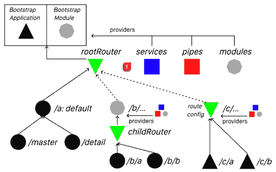

图 4.8：Angular 路由急切加载与懒加载

黑色三角形是独立组件，而黑色圆圈是依赖于模块的组件。`rootRouter`定义了三条路由：`a`、`b`和`c`。`/master`和`/detail`代表命名路由出口，这在*第九章*、*食谱 – 主/详情、数据表和 NgRx*中有详细说明。路由`a`是应用的默认路由。路由`a`和`c`用实线连接到`rootRouter`，而路由`b`则使用虚线连接。在这种情况下，路由`b`被配置为懒加载路由。这意味着路由`b`将动态加载一个包含`childRouter`的功能模块`BModule`。`childRouter`可以定义任意数量的组件，甚至可以重用其他地方已经重用的路由名称。在这种情况下，`b`定义了两个额外的路由：`/b/a`和`/b/b`。

考虑`rootRouter`的示例路由定义：

```js
**rootRouter example**
const routes: Routes = [
  { path: '', redirectTo: '/a', pathMatch: 'full' },
  {
    path: 'a',
    component: AComponent,
    children: [
      { path: '', component: MasterComponent, outlet: 'master' },
      { path: '', component: DetailComponent, outlet: 'detail' },
    ],
  },
  {
    path: 'b',
    loadChildren: 
      () => import('./b/b.module')
        .then((module) => module.BModule), 
    canLoad: [AuthGuard],
  },
  { path: 'c', loadChildren: () => import('./c/routes').then(mod => mod.C_ROUTES)},},
  { path: '**', component: PageNotFoundComponent },
] 
```

注意，路由`/b/a`、`/b/b`、`/c/a`和`/c/b`的定义在`rootRouter`中不存在。请参阅`childRouter`的示例路由定义：

```js
**/b childRouter example**
const routes: Routes = [
  { path: '', redirectTo: '/b/a', pathMatch: 'full' },
  { path: 'a', component: BAComponent },
  { path: 'b', component: BBComponent },
]
**/c route config example**
const routes: Routes = [
  { path: '', redirectTo: '/c/a', pathMatch: 'full' },
  { path: 'a', component: CAComponent },
  { path: 'b', component: CBComponent },
] 
```

如您所见，`childRouter` 中定义的路由与 `rootRouter` 中定义的路由是独立的。子路由存在于一个层次结构中，其中 `/b` 是父路径。要导航到 `BAComponent`，您必须使用路径 `/b/a`，要导航到 `CAComponent`，则使用 `/c/a`。

给定此示例配置，`rootRouter` 中定义的每个组件及其依赖项都将包含在我们应用的第一个块中，因此会预先加载。第一个块将包括组件 `A`、`Master`、`Detail` 和 `PageNotFound`。第二个块将包含组件 `BA` 和 `BB`。这个第二个块将在用户导航到以 `/b` 开头的路径之前不会下载或加载；因此，它是懒加载的。在独立配置中，这种分块可以在组件级别上更细致。

在我们添加跨不同模块使用的共享组件时，我在 *第八章*、*食谱 – 可重用性、表单和缓存* 中介绍了如何处理懒加载独立组件。

您可以在 [`angular.io/guide/standalone-components#lazy-loading-a-standalone-component`](https://angular.io/guide/standalone-components#lazy-loading-a-standalone-component) 上了解更多详细信息。

我们现在将介绍如何设置具有组件和路由的功能模块。我们还将使用 Angular DevTools 来观察我们各种路由配置的效果。

## 使用组件和路由配置功能模块

管理模块需要一个着陆页，如图所示：

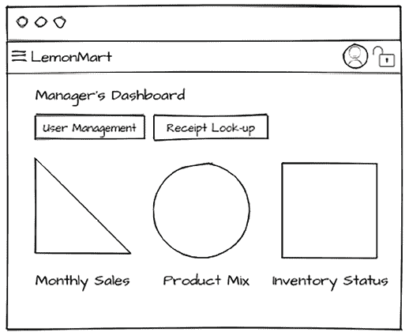

图 4.9：管理员的仪表板

让我们从创建 `ManagerModule` 的主屏幕开始：

1.  创建 `ManagerHome` 组件：

    ```js
    $ npx ng g c manager/managerHome manager -s -t 
    ```

    要在 `manager` 文件夹下创建新组件，我们必须在组件名称前加上 `manager/` 前缀。由于这是一个另一个着陆页，它不太可能复杂到需要单独的 HTML 和 CSS 文件。您可以使用 `--inline-style`（别名 `-s`）和/或 `--inline-template`（别名 `-t`）来避免创建额外的文件。

1.  确认您的文件夹结构如下：

    ```js
    **/src**
    **├───app**
    **│ │**
    **│ ├───manager**
    **│ │ │ manager-routing.module.ts**
    **│ │ │ manager.module.ts**
    **│ │ │**
    **│ │ └───manager-home**
    **│ │ │ │ manager-home.component.spec.ts**
    **│ │ │ │ manager-home.component.ts** 
    ```

1.  在 `manager-routing.module.ts` 中配置 `ManagerHome` 组件的路由，类似于我们在 `app.route.ts` 中配置 `Home` 组件的方式：

    ```js
    **src/app/manager/manager-routing.****module****.****ts**
    import { 
      ManagerHomeComponent 
    } from './manager-home/manager-home.component' 
    const routes: Routes = [ 
      { path: '', redirectTo: 'home', pathMatch: 'full' }, 
      { path: 'home', component: ManagerHomeComponent }, 
    ] 
    ```

注意，`http://localhost:4200/manager` 还没有解析到组件，因为我们的 Angular 应用不知道 `ManagerModule` 的存在。在独立项目中预先加载模块根本就没有意义；我们只会考虑功能模块的懒加载。

接下来，让我们实现 `ManagerModule` 的懒加载，以便 Angular 可以导航到它。

## 懒加载

懒加载代码可能看起来像是黑魔法（即误解）代码。为了从不同的模块加载路由，我们知道我们不能简单地导入它们；否则，它们将被预先加载。答案在于使用 `loadChildren` 属性配置路由，并使用内联 `import` 语句通知路由器如何在 `app.routes.ts` 中加载功能模块：

1.  在 `app.routes.ts` 中，使用 `loadChildren` 属性实现或更新 `'manager'` 路径：

    ```js
    **src/app/app.****routes****.****ts**
    import { Routes } from '@angular/router'
    import { HomeComponent } from './home/home.component'
    import { PageNotFoundComponent } from './page-not-found/page-not-found.component'

      const routes: Routes = [ 
        ... 
        { 
          path: 'manager', 
          loadChildren: 
            () => import('./manager/manager.module')
              . then(m=> m.ManagerModule), 
        },
        ... 
      ] 
    ... 
    ```

    懒加载是通过一种巧妙的技巧实现的，避免了在文件级别使用 `import` 语句。将一个函数委托设置到 `loadChildren` 属性，该属性包含一个内联 `import` 语句，定义了功能模块文件的位置，例如 `./manager/manager.module`，允许我们以类型安全的方式引用 `ManagerModule` 而无需完全加载它。内联 `import` 语句可以在构建过程中被解释，以创建一个单独的 JavaScript 块，只有在需要时才能下载。`ManagerModule` 作为功能模块是自给自足的；它管理所有子依赖项和路由。

1.  考虑到 `manager` 现在是它们的根路由，更新 `manager-routing.module.ts` 路由：

    ```js
    **src/app/manager/manager-routing.module.ts**
    const routes: Routes = [
      { path: '', redirectTo: 'home', pathMatch: 'full' },
      { path: 'home', component: ManagerHomeComponent },
    ] 
    ```

    我们现在可以将 `ManagerHomeComponent` 的路由更新为更有意义的 `'home'` 路径。这个路径不会与 `app.routes.ts` 中的路径冲突，因为在当前上下文中，`'home'` 解析为 `'manager/home'`，同样地，当 `path` 为空时，URL 将看起来像 `http://localhost:4200/manager`。

1.  重新启动 `ng serve` 或 `npm start` 命令，以便 Angular 可以正确地分块应用程序。

1.  导航到 `http://localhost:4200/manager`。

1.  通过观察 CLI 输出是否包含一个新的 **Lazy Chunk Files** 部分，以确认懒加载是否正常工作：

    ```js
    Lazy Chunk Files            | Names          |  Raw Size |
    src_app_manager_module_ts.js| manager-module | 358.75 kB | 
    ```

我们已成功设置了一个具有懒加载的功能模块。接下来，让我们为 LemonMart 实现行走骨架。

# 创建行走骨架

使用本章早期为 LemonMart 创建的网站图，我们需要为应用程序创建行走骨架导航体验。为了创建这种体验，我们必须创建一些按钮来链接所有模块和组件。我们将按模块逐一进行。

在我们开始之前，更新 `HomeComponent` 上的 `Login` 按钮以使用 `routerLink` 属性导航到 `'manager'` 路径，并重命名该按钮：

```js
**src/app/home/home.****component****.****ts**
  ...
  <button mat-raised-button color="primary" routerLink="/manager">
    Login as Manager
  </button>
  ... 
```

现在，我们可以通过点击 **Login** 按钮导航到 `ManagerHome` 组件。

## 管理模块

由于我们已为 `ManagerModule` 启用了懒加载，让我们继续完成其余的导航元素。

在当前设置中，`ManagerHomeComponent` 在 `AppComponent` 模板中定义的 `<router-outlet>` 中渲染，因此当用户从 `HomeComponent` 导航到 `ManagerHomeComponent` 时，`AppComponent` 中实现的工具栏将保持原位。参见以下 **管理仪表板** 的模拟图：

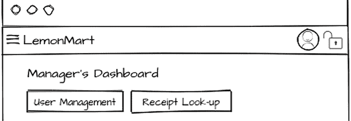

图 4.10：应用范围和功能模块工具栏

应用范围工具栏无论我们导航到哪里都保持不变。想象一下，我们可以为`ManagerModule`中持续存在的功能模块实现一个类似的工具栏。因此，导航的**用户管理**和**收据查找**按钮将始终可见。这允许我们在模块之间创建一致的 UX 来导航子页面。

要实现一个次要工具栏，我们需要复制`AppComponent`和`HomeComponent`之间的父子关系，其中父元素实现工具栏和`<router-outlet>`，以便子元素可以渲染在那里：

1.  首先创建基本的`manager`组件：

    ```js
    $ npx ng g c manager/manager --flat -s -t 
    ```

    `--flat`选项跳过目录创建，并将组件直接放置在`manager`文件夹下，就像位于`app`文件夹下的`AppComponent`一样。

1.  在`ManagerComponent`中实现一个带有`activeLink`跟踪的导航工具栏：

    ```js
    **src/app/manager/manager.****component****.****ts**
    styles: `
      div[fxLayout] {
        margin-top: 32px;
      }
      .active-link {
        font-weight: bold;
        border-bottom: 2px solid #005005;
      }
    `,
      template: `
        <mat-toolbar color="accent" fxLayoutGap="8px">
          <a mat-button routerLink="home" routerLinkActive="active-link">
            Manager's Dashboard
          </a>
          <a mat-button routerLink="users" routerLinkActive="active-link">
            User Management
          </a>
          <a mat-button routerLink="receipts"
            routerLinkActive="active- link">
            Receipt Lookup
          </a>
        </mat-toolbar>
        <router-outlet></router-outlet> 
      `, 
    ```

    在独立项目中，每个新组件都是作为一个独立组件创建的。这意味着每个组件都必须导入它自己的依赖项。别忘了在模板中逐个导入每个使用的功能。

1.  创建子页面的组件：

    ```js
    $ npx ng g c manager/userManagement
    $ npx ng g c manager/receiptLookup 
    ```

1.  创建父子路由。我们知道我们需要以下路由才能导航到我们的子页面，如下所示：

    ```js
    **example**
    { path: '', redirectTo: 'home', pathMatch: 'full' },
    { path: 'home', component: ManagerHomeComponent },
    { path: 'users', component: UserManagementComponent },
    { path: 'receipts', component: ReceiptLookupComponent }, 
    ```

要针对在`ManagerComponent`中定义的`<router-outlet>`，我们需要首先创建一个父路由，然后指定子页面的路由：

```js
**src/app/manager/manager-routing.****module****.****ts**
...
import { NgModule } from '@angular/core'
import { RouterModule, Routes } from '@angular/router'
import {
  ManagerHomeComponent
} from './manager-home/manager-home.component'
import {
  ManagerComponent
} from './manager.component'
import {
  ReceiptLookupComponent
} from './receipt-lookup/receipt-lookup.component'
import {
  UserManagementComponent
} from './user-management/user-management.component' 
const routes: Routes = [
  {
    path: '', 
    component: ManagerComponent, 
    children: [
      { path: '', redirectTo: 'home', pathMatch: 'full' },
      { path: 'home', component: ManagerHomeComponent },
      { path: 'users', component: UserManagementComponent },
      { path: 'receipts', component: ReceiptLookupComponent },
    ],
  },
] 
```

现在，你应该能够导航到应用中。当你点击**登录为管理员**按钮时，你将被带到这里显示的页面。可点击的目标被突出显示：

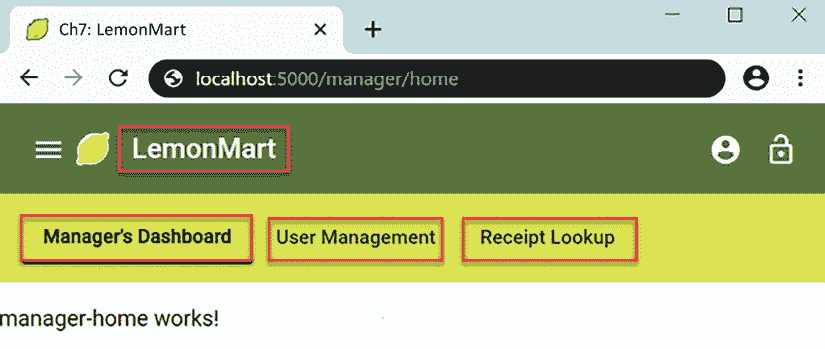

图 4.11：带有所有路由链接高亮显示的管理员仪表板

如果你点击**LemonMart**，你将被带到主页。如果你点击**管理员的仪表板**、**用户管理**或**收据查找**，你将被导航到相应的子页面，而活动链接将在工具栏上加粗并下划线。

## 用户模块

用户登录后，可以通过侧边导航菜单访问他们的个人资料并查看在 LemonMart 应用中可以访问的操作列表。在*第六章*，*实现基于角色的导航*中，当我们实现身份验证和授权时，我们将从服务器接收用户的角色。根据用户的角色，我们可以自动导航或限制用户可以看到的选项。我们将在这个模块中实现这些组件，以便它们只在用户登录时加载。为了完成行走骨架，我们将忽略与身份验证相关的关注点：

1.  创建必要的组件：

    ```js
    $ npx ng g c user/profile
    $ npx ng g c user/logout -t -s
    $ npx ng g c user/navigationMenu -t -s 
    ```

1.  实现路由。

    从在`app.routes.ts`中实现懒加载开始：

    ```js
    **src/app/app.****routes****.****ts**
    ... 
    { 
      path: 'user', 
      loadChildren: 
        () => import('./user/user.module')
          .then(m => m.UserModule), 
    }, 
    ```

    如前所述，确保`PageNotFoundComponent`路由始终是`app.routes.ts`中的最后一个路由——因为它有一个通配符匹配器，它将覆盖其后的路由定义。

    现在在`user-routing.module.ts`中实现子路由：

    ```js
    **src/app/user/user-routing.****module****.****ts**
    ...
    const routes: Routes = [
      { path: 'profile', component: ProfileComponent },
      { path: 'logout', component: LogoutComponent },
    ] 
    ```

    我们正在为`NavigationMenuComponent`实现路由，因为它将被直接用作 HTML 元素。此外，由于`UserModule`没有登录页面，因此没有定义默认路径。

1.  在`AppComponent`中连接`user`和`logout`图标：

    ```js
    **src/app/app.****component****.****ts**
    ... 
    <mat-toolbar> 
      ... 
      <button 
        **mat-mini-fab routerLink=****"/user/profile"**
        **matTooltip=****"Profile"** **aria-label=****"User Profile"**
      > 
        <mat-icon>account_circle</mat-icon> 
      </button>
      <button
         **mat-mini-fab routerLink=****"/user/logout"** 
         **matTooltip=****"Logout"** **aria-label=****"Logout"**
      > 
        <mat-icon>lock_open</mat-icon> 
      </button> 
    </mat-toolbar> 
    ```

    图标按钮可能难以理解，因此添加工具提示是个好主意。为了让工具提示工作，从`mat-icon-button`指令切换到`mat-mini-fab`指令，并确保按需导入`MatTooltipModule`。此外，确保为仅图标按钮添加`aria-label`，以便依赖屏幕阅读器的残障用户仍然可以导航您的 Web 应用程序。

1.  确保应用程序正常工作。

    您会注意到两个按钮彼此之间太近，如下所示：

    

    图 4.12：带有图标的工具栏

1.  您可以通过在`<mat-toolbar>`中添加`fxLayoutGap="8px"`来解决图标布局问题；然而，现在柠檬标志与应用程序名称的距离太远，如下所示：

    图 4.13：带有填充图标的工具栏

1.  通过合并图标和按钮可以修复标志布局问题：

    ```js
    **src/app/app.****component****.****ts**
    ...
    <mat-toolbar>
      ...
      <a mat-icon-button routerLink="/home">
        <mat-icon svgIcon="lemon"></mat-icon>
        LemonMart
      </a>
      ...
    </mat-toolbar> 
    ```

    如以下截图所示，分组解决了布局问题：

    

    图 4.14：带有分组和填充元素的工具栏

1.  另一个替代方案是将文本包裹在`<span>`标签中；然而，在这种情况下，您需要添加一些填充以保持外观：

    ```js
    <span class="left-pad" data-testid="title">LemonMart</span> 
    ```

从用户体验的角度来看，这更令人满意；现在，用户可以通过点击柠檬返回主页。

## POS 和库存模块

我们的行走骨架扮演管理者的角色。为了能够访问我们即将创建的所有组件，我们需要使管理者能够访问 POS 和库存模块。

用两个新按钮更新`ManagerComponent`：

```js
**src/app/manager/manager.****component****.****ts**
<mat-toolbar color="accent" **fxLayoutGap=****"8px"**> 
  ... 
  **<span** **class****=****"flex-spacer"****><****/span>** 
  **<button** 
    **mat-mini-fab routerLink="/i****nventory****"** 
    **matTooltip="****Inventory****" aria-label="****Inventory****"**
  **>** 
    **<mat-icon>list</mat-icon>** 
  **</button>** 
  **<button** 
    **mat-mini-fab routerLink="****/pos****"** 
    **matTooltip="****POS****" aria-label="****POS****"**
  **>** 
    **<mat-icon>shopping_cart</mat-icon>** 
  **</button>** 
</mat-toolbar> 
```

注意，这些路由链接将使我们离开`ManagerModule`的领域，因此管理特定的二级工具栏消失是正常的。

现在，将取决于您来实现最后两个剩余的模块。对于这两个新模块，我提供了高级步骤，并指导您参考先前的模块，您可以在其中为新模块建模。如果您遇到困难，请参考 GitHub 项目[`github.com/duluca/lemon-mart`](https://github.com/duluca/lemon-mart)中的`projects/stage7`文件夹。

### PosModule

`PosModule`与`UserModule`非常相似，除了`PosModule`是默认路径。`PosComponent`将是默认组件。这可能是一个具有一些子组件的复杂组件，因此不要使用内联模板或样式：

1.  创建`PosComponent`。

1.  将`PosComponent`注册为默认路径。

1.  为`PosModule`配置懒加载。

1.  确保应用程序正常工作。

现在让我们实现`InventoryModule`。

### InventoryModule

`InventoryModule`与`ManagerModule`非常相似，如下所示：

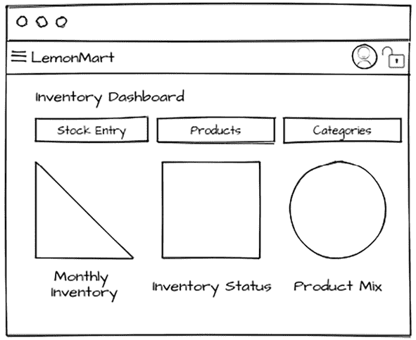

图 4.15：库存仪表板原型

1.  创建一个基本的`Inventory`组件。

1.  注册`MaterialModule`。

1.  创建**Inventory Home**、**Stock Entry**、**Products**和**Categories**组件。

1.  在`inventory-routing.module.ts`中配置父子路由。

1.  为`InventoryModule`配置懒加载。

1.  在`InventoryComponent`中实现一个用于内部`InventoryModule`导航的二级工具栏。

1.  确保应用程序按如下所示工作：

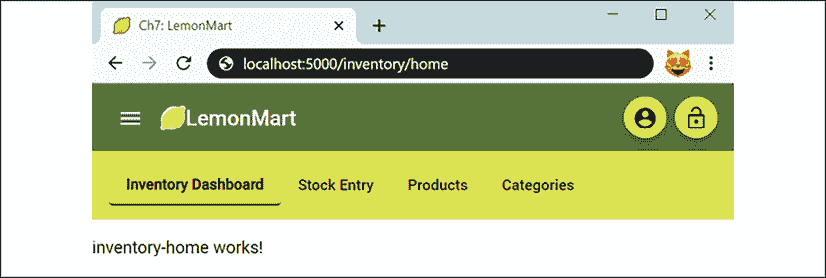

图 4.16：LemonMart 库存仪表板

现在应用程序的行走骨架已经完成，检查 CLI 输出以确保所有预期的模块或组件都被懒加载是很重要的。

在继续之前，确保解决任何测试错误。确保`npm test`和`npm run e2e`执行时没有错误。

# 通用测试模块

现在我们有很多模块要处理，为每个`spec`文件单独配置导入和提供者变得繁琐。为此，创建一个通用测试模块来包含一个通用的配置，你可以在整个项目中重用它。

首先，创建一个新的`.ts`文件：

1.  创建`common/common.testing.ts`。

1.  用常见的测试提供者、模拟和模块填充它。

我提供了一个`commonTestingModules`数组：

```js
**src/app/common/common.****testing****.****ts**
import {
  HttpClientTestingModule
} from '@angular/common/http/testing'
import { ReactiveFormsModule } from '@angular/forms'
import {
  NoopAnimationsModule
} from '@angular/platform-browser/animations'
import { RouterTestingModule } from '@angular/router/testing'
import {
  MatIconTestingModule
} from '@angular/material/icon/testing'
export const commonTestingProviders = [
  // Intentionally left blank! Used in later chapters.
]
export const commonTestingModules = [
  ReactiveFormsModule,
  NoopAnimationsModule,
  HttpClientTestingModule,
  RouterTestingModule,
  MatIconTestingModule,
] as unknown[] 
```

现在让我们看看这个共享配置文件的示例用法：

```js
**src/app/app.****component****.****spec****.****ts**
...
describe('AppComponent', () => {
  beforeEach(waitForAsync(() => {
    TestBed.configureTestingModule({
      imports: [...commonTestingModules, AppComponent],
      providers: [],
    }).compileComponents()
  }))
... 
```

虽然`commonTestingModules`很方便，但随着你的应用程序增长，它将通过导入不必要的模块开始减慢测试运行。独立组件在很大程度上有助于缓解这个问题，因为它们会带来自己的导入。注意不要过度使用这个便利模块。

停！你确保了所有单元测试都通过了吗？为了确保你的测试总是通过，在 CircleCI 中实现一个 CI 管道，如*第十章*，*使用 CI/CD 发布到生产*中所示。

当你的测试运行起来后，LemonMart 的行走骨架就完成了。现在，让我们展望未来，开始思考我们可能会处理哪些类型的数据实体。

# 围绕主要数据实体进行设计

路由优先架构的第四步是实现无状态、数据驱动的架构。为了实现这一点，围绕主要数据组件组织你的 API 非常有帮助。这大致符合你在 Angular 应用程序中消费数据的方式。我们将从定义我们的主要数据组件开始，创建一个粗略的数据**实体关系图**（**ERD**）。在*第五章*，*设计身份验证和授权*中，我们将回顾使用 Swagger.io 和 Express.js 进行 REST 以及 Apollo 进行 GraphQL 的用户数据实体的 API 设计和实现。

## 定义实体

让我们先看看你希望存储哪些类型的实体以及这些实体之间可能如何相互关联。

这里是 LemonMart 的一个示例设计，使用[draw.io](http://draw.io)创建：

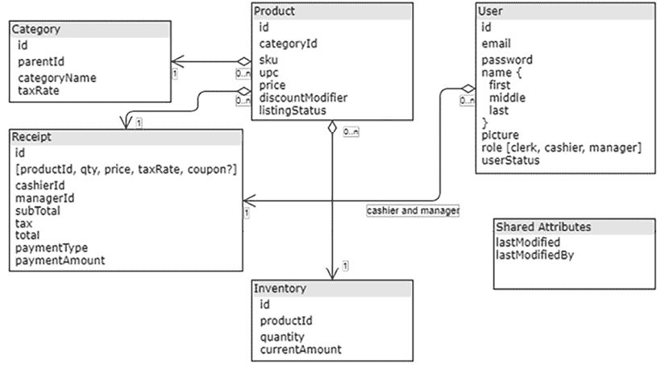

图 4.17：LemonMart 的 ERD

目前，无论您的实体存储在 SQL 还是 NoSQL 数据库中，这并不重要。我的建议是坚持你所知道的，但如果你是从头开始的，NoSQL 数据库如 MongoDB 将提供最大的灵活性，因为你的实现和要求不断发展。

通常，您需要为每个实体提供 CRUD API。考虑到这些数据元素，我们还可以想象围绕这些 CRUD API 的用户界面。让我们接下来做这件事。

# 高级用户体验设计

模拟图对于确定整个应用中需要哪些组件和用户控件非常重要。任何将在组件间使用的用户控件或组件必须在根级别定义，其他控件必须在其自己的模块中定义。

在本章早期，我们确定了子模块并为他们设计了着陆页以完成行走骨架。现在我们已经定义了主要的数据组件，我们可以完成应用其余部分的模拟。在设计高级别屏幕时，请记住以下几点：

+   用户能否以尽可能少的导航完成他们角色所需的一般任务？

+   用户能否通过屏幕上的可见元素轻松访问应用的所有信息和功能？

+   用户能否轻松搜索他们所需的数据？

+   一旦用户找到感兴趣的记录，他们能否轻松地深入到详细记录或查看相关记录？

+   那个弹出警告是否必要？你知道用户不会阅读它，对吧？

记住，没有一种正确的方式来设计任何用户体验，这就是为什么在设计屏幕时，你应该始终考虑模块化和可重用性。

## 创建一个工件 wiki

如本章前面所述，记录你创建的每个工件非常重要。Wiki 提供了一种创建可协作更新或编辑的活文档的方式。虽然 Slack、Teams、电子邮件和白板提供了良好的协作机会，但它们的短暂性质仍有待改进。

因此，当你生成各种设计工件，如模拟图或设计决策时，请确保将它们发布在所有团队成员都能访问的 wiki 上：

1.  在 GitHub 上，切换到**Wiki**标签。

您可以查看我的示例 wiki，网址为[`github.com/duluca/lemon-mart/wiki`](https://github.com/duluca/lemon-mart/wiki)，如下所示：

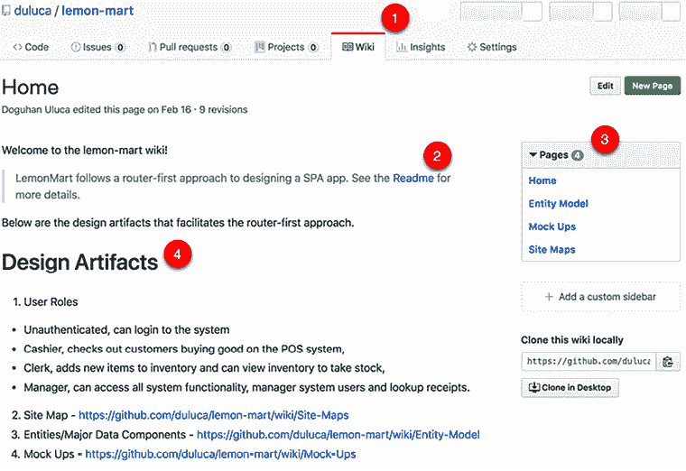

图 4.18：GitHub.com LemonMart wiki

1.  在创建 wiki 页面时，确保您与其他任何可用的文档交叉链接，例如**Readme**。

1.  注意，GitHub 在**Pages**下显示 wiki 的子页面。

1.  然而，一个额外的总结是有帮助的，例如**设计工件**部分，因为有些人可能会错过右侧的导航元素。

1.  随着你完成原型，将它们发布在维基百科上。

您可以在这里看到维基百科的摘要视图：

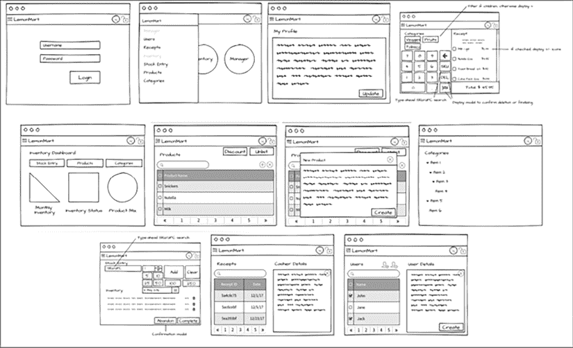

图 4.19：LemonMart 原型的摘要视图

现在您的工件已集中在一个地方，所有团队成员都可以访问。他们可以添加、编辑、更新或整理内容。这样，您的维基百科就变成了您团队所需信息的实用、活生生的文档，而不是您感觉被迫创建的文档。如果你曾经发现自己处于那种情况，请举手！

接下来，将您的原型集成到您的应用中，以便您可以收集利益相关者的早期反馈并测试您应用程序的流程。

## 在您的应用中利用原型

将原型放置在可步行骨骼应用中，以便测试人员可以更好地设想尚未开发的功能。在这里查看这个想法的示例：

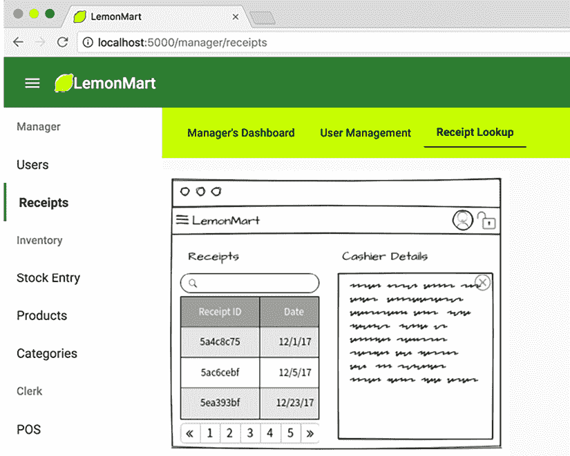

图 4.20：在 UI 中使用原型来验证应用流程

这在设计和实现您的身份验证和授权工作流程时也会很有帮助。随着原型的完成，我们需要在*第五章*，*设计身份验证和授权*中实现后端，然后我们才能继续在*第六章*，*实现基于角色的导航*中实现 LemonMart 的身份验证和授权工作流程。

# 摘要

在本章中，您学会了如何有效地使用 Angular CLI 创建主要的 Angular 组件和脚手架。您创建了您应用的标志，利用自定义和内置的 Material 图标。

您学会了如何使用 Angular DevTools 调试复杂的路由配置。最后，您开始构建以路由器为优先的应用程序，早期定义用户角色，考虑到懒加载进行设计，并在早期确定可步行骨骼导航体验。我们讨论了围绕主要数据实体进行设计。我们还介绍了完成并记录整个应用的高级 UX 设计的重要性，以便我们可以正确设计出色的条件导航体验。

回顾一下，要实现以路由器为优先的实现方式，你需要做以下这些：

1.  制定路线图和范围。

1.  考虑到懒加载进行设计。

1.  实现一个可步行骨骼导航体验。

1.  实现无状态、数据驱动的架构。

1.  强制实施解耦的组件架构。

1.  区分用户控件和组件。

1.  使用 TypeScript 和 ES6 最大化代码重用。

在本章中，你执行了步骤 1-3；在接下来的章节中，你将执行步骤 4-7。在*第五章*，*设计身份验证和授权*中，你将看到使用最小 MEAN 栈的完整栈实现。在*第六章*，*基于角色的导航实现*和*第七章*，*与 REST 和 GraphQL API 一起工作*中，我们将深入探讨面向对象设计、继承和抽象，以及深入考虑安全性和设计条件导航体验。*第八章*，*食谱 – 可重用性、表单和缓存*和*第九章*，*食谱 – 主/详细信息、数据表和 NgRx*将通过坚持解耦组件架构，明智地选择创建用户控件和组件，以及通过使用各种 TypeScript、RxJS 和 Angular 编码技术最大化代码重用，将所有内容结合起来。

# 练习

到目前为止，我们还没有实现懒加载组件。作为一个挑战，按照[`angular.io/guide/standalone-components`](https://angular.io/guide/standalone-components)中的文档更新`app.route.ts`，以便`PageNotFoundComponent`可以懒加载。更新完成后，验证 CLI 输出是否正确显示了新的分块文件，并且打开 DevTools 的**网络**选项卡，以监视在导航应用程序时下载的分块。

# 进一步阅读

+   DevTools 概述: [`angular.io/guide/devtools`](https://angular.io/guide/devtools)

+   材料设计: [`m3.material.io`](https://m3.material.io)

+   *使用独立组件入门*，谷歌，2023 年 8 月 30 日: [`angular.io/guide/standalone-components`](https://angular.io/guide/standalone-components)

+   Webpack 模块打包器: [`webpack.js.org/`](https://webpack.js.org/)

# 问题

尽可能地回答以下问题，以确保你已理解本章的关键概念，而无需进行任何谷歌搜索。你知道你是否答对了所有问题吗？访问[`angularforenterprise.com/self-assessment`](https://angularforenterprise.com/self-assessment)获取更多信息：

1.  根模块和功能模块之间有什么区别？

1.  懒加载有什么好处？

1.  独立组件与模块有何不同？

1.  为什么我们要创建应用程序的行走骨架？

1.  围绕主要数据实体进行设计有什么好处？

1.  为什么我们应该为我们的项目创建维基？
