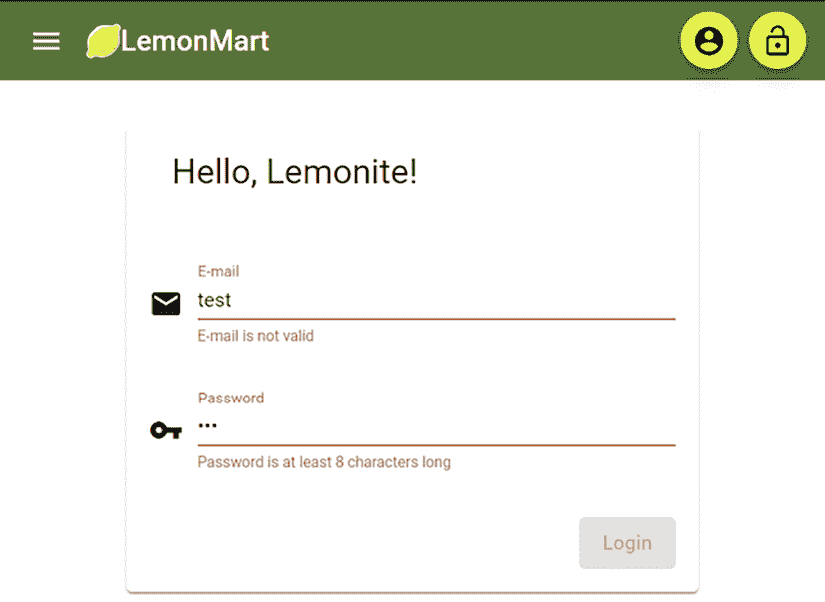
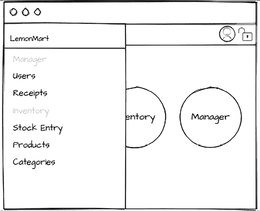
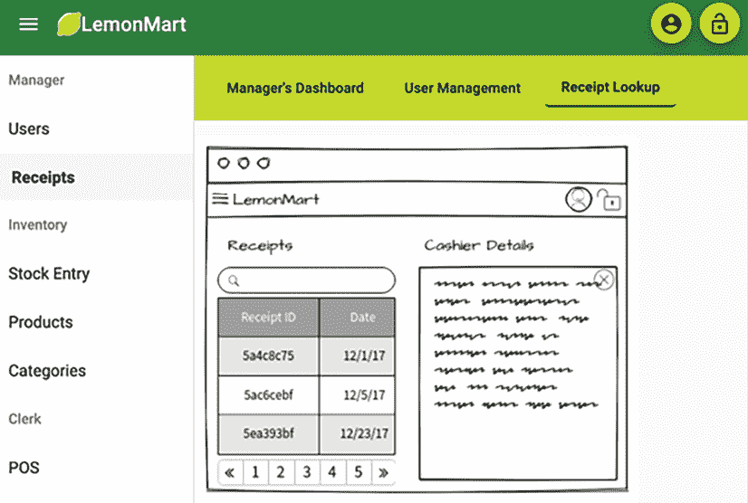
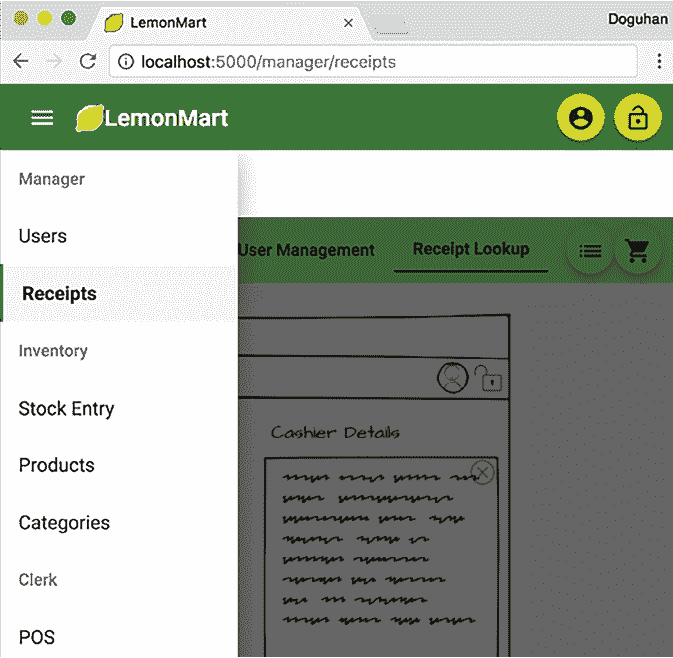
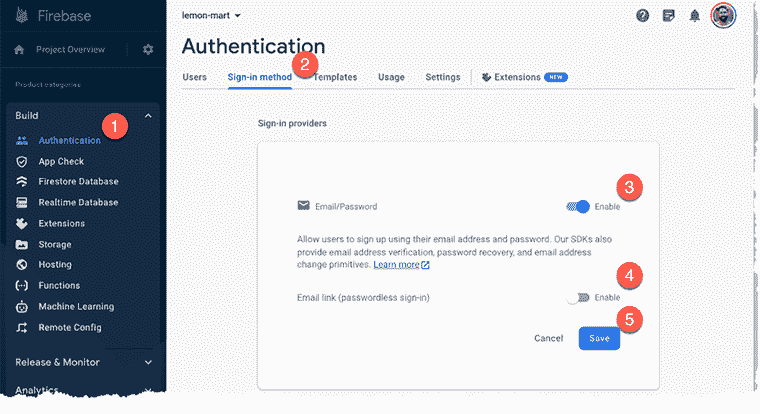
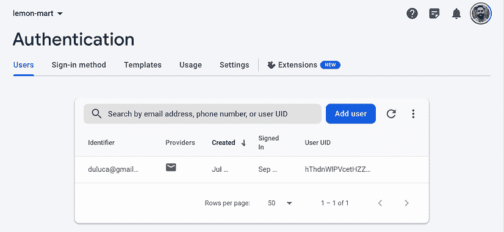

# 第六章：实现基于角色的导航

在**第五章**，*设计授权和认证*中，我们讨论了设计一个有效的认证和授权系统虽然具有挑战性但对于用户满意度至关重要。用户对网络认证系统有很高的期望，任何错误都应该明确传达。随着应用程序的增长，它们的认证核心应该易于维护和扩展，以确保无缝的用户体验。

在本章中，我们将讨论创建出色的认证用户体验和实现坚实基础体验的挑战。我们将继续采用以路由器为起点的方法来设计单页应用（SPAs），通过实现 LemonMart 的认证体验。在**第四章**，*创建以路由器为起点的业务应用*中，我们定义了用户角色，完成了所有主要路由的构建，并完成了 LemonMart 的粗略导航体验。这意味着我们已经为实施基于角色的条件导航体验做好了充分准备，该体验能够捕捉无缝认证体验的细微差别。我们将使用 Google Firebase 认证服务作为认证提供者来补充这一点，您可以在实际应用中利用它。

在本章中，您将了解以下主题：

+   动态 UI 组件和导航

+   使用守卫实现基于角色的路由

+   一个 Firebase 认证配方

+   使用工厂提供服务

# 技术要求

书中示例代码的最新版本可在以下链接存储库中找到。该存储库包含代码的最终和完成状态。您可以在本章结束时通过查找`projects`文件夹下的章节结束代码快照来验证您的进度。

对于**第六章**：

1.  克隆[`github.com/duluca/lemon-mart`](https://github.com/duluca/lemon-mart)存储库。

1.  在根目录中执行`npm install`以安装依赖项。

1.  您将继续从上一章的`stage8`构建：

    ```js
    projects/stage7 
    ```

1.  项目的最终状态反映在：

    ```js
    projects/stage8 
    ```

1.  将舞台名称添加到任何`ng`命令中，使其仅在该阶段生效：

    ```js
    npx ng build stage8 
    ```

注意，存储库根目录中的`dist/stage8`文件夹将包含编译结果。

请注意，书中提供的源代码和 GitHub 上的版本可能不同。这些项目周围的生态系统一直在不断发展。由于 Angular CLI 生成新代码的方式的变化、错误修复、库的新版本以及多种技术的并行实现，存在许多难以预料的差异。如果您发现错误或有疑问，请在 GitHub 上创建问题或提交拉取请求。

在内存中的认证提供者就位后，让我们利用我们为动态 UI 组件和基于角色的条件导航系统编写的所有支持代码。

# 动态 UI 组件和导航

`AuthService` 提供异步的认证状态和用户信息，包括用户的姓名和角色。我们可以使用所有这些信息来创建一个友好且个性化的用户体验。在下一节中，我们将实现 `LoginComponent`，以便用户可以输入他们的用户名和密码信息并尝试登录。

## 实现登录组件

`LoginComponent` 利用我们创建的 `AuthService` 并使用响应式表单实现验证错误。

记住，在 `app.config.ts` 中，我们使用 `InMemoryAuthService` 类提供了 `AuthService`。因此，在运行时，当 `AuthService` 注入到 `LoginComponent` 中时，将使用内存服务。

`LoginComponent` 应该设计成可以独立于任何其他组件渲染，因为在路由事件期间，如果我们发现用户没有正确认证或授权，我们将导航他们到这个组件。我们可以捕获这个原始 URL 作为 `redirectUrl`，这样一旦用户成功登录，我们就可以将他们导航回该 URL。

让我们开始：

1.  在应用程序的根目录下创建一个名为 `login` 的新组件，并使用内联样式。

1.  让我们先实现到 `LoginComponent` 的路由：

    ```js
    **src/app/app-routing.modules.ts**
    ...
      { path: 'login', component: LoginComponent },
      { path: 'login/:redirectUrl', component: LoginComponent },
    ... 
    ```

    记住，`'**'` 路径必须是最后一个定义的。

1.  使用与我们在 `HomeComponent` 中实现的类似 `login` 逻辑，使用一些样式实现 `LoginComponent`：

    不要忘记为即将进行的步骤将所需的依赖模块导入到你的 Angular 应用程序中。这有意留作练习，让你找到并导入缺失的模块。

    ```js
    **src/app/login/login.****component****.****ts**
    …
    import { AuthService } from '../auth/auth.service'
    import { Role } from '../auth/role.enum'
    @Component({
      selector: 'app-login',
      templateUrl: 'login.component.html',
      styles: `
          .error { color: red; }
          div[fxLayout] { margin-top: 32px; }
        `, 
      standalone: true,
      imports: [
        FlexModule,
        MatCardModule,
        ReactiveFormsModule,
        MatIconModule,
        MatFormFieldModule,
        MatInputModule,
        FieldErrorDirective,
        MatButtonModule,
        MatExpansionModule,
        MatGridListModule,
      ],
    })
    export class LoginComponent implements OnInit { 
      private readonly formBuilder = inject(FormBuilder)
      private readonly authService = inject(AuthService)
      private readonly router = inject(Router)
      private readonly route = inject(ActivatedRoute)
      loginForm: FormGroup
      loginError = ''  
      get redirectUrl() {
        return this.route.snapshot
                   .queryParamMap.get('redirectUrl') || ''
      }

      ngOnInit() {
        this.authService.logout()
        this.buildLoginForm()
      }
      buildLoginForm() {
        this.loginForm = this.formBuilder.group({
          email: ['', [Validators.required, Validators.email]],
          password: ['', [
            Validators.required,
            Validators.minLength(8),
            Validators.maxLength(50),
          ]],
        })
      }
      async login(submittedForm: FormGroup) {
        this.authService
          .login(
            submittedForm.value.email,
            submittedForm.value.password
          )
          .pipe(catchError(err => (this.loginError = err)))
        combineLatest([
          this.authService.authStatus$,
          this.authService.currentUser$,
        ])
          .pipe(
            filter(
              ([authStatus, user]) =>
                authStatus.isAuthenticated && user?._id !== ''
            ),
            first(),
            tap(([authStatus, user]) => {
              this.router.navigate([this.redirectUrl || '/manager'])
            })
          )
          .subscribe()
      } 
    } 
    ```

    我们使用 `first` 操作符来管理订阅。我们确保在调用 `ngOnInit` 时我们已注销。我们以标准方式构建响应式表单。最后，`login` 方法调用 `this.authService.login` 来启动登录过程。

    我们使用 `combineLatest` 同时监听 `authStatus$` 和 `currentUser$` 数据流。每当每个流中发生更改时，我们的管道都会执行。我们过滤掉不成功的登录尝试。作为成功登录尝试的结果，我们利用路由将认证用户导航到其个人资料。在服务器通过服务发送错误的情况下，我们将该错误分配给 `loginError`。

1.  这里是一个登录表单的实现，用于捕获和验证用户的 `email` 和 `password`，并在出现任何服务器错误时显示它们：

    不要忘记在 `app.modules.ts` 中导入 `ReactiveFormsModule`。

    ```js
    **src/app/login/login.component.html**
    <div fxLayout="row" fxLayoutAlign="center">
      <mat-card appearance="outlined" fxFlex="400px">
        <mat-card-header>
          <mat-card-title>
            <div class="mat-headline-5">Hello, Limoncu!</div>
          </mat-card-title>
        </mat-card-header>
        <mat-card-content>
          <form [formGroup]="loginForm" (ngSubmit)="login(loginForm)"
                     fxLayout="column">
            <div fxLayout="row" fxLayoutAlign="start center"
                    fxLayoutGap="10px">
              <mat-icon>email</mat-icon>
              <mat-form-field fxFlex>
                <input
                  matInput
                  placeholder="E-mail"
                  aria-label="E-mail"
                  formControlName="email"
                  #email />
                <mat-error [input]="email" [group]="loginForm"
                                    appFieldError="invalid">
                </mat-error>
              </mat-form-field>
            </div>
            <div fxLayout="row" fxLayoutAlign="start center"
                    fxLayoutGap="10px">
              <mat-icon matPrefix>vpn_key</mat-icon>
              <mat-form-field fxFlex>
                <input
                  matInput
                  placeholder="Password"
                  aria-label="Password"
                  type="password"
                  formControlName="password"
                  #password />
                <mat-hint>Minimum 8 characters</mat-hint>
                <mat-error
                  [input]="password"
                  [group]="loginForm"
                  [appFieldError]=
                    "['required', 'minlength', 'maxlength']">
                </mat-error>
              </mat-form-field>
            </div>
            <div fxLayout="row" class="margin-top">
              @if (loginError) {
                <div class="mat-caption error">
                  {{ loginError }}
                </div>
              }           
              <div class="flex-spacer"></div>
              <button
                mat-raised-button
                type="submit"
                color="primary"
                [disabled]="loginForm.invalid">
                Login
              </button>
            </div>
          </form>
        </mat-card-content>
      </mat-card>
    </div> 
    ```

    **登录** 按钮在电子邮件和密码满足客户端验证规则之前是禁用的。此外，`<mat-form-field>` 一次只会显示一个 `mat-error`，除非你为更多错误创建更多空间，所以请确保将错误条件按正确顺序放置。

    完成实现 `LoginComponent` 后，你可以更新主屏幕以有条件地显示或隐藏我们创建的新组件。

1.  更新`HomeComponent`以清理我们之前添加的代码，以便在用户访问应用程序的主页时显示`LoginComponent`：

    ```js
    **src/app/home/home.****component****.****ts**
      ...
      template: `
        @if (displayLogin) {
          <app-login></app-login>
        } @else {
          <span class="mat-display-3">
            You get a lemon, you get a lemon, you get a lemon...
          </span>
        }
      `,
    }) 
    export class HomeComponent {
      displayLogin = true
      constructor() {
      }
    } 
    ```

您的应用程序应类似于以下截图：



图 6.1：LemonMart 登录界面

根据用户的认证状态，我们还需要做一些工作来实现和显示/隐藏`sidenav`菜单、个人资料和注销图标。

## 条件导航

条件导航对于创建无烦恼的用户体验是必要的。通过选择性地显示用户可以访问的元素并隐藏他们无法访问的元素，我们使用户能够自信地导航应用程序。

让我们从隐藏用户登录应用程序后的`LoginComponent`开始：

1.  在`HomeComponent`中，将`AuthService`注入构造函数作为`public`变量：

    ```js
    **src/app/home/home.****component****.****simple****.****ts**
    ...
    import { AuthService } from '../auth/auth.service'
    ...
    export class HomeComponent { 
      constructor(public authService: AuthService) {}
    } 
    ```

1.  删除局部变量`displayLogin`，因为我们可以直接在模板中使用`async`管道访问认证状态。

1.  使用控制流语法和`async`管道，实现一个新的模板，如下所示：

    ```js
    **src/app/home/home.****component****.****ts**
    ...
      template: `
        **@if ((authService.authStatus$ | async)?.isAuthenticated) {**
          <div>      
            <div class="mat-display-4">
              This is LemonMart! The place where
            </div>
            <div class="mat-display-4">
              You get a lemon, you get a lemon, you get a lemon...
            </div>
            <div class="mat-display-4">
              Everybody gets a lemon.
            </div>
          </div>
        **} @else {**
          <app-login></app-login>
        **}**
      `,
       standalone: true,
       imports: [LoginComponent, AsyncPipe], 
    ```

    使用`async`管道可以避免像`Error: ExpressionChangedAfterItHasBeenCheckedError: Expression has changed after it was checked`这样的错误。每当您看到这个错误时，请停止使用局部变量，而应使用`async`管道。这是反应式操作的正确做法！

1.  在`AppComponent`中，我们将通过注入`AuthService`作为`public`变量来遵循类似的模式：

    ```js
    **src/app/app.****component****.****ts**
    import { Component, OnInit } from '@angular/core'
    import { AuthService } from './auth/auth.service'
    ...
    export class AppComponent implements OnInit { 
      constructor(..., **public****authService****:** **AuthService**) {
      }
      ngOnInit(): void {}
      ...
    } 
    ```

1.  在模板中更新`mat-toolbar`，以便我们使用`async`管道监控`authStatus$`和`currentUser$`：

    ```js
    **@if** **({**
      **status****: authService.****authStatus$** **|** **async****,**
      **user****: authService.****currentUser$** **|** **async**
    **};** **as** **auth;) {** 
       <mat-toolbar ... 
    ```

1.  使用`@if`来隐藏所有针对已登录用户的按钮：

    ```js
    **src/app/app.****component****.****ts**
    @if (auth?.status?.isAuthenticated) {
      <button ... > 
    ```

    现在，当用户注销时，您的工具栏应该看起来很干净，没有按钮，如图所示：

    

    图 6.2：用户登录前的 LemonMart 工具栏

1.  如果用户有图片，我们还可以在`profile`按钮中替换通用的`account_circle`图标：

    ```js
    **src/app/app.****component****.****ts**
    **import** **{** **NgOptimizedImage** **}** **from****'****@angular/common'**
    styles: `
      .image-cropper {
        border-radius: 50%;
      }
    `,
    template: `
      ...
      @if (auth?.status?.isAuthenticated) {
        <button mat-mini-fab routerLink="/user/profile" 
         matTooltip="Profile" aria-label="User Profile">
        @if (auth?.user?.picture) {
          
        }
        @if (!auth?.user?.picture) {
          <mat-icon>account_circle</mat-icon>
        }
      </button>
    }
    ...
    `
    standalone: true,
      imports: [
        FlexModule,
        RouterLink,
        NavigationMenuComponent,
        RouterOutlet,
        AsyncPipe,
        MatIconModule,
        MatToolbarModule,
        MatButtonModule,
        MatSidenavModule,
        NgOptimizedImage,
      ], 
    ```

注意在`img`标签中使用`ngSrc`属性，这会激活`NgOptimizedImage`指令。此指令使得采用性能最佳实践来加载图片变得容易。它具有丰富的功能，可以优先或延迟加载某些图片，以帮助在快速**首次内容绘制**（**FCP**）场景中，允许使用 CDN，并强制使用`width`和`height`属性以防止在图片加载时可能发生的布局偏移。

在[`angular.dev/guide/image-optimization`](https://angular.dev/guide/image-optimization)了解更多关于`NgOptimizedImage`的信息。

我们现在有一个高度功能化的工具栏，它能够响应应用程序的认证状态，并且还可以显示属于已登录用户的信息。

## 表单的常见验证

在我们继续之前，我们需要重构 `LoginComponent` 的验证。随着我们在 *第八章* 中实现更多表单，*食谱 - 可重用性、表单和缓存*，你会发现反复在模板或响应式表单中键入表单验证非常快就会变得繁琐。响应式表单的魅力之一是它们由代码驱动，因此我们可以轻松地将验证提取到一个共享类中，并进行单元测试和重用，如下所示：

1.  在 `common` 文件夹下创建一个名为 `validations.ts` 的文件。

1.  实现电子邮件和密码验证：

    ```js
    **src/app/common/validations.****ts**
    import { Validators } from '@angular/forms'
    export const EmailValidation = [
      Validators.required, Validators.email
    ]
    export const PasswordValidation = [
      Validators.required,
      Validators.minLength(8),
      Validators.maxLength(50),
    ] 
    ```

    根据您的密码验证需求，您可以使用 `Validations.pattern()` 函数配合 `RegEx` 模式来强制执行密码复杂度规则，或者利用 OWASP 的 `npm` 包 `owasp-password-strength-test` 来启用密码短语，以及设置更灵活的密码要求。请参阅 *进一步阅读* 部分的 OWASP 认证通用指南链接。

1.  使用新的验证更新 `LoginComponent`：

    ```js
    **src/app/login/login.****component****.****ts**
    import {
      EmailValidation, PasswordValidation
    } from '../common/validations'
    ...
    this.loginForm = this.formBuilder.group({
      email: ['', EmailValidation],
      password: ['', PasswordValidation],
    }) 
    ```

接下来，让我们将一些常见的 UI 行为封装到一个 Angular 服务中。

## 使用环境提供者的 UI 服务

当我们开始处理复杂的流程，如认证流程时，能够以编程方式向用户显示 toast 通知非常重要。在其他情况下，我们可能希望在执行具有更侵入性弹出通知的破坏性操作之前请求确认。

无论您使用什么组件库，重复编写相同的样板代码来显示快速通知都会变得很繁琐。UI 服务可以整洁地封装一个默认实现，该实现可以自定义。

在 UI 服务中，我们将实现 `showToast` 和 `showDialog` 函数，这些函数可以触发通知或提示用户做出决定，使我们能够在实现业务逻辑的代码中使用它们。

让我们开始吧：

1.  在 `common` 下创建一个名为 `ui` 的新服务。

1.  使用 `MatSnackBar` 实现一个 `showToast` 函数：

    查阅 [`material.angular.io`](https://material.angular.io) 上的 `MatSnackBar` 文档。

    由于此服务可以被任何服务、组件或功能模块使用，我们无法在模块上下文中声明此服务。由于我们的项目是一个独立项目，我们因此需要实现一个 **环境提供者**，以便我们可以在 `app.config.ts` 中定义的应用程序上下文中提供该服务。

    ```js
    **src/app/common/ui.****service****.****ts**
    @Injectable({
      providedIn: 'root',
    })
    export class UiService {
      constructor(
        private snackBar: MatSnackBar,
        private dialog: MatDialog
      ) {}
      showToast(
        message: string,
        action = 'Close',
        config?: MatSnackBarConfig
    ) {
        this.snackBar.open(
          message,
          action,
          config || {
            duration: 7000,
          }
        )
      }
    } 
    ```

    对于使用 `MatDialog` 的 `showDialog` 函数，我们必须实现一个基本的 `dialog` 组件。

    查阅 [`material.angular.io`](https://material.angular.io) 上的 `MatDialog` 文档。

1.  在 `common` 文件夹下添加一个名为 `simpleDialog` 的新组件，包含内联模板和样式，跳过测试，并保持扁平的文件夹结构：

    ```js
    **app/common/simple-dialog.****component****.****ts**
    import { Component, Inject } from '@angular/core'
    import { MAT_DIALOG_DATA, MatDialogRef } from '@angular/material/dialog'
    @Component({
      // prettier-ignore
      template: `
        <h2 mat-dialog-title>{{ data.title }}</h2>
        <mat-dialog-content>
          <p>{{ data.content }}</p>
        </mat-dialog-content>
        <mat-dialog-actions>
          <span class="flex-spacer"></span>
          @if (data.cancelText) {
            <button mat-button mat-dialog-close>
              {{ data.cancelText }}
            </button>
          }
          <button mat-button mat-button-raised color="primary"
            [mat-dialog-close]="true" cdkFocusInitial>
            {{ data.okText }}
          </button>
        </mat-dialog-actions>
      `,
      standalone: true,
      imports: [MatDialogModule, MatButtonModule],
    })
    export class SimpleDialogComponent {
      constructor(
        public dialogRef: MatDialogRef<SimpleDialogComponent, boolean>,
        @Inject(MAT_DIALOG_DATA)
        public data: {
          title: string;
          content: string;
          okText: string;
          cancelText: string
        }
      ) {}
    } 
    ```

    `SimpleDialogComponent` 不应具有 `selector: 'app-simple-dialog'` 这样的应用程序选择器，因为我们只计划与 `UiService` 一起使用它。如果自动生成，请从您的组件中删除此属性。

1.  现在，使用`MatDialog`实现一个`showDialog`函数来显示`SimpleDialogComponent`：

    ```js
    **app/common/ui.****service****.****ts**
    ...
    showDialog(
      title: string,
      content: string,
      okText = 'OK',
      cancelText?: string,
      customConfig?: MatDialogConfig
    ): Observable<boolean> {
      const dialogRef = this.dialog.open(
        SimpleDialogComponent,
        customConfig || {
          width: '300px',
          data: { title, content, okText, cancelText },
        }
      )
      return dialogRef.afterClosed()
    } 
    ```

    `ShowDialog`返回一个`Observable<boolean>`，因此你可以根据用户所做的选择实现后续操作。点击**确定**将返回`true`，点击**取消**将返回`false`。

    在`SimpleDialogComponent`中，使用`@Inject`，我们可以使用`showDialog`发送的所有变量来自定义对话框的内容。

1.  在`UiService`的底部添加一个名为`provideUiService`的环境提供者：

    ```js
    **app/common/ui.****service****.****ts**
    import { importProvidersFrom, makeEnvironmentProviders } from '@angular/core'
    export function provideUiService() {
      return makeEnvironmentProviders([
        importProvidersFrom(MatDialogModule, MatSnackBarModule),
      ])
    } 
    ```

    `makeEnvironmentProviders`允许我们将`Service`的依赖项封装在一个对象中。这样，我们不会将这些依赖项暴露给使用服务的组件。这有助于我们强制执行解耦架构。

1.  在`app.config.ts`中，将`provideUiService()`添加到`providers`数组中：

    ```js
    **src/app/app.****config****.****ts**
    export const appConfig: ApplicationConfig = {
      providers: [
        ...
        provideUiService()
      ]
    } 
    ```

1.  更新`LoginComponent`中的`login()`函数，在登录后显示一个吐司消息：

    ```js
    **src/app/login/login.****component****.****ts**
    import { UiService } from '../common/ui.service'
    ...
      **private****readonly** **uiService =** **inject****(****UiService****)** 
      ...
      async login(submittedForm: FormGroup) {
        ...
        tap(([authStatus, user]) => {
          **this****.****uiService****.****showToast****(**
            **`Welcome** **${user.fullName}****! Role:** **${user.role}****`**
          )
          ...
        })
     ... 
    ```

    现在，当用户登录后，将显示一个吐司消息，如图所示：

    

    图 6.3：Material snackBar

    `snackBar`将根据浏览器的大小占据整个屏幕宽度或部分宽度。

1.  尝试显示一个对话框代替：

    ```js
    **src/app/login/login.****component****.****ts**
    this.uiService.showDialog(
      `Welcome ${user.fullName}!`, `Role: ${user.role}`
    ) 
    ```

现在你已经验证了`showToast`和`showDialog`都工作正常，你更喜欢哪一个？

我在选择吐司消息或对话框时的经验法则是，除非用户即将采取不可逆的操作，否则你应该选择吐司消息而不是对话框，这样就不会打断用户的操作流程。

接下来，让我们实现一个全局侧导航体验，作为我们已有的基于工具栏导航的替代方案，以便用户可以轻松地在模块之间切换。

## 侧导航

为了提升用户体验，启用以移动端优先的工作流程并提供直观的导航机制，使用户能够快速访问所需的功能至关重要。侧导航栏（`SideNav`）对移动端和桌面用户都同样适用。在移动屏幕上，可以通过三横线（汉堡）菜单激活，在大屏幕上可以锁定打开。为了进一步优化体验，我们应该只显示用户有权查看的链接。我们可以通过根据用户的当前角色利用`AuthenticationService`来实现这一点。我们将按照以下方式实现侧导航模拟图：



图 6.4：侧导航模拟图

让我们将侧导航的代码作为一个单独的组件来实现，这样更容易维护：

1.  在应用程序的根目录中创建一个带有内联模板和样式的`NavigationMenu`组件。

    侧导航在用户登录后技术上不是必需的。然而，为了能够从工具栏启动侧导航菜单，我们需要能够从 `AppComponent` 触发它。由于这个组件将是简单的，我们将急切地加载它。为了实现懒加载，Angular 确实有一个动态组件加载模式，但这将产生较高的实现开销，只有在节省了数百万字节的情况下才有意义。

    `SideNav` 将从工具栏触发，并附带一个 `<mat-sidenav-container>` 父容器，该容器本身托管 `SideNav` 以及应用程序的内容。因此，我们必须通过将 `<router-outlet>` 放置在 `<mat-sidenav-content>` 内部来渲染所有应用程序内容。

1.  在 `AppComponent` 中，定义一些样式以确保网络应用程序将扩展以填充整个页面，并在桌面和移动场景中保持适当的可滚动性：

    ```js
    **src/app/app.****component****.****ts**
    styles: `
        .app-container {
          display: flex;
          flex-direction: column;
          position: absolute;
          top: 0;
          bottom: 0;
          left: 0;
          right: 0;
        }
        .app-is-mobile .app-toolbar {
          position: fixed;
          z-index: 2;
        }
        .app-sidenav-container {
          flex: 1;
        }
        .app-is-mobile .app-sidenav-container {
          flex: 1 0 auto;
        }
        mat-sidenav {
          width: 200px;
        }
        .image-cropper {
          border-radius: 50%;
        }
      `, 
    ```

1.  在 `AppComponent` 中注入 Angular Flex Layout 的 `MediaObserver` 服务。同时实现 `OnInit`，注入 `DestroyRef`，并添加一个名为 `opened` 的布尔属性：

    ```js
    **src/app/app.****component****.****ts**
    import { MediaObserver } from '@ngbracket/ngx-layout '
    export class AppComponent implements OnInit {
      **private** **destroyRef =** **inject****(****DestroyRef****)**
      **opened****:** **boolean**
      constructor(
        ...
        **public****media****:** **MediaObserver**
      ) {
      ...
      }
      ngOnInit(): void {
        throw new Error('Method not implemented.')
      }
    } 
    ```

    为了自动确定侧导航的打开/关闭状态，我们需要监控媒体观察器和认证状态。当用户登录时，我们希望显示侧导航，当用户注销时隐藏它。我们可以通过将 `opened` 赋值为 `authStatus$.isAuthenticated` 的值来实现这一点。然而，如果我们只考虑 `isAuthenticated`，并且用户在移动设备上，我们将创建一个不太理想的用户体验。通过监控媒体观察器的 `mediaValue`，我们可以检查屏幕尺寸是否设置为超小或 `xs`；如果是这样，我们可以保持侧导航关闭。

1.  更新 `ngOnInit` 以实现动态侧导航的打开/关闭逻辑：

    ```js
    **src/app/app.****component****.****ts**
      ngOnInit() {
        combineLatest([
          this.media.asObservable(),
          this.authService.authStatus$,
        ])
          .pipe(
            tap(([mediaValue, authStatus]) => {
              if (!authStatus?.isAuthenticated) {
                this.opened = false
              } else {
                if (mediaValue[0].mqAlias === 'xs') {
                  this.opened = false
                } else {
                  this.opened = true
                }
              }
            }),
            takeUntilDestroyed(this.destroyRef)
          )
          .subscribe()
      } 
    ```

    通过监控媒体和 `authStatus$` 流，我们可以考虑未经认证的场景，即使有足够的屏幕空间，侧导航也不应该打开。我们还使用 `takeUntilDestroyed` 以便清理我们的资源。

1.  更新模板，以实现响应式的 `SideNav`，在移动场景中滑过内容，在桌面场景中将内容推到一边：

    ```js
    **src/app/app.****component****.****ts**
    ...
    // prettier-ignore
    template: `
      **<div class="app-container">**
          @if (
            {
              status: authService.authStatus$ | async,
              user: authService.currentUser$ | async
            };
            as auth;
          ) {
            <mat-toolbar color="primary" fxLayoutGap="8px" 
             **class="app-toolbar"** 
             **[class.app-is-mobile]="media.isActive('xs')"**
              >
              @if (auth?.status?.isAuthenticated) {
                <button mat-icon-button 
                  **(click)="sidenav.toggle()">**
                  <mat-icon>menu</mat-icon>
                </button>
              }
        ...
      </mat-toolbar>
      <mat-sidenav-container class="app-sidenav-container">
        <mat-sidenav #sidenav
          [mode]="media.isActive('xs') ? 'over' : 'side'"
          [fixedInViewport]="media.isActive('xs')"
          fixedTopGap="56" [(opened)]="opened"
        >
          <app-navigation-menu></app-navigation-menu>
        </mat-sidenav>
        <mat-sidenav-content>
          <router-outlet></router-outlet>
        </mat-sidenav-content>
      </mat-sidenav-container>
      </div>
    `, 
    ```

    上述模板利用了 `@ngbracket/ngx-layout` 中的媒体观察器，这是已弃用的 Angular Flex Layout 库的社区克隆版。我们之前注入 `ngx-layout` 是为了实现响应式布局。

    您可以在模板上方使用 `// prettier-ignore` 指令来防止 Prettier 将您的模板拆分成太多行，这在某些条件下（如本例）可能会损害可读性。

    我们将在 `NavigationMenuComponent` 中实现导航链接。随着时间的推移，我们应用程序中的链接数量可能会增加，并受到各种基于角色的业务规则的影响。因此，如果我们将这些链接实现到 `app.component.ts` 中，我们可能会使该文件变得过大。此外，我们不想让 `app.component.ts` 频繁更改，因为那里的更改可能会影响整个应用程序。将链接实现为单独的组件是一种良好的实践。

1.  在 `NavigationMenuComponent` 中实现导航链接：

    ```js
    **src/app/navigation-menu/navigation-menu.****component****.****ts**
    ...
      styles: `
          .active-link {
            font-weight: bold;
            border-left: 3px solid green;
          }
          .mat-mdc-subheader {        font-weight: bold;      }
      `,
      template: `
        <mat-nav-list>
          <h3 matSubheader>Manager</h3>
          <a mat-list-item
            routerLinkActive="active-link"
            routerLink="/manager/users">
              Users
          </a>
          <a mat-list-item
            routerLinkActive="active-link"
            routerLink="/manager/receipts">
              Receipts
          </a>
          <h3 matSubheader>Inventory</h3>
          <a mat-list-item
            routerLinkActive="active-link"
            routerLink="/inventory/stockEntry">
              Stock Entry
          </a>
          <a mat-list-item
            routerLinkActive="active-link"
            routerLink="/inventory/products">
              Products
          </a>
          <a mat-list-item
            routerLinkActive="active-link"
            routerLink="/inventory/categories">
              Categories
          </a>
          <h3 matSubheader>Clerk</h3>
          <a mat-list-item
            routerLinkActive="active-link"
            routerLink="/pos">
              POS
          </a>
        </mat-nav-list>
      `,
      standalone: true,
      imports: [MatListModule, RouterLinkActive, RouterLink],
    ... 
    ```

    `<mat-nav-list>` 在功能上等同于 `<mat-list>`，因此你可以使用 `MatList` 的文档进行布局。在此观察**经理**、**库存**和**职员**的子标题：

    

    图 6.5：桌面上的经理仪表板显示收据查找

    `routerLinkActive="active-link"` 突出了选中的**收据**路由，如图中所示。

    Angular Router 跟踪应用程序中的导航状态。根据哪个链接是活动的，它会自动分配适当的 CSS，以便将其突出显示为活动链接。

    你可以在 [`angular.dev/guide/routing/router-reference`](https://angular.dev/guide/routing/router-reference) 上了解更多关于路由的信息。

    此外，你可以看到在移动设备上的外观和行为差异如下：

    

    图 6.6：移动设备上的经理仪表板显示收据查找

接下来，让我们实现基于角色的路由。

# 基于角色的路由使用守卫

这是您应用程序最基本且最重要的部分。通过懒加载，我们确保只加载最基本数量的资源，以便用户能够登录。

一旦用户登录，他们应该根据用户角色被路由到适当的登录屏幕，这样他们就不会猜测如何使用应用程序。例如，收银员只需要访问**销售点（POS）**屏幕，以便他们可以结账客户。在这种情况下，收银员可以自动被路由到该屏幕。

下面的 POS 屏幕是一个原型：


图 6.7：POS 屏幕原型

通过更新 `LoginComponent` 确保用户登录后能够被路由到适当的页面。

在名为 `homeRoutePerRole` 的函数中更新每个角色的路由 `login` 逻辑：

```js
**app/src/login/login.****component****.****ts**
async login(submittedForm: FormGroup) {
  ...
    this.router.navigate([
      this.redirectUrl ||
      **this****.****homeRoutePerRole****(user.****role****as****Role****)**
    **])**
  **...**
**}**
**private****homeRoutePerRole****(****role****:** **Role****) {**
  **switch** **(role) {**
    **case****Role****.****Cashier****:**
      **return****'/pos'**
    **case****Role****.****Clerk****:**
      **return****'/inventory'**
    **case****Role****.****Manager****:**
      **return****'/manager'**
    **default****:**
      **return****'/user/profile'**
  **}**
**}** 
```

同样，职员和经理将被路由到他们的登录屏幕以访问他们完成任务所需的功能，如前所述。由于我们已经实现了默认的管理员角色，相应的登录体验将自动启动。

在下一节中，你将了解路由守卫，它有助于检查用户身份验证，甚至可以在表单渲染之前加载数据。这在防止用户意外访问他们不应访问的路由以及阻止有意尝试突破这些限制方面至关重要。

## 路由守卫

路由守卫使逻辑的进一步解耦和重用成为可能，并提供了对组件生命周期的更多控制。

这里是您最可能使用的四个主要守卫：

+   `canActivate`和`canActivateChild`：用于检查路由的认证访问

+   `canDeactivate`：用于在离开路由之前请求权限

+   `Resolve`：允许从路由参数中预取数据

+   `CanLoad`：允许在加载功能模块资源之前执行自定义逻辑

请参阅以下部分以了解如何利用`canActivate`和`canLoad`。`Resolve`守卫将在*第八章*，*食谱 – 可重用性、表单和缓存*中介绍。

## 身份验证守卫

身份验证守卫通过允许或禁止在模块加载之前或在进行任何不适当的数据请求之前意外导航到功能模块或组件，从而提供良好的用户体验。例如，当管理员登录时，他们将被自动路由到`/manager/home`路径。浏览器将缓存此 URL，因此文书人员意外导航到相同的 URL 是完全可能的。Angular 不知道特定路由是否对用户可访问。如果没有`authGuard`，它将愉快地渲染管理员的首页并触发将失败的服务器请求。

不论您的前端实现多么健壮，您实现的每个 REST 或 GraphQL API 都应该在服务器端使用基于角色的访问控制（**RBAC**）进行适当的保护。

让我们更新路由器，以便在没有经过身份验证的用户的情况下无法激活`ProfileComponent`，并且`ManagerModule`只有在管理员使用`authGuard`登录时才会加载：

1.  实现一个功能性的`AuthGuard`：

    ```js
    **src/app/auth/auth.****guard****.****ts**
    export const authGuard = (route?: ActivatedRouteSnapshot) => {
      const authService = inject(AuthService)
      const router = inject(Router)
      const uiService = inject(UiService)
      return checkLogin(authService, router, uiService, route)
    } 
    ```

    注意，所有依赖项都是通过注入函数内联注入的，这允许在`@Injectable`类的构造函数之外进行依赖注入，在这种情况下是一个函数。

    ```js
    function checkLogin(
      authService: AuthService,
      router: Router,
      uiService: UiService,
      route?: ActivatedRouteSnapshot
    ): Observable<boolean> {
      return authService.authStatus$.pipe(
        map((authStatus) => {
          const roleMatch = checkRoleMatch(authStatus.userRole, route)
          const allowLogin = authStatus.isAuthenticated && roleMatch
          if (!allowLogin) {
            showAlert(uiService, authStatus.isAuthenticated, roleMatch)
            router.navigate(['login'], {
              queryParams: {
                redirectUrl: router?.getCurrentNavigation()?
                             .initialUrl.toString(),
              },
            })
          }
          return allowLogin
        }),
        take(1) // the observable must complete for the guard to work
      )
    }
    function checkRoleMatch(role: Role, route?: ActivatedRouteSnapshot) {
      if (!route?.data?.['expectedRole']) {
        return true
      }
      return role === route.data['expectedRole']
    }
    function showAlert(
      uiService: UiService,
      isAuth: boolean,
      roleMatch: boolean
    ) {
      if (!isAuth) {
        uiService.showToast('You must login to continue')
      }
      if (!roleMatch) {
        uiService.showToast(
          'You do not have the permissions to view this resource'
        )
      }
    } 
    ```

1.  使用`canLoad`守卫防止加载懒加载的模块，例如`manager`模块：

    ```js
    **src/app/app.****routes****.****ts**
    **import** **{ authGuard }** **from****'./auth/auth.guard'**
    ...
    {
      path: 'manager',
      loadChildren: () => import('./manager/manager.module')
        .then((m) => m.ManagerModule), 
      **canLoad****: [authGuard],**
      **data****: {** **expectedRole****:** **Role****.****Manager** **},**
    },
    ... 
    ```

    在这种情况下，当`ManagerModule`加载时，`authGuard`将在`canLoad`事件期间被调用，`checkLogin`函数将验证用户的身份验证状态。如果守卫返回`false`，则模块将不会加载。

    我们可以更进一步，在路由定义中提供额外的元数据，如`expectedRole`，它将通过`canActivate`事件传递给`checkLogin`函数。如果用户已通过身份验证，但他们的角色不匹配`Role.Manager`，则`authGuard`将再次返回`false`，模块将不会加载。

1.  使用`canActivate`守卫防止激活单个组件，例如用户的`profile`：

    ```js
    **src/app/user/user-routing.****module****.****ts**
    ...
    { 
      path: 'profile', component: ProfileComponent, 
      **canActivate****: [authGuard]** 
    },
    ... 
    ```

    在`user-routing.module.ts`的情况下，`authGuard`在`canActivate`事件期间被调用，`checkLogin`函数控制此路由可以导航的位置。由于用户正在查看自己的个人资料，因此在这里不需要检查用户的角色。

1.  使用具有 `expectedRole` 属性的 `canActivate` 或 `canActivateChild` 来防止其他用户激活组件，例如 `ManagerHomeComponent`：

    ```js
    **src/app/mananger/manager-routing.****module****.****ts**
    ...
      {
        path: 'home',
        component: ManagerHomeComponent,
        **canActivate****: [authGuard],**
        **data****: {** **expectedRole****:** **Role****.****Manager** **},**
      },
      {
        path: 'users',
        component: UserManagementComponent,
        **canActivate****: [authGuard],**
        **data****: {** **expectedRole****:** **Role****.****Manager** **},**
      },
      {
        path: 'receipts',
        component: ReceiptLookupComponent,
        **canActivate****: [authGuard],**
        **data****: {** **expectedRole****:** **Role****.****Manager** **},**
      },
    ... 
    ```

在 `ManagerModule` 中，我们可以验证用户是否可以访问特定的路由。我们再次定义一些元数据，如 `expectedRole`，如果角色不匹配 `Role.Manager`，则 `authGuard` 将返回 `false`，从而阻止导航。

接下来，我们将回顾一些实现单元测试以隔离依赖的技术。

## 认证服务模拟和通用测试提供者

我们需要使用 `common.testing.ts` 中的 `commonTestingProviders` 函数提供 `AuthService` 或 `UiService` 等服务的模拟版本，使用与在 *第四章* 中提到的 `commonTestingModules` 相似的模式。这样，我们就不会反复模拟相同的对象。

让我们使用来自 `angular-unit-test-helper` 的 `autoSpyObj` 函数创建间谍对象，并回顾一些不那么明显的更改，以使我们的测试通过：

1.  在 `common.testing.ts` 中更新 `commonTestingProviders`：

    ```js
    **src/app/common/common.****testing****.****ts**
    import { autoSpyObj } from 'angular-unit-test-helper'
    export const commonTestingProviders: any[] = [
      { provide: AuthService, useValue: autoSpyObj(AuthService) },
      { provide: UiService, useValue: autoSpyObj(UiService) }, 
    ] 
    ```

1.  观察在 `app.component.spec.ts` 中为 `MediaObserver` 提供的测试双例，并将其更新为使用 `commonTestingModules`：

    ```js
    **src/app/app.****component****.****spec****.****ts**
    ...
      TestBed.configureTestingModule({
        **imports****: [...commonTestingModules],**
        providers: [
          **{** **provide****:** **MediaObserver****,** **useClass****:** **MediaObserverFake** **},**
    ... 
    ```

    注意我们如何使用扩展语法 `...` 在另一个数组中展开 `commonTestingModules`。这样，当你需要向数组中添加更多项时，只需在旁边添加一个 `common` 和另一个元素就非常方便。

    不要将扩展语法 `…` 与本书中用于表示代码片段中周围代码存在的省略号 `…` 混淆。

1.  更新 `LoginComponent` 的 `spec` 文件以利用 `commonTestingModules` 和 `commonTestingProviders`：

    ```js
    **src/app/login/login.****component****.****spec****.****ts**
    ...
      TestBed.configureTestingModule({
        **imports****: [... commonTestingModules],**
        **providers****: [... commonTestingProviders],**
        declarations: [LoginComponent],
      }).compileComponents() 
    ```

1.  然后，将此技术应用于所有依赖于 `AuthService` 和 `UiService` 的 `spec` 文件。

1.  值得注意的是，对于服务，例如在 `auth.service.spec.ts` 中，你**不**想使用测试双例。由于 `AuthService` 是被测试的类，请确保它按以下方式配置：

    ```js
    **src/app/auth/auth.****service****.****spec****.****ts**
    ...
    TestBed.configureTestingModule({
      **imports****: [****HttpClientTestingModule****],**
      **providers****: [****AuthService****,** 
      **{** **provide****:** **UiService****,** **useValue****:** **autoSpyObj****(****UiService****) }],**
    }) 
    ```

1.  使用类似考虑更新 `ui.service.spec.ts`。

记住，直到所有测试通过，不要继续前进！

# Firebase 认证配方

我们可以利用当前的认证设置并将其与真实的认证服务集成。对于本节，你需要一个免费的 Google 和 Firebase 账户。Firebase 是 Google 的综合移动开发平台：[`firebase.google.com`](https://firebase.google.com)。你可以创建一个免费账户来托管你的应用程序并利用 Firebase 认证系统。

Firebase 控制台，位于 [`console.firebase.google.com`](https://console.firebase.google.com)，允许你管理用户并发送密码重置电子邮件，而无需为你的应用程序实现后端。稍后，你可以利用 Firebase 函数以无服务器的方式实现 API。

首先，使用 Firebase 控制台将你的项目添加到 Firebase：


图 6.8：Firebase 控制台

1.  点击**添加项目**。

1.  提供您的项目名称。

1.  为您的项目启用 Google Analytics。

在尝试此操作之前创建一个 Google Analytics 账户可能会有所帮助，但它仍然应该可以工作。一旦您的项目创建完成，您应该看到您的项目仪表板：


图 6.9：Firebase 项目概览

在左侧，标记为**1**的地方，您可以看到可以添加到项目中的工具和服务菜单。在顶部，标记为**2**的地方，您可以快速在项目之间切换。在这样做之前，您需要向项目中添加一个应用程序。

## 创建 Firebase 应用程序

您的项目可以包含您应用程序的多个分发版本，如 Web、iOS 和 Android 版本。在本章中，我们只对添加 Web 应用程序感兴趣。

让我们开始吧：

1.  在您的项目仪表板上，点击 Web 应用程序按钮以添加应用程序，这在*图 6.9*中标记为**3**。

1.  提供一个应用程序昵称。

1.  选择设置**Firebase 托管**的选项。

1.  通过点击**注册应用**按钮继续。

1.  跳过**添加 Firebase SDK**部分。

1.  按照说明安装 Firebase CLI：

    ```js
    $ npm install -g firebase-tools 
    ```

1.  登录：

    ```js
    $ firebase login 
    ```

确保您的当前目录是您的项目根文件夹。

1.  初始化您的项目：

    ```js
    $ firebase init 
    ```

1.  选择**托管**选项。不用担心，您稍后可以添加更多功能。

1.  选择您创建的项目作为默认项目，即**lemon-mart-007**。

1.  回答“检测到当前目录中存在现有的 Angular 代码库，我们应该使用这个吗？”时说“是”。

    这将创建两个新的文件：`firebase.json`和`.firebaserc`。

1.  为生产构建您的项目：

    ```js
    $ npx ng build --prod 
    ```

    或者

    ```js
    $ npm run build:prod 
    ```

1.  现在，您可以通过执行以下命令来部署您的 Angular 应用程序：

    ```js
    $ firebase deploy 
    ```

您的网站应该在类似[`lemon-mart-007.firebaseapp.com`](https://lemon-mart-007.firebaseapp.com)的 URL 上可用，如终端中所示。

将`.firebase`文件夹添加到`.gitignore`中，这样您就不会提交您的缓存文件。其他两个文件，`firebase.json`和`.firebaserc`，可以安全提交。

可选地，使用 Firebase 控制台将您拥有的自定义域名连接到账户。

## 配置 Firebase 身份验证

现在，让我们配置身份验证。

在 Firebase 控制台中：

1.  展开**构建**菜单，并从侧边导航中选择**身份验证**：

    图 6.10：Firebase 身份验证页面

1.  添加一个登录方法；选择**电子邮件/密码**作为提供者。

1.  启用它。

1.  不要启用电子邮件链接。

1.  保存您的配置。

您现在可以看到用户管理控制台：



图 6.11：Firebase 用户管理控制台

它的操作简单直观，所以我将把它作为练习留给你。

## 将 Firebase 认证提供者添加到 Angular 中

让我们从添加 Angular Fire 开始，这是 Angular 的官方 Firebase 库到我们的应用程序中：

```js
$ npx ng add @angular/fire 
```

按照 Angular Fire 的快速入门指南完成设置库与您的 Angular 项目的配置，您可以在 GitHub 上的`README`文件中找到链接：[`github.com/angular/angularfire`](https://github.com/angular/angularfire)。

1.  确保 Firebase 模块按照文档在`app.config.ts`中提供。

1.  将您的 Firebase `config`对象复制到所有的`environment.ts`文件中。

    注意，`environment.ts`中提供的任何信息都是公开信息。因此，当您将 Firebase API 密钥放在此文件中时，它将是公开可用的。有很小的可能性，其他开发者可能会滥用您的 API 密钥并增加您的账单。为了保护自己免受此类攻击，请查看 Paachu 的这篇博客文章：*即使 API 密钥公开可用，如何保护您的 Firebase 项目*，链接为[`medium.com/@impaachu/how-to-secure-your-firebase-project-even-when-your-api-key-is-publicly-available-a462a2a58843`](https://medium.com/@impaachu/how-to-secure-your-firebase-project-even-when-your-api-key-is-publicly-available-a462a2a58843)。

1.  创建一个新的`FirebaseAuthService`：

    ```js
    $ npx ng g s auth/firebaseAuth --lintFix 
    ```

1.  重命名服务文件`auth.firebase.service.ts`。

1.  一定要删除`{ providedIn: 'root' }`。

1.  通过扩展抽象认证服务实现 Firebase 认证：

    ```js
    **src/app/auth/auth.****firebase****.****service****.****ts**
    import { inject, Injectable } from '@angular/core'
    import {
      Auth as FireAuth,
      signInWithEmailAndPassword,
      signOut,
      User as FireUser,
    } from '@angular/fire/auth'
    import { Observable, of, Subject } from 'rxjs'
    import { IUser, User } from '../user/user/user'
    import { Role } from './auth.enum'
    import {
      AuthService,
      defaultAuthStatus,
      IAuthStatus,
      IServerAuthResponse,
    } from './auth.service'
    interface IJwtToken {
      email: string
      iat: number
      exp: number
      sub: string
    }
    @Injectable()
    export class FirebaseAuthService extends AuthService {
      private afAuth: FireAuth = inject(FireAuth)
      constructor() {
        super()
      }
      protected authProvider(
        email: string,
        password: string
      ): Observable<IServerAuthResponse> {
        const serverResponse$ = new Subject<IServerAuthResponse>()
        signInWithEmailAndPassword(this.afAuth, email, password).then(
          (res) => {
            const firebaseUser: FireUser | null = res.user
            firebaseUser?.getIdToken().then(
              (token) => serverResponse$.next({
                accessToken: token
              } as IServerAuthResponse),
              (err) => serverResponse$.error(err)
            )
          },
          (err) => serverResponse$.error(err)
        )
        return serverResponse$
      }
      protected transformJwtToken(token: IJwtToken): IAuthStatus {
        if (!token) {
          return defaultAuthStatus
        }
        return {
          isAuthenticated: token.email ? true : false,
          userId: token.sub,
          userRole: Role.None,
        }
      }
      protected getCurrentUser(): Observable<User> {
        return of(this.transformFirebaseUser(this.afAuth.currentUser))
      }
      private transformFirebaseUser(firebaseUser: FireUser | null): User {
        if (!firebaseUser) {
          return new User()
        }
        return User.Build({
          name: {
            first: firebaseUser?.displayName?.split(' ')[0] ||
                     'Firebase',
            last: firebaseUser?.displayName?.split(' ')[1] || 'User',
          },
          picture: firebaseUser.photoURL,
          email: firebaseUser.email,
          _id: firebaseUser.uid,
          role: Role.None,
        } as IUser)
      }
      override async logout() {
        if (this.afAuth) {
          await signOut(this.afAuth)
        }
        this.clearToken()
        this.authStatus$.next(defaultAuthStatus)
      }
    } 
    ```

    如您所见，我们只需实现我们已建立的认证代码与 Firebase 认证方法之间的差异。我们不需要复制任何代码，并且需要将 Firebase 的 `user` 对象转换为我们应用程序的内部用户对象。

    注意，在`transformFirebaseUser`中，我们设置`role: Role.None`，因为 Firebase 认证默认不实现用户角色的概念。为了使 Firebase 集成完全功能，您需要实现 Firebase 函数和 Firestore 数据库，以便您可以存储丰富的用户配置文件并在其上执行 CRUD 操作。在这种情况下，在认证后，您将再次调用以检索角色信息。在*第七章*，*与 REST 和 GraphQL API 一起工作*中，我们介绍了如何在您的自定义 API 中实现这一点。

1.  要使用 Firebase 认证而不是内存认证，更新`app.config.ts`中的`AuthService`提供者：

    ```js
    **src/app/app.****config****.****ts**
      {
        provide: AuthService,
        useClass: **FirebaseAuthService**,
      }, 
    ```

    完成步骤后，从 Firebase 认证控制台添加新用户，您应该能够使用真实认证进行登录。

    总是确保在互联网上传输任何类型的**个人身份信息**（**PII**）或敏感信息（如密码）时使用 HTTPS。否则，您的信息将被记录在第三方服务器上或被恶意行为者捕获。

1.  再次提醒，在继续之前，务必更新您的单元测试：

    ```js
    src/app/auth/auth.firebase.service.spec.ts
    import {
      HttpClientTestingModule
    } from '@angular/common/http/testing'
    import { inject, TestBed } from '@angular/core/testing'
    import { Auth as FireAuth } from '@angular/fire/auth'
    import { UiService } from '../common/ui.service'
    import { FirebaseAuthService } from './auth.firebase.service'
    const angularFireStub = {
      user: jasmine.createSpyObj('user', ['subscribe']),
      auth: jasmine.createSpyObj('auth',
                ['signInWithEmailAndPassword', 'signOut']),
    }
    describe('AuthService', () => {
      beforeEach(() => {
        TestBed.configureTestingModule({
          imports: [HttpClientTestingModule],
          providers: [
            FirebaseAuthService,
            UiService,
            { provide: FireAuth, useValue: angularFireStub },
          ],
        })
      })
      it('should be created', inject(
        [FirebaseAuthService],
        (service: FirebaseAuthService) => {
          expect(service).toBeTruthy()
        }
      ))
    }) 
    ```

停止！在部署真实认证方法之前，从你的项目中移除`fake-jwt-sign`包。

恭喜！你的应用程序已与 Firebase 集成！接下来，让我们来了解服务工厂，这可以帮助你动态切换抽象类的提供者。

# 使用工厂提供服务

你可以在加载时动态选择提供商，因此，你不需要更改代码来在认证方法之间切换，而是可以通过参数化环境变量来让不同类型的构建使用不同的认证方法。这在编写针对你的应用程序的自动化 UI 测试时特别有用，因为在实际环境中处理真实的认证可能很困难，甚至不可能。

首先，我们将在`environment.ts`中创建一个`enum`来帮助我们定义选项，然后我们将使用该`enum`在我们应用程序的引导过程中选择认证提供者。

让我们开始吧：

1.  创建一个名为`AuthMode`的新`enum`：

    ```js
    **src/app/auth/auth.****enum****.****ts**
    export enum AuthMode {
      InMemory = 'In Memory',
      CustomServer = 'Custom Server',
      CustomGraphQL = 'Custom GraphQL',
      Firebase = 'Firebase',
    } 
    ```

1.  在`environment.ts`中添加一个`authMode`属性：

    ```js
    **src/environments/environment.****ts**
    ...
      authMode: AuthMode.**InMemory**,
    ...
    **src/environments/environment.****prod****.****ts**
    ...
      authMode: AuthMode.**Firebase**,
    ... 
    ```

1.  在`auth/auth.factory.ts`的新文件中创建一个`authFactory`函数：

    ```js
    **src/app/auth/auth.****factory****.****ts**
    import { environment } from '../../environments/environment'
    import { AuthMode } from './auth.enum'
    import { FirebaseAuthService } from './auth.firebase.service'
    import { InMemoryAuthService } from './auth.in-memory.service'
    export function authFactory() {
      switch (environment.authMode) {
        case AuthMode.InMemory:
          return new InMemoryAuthService()
        case AuthMode.Firebase:
          return new FirebaseAuthService()
        case AuthMode.CustomServer:
          throw new Error('Not yet implemented')
        case AuthMode.CustomGraphQL:
          throw new Error('Not yet implemented')
      }
    } 
    ```

    注意，工厂必须导入任何依赖的服务，如上所示。

1.  将`app.config.ts`中的`AuthService`提供者更新为使用工厂：

    ```js
    **src/app/app.****config****.****ts**
      providers: [
        {
          provide: AuthService,
          **useFactory****: authFactory**
        }, 
    ```

注意，你可以从`app.config.ts`中移除`InMemoryAuthService`和`FirebaseAuthService`的导入。

使用此配置，每次你在开发配置中构建应用程序时，你将使用内存中的认证服务，而生产（prod）构建将使用 Firebase 认证服务。

# 摘要

你现在应该熟悉了如何创建高质量的认证体验。在本章中，我们设计了一个很好的条件导航体验，你可以通过将基本元素复制到你的项目中并实现自己的认证提供者来在你的应用程序中使用。我们创建了一个可重用的 UI 服务，这样你就可以方便地在应用程序的流程控制逻辑中显示警告。

我们介绍了路由守卫，以防止用户误入未经授权使用的屏幕，并重申了你的应用程序的真实安全性应该在服务器端实现的观点。你看到了如何使用工厂在不同的环境中动态提供不同的认证提供者。

最后，我们使用 Firebase 实现了真实的认证提供者。在*第七章*，*与 REST 和 GraphQL API 一起工作*中，我们将回顾 LemonMart 服务器，这是一个使用 REST 和 GraphQL API 的最小 MEAN 堆栈的全栈实现。我们将通过学习如何实现自定义认证提供者和为 REST 和 GraphQL 端点实现 RBAC 来完成我们的认证之旅。

# 进一步阅读

+   *Angular @if 块*: [`angular.dev/api/core/@if`](https://angular.dev/api/core/@if)

+   Angular. *CanActivate*. Angular. 来自 [`angular.io/api/router/CanActivate`](https://angular.io/api/router/CanActivate)

+   Angular. *CanLoad*. Angular. 从[`angular.io/api/router/CanLoad`](https://angular.io/api/router/CanLoad)检索。

+   Vasconcelos, V. (2019, October 10). *Angular 路由守卫：完整指南*. Angular University. 从[`blog.angular-university.io/angular-router-guards/`](https://blog.angular-university.io/angular-router-guards/)检索。

+   AngularFire. *AngularFire 认证入门*. GitHub. 从[`github.com/angular/angularfire/blob/master/docs/auth/getting-started.md`](https://blog.angular-university.io/angular-router-guards/)检索。

+   Davis, J. (2021, April 12). *基于角色的 Angular 与 Firebase 授权*. InDepth. 从[`indepth.dev/posts/1305/role-based-firebase-authentication-with-angular-8`](https://indepth.dev/posts/1305/role-based-firebase-authentication-with-angular-8)检索。

# 问题

尽可能地回答以下问题，以确保你理解了本章的关键概念，而无需使用谷歌搜索。你知道你是否正确回答了所有问题吗？请访问[`angularforenterprise.com/self-assessment`](https://angularforenterprise.com/self-assessment)获取更多信息：

1.  RxJS 的`combineLatest`和`merge`操作符之间有什么区别？

1.  在 Angular 路由守卫的上下文中，解释`canActivate`和`canLoad`之间的区别。

1.  动态 UI 渲染如何提高基于角色的导航系统中的用户体验？

1.  使用类似 Firebase Authentication 这样的服务进行 Web 应用程序的用户管理有哪些好处和潜在缺点？

1.  描述一个场景，其中服务工厂在 Angular 应用程序中特别有用。
