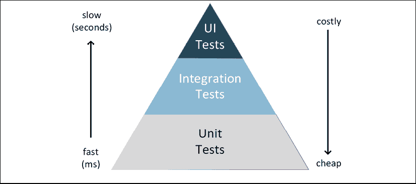
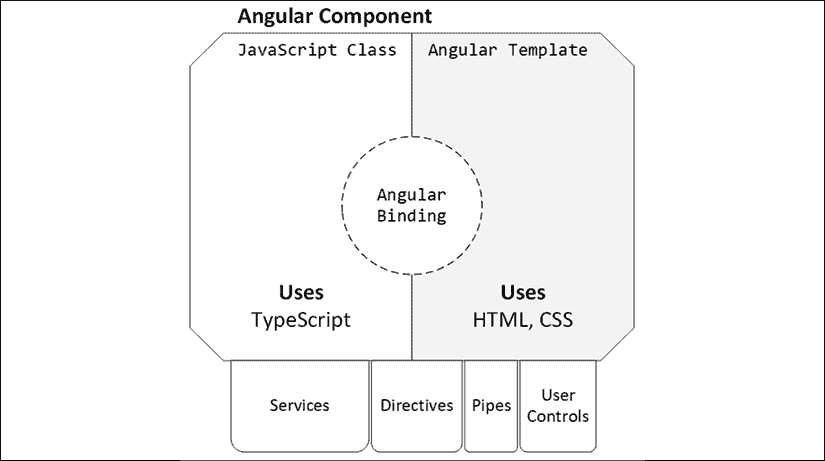
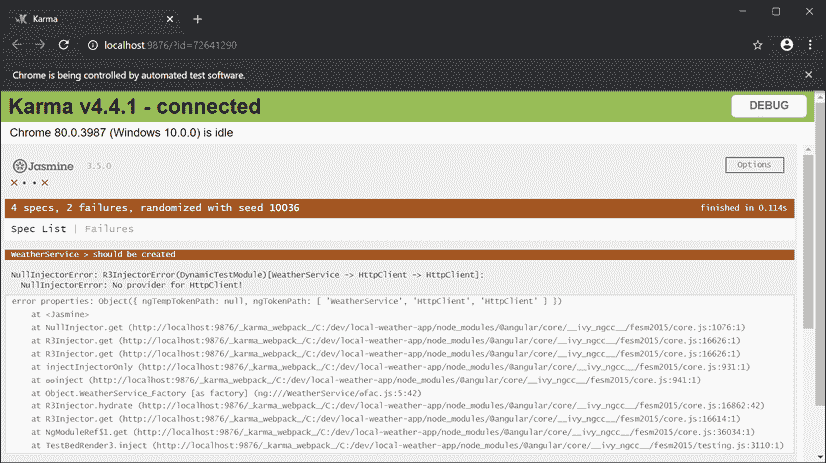
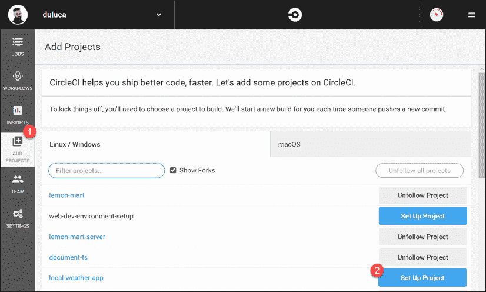
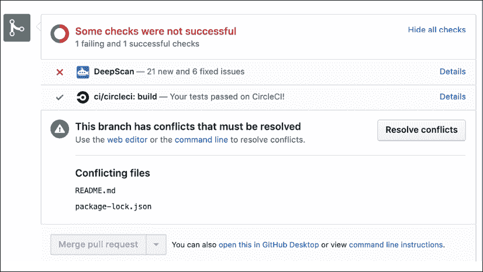

# 第四章：自动化测试、持续集成和发布到生产环境

发布它，否则它从未发生过！在**第三章**中，您在**创建基本 Angular 应用**时创建了一个可以检索当前天气数据的应用程序。您在这个过程中创造了一定的价值；然而，如果您不将您的应用放到网络上，您最终创造的价值为零。将您的作品发布出去的这种动机在许多行业中都很普遍。然而，将作品交付给他人或公开接受审查可能会令人恐惧。在软件工程中，交付任何东西都是困难的；将东西交付到生产环境则更加困难。本章将帮助您实现**持续集成**（**CI**）管道。持续集成管道将帮助您实现频繁、可靠、高质量和灵活的发布。

只有在我们有一套可以快速验证我们代码正确性的自动化测试时，才能实现频繁和可靠的发布。我们在上一章创建的应用程序有失败的单元测试和**端到端**（**e2e**）测试。我们需要修复这些单元测试，然后通过利用 GitHub 工作流和 CircleCI 确保它们不再中断。然后我们将介绍如何将您的 Angular 应用交付到网络上。在第九章**使用 Docker 进行 DevOps**中，我们将介绍**持续交付**（**CD**）管道，它也可以自动化您的交付。

查看我的 2018 年演讲，*发布它，否则它从未发生过：Docker、Heroku 和 CircleCI 的力量*，链接为[`bit.ly/ship-it-or-it-never-happened`](https://bit.ly/ship-it-or-it-never-happened)。

本章涵盖以下内容：

+   使用测试替身进行单元测试

+   使用 Jasmine 进行 Angular 单元测试

+   Angular 端到端测试

+   GitHub 工作流

+   生产就绪

+   使用 CircleCI 进行持续集成

+   使用 Vercel Now 在网络上部署应用

本书样本代码的最新版本可在以下链接的 GitHub 仓库中找到。该仓库包含代码的最终和完整状态。您可以通过查看`projects`文件夹下的章节末尾代码快照来验证本章的进度。

对于**第四章**：

1.  克隆以下仓库 [`github.com/duluca/local-weather-app`](https://github.com/duluca/local-weather-app)

1.  在根文件夹中执行`npm install`以安装依赖项

1.  本章的代码示例位于以下子文件夹中：

    ```js
    projects/ch4 
    ```

1.  要运行本章的 Angular 应用，请执行以下命令：

    ```js
    npx ng serve ch4 
    ```

1.  要运行本章的 Angular 单元测试，请执行以下命令：

    ```js
    npx ng test ch4 --watch=false 
    ```

1.  要运行本章的 Angular 端到端测试，请执行以下命令：

    ```js
    npx ng e2e ch4 
    ```

1.  要构建本章的生产就绪 Angular 应用，请执行以下命令：

    ```js
    npx ng build ch4 --prod 
    ```

    注意，仓库根目录下的`dist/ch4`文件夹将包含编译结果。

注意，书中或 GitHub 上的源代码可能并不总是与 Angular CLI 生成的代码相匹配。由于生态系统不断演变，书中代码与 GitHub 上代码之间的实现也可能存在细微差异。随着时间的推移，示例代码发生变化是自然的。此外，在 GitHub 上，您可能会找到更正、支持库新版本的修复，或者为读者观察而并排实现多种技术的示例。您只需实现书中推荐的理想解决方案即可。如果您发现错误或有疑问，请为所有读者创建 GitHub 上的问题或提交拉取请求。

你可以在**附录 C**，*保持 Angular 和工具常青*中了解更多关于更新 Angular 的内容。您可以从[`static.packt-cdn.com/downloads/9781838648800_Appendix_C_Keeping_Angular_and_Tools_Evergreen.pdf`](https://static.packt-cdn.com/downloads/9781838648800_Appendix_C_Keeping_Angular_and_Tools_Evergreen.)或[`expertlysimple.io/stay-evergreen`](https://expertlysimple.io/stay-evergreen)在线找到这个附录。

在本章中，您需要在 CircleCI 和 Vercel Now 上注册账户。但在我们可以部署我们的应用程序之前，我们需要确保我们已自动部署测试来确保我们的应用程序的质量随时间保持。首先，我们将深入探讨单元测试基础，让您熟悉测试驱动开发的益处，并介绍如 FIRST 和 SOLID 等原则。

# 单元测试

单元测试对于确保您的应用程序的行为不会无意中随时间改变至关重要。单元测试将使您和您的团队能够继续对应用程序进行更改，而不会引入先前已验证的功能的变化。开发者编写单元测试，其中每个测试的范围仅限于测试**待测试函数**（**FUT**）或**待测试类**（**CUT**）中的代码。Angular 组件和服务都是类；然而，也鼓励您开发可重用的函数。单元测试应该数量充足、自动化且快速。您应该在原始代码旁边编写单元测试。如果它们与实现分离，即使是一两天，您也可能开始忘记代码的细节。正因为如此，您可能会忘记为潜在的边缘情况编写测试。

单元测试应遵循**FIRST 原则**：

+   **F**ast

+   **I**solated

+   **R**epeatable

+   **S**elf-verifying

+   **T**imely

单元测试应该快速，只需毫秒即可运行，这样我们就可以在几分钟内运行数千个测试。为了实现快速测试，单元测试应该是隔离的。它不应该与数据库通信、通过网络发送请求或与 DOM 交互。隔离的测试将是可重复的，因此每次测试运行都会返回相同的结果。可预测性意味着我们可以断言测试的正确性，而不依赖于任何外部环境，这使得我们的测试可以自我验证。如前所述，你应该及时编写单元测试；否则，你会失去编写单元测试的好处。

如果你的测试只关注单个 FUT/CUT，那么你就可以坚持 FIRST 原则。但其他类、服务或我们必须传递给 FUT/CUT 的参数怎么办？单元测试可以通过利用测试双倍来隔离 FUT/CUT 的行为。测试双倍允许我们控制外部依赖，因此，而不是向你的组件注入`HttpService`，你可以注入一个假的或模拟的`HttpService`。使用测试双倍，我们可以控制外部依赖的影响，并创建快速且可重复的测试。

多少测试才算足够？你应该至少有与生产代码一样多的测试代码。如果没有，那么你离编写足够的测试还差得远。

单元测试并不是你可以创建的唯一类型的测试，但它们是你应该创建最多的一种。让我们考虑你可以创建的三个主要测试类别：单元、集成和 UI。

正如我们所说的，单元测试一次只关注一个 FUT/CUT。集成测试测试各种组件的集成，以便它们可以包括数据库调用、网络请求以及与 DOM 的交互。由于它们的性质，集成测试运行速度较慢，并且需要频繁维护。运行时间和维护的增加意味着随着时间的推移，集成测试比单元测试更昂贵。UI 测试模拟用户使用应用程序，填写字段、点击按钮并观察预期的结果。

你可能会想象这些测试是最慢且最脆弱的测试类型。应用程序的 UI 经常变化，使用 UI 测试创建可重复的测试非常困难。

我们可以利用集成和 UI 测试的混合来创建验收测试。验收测试是为了自动化我们交付的功能的业务验收而编写的。Angular 的端到端测试是一种创建验收测试的方法。

我们可以用迈克·科恩的测试金字塔可视化三种主要自动化测试类别的优缺点，如下所示：



图 4.1：迈克·科恩的测试金字塔

测试金字塔有效地总结了在考虑速度和成本的情况下，我们应该为我们的应用程序创建的每种类型的测试的相对数量。

在实现方面，单元测试由三个部分组成：

+   安排 – 设置

+   行动 - 运行你想要测试的东西

+   断言 - 验证结果

在安排步骤中，我们设置测试双、预期结果和任何其他必需的依赖项。在行动步骤中，我们执行我们正在测试的代码行。最后，在断言阶段，我们验证行动步骤的结果是否与安排步骤中定义的预期结果相匹配。我们将在下一节中看到安排、行动和断言在实际中的工作方式。

让我们来看看在 Angular 中单元测试意味着什么。

# Angular 单元测试

Angular 中单元测试的定义与我们之前定义的单元测试的严格定义略有不同。Angular CLI 使用 Jasmine 框架为我们自动生成单元测试。然而，这些所谓的单元测试包括 DOM 交互，因为它们渲染组件的视图。

从 *第一章*，*Angular 及其概念简介* 中考虑 Angular 组件的架构：



图 4.2：组件的解剖结构

由于 Angular 使用绑定，组件类及其模板是不可分割的，实际上代表了一个单元。我们仍然可以通过测试单个函数来编写纯单元测试，但除此之外，组件及其模板被认为是测试的最小单元。

随着应用程序的增长，您可能会发现 Angular 单元测试运行缓慢，因为它们渲染视图并解析依赖关系树。有各种方法可以解决这个问题，包括测试运行的并行化、选择不使用 Angular TestBed 以及更积极地使用测试双。

如您所注意到的，我们可以将服务注入到组件中或在我们的模板中使用其他组件。我们将利用 Jasmine 提供的测试双机制来隔离我们的组件，使其不受此类外部依赖的影响。

让我们来看看 Jasmine 是什么。

## Jasmine

Jasmine 是一个用于浏览器和 Node.js 测试的行为驱动测试框架。Jasmine 还支持 Ruby 和 Python。Jasmine 是一个包含电池的框架。它支持基本的单元测试需求，如测试固定装置、断言、模拟、间谍和报告器。

Jasmine 测试文件的命名约定是在文件名后使用`spec.ts`，例如`fileUnderTest.spec.ts`。Jasmine 测试组织在`describe`块中，这些块可以按层级分组，以反映文件、类或属于单个函数的多个测试的结构。单个测试用例或规格用`it`块表示。以下示例显示了一个名为`converters.ts`的文件导出一个将摄氏度转换为华氏度的函数：

```js
**Sample Jasmine Test**
describe('Converters', () => {
  describe('convertCtoF', () => {
    it('should convert 0c to 32f', () => {
      ...
    })
  })
}) 
```

规格以这种方式组织，当它们执行时，它们读起来像一句话。在这种情况下，结果将是 *Converters convertCtoF 应将 0c 转换为 32f*。

想了解更多关于 Jasmine 的信息，请访问 [`jasmine.github.io`](https://jasmine.github.io).

接下来，让我们探讨 Jasmine 和大多数其他测试框架的主要功能类别——固定装置和匹配器——这些功能帮助你使用行动、安排和断言结构编写连贯的单元测试。

### 固定装置

如前所述，单元测试有三个部分：安排、行动和断言。单元测试的安排部分可能是重复的，因为多个测试案例通常需要相同的设置。Jasmine 提供固定装置来帮助减少你的代码中的重复。

以下是四个固定装置：

+   `beforeAll()` – 在`describe`中的所有规格之前运行

+   `afterAll()` – 在每个测试固定装置之后运行所有`describe`中的规格

+   `beforeEach()` – 在`describe`中的每个规格之前运行

+   `afterEach()` – 在`describe`中的每个规格之后运行

固定装置在指定其`describe`块的作用域内，在某个特定或一组特定规格之前和之后执行。

### 匹配器

在单元测试的断言部分，我们需要让 Jasmine 知道一个规格是通过了还是失败了。我们可以通过编写一个断言来实现这一点。有两种断言类型：

+   `fail('message')` – 这会明确地使一个规格失败

+   `expect()` – 给定一个匹配器，动态断言预期的结果是否与实际结果匹配

`expect`断言需要匹配器来确定测试的结果。`expect`和匹配器的组合旨在读起来像一句话。以下是一些你可能使用的常见匹配器：

```js
**Jasmine Matchers**
expect(expected).toBe(actual)
                .toEqual(actual)
                .toBeDefined()
                .toBeFalsy()
                .toThrow(exception)
                .nothing() 
```

关于 Jasmine 匹配器的完整范围，请参阅[`jasmine.github.io/api/edge/matchers.html`](https://jasmine.github.io/api/edge/matchers.html)。

存在着具有更丰富功能的其他库，例如 Jest、Mocha 或 testdouble.js。然而，当开始使用像 Angular 这样的新框架时，保持你的工具集最小化是很重要的。坚持默认设置是一个好主意。

此外，Jasmine 还提供了间谍（spies），通过`spyOn`函数支持存根（stubbing）和模拟（mocking）。我们将在本章的后面更详细地介绍这些测试替身。

## 自动生成单元测试的解剖结构

默认情况下，Angular 配置为可以使用 Jasmine 编写单元测试。Karma 是测试运行器，它可以持续监控代码的变化，并自动重新运行你的单元测试。

Angular 的默认配置利用了`TestBed`，这是一个特定于 Angular 的组件，它简化了模块的提供、依赖注入、模拟、触发 Angular 生命周期事件（如`ngOnInit`）以及执行模板逻辑。

如前所述，当你利用`TestBed`时，在术语的最严格定义中，不可能将这些测试称为单元测试。这是因为，默认情况下，`TestBed`注入了你的依赖项的实际实例。这意味着当你执行测试时，你也在执行服务或其他组件中的代码，而你应该只测试当前正在测试的服务或组件中的代码。我们利用测试替身来帮助我们编写隔离和可重复的单元测试。

在*第三章*，*创建一个基本的 Angular 应用*中，Angular CLI 在你创建新的组件和服务时创建了单元测试文件，例如`current-weather.component.spec.ts`和`weather.service.spec.ts`。请查看以下 spec 文件，并观察`should create`测试。框架断言任何`CurrentWeatherComponent`类型的组件不应为 null 或 undefined，而应该是真值：

```js
**src/app/current-weather/current-weather.component.spec.ts**
describe('CurrentWeatherComponent', () => {
  let component: CurrentWeatherComponent
  let fixture: ComponentFixture<CurrentWeatherComponent>
  beforeEach(
    async(() => {
      TestBed.configureTestingModule({
        declarations: [CurrentWeatherComponent],
      }).compileComponents()
    })
  )
  beforeEach(() => {
    fixture = TestBed.createComponent(CurrentWeatherComponent)
    component = fixture.componentInstance
    fixture.detectChanges()
  })
  it('should create', () => {
    expect(component).toBeTruthy()
  })
}) 
```

`WeatherService` spec 包含一个类似的测试。然而，你会注意到每种类型的测试设置略有不同：

```js
**src/app/weather/weather.service.spec.ts**
describe('WeatherService', () => { 
  let service: WeatherService

  beforeEach(() => {
    TestBed.configureTestingModule({})
    service = TestBed.inject(WeatherService);
  })
  it('should be created', () => {
      expect(service).toBeTruthy()
    })
  )
}) 
```

在`WeatherService` spec 的`beforeEach`函数中，CUT 被注入到`TestBed`中。另一方面，`CurrentWeatherComponent` spec 有两个`beforeEach`函数。第一个`beforeEach`函数异步声明和编译组件的依赖模块，而第二个`beforeEach`函数创建测试固定装置并开始监听组件的变化，一旦编译完成，就准备好运行测试。

接下来，让我们执行我们的单元测试，看看有多少通过或失败。

## 单元测试执行

Angular CLI 使用 Jasmine 单元测试库来定义单元测试，并使用 Karma 测试运行器来执行它们。最好的是，这些测试工具已经配置好可以直接运行。你可以使用以下命令执行单元测试：

```js
$ npm test 
```

测试是由 Karma 测试运行器在一个新的 Chrome 浏览器窗口中运行的。Karma 的主要好处是它带来了类似于 Angular CLI 在开发应用程序时使用 webpack 实现的实时重新加载功能。

在执行`npm test`命令的初始执行后，你很可能会遇到编译错误，因为我们实现应用程序代码时没有更新相应的单元测试代码。

在开发过程中，遇到许多错误是正常的。所以，不要沮丧！参见*附录 A*，*调试 Angular*，了解如何使用 Chrome/Edge Dev Tools 和 VS Code 来调试错误。

让我们看看如何解决这些错误。

### 编译错误

在开发应用程序代码时，更新你的单元测试代码是很重要的。不这样做通常会导致编译错误。

记住，当你构建 Angular 应用时，测试代码不会被构建。你必须执行`npm test`来构建和运行你的测试代码。

当你执行测试时，你应该会看到一个类似于以下错误消息：

```js
ERROR in src/app/app.component.spec.ts:21:16 - error TS2339:
Property 'title' does not exist on type 'AppComponent'.
21     expect(app.title).toEqual('local-weather-app') 
```

我们需要纠正的第一个测试位于`app.component.spec.ts`中，名为`'should have as title "local-weather-app"'`。我们在上一章中从`AppComponent`中删除了`title`属性，因为我们没有使用它。所以，我们不再需要这个单元测试。

1.  删除`should have as title 'local-weather-app'`单元测试。

    如前所述，Jasmine 结合了`describe`和`it`函数中提供的文本。因此，这个测试被称为`'AppComponent should have as title 'local-weather-app''`。这是一个方便的约定，可以快速定位测试。当你编写新的测试时，维护你规格的可读描述取决于你。

    第二个要修复的测试位于`AppComponent`下，名称为`should render title`。我们现在将“LocalCast Weather”作为标题渲染，所以让我们更改测试。

1.  更新`should render title`测试，如下所示：

    ```js
    **src/app/app.component.spec.ts**
    it('should render title', () => {
      ... 
      expect(compiled.querySelector('h1').textContent)
        .toContain('LocalCast Weather') 
    }) 
    ```

1.  提交你的代码更改。

我们已经修复了单元测试中的逻辑问题。它们现在应该可以无编译错误地执行。然而，你应该预期它们都会失败，因为我们还没有配置 Angular 的`TestBed`。

### 测试结果

你应该在终端上观察到最后一条信息是`TOTAL: 2 FAILED, 2 SUCCESS`。这是正常的，因为我们根本没有关注这些测试，所以让我们修复它们。



图 4.3：Karma Runner 显示 Jasmine 单元测试结果

将 Karma Runner 窗口与 VS Code 并排打开，这样你可以立即看到你更改的结果。

现在我们来配置 TestBed。

## 配置 TestBed

TestBed 有三个主要功能，可以帮助你创建可单元测试的组件：

+   声明 – 构建组件类及其模板逻辑，以方便测试

+   提供者 – 提供没有模板逻辑和需要注入的依赖项的组件类

+   导入 – 导入支持模块以能够渲染模板逻辑或其他平台功能

TestBed 不是在 Angular 中编写单元测试的强制要求，这是一个在[`angular.io/guide/testing`](https://angular.io/guide/testing)中很好地介绍的话题。我的同事和本书的审稿人 Brendon Caulkins 为*第十二章*，*配方 – 主/详细，数据表和 NgRx*代码示例贡献了一个无床的 spec 文件，名为`current-weather.component.nobed.spec.ts`。他引用了在运行测试时性能显著提高，导入更少，维护更少，但需要更高水平的关注和专业知识来实现测试。如果你在一个大型项目中，你应该认真考虑跳过 TestBed。

你可以在 GitHub 上找到示例代码，链接为[`github.com/duluca/local-weather-app/tree/master/projects/ch12`](https://github.com/duluca/local-weather-app/tree/master/projects/ch12)。

让我们逐一介绍这些功能，同时修复手头的测试，以确保它们可以成功运行。

### 声明

声明使我们能够提供渲染待测试组件所需的所有组件。通常，你只需声明待测试的组件。因此，`app.component.spec.ts`声明了`AppComponent`，而`current-weather.component.spec.ts`声明了`CurrentWeatherComponent`等等。

注意，我们在`AppComponent`的模板中使用了`<app-current-weather>`；然而，这并不意味着我们还需要在`app.component.spec.ts`中声明`CurrentWeatherComponent`。Angular 的旧版本`TestBed`要求将子组件作为父组件单元测试的一部分进行声明，这导致了创建单元测试时的显著开销。在声明中包含多个组件会产生副作用，需要注入所有已声明组件的所有依赖项，而不仅仅是待测试组件的依赖项。这意味着将无关的依赖项添加到我们的“单元”测试中，使它们变成了集成测试。

在这种情况下，`CurrentWeatherComponent`是`AppComponent`的硬编码依赖项。可以通过两种方式进一步解耦这两个组件：一种方式是使用`ng-container`动态注入组件，另一种方式是利用 Angular Router 和`router-outlet`。`router-outlet`策略是我们构建大多数多屏 Angular 应用的方式，我将在后面的章节中介绍。使用`ng-container`正确解耦组件的任务留给读者作为练习。

你可以尝试在`app.component.spec.ts`中声明`CurrentWeatherComponent`：

```js
**src/app/app.component.spec.ts**
...
TestBed.configureTestingModule({
  declarations: [AppComponent, CurrentWeatherComponent],
}).compileComponents()
... 
```

注意，这样做会在`AppComponent`测试中引入与`HttpClient`相关的错误，尽管`AppComponent`本身没有导入`WeatherService`。实际上，`CurrentWeatherComponent`导入了`WeatherService`，而`WeatherService`本身又导入了`HttpClient`。你可以看到依赖项的复杂性是如何迅速失控的。Angular 单元测试配置为不需要声明子组件，但请注意，单元测试框架正在抛出一个关于未知元素的警告：

```js
WARN: ''app-current-weather' is not a known element 
```

在编程中，警告几乎和错误一样严重。不解决警告注定会在将来造成麻烦。当我们后面讨论模拟时，我们将介绍如何正确解决这个问题。

在继续之前，请确保撤销你的更改。

目前，你不需要为父组件测试声明子组件，这使得最初通过单元测试变得更容易。在某些情况下，你必须声明依赖组件，例如当你创建自定义控件并需要测试你的控件是否在组件的上下文中正常工作时。创建自定义控件的例子包括在第十一章的*配方 - 可重用性、路由和缓存*中。

在下一节中，我们将探讨提供者，它们帮助我们注入依赖项的真实和模拟实现，这样我们就可以避免测试像`WeatherService`这样的依赖项，而只测试“单元”。

### 提供者

提供者允许我们在不使用模板逻辑或注入到待测试组件中的服务的情况下提供组件。你会注意到我们的`CurrentWeatherComponent`测试没有通过，出现了一个错误，抱怨缺少`HttpClient`的提供者：

```js
CurrentWeatherComponent > should create
NullInjectorError: R3InjectorError(DynamicTestModule)[WeatherService -> HttpClient -> HttpClient]: 
  NullInjectorError: No provider for HttpClient! 
```

这是因为注入到 `CurrentWeatherComponent` 中的 `WeatherService` 需要一个 `HttpClient` 的提供者。然而，`CurrentWeatherComponent` 并不知道 `HttpClient`。它只知道 `WeatherService`。你可能猜到我们可能并不是严格地进行单元测试，而是实际上在进行集成测试，你会是对的。

然而，让我们继续并将在 `current-weather.component.spec.ts` 中添加 `WeatherService` 的提供者。在 `current-weather.component.spec.ts` 中的声明中提供 `WeatherService`，如下所示：

```js
**src/app/current-weather/current-weather.component.spec.ts**
...
beforeEach(async(() => { 
  TestBed.configureTestingModule({ 
    declarations: [...], 
    providers: [WeatherService], 
  })
  ...
})
... 
```

在这个例子中，我们提供了 `WeatherService` 的实际实现，但这并没有解决当前的问题。`WeatherService` 的实现仍然依赖于 `HttpClient`，错误仍然存在。

在继续之前，请确保撤销您的更改。

提供者允许我们提供依赖项的替代实现，如该依赖项的伪造或模拟。

如果我们定义一个名为 `FakeWeatherService` 的 `WeatherService` 伪造实现，我们可以通过以下 `useClass` 方式提供伪造而不是实际实现：

```js
providers: [{ provide: WeatherService, useClass: FakeWeatherService }] 
```

伪造实现将打破对 `HttpClient` 的依赖，并解决我们的问题。我将在下一节关于测试替身的部分中介绍如何实现伪造。

或者，如果我们为 `WeatherService` 创建一个名为 `mockWeatherService` 的模拟，我们可以通过以下方式提供模拟的 `useValue`：

```js
providers: [{ provide: WeatherService, useValue: mockWeatherService }] 
```

使用模拟，我们甚至不需要实现伪造类并确保我们只测试正在测试的组件。下一节关于测试替身的部分将详细介绍模拟。

现在我们已经很好地理解了提供者能为我们做什么以及不能做什么，让我们看看导入如何完善 `TestBed`。

### 导入

导入有助于引入代码，这些代码可以促进视图或其他依赖项的渲染到测试中。目前，测试仍然失败，因为 `WeatherService` 本身依赖于 `HttpClient`，因此我们需要提供 `HttpClient`。如果我们这样做，那么我们的单元测试将尝试通过 HTTP 进行调用。我们不希望我们的测试依赖于其他服务，因为这违反了本章前面提到的 FIRST 原则。因此，我们不应该提供实际的 `HttpClient`。

Angular 为 `HttpClient` 提供了一个名为 `HttpClientTestingModule` 的测试替身。为了利用它，您必须导入它，这将自动为您提供测试替身。

为 `current-weather.component.spec.ts` 导入 `HttpClientTestingModule`:

```js
**src/app/current-weather/current-weather.component.spec.ts**
import { HttpClientTestingModule } from '@angular/common/http/testing'
...
  describe(' CurrentWeatherComponent', () => { 
    beforeEach(() => { 
      TestBed.configureTestingModule({ 
        imports: [HttpClientTestingModule], 
        ...
      })
    ...
  })
... 
```

与 `HttpClientTestingModule` 类似，还有一个 `RouterTestingModule` 和 `NoopAnimationsModule`，它们是真实服务的模拟版本，因此单元测试可以仅关注测试您编写的组件或服务代码。在后面的章节中，我们还将介绍如何编写您自己的模拟。

呼吸！现在，所有您的单元测试都应该通过。如您所见，`CurrentWeatherComponent` 测试不是我们的单元测试，因为它们正在使用实际的 `WeatherService`，而 `WeatherService` 本身依赖于 `HttpClient`。

现在，让我们看看测试替身如何帮助我们编写符合 FIRST 原则的单元测试。

## 测试替身

应该只对 CUT（Cut，即代码单元测试中的“代码单元”）中的代码进行测试。在 `CurrentWeatherComponent` 的情况下，我们需要确保服务代码不被执行。因此，你应该*永远*不要提供服务的实际实现。

我们需要了解两种测试替身类型：

+   模拟

+   模拟、存根或间谍

通常，对模拟进行推理更容易，所以我们将从这里开始。一旦你对单元测试感到舒适，并且你的现有测试集处于正常工作状态，我强烈建议切换到仅使用模拟，这将使你的测试更加健壮、高效和易于维护。

### 模拟

模拟是一个现有类的替代、简化实现。它就像一个模拟服务，其中不进行任何实际的 HTTP 调用，但你的服务返回预制的响应。在单元测试期间，模拟被实例化并像真实类一样使用。在前一节中，我们使用了 `HttpClientTestingModule`，这是一个模拟的 `HttpClient`。我们的自定义服务是 `WeatherService`，因此我们必须提供我们的测试替身实现。

我们通过创建服务的模拟来创建测试替身。由于 `WeatherService` 的模拟在测试多个组件时使用，你的实现应该在一个单独的文件中。为了保持代码库的可维护性和可发现性，每个文件一个类是一个很好的经验法则。将类保存在单独的文件中可以防止你犯一些编程错误，比如在两个类之间错误地创建或共享全局状态或独立函数，从而在过程中保持代码解耦。

我们还需要确保实际实现和测试替身的 API 随时间不会不同步。我们可以通过为服务创建一个接口来实现这一点。

1.  将 `IWeatherService` 添加到 `weather.service.ts` 中，如下所示：

    ```js
    **src/app/weather/weather.service.ts**
    export interface IWeatherService {
      getCurrentWeather(
      city: string, 
      country: string
      ): Observable<ICurrentWeather> 
    } 
    ```

1.  更新 `WeatherService` 以实现新的接口：

    ```js
    **src/app/weather/weather.service.ts**
    export class WeatherService implements IWeatherService 
    ```

1.  创建一个新的文件 `weather/weather.service.fake.ts`

1.  在 `weather.service.fake.ts` 中实现一个基本的模拟，如下所示：

    ```js
    **src/app/weather/weather.service.fake.ts**
    import { Observable, of } from 'rxjs'
    import { IWeatherService } from './weather.service'
    import { ICurrentWeather } from '../interfaces'
    export const fakeWeather: ICurrentWeather = {
      city: 'Bethesda',
      country: 'US',
      date: 1485789600,
      image: '',
      temperature: 280.32,
      description: 'light intensity drizzle',
    }
    export class WeatherServiceFake implements IWeatherService {
      public getCurrentWeather(
        city: string,
        country: string): Observable<ICurrentWeather> { 
          return of(fakeWeather)
      }
    } 
    ```

    我们正在利用现有的 `ICurrentWeather` 接口，我们的模拟数据已经正确地塑造了它，但我们必须将其转换为 `Observable`。这可以通过使用 `of` 来轻松实现，它根据提供的参数创建一个可观察的序列。

    现在，你已经准备好为 `AppComponent` 和 `CurrentWeatherComponent` 提供模拟了。

1.  更新 `current-weather.component.spec.ts` 中的提供者，以使用 `WeatherServiceFake`，这样就会使用模拟而不是实际的服务：

    ```js
    **src/app/current-weather/current-weather.component.spec.ts**
      ...
      beforeEach( 
        async(() => {
          TestBed.configureTestingModule({
            ...
            providers: [{
              provide: WeatherService, useClass: WeatherServiceFake
            }],
            ... 
    ```

    注意，这个替代实现是在一个名为 `current-weather.component.fake.spec` 的不同文件中提供的，它是 GitHub 上 `projects/ch4` 子文件夹的一部分。

1.  从导入中删除 `HttpClientTestingModule`，因为它不再需要

    随着你的服务和组件变得越来越复杂，很容易提供一个不完整或不充分的测试替身。你可能会看到诸如 `NetworkError: Failed to execute 'send' on 'XMLHttpRequest'`、`Can't resolve all parameters` 或 `[object ErrorEvent] thrown` 这样的错误。在后者的情况下，点击 Karma 中的 **调试** 按钮以发现视图错误详情，这可能看起来像 **超时 - jasmine 指定的时间超出了异步回调**。单元测试设计为以毫秒为单位运行，所以实际上触碰到默认的 5 秒超时是不可能的。问题几乎总是与测试设置或配置有关。

1.  验证所有测试是否通过

使用假对象，我们能够在一定程度上减少测试复杂性并提高隔离性。我们可以通过模拟、存根和间谍做得更好。

### 模拟、存根和间谍

模拟、存根或间谍不包含任何实现。模拟在单元测试文件中配置，以对特定的函数调用响应一系列响应，这些响应可以根据测试轻松地变化。

在 *声明* 部分中较早的时候，我们讨论了在 `app.component.spec.ts` 中声明 `CurrentWeatherComponent` 以解决**未知元素**警告的必要性。如果我们声明真实的 `CurrentWeatherComponent`，那么 `AppComponent` 的测试配置就会变得过于复杂，因为我们需要解决子组件的依赖关系树，包括 `WeatherService` 和 `HttpClient`。此外，仅仅为了提供假天气数据就创建一个整个假服务是过度设计，并且不是一个灵活的解决方案。如果我们想根据不同的输入测试不同的服务响应怎么办？我们就必须开始在假服务中引入逻辑，然后不知不觉中，你就在处理 `WeatherService` 的两个独立实现。

创建一个假对象的替代方案是创建一个空对象，它冒充真实对象但没有任何实现。这些对象被称为模拟。我们将在下面利用两种不同的技术来创建模拟组件和模拟服务。

#### 模拟组件

如果我们在 `app.component.spec.ts` 中提供一个 `CurrentWeatherComponent`，我们可以解决**未知元素**的警告，并且不需要担心 `CurrentWeatherComponent` 所依赖的所有组件和服务。

如果你手动实现它，一个模拟组件看起来像这样：

```js
@Component({
  selector: 'app-current-weather',
  template: ``,
})
class MockCurrentWeatherComponent {} 
```

然而，这可能会很快变得繁琐，这就是为什么我发布了一个单元测试辅助库，名为 **angular-unit-test-helper**，以使模拟组件更容易。使用这个库，你只需用这个函数调用替换声明中的组件：

```js
createComponentMock('CurrentWeatherComponent') 
```

让我们更新 `app.component.spec.ts` 以使用模拟组件：

1.  执行 `npm i -D angular-unit-test-helper`

1.  使用模拟组件更新 `AppComponent`：

    ```js
    **src/app/app.component.spec.ts**
    import { createComponentMock } from 'angular-unit-test-helper'
      TestBed.configureTestingModule({
        declarations: [ ...,
          createComponentMock('CurrentWeatherComponent')
        ],
        ...
      }) 
    ```

1.  完全删除 `providers` 属性

1.  清理未使用的导入

注意，单元测试文件保持简洁，警告已解决。**angular-unit-test-helper** 推断 `CurrentWeatherComponent` 代表一个 HTML 标签，如 `<app-current-weather>`，并在浏览器的窗口对象中提供它。然后 `createComponentMock` 函数通过分配选择器 `'app-current-weather'` 和一个空模板来正确装饰空的 `CurrentWeatherComponent` 类。然后 `TestBed` 能够解析 `<app-current-weather>` 为这个模拟组件。`createComponentMock` 还允许你根据需要提供自定义选择器或假模板。这是一个可扩展的解决方案，减少了超过一半的导入，并遵循 FIRST 原则。

模拟的概念扩展到我们可以定义的所有类型的对象，包括 Angular 服务。通过模拟服务，我们不必担心可能注入到该服务中的任何依赖项。

让我们看看如何模拟一个服务。

#### 模拟服务

让我们为 `CurrentWeatherComponent` 编写两个新的单元测试，以展示模拟服务而不是实现其假值的优点。模拟允许我们创建一个空对象，并给我们提供只提供可能需要的测试函数的选项。然后我们可以根据每个测试来模拟这些函数的返回值或监视它们以查看我们的代码是否调用了它们。监视特别有用，如果相关的函数没有返回值。我们需要在我们的规范安排部分设置我们的间谍。

1.  让我们从创建一个 `WeatherService` 间谍对象开始，使用 `jasmine.createSpyObj`，如下所示：

    ```js
    **src/app/current-weather/current-weather.component.spec.ts**
    import {
      ComponentFixture,
      TestBed,
      async
    } from '@angular/core/testing'
    import { injectSpy } from 'angular-unit-test-helper'
    import { WeatherService } from '../weather/weather.service'
    import {
      CurrentWeatherComponent
    } from './current-weather.component'
    describe('CurrentWeatherComponent', () => {
      ...
      let weatherServiceMock: jasmine.SpyObj<WeatherService>
      beforeEach(async(() => {
        const weatherServiceSpy =
          jasmine.createSpyObj(
            'WeatherService',
            ['getCurrentWeather']
          )

        TestBed.configureTestingModule({ ... })
      }) 
    ```

1.  使用 `useValue` 将 `weatherServiceSpy` 作为 `WeatherService` 的值。

1.  最后，从 `TestBed` 获取注入的实例并将其分配给 `weatherServiceMock`，使用 `angular-unit-test-helper` 中的 `injectSpy` 方法，如下所示：

    ```js
    **src/app/current-weather/current-weather.component.spec.ts**
        beforeEach(async(() => { 
          ...
          TestBed.configureTestingModule({
          ...,
           providers: [{
             provide: WeatherService, useValue: weatherServiceSpy
           }]
        }).compileComponents()
        weatherServiceMock = injectSpy(WeatherService)
    } 
    ```

注意，`injectSpy` 是 `TestBed.inject(WeatherService)` 的简写，作为任何。

在前面的例子中，我们有一个模拟的 `WeatherService` 版本，其中声明它有一个名为 `getCurrentWeather` 的函数。然而，请注意，你现在得到了一个错误：

```js
TypeError: Cannot read property 'subscribe' of undefined 
```

这是因为 `getCurrentWeather` 不会返回一个可观察对象。使用 `weatherServiceMock`，我们可以监视 `getCurrentWeather` 是否被调用，也可以根据测试来模拟其返回值。

为了操纵 `getCurrentWeather` 的返回值，我们需要更新 **should create** 测试以反映安排、执行和断言结构。为此，我们需要将 `fixture.detectChanges()` 从第二个 `beforeEach` 中移除，这样我们就可以控制其执行顺序，使其在安排部分之后执行。

```js
**src/app****/current-weather/current-weather.component.spec.ts**
  import { of } from 'rxjs'
  ...
  beforeEach(() => {
    fixture = TestBed.createComponent(CurrentWeatherComponent)
    component = fixture.componentInstance
  })
  it('should create', () => {
    // Arrange
    weatherServiceMock.getCurrentWeather.and.returnValue(of())
    // Act
    fixture.detectChanges() // triggers ngOnInit
    // Assert
    expect(component).toBeTruthy()
  }) 
```

在安排部分，我们配置`getCurrentWeather`应使用`RxJS\of`函数返回一个空的 Observable。在行为部分，我们触发 TestBed 的`detectChanges`函数，这会触发生命周期事件，如`ngOnInit`。由于我们正在测试的代码位于`ngOnInit`中，这是正确执行的操作。最后，在断言部分，我们确认组件已成功创建。

在接下来的测试中，我们可以验证`getCurrentWeather`函数确实被调用了一次：

```js
**src/app/current-weather/current-weather.component.spec.ts**
  it('should get currentWeather from weatherService', () => {
    // Arrange
    weatherServiceMock.getCurrentWeather.and.returnValue(of())
    // Act
    fixture.detectChanges() // triggers ngOnInit()
    // Assert
    expect(weatherServiceMock.getCurrentWeather)
      .toHaveBeenCalledTimes(1)
  }) 
```

最后，我们可以测试返回的值是否正确分配在组件类中，并且也正确渲染在模板上：

```js
**src/app/current-weather/current-weather.component.spec.ts**
import { By } from '@angular/platform-browser'
import { fakeWeather } from '../weather/weather.service.fake'
...
  it('should eagerly load currentWeather in Bethesda from weatherService', () => {
    // Arrange
    weatherServiceMock.getCurrentWeather
      .and.returnValue(of(fakeWeather))
    // Act
    fixture.detectChanges() // triggers ngOnInit()
    // Assert
    expect(component.current).toBeDefined()
    expect(component.current.city).toEqual('Bethesda')
    expect(component.current.temperature).toEqual(280.32)
    // Assert on DOM
    const debugEl = fixture.debugElement
    const titleEl: HTMLElement = debugEl.query(By.css('span'))
      .nativeElement
    expect(titleEl.textContent).toContain('Bethesda')
  }) 
```

在前面的例子中，您可以看到我们提供了一个名为`fakeWeather`的模拟对象，其中城市名称为 Bethesda。然后我们能够断言当前属性具有正确的`city`，并且具有`class=mat-title`的`<div>`元素包含文本 Bethesda。

您现在应该有七个通过测试：

```js
TOTAL: 7 SUCCESS 
```

通过使用模拟（mocks）、存根（stubs）和间谍（spies），我们可以快速测试外部依赖项可以返回和不能返回的多种可能性，并且我们可以通过观察 DOM 来验证组件或服务类中驻留的代码的断言。

要了解更多关于模拟、存根和间谍的信息，请参阅[`jasmine.github.io`](https://jasmine.github.io)。此外，我发现 Dave Ceddia 的 Jasmine 2 Spy Cheat Sheet 非常有用，位于[`daveceddia.com/jasmine-2-spy-cheat-sheet`](https://daveceddia.com/jasmine-2-spy-cheat-sheet)。

通常，您的单元测试应该最多断言一两个事情。为了达到足够的单元测试覆盖率，您应该专注于测试包含业务逻辑的函数的正确性：通常在您看到`if`或`switch`语句的地方。

要编写可单元测试的代码，请确保遵循 SOLID 原则中的单一责任原则和开放/封闭原则。

查看我的同事 Brendan Sawyer 创建的**ng-tester**库，位于[`www.npmjs.com/package/ng-tester`](https://www.npmjs.com/package/ng-tester)。它为您的 Angular 组件创建具有**angular-unit-test-helper**的规范文件，以帮助进行模拟。此外，该库展示了如何模拟依赖项并在不使用`TestBed`的情况下创建测试。

您可以通过命令`npm install -D ng-tester`安装库，并使用命令`npx ng generate ng-tester:unit`创建单元测试。

除了单元测试之外，Angular CLI 还会为您的应用程序生成和配置端到端测试。接下来，让我们了解端到端测试。

# Angular 端到端测试

虽然单元测试侧重于隔离 CUT，但 e2e 测试是关于集成测试。Angular CLI 利用 Protractor 和 WebDriver，以便您可以从用户与浏览器中交互的角度编写 **自动化验收测试（AAT**）。作为一个经验法则，您应该始终编写比 AATs 多一个数量级的单元测试，因为您的应用程序经常变化，因此与单元测试相比，AATs 的脆弱性和维护成本要高得多。

如果“web driver”这个词听起来很熟悉，那是因为它是经典 Selenium WebDriver 的一种演变。在 2017 年 3 月 30 日，WebDriver 被提议作为 W3C 的官方网络标准。您可以在 [`www.w3.org/TR/webdriver`](https://www.w3.org/TR/webdriver) 上了解更多信息。如果您熟悉 Selenium，您应该会感到很自在，因为许多模式和做法几乎相同。

CLI 为初始的 `AppComponent` 提供端到端测试，具体取决于您应用程序的复杂性和功能集。您需要遵循提供的模式来更好地组织您的测试。在 e2e 文件夹下，每个组件都会生成两个文件：

```js
**e2e/src/app.e2e-spec.ts**
import { browser, logging } from 'protractor'
import { AppPage } from './app.po'
describe('workspace-project App', () => {
  let page: AppPage
  beforeEach(() => {
    page = new AppPage()
  })
  it('should display welcome message', () => {
    page.navigateTo()
    expect(page.getTitleText())
      .toEqual('local-weather-app app is running!')
  })
  afterEach(async () => {
    // Assert that there are no errors emitted from the browser
    const logs = await browser
      .manage()
      .logs()
      .get(logging.Type.BROWSER)
    expect(logs).not.toContain(
      jasmine.objectContaining({
        level: logging.Level.SEVERE,
      } as logging.Entry)
    )
  })
}) 
```

`app.e2e-spec.ts` 使用 Jasmine 编写并实现了验收测试。规范依赖于页面对象（`po`）文件，该文件定义在 `spec` 文件旁边：

```js
**e2e/src/app.po.ts**
import { browser, by, element } from 'protractor'
export class AppPage {
  navigateTo(): Promise<unknown> {
    return browser.get(browser.baseUrl) as Promise<unknown>
  }
  getTitleText(): Promise<string> {
    return element(by.css('app-root div h1'))
      .getText() as Promise<string>
  }
} 
```

考虑以下图表，它以视觉方式表示 e2e 测试架构：


图 4.4：e2e 测试的架构

**'should display welcome message'** 测试的目标是验证 `app.component.html` 是否显示了正确的文本。页面对象文件 `app.po.ts` 封装了 WebDriver 实现，使用 `getTitleText` 函数检索消息。最后，测试在 `app.e2e-spec.ts` 文件中以 Jasmine 测试的形式编写。AATs 是最脆弱的测试类型。在 HTML 和规范文件之间有一个页面对象层，这使得测试易于维护且易于阅读。通过在这一级别分离关注点，您可以将 AATs 的脆弱性限制在一个位置。通过利用类继承，您可以构建一个健壮的页面对象集合，随着时间的推移更容易维护。

## e2e 测试执行

您可以使用以下命令在终端中执行 e2e 测试；确保 `npm test` 进程没有运行：

```js
$ npm run e2e 
```

注意，测试执行与单元测试不同。虽然您可以使用 Karma 配置监视器来持续执行单元测试，但由于 e2e 测试的用户驱动和有状态性质，尝试对 e2e 测试进行类似的配置并不是一个好的做法。运行一次测试并停止测试工具确保每次运行都有一个干净的状态。

## e2e 页面对象和规范

执行 e2e 测试后，您应该看到类似于以下错误消息：

```js
**************************************************
*                    Failures                    *
**************************************************
1) web-app App should display welcome message
  - Failed: No element found using locator: By(css selector, app-root .content span)
Executed 1 of 1 spec (1 FAILED) in 0.659 sec. 
```

测试失败是因为我们在 `app.component.html` 中的 HTML 结构以及页面对象的 `getTitleText` 方法中进行了重大修改，导致该方法不再正确。

1.  首先，通过纠正 `getTitleText` 以获取正确的文本：

    ```js
    e2e/src/app.po.ts
      getTitleText(): Promise<string> {
        return element(by.css('app-root div h1')).
          getText() as Promise<string>
      } 
    ```

    注意，错误信息现在说：

    ```js
    - Expected 'LocalCast Weather' to equal 'local-weather-app app is running!'. 
    ```

1.  更新 `spec` 以期望正确的标题如下：

    ```js
    e2e/src/app.e2e-spec.ts
      it('should display welcome message', () => {
        page.navigateTo()
        expect(page.getTitleText()).toEqual('LocalCast Weather')
      }) 
    ```

1.  重新运行测试；现在它们应该通过了：

    ```js
    Jasmine started
    web-app App
    √ should display welcome message
    Executed 1 of 1 spec SUCCESS in 0.676 sec. 
    ```

1.  提交您的代码更改。

我们的单元测试和端到端测试现在正在工作。

对于自动化验收测试，还有更强大的工具，如 [`cypress.io`](https://cypress.io) 和 [`github.com/bigtestjs`](https://github.com/bigtestjs)。考虑使用这些工具而不是 Angular 的 e2e 测试。

您可以在 *第七章*，*创建以路由为第一线的业务应用* 中找到 LemonMart 项目的 Cypress 示例实现，该章节位于 [`github.com/duluca/lemon-mart`](https://github.com/duluca/lemon-mart)。

执行 `npm run cypress:run` 以查看 Cypress 的实际效果。Cypress 可以记录和重放测试运行，以便轻松调试；它是您下一个企业项目的强大工具。

从现在开始，确保您的测试保持正常工作状态。

接下来，我们需要为生产部署准备我们的应用程序，这意味着以生产模式构建应用程序并设置适当的环境变量。

# 生产准备就绪

当您运行 `npm start` 时，Angular 以调试模式构建，这可以加快构建时间，启用断点调试和实时重新加载。这也意味着一个小型应用捆绑包的大小会膨胀到超过 7 MB。在慢速 3G 连接上，7 MB 的捆绑包大小会导致超过两分钟的加载时间，而我们的应用只需几秒钟即可加载。此外，在调试模式下，我们使用的是为本地开发而设计的环境变量。然而，在生产环境中，我们需要使用不同的设置，以便我们的应用程序可以在托管环境中正确运行。

让我们先实现一个 `npm` 脚本来帮助我们以生产模式构建。

## 构建生产版本

Angular 随带一个强大的构建工具，可以通过从调试构建中删除冗余、未使用和不高效代码以及预编译代码部分来优化捆绑包的大小，以便浏览器可以更快地解释它。因此，7 MB 的捆绑包可以缩小到 700 KB，即使在慢速 3G 连接上也能在 7 秒内加载完成。

默认情况下，`ng build` 命令以调试模式构建您的代码。通过向其中添加 `--prod` 选项，我们可以启用 `prod` 模式。

1.  在 `package.json` 中添加一个名为 `build:prod` 的新脚本，如下所示：

    ```js
    **package.json**
    "scripts": {
      ...
      "build:prod": "ng build --prod"
    } 
    ```

1.  通过执行以下命令测试脚本：

    ```js
    $ npm run build:prod 
    ```

这是高效交付 Angular 应用的关键配置。

在启用生产模式之前，不要发布 Angular 应用程序。

接下来，让我们设置生产环境的环境变量。

## 设置环境变量

在 *第三章*，*创建基本的 Angular 应用* 中，我们使用存储在 `src/environment/environment.ts` 文件中的环境变量配置了 OpenWeatherMap API 的 URL。我们需要更新我们的变量以用于生产，因为我们的 Angular 应用程序所在的环境正在发生变化。在本地或测试环境中工作的设置不一定适用于托管环境。

将以下更改应用到 `environment.prod.ts` 文件中：

1.  将 `production` 设置为 `true`

1.  如有必要，提供生产 `appId` 变量

1.  将 `baseUrl` 更新为 `https`:

    ```js
    **src/environments/environment.prod.ts**
    export const environment = {
      production: true,
      appId: 'xxxxxxxxxxxxxxxxxxxxxxxxxxxxxxxx',
      baseUrl: 'https://',
    } 
    ```

将 `production` 设置为 `true` 允许应用程序代码检查应用程序的模式以调整其行为。此外，我们将 `baseUrl` 从 HTTP 更改为 HTTPS，因为我们的应用程序是通过 HTTPS 托管的。浏览器不允许提供混合内容，这会削弱 HTTPS 提供的整体安全优势。如果我们不切换到 HTTPS，那么我们对 OpenWeatherMap API 的调用将失败。

你可以在 [`developers.google.com/web/fundamentals/security/prevent-mixed-content/what-is-mixed-content`](https://developers.google.com/web/fundamentals/security/prevent-mixed-content/what-is-mixed-content) 上了解更多关于混合内容的信息。

接下来，让我们设置 CI 以确保在将应用程序部署到生产之前，我们的测试总是通过。

# 持续集成

在将代码推送到生产之前，你应该启用 CI。这个基本设置有助于确保即使我们更改代码，我们的应用程序代码也能继续工作，因为它通过自动化执行我们的单元测试来实现。

## CircleCI

CircleCI 为初学者和专业人士 alike 提供了免费层和优秀的文档，使其易于上手。如果你有独特的企业需求，CircleCI 可以在企业内部署，位于企业防火墙之后，或作为云中的私有部署。

CircleCI 为免费设置的虚拟配置预置了构建环境，但它也可以使用 Docker 容器运行构建，使其成为一个可以扩展到用户技能和需求解决方案，如在第九章 *使用 Docker 的 DevOps* 中所述：

1.  在 [`circleci.com/`](https://circleci.com/) 创建 CircleCI 账户。

1.  使用 GitHub 注册:

    图 4.5：CircleCI 注册页面

1.  添加一个新项目:

    图 4.6：CircleCI 项目页面

    在下一屏，你可以选择 **Linux** 或 **macOS** 构建环境。macOS 构建环境适合构建 iOS 或 macOS 应用。然而，这些环境没有免费层；只有具有 1x 并行性的 Linux 实例是免费的。

1.  搜索 `local-weather-app` 并点击 **Set Up Project**。

1.  选择 **Linux**。

1.  将 **Language** 设置为 **Node**，它提供了一个样本 `.yml` 文件。

    本节使用 **local-weather-app** 仓库。本节的 `config.yml` 文件命名为 `.circleci/config.ch4.yml`。您还可以在 CircleCI 上找到本章中执行 yml 文件的拉取请求：[`github.com/duluca/local-weatherapp/pull/52`](https://github.com/duluca/local-weatherapp/pull/52) 使用 `branch build_ch4`。请注意，此分支在 `config.yml` 和 `Dockerfile` 中进行了修改配置，以使用 **local-weather-app** 中的 `projects/ch4` 代码。

1.  在您的源代码中，创建一个名为 `.circleci` 的文件夹，并添加一个名为 `config.yml` 的文件：

    ```js
    **.circleci/config.yml**
    version: 2.1
    jobs:
      build:
        docker:
          - image: circleci/node:lts-browsers
        working_directory: ~/repo
        steps:
          - checkout
          - restore_cache:
              keys:
                - v1-dependencies-{{ checksum "package-lock.json" }}
          - run: npm ci
          # force update the webdriver
          - run: cd ./node_modules/protractor && npm i webdrivermanager@latest
          # because we use "npm ci" to install NPM dependencies
          # we cache "~/.npm" folder
          - save_cache:
              key: v1-dependencies-{{ checksum "package-lock.json" }}
              paths:
                - ~/.npm
          - run: npm run style
          - run: npm run lint
          - run: npm run build:prod
          - run: npm run test:coverage -- --watch=false
          - run: npm run e2e
          - run:
              name: Tar & Gzip compiled app
              command: tar zcf dist.tar.gz dist/local-weather-app
          - store_artifacts:
              path: dist.tar.gz
    workflows:
      version: 2
      build-and-test:
        jobs:
          - build 
    ```

1.  将您的更改同步到 Github。

1.  在 CircleCI 上，点击 **开始构建** 以注册您的项目。

如果一切顺利，您应该有一个通过，*绿色* 的构建。如果不顺利，您会看到一个失败的，*红色* 的构建。以下截图显示了一个失败的构建，**#97**，以及随后的成功构建，**#98**：


图 4.7：CircleCI 上的绿色构建

现在您有了绿色构建，可以利用 CircleCI 在每次代码推送时强制执行您的自动化管道的执行。GitHub 流允许我们控制代码如何流入我们的仓库。

## GitHub 流

我们开发软件的主要原因是为了提供价值。在自动化软件交付方式的过程中，我们正在创建一个价值交付流。交付有缺陷的软件很容易；然而，为了可靠地提供价值，每次对代码库的更改都应该通过一系列的检查和平衡流程。

通过控制门，我们可以强制执行标准，使我们的质量控制流程对每个团队成员都是可重复的，并且能够隔离更改。如果出现问题或工作不符合您的标准，您可以轻松地丢弃提议的更改并重新开始。

GitHub 流程是定义价值交付流和实施控制门的关键部分。正如 GitHub 所说，*"GitHub 流是一个轻量级的基于分支的工作流程，支持定期部署的团队和项目。"* 

GitHub 流程包括 6 个步骤，如下所示，来自 GitHub 的以下图形：


图 4.8：GitHub 流图

1.  **分支** – 总是在新分支中添加用于修复错误或新功能的代码

1.  **提交** – 对您的分支进行多次提交

1.  **创建拉取请求** – 向团队成员发出您的工作准备就绪的信号，并在拉取请求中查看 CI 结果

1.  **讨论和审查** – 请求对您的代码更改进行审查，处理一般性或行级评论，并进行必要的修改

1.  **部署** – 可选地在测试服务器或生产环境中测试您的代码，并具有回滚到主分支的能力

1.  **合并** – 将您的更改应用到主分支

使用 GitHub 流，您可以确保只有高质量的代码最终进入主分支。坚实的基础为其他团队成员在开始他们的更改时设定了成功的基础。为了强制执行 GitHub 流，您需要限制对主分支的推送访问。

让我们为 master 分支启用分支保护：

1.  导航到您项目的 GitHub 设置标签页

1.  从左侧导航面板中选择**分支**

1.  点击**添加规则**按钮

1.  按照以下图像配置您的规则！

    图 4.9：GitHub 分支保护规则

1.  保存您的更改后，您应该在 **分支** 页面上看到您的新规则，如下所示：


图 4.10：GitHub 分支

您不再能够直接向 master 分支提交代码。要提交代码，您首先需要从 master 创建一个分支，将更改提交到新分支，然后准备好后，使用新分支创建拉取请求。如果您不熟悉 `git` 命令，可以使用 GitHub Desktop 来协助您进行这些操作。请参阅 GitHub Desktop 中的实用 **分支** 菜单：


图 4.11：GitHub Desktop 分支菜单

创建拉取请求后，您现在可以观察对您的分支运行的检查。现在我们已经配置了 CircleCI，如果一切顺利，您应该能够合并拉取请求，如下所示：


图 4.12：GitHub.com 状态检查通过

当检查失败时，您必须修复任何问题后才能合并新代码。此外，如果团队成员在您正在工作分支的同时合并到 master，您可能会遇到合并冲突。在这种情况下，您可以使用 GitHub Desktop 的 **从 master 更新** 功能来使您的分支与最新的 master 分支保持同步。

观察以下图像中失败的拉取请求的状态：



图 4.13：GitHub.com 状态检查失败

注意，我还有一个额外的检查，DeepScan，它会对我的代码库运行额外的测试。您可以在 [`deepscan.io`](https://deepscan.io) 上注册您的仓库。在 *第九章*，*使用 Docker 的 DevOps* 中，我演示了如何使用 Coveralls 强制执行单元测试代码覆盖率。

更多信息，请参阅 [`guides.github.com/introduction/flow`](https://guides.github.com/introduction/flow)。

现在我们已经确保了我们的自动化检查正在执行，我们可以合理地确信我们不会将损坏的应用程序推送到生产环境。接下来，让我们学习如何将我们的应用程序部署到云端。

# 部署到云端

如果从编码的角度来看，将东西部署到生产环境很困难，那么从基础设施的角度来看，正确地做到这一点则非常复杂。在 *第十三章*，*AWS 上的高可用云基础设施* 中，我介绍了如何为您的应用程序配置世界级的 AWS **弹性容器服务**（**ECS**）基础设施，但这在您需要快速展示一个想法或不需要高度可配置的解决方案时不会有所帮助。这时就出现了 Vercel Now。

## Vercel Now

Vercel Now，[`vercel.com`](https://vercel.com)，是一个多云服务，它允许您直接从命令行实时全球部署应用程序。Vercel Now 支持静态文件、Node.js、PHP、Go 应用程序，以及您愿意为其编写自定义构建器的任何自定义软件堆栈，这使得与它一起工作变得相当简单。目前处于版本 2 的 Vercel Now 提供了一个免费层，您可以使用它来非常快速地部署 Angular 应用程序的`dist`文件夹。在*第九章*，*使用 Docker 的 DevOps*中，我展示了您如何部署 Angular 应用程序的容器化版本。

请参考*第二章*，*设置您的开发环境*，以获取安装 Vercel Now 的说明。

使用`now`工具，我们已准备好将我们的应用程序部署到网络上。

## 发布静态文件

在构建 Angular 项目后，构建输出位于`dist`文件夹中。这个文件夹中的文件被认为是静态文件；所有网络服务器需要做的就是将这些文件未修改地发送到客户端浏览器，然后浏览器动态执行您的代码。

这意味着任何网络服务器都能够提供您的 Angular 项目。然而，`now`使这一过程变得极其简单且免费。

让我们开始使用`now`的静态文件托管功能部署您的 Angular 应用程序。

1.  在`package.json`中添加两个新的脚本，如下所示：

    ```js
    **package.json**
    ...
    "scripts": {
      ...
      "prenow:publish": "npm run build:prod",
      "now:publish": "now --platform-version 2 dist/local-weather-app"
    } 
    ```

    要从[`github.com/duluca/local-weather-app`](https://github.com/duluca/local-weather-app)部署第四章特定的代码，您需要执行`now --platform-version 2 dist/ch4`。接受 CLI 提示的默认选项。在我的情况下，应用程序部署到了[`ch4-dun.now.sh/`](https://ch4-dun.now.sh/)。

1.  执行`npm run now:publish`。

1.  接受 CLI 提示的默认选项。

    在终端窗口中，注意 Angular 项目首先构建然后上传到`now`：

    ```js
    $ npm run now:publish
    > localcast-weather@9.0.0 prenow:publish C:\dev\local-weather-app
    > npm run build:prod
    > localcast-weather@9.0.0 build:prod C:\dev\local-weather-app
    > ng build --prod
    Generating ES5 bundles for differential loading...
    ES5 bundle generation complete.
    chunk {2} polyfills-es2015.ca64e4516afbb1b890d5.js (polyfills) 35.6 kB [initial] [rendered]
    chunk {3} polyfills-es5.1d087d4db6b105875851.js (polyfills-es5) 128 kB [initial] [rendered]
    chunk {1} main-es2015.941dc398feac35a1a67d.js (main) 485 kB [initial] [rendered]
    chunk {1} main-es5.941dc398feac35a1a67d.js (main) 577 kB [initial] [rendered]chunk {0} runtime-es2015.0811dcefd377500b5b1a.js (runtime) 1.45 kB [entry] [rendered]
    chunk {0} runtime-es5.0811dcefd377500b5b1a.js (runtime) 1.45 kB [entry] [rendered]
    chunk {4} styles.1938720bb6985e81892f.css (styles) 62 kB [initial] [rendered]Date: 2020-03-24T00:14:52.939Z - Hash: 4d78a666345c6761dc95 - Time: 14719ms  
    > localcast-weather@9.0.0 now:publish C:\dev\local-weather-app
    > now --platform-version 2 --prod dist/local-weather-app
    > UPDATE AVAILABLE Run `npm i now@latest` to install Now CLI 17.1.1
    > Changelog: https://github.com/zeit/now/releases/tag/now@17.1.1
    Now CLI 17.0.4
    ? Set up and deploy "C:\dev\local-weather-app\dist\local-weather-app"? [Y/n] y
    ? Which scope do you want to deploy to? Doguhan Uluca
    ? Found project "duluca/local-weather-app". Link to it? [Y/n] y
      Linked to duluca/local-weather-app (created .now and added it to .gitigre)
      Inspect: https://zeit.co/duluca/local-weather-app/jy2k1szdi [2s]       
      Production: https://local-weather-app.duluca.now.sh [copied to clipboard] [4s] 
    ```

1.  按屏幕上显示的 URL 查看，您的应用程序已成功部署，在我的情况下，[`local-weather-app.duluca.now.sh`](https://local-weather-app.duluca.now.sh)。

    注意关于缺少`now.json`文件的警告。当我们运行命令时，我们使用选项`--platform-version 2`指定我们的平台版本为 2，因此配置文件不是必需的。然而，如果您希望自定义部署的任何方面，例如使用自定义域名、选择地理位置或使用扩展选项，您应该配置此文件。有关如何充分利用`now`的更多信息，请参阅[`vercel.com/docs`](https://vercel.com/docs)。

如果您的部署成功，您应该看到您的应用程序显示了美国贝塞斯达的当前天气：


图 4.14：成功部署

完成了！恭喜，您的 Angular 应用程序已上线！

# 摘要

在本章中，你了解了单元测试的重要性，并掌握了 Angular 单元和端到端测试的配置和设置。你学习了如何配置 Angular 的 TestBed 以及如何使用测试替身编写单元测试。你为生产部署配置了你的 Angular 应用。通过使用 CI 管道和 GitHub 流创建价值交付流，你确保了应用程序的质量。最后，你成功地将一个网络应用程序部署到云端。

现在，你知道了构建一个可靠、有弹性且容器化的生产就绪 Angular 应用程序需要哪些条件，它允许灵活的部署策略。在下一章中，我们将介绍如何将 Angular Material 添加到你的项目中，让你的本地天气预报应用看起来很棒。在这个过程中，你将了解用户控件或 UI 组件库可能对你的应用程序产生的负面影响，包括基本 Material 组件；Angular Flex Layout；无障碍性；排版；主题；以及如何更新 Angular Material。

# 进一步阅读

+   *通过敏捷成功：使用 Scrum 的软件开发*，迈克·科恩，2009 年。

+   *测试金字塔*，马丁·福勒，2012 年，[`martinfowler.com/bliki/TestPyramid.html`](https://martinfowler.com/bliki/TestPyramid.html).

+   *Jasmine 2 间谍备忘单*，戴夫·塞迪亚，2015 年，[`daveceddia.com/jasmine-2-spy-cheat-sheet`](https://daveceddia.com/jasmine-2-spy-cheat-sheet).

+   *实用的测试金字塔*，汉姆·沃克，2018 年，[`martinfowler.com/articles/practical-test-pyramid.html`](https://martinfowler.com/articles/practical-test-pyramid.html).

+   *SOLID 原则*，维基百科，2019 年，[`en.wikipedia.org/wiki/SOLID`](https://en.wikipedia.org/wiki/SOLID).

# 问题

尽可能地回答以下问题，以确保你已理解本章的关键概念，无需使用 Google。你需要帮助回答这些问题吗？请参阅 *附录 D*，*自我评估答案*，在线位于 [`static.packt-cdn.com/downloads/9781838648800_Appendix_D_Self-Assessment_Answers.pdf`](https://static.packt-cdn.com/downloads/9781838648800_Appendix_D_Self-Assessment_Answers.pdf) 或访问 [`expertlysimple.io/angular-self-assessment`](https://expertlysimple.io/angular-self-assessment)。

1.  测试金字塔是什么？

1.  固定装置和匹配器是什么？

1.  模拟、间谍和存根之间有什么区别？

1.  在生产模式下构建 Angular 的好处是什么？

1.  GitHub 流是如何工作的？

1.  为什么我们应该保护主分支？
