# 第九章：使用 Docker 进行 DevOps

到**第八章**结束，即**设计身份验证和授权**，我们已经拥有了一个相当复杂的应用程序。在**第四章**，即**自动化测试、持续集成和发布到生产环境**，我强调了确保我们创建的每个代码推送都通过测试、遵循编码标准，并且是一个团队成员可以运行测试的可执行工件的重要性。到**第七章**结束，即**创建以路由器为第一线的业务应用程序**，你应该已经复制了我们为 LemonMart 的本地天气应用程序实现的相同 CircleCI 设置。如果没有，在我们开始为我们的**业务线应用程序**（**LOB**）构建更复杂的功能之前，请先完成这项工作。

我们生活在一个快速行动并打破事物的时代。然而，这个陈述的后半部分在企业中很少适用。你可以选择生活在边缘并采用 YOLO 生活方式，但这并不符合商业逻辑。


图 9.1：一个工具的创意命令行界面选项

**持续集成**（**CI**）对于确保通过在每次代码推送时构建和执行测试来交付高质量的产品至关重要。设置 CI 环境可能耗时且需要使用工具的专业知识。在**第四章**，即**自动化测试、持续集成和发布到生产环境**，我们实现了 GitHub 流程与 CircleCI 的集成。然而，我们手动部署了我们的应用程序。为了快速行动而不破坏事物，我们需要使用 DevOps 最佳实践，如**基础设施即代码**（**IaC**）来实现**持续部署**（**CD**），这样我们就可以更频繁地验证我们运行中的代码的正确性。

在本章中，我们将介绍一种基于 Docker 的方法来实现 IaC，它可以在大多数 CI 服务和云服务提供商上运行，允许你从任何 CI 环境到任何云服务提供商实现可重复的构建和部署。使用灵活的工具，你将避免在单一服务上过度专业化，并保持你的配置管理技能在不同 CI 服务中相关。

本书利用 CircleCI 作为持续集成服务器。其他值得注意的持续集成服务器包括 Jenkins、Azure DevOps 以及 GitLab 和 GitHub 内置的机制。

在本章中，你将学习以下内容：

+   DevOps 和 IaC

+   使用 Docker 容器化 Web 应用程序

+   使用 Google Cloud Run 部署容器化应用程序

+   将代码部署到多个云服务提供商

+   高级持续集成

+   代码覆盖率报告

遵循本章内容所需的软件包括：

+   Docker Desktop Community 版本 2+

+   Docker Engine CE 版本 18+

+   一个 Google Cloud Engine 账户

+   一个 Coveralls 账户

书中示例代码的最新版本可在 GitHub 上找到，链接如下列表中的存储库。该存储库包含代码的最终和完成版本。每个部分都包含信息框，以帮助您找到 GitHub 上的正确文件名或分支，以便您可以使用它们来验证您的进度。

对于基于 **local-weather-app** 的 *第九章* 示例，请执行以下操作：

1.  在 [`github.com/duluca/local-weather-app`](https://github.com/duluca/local-weather-app) 处克隆仓库。

1.  在根目录下执行 `npm install` 以安装依赖项。

1.  使用 `.circleci/config.ch9.yml` 来验证您的 `config.yml` 实现。

1.  要运行 CircleCI Vercel Now 配置，请执行

    ```js
    git checkout deploy_Vercelnow 
    ```

    请参阅 [`github.com/duluca/local-weather-app/pull/50`](https://github.com/duluca/local-weather-app/pull/50) 的拉取请求。

1.  要运行 CircleCI GCloud 配置，请执行

    ```js
    git checkout deploy_cloudrun 
    ```

    请参阅 [`github.com/duluca/local-weather-app/pull/51`](https://github.com/duluca/local-weather-app/pull/51) 的拉取请求。

注意，这两个分支都利用修改后的代码来使用来自 **local-weather-app** 仓库的 `projects/ch6` 代码。

对于基于 **lemon-mart** 的 *第九章* 示例，请执行以下操作：

1.  在 [`github.com/duluca/lemon-mart`](https://github.com/duluca/lemon-mart) 处克隆仓库。

1.  使用 `.circleci/config.ch9.yml` 和 `config.docker-integration.yml` 来验证您的 `config.yml` 实现。

1.  在根目录下执行 `npm install` 以安装依赖项。

1.  要运行 CircleCI Docker 集成配置，请执行

    ```js
    git checkout docker-integration 
    ```

    请参阅 [`github.com/duluca/lemon-mart/pull/25`](https://github.com/duluca/lemon-mart/pull/25) 的拉取请求。

注意，`docker-integration` 分支略有修改，以使用来自 **lemon-mart** 仓库的 `projects/ch8` 文件夹中的代码。

请注意，由于生态系统不断演变，书中代码与 GitHub 上的代码之间可能存在细微的差异。随着时间的推移，示例代码发生变化是自然的。在 GitHub 上，您可能会找到更正、修复以支持库的新版本，或者为读者观察而并排实现多种技术的示例。读者只需实现书中推荐的理想解决方案即可。如果您发现错误或有疑问，请创建问题或提交 GitHub 上的拉取请求，以惠及所有读者。

您可以在 *附录 C* 中了解更多关于更新 Angular 的信息，即 *保持 Angular 和工具始终如一*。您可以从 [`static.packt-cdn.com/downloads/9781838648800_Appendix_C_Keeping_Angular_and_Tools_Evergreen.pdf`](https://static.packt-cdn.com/downloads/9781838648800_Appendix_C_Keeping_Angular_and_Tools_Evergreen.) 或 [`expertlysimple.io/stay-evergreen`](https://expertlysimple.io/stay-evergreen) 在线找到此附录。

让我们先来了解一下 DevOps 是什么。

# DevOps

DevOps 是开发和运维的结合。在开发中，代码仓库如 Git 跟踪每个代码更改是众所周知的事实。在运维中，长期以来一直存在各种技术来跟踪环境更改，包括脚本和各种旨在自动化操作系统和服务器配置的自动化工具。

然而，你听过多少次“在我的机器上它工作得很好”的说法？开发者经常用这句话作为玩笑。尽管如此，软件在测试服务器上运行得很好，但由于配置的细微差异，最终在生产服务器上遇到问题的情形也经常发生。

在*第四章*，*自动化测试、持续集成和发布到生产*中，我们讨论了 GitHub 流程如何使我们能够创建一个价值交付流。我们在做出任何更改之前总是从主分支分叉。强制更改通过我们的 CI 管道，一旦我们合理确信我们的代码可以工作，我们就可以合并回主分支。请参见以下图表：

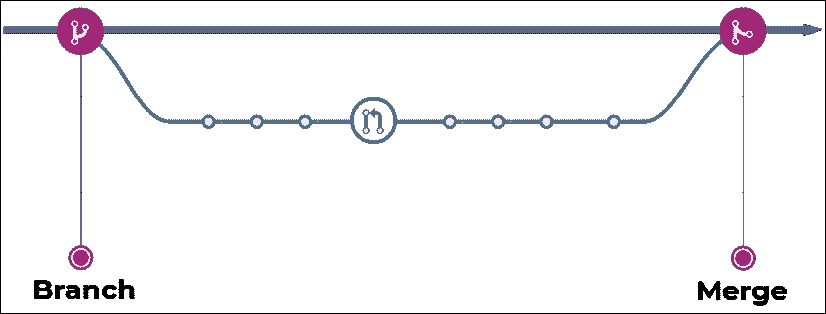

图 9.2：分叉和合并

记住，你的主分支应该始终是可部署的，你应该经常将你的工作合并到主分支。

Docker 允许我们通过一个名为`Dockerfile`的特殊文件以声明方式定义我们的代码所依赖的软件和特定的配置参数。同样，CircleCI 允许我们通过一个名为`config.yml`的文件定义我们的 CI 环境配置。通过将配置存储在文件中，我们能够与代码一起检查这些文件。我们可以使用 Git 跟踪更改，并强制它们通过我们的 CI 管道进行验证。通过将基础设施的定义存储在代码中，我们实现了基础设施即代码（IaC）。通过 IaC，我们还实现了可重复的集成，因此无论我们在什么环境中运行我们的基础设施，我们都应该能够通过一条命令启动我们的全栈应用。

你可能还记得，在*第一章*，*Angular 介绍及其概念*中，我们介绍了 TypeScript 如何覆盖 JavaScript 功能差距。与 TypeScript 类似，Docker 覆盖了配置差距，如下所示：

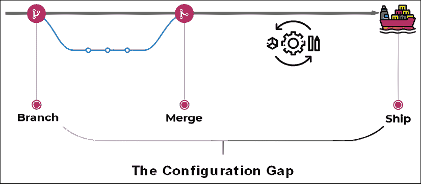

图 9.3：覆盖配置差距

通过使用 Docker，我们可以合理确信，在测试期间在我们机器上工作的代码，在发布时将以完全相同的方式运行。

总结来说，通过 DevOps，我们将运维与开发更紧密地结合在一起，在开发中更改和解决问题成本更低。因此，DevOps 主要是开发者的责任，但它也是一种思维方式，运维团队必须愿意支持。让我们更深入地了解 Docker。

# 使用 Docker 容器化 Web 应用

Docker，可在 [`docker.io`](https://docker.io) 找到，是一个用于开发、运输和运行应用程序的开源平台。Docker 结合了一个轻量级的容器虚拟化平台以及帮助管理和部署应用程序的工作流程和工具。**虚拟机**（**VMs**）和 Docker 容器之间最明显的区别是，VMs 通常大小为数十个吉字节，需要数吉字节内存，而容器在磁盘和内存大小需求方面仅占用兆字节。此外，Docker 平台抽象化了主机 **操作系统**（**OS**）级别的配置设置，因此成功运行应用程序所需的所有配置都编码在可读格式中。

## Dockerfile 的结构

一个 `Dockerfile` 由四个主要部分组成：

+   **FROM** – 我们可以继承 Docker 的最小 "scratch" 镜像或现有的镜像

+   **SETUP** – 我们根据需求配置软件依赖的地方

+   **COPY** – 我们将构建的代码复制到操作环境中的地方

+   **CMD** – 我们指定启动操作环境的命令的地方

引导程序指的是一组初始指令，描述了程序如何加载或启动。

考虑以下 `Dockerfile` 结构的可视化：

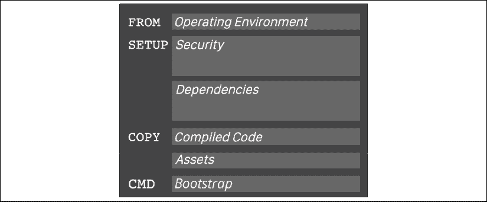

图 9.4：Dockerfile 的结构

以下代码展示了 `Dockerfile` 的具体表示：

```js
**Dockerfile**
FROM duluca/minimal-nginx-web-server:1-alpine
COPY /dist/local-weather-app /var/www
CMD 'nginx' 
```

你可以将脚本中的 `FROM`, `COPY`, 和 `CMD` 部分映射到可视化中。我们使用 `FROM` 命令从 `duluca/minimal-nginx-web-server` 镜像继承。然后，我们使用 `COPY`（或，作为替代，`ADD`）命令将我们的应用程序的编译结果从我们的开发机器或构建环境复制到镜像中。最后，我们指示容器使用 `CMD`（或，作为替代，`ENTRYPOINT`）命令执行 nginx 网络服务器。

注意，前面的 `Dockerfile` 没有独立的 `SETUP` 部分。`SETUP` 不对应实际的 `Dockerfile` 命令，但代表了一组你可以执行的命令来设置你的容器。在这种情况下，所有必要的设置都由基础镜像完成，因此没有额外的命令要运行。

常见的 `Dockerfile` 命令有 `FROM`, `COPY`, `ADD`, `RUN`, `CMD`, `ENTRYPOINT`, `ENV`, 和 `EXPOSE`。对于完整的 `Dockerfile` 参考，请参阅 [`docs.docker.com/engine/reference/builder/`](https://docs.docker.com/engine/reference/builder/)。

`Dockerfile`描述了一个从名为`duluca/minimal-nginx-web-server`的容器继承的新容器。这是一个我在 Docker Hub 上发布的容器，它从`nginx:alpine`镜像继承，该镜像本身又从`alpine`镜像继承。`alpine`镜像是一个最小的 Linux 操作系统环境，大小仅为 5MB。`alpine`镜像本身从`scratch`继承，`scratch`是一个空镜像。请参见以下图表中展示的继承层次结构：

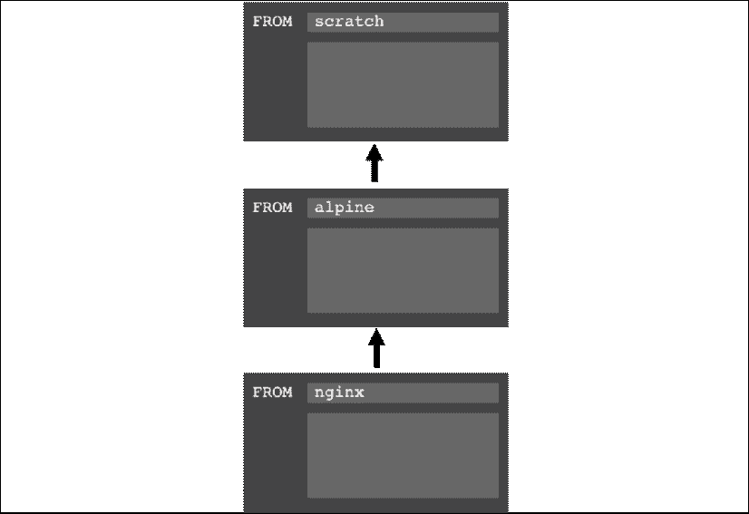

图 9.5：Docker 继承

然后`Dockerfile`将开发环境中的`dist`文件夹内容复制到容器的`www`文件夹中，如下所示：

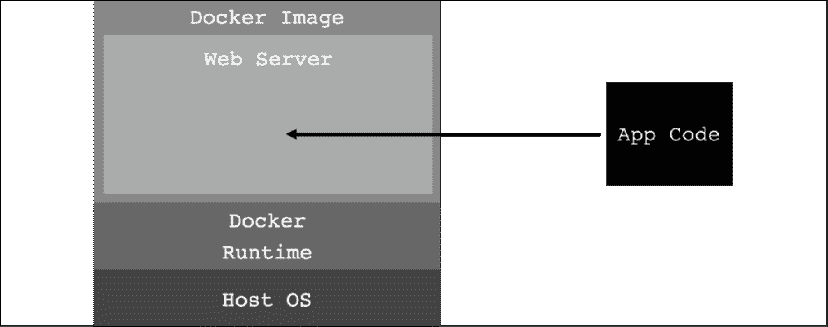

图 9.6：将代码复制到容器化的 Web 服务器中

在这种情况下，父镜像配置了 nginx 服务器作为 Web 服务器来服务`www`文件夹内的内容。此时，我们的源代码可以从互联网上访问，但生活在多层安全环境中。即使我们的应用程序存在某种漏洞，攻击者也很难伤害我们正在运行的系统。以下图表展示了 Docker 提供的多层安全：

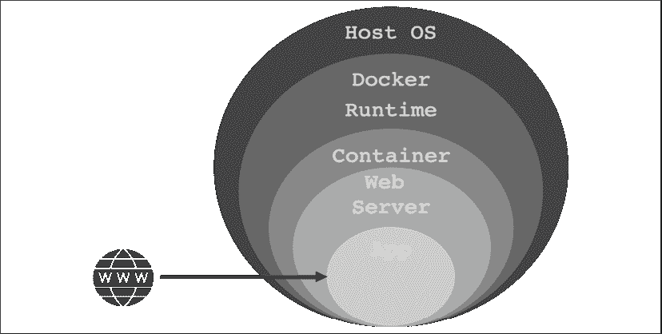

图 9.7：Docker 安全

总结来说，在基础层，我们有运行 Docker 运行时的宿主操作系统，例如 Windows 或 macOS，它将在下一节中安装。Docker 运行时能够运行自包含的 Docker 镜像，这些镜像由上述`Dockerfile`定义。`duluca/minimal-nginx-web-server`基于轻量级的 Linux 操作系统 Alpine。Alpine 是 Linux 的一个完全精简版本，不带任何 GUI、驱动程序，甚至没有大多数 Linux 系统可能期望的 sCLI 工具。因此，该操作系统的大小仅为约 5MB。然后我们从 nginx 镜像继承，该镜像安装了 Web 服务器，其自身大小约为几 MB。最后，我们的自定义 nginx 配置覆盖在默认镜像之上，结果是一个小巧的约 7MB 镜像。nginx 服务器配置为服务`/var/www`文件夹的内容。在`Dockerfile`中，我们仅复制开发环境中`/dist`文件夹的内容并将其放置到`/var/www`文件夹中。我们稍后将构建并执行此镜像，该镜像将运行包含我们`dist`文件夹输出的 Nginx Web 服务器。我已经发布了一个类似的镜像，名为`duluca/minimal-node-web-server`，大小约为 15MB。

`duluca/minimal-node-web-server` 可以更直接地工作，特别是如果你不熟悉 Nginx。它依赖于一个 `Express.js` 服务器来提供静态内容。大多数云服务提供商都提供了使用 Node 和 Express 的具体示例，这可以帮助你缩小任何错误的范围。此外，`duluca/minimal-node-web-server` 内置了 HTTPS 重定向支持。你可以花很多时间尝试设置一个 nginx 代理来做同样的事情，而你只需要在 `Dockerfile` 中设置环境变量 `ENFORCE_HTTPS`。请参阅以下示例 Dockerfile：

```js
**Dockerfile**
FROM duluca/minimal-node-web-server:lts-alpine
WORKDIR /usr/src/app
COPY dist/local-weather-app public
ENTRYPOINT [ "npm", "start" ]
ENV ENFORCE_HTTPS=xProto 
```

你可以在 [`github.com/duluca/minimal-node-web-server`](https://github.com/duluca/minimal-node-web-server) 上了解更多关于 `minimal-node-web-server` 提供的选项。

正如我们现在所看到的，Docker 的美妙之处在于你可以导航到 [`hub.docker.com`](https://hub.docker.com)，搜索 `duluca/minimal-nginx-web-server` 或 `duluca/minimal-node-web-server`，阅读其 `Dockerfile`，并追踪其起源，直到原始的基础镜像，这是网络服务器的基础。我鼓励你以这种方式检查你使用的每个 Docker 镜像，以了解它为你带来的确切价值。你可能发现它要么是过度设计，要么是具有你从未意识到的功能，这些功能可以使你的生活变得更加容易。

注意，父镜像应该拉取 `duluca/minimal-nginx-web-server` 的特定标签，即 `1-alpine`。同样，`duluca/minimal-node-web-server` 从 `lts-alpine` 拉取。这些都是常绿的基础包，始终包含 Nginx 和 Alpine 或 Node 的 LTS 版本的最新发布版本。我已经设置了管道，当发布新的基础镜像时，会自动更新这两个镜像。所以，无论何时你拉取这些镜像，你都会得到最新的错误修复和安全补丁。

拥有一个常绿依赖树可以减轻你作为开发者寻找最新 Docker 镜像版本的负担。或者，如果你指定了版本号，你的镜像将不会受到任何潜在的重大更改的影响。然而，记住在新构建后测试你的镜像，比永远不更新你的镜像并可能部署受损害的软件要好。毕竟，网络是不断变化的，不会因为你更新镜像而减速。

就像 npm 包一样，Docker 可以带来极大的便利和价值，但你必须小心，理解你正在使用的工具。

在 *第十三章*，*AWS 上的高可用云基础设施* 中，我们将利用基于 Nginx 的低内存占用 Docker 镜像 `duluca/minimal-nginx-web-server`。如果你熟悉配置 nginx，这是理想的选择。

## 安装 Docker

为了能够构建和运行容器，你必须在你的电脑上首先安装 Docker 执行环境。请参考 *第二章*，*设置你的开发环境*，了解安装 Docker 的说明。

## 设置 npm scripts for Docker

现在，让我们配置一些 Docker 脚本，您可以使用这些脚本来自动化 Angular 应用程序的构建、测试和发布。我开发了一套名为 **npm scripts for Docker** 的脚本，这些脚本在 Windows 10 和 macOS 上运行。您可以通过执行以下代码获取这些脚本的最新版本，并在项目中自动配置它们：

现在，在 **local-weather-app** 和 **lemon-mart** 项目上运行以下命令！

1.  安装 Docker 任务的 npm 脚本：

    ```js
    $ npm i -g mrm-task-npm-docker 
    ```

1.  应用 Docker 配置的 npm 脚本：

    ```js
    $ npx mrm npm-docker 
    ```

执行 `mrm` 脚本后，我们就可以使用 Local Weather 应用程序作为示例，深入查看配置设置。

## 构建并发布镜像到 Docker Hub

接下来，让我们确保您的项目配置正确，这样我们就可以将其容器化，构建可执行镜像，并将其发布到 Docker Hub，从而允许我们从任何构建环境中访问它。我们将使用我们在 *第六章*，*表单、Observables 和 Subjects* 中最后更新的 Local Weather 应用程序来完成本节：

本节使用 **local-weather-app** 仓库。

1.  在 [`hub.docker.com/`](https://hub.docker.com/) 上注册 Docker Hub 账户。

1.  为您的应用程序创建一个公共（免费）仓库。

    在本章的后面部分，我们使用 Google Cloud 的容器注册库作为私有仓库。此外，在 *第十三章*，*AWS 上的高可用云基础设施* 中，我介绍了如何使用 **AWS Elastic Container Service** （**AWS ECS**）设置私有容器仓库。

1.  在 `package.json` 中，添加或更新 `config` 属性，包含以下配置属性：

    ```js
    **package.json**
      ...
      "config": {
        "imageRepo": "[namespace]/[repository]",
        "imageName": "custom_app_name",
        "imagePort": "0000",
        "internalContainerPort": "3000"
      },
      ... 
    ```

    `namespace` 将是您的 Docker Hub 用户名。您将在创建时定义您的仓库名称。一个示例的 `repository` 变量应看起来像 `duluca/localcast-weather`。镜像名称用于在使用 Docker 命令（如 `docker ps`）时轻松识别您的容器。我将我的命名为 `localcast-weather`。`imagePort` 属性将定义应使用哪个端口从容器内部公开您的应用程序。由于我们使用端口 `5000` 进行开发，请选择不同的端口，例如 `8080`。`internalContainerPort` 定义了您的 Web 服务器映射到的端口。对于 Node 服务器，这通常是端口 `3000`，而对于 Nginx 服务器，则是 `80`。请参阅您所使用的基容器的文档。

1.  让我们回顾一下之前由 `mrm` 任务添加到 `package.json` 中的 Docker 脚本。以下是一个注释版本的脚本，解释了每个功能。

    注意，使用 npm 脚本时，`pre` 和 `post` 关键字分别用于在执行给定脚本之前或之后执行辅助脚本。脚本被有意拆分成更小的部分，以便更容易阅读和维护。

    `build` 脚本如下：

    注意以下 `cross-conf-env` 命令确保脚本在 macOS、Linux 和 Windows 环境中都能同样良好地执行。

    ```js
    **package.json**
    ...
      "scripts": {
        ...
        "predocker:build": "npm run build",
        "docker:build": "cross-conf-env docker image build . -t $npm_package_config_imageRepo:$npm_package_version",
        "postdocker:build": "npm run docker:tag",
        ... 
    ```

    `npm run docker:build` 将在 `pre` 脚本中构建你的 Angular 应用程序，然后使用 `docker image build` 命令构建 Docker 镜像，并在 `post` 脚本中使用版本号标记镜像：

    在我的项目中，`pre` 命令以生产模式构建我的 Angular 应用程序，并运行测试以确保我有一个优化后的构建，没有失败的测试。

    我的预命令看起来像：

    `"predocker:build":` `"npm run build:prod && npm test -- --watch=false"`

    `tag` 脚本如下：

    ```js
    **package.json**
        ...
        "docker:tag": " cross-conf-env docker image tag $npm_package_config_imageRepo:$npm_package_version $npm_package_config_imageRepo:latest",
        ... 
    ```

    `npm run docker:tag` 将使用 `package.json` 中 `version` 属性的版本号和最新标签标记已构建的 Docker 镜像。

    `stop` 脚本如下：

    ```js
    **package.json**
        ...
        "docker:stop": "cross-conf-env docker stop $npm_package_config_imageName || true",
        ... 
    ```

    `npm run docker:stop` 如果镜像正在运行，将停止它，这样 `run` 脚本就可以无错误地执行。

    `run` 脚本如下：

    注意 `run-s` 和 `run-p` 命令是 `npm-run-all` 包的一部分，用于同步或并行化 npm 脚本的执行。

    ```js
    **package.json**
        ...
        "docker:run": "run-s -c docker:stop docker:runHelper",
        "docker:runHelper": "cross-conf-env docker run -e NODE_ENV=local --rm --name $npm_package_config_imageName -d -p $npm_package_config_imagePort:$npm_package_config_internalContainerPort $npm_package_config_imageRepo",
        ... 
    ```

    `npm run docker:run` 如果镜像已经在运行，将停止它，然后使用 `docker run` 命令运行新构建的镜像版本。注意，`imagePort` 属性用作 Docker 镜像的外部端口，映射到 Node.js 服务器监听的内部端口 `3000`。

    `publish` 脚本如下：

    ```js
    **package.json**
        ...
        "predocker:publish": "echo Attention! Ensure `docker login` is correct.",
        "docker:publish": "cross-conf-env docker image push $npm_package_config_imageRepo:$npm_package_version",
        "postdocker:publish": "cross-conf-env docker image push $npm_package_config_imageRepo:latest",
        ... 
    ```

    `npm run docker:publish` 将使用 `docker image push` 命令将构建好的镜像发布到配置的仓库，在这个例子中是 Docker Hub。

    首先，发布带有版本号的镜像，然后是带有 `latest` 标签的镜像。`taillogs` 脚本如下：

    ```js
    **package.json**
        ...
        "docker:taillogs": "cross-conf-env docker logs -f $npm_package_config_imageName",
        ... 
    ```

    `npm run docker:taillogs` 将使用 `docker log -f` 命令显示正在运行的 Docker 实例的内部控制台日志，这是一个在调试 Docker 实例时非常有用的工具。

    `open` 脚本如下：

    ```js
    **package.json**
        ...
        "docker:open": "sleep 2 && cross-conf-env open-cli http://localhost:$npm_package_config_imagePort",
        ... 
    ```

    `npm run docker:open` 将等待 2 秒，然后使用 `imagePort` 属性启动浏览器，显示你应用程序的正确 URL。

    `debug` 脚本如下：

    ```js
    **package.json**
        ...
        "predocker:debug": "run-s docker:build docker:run",
        "docker:debug": "run-s -cs docker:open:win docker:open:mac docker:taillogs"
      },
    ... 
    ```

    `npm run docker:debug` 将构建你的镜像并在 `pre` 阶段运行一个实例，打开浏览器，然后开始显示容器的内部日志。

1.  自定义预构建脚本以在生产模式下构建你的 Angular 应用程序，并在构建镜像之前执行单元测试：

    ```js
    **package.json**
        "build": "ng build",
        "build:prod": "ng build --prod",
        "predocker:build": "npm run build:prod && npm test -- --watch=false", 
    ```

    注意 `ng build` 使用了 `--prod` 参数，这实现了两个目的：通过 **Ahead-of-Time** （**AOT**） 编译将应用程序的大小优化得显著更小，从而提高运行时性能，并且使用 `src/environments/environment.prod.ts` 中定义的配置项。

1.  更新 `src/environments/environment.prod.ts` 以看起来你正在使用自己的 `appId` 从 `OpenWeather`：

    ```js
    export const environment = {   
      production: true,
      appId: '01ff1xxxxxxxxxxxxxxxxxxxxx',
      username: 'localcast',
      baseUrl: 'https://',
      geonamesApi: 'secure',
    } 
    ```

    我们正在修改 `npm test` 的执行方式，因此测试只运行一次，工具停止执行。提供 `--watch=false` 选项来实现此行为，而不是开发友好的默认连续执行行为。

1.  在项目根目录下创建一个名为 `Dockerfile` 的新文件，不要添加文件扩展名。

1.  实现或替换 `Dockerfile` 的内容，如下所示：

    ```js
    **Dockerfile**
    FROM duluca/minimal-node-web-server:lts-alpine 
    WORKDIR /usr/src/app
    COPY dist/local-weather-app public 
    ```

    一定要检查你的 `dist` 文件夹的内容，以确保你正在复制正确的文件夹，该文件夹在其根目录下包含 `index.html` 文件。

1.  执行 `npm run predocker:build` 并确保它在终端中无错误运行，以确保你的应用程序更改已成功。

1.  执行 `npm run docker:build` 并确保它在终端中无错误运行，以确保镜像构建成功。

    虽然你可以单独运行提供的任何脚本，但向前看，你实际上只需要记住其中两个：

    +   `npm run docker:debug` 将会测试、构建、标记、运行、跟踪并在新浏览器窗口中启动你的容器化应用进行测试。

    +   `npm run docker:publish` 将将你刚刚构建和测试的镜像发布到在线 Docker 仓库。

1.  在你的终端中执行 `docker:debug`。

    ```js
    $ npm run docker:debug 
    ```

    成功的 `docker:debug` 运行应该导致一个新的聚焦浏览器窗口，其中包含你的应用程序和终端中的服务器日志跟踪，如下所示：

    ```js
    Current Environment: local.
    Server listening on port 3000 inside the container
    Attention: To access server, use http://localhost:EXTERNAL_PORT
    EXTERNAL_PORT is specified with 'docker run -p EXTERNAL_PORT:3000'. See 'package.json->imagePort' for the default port.      
    GET / 304 2.194 ms - -
    GET /runtime-es2015.js 304 0.371 ms - -
    GET /polyfills-es2015.js 304 0.359 ms - -
    GET /styles-es2015.js 304 0.839 ms - -
    GET /vendor-es2015.js 304 0.789 ms - -
    GET /main-es2015.js 304 0.331 ms - - 
    ```

    你应该始终运行 `docker ps` 来检查你的镜像是否正在运行，它上次更新是什么时候，以及它是否与任何声称相同端口的现有镜像冲突。

1.  在你的终端中执行 `docker:publish`。

    ```js
    $ npm run docker:publish 
    ```

    你应该在终端窗口中观察到一次成功的运行，如下所示：

    ```js
    The push refers to a repository [docker.io/duluca/localcast- weather]
    60f66aaaaa50: Pushed
    ...
    latest: digest: sha256:b680970d76769cf12cc48f37391d8a542fe226b66d9a6f8a7ac81ad77be4 f58b size: 2827 
    ```

随着时间的推移，你的本地 Docker 缓存可能会增长到相当大的大小；例如，在我的笔记本电脑上，两年内已经达到了大约 40 GB。你可以使用 `docker image prune` 和 `docker container prune` 命令来减小缓存的大小。有关更详细的信息，请参阅[`docs.docker.com/config/pruning`](https://docs.docker.com/config/pruning)文档。

通过定义 `Dockerfile` 并编写使用它的脚本，我们在代码库中创建了活生生的文档。我们已经实现了 DevOps 并关闭了配置差距。

确保以与 **local-weather-app** 相同的方式将 **lemon-mart** 容器化，并通过执行 `npm run docker:debug` 验证你的工作。

你可能会发现通过 CLI 交互 npm 脚本有些令人困惑。接下来，让我们看看 VS Code 的 npm 脚本支持。

## VS Code 中的 NPM 脚本

VS Code 默认提供对 npm 脚本的支持。为了启用 npm 脚本探索器，打开 VS Code 设置并确保存在 `"npm.enableScriptExplorer": true` 属性。一旦这样做，你将在 **探索器** 面板中看到一个可展开的标题名为 **NPM SCRIPTS**，如下面的截图所示，箭头已突出显示：

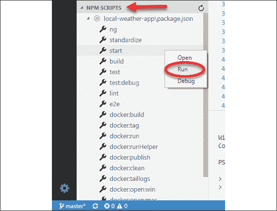

图 9.8：VS Code 中的 NPM 脚本

您可以单击任何脚本以启动`package.json`中包含脚本的行，或者右键单击并选择**运行**来执行脚本。

让我们看看与 Docker 交互的一种更简单的方法。

## VS Code 中的 Docker 扩展

与 Docker 镜像和容器交互的另一种方式是通过 VS Code。如果您已按照*第二章*，*设置开发环境*中建议的，安装了来自 Microsoft 的`ms-azuretools.vscode-docker` Docker 扩展，您可以通过 VS Code 左侧导航菜单上的 Docker 标志识别该扩展，如下面的截图所示，用白色圆圈标出：

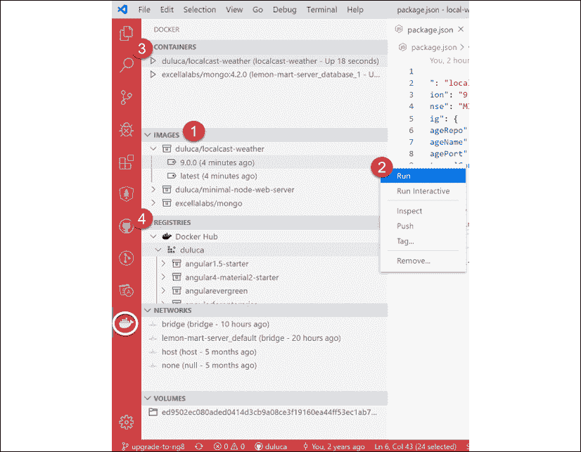

图 9.9：VS Code 中的 Docker 扩展

让我们来看看扩展提供的功能之一。参考前面的截图和以下列表中的编号步骤，以获得快速解释：

1.  **镜像**包含您系统上所有容器快照的列表。

1.  右键单击 Docker 镜像会弹出一个上下文菜单，可以运行各种操作，如**运行**、**推送**和**标记****。**

1.  **容器**列出了您系统上所有可执行的 Docker 容器，您可以启动、停止或附加到它们。

1.  **注册表**显示了您配置连接到的注册表，例如 Docker Hub 或**AWS 弹性容器注册表**（**AWS ECR**）。

虽然扩展使与 Docker 的交互变得更容易，但**Docker 的 npm 脚本**（您使用`mrm`任务配置的）自动化了大量与构建、标记和测试镜像相关的任务。它们都是跨平台的，在 CI 环境中也能同样良好地工作。

`npm run docker:debug`脚本自动化了大量任务，以验证您有一个良好的镜像构建！

现在让我们看看如何将我们的容器部署到云，并随后实现持续交付（CD）。

# 将 Dockerfile 部署到云

使用 Docker 的一个优点是我们可以在任何数量的操作系统环境中部署它，从个人 PC 到服务器和云提供商。在任何情况下，我们都期望我们的容器以相同的方式运行。让我们将 LocalCast 天气应用部署到 Google Cloud Run。

## Google Cloud Run

Google Cloud Run 允许您部署任意 Docker 容器，并在 Google Cloud Platform 上执行它们，而无需任何繁重的开销。完全管理的实例提供一些免费时间；然而，这里没有永久免费的版本。请注意您可能产生的任何费用。请参阅[`cloud.google.com/run/pricing?hl=en_US%20for%20pricing`](https://cloud.google.com/run/pricing?hl=en_US%20for%20pricing)。

参考第二章，*设置开发环境*，了解如何安装 glcoud。

本节使用**local-weather-app**仓库。

让我们配置 glcoud，以便我们可以部署一个`Dockerfile`：

1.  更新您的`Dockerfile`以覆盖`ENTRYPOINT`命令：

    ```js
    **Dockerfile**
    FROM duluca/minimal-node-web-server:lts-alpine
    WORKDIR /usr/src/app
    COPY dist/local-weather-app public
    ENTRYPOINT [ "npm", "start" ] 
    ```

    `minimal-node-web-server` 中的 `ENTRYPOINT` 命令运行一个名为 `dumb-init` 的进程，以强制你的 Node 进程的进程 ID 随机化。然而，gcloud 无法执行此命令，这就是我们为什么要覆盖它的原因。

1.  创建一个新的 gcloud 项目：

    ```js
    $ gcloud projects create localcast-weather 
    ```

    记得使用你自己的项目名称！

1.  导航到 [`console.cloud.google.com/`](https://console.cloud.google.com/)

1.  定位到你的新项目，并从侧边栏中选择**计费**选项，如图下截图所示：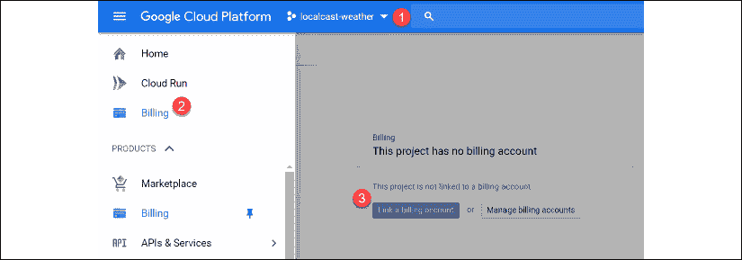

    图 9.10：计费选项

1.  按照说明设置计费账户。

    如果你看到它，免费增值账户选项也将有效。否则，你可以选择利用免费试用优惠。然而，设置一个预算警报是个好主意，这样你就可以在每月超过一定金额时收到通知。更多信息请见 [`cloud.google.com/billing/docs/how-to/modify-project`](https://cloud.google.com/billing/docs/how-to/modify-project)。

1.  创建一个 `.gcloudignore` 文件，忽略除 `Dockerfile` 和 `dist` 文件夹之外的所有内容：

    ```js
    **.gcloudignore**
    /*
    !Dockerfile
    !dist/ 
    ```

1.  在云端添加一个新的 npm 脚本来构建你的 `Dockerfile`：

    ```js
    **package.json**
      scripts: {
        "gcloud:build": "gcloud builds submit --tag gcr.io/localcast-weather/localcast-weather --project localcast-weather",
      } 
    ```

    记得使用你自己的项目名称！

1.  添加另一个 npm 脚本来部署你发布的容器：

    ```js
    **package.json**
      scripts: {
        "gcloud:deploy": "gcloud run deploy --image gcr.io/localcast-weather/localcast-weather --platform managed --project localcast-weather --region us-east1"
      } 
    ```

    注意，你应该提供离你地理位置最近的区域，以获得最佳体验。

1.  按照以下方式构建你的 `Dockerfile`：

    ```js
    $ npm run gcloud:build 
    ```

    在运行此命令之前，记得为 `prod` 构建你的应用程序。你 `dist` 文件夹中的任何内容都将被部署。

    注意，在首次运行时，你将需要回答问题以配置你的账户以供初始使用。正确选择你的账户和项目名称，否则，请选择默认选项。`build` 命令在首次运行时可能会失败。有时需要多次运行，gcloud 才能预热并成功构建你的容器。

1.  一旦你的容器发布，使用以下命令部署它：

    ```js
    $ npm run gcloud:deploy 
    ```

成功的部署看起来如下所示：

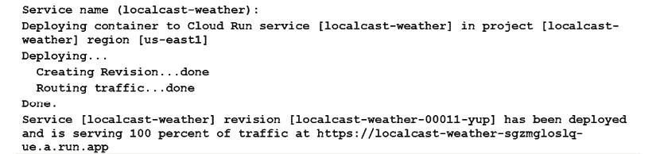

图 9.11：成功的部署

恭喜，你已经在 Google Cloud 上部署了你的容器。你应该能够通过终端输出的 URL 访问你的应用程序。

如往常一样，考虑将 CLI 命令作为 npm 脚本添加到你的项目中，这样你可以维护你脚本的活文档。这些脚本还将允许你利用 npm 中的预脚本和后脚本，从而自动化构建你的应用程序、容器和标记过程。因此，下次你需要部署时，你只需要运行一个命令。我鼓励读者从我们之前设置的 npm 脚本 Docker 工具中寻找灵感，以创建你自己的 gcloud 脚本集。

有关更多信息和一些示例项目，请参阅 [`cloud.google.com/run/docs/quickstarts/prebuilt-deploy`](https://cloud.google.com/run/docs/quickstarts/prebuilt-deploy) 和 [`cloud.google.com/run/docs/quickstarts/build-and-deploy`](https://cloud.google.com/run/docs/quickstarts/build-and-deploy)。

## 使用 Cloud Run 配置 Docker

在上一节中，我们将我们的 `Dockerfile` 和 `dist` 文件夹提交给 gcloud，以便它为我们构建容器。这是一个方便的选项，可以避免一些额外的配置步骤。然而，您仍然可以利用基于 Docker 的工作流程来构建和发布您的容器。

让我们使用 gcloud 配置 Docker：

1.  设置您的默认区域：

    ```js
    $ gcloud config set run/region us-east1 
    ```

1.  使用 gcloud 容器注册库配置 Docker：

    ```js
    $ gcloud auth configure-docker 
    ```

1.  使用 gcloud 主机名标记您已构建的容器：

    ```js
    $ docker tag duluca/localcast-weather:latest gcr.io/localcast-weather/localcast-weather:latest 
    ```

    有关如何标记镜像的详细说明，请参阅 [`cloud.google.com/container-registry/docs/pushing-and-pulling`](https://cloud.google.com/container-registry/docs/pushing-and-pulling)。

1.  使用 Docker 将容器发布到 gcloud：

    ```js
    $ docker push gcr.io/localcast-weather/localcast-weather:latest 
    ```

1.  执行 `deploy` 命令：

    ```js
    $ gcloud run deploy --image gcr.io/localcast-weather/localcast-weather --platform managed --project localcast-weather 
    ```

    在初始部署期间，此命令可能看起来卡住了。大约 15 分钟后再试一次。

1.  按照屏幕上的说明完成您的部署。

1.  按照屏幕上显示的 URL 检查您的应用程序是否已成功部署。

上述步骤演示了一种与我们在 *第十三章*，*AWS 上的高可用云基础设施* 中部署到 AWS ECS 时所利用的技术类似的部署技术。

有关更多信息，请参阅 [`cloud.google.com/sdk/gcloud/reference/run/deploy`](https://cloud.google.com/sdk/gcloud/reference/run/deploy)。在接下来的几节中，我们将切换回 LemonMart。

## Cloud Run 故障排除

为了故障排除您的 glcoud 命令，您可以使用 Google Cloud Platform 控制台 [`console.cloud.google.com/`](https://console.cloud.google.com/)。

在 Cloud Run 菜单下，您可以跟踪您正在运行的容器。如果在部署过程中发生错误，您可能想检查日志以查看容器创建的消息。参考以下截图，它显示了 `localcast-weather` 部署的日志：


图 9.12：Cloud Run 日志

要了解更多关于 Cloud Run 故障排除的信息，请参阅 [`cloud.google.com/run/docs/troubleshooting`](https://cloud.google.com/run/docs/troubleshooting)。

恭喜！您已经掌握了在本地开发环境中使用 Docker 容器以及将它们推送到云中的多个注册库和运行时环境的基本技能。

# 持续部署

CD 是指代码更改成功通过您的管道后可以自动部署到目标环境。尽管有持续部署到生产环境的例子，但大多数企业更喜欢将目标设置为开发环境。采用门控方法将更改通过开发的各个阶段，包括测试、预发布和最终的生产。CircleCI 可以通过审批工作流程促进门控部署，这一点将在本节后面介绍。

在 CircleCI 中，为了部署您的镜像，我们需要实现一个`deploy`作业。在这个作业中，您可以部署到多个目标，例如 Google Cloud Run、Docker Hub、Heroku、Azure 或 AWS ECS。与这些目标的集成将涉及多个步骤。从高层次来看，这些步骤如下：

1.  为您的目标环境配置一个 orb，它提供了部署您的软件所需的 CLI 工具。

1.  将针对目标环境的特定登录凭证或访问密钥存储为 CircleCI 环境变量。

1.  如果不是使用特定平台的`build`命令，则在 CI 管道中构建容器。然后使用`docker push`将生成的 Docker 镜像提交到目标平台的 Docker 注册库。

1.  执行特定平台的`deploy`命令，指示目标运行刚刚推送的 Docker 镜像。

通过使用基于 Docker 的工作流程，我们在系统和目标环境方面实现了极大的灵活性。以下图表通过突出我们可用的可能选择排列来阐述这一点：

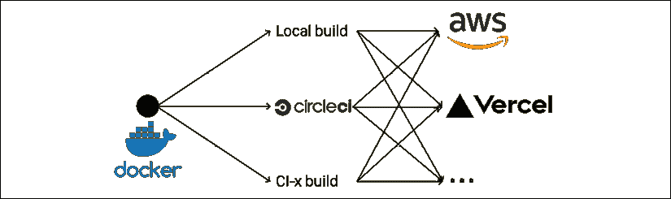

图 9.13：n-to-n 部署

如您所见，在容器化的世界中，可能性是无限的。我将在本章后面演示如何使用容器和 CI 将应用程序部署到 Google Cloud Run。在基于 Docker 的工作流程之外，您可以使用专门构建的 CLI 工具快速部署您的应用程序。接下来，让我们看看如何使用 CircleCI 将应用程序部署到 Vercel Now。

## 使用 CircleCI 将应用程序部署到 Vercel Now

在**第四章**，“自动化测试、CI 和发布到生产”中，我们配置了 LocalCast Weather 应用程序使用 CircleCI 进行构建。我们可以增强我们的 CI 管道，以使用构建输出，并可选择将其部署到 Vercel Now。

注意，ZEIT Now 在 2020 年更名为 Vercel Now。

本节使用**local-weather-app**仓库。本节的`config.yml`文件命名为`.circleci/config.ch9.yml`。您还可以在[`github.com/duluca/local-weather-app/pull/50`](https://github.com/duluca/local-weather-app/pull/50)找到执行本章中`.yml`文件的拉取请求，使用`branch deploy_Vercelnow`。

注意，这个分支在`config.yml`和`Dockerfile`中有一个修改过的配置，以使用来自**local-weather-app**的`projects/ch6`代码。

让我们更新`config.yml`文件，添加一个名为`deploy`的新作业。在即将到来的工作流程部分，我们将使用此作业在批准时部署管道：

1.  从您的 Vercel Now 账户创建一个令牌。

1.  在您的 CircleCI 项目中添加一个名为 `NOW_TOKEN` 的环境变量，并将您的 Vercel Now 令牌作为其值存储。

1.  在 `config.yml` 中，更新 `build` 作业的新步骤，并添加一个名为 `deploy` 的新作业：

    ```js
    **.circleci/config.yml**
    ...
    jobs:
      build:
        ...       
        - run:
            name: Move compiled app to workspace
            command: |
              set -exu
              mkdir -p /tmp/workspace/dist
              mv dist/local-weather-app /tmp/workspace/dist/
        - persist_to_workspace:
            root: /tmp/workspace
            paths:
              - dist/local-weather-app
      deploy:
        docker:
          - image: circleci/node:lts
        working_directory: ~/repo
        steps:
          - attach_workspace:
              at: /tmp/workspace
          - run: npx now --token $NOW_TOKEN --platform-version 2 --prod /tmp/workspace/dist/local-weather-app --confirm 
    ```

    在 `build` 作业中，构建完成后，我们添加两个新步骤。首先，我们将位于 `dist` 文件夹中的编译后的应用程序移动到工作区，并持久化该工作区，以便我们可以在另一个作业中使用它。在名为 `deploy` 的新作业中，我们附加工作区并使用 npx 运行 `now` 命令来部署 `dist` 文件夹。这是一个简单的过程。

    注意 `$NOW_TOKEN` 是我们在 CircleCI 项目中存储的环境变量。

1.  实现一个简单的 CircleCI 工作流程，以持续部署 `build` 作业的结果：

    ```js
    **.circleci/config.yml**
    ...
    workflows:
      version: 2
      build-test-and-deploy:
        jobs:
          - build
          - deploy:
             requires:
               - build 
    ```

    注意，`deploy` 作业在执行之前会等待 `build` 作业完成。

1.  通过检查测试结果来确保您的 CI 管道成功执行：

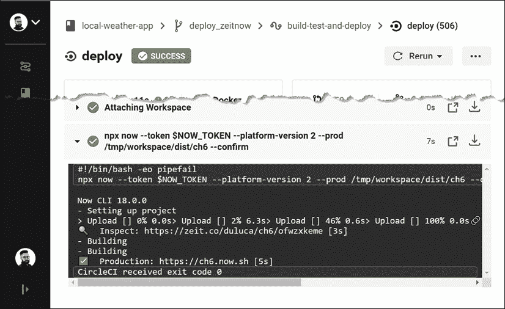

图 9.14：在 deploy_Vercelnow 分支上成功部署 local-weather-app 的 Vercel Now

大多数云服务提供商的 CLI 命令都需要安装到您的管道中才能正常工作。由于 Vercel Now 有 npm 包，这很容易做到。AWS、Google Cloud 或 Microsoft Azure 的 CLI 工具需要使用 `brew` 或 `choco` 等工具安装。在 CI 环境中手动执行此操作很繁琐。接下来，我们将介绍 orbs，它有助于解决这个问题。

## 使用 orbs 将应用程序部署到 GCloud

Orbs 包含一组配置元素，用于封装 CircleCI 项目之间的可共享行为。CircleCI 提供由 CLI 工具维护者开发的 orbs。这些 orbs 使您能够轻松地将 CLI 工具添加到您的管道中，而无需手动设置，配置简单。

要使用 orbs，您的 `config.yml` 版本号必须设置为 `2.1`，并且在您的 CircleCI 安全设置中，您必须选择允许未认证 orbs 的选项。

以下是一些您可以在项目中使用的 orbs：

+   `circleci/aws-cli` 和 `circleci/aws-ecr` 为您提供 AWS CLI 工具，并帮助您与 **AWS 弹性容器服务**（**AWS ECS**）交互，执行诸如将容器部署到 AWS ECR 等任务。

+   `circleci/aws-ecs` 简化了您的 CircleCI 配置，以便将容器部署到 AWS ECS。

+   `circleci/gcp-cli` 和 `circleci/gcp-gcr` 为您提供 GCloud CLI 工具和访问 **Google 容器注册库**（**GCR**）的权限。

+   `circleci/gcp-cloud-run` 简化了您的 CircleCI 配置，以便将容器部署到 Cloud Run。

+   `circleci/azure-cli` 和 `circleci/azure-acr` 为您提供 Azure CLI 工具和访问 **Azure 容器注册库**（**ACR**）的权限。

查看 Orb 注册表以获取有关如何使用这些 orbs 的更多信息：[`circleci.com/orbs/registry`](https://circleci.com/orbs/registry)。

现在，让我们配置`circleci/gcp-cloud-run` orb 与 Local Weather 应用，这样我们就可以持续将我们的应用部署到 GCloud，而无需在 CI 服务器上手动安装和配置 gcloud CLI 工具。

在**local-weather-app**仓库中，你可以找到一个从这一步开始在 CircleCI 上执行 Cloud Run 配置的 pull request，链接为[`github.com/duluca/local-weather-app/pull/51`](https://github.com/duluca/local-weather-app/pull/51)，使用的是`deploy_cloudrun`分支。

注意，这个分支在`config.yml`和`Dockerfile`中有修改过的配置，以使用**local-weather-app**中的`projects/ch6`代码。

首先，配置你的 CircleCI 和 GCloud 账户，以便你可以从 CI 服务器部署。这与从你的开发机器部署明显不同，因为 gcloud CLI 工具会自动为你设置必要的认证配置。在这里，你必须手动完成：

1.  在你的 CircleCI 账户设置中，在安全部分确保你允许执行未经认证/未签名的 orb。

1.  在 CircleCI 项目设置中，添加一个名为`GOOGLE_PROJECT_ID`的环境变量。

    如果你和我使用的是相同的项目 ID，那么这个应该是`localcast-weather`。

1.  为你的项目现有的服务账户创建一个 GCloud 服务账户密钥。

    创建服务账户密钥将生成一个 JSON 文件。不要将此文件提交到你的代码仓库。不要通过不安全的通信渠道（如电子邮件或短信）共享其内容。泄露此文件的内容意味着任何第三方都可以通过密钥权限访问你的 GCloud 资源。

1.  将 JSON 文件的内容复制到 CircleCI 环境变量`GCLOUD_SERVICE_KEY`中。

1.  添加另一个名为`GOOGLE_COMPUTE_ZONE`的环境变量，并将其设置为你的首选区域。

    我使用了`us-east1`。

1.  更新你的`config.yml`文件，添加一个名为`circleci/gcp-cloud-run`的 orb：

    ```js
    **.circleci/config.yml**
    **version: 2.1**
    orbs:
      cloudrun: circleci/gcp-cloud-run@1.0.2
      ... 
    ```

1.  接下来，实现一个名为`deploy_cloudrun`的新作业，利用 orb 功能来初始化、构建、部署和测试我们的部署：

    ```js
    **.circleci/config.yml**
    ...
    deploy_cloudrun:
      docker:
        - image: 'cimg/base:stable'
      working_directory: ~/repo
      steps:
        - attach_workspace:
            at: /tmp/workspace
        - checkout
        - run:
            name: Copy built app to dist folder
            command: cp -avR /tmp/workspace/dist/ .
        - cloudrun/init
        - cloudrun/build:
           tag: 'gcr.io/${GOOGLE_PROJECT_ID}/test-${CIRCLE_SHA1}'
           source: ~/repo
        - cloudrun/deploy:
            image: 'gcr.io/${GOOGLE_PROJECT_ID}/test-${CIRCLE_SHA1}'
            platform: managed
            region: us-east1
            service-name: localcast-weather
            unauthenticated: true
        - run:
            command: >
              GCP_API_RESULTS=$(curl -s "$GCP_DEPLOY_ENDPOINT")
              if ! echo "$GCP_API_RESULTS" | grep -nwo "LocalCast Weather"; then
                echo "Result is unexpected"
                echo 'Result: '
                curl -s "$GCP_DEPLOY_ENDPOINT"
                exit 1;
              fi
            name: Test managed deployed service. 
    ```

    我们首先从`build`作业中加载`dist`文件夹。然后运行`cloudrun/init`，以便初始化 CLI 工具。使用`cloudrun/build`，我们构建项目根目录下的`Dockerfile`，构建结果自动存储在 GCR 中。然后，`cloudrun/deploy`部署我们刚刚构建的镜像，使我们的代码上线。在最后一个命令中，使用`curl`工具检索我们网站的`index.html`文件，并检查它是否已正确部署，通过搜索 LocalCast Weather 字符串来验证。

1.  更新你的工作流程以持续部署到 gcloud：

    ```js
    **.circleci/config.yml**
    ...
    workflows:
     version: 2
      build-test-and-deploy:
        jobs:
          - build
          - deploy_cloudrun:
              requires:
                - build 
    ```

    注意，你可以有多个同时部署到多个目标的`deploy`作业。

1.  通过检查测试结果来确保你的 CI 管道执行成功：

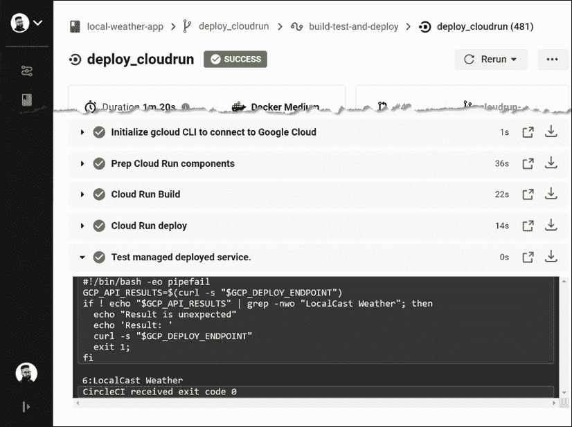

图 9.15：在 deploy_cloudrun 分支上成功部署 local-weather-app 到 gcloud

CD 对于开发和测试环境来说效果很好。然而，通常希望有门控部署，即在部署到达生产环境之前，必须有人批准。接下来，让我们看看如何使用 CircleCI 实现这一点。

## 门控 CI 工作流程

在 CircleCI 中，您可以定义一个工作流程来控制作业的执行方式和时间。考虑以下配置，给定作业 `build` 和 `deploy`：

```js
**.circleci/config.yml**
workflows:
  version: 2
  build-and-deploy:
    jobs:
      - build
      - hold:
          type: approval
          requires:
            - build
      - deploy:
          requires:
            - hold 
```

首先，执行 `build` 作业。然后，我们引入一个名为 `hold` 的特殊作业，其类型为 `approval`，它要求 `build` 作业成功完成。一旦发生这种情况，管道就会被暂停。如果或当决策者批准了 `hold`，则 `deploy` 步骤可以执行。参考以下截图以查看 `hold` 的外观：

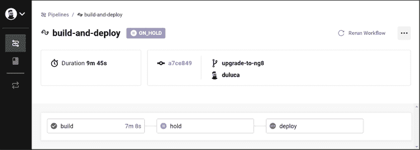

图 9.16：管道中的暂停

```js
build and test steps are broken out into two separate jobs:
```

```js
workflows:
  version: 2
    build-test-and-approval-deploy:
      jobs:
      - build 
      - test
      - hold:
         type: approval
         requires:
           - build
           - test
         filters:
           branches:
             only: master
      - deploy:
        requires:
          - hold 
```

在这种情况下，`build` 和 `test` 作业是并行执行的。如果我们在一个分支上，这就是管道停止的地方。一旦分支与 `master` 合并，管道就会被暂停，决策者有选择部署特定构建或不部署的选项。这种分支过滤类型确保只有合并到 `master` 的代码才能部署，这与 GitHub 流相一致。

接下来，我们将深入了解如何自定义 Docker 以适应您的流程和环境。

# 高级持续集成

在 *第四章*，*自动化测试、持续集成和发布到生产* 中，我们介绍了利用默认功能的基本 CircleCI 工作流程。除了单元测试执行的基本自动化之外，CI 的另一个目标是通过每次代码推送都构建、测试和生成应用程序的可部署工件，以实现一致和可重复的环境。在推送一些代码之前，开发者应该对构建通过有一个合理的预期；因此，创建一个可靠的 CI 环境至关重要，该环境可以自动化开发者也可以在本地机器上运行的命令。为了实现这一目标，我们将构建一个自定义的构建管道，该管道可以在任何操作系统上运行，无需配置或任何行为变化。

本节使用 **lemon-mart** 仓库。请确保您的项目已按本章前面所述正确配置，通过执行 `npm run docker:debug`。

## 容器化构建环境

为了确保在各种操作系统平台、开发机器和 CI 环境之间保持一致的构建环境，您可能需要将您的构建环境容器化。请注意，目前至少有六种常见的 CI 工具正在使用中。学习每个工具的细节几乎是一项几乎不可能完成的任务。

将构建环境容器化是一个高级概念，它超越了当前 CI 工具所期望的功能。然而，容器化是一种很好的方法，可以标准化超过 90% 的构建基础设施，并且可以在几乎任何 CI 环境中执行。采用这种方法，你学到的技能和创建的构建配置将更有价值，因为你的知识和你创建的工具都变得可转移和可重复使用。

有许多策略可以将构建环境容器化，具有不同粒度和性能期望。为了本书的目的，我们将关注可重用性和易用性。我们不会创建一个复杂且相互依赖的 Docker 镜像集，这可能允许更高效的失败和恢复路径，而是将重点放在一个简单直接的流程上。Docker 的新版本有一个名为多阶段构建的出色功能，它允许你以易于阅读的方式定义多镜像过程，并维护一个单一的 `Dockerfile`。

在过程结束时，你可以提取一个优化的容器镜像作为我们的交付物，从而简化了之前过程中使用的镜像的复杂性。

作为提醒，你的单个 `Dockerfile` 可能看起来像以下示例：

```js
**Dockerfile**
FROM duluca/minimal-node-web-server:lts-alpine 
WORKDIR /usr/src/app
COPY dist/lemon-mart public 
```

## 多阶段 Dockerfile

多阶段构建通过在单个 `Dockerfile` 中使用多个 `FROM` 语句来实现，其中每个阶段都可以执行一个任务，并将其实例内的任何资源提供给其他阶段。在构建环境中，我们可以将各种与构建相关的任务作为它们自己的阶段来实现，然后将最终结果，如 Angular 构建的 `dist` 文件夹，复制到包含 Web 服务器的最终镜像中。在这种情况下，我们将实现三个阶段的镜像：

+   **构建器**：用于构建你的 Angular 应用的生产版本

+   **测试器**：用于对无头 Chrome 实例运行单元和端到端测试

+   **Web 服务器**：仅包含优化后的生产代码的最终结果

多阶段构建需要 Docker 版本 17.05 或更高。要了解更多关于多阶段构建的信息，请阅读[`docs.docker.com/develop/develop-images/multistage-build`](https://docs.docker.com/develop/develop-images/multistage-build)上的文档。

如以下图所示，构建器将构建应用程序，测试器将执行测试：


图 9.17：多阶段 Dockerfile

最终镜像将使用构建步骤的结果来构建。

首先，在项目的根目录下创建一个新文件来实现多阶段配置，命名为 `integration.Dockerfile`。

### 构建器

第一个阶段是 `builder`。我们需要一个轻量级的构建环境，以确保跨所有方面的构建一致性。为此，我创建了一个基于 Alpine 的 Node 构建环境，其中包括 npm、bash 和 Git 工具。这个最小容器被称为 `duluca/minimal-node-build-env`，基于 node-alpine，可以在 Docker Hub 上找到 [`hub.docker.com/r/duluca/minimal-node-build-env`](https://hub.docker.com/r/duluca/minimal-node-build-env)。这个镜像比 node 小大约 10 倍。

Docker 镜像的大小对构建时间有实际影响，因为 CI 服务器或您的团队成员将花费额外的时间来拉取更大的镜像。请选择最适合您需求的 环境。

让我们使用合适的基镜像创建一个构建器：

1.  确保在 `package.json` 中有 `build:prod` 命令：

    ```js
    **package.json**
    "scripts": {
      "build:prod": "ng build --prod",
    } 
    ```

1.  继承自基于 Node.js 的构建环境，例如 `node:lts-alpine` 或 `duluca/minimal-node-build-env:lts-alpine`。

1.  在新的 `Dockerfile` 中实现特定环境的构建脚本，命名为 `integration.Dockerfile`，如下所示：

    ```js
    **integration.Dockerfile**
    FROM duluca/minimal-node-build-env:lts-alpine as builder
    ENV BUILDER_SRC_DIR=/usr/src
    # setup source code directory and copy source code
    WORKDIR $BUILDER_SRC_DIR
    COPY . .
    # install dependencies and build
    RUN npm ci
    RUN npm run style
    RUN npm run lint
    RUN npm run build:prod 
    ```

CI 环境将从 GitHub 检出您的源代码并将其放置在当前目录中。因此，使用点符号从 **当前工作目录**（**CWD**）复制源代码应该可以工作，就像在您的本地开发环境中一样。如果您遇到问题，请参考您的 CI 提供商的文档。

接下来，让我们看看您如何调试您的 Docker 构建。

#### 调试构建环境

根据您的特定需求，您对 Dockerfile 中构建器部分的初始设置可能很令人沮丧。为了测试新命令或调试错误，您可能需要直接与构建环境交互。

要在构建环境中交互式实验和/或调试，请执行以下命令：

```js
$ docker run -it duluca/minimal-node-build-env:lts-alpine /bin/bash 
```

您可以在将它们烘焙到 `Dockerfile` 之前，在这个临时环境中测试或调试命令。

### Tester

第二个阶段是 `tester`。默认情况下，Angular CLI 生成的测试需求是针对开发环境的。这在 CI 环境中不起作用；我们必须配置 Angular 以针对无头浏览器运行，该浏览器可以在没有 GPU 辅助的情况下执行，并且还需要一个容器化环境来执行测试。

Angular 测试工具在 *第四章*，*自动化测试、CI 和发布到生产* 中有所介绍。

#### 为 Angular 配置无头浏览器

Protractor 测试工具官方支持在无头模式下运行 Chrome。为了在 CI 环境中执行 Angular 测试，您需要配置测试运行器 Karma，使其与无头 Chrome 实例一起运行：

1.  更新 `karma.conf.js` 以包括新的无头浏览器选项：

    ```js
    **Karma.conf.js**
    ...
        browsers: ['Chrome', 'ChromiumHeadless', 'ChromiumNoSandbox'],
        customLaunchers: {
          ChromiumHeadless: {
            base: 'Chrome',
            flags: [
              '--headless',
              '--disable-gpu',
              // Without a remote debugging port, Google Chrome exits immediately.
              '--remote-debugging-port=9222',
              ],
            debug: true,
          },
          ChromiumNoSandbox: {
            base: 'ChromiumHeadless',
            flags: ['--no-sandbox', '--disable-translate', '--disable- extensions']
          },
        }, 
    ```

    `ChromiumNoSandbox` 自定义启动器封装了良好默认设置所需的所有配置元素。

1.  更新 `protractor` 配置以在无头模式下运行：

    ```js
    **e2e/protractor.conf.js**
    ...
      capabilities: { 
        browserName: 'chrome',
        chromeOptions: {
          args: [
            '--headless',
            '--disable-gpu',
            '--no-sandbox',
            '--disable-translate',
            '--disable-extensions',
            '--window-size=800,600',
          ],
        },
      },
    ... 
    ```

    为了测试你的应用程序在响应式场景下的表现，你可以使用前面提到的`--window-size`选项来更改浏览器设置。

1.  更新`package.json`中的脚本，以在生产构建场景中选择新的浏览器选项：

    ```js
    **package.json**
    "scripts": {
      ...
      "test": "ng test lemon-mart --browsers Chrome",
      "test:prod": "npm test -- --browsers ChromiumNoSandbox   --  watch=false"
    ...
    } 
    ```

    注意，`test:prod`不包括`npm run e2e`。e2e 测试是执行时间较长的集成测试，所以在将它们作为关键构建流程的一部分时要三思。e2e 测试不会在下一节中提到的轻量级测试环境中运行，因为它们需要更多的资源和时间来执行。

现在，让我们定义容器化的测试环境。

#### 配置我们的测试环境

为了创建一个轻量级的测试环境，我们将利用基于 Alpine 的 Chromium 浏览器安装：

1.  继承自`duluca/minimal-node-chromium:lts-alpine`。

1.  将以下配置追加到`integration.Dockerfile`中：

    ```js
    **integration.Dockerfile**
    ...
    FROM duluca/minimal-node-chromium:lts-alpine as tester
    ENV BUILDER_SRC_DIR=/usr/src
    ENV TESTER_SRC_DIR=/usr/src
    WORKDIR $TESTER_SRC_DIR
    COPY --from=builder $BUILDER_SRC_DIR .
    # force update the webdriver, so it runs with latest version of Chrome
    RUN cd ./node_modules/protractor && npm i webdriver-manager@latest
    WORKDIR $TESTER_SRC_DIR
    RUN npm run test:prod 
    ```

前面的脚本将从`builder`阶段复制生产构建，并以可预测的方式执行你的测试脚本。

### Web 服务器

第三个也是最后一个阶段生成将成为你的 Web 服务器的容器。一旦这个阶段完成，前面的阶段将被丢弃，最终结果将是一个优化后的小于 10 MB 的容器：

1.  在文件末尾追加以下`FROM`语句来构建 Web 服务器，但这次，从`builder`复制生产就绪代码，如下代码片段所示：

    ```js
    **integration.Dockerfile**
    ...
    FROM duluca/minimal-nginx-web-server:1-alpine as webserver
    ENV BUILDER_SRC_DIR=/usr/src
    COPY --from=builder $BUILDER_SRC_DIR/dist/lemon-mart /var/www
    CMD 'nginx' 
    ```

1.  构建和测试你的多阶段`Dockerfile`：

    ```js
    $ docker build -f integration.Dockerfile . 
    ```

    根据你的操作系统，你可能会看到终端错误。只要 Docker 镜像最终成功构建，你就可以安全地忽略这些错误。为了参考，当我们稍后在 CircleCI 上构建此镜像时，CI 服务器上没有记录任何错误。

1.  将你的脚本保存为一个新的 npm 脚本，命名为`build:integration`，如下所示：

    ```js
    **package.json**
    "scripts": {
    ...
      "build:integration": "cross-conf-env docker image build -f integration.Dockerfile . -t $npm_package_config_imageRepo:latest",
    ...
    } 
    ```

伟大的工作！你已经定义了一个自定义的构建和测试环境。让我们如下可视化我们的努力结果：

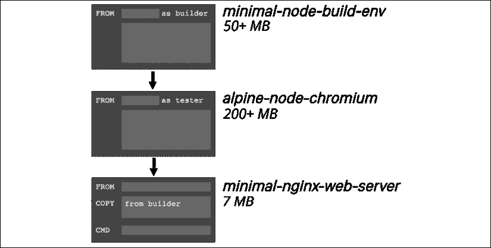

图 9.18：多阶段构建环境结果

通过利用多阶段`Dockerfile`，我们可以定义一个定制的构建环境，并在过程结束时只传输必要的字节。在先前的例子中，我们避免了将 250+ MB 的开发依赖项传输到我们的生产服务器，并且只交付了一个 7 MB 的容器，它具有最小的内存占用。

现在，让我们在 CircleCI 上执行这个容器化流水线。

## CircleCI 容器内容器

在*第四章*，*自动化测试、持续集成和发布到生产*中，我们创建了一个相对简单的 CircleCI 文件。稍后，我们也将为这个项目重复相同的配置，但现在，我们将使用一个容器内的容器设置，利用我们刚刚创建的多阶段`Dockerfile`。

在 **lemon-mart** 仓库中，本节使用的 `config.yml` 文件名为 `.circleci/config.docker-integration.yml`。您还可以在 CircleCI 上找到从本章执行 `.yml` 文件的拉取请求，使用 `docker-integration` 分支，链接为 [`github.com/duluca/lemon-mart/pull/25`](https://github.com/duluca/lemon-mart/pull/25)。

注意，此构建使用修改后的 `integration.Dockerfile` 来使用来自 **lemon-mart** 的 `projects/ch8` 代码。

在您的源代码中，创建一个名为 `.circleci` 的文件夹，并添加一个名为 `config.yml` 的文件：

```js
**.circleci/config.yml**
version: 2.1
jobs:
  build:
    docker:
      - image: circleci/node:lts
    working_directory: ~/repo
    steps:
      - checkout
      - setup_remote_docker
      - run:
          name: Execute Pipeline (Build Source -> Test -> Build Web Server)
          command: |
            docker build -f integration.Dockerfile . -t lemon-mart:$CIRCLE_BRANCH
            mkdir -p docker-cache
            docker save lemon-mart:$CIRCLE_BRANCH | gzip > docker-cache/built-image.tar.gz
      - save_cache:
          key: built-image-{{ .BuildNum }}
          paths:
            - docker-cache
      - store_artifacts:
          path: docker-cache/built-image.tar.gz
          destination: built-image.tar.gz
workflows:
  version: 2
  build-and-deploy:
    jobs:
      - build 
```

在先前的 `config.yml` 文件中，定义了一个名为 `build-and-deploy` 的工作流程，其中包含一个名为 `build` 的作业。该作业使用 CircleCI 预构建的 `circleci/node:lts` 图像。

`build` 任务有五个步骤：

1.  `checkout` 从 GitHub 检出源代码。

1.  `setup_remote_docker` 通知 CircleCI 设置 Docker-within-Docker 环境，这样我们就可以在我们的流水线中运行容器。

1.  `run` 执行 `docker build -f integration.Dockerfile .` 命令以启动我们的自定义构建过程，将基于 Alpine 的图像缓存，并用 `$CIRCLE_BRANCH.` 标记它。

1.  `save_cache` 保存我们在缓存中创建的图像，以便在下一步中消费。

1.  `store_artifacts` 从缓存中读取创建的图像，并将其作为构建工件发布，可以从 Web 界面下载或由另一个作业用于将其部署到云环境中。

在您将更改同步到 GitHub 后，如果一切顺利，您将有一个通过 *绿色* 构建的结果。如图所示，此构建是成功的：

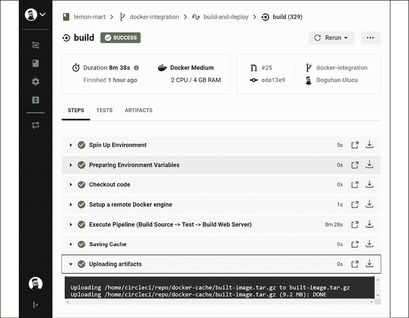

图 9.19：使用 lemon-mart docker-integration 分支在 CircleCI 上进行的绿色构建

注意，压缩并 gzip 的图像文件大小为 9.2 MB，其中包括我们的 Web 应用程序，以及大约 7 MB 的基础镜像大小。

目前，CI 服务器正在运行并执行我们的三步流水线。正如您在前面的屏幕截图中所见，构建正在生成一个名为 `built-image.tar.gz` 的压缩文件，其中包含 Web 服务器图像。您可以从 **Artifacts** 选项卡下载此文件。然而，我们并没有将生成的图像部署到服务器上。

您现在已经充分掌握了使用 CircleCI 的技能。我们将在第十三章，*AWS 上的高可用云基础设施*中重新访问这个多阶段 `Dockerfile` 以在 AWS 上执行部署。

接下来，让我们看看您如何从您的 Angular 应用程序中获取代码覆盖率报告，并在 CircleCI 中记录结果。

# 代码覆盖率报告

了解您的 Angular 项目的单元测试覆盖量和趋势的一个好方法是查看代码覆盖率报告。

为了为您的应用程序生成报告，请从您的 `project` 文件夹中执行以下命令：

```js
$ npx ng test --browsers ChromiumNoSandbox --watch=false --code-coverage 
```

生成的报告将作为一个名为 `coverage` 的文件夹下的 HTML 文件创建；执行以下命令以在浏览器中查看它：

```js
$ npx http-server -c-1 -o -p 9875 ./coverage 
```

在您的项目中安装 `http-server` 作为开发依赖项。

这是 `istanbul/nyc` 为 LemonMart 生成的文件夹级样本覆盖率报告：

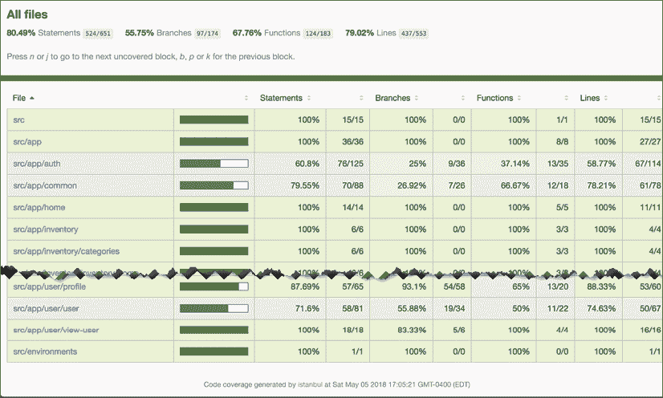

图 9.20：LemonMart 的 Istanbul 代码覆盖率报告

您可以针对特定文件夹，例如 `src/app/auth`，进行深入分析，并获取文件级报告，如下所示：

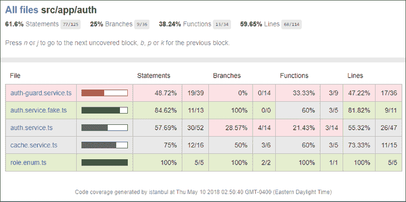

图 9.21：src/app/auth 的 Istanbul 代码覆盖率报告

您可以进一步深入以获取特定文件的行级覆盖率，例如 `cache.service.ts`，如下所示：

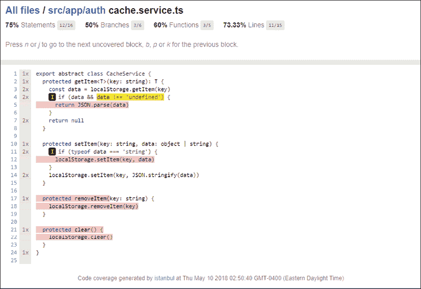

图 9.22：cache.service.ts 的 Istanbul 代码覆盖率报告

在前面的屏幕截图中，您可以看到行 **5**、**12**、**17-18** 和 **21-22** 没有被任何测试覆盖。**I** 图标表示 `if` 路径没有被采取。我们可以通过实现单元测试来增加我们的代码覆盖率，这些单元测试将测试 `CacheService` 中包含的函数。作为练习，读者应尝试至少用一个新的单元测试覆盖这些函数之一，并观察代码覆盖率报告的变化。

## CI 中的代码覆盖率

理想情况下，您的 CI 服务器配置应在每次测试运行时生成和托管代码覆盖率报告。然后，您可以使用代码覆盖率作为另一个代码质量关卡，防止合并拉取请求，如果新代码降低了整体代码覆盖率百分比。这是一种加强 **测试驱动开发**（**TDD**）思维的好方法。

您可以使用 Coveralls 等服务（位于 [`coveralls.io/`](https://coveralls.io/)）来实现代码覆盖率检查，这些服务可以直接在 GitHub 拉取请求中嵌入您的代码覆盖率级别。

让我们为 LemonMart 配置 Coveralls：

在 **lemon-mart** 仓库中，本节 `config.yml` 文件命名为 `.circleci/config.ch9.yml`。

1.  在您的 CircleCI 账户设置中，在安全部分确保您允许执行未经认证/未签名的 orb。

1.  在 [`coveralls.io/`](https://coveralls.io/) 注册您的 GitHub 项目。

1.  复制仓库令牌并将其存储为 CircleCI 中的环境变量，名称为 `COVERALLS_REPO_TOKEN`。

1.  在进行任何代码更改之前，请创建一个新的分支。

1.  更新 `karma.conf.js` 以使其在 `coverage` 文件夹下存储代码覆盖率结果：

    ```js
    **karma.conf.js**
    ...
        coverageIstanbulReporter: {
          dir: require('path').join(__dirname, **'coverage'**),
          reports: ['html', 'lcovonly'],
          fixWebpackSourcePaths: true,
        },
    ... 
    ```

1.  使用 Coveralls orb 更新 `.circleci/config.yml` 文件，如下所示：

    ```js
    **.circleci/config.yml**
    version: 2.1
    orbs:
      **coveralls: coveralls/coveralls@1.0.4** 
    ```

1.  更新 `build` 作业以存储代码覆盖率结果并将其上传到 Coveralls：

    ```js
    **.circleci/config.yml**
    jobs:
      build:
        ...
          - run: npm test -- --watch=false --code-coverage
          - run: npm run e2e
          - store_test_results:
              path: ./test_results
          **- store_artifacts:**
     **path: ./coverage**
     **- coveralls/upload**
          - run:
              name: Tar & Gzip compiled app
              command: tar zcf dist.tar.gz dist/lemon-mart
          - store_artifacts:
              path: dist.tar.gz 
    ```

    注意，orb 会自动为您配置 Coveralls 账户，因此 `coveralls`/`upload` 命令可以上传您的代码覆盖率结果。

1.  将您的更改提交到分支并发布。

1.  使用分支在 GitHub 上创建拉取请求。

1.  在拉取请求上，验证您是否可以看到 Coveralls 正在报告您的项目代码覆盖率，如图所示：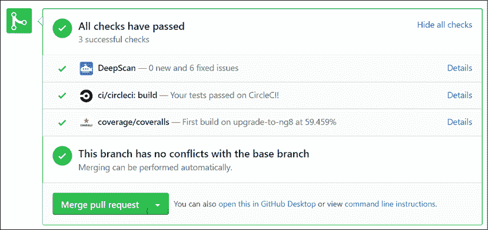

    图 9.23：Coveralls 报告代码覆盖率

1.  将拉取请求合并到您的 master 分支。

恭喜！现在，你可以修改你的分支保护规则，要求在合并到主分支之前，代码覆盖率必须高于一定百分比。

LemonMart 项目在 [`github.com/duluca/lemon-mart`](https://github.com/duluca/lemon-mart) 中实现了一个功能齐全的 `config.yml` 文件。此文件还在 CircleCI 中实现了 [Cypress.io](http://Cypress.io)，与 Angular 的 e2e 工具相比，这是一个更加健壮的解决方案。Cypress orb 可以记录测试结果，并允许你在 CircleCI 管道中查看它们。

利用本章所学，你可以将 LocalCast Weather 的 `deploy` 脚本集成到 LemonMart 中，并实现门控部署工作流程。

# 摘要

在本章中，你学习了 DevOps 和 Docker。你将你的 Web 应用程序容器化，使用 CLI 工具将容器部署到 Google Cloud Run，并学习了如何实现门控 CI 工作流程。你利用高级 CI 技术构建了一个基于多阶段 `Dockerfile` 的 CI 环境。你还熟悉了 orbs、工作流程和代码覆盖率工具。

我们利用 CircleCI 作为基于云的 CI 服务，并强调了你可以将构建结果部署到所有主要的云托管提供商。你已经看到了如何实现 CD。我们介绍了通过 CircleCI 到 Vercel Now 和 Google Cloud Run 的示例部署，让你能够实现自动部署。

通过一个健壮的 CI/CD 管道，你可以与客户和团队成员分享你应用的每个迭代，并快速将错误修复或新功能交付给最终用户。

# 练习

1.  将 CircleCI 和 Coveralls 徽章添加到你的代码仓库中的 `README.md` 文件。

1.  为端到端测试实现 Cypress，并在你的 CircleCI 管道中使用 Cypress orb 运行它。

1.  实现 Lemon Mart 应用程序的 Vercel Now 部署和条件工作流程。你可以在 lemon-mart 仓库中找到生成的 `config.yml` 文件，命名为 `.circleci/config.ch9.yml`。

# 进一步阅读

+   *Dockerfile 参考*，2020，[`docs.docker.com/engine/reference/builder/`](https://docs.docker.com/engine/reference/builder/)

+   *CircleCI orbs*，2020，[`circleci.com/orbs/`](https://circleci.com/orbs/)

+   *部署容器镜像*，2020，[`cloud.google.com/run/docs/deploy`](https://cloud.google.com/run/docs/deploy)ying

+   *创建和管理服务账户密钥*，2020，[`cloud.google.com/iam/docs/creating-managing-service-account-keys#iam-service-account-keys-create-console`](https://cloud.google.com/iam/docs/creating-managing-service-account-keys#iam-service-account-keys-cr)

# 问题

尽可能地回答以下问题，以确保你在不使用谷歌搜索的情况下理解了本章的关键概念。你需要帮助回答这些问题吗？请参阅*附录 D*，*自我评估答案*，在线访问[`static.packt-cdn.com/downloads/9781838648800_Appendix_D_Self-Assessment_Answers.pdf`](https://static.packt-cdn.com/downloads/9781838648800_Appendix_D_Self-Assessment_Answers.pdf)或访问[`expertlysimple.io/angular-self-assessment`](https://expertlysimple.io/angular-self-assessment)。

1.  解释 Docker 镜像和 Docker 容器之间的区别。

1.  CD 管道的目的是什么？

1.  CD 的好处是什么？

1.  我们如何覆盖配置差距？

1.  CircleCI orb 的功能是什么？

1.  使用多阶段`Dockerfile`的好处是什么？

1.  代码覆盖率报告如何帮助维护你应用程序的质量？
