# 附录 A

# Angular 调试

"一个表述清晰的问题已经解决了一半。" 20 世纪初通用汽车公司研究部门负责人查尔斯·凯特林（Charles Kettering）曾说过，为了有效地找到解决问题的方法，你必须首先能够很好地解释它。换句话说，你必须首先投入时间去理解问题是什么，当你做到了这一点，你就已经解决了一半的问题。

有效的调试对于理解为什么或如何你的软件失败至关重要。与使用`console.log`相比，有更好的方法来调试你的 JavaScript 代码。本附录将介绍各种工具和技术，以介绍断点调试和可以帮助你更好地理解应用程序状态的浏览器扩展。

在本附录中，我们涵盖了以下内容：

+   最有用的快捷键

+   浏览器中的错误排查

+   Karma、Jasmine 和单元测试错误

+   使用开发者工具进行调试

+   使用 VS Code 进行调试

+   使用 Angular Augury 进行调试

+   使用 Redux DevTools 进行调试

+   RxJS 调试

让我们从学习一个将使你更加高效的生产力快捷键开始。

# 最有用的快捷键

在不熟悉或大型代码库中找到自己的位置可能会很困难，令人困惑，甚至令人烦恼。有一个键盘快捷键可以解决这个问题，这个快捷键在多个工具中共享，如 VS Code 和 Chrome/Edge 开发者工具（dev tools）。

要在 VS Code 或开发者工具中的**源**面板中搜索并打开文件，请使用以下快捷键：

在 macOS 上： + *P*

在 Windows 上：*Ctrl* + *P*。

你会很快发现，这将是你最常使用的快捷键。

# 浏览器中的错误排查

在本节中，你将故意引入一个容易犯的错误，这样你就可以熟悉在开发应用程序时可能发生的真实错误，并深入了解使你成为有效开发者的工具。

请参考*第四章*，*自动化测试、持续集成和发布到生产*，以及 LocalCast 天气应用，以更好地理解以下代码示例。

LocalCast 天气应用的最新版本可以在 GitHub 上找到：[`github.com/duluca/local-weather-app`](https://github.com/duluca/local-weather-app)。

让我们假设我们在从`OpenWeatherMap.org`的 API 文档页面复制粘贴 URL 时犯了一个无辜的错误，并且忘记在前面添加`http://`。这是一个容易犯的错误：

```js
**src/app/weather/weather.service.ts**
...
return this.httpClient
  .get<ICurrentWeatherData>(
`api.openweathermap.org/data/2.5/weather?q=${city},${country}&appid=${environment.appId}`
  ).pipe(map(data => this.transformToICurrentWeather(data)))
... 
```

你的应用将成功编译，但当你检查浏览器中的结果时，你不会看到任何天气数据。实际上，看起来`CurrentWeather`组件根本就没有渲染，正如你在以下图片中可以看到的：


图 1：CurrentWeather 无法渲染

为了找出原因，你需要调试你的 Angular 应用。

## 利用浏览器开发者工具

作为一名开发者，我使用 Edge 或 Google Chrome 浏览器，因为它们具有跨平台和一致的开发者工具，以及有用的扩展。

作为最佳实践，我使用 VS Code 和浏览器并排编码，同时开发工具也在浏览器中打开。有多个很好的理由来实践并排开发：

+   **快速反馈循环**：使用实时重新加载，你可以非常快地看到你更改的最终结果

+   **笔记本电脑**：现在很多开发者都在笔记本电脑上进行大部分的开发工作，第二块显示器是一种奢侈

+   **关注响应式设计**：由于我的工作空间有限，我始终关注移动优先开发，在之后修复桌面布局问题

+   **关注网络活动**：使我能够快速看到任何 API 调用错误，并确保请求的数据量符合我的预期

+   **关注控制台错误**：使我能够快速反应并解决当引入新错误时

+   **禁用缓存**：这样你知道你总是得到所有的更改，而不是与浏览器的缓存作斗争

观察并排开发的样貌：

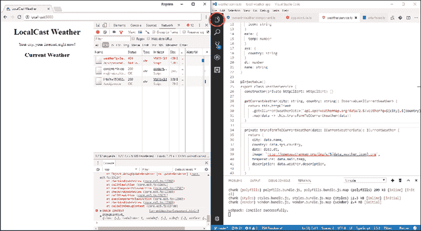

图 2：运行实时重新加载的并排开发

最终，你应该做最适合你的事情。在使用并排设置的情况下，我经常发现自己需要打开和关闭 VS Code 的资源管理器，并根据具体任务调整开发工具窗格的大小。要切换 VS Code 的资源管理器，请点击前一张截图中圈出的资源管理器图标。

就像你可以使用`npm start`进行带有实时重新加载的并排开发一样，你也可以使用`npm test`获得相同类型的快速反馈循环，用于单元测试：

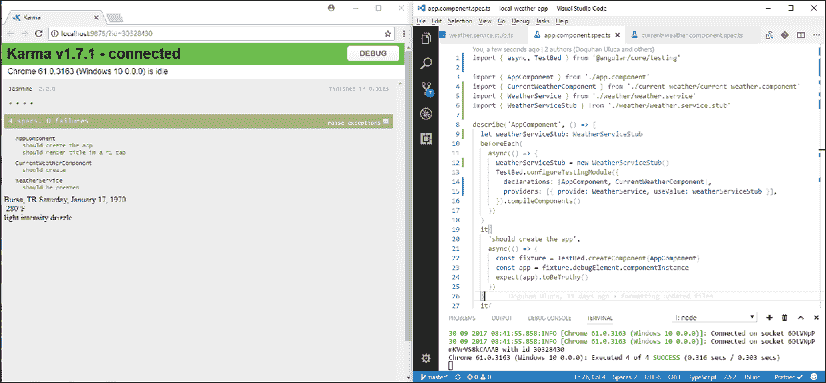

图 3：单元测试并行的开发

使用并排单元测试设置，你可以成为开发单元测试的高效者。

## 优化开发工具

为了使带有实时重新加载的并排开发工作得很好，你需要优化默认的开发工具体验：

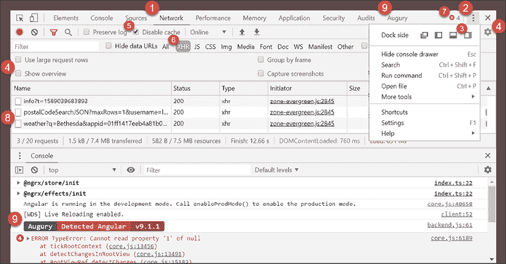

图 4：优化后的 Chrome 开发者工具

观察前一张截图，你会注意到许多设置和信息发射器被突出显示：

1.  默认打开**网络**选项卡，以便你可以看到网络流量流动。

1.  通过点击  按钮打开开发工具设置。

1.  点击**右侧**图标，以便开发工具停靠在 Chrome 的右侧。这种布局提供了更多的垂直空间，因此你可以一次性看到更多的网络流量和控制台事件。作为额外的好处，左侧大致呈现移动设备的尺寸和形状。

1.  **开启**大请求行并**关闭**概览，以便看到每个请求的更多 URL 和参数，并获得更多垂直空间。

1.  选择**禁用缓存**选项，这将强制在开发工具打开时刷新页面时重新加载每个资源。这可以防止奇怪的缓存错误破坏你的日子。

1.  你主要会关注查看对各种 API 的 XHR 调用，因此点击**XHR**以过滤结果。

1.  注意，你可以在右上角查看控制台错误的数量为**12**。理想情况下，控制台错误的数量应该始终为 0。

1.  注意，请求行中的顶部条目表明存在状态码为**404 Not Found**的错误。

1.  由于我们正在调试 Angular 应用程序，已经加载了**Augury**扩展。这个工具将在本章后面更详细地介绍，使用更复杂的 LemonMart 应用程序。

在你的优化开发工具环境中，你现在可以有效地调试和解决之前的应用程序错误。

## 故障排除网络问题

在这个阶段，应用程序存在三个可见问题：

+   组件详情未显示

+   存在许多控制台错误

+   API 调用返回**404 Not Found**错误

首先检查任何网络错误，因为网络错误通常会导致连锁反应：

1.  在**网络**选项卡中点击失败的 URL

1.  在 URL 右侧打开的**详细信息**面板中，点击**预览**选项卡

1.  你应该看到这个：

    ```js
    Cannot GET /api.openweathermap.org/data/2.5/weather 
    ```

    仅通过观察这个错误信息，你可能会错过忘记添加`http://`前缀到 URL 的事实。这个错误很微妙，绝对不是显而易见的。

1.  将鼠标悬停在 URL 上，观察完整的 URL，如图所示：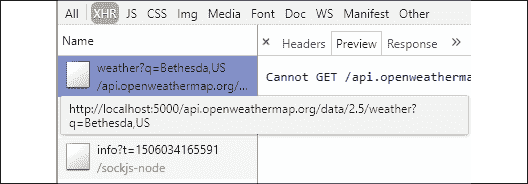

    图 5：检查网络错误

如你所见，现在错误非常明显。在这个视图中，我们可以看到完整的 URL，并且很明显，`weather.service.ts`中定义的 URL 不是完全限定的，因此 Angular 正在尝试从其父服务器（`localhost:5000`）加载资源，而不是通过网络到正确的服务器。

## 调查控制台错误

在修复这个问题之前，了解失败的 API 调用的连锁反应是值得的：

1.  观察控制台错误：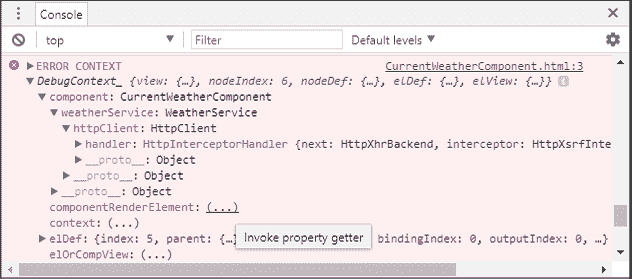

    图 6：开发者工具控制台错误上下文

    这里值得注意的第一个元素是名为`ERROR CONTEXT`的对象，它有一个名为`DebugContext_`的属性。`DebugContext_`包含错误发生时 Angular 应用程序当前状态的详细快照。`DebugContext_`中包含的信息比 AngularJS 生成的几乎无用的错误信息多得多。

    值为`(...)`的属性是属性获取器，你必须点击它们来加载它们的详细信息。例如，如果你点击`componentRenderElement`的省略号，它将被`app-current-weather`元素填充。你可以展开元素来检查组件的运行时条件。

1.  现在滚动到控制台顶部

1.  观察第一个错误：

    ```js
    ERROR TypeError: Cannot read property 'city' of undefined 
    ```

你可能之前遇到过`TypeError`。这种错误是由于尝试访问未定义的对象属性而引起的。在这种情况下，`CurrentWeatherComponent.current`因为没有 HTTP 调用失败而没有分配给一个对象。由于`current`未初始化，模板盲目地尝试绑定到其属性，如`{{current.city}}`，我们得到一条消息说**属性'city'的未定义**无法读取。这就是可能在你应用程序中产生许多不可预测副作用的那种连锁反应。你必须积极编码以防止这种情况发生。

# Karma、Jasmine 和单元测试错误

当使用`ng test`命令运行测试时，你可能会遇到一些高级错误，这些错误可能会掩盖实际潜在错误的根本原因。

解决错误的通用方法应该是从内到外，首先解决子组件的问题，最后留下父组件和根组件。

## 网络错误

网络错误可能由多种潜在问题引起：

```js
NetworkError: Failed to execute 'send' on 'XMLHttpRequest': Failed to load 'ng:///DynamicTestModule/AppComponent.ngfactory.js'. 
```

从内到外工作，你应该实现服务的测试双倍，并向适当的组件提供伪造品，如前一小节所述。然而，即使在父组件中正确提供了伪造品，你也可能仍然会遇到错误。请参阅处理通用错误事件的章节，以揭示潜在问题。

## 通用错误事件

错误事件是隐藏潜在原因的通用错误：

```js
[object ErrorEvent] thrown 
```

为了暴露通用错误的根本原因，实现一个新的`test:debug`脚本：

1.  如下所示，在`package.json`中实现`test:debug`：

    ```js
    **package.json**
    ...
      "scripts": {
      ...
      "test:debug": "ng test --source-map",
      ...
    } 
    ```

1.  执行`npm run test:debug`

1.  现在，Karma 运行器可能会揭示根本问题

1.  如果需要，根据堆栈跟踪找到可能引起问题的子组件

    如果这种策略不起作用，你可能可以通过断点调试你的单元测试来获取更多关于错误原因的信息。

# 使用开发工具进行调试

关于是否将`console.log`输出到控制台；这是一个问题。记录在案，让我声明，`console.log`语句永远不会被提交到你的仓库。一般来说，它们是浪费时间，因为它们需要编辑、构建和运行代码来带来价值，更不用说清理代码的成本了。

调试的首选方法是断点调试，这是一种暂停代码执行的方法，在代码运行时检查和操作其状态。你可以有条件地设置断点，逐行遍历你的代码，甚至可以在控制台中执行语句来尝试新想法。

Angular 9 和 Ivy 带来了许多调试改进，使得调试异步代码和模板成为可能。此外，Angular 9 生成的堆栈跟踪在确定错误根本原因方面要远比以前更有用。

有一些特殊用例，其中`console.log`语句可能很有用。这些主要是并行操作且依赖于及时用户交互的异步工作流程。在这些情况下，控制台日志可以帮助你更好地理解事件流和各个组件之间的交互。你可以在本章后面的*调试 RxJS*部分看到这一点。

对于常见情况，我们应该坚持使用断点调试。使用开发者工具，我们可以观察属性在被设置时的状态，并且能够即时更改它们的值，以强制代码在`if-else`或`switch`语句中执行分支逻辑。

假设`HomeComponent`上存在一些基本逻辑，它根据从`AuthService`检索到的`isAuthenticated`值设置一个`displayLogin boolean`，如下所示：

```js
**src/app/home/home.component.ts**
...
import { AuthService } from '../auth.service'
...
export class HomeComponent implements OnInit {
  displayLogin = true
  constructor(private authService: AuthService) {}
  ngOnInit() {
    this.displayLogin = !this.authService.isAuthenticated()
  }
} 
```

现在观察`displayLogin`的值和`isAuthenticated`函数在被设置时的状态，然后观察`displayLogin`值的改变：

1.  切换到开发者工具中的**源**标签

1.  使用最有用的快捷键，*Ctrl* + *P* 或 ** + *P*，搜索`HomeComponent`

1.  在`ngOnInit`函数内的第一行设置一个断点

1.  刷新页面

1.  你会看到你的断点被触发，如这里用蓝色突出显示的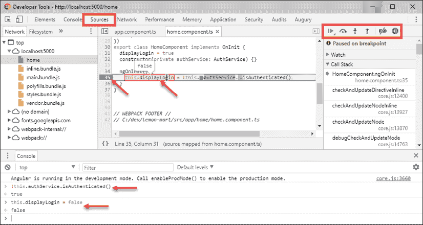

    图 7：Chrome 开发者工具断点调试

1.  悬停在`this.displayLogin`上并观察其值被设置为`true`

1.  如果你悬停在`this.authService.isAuthenticated()`上，你将无法观察到其值

    当你的断点被触发时，你可以在控制台中访问当前的状态作用域，这意味着你可以执行函数并观察其值。

1.  在控制台执行`isAuthenticated()`：

    ```js
    > this.authService.isAuthenticated() true 
    ```

    你会观察到它返回`true`，这正是`this.displayLogin`被设置的值。你仍然可以在控制台中强制改变`displayLogin`的值。

1.  将`displayLogin`设置为`false`：

    ```js
    > this.displayLogin = false false 
    ```

如果你观察`displayLogin`的值，无论是通过悬停在其上还是从控件中检索它，你会发现该值被设置为`false`。

利用断点调试的基础知识，你可以调试复杂场景而无需更改源代码。你也可以调试模板以及复杂的回调，使用 RxJS 语句。

# 使用 Visual Studio Code 进行调试

你也可以直接在 Visual Studio Code 中调试你的 Angular 应用程序、Karma 和 Protractor 测试。首先，你需要配置调试器以与 Chrome 调试环境一起工作，如图所示：

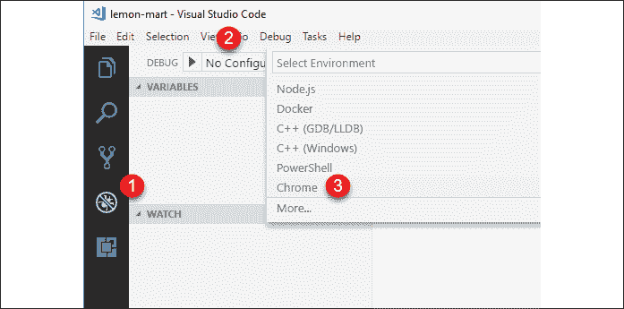

图 8：VS Code 调试设置

1.  点击**调试**面板

1.  展开**无配置**下拉菜单并点击**添加配置...**

1.  在**选择环境**复选框中，选择**Chrome**

    这将在`.vscode/launch.json`文件中创建一个默认配置。我们将修改此文件以添加三个单独的配置。

1.  将`launch.json`的内容替换为以下配置：

    ```js
    **.vscode/launch.json**
    {
      "version": "0.2.0",
      "configurations": [
        {
          "name": "Debug npm start with Chrome",
          "type": "chrome",
          "request": "launch",
          "url": "http://localhost:5000/#",
          "webRoot": "${workspaceRoot}",
          "runtimeArgs": [
            "--remote-debugging-port=9222"
          ],
          "sourceMaps": true,
          "preLaunchTask": "npm: start"
        },
        {
          "name": "Debug npm start with Edge",
          "type": "edge",
          "request": "launch",
          "version": "dev",
          "url": "http://localhost:5000/#",
          "webRoot": "${workspaceRoot}",
          "sourceMaps": true,
          "preLaunchTask": "npm: start"
        },
        {
          "name": "Debug npm test with Chrome",
          "type": "chrome",
          "request": "launch",
          "url": "http://localhost:9876/debug.html",
          "webRoot": "${workspaceRoot}",
          "runtimeArgs": [
            "--remote-debugging-port=9222"
          ],
          "sourceMaps": true,
          "preLaunchTask": "npm: test"
        },
        {
          "name": "Debug npm test with Edge",
          "type": "edge",
          "request": "launch",
          "version": "dev",
          "url": "http://localhost:9876/debug.html",
          "webRoot": "${workspaceRoot}",
          "sourceMaps": true,
          "preLaunchTask": "npm: test"
        },
        {
          "name": "npm run e2e",
          "type": "node",
          "request": "launch",
          "program": "${workspaceRoot}/node_modules/protractor/bin/protractor",
          "protocol": "inspector",
          "args": [
            "${workspaceRoot}/protractor.conf.js"
          ]
        }
      ]
    } 
    ```

    注意，我们还为微软基于 Chromium 的新 Edge 浏览器添加了调试器。

1.  在开始调试器之前，执行相关的 CLI 命令，如`npm start`、`npm test`或`npm run e2e`。

1.  在**调试**页面，在**调试**下拉菜单中，选择`npm start`并点击绿色的播放图标

1.  观察到一个 Chrome 实例已启动

1.  在`.ts`文件上设置断点

1.  在应用程序中执行操作以触发断点

1.  如果一切顺利，Chrome 将报告代码已在 Visual Studio Code 中**暂停**

    更多信息，请参阅 GitHub 上 VS Code 菜谱的 Angular CLI 部分[`github.com/Microsoft/vscode-recipes`](https://github.com/Microsoft/vscode-recipes)。

# 使用 Angular Augury 进行调试

Augury 是一个用于调试和性能分析的 Chrome DevTools 扩展，它是一个专为帮助开发者可视化导航组件树、检查路由状态以及通过源映射在生成的 JavaScript 代码和开发者编写的 TypeScript 代码之间启用断点调试而设计的工具。

注意，Augury 与 Angular 9 的 Ivy 渲染引擎不完全兼容。为了某些功能（如路由树和 NgModules）能够工作，您需要暂时在项目中禁用 Ivy。

您可以通过更新项目根目录下的`tsconfig.app.json`来关闭 Ivy，向其中添加以下属性：

```js
"angularCompileOptions": {
  "enableIvy": false
} 
```

您可以从[`augury.angular.io`](https://augury.angular.io)下载 Augury。一旦安装，当您为 Angular 应用程序打开 Chrome DevTools 时，您会注意到一个名为 Augury 的新选项卡，如图所示：

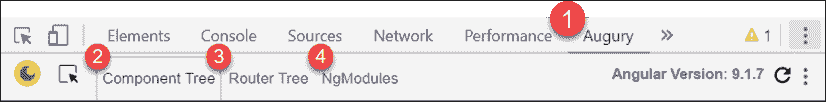

图 9：Chrome DevTools Augury

Augury 提供了有用的关键信息，以了解您的 Angular 应用程序在运行时的行为：

1.  当前 Angular 版本列在下面，在这种情况下，版本为**9.1.7**

1.  **组件树**显示了在应用程序中渲染的所有 Angular 组件

1.  **路由树**显示了应用程序中配置的所有路由

1.  `NgModules`显示了应用程序的`AppModule`和功能模块

## 组件树

**组件树**选项卡显示了所有应用程序组件之间的关系以及它们如何相互交互：

1.  按如下方式选择特定的组件，例如`HomeComponent`：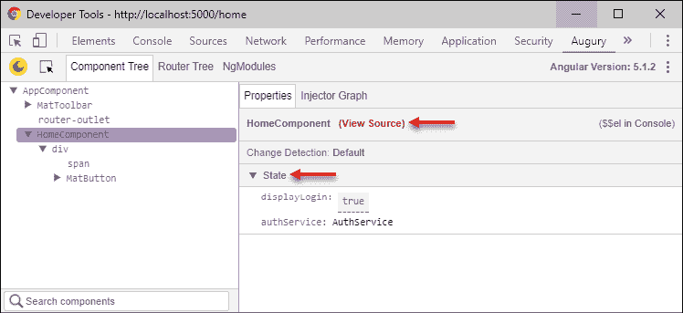

    图 10：Augury 组件树

    右侧的**属性**选项卡将显示一个名为**查看源代码**的链接，您可以使用它来调试您的组件。进一步向下，您将能够观察到组件属性的状态，例如`displayLogin boolean`，包括注入到组件中的服务和它们的状态。

    您可以通过双击值来更改任何属性的值。

    例如，如果您想将`displayLogin`的值更改为`false`，只需双击包含`true`值的蓝色框，并输入`false`。您将能够在 Angular 应用程序中观察到您更改的效果。

    为了观察 `HomeComponent` 的运行时组件层次结构，你可以观察 **注入器图**。

1.  点击如图所示的 **注入器图** 选项卡：

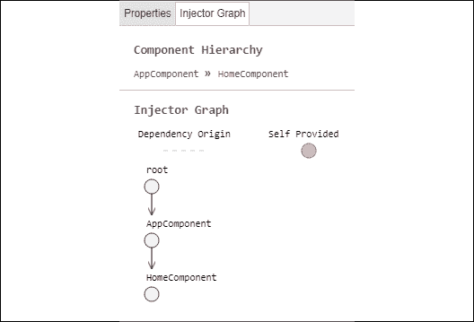

图 11：Augury 注入器图

此视图显示了所选组件是如何被渲染的。在这种情况下，我们可以观察到 `HomeComponent` 是在 `AppComponent` 中被渲染的。这种可视化在追踪不熟悉的代码库中特定组件的实现或存在深层组件树的情况下非常有帮助。

## 路由树

**路由树** 选项卡将显示路由的当前状态。这可以是一个非常有助于可视化路由和组件之间关系的工具，如图所示：

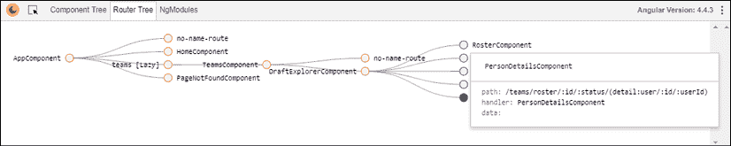

图 12：Augury 路由树

上述路由树展示了具有主-详细视图的深度嵌套路由结构。你可以通过点击圆形节点来查看渲染给定组件所需的绝对路径和参数。

如你所见，对于 `PersonDetailsComponent`，确定渲染主-详细视图的这一部分所需的确切参数集可能会变得复杂。

## NgModules

**NgModules** 选项卡显示了 `AppModule` 和任何其他当前已加载到内存中的功能模块：

1.  启动应用程序的 `/home` 路由并在地址栏中按回车键，以便 Augury 注册导航事件

1.  观察如图所示的 **NgModules** 选项卡：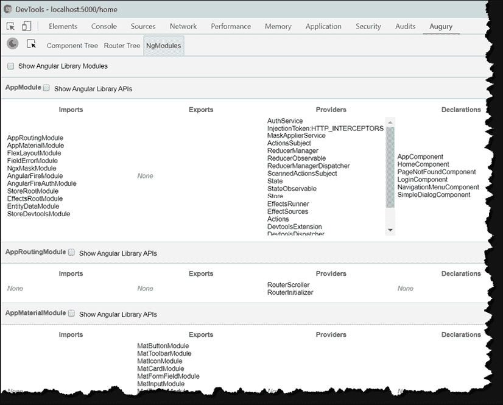

    图 13：Augury NgModules

    你会注意到所有根级模块，包括 `AppModule`，都已经加载。然而，由于我们的应用程序具有懒加载架构，我们还没有加载任何功能模块。

1.  导航到 `ManagerModule` 中的一个页面并在地址栏中按回车键

1.  然后，导航到 `UserModule` 中的一个页面并在地址栏中按回车键

1.  最后，导航回 `/home` 路由并在地址栏中按回车键

1.  观察如图所示的 **NgModules** 选项卡：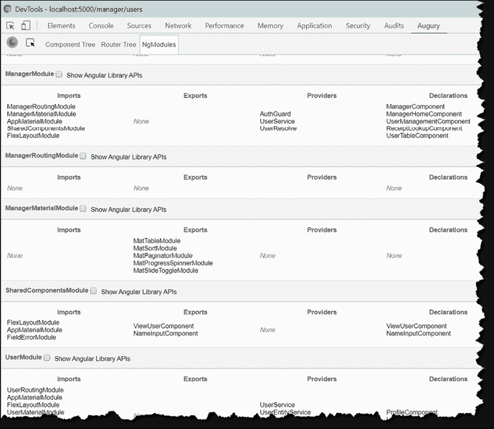

    图 14：Augury 包含三个模块的 NgModules

1.  现在，你会注意到 `ManagerModule` 和 `UserModule` 以及所有相关的模块已经被加载到内存中。

**NgModules** 是一个重要的工具，可以可视化你的设计和架构的影响。

# 使用 Redux DevTools 进行调试

有两种主要的策略用于调试和从 NgRx 获取仪表化。

1.  实现一个控制台日志记录器进行调试

1.  配置 Store DevTools 以进行丰富的仪表化

让我们从简单的调试解决方案开始。

## 实现 NgRx 控制台日志记录器

在 `app.module` 中，`StoreModule` 被配置为将一个 `MetaReducer` 注入到你的配置中。元减法器能够监听在动作-减法器管道中发生的所有事件，从而赋予你预处理动作的能力。我们可以使用这个钩子来实现一个简单的日志记录器。

1.  在 `reducers/index.ts` 中实现一个名为 `logger` 的函数：

    ```js
    **src/app/reducers/index.ts**
    export function logger(reducer: ActionReducer<AppState>): ActionReducer<AppState> {
      return (state, action) => {
        const result = reducer(state, action)
        console.groupCollapsed(action.type)
        console.log('prev state', state)
        console.log('action', action)
        console.log('next state', result)
        console.groupEnd()
        return result
      }
    } 
    ```

1.  使用 `metaReducers` 配置 `logger`，并且仅在非生产模式下：

    ```js
    **src/app/reducers/index.ts**
    export const metaReducers: MetaReducer<AppState>[] =
    !environment.production
      ? [logger]
      : [] 
    ```

现在尝试一下，你应该能在你的控制台中观察到 NgRx，如下所示：

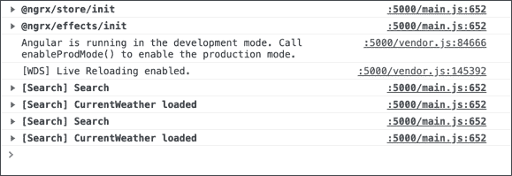

图 15：带有 NgRx 日志的控制台视图

## 配置 NgRx Store DevTools

NgRx Store Devtools 包也可以在开发过程中协助我们的调试工作，或者在生成生产构建时提供仪表化。通过运行以下命令添加该包：

```js
$ npx ng add @ngrx/store-devtools 
```

你会注意到该包会自动在`app.module`中添加生产仪表化规则，以便只捕获最后 25 个事件。这是为了避免性能问题。

一旦安装，为了利用生成的仪表化并能够调试 NgRx，你将需要安装 Chrome 或 Firefox 的 Redux DevTools 扩展，可以在[`github.com/zalmoxisus/redux-devtools-extension`](https://github.com/zalmoxisus/redux-devtools-extension)或[`extension.remotedev.io`](http://extension.remotedev.io)找到。

一旦启动你的应用程序，激活扩展，你应该能看到 Redux DevTools 随着时间的推移正在捕获详细的仪表化，如下所示：

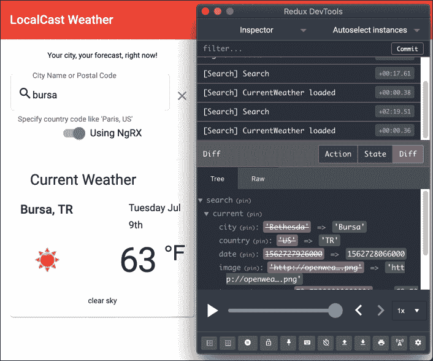

图 16：Redux DevTools

Redux DevTools 为你提供了回放事件和查看状态变化的能力。这在上一个截图的右下象限中得到了演示。你可以观察到当前城市为**布尔萨**，其前一个值为**贝塞斯达**。

# 调试 RxJS

调试 RxJS 管道内部发生情况的主要策略有两个：

1.  深入事件流并记录特定点的流事件数据

1.  在开发者工具中执行断点调试

让我们从使用`tap`操作符开始。

## 深入 RxJS 事件流

在*第六章*，*表单、可观察对象和主题*中，我们介绍了 RxJS 的`tap`操作符，作为将用户输入从搜索输入的更改事件流中引导出来的方式，并最终调用我们的`doSearch`函数。当 RxJS 流似乎没有按预期行为时，你可以结合`tap`操作符和`console.log`来记录每个事件的详细数据，这样你就可以随着时间的推移看到它。由于`tap`根据操作顺序中的位置捕获流中的数据，一旦添加到流中，你就可以简单地使用 VS Code 的行移动键盘快捷键来移动它并测试流程。

要移动代码行上下，在 Windows 上使用`Alt` + `↑`和`Alt` + `↓`，在 macOS 上使用`` + `↑`和`` + `↓`。

`CitySearchComponent`中的以下`tap`将记录来自输入的每个更改事件：

```js
this.search.valueChanges 
  .pipe( 
 **tap(console.log),**
    debounceTime(1000), 
    filter(() => !this.search.invalid), 
    tap((searchValue: string) => this.doSearch(searchValue)) 
  ).subscribe() 
```

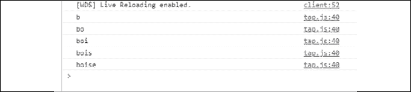

图 17：RxJS 记录每个事件

如果我们将`tap`向下移动一行，那么我们不会得到每个用户输入，而只会得到防抖事件：

```js
this.search.valueChanges 
  .pipe( 
    debounceTime(1000), 
    **tap(console.log),** 
    filter(() => !this.search.invalid), 
    tap((searchValue: string) => this.doSearch(searchValue)) 
  ).subscribe() 
```

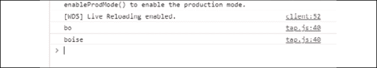

图 18：RxJS 仅记录防抖事件

再向下移动一行，我们看到经过防抖和过滤后的事件：

```js
this.search.valueChanges 
  .pipe( 
    debounceTime(1000), 
    filter(() => !this.search.invalid), 
    **tap(console.log),** 
    tap((searchValue: string) => this.doSearch(searchValue)) 
  ).subscribe() 
```

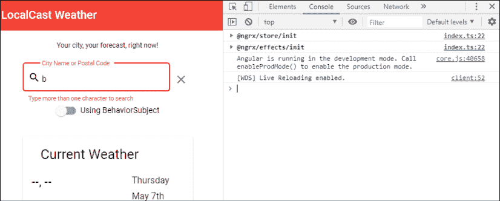

图 19：RxJS 忽略无效输入

注意，由于一个字符无效，过滤器捕获了这个事件并没有让它通过，因此我们在控制台中看不到任何数据。

虽然在控制台中可能会非常混乱，但你也可以同时记录很多东西，使用回调而不是仅仅传递`console.log`可调用函数：

```js
this.search.valueChanges 
  .pipe( 
    debounceTime(1000), 
    tap(debouncedData => 
      console.log('debounced: ', debouncedData)
    ), 
    filter(() => !this.search.invalid), 
    tap(debouncedAndFilteredData => 
      console.log(
        'debounced + filtered: ', 
        debouncedAndFilteredData
      )
    ), 
    tap((searchValue: string) => this.doSearch(searchValue)) 
  ).subscribe() 
```

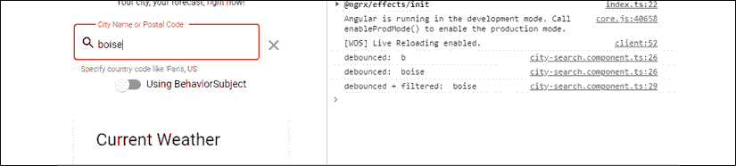

图 20：RxJS 记录多个事件

接下来，让我们看看如何利用断点调试。

## 断点调试 RxJS 事件流

参考本章前面的*使用 DevTools 进行调试*部分，了解更多关于断点调试的信息。在调试 RxJS 时，重要的是要理解调试器中蓝色光标的作用。

当一行代码有多个可以暂停执行的位置时，这些位置会用方形光标表示。这些光标可以是开启的（深色，实心）或关闭的（浅色，透明），以指示你希望在代码行的哪个位置让浏览器停止，如下面的截图所示：

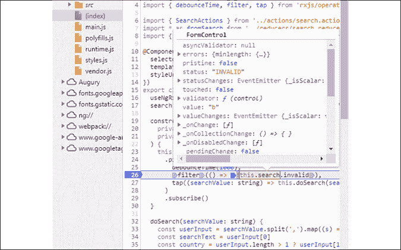

图 21：RxJS 断点调试

光标可以用来在浏览器中停止流，在执行工作的回调函数内部，以检查数据或甚至操作它。在上面的例子中，我已经将断点调试器设置为在过滤器函数内部中断，这样我就可以检查搜索输入字段的当前状态。

通过实验调试来了解更多相关信息。

# 进一步的建议

如果你仍然遇到困难，不要沮丧。即使是最好的人有时也会在小事上花费无数小时。然而，如果你需要，你可以寻求帮助。Angular 在网上有一个丰富且支持性强的社区。

你寻求帮助的方式非常重要。首先使用[`stackblitz.com/`](https://stackblitz.com/)复现你的问题。一半的时间，你会在复现问题的过程中找到你的问题。接下来，在[`stackoverflow.com`](https://stackoverflow.com)上提问。如果你能提供 StackBlitz 链接到你的问题，你的问题很可能会得到快速解答。如果最终发现可能是框架本身的问题，那么在正确的存储库（换句话说，Angular、CLI、Material、NgRx、RxJS 等）上创建一个 GitHub 问题，详细说明你的问题。如果你在框架中发现了 bug，那么你就正式为开源项目的发展做出了贡献：

否则，你也可以使用 Twitter 并搜索`@angular`或`#angular`标签以寻求帮助。我个人是 Google 的大粉丝。我的哲学是，别人可能遇到了和我一样的问题，当我说这句话的时候——一个良好的 Google 查询就是问题解决了一半。
