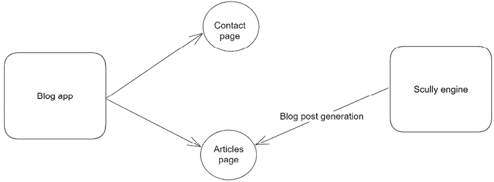
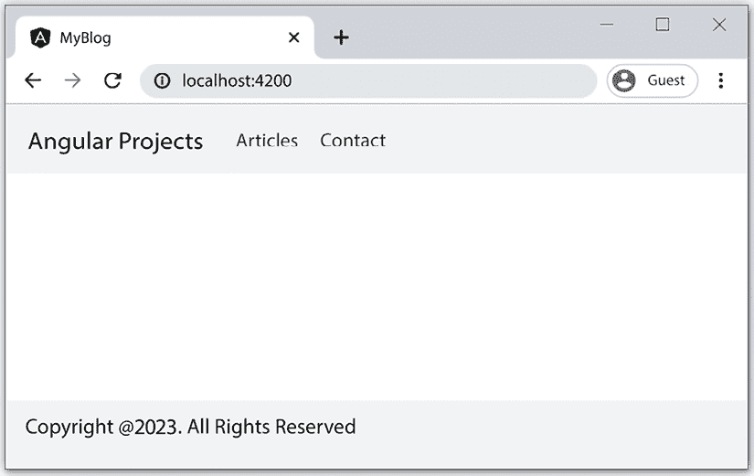
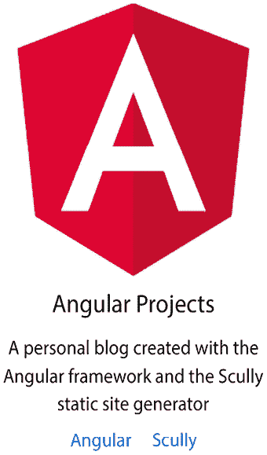
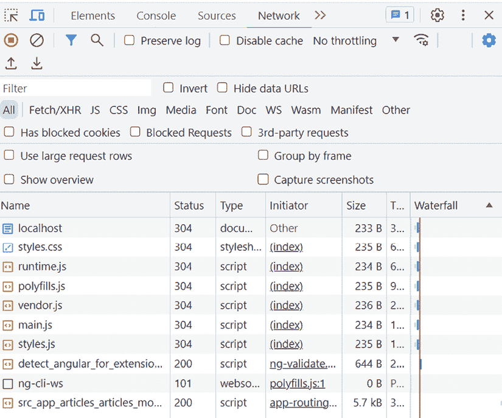
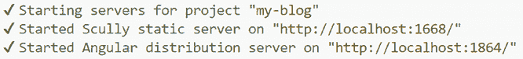
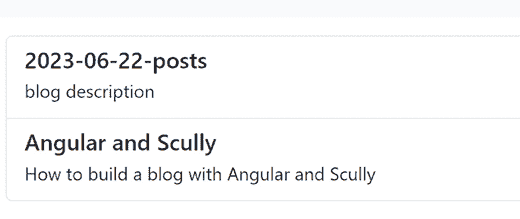

# 第二章：使用 Scully 和 Angular Router 构建 SPA 应用程序

Angular 应用程序遵循**单页应用程序（SPA）**架构，其中可以使用浏览器中的 URL 激活网页的不同视图。任何对该 URL 的更改都可以被 Angular 路由器拦截并转换为可以激活特定 Angular 组件的路由。

**Scully**是一个流行的基于**Jamstack**架构的静态网站生成器。它可以很好地与 Angular 路由器合作，根据每个路由预渲染 Angular 应用程序的内容。

在本章中，我们将结合 Angular 和 Scully 创建一个个人博客。以下主题将被涵盖：

+   在 Angular 应用程序中设置路由

+   创建我们博客的基本布局

+   配置我们应用程序的路由

+   使用 Scully 添加博客功能

+   在主页上显示博客文章

# 必要的背景理论和上下文

在 Web 开发的早期，客户端应用程序与底层服务器基础设施高度耦合。当我们想要通过 URL 访问网站页面时，涉及到许多机械操作。

浏览器会将请求的 URL 发送到服务器，服务器应该响应与该 URL 匹配的 HTML 文件。这是一个复杂的过程，会导致延迟和往返时间的差异。

现代 Web 应用程序使用 SPA 架构消除了这些问题。客户端只需要从服务器请求一次单个 HTML 文件。浏览器 URL 的任何后续更改都由客户端基础设施内部处理。在 Angular 中，路由器负责拦截应用程序内的 URL 请求并根据定义的路由配置处理它们。

Jamstack 是一种热门的新兴技术，允许我们创建快速和安全的 Web 应用程序。它可以用于任何应用程序类型，从电子商务网站到**软件即服务（SaaS）**Web 应用程序，甚至个人博客。Jamstack 的架构基于以下支柱：

+   **性能**：页面在生产过程中生成和预渲染，消除了等待内容加载的需要。

+   **扩展性**：内容是静态文件，可以从任何地方提供，甚至可以从提高应用程序性能的**内容分发网络（CDN）**提供商那里提供。

+   **安全性**：服务器端过程的无服务器性质以及内容已经是静态的事实消除了针对服务器基础设施的潜在攻击。

Scully 是第一个采用 Jamstack 方法的 Angular 静态网站生成器。它本质上在构建时生成 Angular 应用程序的页面，以便在请求时立即可用。

# 项目概述

在这个项目中，我们将使用 Angular 框架构建一个个人博客，并使用 Scully 网站生成器增强其 Jamstack 特性。最初，我们将构建一个新的 Angular 应用程序并启用其路由功能。然后，我们将通过添加一些基本组件来创建我们应用程序的基本布局。一旦我们有一个可工作的 Angular 应用程序，我们将使用 Scully 为其添加博客支持。然后，我们将使用 Markdown 文件创建一些博客文章，并在我们应用程序的首页上显示它们。以下图表展示了项目的架构概述：



图 2.1 – 项目架构

构建时间：1 小时。

# 入门

完成此项目所需的以下软件工具：

+   Angular CLI：Angular 的命令行界面，您可以在 [`angular.io/cli`](https://angular.io/cli) 找到。

+   GitHub 资料库：本章的相关代码，您可以在 [`github.com/PacktPublishing/Angular-Projects-Third-Edition`](https://github.com/PacktPublishing/Angular-Projects-Third-Edition) 的 `Chapter02` 文件夹中找到。

# 在 Angular 应用程序中设置路由

我们将通过从头开始创建一个新的 Angular 应用程序来启动我们的项目。在终端窗口中执行以下 Angular CLI 命令以创建一个新的 Angular 应用程序：

```js
ng new my-blog --routing --style=scss 
```

我们使用 `ng new` 命令创建一个新的 Angular 应用程序，传递以下选项：

+   `my-blog`: 我们想要创建的 Angular 应用程序的名称。Angular CLI 将在执行命令的路径中创建一个 `my-blog` 文件夹。

    在终端窗口中运行的每个命令都应该在这个文件夹内执行。

+   `--routing`: 启用 Angular 应用程序中的路由功能。

+   `--style=scss`: 配置 Angular 应用程序在处理 CSS 样式时使用 SCSS 样式表格式。

当我们在 Angular 应用程序中启用路由时，Angular CLI 将从 `@angular/router` npm 包中导入几个工件到我们的应用程序中：

+   它创建了 `app-routing.module.ts` 文件，这是我们的应用程序的主要路由模块：

    ```js
    import { NgModule } from '@angular/core';
    import { RouterModule, Routes } from '@angular/router';
    const routes: Routes = [];
    @NgModule({
      imports: [RouterModule.forRoot(routes)],
      exports: [RouterModule]
    })
    export class AppRoutingModule { } 
    ```

+   它将 `AppRoutingModule` 导入我们的应用程序的主要模块 `app.module.ts`：

    ```js
    import { NgModule } from '@angular/core';
    import { BrowserModule } from '@angular/platform-browser';
    **import** **{** **AppRoutingModule** **}** **from****'./app-routing.module'****;**
    import { AppComponent } from './app.component';
    @NgModule({
      declarations: [
        AppComponent
      ],
      imports: [
        BrowserModule,
        **AppRoutingModule**
      ],
      providers: [],
      bootstrap: [AppComponent]
    })
    export class AppModule { } 
    ```

我们配置了我们的应用程序以使用 SCSS 样式表格式。我们不会手动创建应用程序的样式，而是将使用 **Bootstrap CSS** 库：

1.  在终端窗口中执行以下命令以安装 Bootstrap：

    ```js
    npm install bootstrap 
    ```

    在前面的命令中，我们使用 `npm` 可执行文件从 npm 注册表中安装 `bootstrap` 包。

1.  在我们 Angular 应用程序的 `src` 文件夹中存在的 `styles.scss` 文件顶部添加以下 `import` 语句：

    ```js
    @import "bootstrap/scss/bootstrap"; 
    ```

```js
@import CSS rule accepts the absolute path of the bootstrap.scss file as an option without adding the extension.
```

在以下部分，我们将学习如何通过创建组件（如页眉和页脚）来创建我们博客的基本布局。

# 创建我们博客的基本布局

一个博客通常包含一个包含所有主要网站链接的标题，以及一个包含版权信息和其他有用链接的页脚。在 Angular 的世界里，这两个都可以表示为单独的组件。

标题组件仅使用一次，因为它在我们应用程序启动时添加，并且始终作为网站的主菜单进行渲染。在 Angular 中，我们通常创建一个名为`core`的模块，按照惯例，以保持此类组件或服务在我们的应用程序中的中心位置。要创建模块，我们使用 Angular CLI 的`generate`命令：

```js
ng generate module core 
```

之前的命令将在我们的应用程序的`src\app\core`文件夹中创建模块。要创建标题组件，我们将使用相同的命令，传递不同的选项集：

```js
ng generate component header --path=src/app/core --module=core --export 
```

之前的命令将在`src\app\core\header`文件夹内创建所有必要的组件文件。它还会在`core.module.ts`文件中声明`HeaderComponent`，并将其添加到`exports`属性中，以便其他模块可以使用它：

```js
import { NgModule } from '@angular/core';
import { CommonModule } from '@angular/common';
**import** **{** **HeaderComponent** **}** **from****'./header/header.component'****;**
@NgModule({
  declarations: [
    **HeaderComponent**
  ],
  imports: [
    CommonModule
  ],
**exports****: [**
**HeaderComponent**
 **]**
})
export class CoreModule { } 
```

标题组件应显示我们博客的主要链接。打开标题组件的`header.component.html`模板文件，并用以下片段替换其内容：

```js
<nav class="navbar navbar-expand navbar-light bg-light">
  <div class="container-fluid">
    <a class="navbar-brand">Angular Projects</a>
    <ul class="navbar-nav me-auto">
      <li class="nav-item">
        <a class="nav-link">Articles</a>
      </li>
      <li class="nav-item">
        <a class="nav-link">Contact</a>
      </li>
    </ul>
  </div>
</nav> 
```

页脚组件可以在 Angular 应用程序中使用多次。目前，我们希望在应用程序的主页上显示它。在未来，我们可能还希望在可供博客访客使用的登录页上显示它。在这种情况下，页脚组件应该是可重用的。当我们想要将将在整个应用程序中重用的组件分组时，我们通常按照惯例创建一个名为**shared**的模块。使用 Angular CLI 的`generate`命令来创建模块：

```js
ng generate module shared 
```

之前的命令将在`src\app\shared`文件夹中创建`shared`模块。现在，可以使用以下命令创建页脚组件：

```js
ng generate component footer --path=src/app/shared --module=shared --export 
```

之前的命令将在`src\app\shared\footer`文件夹内创建页脚组件的所有必要文件。它还会在`shared.module.ts`文件的`declarations`和`exports`属性中添加`FooterComponent`：

```js
import { NgModule } from '@angular/core';
import { CommonModule } from '@angular/common';
**import** **{** **FooterComponent** **}** **from****'./footer/footer.component'****;**
@NgModule({
  declarations: [
    **FooterComponent**
  ],
  imports: [
    CommonModule
  ],
**exports****: [**
**FooterComponent**
 **]**
})
export class SharedModule { } 
```

页脚组件的内容应包含关于我们博客的版权信息。

让我们看看如何将此信息添加到我们的组件中：

1.  打开`footer.component.ts`文件，在`FooterComponent`类中添加一个`currentDate`属性，并将其初始化为一个新的`Date`对象：

    ```js
    currentDate = new Date(); 
    ```

1.  打开页脚组件的`footer.component.html`模板文件，并用以下内容替换其内容：

    ```js
    <nav class="navbar fixed-bottom navbar-light bg-light">
      <div class="container-fluid">
        <p>Copyright @{{currentDate | date: 'y'}}. All
          Rights Reserved</p>
      </div>
    </nav> 
    ```

之前的代码使用插值来在屏幕上显示`currentDate`属性的值。它还使用内置的`date`管道来仅显示当前日期的年份。

管道是 Angular 框架的内置功能，它对组件属性的可视表示形式应用转换。属性的底层值保持不变。

我们已经创建了博客的必要组件。现在，是时候在屏幕上显示它们了：

1.  打开应用程序的主模块，即 `app.module.ts` 文件，并将 `CoreModule` 和 `SharedModule` 添加到 `@NgModule` 装饰器的 `imports` 属性中：

    ```js
    @NgModule({
      declarations: [
        AppComponent
      ],
      imports: [
        BrowserModule,
        AppRoutingModule,
        **CoreModule****,**
    **SharedModule**
      ],
      providers: [],
      bootstrap: [AppComponent]
    }) 
    ```

1.  在文件的顶部为每个模块添加适当的 `import` 语句：

    ```js
    import { CoreModule } from './core/core.module';
    import { SharedModule } from './shared/shared.module'; 
    ```

1.  打开主组件的 `app.component.html` 模板文件，并用以下 HTML 片段替换其内容：

    ```js
    <app-header></app-header>
    <app-footer></app-footer> 
    ```

在前面的片段中，我们通过使用它们的 CSS 选择器添加了标题和页脚组件。

如果我们运行 Angular CLI 的 `serve` 命令来预览应用程序，我们应该得到以下结果：



图 2.2 – 基本布局

我们已经完成了我们博客应用程序的基本布局，看起来很棒！但是标题中包含两个我们尚未覆盖的额外链接。我们将在下一节中学习如何使用路由来激活这些链接。

# 为我们的应用程序配置路由

我们在前一节中创建的标题组件包含两个链接：

+   **文章**: 显示博客文章列表

+   **联系**: 显示博客所有者的个人信息

之前的链接也将成为我们应用程序的主要功能。因此，我们需要为每个功能创建一个 Angular 模块。

当你设计你的网站并需要决定将使用哪些 Angular 模块时，查看网站的主菜单。菜单中的每个链接都应该是一个不同的功能，因此是一个不同的 Angular 模块。

按照惯例，包含特定功能功能的 Angular 模块被称为 **功能模块**。

## 创建联系页面

让我们从创建我们的联系功能开始：

1.  创建一个将成为我们联系功能家的模块：

    ```js
    ng generate module contact 
    ```

1.  创建一个将成为 `contact` 模块主要组件的组件：

    ```js
    ng generate component contact --path=src/app/contact --module=contact --export --flat 
    ```

    我们将 `--flat` 选项传递给 `generate` 命令，这样 Angular CLI 就不会为我们的组件创建一个单独的文件夹，就像之前的例子一样。由于 `contact` 组件将是我们的模块中唯一的组件，所以没有必要单独创建它。

1.  打开 `contact.component.html` 文件并添加以下 HTML 内容：

    ```js
    <div class="card mx-auto text-center border-light" style="width: 18rem;">
      
      <div class="card-body">
        <h5 class="card-title">Angular Projects</h5>
        <p class="card-text">
          A personal blog created with the Angular
          framework and the Scully static site generator
        </p>
        <a href="https://angular.io/" target="_blank"
          class="card-link">Angular</a>
        <a href="https://scully.io/" target="_blank"
          class="card-link">Scully</a>
      </div>
    </div> 
    ```

在前面的代码中，我们使用了 `angular.png` 图像，你可以在随附的 GitHub 仓库项目的 `src\assets` 文件夹中找到它。

Angular CLI 项目的 `assets` 文件夹用于静态内容，如图像、字体或 JSON 文件。

我们已经创建了我们的联系功能。下一步是将它添加到我们的 Angular 应用程序的主页上：

1.  打开 `app-routing.module.ts` 文件，并在 `routes` 属性中添加一个新的路由配置对象：

    ```js
    import { NgModule } from '@angular/core';
    import { RouterModule, Routes } from '@angular/router';
    **import** **{** **ContactComponent** **}** **from****'****./contact/contact.component'****;**
    const routes: Routes = [
      **{** **path****:** **'contact'****,** **component****:** **ContactComponent** **}**
    ];
    @NgModule({
      imports: [RouterModule.forRoot(routes)],
      exports: [RouterModule]
    })
    export class AppRoutingModule { } 
    ```

    上述代码表明，当浏览器的 URL 指向`contact`路径时，我们的应用程序将激活并在屏幕上显示`ContactComponent`。路由模块的`routes`属性包含相应功能模块的路由配置。它是一个路由配置对象数组，其中每个对象定义了组件类和激活它的 URL 路径。

1.  在`AppModule`的`@NgModule`装饰器的`imports`数组中添加`ContactModule`，以便能够使用它：

    ```js
    @NgModule({
      declarations: [
        AppComponent
      ],
      imports: [
        BrowserModule,
        AppRoutingModule,
        CoreModule,
        SharedModule,
        **ContactModule**
      ],
      providers: [],
      bootstrap: [AppComponent]
    }) 
    ```

    不要忘记在文件顶部添加对`ContactModule`的相应`import`语句。

1.  路由组件，就像`ContactComponent`一样，需要一个可以加载的地方。打开`app.component.html`文件，并添加`<router-outlet>`指令：

    ```js
    <app-header></app-header>
    **<****div****class****=****"****container"****>**
    **<****router-outlet****></****router-outlet****>**
    **</****div****>**
    <app-footer></app-footer> 
    ```

现在，我们需要将我们创建的路由配置与页眉组件的实际链接连接起来：

1.  打开`header.component.html`文件，并将`routerLink`指令添加到相应的锚 HTML 元素中：

    ```js
    <li class="nav-item">
      <a **routerLink****=****"/contact"****routerLinkActive****=****"active"**
        class="nav-link">Contact</a>
    </li> 
    ```

```js
routerLink directive points to the path property of the route configuration object. We have also added the routerLinkActive directive, which sets the active class on the anchor element when the specific route is activated.
```

注意，`routerLink`指令的值包含一个前导`/`，而我们所定义的路由配置对象的`path`属性则没有。根据情况，省略`/`会给路由带来不同的含义。

1.  `routerLink`和`routerLinkActive`指令是 Angular Router 包的一部分。我们需要在`core.module.ts`文件中导入`RouterModule`才能使用它们：

    ```js
    import { NgModule } from '@angular/core';
    import { CommonModule } from '@angular/common';
    import { HeaderComponent } from './header/header.component';
    **import** **{** **RouterModule** **}** **from****'@angular/router'****;**
    @NgModule({
      declarations: [
        HeaderComponent
      ],
      imports: [
        CommonModule,
        **RouterModule**
      ],
      exports: [
        HeaderComponent
      ]
    })
    export class CoreModule { } 
    ```

现在，我们已经准备好预览我们新的联系页面！如果我们使用`ng serve`运行应用程序并点击**联系**链接，我们应该看到以下输出：



图 2.3 – 联系页面

在以下部分，我们将构建我们博客页眉中**文章**链接的功能。

## 添加文章页面

负责在我们博客中显示文章的功能将是`articles`模块。它也将是连接 Angular 和 Scully 之间的模块。我们将使用 Angular CLI 的`generate`命令来创建该模块：

```js
ng generate module articles --route=articles --module=app-routing 
```

在之前的命令中，我们传递了一些额外的路由选项：

+   `--route`：定义我们功能的 URL 路径

+   `--module`：指示将定义激活我们功能的路由配置对象的路由模块

当执行命令时，Angular CLI 执行了额外的操作，而不仅仅是创建模块：

+   它在`src\app\articles`文件夹中创建了一个路由组件，该组件将默认由路由导航对象激活。它是我们功能的着陆页，并将显示博客文章列表，正如我们将在*在主页上显示博客数据*部分中看到的那样。

+   它创建了一个名为`articles-routing.module.ts`的路由模块，其中包含我们模块的路由配置。

+   在主应用模块的路由配置中添加了一个新的路由配置对象，该对象激活了我们的模块。

`articles-routing.module.ts`文件包含`articles`模块的路由配置：

```js
import { NgModule } from '@angular/core';
import { RouterModule, Routes } from '@angular/router';
import { ArticlesComponent } from './articles.component';
const routes: Routes = [{ path: '', component: ArticlesComponent }];
@NgModule({
  imports: [RouterModule.forChild(routes)],
  exports: [RouterModule]
})
export class ArticlesRoutingModule { } 
```

它使用`forChild`方法导入`RouterModule`，将路由配置传递给 Angular 路由器。如果我们查看应用程序的主路由模块，我们会看到它采用了一种略有不同的方法：

`app-routing.module.ts`

```js
import { NgModule } from '@angular/core';
import { RouterModule, Routes } from '@angular/router';
import { ContactComponent } from './contact/contact.component';
const routes: Routes = [
  { path: 'contact', component: ContactComponent },
  **{** **path****:** **'articles'****,** **loadChildren****:** **() =>****import****(****'./articles/articles.module'****).****then****(****m** **=>** **m.****ArticlesModule****) }**
];
@NgModule({
  imports: [**RouterModule****.****forRoot****(routes)**],
  exports: [RouterModule]
})
export class AppRoutingModule { } 
```

在功能模块中使用`forChild`方法，而`forRoot`方法应仅在主应用程序模块中使用*仅此而已*。

`articles`模块的路由配置只包含一个激活`ArticlesComponent`的路由。该路由的路径设置为空字符串，以表示它是路由模块的默认路由。这实际上意味着每当该模块被加载时，`ArticlesComponent`将被激活。但我们的应用程序是如何加载`articles`模块的呢？

主路由模块的第二路由包含一个路由配置对象，该对象不激活组件而是激活一个模块。它使用`loadChildren`方法在导航触发`articles`路径时动态加载`ArticlesModule`。

`loadChildren`属性的`import`函数接受 TypeScript 模块文件的相对路径，不包括扩展名。

之前的方法称为**懒加载**，它提高了 Angular 应用程序的启动和整体性能。它为每个懒加载的模块创建一个单独的包，在请求时加载，减少了最终包的大小和应用程序的内存消耗。让我们将新路由连接到我们的标题组件：

1.  打开`header.component.html`文件，并将以下`routerLink`和`routerLinkActive`指令添加到`Articles`锚点 HTML 元素中：

    ```js
    <li class="nav-item">
      <a **routerLink****=****"/articles"****routerLinkActive****=****"active"**
        class="nav-link">Articles</a>
    </li> 
    ```

1.  运行`ng serve`并使用您喜欢的浏览器预览您的应用程序。

1.  打开您浏览器的开发者工具，点击**Articles**链接，并检查**网络**选项卡：



图 2.4 – 懒加载 Angular 模块

在其他请求中，你应该看到一个名为`src_app_articles_articles_module_ts.js`的请求。这是当你点击**Articles**链接时加载的懒加载文章模块的包。

现在我们已经准备好将我们的出色 Angular 应用程序转换成一个专业的博客网站。

在我们继续之前，让我们向`app-routing.module.ts`文件添加一些额外的路由：

```js
const routes: Routes = [
  { path: 'contact', component: ContactComponent },
  { path: 'articles', loadChildren: () => import('./articles/articles.module').then(m => m.ArticlesModule) },
 **{** **path****:** **''****,** **pathMatch****:** **'full'****,** **redirectTo****:** **'articles'** **},**
 **{** **path****:** **'**'****,** **redirectTo****:** **'articles'** **}**
]; 
```

我们添加了一个默认路由，在访问博客时自动将博客用户重定向到`articles`路径。此外，我们还创建了一个新的路由配置对象，其路径设置为`**`，它也会导航到`articles`路径。`**`语法称为**通配符**路由，当路由器无法将请求的 URL 与定义的路由匹配时，它会被触发。

首先定义最具体的路由，然后添加任何通用的路由，例如默认路由和通配符路由。Angular 路由器按照我们定义的顺序解析路由配置，并遵循“首次匹配即获胜”的策略来选择一个。

我们已经在 Angular 应用程序中启用了并配置了路由。在下一节中，我们将建立添加博客功能所需的基础设施。

# 使用 Scully 添加博客功能

我们的应用程序目前还没有关于博客文章的任何特定逻辑。它是一个典型的 Angular 应用程序，使用路由。然而，通过添加路由配置，我们已经为使用 Scully 添加博客支持奠定了基础。

Scully 至少需要在 Angular 应用程序中定义一个路由才能正确工作。

首先，我们需要在我们的应用程序中安装 Scully。

## 安装 Scully 库

我们将使用 npm CLI 的 `install` 命令在我们的 Angular 应用程序中安装 Scully：

```js
npm install @scullyio/init @scullyio/ng-lib @scullyio/scully @scullyio/scully-plugin-puppeteer --force 
```

之前的命令下载并安装了 Scully 在我们的 Angular 应用程序中正确工作所需的所有必要的 npm 包。

Scully 库与 Angular 16 不完全兼容，截至本文撰写时为止。在上一个命令中，我们使用了 `--force` 选项来忽略来自 Angular 版本不兼容的任何警告。

打开 `app.module.ts` 文件并导入 `ScullyLibModule`：

```js
import { NgModule } from '@angular/core';
import { BrowserModule } from '@angular/platform-browser';
import { AppRoutingModule } from './app-routing.module';
import { AppComponent } from './app.component';
import { ContactModule } from './contact/contact.module';
import { CoreModule } from './core/core.module';
import { SharedModule } from './shared/shared.module';
**import** **{** **ScullyLibModule** **}** **from****'@scullyio/ng-lib'****;**
@NgModule({
  declarations: [
    AppComponent
  ],
  imports: [
    BrowserModule,
    AppRoutingModule,
    CoreModule,
    SharedModule,
    ContactModule,
    **ScullyLibModule**
  ],
  providers: [],
  bootstrap: [AppComponent]
})
export class AppModule { } 
```

`ScullyLibModule` 是 Scully 库的主要模块；它包含 Scully 需要的各种 Angular 服务和指令。

在 Angular CLI 工作区的根目录中为 Scully 库创建一个配置文件，内容如下：

`scully.my-blog.config.ts`

```js
import { ScullyConfig } from '@scullyio/scully';
export const config: ScullyConfig = {
  projectRoot: "./src",
  projectName: "my-blog",
  outDir: './dist/static',
  routes: {
  }
}; 
```

配置文件包含 Scully 在过程中需要了解的关于我们的 Angular 应用程序的信息：

+   `projectRoot`：包含 Angular 应用程序源代码的路径

+   `projectName`：Angular 应用程序的名称

+   `outDir`：Scully 生成的文件输出路径

    Scully 的输出路径必须与 Angular CLI 为您的 Angular 应用程序捆绑输出的路径不同。后者可以在 `angular.json` 文件中配置。

+   `routes`：它包含用于访问我们的博客文章的路由配置。Scully 将自动填充它，正如我们将在下一节中看到的。

由于我们已经成功地在 Angular 应用程序中安装了 Scully，我们现在可以配置它来初始化我们的博客。

## 初始化我们的博客页面

Scully 为初始化 Angular 应用程序（如博客）提供了一个特定的 Angular CLI 模板，通过使用 Markdown (.md) 文件：

```js
ng generate @scullyio/init:markdown --project my-blog 
```

之前的命令将通过一系列问题（括号内显示默认值）启动博客的配置过程：

1.  将博客模块的名称输入为 `posts`：

    ```js
    What name do you want to use for the module? (blog) 
    ```

    这将创建一个名为 `posts` 的新 Angular 模块。

1.  留空 slug 选择，并按 *Enter* 键接受默认值：

    ```js
    What slug do you want for the markdown file? (id) 
    ```

    slug 是每篇帖子的唯一标识符，它在模块的路由配置对象中定义。

1.  将路径设置为 `mdfiles`，这是 Scully 将用于存储我们的实际博客文章文件的位置：

    ```js
    Where do you want to store your markdown files? 
    ```

    这将在我们的 Angular CLI 项目的根路径内创建一个 `mdfiles` 文件夹。默认情况下，它还会为了我们的方便创建一篇博客文章。我们将在 *在主页上显示博客数据* 这一部分学习如何创建自己的。

1.  将路由名称设置为 `posts` 以访问我们的博客文章：

    ```js
    Under which route do you want your files to be requested? 
    ```

路由的名称是创建的路由配置对象的 `path` 属性。

Scully 在执行前面的命令时执行各种操作，包括创建 `posts` 模块的路由配置：

`posts-routing.module.ts`

```js
import {NgModule} from '@angular/core';
import {Routes, RouterModule} from '@angular/router';
import {PostsComponent} from './posts.component';
const routes: Routes = [
  {
    path: ':id',
    component: PostsComponent,
  },
  {
    path: '**',
    component: PostsComponent,
  }
];
@NgModule({
  imports: [RouterModule.forChild(routes)],
  exports: [RouterModule],
})
export class PostsRoutingModule {} 
```

第一条路由的 `path` 属性设置为 `:id` 并激活 `PostsComponent`。冒号字符表示 `id` 是一个路由参数。`id` 参数与 Scully 配置中早先定义的 `slug` 属性相关。Scully 通过为每篇我们创建的博客文章创建一个路由来工作。它使用 `posts` 模块的路线配置和主应用程序模块来构建 Scully 配置文件中的 `routes` 属性：

```js
routes: {
  '/posts/:id': {
    type: 'contentFolder',
    id: {
      folder: "./mdfiles"
    }
  },
} 
```

`PostsComponent` 是一个 Angular 组件，用于渲染每篇博客的详细信息。根据您的需求，组件的模板文件可以进一步自定义：

`posts.component.html`

```js
<h3>ScullyIo content</h3>
<hr>
<!-- This is where Scully will inject the static HTML -->
<scully-content></scully-content>
<hr>
<h4>End of content</h4> 
```

您可以自定义除 `<scully-content></scully-content>` 行之外的前一个模板文件中的所有内容，该行是 Scully 内部使用的。

到目前为止，我们已经完成了 Scully 在我们的 Angular 应用程序中的安装和配置。现在是项目的最后一部分！在下一节中，我们将让 Angular 和 Scully 合作，并在我们的 Angular 应用程序中显示博客文章。

# 在主页上显示博客文章

我们希望用户一登录我们的博客网站就能看到可用的博客文章列表。根据我们定义的默认路由路径，`ArticlesComponent` 是我们博客的着陆页。Scully 提供了 `ScullyRoutesService`，这是一个 Angular 服务，我们可以在我们的组件中使用它来获取关于它将根据博客文章创建的路由的信息。让我们在我们的着陆页上使用这个服务：

1.  打开 `articles.component.ts` 文件，并按如下修改 `import` 语句：

    ```js
    import { Component, **OnInit** } from '@angular/core';
    **import** **{** **ScullyRoute****,** **ScullyRoutesService** **}** **from****'@scullyio/ng-lib'****;**
    **import** **{** **Observable****, map }** **from****'rxjs'****;** 
    ```

1.  将 `OnInit` 接口添加到 `ArticlesComponent` 类实现的接口列表中：

    ```js
    export class ArticlesComponent **implements****OnInit** {
    } 
    ```

1.  在 `ArticlesComponent` 类的 `constructor` 中注入 `ScullyRoutesService`：

    ```js
    constructor(private scullyService: ScullyRoutesService) { } 
    ```

1.  创建以下组件属性：

    ```js
    posts$: Observable<ScullyRoute[]> | undefined; 
    ```

1.  实现 `ngOnInit` 方法：

    ```js
    ngOnInit(): void {
      this.posts$ = this.scullyService.available$.pipe(
        map(posts => posts.filter(post => post.title))
      );
    } 
    ```

1.  打开 `articles.component.html` 文件并添加以下 HTML 代码：

    ```js
    <div class="list-group mt-3">
      <a *ngFor="let post of posts$ | async"
        [routerLink]="post.route" class="list-group-item
          list-group-item-action">
        <div class="d-flex w-100 justify-content-between">
          <h5 class="mb-1">{{post.title}}</h5>
        </div>
        <p class="mb-1">{{post['description']}}</p>
      </a>
    </div> 
    ```

在前面的步骤中涉及了许多 Angular 技巧，所以让我们一点一点地分解它们。

当我们想在组件中使用 Angular 服务时，我们只需从 Angular 框架中请求它。如何？通过将其添加到组件的 `constructor` 中的属性。组件不需要了解服务是如何实现的。

`ngOnInit` 方法是 `OnInit` 接口的一部分，该接口由我们的组件实现。当 Angular 框架初始化组件时，它会被调用，并为我们提供了一个钩子来添加要执行的定制逻辑。

为组件提供初始化逻辑的 Angular 服务应该在 `ngOnInit` 方法中调用，而不是在 `constructor` 中，因为当对组件进行单元测试时，提供这些服务的模拟更容易。

`ScullyRoutesService` 的 `available$` 属性被称为 **可观察对象**，当订阅它时返回所有由 Scully 生成的可用路由。为了避免显示与博客文章无关的路由，例如 `contact` 路由，我们从 `available$` 属性中过滤掉结果。

在组件模板中，我们使用 Angular 内置的 `*ngFor` 指令和 `async` 管道来订阅 HTML 中的 `posts$` 可观察对象。然后我们可以使用 `post` 模板引用变量访问每个项目，并使用插值来显示 `title` 和 `description`。

最后，我们为每个锚点元素添加一个 `routerLink` 指令，以便在点击时导航到相应的博客文章。注意，`routerLink` 被括号 `[]` 包围。这种括号语法称为 **属性绑定**，我们使用它来将 HTML 元素的属性绑定到一个变量。在我们的情况下，我们将 `routerLink` 指令绑定到 `post` 变量的 `route` 属性。

现在我们终于完成了拼图的每一块，我们可以看到我们的博客网站正在运行：

1.  运行 Angular CLI 的 `build` 命令来构建我们的 Angular 应用程序：

    ```js
    ng build 
    ```

1.  执行以下命令来构建 Scully 并生成我们的博客路由：

    ```js
    npx scully --project my-blog 
    ```

    上述命令将在 `src\assets` 文件夹中创建一个 `scully-routes.json` 文件。它包含我们的 Angular 应用程序的路由，并且是 Scully 运行时所需的。

    首次运行 Scully 可执行文件时，会提示您收集匿名错误以改进其服务。

1.  运行以下命令来提供我们的博客：

    ```js
    npx scully serve --project my-blog 
    ```

上述命令将启动两个网络服务器：一个包含使用 Scully 构建的网站的静态预渲染版本，另一个是应用程序的 Angular 实时版本：



图 2.5 – 服务器上的我们的应用程序

如果我们打开浏览器并导航到 `http://localhost:1668`，我们将看不到任何博客文章。使用 Scully 创建的博客文章不会在 `ScullyRoutesService` 的 `available$` 属性中返回，*除非*我们发布它。要发布博客文章，我们执行以下操作：

1.  导航到 Scully 创建的 `mdfiles` 文件夹并打开你找到的唯一 `.md` 文件。该文件名和内容可能因 Scully 创建它的日期而异：

    ```js
    ---
    title: 2023-06-22-posts
    description: 'blog description'
    published: false
    slugs:
        - ___UNPUBLISHED___lj738su6_7mqWyfNdmNCwovaCCi2tZItsDKMPJGcG
    ---
    # 2023-06-22-posts 
    ```

    Scully 在文件顶部关闭和结束 `---` 行之间定义了一组属性，代表关于博客文章的元数据。您也可以添加自己的作为键值对。

1.  删除 `slugs` 属性并将 `published` 属性设置为 `true`：

    ```js
    ---
    title: 2023-06-22-posts
    description: 'blog description'
    published: true
    ---
    # 2023-06-22-posts 
    ```

1.  运行以下命令以强制 Scully 重新生成我们应用的路线：

    ```js
    npx scully --project my-blog 
    ```

    我们需要每次在博客相关文件中做出更改时都执行前面的命令。

1.  执行 `npx scully serve --project my-blog` 命令并导航到预览生成的网站。

我们现在可以看到一篇博客文章，这是当我们安装 Scully 时创建的默认文章。让我们再创建一篇：

1.  运行以下 Angular CLI 的 `generate` 命令：

    ```js
    ng generate @scullyio/init:post --name="Angular and Scully" 
    ```

    在前面的命令中，我们使用 `@scullyio/init:post` 规范，传递我们想要创建的文章的名称作为选项。

1.  将新博客文章的目标文件夹设置为 `mdfiles`：

    ```js
    What's the target folder for this post? (blog) 
    ```

1.  Scully 将在指定的文件夹内创建一个名为 `angular-and-scully.md` 的 Markdown 文件。打开该文件并更新其内容，使其与以下内容相同：

    ```js
    ---
    title: 'Angular and Scully'
    description: 'How to build a blog with Angular and Scully'
    published: true
    ---
    # Angular and Scully
    Angular is a robust JavaScript framework that we can use to build excellent and performant web applications.
    Scully is a popular static website generator that empowers the Angular framework with Jamstack characteristics.
    You can find more about them in the following links:
    - https://angular.io
    - https://scully.io
    - https://www.jamstack.org 
    ```

1.  运行 `npx scully --project my-blog` 以为新建的博客文章创建一个路由。Scully 还会更新 `scully-routes.json` 文件以包含新的路由。

如果我们现在预览我们的应用，它应该看起来像以下这样：



图 2.6 – 博客文章列表

如果我们点击其中一个博客条目，我们将导航到所选的博客文章。当前屏幕上显示的内容是博客文章路由的预渲染版本：


图 2.7 – 博客文章详情

为了验证这一点，导航到你的 Angular 项目的 `dist` 文件夹，在那里你会找到两个文件夹：

+   `my-blog`: 这包含了我们应用的 Angular 实时版本。当我们执行 `ng build` Angular CLI 命令时，它会构建我们的应用并将捆绑文件输出到这个文件夹中。

+   `static`: 这包含了一个由 Scully 生成的 Angular 应用程序的预渲染版本，当我们运行 `npx scully --project my-blog` 命令时。

如果我们导航到 `static` 文件夹，我们会看到 Scully 为我们的 Angular 应用程序的每个路由创建了一个文件夹。每个文件夹都包含一个 `index.html` 文件，它代表了从该路由激活的组件。

`index.html` 文件的内容是由 Scully 自动生成的，并且表现得好像我们正在实时运行我们的应用并导航到该组件。

现在，您可以将您的 Angular 应用程序上传到您选择的 CDN 或 Web 服务器，您的博客将立即准备好！接下来，您只需练习您的写作技巧，以创建优秀的博客内容。

# 概述

在本章中，我们学习了如何将 Angular 框架与 Scully 库结合使用来创建个人博客。

我们看到了 Angular 如何使用内置的路由包来增强 Web 应用程序的内部导航。我们还学习了如何将 Angular 应用程序组织成模块以及如何在这些模块间导航。

我们使用 Scully 库将 Jamstack 引入到我们的 Angular 应用程序中，并看到了如何轻松地将我们的应用程序转换为预渲染的博客。我们使用 Scully 界面创建了一些博客文章并在屏幕上显示它们。

在下一章中，我们将探讨 Angular 框架的另一个令人兴奋的特性——表单。我们将学习如何使用它们并构建一个问题跟踪系统。

# 实践问题

让我们看看几个实践问题：

1.  我们在 Angular 应用程序中使用哪个库进行路由？

1.  我们如何在 HTML 锚点元素中添加路由功能？

1.  我们使用哪个 Angular 管道进行日期格式化？

1.  Angular CLI 应用程序中的`assets`文件夹的目的是什么？

1.  我们使用哪个路由属性来实现模块的懒加载？

1.  我们使用哪个 npm CLI 命令来安装 Scully？

1.  我们使用哪个服务来获取 Scully 路由？

1.  属性绑定是什么？

1.  我们在 HTML 中使用哪个 Angular 指令来遍历数组？

1.  标准 Angular 应用程序与 Scully 应用程序之间的区别是什么？

# 进一步阅读

这里有一些链接，可以帮助我们巩固本章所学的内容：

+   Angular 路由：[`angular.io/guide/router`](https://angular.io/guide/router)

+   Angular 功能模块：[`angular.io/guide/module-types`](https://angular.io/guide/module-types)

+   懒加载模块：[`angular.io/guide/lazy-loading-ngmodules`](https://angular.io/guide/lazy-loading-ngmodules)

+   Angular 内置管道：[`angular.io/api?type=pipe`](https://angular.io/api?type=pipe)

+   Bootstrap CSS：[`getbootstrap.com`](https://getbootstrap.com)

+   Jamstack：[`jamstack.org`](https://jamstack.org)

+   Scully：[`scully.io`](https://scully.io)

+   掌握 Markdown：[`guides.github.com/features/mastering-markdown`](https://guides.github.com/features/mastering-markdown)
