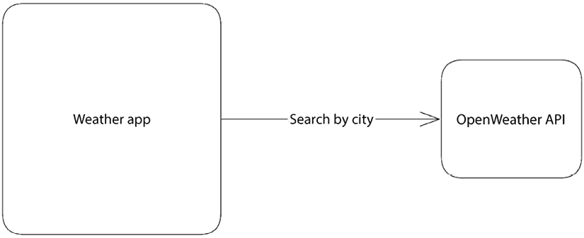
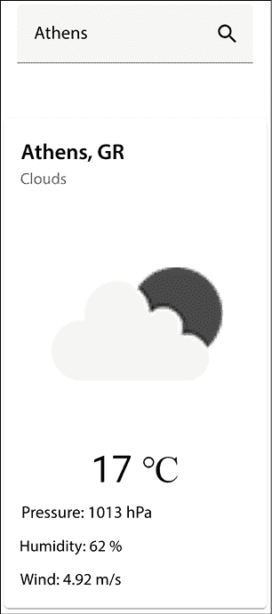

# 第四章：使用 Angular 服务工作者构建 PWA 天气应用程序

我们可以使用不同类型的设备访问网络应用程序，例如桌面、移动或平板电脑，以及各种类型的网络，如宽带、Wi-Fi 和蜂窝网络。网络应用程序应该无缝工作，并独立于用户的设备和网络提供相同的用户体验。

**渐进式网络应用（PWA）** 是考虑到上述因素构建的应用程序。一种流行的技术是 **服务工作者**，它可以提高 Web 应用程序的加载时间。在本章中，我们将使用 Angular 框架的服务工作者实现来构建一个 PWA，使用 **OpenWeather API** 显示城市的天气。

我们将详细介绍以下主题：

+   设置 OpenWeather API

+   显示天气数据

+   使用服务工作者启用离线模式

+   通过应用内通知保持最新

+   使用 **Firebase Hosting** 部署我们的应用程序

# 必要的背景理论和上下文

传统的网络应用程序通常托管在 Web 服务器上，并且任何给定时间对任何用户都是立即可用的。本地应用程序安装在用户的设备上，可以访问其本地资源，并且可以与任何网络无缝工作。PWA 横跨 Web 和本地应用程序的两个世界，并具有两者的特征，总结如下：

+   **能力**：它可以访问本地保存的数据，并与连接到用户设备的外围硬件交互。

+   **可靠性**：它可以在任何网络连接中提供相同的性能和体验，即使在网络连接和覆盖范围较低的地区。

+   **可安装性**：它可以在用户的设备上安装，可以直接从主屏幕启动，并与其他已安装的本地应用程序交互。

将网络应用程序转换为 PWA 涉及多个步骤和技术。其中最重要的一项是配置服务工作者。服务工作者是一种在 Web 浏览器上运行的机制，充当应用程序与外部 HTTP 端点或其他应用程序内资源（如 JavaScript 和 CSS 文件）之间的代理。服务工作者的主要任务是拦截对这些资源的请求，并通过提供缓存的或实时响应来对其采取行动。

服务工作者在浏览器标签页关闭后仍然保持持久。

Angular 框架提供了一个服务工作者的实现，我们可以使用它将我们的 Angular 应用程序转换为 PWA。

它还包含一个内置的 HTTP 客户端，我们可以使用它通过 HTTP 与服务器通信。Angular HTTP 客户端公开了一个基于观察器的 API，具有所有标准 HTTP 方法，如 POST 和 GET。观察器基于**观察者模式**，这是响应式编程的核心。在观察者模式中，多个称为**观察者**的对象可以订阅观察器并接收有关其状态变化的任何通知。观察器通过异步发射事件流来向观察者发送更改。Angular 框架使用一个名为**RxJS**的库，其中包含用于处理观察器的各种工具。其中之一是一组称为**操作符**的函数，可以对观察器应用各种操作，如转换和过滤。接下来，让我们对我们的项目进行概述。

# 项目概述

在这个项目中，我们将构建一个 PWA 来显示城市的天气状况。最初，我们将学习如何配置 OpenWeather API，我们将使用它来获取天气数据。然后，我们将学习如何使用 API 在 Angular 组件中显示天气信息。我们将了解如何使用服务工作者将我们的 Angular 应用程序转换为 PWA。我们还将为我们的应用程序实现更新通知机制。最后，我们将把我们的 PWA 部署到 Firebase Hosting 提供者。以下图表展示了项目的架构概述：



图 4.1 – 项目架构

构建时间：90 分钟

# 入门

完成此项目所需的以下软件工具：

+   **Angular CLI**：Angular 的命令行界面，您可以在[`angular.io/cli`](https://angular.io/cli)找到。

+   **GitHub 材料**：本章的相关代码可以在[`github.com/PacktPublishing/Angular-Projects-Third-Edition`](https://github.com/PacktPublishing/Angular-Projects-Third-Edition)的`Chapter04`文件夹中找到。

# 设置 OpenWeather API

OpenWeather 团队创建了 OpenWeather API，该 API 包含来自全球 200,000 多个城市的当前和历史天气信息。它还支持更详细信息的天气预报数据。

我们需要首先获取一个 API 密钥，才能开始使用 OpenWeather API：

1.  导航到 OpenWeather API 网站[`openweathermap.org/api`](https://openweathermap.org/api)。

    您将看到 OpenWeather 团队提供的所有可用 API 的列表。

1.  找到**当前天气数据**部分，并点击**订阅**按钮。

    您将被重定向到包含服务可用定价方案的页面。每个方案支持每分钟和每月不同的 API 调用组合。对于这个项目，我们将使用**免费**级别。

1.  点击**获取 API 密钥**按钮。

    您将被重定向到服务的注册页面。

1.  完成所有必填信息，并点击**创建账户**按钮。

    将确认消息发送到您用于创建账户的电子邮件地址。

1.  找到确认电子邮件并点击 **验证您的电子邮件** 按钮以完成注册。

    您将很快收到来自 OpenWeather 的另一封电子邮件，其中包含有关您当前订阅的详细信息，包括您的 API 密钥以及您将与 API 通信的 HTTP 端点。

API 密钥可能需要一些时间才能激活，通常在您可以使用它之前需要几个小时。

一旦 API 密钥被激活，我们就可以在 Angular 应用程序中使用它。我们将在下一节中学习如何做到这一点。

# 显示天气数据

在本节中，我们将创建一个 Angular 应用程序来显示给定城市的天气信息。用户将在输入字段中输入城市的名称，应用程序将使用 OpenWeather API 获取指定城市的天气数据。我们将更详细地介绍以下主题：

+   设置 Angular 应用程序

+   与 OpenWeather API 通信

+   显示城市的天气信息

让我们从创建 Angular 应用程序开始，接下来的部分将介绍如何进行。

## 设置 Angular 应用程序

我们将使用 Angular CLI 的 `ng new` 命令从头创建一个新的 Angular 应用程序：

```js
ng new weather-app --style=scss --routing=false 
```

上述命令将创建一个新的 Angular CLI 应用程序，具有以下属性：

+   `weather-app`：Angular 应用程序的名称

+   `--style=scss`：表示我们的 Angular 应用程序将使用 SCSS 样式表格式

+   `--routing=false`：禁用应用程序中的 Angular 路由

用户应在输入字段中输入城市的名称，并且该城市的天气信息应以卡片布局进行可视化。**Angular Material** 库提供了一套 UI 组件来满足我们的需求，包括输入和卡片。

Angular Material 组件遵循 **Material Design** 原则，并由 Angular 的 **Components** 团队维护。我们可以使用以下 Angular CLI 命令安装 Angular Material 库：

```js
ng add @angular/material --theme=indigo-pink --animations=enabled --typography 
```

上述代码使用了 Angular CLI 的 `ng add` 命令，并传递了额外的配置选项：

+   `@angular/material`：Angular Material 库的 npm 包名。它还将安装 **Angular CDK** 包，这是一个用于构建 Angular Material 的行为和交互的集合。这两个包都将添加到应用程序的 `package.json` 文件的 `dependencies` 部分中。

+   `--theme=indigo-pink`：我们想要使用的 Angular Material 主题的名称。添加主题涉及修改 Angular CLI 工作区的几个文件。它将 CSS 主题文件的条目添加到 `angular.json` 配置文件中：

    ```js
    @angular/material/prebuilt-themes/indigo-pink.css 
    ```

    它还包括 `index.html` 文件中的 Material Design 图标：

    ```js
    <link href="https://fonts.googleapis.com/icon?family=Material+Icons" rel="stylesheet"> 
    ```

    Angular Material 随带一套预定义的主题，我们可以使用。或者，我们可以构建一个符合我们特定需求的自定义主题。

+   `--animations=enabled`：通过将 `BrowserAnimationsModule` 导入主应用程序模块 `app.module.ts` 来在应用程序中启用浏览器动画：

    ```js
    import { NgModule } from '@angular/core';
    import { BrowserModule } from '@angular/platform-browser';
    import { AppComponent } from './app.component';
    **import** **{** **BrowserAnimationsModule** **}** **from****'@angular/platform-browser/animations'****;**
    @NgModule({
      declarations: [
        AppComponent
      ],
      imports: [
        BrowserModule,
        **BrowserAnimationsModule**
      ],
      providers: [],
      bootstrap: [AppComponent]
    })
    export class AppModule { } 
    ```

+   `--typography`：在应用程序中全局启用 Angular Material 字体排印。字体排印定义了文本内容的显示方式，并默认使用 **Roboto** 字体，该字体包含在 `index.html` 文件中：

    ```js
    <link href="https://fonts.googleapis.com/css2?family=Roboto:wght@300;400;500&display=swap" rel="stylesheet"> 
    ```

    它向 HTML 文件的 `<body>` 标签中添加以下类：

    ```js
    <body **class****=****"mat-typography"**>
      <app-root></app-root>
    </body> 
    ```

    它还向应用程序的全局 `styles.scss` 文件中添加了一些 CSS 样式：

    ```js
    html, body { height: 100%; }
    body { margin: 0; font-family: Roboto, "Helvetica Neue", sans-serif; } 
    ```

我们现在拥有了构建 Angular 应用程序的所有组件。在下一节中，我们将创建一个与 OpenWeather API 交互的机制。

## 与 OpenWeather API 通信

应用程序应通过 HTTP 与 OpenWeather API 交互以获取天气数据。让我们看看我们如何在应用程序中设置这种类型的通信：

1.  首先，我们必须创建一个接口来描述我们将从 API 获取的数据类型。使用以下 Angular CLI 命令创建一个：

    ```js
    ng generate interface weather 
    ```

    上述命令将在 Angular CLI 项目的 `src\app` 文件夹中创建 `weather.ts` 文件。

1.  打开 `weather.ts` 文件并按以下方式修改它：

    ```js
    export interface Weather {
      weather: WeatherInfo[],
      main: {
        temp: number;
        pressure: number;
        humidity: number;
      };
      wind: {
        speed: number;
      };
      sys: {
        country: string
      };
      name: string;
    }
    interface WeatherInfo {
      main: string;
      icon: string;
    } 
    ```

    每个属性都对应于 OpenWeather API 响应中的天气字段。您可以在 [`openweathermap.org/current#parameter`](https://openweathermap.org/current#parameter) 上找到每个字段的描述。

    然后，我们必须设置 Angular 框架提供的内置 HTTP 客户端。

1.  打开 `app.module.ts` 文件并将 `HttpClientModule` 添加到 `@NgModule` 装饰器的 `imports` 数组中：

    ```js
    **import** **{** **HttpClientModule** **}** **from****'@angular/common/http'****;**
    import { NgModule } from '@angular/core';
    import { BrowserModule } from '@angular/platform-browser';
    import { AppComponent } from './app.component';
    import { BrowserAnimationsModule } from '@angular/platform-browser/animations';
    @NgModule({
      declarations: [
        AppComponent
      ],
      imports: [
        BrowserModule,
        BrowserAnimationsModule,
        **HttpClientModule**
      ],
      providers: [],
      bootstrap: [AppComponent]
    })
    export class AppModule { } 
    ```

1.  使用以下 Angular CLI 命令创建一个新的 Angular 服务：

    ```js
    ng generate service weather 
    ```

    上述命令将在 Angular CLI 项目的 `src\app` 文件夹中创建 `weather.service.ts` 文件。

1.  打开 `weather.service.ts` 文件并将 `HttpClient` 服务注入到其 `constructor` 中：

    ```js
    **import** **{** **HttpClient** **}** **from****'@angular/common/http'****;**
    import { Injectable } from '@angular/core';
    @Injectable({
      providedIn: 'root'
    })
    export class WeatherService {
      constructor(**private** **http: HttpClient**) { }
    } 
    ```

1.  将以下属性添加以定义 OpenWeather API 的端点 URL 和我们的 API 密钥：

    ```js
    private apiUrl = 'https://api.openweathermap.org/data/2.5/';
    private apiKey = '<Your API key>'; 
    ```

    将 `apiKey` 属性的值替换为您拥有的 API 密钥。

    1.  在服务中添加一个方法，该方法接受城市名称作为单个参数并查询 OpenWeather API 以获取该城市的天气：

        ```js
        getWeather(city: string): Observable<Weather> {
          const options = new HttpParams()
            .set('units', 'metric')
            .set('q', city)
            .set('appId', this.apiKey);
          return this.http.get<Weather>(this.apiUrl + 'weather', { params: options });
        } 
        ```

    `getWeather` 方法使用 `HttpClient` 服务的 `get` 方法，它接受两个参数。第一个参数是 OpenWeather API 的 URL 端点。第二个参数是一个 `options` 对象，用于将额外的配置传递给请求，例如带有 `params` 属性的 URL 查询参数。

    我们使用 `HttpParams` 对象的构造函数并调用其 `set` 方法为要添加到 URL 的每个查询参数。在我们的例子中，我们传递 `q` 参数用于城市名称，`appId` 用于 API 密钥，以及我们想要使用的 `units` 类型。您可以在 [`openweathermap.org/current#data`](https://openweathermap.org/current#data) 上了解更多关于支持的单位信息。

    我们使用`set`方法创建查询参数，因为`HttpParams`对象是不可变的。为每个要传递的参数调用构造函数将引发错误。

    我们还在`get`方法中将响应数据类型设置为`Weather`。请注意，`getWeather`方法不返回`Weather`数据，而是一个此类型的`Observable`。

1.  在文件顶部添加以下`import`语句：

    ```js
    import { HttpClient, **HttpParams** } from '@angular/common/http';
    import { Injectable } from '@angular/core';
    **import** **{** **Observable** **}** **from****'rxjs'****;**
    **import** **{** **Weather** **}** **from****'./weather'****;** 
    ```

我们创建的 Angular 服务包含与 OpenWeather API 交互所需的所有必要组件。在下一节中，我们将创建一个 Angular 组件来发起请求并显示数据。

## 显示城市的天气信息

用户应该能够使用我们应用程序的 UI 并输入他们想要查看天气详情的城市名称。应用程序将使用该信息查询 OpenWeather API，并将请求结果以卡片布局的形式显示在 UI 上。让我们开始构建一个 Angular 组件来创建所有这些类型的交互：

1.  使用以下 Angular CLI 命令创建 Angular 组件：

    ```js
    ng generate component weather 
    ```

1.  打开主组件的模板，`app.component.html`，并用新组件的选择器`<app-weather>`替换其内容：

    ```js
    <app-weather></app-weather> 
    ```

1.  打开`app.module.ts`文件，并将 Angular Material 库中的以下模块添加到`@NgModule`装饰器的`imports`数组中：

    ```js
    @NgModule({
      declarations: [
        AppComponent,
        WeatherComponent
      ],
      imports: [
        BrowserModule,
        BrowserAnimationsModule,
        HttpClientModule,
        **MatIconModule****,**
    **MatInputModule****,**
    **MatCardModule**
      ],
      providers: [],
      bootstrap: [AppComponent]
    }) 
    ```

    还需要在文件顶部添加必要的`import`语句：

    ```js
    import { MatCardModule } from '@angular/material/card';
    import { MatIconModule } from '@angular/material/icon';
    import { MatInputModule } from '@angular/material/input'; 
    ```

1.  打开`weather.component.ts`文件，为`Weather`类型创建一个`weather`属性，并将`WeatherService`注入到`WeatherComponent`类的`constructor`中：

    ```js
    import { Component } from '@angular/core';
    **import** **{** **Weather** **}** **from****'****../weather'****;**
    **import** **{** **WeatherService** **}** **from****'../weather.service'****;**
    @Component({
      selector: 'app-weather',
      templateUrl: './weather.component.html',
      styleUrls: ['./weather.component.scss']
    })
    export class WeatherComponent {
      **weather****:** **Weather** **|** **undefined****;**
      **constructor****(****private** **weatherService: WeatherService****){ }**
    } 
    ```

1.  创建一个组件方法，它订阅`WeatherService`的`getWeather`方法，并将结果分配给`weather`组件属性：

    ```js
    search(city: string) {
      this.weatherService.getWeather(city).subscribe(weather => this.weather = weather);
    } 
    ```

我们已经完成了与组件的 TypeScript 类文件的协作。现在让我们将其连接到其模板。打开`weather.component.html`文件，并用以下 HTML 代码替换其内容：

```js
<mat-form-field>
    <input matInput placeholder="Enter city" #cityCtrl (keydown.enter)="search(cityCtrl.value)">
    <mat-icon matSuffix (click)="search(cityCtrl.value)">search</mat-icon>
</mat-form-field>
<mat-card *ngIf="weather">
    <mat-card-header>
        <mat-card-title>{{weather.name}}, {{weather.sys.country}}</mat-card-title>
        <mat-card-subtitle>{{weather.weather[0].main}}</mat-card-subtitle>
    </mat-card-header>
    
    <mat-card-content>
      <h1>{{weather.main.temp | number:'1.0-0'}} &#8451;</h1>
      <p>Pressure: {{weather.main.pressure}} hPa</p>
      <p>Humidity: {{weather.main.humidity}} %</p>
      <p>Wind: {{weather.wind.speed}} m/s</p>
    </mat-card-content>
</mat-card> 
```

上述模板由 Angular Material 库中的几个组件组成，包括一个包含以下子元素的`<mat-form-field>`组件：

+   一个用于输入城市名称的`<input>`HTML 元素。当用户完成编辑并按下*Enter*键时，它会调用`search`组件方法，并将`cityCtrl`变量的值属性作为参数传递。`cityCtrl`变量是一个**模板引用变量**，表示原生 HTML`<input>`元素的实体对象。

+   `<mat-icon>`组件在输入元素的末尾显示一个放大镜图标，如`matSuffix`指令所示。点击时，它还会调用`search`组件的方法。

`cityCtrl`模板引用变量由`#`表示，并在组件模板内部任何地方都可以访问。

`<mat-card>` 组件以卡片布局展示信息，并且仅在 `weather` 组件属性有值时显示。它由以下子元素组成：

+   `<mat-card-header>`：卡片的头部。它由一个 `<mat-card-title>` 组件组成，显示城市名称和国家代码，以及一个 `<mat-card-subtitle>` 组件，显示当前的天气状况。

+   `mat-card-image`：显示天气状况图标的卡片图片，以及作为替代文本的描述。

+   `<mat-card-content>`：卡片的主要内容。它显示当前天气的温度、压力、湿度和风速。温度以没有小数点的形式显示，如 `number` 管道所示。

现在我们来增加一些样式，让我们的组件更有趣：

`weather.component.scss`

```js
:host {
  display: flex;
  align-items: center;
  justify-content: center;
  flex-direction: column;
  padding-top: 25px;
}
mat-form-field {
  width: 20%;
}
mat-icon {
  cursor: pointer;
}
mat-card {
  margin-top: 30px;
  width: 250px;
}
h1 {
  text-align: center;
  font-size: 2.5em;
} 
```

`:host` 选择器是 Angular 独特的 CSS 选择器，它针对托管我们的组件的 HTML 元素，在我们的例子中，是 `<app-weather>` HTML 元素。

如果我们使用 `ng serve` 运行我们的应用程序，导航到 `http://localhost:4200`，并在 `Athens` 中搜索天气信息，我们应该在屏幕上得到以下输出：



图 4.2 – 应用程序输出

恭喜！现在，你拥有了一个完全工作的 Angular 应用程序，它可以显示特定城市的天气信息。该应用程序由一个单一的 Angular 组件组成，通过 Angular 服务使用 HTTP 与 OpenWeather API 进行通信。我们学习了如何使用 Angular Material 来美化我们的组件，并让我们的用户在使用我们的应用程序时获得愉悦的体验。但当我们离线时会发生什么？应用程序是否按预期工作？用户的体验是否保持不变？让我们在下一节中找出答案。

# 通过服务工作者启用离线模式

来自任何地方的用户现在都可以访问我们的 Angular 应用程序，以获取他们感兴趣的任何城市的天气信息。当我们说“任何地方”时，我们指的是任何网络类型，例如宽带、蜂窝（3G/4G/5G）和 Wi-Fi。考虑一个用户处于覆盖范围低或频繁断网的地方的情况。我们的应用程序会如何表现？让我们通过实验来找出答案：

1.  使用 Angular CLI 的 `ng serve` 命令运行 Angular 应用程序。

1.  打开你喜欢的浏览器，导航到 `http://localhost:4200`，这是 Angular CLI 项目的默认地址和端口号。你应该能看到输入字段，用于输入城市的名称：


图 4.3 – 输入城市名称

1.  打开你浏览器的开发者工具，并导航到 **网络** 选项卡。将 **Throttling** 下拉菜单的值设置为 **Offline**：


图 4.4 – 离线网络模式

1.  尝试刷新您的浏览器。您将看到您已从互联网断开连接的指示，如下面的截图所示：


图 4.5 – 无互联网连接（Google Chrome）

在低质量互联网连接的地区，这种情况是标准的。那么，我们能为这样的用户做些什么呢？幸运的是，Angular 框架包含了一个服务工作者的实现，当在离线模式下运行时，它可以显著提高我们应用程序的用户体验。它可以缓存某些应用程序部分并相应地提供它们，而不是进行实际请求。

Angular 服务工作者也可以用于具有大网络延迟连接的环境。考虑在这种类型的网络中也使用服务工作者来改善用户的体验。

运行以下 Angular CLI 命令以在我们的 Angular 应用程序中启用服务工作者：

```js
ng add @angular/pwa 
```

上述命令将根据 PWA 支持相应地转换 Angular CLI 工作区：

+   它将 `@angular/service-worker` npm 包添加到应用程序的 `package.json` 文件的 `dependencies` 部分。

+   它在应用程序的 `src` 文件夹中创建 `manifest.webmanifest` 文件。该清单文件包含有关应用程序的信息，这些信息是安装和运行原生应用程序所需的。它还将其添加到 `angular.json` 文件的 `build` 选项的 `assets` 数组中。

+   它在项目根目录中创建 `ngsw-config.json` 文件，这是服务工作者配置文件。我们使用它来定义特定配置的工件，例如哪些资源被缓存以及如何缓存。您可以在以下链接中找到有关服务工作者配置的更多详细信息：[`angular.io/guide/service-worker-config#service-worker-configuration`](https://angular.io/guide/service-worker-config#service-worker-configuration)。

+   配置文件也在 `angular.json` 文件的 `build` 配置中的 `ngswConfigPath` 属性中设置。

+   它在 `angular.json` 文件的 `build` 配置中将 `serviceWorker` 属性设置为 `true`。

+   它在 `app.module.ts` 文件中注册服务工作者：

    ```js
    @NgModule({
      declarations: [
        AppComponent,
        WeatherComponent
      ],
      imports: [
        BrowserModule,
        BrowserAnimationsModule,
        HttpClientModule,
        MatIconModule,
        MatInputModule,
        MatCardModule,
        **ServiceWorkerModule****.****register****(****'ngsw-worker.js'****, {**
    **enabled****: !****isDevMode****(),**
    **// Register the ServiceWorker as soon as the application is stable**
    **// or after 30 seconds (whichever comes first).**
    **registrationStrategy****:** **'registerWhenStable:30000'**
     **})**
      ],
      providers: [],
      bootstrap: [AppComponent]
    }) 
    ```

+   `ngsw-worker.js` 文件是包含服务工作者实际实现的 JavaScript 文件。当构建我们的应用程序时，它会为我们自动创建。Angular 使用 `ServiceWorkerModule` 类的 `register` 方法在我们的应用程序中注册它。

+   它为当应用程序作为原生应用安装到用户设备上时使用创建几个图标。

+   它在 `index.html` 文件的 `<head>` 元素中包含清单文件和一个 `theme-color` 的 `<meta>` 标签：

    ```js
    <link rel="manifest" href="manifest.webmanifest">
    <meta name="theme-color" content="#1976d2"> 
    ```

现在我们已经完成了服务工作者的安装，是时候测试它了！在继续之前，我们应该安装一个外部网络服务器，因为 Angular CLI 的内置功能不支持服务工作者。一个不错的选择是 **http-server**：

1.  运行 npm 客户端的 `install` 命令来安装 `http-server`:

    ```js
    npm install -D http-server 
    ```

    上述命令将 `http-server` 作为我们的 Angular CLI 项目的开发依赖项安装。

1.  使用 Angular CLI 的 `ng build` 命令构建 Angular 应用程序。

1.  打开 Angular CLI 工作区的 `package.json` 文件，并将以下条目添加到 `scripts` 属性中：

    ```js
    "scripts": {
      "ng": "ng",
      "start": "ng serve",
      "build": "ng build",
      "watch": "ng build --watch --configuration development",
      "test": "ng test",
      **"server"****:** **"http-server -p 8080 -c-1 dist/weather-app"**
    } 
    ```

1.  使用以下命令启动 HTTP 网络服务器：

    ```js
    npm run server 
    ```

    上述命令将在端口 8080 上启动 http-server 并禁用缓存。

1.  打开您的浏览器并导航到 `http://localhost:8080`。

    建议在私密或隐身模式下打开页面，以避免服务工作者出现意外行为。

1.  重复本节开头为切换到离线模式所遵循的过程。

1.  如果您现在刷新页面，您会注意到应用程序按预期工作。

    服务工作者为我们做了所有工作，整个过程如此无缝，以至于我们无法判断我们是处于在线还是离线状态。您可以通过检查 **网络** 选项卡来验证这一点：

    

    图 4.6 – 服务工作者（离线模式）

**大小** 列中的 **(ServiceWorker)** 值表示服务工作者为我们提供了应用程序的缓存版本。

我们已成功安装服务工作者，并更接近将我们的应用程序转换为 PWA。在下一节中，我们将学习如何通知用户应用程序的潜在更新。

# 保持应用程序内通知的更新

当我们想在网络应用程序中应用更改时，我们进行更改并构建应用程序的新版本。然后，应用程序被部署到网络服务器，每个用户都可以立即访问最新版本。但 PWA 是不同的。

当我们部署 PWA 的新版本时，服务工作者必须相应地采取行动并应用特定的更新策略。它应该通知用户新版本或立即安装它。我们遵循哪种更新策略取决于我们的需求。在这个项目中，我们想向用户显示提示，并让他们决定是否想要更新应用程序。让我们看看如何在我们的应用程序中实现这个功能：

1.  打开 `app.module.ts` 文件，并将 `MatSnackBarModule` 添加到 `@NgModule` 装饰器的 `imports` 数组中：

    ```js
    **import** **{** **MatSnackBarModule** **}** **from****'@angular/material/snack-bar'****;**
    @NgModule({
      declarations: [
        AppComponent,
        WeatherComponent
      ],
      imports: [
        BrowserModule,
        BrowserAnimationsModule,
        HttpClientModule,
        MatIconModule,
        MatInputModule,
        MatCardModule,
        **MatSnackBarModule**,
        ServiceWorkerModule.register('ngsw-worker.js', {
          enabled: !isDevMode(),
          // Register the ServiceWorker as soon as the application is stable
          // or after 30 seconds (whichever comes first).
          registrationStrategy: 'registerWhenStable:30000'
        })
      ],
      providers: [],
      bootstrap: [AppComponent]
    }) 
    ```

    `MatSnackBarModule` 是一个 Angular Material 模块，它允许我们与 **snack** **bars** 进行交互。snack bar 是一个通常出现在页面底部的弹出窗口，用于通知目的。

1.  打开 `app.component.ts` 文件，并将 `OnInit` 接口添加到 `AppComponent` 类实现的接口中：

    ```js
    import { Component, **OnInit** } from '@angular/core';
    @Component({
      selector: 'app-root',
      templateUrl: './app.component.html',
      styleUrls: ['./app.component.scss']
    })
    export class AppComponent **implements****OnInit** {
      title = 'weather-app';
    } 
    ```

1.  在 `AppComponent` 类的 `constructor` 中注入 `MatSnackBar` 和 `SwUpdate` 服务：

    ```js
    import { Component, OnInit } from '@angular/core';
    **import** **{** **MatSnackBar** **}** **from****'@angular/material/snack-bar'****;**
    **import** **{** **SwUpdate****,** **VersionReadyEvent** **}** **from****'@angular/service-worker'****;**
    @Component({
      selector: 'app-root',
      templateUrl: './app.component.html',
      styleUrls: ['./app.component.scss']
    })
    export class AppComponent implements OnInit {
      title = 'weather-app';
      **constructor****(****private** **updates: SwUpdate,** **private** **snackbar: MatSnackBar****) {}**
    } 
    ```

    `MatSnackBar` 服务是从 `MatSnackBarModule` 中公开的 Angular 服务。`SwUpdate` 服务是服务工作者的一部分，包含我们可以用来通知用户应用程序更新过程的可观察对象。

1.  创建以下 `ngOnInit` 方法：

    ```js
    ngOnInit() {
      this.updates.versionUpdates.pipe(
        filter((evt): evt is VersionReadyEvent => evt.type === 'VERSION_READY'),
        switchMap(() => this.snackbar.open('A new version is available!', 'Update now').afterDismissed()),
        filter(result => result.dismissedByAction),
        map(() => this.updates.activateUpdate().then(() => location.reload()))
      ).subscribe();
    } 
    ```

    `ngOnInit` 方法是 `OnInit` 接口的一个实现方法，在组件初始化时被调用。`SwUpdate` 服务包含一个 `versionUpdates` 可观察属性，我们可以使用它来获取通知，当我们的应用程序有新版本可用时。通常，我们倾向于订阅可观察对象，但在这个情况下，我们没有这样做。相反，我们订阅了 `pipe` 方法，这是一个用于组合多个操作符的 RxJS 操作符。

1.  在 `app.component.ts` 文件的顶部添加以下 `import` 语句：

    ```js
    import { filter, map, switchMap } from 'rxjs'; 
    ```

在我们之前定义的 `ngOnInit` 方法内部有很多事情在进行，所以让我们将其分解成几个部分以进一步理解它。`pipe` 操作符组合了四个 RxJS 操作符：

+   `filter:` 我们使用它来过滤掉从 `versionUpdates` 可观察对象发出的除表示版本准备安装之外的所有值。`

+   `switchMap`: 当我们的应用程序有新版本可用时，会调用此方法。它使用 `snackbar` 属性的 `open` 方法来显示带有操作按钮的 snack bar，并订阅其 `afterDismissed` 可观察对象。`afterDismissed` 可观察对象在 snack bar 通过点击操作按钮或使用其 API 方法程序化关闭时发出。

+   `filter`: 当使用操作按钮关闭 snack bar 时，会调用此方法。

+   `map`: 这调用 `updates` 属性的 `activateUpdate` 方法来应用应用程序的新版本。一旦应用程序已更新，它将重新加载浏览器窗口以使更改生效。

让我们看看更新到新版本的整个过程：

1.  运行以下 Angular CLI 命令来构建 Angular 应用程序：

    ```js
    ng build 
    ```

1.  启动 HTTP 服务器以提供应用程序：

    ```js
    npm run server 
    ```

1.  打开一个私密或隐身浏览器窗口，并导航到 `http://localhost:8080`。

1.  在不关闭浏览器窗口的情况下，让我们在我们的应用程序中引入一个更改并添加一个 UI 标题。运行 Angular CLI 的 `generate` 命令来创建一个组件：

    ```js
    ng generate component header 
    ```

1.  打开 `app.module.ts` 文件并导入以下 Angular Material 模块：

    ```js
    **import** **{** **MatButtonModule** **}** **from****'@angular/material/button'****;**
    **import** **{** **MatToolbarModule** **}** **from****'@angular/material/toolbar'****;**
    @NgModule({
      declarations: [
        AppComponent,
        WeatherComponent,
        HeaderComponent
      ],
      imports: [
        BrowserModule,
        BrowserAnimationsModule,
        HttpClientModule,
        MatIconModule,
        MatInputModule,
        MatCardModule,
        MatSnackBarModule,
    **MatButtonModule****,**
    **MatToolbarModule****,**
        ServiceWorkerModule.register('ngsw-worker.js', {
          enabled: !isDevMode(),
          // Register the ServiceWorker as soon as the application is stable
          // or after 30 seconds (whichever comes first).
          registrationStrategy: 'registerWhenStable:30000'
        })
      ],
      providers: [],
      bootstrap: [AppComponent]
    }) 
    ```

1.  打开 `header.component.html` 文件，并创建一个包含两个 HTML `<button>` 元素的 `<mat-toolbar>` 组件，每个按钮都包含一个 `<mat-icon>` 组件：

    ```js
    <mat-toolbar color="primary">
      <span>Weather App</span>
      <span class="spacer"></span>
      <button mat-icon-button>
        <mat-icon>refresh</mat-icon>
      </button>
      <button mat-icon-button>
        <mat-icon>share</mat-icon>
      </button>
    </mat-toolbar> 
    ```

1.  将以下 CSS 样式添加到 `header.component.scss` 文件中，以便将按钮定位在标题的右端：

    ```js
    .spacer {
      flex: 1 1 auto;
    } 
    ```

1.  打开 `app.component.html` 文件，并在顶部添加 `<app-header>` 组件：

    ```js
    **<****app-header****></****app-header****>**
    <app-weather></app-weather> 
    ```

1.  重复步骤 1 和 2，并刷新指向 `http://localhost:8080` 的浏览器窗口。几秒钟后，你应在页面底部看到以下通知：


图 4.7 – 新版本通知

1.  点击 **立即更新** 按钮，等待浏览器窗口重新加载，你应该能看到你的更改：


图 4.8 – 应用程序输出

我们的 Angular 应用程序已经开始转变为 PWA 应用程序。随着 Angular 服务工作者提供的缓存机制，我们添加了安装我们应用程序新版本的机制。在下一节中，我们将学习如何在我们的设备上本地部署和安装我们的应用程序。

# 使用 Firebase Hosting 部署我们的应用程序

Firebase 是由 Google 提供的托管解决方案，我们可以使用它来部署我们的 Angular 应用程序。Firebase 团队投入了大量精力创建了一个 Angular CLI 脚本，用于通过单个命令部署 Angular 应用程序。在深入了解之前，让我们学习如何设置 Firebase Hosting：

1.  使用 Google 账户登录 Firebase，网址为 [`console.firebase.google.com`](https://console.firebase.google.com)。

1.  点击 **添加项目** 按钮以创建新的 Firebase 项目。

1.  输入项目名称，`weather-app`，然后点击 **继续** 按钮。

    Firebase 在项目名称下方生成一个独特的标识符，例如 *weather-app-b11a2*，该标识符将在项目的主机 URL 中使用。

1.  禁用项目中 **Google Analytics** 的使用，然后点击 **创建项目** 按钮。

1.  一旦项目创建完成，屏幕上将会显示以下内容：


图 4.9 – Firebase 项目创建

1.  点击 **继续** 按钮，你将被重定向到你的新 Firebase 项目仪表板。

我们现在已经完成了 Firebase Hosting 的配置。现在是时候将其与我们的 Angular 应用程序集成：

1.  在终端窗口中运行以下命令来安装 **Firebase 工具**：

    ```js
    npm install -g firebase-tools 
    ```

1.  在相同的终端窗口中运行以下命令以使用 Firebase CLI 进行身份验证：

    ```js
    firebase login 
    ```

1.  最后，运行以下 Angular CLI 命令来在 Angular CLI 项目中安装 `@angular/fire` npm 包：

    ```js
    ng add @angular/fire 
    ```

    上述命令将找到库的最新版本，并提示我们安装它。

1.  首先，它将询问我们想要启用 Firebase 的哪些功能：

    ```js
    ? What features would you like to setup? 
    ```

    确保选择了 `ng deploy -- hosting` 选项，然后按 *Enter*。

1.  然后，它将询问我们想要使用哪个 Firebase 账户：

    ```js
    ? Which Firebase account would you like to use? 
    ```

    确保选择了之前使用的账户，然后按 *Enter*。

1.  在下一个问题中，我们将选择我们将要部署应用程序的项目：

    ```js
    ? Please select a project: 
    ```

    选择我们之前创建的 `weather-app` 项目，然后按 *Enter*。

1.  最后，我们必须选择将托管我们应用程序的网站：

    ```js
    ? Please select a hosting site: 
    ```

选择我们之前创建的托管网站，然后按 *Enter*。

之前的流程将根据需要修改 Angular CLI 工作区，以适应其部署到 Firebase：

+   它将在根目录下创建一个 `.firebaserc` 文件，其中包含所选 Firebase 项目的详细信息。

+   它将在根目录下创建一个 `firebase.json` 文件，这是 Firebase 配置文件。配置文件指定了将部署到 Firebase 的文件夹以及任何重写规则。

    默认部署的文件夹是当运行 `ng build` 命令时由 Angular CLI 创建的 `dist` 输出文件夹。

+   它将在 `angular.json` 配置文件中添加一个 `deploy` 目标。

要部署应用程序，我们只需要运行一个 Angular CLI 命令，Angular CLI 将处理其余部分：

```js
ng deploy 
```

之前的命令将构建并将应用程序部署到所选的 Firebase 项目。一旦部署完成，Angular CLI 将报告以下信息：

+   **项目控制台**：Firebase 项目的仪表板。

+   **托管 URL**：已部署应用程序版本的 URL。它由 Firebase 项目的唯一标识符和 Firebase 自动添加的 `.web.app` 后缀组成。

服务工作者需要以 HTTPS 协议提供服务才能作为 PWA 正确工作，除了用于开发的 localhost 之外。Firebase 默认使用 HTTPS 托管 Web 应用程序。

现在我们已经部署了我们的应用程序，让我们看看我们如何将其作为 PWA 安装到我们的设备上：

1.  导航到托管 URL，然后在浏览器地址栏旁边点击 **安装 weather-app** 按钮：

    图 4.10 – 安装应用程序（Google Chrome）

    安装按钮可能在其他浏览器的不同位置。

    浏览器将提示我们安装应用程序。

1.  点击 **安装** 按钮，应用程序将在我们的设备上以原生窗口的形式打开：

![图片 B18465_04_11.png]

图 4.11 – PWA

它还会在我们的设备上创建一个启动应用程序的快捷方式。恭喜！我们现在有一个完整的 PWA，可以显示城市的天气信息。

# 摘要

在本章中，我们构建了一个显示特定城市天气信息的 PWA。

初始时，我们设置了 OpenWeather API 以获取天气数据，并从头创建了一个 Angular 应用程序来集成它。我们学习了如何使用 Angular 框架内置的 HTTP 客户端与 OpenWeather API 进行通信。我们还安装了 Angular Material 库，并使用了一些现成的 UI 组件来构建我们的应用程序。

在创建 Angular 应用程序后，我们介绍了 Angular 服务工作者并使其能够离线工作。我们学习了如何与服务工作者交互并为我们的应用程序提供更新通知。最后，我们将应用程序的生产版本部署到 Firebase Hosting 并将其安装到我们的设备上。

在下一章中，我们将学习如何使用 Electron（PWAs 的主要竞争对手）创建 Angular 桌面应用程序。

# 练习

使用 OpenWeather API 显示所选城市的每周天气预报。OpenWeather API 提供了**5 天/3 小时预报**集合，可以用于此。该集合为每天每 3 小时返回一次预报，因此，对于每周预报，你只需关注每天中午 12:00 的天气即可。预报应以网格列表的形式显示为卡片组件，并应位于城市当前天气下方。

你可以在[`github.com/PacktPublishing/Angular-Projects-Third-Edition/tree/exercise`](https://github.com/PacktPublishing/Angular-Projects-Third-Edition/tree/exercise)的`exercise`分支的`Chapter04`文件夹中找到练习的解决方案。

# 进一步阅读

+   PWAs：[`web.dev/progressive-web-apps`](https://web.dev/progressive-web-apps)

+   OpenWeather API：[`openweathermap.org/api`](https://openweathermap.org/api)

+   Angular Material：[`material.angular.io`](https://material.angular.io)

+   Angular HTTP 客户端：[`angular.io/guide/http`](https://angular.io/guide/http)

+   Angular 服务工作者：[`angular.io/guide/service-worker-getting-started`](https://angular.io/guide/service-worker-getting-started)

+   与 Angular 服务工作者通信：[`angular.io/guide/service-worker-communications`](https://angular.io/guide/service-worker-communications)

+   HTTP 服务器：[`www.npmjs.com/package/http-server`](https://www.npmjs.com/package/http-server)

+   Firebase Hosting：[`firebase.google.com/docs/hosting`](https://firebase.google.com/docs/hosting)

+   Angular 部署：[`angular.io/guide/deployment#automatic-deployment-with-the-cli`](https://angular.io/guide/deployment#automatic-deployment-with-the-cli)
