# 第六章：使用 Capacitor 和 3D 地图构建移动照片地理标记应用程序

Angular 是一个跨平台的 JavaScript 框架，可用于构建不同平台（如 Web、桌面和移动）的应用程序。此外，它允许开发者使用相同的代码库并将相同的 Web 技术应用于每个平台，从而享受相同的使用体验和性能。在本章中，我们将探讨如何使用 Angular 构建移动应用程序。

**Ionic**是一个流行的 UI 工具包，允许我们使用如 Angular 等 Web 技术构建移动应用程序。**Capacitor**库通过使它们能够在 Android 和 iOS 设备上本地运行，极大地增强了 Ionic 应用程序。在本章中，我们将使用这两种技术构建一个移动应用程序，用于拍摄带有地理标记的照片并在 3D 地图上显示它们。

我们将详细介绍以下主题：

+   使用 Ionic 创建移动应用程序

+   使用 Capacitor 拍照

+   在**Firebase**中存储数据

+   使用**CesiumJS**预览照片

# 必要的背景理论和上下文

电容器是一个原生移动运行时，使我们能够使用包括 Angular 在内的 Web 技术构建 Android 和 iOS 应用程序。它为 Web 应用程序提供了一个抽象 API 层，以便与移动操作系统的原生资源进行交互。它不包括 UI 层或任何其他与用户界面交互的方式。

Ionic 是一个包含我们可以用于使用 Capacitor 构建的应用程序中的 UI 组件的移动框架。Ionic 的主要优势是我们可以在所有原生移动平台上维护单个代码库。也就是说，我们只需编写一次代码，它就可以在任何地方工作。Ionic 支持所有流行的 JavaScript 框架，包括 Angular。

Firebase 是由 Google 提供的**后端即服务（BaaS）**平台，其中包含用于构建应用程序的工具和服务。**Cloud Firestore**是 Firebase 提供的一种数据库解决方案，它具有灵活和可扩展的 NoSQL 文档导向数据库，可用于 Web 和移动应用程序。**Firebase Storage**是一种服务，允许我们与存储机制进行交互并上传或下载文件。

CesiumJS 是一个用于在浏览器中创建交互式 3D 地图的 JavaScript 库。它是一个开源、跨平台的库，使用 WebGL，并允许我们在多个平台上共享地理空间数据。它由**Cesium**提供支持，这是一个用于构建高质量和性能优异的 3D 地理空间应用的平台。

# 项目概述

在这个项目中，我们将构建一个可以根据当前位置拍照并在地图上预览照片的移动应用程序。最初，我们将学习如何使用 Angular 和 Ionic 创建移动应用程序。然后，我们将使用 Capacitor 通过移动设备的相机拍照，并通过 GPS 标记当前位置。我们将把这些照片及其位置数据上传到 Firebase。最后，我们将使用 CesiumJS 在 3D 球上加载位置数据，并预览照片。以下图表展示了项目的架构概述：

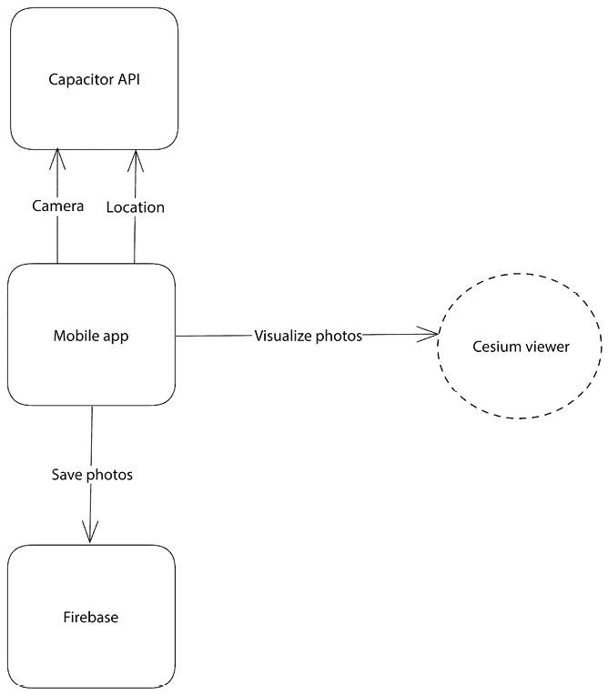

图 6.1 – 项目架构

在本章中，你将学习如何使用 Angular 和 Ionic 构建移动应用程序。为了跟进项目并预览你的应用程序，你必须遵循你的开发环境（Android 或 iOS）的入门指南，你可以在 *进一步阅读* 部分找到。

构建时间：2 小时

# 入门

完成此项目，你需要以下软件和工具：

+   对于 Android 开发：**Android Studio** 以及最新的 Android SDK。

+   对于 iOS 开发：**Xcode** 以及 iOS SDK 和 Xcode 命令行工具。

+   一个物理移动设备。

+   Angular CLI：Angular 的命令行界面，你可以在 [`angular.io/cli`](https://angular.io/cli) 找到。

+   GitHub 资源：本章相关代码可在 [`github.com/PacktPublishing/Angular-Projects-Third-Edition`](https://github.com/PacktPublishing/Angular-Projects-Third-Edition) 的 `Chapter06` 文件夹中找到。

# 使用 Ionic 创建移动应用程序

建立我们的应用程序的第一步是使用 Ionic 工具包创建一个新的移动应用程序。我们将从以下任务开始构建我们的应用程序：

+   应用程序脚手架

+   构建主菜单

Ionic 创建从零开始的新移动应用程序的过程非常直接，无需输入任何代码。

## 应用程序脚手架

创建新的 Ionic 应用程序，请完成以下步骤：

1.  使用以下命令安装我们需要的 Ionic 工具：

    ```js
    npm install -g @ionic/cli native-run cordova-res 
    ```

    **Ionic CLI** 用于构建和运行 Ionic 移动应用程序。`native-run` 库用于在移动设备和模拟器上运行原生库。`cordova-res` 库为我们生成原生移动设备的应用程序图标和启动画面。

1.  运行以下命令以创建一个新的 Angular 应用程序，该应用程序使用 Ionic 的 `sidemenu` 起始模板，并添加了 Capacitor：

    ```js
    ionic start phototag sidemenu --type=angular --capacitor 
    ```

1.  之前的命令将询问你是否想使用 Angular 模块或独立组件。选择 `Standalone` 并按 *Enter*。

Ionic 将为我们创建一个包含一些现成数据的示例应用程序。在下一节中，我们将学习如何根据我们的需求对其进行修改。

## 构建主菜单

我们将根据我们的规格开始构建应用程序的主菜单：

1.  在 VSCode 中加载我们在上一节中构建的 Ionic 项目，并打开应用程序的主 HTML 文件 `index.html`。

1.  在 `<title>` 标签中添加您应用程序的名称：

    ```js
    <title>**Phototag** App</title> 
    ```

1.  打开主组件的模板文件 `app.component.html`，并删除第二个 `<ion-list>` 元素。`<ion-list>` 元素用于在列表视图中显示项目。

1.  在 `<ion-list-header>` 元素中添加您应用程序的名称，并相应地更改 `<ion-note>` 元素的文本：

    ```js
    <ion-list-header>**Phototag**</ion-list-header>
    <ion-note>**Capture geotagged photos**</ion-note> 
    ```

    `<ion-list-header>` 元素是列表的标题。`<ion-note>` 元素是一个用于提供额外信息的文本元素，例如列表的副标题。

1.  打开主组件的 TypeScript 文件 `app.component.ts`，并按如下方式修改 `AppComponent` 类：

    ```js
    export class AppComponent {
      public appPages = [
        {
          title: 'Take a photo',
          url: '/capture',
          icon: 'camera'
        },
        {
          title: 'View gallery',
          url: '/view',
          icon: 'globe'
        }
      ];
      constructor() {}
    } 
    ```

    `appPages` 属性包含我们应用程序的所有页面。每个页面都有一个 `title`，一个可访问的 `url`，以及一个 `icon`。我们的应用程序将包含两个页面，一个用于使用相机拍照，另一个用于在地图上显示它们。

1.  运行 Ionic CLI 的 `serve` 命令以启动应用程序：

    ```js
    ionic serve 
    ```

    上述命令将构建您的应用程序并在默认浏览器中打开 `http://localhost:8100`。

    您应该在应用程序的侧边菜单中看到以下输出：

    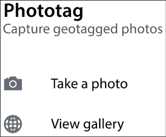

    图 6.2 – 主菜单

假设您调整浏览器窗口大小以获得更真实的移动设备视图或使用模拟器，例如 Google Chrome 开发者工具中的设备工具栏。在这种情况下，您必须点击应用程序菜单按钮才能看到前面的图像。

我们已经学习了如何使用 Ionic CLI 创建新的 Ionic 应用程序并根据我们的需求进行修改。

如果我们尝试点击菜单项，我们会注意到没有任何反应，因为我们还没有为每种情况创建必要的页面。在下一节中，我们将学习如何通过构建第一页的功能来完成此任务。

# 使用 Capacitor 拍照

我们应用程序的第一页将允许用户使用相机拍照。我们将使用 Capacitor 运行时来获取对相机原生资源的访问权限。为了实现页面，我们需要采取以下行动：

+   创建用户界面。

+   与电容器交互。

让我们开始构建页面的用户界面。

## 创建用户界面

我们应用程序中的每个页面都是一个不同的 Angular 组件。要在 Ionic 中创建 Angular 组件，我们可以使用 Ionic CLI 的 `generate` 命令：

```js
ionic generate page capture 
```

之前的命令将执行以下操作：

+   创建一个名为 `capture` 的 Angular 组件。

+   创建相关路由文件。

让我们现在开始构建新页面的逻辑：

1.  首先，当用户打开应用程序时，使我们的页面成为默认页面。打开 `app.routes.ts` 文件，并将 `routes` 属性的第一个条目更改为：

    ```js
    {
      path: '',
      redirectTo: '**capture**',
      pathMatch: 'full',
    } 
    ```

    空路径称为 **默认** 路由路径，当我们的应用程序启动时被激活。`redirectTo` 属性告诉 Angular 重定向到 `capture` 路径，这将加载我们创建的页面。

    你也可以删除 `folder/:id` 路径，因为它不再需要，并且从应用程序中删除整个 `src\app\folder` 目录，这是 Ionic 模板布局的一部分。

1.  打开 `capture.page.html` 文件并按照以下方式替换第一个 `<ion-toolbar>` 元素的全部内容：

    ```js
    <ion-header [translucent]="true">
      <ion-toolbar>
        **<****ion-buttons****slot****=****"start"****>**
    **<****ion-menu-button****color****=****"primary"****></****ion-menu-button****>**
    **</****ion-buttons****>**
    <ion-title>**Take a photo**</ion-title>
      </ion-toolbar>
    </ion-header> 
    ```

    `<ion-toolbar>` 元素是 `<ion-header>` 元素的一部分，它是页面的顶部导航栏。它包含一个 `<ion-menu-button>` 元素，用于切换应用程序的主菜单，以及一个 `<ion-title>` 元素，描述页面的标题。

1.  按照以下方式修改第二个 `<ion-toolbar>` 元素的标题：

    ```js
    <ion-title size="large">**Take a photo**</ion-title> 
    ```

    当页面展开时，将显示第二个 `<ion-header>` 元素，主菜单将显示在屏幕上。

1.  在第二个标题之后立即添加以下 HTML 代码：

    ```js
    <div id="container">
      <strong class="capitalize">Take a nice photo with your camera</strong>
      <ion-fab vertical="center" horizontal="center" slot="fixed">
        <ion-fab-button>
          <ion-icon name="camera"></ion-icon>
        </ion-fab-button>
      </ion-fab>
    </div> 
    ```

    它包含一个 `<ion-fab-button>` 元素，当点击时，将打开设备的相机来拍照。

1.  最后，让我们给我们的页面添加一些酷炫的样式。打开 `capture.page.scss` 文件并输入以下 CSS 样式：

    ```js
    #container {
        text-align: center;
        position: absolute;
        left: 0;
        right: 0;
        top: 50%;
        transform: translateY(-50%);
    }
    #container strong {
        font-size: 20px;
        line-height: 26px;
    }
    #container ion-fab {
        margin-top: 60px;
    } 
    ```

让我们使用 `ionic serve` 运行应用程序，以快速预览我们迄今为止所构建的内容：


图 6.3 – 捕获页面

页面上的相机按钮需要打开相机来拍照。在以下部分，我们将学习如何使用 Capacitor 与相机交互。

## 与 Capacitor 交互

在我们的应用程序中拍照涉及使用 Capacitor 库中的两个 API。**Camera API** 将打开相机来拍照，而 **Geolocation API** 将从 GPS 读取当前位置。让我们看看我们如何在应用程序中使用这两个 API：

1.  执行以下 `npm` 命令来安装两个 API：

    ```js
    npm install @capacitor/camera @capacitor/geolocation 
    ```

1.  使用以下 Ionic CLI 命令创建 Angular 服务：

    ```js
    ionic generate service photo 
    ```

1.  打开 `photo.service.ts` 文件并添加以下 `import` 语句：

    ```js
    import { Camera, CameraResultType, CameraSource } from '@capacitor/camera';
    import { Geolocation } from '@capacitor/geolocation'; 
    ```

1.  在 `PhotoService` 类中创建一个方法来从 GPS 设备读取当前位置：

    ```js
    private async getLocation() {
      const location = await Geolocation.getCurrentPosition();
      return location.coords;
    } 
    ```

    `Geolocation` 对象的 `getCurrentPosition` 方法包含一个 `coords` 属性，其中包含各种基于位置的数据，如纬度和经度。

1.  创建另一个方法，该方法调用 `getLocation` 方法并打开设备的相机来拍照：

    ```js
    async takePhoto() {
      await this.getLocation();
      await Camera.getPhoto({
        resultType: CameraResultType.DataUrl,
        source: CameraSource.Camera,
        quality: 100
      });
    } 
    ```

    我们使用 `Camera` 对象的 `getPhoto` 方法并传递一个配置对象来定义每张照片的属性。`resultType` 属性表示照片将以 **data URL** 格式保存，以便稍后轻松地将其保存到 Firebase。`source` 属性表示我们将使用相机设备来获取照片，而 `quality` 属性定义了实际照片的质量。

1.  打开 `capture.page.ts` 文件并在 `CapturePage` 类的 `constructor` 中注入 `PhotoService`：

    ```js
    import { Component, OnInit } from '@angular/core';
    import { CommonModule } from '@angular/common';
    import { FormsModule } from '@angular/forms';
    import { IonicModule } from '@ionic/angular';
    **import** **{** **PhotoService** **}** **from****'../photo.service'****;**
    @Component({
      selector: 'app-capture',
      templateUrl: './capture.page.html',
      styleUrls: ['./capture.page.scss'],
      standalone: true,
      imports: [IonicModule, CommonModule, FormsModule]
    })
    export class CapturePage implements OnInit {
      constructor(**private** **photoService: PhotoService**) { }
      ngOnInit() {
      }
    } 
    ```

1.  创建一个组件方法，该方法将调用`photoService`变量的`takePhoto`方法：

    ```js
    openCamera() {
      this.photoService.takePhoto();
    } 
    ```

1.  打开`capture.page.html`文件，并将`<ion-fab-button>`元素的`click`事件绑定到`openCamera`组件方法：

    ```js
    <ion-fab-button **(****click****)=****"openCamera()"**>
      <ion-icon name="camera"></ion-icon>
    </ion-fab-button> 
    ```

我们现在已经添加了所有必要的组件来使用设备的相机拍照。让我们尝试在真实设备上运行应用程序以测试与相机的交互：

1.  首先，我们需要使用以下 Ionic CLI 命令构建我们的应用程序：

    ```js
    ionic build 
    ```

上述命令将在项目根目录中创建一个`www`文件夹，其中包含你的应用程序包。

1.  运行以下命令以在所选平台的发展环境中打开应用程序：

    ```js
    ionic cap open <os> 
    ```

    在上一个命令中，`<os>`可以是**android**或**ios**。执行后，它将根据你针对的平台打开相应的本地移动项目，Android Studio 或 Xcode，具体取决于目标平台。然后必须使用 IDE 来运行本地应用程序。

    每次你想重新构建应用程序时，都必须运行`ionic cap copy`命令，以将应用程序包从`www`文件夹复制到本地移动项目。

1.  点击相机按钮。应用程序可能会要求你允许使用 GPS 和相机。或者，在继续之前，你可能需要在设备上启用位置设置。

你可能需要在开发环境的本地移动项目中添加额外的权限。检查 Capacitor 网站上 API 的相关文档。

我们应用程序的第一页现在有一个简洁的界面，允许用户与相机交互。我们还创建了一个 Angular 服务，确保与 Capacitor 的无缝交互以获取基于位置的数据并拍照。在下一节中，我们将看到如何使用 Firebase 将它们保存在云端。

# 在 Firebase 中存储数据

应用程序将能够将照片及其位置存储在 Firebase 中。我们将使用存储服务上传我们的照片，并使用 Cloud Firestore 数据库来保存它们的位置。我们将在以下任务中进一步扩展我们的应用程序：

+   创建 Firebase 项目

+   集成**AngularFire**库

首先，我们必须为我们的应用程序设置一个新的 Firebase 项目。

## 创建 Firebase 项目

我们可以使用位于[`console.firebase.google.com`](https://console.firebase.google.com)的**Firebase 控制台**设置和配置 Firebase 项目：

1.  点击**添加项目**按钮以创建一个新的 Firebase 项目：

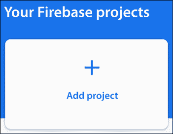

图 6.4 – 创建新的 Firebase 项目

1.  为你的项目输入一个名称，然后点击**继续**按钮：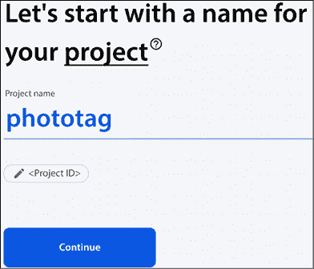

    图 6.5 – 输入项目名称

    Firebase 为你的项目生成一个唯一的标识符，它位于项目名称下方，并在各种 Firebase 服务中使用。

1.  禁用此项目的**Google Analytics**并点击**创建项目**按钮：

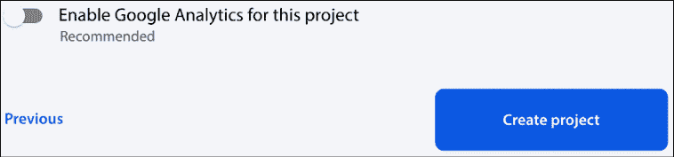

图 6.6 – 禁用 Google Analytics

1.  等待创建新项目并点击**继续**按钮。您将被重定向到您的新项目仪表板，其中包含一系列选项：

    图 6.7 – 选择应用程序类型

    点击带有*代码*图标的第三个选项，将 Firebase 添加到 Web 应用程序中。

1.  在**应用昵称**字段中输入您的应用程序名称，然后点击**注册应用**按钮：

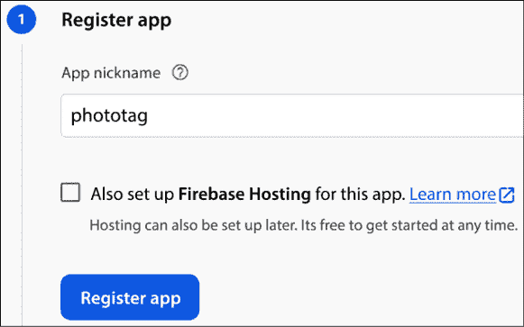

图 6.8 – 应用程序注册

1.  Firebase 将生成一个配置，我们将在后面的移动应用程序中使用：

    ```js
    const firebaseConfig = {
      apiKey: "<Your API key>",
      authDomain: "<Your project auth domain>",
      projectId: "<Your project ID>",
      storageBucket: "<Your storage bucket>",
      messagingSenderId: "<Your messaging sender ID>",
      appId: "<Your application ID>"
    }; 
    ```

    复制`firebaseConfig`对象并点击**继续到控制台**按钮。

    Firebase 配置也可以在`https://console.firebase.google.com/project/<project-id>/settings/general`处稍后访问，其中`project-id`是您的 Firebase 项目 ID。

1.  在仪表板控制台中，选择**Cloud Firestore**选项以在您的应用程序中启用 Cloud Firestore。

1.  点击**创建数据库**按钮以创建一个新的 Cloud Firestore 数据库：


图 6.9 – 创建数据库

1.  选择数据库的操作模式。为了开发目的，选择**以测试模式启动**并点击**下一步**按钮：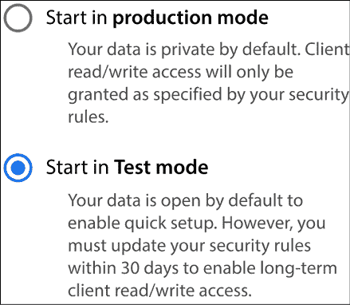

    图 6.10 – 选择操作模式

    选择模式相当于为您的数据库设置规则。测试模式允许快速设置，并保持您的数据公开 30 天。当您准备好将应用程序移入生产时，您可以相应地修改数据库规则以使您的数据私有。

1.  根据您的区域设置选择数据库的位置，然后点击**启用**按钮。

恭喜！您已创建了一个新的 Cloud Firestore 数据库。在下一节中，我们将学习如何使用新的数据库通过我们的移动应用程序保存数据。

## 集成 AngularFire 库

AngularFire 库是一个 Angular 库，我们可以在 Angular 应用程序中使用它来与 Firebase 家族产品（如 Cloud Firestore 和存储服务）交互。要在我们的应用程序中安装它：

1.  在终端窗口中运行以下命令以安装**Firebase 工具**：

    ```js
    npm install -g firebase-tools 
    ```

1.  在相同的终端窗口中运行以下命令以使用 Firebase CLI 进行身份验证：

    ```js
    firebase login 
    ```

1.  最后，运行以下 Angular CLI 命令以在您的 Angular CLI 项目中安装`@angular/fire`npm 包：

    ```js
    ng add @angular/fire 
    ```

    上述命令将找到库的最新版本，并提示我们安装它。

1.  首先，它会询问我们想要启用 Firebase 的哪些功能：

    ```js
    ? What features would you like to setup? 
    ```

    确保只选择 **Firestore** 选项并按 *Enter*。

1.  然后，它将询问我们想要使用哪个 Firebase 账户：

    ```js
    ? Which Firebase account would you like to use? 
    ```

    确保选择你之前使用的账户，并按 *Enter*。

1.  在下一个问题中，我们将选择我们将要使用 Firestore 的项目：

    ```js
    ? Please select a project: 
    ```

    选择我们之前创建的 `phototag` 项目并按 *Enter*。

1.  最后，我们必须选择已启用 Firestore 的应用程序：

    ```js
    ? Please select an app: 
    ```

    选择我们之前创建的 `phototag` 应用程序并按 *Enter*。

    前面的命令可能会抛出一个错误，表明 `app.module.ts` 文件不存在。请忽略它并继续下一步。

1.  打开 `main.ts` 文件并添加以下 `import` 语句：

    ```js
    import { provideFirebaseApp, initializeApp } from '@angular/fire/app';
    import { getFirestore, provideFirestore } from '@angular/fire/firestore';
    import { getStorage, provideStorage } from '@angular/fire/storage'; 
    ```

1.  最后，修改 `bootstrapApplication` 方法中的 `providers` 数组如下：

    ```js
    bootstrapApplication(AppComponent, {
      providers: [
        { provide: RouteReuseStrategy, useClass: IonicRouteStrategy },
        importProvidersFrom(IonicModule.forRoot({})),
        provideRouter(routes),
     **importProvidersFrom(****provideFirebaseApp****(****() =>****initializeApp****(<firebaseConfig>))),**
     **importProvidersFrom(****provideFirestore****(****() =>****getFirestore****())),**
     **importProvidersFrom(****provideStorage****(****() =>****getStorage****()))**
      ]
    }); 
    ```

将 `<firebaseConfig>` 替换为你在上一节中复制的 Firebase 配置对象。

现在我们来看看我们如何在应用程序中使用 AngularFire 库：

1.  打开 `photo.service.ts` 文件并添加以下 `import` 语句：

    ```js
    import { Firestore, collection, addDoc } from '@angular/fire/firestore';
    import { Storage, ref, uploadString, getDownloadURL } from '@angular/fire/storage'; 
    ```

    `Firestore` 服务包含我们与 Cloud Firestore 数据库交互所需的所有必要方法。`Storage` 服务包含将文件上传到存储服务的方法。

1.  将这两个服务注入到 `PhotoService` 类的 `constructor` 中：

    ```js
    constructor(**private** **firestore: Firestore,** **private** **storage: Storage**) {} 
    ```

1.  创建以下方法以在 Firebase 中保存照片：

    ```js
    private async savePhoto(dataUrl: string, latitude: number, longitude: number) {
      const name = new Date().getUTCMilliseconds().toString();
      const storageRef = ref(this.storage, name);
      await uploadString(storageRef, dataUrl, 'data_url');
      const photoUrl = await getDownloadURL(storageRef);
      const photoCollection = collection(this.firestore, 'photos');
      await addDoc(photoCollection, {
        url: photoUrl,
        lat: latitude,
        lng: longitude
      })
    } 
    ```

    首先，我们为我们的照片创建一个随机的 `name`，并使用 `uploadString` 方法将其上传到 Firebase 存储中。一旦上传完成，我们使用 `getDownloadURL` 方法获取可下载的 URL，该 URL 可用于访问该照片。最后，我们使用 `addDoc` 方法将新照片添加到 Firestore 数据库的 `photocollection` 属性中。

1.  修改 `takePhoto` 方法以调用我们在上一步中创建的 `savePhoto` 方法：

    ```js
    async takePhoto() {
      **const** **{latitude, longitude} =** await this.getLocation();
      **const** **cameraPhoto =** await Camera.getPhoto({
        resultType: CameraResultType.DataUrl,
        source: CameraSource.Camera,
        quality: 100
      });
    **if** **(cameraPhoto.****dataUrl****) {**
    **await****this****.****savePhoto****(cameraPhoto.****dataUrl****, latitude, longitude);**
     **}**
    } 
    ```

我们现在可以检查照片拍摄过程的完整功能：

1.  运行以下 Capacitor 命令以将应用程序包复制到原生移动项目中：

    ```js
    ionic cap copy 
    ```

1.  使用 Capacitor 的 `open` 命令打开原生移动项目，并使用相应的 IDE 运行项目。

1.  打开应用程序的 Firebase 控制台，并在 **构建** 部分中选择 **存储** 选项。点击 **开始** 按钮，选择 **以测试模式开始** 选项，然后点击 **下一步**。最后，点击 **完成** 以完成设置云存储的过程。

1.  使用应用程序拍摄一张好照片。为了验证你的照片是否已成功上传到 Firebase，请刷新 Firebase 控制台中的页面。你应该会看到一个如下条目：

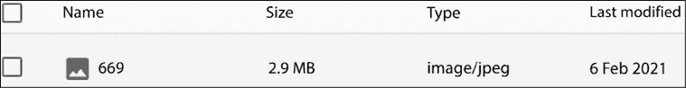

图 6.11 – Firebase 存储

1.  类似地，在 **构建** 部分中选择 **Firestore 数据库** 选项，你应该会看到以下内容：

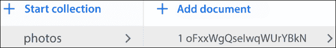

图 6.12 – Cloud Firestore

在前面的屏幕截图中，`1oFxxWgQseIwqWUrYBkN`条目是包含实际文件 URL 及其位置数据的照片的逻辑对象。

我们应用的第一页现在功能完整。我们已经完成了从拍摄和上传照片到 Firebase，包括其位置数据的全过程。我们首先设置和配置了 Firebase 项目，最后通过学习如何使用 AngularFire 库与该项目交互来完成。在下一节中，我们将通过实现应用的第二页来达到最终目标。

# 使用 CesiumJS 预览照片

我们应用的下个功能将是将我们用相机拍摄的所有照片显示在 3D 地图上。CesiumJS 库提供了一个带有 3D 地球仪的查看器，我们可以用它来可视化各种事物，例如特定位置上的图像。我们应用的新功能将包括以下内容：

+   配置 CesiumJS

+   在查看器上显示照片

我们将首先学习如何设置 CesiumJS 库。

## 配置 CesiumJS

CesiumJS 库是一个我们可以安装的 npm 包，用于开始使用 3D 地图和可视化：

1.  运行以下`npm`命令来安装 CesiumJS：

    ```js
    npm install cesium 
    ```

1.  打开`angular.json`配置文件，并在`build`架构师选项的`assets`数组中添加以下条目：

    ```js
    {
      "glob": "**/*",
      "input": "node_modules/cesium/Build/Cesium/Workers",
      "output": "/assets/cesium/Workers"
    },
    {
      "glob": "**/*",
      "input": "node_modules/cesium/Build/Cesium/ThirdParty",
      "output": "/assets/cesium/ThirdParty"
    },
    {
      "glob": "**/*",
      "input": "node_modules/cesium/Build/Cesium/Assets",
      "output": "/assets/cesium/Assets"
    },
    {
      "glob": "**/*",
      "input": "node_modules/cesium/Build/Cesium/Widgets",
      "output": "/assets/cesium/Widgets"
    } 
    ```

    上述条目将把所有 CesiumJS 源文件复制到应用`assets`文件夹内的`cesium`文件夹中。

1.  还要将 CesiumJS 小部件样式表文件添加到`build`部分的`styles`数组中：

    ```js
    "styles": [
      **"node_modules/cesium/Build/Cesium/Widgets/widgets.css"****,**
      "src/theme/variables.scss",
      "src/global.scss"
    ] 
    ```

    CesiumJS 的查看器包含一个带有小部件的工具栏，包括搜索栏和下拉菜单以选择特定类型的地图，例如 Bing Maps 或 Mapbox。

1.  打开我们应用的主入口点文件`main.ts`，并添加以下行：

    ```js
    (window as Record<string, any>)['CESIUM_BASE_URL'] = '/assets/cesium/'; 
    ```

    `CESIUM_BASE_URL`全局变量指示 CesiumJS 源文件的位置。

1.  使用以下`npm`命令安装自定义 webpack 构建器：

    ```js
    npm install -D @angular-builders/custom-webpack 
    ```

    **构建器**是一个扩展 Angular CLI 默认功能的 Angular 库。`@angular-builders/custom-webpack`构建器允许我们在构建应用时提供额外的 webpack 配置文件。在需要包含其他 webpack 插件或覆盖现有功能的情况下，这非常有用。

1.  在项目的根文件夹中创建一个名为`extra-webpack.config.js`的新 webpack 配置文件，并添加以下内容：

    ```js
    module.exports = {
      resolve: {
        fallback: {
          "https": false,
          "zlib": false,
          "http": false,
          "url": false
        }
      },
      module: {
        unknownContextCritical: false
      }
    }; 
    ```

    配置文件将确保 webpack 只会尝试加载它能够理解的 CesiumJS 代码。CesiumJS 使用一种格式，无法使用 webpack 进行静态分析。

1.  打开`angular.json`文件，并将`build`架构师部分的`builder`属性更改为使用自定义 webpack 构建器：

    ```js
    "builder": "**@angular-builders/custom-webpack:browser**" 
    ```

1.  在`build`部分的`options`属性中定义自定义 webpack 配置文件的路径：

    ```js
    "customWebpackConfig": {
      "path": "./extra-webpack.config.js"
    } 
    ```

1.  还要配置`serve`架构师部分以使用自定义 webpack 构建器：

    ```js
    "serve": {
      "builder": "**@angular-builders/custom-webpack:dev-server**",
      "configurations": {
        "production": {
          "browserTarget": "app:build:production"
        },
        "development": {
          "browserTarget": "app:build:development"
        },
        "ci": {
          "progress": false
        }
      },
      "defaultConfiguration": "development"
    } 
    ```

现在我们已经完成了 CesiumJS 库的配置，我们可以开始创建我们功能的页面：

1.  使用以下 Ionic CLI 命令创建一个新的页面：

    ```js
    ionic generate page view 
    ```

1.  打开`view.page.html`文件并修改第一个`<ion-header>`元素，使其包含一个菜单切换按钮：

    ```js
    <ion-header [translucent]="true">
      <ion-toolbar>
        **<****ion-buttons****slot****=****"start"****>**
    **<****ion-menu-button****color****=****"primary"****></****ion-menu-button****>**
    **</****ion-buttons****>**
        <ion-title>**View gallery**</ion-title>
      </ion-toolbar>
    </ion-header> 
    ```

1.  修改`<ion-content>`元素标题，并添加一个`<div>`元素作为我们的查看器容器：

    ```js
    <ion-content [fullscreen]="true">
      <ion-header collapse="condense">
        <ion-toolbar>
          <ion-title size="large">**View gallery**</ion-title>
        </ion-toolbar>
      </ion-header>
      **<****div****#mapContainer****></****div****>**
    </ion-content> 
    ```

    `#mapContainer`是我们用来在模板中声明元素别名的**模板引用变量**。

1.  打开`view.page.scss`文件并设置地图容器元素的大小：

    ```js
    div {
      height: 100%;
      width: 100%;
    } 
    ```

1.  让我们现在创建我们的查看器。打开`view.page.ts`文件并按以下方式修改它：

    ```js
    import { **AfterViewInit**, Component, **ElementRef**, OnInit, **ViewChild** } from '@angular/core';
    import { CommonModule } from '@angular/common';
    import { FormsModule } from '@angular/forms';
    import { IonicModule } from '@ionic/angular';
    **import** **{** **Viewer** **}** **from****'cesium'****;**
    @Component({
      selector: 'app-view',
      templateUrl: './view.page.html',
      styleUrls: ['./view.page.scss'],
      standalone: true,
      imports: [IonicModule, CommonModule, FormsModule]
    })
    export class ViewPage implements OnInit, **AfterViewInit** {
    **@ViewChild****(****'mapContainer'****)** **content****:** **ElementRef** **|** **undefined****;**
      constructor() { }
      ngOnInit() {
      }
      **ngAfterViewInit****() {**
    **const** **viewer =** **new****Viewer****(****this****.****content****?.****nativeElement****);**
     **}**
    } 
    ```

    我们在组件的`ngAfterViewInit`方法内部创建一个新的`Viewer`对象。`ngAfterViewInit`方法在组件视图加载完成后被调用，它定义在`AfterViewInit`接口中。`Viewer`类的构造函数接受一个参数，即我们想要在上面创建查看器的原生 HTML 元素。在我们的情况下，我们想要将其附加到我们之前创建的地图容器元素上。因此，我们使用`@ViewChild`装饰器通过传递模板引用变量名称作为参数来引用该元素。

1.  使用`ionic serve`运行应用程序，并从主菜单点击**查看相册**选项。你应该看到以下输出：

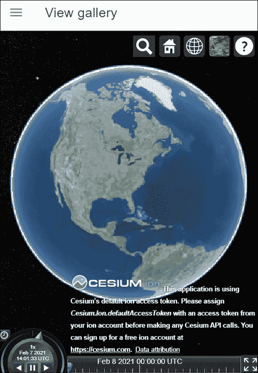

图 6.13 – 查看相册页面

我们现在已成功在我们的应用程序中配置了 CesiumJS 库。在下一节中，我们将看到如何从中受益并在 CesiumJS 查看器的 3D 地球上显示我们的照片。

## 在查看器上显示照片

为了使我们的应用程序准备就绪，我们需要做的下一件事是在地图上显示我们的照片。我们将从 Firebase 获取所有照片并将它们添加到查看器中指定的位置。让我们看看我们如何实现这一点：

1.  使用以下 Ionic CLI 命令创建一个新的 Angular 服务：

    ```js
    ionic generate service cesium 
    ```

1.  打开`cesium.service.ts`文件并添加以下`import`语句：

    ```js
    import { Firestore, collection, getDocs } from '@angular/fire/firestore';
    import { Cartesian3, Color, PinBuilder, Viewer } from 'cesium';
    import { Observable } from 'rxjs';
    import { map } from 'rxjs/operators'; 
    ```

1.  在`CesiumService`类的`constructor`中注入`Firestore`服务并创建一个`viewer`属性，我们将使用它来存储我们的`Viewer`对象：

    ```js
    export class CesiumService {
      **private****viewer****:** **Viewer** **|** **undefined****;**
      constructor(**private** **firestore: Firestore**) { }
    } 
    ```

1.  创建一个`register`方法来设置`viewer`属性：

    ```js
    register(viewer: Viewer) {
      this.viewer = viewer;
    } 
    ```

1.  创建一个方法来从 Cloud Firestore 获取`photos`集合：

    ```js
    private async getPhotos() {
      const photoCollection = collection(this.firestore, 'photos');
      return await getDocs(photoCollection);
    } 
    ```

    在前面的方法中，我们调用`getDocs`方法来获取`photos`集合的数据。

1.  为添加所有照片到查看器创建以下方法：

    ```js
    async addPhotos() {
      const pinBuilder = new PinBuilder();
      const photos = await this.getPhotos();
      photos.forEach(photo => {
        const entity = {
          position: Cartesian3.fromDegrees(photo.get('lng'), photo.get('lat')),
          billboard: {
            image: pinBuilder.fromColor(Color.fromCssColorString('#de6b45'), 48).toDataURL()
          },
          description: ``
        };
        this.viewer?.entities.add(entity);
      });
    } 
    ```

    在查看器中，每张照片的位置将以**标记**的形式显示。因此，我们首先需要初始化一个 `PinBuilder` 对象。前面的方法调用 `getPhotos` 方法从 Cloud Firestore 获取所有照片。对于每张照片，它创建一个包含 `position` 的 `entity` 对象，这是照片在度数中的位置，以及一个显示 48 像素大小标记的 `billboard` 属性。它还定义了一个 `description` 属性，当点击标记时将显示照片的实际图像。

    每个 `entity` 对象都通过其 `add` 方法添加到查看器的 `entities` 集合中。

1.  每张照片的描述都显示在**信息框**内。打开包含应用程序全局样式的 `global.scss` 文件，并为信息框添加以下 CSS 样式：

    ```js
    .cesium-infoBox, .cesium-infoBox-iframe {
      height: 100% !important;
      width: 100%;
    } 
    ```

1.  现在，让我们使用页面中的 `CesiumService`。打开 `view.page.ts` 文件，并将 `CesiumService` 类注入到 `ViewPage` 类的 `constructor` 中：

    ```js
    import { AfterViewInit, Component, ElementRef, OnInit, ViewChild } from '@angular/core';
    import { CommonModule } from '@angular/common';
    import { FormsModule } from '@angular/forms';
    import { IonicModule } from '@ionic/angular';
    import { Viewer } from 'cesium';
    **import** **{** **CesiumService** **}** **from****'../cesium.service'****;**
    @Component({
      selector: 'app-view',
      templateUrl: './view.page.html',
      styleUrls: ['./view.page.scss'],
      standalone: true,
      imports: [IonicModule, CommonModule, FormsModule]
    })
    export class ViewPage implements OnInit, AfterViewInit {
      @ViewChild('mapContainer') content: ElementRef | undefined;
      constructor(**private** **cesiumService: CesiumService**) { }
      ngOnInit() {
      }
      ngAfterViewInit() {
        const viewer = new Viewer(this.content?.nativeElement);
      }
    } 
    ```

1.  修改 `ngAfterViewInit` 方法以注册查看器并添加照片：

    ```js
    ngAfterViewInit() {
    **this****.****cesiumService****.****register****(****new****Viewer****(****this****.****content****?.****nativeElement****));**
    **this****.****cesiumService****.****addPhotos****();**
    } 
    ```

我们现在可以查看地图上的照片了：

1.  使用 `ionic serve` 命令运行应用程序。

1.  使用应用程序拍摄漂亮的照片，最好在不同的地点。

1.  从主菜单中选择**查看相册**选项，你应该得到以下输出：

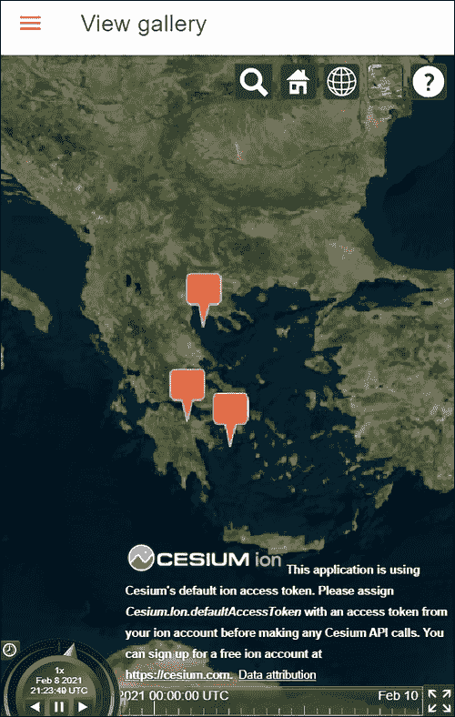

图 6.14 – 地图上的照片

1.  点击地图上的一个标记，你应该能看到你的照片：

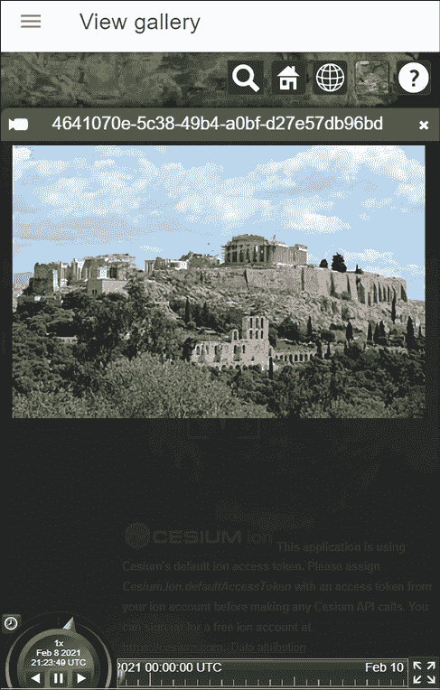

图 6.15 – 照片显示

现在我们有一个完整的移动应用程序，用于拍摄带有地理标记的照片并在地图上显示它们。我们看到了如何设置 CesiumJS 库并从 Cloud Firestore 获取我们的照片。CesiumJS 查看器的 API 为我们在地图上可视化照片和与之交互提供了简单的方法。

# 摘要

在本章中，我们构建了一个用于拍照、标记当前位置并在 3D 地图上显示照片的移动应用程序。最初，我们学习了如何使用 Ionic 框架创建新的移动应用程序。我们在本地构建了应用程序，并集成了 Capacitor 以与相机和 GPS 设备交互。相机用于拍照，GPS 用于标记位置。

之后，我们使用了 Firebase 服务将我们的照片文件和数据存储在云端。最后，我们学习了如何从 Firebase 检索存储的照片，并使用 CesiumJS 库在 3D 球上显示它们。

在下一章中，我们将探讨在 Angular 中预渲染内容的另一种方法。我们将使用服务器端渲染技术来创建一个 GitHub 站点。

# 实践问题

1.  我们可以使用哪个工具包在 Capacitor 应用中创建 UI？

1.  在 Capacitor 应用中，我们使用哪种方法用相机拍照？

1.  在 Capacitor 应用中，我们如何读取当前的位置？

1.  我们如何使用 Ionic 添加菜单切换按钮？

1.  我们使用哪个 Capacitor 命令来同步应用程序包与原生移动项目？

1.  在 Cloud Firestore 中，测试模式和发布模式有什么区别？

1.  我们如何使用 AngularFire 库初始化应用程序？

1.  我们使用哪种方法从 Cloud Firestore 集合中获取数据？

1.  我们如何使用 CesiumJS 库创建一个标记？

1.  我们如何使用 CesiumJS 将经纬度转换为度？

# 进一步阅读

+   开始使用 Capacitor：[`capacitorjs.com/docs/getting-started`](https://capacitorjs.com/docs/getting-started)

+   Capacitor 的 Android 入门指南：[`capacitorjs.com/docs/android#getting-started`](https://capacitorjs.com/docs/android#getting-started)

+   Capacitor 的 iOS 入门指南：[`capacitorjs.com/docs/ios#getting-started`](https://capacitorjs.com/docs/ios#getting-started )

+   使用 Ionic 进行 Angular 开发：[`ionicframework.com/docs/angular/overview`](https://ionicframework.com/docs/angular/overview)

+   AngularFire 库文档：[`firebaseopensource.com/projects/angular/angularfire2`](https://firebaseopensource.com/projects/angular/angularfire2)

+   CesiumJS 快速入门指南：[`cesium.com/docs/tutorials/quick-start`](https://cesium.com/docs/tutorials/quick-start)

+   CesiumJS 和 Angular 文章：[`cesium.com/blog/2018/03/12/cesium-and-angular`](https://cesium.com/blog/2018/03/12/cesium-and-angular)

# 加入我们的 Discord 社区

加入我们社区的 Discord 空间，与作者和其他读者进行讨论：

[`packt.link/AngularProjects3e`](https://packt.link/AngularProjects3e)


