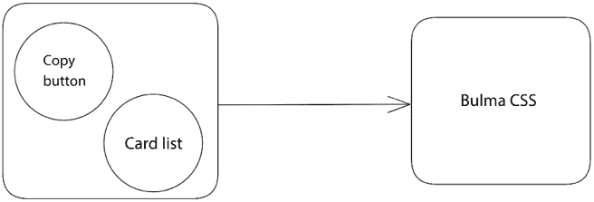
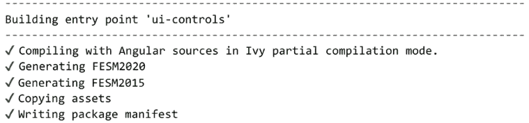
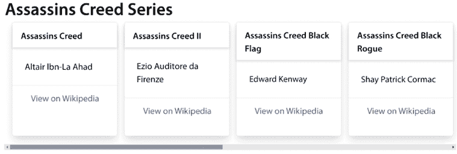
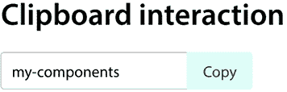
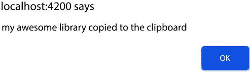
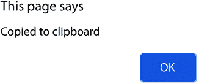

# 第九章：使用 Angular CLI 和 Angular CDK 构建组件 UI 库

一个 Angular 应用程序由 Angular 组件组成，这些组件组织成模块。当组件需要在模块之间共享相似的外观或行为时，我们将提取其功能到可重用组件中，并将它们分组到一个共享模块中。可重用组件可能从具有许多控件（如表单）的复杂 UI 结构到单个原生 HTML 元素（如按钮）不等。

组件 UI 库是一组可重用组件的集合，可以在特定应用领域之外使用。一个使用 monorepo 架构构建的大型企业应用程序可以在其所有应用程序中使用这些组件。组织外部的项目也可以使用相同的组件库作为外部依赖项。

Angular CLI 包含创建 Angular 库所需的所有工具。Angular **组件开发工具包**（**CDK**）提供了一系列用于创建可访问性和高性能 UI 组件的功能。在本章中，我们将结合**Bulma**，一个现代 CSS 框架，从头开始创建一个简单的组件 UI 库。

在本章中，我们将更详细地介绍以下主题：

+   使用 Angular CLI 创建库

+   构建可拖拽的卡片列表

+   与剪贴板交互

+   将 Angular 库发布到`npm`

+   使用组件作为**Angular 元素**

# 必要的背景理论和上下文

Angular CDK 包含了一系列常见的交互和行为，我们可以将其应用于 Angular 组件。它是 Angular Material 库的核心，但也可以与 Angular 应用程序中的任何 CSS 框架一起使用。Angular CDK 可以从`@angular/cdk` npm 包中获取。

Angular CLI 支持开箱即用创建 Angular 库。Angular 库的功能只能在 Angular 应用程序中使用，并且与特定业务逻辑解耦。如果我们想在非 Angular 应用程序中使用 Angular 库，我们必须将其转换为 Angular 元素。

**自定义元素**是一个网络标准，允许创建独立于任何 JavaScript 框架的 HTML 元素。它通过声明一个自定义 HTML 标签并将其与一个 JavaScript 类关联来实现。浏览器可以识别 HTML 标签并执行类内部定义的 JavaScript 代码。

Angular 元素是使用`@angular/elements`库将 Angular 组件转换为自定义元素。将 Angular 组件打包为自定义元素将 Angular 框架与元素的 DOM 连接起来，通过数据绑定、组件生命周期和变更检测功能来丰富它。

# 项目概述

在这个项目中，我们将为我们的 Angular 项目构建一个组件 UI 库。最初，我们将使用 Angular CLI 为我们的库搭建一个新的 Angular 工作空间。然后，我们将使用 Angular CDK 和 Bulma CSS 框架来创建以下组件：

+   一份我们可以使用拖放功能重新排列的卡片列表

+   一个按钮，允许我们将任意内容复制到剪贴板

我们将学习如何将库部署到包注册库，如**npm**。最后，我们将使用`ngx-build-plus`库将我们的一个组件转换为 Angular 元素，以便与非 Angular 应用程序共享。以下图表提供了项目的架构概述：



图 9.1 – 项目架构

构建时间：1½小时

# 入门

完成此项目所需的以下先决条件和软件工具：

+   Angular CLI：一个用于 Angular 的 CLI，您可以在[`angular.io/cli`](https://angular.io/cli)找到。

+   GitHub 材料：本章的相关代码可以在[`github.com/PacktPublishing/Angular-Projects-Third-Edition`](https://github.com/PacktPublishing/Angular-Projects-Third-Edition)的`Chapter09`文件夹中找到。

# 使用 Angular CLI 创建库

在我们能够开始使用 Angular CLI 工作与 Angular 库之前，我们需要创建一个 Angular CLI 工作区。这个 Angular CLI 工作区将包含我们的 Angular 库以及一个用于测试库的 Angular 应用程序。

使用以下命令来生成一个新的 Angular CLI 工作区：

```js
ng new my-components --defaults 
```

上述命令将创建一个新的 Angular CLI 工作区，其中包含一个名为`my-components`的 Angular 应用程序。导航到`my-components`文件夹，并执行以下命令以生成一个新的 Angular 库：

```js
ng generate library ui-controls 
```

上述命令将在工作区的`projects`文件夹内创建一个`ui-controls`库。它将包含与创建 Angular 应用程序时类似的文件和文件夹，包括以下内容：

+   `src\lib`: 这包含库的源代码，例如模块、组件和服务。

+   `src\public-api.ts`: 这导出我们从库中想要在其他 Angular 应用程序中公开的工件。

+   `ng-package.json`: 这包含了一个配置文件，用于 Angular CLI 在底层构建库时使用的`ng-packagr`库。

+   `tsconfig.lib.json`: 我们库的 TypeScript 配置文件，它还包含几个 Angular 编译器选项。

+   `tsconfig.lib.prod.json`: 当我们在生产模式下构建库时使用的 TypeScript 配置文件。

默认情况下，Angular CLI 会为我们生成一个模块、一个组件和一个服务，存放在`src\lib`文件夹中。它还会将它们导出，以便任何将使用该库的 Angular 应用程序都可以使用。这里有一个例子：

```js
`public-api.ts`
/*
* Public API Surface of ui-controls
*/
export * from './lib/ui-controls.service';
export * from './lib/ui-controls.component';
export * from './lib/ui-controls.module'; 
```

现在我们已经设置了 Angular CLI 工作区，我们可以继续安装 Bulma 和 Angular CDK 库，如下所示：

1.  执行以下命令来安装 Angular CDK：

    ```js
    npm install @angular/cdk 
    ```

1.  运行以下命令来安装 Bulma CSS 框架：

    ```js
    npm install bulma 
    ```

1.  打开 `angular.json` 配置文件，并将 Bulma 库的 CSS 样式表文件添加到 `build` 架构条目的 `styles` 部分中，如下所示：

    ```js
    "options": {
      "outputPath": "dist/my-components",
      "index": "src/index.html",
      "main": "src/main.ts",
      "polyfills": [
        "zone.js"
      ],
      "tsConfig": "tsconfig.app.json",
      "assets": [
        "src/favicon.ico",
        "src/assets"
      ],
      "styles": [
        "src/styles.css",
        **"****./node_modules/bulma/css/bulma.css"**
      ],
      "scripts": []
    } 
    ```

1.  打开 `projects\ui-controls` 文件夹中的 `package.json` 文件，并相应地进行修改：

    ```js
    {
      "name": "ui-controls",
      "version": "0.0.1",
      "peerDependencies": {
        "@angular/common": "¹⁶.0.0",
        "@angular/core": "¹⁶.0.0",
        **"@angular/cdk"****:****"¹⁶.0.3"****,**
    **"bulma"****:****"⁰.9.4"**
      },
      "dependencies": {
        "tslib": "².3.0"
      },
      "sideEffects": false
    } 
    ```

我们将 Angular CDK 和 Bulma 库添加到 `peerDependencies` 部分以确保任何消费应用程序都有特定版本的包来运行我们的库。

如果您跟随此项目，每个包的版本号可能会有所不同。为确保您拥有正确的版本，请从工作区根目录的 `package.json` 文件中复制它们。

我们现在已经完成了 UI 组件库的基本设置。我们还配置了 Angular CLI 工作区中附带的应用程序，以预览和测试库。在下一节中，我们将构建库的第一个组件——一个可重新排序的卡片列表。

# 构建可拖动卡片列表

我们 UI 库的第一个组件将是一个 Bulma 卡片元素的列表。每个卡片将显示一个标题、一个描述和一个锚点链接元素。我们还将能够使用 Angular CDK 拖动卡片并改变卡片列表的顺序。构建我们的组件将包括以下任务：

+   显示卡片数据

+   添加拖放功能

在下一节中，我们将首先了解如何在卡片列表上显示数据。

## 显示卡片数据

我们的 Angular 应用程序应将卡片列表作为输入属性传递给组件以显示它们。让我们看看如何创建一个可拖动的卡片组件，如下所示：

1.  执行以下 Angular CLI 命令来创建一个 Angular 组件：

    ```js
    ng generate component card-list --project=ui-controls --export 
    ```

    上述命令将在 Angular CLI 工作区的 `ui-controls` 项目中创建一个 `card-list` 组件。`--export` 选项还将从 `UiControlsModule` 中导出组件。

    `UiControlsModule` 类已经从 `public-api.ts` 文件中导出。因此，当我们的 Angular 应用程序导入 `UiControlsModule` 时，它也将拥有我们的组件。

1.  使用 Angular CLI 的 `generate` 命令创建一个用于卡片数据结构的接口，如下所示：

    ```js
    ng generate interface card --project=ui-controls 
    ```

1.  上述命令将在我们的工作区 `ui-controls` 项目中创建一个 `card.ts` 文件。

1.  打开 `card.ts` 文件，并将以下属性添加到 `Card` 接口中：

    ```js
    export interface Card {
      **title****:** **string****;**
    **description****:** **string****;**
    **link****:** **string****;**
    } 
    ```

1.  打开 `public-api.ts` 文件，并添加以下 `export` 语句，以便将组件和接口提供给库消费者：

    ```js
    export * from './lib/card-list/card-list.component';
    export * from './lib/card'; 
    ```

1.  打开 `card-list.component.ts` 文件，并使用 `@Input` 装饰器定义一个 `input` 属性，如下所示：

    ```js
    import { Component, **Input** } from '@angular/core';
    **import** **{** **Card** **}** **from****'****../card'****;**
    @Component({
      selector: 'lib-card-list',
      templateUrl: './card-list.component.html',
      styleUrls: ['./card-list.component.css']
    })
    export class CardListComponent {
    **@Input****()** **cards****:** **Card****[] = [];**
    } 
    ```

    `cards` 属性将在稍后由 Angular 应用程序设置，以显示我们想要显示的卡片数据。

1.  打开 `card-list.component.html` 文件，并用以下 HTML 模板替换其内容：

    ```js
    <div>
      <div class="card m-4" *ngFor="let card of cards">
        <header class="card-header">
          <p class="card-header-title">{{card.title}}</p>
        </header>
        <div class="card-content">
          <div class="content">{{card.description}}</div>
        </div>
        <footer class="card-footer">
          <a [href]="card.link" class=
            "card-footer-item">View on Wikipedia</a>
        </footer>
      </div>
    </div> 
    ```

    之前使用的模板使用了 Bulma 的 `card` 组件，并通过遍历 `cards` 组件属性来显示每一个，使用 `*ngFor` 指令。

1.  打开 `card-list.component.css` 文件，并添加以下 CSS 样式：

    ```js
    :host > div {
      display: grid;
      grid-auto-flow: column;
      overflow: auto;
    }
    .card {
      width: 200px;
    } 
    ```

    在前面的样式表中，我们使用 `:host` 选择器来定位组件的 `host` 元素中的 `div` 元素，并应用 `grid` 样式以在单行中显示所有卡片。

1.  打开 `ui-controls.module.ts` 文件，并将 `CommonModule` 添加到 `@NgModule` 装饰器的 `imports` 数组中，如下所示：

    ```js
    **import** **{** **CommonModule** **}** **from****'****@angular/common'****;**
    import { NgModule } from '@angular/core';
    import { UiControlsComponent } from './ui-controls.component';
    import { CardListComponent } from './card-list/card-list.component';
    @NgModule({
      declarations: [
        UiControlsComponent,
        CardListComponent
      ],
      imports: [
        **CommonModule**
      ],
      exports: [
        UiControlsComponent,
        CardListComponent
      ]
    })
    export class UiControlsModule { } 
    ```

    `CommonModule` 类对于卡片列表组件模板中的 `*ngFor` 指令是必需的。

我们的可组件已经准备好接受并显示以卡片列表形式呈现的数据。让我们看看如何从 Angular 应用程序中消费它，如下所示：

1.  首先，执行以下命令来构建组件 UI 库：

    ```js
    ng build ui-controls 
    ```

    Angular CLI 将开始构建库，一旦你在终端上看到以下输出，它就已经完成：

    

    图 9.2 – 图书馆构建输出

1.  打开 `app.module.ts` 文件，并将 `UiControlsModule` 类添加到 `@NgModule` 装饰器的 `imports` 数组中，如下所示：

    ```js
    import { NgModule } from '@angular/core';
    import { BrowserModule } from '@angular/platform-browser';
    import { AppComponent } from './app.component';
    **import** **{** **UiControlsModule** **}** **from****'ui-controls'****;**
    @NgModule({
      declarations: [
        AppComponent
      ],
      imports: [
        BrowserModule,
        **UiControlsModule**
      ],
      providers: [],
      bootstrap: [AppComponent]
    })
    export class AppModule { } 
    ```

    我们从 `ui-controls` 命名空间导入 `UiControlsModule`，这是库的名称，而不是从我们的工作区中的完整绝对路径导入。

1.  打开 `app.component.ts` 文件，并声明一个 `Card[]` 类型的 `component` 属性，如下所示：

    ```js
    import { Component } from '@angular/core';
    **import** **{** **Card** **}** **from****'ui-controls'****;**
    **import** **{ assassins }** **from****'****./assassins'****;**
    @Component({
      selector: 'app-root',
      templateUrl: './app.component.html',
      styleUrls: ['./app.component.css']
    })
    export class AppComponent {
      title = 'my-components';
    **cards****:** **Card****[] = assassins;**
    } 
    ```

    我们使用来自 `assassins.ts` 文件中的示例数据初始化 `cards` 组件属性，该文件可以在 *入门* 部分的 GitHub 仓库中找到。

1.  打开 `app.component.html` 文件，并用以下 HTML 模板替换其内容：

    ```js
    <div class="container is-fluid">
      <h1 class="title">Assassins Creed Series</h1>
      <lib-card-list [cards]="cards"></lib-card-list>
    </div> 
    ```

1.  要预览应用程序，请运行 `ng serve` 并在浏览器中打开 `http://localhost:4200`。你应该会看到如下内容：



图 9.3 – 卡片列表组件

卡片列表组件显示消费者应用程序通过 `cards` 输入属性传递的数据。在下一节中，我们将进一步扩展我们的组件，使卡片能够在列表中改变它们的位置。

## 添加拖放功能

卡片列表组件的一个特性是，我们将能够通过拖放卡片到列表中来改变卡片的位置。应该使用输出属性绑定将卡片列表的顺序返回给消费者应用程序。

Angular CDK 包含一个拖放模块，我们可以用它来实现这个目的。为此，请按照以下步骤操作：

1.  打开 `ui-controls.module.ts` 文件，并从 `@angular/cdk/drag-drop` 命名空间导入 `DragDropModule`，如下所示：

    ```js
    import { DragDropModule } from '@angular/cdk/drag-drop'; 
    ```

1.  将 `DragDropModule` 类添加到 `@NgModule` 装饰器的 `imports` 数组中，如下所示：

    ```js
    @NgModule({
      declarations: [
        UiControlsComponent,
        CardListComponent
      ],
      imports: [
        CommonModule,
        **DragDropModule**
      ],
      exports: [
        UiControlsComponent,
        CardListComponent
      ]
    }) 
    ```

1.  打开 `card-list.component.html` 文件，并按如下方式修改模板：

    ```js
    <div **cdkDropListOrientation****=****"horizontal"****cdkDropList** **(****cdkDropListDropped****)=****"sortCards($event)"**>
      <div **cdkDrag** class="card m-4" *ngFor="let card of cards">
        <header class="card-header">
          <p class="card-header-title">{{card.title}}</p>
        </header>
        <div class="card-content">
          <div class="content">{{card.description}}</div>
        </div>
        <footer class="card-footer">
          <a [href]="card.link" class="card-footer-item">View on Wikipedia</a>
        </footer>
      </div>
    </div> 
    ```

    首先，我们将 `cdkDrag` 指令添加到每个要拖动的卡片元素上，以便可以通过拖动来移动它。然后，我们将 `cdkDropList` 指令添加到容器元素上，将其标记为拖放列表。在 Angular CDK 中，拖放列表表示其内容可以通过拖放操作重新排序。我们将拖放方向设置为 `horizontal`，因为我们的卡片列表以单行渲染，并且我们还绑定了一个 `sortCards` 组件方法到拖放列表的 `cdkDropListDropped` 事件。

1.  打开 `card-list.component.ts` 文件并相应地修改 `import` 语句：

    ```js
    import { Component, Input, **Output****,** **EventEmitter** } from '@angular/core';
    import { Card } from '../card';
    **import** **{** **CdkDragDrop****, moveItemInArray }** **from****'@angular/cdk/drag-drop'****;** 
    ```

1.  使用 `@Output` 装饰器创建一个输出属性，并在 `sortCards` 组件方法中使用它来向组件的消费者发出重新排序的列表，如下所示：

    ```js
    export class CardListComponent {
      @Input() cards: Card[] = [];
    **@Output****() cardChange =** **new****EventEmitter****<****Card****[]>();**
    **sortCards****(****event****:** **CdkDragDrop****<****string****[]>):** **void** **{**
    **moveItemInArray****(****this****.****cards****, event.****previousIndex****, event.****currentIndex****);**
    **this****.****cardChange****.****emit****(****this****.****cards****);**
     **}**
    } 
    moveItemInArray built-in method of DragDropModule to change the order of the cards property. We pass the event parameter to the moveItemInArray method containing the previous and current index of the moved card. We also use the emit method of the cardChange property to propagate the change back to the Angular application.
    ```

卡片列表组件现在已经获得了拖放超级能力。让我们试一试，如下所示：

1.  打开 `app.component.html` 文件并为 `<lib-card-list>` 组件的 `cardChange` 事件添加事件绑定，如下所示：

    ```js
    <div class="container is-fluid">
      <h1 class="title">Assassins Creed Series</h1>
      <lib-card-list [cards]="cards" **(****cardChange****)=****"onCardChange($event)"**>
      </lib-card-list>
    </div> 
    ```

1.  打开 `app.component.ts` 文件并创建一个 `onCardChange` 方法来记录新的卡片列表，如下所示：

    ```js
    onCardChange(cards: Card[]) {
      console.log(cards);
    } 
    ```

1.  运行以下命令来构建库：

    ```js
    ng build ui-controls 
    ```

1.  执行 Angular CLI 的 `serve` 命令以启动您的应用程序，如下所示：

    ```js
    ng serve 
    ```

1.  尝试拖放列表中的某些卡片，并注意浏览器和实际应用程序的 **控制台** 窗口中的输出。

我们 UI 库的第一个组件现在已经包含了所有功能，使其成为一个拖放列表。它可以以 Bulma 卡片格式显示从我们的 Angular 应用程序传递过来的列表。它还可以使用 Angular CDK 拖放模块改变列表中每个项目的顺序，并将更改回传到我们的应用程序。

在以下部分，我们将创建我们库的第二个组件，用于将数据复制到剪贴板。

# 与剪贴板交互

Angular CDK 库包含一组 Angular 实体，我们可以使用它们与系统剪贴板进行交互。具体来说，它包括一个用于复制数据到剪贴板的指令和一个事件绑定，当内容被复制时执行额外操作。让我们看看我们如何将两者集成到我们的组件库中，如下所示：

1.  执行以下 Angular CLI 命令在库中创建一个新的 Angular 组件：

    ```js
    ng generate component copy-button --project=ui-controls --export 
    ```

1.  从 `public-api.ts` 文件中导出新生成的组件，如下所示：

    ```js
    export * from './lib/copy-button/copy-button.component'; 
    ```

1.  打开 `ui-controls.module.ts` 文件并从 `@angular/cdk/clipboard` 命名空间导入 `ClipboardModule`，如下所示：

    ```js
    import { ClipboardModule } from '@angular/cdk/clipboard'; 
    ```

1.  将 `ClipboardModule` 类添加到 `@NgModule` 装饰器的 `imports` 数组中，如下所示：

    ```js
    @NgModule({
      declarations: [
        UiControlsComponent,
        CardListComponent,
        CopyButtonComponent
      ],
      imports: [
        CommonModule,
        DragDropModule,
        **ClipboardModule**
      ],
      exports: [
        UiControlsComponent,
        CardListComponent,
        CopyButtonComponent
      ]
    }) 
    ```

1.  打开 `copy-button.component.ts` 文件并声明以下组件属性：

    ```js
    import { Component, **EventEmitter****,** **Input****,** **Output** } from '@angular/core';
    @Component({
      selector: 'lib-copy-button',
      templateUrl: './copy-button.component.html',
      styleUrls: ['./copy-button.component.css']
    })
    export class CopyButtonComponent {
      **@Input****() data =** **''****;**
    **@Output****() copied =** **new****EventEmitter****<****void****>();**
    } 
    ```

    `data` 属性将用于设置剪贴板数据，当数据成功复制到剪贴板时，将触发 `copied` 事件。

1.  创建一个组件方法来触发一个 `copied` 输出事件，如下所示：

    ```js
    onCopy() {
      this.copied.next();
    } 
    ```

1.  打开`copy-button.component.html`文件并用以下 HTML 模板替换其内容：

    ```js
    <button class="button is-light is-primary" [cdkCopyToClipboard]="data" (cdkCopyToClipboardCopied)="onCopy()">
      Copy
    </button> 
    ```

    在前面的模板中，我们使用了一个 Bulma `button`组件并将其与两个 Angular CDK 绑定关联。`cdkCopyToClipboard`属性绑定表示当按钮被点击时，`data`组件属性将被复制到剪贴板。`cdkCopyToClipboardCopied`事件绑定将在数据成功复制到剪贴板后立即调用`onCopy`组件方法。

现在我们已经设置了组件，让我们来看看如何在 Angular 应用程序中使用它，如下所示：

1.  打开`app.component.html`文件并添加一个包含一个`<input>`元素和`<lib-copy-button>`组件的`<div>`元素，如下所示：

    ```js
    <div class="container is-fluid">
      <h1 class="title">Assassins Creed Series</h1>
      <lib-card-list [cards]="cards" (cardChange)="onCardChange($event)"></lib-card-list>
      **<****h1****class****=****"title mt-5"****>****Clipboard interaction****</****h1****>**
    **<****div****class****=****"field has-addons"****>**
    **<****div****class****=****"control"****>**
    **<****input****class****=****"input"****type****=****"text"** **[(****ngModel****)]=****"title"****>**
    **</****div****>**
    **<****div****class****=****"control"****>**
    **<****lib-copy-button** **[****data****]=****"title"** **(****copied****)=****"log()"****></****lib-copy-button****>**
    **</****div****>**
    **</****div****>**
    </div> 
    ```

    在前面的模板中，我们使用`ngModel`指令将组件的`title`属性绑定到`<input>`元素，并将其绑定到`<lib-copy-button>`组件的`data`属性以复制`<input>`元素的内容到剪贴板。我们还绑定了`copied`事件到`log`组件方法。

1.  打开`app.component.ts`文件并为显示当数据复制到剪贴板时的信息消息创建一个`log`方法，如下所示：

    ```js
    log() {
      alert(this.title + ' copied to the clipboard');
    } 
    ```

1.  打开`app.module.ts`文件并导入`FormsModule`，如下所示：

    ```js
    import { NgModule } from '@angular/core';
    import { BrowserModule } from '@angular/platform-browser';
    **import** **{** **FormsModule** **}** **from****'@angular/forms'****;**
    import { AppComponent } from './app.component';
    import { UiControlsModule } from 'ui-controls';
    @NgModule({
      declarations: [
        AppComponent
      ],
      imports: [
        BrowserModule,
        UiControlsModule,
        **FormsModule**
      ],
      providers: [],
      bootstrap: [AppComponent]
    })
    export class AppModule { } 
    ```

    `FormsModule`类是`@angular/forms` npm 包的一部分，当我们在应用程序中使用`ngModel`时是必需的。

1.  执行以下命令以构建库，以便我们的应用程序可以识别新的组件：

    ```js
    ng build ui-controls 
    ```

1.  使用`ng serve`运行应用程序，你应该得到以下输出：



图 9.4 – 剪贴板交互

1.  在文本框中输入值`my awesome library`并点击**复制**按钮。你应该得到以下输出：



图 9.5 – 警告信息

我们已经成功创建了一个可以附加到 Angular 应用程序并用于直接与剪贴板交互的按钮！

Angular CDK 包含了许多其他组件和行为，我们可以在 Angular 应用程序中使用。当与高度可定制的 CSS 框架如 Bulma 结合使用时，它可以创建引人注目且独特的界面。在您的 Angular 项目中尝试它们，并构建一个具有丰富组件集的库。在下一节中，我们将学习如何将库发布到**npm 包注册库**。

# 将 Angular 库发布到 npm

我们已经看到了如何在同一存储库或组织中的 Angular 应用中构建 Angular 库并使用它。然而，有些情况下，您可能希望通过公共包注册表（如 npm）使您的库对您的基础设施之外的 Angular 项目可用。一个常见的例子是，当您想使您的库开源，以便开发社区的成员可以从中受益时。让我们看看如何按照以下步骤发布我们的`ui-controls`库到 npm：

1.  如果您没有 npm 账户，请导航到[`www.npmjs.com/signup`](https://www.npmjs.com/signup)创建一个。

1.  打开 Angular CLI 工作区中`projects\ui-controls`文件夹中存在的`package.json`文件，并将`version`属性的值设置为`1.0.0`。

    在您的库中遵循**语义化版本控制**是一种良好的做法，并首次发布为版本*1.0.0*。Angular 也遵循语义化版本控制，您可以在[`semver.org`](https://semver.org)了解更多相关信息。

1.  打开一个终端窗口，并运行以下 Angular CLI 命令来构建您的库：

    ```js
    ng build ui-controls 
    ```

1.  导航到 Angular CLI 生成的我们库的最终包所在的`dist`文件夹，如下面的代码片段所示：

    ```js
    cd dist\ui-controls 
    ```

1.  在终端中执行以下`npm`命令以登录到 npm 注册表：

    ```js
    npm login 
    ```

1.  在您成功通过 npm 认证后，运行以下命令来发布您的库：

    ```js
    npm publish 
    ```

运行前面的命令将抛出一个错误，因为 npm 包注册表中已经包含了一个`ui-controls`包。如果您想预览前面命令的结果，请确保您更改了库的`package.json`文件中的`name`字段。

干得好！您的库现在已在公共 npm 注册表中，其他开发者可以在他们的 Angular 应用中使用它。

总是记得在发布库之前更改库的`package.json`文件中的`version`数字。否则，npm 注册表将抛出一个错误，指出您试图发布的版本已存在。

在下一节中，我们将学习如何使用我们的库在非 Angular 应用中使用 Angular 元素。

# 使用组件作为 Angular 元素

我们已经学习了如何使用 Angular CLI 创建 Angular 库。我们还看到了如何将我们的库发布到 npm 注册表，以便其他 Angular 项目可以使用它并从中受益。在本节中，我们将更进一步，学习如何构建我们的 Angular 库以便在非 Angular 环境中使用。

正如我们已经指出的，Angular 框架在许多方面都是一个跨平台的 JavaScript 框架。它可以在服务器上使用**Angular Universal**运行，在移动平台上运行，也可以在原生桌面环境中运行。除了这些平台之外，它甚至可以在没有使用 Angular 构建的 Web 应用中使用 Angular 元素运行。

让我们看看如何将我们的剪贴板组件转换为 Angular 元素，如下所示：

1.  执行以下 Angular CLI 命令以在我们的工作区中生成一个新的 Angular 应用程序：

    ```js
    ng generate application ui-elements --defaults 
    ```

    之前的命令将在 `projects` 文件夹中使用默认选项生成 `ui-elements` Angular 应用程序。

    Angular CLI 目前不支持在 Angular 库中直接使用 Angular 元素。因此，我们需要创建一个 Angular 应用程序，其唯一目的就是将我们的组件导出为 Angular 元素。

1.  导航到 `projects\ui-elements` 文件夹并运行以下命令以安装 `@angular/elements` 包：

    ```js
    npm install @angular/elements 
    ```

1.  打开 `ui-elements` 应用程序的 `app.module.ts` 文件并相应地进行修改：

    ```js
    import { Injector, NgModule } from '@angular/core';
    import { createCustomElement } from '@angular/elements';
    import { BrowserModule } from '@angular/platform-browser';
    import { UiControlsModule, CopyButtonComponent } from 'ui-controls';
    @NgModule({
      imports: [
        BrowserModule,
        UiControlsModule
      ],
      providers: []
    })
    export class AppModule { } 
    ```

1.  在 `AppModule` 类中添加一个 `constructor` 并按照以下方式注入 `Injector` 服务：

    ```js
    constructor(private injector: Injector) {} 
    ```

1.  实现一个 `ngDoBootstrap` 方法来为 `CopyButtonComponent` 类创建自定义元素，如下所示：

    ```js
    ngDoBootstrap() {
      const el = createCustomElement(CopyButtonComponent, { injector: this.injector });
      customElements.define('copy-button', el);
    } 
    ```

    `ngDoBootstrap` 方法用于挂钩 Angular 应用的手动引导过程。我们使用 `@angular/elements` npm 包中的 `createCustomElement` 方法创建一个自定义元素，传递组件的类和注入器。最后，我们使用 `customElements` 对象的 `define` 方法声明自定义元素，传递我们想要使用的 HTML 选择器和自定义元素作为参数。

现在我们已经将将 Angular 组件转换为 Angular 元素的全部操作实施到位，是时候构建它以便我们可以在 Web 应用程序中使用它了。

构建 Angular 元素与构建标准的 Angular 应用程序不同。当我们构建 Angular 应用程序时，Angular CLI 会生成包含应用程序源代码、Angular 框架和任何第三方库的不同 JavaScript 包。在 Angular 元素场景中，我们只想生成包含我们的组件的单个包文件。为此，我们将使用 `ngx-build-plus` 库，它可以生成单个包，等等。让我们看看如何安装它并在我们的应用程序中使用它，如下所示：

1.  执行以下 Angular CLI 命令以安装 `ngx-build-plus` 包：

    ```js
    ng add ngx-build-plus --project=ui-elements 
    ```

    之前的命令将修改 Angular CLI 工作区的 `angular.json` 文件以使用 `ngx-build-plus` 库构建 `ui-elements` 应用程序。

1.  运行以下 Angular CLI 命令来构建应用程序：

    ```js
    ng build ui-elements --single-bundle 
    ```

    之前的命令将构建 `ui-elements` 应用程序并生成包含所有应用程序代码的单个包。

1.  将 `dist\ui-elements` 文件夹复制到您硬盘上的另一个位置，并使用您的编辑器打开 `index.html` 文件。

1.  从 `<head>` 元素中删除 `<base>` 标签，并使用 **内容分发网络**（**CDN**）添加 Bulma CSS 压缩文件，如下所示：

    ```js
    <link rel="stylesheet" href="https://cdn.jsdelivr.net/npm/bulma@0.9.4/css/bulma.min.css"> 
    ```

1.  在 `<body>` 元素中将 `<app-root>` 选择器替换为以下 HTML 片段：

    ```js
    <div class="container is-fluid">
      <h1 class="title">My Angular Element</h1>
      <copy-button></copy-button>
    </div> 
    <div> element styled with Bulma CSS classes and the selector of the Angular element that we defined in AppModule.
    ```

1.  在 `<div>` 元素之后插入以下 JavaScript 代码：

    ```js
    <script>
      const el = document.getElementsByTagName('copy-button')[0];
      el.setAttribute('data', 'Some data');
      el.addEventListener('copied', () => alert('Copied to clipboard'));
    </script> 
    ```

    在前面的脚本中，我们使用纯 JavaScript 与 Angular 元素后面的组件进行通信。首先，我们查询全局 `document` 对象以获取 Angular 元素的引用。然后，我们使用元素的 `setAttribute` 方法设置 `data` 输入属性。最后，我们通过使用 `addEventListener` 方法附加事件监听器来监听 `copied` 输出事件。

1.  使用 Web 服务器提供 `ui-elements` 文件夹，并使用您的浏览器打开 `index.html` 文件。你应该看到以下输出：

    图 9.6 – Angular 元素

    如果你不想安装单独的 Web 服务器，你可以使用 Live Server VSCode 扩展。

1.  点击 **复制** 按钮，你应该看到以下提示对话框：



图 9.7 – 提示对话框

我们已经成功地将我们的 UI 组件库中的 Angular 组件用作与 Angular 无关的 Web 应用程序中的原生 HTML 元素！自定义元素的外观和行为与其 Angular 对应物相同。唯一的区别是我们如何使用纯 JavaScript 在我们的 Web 应用程序中设置和配置自定义元素。

# 摘要

在这个项目中，我们构建了一个组件 UI 库，我们可以在我们的 Angular 应用程序中使用它。最初，我们学习了如何使用 Angular CLI 创建 Angular 库。我们搭建了一个新的 Angular CLI 工作区，其中包含我们的 Angular 库，以及一个用于测试它的 Angular 应用程序。

我们随后使用 Angular CDK 和 Bulma CSS 框架来构建我们库的 UI 组件。我们创建了一个可以重新排序的卡片列表，使用拖放功能和用于复制内容到剪贴板的按钮。

我们还看到了如何在 npm 注册表中发布我们的库，以便在其他 Angular 项目中使用。最后，我们使用 Angular elements 将其转换为自定义元素，以便分发到非 Angular 应用程序。

在下一项目，即本书的最后一个项目中，我们将学习如何自定义 Angular CLI 以创建我们的生成方案。

# 练习题

让我们看看几个练习题：

1.  我们如何使用 Angular CLI 生成新的 Angular 库？

1.  我们如何使我们的库的 Angular 艺术品公开？

1.  我们使用哪个 CSS 选择器来定位 Angular 组件的 `host` 元素？

1.  我们如何在 Angular CDK 中标记一个元素为可拖动？

1.  我们使用什么方法重新排序可拖动项目列表？

1.  哪个 Angular CDK 指令负责将数据传递到剪贴板？

1.  我们如何使用 `ngx-build-plus` 库创建单个包？

1.  我们如何将数据传递到 Angular 元素和从 Angular 元素中？

# 进一步阅读

这里有一些链接，可以建立在我们在本章中学到的知识之上：

+   Angular 库概述：[`angular.io/guide/libraries`](https://angular.io/guide/libraries)

+   创建 Angular 库：[`angular.io/guide/creating-libraries`](https://angular.io/guide/creating-libraries)

+   Bulma CSS：[`bulma.io`](https://bulma.io)

+   Angular CDK：[`material.angular.io/cdk/categories`](https://material.angular.io/cdk/categories)

+   拖放模块：[`material.angular.io/cdk/drag-drop/overview`](https://material.angular.io/cdk/drag-drop/overview)

+   剪贴板模块：[`material.angular.io/cdk/clipboard/overview`](https://material.angular.io/cdk/clipboard/overview)

+   Angular 元素概述：[`angular.io/guide/elements`](https://angular.io/guide/elements)

+   `ngx-build-plus`：[`www.npmjs.com/package/ngx-build-plus`](https://www.npmjs.com/package/ngx-build-plus)

# 加入我们的 Discord 社区

加入我们的社区 Discord 空间，与作者和其他读者进行讨论：

[`packt.link/AngularProjects3e`](https://packt.link/AngularProjects3e)


