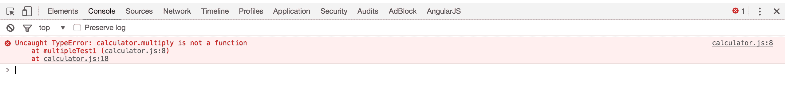
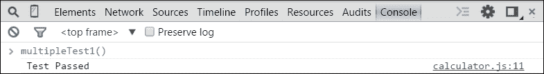

# 第一章：介绍测试驱动开发

Angular 处于客户端 JavaScript 测试的前沿。每个 Angular 教程都包括相应的测试，甚至测试模块都是核心 Angular 包的一部分。Angular 团队致力于使测试成为 Web 开发的基础。

本章向您介绍了使用 Angular 进行**测试驱动开发**（**TDD**）的基础知识，包括以下主题：

+   TDD 概述

+   TDD 生命周期：先测试，使其运行，然后改进

+   常见的测试技术

# TDD 概述

TDD 是一种演进式的开发方法，您在编写足够的生产代码来满足测试及其重构之前编写测试。

本节将探讨 TDD 的基础知识。让我们以裁缝为例，看看他如何将 TDD 应用到自己的流程中。

## TDD 的基础知识

在开始编写代码之前就了解要写什么。这可能听起来陈词滥调，但这基本上就是 TDD 给您的。TDD 从定义期望开始，然后让您满足期望，最后在满足期望后强迫您对更改进行精炼。

练习 TDD 的一些明显好处如下：

+   **没有小改变**：小改变可能会在整个项目中引起许多破坏性问题。实践 TDD 是唯一可以帮助的方法，因为测试套件将捕捉破坏点并在任何更改后保存项目，从而拯救开发人员的生命。

+   **明确定义任务**：测试套件明确提供了任务的清晰视野和逐步工作流程，以便取得成功。首先设置测试允许您只关注在测试中定义的组件。

+   **重构的信心**：重构涉及移动、修复和更改项目。测试通过确保逻辑独立于代码结构的行为，保护核心逻辑免受重构的影响。

+   **前期投资，未来收益**：最初，测试似乎需要额外的时间，但当项目变得更大时，实际上会在以后得到回报，它让我们有信心扩展功能，只需运行测试就能识别出任何破坏性问题。

+   **QA 资源可能有限**：在大多数情况下，QA 资源是有限的，因为让 QA 团队手动检查一切都需要额外的时间，但编写一些测试用例并成功运行它们肯定会节省一些 QA 时间。

+   **文档化**：测试定义了特定对象或函数必须满足的期望。期望充当合同，可以用来查看方法应该或可以如何使用。这使得代码更易读和理解。

## 用不同的眼光来衡量成功

TDD 不仅是一种软件开发实践--它的基本原则也被其他工匠所共享。其中之一就是裁缝，他的成功取决于精确的测量和周密的计划。

### 分解步骤

以下是裁缝制作西装的高级步骤：

1.  **先测试**：

+   确定西装的尺寸

+   让客户确定他们想要西装的风格和材料

+   测量客户的手臂、肩膀、躯干、腰部和腿

1.  **进行裁剪**：

+   根据所需的风格选择面料

+   根据客户的身形测量面料

+   根据测量裁剪面料

1.  **重构**：

+   将裁剪和外观与客户所需的风格进行比较

+   进行调整以满足所需的风格

1.  **重复**：

+   **先测试**：确定西装的尺寸

+   **进行裁剪**：测量面料并进行裁剪

+   **重构**：根据审查进行更改

上述步骤是 TDD 方法的一个例子。裁缝必须在开始裁剪原材料之前进行测量。想象一下，如果裁缝没有使用测试驱动的方法，也没有使用测量工具（尺寸），那将是荒谬的。如果裁缝在测量之前就开始裁剪会发生什么？如果面料被剪得太短会发生什么？裁缝需要多少额外时间来裁剪？因此，要多测量，少裁剪。

作为开发者，你是否会“在测量之前就剪裁”？你会相信一个没有测量工具的裁缝吗？你会如何看待一个不进行测试的开发者？

### 多次测量，一次裁剪

裁缝总是从测量开始。如果裁缝在测量之前就开始裁剪会发生什么？如果面料被剪得太短会发生什么？裁缝需要多少额外时间来裁剪？因此，要多测量，少裁剪。

软件开发人员可以在开始开发之前选择无数种方法。一个常见的方法是根据规范进行工作。文档化的方法可能有助于定义需要构建的内容；然而，如果没有明确的标准来满足规范，实际开发的应用可能与规范完全不同。采用 TDD 方法，过程的每个阶段都验证结果是否符合规范。想象一下裁缝在整个过程中继续使用卷尺来验证西装。

TDD 体现了测试优先的方法论。TDD 使开发人员能够以明确的目标开始，并编写直接满足规范的代码，因此您可以像专业人士一样开发，并遵循有助于编写高质量软件的实践。

# JavaScript 实用 TDD

让我们深入了解 JavaScript 环境中的实际 TDD。这个演练将带领我们完成向计算器添加乘法功能的过程。

只需记住以下 TDD 生命周期：

+   先测试

+   让它运行

+   让它变得更好

## 指出开发待办事项清单

开发待办事项清单有助于组织和专注于单独的任务。它还可以在开发过程中提供一个列出想法的平台，这些想法以后可能成为单一功能。

让我们在开发待办事项清单中添加第一个功能--添加乘法功能：

*3 * 3 = 9*

上述清单描述了需要做的事情。它还清楚地说明了如何验证乘法*3 * 3 = 9*。

## 设置测试套件

为了设置测试，让我们在一个名为`calculator.js`的文件中创建初始计算器。它初始化为一个对象，如下所示：

```ts
var calculator = {}; 

```

测试将通过网页浏览器运行，作为一个简单的 HTML 页面。因此，让我们创建一个 HTML 页面，并导入`calculator.js`进行测试，并将页面保存为`testRunner.html`。

要运行测试，让我们在网页浏览器中打开`testRunner.html`文件。

`testRunner.html`文件将如下所示：

```ts
<!DOCTYPE html> 
<html> 
<head> 
  <title>Test Runner</title> 
</head> 
<body> 

<script src="calculator.js"></script> 
</body> 
</html> 

```

项目的测试套件已经准备就绪，功能的开发待办事项清单也已准备就绪。下一步是根据功能列表逐个深入 TDD 生命周期。

## 先测试

虽然编写一个乘法函数很容易，并且它将像一个非常简单的功能一样工作，但作为练习 TDD 的一部分，现在是时候遵循 TDD 生命周期了。生命周期的第一阶段是根据开发待办事项编写测试。

以下是第一次测试的步骤：

1.  打开`calculator.js`。

1.  创建一个新的函数`multipleTest1`来测试乘法*3 * 3，之后`calculator.js`文件将如下所示：

```ts
        function multipleTest1() { 
            // Test 
            var result = calculator.multiply(3, 3); 

            // Assert Result is expected 
            if (result === 9) { 
                console.log('Test Passed'); 
            } else { 
                console.log('Test Failed'); 
            } 
        };  

        multipleTest1();
```

测试调用一个尚未定义的`multiply`函数。然后通过显示通过或失败消息来断言结果是否符合预期。

### 注意

请记住，在 TDD 中，您正在考虑方法的使用，并明确编写它应该如何使用。这使您能够根据用例定义接口，而不仅仅是查看正在开发的功能的有限范围。

TDD 生命周期中的下一步是使测试运行。

## 使测试运行

在这一步中，我们将运行测试，就像裁缝对套装进行了测量一样。测试步骤中进行了测量，现在可以调整应用程序以适应这些测量。

以下是运行测试的步骤：

1.  在 Web 浏览器上打开`testRunner.html`。

1.  在浏览器中打开 JavaScript 开发者**控制台**窗口。

测试将抛出错误，这将在浏览器的开发者控制台中可见，如下截图所示：



抛出的错误是预期的，因为计算器应用程序调用了尚未创建的函数--`calculator.multiply`。

在 TDD 中，重点是添加最简单的更改以使测试通过。实际上不需要实现乘法逻辑。这可能看起来不直观。关键是一旦存在通过的测试，它应该始终通过。当一个方法包含相当复杂的逻辑时，更容易运行通过的测试来确保它符合预期。

可以做的最简单的更改是什么，以使测试通过？通过返回预期值`9`，测试应该通过。虽然这不会添加乘法功能，但它将确认应用程序的连接。此外，在我们通过了测试之后，未来的更改将变得容易，因为我们只需保持测试通过即可！

现在，添加`multiply`函数，并使其返回所需的值`9`，如下所示：

```ts
var calculator = { 
    multiply : function() { 
        return 9; 
    } 
}; 

```

现在，让我们刷新页面重新运行测试，并查看 JavaScript 控制台。结果应该如下截图所示：



是的！没有错误了。有一条消息显示测试已经通过。

现在有了通过的测试，下一步将是从`multiply`函数中删除硬编码的值。

## 让项目变得更好

重构步骤需要从`multiply`函数中删除硬编码的`return`值，这是我们为了通过测试而添加的最简单的解决方案，并添加所需的逻辑以获得预期的结果。

所需的逻辑如下：

```ts
var calculator = { 
    multiply : function(amount1, amount2) { 
        return amount1 * amount2; 
    } 
}; 

```

现在，让我们刷新浏览器重新运行测试；它将像之前一样通过测试。太棒了！现在`multiply`函数已经完成。

`calculator.js`文件的完整代码，用于`calculator`对象及其测试，如下所示：

```ts
var calculator = { 
    multiply : function(amount1, amount2) { 
        return amount1 * amount2; 
    } 
}; 

function multipleTest1() { 
    // Test 
    var result = calculator.multiply(3, 3); 

    // Assert Result is expected 
    if (result === 9) { 
        console.log('Test Passed'); 
    } else { 
        console.log('Test Failed'); 
    } 
}

multipleTest1(); 

```

# 测试机制

要成为一个合格的 TDD 开发者，重要的是要了解一些测试技术的基本机制和测试方法。在本节中，我们将通过几个测试技术和机制的示例来介绍这本书中将要使用的。

这将主要包括以下几点：

+   使用**Jasmine**间谍进行测试替身

+   重构现有测试

+   构建模式

以下是将要使用的其他术语：

+   **被测试的函数**：这是正在测试的函数。它也被称为被测试系统、被测试对象等。

+   **3A（安排、行动和断言）**：这是一种用于设置测试的技术，最初由 Bill Wake 描述（[`xp123.com/articles/3a-arrange-act-assert/`](http://xp123.com/articles/3a-arrange-act-assert/)）。3A 将在第二章中进一步讨论，*JavaScript 测试的详细信息*。

## 使用框架进行测试

我们已经看到了在计算器应用程序上执行测试的快速简单方法，我们已经为`multiply`方法设置了测试。但在现实生活中，这将会更加复杂，应用程序也会更大，早期的技术将会过于复杂，难以管理和执行。在这种情况下，使用测试框架会更方便、更容易。测试框架提供了测试的方法和结构。这包括创建和运行测试的标准结构，创建断言/期望的能力，使用测试替身的能力，以及更多。本书使用 Jasmine 作为测试框架。Jasmine 是一个行为驱动的测试框架。它与测试 Angular 应用程序非常兼容。在第二章中，*JavaScript 测试的详细信息*，我们将深入了解 Jasmine。

以下示例代码并不完全是在 Jasmine 测试/规范运行时的运行方式，它只是关于测试替身如何工作或这些测试替身如何返回预期结果的想法。在第二章中，*JavaScript 测试的详细信息*，我们将准确展示这个测试替身应该如何与 Jasmine 规范运行器一起使用。

## 使用 Jasmine 间谍进行测试替身

测试替身是一个充当并用于代替另一个对象的对象。Jasmine 有一个测试替身函数，称为`spies`。Jasmine 间谍与`spyOn()`方法一起使用。

让我们看一下需要进行测试的`testableObject`对象。使用测试替身，我们可以确定`testableFunction`被调用的次数。

以下是测试替身的示例：

```ts
var testableObject = { 
    testableFunction : function() { } 
}; 
jasmine.spyOn(testableObject, 'testableFunction'); 

testableObject.testableFunction(); 
testableObject.testableFunction(); 
testableObject.testableFunction(); 

console.log(testableObject.testableFunction.count); 

```

上述代码使用 Jasmine 间谍(`jasmine.spyOn`)创建了一个测试替身。以下是 Jasmine 测试替身提供的一些功能：

+   函数调用次数

+   指定返回值的能力（存根返回值）

+   传递给底层函数的调用能力（传递）

在本书中，我们将进一步学习测试替身的使用经验。

### 存根返回值

使用测试替身的好处是方法的底层代码不必被调用。通过测试替身，我们可以准确指定方法在给定测试中应该返回什么。

考虑以下对象和函数的示例，其中函数返回一个字符串：

```ts
var testableObject = { 
    testableFunction : function() { return 'stub me'; } 
}; 

```

前述对象`testableObject`有一个需要存根化的函数`testableFunction`。

因此，要存根化单个返回值，需要链式调用`and.returnValue`方法，并将预期值作为`param`传递。

以下是如何将单个返回值进行间谍链以进行存根化：

```ts
jasmine.spyOn(testableObject, 'testableFunction') 
.and 
.returnValue('stubbed value'); 

```

现在，当调用`testableObject.testableFunction`时，将返回`stubbed value`。

考虑前述单个`stubbed value`的示例：

```ts
var testableObject = { 
    testableFunction : function() { return 'stub me'; } 
}; 
//before the return value is stubbed 
Console.log(testableObject.testableFunction()); 
//displays 'stub me' 

jasmine.spyOn(testableObject,'testableFunction') 
.and 
.returnValue('stubbed value'); 

//After the return value is stubbed 
Console.log(testableObject.testableFunction()); 
//displays 'stubbed value' 

```

类似地，我们可以像前面的示例一样传递多个返回值。

以下是如何将多个返回值进行间谍链以逐个进行存根化：

```ts
jasmine.spyOn(testableObject, 'testableFunction') 
.and 
.returnValues('first stubbed value', 'second stubbed value', 'third stubbed value'); 

```

因此，对于每次调用`testableObject.testableFunction`，它将按顺序返回存根化的值，直到达到返回值列表的末尾。

考虑前面多个存根化值的示例：

```ts
jasmine.spyOn(testableObject, 'testableFunction') 
.and 
.returnValue('first stubbed value', 'second stubbed value', 'third stubbed value'); 

//After the is stubbed return values 
Console.log(testableObject.testableFunction()); 
//displays 'first stubbed value' 
Console.log(testableObject.testableFunction()); 
//displays 'second stubbed value' 
Console.log(testableObject.testableFunction()); 
//displays 'third stubbed value' 

```

### 测试参数

测试替身提供了关于应用程序中方法使用方式的见解。例如，测试可能希望断言方法被调用时使用的参数，或者方法被调用的次数。以下是一个示例函数：

```ts
var testableObject = { 
    testableFunction : function(arg1, arg2) {} 
}; 

```

以下是测试调用前述函数时使用的参数的步骤：

1.  创建一个间谍，以便捕获调用的参数：

```ts
        jasmine.spyOn(testableObject, 'testableFunction'); 

```

1.  然后，要访问参数，请运行以下命令：

```ts
        //Get the arguments for the first call of the function 
        var callArgs = testableObject.testableFunction
        .call.argsFor(0); 

        console.log(callArgs); 
        //displays ['param1', 'param2'] 

```

以下是如何使用`console.log`显示参数：

```ts
var testableObject = { 
    testableFunction : function(arg1, arg2) {} 
}; 
//create the spy 
jasmine.spyOn(testableObject, 'testableFunction'); 

//Call the method with specific arguments 
  testableObject.testableFunction('param1', 'param2'); 

//Get the arguments for the first call of the function 
var callArgs = testableObject.testableFunction.call.argsFor(0); 

console.log(callArgs); 
//displays ['param1', 'param2'] 

```

## 重构

重构是重构、重写、重命名和删除代码的行为，以改善代码的设计、可读性、可维护性和整体美感。TDD 生命周期步骤*使项目变得更好*主要涉及重构。本节将通过一个重构示例引导我们。

看一下需要重构的函数的以下示例：

```ts
var abc = function(z) { 
    var x = false; 
    if(z > 10) 
        return true; 
    return x; 
} 

```

这个函数运行良好，没有包含任何语法或逻辑问题。问题在于这个函数很难阅读和理解。重构这个函数将改善其命名、结构和定义。这个练习将消除伪装的复杂性，揭示函数的真正含义和意图。

以下是步骤：

1.  重命名函数和变量名称以使其更有意义，即重命名`x`和`z`，使其有意义：

```ts
        var isTenOrGreater = function(value) { 
            var falseValue = false; 
            if(value > 10) 
                return true; 
            return falseValue; 
        } 

```

现在，函数可以轻松阅读，命名也有意义。

1.  删除任何不必要的复杂性。在这种情况下，`if`条件语句可以完全删除，如下所示：

```ts
        var isTenOrGreater = function(value) { 
            return value > 10; 
        }; 

```

1.  反思结果。

在这一点上，重构已经完成，函数的目的应该立即显现出来。接下来应该问的问题是：“为什么这个方法一开始就存在呢？”。

这个例子只是简要地介绍了如何识别代码中的问题以及如何改进它们的步骤。本书将在整个书中提供其他示例。

## 使用建造者构建

这些天，设计模式是一种常见的实践，我们遵循设计模式来使生活更轻松。出于同样的原因，这里将遵循建造者模式。

建造者模式使用`builder`对象来创建另一个对象。想象一个具有 10 个属性的对象。如何为每个属性创建测试数据？对象是否必须在每个测试中重新创建？

`builder`对象定义了一个可以在多个测试中重复使用的对象。以下代码片段提供了使用这种模式的示例。这个例子将在`validate`方法中使用`builder`对象：

```ts
var book = { 
    id : null, 
    author : null, 
    dateTime : null 
}; 

```

`book`对象有三个属性：`id`，`author`和`dateTime`。从测试的角度来看，我们希望能够创建一个有效的对象，即所有字段都已定义的对象。我们可能还希望创建一个缺少属性的无效对象，或者我们可能希望设置对象中的某些值来测试验证逻辑。就像这里`dateTime`是一个实际的日期时间，应该由建造者对象分配。

以下是为`bookBuilder`对象创建建造者的步骤：

1.  创建一个建造者函数，如下所示：

```ts
        var bookBuilder = function() {}; 

```

1.  在建造者中创建一个有效的对象，如下所示：

```ts
        var bookBuilder = function() { 
            var _resultBook = { 
                id: 1, 
                author: 'Any Author', 
                dateTime: new Date() 
            }; 
        } 

```

1.  创建一个函数来返回构建的对象：

```ts
        var bookBuilder = function() { 
            var _resultBook = { 
                id: 1, 
                author: "Any Author", 
                dateTime: new Date() 
            }; 
            this.build = function() { 
                return _resultBook; 
            } 
        } 

```

1.  如图所示，创建另一个函数来设置`_resultBook`的作者字段：

```ts
        var bookBuilder = function() { 
            var _resultBook = { 
                id: 1, 
                author: 'Any Author', 
                dateTime: new Date() 
            }; 
            this.build = function() { 
                return _resultBook; 
            }; 
            this.setAuthor = function(author){ 
                _resultBook.author = author; 
            }; 
        }; 

```

1.  更改函数定义，以便可以链接调用：

```ts
        this.setAuthor = function(author) { 
            _resultBook.author = author; 
            return this; 
        }; 

```

1.  一个设置器函数也将被创建用于`dateTime`，如下所示：

```ts
        this.setDateTime = function(dateTime) { 
            _resultBook.dateTime = dateTime; 
            return this; 
        }; 

```

现在，`bookBuilder`可以用来创建一个新的书，如下所示：

```ts
var bookBuilder = new bookBuilder(); 

var builtBook = bookBuilder.setAuthor('Ziaul Haq') 
.setDateTime(new Date()) 
.build(); 
console.log(builtBook.author); // Ziaul Haq 

```

前面的建造者现在可以在我们的测试中被用来创建一个一致的对象。

这是完整的建造者供参考：

```ts
var bookBuilder = function() { 
    var _resultBook = { 
        id: 1, 
        author: 'Any Author', 
        dateTime: new Date() 
    }; 

    this.build = function() { 
        return _resultBook; 
    }; 

    this.setAuthor = function(author) { 
        _resultBook.author = author; 
        return this; 
    }; 

    this.setDateTime = function(dateTime) { 
        _resultBook.dateTime = dateTime; 
        return this; 
    }; 
}; 

```

让我们创建`validate`方法来验证从建造者创建的书对象：

```ts
var validate = function(builtBookToValidate){ 
    if(!builtBookToValidate.author) { 
        return false; 
    } 
    if(!builtBookToValidate.dateTime) { 
        return false; 
    } 
    return true; 
}; 

```

让我们首先通过传递所有必需的信息，使用建造者创建一个有效的书对象，如果这是通过`validate`对象传递的，这应该显示一个有效的消息：

```ts
var validBuilder = new bookBuilder().setAuthor('Ziaul Haq') 
.setDateTime(new Date()) 
.build(); 

// Validate the object with validate() method 
if (validate(validBuilder)) { 
    console.log('Valid Book created'); 
} 

```

同样，让我们通过构建器创建一个无效的书籍对象，通过在必要信息中传递一些空值。通过将对象传递给`validate`方法，它应该显示解释为什么无效的消息：

```ts
var invalidBuilder = new bookBuilder().setAuthor(null).build(); 

if (!validate(invalidBuilder)) { 
    console.log('Invalid Book created as author is null'); 
} 

var invalidBuilder = new bookBuilder().setDateTime(null).build(); 

if (!validate(invalidBuilder)) { 
    console.log('Invalid Book created as dateTime is null'); 
} 

```

### 提示

**下载示例代码**

您可以从[`www.packtpub.com`](http://www.packtpub.com)的帐户中下载您购买的所有 Packt Publishing 图书的示例代码文件。如果您从其他地方购买了这本书，您可以访问[`www.packtpub.com/support`](http://www.packtpub.com/support)并注册，文件将直接通过电子邮件发送给您。

# 自测问题

Q1\. 测试替身是重复测试的另一个名称。

1.  正确

1.  错误

Q2\. TDD 代表测试驱动开发。

1.  正确

1.  错误

Q3\. 重构的目的是提高代码质量。

1.  正确

1.  错误

Q4\. 测试对象构建器 consolida 了用于测试的对象的创建。

1.  正确

1.  错误

Q5\. 三个 A 是一个体育队。

1.  正确

1.  错误

# 摘要

本章介绍了 TDD。它讨论了 TDD 生命周期（先测试，使其运行，然后改进）以及这些步骤可以被任何人用于 TDD 方法，类似于我们看到裁缝使用的方式。最后，它回顾了本书中将讨论的一些测试技术，包括测试替身，重构和构建模式。

尽管 TDD 是一个庞大的主题，但本书仅专注于与 Angular 一起使用的 TDD 原则和实践。

在下一章中，我们将了解有关 JavaScript 测试的详细信息。
