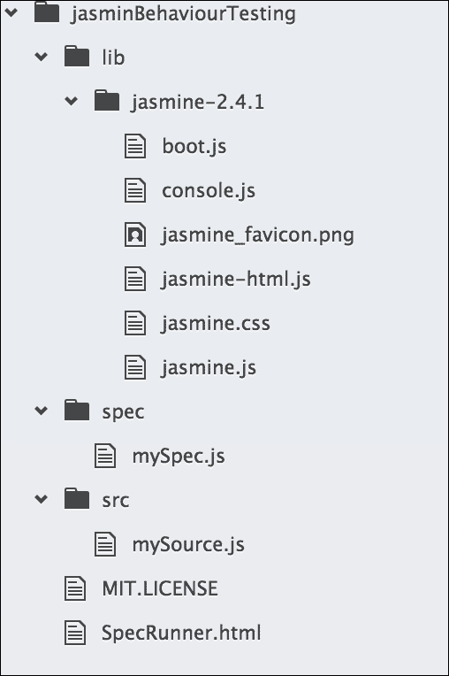
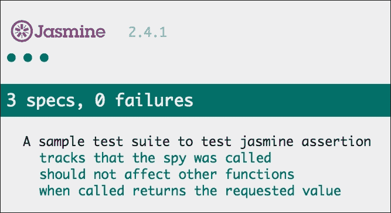
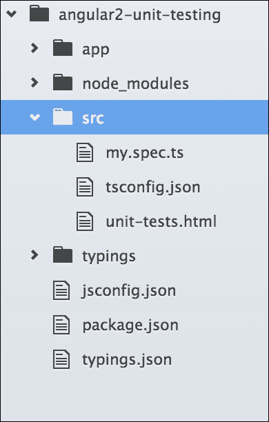
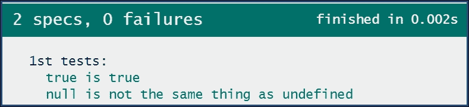

# 第二章：JavaScript 测试的细节

TDD 的实践是获得高质量软件和令人满意的准确性的好方法，即使人手较少。对于 Web 应用程序，JavaScript 已经成为最流行的脚本语言，测试 JavaScript 代码已经成为一个挑战。基于浏览器的测试实际上是一种浪费时间的做法，对于 TDD 来说很难跟进，但是解决这个问题的方法是使用一些支持 JavaScript 自动化测试的很酷的工具。大多数 Web 应用项目仅限于单元测试，没有自动化测试工具，端到端测试或功能测试几乎是不可能的。

许多专注于 JavaScript 测试的工具和框架正在涌现，它们提供不同的解决方案，使开发人员的生活变得更加轻松。除了发明新的 JavaScript 框架，开发人员社区还发明了一些工具集，以使测试变得更加容易。就像 Angular 团队一样，他们提供了像**Karma**这样的很酷的工具。我们还有测试框架或工具的重复，它们都以不同的方式解决了类似的问题。选择哪种工具或框架取决于开发人员；他们必须选择最适合他们要求的工具。

在本章中，我们将涵盖以下内容：

+   自动化测试的简要介绍

+   专注于 JavaScript 的不同类型的测试

+   一些测试工具和框架的简要概念

# JavaScript 测试的技艺

我们都知道 JavaScript 是一种动态类型的解释语言。因此，与 Java 等编译语言不同，没有编译步骤可以帮助您找出错误。因此，JavaScript 开发人员应该花更多的时间来测试代码。然而，现在生活变得更加容易，开发人员可以使用最新的工具技术在最少的步骤和时间内进行测试。这是自动化测试的一部分，代码在更改时将自动进行测试。在这个过程中，测试可能是在后台运行的任务，可以集成到 IDE 或 CLI 中，并且在开发过程中提供测试结果。

在接下来的章节中，我们将讨论如何使用测试运行器和无头浏览器在多个浏览器中自动化测试过程。

## 自动化测试

测试很有趣，编写测试会使代码更好；这是一个很好的实践，但是过程化的手动测试有点耗时、容易出错，并且不可重复。在这个过程中，需要编写测试规范，更改代码以通过测试，刷新浏览器以获取结果，并重复这个过程多次。作为程序员，重复相同的事情有点无聊。

除了单调乏味之外，它也大大减慢了开发过程，这让开发人员对 TDD 的实践失去了动力。因此，当手动过程减慢进度时，我们必须寻找一些自动化的过程来完成工作，并为其他可能增加更多业务价值的任务节省时间。

因此，拥有一些工具或技术可以帮助程序员摆脱这些重复乏味的手动步骤，这些步骤减慢了过程，并自动完成任务，更快地完成任务，并节省时间，使它们对业务更有价值，这将是很棒的。幸运的是，有一些工具可以自动化这些测试。我们将在其他章节中更多地介绍这些工具和技术。

除了减慢开发过程的问题之外，当我们谈论测试功能时，另一个重要的问题出现了，那就是跨浏览器兼容性问题。由于 Web 应用程序应该在现代平台和浏览器上完美运行，而逐个手动测试几乎是不可能的，自动化测试可能是一个解决方案，使用 Web 驱动程序和无头浏览器。

让我们回顾一下我们在上一章中解释的基本测试流程--测试它，使其运行，并使其更好。为了使这个过程自动化，开发人员可以在 CLI 甚至开发 IDE 中实现工具集，并且这些测试将在一个单独的进程中持续运行，而不需要开发人员的任何输入。

让我们想象一下任何应用程序的注册或注册功能，我们必须手动填写表单并每次点击提交按钮以测试该功能，并通过更改数据重复该过程。这实际上被称为功能测试（我们将在本章末讨论）。为了自动执行这些过程，我们将在 CLI 中使用工具集（测试运行器、Web 驱动程序和无头浏览器），并使用一条命令和一些参数完成整个过程。

在自动化测试中测试 JavaScript 并不是一个新概念，实际上，它是最常用的自动化浏览器。Selenium 是在 2004 年为此而发明的，之后出现了许多工具，包括 PhantomJS、Karma、Protractor 和 CasperJS。在本章中，我们将讨论其中一些。

# 测试的类型

在 TDD 中，开发人员必须遵循一种流程来实现测试的目标。在这个流程中，每一步都有一个独立的测试目标。例如，有些测试仅用于测试每个函数的行为，而有些用于测试模块/功能的流程。基于此，我们将在这里讨论两种主要类型的测试。它们如下：

+   **单元测试**：这主要用于行为测试。

+   **端到端测试**：这主要被称为 e2e 测试，用于功能测试。

## 单元测试

**单元测试**是一种软件开发过程，其中应用程序的最小可测试部分被单独称为一个单元，并且该小部分的行为应该能够在隔离的情况下进行测试，而不依赖于其他部分。如果我们将 JavaScript 应用程序视为软件，那么该应用程序的每个单独的方法/函数都将是代码的一个单元，这些方法或代码单元的行为应该能够以隔离的方式进行测试。

关于单元测试的一个重要观点是，任何代码单元都应该能够在隔离的情况下运行/进行测试，并且可以以任何顺序运行，这意味着如果单元测试在任何应用程序中成功运行，它代表了该应用程序的组件或模块的隔离。

例如，我们在上一章中已经展示了一个小的测试示例，演示了如何进行方法测试；尽管我们没有使用任何测试框架，但这个想法是一样的。我们通过传递一些参数来调用方法，得到了该方法的结果，然后将结果与预期值进行比较。

通常，我们将使用我们选择的单元测试框架编写这些测试。现在有许多测试框架和工具，我们必须根据我们的需求决定并选择最好的一个。最常用的框架是 Jasmine、Mocha 和 QUnit。我们将在本章深入讨论这些工具，并在随后的章节中涵盖真实的例子。

测试应该快速运行并且自动化，并且具有清晰的输出。例如，您可以验证如果使用特定参数调用函数，它应该返回预期的结果。

单元测试可以随时运行测试，例如在以下情况下：

+   从开发过程的最开始，即使测试失败

+   完成任何功能的开发后，验证行为是否正确

+   修改任何现有功能后，以验证行为是否发生了变化

+   在现有应用程序中添加新功能后，我们需要验证新功能是否被隔离，并且没有破坏任何其他功能

## 端到端测试

端到端测试是一种用于测试应用程序流程是否按照设计进行的方法。例如，如果用户从产品列表中点击一个产品，它应该提示模态框显示所选产品的详细信息。在这种情况下，产品/项目所有者将根据规范逐步定义项目要求。在开发过程之后，将根据规范的工作流程对项目进行测试。这被称为功能/流程测试，也是端到端测试的另一个名称。

除了单元测试之外，端到端测试对于确认各个组件作为一个应用程序一起工作，传递信息并相互通信非常重要。与单元测试的主要区别在于它不会单独测试任何组件；相反，它是对所有相关组件一起进行流程的综合测试。

考虑一个注册模块，用户应该提供一些有效信息来完成注册，该模块/应用程序的功能/流程测试应该遵循一些步骤来完成测试。

步骤如下：

1.  加载/编译表单

1.  获取表单元素的 DOM

1.  触发提交按钮的点击事件

1.  从输入字段中收集值以进行验证

1.  验证输入字段

1.  调用虚拟 API 来存储数据

在每一步中，都会有一些结果与预期结果集进行比较。

这些类型的功能/流程测试可以通过人工填写表单，点击下一步按钮，完成应用程序流程，并将结果与在实施过程中早期定义的规范进行比较来进行手动测试。

然而，有一些技术可用于以自动化方式进行功能/流测试，而无需从任何人那里获取输入，这被称为端到端测试。为了使这个测试过程更容易，有一些工具可用；最常用的是 Selenium、PhantomJS 和 Protractor。这些工具可以轻松集成到任何应用程序测试系统中。在本章中，我们将稍微详细地讨论这些测试工具，并在随后的章节中将它们集成到应用程序的测试套件中。

# 测试工具和框架

了解不同的测试工具是一大挑战。对于 Angular 测试来说，其中一些非常重要，我们将在本书中详细学习它们。然而，在本节中，我们将学习一些在不同 Web 应用程序中用于各种测试和方法的知名工具和框架。它们如下：

+   **Karma**：这是 JavaScript 的测试运行器

+   **Protractor**：这是端到端测试框架

+   **Jasmine**：这是行为驱动的 JavaScript 测试框架

+   **Mocha**：这是 JavaScript 测试框架

+   **QUnit**：这代表单元测试框架

+   **Selenium**：这是自动化 Web 浏览器的工具

+   **PhantomJS**：这是无头 Webkit 浏览器

## Karma

在讨论 Karma 是什么之前，最好先讨论它不是什么。它不是一个编写测试的框架；它是一个测试运行器。这意味着 Karma 赋予我们能力以自动化方式在多个不同的浏览器中运行测试。过去，开发人员必须手动执行以下步骤：

+   打开浏览器

+   将浏览器指向项目 URL

+   运行测试

+   确认所有测试都已通过

+   进行更改

+   刷新页面

使用 Karma，自动化使开发人员能够运行单个命令并确定整个测试套件是否通过或失败。从 TDD 的角度来看，这使我们能够快速找到并修复失败的测试。

与手动流程相比，使用 Karma 的一些优点如下：

+   在多个浏览器和设备中自动化测试的能力

+   监视文件的能力

+   在线文档和支持

+   只做一件事——运行 JavaScript 测试——并且做得很好

+   使其易于与持续集成服务器集成

使用 Karma 的缺点：

+   需要学习、配置和维护额外的工具

自动化测试和使用 Karma 的过程非常有利。在本书的 TDD 旅程中，Karma 将是我们的主要工具之一。我们将在第三章 *Karma 方式*中详细了解 Karma。

## Protractor

Protractor 是一种端到端测试工具，允许开发人员模拟用户交互。它通过与 Web 浏览器的交互自动化功能和特性的测试。Protractor 具有特定的方法来帮助测试 Angular，但它们并不专属于 Angular。

使用 Protractor 的一些优点如下：

+   可配置以测试多个环境

+   与 Angular 轻松集成

+   语法和测试可以与选择的单元测试框架类似

使用 Protractor 的缺点：

+   它的文档和示例有限

对于本书中的示例的端到端测试，Protractor 将是我们的主要框架。Protractor 将在第四章 *使用 Protractor 进行端到端测试*中进一步详细介绍。

## 茉莉花

Jasmine 是一个用于测试 JavaScript 代码的行为驱动开发框架。它可以轻松集成和运行网站，并且与 Angular 无关。它提供间谍和其他功能。它也可以在没有 Karma 的情况下运行。在本章中，我们将学习 Jasmine 常用的内置全局函数的详细信息，并了解 Jasmine 测试套件如何满足 Web 应用程序的测试要求。此外，在整本书中，我们将使用 Jasmine 作为我们的测试框架。

使用 Jasmine 的一些优点如下：

+   与 Karma 的默认集成

+   提供额外的功能来辅助测试，如测试间谍、伪造和传递功能

+   清晰易读的语法，允许测试以与被测试行为相关的方式格式化

+   与多个输出报告器集成

以下是使用 Jasmine 的一些缺点：

+   运行测试时没有文件监视功能。这意味着测试必须在用户更改时重新运行。

+   所有 Protractor 方法和功能的学习曲线可能会很陡峭。

## 摩卡

Mocha 是最初为 Node.js 应用程序编写的测试框架，但它也支持浏览器测试。它与 Jasmine 非常相似，并且大部分语法都是相似的。Mocha 的主要区别在于它不能作为一个独立的测试框架运行--它需要一些插件和库来作为一个测试框架运行，而 Jasmine 是独立的。它更具可配置性和灵活性。

让我们讨论一些 Mocha 的优点：

+   易安装

+   有良好的文档可用

+   有几个报告者

+   与几个 node 项目插件相匹配

以下是一些缺点：

+   需要单独的插件/模块来进行断言、间谍等

+   需要额外的配置才能与 Karma 一起使用

## QUnit

QUnit 是一个强大、易于使用的 JavaScript 单元测试套件。它被 jQuery、jQuery UI 和 jQuery Mobile 项目使用，并且能够测试任何通用的 JavaScript 代码。QUnit 专注于在浏览器中测试 JavaScript，同时尽可能为开发人员提供便利。

QUnit 的一些优点：

+   易安装

+   有良好的文档可用

使用 QUnit 的一个缺点是：

+   主要为 jQuery 开发，不适合与其他框架一起使用

## Selenium

Selenium（[`www.seleniumhq.org/`](http://www.seleniumhq.org/)）自我定义如下：

> *"Selenium 自动化浏览器。就是这样！"*

浏览器的自动化意味着开发人员可以轻松地与浏览器交互。他们可以点击按钮或链接，输入数据等。Selenium 是一个强大的工具集，当正确使用和设置时，有很多好处；然而，设置它可能会令人困惑和繁琐。

Selenium 的一些优点如下：

+   大量功能集

+   分布式测试

+   通过服务如**Sauce Labs**（[`saucelabs.com/`](https://saucelabs.com/)）支持 SaaS

+   有文档和资源可用

以下是 Selenium 的一些缺点：

+   必须作为一个单独的进程运行

+   需要几个步骤来配置

由于 Protractor 是 Selenium 的一个包装器，因此不会详细讨论。

## PhantomJS

PhantomJS 是一个可编写 JavaScript API 的无头 WebKit 脚本。它对各种 Web 标准有*快速*和*本地*支持；DOM 处理、CSS 选择器、JSON、Canvas 和 SVG。PhantomJS 用于测试工作流程。

简而言之，PhantomJS 是一个无头运行的浏览器（即不会显示屏幕）。它带来的好处是速度--如果你在计算机上控制一个实际的程序，你会有一定的开销来启动浏览器，配置配置文件等。

PhantomJS 并不意味着取代测试框架；它将与测试框架一起使用。

# 选择权在我们手中

正如我们所见，有许多用于测试 JavaScript 项目的工具集和框架：

+   对于断言框架，我们将选择 Jasmine，因为 Angular 本身使用 Jasmine 作为断言；但在某些情况下，主要是对于 Node.js 项目，Mocha 也很有趣

+   只要我们专注于自动化测试套件，测试运行器对我们来说至关重要，当涉及到 Angular 项目时，没有什么可以与 Karma 相提并论

+   对于端到端测试，Protractor 是最好的框架，我们将在本章中使用它。

+   只要是端到端测试，它必须是自动化的，而 Selenium 就在这里为我们自动化浏览器。

+   重要的是要进行跨浏览器支持的测试，并且 PhantomJS 在这里为我们提供无头浏览器。

# 向 Jasmine 测试套件打招呼

只要我们必须使用测试框架来构建测试套件，所有框架上都有一些基本和常见的断言。重要的是要理解这些断言和间谍以及何时使用它们。

在本节中，我们将解释 Jasmine 的断言和间谍，因为 Jasmine 将是本书中的测试框架。

## 套件

任何测试套件都以全局的 Jasmine `describe`函数开始，该函数接收两个参数。第一个是字符串，第二个是函数。字符串是套件名称/标题，函数是将在套件中实现的代码块。

考虑以下例子：

```ts
describe("A sample test suite to test jasmine assertion", function() {  
   // .. implemented code block 
}); 

```

## 规范

任何使用 Jasmine 的全局`it`函数定义的规范，类似于接收两个参数的套件，第一个是字符串，第二个是函数。字符串是规范名称/标题，函数是规范中将要实现的代码块。看看以下例子：

```ts
describe("A sample test suite to test jasmine assertion", function() { 
    var a; 
    it("Title for a spec", function() { 
        // .. implemented code block 
    }); 
}); 

```

## 期望

任何使用`expect`函数定义的期望，该函数接收一个称为实际的参数值。该函数是一个与匹配器函数链接的链，该匹配器函数以预期值作为参数与实际值进行匹配。

有一些常用的匹配器；它们都在实际值和预期值之间实现布尔比较。通过将`expect`方法与`not`关键字链接，任何匹配器都可以评估负值。

一些常见的匹配器包括`toBe`，`toEqual`，`toMatch`，`toBeNull`，`toBeDefined`，`toBeUndefined`和`toContain`。

考虑给定的例子：

```ts
describe("A sample test suite to test jasmine assertion", function() {  
    var a, b; 
    it("Title for a spec", function() { 
        var a = true; 
        expect(a).toBe(true); 
        expect(b).not.toBe(true); 
    }); 
}); 

```

## 设置和拆卸

为了通过 DRY（不要重复自己）来改进测试套件，消除重复的设置和拆卸代码，Jasmine 提供了一些全局函数用于设置和拆卸。这些全局函数（`beforeEach`，`afterEach`等）如下所示，并且它们按照名称的意思运行。

每个函数都针对一个测试规范运行。Jasmine 的全局设置和拆卸函数是`beforeEach`，`afterEach`，`beforeAll`和`afterAll`。

考虑以下示例：

```ts
describe("A sample test suite to test jasmine assertion", function() { 
    var a=0;    
    beforeEach(function() { 
        a +=1; 
    }); 
    afterEach(function() { 
        a =0; 
    }); 
    it("Title for a spec 1", function() { 
        expect(a).toEqual(1); 
    }); 
    it("Title for a spec 2", function() { 
        expect(a).toEqual(1); 
        expect(a).not.toEqual(0); 
    }); 
}); 

```

## 间谍

间谍是 Jasmine 中的测试双函数；它们可以替换任何函数并跟踪对它及其所有参数的调用。有一些匹配器可以跟踪间谍是否被调用。这些是`toHaveBeenCalled`，`toHaveBeenCalledTimes`等。

有一些与间谍一起使用的有用的链式方法，比如`returnValue`/`returnValues`，它们将在调用时返回一个或多个值。还有一些类似的有用方法，比如`callThrough`，`call`，`stub`，`call.allArgs`，`call.first`和`call.reset`。

考虑以下示例：

```ts
describe("A sample test suite to test jasmine assertion", function() { 
    var myObj, a, fetchA; 
    beforeEach(function() { 
        myObj = { 
            setA: function(value) { 
                a = value; 
            }, 
            getA: function(value) { 
                return a; 
            }, 
        }; 
        spyOn(myObj, "getA").and.returnValue(789); 
        myObj.setA(123); 
        fetchA = myObj.getA(); 
    }); 

    it("tracks that the spy was called", function() { 
         expect(myObj.getA).toHaveBeenCalled(); 
    }); 
    it("should not affect other functions", function() { 
        expect(a).toEqual(123); 
    }); 
    it("when called returns the requested value", function() { 
        expect(fetchA).toEqual(789); 
    }); 
}); 

```

## Jasmine 的测试套件

在前面的部分中，我们查看了一些常用的断言，所有测试框架，包括 Jasmine，在任何类型的测试套件中都会使用。

尽管在本书中，我们将为 Angular 测试构建一个自动化测试套件，让我们在 Jasmine 测试套件中尝试一些断言，并看看它是如何工作的。这个示例测试套件将让我们亲身体验断言在测试套件中的工作方式。

对于这个测试套件，我们将使用 Jasmine 的示例规范运行器项目（该项目在 Jasmine 下载包中可用），项目的文件夹结构将如下所示：



让我们快速看一下我们需要在 Jasmine 的示例`SpecRunner`项目中更新的文件：

```ts
SpecRunner.html: 
<!DOCTYPE HTML> 
<html> 
<head> 
    <meta http-equiv="Content-Type" content="text/html; charset=UTF-8"> 
    <title>Jasmine Spec Runner v2.4.1</title> 
    <link rel="shortcut icon" type="image/png" href="lib/jasmine-2.4.1/jasmine_favicon.jpg"> 
    <link rel="stylesheet" type="text/css" href="lib/jasmine-2.4.1/jasmine.css"> 

    <script type="text/javascript" src="lib/jasmine-2.4.1/jasmine.js"></script> 
    <script type="text/javascript" src="lib/jasmine-2.4.1/jasmine-html.js"></script> 
    <script type="text/javascript" src="lib/jasmine-2.4.1/boot.js"></script> 
    <!-- include source files here... --> 
    <script type="text/javascript" src="src/mySource.js"></script> 
    <!-- include spec files here... --> 
    <script type="text/javascript" src="spec/mySpec.js"></script> 
</head> 
<body> 
</body> 
</html> 

src/mySource.js: 
var a, 
myObj = { 
    setA: function(value) { 
        a = value; 
    }, 
    getA: function(value) { 
        return a; 
    }, 
}; 

Spec/mySpec.js: 
describe("A sample test suite to test jasmine assertion", function() { 
    var fetchA; 
    beforeEach(function() { 
        spyOn(myObj, "getA").and.returnValue(789); 
        myObj.setA(123); 
        fetchA = myObj.getA(); 
    }); 

    it("tracks that the spy was called", function() { 
         expect(myObj.getA).toHaveBeenCalled(); 
    }); 
    it("should not affect other functions", function() { 
        expect(a).toEqual(123); 
    }); 
    it("when called returns the requested value", function() { 
        expect(fetchA).toEqual(789); 
    }); 
}); 

```

只要它是基于浏览器的测试套件，我们就必须将`SpecRunner.html`指向一个 web 浏览器以获取测试结果。我们将通过所有测试，并且我们的测试结果将如下截图所示：



# Angular 的 Jasmine 测试套件

在前面的例子中，我们看到了用于 JavaScript 测试的 Jasmine 测试套件，但是对于 Angular，应该如何呢？实际上，对于 Angular 项目测试套件，没有直接的答案；我们将不使用基于浏览器的测试套件，而是使用 Karma 作为测试套件的测试运行器。但是，由于我们在前面的例子中熟悉了基于浏览器的 Jasmine 测试套件，让我们看看如果我们为 Angular 项目制作一个类似的测试套件会是什么样子。

我们将不得不在 Angular 项目中添加一个名为`src`的子文件夹用于测试规范，然后项目的文件夹结构将如下所示：



### 注意

在 Angular 项目中，我们将使用 TypeScript 而不是纯 JavaScript，因为 Angular 官方建议使用 TypeScript。因此，我们希望大家都了解 TypeScript 的语法并知道如何编译成 JS。

在这本书中，对于 Angular 测试套件，我们将使用 SystemJS 作为模块加载器，因为 Angular 官方建议使用它；我们将看一下 SystemJS。

这个示例 Angular 测试套件只是为了展示我们如何轻松地为 Angular 项目制作一个测试套件，尽管它并没有遵循最佳实践和最佳的模块加载方式。

在第三章中，*Karma 方式*，我们将使用真实的例子更新这个测试套件，并使用 SystemJS 作为模块加载器。

在 GitHub 上，Angular 团队有一个名为`Angular2-seed`的种子项目，可以为任何 Angular 项目提供测试套件；我们将为我们真正的 Angular 项目遵循这个项目。

如果我们看一下文件夹结构，它几乎与之前的相同，规范文件中也有最少的更改；规范中唯一的变化是使用 TypeScript：

```ts
src/unit-tests.html: 

<!DOCTYPE html> 
<html> 
<head> 
    <meta http-equiv="content-type" content="text/html;charset=utf-8"> 
    <title>NG2 App Unit Tests</title> 
    <link rel="stylesheet" href="node_modules/jasmine-core/lib/jasmine-core/jasmine.css"> 
    <script src="node_modules/jasmine-core/lib/jasmine-core/jasmine.js"></script> 
    <script src="node_modules/jasmine-core/lib/jasmine-core/jasmine-html.js"></script> 
    <script src="node_modules/jasmine-core/lib/jasmine-core/boot.js"></script> 
    <script src="../app/mysource.js"></script> 
    <script src="my.spec.js"></script> 

</head> 
<body> 
</body> 
</html> 

app/mysource.ts: 
export class Source { 
    // ...  
} 

src/my.spec.ts: 
describe('1st tests', () => { 
    it('true is true', () => expect(true).toEqual(true)); 

    it('null is not the same thing as undefined', 
        () => expect(null).not.toEqual(undefined) 
    ); 
}); 

```

由于这也是一个基于浏览器的测试套件，我们必须在 Web 浏览器中指向`unit-tests.html`以获取测试结果。我们将通过所有测试，并且我们的测试结果将如下所示：



# 自测问题

自测问题将帮助您进一步测试您在 JavaScript 应用程序测试中使用 TDD 的知识。

Q1\. 端到端测试意味着什么样的测试？

+   功能测试

+   行为测试

Q2\. Protractor 是一个单元测试框架。

+   正确

+   错误

Q3\. PhantomJS 是一种类型的浏览器。

+   正确

+   错误

Q4\. QUnit 是用于什么样的测试框架？

+   jQuery

+   Angular

+   NodeJS

Q5\. 设置和拆卸是 Jasmine 的一个特性。

+   正确

+   错误

# 总结

在本章中，我们回顾了 TDD 的不同测试机制，并介绍了自动化测试。我们回顾了不同类型的 JavaScript 测试框架和工具，并审查了这些框架的优缺点。我们还回顾了 Jasmine 的一些常见断言，并尝试亲自动手看它们是如何工作的。

在下一章中，我们将学习关于 Karma，并了解它如何与 Angular 测试套件配合使用。
