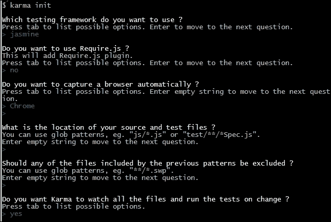
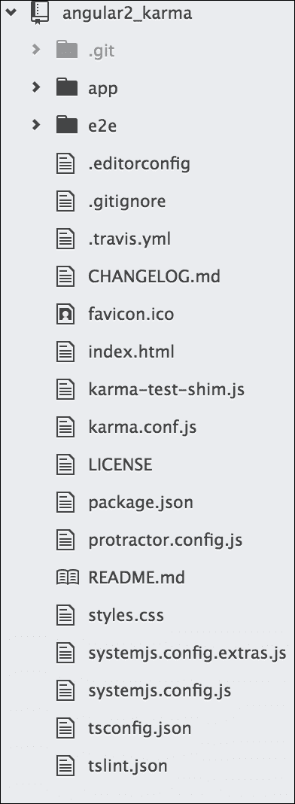
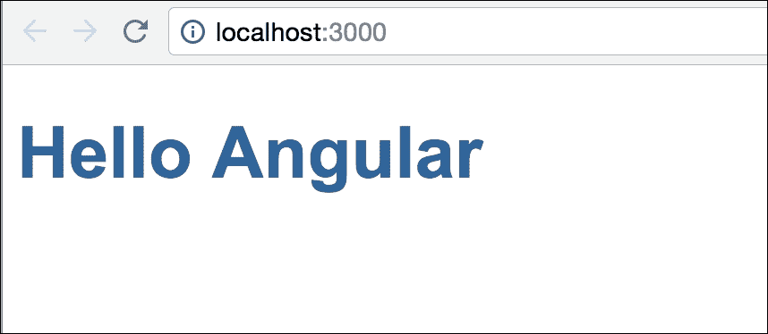
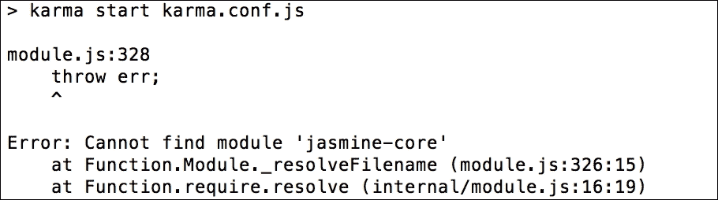

# 第三章：Karma 的方式

由于 Karma，JavaScript 测试已经成为主流。Karma 使 JavaScript 测试变得无缝。Angular 是围绕测试创建的。

在本章中，我们将学习关于 Karma 的一些东西，包括以下内容：

+   Karma 的起源

+   为什么以及如何 Karma 将与 Angular 项目一起工作

+   在 Angular 项目中的 Karma 配置和实现

+   Travis CI 概述

# Karma 的诞生

在使用新工具时，了解其来源和构建原因非常重要。本节将为我们提供 Karma 起源的背景。

## Karma 的区别

Karma 是由 Vojta Jína 创建的。该项目最初被称为 Testacular。在 Vojtech Jína 的论文中，他讨论了 Karma 的设计、目的和实现。

在他的论文（JavasScript Test Runner，[`github.com/karma-runner/karma/raw/master/thesis.pdf`](https://github.com/karma-runner/karma/raw/master/thesis.pdf)）中，他描述了 Karma 如下：

> “……一个测试运行器，可以帮助 Web 应用程序开发人员通过使自动化测试更简单和更快速来提高生产力和效率。事实上，我有更高的抱负，这篇论文只是其中的一部分 - 我想推广测试驱动开发（TDD）作为开发 Web 应用程序的“方式”，因为我相信这是开发高质量软件的最有效方式。”

Karma 具有在真实浏览器上轻松自动运行 JavaScript 单元测试的能力。传统上，测试是通过手动启动浏览器并不断点击刷新按钮来进行的。这种方法很笨拙，通常会导致开发人员限制编写的测试数量。

使用 Karma，开发人员几乎可以在任何标准测试框架中编写测试，选择要运行的浏览器，设置要监视更改的文件，然后就可以进行持续的自动化测试了。我们只需简单地检查输出窗口以查看测试是失败还是通过。

## 结合 Karma 和 Angular 的重要性

Karma 是为 AngularJS 构建的。在 Karma 之前，缺乏面向 Web 的 JavaScript 开发人员的自动化测试工具。

记住，Karma 是一个测试运行器，而不是一个测试框架。它的工作是运行测试并报告哪些测试将通过或失败。为什么这有帮助呢？测试框架是你将编写测试的地方。除了这样做，你还需要专注于轻松运行测试并查看结果。Karma 可以轻松地在多个不同的浏览器上运行测试。它还具有一些其他功能，比如文件监视，这将在本书的后面详细讨论。

# 安装 Karma

是时候开始使用 Karma 了。安装和应用程序不断变化。以下指南旨在简要介绍；你可以去 Karma 网站[`karma-runner.github.io/`](http://karma-runner.github.io/)查找最新的说明。

本节的主要重点将是本书中使用的特定配置，而不是深入的安装指南。

## 安装前提条件

要安装 Karma，我们需要在计算机上安装 Node.js。Node.js 在 Google 的 V8 引擎上运行，并允许 JavaScript 在多个操作系统上运行。

开发人员可以使用**NPM**（**Node Package Manager**）发布节点应用程序和模块。NPM 允许开发人员快速将应用程序和模块集成到他们的应用程序中。

Karma 通过`npm`包运行和安装；因此，在使用或安装 Karma 之前，我们需要 Node.js。要安装 Node.js，请转到[`nodejs.org/`](http://nodejs.org/)并按照安装说明进行操作。

一旦我们安装了 Node.js，让我们在命令提示符中输入以下命令来安装 Karma：

```ts
**$ npm install karma -g**

```

上述命令使用`npm`全局安装 Karma 使用`-g`。这意味着我们可以在命令提示符中简单地输入以下内容来使用 Karma：

```ts
**$ karma --version**

```

默认情况下，安装 Karma 将安装`karma-chrome-launcher`和`karma-jasmine`作为依赖项。确保这些模块也全局安装。

# 配置 Karma

Karma 配备了一个自动创建配置文件的方法。要使用自动方式，请输入以下命令：

```ts
**$ karma init**

```

以下是所选选项的示例：



## 自定义 Karma 的配置

以下说明描述了为项目运行 Karma 所需的特定配置。自定义包括测试框架（Jasmine）、要测试的浏览器（Chrome）和要测试的文件。要自定义配置，请打开`karma.conf.js`并执行以下步骤：

1.  确保启用的框架使用以下代码说`jasmine`：

```ts
        frameworks: ['jasmine'], 

```

1.  配置`test`目录。请注意，以下定义需要包括需要运行的测试以及可能的任何依赖项。将保存我们的测试的目录是`/test/unit/`：

```ts
        files: [ 
            'test/unit/**/*.js' 
        ], 

```

1.  将测试浏览器设置为 Chrome，如下所示。然后它将被初始化，并且在每个测试后都会弹出一个弹窗：

```ts
        browsers: ['Chrome'], 

```

## 确认 Karma 的安装和配置

要确认 Karma 的安装和配置，请执行以下步骤：

1.  运行以下命令确认 Karma 启动时没有错误：

```ts
        **$ karma start**

```

1.  输出应该是这样的：

```ts
        **$ INFO [karma]: Karma v0.12.16 server started at 
        http://localhost:9876/**

```

1.  除此之外，输出应该指出没有找到测试文件：

```ts
        **$ WARN [watcher]: Pattern "test/unit/**/*.js" does not
        match any file.**

```

输出应该这样做，还有一个失败的测试消息：

```ts
        **$ Chrome 35.0.1916 (Windows 7): Executed 0 of 0 ERROR
        (0.016 secs / 0 secs)**

```

### 注意

一个重要的要点是，我们需要在系统上全局安装`jasmine-core`，否则 Karma 将无法成功运行。

这是预期的，因为还没有创建测试。如果 Karma 启动，请继续下一步，我们将看到我们的 Chrome 浏览器显示以下输出：


## 常见的安装/配置问题

如果缺少 Jasmine 或 Chrome Launcher，请执行以下步骤：

1.  运行测试时，可能会出现错误，提示**缺少 Jasmine 或 Chrome Launcher**。如果出现此错误，请输入以下命令安装缺少的依赖项：

```ts
        **$ npm install karma-jasmine -g**
        **$ npm install karma-chrome-launcher -g**

```

1.  重试测试并确认错误已经解决。

在某些情况下，您可能无法使用`-g`命令全局安装`npm_modules`。这通常是由于计算机上的权限问题。以下是您需要做的以提供权限（sudo/administrator）：

1.  解决方法是直接在项目文件夹中安装 Karma。使用相同的命令而不带`-g`来执行此操作：

```ts
                **$ npm install karma**

```

1.  使用相对路径运行 Karma：

```ts
                **$ ./node_modules/karma/bin/karma --version**

```

现在 Karma 已安装并运行，是时候投入使用了。

# 使用 Karma 进行测试

在本节中，我们将创建一个测试来确认 Karma 是否按预期工作。为此，请执行以下步骤：

1.  创建测试目录。在 Karma 配置中，测试被定义在以下目录中：

```ts
        files: [ 
               'test/unit/**/*.js' 
           ], 

```

1.  继续创建`test/unit`目录。

1.  在`test/unit`目录中创建一个新的`firstTest.js`文件。

1.  编写第一个测试如下：

```ts
        describe('when testing karma', function (){ 
          it('should report a successful test', function (){ 
            expect(true).toBeTruthy(); 
              }); 
        }); 

```

前面的测试使用了 Jasmine 函数，并具有以下属性：

+   `describe`：这提供了测试套件的简短字符串描述，即将被测试的东西。

+   `it`：这提供了一个特定断言的简短字符串，称为测试规范

+   `expect`：这提供了一种断言值的方式

+   `toBeTruthy`：这是期望的几个属性之一，可用于进行断言

这个测试除了确认通过测试的输出之外没有任何实际价值。

砰！让我们检查一下控制台窗口，看看 Karma 是否执行了我们的测试。我们的命令行应该显示类似于这样的内容：

```ts
**$ INFO [watcher]: Added file "./test/unit/firstTest.js"**

```

这个输出意味着 Karma 自动识别到有一个新文件被添加了。接下来的输出应该是这样的：

```ts
**$ Chrome 35.0.1916 (Windows 7): Executed 1 of 1 SUCCESS (0.02 secs 
    / 0.015 secs)**

```

这意味着我们的测试已经通过了！

# 确认 Karma 的安装

现在，Karma 的初始设置和配置已经完成。以下是步骤的回顾：

1.  我们通过`npm`命令安装了 Karma。

1.  我们通过`karma init`命令初始化了一个默认配置。

1.  接下来，我们用 Jasmine 和一个`test/unit`测试目录配置了 Karma。

1.  我们启动了 Karma，并确认它可以在 Chrome 中打开。

1.  然后，我们在`test/unit`测试目录中添加了一个 Jasmine 测试`firstTest.js`。

1.  Karma 认识到`firstTest.js`已经被添加到了测试目录中。

1.  最后，Karma 执行了我们的`firstTest.js`并报告了我们的输出。

通过几个步骤，我们能够看到 Karma 自动运行和执行测试。从 TDD 的角度来看，我们可以专注于将测试从失败转移到通过，而不需要太多的努力。无需刷新浏览器；只需检查命令输出窗口。保持 Karma 运行，所有的测试和文件都将自动添加和运行。

在接下来的章节中，我们将看到如何将 Karma 与 TDD 方法相结合。如果你对 Karma 目前还可以，并且想继续使用 Protractor，请跳到下一章。

# 使用 Karma 与 Angular

在这里，我们将演示如何对 Angular 组件进行 TDD 方法的实践。在本章结束时，我们应该能够做到以下几点：

+   对使用 Karma 及其配置感到自信

+   了解 Jasmine 测试的基本组件

+   开始理解如何在 Angular 应用程序中集成 TDD 方法

## 获取 Angular

通过 Bower 无法安装 Angular；与 Angular1 不同，它必须通过 npm 安装。引导 Angular 应用程序不像 Angular1 那样简单，因为 Angular 不使用普通的 JavaScript。它使用 TypeScript 或 ES6（ES2015），这两者在运行之前都需要编译为普通的 JavaScript。

我们相信大多数开发人员已经了解了 Angular 的变化以及它的编译工作原理。简单回顾一下--在这里，我们将在我们的 Angular 示例项目中使用 TypeScript，因为 Angular 建议使用它，尽管也有使用 ES6 的选项。我们将使用 node/npm tsc 模块将 TypeScript 编译为普通的 JavaScript；node/npm 也将是我们的 CLI 工具，用于构建/启动项目和运行测试。

这里需要对 node/npm 模块有基本的了解，特别是 npm 命令的工作原理。

### Angular 项目

我们不会演示如何安装 Angular 以及如何从头开始构建项目，因为 Angular 文档网站已经很好地展示了这一点。因此，我们将从 Angular 团队的示例中获取一个简单的 Angular 项目，并为我们的实现更新它。

我们将从 Angular GitHub 仓库克隆`quickstart`项目，并从那个项目开始。希望除了 node/npm 之外，我们都已经全局安装了`git`。

```ts
**$ git clone https://github.com/angular/quickstart.git angular-
    karma**

```

这将把项目本地复制为`angular-karma`，文件夹结构将如图所示：



让我们继续进行并准备运行：

```ts
**$ cd angular-karma**
**$ npm install**

```

以下是准备示例项目的几个步骤。`npm install`命令将安装在项目根目录的`package.json`文件中定义的项目依赖的所需模块。

然后，我们将使用`npm start`来运行项目；在`package.json`中定义的这个脚本用于在本地服务器上运行项目。

让我们编译并运行项目：

```ts
**$ npm start**

```

如果所有必需的依赖都已安装，此命令将把 TypeScript 编译为普通的 JavaScript，并在本地服务器上运行项目。

项目将在浏览器中启动，并将如下所示：



如果这个示例项目成功运行，那么我们就可以进行下一步了，在下一步中，我们将添加一个测试规范，其中将包括 Karma，并使用 Karma 运行这些测试。

### 准备工作

当我们克隆了示例`quickstart`项目时，它已经在项目中集成和配置了 Karma。为了学习的目的，我们想要在现有项目中集成 Karma。

为此，我们将不得不从项目根目录中删除现有的`karma.conf.js`文件。此外，我们还将从`node_modules`中删除 Karma、Jasmine 和相关模块。

有趣的是，我们可以通过一个简单的命令轻松创建基本的 Karma 配置文件，而不是手动操作。而且通过这个命令，它会询问一些基本问题，就像我们在本章的前一部分看到的那样。

## 设置 Karma

在 Angular 项目中设置 Karma，第一步是在项目根目录创建一个`karma.conf.js`文件。这个文件基本上包含一些键值对的配置。

有趣的是，我们可以通过一个简单的命令轻松创建基本的 Karma 配置文件。通过这个命令，它会询问一些基本问题，就像我们在本章的前一部分看到的那样：

```ts
**$ karma init**

```

使用默认答案。在当前目录创建了`karma.conf.js`之后，打开配置。可能需要更改一些配置，主要是 Karma 要使用的文件的定义。

在`files`部分使用以下定义，定义运行测试所需的文件：

```ts
files: [ 
        // System.js for module loading 
      'node_modules/systemjs/dist/system.src.js', 

      // Polyfills 
      'node_modules/core-js/client/shim.js', 
      'node_modules/reflect-metadata/Reflect.js', 

      // zone.js 
      'node_modules/zone.js/dist/zone.js', 
      'node_modules/zone.js/dist/long-stack-trace-zone.js', 
      'node_modules/zone.js/dist/proxy.js', 
      'node_modules/zone.js/dist/sync-test.js', 
      'node_modules/zone.js/dist/jasmine-patch.js', 
      'node_modules/zone.js/dist/async-test.js', 
      'node_modules/zone.js/dist/fake-async-test.js', 

// RxJs 
      { pattern: 'node_modules/rxjs/**/*.js', included: false,
      watched: false },      { pattern: 'node_modules/rxjs
      /**/*.js.map', included: false,        watched: false }, 

// Angular itself 
      { pattern: 'node_modules/@angular/**/*.js', included: 
      false,        watched: false }, 

{ pattern: 'systemjs.config.js', included: false, watched: false }, 
      { pattern: 'systemjs.config.extras.js', included: false,   
      watched: false }, 
      'karma-test-shim.js', 

          {pattern: 'app/**/*.js', included: false, watched: true} 
    ] 

```

### 注意

在这里，通过模式，我们传递了两个选项，`included`和`watched`。`included`指的是我们是否想要使用`<script>`标签包含文件；在这里，我们将通过 SystemJS 添加它，所以传递为`false`。`watched`指的是文件在更改时是否会被监视。我们设置为`true`，因为我们想要监视这些更改。

似乎添加了很多文件，但这些是运行测试的基本必需品。

让我们仔细看看这些文件是什么。在第一部分，这些主要是库文件，包括 SystemJS 作为模块加载器，zonejs 作为同步处理程序，RxJS 作为响应式库，以及 Angular 库本身。

重要的是，第二部分中的一个新文件是`karma-test-shim.js`，我们需要在测试套件中与 Karma 一起使用作为模块加载器，也就是说，使用 SystemJS 在 Karma 测试运行器中加载模块。我们将在本节后面看一下那个文件。

然后，这是我们所有的应用程序源文件；我们也会把测试/规范文件放在同一个目录下，这样它们就会加载所有的模块文件，包括它们的测试/规范文件。

除了文件之外，根据需求，我们可能需要更改一些配置点，如下所示：

+   `plugins`：这是必需的，因为 Karma 将使用这些`npm`模块来执行。如果我们计划使用更多的`npm`模块，我们需要在这里添加它们；例如，如果我们计划将 PhantomJS 作为我们的浏览器使用，我们需要在列表中添加`'karma-phantomjs-launcher'`：

```ts
        plugins: [ 
'karma-jasmine', 
'karma-chrome-launcher' 
   ] 

```

+   `frameworks`：目前不需要更改这个，因为默认情况下它选择 Jasmine；但是，如果我们计划使用其他框架，比如 Mocha，那么应该更新以下选项：

```ts
        frameworks: ['jasmine'], 

```

+   `browsers`：当我们需要在多个浏览器中运行测试时，这是有用的，大多数情况下，我们可能需要在 PhantomJS 中运行测试，因此我们可以添加多个浏览器，如下所示：

```ts
        browsers: ['Chrome', 'PhantomJS'] 

```

到目前为止，这些是我们在`karma.con.js`文件中需要的基本更改。

让我们来看看我们的`karma.conf.js`文件，看看它是什么样子的：

```ts
module.exports = function(config) { 

  config.set({ 
    basePath: '', 
    frameworks: ['jasmine'], 
    plugins: [ 
      require('karma-jasmine'), 
      require('karma-chrome-launcher') 
    ], 

    files: [ 
      // System.js for module loading 
      'node_modules/systemjs/dist/system.src.js', 

      // Polyfills 
      'node_modules/core-js/client/shim.js', 
      'node_modules/reflect-metadata/Reflect.js', 

      // zone.js 
      'node_modules/zone.js/dist/zone.js', 
      'node_modules/zone.js/dist/long-stack-trace-zone.js', 
      'node_modules/zone.js/dist/proxy.js', 
      'node_modules/zone.js/dist/sync-test.js', 
      'node_modules/zone.js/dist/jasmine-patch.js', 
      'node_modules/zone.js/dist/async-test.js', 
      'node_modules/zone.js/dist/fake-async-test.js', 

      // RxJs 
      { pattern: 'node_modules/rxjs/**/*.js', included: false,
      watched: false },     
      { pattern: 'node_modules/rxjs/**/*.js.map', included: 
      false,        watched: false }, 

      // Paths loaded via module imports: 
      // Angular itself 
      { pattern: 'node_modules/@angular/**/*.js', included: 
      false,        watched: false },
      { pattern: 'node_modules/@angular/**/*.js.map', included: 
      false, watched: false },
      { pattern: 'systemjs.config.js', included: false, 
      watched:        false },
      { pattern: 'systemjs.config.extras.js', included: false,
      watched: false },

      'karma-test-shim.js', 

      { pattern: 'app/**/*.js', included: false, watched: true } 
    ], 

    port: 9876, 
    colors: true, 
    autoWatch: true, 
    browsers: ['Chrome'], 
    singleRun: false 
  }) 
}
```

我们在文件列表中添加的另一个重要文件是`karma-test-shim.js`；正如我们之前提到的，这对我们使用 SystemJS（模块加载器）与 Karma 是必需的。我们从 Angular 快速启动项目中复制了该文件，根据项目结构可能需要进行更改。

让我们来看看我们的`karma.conf.js`文件：

```ts
Error.stackTraceLimit = 0; // "No stacktrace"" is usually best for app testing. 

jasmine.DEFAULT_TIMEOUT_INTERVAL = 1000; 

var builtPath = '/base/app/'; 

__karma__.loaded = function () { }; 

function isJsFile(path) { 
  return path.slice(-3) == '.js'; 
} 

function isSpecFile(path) { 
  return /\.spec\.(.*\.)?js$/.test(path); 
} 

function isBuiltFile(path) { 
  return isJsFile(path) && (path.substr(0, builtPath.length) == 
  builtPath); 
} 

var allSpecFiles = Object.keys(window.__karma__.files) 
  .filter(isSpecFile) 
  .filter(isBuiltFile); 

System.config({ 
  baseURL: 'base', 
  // Extend usual application package list with test folder 
  packages: { 'testing': { main: 'index.js', defaultExtension: 'js' 
  } }, 

  // Assume npm: is set in `paths` in systemjs.config 
  // Map the angular testing umd bundles 
  map: { 
    '@angular/core/testing':      
'npm:@angular/core/bundles/core-testing.umd.js',    
'@angular/common/testing':      
'npm:@angular/common/bundles/common-testing.umd.js',    
'@angular/compiler/testing':      
'npm:@angular/compiler/bundles/compiler-testing.umd.js',    
'@angular/platform-browser/testing':      
'npm:@angular/platform-browser/bundles/     
platform-browser-testing.umd.js',    
'@angular/platform-browser-dynamic/testing':      'npm:@angular/platform-browser-dynamic/bundles    
 /platform-browser-dynamic-testing.umd.js',    
'@angular/http/testing':      
'npm:@angular/http/bundles/http-testing.umd.js',    
'@angular/router/testing':      
'npm:@angular/router/bundles/router-testing.umd.js',    
'@angular/forms/testing':      
'npm:@angular/forms/bundles/forms-testing.umd.js', 
  }, 
}); 

System.import('systemjs.config.js') 
  .then(importSystemJsExtras) 
  .then(initTestBed) 
  .then(initTesting); 

/** Optional SystemJS configuration extras. Keep going w/o it */ 
function importSystemJsExtras(){ 
  return System.import('systemjs.config.extras.js') 
  .catch(function(reason) { 
    console.log( 
      'Warning: System.import could not load the optional        "systemjs.config.extras.js". Did you omit it by accident?        Continuing without it.' 
    ); 
    console.log(reason); 
  }); 
} 

function initTestBed(){ 
  return Promise.all([ 
    System.import('@angular/core/testing'), 
    System.import('@angular/platform-browser-dynamic/testing') 
  ]) 

  .then(function (providers) { 
    var coreTesting    = providers[0]; 
    var browserTesting = providers[1]; 

    coreTesting.TestBed.initTestEnvironment( 
      browserTesting.BrowserDynamicTestingModule, 
      browserTesting.platformBrowserDynamicTesting()); 
  }) 
} 

// Import all spec files and start karma 
function initTesting () { 
  return Promise.all( 
    allSpecFiles.map(function (moduleName) { 
      return System.import(moduleName); 
    }) 
  ) 
  .then(__karma__.start, __karma__.error); 
} 

```

### 测试 Karma 运行器

Karma 的初始设置几乎完成了；我们将不得不运行我们的测试并查看它的进展。在我们运行之前还有一步--我们必须在`npm`脚本中添加`karma`任务以通过`npm`命令运行。为此，我们将不得不在`package.json`文件的脚本部分中添加一个名为`test`的任务。

```ts
"scripts": { 
     "test": "karma start karma.conf.js" 
  } 

```

在添加了这个片段之后，我们可以通过`npm`运行测试，使用`npm test`，这与`karma start`的方式相同：

```ts
**$ npm test**

```

因此，最终，我们准备通过 Karma 运行我们的测试。然而，糟糕，我们遇到了一些错误！它缺少运行测试所需的`jasmine-core`模块；实际上，可能还缺少更多的模块。

带有错误的输出如下：



是的，我们确实缺少模块，这些实际上是我们测试套件中的开发依赖项。我们将在下一节中更多地了解它们。

### 缺少的依赖项

尽管我们正在为 Angular 构建一个基本的测试套件，但我们仍然缺少一些必需的 npm 模块，这些是我们测试套件的开发依赖项，如下所示：

+   `jasmine-core`：这表明 Jasmine 是我们的测试框架

+   `karma`：这是我们测试套件的 Karma 测试运行程序

+   `karma-chrome-launcher`：这是从 Karma 启动 Chrome 所需的，因为我们在`karma.config`中定义了 Chrome 作为我们的浏览器

+   `karma-jasmine`：这是 Jasmine 的 Karma 适配器

只要这些是依赖项，我们应该安装这些模块并在`package.json`中包含它们。

我们可以一起安装所有这些，如下所示：

```ts
**$ npm install jasmine-core karma karma-chrome-launcher karma-
    jasmine --save-dev**

```

成功安装所有必需的依赖项后，我们似乎已经完成了配置过程，准备再次运行`test`：

```ts
**$ npm test**

```

命令输出应该像这样：

```ts
**$ Chrome 39.0.2623 (Mac OS X 10.10.5): Executed 0 of 0 ERROR 
    (0.003 secs / 0 secs)** 

```

就是这样。Karma 现在正在为第一个 Angular 应用程序运行。

# 使用 Angular 和 Karma 进行测试

使用 Karma 进行的第一个测试的目的是创建一个动态的待办事项清单。这个演练将遵循我们在第一章中讨论的 TDD 步骤，*测试驱动开发简介*：先测试，使其运行，然后改进。这将使我们能够在 Angular 应用程序中使用 TDD 获得更多经验。

## 一个开发待办事项清单

在开始测试之前，让我们把注意力集中在使用开发待办事项清单需要开发的内容上。这将使我们能够组织我们的想法。

这是待办事项清单：

+   **维护项目列表**：示例列表包括 test，execute 和 refactor

+   **向列表中添加项目**：添加项目后的示例列表是 test，execute，refactor 和 repeat

+   **从列表中删除项目**：添加和删除项目后的示例列表是 test，execute 和 refactor

## 测试项目列表

第一个开发项目是为我们提供在组件上有一个项目列表的能力。接下来的几个步骤将引导我们通过使用 TDD 生命周期添加第一个功能的 TDD 过程。

### 先测试

确定从哪里开始通常是最困难的部分。最好的方法是记住三个**A**（**组装**，**行动**和**断言**）并从基本的 Jasmine 模板格式开始。要做到这一点的代码如下：

```ts
describe('Title of the test suite', () => { 
    beforeEach(() => { 
        // .... 
    }); 

    it('Title of the test spec', () => { 
        // .... 
    }); 
}); 

```

让我们来看一下解释：

+   `describe`：这定义了我们正在测试的主要功能。字符串将以可读的方式解释该功能，然后函数将遵循测试。

+   `beforeEach`：这是组装步骤。在这一步中定义的函数将在每次断言之前执行。最好在这个函数中放置每个测试之前所需的测试设置。

+   `it`：这是行动和断言步骤。在`it`部分，我们将执行正在测试的操作，然后进行一些断言。行动步骤不必进入`it`函数。根据测试的需要，它可能更适合在`beforeEach`函数中。

### 三个 A - 组装，行动和断言

现在模板准备好了，我们可以开始拼凑这些部分。我们将再次遵循三个 A 的原则。

以下是组装部分的两个部分。

在第一部分中，我们初始化组件并使用以下代码执行类的构造函数：

```ts
import { async, ComponentFixture, TestBed } from '@angular/core/testing'; 

import { AppComponent } from './app.component'; 

beforeEach(async(() => { 
   TestBed.configureTestingModule({ 
      declarations: [ AppComponent ] 
    }) 
    .compileComponents(); 
  })); 

beforeEach(() => { 
    fixture = TestBed.createComponent(AppComponent); 
    comp = fixture.componentInstance; 
}); 
... 

```

在这里，我们导入了一些 Angular 测试 API，例如`async`和`Testbed`。在这里，`async`用于加载所需的模块以为测试套件引导应用程序，`TestBed`是编写 Angular API 单元测试的主要 API。它具有一些服务，用于在测试套件中创建，编译和初始化组件。

我们还没有定义`AppComponent`组件，但我们会在获得失败的测试之后这样做。

第二部分讨论了`AppComponent`对象。`AppComponent`对象将在其`this`变量上包含项目列表。添加以下代码到`beforeEach`以获取组件对象：

```ts
// comp will hold the component object  
let comp: AppComponent; 
let fixture: ComponentFixture<AppComponent>; 
beforeEach(() => { 
    fixture = TestBed.createComponent(AppComponent); 
    comp = fixture.componentInstance; 
}); 

```

在断言中，再次有两个部分：

第一个断言是确保`AppComponent`对象具有定义为三个项目的`items`变量。`items`变量将用于保存所有项目的列表：

```ts
it('Should define a list object', () => { 
        expect(com.items).toBeDefined(); 
    }); 

```

第二和第三个断言将用于确认列表中的数据是否正确：

```ts
//Second test 
it('Should have 3 items in list', () => { 
        expect(com.items.length).toBe(3); 
    }); 

//Third test 
it('List items should be as expected', () => { 
        expect(com.items).toEqual(['test','execute','refactor']); 
    }); 

```

就是这样；第一个是测试，第二个是执行，第三个是重构。

### 使其运行

TDD 生命周期中的下一步是使应用程序运行并修复代码，以使测试通过。记住，考虑可以添加的最小组件，以便通过以下步骤进行测试：

1.  通过输入以下命令来运行 Karma 测试：

```ts
**$ npm start**
**$ npm test**

```

1.  如果我们遇到`TypeError: app_component_1.AppComponent is not a constructor`错误，那么可能是由于以下原因：

+   前面的错误消息表明`AppComponent`对象尚未定义。由于错误消息告诉我们需要什么，这是开始的完美地方。

1.  将`AppComponent`类添加到`app.component.ts`文件中，如下所示：

```ts
        export class AppComponent { };
```

1.  再次从`npm`控制台运行`start`和`test`命令。现在我们应该看到一个新的错误。**错误：**`预期的未定义为以下定义`

+   新的错误消息再次很清晰。我们还可以看到，代码现在已经通过了我们在以下位置的断言点：

```ts
               expect(com.items).toBeDefined();
```

+   由于对象中没有项目，我们需要添加一个。更新`app/app.component.ts`文件如下：

```ts
              export class AppComponent { 
                  items:Array<string>; 
              }; 

```

1.  让我们再次从`npm`控制台运行`start`和`test`命令。现在我们应该看到三个测试中的一个通过了！这意味着我们成功地使用了 TDD 和 Karma 来使我们的第一个测试通过了。现在，我们需要修复其他三个。

+   下一个错误是：`预期的 0 等于 3`

+   错误输出再次准确描述了需要发生的事情。我们只需要用元素测试、执行和运行初始化数组。让我们去`app/app.component.ts`并将数据添加到数组初始化：

```ts
            export class AppComponent { 
                items:Array<string>; 
                constructor() { 
                    this.items = ['test','execute','refactor']; 
                } 
            }; 

```

1.  再次从 npm 控制台运行`start`和`test`命令。太棒了！输出是绿色的，并且声明所有测试都通过了。此步骤的结果组件和类代码如下：

```ts
        import {Component} from '@angular/core'; 

        @Component({ 
            // ...  
        }) 

        export class AppComponent { 
            items:Array<string>; 
            constructor() { 
                this.items = ['test','execute','refactor']; 
            } 
        }; 

```

现在*使其运行*步骤完成了，我们可以继续下一步，使其更好。

### 使其更好

到目前为止，没有直接重构或在开发待办事项列表中标识的内容。对开发待办事项列表的审查显示可以划掉一个项目：

+   查看待办事项列表：示例列表包括测试、执行和重构

+   **向待办事项列表添加项目**：在添加项目后的示例列表将包括测试、执行、重构和新项目

接下来的要求是向列表中添加一个新项目。将再次遵循 TDD 节奏：先测试，使其运行，然后使其更好。

## 向组件类添加一个函数

下一个任务是赋予类添加项目到对象的能力。这将需要向对象添加一个方法。这个演练将遵循我们之前遵循的相同的 TDD 步骤。

### 首先测试

不要创建新文件并复制一些组装步骤，而是将以下测试插入到最后一个`it`方法下。原因是将使用相同的模块和控制器：

```ts
describe('Title of the test suite', () => { 
    let app:AppComponent; 

    beforeEach(() => { 
        // .... 
    }); 

    it('Title of the test spec', () => { 
        // .... 
    }); 

    describe('Testing add method', () => { 

    beforeEach(() => { 
        // .... 
    }); 

    it('Title of the test spec', () => { 
        // .... 
    }); 
   }); 
}); 

```

### 三个 A - 组装、行动和断言

现在模板准备好了，我们可以开始使用 3A 法则填补空白：

+   组装：组件和对象将被继承，无需初始化或设置。

+   **行动**：在这里，我们需要对`add`方法进行操作，添加一个新项目。我们将`act`函数放入`beforEach`函数中。这样可以在添加更多测试时重复相同的步骤：

```ts
        beforeEach(() => { 
             com.add('new-item') 
        }); 

```

+   **断言**：在这里，应该向列表中添加一个项目，然后确认数组中的最后一个项目是否符合预期：

```ts
        it('Should have 4 items in list', () => { 
             expect(com.items.length).toBe(4); 
        }); 
        it('Should add a new item at the end of list', () => { 
            var lastIndexOfList = com.items.length - 1; 
            expect(com.items[lastIndexOfList]).toEqual('new-item'); 
        }); 

```

### 使其运行

TDD 生命周期中的下一步是使其运行。记住，考虑可以添加以使测试通过的最小组件，如下所示：

+   确保 Karma 在我们的控制台中运行，方法是输入以下命令：

```ts
**$ npm start**
**$ npm test**

```

+   第一个错误将声明`TypeError: undefined is not a function`。

此错误是指以下代码行：

```ts
        app.add('new-item'); 

```

错误告诉我们`add`方法尚未定义。`add`函数将需要添加到`app/app.component.ts`代码中。类已经定义，因此需要将`add`函数放入类中：

```ts
        add() { 
                this.items.push('new-item'); 
        }; 

```

请注意，`add`函数不包含任何逻辑。已添加了最小的组件以使测试满足错误消息。

+   在控制台窗口查看下一个错误。

成功！现在所有五个测试都已通过。

为了使测试通过，添加的代码如下所示：

```ts
import {Component} from '@angular/core'; 

@Component({ 
    selector: 'my-app', 
    template: `<h3>MY Items</h3><ul><li *ngFor="let item of items">{{ 
    item }}</li></ul>` 
}) 

export class AppComponent { 
    items:Array<string>; 
    constructor() { 
        this.items = ['test','execute','refactor']; 
    } 
    add() { 
        this.items.push('new-item'); 
    } 
}; 

```

### 使其更好

我们需要重构的主要问题是`add`函数仍未完全实现。它包含一个硬编码的值，一旦我们将不同的项目发送到`add`函数中，测试就会失败。

保持 Karma 运行，以便在进行更改时继续通过测试。当前`add`方法的主要问题如下：

+   它不接受任何参数

+   它不会将参数推送到列表中，而是使用硬编码的值

现在，生成的`add`函数应如下所示：

```ts
        add(item) { 
            this.items.push(item); 
        }; 

```

再次从`npm`控制台运行`start`和`test`命令。确认 Karma 输出仍然显示`SUCCESS`：

```ts
**$ Chrome 49.0.2623 (Mac OS X 10.10.5): Executed 5 of 5 SUCCESS
    (0.016 secs / 0.002 secs)**

```

# 配置 Karma 与 Travis CI

**持续集成**（**CI**）是开发实践，开发人员需要将代码集成到共享存储库中。它在代码库发生任何更改时在自动化构建过程中运行测试。这可以在推送到生产环境之前及早检测到错误。有许多 CI 服务，包括 Travis CI、Jenkin CI、Circle CI 等。

在本节中，我们将看到如何将 Karma 与 Travis 集成。

## Travis CI

Travis CI 是一个流行的托管式持续集成平台，它与 GitHub 项目/仓库集成，可以在代码库的任何分支中的每次更改或者拉取请求时自动运行测试。只需在项目根目录中放置一个`.travis.yml`文件，其中包含有关项目的一些配置信息，就可以轻松获得集成系统。

那么，我们可能会问，为什么选择 Travis？还有其他几个 CI 服务。如果我们将 Travis 与其他 CI 服务进行比较，它比其他服务有一些优势：

+   这是一个托管服务；无需主机、安装和配置

+   它是免费和开源的

+   它为每个分支都有单独的测试代码，因此很容易为单个分支运行测试

## 配置 Travis

正如我们所说，我们将在项目目录中有一个`.travis.yml`文件，其中包含有关我们的项目的一些配置和信息。

以下是 YAML 文件中的基本配置：

+   **指定语言**：我们在这里使用了 Node.js：

```ts
        language: node_js 
        node_js: 
            -  "4" 

```

+   **命令或脚本**：这是在每次构建之前或之后运行的必需内容；如下所示，此脚本将在每次运行构建之前设置`git`用户名：

```ts
        before_script: 
            -  git config - -global user.name jquerygeek  

```

在前面的示例中，我们已经传递了配置，以在真实浏览器（Firefox）中使用 karma 在虚拟屏幕上运行构建过程，默认情况下使用 PhantomJS 无头浏览器运行该过程。只要 Travis 支持 PhantomJS 之外的真实浏览器，这可能会很方便：

```ts
        before_script: 
            -  export DISPLAY=:99.0 
            - sh -e /etc/init.d/xvfb start  

```

+   **通知**：这是设置电子邮件和聊天通知所必需的。在这里，我们将`email`设置为`false`，因为我们不希望收到有关构建的加班电子邮件通知：

```ts
        notifications: 
            email: false  

```

## 使用 Karma 设置测试

正如之前所见，我们猜测在 npm 包中的项目根目录中有`package.json`文件；如果没有，让我们在那里创建一个`package.json`文件并添加这些配置片段。这里，第一个是 Karma 的依赖项，第二个是为`npm test`设置所需的参数，因为 Travis 将运行此命令来触发我们的测试。这些将告诉 Travis 如何运行我们的测试：

```ts
  'devDependencies': { 
      'karma': '~0.12' 
  }, 

  'scripts': { 
      'test': 'karma start  - -single-run - -browsers PhantomJS ' 
  } 

```

我们的初始设置和配置已经准备好进行测试。我们定义了 Karma 依赖项，因为 Travis 将为每个套件运行`nmp install`，并将采取必要的步骤来添加 Karma。并且为了运行测试，它将调用`npm test`，我们定义了测试任务将如何运行测试。在这里，我们将默认浏览器设置为 PhantomJS，以便测试将使用它运行。但是，如果我们需要使用不同的浏览器运行测试，我们应该在`.travis.yml`文件中使用`before_script`命令进行定义，就像我们之前为 Firefox 所示的那样。

在这种情况下，`npm test`将不会使用自定义浏览器运行测试；为此，我们必须使用浏览器名称进行自定义调用，如下所示：

```ts
**karma start - -browsers Firefox - -single-run** 

```

# 自测问题

以下自测问题将帮助您进一步测试使用 AngularJS 和 Karma 进行 TDD 的知识：

Q1.  如何使用 Karma 创建配置文件？

1.  `karma config`

1.  `karma init`

1.  `karma -config karma.conf.js`

Q2.  Jasmine 测试方法名为`before`，在每次测试之前执行。

1.  正确

1.  错误

Q3.  Bower 用于安装 Karma。

1.  正确

1.  错误

Q4.  这三个 A 代表哪一个？

1.  一组超级英雄

1.  集合，行动和断言

1.  接受，批准和行动

# 摘要

在本章中，我们讨论了 Karma 如何变得重要。我们看到了如何安装，配置和运行 Karma。最后，我们通过一个使用 Karma 进行 TDD 的 Angular 示例项目进行了演示。

在下一章中，我们将学习如何使用 Protractor 进行端到端测试。
