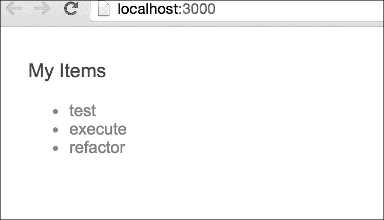

# 第四章：使用 Protractor 进行端到端测试

单元测试只是测试每段代码的责任的测试的一个方面。然而，当涉及测试任何组件、模块或完整应用程序的流程和功能时，端到端测试是唯一的解决方案。

在本章中，我们将逐步查看应用程序所有层的端到端测试流程。我们将介绍 Protractor，这是 Angular 团队的端到端测试工具。我们已经知道了它的原因，它是为什么创建的，以及它解决了什么样的问题。

在本章中，我们将学习：

+   安装和配置 Protractor 的过程

+   在我们现有的 Angular 项目中实施 Protractor 端到端测试

+   e2e 测试运行

+   返回测试结果

# Protractor 概述

Protractor 是一个端到端测试工具，使用 Node.js 运行，并作为 npm 包提供。在具体讨论 Protractor 之前，我们需要了解什么是端到端测试。

我们已经在第二章中简要了解了端到端测试，但让我们快速回顾一下：

端到端测试是针对应用程序所有相互连接的移动部分和层的测试。这与单元测试不同，单元测试侧重于单个组件，如类、服务和指令。通过端到端测试，重点是应用程序或模块作为一个整体的工作方式，例如确认按钮点击触发 x、y 和 z 动作。

Protractor 允许通过与应用程序的 DOM 元素交互来对任何模块甚至任何大小的 Web 应用程序进行端到端测试。它提供了选择特定 DOM 元素、与该元素共享数据、模拟按钮点击以及与用户相同的方式与应用程序交互的能力。然后，它允许根据用户的期望设置期望。

## Protractor 的核心

在快速概述中，我们对 Protractor 有了一个基本的了解——它如何选择 DOM 元素并与它们进行交互，就像真正的用户一样，以便在任何应用程序上运行 e2e 测试。为了执行这些活动，Protractor 提供了一些全局函数；其中一些来自其核心 API，一些来自 WebDriver。我们将在第五章 *Protractor，更进一步*中详细讨论它们。

然而，让我们现在快速概述一下：

+   **浏览器**：Protractor 提供了全局函数 `browser`，它是来自 WebDriver 的全局对象，主要用于在 e2e 测试过程中与应用程序浏览器进行交互。它提供了一些有用的方法来进行交互，如下所示：

```ts
        browser.get('http://localhost:3000'); // to navigate the    
        browser to a specific url address  
        browser.getTitle(); // this will return the page title that 
        defined in the projects landing page  

```

还有许多其他内容，我们将在下一章中讨论。

+   **元素**：这是 Protractor 提供的一个全局函数；它基本上用于根据定位器查找单个元素，但它也支持多个元素选择，通过链接另一个方法 `.all` 作为 `element.all`，它还接受 `Locator` 并返回 `ElementFinderArray`。让我们看一个 `element` 的例子：

```ts
        element(Locator); // return the ElementFinder 
        element.all(Locator); // return the ElementFinderArray 
        element.all(Locator).get(position);  // will return the
        defined  position 
        element from the ElementFinderArray  
        element.all(Locator).count(); // will return the 
        total number in the select element's array   

```

还有许多其他内容，我们将在下一章中讨论。

+   **操作**：正如我们所见，`element` 方法将返回一个选定的 DOM `element` 对象，但我们需要与 DOM 进行交互，为此工作的操作方法带有一些内置方法。DOM 不会通过任何操作方法调用与浏览器单元联系。让我们看一些操作的例子：

```ts
        element(Locator).getText(); // return the ElementFinder 
        based on locator  
        element.(Locator).click(); // Will trigger the click 
        handler for that specific element  
        element.(Locator).clear(); // Clear the field's value 
        (suppose the element is input field)
```

还有许多其他内容，我们将在下一章中讨论。

+   **定位器**：这实际上告诉 Protractor 如何在 DOM 元素中找到某个元素。Protractor 将 `Locator` 导出为全局工厂函数，将与全局 `by` 对象一起使用。让我们看一些 `Locator` 的例子：

```ts
        element(by.css(cssSelector)); // select element by css 
        selector  
        element(by.id(id)); //  select element by element ID 
        element.(by.model); // select element by ng-model 

```

还有许多其他内容，我们将在下一章中讨论。

## 一个快速的例子

现在我们可以通过一个快速示例来考虑以下用户规范。

假设我在搜索框中输入 `abc`，应该发生以下情况：

+   搜索按钮应该被点击

+   至少应该收到一个结果。

上述规范描述了一个基本的搜索功能。上述规范中没有描述控制器、指令或服务；它只描述了预期的应用程序行为。如果用户要测试规范，他们可能执行以下步骤：

1.  将浏览器指向该网站。

1.  选择输入字段。

1.  在输入字段中键入`abc`。

1.  点击**搜索**按钮。

1.  确认搜索输出显示至少一个结果。

Protractor 的结构和语法与 Jasmine 以及我们在第三章中编写的测试相似，*卡尔玛方式*。我们可以将 Protractor 视为 Jasmine 的包装器，具有支持端到端测试的附加功能。要使用 Protractor 编写端到端测试，我们可以按照刚才看到的相同步骤进行，但使用代码。

以下是带有代码的步骤：

1.  将浏览器指向该网站：

```ts
        browser.get('/'); 

```

1.  选择输入字段：

```ts
        var inputField = element.all(by.css('input')); 

```

1.  在输入字段中键入`abc`：

```ts
        inputField.setText('abc'); 

```

1.  点击**搜索**按钮：

```ts
        var searchButton = element.all(by.css('#searchButton'); 
        searchButton.click(); 

```

1.  在页面上找到搜索结果的详细信息：

```ts
        var searchResults = element.all(by.css('#searchResult'); 

```

1.  最后，需要断言至少有一个或多个搜索结果在屏幕上可用：

```ts
        expect(searchResults).count() >= 1); 

```

作为完整的测试，代码将如下所示：

```ts
    describe('Given I input 'abc' into the search box',function(){ 
        //1 - Point browser to website 
        browser.get('/'); 
        //2 - Select input field 
        var inputField = element.all(by.css('input')); 
        //3 - Type abc into input field 
        inputField.setText('abc'); 
        //4 - Push search button 
        var searchButton = element.all(by.css('#searchButton'); 
        searchButton.click(); 
        it('should display search results',function(){ 
        // 5 - Find the search result details 
        var searchResults = element.all(by.css('#searchResult'); 
        //6 - Assert 
        expect(searchResults).count() >= 1); 
        }); 
    }); 

```

就是这样！当 Protractor 运行时，它将打开浏览器，转到网站，按照说明进行，最后检查期望结果。端到端测试的诀窍在于清晰地了解用户规范是什么，然后将该规范转化为代码。

前面的示例是本章将描述的内容的高层视图。现在我们已经介绍了 Protractor，本章的其余部分将展示 Protractor 在幕后的工作原理，如何安装它，并最终通过 TDD 的完整示例来引导我们。

# Protractor 的起源

Protractor 并不是 Angular 团队构建的第一个端到端测试工具。第一个工具被称为**场景运行器**。为了理解为什么要构建 Protractor，我们首先需要看看它的前身--场景运行器。

场景运行器处于维护模式，并已到达其生命周期的尽头。它已被淘汰，取而代之的是 Protractor。在本节中，我们将看看场景运行器是什么，以及这个工具存在哪些缺陷。

## Protractor 的诞生

朱莉·拉尔夫是 Protractor 的主要贡献者。根据朱莉·拉尔夫的说法，Protractor 的动机是基于她在 Google 内另一个项目中使用 Angular 场景运行器的经验（[`javascriptjabber.com/106-jsj-protractor-with-julie-ralph/`](http://javascriptjabber.com/106-jsj-protractor-with-julie-ralph/)）。

> “我们尝试使用场景运行器。我们发现它真的无法做我们需要测试的事情。我们需要测试诸如登录之类的东西。您的登录页面不是一个 Angular 页面，场景运行器无法处理。它也无法处理弹出窗口和多个窗口，浏览器历史记录导航等等。”

基于她对场景运行器的经验，朱莉·拉尔夫决定创建 Protractor 来填补空白。

Protractor 利用了 Selenium 项目的成熟性，并包装其方法，以便它可以轻松用于 Angular 项目。记住，Protractor 是通过用户的眼睛进行测试的。它旨在测试应用程序的所有层：Web UI，后端服务，持久层等等。

## 没有 Protractor 的生活

单元测试并不是唯一需要编写和维护的测试。单元测试侧重于应用程序的小个体组件。通过测试小组件，代码和逻辑的信心增强。单元测试不关注连接时完整系统的工作方式。

使用 Protractor 进行端到端测试允许开发人员专注于功能或模块的完整行为。回到搜索示例，只有当整个用户规范通过时，测试才应该通过；在搜索框中输入数据，单击“搜索”按钮，然后查看结果。Protractor 并不是唯一的端到端测试框架，但它是 Angular 应用程序的最佳选择。以下是选择 Protractor 的几个原因：

+   它在整个 Angular 教程和示例中都有文档记录

+   它可以使用多个 JavaScript 测试框架编写，包括 Jasmine 和 Mocha

+   它为 Angular 组件提供了便利的方法，包括等待页面加载，对承诺的期望等等

+   它包装了 Selenium 方法，自动等待承诺实现

+   它得到了 SaaS（软件即服务）提供商的支持，例如 Sauce Labs，可在[`saucelabs.com/`](https://saucelabs.com/)上使用

+   它得到了与维护 Angular 和 Google 相同的公司的支持和维护

# 使用 Protractor 做好准备

现在是时候开始动手安装和配置 Protractor 了。安装和应用程序不断变化。主要关注点将放在本书中使用的特定配置上，而不是深入的安装指南。有几种不同的配置，因此请查看 Protractor 网站以获取更多详细信息。要查找最新的安装和配置指南，请访问 [`angular.github.io/protractor/`](http://angular.github.io/protractor/)。

## 安装先决条件

Protractor 有以下先决条件：

+   **Node.js**：Protractor 是一个使用 npm 可用的 Node.js 模块。安装 Node.js 的最佳方法是按照官方网站上的说明进行操作 [`nodejs.org/download/`](http://nodejs.org/download/)。

+   **Chrome**：这是由 Google 构建的 Web 浏览器。它将用于在 Protractor 中运行端到端测试，而无需 Selenium 服务器。请按照官方网站上的安装说明进行安装 [`www.google.com/chrome/browser/`](http://www.google.com/chrome/browser/)。

+   **Chrome 的 Selenium WebDriver**：这是一个允许您与 Web 应用程序进行交互的工具。Selenium WebDriver 随 Protractor `npm` 模块一起提供。我们将在安装 Protractor 时按照说明进行操作。

## 安装 Protractor

以下是安装 Protractor 的步骤：

1.  一旦 Node.js 安装并在命令提示符中可用，输入以下命令在当前目录中安装 Protractor：

```ts
**$ npm install protractor**

```

1.  上述命令使用 Node 的 `npm` 命令在当前本地目录中安装 Protractor。

1.  在命令提示符中使用 Protractor，使用相对路径到 Protractor bin 目录。

1.  测试 Protractor 版本是否可以确定如下：

```ts
**$ ./node_modules/protractor/bin/protractor --version**

```

## 安装 Chrome 的 WebDriver

以下是安装 Chrome 的 WebDriver 的步骤：

1.  要安装 Chrome 的 Selenium WebDriver，请转到 Protractor `bin` 目录中的 `webdriver-manager` 可执行文件，该文件位于 `./node_modules/protractor/bin/`，然后输入以下内容：

```ts
**$ ./node_modules/protractor/bin/webdriver-manager update**

```

1.  确认目录结构。

1.  上述命令将创建一个包含项目中所需的 Chrome 驱动程序的 Selenium 目录。

安装现在已经完成。Protractor 和 Chrome 的 Selenium WebDriver 都已安装。现在我们可以继续进行配置。

## 自定义配置

在本节中，我们将使用以下步骤配置 Protractor：

1.  从标准模板配置开始。

1.  幸运的是，Protractor 安装时在其安装目录中带有一些基本配置。

1.  我们将使用的是位于 protractor/example 部分的`conf.js`。

1.  查看示例配置文件：

`capabilities`参数应该只指定浏览器的名称：

```ts
          exports.config = {  
          //...  
          capabilities: { 
            'browserName': 'chrome' 
          },   
          //... 
          }; 

```

framework 参数应该指定测试框架的名称，我们将在这里使用 Jasmine：

```ts
          exports.config = {  
          //...  
          framework: 'jasmine'   
          //... 
          };
```

最后一个重要的配置是源文件声明：

```ts
          exports.config = { 
            //... 
            specs: ['example_spec.js'], 
            //... 
          }; 

```

太棒了！现在我们已经安装和配置了 Protractor。

## 确认安装和配置

要确认安装，Protractor 需要在`specs`配置部分中至少定义一个文件。在添加真正的测试并复杂化之前，在根目录中创建一个名为`confirmConfigTest.js`的空文件。然后，编辑位于项目根目录中的`conf.js`文件，并将测试文件添加到`specs`部分，使其看起来如下：

```ts
**specs: ['confirmConfigTest.js'],**

```

要确认 Protractor 已安装，可以转到项目目录的根目录并输入以下内容来运行 Protractor：

```ts
 **$ ./node_modules/protractor/bin/protractor conf.js**

```

如果一切设置正确并安装完成，我们将在命令提示符中看到类似于这样的内容：

```ts
**Finished in 0.0002 seconds**
**0 tests, 0 assertions, 0 failures**

```

## 常见的安装和配置问题

在安装 Chrome 的 WebDriver 时，您可能会遇到一些常见问题：

| **问题** | **解决方案** |
| --- | --- |
| Selenium 未正确安装 | 如果测试与 Selenium WebDriver 位置相关的错误，您需要确保按照更新 WebDriver 的步骤进行操作。更新步骤会将 WebDriver 组件下载到本地 Protractor 安装文件夹中。在 WebDriver 更新之前，您将无法在 Protractor 配置中引用它。确认更新的简单方法是查看 Protractor 目录，并确保存在一个 Selenium 文件夹。 |
| 无法找到测试 | 当 Protractor 未执行任何测试时，这可能会令人沮丧。开始的最佳地方是在配置文件中。确保相对路径和任何文件名或扩展名都是正确的。 |

有关完整列表，请参阅官方 Protractor 网站[`angular.github.io/protractor/`](http://angular.github.io/protractor/)。

# 将 Protractor 与 Angular 集成

到目前为止，我们已经看到了如何安装和配置 Protractor，也对 Protractor 的工作原理有了基本概述。在本节中，我们将通过将 Protractor 集成到现有的 Angular 项目中的过程，来了解 Protractor 在实际的 e2e 测试中是如何使用的。

## 获取现有项目

此测试中的代码将利用第三章中经过单元测试的代码，*Karma 方式*。我们将把代码复制到一个名为 `angular-protractor` 的新目录中。

作为提醒，该应用是一个待办事项应用程序，其中有一些项目在待办事项列表中；让我们向列表中添加一些更多项目。它有一个单一的组件类 `AppComponent`，其中有一个项目列表和一个 `add` 方法。当前的代码目录应该结构如下：


获得这个结构后，第一件事是通过运行以下命令在本地获得所需的依赖项 `node_modules`：

```ts
**$ npm install**

```

这将安装所有必需的模块；接下来，让我们使用 `npm` 命令构建和运行项目：

```ts
**$ npm start**

```

一切应该都很好；项目应该在 `http://localhost:3000` 上运行，输出应该如下：



是的，我们已经准备好进入下一步，在我们的 Angular 项目中实现 Protractor。

## Protractor 设置流程

设置将反映我们在本章前面看到的安装和配置步骤：

1.  安装 Protractor。

1.  更新 Selenium WebDriver。

1.  根据示例配置配置 Protractor。

我们将在一个新的项目目录中按照前一节中涵盖的 Protractor 安装和配置步骤进行操作。唯一的区别是，Protractor 测试可以以 e2e 前缀命名，例如 `**.e2e.js`。这将使我们能够轻松地在项目结构中识别 Protractor 测试。

### 提示

这绝对取决于开发者的选择；有些人只是将 Protractor 测试放在一个新目录中，带有子文件夹 `spec/e2e`。这只是项目结构的一部分。

## 安装 Protractor

我们可能已经全局设置了 Protractor，也可能没有，所以最好在项目中安装 Protractor。因此，我们将在本地安装 Protractor，并在 `package.json` 中添加为 `devDependency`。

要在我们的项目中安装 Protractor，请从项目目录运行以下命令：

```ts
**$ npm install protractor -save-dev**

```

我们可以按以下方式检查 Protractor：

```ts
**$ ./node_modules/protractor/bin/protractor --version**

```

这应该提供最新版本 4.0.10，如下所示：

```ts
**Version 4.0.10**

```

### 提示

**我们将遵循的一个好的做法**

我们展示了如何在目录中设置 Protractor，但最好使用以下命令全局安装 Protractor：

```ts
**$ npm install -g protractor**

```

这样我们就可以轻松地从命令行调用 Protractor，就像使用`protractor`一样；要知道 Protractor 的版本，我们可以按照以下方式调用它：

```ts
**$ protractor -version**

```

## 更新 WebDriver

要更新 Selenium WebDriver，转到 Protractor `bin`目录中的`webdriver-manager`可执行文件，该目录可以在`./node_modules/protractor/bin/`中找到，并键入以下内容：

```ts
**$ ./node_modules/protractor/bin/webdriver-manager update**

```

根据通知，一个好的做法是全局安装 Protractor，如果这样，我们也将全局拥有`webdriver-manager`命令，这样，我们可以轻松地运行`update`，如下所示：

```ts
**$ webdriver-manager update**

```

这将更新 WebDriver 并支持最新的浏览器。

## 准备工作

由于我们克隆了示例快速启动项目，它已经在项目中集成和配置了 Protractor。为了学习的目的，我们想在现有项目中集成 Protractor。

为此，我们将不得不从项目根目录中删除现有的`protractor.config.js`文件。

## 设置核心配置

正如我们之前所看到的，Protractor 配置将存储在一个 JS 文件中。我们需要在项目根目录中创建一个配置文件；让我们将其命名为`protractor.config.js`。

目前，保持可变字段为空，因为这些字段取决于项目结构和配置。因此，初始外观可能是这样的，我们已知这些配置选项：

```ts
exports.config = { 

    baseUrl: ' ', 

    framework: 'jasmine', 

    specs: [], 

    capabilities: { 
        'browserName': 'chrome' 
    } 

}; 

```

只要我们的项目在本地端口`3000`上运行，我们的`baseUrl`变量将如下所示：

```ts
exports.config = { 
    // ....  
    baseUrl: ' http://localhost:3000', 
    // ....  
}; 

```

我们计划将 e2e 测试规范放在与单元测试文件相同的文件夹中，`app/app.component.spec.ts`。这次它将有一个新的 e2e 前缀，看起来像`app/app.component.e2e.ts`。基于此，我们的规范和配置将被更新：

```ts
exports.config = { 
    // ....  
    specs: [ 
        'app/**/*.e2e.js' 
    ], 
    // ..... 
}; 

```

只要它是一个 Angular 项目，我们需要传递额外的配置，`useAllAngular2AppRoots: true`，因为这将告诉 Protractor 等待页面上所有 Angular 应用程序的根元素，而不仅仅是匹配的一个根元素：

```ts
exports.config = { 
    // ....  
    useAllAngular2AppRoots: true, 
    // ..... 
}; 

```

我们通过节点服务器运行我们的项目；因此，我们需要传递一个配置选项，以便 Jasmine 本身支持节点。这个配置在 Jasmine 2.x 版本中是必须的，但如果我们使用 Jasmine 1.x，则可能不需要。在这里，我们已经在`jasmineNodeOpts`中添加了两个最常见的选项；根据需求，还有一些选项被使用：

```ts
exports.config = { 
    // ....  
    jasmineNodeOpts: { 
        showColors: true, 
        defaultTimeoutInterval: 30000 
    }, 
    // ..... 
}; 

```

## 深入测试细节

要运行 Protractor 测试，我们需要两个文件：一个是配置文件，我们已经在项目根目录中创建了`protractor.conf.js`，另一个是规范，我们将在 app 文件夹中定义 e2e 测试规范，该文件将位于`app/app.component.e2e.ts`。

所以，让我们看看我们应该在那里定义的文件：

```ts
describe('Title for test suite', () => { 

    beforeEach(() => { 
        // ...  
    }); 

    it('Title for test spec', () => { 
        // ... 
    }); 

});; 

```

我们应该知道这些语法，因为我们已经在单元测试套件中使用了 Jasmine 语法。

让我们快速回顾一下

+   `describe`：这包含要运行测试套件的代码块

+   `beforeEach`：这用于包含设置代码，该代码在每个测试规范中使用

+   `it`：这用于定义测试规范并包含该测试规范的特定代码以运行

对于任何网站运行 e2e 测试的主要部分是获取该网站的 DOM 元素，然后通过测试过程与这些元素进行交互。因此，我们需要获取我们运行项目的 DOM 元素。

只要当前项目在 web 浏览器中运行，我们首先必须获取浏览器本身的实例；有趣的是，Protractor 通过全局的 browser 对象提供了这一点。通过这个 browser 对象，我们可以获取所有浏览器级别的命令，比如`browser.get`，我们可以通过我们的项目 URL 进行导航：

```ts
beforeEach(() => { 
    browser.get(''); 
});; 

```

通过`browser.get('')`方法，我们将导航到我们项目的根目录。

我们有全局的 browser 对象，通过它我们可以获取正在运行页面的标题，基本上就是我们在项目`index.html`文件中定义的标题。`browser.getTitle`将提供标题，然后我们可以将其与预期进行匹配。因此，我们的测试规范将如下所示：

```ts
it('Browser should have a defined title', () => { 
       expect(browser.getTitle()).toEqual('Angular Protractor'); 
}); 

```

如果我们快速看一下，我们的短 e2e 测试规范将如下所示：

```ts
describe('AppComponent Tests', () => { 
    beforeEach(() => { 
        browser.get(''); 
    }); 

    it('Browser should have a defined title', () => { 
        expect(browser.getTitle()).toEqual('Angular Protractor'); 
    }); 
}); 

```

是时候用 Protractor 运行 e2e 测试了。命令将如下所示：

```ts
**$ protractor protractor.conf.js**

```

结果如预期--0 失败，因为我们已将`index.html`页面标题设置为**Angular Protractor**。**** 结果将如下：

```ts
1 spec, 0 failures 
Finished in 1.95 seconds 

```

是时候继续并为页面的其他 DOM 元素添加一个新的测试规格了，我们在页面上列出了列表项目；因此，我们将通过 Protractor 自动测试它们。

首先，我们将检查我们是否列出了所有三个项目。在本章的早些部分，我们已经学习了一些 Protractor 常用的 API，但是为了快速回顾，我们将使用`element.all`方法，通过传递一些定位器（`by.css`、`by.id`和`by.model`）来获取元素数组对象。然后，我们可以使用 Jasmine 匹配器来与预期值进行匹配，如下所示：

```ts
it('Should get the number of items as defined in item object', () => { 
        var todoListItems = element.all(by.css('li')); 
        expect(todoListItems.count()).toBe(3); 
    }); 

```

我们应该得到通过的结果，因为我们在 UI 中列出了三个项目。

我们可以添加一些用于测试 UI 元素的测试规格。例如，为了检查列出的项目是否按正确的顺序列出，我们可以检查它们的标签，如下所示：

```ts
it('Should get the first item text as defined', () => { 
        expect(todoListItems.first().getText()).toEqual('test'); 
    }); 

    it('Should get the last item text as defined', () => { 
        expect(todoListItems.last().getText()).toEqual('refactor'); 
    }); 

```

我们已经将第一个和最后一个项目的标签/文本与预期值进行了匹配，它也应该通过。

让我们将所有的测试规格组合在 e2e 文件中。它将如下所示：

```ts
describe('AppComponent Tests', () => { 
    var todoListItems = element.all(by.css('li')); 

    beforeEach(() => { 
        browser.get('/'); 
    }); 

    it('Browser should have a defined title', () => { 
        expect(browser.getTitle()).toEqual('Angular Protractor'); 
    }); 

    it('Should get the number of items as defined in item object', () 
    => { 
        expect(todoListItems.count()).toBe(3); 
    }); 

    it('Should get the first item text as defined', () => { 
        expect(todoListItems.first().getText()).toEqual('test'); 
    }); 

    it('Should get the last item text as defined', () => { 
        expect(todoListItems.last().getText()).toEqual('refactor'); 
    }); 
}); 

```

让我们一起运行所有的规格：

```ts
**$ protractor protractor.conf.js**

```

正如预期的那样，所有的测试都应该通过，结果将如下所示：

```ts
**4 specs, 0 failures**
**Finished in 2.991 seconds**

```

### 提示

只要我们将 Protractor 配置文件命名为`protractor.conf.js`，在运行`protractor`命令时就不需要提及配置文件名；Protractor 会自行获取其配置文件。如果使用其他名称，我们就需要在 Protractor 中提及配置文件名。

因此，在这种情况下，我们可以按照以下方式运行测试：

```ts
**$ protractor**

```

结果将与之前一样。

## 通过 NPM 运行测试

在这个项目中，我们将通过 npm 构建和运行项目。在第三章*Karma 方式*中，我们通过`npm`运行了`karma`测试；同样，我们也将通过`npm`运行`protractor`测试。为了做到这一点，我们必须在项目的`package.json`的`scripts`部分中添加`protractor`：

```ts
"scripts": { 
    // ...  
    "e2e": "protractor" 
    // .... 
  }; 

```

要在我们的项目中安装`protractor`，请从项目目录中运行：

```ts
**$ npm e2e**

```

在一些操作系统中，这个命令可能会产生一些`npm`错误。这实际上是因为`webdriver-manager`可能没有更新。为了解决这个问题，我们必须将`webdriver-manager`更新脚本添加到`npm`中，并且只在第一次运行时运行一次，就像这样：

```ts
"scripts": { 
    // ...  
    "webdriver-update": "webdriver-manager update" 
    // .... 
  }; 

```

我们还必须这样运行它：

```ts
**$ npm webdriver-update**

```

就是这样，我们已经准备好再次运行 e2e 测试，这应该与`protractor`命令完全相同。

让我们确认一下：

```ts
**$ npm run e2e**

```

预期结果将如下所示：

```ts
**4 specs, 0 failures**
**Finished in 2.991 seconds**

```

# 让测试变得更好。

本章讨论了一些需要进一步澄清的事情。这些包括以下内容：

+   异步逻辑在哪里？

+   我们如何真正实现端到端测试的 TDD？

## 异步魔术

在前面的测试中，我们看到了一些你可能会质疑的魔术。以下是我们忽略的一些魔术组件：

+   在测试执行之前加载页面

+   对在承诺中加载的元素进行断言

### 在测试执行之前加载页面

在上一个测试中，我们使用以下代码指定浏览器应该指向主页：

```ts
browser.get(''); 

```

前面的命令将启动浏览器并导航到`baseUrl`位置。一旦浏览器到达页面，它将加载 Angular，然后实现特定于 Angular 的函数。我们的测试没有任何等待逻辑，这是 Protractor 与 Angular 的美妙之处。页面加载的等待已经内置到框架中。我们的测试可以写得非常干净。

### 对在承诺中加载的元素进行断言

断言和期望已经在其中写入了承诺的实现。在我们的测试中，我们编写了断言，以便它期望计数为`3`：

```ts
expect(todoListItems.count()).toBe(3); 

```

然而，实际上，我们可能认为我们需要在断言中添加异步测试，以等待承诺被实现，涉及更复杂的东西，比如以下内容：

```ts
it('Should get the number of items as defined in item object', (done) => { 
    var todoListItems = element.all(by.css('li')); 
    todoListItems.count().then(function(count){ 
        expect(count).toBe(3); 
        done(); 
    }); 
}); 

```

前面的代码更长，更细粒度，更难阅读。Protractor 具有使测试更简洁的能力，对于某些内置到期望中的元素。

## 使用 Protractor 进行 TDD

通过我们的第一个测试，清楚地区分了端到端测试和单元测试。在单元测试中，我们专注于将测试与代码强耦合。例如，我们的单元测试对特定组件类`AppComponent`的作用域进行了监听。我们必须初始化组件以获得组件的实例，如下所示：

```ts
import {AppComponent} from "./app.component"; 

beforeEach(() => { 
    app = new AppComponent(); 
}); 

```

在 Protractor 测试中，我们不关心我们正在测试哪个组件类，我们的重点是测试的用户视角。我们从 DOM 中选择特定元素开始；在我们的情况下，该元素与 Angular 相关联。断言是特定重复器的元素数量等于预期计数。

通过端到端测试的松散耦合，我们可以编写一个专注于用户规范的测试，最初显示三个元素，然后可以自由地以我们想要的方式在页面、类、组件等中编写它。

# 自测问题

使用 Protractor 进行 TDD 来开发第三个开发待办事项。

Q1. Protractor 使用以下哪些框架？

+   Selenium

+   Unobtanium

+   Karma

Q2. 您可以在任何现有的 Angular 项目中安装 Protractor。

+   真

+   假

Q3. Karma 和 Protractor 可以在单个项目中一起运行。

+   真

+   假

Q4. 哪个团队开发了 Protractor？

+   ReactJS 团队

+   Angular 团队

+   NodeJS 团队

# 摘要

本章概述了使用 Protractor 进行端到端测试，并提供了安装、配置和应用现有 Angular 项目的端到端测试的必要思路。Protractor 是测试任何 Angular 应用程序的重要组成部分。它弥合了差距，以确保用户的规范按预期工作。当端到端测试根据用户规范编写时，应用程序的信心和重构能力会增长。在接下来的章节中，我们将看到如何以简单直接的例子更深入地应用 Karma 和 Protractor。

下一章将详细介绍 Protractor 的一些高级配置，一些 API 的细节，并对测试进行调试。
