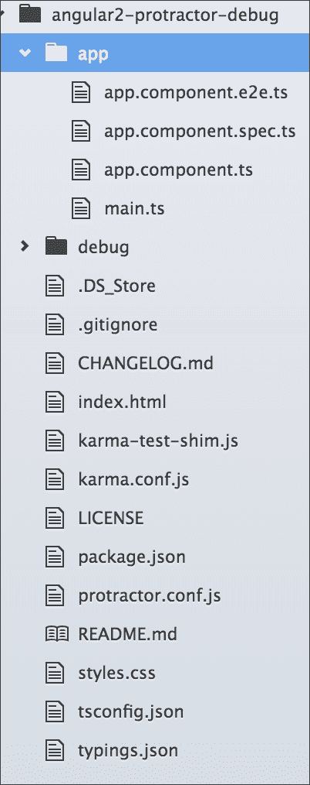
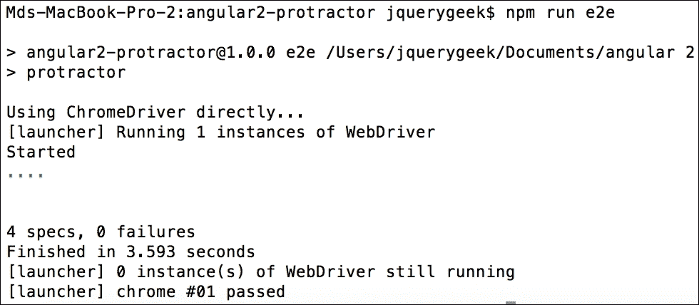
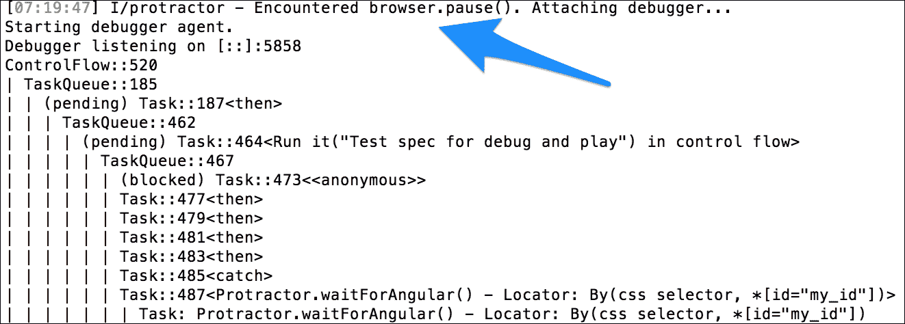
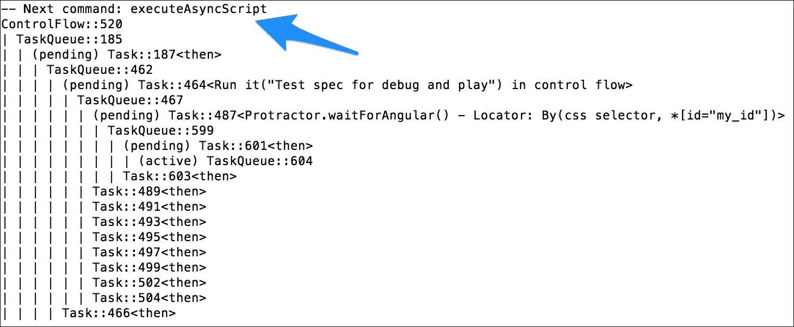
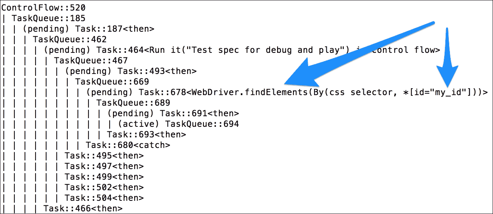
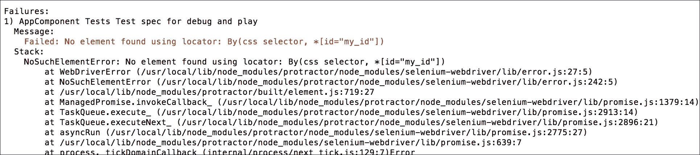
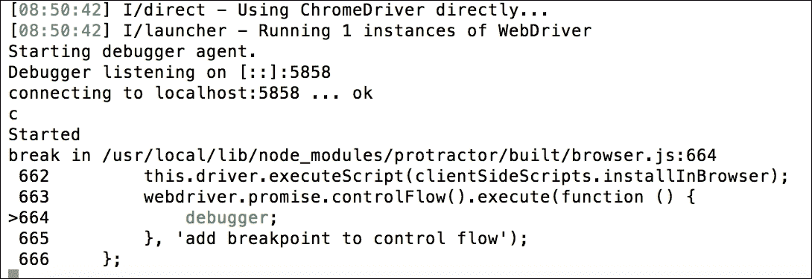

# 第五章：Protractor，更进一步

端到端测试真的很有趣，只要直接与浏览器交互，但是一个好的开发者应该了解 Protractor 的高级功能，以进行大规模的应用程序测试。此外，在端到端测试中调试是一种挑战，因为它取决于浏览器的 DOM 元素。

Protractor 有一些用于调试的 API。本章将主要涵盖这些 API 和功能，包括以下内容：

+   设置和配置 Protractor

+   一些高级的 Protractor API，比如 browser，locator 和 action

+   使用`browser.pause()`和`browser.debug()`API 来调试 Protractor

# 高级设置和配置

在上一章中，我们看到了 Protractor 的基本和常用的设置和配置。在这里，我们将看一些高级配置，使安装更简单和更强大。

## 全局安装 Protractor

以下是全局安装 Protractor 的步骤：

1.  一旦 Node.js 被安装并在命令提示符中可用，输入以下命令在系统上全局安装 Protractor：

```ts
**$ npm install -g protractor**

```

上一条命令使用了 Node 的`npm`命令全局安装 Protractor，这样我们就可以只用`protractor`命令来使用 Protractor 了。

1.  测试 Protractor 版本是否可以如下确定：

```ts
**$ protractor --version**

```

## 高级配置

在本节中，我们将使用以下步骤对 Protractor 进行更详细的配置：

1.  更新 protractor 的`config`文件以支持单个测试套件中的多个浏览器。`multiCapabilities`参数是一个数组，可以为任何测试套件传递多个`browserName`对象，如下所示：

```ts
        exports.config = {  
          //...  
        multiCapabilities: [{
         'browserName': 'firefox' 
        }, { 
         'browserName': 'chrome' 
        }]
        //... };
```

1.  我们可以在`capabilities`参数中为浏览器设置高级设置；例如，对于`chrome`，我们可以传递额外的参数作为`chromeOptions`，如下所示：

```ts
        exports.config = {  
          //...  
          capabilities: { 
            'browserName': 'chrome'
            'chromeOptions': {
              'args': ['show-fps-counter=true']
            }}]
        //... };
```

1.  有时，我们可能需要直接运行 Protractor 而不使用 Selenium 或 WebDriver。这可以通过在`config.js`文件中传递一个参数来实现。该参数是配置对象中的`directConnect: true`，如下所示：

```ts
        exports.config = { 
          //... 
          directConnect: true, 
          //... 
        }; 

```

太棒了！我们已经配置了 Protractor 更进一步。

# Protractor API

端到端测试任何网页的主要活动是获取该页面的 DOM 元素，与它们交互，为它们分配一个动作，并与它们共享信息；然后，用户可以获取网站的当前状态。为了使我们能够执行所有这些操作，Protractor 提供了各种各样的 API（其中一些来自 web driver）。在本章中，我们将看一些常用的 API。

在上一章中，我们看到了 Protractor 如何与 Angular 项目一起工作，我们需要与 UI 元素进行交互。为此，我们使用了一些 Protractor API，比如`element.all`，`by.css`，`first`，`last`和`getText`。然而，我们没有深入了解这些 API 的工作原理。要理解 Protractor 中 API 的工作原理非常简单，但在现实生活中，我们大多数时候将不得不处理更大、更复杂的项目。因此，重要的是我们了解并更多地了解这些 API，以便与 UI 进行交互并玩耍。

## 浏览器

Protractor 与 Selenium WebDriver 一起工作，后者是一个浏览器自动化框架。我们可以使用 Selenium WebDriver API 中的方法来与测试规范中的浏览器进行交互。我们将在接下来的章节中看一些这些方法。

要将浏览器导航到特定的网址并在 Angular 加载之前加载该页面的模拟模块，我们将使用`.get()`方法，通过传递特定的地址或相对路径：

```ts
browser.get(url); 
browser.get('http://localhost:3000'); // This will navigate to
the localhost:3000 and will load mock module if needed 

```

要获取当前页面的网址，使用`CurrentUrl()`方法，如下所示：

```ts
browser.getCurrentUrl(); // will return http://localhost:3000 

```

要导航到另一个页面并使用页面内导航进行浏览，使用`setLocation`，如下所示：

```ts
browser.setLocation('new-page'); // will change the url and navigate to the new url, as our current url was http://localhost:3000, now it will change and navigate to http://locahost:3000/#/new-page 

```

要获取当前页面的标题（基本上是在 HTML 页面中设置的标题），使用`getTitle`方法，如下所示：

```ts
browser.getTitle(); // will return the page title of our page, for us it will return us "Angular Protractor Debug" 

```

要在 Angular 加载之前使用模拟模块重新加载当前页面，使用`refresh()`方法，如下所示：

```ts
browser.refresh(); // this will reload the full page and definitely will load the mocks module as well. 

```

要暂停测试过程，使用`pause()`方法。这对于调试测试过程非常有用，我们将使用这个测试调试部分：

```ts
browser.pause(); 

```

为了调试测试过程，使用`debugger()`方法。这个方法是不同的，可以被认为是`pause()`方法的高级版本。这对于测试过程的高级调试以及将自定义辅助函数注入到浏览器中非常有用。我们也将使用这个测试调试部分：

```ts
browser.debugger(); 

```

要关闭当前浏览器，使用`close()`。这对于复杂的多模块测试非常有用，有时我们需要在打开新浏览器之前关闭当前浏览器：

```ts
browser.close(); 

```

为了在 Protractor 中支持 Angular，我们必须将`useAllAngularAppRoots`参数设置为`true`。这样做的逻辑是，当我们将此参数设置为`true`时，它将在元素查找器遍历页面时搜索所有 Angular 应用程序：

```ts
browser.useAllAngular2AppRoots; 

```

## Elements

### 提示

Protractor 本身暴露了一些全局函数，`element`就是其中之一。这个函数接受一个定位器（一种选择器--我们将在下一步中讨论），并返回一个`ElementFinder`。这个函数基本上是根据定位器找到单个元素，但它支持多个元素的选择，以及链式调用另一个方法`element.all`，它也接受一个定位器并返回一个`ElementFinderArray`。它们都支持链式方法进行下一步操作。

### element.all

正如我们已经知道的那样，`element.all`返回一个`ElementArrayFinder`，支持链式方法进行下一步操作。我们将看一下其中一些方法以及它们的实际工作方式：

要选择多个具有特定定位器的元素数组，我们应该使用`element.all`，如下所示：

```ts
element.all(Locator); 
var elementArr = element.all(by.css('.selector'));  // return the ElementFinderArray 

```

在将一堆元素作为数组获取之后，我们可能需要选择特定的元素。在这种情况下，我们应该通过传递特定的数组索引作为位置号来链接`get(position)`：

```ts
element.all(Locator).get(position); 
elementArr.get(0); // will return first element from the ElementFinderArray  

```

在将一堆元素作为数组获取之后，我们可能需要再次选择子元素并使用首选的定位器，为此我们可以再次使用现有元素链接`.all(locator)`方法，如下所示：

```ts
element.all(Locator).all(Locator); 
elementArr.all(by.css('.childSelector')); // will return another ElementFinderArray as child elements based on child locator  

```

获取所需的元素之后，我们可能想要检查所选择的元素数量是否符合预期。有一个名为`count()`的方法，用于链到获取所选元素的总数：

```ts
element.all(Locator).count(); 
elementArr.count(); // will return the total number in the select element's array   

```

与`get(position)`方法类似，我们可以通过链接`first()`方法从数组中获取第一个元素：

```ts
element.all(Locator).first(); 
elementArr.first(); // will return the first element from the element's array   

```

与`first()`方法类似，我们可以通过链接`last()`方法从数组中获取最后一个元素：

```ts
element.all(Locator).last(); 
elementArr.last(); // will return the last element from the element array   

```

只要我们有一堆元素作为数组，我们可能需要遍历这些元素以执行任何操作。在这种情况下，我们可能需要通过链接`each()`方法来进行循环：

```ts
element.all(Locator).each(Function) { }; 
elementArr.each( function (element, index) { 
    // ......  
}); // ... will loop through out the array elements 

```

就像`each()`方法一样，还有另一个方法`filter()`，可以与元素数组链接以遍历项目并为它们分配一个过滤器：

```ts
element.all(Locator).filter(Function) { }; 
elementArr.filter( function (element, index) { 
    // ......  
}); //... will apply filter function's action to all elements  

```

### element

`element`类返回`ElementFinder`，这意味着元素数组中的单个元素，它也支持链接方法以进行下一个操作。在前面的示例中，我们看到了如何从元素数组中获取单个选择的元素，以便所有链接方法也适用于该单个元素。有许多用于操作单个元素的链接方法，我们将看一些最常用的方法。

通过将特定的定位器作为参数传递给`element`方法，我们可以选择单个 DOM 元素，如下所示：

```ts
element(Locator); 
var elementObj = element(by.css('.selector'));  // return the ElementFinder based on locator  

```

获取特定的单个元素后，我们可能需要找到该元素的子元素，然后使用`element.all`方法与重新运行的`elementFinder`对象链接。为此，将特定的定位器传递给`elementFinderArray`以查找子元素，如下所示：

```ts
element(Locator).element.all(Locator); 
elementObj.element.all(by.css('.childSelector')); // will return another ElementFinderArray as child elements based on child locator  

```

在选择特定元素后，我们可能需要检查该元素是否存在，同时链接`isPresent()`方法，如下所示：

```ts
element(Locator).isPresent(); 
elementObj.isPresent(); // will return boolean if the selected element is exist or not.   

```

## 操作

操作主要是改变影响或触发所选 DOM 元素的方法。选择 DOM 元素的目的是通过触发一些操作与其交互，以便它可以像真正的用户一样行动。有一些常用的用于特定交互的操作。我们将在这里看一些。

要获取任何元素的内部文本或包含的文本，我们必须在选择特定元素后，将`getText()`方法与`elementFinder`对象链接，如下所示：

```ts
element(Locator).getText(); 
var elementObj = element(by.css('.selector'));  // return the ElementFinder based on locator  
elementObj.getText(); // will return the contained text of that specific selected element  

```

要获取任何元素的内部 HTML，我们必须在选择特定元素后，将`getInnerHtml()`方法与`elementFinder`对象链接，如下所示：

```ts
element.(Locator).getInnerHtml(); 
elementObj.getInnerHtml(); // will return the inner html of the selected element.  

```

通过将属性键传递给`getAttribute()`方法，我们可以找到任何元素的特定属性值，并将其与所选的`elementFinder`对象链接，如下所示：

```ts
element(Locator).getAttribute('attribute'); 
elementObj.getAttribute('data'); // will return the value of data attribute of that selected element if that have that attribute 

```

在大多数情况下，我们需要清除输入字段的值。为此，我们可以将`clear()`方法与所选的`elementFinder`对象链接，如下所示：

```ts
element.(Locator).clear(); 
elementObj.clear(); // Guessing the elementFinder is input/textarea, and after calling this clear() it will clear the value and reset it.    

```

### 提示

请记住，只有输入或文本可能具有一些值，并且需要您清除/重置该值。

当我们需要在选择特定的`elementFinder`对象后触发按钮、链接或图像的点击事件时，我们需要链接`click()`方法，它将像真正的点击那个元素一样：

```ts
element.(Locator).click(); 
elementObj.click(); // will trigger the click event as the selected element chaining it.    

```

有时，我们可能需要触发`submit()`方法进行表单提交。在这种情况下，我们必须将`submit()`方法与所选元素链接起来。所选元素应该是一个`form`元素：

```ts
element.(Locator).submit(); 
elementObj.submit(); // Will trigger the submit for the form 
element as submit() work only for form element.   

```

## 定位器

定位器告诉 Protractor 如何在 DOM 元素中找到某个元素。Protractor 将`locator`作为全局工厂函数导出，将与全局`by`对象一起使用。根据我们的 DOM，我们可以以许多方式使用它们，但让我们看看一些最常用的方式。

我们可以通过将任何 CSS 选择器之一传递给`by.css`方法来选择任何元素，如下所示：

```ts
element(by.css(cssSelector));  
element.all(by.css(cssSelector)); 
<span class="selector"></span> 
element.all(by.css('.selector'));  // return the specific DOM element/elements that will have selector class on it 

```

我们可以通过将其元素 ID 传递给`by.id`方法来选择任何元素，如下所示：

```ts
element(by.id(id)); 
<span id="selectorID"></span>   
element(by.id('selectorID')); // return the specific DOM element that will have selectorID as element id on it  

```

我们还可以通过将其传递给`by.tagName`来选择特定的元素或元素标签名，如下所示：

```ts
element(by.tagName(htmlTagName)); 
element.all(by.tagName(htmlTagName)); 
<span data="myData">Content</span> 
element.all(by.tagName('span')); // will return the DOM element/elements of all span tag.  

```

要选择任何特定输入字段的 DOM 元素，我们可以在`by.name`方法中传递名称，如下所示：

```ts
element(by.name(elementName)); 
<input type="text" name="myInput"> 
element(by.name('myInput')); // will return the specific input field's DOM element that have name attr as myInput 

```

除了 CSS 选择器或 ID 之外，我们还可以通过将其文本标签传递给`by.buttonText`来选择特定的按钮：

```ts
<button name="myButton">Click Me</button> 
element(by.buttonText('Click Me')); // will return the specific button that will have Click Me as label text  
element(by.buttonText(textLabel)); 

```

我们可以通过将模型名称定义为`ng-model`传递给`by.model`来查找元素，如下所示：

```ts
element.(by.model); 
<span ng-model="userName"></span> 
element(by.model('userName')); // will return that specific element which have defined userName as model name    

```

同样，我们可以通过在`by.bindings`中定义的绑定`ng-bind`来查找特定的 DOM 元素，如下所示：

```ts
element.(by.binding); 
<span ng-bind="email"></span> 
element(by.binding('email')); // will return the element that have email as bindings with ng-bind  

```

除了之前解释的所有定位器，还有另一种找到特定 DOM 元素的方法：自定义定位器。在这里，我们必须使用`by.addLocator`创建一个自定义定位器，通过传递定位器名称和回调。然后，我们必须通过`by.customLocatorName(args)`传递该自定义定位器，如下所示：

```ts
element.(by.locatorName(args)); 
<button ng-click="someAction()">Click Me</button> 
by.addLocator('customLocator', function(args) { 
    // .....  
}) 
element(by. customLocator(args)); // will return the element that will match with the defined logic in the custom locator. This useful mostly when user need to select dynamic generated element.  

```

# Protractor 测试-事后分析

调试 e2e 测试有点困难，因为它们依赖于应用程序的整个生态系统。有时它们依赖于先前的操作，比如登录，有时它们依赖于权限。调试 e2e 的另一个主要障碍是它依赖于 WebDriver。由于它在不同的操作系统和浏览器上的行为不同，这使得调试 e2e 变得困难。除此之外，它生成了很长的错误消息，这使得很难区分与浏览器相关的问题和测试过程中的错误。

尽管如此，我们将尝试调试所有的 e2e 测试，看看对我们的情况有何作用。

## 失败类型

测试套件失败可能有各种原因，因为它依赖于 WebDriver 和系统中的各个部分。

让我们看看一些已知的失败类型：

+   **WebDrive 失败**：当命令无法完成时，WebDriver 会抛出错误。例如，浏览器无法获取定义的地址来帮助它导航，或者可能找不到预期的元素。

+   **WebDriver 意外失败**：有时，WebDriver 会因无法更新 Web 驱动程序管理器而失败并报错。这是一个与浏览器和操作系统相关的问题，尽管不常见。

+   **Angular 的 Protractor 失败**：当 Protractor 在库中找不到预期的 Angular 时，Protractor 会失败，因为 Protractor 测试依赖于 Angular 本身。

+   **Protractor Angular2 失败**：当配置中缺少`useAllAngular2AppRoots`参数时，Protractor 将在 Angular 项目的测试规范中失败，因为没有这个参数，测试过程将只查看一个单一的根元素，而期望在过程中有更多的元素。

+   **Protractor 超时失败**：有时，当测试规范陷入循环或长时间等待并且无法及时返回数据时，Protractor 会因超时而失败。但是，超时是可配置的，因此可以根据需要增加。

+   **期望失败**：这是测试规范中常见的失败。

## 加载现有项目

本测试中使用的代码来自第四章*使用 Protractor 进行端到端测试*。我们将代码复制到一个新目录：`angular-protractor-debug`。

作为提醒，该应用程序是一个待办事项应用程序，其中有一些待办事项列表，并且我们向其中添加了一些项目。它有一个单一的组件类`AppComponent`，其中有一个项目列表和一个`add`方法。

当前目录应该按以下结构组织：



在验证文件夹结构与前面截图中显示的相同之后，第一步是通过运行以下命令在本地获取所需的依赖项`node_modules`：

```ts
**$ npm install**

```

这将安装所有所需的模块。现在，让我们使用`npm`命令构建和运行项目：

```ts
**$ npm start**

```

现在一切应该都没问题了：项目应该在`http://localhost:3000`上运行，并且输出应该如下所示：


有了这个，我们就可以继续实现在我们的 Angular 项目中加入调试器的下一步了。

## 在项目中包含调试器

在将调试器添加到我们的项目之前，让我们在现有项目中运行 e2e 测试。我们希望在 e2e 测试规范中没有任何失败的情况下通过。

让我们使用以下命令运行它：

```ts
**$ npm run e2e**

```

如预期，我们的测试通过了。结果如下：



我们可以在已通过的测试规范所在的位置添加我们的调试代码，但让我们将已通过的测试用例与调试器分开，并在不同的目录中进行调试。让我们创建一个新目录，`debug/`。我们需要该目录中的两个文件：一个用于配置，另一个用于规范。

对于 Protractor 配置文件，我们可以复制`protractor.conf.js`文件并将其重命名为`debugConf.js`。

配置中的一切都与先前的配置相同。但是，我们需要增加 Jasmine 测试的默认超时时间，否则在调试过程中测试将超时。

让我们将超时时间增加到`3000000`毫秒：

```ts
exports.config = { 
    // ....  
    jasmineNodeOpts: { 
      showColors: true, 
      defaultTimeoutInterval: 3000000 
    }, 
    // ..... 
}; 

```

接下来，我们将需要一个规范文件来编写测试规范和调试测试。将新的规范文件保存为`app.debug.e2e.ts`。哦是，我们需要再次更改配置文件以定义调试的规范文件。

```ts
exports.config = { 
    // ....  
    specs: [ 
      'app.debug.e2e.js' 
    ], 
    // ..... 
}; 

```

我们可以为`app.debug.e2e.ts`创建一个简单的测试规范文件。然后，我们可以添加调试代码并进行调试。

简单的测试规范如下所示：

```ts
describe('AppComponent Tests', () => { 
    beforeEach(() => { 
        browser.get('/'); 
    }); 

    it('Test spec for debug and play', () => { 

    }); 
}); 

```

# 暂停和调试

要调试任何测试规范，我们必须暂停测试过程并逐步查看发生了什么。Protractor 也有内置方法来暂停测试过程。以下是两种暂停和调试测试过程的方法：

+   `browser.pause()`

+   `browser.debugger()`

## 使用暂停

使用`browser.pause()`命令，调试 Protractor 测试变得简单而容易。使用`pause()`方法，我们可以进入 Protractor 调试器控制流，并执行一些命令来检查测试控制流中发生了什么。大多数情况下，开发人员在测试失败并出现未知错误以及出现长错误消息时使用调试器。

使用`browser.pause()`命令后，我们可以根据需要使用更多命令。

让我们简要看一下：

+   `c`：如果我们将`c`作为一个命令输入，它将在测试中向前移动一步，我们将深入了解测试命令的工作原理。如果我们计划继续进行测试，最好快点进行，因为会有超时问题（Jasmine 默认超时），我们已经了解过了。稍后我们会看到一个例子。

+   `repl`：通过输入`repl`作为命令，我们可以进入调试的交互模式。它被称为交互模式，因为我们可以直接从终端与浏览器交互，通过输入 WebDriver 命令。浏览器的响应、结果或错误也将显示在终端上。稍后我们将看到更多实际的例子。

+   `Ctrl + C`：按下***Ctrl*** + C 退出暂停模式并继续测试。当我们使用这个时，测试将从暂停的地方继续。

### 一个快速的例子

要在测试规范中使用`browser.pause()`，我们将在测试规范中的希望暂停测试并观察控制流的地方添加该方法。在这里，我们只有一个测试规范，有一个错误/失败的测试用例，我们知道它会失败，我们将找出失败的原因。

我们将如所示将`pause()`方法添加到测试`spec it() {}`函数中：

```ts
it('Test spec for debug and play', () => { 
  browser.pause(); 
  // There is not element with the id="my_id", so this will fail
  the test 
  expect(element(by.id('my_id')).getText()).toEqual('my text') 
});  

```

现在是时候运行测试了。由于我们已经将调试器的测试规范分开，我们将通过 Protractor（而不是`npm`）运行测试。

让我们用以下命令运行测试：

```ts
**$ protractor debug/debugConf.js**

```

由于我们在`expect()`方法之前放置了`browser.pause()`方法，它将在那里暂停。我们可以看到在控制流中，这使得它等待 Angular：



我们将继续前进；为此，让我们输入`C`。它将运行`executeAsyncScript`并等待 Angular 加载：



我们将再向前迈出一步，输入`C`。它将尝试根据我们提供的定位器选择元素，即`element(by.id('my_id')`：



现在我们接近获得测试结果了。为此，我们将再向前迈出一步，输入`C`。现在，它将尝试根据定位器选择元素，并且将无法选择。这将产生一个带有错误消息的结果，正如预期的那样：



### 使用交互模式进行调试

要进入交互模式，我们必须输入`repl`，之后可以运行测试规范中使用的任何命令。

让我们找到元素及其文本：

```ts
> element(by.id('my_id')).getText() 

```

结果与之前一样，通过逐步前进，输入`C`。

**结果**：`NoSuchElementError: 使用定位器未找到元素：By (css 选择器，` `*[id="my_id"])`

现在，让我们看看当`element`将被找到时，交互模式如何为有效的定位器工作：

```ts
> element.all(by.css('li')).first().getText() 

```

**结果**：`测试`

## 使用调试器

使用 `browser.debugger()` 命令进行调试比使用 `browser.pause()` 更复杂和更高级。使用 `browser.pause()` 命令，我们可以暂停测试的控制流，并将自定义辅助函数注入到浏览器中，以便调试的方式与我们在浏览器控制台中调试的方式相同。

这种调试应该在节点调试模式下进行，就像在 Protractor 调试中一样。这种调试对于不擅长节点调试的人来说并不有用。

这是一个例子：

要在测试规范中使用 `browser.debugger()` 方法，我们将不得不在测试规范中添加该方法，以设置断点并观察控制流。

对于我们来说，我们必须添加 `debugger()` 方法，如下所示，到 `test spec it() {}` 函数中，这将是我们的断点：

```ts
it('Test spec for debug and play', () => { 
  browser.debugger(); 
  // There is not element with the id="my_id", so this will fail 
the test 
  expect(element(by.id('my_id')).getText()).toEqual('my text') 
  });   

```

现在让我们运行它：

```ts
**$ protractor debug debug/debugConf.js**

```

### 注意

要运行调试器，我们必须在 `protractor` 后面添加 `debug`。

运行命令后，我们必须输入 `C` 继续，但这里我们只需要这样做一次。输出如下：



# 自测问题

Q1\. `Selenium WebDriver` 是一个浏览器自动化框架。

+   真

+   假

Q2\. 使用 `browser.debugger()` 是调试 Protractor 的一种简单方法。

+   真

+   假

Q3\. `by.css()`、`by.id()` 和 `by.buttonText()` 被称为什么？

+   元素

+   定位器

+   操作

+   浏览器

# 摘要

Protractor 有各种类型的 API。在本章中，我们试图了解一些最常用的 API，并提供了一些示例。我们还详细介绍了 API 类型（如浏览器、元素、定位器和操作），以及它们如何相互链接。

在本章中介绍了调试，并尝试学习了一种简单的调试方法，使用 `browser.pause()`，然后我们转向了一种复杂的方法（`browser.debugger()`），并了解到复杂的开发人员需要节点调试器经验。

在下一章中，我们将深入研究更多的现实项目；此外，我们将学习自上而下和自下而上的方法，并学会它们。
