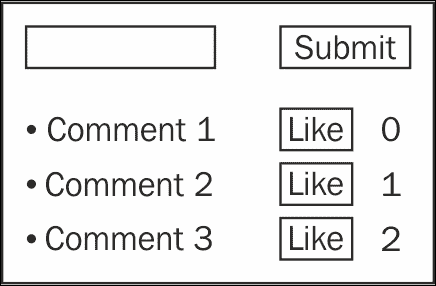
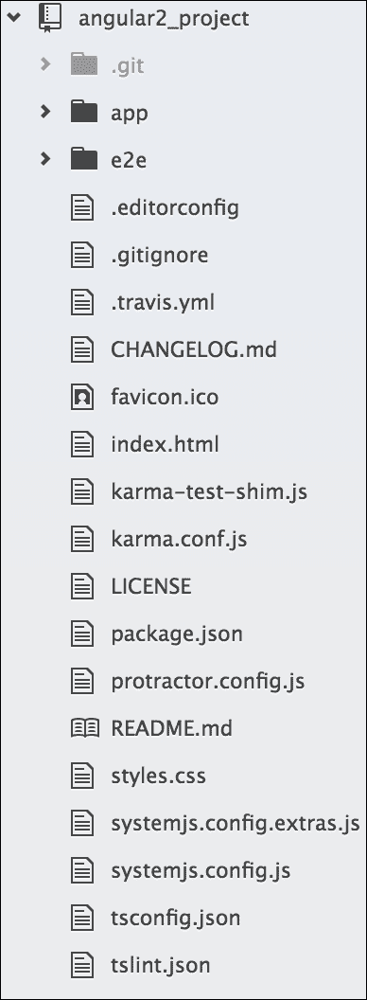
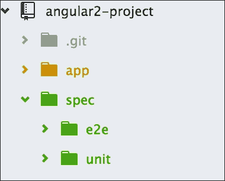
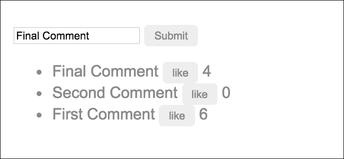

# 第六章：第一步

第一步总是最困难的。本章提供了如何使用 TDD 构建具有组件、类和模型的 Angular 应用程序的初始介绍性漫游。我们将能够开始 TDD 之旅，并看到基本原理的实际应用。到目前为止，本书侧重于 TDD 的基础和所需的工具。现在，我们将转变思路，深入研究 Angular 中的 TDD。

本章将是 TDD 的第一步。我们已经看到如何安装 Karma 和 Protractor，以及如何应用它们的小例子和漫游。在本章中，我们将重点关注：

+   创建一个简单的评论应用程序

+   将 Karma 和 Protractor 与应用程序集成

+   涵盖测试的组件及其相关类

# 准备应用程序的规格

创建一个输入评论的应用程序。应用程序的规格如下：

+   如果我发布了一个新评论，当我点击**提交**按钮时，评论应该被添加到评论列表中

+   当我点击**喜欢**按钮时，评论的喜欢数量应该增加

现在我们有了应用程序的规格，我们可以创建我们的开发待办事项列表。创建整个应用程序的待办事项列表并不容易。根据用户的规格，我们知道需要开发什么。以下是 UI 的草图：



不要急于进行实现，考虑我们将如何使用组件类、`*ngFor`等。抵制，抵制，抵制！虽然我们可以考虑未来的开发方式，但直到我们深入代码，这一切才会变得清晰，这也是我们开始遇到麻烦的地方。TDD 及其原则在这里帮助我们将思绪和注意力放在正确的地方。

# 设置 Angular 项目

在之前的章节中，我们详细讨论了如何设置项目，查看了涉及的不同组件，并走过了整个测试过程。我们将跳过这些细节，并在下一节中提供一个列表，用于初始化操作，以便设置项目并准备好进行单元测试和端到端测试的测试配置。

## 加载现有项目

我们将从 Angular 团队的示例中获取一个简单的 Angular 项目，并对其进行修改以适应我们的实现。

我们将从 Angular GitHub 仓库克隆`quickstart`项目，并从那个开始。除了`node`/`npm`之外，我们应该在全局安装 Git。

```ts
**$ git clone https://github.com/angular/quickstart.git 
    angular-project**

```

这将把项目本地复制为`angular-project`；这个项目可能包含一些额外的文件（它们可能会不断更新），但我们将尽量保持我们的项目文件夹结构看起来像这样：



最初我们将保持简单，然后逐步添加所需的文件。这将使我们更加自信。

让我们继续进行并运行以下命令：

```ts
**$ cd angular-project**
**$ npm install**

```

`npm install`命令将安装项目依赖项所需的模块，这些模块在项目根目录中的`package.json`文件中定义。

## 设置目录

在先前的示例中，我们将组件、单元测试规范和端到端测试规范放在同一个文件夹中，以保持简单。对于一个更大的项目，在同一个文件夹中管理所有这些是困难的。

为了使其更易管理，我们将把测试规范放在一个单独的文件夹中。在这里，我们的示例`quickstart`项目已经将测试规范放在默认文件夹中，但我们将有一个新的结构，并将我们的测试文件放在新的结构中。

让我们开始设置项目目录：

1.  导航到项目的根文件夹：

```ts
        **cd angular-project**

```

1.  初始化测试（`spec`）目录：

```ts
        **mkdir spec**

```

1.  初始化`unit`测试目录：

```ts
        **mkdir spec/unit**

```

1.  初始化端到端（`e2e`）测试目录：

```ts
        **mkdir spec/e2e**

```

初始化完成后，我们的文件夹结构应如下所示：



## 设置 Karma

Karma 的详细信息可以在第三章中找到，*Karma 之道*。在这里，我们将主要看一下 Karma 配置文件。

在这个`quickstart`项目中，我们已经安装并配置了 Karma，并且在项目目录中有`karma.conf.js`文件。

为了确认系统中有 Karma，让我们使用以下命令在全局安装它：

```ts
**npm install -g karma**

```

如前所述，我们已经在这个项目中配置了 Karma 作为`quickstart`项目的一部分，并且我们在项目目录中有`karma.conf.js`文件。

现在我们将看一些每个人都应该知道的基本配置选项。在这个配置文件中，还有一些高级选项，比如测试报告和错误报告。我们将跳过这些，因为在这个初始阶段并不是非常重要。

让我们了解一下我们将需要进一步进行的一些配置。

当我们在服务器上有自定义路径的项目时，`basePath`应该进行更新。目前是`''`，因为该项目在根路径上运行。下一个选项是`frameworks`；默认情况下，我们在这里使用`jasmine`，但是如果我们想使用其他框架，比如`mocha`，我们可以更改框架名称。需要记住的一点是，如果我们计划使用不同的框架，我们将不得不添加相关的插件。

```ts
    basePath: '', 
        frameworks: ['jasmine'], 

```

需要插件，因为 Karma 将使用这些`npm`模块来执行操作；例如，如果我们计划使用 PhantomJS 作为浏览器，我们需要将`'karma-phantomjs-launcher'`添加到列表中：

```ts
    plugins: [ 
            'karma-jasmine', 
            'karma-chrome-launcher' 
    ] 

```

下一个最重要的选项是`files[]`；通过这个，Karma 将包含所有测试所需的文件。它根据依赖加载文件。我们将在`files[]`数组中包含所有所需的文件。

首先，我们将添加`System.js`，因为我们在应用程序中使用`systemjs`作为模块加载器。然后，添加`polyfills`以在所有浏览器上支持 shim，`zone.js`以支持应用程序中的异步操作，RxJS 作为响应式库，Angular 库文件，Karma 测试的 shim，组件文件，最后是测试规范。列表中可能还有一些其他文件用于调试和报告；我们将跳过它们的解释。

我们的`files[]`数组将如下所示：

```ts
    files: [
          // System.js for module loading
          'node_modules/systemjs/dist/system.src.js',

          // Polyfills
          'node_modules/core-js/client/shim.js',
          'node_modules/reflect-metadata/Reflect.js',

          // zone.js
          'node_modules/zone.js/dist/zone.js',
          'node_modules/zone.js/dist/long-stack-trace-zone.js',
          'node_modules/zone.js/dist/proxy.js',
          'node_modules/zone.js/dist/sync-test.js',
          'node_modules/zone.js/dist/jasmine-patch.js',
          'node_modules/zone.js/dist/async-test.js',
          'node_modules/zone.js/dist/fake-async-test.js',

          // RxJs
          { pattern: 'node_modules/rxjs/**/*.js', included: false, 
          watched: false },
          { pattern: 'node_modules/rxjs/**/*.js.map', included: 
          false, watched: false },

          // Paths loaded via module imports:
          // Angular itself
          { pattern: 'node_modules/@angular/**/*.js', included: 
          false, watched: false },
          { pattern: 'node_modules/@angular/**/*.js.map', included: 
          false, watched: false },

          { pattern: 'systemjs.config.js', included: false, watched: 
          false },
          { pattern: 'systemjs.config.extras.js', included: false, 
          watched: false },
          'karma-test-shim.js',

          // transpiled application & spec code paths loaded via 
          module imports
          { pattern: appBase + '**/*.js', included: false, watched: 
          true },
          { pattern: testBase + '**/*.spec.js', included: false, 
          watched: true },
],

```

这就是我们现在在`karma.conf`文件中需要知道的全部。如果需要，我们将通过更新这些设置来进行。

让我们来看看完整的`karma.conf.js`文件：

```ts
module.exports = function(config) {

  var appBase    = 'app/';       // transpiled app JS and map files
  var appSrcBase = 'app/';       // app source TS files
  var appAssets  = 'base/app/'; // component assets fetched by 
  Angular's compiler

  var testBase    = 'spec/unit/';       // transpiled test JS and map 
  files
  var testSrcBase = 'spec/unit/';       // test source TS files

  config.set({
    basePath: '',
    frameworks: ['jasmine'],
    plugins: [
      require('karma-jasmine'),
      require('karma-chrome-launcher'),
      require('karma-jasmine-html-reporter'), // click "Debug" in 
      browser to see it
      require('karma-htmlfile-reporter') // crashing w/ strange 
      socket error
    ],

    customLaunchers: {
      // From the CLI. Not used here but interesting
      // chrome setup for travis CI using chromium
      Chrome_travis_ci: {
        base: 'Chrome',
        flags: ['--no-sandbox']
      }
    },
    files: [
      // System.js for module loading
      'node_modules/systemjs/dist/system.src.js',

      // Polyfills
      'node_modules/core-js/client/shim.js',
      'node_modules/reflect-metadata/Reflect.js',

      // zone.js
      'node_modules/zone.js/dist/zone.js',
      'node_modules/zone.js/dist/long-stack-trace-zone.js',
      'node_modules/zone.js/dist/proxy.js',
      'node_modules/zone.js/dist/sync-test.js',
      'node_modules/zone.js/dist/jasmine-patch.js',
      'node_modules/zone.js/dist/async-test.js',
      'node_modules/zone.js/dist/fake-async-test.js',

      // RxJs
      { pattern: 'node_modules/rxjs/**/*.js', included: false, 
      watched: false },
      { pattern: 'node_modules/rxjs/**/*.js.map', included: false, 
      watched: false },

      // Paths loaded via module imports:
      // Angular itself
      { pattern: 'node_modules/@angular/**/*.js', included: false, 
      watched: false },
      { pattern: 'node_modules/@angular/**/*.js.map', included: 
      false, watched: false },

      { pattern: 'systemjs.config.js', included: false, watched: 
      false },
      { pattern: 'systemjs.config.extras.js', included: false, 
      watched: false },
      'karma-test-shim.js',

      // transpiled application & spec code paths loaded via module 
      imports
      { pattern: appBase + '**/*.js', included: false, watched: true 
      },
      { pattern: testBase + '**/*.spec.js', included: false, watched: 
      true },

      // Asset (HTML & CSS) paths loaded via Angular's component 
      compiler
      // (these paths need to be rewritten, see proxies section)
      { pattern: appBase + '**/*.html', included: false, watched: true 
      },
      { pattern: appBase + '**/*.css', included: false, watched: true 
      },

      // Paths for debugging with source maps in dev tools
      { pattern: appSrcBase + '**/*.ts', included: false, watched: 
      false },
      { pattern: appBase + '**/*.js.map', included: false, watched: 
      false },
      { pattern: testSrcBase + '**/*.ts', included: false, watched: 
      false },
      { pattern: testBase + '**/*.js.map', included: false, watched: 
      false }
    ],

    // Proxied base paths for loading assets
     proxies: {
       // required for component assets fetched by Angular's compiler
       "/app/": appAssets
   },

    exclude: [],
    preprocessors: {},
    // disabled HtmlReporter; suddenly crashing w/ strange socket 
    error
    reporters: ['progress', 'kjhtml'],//'html'],

    // HtmlReporter configuration
    htmlReporter: {
      // Open this file to see results in browser
      outputFile: '_test-output/tests.html',

      // Optional
      pageTitle: 'Unit Tests',
      subPageTitle: __dirname
    },

    port: 9876,
    colors: true,
    logLevel: config.LOG_INFO,
    autoWatch: true,
    browsers: ['Chrome'],
    singleRun: true
  })
};

```

## 测试目录已更新

我们在第三章中看到了`karma-test-shim.js`的详细信息，*Karma 方式*。这是通过 Karma 运行单元测试所需的。

我们已经更改了测试规范目录/位置，并且`karma-test-shim.js`是根据项目的默认结构进行配置的。因为我们已经将测试移动到不同的位置并且不在`app/`文件夹中，我们需要相应地更新`karma-test-shim.js`。

这是需要进行的更改：

```ts
    var builtPath = '/base/'; 

```

## 设置 Protractor

在第四章中，*使用 Protractor 进行端到端测试*，我们讨论了 Protractor 的完整安装和设置。这个示例应用程序已经安装和配置了 Protractor。因此，我们只需要查看`protractor.conf.js`文件。

配置的 Protractor 实例已实现了测试报告。我们将跳过配置文件中的这些部分，只看一下常见的设置选项。

在我们进入配置文件概述之前，为了确保，我们将在系统上全局安装 Protractor：

```ts
**$ npm install -g protractor**

```

更新 Selenium WebDriver：

```ts
**$ webdriver-manager update**

```

我们必须确保 Selenium 已安装。

如预期的那样，`protractor.conf.js`位于应用程序的根目录。这是`protractor.conf.js`文件的完整配置：

```ts
var fs = require('fs'); 
var path = require('canonical-path'); 
var _ = require('lodash'); 

exports.config = { 
  directConnect: true, 

  // Capabilities to be passed to the webdriver instance. 
  capabilities: { 
    'browserName': 'chrome' 
  }, 

  // Framework to use. Jasmine is recommended. 
  framework: 'jasmine', 

  // Spec patterns are relative to this config file 
  specs: ['**/*e2e-spec.js' ], 

  // For angular tests 
  useAllAngular2AppRoots: true, 

  // Base URL for application server 
  baseUrl: 'http://localhost:8080', 

  // doesn't seem to work. 
  // resultJsonOutputFile: "foo.json", 

  onPrepare: function() { 
    //// SpecReporter 
    //var SpecReporter = require('jasmine-spec-reporter'); 
    //jasmine.getEnv().addReporter(new 
    SpecReporter({displayStacktrace: 'none'}));  
    //// jasmine.getEnv().addReporter(new SpecReporter({
    displayStacktrace: 'all'})); 

    // debugging 
    // console.log('browser.params:' +    
    JSON.stringify(browser.params)); 
    jasmine.getEnv().addReporter(new Reporter( browser.params )) ; 

    // Allow changing bootstrap mode to NG1 for upgrade tests 
    global.setProtractorToNg1Mode = function() { 
      browser.useAllAngular2AppRoots = false; 
      browser.rootEl = 'body'; 
    }; 
  }, 

  jasmineNodeOpts: { 
    // defaultTimeoutInterval: 60000, 
    defaultTimeoutInterval: 10000, 
    showTiming: true, 
    print: function() {} 
  } 
};  

```

# 自上而下与自下而上的方法-我们使用哪种？

从开发的角度来看，我们必须确定从哪里开始。本书将讨论的方法如下：

+   **自下而上的方法**：采用这种方法，我们考虑我们将需要的不同组件（类、服务、模块等），然后选择最合乎逻辑的组件并开始编码。

+   **自上而下的方法**：采用这种方法，我们从用户场景和 UI 开始工作。然后我们围绕应用程序中的组件创建应用程序。

这两种方法都有其优点，选择可以基于您的团队、现有组件、需求等。在大多数情况下，最好根据最小阻力来做出选择。

在本章中，规范的方法是自上而下的；一切都为您准备好，从用户场景开始，将允许您有机地围绕 UI 构建应用程序。

# 测试一个组件

在进入交付功能的规范和思维方式之前，重要的是要了解测试组件类的基本知识。在大多数应用程序中，Angular 中的组件是一个关键特性。

## 准备好开始

我们的示例应用程序（`quickstart`）有一些非常基本的单元测试和端到端测试规范。我们将从一开始采用 TDD 方法，因此在实现过程中不会使用任何测试规范和现有组件的代码。

为此，我们可以做的就是清理这个示例应用程序，只保留文件夹结构和应用程序引导文件。

因此，首先，我们必须删除单元测试文件（`app.component.spec.ts`）和端到端测试文件（`app.e2e-spec.ts`）。这两个测试规范存在于应用程序结构中。

## 设置一个简单的组件测试

在测试组件时，将组件注入测试套件中，然后将组件类初始化为第二个任务非常重要。测试确认组件范围内的对象或方法是否按预期可用。

为了在测试套件中拥有组件实例，我们将在测试套件中使用简单的`import`语句，并在`beforeEach`方法中初始化组件对象，以便在测试套件中的每个测试规范中都有组件对象的新实例。以下是一个示例：

```ts
import { async, ComponentFixture, TestBed } from '@angular/core/testing'; 

import {AppComponent} from "../../app.component"; 

describe('AppComponent Tests Suite', () => { 

  let comp: AppComponent; 
  let fixture: ComponentFixture<AppComponent>; 

  beforeEach(async(() => { 
   TestBed.configureTestingModule({ 
      declarations: [ AppComponent ] 
    }) 
    .compileComponents(); 
  })); 

  beforeEach(() => { 
    fixture = TestBed.createComponent(AppComponent); 
    comp = fixture.componentInstance; 

  }); 
}); 

```

因此，只要为每个测试规范初始化组件类，它就会为每个规范创建一个新实例，并且内部范围将根据此进行操作。

## 初始化组件

为了测试组件，重要的是初始化组件类，以便在测试套件的范围内拥有组件对象，并且对象的所有成员都在特定的测试套件周围可用。

只要组件包含渲染 UI 的模板，就需要在开始端到端测试之前初始化组件，并且这取决于 DOM 元素。

因此，当我们计划对任何组件进行端到端测试时，我们应该在 DOM 中初始化它，如下所示：

```ts
<body> 
  <my-app></my-app> 
</body> 

```

## 端到端与组件的单元测试

在前面的示例中，我们看了组件测试套件，这是用于单元测试的，我们需要导入并创建组件类的实例作为单元测试。我们将测试组件中定义的每个方法的功能或特性。

另一方面，对于端到端测试，我们不需要导入或创建组件类的实例，因为我们不需要使用组件对象或其所有成员进行交互。相反，它需要与正在运行的应用程序的登陆页面的 DOM 元素进行交互。

因此，为此，我们需要运行应用程序并将测试套件导航到应用程序的登陆页面，我们可以使用 Protractor 本身提供的全局`browser`对象来实现这一点。

这是一个示例，它应该是这样的：

```ts
import { browser, element, by } from 'protractor'; 

describe('Test suite for e2e test', () => { 
    beforeEach(() => { 
        browser.get(''); 
    }); 
}); 

```

我们可以根据需要使用`browser.get('path')`导航到应用程序的所有 URL。

# 深入我们的评论应用程序

现在设置和方法已经确定，我们可以开始我们的第一个测试。从测试的角度来看，由于我们将使用自顶向下的方法，我们将首先编写我们的 Protractor 测试，然后构建应用程序。我们将遵循我们已经审查过的相同的 TDD 生命周期：首先测试，使其运行，然后使其更好。

## 首先测试

给定的场景已经以规范的格式给出，并符合我们的 Protractor 测试模板：

```ts
describe('', () => { 
    describe('', () => { 
     beforeEach(() => { 
     }); 

      it('', () => { 
      }); 
    }); 
}); 

```

将场景放入模板中，我们得到以下代码：

```ts
describe('Given I am posting a new comment', () => { 
    describe('When I push the submit button', () => { 
        beforeEach(() => { 
            // ...  
        }); 

        it('Should then add the comment', () => { 
            // ... 
        }); 
    }); 
}); 

```

遵循 3A 原则（组装、行动、断言），我们将把用户场景放入模板中。

### 组装

浏览器将需要指向应用程序的第一个页面。由于基本 URL 已经定义，我们可以将以下内容添加到测试中：

```ts
beforeEach(() => { 
    browser.get(''); 
}); 

```

现在测试已经准备好，我们可以继续下一步：行动。

### 行动

根据用户的规范，我们需要做的下一件事是添加一个实际的评论。最简单的方法就是将一些文本放入输入框中。对于这个测试，再次不知道元素将被称为什么或者它将做什么，我们将根据它应该是什么来编写它。

以下是为应用程序添加评论部分的代码：

```ts
beforeEach(() => { 
    ... 
    var commentInput = element(by.css('input')); 
    commentInput.sendKeys('a sample comment'); 
}); 

```

作为测试的一部分，最后一个组件是点击“提交”按钮。在 Protractor 中可以很容易地通过 `click` 函数实现这一点。即使我们还没有页面，或者任何属性，我们仍然可以命名将要创建的按钮：

```ts
beforeEach(() => { 
    ... 
    var submitButton = element(by.buttonText('Submit')).click(); 
}); 

```

最后，我们将击中测试的关键点，并断言用户的期望。

### 断言

用户期望是一旦点击“提交”按钮，评论就会被添加。这有点模糊，但我们可以确定用户需要以某种方式收到评论已添加的通知。

最简单的方法是在页面上显示所有评论。在 Angular 中，这样做的最简单方法是添加一个 `*ngFor` 对象来显示所有评论。为了测试这一点，我们将添加以下内容：

```ts
it('Should then add the comment', () => { 
    var comment = element.all(by.css('li')).first(); 
    expect(comment.getText()).toBe('a sample comment'); 
}); 

```

现在测试已经构建并满足用户的规范。它既小又简洁。以下是完成的测试：

```ts
describe('Given I am posting a new comment', () => { 
    describe('When I push the submit button', () => { 
      beforeEach(() => { 
            //Assemble 
            browser.get(''); 
            var commentInput = element(by.css('input')); 
            commentInput.sendKeys('a sample comment'); 

            //Act 
            var submitButton =  element(by.buttonText
            ('Submit')).click(); 
      }); 

       //Assert 
  it('Should then add the comment', () => { 
            var comment = element.all(by.css('li')).first(); 
            expect(comment.getText()).toBe('a sample comment'); 
  }); 
    }); 
}); 

```

## 使其运行

基于测试的错误和输出，我们将在构建应用程序的过程中进行。

使用以下命令启动 Web 服务器：

```ts
**$ npm start**

```

运行 Protractor 测试以查看第一个错误：

```ts
**$ protractor**

```

或者，我们可以运行这个：

```ts
**$ npm run e2e // run via npm** 

```

我们的第一个错误可能是没有得到定位器期望的元素：

```ts
**$ Error: Failed: No element found using locator: 
    By(css selector, input)**

```

错误的原因很简单：它没有按照定位器中定义的元素获取。我们可以看到当前的应用程序以及为什么它没有获取到元素。

### 总结当前应用程序

只要我们将示例 Angular`quickstart`项目克隆为我们要测试的应用程序，它就具有一个准备好的 Angular 环境。它使用一个简单的应用程序组件定义了“我的第一个 Angular 2 应用程序”作为输出来引导 Angular 项目。

因此，在我们的 TDD 方法中，我们不应该有任何与环境/Angular 引导相关的错误，看起来我们走在了正确的道路上。

让我们看看我们的示例应用程序现在有什么。在我们的首页`index.html`中，我们已经包含了所有必需的库文件，并实现了`system.js`来加载应用程序文件。

在`index.html`文件中的`<body>`标签中，我们已经启动了应用程序，如下所示：

```ts
<body> 
    <my-app>Loading...</my-app> 
</body> 

```

HTML 标签期望一个带有`my-app`作为该组件选择器的组件，是的，我们有`app.component.ts`如下：

```ts
import {Component} from '@angular/core'; 
@Component({ 
    selector: 'my-app', 
    template: '<h1>My First Angular 2 App</h1>' 
}) 
export class AppComponent { } 

```

Angular 引入了`ngModule`作为`appModule`，以模块化和管理每个组件的依赖关系。通过这个`appModule`，应用程序可以一目了然地定义所有所需的依赖关系。除此之外，它还帮助延迟加载模块。我们将在 Angular 文档中详细了解`ngModule`的细节。

它在应用程序中导入了所有必需的模块，从单一入口点声明了所有模块，并且还定义了引导组件。

应用程序总是基于该文件的配置进行引导。

该文件位于应用程序根目录下，名为`app.module.ts`，其内容如下：

```ts
import { NgModule }      from '@angular/core'; 
import { BrowserModule } from '@angular/platform-browser'; 

import { AppComponent }  from './app.component'; 

@NgModule({ 
  imports:      [ BrowserModule], 
  declarations: [ AppComponent ], 
  bootstrap:    [ AppComponent ] 
}) 
export class AppModule { } 

```

应用程序的入口点是`main.ts`文件，它将导入`appModule`文件，并指示根据该文件引导应用程序：

```ts
import { platformBrowserDynamic } from '@angular/platform
-browser-dynamic'; 

import { AppModule } from './app.module'; 

platformBrowserDynamic().bootstrapModule(AppModule); 

```

测试找不到我们的输入定位器。我们需要将输入添加到页面，并且我们需要通过组件的模板来做到这一点。

### 添加输入

以下是我们需要遵循的步骤来将输入添加到页面：

1.  我们将不得不在应用程序组件的模板中添加一个简单的`input`标签，如下所示：

```ts
        template: ` 
        <input type='text' />` 

```

1.  再次运行测试后，似乎与输入定位器相关的错误已经没有了，但是出现了一个新的错误，即`button`标签丢失：

```ts
        **$ Error: Failed: No element found using locator: 
        by.buttonText('Submit')**

```

1.  就像之前的错误一样，我们需要在模板中添加一个`button`，并附上适当的文本：

```ts
        template: ` ...........  
        <button type='button'>Submit</button>` 

```

1.  再次运行测试后，似乎没有与`button`定位器相关的错误，但是又出现了新的错误，如下所示，重复器定位器丢失：

```ts
        **$ Error: Failed: No element found using locator: By
        (css selector, li)**

```

这似乎是我们假设提交的评论将通过`*ngFor`在页面上可用的结果。为了将其添加到页面上，我们将在组件类中使用一个方法来为重复器提供数据。

### 组件

如前所述，错误是因为没有`comments`对象。为了添加`comments`对象，我们将使用具有`comments`数组的组件类。

执行以下步骤将`comments`对象添加到作用域中：

1.  由于我们已经在组件中有`AppComponent`作为一个类，我们需要定义评论数组，我们可以在重复器中使用：

```ts
        export class AppComponent { 
            comments:Array<string>; 
        } 

```

1.  然后，我们将在模板中为评论添加一个重复器，如下所示：

```ts
        template: `..........  
            <ul> 
              <li *ngFor="let comment of comments">{{comment}}</li> 
            </ul>` 

```

1.  让我们运行 Protractor 测试，看看我们的进展：

```ts
        **$   Error: Failed: No element found using locator: By(css
        selector, li)**

```

糟糕！我们仍然得到相同的错误。不过别担心，可能还有其他问题。

让我们看看实际呈现的页面，看看发生了什么。在 Chrome 中，导航到`http://localhost:3000`并打开控制台以查看页面源代码（*Ctrl + Shift + J*）。请注意，重复器和组件都在那里；但是，重复器被注释掉了。由于 Protractor 只查看可见元素，它不会找到列表。

太棒了！现在我们知道为什么重复列表不可见，但是我们必须修复它。为了使评论显示出来，它必须存在于组件的`comments`作用域中。

最小的更改是向数组中添加一些内容以初始化它，如下面的代码片段所示：

```ts
export class AppComponent { 
    comments:Array<string>; 
    constructor() { 
        this.comments = ['First comment', 'Second comment',
        'Third comment']; 
    } 
}; 

```

现在，如果我们运行测试，我们会得到以下输出：

```ts
**$ Expected 'First comment' to be 'a sample comment'.**

```

很好，看起来我们离成功更近了！我们已经解决了几乎所有意外错误并达到了我们的期望。

让我们来看看我们迄今为止所做的更改以及我们的代码是什么样子的。

这是`index.html`文件的`body`标签：

```ts
<body> 
    <my-app>Loading...</my-app> 
</body> 

```

应用组件文件如下：

```ts
import {Component} from '@angular/core'; 

@Component({ 
    selector: 'my-app', 
    template: `<h1>My First Angular 2 App</h1> 
    <input type='text' /> 
    <button type='button'>Submit</button> 
    <ul> 
      <li *ngFor="let comment of comments">{{comment}}</li> 
    </ul>` 
}) 
export class AppComponent { 
    comments:Array<string>; 

    constructor() { 
        this.comments = ['First comment', 'Second comment', 
        'Third comment']; 
    } 
} 

```

## 使其通过

使用 TDD，我们希望添加最小可能的组件来使测试通过。

由于我们目前已经将评论数组硬编码为初始化为三个项目，并且第一个项目为`First comment`，将`First comment`更改为`a sample comment`，这应该使测试通过。

以下是使测试通过的代码：

```ts
export class AppComponent { 
    comments:Array<string>; 
    constructor() { 
        this.comments = ['a sample comment', 'Second comment', 
        'Third comment']; 
    } 
}; 

```

运行测试，哇！我们得到了一个通过的测试：

```ts
**$ 1 test, 1 assertion, 0 failures**

```

等一下！我们还有一些工作要做。虽然我们让测试通过了，但还没有完成。我们添加了一些黑客技巧，只是为了让它通过。有两件事引人注目：

+   我们单击了实际上没有任何功能的“提交”按钮

+   我们对评论的预期值进行了硬编码初始化

在我们继续之前，上述更改是我们需要执行的关键步骤。它们将在 TDD 生命周期的下一个阶段中解决，即使其更好（重构）。

## 使其更好

需要重新设计的两个组件如下：

+   为“提交”按钮添加行为

+   删除评论的硬编码值

### 实现“提交”按钮

“提交”按钮需要实际做一些事情。我们可以通过硬编码值来绕过实现。使用我们经过验证的 TDD 技术，转而采用专注于单元测试的方法。到目前为止，重点一直放在 UI 上并将更改推送到代码上；我们还没有编写单个单元测试。

在接下来的工作中，我们将转变思路，专注于通过测试驱动“提交”按钮的开发。我们将遵循 TDD 生命周期（先测试，使其运行，然后使其更好）。

#### 配置卡尔玛

我们在第三章中为待办事项列表应用程序做了非常类似的事情，“卡尔玛方式”。我们不会花太多时间深入到代码中，所以请查看以前的章节，以深入讨论一些属性。

以下是我们需要遵循的配置卡尔玛的步骤：

1.  使用添加的文件更新`files`部分：

```ts
        files: [ 
            ... 
            // Application files 
            {pattern: 'app/**/*.js', included: false, watched: 
            true} 

            // Unit Test spec files 
            {pattern: 'spec/unit/**/*.spec.js', included: false,
            watched: true} 
            ... 
        ], 

```

1.  启动卡尔玛：

```ts
        **$ karma start**

```

1.  确认卡尔玛正在运行：

```ts
        **$ Chrome 50.0.2661 (Mac OS X 10.10.5): Executed 0 of 0 
        SUCCESS (0.003 secs / 0 secs)**

```

#### 先测试

让我们从`spec/unit`文件夹中的新文件开始，名为`app.component.spec.ts`。这将包含单元测试的测试规范。我们将使用基本模板，包括所有必要的导入，如`TestBed`：

```ts
    describe('', () => { 
     beforeEach(() => { 
     }); 

      it('', () => { 
      }); 
    }); 

```

根据规范，当单击“提交”按钮时，需要添加评论。我们需要填写测试的三个组成部分（组装、行动和断言）的空白。

组装

行为需要成为前端组件的一部分来使用。在这种情况下，测试的对象是组件的范围。我们需要将这一点添加到这个测试的组装中。就像我们在第三章中所做的那样，“卡尔玛方式”，我们将在以下代码中做同样的事情：

```ts
import {AppComponent} from "../../app/app.component"; 

describe('AppComponent Unit Test', () => { 
    let comp: AppComponent; 
    let fixture: ComponentFixture<AppComponent>; 

    beforeEach(() => { fixture = TestBed.create
    Component(AppComponent); 
      comp = fixture.componentInstance; 

    }); 
}); 

```

现在，`component`对象及其成员在测试套件中可用，并将如预期般进行测试。

**行动**

规范确定我们需要在组件对象中调用`add`方法。将以下代码添加到测试的`beforeEach`部分：

```ts
beforeEach(() => { comp.add('a sample comment'); 
}); 

```

现在，断言应该获取第一个评论进行测试。

**断言**

断言`component`对象中的评论项现在包含任何评论作为第一个元素。将以下代码添加到测试中：

```ts
it('',function(){ 
  expect(com.comments[0]).toBe('a sample comment'); 
}); 

```

保存文件，让我们继续进行生命周期的下一步并运行它（执行）。

#### 让它运行

现在我们已经准备好测试，我们需要让测试通过。查看 Karma 运行时的控制台输出，我们看到以下内容：

```ts
**$ TypeError: com.add is not a function**

```

查看我们的单元测试，我们看到这是`add`函数。让我们继续按照以下步骤将`add`函数放入控制器的`scope`对象中：

1.  打开控制器范围并创建一个名为`add`的函数：

```ts
        export class AppComponent { 
            ............. 
            add() { 
            // .... 
            } 
        } 

```

1.  检查 Karma 的输出，让我们看看我们的进展：

```ts
        **$ Expected 'First comment' to be 'a sample comment'.**

```

1.  现在，我们已经达到了期望。记住要考虑最小的改变来使其工作。修改`add`函数，将`$scope.comments`数组设置为任何评论：

```ts
        export class AppComponent { 
            ............. 
            add() { 
                this.comments.unshift('a sample comment'); 
            } 
        }; 

```

### 注意

`unshift`函数是一个标准的 JavaScript 函数，它将一个项目添加到数组的开头。

当我们检查 Karma 的输出时，我们会看到以下内容：

```ts
**$ Chrome 50.0.2661 (Mac OS X 10.10.5): Executed 1 of 1 
    SUCCESS (0.008 secs / 0.002 secs)**

```

成功！测试通过了，但还需要一些工作。让我们继续进行下一阶段并改进它（重构）。

#### 让它变得更好

需要重构的主要点是`add`函数。它不接受任何参数！这应该很容易添加，并且只是确认测试仍然运行。更新`app.component.ts`的`add`函数，以接受一个参数并使用该参数添加到`comments`数组中：

```ts
export class AppComponent { 
    ............. 
    add(comment) { 
        this.comments.unshift(comment); 
    } 
}; 

```

检查 Karma 的输出窗口，并确保测试仍然通过。完整的单元测试如下所示：

```ts
import {AppComponent} from "../../app/app.component"; 

describe('AppComponent Tests', () => { 
    let comp: AppComponent; 
    let fixture: ComponentFixture<AppComponent>; 

    beforeEach(() => { 
        fixture = TestBed.createComponent(AppComponent); 
        comp = fixture.componentInstance;         
        comp.add('a sample comment'); 
    }); 

    it('First item inthe item should match', () => { 
        expect(com.comments[0]).toBe('a sample comment'); 
    }); 
}); 

```

`AppComponent`类文件现在是这样的：

```ts
import {Component} from '@angular/core'; 

@Component({ 
    selector: 'my-app', 
    template: `<h1>My First Angular 2 App</h1> 
    <input type='text' /> 
    <button type='button'>Submit</button> 
    <ul> 
      <li *ngFor="let comment of comments">{{comment}}</li> 
    </ul>` 
}) 
export class AppComponent { 
    comments:Array<string>; 

    constructor() { 
        this.comments = ['First comment', 'Second comment', 
        'Third comment']; 
    } 
    add(comment) { 
        this.comments.unshift(comment); 
    } 
} 

```

### 备份测试链

我们完成了单元测试并添加了`add`函数。现在我们可以添加函数来指定**提交**按钮的行为。将`add`方法链接到按钮的方法是使用`(click)`事件。添加行为到**提交**按钮的步骤如下：

1.  打开`app.component.ts`文件并进行以下更新：

```ts
        @Component({ 
           template: `....... 
            <button type="button" (click)="add('a sample      
            comment')">Submit</button> 
            ...........` 
        }) 

```

等等！这个值是硬编码的吗？好吧，我们再次希望做出最小的更改，并确保测试仍然通过。我们将不断进行重构，直到代码达到我们想要的状态，但我们不想采取大爆炸的方式，而是希望进行小的、增量的改变。

1.  现在，让我们重新运行 Protractor 测试，并确保它仍然通过。输出显示它通过了，我们没问题。硬编码的值没有从注释中删除。让我们继续并立即删除它。

1.  `AppComponent` 类文件现在应该如下所示：

```ts
        constructor() { 
            this.comments = []; 
        } 

```

1.  运行测试，看到我们仍然得到一个通过的测试。

我们需要清理的最后一件事是 `(click)` 中的硬编码值。添加的评论应该由评论输入文本中的输入确定。

## 绑定输入

以下是我们需要遵循的绑定输入的步骤：

1.  为了能够将输入绑定到有意义的东西，将 `ngModel` 属性添加到 `input` 标签中：

```ts
        @Component({ 
            template: `............. 
            <input type="text" [(ngModel)]="newComment"> 
            ...........` 
        }) 

```

1.  然后，在 `(click)` 属性中，简单地使用 `newComment` 模型作为输入：

```ts
        @Component({ 
           template: `....... 
            <button type="button" (click)="add(newComment)">
            Submit</button> 
            ...........` 
        }) 

```

1.  我们将不得不在应用程序模块（`app.module.ts`）中导入表单模块，因为它是 `ngModel` 的依赖项：

```ts
        import { FormsModule }   from '@angular/forms'; 
        @NgModule({ 
        imports: [ BrowserModule, FormsModule ], 
        }) 

```

1.  运行 Protractor 测试，并确认一切都通过了，可以进行。

# 向前迈进

现在我们已经让第一个规范工作了，并且它是端到端和单元测试的，我们可以开始下一个规范。下一个规范说明用户希望能够喜欢一条评论。

我们将采用自上而下的方法，从 Protractor 开始我们的测试。我们将继续遵循 TDD 生命周期：先测试，使其运行，然后使其更好。

## 先测试

按照模式，我们将从一个基本的 Protractor 测试模板开始：

```ts
describe('', () => { 
     beforeEach(() => { 
     }); 

      it('', () => { 
      }); 
    }); 

```

当我们填写规范时，我们得到以下结果：

```ts
describe('When I like a comment', () => { 
    beforeEach(() => { 
    }); 

    it('should then be liked', () => { 
      }); 
}); 

```

有了模板，我们准备构建测试。

### 组装

这个测试的组装将需要存在一个评论。将评论放在现有的发布评论测试中。它应该看起来类似于这样：

```ts
describe(''Given I am posting a new comment', () => { 
    describe('When I like a comment', () => { 
    ... 
    }); 
}); 

```

### 行动

我们测试的用户规范是**Like**按钮对特定评论执行操作。以下是需要的步骤和执行它们所需的代码（请注意，以下步骤将添加到 `beforeEach` 文本中）：

1.  存储第一条评论，以便在测试中使用：

```ts
        var firstComment = null; 
        beforeEach(() => { 
            ... 
        } 

```

1.  找到第一条评论的 `likeButton`：

```ts
        var firstComment = element.all(by.css('li').first(); 
        var likeButton = firstComment.element(by.buttonText('like')); 

```

1.  当点击**Like**按钮时，代码如下：

```ts
        likeButton.click(); 

```

### 断言

规范的期望是一旦评论被点赞，它就会被点赞。最好的方法是通过放置点赞数量的指示器，并确保计数为`1`。然后代码将如下所示：

```ts
it('Should increase the number of likes to one', () => { 
var commentLikes = firstComment.element(by.binding('likes')); 
  expect(commentLikes.getText()).toBe(1); 
}); 

```

现在创建的测试看起来是这样的：

```ts
describe('When I like a comment', () => { 
    var firstComment = null; 
    beforeEach(() => { 

      //Assemble 
      firstComment = element.all(by.css('li').first(); 
      var likeButton = firstComment.element(by.buttonText('like')); 

      //Act 
      likeButton.click(); 
  }); 

  //Assert 
  it('Should increase the number of likes to one', () => { 
      var commentLikes = firstComment.element(by.css('#likes')); 
      expect(commentLikes.getText()).toBe(1); 
  }); 
}); 

```

## 让它运行

测试已经准备就绪，迫不及待地要运行。我们现在将运行它并修复代码，直到测试通过。以下步骤将详细说明需要进行的错误和修复循环，以使测试路径：

1.  运行 Protractor。

1.  在命令行中查看错误消息：

```ts
**$ Error: No element found using locator: by.buttonText("like")**

```

1.  正如错误所述，没有**like**按钮。继续添加按钮：

```ts
        @Component({ 
              template: `........ 
              <ul> 
              <li *ngFor="let comment of comments"> 
              {{comment}} 
            <button type="button">like</button> 
              </li> 
              </ul>` 
          }); 

```

1.  运行 Protractor。

1.  查看下一个错误消息：

```ts
**$ Expected 'a sample comment like' to be 'a sample comment'.**

```

1.  通过添加**like**按钮，我们导致其他测试失败。原因是我们使用了`getText()`方法。Protractor 的`getText()`方法获取内部文本，包括内部元素。

1.  为了解决这个问题，我们需要更新先前的测试，将**like**作为测试的一部分包括进去：

```ts
        it('Should then add the comment', () => { 
          var comments = element.all(by.css('li')).first(); 
          expect(comments.getText()).toBe('a sample comment like'); 
        }); 

```

1.  运行 Protractor。

1.  查看下一个错误消息：

```ts
**$ Error: No element found using locator: by.css("#likes")**

```

1.  现在是添加`likes`绑定的时候了。这个稍微复杂一些。`likes`需要绑定到一个评论。我们需要改变组件中保存评论的方式。评论需要保存`comment`标题和点赞数。评论应该是这样的一个对象：

```ts
        {title:'',likes:0} 

```

1.  再次强调，这一步的重点只是让测试通过。下一步是更新组件的`add`函数，以根据我们在前面步骤中描述的对象创建评论。

1.  打开`app.component.ts`并编辑`add`函数，如下所示：

```ts
        export class AppComponent { 
            ...... 
              add(comment) { 
                  var commentObj = {title: comment, likes: 0}; 
                  this.comments.unshift(commentObj); 
              } 
        } 

```

1.  更新页面以使用评论的值：

```ts
        @Component({ 
            template: `........... 
            <ul> 
              <li *ngFor="let comment of comments"> 
          {{comment.title}} 
            </li> 
            </ul>` 
        }) 

```

1.  在重新运行 Protractor 测试之前，我们需要将新的`comment.likes`绑定添加到 HTML 页面中：

```ts
        @Component({ 
            template: `........... 
            <ul> 
              <li *ngFor="let comment of comments"> 
          {{comment.title}} 
          ............. 
          <span id="likes">{{comment.likes}}</span> 
              </li> 
          </ul>` 
        }) 

```

1.  现在重新运行 Protractor 测试，让我们看看错误在哪里：

```ts
**$ Expected 'a sample comment like 0' to be 'a sample
        comment like'**

```

1.  由于评论的内部文本已更改，我们需要更改测试的期望：

```ts
        it('Should then add the comment',() => { 
        ... 
          expect(comments.getText()).toBe('a sample comment like 0'); 
        }); 

```

1.  运行 Protractor：

```ts
**$ Expected '0' to be '1'.**

```

1.  最后，我们来到了测试的期望。为了使这个测试通过，最小的更改将是使**like**按钮更新`comment`数组上的点赞数。第一步是在控制器中添加一个`like`方法，它将更新点赞数：

```ts
        export class AppComponent { 
            ...... 
              like(comment) { 
                  comment.like++; 
              } 
        } 

```

1.  将`like`方法与 HTML 页面链接，使用按钮上的`(click)`属性，如下所示：

```ts
        @Component({ 
              template: `........ 
              <ul> 
              <li *ngFor="let comment of comments"> 
              {{comment}} 
            <button type="button" (click)="like(comment)">
            like</button> 
        <span id="likes">{{comment.likes}}</span> 
              </li> 
              </ul>` 
          }); 

```

1.  运行 Protractor 并确认测试通过！

页面现在看起来如下截图：



与本章开头的图表相比，所有功能都已创建。现在我们已经让 Protractor 中的测试通过了，我们需要检查单元测试以确保我们的更改没有破坏它们。

### 修复单元测试

所需的主要更改之一是将评论作为一个包含值和点赞数量的对象。在过多考虑单元测试可能受到影响之前，让我们开始吧。执行以下命令：

```ts
**$ karma start**

```

如预期的那样，错误与新的`comment`对象有关：

```ts
**$ Expected { value : 'a sample comment', likes : 0 } to be 
    'a sample comment'.**

```

审查期望，似乎唯一需要的是在期望中使用`comment.value`，而不是`comment`对象本身。将期望更改如下：

```ts
it('',() => { 
    var firstComment = app.comments[0]; 
    expect(firstComment.title).toBe('a sample comment'); 
}) 

```

保存文件并检查 Karma 输出。确认测试通过。Karma 和 Protractor 测试都通过了，我们已经完成了添加评论和点赞的主要用户行为。现在我们可以继续下一步，让事情变得更好。

## 让它变得更好

总的来说，这种方法最终得到了我们想要的结果。用户现在可以在 UI 中点赞评论并看到点赞数量。从重构的角度来看，我们没有对`like`方法进行单元测试。

审查我们的开发待办清单，我们看到列表是我们写下的一个动作。在完全结束该功能之前，让我们讨论一下是否要为`like`功能添加单元测试的选项。

## 耦合测试

正如已经讨论过的，测试与实现紧密耦合。当涉及复杂逻辑或需要确保应用程序的某些方面以特定方式行为时，这是一件好事。重要的是要意识到耦合，并知道何时将其引入应用程序以及何时不需要。我们创建的`like`函数只是简单地增加了对象上的计数器。这可以很容易地进行测试；然而，单元测试将引入的耦合不会给我们带来额外的价值。

在这种情况下，我们不会为`like`方法添加另一个单元测试。随着应用程序的进展，我们可能会发现需要添加单元测试以开发和扩展功能。

在添加测试时，以下是我考虑的一些事项：

+   添加测试的价值是否超过了维护成本？

+   测试是否为代码增加了价值？

+   它是否帮助其他开发人员更好地理解代码？

+   功能是否以某种方式进行了测试？

根据我们的决定，不需要进行更多的重构或测试。在下一节中，我们将退一步，回顾本章的要点。

# 自测问题

Q1\. 卡尔玛需要 Selenium WebDriver 来运行测试。

+   正确

+   错误

Q2\. 鉴于以下代码片段，您将如何选择以下按钮：

```ts
    <button type="button">Click Me</button>? 

```

+   `element.all(by.button('button'))`

+   `element.all(by.css('type=button'))`

+   `element(by.buttonText('Click Me')`

# 总结

在本章中，我们介绍了使用 Protractor 和 Karma 的 TDD 技术。随着应用程序的开发，我们能够看到何时、为什么以及如何应用 TDD 测试工具和技术。

这种自上而下的方法与第三章中讨论的自下而上的方法不同，*卡尔玛方式*，以及第四章中讨论的自下而上的方法，*使用 Protractor 进行端到端测试*。在自下而上的方法中，规范用于构建单元测试，然后在其上构建 UI 层。在本章中，展示了一种自上而下的方法，重点放在用户行为上。

自上而下的方法测试 UI，然后通过其他层过滤开发。这两种方法都有其优点。在应用 TDD 时，了解如何同时使用两者是至关重要的。除了介绍不同的 TDD 方法之外，我们还看到了 Angular 的一些核心测试组件，例如以下内容：

+   从端到端和单元角度测试一个组件

+   将组件类导入测试套件并为单元测试启动它

+   Protractor 绑定到`ngModel`，向输入列发送按键，并通过其内部 HTML 代码和所有子元素获取元素的文本的能力

下一章将基于此处使用的技术，并研究无头浏览器测试、Protractor 的高级技术以及如何测试 Angular 路由。
