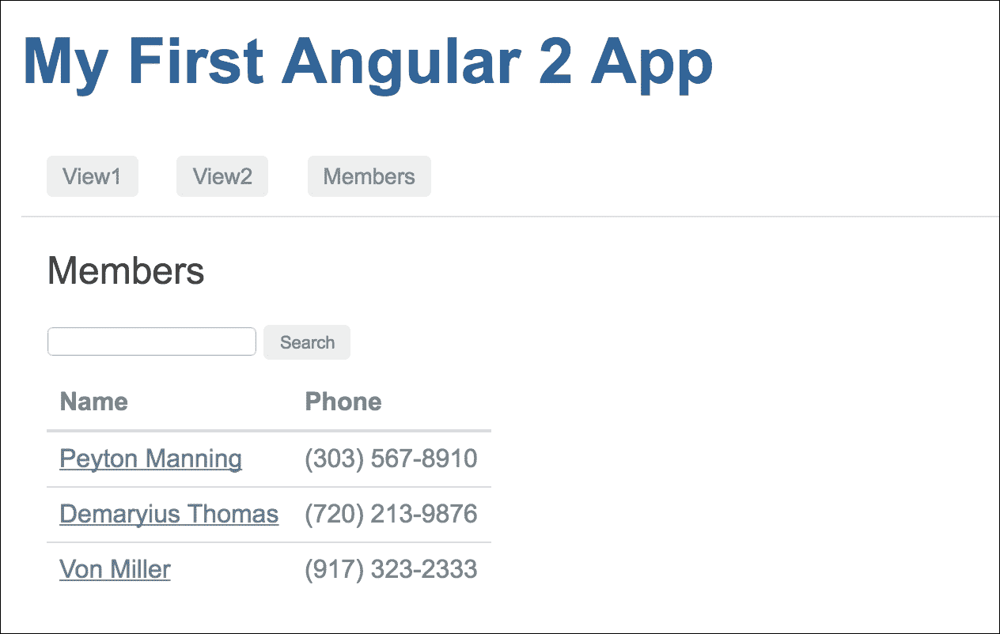
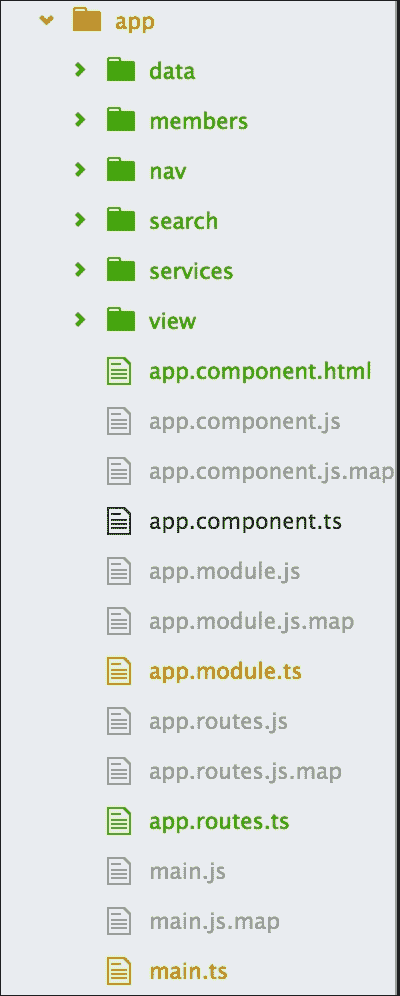

# 第八章：告诉世界

TDD 的构建侧重于基本组件，即生命周期和过程，使用逐步的演练。我们从头开始研究了几个应用程序，了解如何构建 Angular 应用程序并使用工具对其进行测试。

是时候进一步深入 Angular 的深处并集成服务、EventEmitters 和路由了。

这一章将在几个方面略有不同：

+   我们将使用第七章 *翻转*中的搜索应用程序，而不是构建全新的应用程序

+   我们将为之前章节中跳过的 Angular 路由和导航添加单元测试

+   我们将通过将常用操作分离到服务中，使现有的搜索应用程序更加现代化

+   我们将利用 Angular 的`EventEmitter`类在不同的组件之间进行通信

# 准备好沟通

在本章中，我们将采用不同的方法，因为我们已经学会了 TDD 方法。我们在上一章中开发了一个小项目，我们的计划是与该项目一起工作，并使其更好，以便向世界展示。

因此，在演练之前，我们必须回顾并确定项目的任何问题和改进的范围。为此，我们必须对搜索应用程序的代码库有信心。

## 加载现有项目

首先，我们将从第七章 *翻转*中复制项目，该项目最初来自[`github.com/angular/quickstart`](https://github.com/angular/quickstart)，并将其重命名为`angular-member-search`。

让我们继续准备运行它：

```ts
**$ cd angular-member-search**
**$ npm install** 
**$ npm start**

```

为了确认安装并运行项目，应用程序将自动在 Web 浏览器中运行它。

当我们运行项目时，我们应该得到以下输出：


哦！我们的端到端测试已经准备就绪。在进行更新之前，我们必须确保现有的端到端测试成功。

让我们在单独的控制台中运行`e2e`测试：

```ts
**$ npm run e2e**

```

是的，一切都成功通过了：


# 单元测试

在上一章中，我们从顶部开始。目标是根据我们所学到的知识详细说明端到端测试。我们清楚了用户场景，通过了测试，我们的场景通过了我们的实现。

在上一章中，我们只涵盖了端到端测试。因此，在本章中，我们将尽可能多地涵盖单元测试。

此外，在上一章中，我们主要关注了 Angular 路由和导航。因此，作为一个逻辑延伸，我们将看看如何测试 Angular 路由和导航。

## 组件测试

在进行组件测试之前，我们应该讨论一些关于测试 Angular 组件的要点。我们已经有了一个基本的想法：在 Angular 中，一切都是一些组件的组合。因此，我们应该更详细地学习关于 Angular 组件测试的内容。

我们可以根据组件的行为和用例以各种方式进行组件测试。甚至当它们作为一个应用程序一起工作时，我们甚至可以为多个组件编写测试规范。

让我们来看看一些测试组件的方法。

### 孤立测试

孤立测试，也称为独立测试，之所以被命名为这样，是因为这种类型的测试可以在不需要根据测试规范编译组件的情况下运行。如果不编译，测试规范中将不会有编译后的模板；只有组件类及其方法。这意味着，如果一个组件的特性不太依赖于 DOM，它可以以孤立的方式进行测试。

孤立测试主要用于复杂功能或计算测试，它只是初始化组件类并调用所有方法。

例如，看一下第六章的单元测试，*第一步*，其中`AppComponent`负责添加评论并增加它们的喜欢：

```ts
beforeEach(() => { 
    comp = new AppComponent(); 
    comp.add('a sample comment'); 
    comp.like(comp.comments[0]); 
}); 

    it('First item in the item should match', () => { 
        expect(comp.comments[0].title).toBe('a sample 
        comment'); 
    }); 

    it('Number of likes should increase on like', () => { 
        expect(comp.comments[0].likes).toEqual(1); 
    }); 

```

### 浅层测试

孤立测试有时可以满足测试规范的要求，但并非总是如此。大多数情况下，组件具有依赖于 DOM 的特性。在这种情况下，重要的是在测试规范中渲染组件的模板，以便我们在作用域中有编译后的模板，并且测试规范能够与 DOM 进行交互。

例如，如果我们想为我们的`AppComponent`编写一个基本的单元测试，它大部分依赖于 DOM，因为组件类中没有方法，那么我们只需要编译组件并检查它是否被定义。此外，我们可以在测试规范中检查组件的模板是否在`<h1>`元素内有正确的文本。

代码将如下所示：

```ts
beforeEach(async(() => { 
    TestBed.configureTestingModule({ 
        declarations: [ AppComponent ]
    }) 
    .compileComponents(); 
})); 

beforeEach(() => { 
    fixture = TestBed.createComponent(AppComponent); 
    comp = fixture.componentInstance; 
    de = fixture.debugElement.query(By.css('h1')); 
}); 

it('should create and initiate the App component', () => { 
    expect(comp).toBeDefined(); 
}); 

it('should have expected test in <h1> element', () => { 
    fixture.detectChanges(); 
    const h1 = de.nativeElement; 
    expect(h1.innerText).toMatch(/My First Angular 2 App/i, 
    '<h1> should say something about "Angular App"'); 
}); 

```

### 集成测试

以下是一些关于集成测试的关键点：

+   名称*集成测试*应该让我们对这是什么样的测试有一些了解。它类似于浅层测试，因为它也需要使用模板编译组件并与 DOM 交互。

+   接下来，我们将查看我们的路由和导航测试套件，其中我们将集成`AppComponent`、路由器和导航测试套件。

+   我们已经为`AppComponent`准备好了一个测试套件，因为它包括`navbar`组件和`router-outlet`组件。所有这些组件一起工作，以满足路由规范。

+   因此，要为路由器获得一个自信的测试规范，我们应该选择集成测试。

我们将在接下来的章节中详细解释路由器测试的示例。

### 注意

集成测试和浅层测试之间的主要区别在于，集成测试适用于完整应用程序的测试套件，或应用程序的一小部分，其中多个组件共同解决某个目的。它与端到端测试有一些相似之处，但采用了不同的方法。

# Karma 配置

在之前的章节中，使用了默认的 Karma 配置，但尚未解释过这个默认配置。**文件监视**是一个有用的默认行为，现在将进行审查。

## 文件监视

当使用 Karma 的`init`命令时，默认情况下启用文件监视。Karma 中的文件监视是通过`karma.conf.js`文件中的以下定义进行配置：

```ts
autoWatch: true, 

```

文件监视功能按预期工作，并监视配置中`files`数组中定义的文件。当文件被更新、更改或删除时，Karma 会重新运行测试。从 TDD 的角度来看，这是一个很好的功能，因为测试将继续在没有任何手动干预的情况下运行。

要注意的主要问题是添加文件。如果要添加的文件不符合`files`数组中的条件，`autoWatch`参数将无法响应更改。例如，让我们考虑以下文件的定义：

```ts
files : [ 'dir1/**/*.js'] 

```

如果是这种情况，监视程序将找到所有以`.js`结尾的文件和子目录文件。如果新文件位于不同的目录中，而不在`dir1`中，则监视程序将无法响应新文件，因为它位于与配置不同的目录中。

# 测试路由器和导航

我们在第七章*Flip Flop*中介绍了 Angular 路由器和导航以及一般组件。

正如我们已经讨论过 Angular 组件、路由器和导航的不同类型的测试，我们将看一下集成测试。为此，我们将使用我们的应用组件测试，也就是我们的基础组件，然后将路由和`router-outlet`组件测试与应用组件集成，以测试路由器。

## 测试应用组件

在进行路由器测试之前，我们将准备好我们的应用组件测试。在应用组件测试中，我们将测试组件是否被正确定义和初始化，然后通过选择 DOM 元素来测试页面标题。

我们在之前的章节中学习了浅层测试；当我们与 DOM 元素交互时，我们需要进行浅层测试。在这里也是一样的：因为我们将要处理 DOM 元素，所以我们将使用浅层测试作为我们的应用组件测试。

对于浅层测试，我们将需要依赖于 Angular 核心测试中的`TestBed` Angular 测试 API，它将用于编译和初始化测试套件中的组件。除此之外，我们还将需要依赖于核心测试中的`ComponentFixture`模块。我们还需要两个模块，名为`By`和`DebugElement`，来自 Angular 核心和平台 API，用于与 DOM 元素交互。

我们的应用组件测试将位于`spec/unit/app.component.ts`，并且将如下所示：

```ts
import { async, ComponentFixture, TestBed } from '@angular/core/testing'; 
import { By }           from '@angular/platform-browser'; 
import { DebugElement } from '@angular/core'; 

import { AppComponent } from '../../app/app.component'; 
import { NavbarComponent } from '../../app/nav/navbar.component';
import { RouterOutlet } from '@angular/router';

describe('AppComponent test suite', function () { 
  let comp: AppComponent; 
  let fixture: ComponentFixture<AppComponent>; 
  let de: DebugElement; 

  beforeEach(async(() => { 
   TestBed.configureTestingModule({ 
      declarations: [ AppComponent ] 
    }) 
    .compileComponents(); 
  })); 

  beforeEach(() => { 
    fixture = TestBed.createComponent(AppComponent); 
    comp = fixture.componentInstance; 
    de = fixture.debugElement.query(By.css('h1')); 
  }); 

  it('should create and initiate the App component', () => { 
    expect(comp).toBeDefined(); 
  }); 

  it('should have expected test in <h1> element', () => { 
    fixture.detectChanges(); 
    const h1 = de.nativeElement; 
    expect(h1.innerText).toMatch(/My First Angular 2 App/i, 
      '<h1> should say something about "Angular App"'); 
  }); 
}); 

```

如果我们运行这个测试，我们将看到以下结果：

```ts
   Chrome 54.0.2840 (Mac OS X 10.10.5): Executed 2 of 2 SUCCESS
   (0 secs / 0.522 secs)

```

我们的应用组件测试现在已经准备好了；接下来，我们将进行路由器测试，包括`router-outlet`和导航。

## 测试路由器

Angular 路由器不是 Angular 核心的一部分；它是一个单独的模块，必须在使用之前导入。它有一些指令，比如`RouterOutlet`和`RouterLink`，在完成路由器活动时起着积极的作用。为了测试路由器，首先我们将测试这些指令，以准备好测试完整的路由器的平台。

### 提示

我们可以使用实际的路由器模块来测试路由器，但有时会给整个路由系统带来一些复杂性。因此，测试规范可能会失败，而没有提供准确的错误。为了避免这种情况，建议创建路由器存根并将其用于路由器测试。

### 路由器存根

我从 Angular 官方的测试文档中得到了路由存根的想法。我喜欢关于路由存根的想法，并从 Angular 的 GitHub 存储库中的`angular.io/public/docs/_examples/testing/ts/testing/router-stubs.ts`文件中复制了`router-stubs`文件。第一个路由存根指令是`RouterStubLinksDirective`，它负责托管元素或锚链接(`<a>`)来执行指令的`onClick()`方法。与`[routerLink]`属性绑定的 URL 流向指令的`linkParams`属性。当点击锚链接(`<a>`)时，它应该触发`onClick()`方法，并且将设置为临时的`navigateTo`属性。

这个`router-stubs`文件依赖于 Angular 路由和相关指令，包括`RouterLink`和`RouterOutlet`，因此我们需要导入它们。

因此，路由存根将位于`spec/unit/stub/router-stub.ts`，代码如下：

```ts
export  {Router, NavigationExtras, RouterLink, RouterOutlet} from '@angular/router'; 

import { Component, Directive, Injectable, Input } from '@angular/core'; 

@Directive({ 
  selector: '[routerLink]', 
  host: { 
    '(click)': 'onClick()' 
  } 
}) 
export class RouterLinkStubDirective { 
  @Input('routerLink') linkParams: any; 
  navigatedTo: any = null; 

  onClick() { 
    this.navigatedTo = this.linkParams; 
  } 
} 

```

除了`RouterLinkStubDirective`之外，这个存根应该包含`RouterOutletStubComponent`来支持`router-outlet`指令，以及`RouterStub`来支持主路由模块：

```ts
@Component({selector: 'router-outlet', template: ''}) 
export class RouterOutletStubComponent { } 

@Injectable() 
export class RouterStub { 
  navigate(commands: any[], extras?: NavigationExtras) { } 
} 

```

### 路由出口和导航测试

正如我们所知，`router-outlet` 和导航 (`RouterLink`) 菜单与应用程序的登陆页面一起工作，也就是说，与我们的应用程序组件一起。测试机制将采用相同的形式。这意味着我们将测试这两个模块与应用程序组件。

正如稍早提到的，我们将在这里使用集成测试来进行`router-outlet`测试。我们已经准备好了应用程序组件的测试套件；现在是时候集成`router-outlet`和导航 (`RouterLink`)，并且我们将有我们的应用程序组件的集成测试套件，以及`router-outlet`和`RouterLink`。

我们有一个`navbar`组件，基本上是一个导航组件，包含`RouterLink`来通过路由进行导航。我们将不得不将该组件导入到我们的测试套件中，以便它能够正确执行。除了实际的路由模块，我们还需要导入我们创建的`RouterStub`。再次强调，`router-stubs`包含`RouterOutletStubComponent`和`RouterLinkStubDirective`组件。

在导入所有必需的组件之后，我们将不得不在`TestBed`配置中声明它们。作为设置的一部分，我们将在测试套件的范围内从`RouterLinkStubDirective`中获取所有的`navLinks`来测试和绑定`click`事件到`linkParams`。

测试套件的设置将如下所示：

```ts
import { NavbarComponent } from '../../app/nav/navbar.component'; 
import { AppComponent } from '../../app/app.component';
import { RouterOutletStubComponent, RouterLinkStubDirective } from './stub/router-stubs.js'; 

describe('AppComponent test suite', function () { 
  let navDestination:any; 
  let navLinks:any; 
  let fixture: ComponentFixture<AppComponent>; 
  let de: DebugElement;  

  beforeEach(async(() => { 
   TestBed.configureTestingModule({ 
      declarations: [ AppComponent, NavbarComponent, 
                     RouterLinkStubDirective, 
                     RouterOutletStubComponent ] 
    }) 
    .compileComponents(); 
  })); 

  beforeEach(() => { 
    fixture.detectChanges(); 

    navDestination = fixture.debugElement 
      .queryAll(By.directive(RouterLinkStubDirective)); 

    navLinks = navDestination 
      .map(de => de.injector.get(RouterLinkStubDirective) as 
      RouterLinkStubDirective); 
  });

```

对于测试规范，首先我们将测试导航菜单中的链接参数。我们有`navLinks`，我们将把它们与`navLinks`的`linkParams`进行匹配。

然后，我们将测试在点击导航菜单项时预期的导航。我们将通过`navigatedTo`方法来测试。

我们的测试规范将如下所示：

```ts
  it('can get RouterLinks from template', () => { 
    expect(navLinks.length).toBe(3, 'should have 3 links'); 
    expect(navLinks[0].linkParams).toBe('/view1', '1st link should
    go to View1'); 
    expect(navLinks[1].linkParams).toBe('/view2', '1st link should
    go to View2'); 
    expect(navLinks[2].linkParams).toBe('/members', '1st link should
    go to members search page'); 
  }); 

  it('can click nav items link in template and navigate 
  accordingly', () => { 
    navDestination[0].triggerEventHandler('click', null); 
    fixture.detectChanges(); 
    expect(navLinks[0].navigatedTo).toBe('/view1'); 

    navDestination[1].triggerEventHandler('click', null); 
    fixture.detectChanges(); 
    expect(navLinks[1].navigatedTo).toBe('/view2'); 

    navDestination[2].triggerEventHandler('click', null); 
    fixture.detectChanges(); 
    expect(navLinks[2].navigatedTo).toBe('/members'); 
  }); 

```

因此，我们可以说这将覆盖`router-outlet`和`routerLink`的测试，这将确认路由链接按预期工作，并且我们能够在点击导航菜单后导航到预期的路由。

## 实施集成测试

我们的测试规范已经准备好了。我们一直在计划进行集成测试，现在我们可以执行了。在这里，我们将组合应用组件和`navbar`组件，以及`router-outlet`和`routerLink`，来测试路由和导航。我们将使用浏览器平台 API 的`debugElement`模块与 DOM 元素进行交互。

测试套件已经准备好了--是时候运行测试了。

让我们用以下命令来运行它：

```ts
**npm test** 

```

所有测试规范都按预期通过了。结果将如下：

```ts
   Chrome 54.0.2840 (Mac OS X 10.10.5): Executed 4 of 4 SUCCESS
   (0 secs / 1.022 secs) 

```

## 更多的测试...

我们刚刚添加了一些测试，将覆盖到目前为止我们开发的一些功能，主要集中在路由器（`router-outlet`和`routerLink`）上。

我们将为成员和搜索功能添加更多的测试，但是我们将更新搜索和成员列表的现有功能的行为。除此之外，我们当前的代码库没有适当地解耦组件功能，这将使得单独测试功能变得复杂。

我们已经有了端到端测试，它将验证我们从组件中期望的输出，但是对于单元测试，我们需要重构代码并解耦它们。在更新行为并重构正确的代码库之后，我们将覆盖其余功能的测试。

# 应用行为总结

让我们快速查看一下搜索应用的概述：

+   我们的搜索应用在 DOM 中调用 Members 组件。它包含两个主要部分：搜索区域和结果区域。

+   从搜索区域，我们输入搜索查询并提交以在结果区域获得预期结果。

+   根据搜索查询结果区域列出了成员列表。我们可能已经发现，在`Members`组件初始化时我们获取了所有数据；这是因为我们在`ngOnInit()`中调用了 Members 组件的`search()`方法，并且当没有设置搜索查询时，它会返回所有数据。

+   通过点击成员的名字，我们可以在详细页面上看到关于该成员的详细信息。

# 更新应用程序行为

根据先前的规范，似乎我们在搜索功能中有一些不正确的行为。现在，我们在初始化搜索组件的成员时调用`search()`。这似乎有点不对；我们应该在输入搜索查询和/或点击**搜索**按钮后开始搜索。

预期行为是首先加载所有成员数据，然后在开始搜索后，数据列表将根据搜索查询进行更新。

为了做到这一点，让我们更新`members.component.ts`中的`ngOnInit()`方法，并添加一个新方法`getMember()`，在组件初始化期间获取整个数据列表。

预期的更改如下：

```ts
ngOnInit() { 
    this.getMembers(); 
  } 

  getMembers() { 
    this.getData() 
    .then(data => { 
      data.map(item => { 
        this.memberList.push(item); 
      }); 
    }) 
    return this.memberList; 
  } 

search() { 
    // Do Search 
  } 

```

## 识别问题

根据现有的代码，似乎我们在`members.component.ts`和`person.component.ts`中都定义了`getData()`方法，因为在这两个组件中，我们都需要调用 JSON 数据源来获取成员数据集。

那么，问题是什么？这是一个不好的做法，因为它重复了代码，当应用程序变得庞大和复杂时，重复的代码很难管理。

例如，现在我们有以下方法两次：

```ts
getData() { 
    return this.http.get('app/data/people.json') 
      .toPromise() 
      .then(response => response.json()); 
  } 

```

如果我们必须更改数据源 URL 或 API，我们将不得不在两个地方更改此方法。两次更改并不那么困难，但是对于更大的应用程序来说，可能会更多次。

是的，这是一个问题，需要解决。

## 寻找解决方案

我们已经确定了问题，即代码重复。我们知道解决方案：我们必须在一个共同的地方编写该方法，并在两个组件中使用它。简而言之，我们必须使这个方法可重用，以便每个组件都可以共享它。

看起来很简单，但我们必须按照 Angular 的方式来做。我们不能只是将方法移到一个单独的文件中并导入它。

Angular 为这种情况引入了服务。现在让我们通过示例来看一些这样的服务。

# Angular 服务

Angular 服务被引入以编写可在组件之间共享的代码。因此，如果我们需要为多个组件编写一段代码，建议创建一个可重用的单一服务，然后在需要该代码段的任何地方，只需将该服务注入到组件中，并根据需要使用其方法。

服务用于抽象应用程序逻辑。它们用于为特定操作提供单一职责。单一职责允许组件易于测试和更改。这是因为焦点在一个组件上，而不是所有内部依赖关系。

大多数情况下，服务充当任何应用程序的数据源。每当我们需要一段代码与服务器通信以获取数据（通常是 JSON）时，我们使用服务。

这是因为大多数组件需要访问数据，每个人都可以根据需要注入通用服务。因此，我们有一个常用的代码段，实际上是我们应用程序的数据层。我们应该将这些部分移至服务以使我们的应用程序更智能，以便我们可以告诉世界我们在任何方面都没有重复代码。

## 我们现在有服务了？

按计划，我们已将`members.component.ts`和`person.component.ts`组件中的`getData()`方法移至一个新文件，以便我们可以消除代码重复。

让我们在`app/services/members.service.ts`中创建一个新文件，创建一个新的类来导出，名为`MembersService`，并将`getData()`方法移至其中。除了移动方法之外，我们还需要从 Angular HTTP 模块中导入`{ Http, Response }`，因为`getData`依赖于 HTTP。

观察以下代码示例：

```ts
import { Http, Response } from '@angular/http'; 

export class MembersService { 
  constructor(private http:Http) { 

  } 

  getAPIData() { 
    return this.http.get('app/data/people.json'); 
  } 

  getData() { 
    return this.getAPIData() 
      .toPromise() 
      .then(response => response.json()); 
  } 

} 

```

我们现在有一个服务，可以开始使用它了。让我们在 Members 组件中导入并使用它。

等等，在此之前，我们需要将服务导入到应用程序模块中以进行标识。只要它是一个服务，我们就必须将其标识为提供者；该服务将充当服务提供者。

我们的`app.module.ts`文件将如下所示：

```ts
import {MembersService} from './services/members.service'; 

@NgModule({ 
  declarations: [AppComponent, NavbarComponent, ....], 
  imports     : [BrowserModule, FormsModule, ......], 
  providers   : [MembersService], 
  bootstrap   : [AppComponent] 
}) 

```

现在，要在我们的组件中使用服务，我们必须将其导入并注入到我们的 MembersComponents 中，服务名称为`MembersService`。只要我们将服务作为组件的构造函数注入，我们就可以在整个组件中使用该服务。要访问该方法，我们需要调用`this.membersService.getData()`。

因此，我们的成员组件将如下所示：

```ts
import { MembersService } from '../services/members.service'; 
@Component({ 
   ............ 
}) 
export class MembersComponent implements OnInit { 
 constructor(public membersService: MembersService, private router:Router) { 

  } 

  getMembers() { 
    this.membersService.getData() 
    .then(data => { 
      data.map(item => { 
        this.memberList.push(item); 
      }); 
    }) 
    return this.memberList; 
  } 

```

是时候运行并查看输出，看看服务如何与成员组件一起工作。

让我们将浏览器指向`http://localhost:3000/members`。

哎呀！发生了什么？我们在浏览器控制台中收到了一个错误：

```ts
Error: (SystemJS) Can't resolve all parameters for MembersService: (?) 

```

根据错误，我们犯了一个错误：`SystemJS`（用作模块加载器）无法注入`MembersService`，因为我们忘记了添加一些内容使服务完美。在 Angular 中，我们必须在每个服务中说明它是否可注入；如果不这样做，我们将无法将该服务注入到任何组件中。

为此，我们将不得不使用 Angular **Injectable**装饰器。我们将简要看一下它。

## 可注入服务

Injectable 装饰器是 Angular 核心库的一部分，在创建可注入服务时使用。如果不将其定义为可注入的，就无法识别服务的依赖关系。要将其定义为可注入，我们必须在类定义的顶部使用`@Injectable()`。

代码将如下所示：

```ts
import { Injectable } from '@angular/core'; 
import { Http, Response } from '@angular/http'; 

@Injectable() 
export class MembersService { 
  constructor(private http:Http) { 

  } 

  getData() { 
    return this.http.get('app/data/people.json') 
      .toPromise() 
      .then(response => response.json()); 
  } 
} 

```

我们已经使服务可注入。现在，我们应该可以将其注入到成员组件中，并将浏览器指向`http://localhost:3000/members`。

万岁！不再有错误，我们得到了预期的数据列表：



看起来我们的服务是可注入的，并且工作正常。现在是时候在`PersonComponent`中实现它，因为我们也需要在该组件上使用数据服务。与成员组件一样，让我们使用服务名称`membersService`将其导入并注入到`PersonComponent`中。同样，我们将不得不使用`this.membersService.getData()`来访问数据服务方法。

我们的`PersonComponent`将如下所示：

```ts
import { MembersService } from '../../services/members.service'; 

@Component({ 
  ........... 
}) 
export class PersonComponent implements OnInit { 
  constructor(public membersService: MembersService, private route: ActivatedRoute, private router: Router) { 

  } 

.................... 

  getPerson(id:number) { 
    return this.membersService.getData() 
          .then(data => data.find(member => member.id === id)); 
  } 
} 

```

是时候运行并查看服务与成员组件的输出了。

我们有我们的端到端测试，它将确认新更改一切正常：

```ts
**$ npm run e2e**

```

是的，一切都顺利通过了：


耶！我们的代码重构没有影响我们的预期行为。

## 服务将为您提供更多

为了充分利用服务的全部优势，我们将从成员和人员组件中移动两个以上的方法。在此之前，这些方法是特定于组件的；现在，通过将它们添加到服务中，这些方法可以通过注入服务从任何组件中使用。

也许我们以后会从这个改变中受益，但是希望将这些方法与组件解耦。

新添加的代码将如下所示：

```ts
@Injectable() 
export class MembersService { 
  constructor(private http:Http) { 

  } 

  ............ 

  searchQuery(q:string) { 
    if (!q || q === '*') { 
      q = ''; 
    } else { 
      q = q.toLowerCase(); 
    } 
    return this.getData() 
      .then(data => { 
      let results:any = []; 
      data.map(item => { 
        if (JSON.stringify(item).toLowerCase().includes(q)) { 
          results.push(item); 
        } 
      }); 
      return results; 
    }); 
  } 

  getPerson(id:number) { 
    return this.getData() 
   .then(data => data.find(member => member.id === id)); 
  } 
} 

```

## 测试服务

代码解耦和分离背后的目标是使代码可测试。我们这样做了，我们已经将数据检索部分从成员组件中分离出来，并创建了一个服务，以便易于测试。该服务是可注入的；除此之外，它与 Angular 组件类似。因此，为了进行单元测试，我们将测试服务包含的方法。

### 测试服务注入

像其他 Angular 组件一样，我们可以测试服务是否定义良好。但主要区别在于，只要服务是可注入的，我们就需要在测试规范中注入它以获取要测试的实例。

对于一个样本测试规范，我们可以设置它导入 `TestBed` 和 `inject`，然后使用 MembersService 作为提供者配置 `TestingModule`。然后，在测试规范中，我们将注入服务并检查服务是否符合预期。

我们的样本测试套件将如下所示：

```ts
import { inject, TestBed } from '@angular/core/testing'; 
import { MembersService } from '../../app/services/members.service'; 

describe('Given service should be defined', () => { 

  beforeEach(() => { 
    TestBed.configureTestingModule({ 
      providers: [ 
        MembersService, 
      ],  
    }); 
  }); 

 it('should initiate the member service', inject([MembersService], (membersService) => { 
    expect(membersService).toBeDefined(); 
  })); 

}); 

```

对于这个测试，预期结果将为 true。

### 测试 HTTP 请求

要对 HTTP 请求进行单元测试，我们将使用异步技术来保持 HTTP 调用异步，并在 Angular 测试中，我们将使用 `fakeAsync` 模块，这是一个用于模拟 HTTP 请求的异步模块。

等等，“模拟”？

是的；要在 Angular 测试套件中测试 HTTP 请求，我们不需要进行实际的 HTTP 请求。为了实现 HTTP 请求的效果，我们可以模拟我们的 HTTP 服务；Angular 提供了一个名为 **MockBackend** 的模拟服务。

`MockBackend` 是一个可以配置为为 HTTP 模拟请求提供模拟响应的类，它将与 HTTP 服务完全相同，但不会进行实际的网络请求。

在我们配置了 `MockBackend` 之后，它可以被注入到 HTTP 中。因此，在我们使用 `http.get` 的服务中，我们将得到预期的数据返回。

我们的带有 HTTP 请求的测试套件将如下所示：

```ts
import { fakeAsync, inject, TestBed } from '@angular/core/testing'; 

import { Http, BaseRequestOptions, Response, ResponseOptions } from '@angular/http'; 
import { MockBackend, MockConnection } from '@angular/http/testing'; 

import { MembersService } from '../../app/services/members.service'; 

const mockData = { 
  "id": 2, 
  "name": "Demaryius Thomas", 
  "phone": "(720) 213-9876", 
  "address": { 
    "street": "5555 Marion Street", 
    "city": "Denver", 
    "state": "CO", 
    "zip": "80202" 
  } 
}; 

describe('Given service should be defined and response HTTP request', () => { 

  beforeEach(() => { 
    TestBed.configureTestingModule({ 
      providers: [ 
        MembersService, 
        BaseRequestOptions, 
        MockBackend, 
        { 
          provide: Http, 
          useFactory: (backend, defaultOptions) => { 
            return new Http(backend, defaultOptions); 
          }, 
          deps: [MockBackend, BaseRequestOptions], 
        }, 
      ], 
    }); 
  });
}); 

```

在这里，首先除了导入 `MockBackend` 外，我们还导入了 `MockConnection`，它用于订阅后端连接并将连接的数据提供给下一步。然后，我们配置了 `MockBackend`，它将返回 HTTP 对象。

接下来，我们将通过注入 `MockBackend` 和 `MembersService` 准备好我们的测试规范：

```ts
  it('should return response when subscribed to getUsers', fakeAsync( 
    inject([MockBackend, MembersService], (backend, membersService) => { 
      backend.connections.subscribe( 
        (c: MockConnection) => { 
          c.mockRespond( 
            new Response( 
              new ResponseOptions({ body: mockData }) 
            )); 
          }); 

        membersService.getAPIData().subscribe(res => { 
          expect(res.json()).toEqual(mockData); 
        }); 
  }))); 

}); 

```

在测试规范中，我们除了`MembersService`之外还注入了`MockBackend`。`MockBackend`将使用`MockConnection`对象订阅`backend`服务。`MockConnection`将创建一个新的`ResponseOptions`对象，在这个对象中，我们可以配置我们的响应属性。

在这里，我们只设置了响应对象的`body`属性，并将`body`值设置为预定义的`mockData`对象。

## 服务存根

我们也可以使用存根数据测试服务。例如，我们可以创建一个名为`MembersServiceSpy`的`MembersService`的存根版本，它将模拟该服务的所有必要功能。

这个虚假服务将返回一个带有模拟数据的 resolved `Promise`，因此我们可以只使用这个存根方法进行测试。它将为我们在服务中拥有的所有方法创建一个 spy，并为每个单独的方法返回一个单独的`Promise`。

存根服务将位于`spec/unit/stub/members.service.stub.ts`，代码如下：

```ts
import { Component, Directive, Injectable, Input } from '@angular/core'; 

export class MembersServiceSpy { 
  members = { 
    "id": 2, 
    "name": "Demaryius Thomas", 
    "phone": "(720) 213-9876", 
    "address": { 
      "street": "5555 Marion Street", 
      "city": "Denver", 
      "state": "CO", 
      "zip": "80202" 
    } 
  }; 

  getData = jasmine.createSpy('getData').and.callFake( 
    () => Promise 
      .resolve(true) 
      .then(() => Object.assign({}, this.members)) 
  ); 

  getPerson = jasmine.createSpy('getPerson').and.callFake( 
    () => Promise 
      .resolve(true) 
      .then(() => Object.assign({}, this.members)) 
  ); 

  searchQuery = jasmine.createSpy('searchQuery').and.callFake( 
    () => Promise 
      .resolve(true) 
      .then(() => Object.assign({}, this.members)) 
  ); 

} 

```

### 使用存根数据测试服务

在这里，我们将使用存根数据测试`MembersService`。为此，我们需要导入存根服务。并且在`TestBed`配置中，我们将提供`MemberServiceSpy`作为服务，而不是实际的成员服务。

`MembersService`测试套件的代码如下所示：

```ts
import { MembersServiceSpy } from './stub/members.service.stub.js'; 
import { MembersService } from '../../app/services/members.service'; 

const mockData = { 
  "id": 2, 
  "name": "Demaryius Thomas", 
  "phone": "(720) 213-9876", 
  "address": { 
    "street": "5555 Marion Street", 
    "city": "Denver", 
    "state": "CO", 
    "zip": "80202" 
  } 
}; 

describe('Given service will response for every method', () => { 

  beforeEach(() => { 
    TestBed.configureTestingModule({ 
      providers: [{ provide: MembersService, useClass: MembersServiceSpy }] 
    }); 
  }); 

  it('should return data', fakeAsync(inject( 
    [MembersService], (service) => { 
      service.getData(); 
      expect(service.members).toEqual(mockData); 
    }))); 

    it('should return data', fakeAsync(inject( 
      [MembersService], (service) => { 
        service.searchQuery('Thomas'); 
        expect(service.members.name).toBe('Demaryius Thomas'); 
    }))); 

    it('should return data', fakeAsync(inject( 
      [MembersService], (service) => { 
        service.getPerson(2); 
        expect(service.members.id).toBe(2); 
    }))); 

}); 

```

## 组合并运行服务的测试

我们在这里为 Members 服务有两个测试套件。我们可以将它们合并并运行测试。

完整的测试套件代码将如下代码片段所示：

```ts
import { fakeAsync, inject, TestBed } from '@angular/core/testing'; 

import { Http, BaseRequestOptions, Response, ResponseOptions } from '@angular/http'; 
import { MockBackend, MockConnection } from '@angular/http/testing'; 

import { MembersServiceSpy } from './stub/members.service.stub.js'; 
import { MembersService } from '../../app/services/members.service'; 

const mockData = { 
  "id": 2, 
  "name": "Demaryius Thomas", 
  "phone": "(720) 213-9876", 
  "address": { 
    "street": "5555 Marion Street", 
    "city": "Denver", 
    "state": "CO", 
    "zip": "80202" 
  } 
}; 

describe('Given service should be defined and response HTTP request', () => { 

  beforeEach(() => { 
    TestBed.configureTestingModule({ 
      providers: [ 
        MembersService, 
        BaseRequestOptions, 
        MockBackend, 
        { 
          provide: Http, 
          useFactory: (backend, defaultOptions) => { 
            return new Http(backend, defaultOptions); 
          }, 
          deps: [MockBackend, BaseRequestOptions], 
        }, 
      ], 
    }); 
  }); 

  it('should initiate the member service', inject([MembersService], (membersService) => { 
    expect(membersService).toBeDefined(); 
  })); 

  it('should return response when send HTTP request', fakeAsync( 
    inject([MockBackend, MembersService], (backend, membersService) => { 
      backend.connections.subscribe( 
        (c: MockConnection) => { 
          c.mockRespond( 
            new Response( 
              new ResponseOptions({ body: mockData }) 
            )); 
          }); 

        membersService.getAPIData().subscribe(res => { 
          expect(res.json()).toEqual(mockData); 
        }); 
  }))); 

}); 

describe('Given service will response for every method', () => { 

  beforeEach(() => { 
    TestBed.configureTestingModule({ 
      providers: [{ provide: MembersService, useClass: MembersServiceSpy }] 
    }); 
  }); 

  it('should return data', fakeAsync(inject( 
    [MembersService], (service) => { 
      service.getData(); 
      expect(service.members).toEqual(mockData); 
    }))); 

    it('should return data', fakeAsync(inject( 
      [MembersService], (service) => { 
        service.searchQuery('Thomas'); 
        expect(service.members.name).toBe('Demaryius Thomas'); 
    }))); 

    it('should return data', fakeAsync(inject( 
      [MembersService], (service) => { 
        service.getPerson(2); 
        expect(service.members.id).toBe(2); 
    }))); 

}); 

```

Members 服务的测试套件已经准备好运行。让我们使用以下命令运行它：

```ts
**npm test** 

```

所有的测试规范都如预期般通过。结果将如下所示：

```ts
   Chrome 54.0.2840 (Mac OS X 10.10.5): Executed 9 of 9 SUCCESS 
   (0 secs / 4.542 secs) 

```

# 通过事件的力量进行通信

与 Angular 1.x 相比，Angular 具有更强大的事件处理能力。Angular 1.x 具有双向数据绑定，而 Angular 不推荐使用。Angular 通过事件的力量处理数据和模板之间的通信。

Angular 项目依赖于一些组件的组合。为了正常运行，这些组件需要相互通信以共享数据和事件。大多数情况下，组件需要在它们具有父子关系时进行通信。Angular 可以通过几种方式在父子组件之间进行通信。最好的方式是通过处理自定义事件。我们将详细了解自定义事件，并看看它们如何与我们的搜索应用程序一起工作。

## Angular 事件

正如我们所知，Angular 推荐单向数据绑定，这意味着只能从组件到 DOM 元素。这是单向数据流，这就是 Angular 的工作原理。那么当我们需要在另一个方向上进行数据流时--从 DOM 元素到组件呢？这取决于不同的事件，例如点击，按键，鼠标悬停和触摸。这些事件将绑定到 DOM 元素上，以侦听用户操作并将该操作传递给组件。

事件绑定语法由带有括号的目标事件组成，位于等号的左侧。组件包含目标事件作为方法，因此每当事件触发时，它将从组件调用该方法。让我们看看搜索表单中的事件：

```ts
<button type="button" (click)="search()">Search</button>

```

任何元素的事件都是常见的目标，但在 Angular 中有点不同，因为 Angular 首先会检查目标名称是否与任何已知指令或组件的事件属性匹配。

## Angular 中的自定义事件

自定义事件是由 Angular 的指令或组件引发的，使用`EventEmitter`。指令创建一个`EventEmitter`对象，并将自己公开为其属性，以通过`@Output`装饰器传递。我们将在接下来查看`@Output`装饰器的细节。在将`EventEmitter`对象公开为属性之后，指令将调用`EventEmitter.emit(value)`来触发事件并将值传递给父指令。

自定义指令/组件类将定义自定义事件如下：

```ts
  @Output() someCustomEvent: EventEmitter<any> = new EventEmitter(); 

    this.someCustomEvent.emit(value);

```

父指令将通过绑定到此属性来监听事件，并通过`$event`对象接收值。

父指令/组件将包含自定义指令，其中将包含自定义事件`someCustomEvent`，它将触发父指令的`doSomething()`方法。

```ts
<custom-component (someCustomEvent)="doSomething($event)"></custom-component> 

```

父指令/组件将包含`doSomething()`方法，如下所示：

```ts
doSomething(someValue) { 
    this.value = someValue; 
} 

```

## 输出和 EventEmitter API

Output 是来自 Angular 核心的装饰器类，用于从子组件传递自定义事件到父组件。要使用它，我们需要从`@angular/core`中导入它。

当我们将自定义事件设置为`@Output`时，该事件将在父组件中可供监听。该装饰器将放置在类内部，如下所示：

```ts
export class SearchComponent { 
  @Output() someCustomEvent: EventEmitter<any> = new EventEmitter(); 
}

```

`EventEmitter`也是 Angular 的核心类。当我们需要使用它时，我们必须从`@angular/core`导入它。`EventEmitter` API 用于在子组件中的值发生变化时通过调用`EventEmitter.emit(value)`来通知父组件。正如我们所知，父组件总是监听自定义事件。

# 进一步改进规划

到目前为止，我们拥有的搜索应用程序是一个简单的搜索应用程序。但是我们可以通过保持它的简单性来使其变得更好。我的意思是，我们可以以最佳方式做到这一点，就像我们试图通过将可重用代码分离到新的服务中来解耦数据逻辑一样。

我们仍然有一些需要改进的地方。看起来我们的应用程序还没有完全解耦。我们的组件没有像我们期望的那样解耦。我们正在谈论包含搜索功能和成员列表功能的`MembersComponent`。

我们将遵循单一责任原则，这意味着每个组件应该有单一责任。在这里，`MembersComponent`有两个责任。因此，我们应该将这个组件拆分为两个单独的组件。

让我们将其拆分为两个单独的组件，称为`MembersComponent`和`SearchComponent`。实际上，我们刚刚为一个名为`SearchComponent`的新组件制定了计划，并从成员组件中将搜索功能移到了那里。

现在让我们为两个组件期望的行为制定计划：

+   搜索组件将负责将用户输入作为搜索查询，并使用我们的服务获取预期的搜索结果

+   然后我们将搜索结果传递给成员组件

+   成员组件将从搜索组件获取搜索结果，并将数据列表绑定到 DOM

+   两个组件将使用事件进行通信和数据交换

计划是通过遵循最佳实践和使用 Angular 的内置功能使这个简单的应用程序变得完美。

## 搜索组件

按计划，我们需要将搜索功能与成员组件分离。为此，让我们在`app/search/search.component.ts`创建一个名为`SearchComponent`的新组件，并创建搜索组件的模板文件。模板文件将简单包含搜索表单。

搜索组件文件将需要导入和注入`MembersService`，因为它将用于根据搜索查询执行搜索。该组件将具有搜索查询，并将请求服务进行搜索并获取搜索结果。

搜索组件的代码将如下所示：

```ts
import { Component } from '@angular/core'; 

import { MembersService, Person } from '../services/members.service'; 

@Component({ 
  selector: 'app-search', 
  moduleId: module.id, 
  templateUrl: 'search.component.html' 
}) 
export class SearchComponent { 
  query: string; 
  memberList: Array<Person> = []; 

  constructor(public membersService: MembersService) { 

  } 

  search() { 
    this.doSearch(); 
  } 

  doSearch(): void { 
    this.membersService.searchQuery(this.query) 
    .then(results => { 
      this.memberList = results; 
    }); 
  } 

} 

```

搜索组件的模板将如下所示：

```ts
<form> 
  <input type="search" [(ngModel)]="query" name="query" (keyup.enter)="search()"> 
  <button type="button" (click)="search()">Search</button> 
</form> 

```

只要我们的应用程序输出不会出错，我们将不得不将搜索组件绑定到成员列表页面，就像以前一样。因此，我们将不得不将搜索组件附加到成员组件的模板中。在这种情况下，它将成为成员组件的子组件。

成员组件的模板将如下所示：

```ts
<h2>Members</h2> 
<app-search></app-search> 
<table *ngIf="memberList" id="searchList"> 
  ...... 
</table> 

```

## 启用组件之间的共享

现在我们有两个独立的组件，搜索和成员组件。搜索组件已附加到成员组件，但搜索结果在成员组件中不可用。

搜索和成员是独立的组件，它们之间没有桥梁。两者都有隔离的范围来包含它们的元素和变量。

为了在组件之间共享数据，我们需要启用它们之间的通信。如前所述，Angular 事件将会拯救我们，使我们能够在搜索和成员组件之间启用通信。从搜索组件，我们需要使用 Angular 自定义事件与其父组件`MembersComponent`进行通信。

## 与父组件通信

搜索组件是成员组件的子组件。它们需要相互通信以共享数据。我们将需要使用自定义事件，借助 Angular 的`EventEmiiter` API 来自搜索组件发出搜索结果。此外，我们还需要使用`@OutPut`装饰器将搜索结果设置为输出，以供父组件使用。

为了使用两者，我们需要从 Angular 核心中导入两者。然后，我们需要将`@Output`搜索结果设置为 EventEmitter 的新实例。这个`@Output`装饰器使`searchResult`属性可用作事件绑定。

当搜索组件更新搜索结果时，我们希望告诉父组件`searchResult`事件已发生。为此，我们需要使用 Output 装饰器声明的 Emitter 对象调用`emit(data)`与我们声明的`searchResult`一起。`emit()`方法用于通过自定义事件通知每次结果已传递。

现在，Members 组件可以获取`$event`对象，因为我们已经将其传递到模板中，使用`(searchRessult)="anyMethod($event);`。

更新后，带有`EventEmitter`的搜索组件将如下所示：

```ts
import { Component, Output, EventEmitter } from '@angular/core'; 

@Component({ 
  ................... 
}) 
export class SearchComponent { 
  ............. 
  @Output() searchResult: EventEmitter<any> = new EventEmitter(); 

  doSearch(): void { 
    this.membersService.searchQuery(this.query) 
    .then(results => { 
      this.memberList = results; 
      this.searchResult.emit(this.memberList)); 
    }); 
  } 

} 

```

现在是时候与`MembersComponent`通信了。让我们在成员组件中声明`onSearch()`方法，它将接受事件作为参数。

Members 组件将更改为以下内容：

```ts
export class MembersComponent implements OnInit { 

  ngOnInit() { 
    this.getMembers(); 
  } 

  onSearch(searchResult) { 
    this.memberList = searchResult; 
  } 

  getMembers() { 
    this.membersService.getData() 
    .then(data => { 
      data.map(item => { 
        this.memberList.push(item); 
      }); 
    }) 
    return this.memberList; 
  } 

} 

```

由于我们正在从成员模板中附加搜索组件，让我们将`onSearch`函数挂钩到搜索组件标记上。我们将称之为`(searchResult)`--在其周围加上括号--告诉 Angular 这是一个事件绑定。

搜索组件的模板将如下所示：

```ts
<h2>Members</h2> 
<app-search (searchResult)="onSearch($event)" ></app-search> 
<table *ngIf="memberList" id="searchList"> 
  ...... 
</table> 

```

## 重构后检查输出

搜索应用将被重新打造成一个商店应用，而不是重写已经编写的搜索功能。为了利用现有的搜索项目，它将被复制到一个新的项目文件中。然后，新项目将使用测试来驱动开发变化和重构。重构步骤已被省略，但代码审查将展示代码和测试如何被修改以创建产品应用。

是时候运行它，看看服务如何与 Members 组件一起工作。让我们将浏览器指向`http://localhost:3000/members`。


我们有端到端测试，将确认新更改一切顺利：

```ts
 **$ npm run e2e**

```

是的，我们可以看到一切都顺利通过了：


是的！我们的代码重构没有影响我们的预期行为。

**当前项目目录**

我们已经更新和重构了代码，为此我们有一些新的组件、服务等。现在，我们将有一个新的项目结构，将逻辑和组件解耦。

我们当前的目录结构如下：



# 继续前进

在这本书中，我尽量涵盖了一定程度的主题，以便任何人都可以基于 Angular 开始测试驱动开发。但我们跳过了很多重要的内容，尤其是 rxJS。

rxJS 是基于响应式编程的一个单独模块。因此，我们需要熟悉响应式编程才能理解它。

## 可观察对象

在 Angular 中，默认情况下，HTTP 请求返回的是可观察对象而不是已解决的承诺。由于我们在这里没有涉及 rxJS，我们跳过了可观察对象，并将响应转换为承诺。但我们应该学习可观察对象如何在 Angular 中工作。

## 发布和订阅

发布和订阅消息是一个强大的工具，但和任何东西一样，如果使用不当，可能会导致混乱。

有两种消息发布的方式：发射或广播。了解区别很重要，因为它们的工作方式略有不同，可能会影响我们应用的性能。

# 自测问题

Q1. 回调函数指的是在异步函数完成后被调用的函数。

+   正确

+   错误

Q2. 异步函数总是按调用顺序完成。

+   正确

+   错误

Q3. Angular 中有一个名为`MockBackend`的模块，用于在单元测试中伪造 HTTP 调用。

+   正确

+   错误

Q4. 在 Angular 中，`EventEmitter` API 用于组件通信。

+   正确

+   错误

# 总结

在本章中，我们探讨了 Angular 中的服务和事件的强大功能。我们还看到了一些通过服务和事件分离代码的示例。

此外，我们还研究了 Angular 组件的不同类型测试，并为 Angular 路由编写了单元测试，并将其与应用程序组件和导航集成。我们还进一步探讨了 Karma 的配置，以便使用其功能。

现在我们已经到达书的结尾，是时候将我们的知识应用到现实世界中了。在离开之前，让我们快速回顾一下我们学到了什么。我们学习了 TDD，TDD 如何在 JavaScript 环境中运行，以及可用的测试工具、技术和框架。我们了解了 Karma 和 Protractor 在真实的 Angular 项目中的使用。现在我们知道如何为 Angular 项目编写单元测试和端到端测试。

这本书向你展示了实践 TDD 的路径；现在轮到你继续学习，提高这方面的知识，并在复杂项目中进行更多实践，以便更加自信地应用 TDD。
