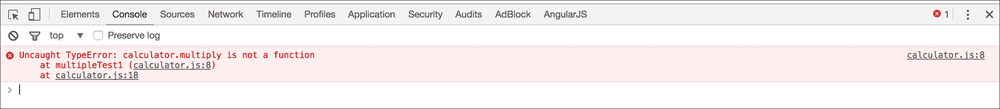
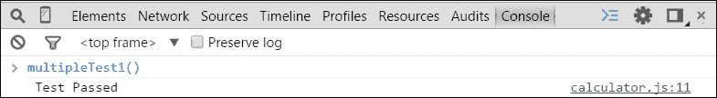

# 第一章. 测试驱动开发简介

Angular 在客户端 JavaScript 测试方面处于前沿。每个 Angular 教程都包括一个相应的测试，事件测试模块是 Angular 核心包的一部分。Angular 团队专注于使测试成为网络开发的基础。

本章将向您介绍使用 Angular 的**测试驱动开发**（**TDD**）的基础，包括以下主题：

+   TDD 概述

+   TDD 生命周期：先测试，然后运行，最后改进

+   常见测试技术

# TDD 概述

TDD 是一种进化式开发方法，在你编写足够的生产代码以满足测试及其重构之前，你先编写一个测试。

本节将探讨 TDD 的基础。让我们以裁缝为例，看看他是如何将 TDD 应用到自己的过程中的。

## TDD 基础

在开始编写代码之前，先了解一下要写什么。这听起来可能有些陈词滥调，但这正是 TDD 给你的。TDD 从定义期望开始，然后让你满足期望，最后在期望满足后迫使你细化更改。

实践 TDD（测试驱动开发）的一些明显好处如下：

+   **没有变化是小的**：小的更改可能会在整个项目中引起很多破坏性问题。实践 TDD 是唯一可以帮助的方法，因为测试套件会捕捉到破坏点，并在任何更改后拯救项目，从而拯救开发者的生命。

+   **具体识别任务**：测试套件专门提供对任务和逐步工作流程的清晰视野，以便成功。首先设置测试可以让你只关注在测试中定义的组件。

+   **重构的信心**：重构涉及移动、修复和更改项目。测试通过确保逻辑独立于代码结构来保护核心逻辑不受重构的影响。

+   **前期投资，未来收益**：最初，测试看起来会花费额外的时间，但实际上，当项目变得更大时，它会带来回报，因为它让我们有信心扩展功能，因为只需运行测试就能识别出任何破坏性问题。

+   **QA 资源可能有限**：在大多数情况下，QA 资源有一些限制，因为 QA 团队总是需要额外的时间来手动检查所有内容，但编写一些测试用例并成功运行它们肯定会节省一些 QA 时间。

+   **文档**：测试定义了特定对象或函数必须满足的期望。期望充当合同，可以用来查看方法应该如何或可以如何使用。这使得代码可读性更强，更容易理解。

## 用不同的眼光衡量成功

TDD 不仅仅是一种软件开发实践——其基本原理也与其他工匠共享。其中一位工匠是裁缝，他的成功依赖于精确的测量和周密的计划。

### 分解步骤

这里是裁缝制作西装的高级别步骤：

1.  **先测试**：

    +   确定西装的尺寸

    +   让客户确定他们想要的西装风格和材料

    +   测量客户的胳膊、肩膀、躯干、腰部和腿部

1.  **裁剪**：

    +   根据期望的风格选择布料

    +   根据客户的身体形状测量布料

    +   根据测量结果裁剪布料

1.  **重构**：

    +   将裁剪和外观与客户期望的风格进行比较

    +   进行调整以达到期望的风格

1.  **重复**：

    +   **先测试**：确定西装的尺寸

    +   **裁剪**：测量布料并进行裁剪

    +   **重构**：根据评审进行更改

前面的步骤是 TDD 方法的一个例子。在裁缝开始切割原材料之前，必须先进行测量。想象一下，如果裁缝没有使用测试驱动的方法，也没有使用卷尺（测试工具），那么在测量之前就开始切割将是荒谬的。

作为一名开发者，你是否“先裁后量”？你会信任没有卷尺的裁缝吗？你会对不进行测试的开发者有何感想？

### 量两次，裁一次

裁缝总是从测量开始。如果裁缝在测量之前就开始裁剪会发生什么？如果布料裁剪得太短会发生什么？裁剪会花费多少额外的时间？因此，量两次，裁一次。

软件开发者在开始开发之前可以选择无数的方法。一种常见的方法是按照规范工作。记录的方法可能有助于定义需要构建的内容；然而，如果没有满足规范的具体标准，实际开发的应用程序可能与规范完全不同。使用 TDD 方法，过程的每个阶段都会验证结果是否符合规范。想想裁缝如何在整个过程中继续使用卷尺来验证西装。

TDD 体现了一种先测试的方法。TDD 为开发者提供了从明确目标开始，编写直接满足规范代码的能力，因此你可以像专业人士一样开发，并遵循有助于你编写高质量软件的实践。

# 使用 JavaScript 的实用 TDD

让我们深入探讨 JavaScript 环境下的实用 TDD。这次讲解将带我们通过向计算器添加乘法功能的过程。

只需记住以下 TDD 生命周期：

+   先测试

+   让它运行

+   让它变得更好

## 指出开发待办事项

开发待办事项列表有助于组织和专注于单个任务。它还帮助在开发过程中列出想法，这些想法可能最终成为单个功能。

让我们在开发待办事项列表中添加第一个功能--添加乘法功能：

*3 * 3 = 9*

上述列表描述了需要完成的工作。它还提供了一个如何验证乘法 *3 * 3 = 9* 的清晰示例。

## 设置测试套件

要设置测试，让我们在名为 `calculator.js` 的文件中创建初始计算器。它被初始化为一个对象，如下所示：

```js
var calculator = {}; 

```

测试将通过一个简单的 HTML 页面作为网页浏览器运行。因此，让我们创建一个 HTML 页面，并将 `calculator.js` 导入以测试它，并将页面保存为 `testRunner.html`。

要运行测试，让我们在您的网页浏览器中打开 `testRunner.html` 文件。

`testRunner.html` 文件将看起来像这样：

```js
<!DOCTYPE html> 
<html> 
<head> 
  <title>Test Runner</title> 
</head> 
<body> 

<script src="img/calculator.js"></script> 
</body> 
</html> 

```

测试套件已准备好用于项目，并且功能开发待办事项列表也已准备好。下一步是根据功能列表逐个进入 TDD 生命周期。

## 先测试

虽然编写乘法函数很简单，并且它将作为一个相当简单的功能正常工作，但作为练习 TDD 的一部分，现在是时候遵循 TDD 生命周期。生命周期的第一阶段是根据开发待办事项列表编写测试。

这里是第一次测试的步骤：

1.  打开 `calculator.js`。

1.  创建一个新的函数 `multipleTest1` 来测试乘法 *3 * 3，之后 `calculator.js` 文件将如下所示：

```js
        function multipleTest1() { 
            // Test 
            var result = calculator.multiply(3, 3); 

            // Assert Result is expected 
            if (result === 9) { 
                console.log('Test Passed'); 
            } else { 
                console.log('Test Failed'); 
            } 
        };  

        multipleTest1();
```

测试调用一个 `multiply` 函数，该函数仍需要定义。然后它通过显示通过或失败消息来断言结果是否符合预期。

### 注意

请记住，在 TDD 中，你正在查看方法的使用，并明确地编写它应该如何使用。这允许你根据用例定义接口，而不是只关注正在开发的功能的有限范围。

TDD 生命周期的下一步是专注于使测试运行。

## 让测试运行

在这一步中，我们将运行测试，就像裁缝对套件所做的那样。测试步骤中进行了测量，现在应用程序可以塑形以适应这些测量。

以下是要运行测试的步骤：

1.  在网页浏览器中打开 `testRunner.html`。

1.  在浏览器中打开 JavaScript 开发者 **控制台** 窗口。

测试将抛出一个错误，这将在浏览器开发者控制台中可见，如下面的截图所示：



抛出的错误是预期的，因为计算器应用程序调用了一个尚未创建的函数--`calculator.multiply`。

在 TDD 中，重点是添加最简单的更改以使测试通过。实际上不需要实现乘法逻辑。这看起来可能不太直观。重点是，一旦存在通过测试，它应该始终通过。当一个方法包含相当复杂的逻辑时，运行通过测试以确保它符合预期更容易。

什么是最容易的改变，可以使测试通过？通过返回预期的`9`值，测试应该通过。尽管这不会添加乘法功能，但它将确认应用程序的连接。此外，在通过测试后，未来的更改将变得容易，因为我们只需确保测试通过即可！

现在，添加`multiply`函数并使其返回所需的`9`值，如下所示：

```js
var calculator = { 
    multiply : function() { 
        return 9; 
    } 
}; 

```

现在，让我们刷新页面重新运行测试并查看 JavaScript 控制台。结果应该如下面的截图所示：



是的！没有更多错误。显示测试已通过的消息。

现在通过了测试，下一步将是将`multiply`函数中的硬编码值移除。

## 让项目变得更好

重构步骤需要从`multiply`函数中移除硬编码的`return`值，这是我们为了通过测试而添加的最简单解决方案，并添加所需的逻辑以获得预期的结果。

所需的逻辑如下：

```js
var calculator = { 
    multiply : function(amount1, amount2) { 
        return amount1 * amount2; 
    } 
}; 

```

现在，让我们刷新浏览器重新运行测试；它将像之前一样通过测试。太棒了！现在`multiply`函数已经完成。

`calculator.js`文件的完整代码，包括`calculator`对象的测试如下所示：

```js
var calculator = { 
    multiply : function(amount1, amount2) { 
        return amount1 * amount2; 
    } 
}; 

function multipleTest1() { 
    // Test 
    var result = calculator.multiply(3, 3); 

    // Assert Result is expected 
    if (result === 9) { 
        console.log('Test Passed'); 
    } else { 
        console.log('Test Failed'); 
    } 
}

multipleTest1(); 

```

# 测试机制

要成为一个遵循 TDD 的开发者，了解一些基本的测试技术和测试方法非常重要。在本节中，我们将通过几个示例介绍本书中将利用的测试技术和机制。

这将主要包含以下要点：

+   使用**Jasmine**间谍进行测试双

+   重构现有测试

+   构建模式

这里将使用以下附加术语：

+   **待测试函数**：这是正在被测试的函数。它也被称为系统测试对象、测试对象等。

+   **3A（准备、行动、断言）**：这是一种设置测试的技术，最初由 Bill Wake 描述（[`xp123.com/articles/3a-arrange-act-assert/`](http://xp123.com/articles/3a-arrange-act-assert/))。3A 将在第二章*JavaScript 测试的细节*中进一步讨论。

## 使用框架进行测试

我们已经看到了对计算器应用程序进行测试的快速简单方法，其中我们设置了`multiply`方法的测试。但在现实生活中，它将更加复杂，并且是一个更大型的应用程序，其中早期技术将过于复杂而难以管理。在这种情况下，使用测试框架将非常方便且易于使用。测试框架提供方法和结构来进行测试。这包括创建和运行测试的标准结构，创建断言/期望的能力，使用测试替身的能力，以及更多。本书使用 Jasmine 作为测试框架。Jasmine 是一个行为驱动测试框架。它与测试 Angular 应用程序高度兼容。在第二章《JavaScript 测试的细节》中，我们将深入探讨 Jasmine。

以下示例代码并不是 Jasmine 测试/规范运行器实际运行的方式，它只是关于双倍工作原理或这些双倍如何返回预期结果的想法。在第二章《JavaScript 测试的细节》中，我们将展示如何使用 Jasmine 规范运行器正确使用这个双倍。

## 使用 Jasmine 间谍进行测试替身

测试替身是一个充当并用于替代另一个对象的对象。Jasmine 有一个称为`spies`的测试替身函数。Jasmine 间谍与`spyOn()`方法一起使用。

让我们看看以下需要测试的`testableObject`对象。使用测试替身，我们可以确定`testableFunction`被调用的次数。

以下是一个测试替身的示例：

```js
var testableObject = { 
    testableFunction : function() { } 
}; 
jasmine.spyOn(testableObject, 'testableFunction'); 

testableObject.testableFunction(); 
testableObject.testableFunction(); 
testableObject.testableFunction(); 

console.log(testableObject.testableFunction.count); 

```

上述代码使用 Jasmine 间谍(`jasmine.spyOn`)创建了一个测试替身。以下是一些 Jasmine 测试替身提供的功能：

+   函数调用次数

+   指定返回值（模拟返回值）的能力

+   将调用传递给底层函数（传递）的能力

在整本书中，我们将进一步获得使用测试替身（test doubles）的经验。

### 模拟返回值

使用测试替身的优点在于，不需要调用方法的基本代码。使用测试替身，我们可以指定方法在给定测试中应该返回的确切值。

考虑以下对象和函数的示例，其中函数返回一个字符串：

```js
var testableObject = { 
    testableFunction : function() { return 'stub me'; } 
}; 

```

前面的对象`testableObject`有一个需要模拟的函数`testableFunction`。

因此，为了模拟单个返回值，需要链式调用`and.returnValue`方法，并将预期值作为`param`传递。

这是如何将单个返回值间谍链式调用以进行模拟的方法：

```js
jasmine.spyOn(testableObject, 'testableFunction') 
.and 
.returnValue('stubbed value'); 

```

现在，当调用`testableObject.testableFunction`时，将返回`stubbed value`。

考虑以下关于先前单个`stubbed value`的示例：

```js
var testableObject = { 
    testableFunction : function() { return 'stub me'; } 
}; 
//before the return value is stubbed 
Console.log(testableObject.testableFunction()); 
//displays 'stub me' 

jasmine.spyOn(testableObject,'testableFunction') 
.and 
.returnValue('stubbed value'); 

//After the return value is stubbed 
Console.log(testableObject.testableFunction()); 
//displays 'stubbed value' 

```

同样，我们可以像前面的示例一样传递多个返回值。

下面是如何将多个返回值链式调用以逐个存根的示例：

```js
jasmine.spyOn(testableObject, 'testableFunction') 
.and 
.returnValues('first stubbed value', 'second stubbed value', 'third stubbed value'); 

```

因此，对于`testableObject.testableFunction`的每次调用，它将按顺序返回存根值，直到达到返回值列表的末尾。

考虑前述多个存根值的示例：

```js
jasmine.spyOn(testableObject, 'testableFunction') 
.and 
.returnValue('first stubbed value', 'second stubbed value', 'third stubbed value'); 

//After the is stubbed return values 
Console.log(testableObject.testableFunction()); 
//displays 'first stubbed value' 
Console.log(testableObject.testableFunction()); 
//displays 'second stubbed value' 
Console.log(testableObject.testableFunction()); 
//displays 'third stubbed value' 

```

### 测试参数

测试替身可以揭示方法在应用程序中的使用方式。例如，一个测试可能想要断言方法被调用时的参数或方法被调用的次数。下面是一个示例函数：

```js
var testableObject = { 
    testableFunction : function(arg1, arg2) {} 
}; 

```

下面是测试前述函数调用参数的步骤：

1.  创建一个间谍，以便捕获被调用的参数：

    ```js
            jasmine.spyOn(testableObject, 'testableFunction'); 

    ```

1.  然后，为了访问参数，运行以下命令：

```js
        //Get the arguments for the first call of the function 
        var callArgs = testableObject.testableFunction
        .call.argsFor(0); 

        console.log(callArgs); 
        //displays ['param1', 'param2'] 

```

下面是如何使用`console.log`显示参数的示例：

```js
var testableObject = { 
    testableFunction : function(arg1, arg2) {} 
}; 
//create the spy 
jasmine.spyOn(testableObject, 'testableFunction'); 

//Call the method with specific arguments 
  testableObject.testableFunction('param1', 'param2'); 

//Get the arguments for the first call of the function 
var callArgs = testableObject.testableFunction.call.argsFor(0); 

console.log(callArgs); 
//displays ['param1', 'param2'] 

```

## 重构

重构是指对代码进行重构、重写、重命名和删除，以提高代码的设计、可读性、可维护性和整体美观。TDD 生命周期步骤中的“使项目更好”主要关注重构。本节将带我们通过一个重构示例。

看一下以下需要重构的函数示例：

```js
var abc = function(z) { 
    var x = false; 
    if(z > 10) 
        return true; 
    return x; 
} 

```

这个函数运行良好，不包含任何语法或逻辑问题。问题是这个函数难以阅读和理解。重构这个函数将改进其命名、结构和定义。练习将消除伪装的复杂性，揭示函数的真实含义和意图。

下面是步骤：

1.  将函数和变量名重命名为更有意义，即重命名`x`和`z`，使它们有意义：

    ```js
            var isTenOrGreater = function(value) { 
                var falseValue = false; 
                if(value > 10) 
                    return true; 
                return falseValue; 
            } 

    ```

    现在，函数可以很容易地阅读，命名也更有意义。

1.  移除任何不必要的复杂性。在这种情况下，可以完全删除`if`条件语句，如下所示：

    ```js
            var isTenOrGreater = function(value) { 
                return value > 10; 
            }; 

    ```

1.  反思结果。

到目前为止，重构已完成，函数的目的应该很明显。接下来应该问的问题是：“这个方法最初为什么存在？”。

这个例子只提供了一个简要的步骤概述，说明了如何识别代码中的问题以及如何改进它们。本书中还将给出其他示例。

## 使用建造者构建

这些天，设计模式已经变成了一种常见的实践，我们遵循设计模式来使生活变得更简单。出于同样的原因，这里也将遵循建造者模式。

建造者模式使用`builder`对象来创建另一个对象。想象一个有 10 个属性的对象。如何为每个属性创建测试数据？是否需要在每个测试中重新创建对象？

`builder`对象定义了一个可以在多个测试中重用的对象。以下代码片段提供了一个使用此模式的示例。此示例将在`validate`方法中使用`builder`对象：

```js
var book = { 
    id : null, 
    author : null, 
    dateTime : null 
}; 

```

`book`对象有三个属性：`id`、`author`和`dateTime`。从测试的角度来看，我们希望有创建一个有效对象的能力，即所有字段都已定义的对象。我们可能还想创建一个缺少属性的无效对象，或者我们可能想设置对象中的某些值来测试验证逻辑。就像这里的`dateTime`是一个实际的日期时间，应该由构建器对象分配。

创建`bookBuilder`对象的构建器的步骤如下：

1.  创建一个构建器函数，如下所示：

    ```js
            var bookBuilder = function() {}; 

    ```

1.  在构建器内创建一个有效的对象，如下所示：

    ```js
            var bookBuilder = function() { 
                var _resultBook = { 
                    id: 1, 
                    author: 'Any Author', 
                    dateTime: new Date() 
                }; 
            } 

    ```

1.  创建一个函数来返回构建的对象：

    ```js
            var bookBuilder = function() { 
                var _resultBook = { 
                    id: 1, 
                    author: "Any Author", 
                    dateTime: new Date() 
                }; 
                this.build = function() { 
                    return _resultBook; 
                } 
            } 

    ```

1.  如上图所示，创建另一个函数来设置`_resultBook`的作者字段：

    ```js
            var bookBuilder = function() { 
                var _resultBook = { 
                    id: 1, 
                    author: 'Any Author', 
                    dateTime: new Date() 
                }; 
                this.build = function() { 
                    return _resultBook; 
                }; 
                this.setAuthor = function(author){ 
                    _resultBook.author = author; 
                }; 
            }; 

    ```

1.  将函数定义修改为可以链式调用：

    ```js
            this.setAuthor = function(author) { 
                _resultBook.author = author; 
                return this; 
            }; 

    ```

1.  还将创建一个用于`dateTime`的设置函数，如下所示：

    ```js
            this.setDateTime = function(dateTime) { 
                _resultBook.dateTime = dateTime; 
                return this; 
            }; 

    ```

现在，可以使用`bookBuilder`创建一个新的书籍，如下所示：

```js
var bookBuilder = new bookBuilder(); 

var builtBook = bookBuilder.setAuthor('Ziaul Haq') 
.setDateTime(new Date()) 
.build(); 
console.log(builtBook.author); // Ziaul Haq 

```

之前的构建器现在可以在我们的测试中用来创建一个单一的一致对象。

这里是完整的构建器，供参考：

```js
var bookBuilder = function() { 
    var _resultBook = { 
        id: 1, 
        author: 'Any Author', 
        dateTime: new Date() 
    }; 

    this.build = function() { 
        return _resultBook; 
    }; 

    this.setAuthor = function(author) { 
        _resultBook.author = author; 
        return this; 
    }; 

    this.setDateTime = function(dateTime) { 
        _resultBook.dateTime = dateTime; 
        return this; 
    }; 
}; 

```

让我们创建一个`validate`方法来验证从构建器创建的书籍对象：

```js
var validate = function(builtBookToValidate){ 
    if(!builtBookToValidate.author) { 
        return false; 
    } 
    if(!builtBookToValidate.dateTime) { 
        return false; 
    } 
    return true; 
}; 

```

让我们首先通过传递所有必要的信息使用构建器创建一个有效的书籍对象，如果通过`validate`对象传递，则应该显示有效消息：

```js
var validBuilder = new bookBuilder().setAuthor('Ziaul Haq') 
.setDateTime(new Date()) 
.build(); 

// Validate the object with validate() method 
if (validate(validBuilder)) { 
    console.log('Valid Book created'); 
} 

```

同样，让我们通过在必要信息中传递一些 null 值来通过构建器创建一个无效的书籍对象。通过将对象传递给`validate`方法，它应该显示解释为什么它是无效的消息：

```js
var invalidBuilder = new bookBuilder().setAuthor(null).build(); 

if (!validate(invalidBuilder)) { 
    console.log('Invalid Book created as author is null'); 
} 

var invalidBuilder = new bookBuilder().setDateTime(null).build(); 

if (!validate(invalidBuilder)) { 
    console.log('Invalid Book created as dateTime is null'); 
} 

```

### 提示

**下载示例代码**

您可以从[`www.packtpub.com`](http://www.packtpub.com)下载您购买的所有 Packt 出版物的示例代码文件。如果您在其他地方购买了这本书，您可以访问[`www.packtpub.com/support`](http://www.packtpub.com/support)并注册，以便将文件直接通过电子邮件发送给您。

# 自我测试问题

Q1. 测试替身是重复测试的另一个名称。

1.  True

1.  False

Q2. TDD 代表测试驱动开发。

1.  True

1.  False

Q3. 重构的目的是提高代码质量。

1.  True

1.  False

Q4. 测试对象构建器用于整合测试对象的创建。

1.  True

1.  False

Q5. 三个 A 代表一个运动队。

1.  True

1.  False

# 摘要

本章介绍了 TDD（测试驱动开发）。它讨论了 TDD 的生命周期（先测试，然后运行，最后改进），任何人都可以使用这些步骤进行 TDD 方法，就像我们看到的裁缝使用的方法一样。最后，它概述了本书将讨论的一些测试技术，包括测试替身、重构和构建模式。

虽然 TDD 是一个很大的主题，但本书仅关注与 Angular 一起使用的 TDD 原则和实践。

在下一章中，我们将了解有关 JavaScript 测试的详细信息。
