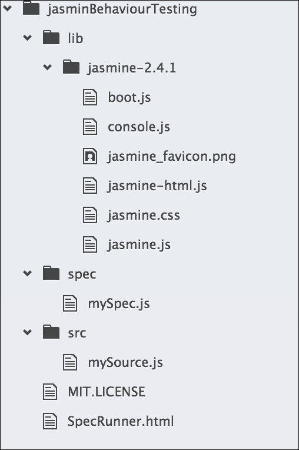
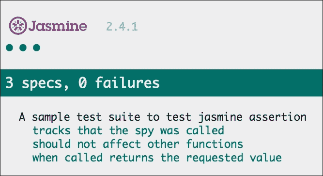
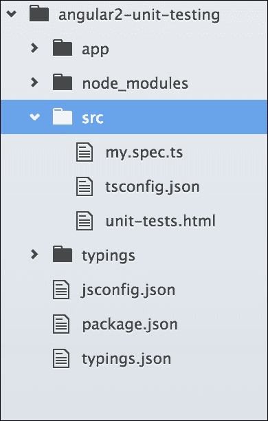
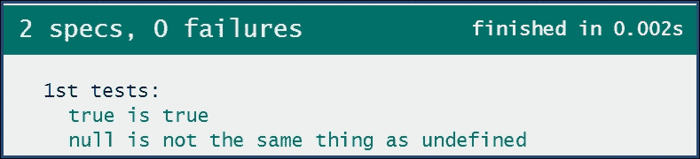

# 第二章 JavaScript 测试的细节

练习 TDD 是获得高质量软件并具有令人满意准确性的好方法，即使人数较少。对于网络应用程序，JavaScript 已经成为最受欢迎的脚本语言，测试 JavaScript 代码已成为一项挑战。基于浏览器的测试实际上是一种时间杀手，对于 TDD 来说很难跟踪，但随后这个问题的解决方案伴随着一些支持 JavaScript 自动化测试的酷工具。大多数网络应用程序项目仅限于单元测试，而没有自动化测试工具，端到端测试或功能测试几乎是不可能的。

许多专注于 JavaScript 测试的工具和框架正在出现，它们提供不同的解决方案，使开发者生活变得更轻松。除了发明新的 JavaScript 框架外，开发者社区还发明了一些工具集来简化测试。例如，Angular 团队带来了像 **Karma** 这样的酷工具。我们还有测试框架或工具的重复，其中两者都解决了类似的问题，但以不同的方式。选择哪些工具或框架取决于开发者；他们必须选择最适合他们需求的工具。

在本章中，我们将涵盖以下内容：

+   自动化测试的简要介绍

+   专注于 JavaScript 的不同类型的测试

+   一些测试工具和框架的简要介绍

# JavaScript 测试的技艺

我们都知道 JavaScript 是一种动态类型、解释型语言。因此，与类似 Java 的其他编译语言不同，它没有编译步骤来帮助你找出错误。所以，JavaScript 开发者应该分配更多的时间来测试代码。然而，现在生活变得更简单了，因为开发者可以使用最新的工具技术以最少的步骤和时间来覆盖测试。这是自动化测试的一部分，其中代码在更改时将自动进行测试。在这个过程中，测试可能是一个在后台运行的任务，它可以集成到 IDE 或 CLI 中，并在开发过程中提供测试结果。

在接下来的章节中，我们将讨论如何使用测试运行器和无头浏览器在多个浏览器中自动化测试过程。

## 自动化测试

测试很有趣，编写测试会使代码更好；这是一个好习惯，但程序化手动测试有点耗时，容易出错，且难以重现。在这个过程中，需要编写测试规范，更改代码以通过测试，刷新浏览器以获取结果，并重复这个过程几次。作为一个程序员，重复同样的事情有点无聊。

除了单调之外，它还极大地减缓了开发过程，这会降低开发者练习 TDD 的积极性。所以，当手动过程减缓进度时，我们必须寻找一些自动化过程来完成这项工作，并为其他可能增加更多商业价值的工作节省时间。

因此，拥有一些工具或技术来帮助程序员摆脱这些重复且无聊的手动步骤，从而加快流程、自动完成任务并节省时间，使他们能为业务创造更多价值，将会非常棒。幸运的是，有一些工具可以自动化这些测试。我们将详细介绍这些工具和技术，但不是在本节中。

除了减缓开发进程的问题外，当我们谈论测试功能时，还有一个重要的问题浮出水面，那就是跨浏览器兼容性问题。由于 Web 应用程序应该在现代平台和浏览器上完美运行，而手动逐个测试几乎是不可能的，因此，使用 WebDriver 和无头浏览器的自动化测试可能是解决方案。

让我们回顾一下在前一章中解释的基本测试流程——测试它，让它运行，让它变得更好。为了使这个过程自动化，开发者可以在命令行界面（CLI）或开发 IDE 中实现工具集，并且这些测试将在一个独立进程中连续运行，无需开发者任何输入。

让我们考虑一下任何应用程序的注册或注册功能，其中我们必须手动填写表单并点击提交按钮，每次我们想要测试该功能并通过更改数据重复此过程。这实际上被称为功能测试（我们将在本章末尾讨论）。为了自动执行这些过程，我们将使用 CLI 中的工具集（测试运行器、WebDriver 和无头浏览器）并通过带有一些参数的单个命令完成整个过程。

在自动化测试中测试 JavaScript 并不是一个新概念，实际上，它是最常用的自动化浏览器。Selenium 就是在 2004 年为此而发明的，此后，涌现出了许多工具，包括 PhantomJS、Karma、Protractor 和 CasperJS。在本章中，我们将讨论其中的一些。

# 测试类型

在 TDD（测试驱动开发）中，开发者必须遵循一个流程来实现测试的目标。在这个流程中，每一步都有一个单独的测试目标。例如，一些测试仅用于以多种方式测试每个函数的行为，而另一些则是为了测试模块/功能的流程。基于此，我们将在这里讨论两种主要的测试类型。它们如下：

+   **单元测试**：这主要用于行为测试。

+   **端到端测试**：这通常被称为 e2e 测试，用于功能测试。

## 单元测试

**单元测试**是一种软件开发过程，其中任何应用程序的最小可测试部分被称为单元，该小部分的行为应该在隔离状态下可测试，而不依赖于其他部分。如果我们把 JavaScript 应用程序看作是软件，那么该应用程序的每个具有特定行为的独立方法/函数都将是一个代码单元。这些方法或代码单元的行为应该以隔离的方式进行测试。

单元测试的一个重要观点是，任何代码单元都应该在隔离状态下运行/可测试，并且可以按任何顺序运行，这意味着如果单元测试在任何应用程序中成功运行，它代表了该应用程序组件或模块的隔离性。

例如，我们在上一章中已经展示了一个小的测试示例，说明了如何对方法进行测试；尽管我们没有使用任何测试框架，但理念是相同的。我们通过传递一些参数来调用该方法，获取该方法的返回结果，然后将其与预期值进行比较。

通常，我们将使用我们选择的单元测试框架来编写这样的测试。现在有许多测试框架和工具，我们必须根据我们的需求进行选择和挑选最佳的框架。最常用的框架是 Jasmine、Mocha 和 QUnit。我们将在本章深入讨论这些工具，并在后续章节中涵盖实际案例。

测试应该运行得快，并且具有清晰的输出，实现自动化。例如，你可以验证如果函数被调用时使用特定的参数，它应该返回预期的结果。

单元测试可以在任何时间运行测试，例如以下情况：

+   从开发过程的开始阶段，即使有失败的测试

+   在完成任何功能的开发后，为了验证行为是否正确

+   修改任何现有功能后，为了验证行为没有改变

+   在现有应用程序中添加新功能后，我们需要验证该新功能是隔离的，并且没有破坏其他功能

## 端到端测试

端到端测试是一种测试方法，用于测试应用程序的流程是否从开始到结束都按设计执行。例如，如果用户从产品列表中点击一个产品，应该会提示模态显示所选产品的详细信息。在这种情况下，产品/项目所有者将在规范中逐步定义项目需求。开发过程完成后，将根据规范的工作流程对项目进行测试。这被称为功能/流程测试，也是端到端测试的另一个名称。

除了单元测试之外，端到端测试对于确认各个组件作为一个应用程序协同工作、传递信息和相互通信非常重要。与单元测试的主要区别在于它不测试任何单独的组件；相反，它是对所有相关组件一起的流程的联合测试。

考虑一个注册模块，用户应提供一些有效信息以完成注册，该模块/应用程序的功能/流程测试应遵循一些步骤以完成测试。

步骤如下：

1.  加载/编译表单

1.  获取表单元素的 DOM

1.  触发提交按钮的点击事件

1.  从输入字段收集值以进行验证

1.  验证输入字段

1.  调用模拟 API 以存储数据

在每个步骤中，都会有一些结果与预期的结果集进行比较。

这类功能/流程测试可以通过人工填写表格，点击按钮进行下一步，完成应用程序流程，并将结果与在实现过程中定义的规范进行比较来手动测试。

然而，有一些技术可以实现这种功能/流程测试的自动化，而不需要任何人的输入，这被称为端到端测试。为了使测试过程更容易，有一些工具可用；最常用的有 Selenium、PhantomJS 和 Protractor。这些工具可以轻松地与任何应用程序测试系统集成。在本章中，我们将更详细地讨论这些测试工具，在随后的章节中，我们将将这些工具集成到应用程序的测试套件中。

# 测试工具和框架

了解不同的测试工具是战斗的一半。其中一些对于 Angular 测试非常重要，需要深入了解；我们将在整本书中详细学习它们。然而，在本节中，我们将了解一些在不同 Web 应用程序中用于各种测试和方法的知名工具和框架。它们如下：

+   **Karma**：这是 JavaScript 的测试运行器

+   **Protractor**：这是一个端到端测试框架

+   **Jasmine**：指的是行为驱动的 JavaScript 测试框架

+   **Mocha**：这是一个 JavaScript 测试框架

+   **QUnit**：代表单元测试框架

+   **Selenium**：这是一个自动化 Web 浏览器的工具

+   **PhantomJS**：这是一个无头 webkit 浏览器

## Karma

在讨论 Karma 是什么之前，最好先讨论它不是什么。它不是一个编写测试的框架；它是一个测试运行器。这意味着 Karma 能够以自动化的方式在多个不同的浏览器中运行测试。在过去，开发者必须执行手动步骤来完成这项工作，包括以下步骤：

+   打开浏览器

+   将浏览器指向项目 URL

+   运行测试

+   确认所有测试都已通过

+   进行更改

+   刷新页面

使用 Karma，自动化使开发者能够运行单个命令，并确定整个测试套件是否通过或失败。从 TDD 的角度来看，这使我们能够快速找到并修复失败的测试。

与手动过程相比，使用 Karma 的优点如下：

+   能够在多个浏览器和设备上自动化测试

+   能够监视文件

+   在线文档和支持

+   只做一件事——运行 JavaScript 测试——并且做得很好

+   使其易于与持续集成服务器集成

使用 Karma 的缺点：

+   需要额外的工具来学习、配置和维护

自动化测试过程和使用 Karma 非常有利。在本书的 TDD 之旅中，Karma 将是我们的主要工具之一。我们将在 第三章 中详细了解 Karma，*Karma 的方法*。

## Protractor

Protractor 是一个端到端测试工具，允许开发者模拟用户交互。它通过浏览器交互自动化测试功能和特性。Protractor 有特定的方法来协助测试 Angular，但它们并不局限于 Angular。

使用 Protractor 的优点如下：

+   可配置以测试多个环境

+   与 Angular 容易集成

+   语法和测试可以与为单元测试选择的测试框架相似

使用 Protractor 的缺点：

+   其文档和示例有限

为了测试本书中的示例的端到端测试，Protractor 将是我们的主要框架。Protractor 将在 第四章 中详细介绍，*使用 Protractor 进行端到端测试*。

## Jasmine

Jasmine 是一个用于测试 JavaScript 代码的行为驱动开发框架。它可以轻松集成并运行于网站，且对 Angular 无关。它提供了间谍和其他功能。它也可以在不使用 Karma 的情况下独立运行。在本章中，我们将学习 Jasmine 常用内置全局函数的细节，并了解 Jasmine 测试套件如何满足 Web 应用程序的测试需求。此外，在本书中，我们将使用 Jasmine 作为我们的测试框架。

使用 Jasmine 的优点如下：

+   默认与 Karma 集成

+   提供了额外的功能来协助测试，例如测试间谍、模拟和透传功能

+   清晰的语法，允许测试以与被测试行为相关的方式格式化

+   与多个输出报告器的集成

使用 Jasmine 的缺点如下：

+   运行测试时没有文件监视功能。这意味着当文件更改时，测试必须由用户重新运行。

+   对于所有 Protractor 方法和技术，学习曲线可能很陡峭。

## Mocha

Mocha 最初是为 Node.js 应用程序编写的测试框架，但也支持浏览器测试。它与 Jasmine 非常相似，并且语法上有很多相似之处。Mocha 与 Jasmine 的主要区别在于它不能作为独立的测试框架运行——它需要一些插件和库来作为测试框架运行，而 Jasmine 是独立的。它更易于配置和使用。

让我们讨论一下 Mocha 的一些优点：

+   易于安装

+   有良好的文档

+   有几个报告器

+   与多个 Node.js 项目兼容

这里有一些缺点：

+   需要单独的插件/模块来进行断言、间谍等操作

+   使用 Karma 时需要额外的配置

## QUnit

QUnit 是一个强大且易于使用的 JavaScript 单元测试套件。它被 jQuery、jQuery UI 和 jQuery Mobile 项目使用，并且能够测试任何通用的 JavaScript 代码。QUnit 专注于在浏览器中测试 JavaScript，同时尽可能为开发者提供便利。

QUnit 的一些优点：

+   易于安装

+   有良好的文档

这里是使用 QUnit 的一个缺点：

+   主要为 jQuery 开发，与其他框架使用不佳

## Selenium

Selenium ([`www.seleniumhq.org/`](http://www.seleniumhq.org/))将其自身定义为如下：

> “Selenium 自动化浏览器。仅此而已！”

浏览器自动化意味着开发者可以轻松地与浏览器交互。他们可以点击按钮或链接，输入数据等。Selenium 是一个强大的工具集，当正确使用和设置时，有很多好处；然而，设置起来可能会很复杂。

Selenium 的一些优点如下：

+   功能集庞大

+   分布式测试

+   通过**Sauce Labs**等服务提供 SaaS 支持 ([`saucelabs.com/`](https://saucelabs.com/))

+   有文档和资源

这里是 Selenium 的一些缺点：

+   必须作为一个单独的进程运行

+   配置需要几个步骤

由于 Protractor 是 Selenium 的包装器，所以不会详细讨论。

## PhantomJS

PhantomJS 是一个可使用 JavaScript API 进行脚本化的无头 WebKit。它对各种网络标准有*快速*和*原生*的支持；DOM 处理、CSS 选择器、JSON、Canvas 和 SVG。PhantomJS 用于测试工作流程。

简单来说，PhantomJS 是一个无头浏览器（也就是说，不会绘制屏幕）。它带来的好处是速度——如果你正在控制你电脑上的实际程序，启动浏览器、配置配置文件等会有一定的开销。

PhantomJS 不是用来替换测试框架的；它将与测试框架一起工作。

# 选择权在我们手中

正如我们所看到的，有很多工具集和框架用于测试 JavaScript 项目：

+   对于断言框架，我们将选择 Jasmine，因为 Angular 本身使用 Jasmine 作为断言；但在某些情况下，主要是对于 Node.js 项目，Mocha 也很受欢迎

+   只要我们专注于自动化测试套件，测试运行器对我们来说就非常重要，而且当涉及到 Angular 项目时，没有什么能比得上 Karma。

+   对于端到端测试，Protractor 是最好的框架，我们将在本章中使用它。

+   只要进行的是端到端测试，它就必须是自动化的，Selenium 就在这里为我们自动化浏览器。

+   运行测试时，重要的是要支持多浏览器，PhantomJS 就在这里为我们提供无头浏览器服务。

# 欢迎使用 Jasmine 测试套件

只要我们需要使用测试框架来构建测试套件，所有框架上都有一些基本的常见断言。理解这些断言和间谍以及何时使用它们是很重要的。

在本节中，我们将解释 Jasmine 的断言和间谍，因为 Jasmine 将作为本书中的测试框架。

## 套件

任何测试套件都以一个全局 Jasmine `describe` 函数开始，该函数接收两个参数。第一个参数是一个字符串，第二个参数是一个函数。这个字符串是套件名称/标题，而函数是将在套件中实现的代码块。

考虑以下示例：

```js
describe("A sample test suite to test jasmine assertion", function() {  
   // .. implemented code block 
}); 

```

## Spec

任何使用 Jasmine 的全局 `it` 函数定义的 spec，类似于接收两个参数的 suite，都涉及第一个参数是一个字符串，第二个参数是一个函数。这个字符串是 spec 名称/标题，而函数是将在 spec 中实现的代码块。看看以下示例：

```js
describe("A sample test suite to test jasmine assertion", function() { 
    var a; 
    it("Title for a spec", function() { 
        // .. implemented code block 
    }); 
}); 

```

## 期望

任何使用 `expect` 函数定义的期望，该函数接收一个名为实际值的参数。这个函数是一个与匹配函数链式调用的函数，它将期望值作为参数与实际值进行匹配。

有一些常用的匹配器；它们都实现了实际值和期望值之间的布尔比较。任何匹配器都可以通过将 `expect` 方法与 `not` 关键字链式调用来评估负值。

一些常见的匹配器有 `toBe`、`toEqual`、`toMatch`、`toBeNull`、`toBeDefined`、`toBeUndefined` 和 `toContain`。

考虑以下示例：

```js
describe("A sample test suite to test jasmine assertion", function() {  
    var a, b; 
    it("Title for a spec", function() { 
        var a = true; 
        expect(a).toBe(true); 
        expect(b).not.toBe(true); 
    }); 
}); 

```

## 设置和清理

为了通过 DRY（不要重复自己）原则减少重复的设置和清理代码，Jasmine 提供了一些全局函数用于设置和清理。这些全局函数（`beforeEach`、`afterEach` 等）如下，它们按名称运行。

每个函数都会与一个测试 spec 运行。Jasmine 的全局设置和清理函数是 `beforeEach`、`afterEach`、`beforeAll` 和 `afterAll`。

考虑以下示例：

```js
describe("A sample test suite to test jasmine assertion", function() { 
    var a=0;    
    beforeEach(function() { 
        a +=1; 
    }); 
    afterEach(function() { 
        a =0; 
    }); 
    it("Title for a spec 1", function() { 
        expect(a).toEqual(1); 
    }); 
    it("Title for a spec 2", function() { 
        expect(a).toEqual(1); 
        expect(a).not.toEqual(0); 
    }); 
}); 

```

## 间谍

间谍是 Jasmine 中的测试双函数；它们可以模拟任何函数并跟踪对其及其所有参数的调用。有一些匹配器可以用来跟踪是否有任何间谍被调用。这些是 `toHaveBeenCalled`、`toHaveBeenCalledTimes` 等。

有一些与 spy 一起使用的有用链式方法，例如 `returnValue`/ `returnValues`，当通过 spy 链式调用时，将返回一个或多个值。还有一些类似的有用方法，例如 `callThrough`、`call`、`stub`、`call.allArgs`、`call.first` 和 `call.reset`。

考虑以下示例：

```js
describe("A sample test suite to test jasmine assertion", function() { 
    var myObj, a, fetchA; 
    beforeEach(function() { 
        myObj = { 
            setA: function(value) { 
                a = value; 
            }, 
            getA: function(value) { 
                return a; 
            }, 
        }; 
        spyOn(myObj, "getA").and.returnValue(789); 
        myObj.setA(123); 
        fetchA = myObj.getA(); 
    }); 

    it("tracks that the spy was called", function() { 
         expect(myObj.getA).toHaveBeenCalled(); 
    }); 
    it("should not affect other functions", function() { 
        expect(a).toEqual(123); 
    }); 
    it("when called returns the requested value", function() { 
        expect(fetchA).toEqual(789); 
    }); 
}); 

```

## Jasmine 的测试套件

在前面的章节中，我们查看了一些在所有测试框架中，包括 Jasmine，在任意类型的测试套件中常用的断言。

尽管在这本书中，我们将为 Angular 测试构建一个自动化测试套件，但让我们尝试在 Jasmine 测试套件中进行一些断言，看看它是如何工作的。这个示例测试套件将让我们亲身体验到断言在测试套件中的工作方式。

对于这个测试套件，我们将使用 Jasmine 的示例 spec 运行器项目（在示例中，它包含在下载的 Jasmine 包中），项目的文件夹结构将如下所示：



让我们快速查看在 Jasmine 的示例 `SpecRunner` 项目中需要更新的文件：

```js
SpecRunner.html: 
<!DOCTYPE HTML> 
<html> 
<head> 
    <meta http-equiv="Content-Type" content="text/html; charset=UTF-8"> 
    <title>Jasmine Spec Runner v2.4.1</title> 
    <link rel="shortcut icon" type="image/png" href="lib/jasmine-2.4.1/jasmine_favicon.jpg"> 
    <link rel="stylesheet" type="text/css" href="lib/jasmine-2.4.1/jasmine.css"> 

    <script type="text/javascript" src="img/jasmine.js"></script> 
    <script type="text/javascript" src="img/jasmine-html.js"></script> 
    <script type="text/javascript" src="img/boot.js"></script> 
    <!-- include source files here... --> 
    <script type="text/javascript" src="img/mySource.js"></script> 
    <!-- include spec files here... --> 
    <script type="text/javascript" src="img/mySpec.js"></script> 
</head> 
<body> 
</body> 
</html> 

src/mySource.js: 
var a, 
myObj = { 
    setA: function(value) { 
        a = value; 
    }, 
    getA: function(value) { 
        return a; 
    }, 
}; 

Spec/mySpec.js: 
describe("A sample test suite to test jasmine assertion", function() { 
    var fetchA; 
    beforeEach(function() { 
        spyOn(myObj, "getA").and.returnValue(789); 
        myObj.setA(123); 
        fetchA = myObj.getA(); 
    }); 

    it("tracks that the spy was called", function() { 
         expect(myObj.getA).toHaveBeenCalled(); 
    }); 
    it("should not affect other functions", function() { 
        expect(a).toEqual(123); 
    }); 
    it("when called returns the requested value", function() { 
        expect(fetchA).toEqual(789); 
    }); 
}); 

```

只要是一个基于浏览器的测试套件，我们就必须将 `SpecRunner.html` 指向一个网络浏览器以获取测试结果。我们将所有测试通过，我们的测试结果将如图所示：



# Angular 的 Jasmine 测试套件

在前面的示例中，我们看到了用于 JavaScript 测试的 Jasmine 测试套件，但对于 Angular 呢？它应该是什么样子？实际上，没有直接的答案，因为对于 Angular 项目的测试套件，我们不会使用基于浏览器的测试套件；我们有一个带有 Karma 的测试运行器用于测试套件。但因为我们熟悉前面示例中的基于浏览器的 Jasmine 测试套件，让我们看看如果为 Angular 项目创建一个类似的套件，它将是什么样子。

我们需要在 Angular 项目的 `src` 子文件夹中添加一个子文件夹，然后项目的文件夹结构将如下所示：



### 注意

在 Angular 项目中，我们将使用 TypeScript 而不是纯 JavaScript，因为 Angular 官方建议使用 TypeScript。因此，我们希望我们都了解 TypeScript 语法，并知道如何编译成 JS。

在这本书中，对于 Angular 测试套件，我们将使用 SystemJS 作为模块加载器，因为 Angular 官方建议这样做；我们将看看 SystemJS。

这个示例 Angular 测试套件只是为了展示我们如何轻松地为 Angular 项目创建测试套件，尽管它并不遵循最佳实践和加载模块的最佳方式。

在第三章《Karma 方式》中，我们将使用真实世界的示例更新这个测试套件，并使用 SystemJS 作为模块加载器。

在 GitHub 上，Angular 团队有一个名为`Angular2-seed`的种子项目，用于启动任何带有测试套件的 Angular 项目；我们将遵循这个项目来构建我们的真实 Angular 项目。

如果我们查看文件夹结构，它与上一个版本几乎相同，spec 文件中的更改也最小；spec 文件中唯一的更改是与 TypeScript 相关的：

```js
src/unit-tests.html: 

<!DOCTYPE html> 
<html> 
<head> 
    <meta http-equiv="content-type" content="text/html;charset=utf-8"> 
    <title>NG2 App Unit Tests</title> 
    <link rel="stylesheet" href="node_modules/jasmine-core/lib/jasmine-core/jasmine.css"> 
    <script src="img/jasmine.js"></script> 
    <script src="img/jasmine-html.js"></script> 
    <script src="img/boot.js"></script> 
    <script src="img/mysource.js"></script> 
    <script src="img/my.spec.js"></script> 

</head> 
<body> 
</body> 
</html> 

app/mysource.ts: 
export class Source { 
    // ...  
} 

src/my.spec.ts: 
describe('1st tests', () => { 
    it('true is true', () => expect(true).toEqual(true)); 

    it('null is not the same thing as undefined', 
        () => expect(null).not.toEqual(undefined) 
    ); 
}); 

```

由于这也是一个基于浏览器的测试套件，我们必须在网页浏览器中指向`unit-tests.html`以获取测试结果。我们将通过所有测试，并且我们的测试结果将看起来像这样：



# 自我测试题

自我测试题将帮助你进一步测试使用 TDD 进行 JavaScript 应用程序测试的知识。

Q1. 端到端测试意味着什么类型的测试？

+   功能测试

+   行为测试

Q2. Protractor 是一个单元测试框架。

+   真的

+   假的

Q3. PhantomJS 是一种浏览器类型。

+   真的

+   假的

Q4. QUnit 是一个测试框架用于什么？

+   jQuery

+   Angular

+   NodeJS

Q5. 设置和清理是 Jasmine 的一个特性。

+   真的

+   假的

# 摘要

在本章中，我们回顾了 TDD 的不同测试机制，并涵盖了自动化测试。我们回顾了不同种类的 JavaScript 测试框架和工具，并回顾了这些框架的使用及其优缺点。我们还回顾了一些 Jasmine 的常见断言，并亲自动手尝试了它们的工作方式。

在下一章中，我们将学习 Karma，并了解它是如何与 Angular 测试套件一起工作的。
